这篇是整套课程的"地图"：先讲清楚**为什么这门课叫 JavaWeb+AI**（AI 把哪几件事的效率拉开了），再讲**什么是 Web**、一个 Web 系统由哪三部分组成，最后是**6 大部分课程安排**、每部分对应哪个 AI 切入点，以及学完能拿到什么。

## AI 时代的开发方式

课程开篇给的四句话，说的是 AI 已经切进了开发的每一个环节：

| 环节 | AI 时代怎么做 |
| --- | --- |
| 编写代码 | 基础代码 **AI 辅助编写**，效率高，写的多 |
| 问题解决 | 基于 AI 解决复杂业务问题，**优化程序、修复 Bug** |
| 新技术学习 | 根据具体的需要结合着 AI，**快速上手新技术** |
| 分析设计 | 基于 AI **设计数据库及业务方案**，简单快捷 |

> [!NOTE]
> PPT 上有一页新闻截图做例证：阿里云给通义灵码分配了正式员工工号 **AI001**，在内部全面推行 AI 编程，用通义灵码辅助写代码、读代码、查 Bug、优化代码；官方口径是"公司未来 20% 的代码将由通义灵码编写，但程序员仍然是研发的核心"，并且通义灵码已集成到 IDEA、VS Code 这些开发工具中。

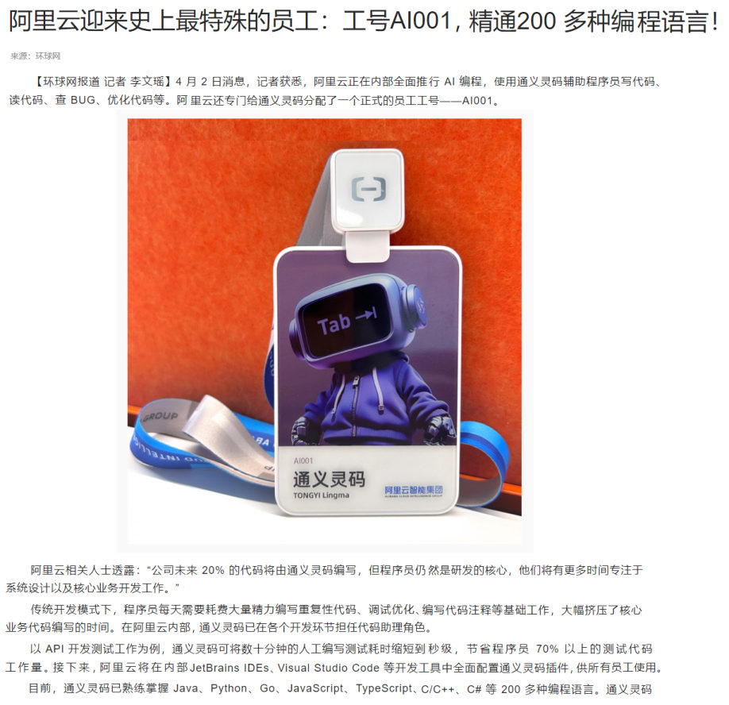
*图：课程用这则新闻说明"AI 编程已经是企业里的日常"——通义灵码被分配工号 AI001，在 IDEA、VS Code 等工具里辅助写代码、查 Bug、优化代码*

### 传统 Java 课 vs Java+AI 课：四项能力对照

PPT 用一张表对比了两种课程练出来的能力（这一页在课上是一行一行展开的）：

| 能力维度 | 传统 Java 课程 | Java+AI 课程 |
| --- | --- | --- |
| 编码能力 | 手动编码能力较强（**效率低**） | 手动编码能力较强（**效率高**） |
| 问题解决 | 百度、问别人（**弱**） | **AI**（强） |
| 新技术学习应用 | 官网、百度（**慢、效率低**） | **效率高、准确度高** |
| 业务分析设计 | **无途径**（较弱） | **较强** |

> [!IMPORTANT]
> 注意两边的第一列都是"**手动编码能力较强**"——AI 课程**不是**不练基本功，而是基本功照练，只是把效率、问题解决、新技术学习、业务分析设计这四件事交给 AI 一起做。PPT 另外两句话把方向说得很直白："**自身能力大幅提升**""**软件变得更智能**"。

## 什么是 Web

**Web：全球广域网，也称为万维网（www，World Wide Web），能够通过浏览器访问的网站。**

我们平时打开的网站就是 Web——淘宝、京东、唯品会这类电商页面，以及企业里各种管理系统，都算：

*图：电商网站（淘宝）——首页上的分类、轮播、商品卡片、登录入口，都是"前端程序"展示出来的界面*

*图：电商网站（京东）——课上直接拿 `https://www.jd.com` 举例，它就是通过浏览器访问的 Web 网站*

*图：电商网站（唯品会）——同一个"Web"的另一种页面风格*

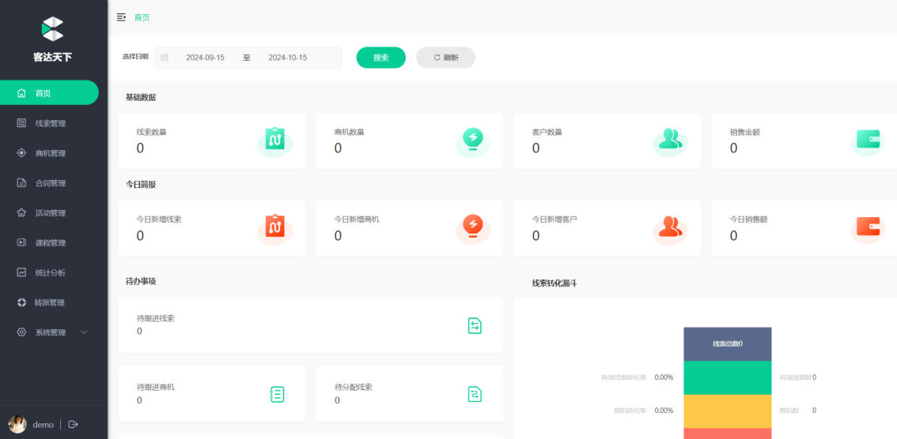
*图：企业管理系统（客达天下）——后台类网站的典型长相：左侧菜单 + 顶部筛选 + 数据卡片*

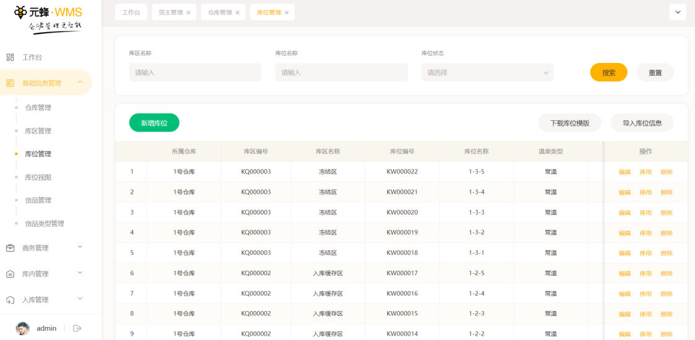
*图：仓储管理系统（元坤 WMS）——带搜索表单、批量操作按钮、分页表格，这门课后半段做的项目就是这类界面*

## 一个 Web 系统的三部分

PPT 把 `https://www.jd.com` 拆成三层来讲：

| 部分 | 干什么 |
| --- | --- |
| 前端程序 | **界面展示** |
| 服务端程序 | **业务逻辑处理** |
| 数据库 | **数据存储和管理** |

- 你在浏览器里看到的一切（商品图、价格、按钮）是**前端程序**画出来的；
- 点"加入购物车""提交订单"之后要先经过**服务端程序**，由它做校验、算价格、写订单；
- 商品、用户、订单这些数据最终落在**数据库**里。

> [!TIP]
> 这门课的 6 大部分正好是按这三层铺开的：**前端**（HTML/CSS/JS/Vue）→ **服务端**（Maven/HTTP/SpringBoot/MyBatis）→ **数据库**（MySQL）→ 最后把三层合起来**部署**上线。

## 课程安排：6 大部分与各自的 AI 切入点

PPT 的这一页把课程分成 6 个 part，每个 part 都配了一个 AI 切入点（下面这张表按 PPT 上的编号顺序整理）：

| part | 天数 | 学什么 | AI 切入点 |
| --- | --- | --- | --- |
| part1 前端 Web 基础 | 2 天 | HTML、CSS、JS、Ajax/Axios、Vue3 | **AI 辅助设计页面** |
| part2 后端 Web 基础 | 4 天 | Maven、HTTP、IOC、DI、MySQL、JDBC、MyBatis | **AI 辅助编码、单元测试** |
| part3 后端 Web 实战 | 6 天 | 部门管理、员工管理、班级管理、学员管理、报表统计、登录认证… | **AI 辅助编码、程序优化、Bug 修复** |
| part4 后端 Web 进阶 | 2 天 | AOP、SpringBoot 原理、自定义 Starter、Maven 高级 | **AI 辅助解释代码** |
| part5 前端 Web 实战 | 4 天 | Vue 工程化、ElementPlus、Tlias 案例 | **AI 辅助前端开发** |
| part6 部署 | 2 天 | Linux、Docker | **AI 编写部署脚本** |

> [!TIP]
> 记住这个顺序：**先前端（看得见）→ 再后端（干活的）→ 再实战串起来 → 再进阶原理 → 再前端实战做完整项目 → 最后部署上线**。本课程笔记的编号也是按这个顺序往后排的。

## 课程特色

PPT 用 4 个关键词总结课程的设计：

1. **项目驱动式教学**：以实战项目贯穿整套课程体系，项目含量占比达 **80%**，即学即用，在实战中掌握 Web 开发核心技术。
2. **打造全链路精英**：基于 **SpringBoot3 + Vue3** 最新技术栈实战开发，全方位覆盖项目开发的 **6 大环节**——需求分析、设计、前后端开发、联调测试、最终部署。
3. **AI 赋能高效开发**：整个课程阶段，从设计、编码、测试到 Bug 修复、程序优化全面拥抱 AI。
4. **企业级开发规范**：基于当前主流的**前后端分离**开发模式，从需求分析 → 表结构设计 → 接口文档（**30+** 个）→ 功能实现 → 测试联调 → 部署，全方位模拟真实企业开发。

这 4 条在 PPT 上各自配了截图，正好代表项目里的几个阶段：

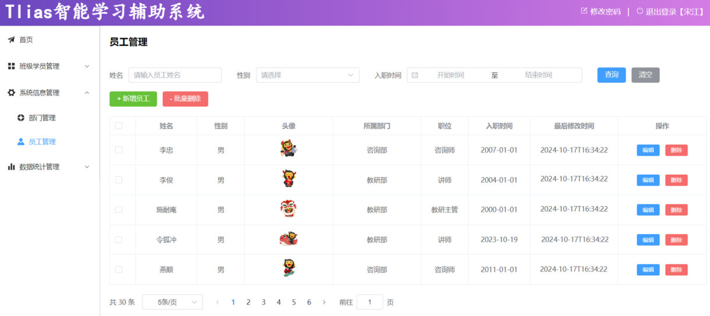
*图：贯穿课程的实战项目 Tlias 智能学习辅助系统——员工管理页面（项目驱动式教学的主案例）*

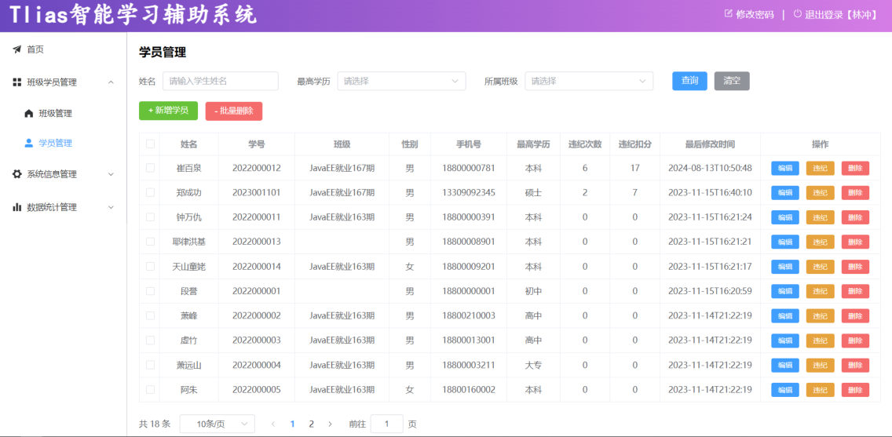
*图：Tlias 的学员管理页面——同样的"搜索表单 + 批量按钮 + 分页表格"结构，换成另一张业务表*

*图：Tlias 的数据统计页（员工职位统计柱状图、员工性别统计环形图）——报表统计也是后端的实战内容*

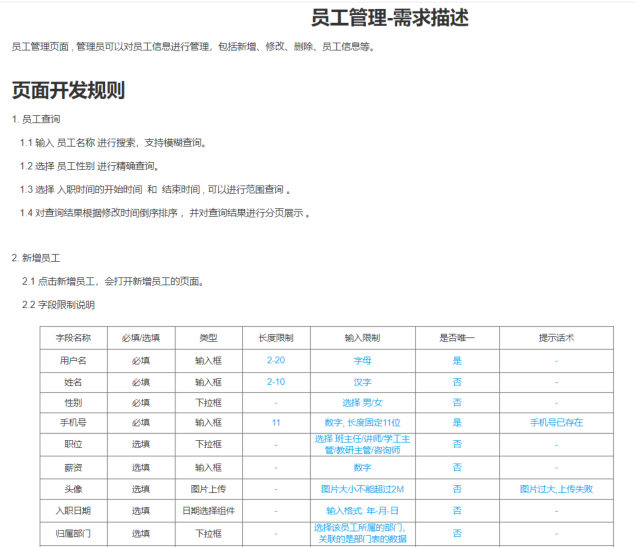
*图：企业级开发规范里的第一环——"员工管理-需求描述"，连字段名、必填、类型、长度限制、输入限制都写清楚（这是写代码之前的依据）*

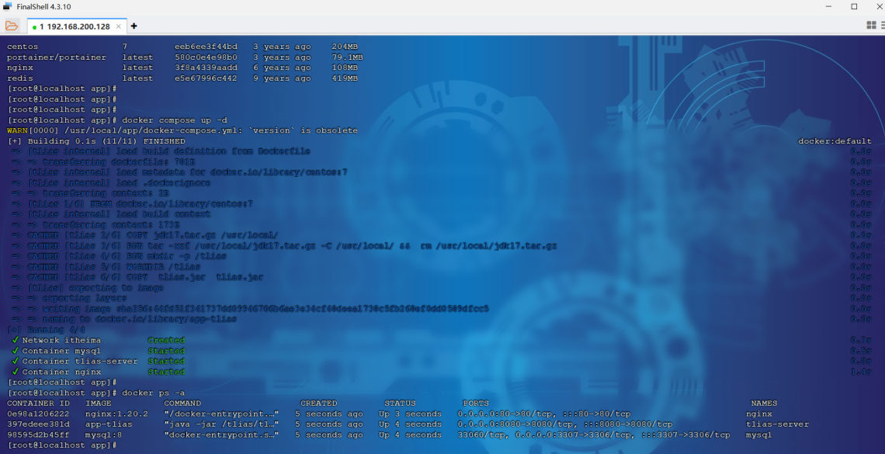
*图：最后的部署环节——在服务器上用 docker compose 构建镜像、起 mysql / tlias-server / nginx 三个容器*

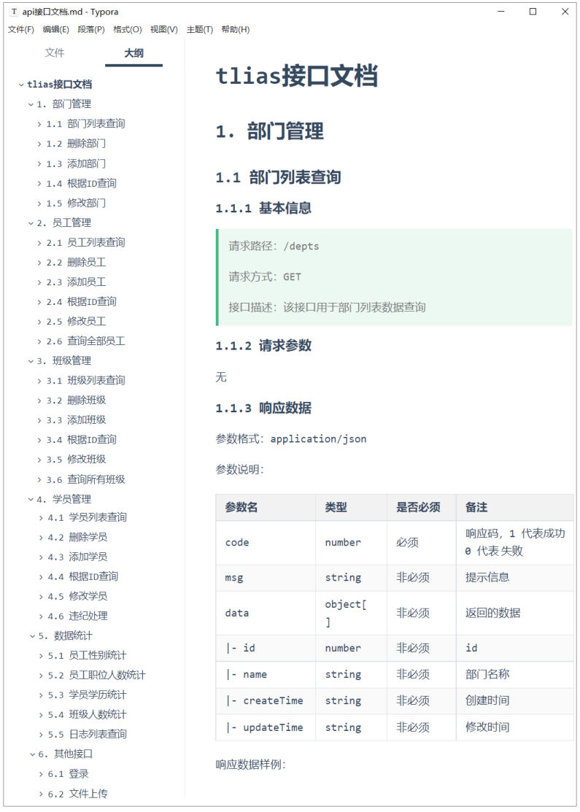
*图：前后端分离开发的核心产物——接口文档（请求路径、请求方式、响应数据的 code/msg/data 结构），课程里会写 30+ 个这样的接口*

## 课程收获

学完这门课，四个方向的能力都会有（PPT 的四条 + 一句总括）：

| 收获 | 说明 |
| --- | --- |
| 前端项目开发能力 | 会写页面、会用 Vue3 做前端工程 |
| 服务端接口开发能力 | 会用 SpringBoot 写接口给前端调用 |
| 数据库设计、应用能力 | 会设计表结构、会用 MySQL 存取数据 |
| 前后端项目部署能力 | 会用 Linux + Docker 把项目部署上线 |

总括一句：**具备基于 SpringBoot3 + Vue3 设计、开发、部署单体项目的能力**——直接对得上三个用途：**毕业设计、找实习、开发项目**。

PPT 上展示的项目形态是这样的：

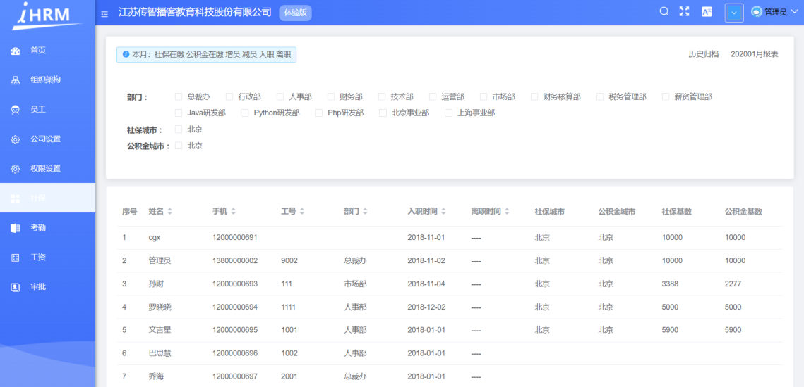
*图：企业后台系统（iHRM 人力资源管理系统）——表格 + 部门筛选 + 权限菜单*

*图：电商网站（畅购商城）——首页导航、分类、轮播、商品楼层*

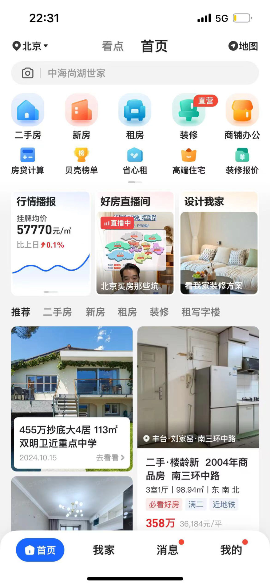
*图：移动端页面（贝壳找房 App 首页）——同一套前端技术也能做移动端页面*

## 答疑途径

PPT 的"答疑途径"一页放的就是课程群/评论区的实际提问与回复：

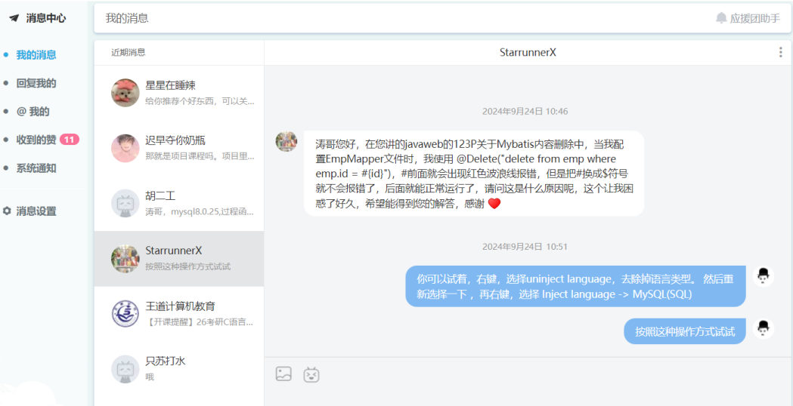
*图：课上举的答疑例子——学员私信问"MyBatis 里 `@Delete` 注解的 `#{id}` 报红线"，回复是"右键 → Uninject language，去掉语言注入后重新选择"*

> [!TIP]
> 学习建议就藏在整篇导学里：**基础代码自己写、卡住的知识点让 AI 解释、重复代码交给 AI 生成、真实项目按"需求 → 表结构 → 接口 → 代码 → 测试 → 部署"的顺序做完**。这也是后面每一篇笔记都在用的节奏。

## 小结（导学回顾）

| 问题 | 答案 |
| --- | --- |
| 什么是 Web？ | 全球广域网，也称万维网（www，World Wide Web），**能够通过浏览器访问的网站** |
| 一个网站由哪几部分组成？ | **前端程序**（界面展示）、**服务端程序**（业务逻辑处理）、**数据库**（数据存储和管理） |
| Java+AI 课程比传统 Java 课强在哪？ | 编码效率、问题解决（用 AI）、新技术学习应用、业务分析设计四项 |
| 课程一共几部分？各几天？ | 6 部分：前端基础 2 天 + 后端基础 4 天 + 后端实战 6 天 + 后端进阶 2 天 + 前端实战 4 天 + 部署 2 天 |
| 项目占课程多少比重？ | 80%（项目驱动式教学） |
| 学完能做什么？ | 基于 SpringBoot3 + Vue3 **设计、开发、部署单体项目**；写毕业设计、找实习、做项目 |

## 相关

- [Web前端初识](/posts/编程学习/javaweb学习笔记/02-web前端初识/)

## 练习题

### 一、知识回顾（读完直接做下面的实践题）

1. Web 的定义：**全球广域网**，也称为**万维网**（www，World Wide Web），指**能够通过浏览器访问的网站**
2. AI 时代的开发方式体现在四个环节：**编写代码**（基础代码 AI 辅助编写，效率高）、**问题解决**（解决复杂业务、优化程序、修复 Bug）、**新技术学习**（结合 AI 快速上手）、**分析设计**（设计数据库及业务方案）
3. 传统 Java 课与 Java+AI 课的四项能力对照：编码能力上两边都是"**手动编码能力较强**"，差别在**效率**（传统低 / AI 课高）；问题解决（百度问人 vs **AI**）、新技术学习应用（官网百度 vs **效率高、准确度高**）、业务分析设计（**无途径** vs **较强**）
4. 一个 Web 系统由三部分组成：**前端程序**负责**界面展示**、**服务端程序**负责**业务逻辑处理**、**数据库**负责**数据存储和管理**
5. 课程分 6 个 part：part1 **前端 Web 基础（2 天）**、part2 **后端 Web 基础（4 天）**、part3 **后端 Web 实战（6 天）**、part4 **后端 Web 进阶（2 天）**、part5 **前端 Web 实战（4 天）**、part6 **部署（2 天）**
6. part1 学 **HTML、CSS、JS、Ajax/Axios、Vue3**，AI 切入点是 **AI 辅助设计页面**；part2 学 **Maven、HTTP、IOC、DI、MySQL、JDBC、MyBatis**，AI 切入点是 **AI 辅助编码、单元测试**
7. part3 做**部门管理、员工管理、班级管理、学员管理、报表统计、登录认证**，AI 切入点 **AI 辅助编码、程序优化、Bug 修复**；part4 学 **AOP、SpringBoot 原理、自定义 Starter、Maven 高级**，AI 切入点 **AI 辅助解释代码**
8. part5 学 **Vue 工程化、ElementPlus、Tlias 案例**，AI 切入点 **AI 辅助前端开发**；part6 学 **Linux、Docker**，AI 切入点 **AI 编写部署脚本**
9. 课程特色四条：**项目驱动式教学**（项目占比 **80%**）、**打造全链路精英**（SpringBoot3+Vue3，覆盖项目开发 **6 大环节**）、**AI 赋能高效开发**、**企业级开发规范**（需求分析 → 表结构设计 → 接口文档 **30+** → 功能实现 → 测试联调 → 部署）
10. 课程收获四项能力：**前端项目开发能力**、**服务端接口开发能力**、**数据库设计应用能力**、**前后端项目部署能力**；总目标是具备基于 **SpringBoot3 + Vue3** 设计、开发、部署**单体项目**的能力，可直接用于**毕业设计、找实习、开发项目**

### 二、概念自测

- [ ] **2-1 用一句话解释"什么是 Web"**
  要求：说出它的两个别称（全球广域网 / 万维网）+ 判断标准。

  > [!TIP]- 提示（先自己想，实在想不出再点开）
  > **一级 · 思路**：定义里最关键的是"用什么访问"
  > **二级 · 角度**：它是不是一个网站？访问它的工具是什么？
  > **三级 · 骨架**：Web 是 ______，也称为 ______，是能够通过 ______ 访问的网站。

  > [!TIP]- 参考答案（做完再点开）
  > **2-1** Web 是全球广域网，也称万维网（www，World Wide Web），指**能够通过浏览器访问的网站**。判断标准就是"能不能用浏览器打开"。

- [ ] **2-2 同一个网站（比如 jd.com）由哪三部分组成？各负责什么？**
  要求：说出三部分的名字和职责，并各举一个"如果没有它会怎样"。

  > [!TIP]- 提示（先自己想，实在想不出再点开）
  > **一级 · 思路**：从"用户看到什么、谁来算业务、谁来存数据"这三个角度各想一层

  > [!TIP]- 参考答案（做完再点开）
  > **2-2** 三部分是**前端程序**（界面展示）、**服务端程序**（业务逻辑处理）、**数据库**（数据存储和管理）。没有前端程序就看不到页面；没有服务端程序，点"提交订单"没人处理业务规则；没有数据库，商品和订单无处存放、刷新就没了。

- [ ] **2-3 判断题：Java+AI 课程里"手动编码能力变弱了，靠 AI 就行"——对吗？为什么？**
  要求：先判断对错，再用 PPT 里的一句原话反驳或支持它。

  > [!TIP]- 提示（先自己想，实在想不出再点开）
  > **一级 · 思路**：回到 PPT 里"传统 Java 课 vs Java+AI 课"的那张对照表，先看"编码能力"这一栏写的是什么

  > [!TIP]- 参考答案（做完再点开）
  > **2-3** 错。对照表里传统课程和 Java+AI 课程的"编码能力"这一栏写的都是"**手动编码能力较强**"，区别只在括号里的**效率**（传统效率低、AI 课效率高）。AI 是帮你在**问题解决、新技术学习、业务分析设计**这几栏拉开差距，不是替你跳过基本功。

- [ ] **2-4 按顺序说出这门课 6 个 part 的名字，并说出 part1 和 part6 各自的 AI 切入点**
  要求：顺序不能乱；AI 切入点用"AI 辅助 XX"的说法。

  > [!TIP]- 提示（先自己想，实在想不出再点开）
  > **一级 · 思路**：按课程讲的先后顺序数一遍（基础 → 实战 → 进阶 → 部署），注意别漏掉最后两个 part

  > [!TIP]- 参考答案（做完再点开）
  > **2-4** 顺序是：**前端 Web 基础（2 天）→ 后端 Web 基础（4 天）→ 后端 Web 实战（6 天）→ 后端 Web 进阶（2 天）→ 前端 Web 实战（4 天）→ 部署（2 天）**。part1 的 AI 切入点是"**AI 辅助设计页面**"，part6 的 AI 切入点是"**AI 编写部署脚本**"。
