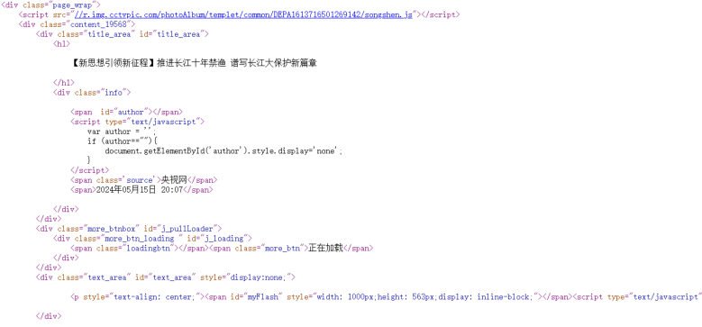

上一篇讲的是"Web 是什么"，这篇往下钻一层：**我们看到的网页由哪几部分组成、背后的本质是什么、前端代码怎么变成用户眼中的网页**，然后把前端的三门语言（HTML/CSS/JS）各自的职责分清楚。

## 网页由哪几部分组成

先回答 PPT 上的第一个问题——**网页由哪几部分组成？**

答案：**文字、图片、视频、音频、超链接**…… 这些就是页面上能被看到、能被点的东西。

再回答第二个问题——**我们看到的网页，背后本质是什么？**

本质是**程序员写的前端代码**（一堆纯文本的标签和文字），浏览器把它"翻译"成你看到的页面：

*图：网页背后的本质——这就是页面背后的 HTML 源码（可以看到 `<h1>` 标题、`
`、`` 这类标签，页面上的每段文字都对应其中一段代码）*

## 前端代码怎么变成用户眼中的网页

第三个问题：**前端代码如何转换成用户眼中的网页？**

- 程序员写的是**前端代码**；
- 通过**浏览器**把代码转换成用户看到的网页；
- 浏览器里**对代码进行解析渲染**的部分，称为**浏览器内核**。

> [!IMPORTANT]
> **不同浏览器，内核不同**，对同一份前端代码解析的效果**可能会存在差异**。这就是"前端要做浏览器兼容"这件事的根源——同一份代码在 Chrome 和 Safari 里可能长得不完全一样。

> [!NOTE]
> PPT 上没展开写具体的内核对应关系，这里补一句常识方便理解：Chrome、新版 Edge 用 **Blink**，Safari 用 **WebKit**，Firefox 用 **Gecko**，老 IE 用 **Trident**。记住规律就行——**内核决定解析渲染的结果**，写页面时尽量按标准写，别依赖某个浏览器独有的行为。

## Web 标准：三件套各管什么

**Web 标准**也称**网页标准**，由一系列的标准组成，大部分由 **W3C**（World Wide Web Consortium，**万维网联盟**）负责制定。它有三个组成部分：

| 部分 | 负责 | 管的范围 |
| --- | --- | --- |
| **HTML** | 网页的**结构** | 页面元素和内容 |
| **CSS** | 网页的**表现** | 页面元素的外观、位置等页面样式（如颜色、大小） |
| **JavaScript** | 网页的**行为** | 交互效果 |

> [!TIP]
> 一个经典的类比：HTML 是**毛坯房**（墙和房间＝结构），CSS 是**装修**（刷漆、摆放家具＝表现），JavaScript 是**电器**（灯开关、门铃＝行为）。房子没装修也能住，但不好看；没有电器，灯就不会亮——三者缺一不可，但职责绝不重叠。

## 前端课程安排

前端这块在整门课里拆成两段（对应课程导学里的 part1 和 part5）：

| 阶段 | 学什么 | 天数 |
| --- | --- | --- |
| **Web 前端基础** | HTML + CSS + JS，Vue3 + Ajax | 2 天 |
| **Web 前端实战** | Vue 工程化 + ElementPlus + Vue3 案例（Tlias 案例） | 4 天 |

也就是说：**基础阶段**把 HTML/CSS/JS 和 Vue3 的基本用法过一遍，**实战阶段**再用工程化的方式（Vue 脚手架 + ElementPlus 组件库）做一个完整的前端项目，最后和后端接口对接。

> [!NOTE]
> PPT 里这张课程地图上，"Vue 工程化 + ElementPlus + Vue3 案例"这一框出现过 **3 天**和 **4 天**两种写法（同一页动画的两个状态）。以课程导学和后一页为准：**4 天**。

## 小结（前端初识回顾）

PPT 的这一节最后用一页问答做了收尾，三个问题连起来就是这一节的主线：

| 问题 | 答案 |
| --- | --- |
| 我们看到的网页由什么组成？ | **文字、图片、视频、音频、超链接**等 |
| 看到的网页背后本质是什么？ | **程序员写的前端代码**，由浏览器解析渲染出来 |
| 前端代码如何转换成用户眼中的网页？ | 浏览器对代码进行**解析渲染**，负责这部分工作的叫**浏览器内核**（不同浏览器内核不同，效果可能有差异） |
| 一个网页由哪几个部分组成？各自的职责？ | **HTML** 负责网页的**结构**；**CSS** 负责网页的**表现**；**JavaScript** 负责网页的**行为**（动作） |

## 相关

- [JavaWeb课程导学](/posts/编程学习/javaweb学习笔记/01-javaweb课程导学/)
- [HTML快速入门](/posts/编程学习/javaweb学习笔记/03-html快速入门/)

## 练习题

### 一、知识回顾（读完直接做下面的实践题）

1. 网页由 **文字、图片、视频、音频、超链接** 等部分组成；网页背后的本质是**程序员写的前端代码**
2. 前端代码通过**浏览器**转换成用户看到的网页；浏览器里对代码进行**解析渲染**的部分称为**浏览器内核**
3. **不同浏览器内核不同**，对相同的前端代码**解析的效果可能会存在差异**
4. **Web 标准**（网页标准）由一系列标准组成，大部分由 **W3C**（World Wide Web Consortium，**万维网联盟**）负责制定
5. Web 标准的三个组成部分及其职责：**HTML** 负责网页的**结构**（页面元素和内容）、**CSS** 负责网页的**表现**（外观、位置等样式，如颜色、大小）、**JavaScript** 负责网页的**行为**（交互效果）
6. 前端课程分两段：**Web 前端基础**（HTML + CSS + JS，Vue3 + Ajax，**2 天**）和 **Web 前端实战**（Vue 工程化 + ElementPlus + Vue3 案例，**4 天**）
7. 记忆类比：HTML＝**毛坯房**（结构）、CSS＝**装修**（表现）、JavaScript＝**电器**（行为）
8. 浏览器兼容问题的根源是**内核不同**：Chrome/新版 Edge 用 **Blink**、Safari 用 **WebKit**、Firefox 用 **Gecko**（PPT 未展开，属补充常识）

### 二、概念自测

- [ ] **2-1 一个网页由哪几个部分组成？各自的职责是什么？**
  要求：三部分都要说出"名字 + 一句话职责"，不要只说缩写。

  > [!TIP]- 提示（先自己想，实在想不出再点开）
  > **一级 · 思路**：想想"结构、表现、行为"这六个字分别对哪门语言
  > **二级 · 角度**：内容归谁管？颜色大小位置归谁管？点击后的反应归谁管？

  > [!TIP]- 参考答案（做完再点开）
  > **2-1** 三部分：**HTML** 负责网页的结构（页面元素和内容）；**CSS** 负责网页的表现（元素的外观、位置等样式，如颜色、大小）；**JavaScript** 负责网页的行为（交互效果）。

- [ ] **2-2 同样一段 HTML，在 Chrome 和 Safari 里看起来不太一样，可能是哪一环出了问题？**
  要求：用"内核"这个词解释，并说出为什么这是前端必须考虑的事。

  > [!TIP]- 提示（先自己想，实在想不出再点开）
  > **一级 · 思路**：你写的前端代码是交给谁"翻译"的？不同的翻译者，结果会一样吗

  > [!TIP]- 参考答案（做完再点开）
  > **2-2** 出在**浏览器内核**上：浏览器对代码进行**解析渲染**的部分叫内核，**不同浏览器的内核不同**，所以同一份前端代码的解析效果可能存在差异。写页面时按 **Web 标准**来写、别依赖某个浏览器的私有行为，才能让页面在各浏览器里都正常。

- [ ] **2-3 判断并说明理由：只要 HTML 写得漂亮，页面就好看、也点得动。**
  要求：分别指出"好看"和"点得动"归谁管。

  > [!TIP]- 提示（先自己想，实在想不出再点开）
  > **一级 · 思路**：把"好看"和"点得动"分别对到三件套的职责上——结构和样式是两回事

  > [!TIP]- 参考答案（做完再点开）
  > **2-3** 不对。HTML 只管**结构**（页面元素和内容）；"好看"要交给 **CSS**（表现：颜色、大小、位置）；"点得动、有反应"要交给 **JavaScript**（行为：交互效果）。三件套各管一摊，谁也不能代替谁。

- [ ] **2-4 如果老师只给你一张网页截图，你能从截图里分出哪部分可能是 HTML、哪部分可能是 CSS 做的吗？**
  要求：各举 1 个本页图片里能看到的具体例子。

  > [!TIP]- 提示（先自己想，实在想不出再点开）
  > **一级 · 思路**：先分清"内容"和"样式"：文字、图片、链接属于内容；字号、颜色、位置属于样式

  > [!TIP]- 参考答案（做完再点开）
  > **2-4** 能。**内容本身是 HTML**——新闻标题文字、正文段落、图片、"央视网"这类链接；**这些内容长什么样是 CSS**——标题的字号、正文的颜色（灰）、行高、页面的左右留白与居中（截图里标题的字号明显大于正文、正文字色偏灰）。属于**行为**的（点击播放、点赞变色）则要看 JavaScript。
