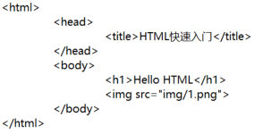
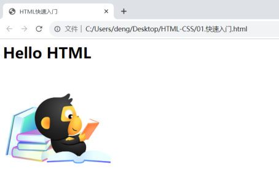

上一篇说 HTML 负责网页的**结构**，这篇就把它拆开看：什么是 HTML、一个标签由哪几部分组成、一个 .html 文件最少要写什么，最后动手做出第一个页面。

## 什么是 HTML

**HTML（HyperText Markup Language）：超文本标记语言。**

这句话里两个词都要拆开看：

- **超文本**：超越了文本的限制，比普通文本更强大。除了文字信息，还可以定义**图片、音频、视频**等内容。
- **标记语言**：由标签 `<标签名>` 构成的语言。

再补两条性质：

- HTML 标签都是**预定义**好的。例如：使用 `<h1>` 展示标题、使用 `` 展示图片、使用 `<video>` 展示视频——不能自己发明标签。
- HTML 代码**直接在浏览器中运行**，HTML 标签**由浏览器解析**。

### 标签的语法结构

```html
<h1>HTML入门程序</h1>

```

| 组成部分 | 例子 | 说明 |
| --- | --- | --- |
| 开始标签 | `<h1>` | 告诉浏览器"从这里开始" |
| 内容 | `HTML入门程序` | 标签之间包着的文字 |
| 结束标签 | `</h1>` | 标签名前多一个 `/`，告诉浏览器"到这里结束" |
| 属性 | `src="img/1.png"` | 写在**开始标签内部**，用"属性名=属性值"描述这个标签 |

> [!TIP]
> `` 这种标签**没有内容**（图片地址全在属性里），所以直接在 `>` 处结束，不写 `</img>`。而 `<h1>` 要包住文字，就必须成对出现。

## 顺带认识 CSS

接下来做页面前，PPT 先把 CSS 也点了一下（它和 HTML 是一对）：

**CSS（Cascading Style Sheet）：层叠样式表，用于控制页面的样式（表现）。**

```html
<!-- 结构没变，只是给这个标题加了一条"颜色"样式 -->
<h1 style="color:red;">HTML入门程序</h1>
```

原来黑色的标题就变成了红色——**HTML 管"有什么"，CSS 管"长什么样"**。CSS 的三种引入方式、选择器、颜色表示等内容，在后面的央视新闻案例里详细写。

## 快速入门：做出第一个页面

课程给的步骤一共三步：

1. **新建文本文件，后缀名改为 `.html`**（课程代码文件：`01.快速入门.html`）
2. **编写 HTML 的基本骨架，定义标题**（`<html>`、`<head>`、`<title>`、`<body>`）
3. **在 `<body>` 中填写内容**（标题 `<h1>`、图片 ``）

```html
<!-- 01. HTML快速入门.html -->
<html>
	<head>
		<title>HTML快速入门</title>
	</head>
	<body>
		<h1>Hello HTML</h1>
		
	</body>
</html>
```

代码里的层级关系（骨架长什么样）：


*图：HTML 基本骨架的代码结构——`<html>` 里套 `<head>` 和 `<body>`，`<title>` 在 head 里，`<h1>` 和 `` 在 body 里（子标签要缩进）*

写完之后双击文件用浏览器打开，就能看到效果：


*图：浏览器里的运行效果——浏览器标签页显示 `<title>` 里的"HTML快速入门"，页面里显示 `<h1>` 的内容和 `` 引入的图片*

## 网页头部与网页主体

骨架里的两个块各有分工，这是最容易记混的地方：

| 标签 | 名称 | 放什么 |
| --- | --- | --- |
| `<head>` | **网页头部** | 用来存放**给浏览器看**的信息，如：CSS 样式 |
| `<body>` | **网页主体** | 用来存放**给用户看**的信息，如：文字、图片、视频 |

> [!IMPORTANT]
> 判断一段内容该放 head 还是 body，只问一句：**它是给浏览器看的，还是给用户看的？** `<title>` 显示在浏览器标签页上，用户是在"浏览器界面"上看到的，所以它属于 head。

## 完整的 HTML 骨架

课程第二个代码文件 `02. HTML快速入门2.html` 在骨架上又补了 3 行"告诉浏览器我是谁"的信息，这是更规范的写法：

```html
<!-- 告诉浏览器当前文档类型为HTML -->
<!DOCTYPE html>
<html lang="en">
<head>
  <!-- 字符集 -->
  <meta charset="UTF-8">
  <!-- 不同设备屏幕宽度的适配方式 -->
  <meta name="viewport" content="width=device-width, initial-scale=1.0">
  <title>HTML快速入门</title>
</head>
<body>
  <h1>Hello HTML</h1>
  
</body>
</html>
```

三行新增内容的作用：

| 写法 | 作用 |
| --- | --- |
| `<!DOCTYPE html>` | 告诉浏览器当前文档类型为 **HTML**（HTML5） |
| `<meta charset="UTF-8">` | 指定**字符集**（不写中文容易变乱码） |
| `<meta name="viewport" content="width=device-width, initial-scale=1.0">` | 不同设备屏幕宽度的**适配方式**（移动端按设备宽度缩放） |
| `<html lang="en">` | 文档的语言是英文 |

> [!TIP]
> 课程代码里 `lang="en"` 是从模板里带过来的；**中文页面写 `lang="zh-CN"` 更规范**。这个属性主要影响浏览器翻译、朗读和搜索引擎判断语言，不影响页面显示。

## HTML 注释

注释是写给自己和同事看的说明，**浏览器不会显示**：

```html
<!-- 定义一个标题，标题内容为：推进长江十年禁渔 谱写长江大保护新篇章 -->
<h1>推进长江十年禁渔 谱写长江大保护新篇章</h1>

<a href="https://www.cctv.com/">央视网</a>  <!-- 定义一个超链接，里面显示 央视网 -->
```

- 语法：`<!-- 注释内容 -->`（`<!--` 开头，`-->` 结尾）
- 用途：标注这段代码是干什么的；调试时**临时屏蔽**一段代码
- 写得好的注释能让代码自己"说话"，课程代码里每一行关键代码基本都带注释

## HTML 标签的三个特点

PPT 单独用一页总结了标签的"脾气"：

| 特点 | 说明 |
| --- | --- |
| **html 标签不区分大小写** | `<H1>` 和 `<h1>` 效果一样，但**建议小写** |
| **属性值使用单引号/双引号都可以** | `src="img/1.png"` 和 `src='img/1.png'` 都行，**建议双引号** |
| **语法结构松散，但是建议规范书写** | 标签没闭合、属性不加引号，浏览器常常也能"猜"出来 |

> [!WARNING]
> "语法松散"不等于"可以不规范"——它只是**不报错**。标签没闭合、层级套错时浏览器不会提示，页面只会莫名其妙地变形，排查起来非常痛苦。所以从第一个页面起就按规范写：**小写标签、双引号属性、成对闭合、子标签缩进**。

## 浏览器从上往下渲染

PPT 在进入案例前讲了这条规律，它决定了我们**写页面的顺序**：

> html 页面在渲染展示的时候，是**从上往下逐行解析展示**的。所以，编写页面的时候，根据页面的布局，**从上往下编写**。

也就是说：你写的 `<h1>` 在上、`` 在下，页面上就是标题在上、图片在下——**代码顺序 = 页面顺序**。

## 小结（HTML 入门回顾）

| 问题 | 答案 |
| --- | --- |
| HTML 是什么？ | HyperText Markup Language，**超文本标记语言**；"超文本"指除了文字还能定义图片、音频、视频等内容，"标记语言"指由 `<标签名>` 构成 |
| HTML 标签从哪来？ | 都是**预定义**好的（`<h1>` 标题、`` 图片、`<video>` 视频），由**浏览器**解析并直接在浏览器中运行 |
| 一个标签由哪几部分组成？ | **开始标签 + 内容 + 结束标签**，属性写在开始标签内部 |
| HTML 骨架有哪几个标签？ | `<html>` 包 `<head>`（给浏览器看的信息，如 CSS 样式）和 `<body>`（给用户看的信息，如文字、图片、视频）；`<title>` 在 head 里定义标题 |
| 一个 .html 文件怎么建？ | 新建文本文件，把**后缀名改成 .html** |
| 注释怎么写？ | `<!-- 注释内容 -->`，浏览器不显示 |
| 标签的三个特点？ | 不区分大小写（建议小写）、属性值单双引号都行、语法结构松散（建议规范书写） |
| 页面按什么顺序渲染？ | 浏览器**从上往下逐行解析**，所以代码也要按页面布局**从上往下写** |

## 相关

- [Web前端初识](/posts/编程学习/javaweb学习笔记/02-web前端初识/)
- [前端开发工具-VSCode](/posts/编程学习/javaweb学习笔记/04-前端开发工具-vscode/)

## 练习题

### 一、知识回顾（读完直接做下面的实践题）

1. **HTML** 全称 **HyperText Markup Language**，即**超文本标记语言**；"**超文本**"指超越文本的限制，除了文字还能定义图片、音频、视频；"**标记语言**"指由标签 `<标签名>` 构成的语言
2. HTML 标签都是**预定义**的：`<h1>` 展示标题、`` 展示图片、`<video>` 展示视频；HTML 代码**直接在浏览器中运行**，标签由**浏览器解析**
3. 一个标签由**开始标签**（`<h1>`）、**内容**（`HTML入门程序`）、**结束标签**（`</h1>`）组成，**属性**写在开始标签内部（如 `src="img/1.png"`）
4. HTML 基本骨架：`<html>` 里包含 `<head>` 和 `<body>`；**head＝网页头部**，放给**浏览器看**的信息（如 CSS 样式、`<title>`）；**body＝网页主体**，放给**用户看**的信息（文字、图片、视频）
5. 建文件的方法：**新建文本文件，把后缀名改成 `.html`**；然后按"骨架 → 定义标题 → 在 body 里填内容"三步写
6. 完整骨架上的三行附加信息：`<!DOCTYPE html>` 说明**文档类型为 HTML**；`<meta charset="UTF-8">` 指定**字符集**；`<meta name="viewport" content="width=device-width, initial-scale=1.0">` 指定**不同设备屏幕宽度的适配方式**；`<html lang="en">` 说明**文档语言**（中文页面写 `zh-CN` 更规范）
7. HTML 注释写法是 `<!-- 注释内容 -->`，**浏览器不会显示**；常用来标注代码用途或临时屏蔽代码
8. HTML 标签的三个特点：**不区分大小写**（`<H1>` 等于 `<h1>`，建议小写）、**属性值单引号双引号都可以**（建议双引号）、**语法结构松散**（但建议规范书写，浏览器不会报错）
9. 浏览器渲染页面的顺序是**从上往下逐行解析**，所以编写页面时按**页面布局从上往下**写
10. CSS 全称 **Cascading Style Sheet（层叠样式表）**，负责控制页面的**样式（表现）**；同一段内容加上 `style="color:red;"` 就从黑色变红色——**HTML 管有什么，CSS 管长什么样**

### 二、裸写题

- [ ] **2-1 手写一个 HTML 骨架**
  从零建一个 HTML 文件，要求：浏览器标签页上显示"我的第一个页面"，页面正文里显示一行大标题"Hello HTML"。骨架里的四个方面（html、head、title、body）一个都不能少。
  （练习文件 `test_03_HTML骨架.html` 里只有一个写作区，整个页面的代码都要自己写。）

  > [!TIP]- 提示（先自己想，实在想不出再点开）
  > **一级 · 思路**：先把"骨架"的四对标签写出来，再往 head 和 body 里分别填东西
  > **二级 · 方法**：定义标题用 `<title>`，一级标题用 `<h1>`
  > **三级 · 骨架**：`<____><____><title>____</title></____><____><h1>____</h1></____></____>`

  > [!TIP]- 参考答案（做完再点开）
  > ```html
  > <html>
  > 	<head>
  > 		<title>我的第一个页面</title>
  > 	</head>
  > 	<body>
  > 		<h1>Hello HTML</h1>
  > 	</body>
  > </html>
  > ```
  > 也可以带上完整骨架的 `<!DOCTYPE html>`、`<meta charset="UTF-8">`（更规范）。对照课程 `01. HTML快速入门.html` 检查：head 里只放给浏览器看的 title，正文内容都在 body 里。

- [ ] **2-2 给页面加一张图片和一句注释**
  在页面的一行大标题下面再加一张图片：图片放在与 HTML 文件**同级的 img 目录**下、文件名叫 `1.png`；同时用注释标出"这里是标题"和"这里是图片"两处。
  （练习文件 `test_03_图片与注释.html` 里已经给出骨架，在写作区里补内容即可。）

  > [!TIP]- 提示（先自己想，实在想不出再点开）
  > **一级 · 思路**：图片用哪个标签？图片的地址写在标签的哪个位置？
  > **二级 · 方法**：``，地址写在 `src` 属性里；注释是 `<!-- 注释内容 -->`
  > **三级 · 骨架**：`<!-- 这里是标题 -->` / `<h1>…</h1>` / `<!-- 这里是图片 -->` / ``

  > [!TIP]- 参考答案（做完再点开）
  > ```html
  > <html>
  > 	<head>
  > 		<title>我的第一个页面</title>
  > 	</head>
  > 	<body>
  > 		<!-- 这里是标题 -->
  > 		<h1>Hello HTML</h1>
  > 		<!-- 这里是图片 -->
  > 		
  > 	</body>
  > </html>
  > ```
  > 注意：`img` 是相对路径写法（同级目录下的 img 文件夹），图片必须真的放在那个位置才显示得出来。

- [ ] **2-3 找出下面这段代码里不规范的地方并改对**

  ```html
  <HTML>
  <head>
    <TITLE>我的页面</TITLE>
  <body>
    <H1>Hello HTML</H1>
    
  </body>
  </html>
  ```

  要求：至少找出 3 处问题，说明为什么，并写出改正后的完整代码。

  > [!TIP]- 提示（先自己想，实在想不出再点开）
  > **一级 · 思路**：回想"标签的三个特点"那一页——大小写、引号、结构松散，各自推荐怎么写
  > **二级 · 方法**：标签建议**小写**；属性值建议用**双引号**；每个**开始标签**都要有对应的结束标签
  > **三级 · 骨架**：注意 `<head>` 与 `<body>` 之间少了一个符号为 `/` 的标签

  > [!TIP]- 参考答案（做完再点开）
  > **2-3** 三处问题：
  > ① 标签名都写成了大写（`<HTML>`、`<TITLE>`、`<H1>`）——HTML 不区分大小写，但**规范写法是小写**，改成 `<html>`、`<title>`、`<h1>`；
  > ② `<head>` 没有结束标签——**head 少写了 `</head>`**，导致 title 后面的结构套错；
  > ③ `` 的**属性值没加引号**——要写成 `src="img/1.png"`（有些符号出现在地址里时，不加引号会直接解析失败）。
  >
  > 改正后：
  > ```html
  > <!DOCTYPE html>
  > <html>
  > 	<head>
  > 		<title>我的页面</title>
  > 	</head>
  > 	<body>
  > 		<h1>Hello HTML</h1>
  > 		
  > 	</body>
  > </html>
  > ```
  > （`<!DOCTYPE html>` 属于加分项：补上它才是完整的 HTML5 骨架。）

### 三、综合题

- [ ] **3-1 做一个"我的第一个页面"**
  按课程的三步流程，从零做出一个能在浏览器里正常显示的页面：

  1. 新建文本文件，把后缀名改成 `.html`（文件名用英文或数字，别带空格）
  2. 写出 HTML 基本骨架（`<html>`、`<head>`、`<body>` 一个都不能少；能补上 `<!DOCTYPE html>` 和 `<meta charset="UTF-8">` 更好）
  3. 在 head 里定义标题：浏览器标签页显示"我的第一个页面"
  4. 在 body 里**从上往下**依次写：一行大标题（写你的名字）、一行说明文字（写一句话，比如"我正在学习 JavaWeb"）、一张图片（用 `img/1.png`）
  5. 每块内容前面加一句注释说明
  6. 保存后双击文件用浏览器打开，检查：标签页上的文字、页面上从上往下的顺序、图片有没有显示出来
  （练习文件 `test_03_综合_我的第一个页面.html` 里已经给出骨架和写作区。）

  > [!TIP]- 提示（先自己想，实在想不出再点开）
  > **一级 · 思路**：先骨架、后内容；head 只放"给浏览器看"的，body 放"给用户看"的
  > **二级 · 方法**：`<h1>` 是一级标题；`` 引入同级 img 目录下的图片；`<!-- -->` 写注释
  > **三级 · 骨架**：`<html>` → `<head>`（`<meta charset>` + `<title>`）→ `<body>`（注释 + `<h1>` + 文字 + ``）

  > [!TIP]- 参考答案（做完再点开）
  > ```html
  > <!-- 告诉浏览器当前文档类型为HTML -->
  > <!DOCTYPE html>
  > <html lang="zh-CN">
  > 	<head>
  > 		<!-- 字符集 -->
  > 		<meta charset="UTF-8">
  > 		<!-- 浏览器标签页上显示的标题 -->
  > 		<title>我的第一个页面</title>
  > 	</head>
  > 	<body>
  > 		<!-- 一级标题：名字 -->
  > 		<h1>团子的第一个页面</h1>
  > 		<!-- 一行说明文字 -->
  > 		我正在学习 JavaWeb，这是我自己写的第一个页面。
  > 		<!-- 图片：与当前 html 文件同级目录下的 img/1.png -->
  > 		
  > 	</body>
  > </html>
  > ```
  > 检查顺序：代码里 h1 → 文字 → img 的先后，和浏览器里从上往下看到的顺序一致（浏览器**从上往下逐行渲染**）。如果图片没出来，先看 `img` 目录和图片文件名是不是**大小写、路径**都对得上。
