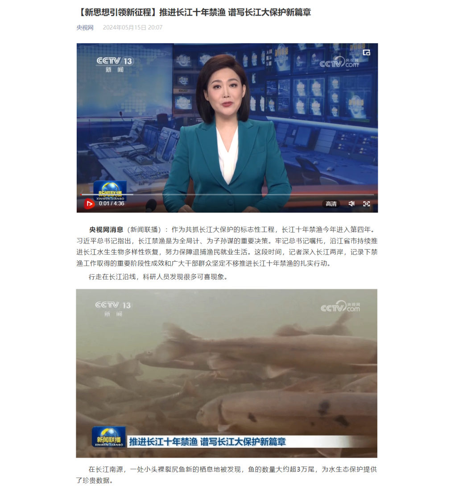

前两篇把 HTML 骨架和标签语法讲清了，但骨架本身不显示任何内容——真正往页面上**装东西**的是一堆**常用标签**。这一篇用课程的主案例「央视新闻」把这些标签一个一个过一遍。

## 案例：央视新闻页面

课程案例把央视网的一条真实新闻做成网页，分成两部分：

- **央视新闻-标题**：新闻标题 + 来源（央视网超链接）+ 发布时间
- **央视新闻-正文**：新闻视频 + 一段段文字 + 配图


*图：案例做完后的效果——标题、来源链接、日期、视频、段落、配图，全部由这一篇讲的标签搭出来*

写之前先记住这条规律（上一篇也提过，这里它直接决定动手顺序）：

> html 页面在渲染展示的时候，是**从上往下逐行解析展示**的。所以，编写页面的时候，根据页面的布局，**从上往下编写**。

也就是说：先排标题那一行，再排正文——**代码顺序就是页面顺序**。

案例一共分五步做完，本系列笔记按同样的顺序排：

| 步骤 | 课程文件 | 这一步做什么 | 在哪篇笔记 |
| --- | --- | --- | --- |
| 1 | `03. 央视新闻-标题-排版.html` | 用标签把标题、来源、时间排出来 | 本篇 |
| 2 | `04. 央视新闻-标题-样式.html` | 给日期加颜色（三种 CSS 引入方式） | [06 篇](/posts/编程学习/javaweb学习笔记/06-css引入方式与颜色/) |
| 3 | `05. 央视新闻-标题-样式(选择器).html` | 用选择器精确选中要改的元素 | [07 篇](/posts/编程学习/javaweb学习笔记/07-css选择器/) |
| 4 | `06. 央视新闻-正文-排版.html` | 用视频、段落、图片标签排出正文 | 本篇 |
| 5 | `07. 央视新闻-正文-样式.html` | 段落加行高、首行缩进 | [06 篇](/posts/编程学习/javaweb学习笔记/06-css引入方式与颜色/) |

## 标题标签 `<h1>` ~ `<h6>`

标题标签一共**六级**：`<h1>` 是一级标题（字号最大、级别最高），`<h6>` 是六级标题（字号最小）。**数字越大，级别越低、字越小**。

新闻标题是整篇页面里最重要的文字，所以用一级标题：

```html
<!-- 定义一个标题, 标题内容: 推进长江十年禁渔 谱写长江大保护新篇章 -->
<h1>推进长江十年禁渔 谱写长江大保护新篇章</h1>
```

> [!NOTE]
> PPT 示例里为了排版，标题只写了后半句；课程代码 `03. 央视新闻-标题-排版.html` 里的**完整标题**是 `【新思想引领新征程】推进长江十年禁渔 谱写长江大保护新篇章`（前面的"【新思想引领新征程】"是栏目名）。后面案例代码里用完整标题。

> [!TIP]
> 标题标签在浏览器里**独占一行**、上下还自带间距——这些默认效果由浏览器提供，后面学了 CSS 可以自己改。

## 超链接标签 `<a>`

```html
<a href="" target="">...</a>
```

| 属性 | 作用 | 取值 |
| --- | --- | --- |
| `href` | 指定资源访问的 **url** | 要跳转到的地址 |
| `target` | 指定在**何处**打开资源链接 | `_self`：默认值，在**当前页面**打开；`_blank`：在**空白页面**（新标签页）打开 |

案例里让"央视网"变成可点击的文字，并且点了**在新标签页**打开：

```html
<!-- 定义一个超链接，里面展示 央视网 -->
<!-- a 超链接标签:
      href: 链接地址 - url地址
      target: 打开方式
        _blank: 新窗口打开
        _self: 本窗口打开(默认)
  -->
<a href="https://www.cctv.com" target="_blank">央视网</a>
2024年05月15日 20:07
```

浏览器里的效果：


*图：标题排版的结果——`<h1>` 是新闻标题，`<a>` 是蓝色的"央视网"，后面的日期此时还是普通黑色文字（它的颜色在 06 篇里改）*

> [!NOTE]
> `<a>` 标签里包着的内容（上面是文字"央视网"）就是**可点击的部分**，也可以换成一张图片；不写 `target` 时默认 `_self`，即在本页面直接跳走。

## 图片标签 ``

```html
<!-- 定义一张图片, 引入 img/1.gif -->

```

| 属性 | 说明 |
| --- | --- |
| `src` | 图片的**访问地址**（绝对路径 / 相对路径，见下面的「资源路径」） |
| `width` | 图片宽度 |
| `height` | 图片高度 |

> [!TIP]
> 课程代码注释里专门提醒：**宽度和高度只设置一个即可**，另一个会**等比例缩放**。两个都写死的话，图片容易被拉变形。

> [!WARNING]
> 课程代码里写成了 `</img>`（多了一个 `</img>`）。`` 是**没有内容**的标签，规范写法**不写结束标签**；多写的结束标签浏览器会容错忽略，但不要跟着学。

## 音频与视频标签 `<audio>` / `<video>`

正文区域第一件事是把新闻联播的视频嵌进来，用 **`<video>`**；音频用 **`<audio>`**，用法完全一样：

```html
<!-- 定义一个视频, 引入 video/news.mp4 -->
<!-- video标签属性
      src: 视频地址
      controls: 显示播放控件
      autoplay: 自动播放
      width: 视频宽度(建议: 宽度和高度只设置一个即可, 另一个会等比例缩放)
      height: 视频高度
        单位:
          px: 像素
          %: 百分比 (相对于父元素的百分比)
  -->
<video src="video/news.mp4" controls width="80%"></video>

<!-- 音频同理，课程素材里给了 audio/news.mp3，代码里被注释掉了 -->
<audio src="audio/news.mp3" controls></audio>
```

| 属性 | 含义 |
| --- | --- |
| `src` | 视频/音频的地址（绝对路径 / 相对路径） |
| `controls` | 是否**显示播放控件**（写上就有播放条、音量、全屏按钮） |
| `autoplay` | 自动播放 |
| `width` / `height` | 宽度、高度；单位可以是 **px（像素）**，也可以是 **%（相对于父元素的百分比）** |

> [!NOTE]
> `width="80%"` 的意思是：视频宽度占**父元素**（这里是 body 的内容区）宽度的 80%——**百分比是相对父元素算的**，不是相对屏幕。

## 段落与换行 `<p>` / `<br>`

- **`<p>` 段落标签**：一段文字包一个 `<p>`，浏览器会给段落上下留出间距，段与段自然分开；
- **`<br>` 换行标签**：只想换行、**不要**段落间距时用它（单标签，没有结束标签）。

```html
<span class="cls" id="time">2024年05月15日 20:07</span>
<br><br>  <!-- 标题区和正文之间空一行 -->

<!-- 正文：每一段文字各包一个 p -->
<p>
  央视网消息（新闻联播）：作为共抓长江大保护的标志性工程，长江十年禁渔今年进入第四年。……
</p>

<p>
  行走在长江沿线，科研人员发现很多可喜现象。
</p>
```

案例正文一共用了很多个 `<p>`（一段一个），中间穿插图片和视频。

## 文本处理标签：加粗 / 倾斜 / 下划线 / 删除线

| 标签 | 作用 | 属性/说明 |
| --- | --- | --- |
| `<b>` / `<strong>` | 加粗 | `<strong>` 具有**强调语义** |
| `<u>` / `<ins>` | 下划线 | `<ins>` 具有**强调语义** |
| `<i>` / `<em>` | 倾斜 | `<em>` 具有**强调语义** |
| `<s>` / `<del>` | 删除线 | `<del>` 具有**强调语义** |

每组两个标签**显示效果完全一样**，区别只在**语义**：

- `<strong>`、`<ins>`、`<em>`、`<del>` 表示这段内容**是被强调的**——告诉浏览器、搜索引擎和读屏软件"这里重要"；
- `<b>`、`<u>`、`<i>`、`<s>` 只是**纯样式**，没有任何含义。

所以写代码时优先用带语义的那一组（现在看不出区别，以后做 SEO / 无障碍、或者用 CSS 单独挑出"强调文字"时就有用了）。

案例里把正文开头的"央视网消息"加粗，代码里能看到这段演变过程：

```html
<p>
  <!-- <b>央视网消息</b> -->
  <!-- <strong>&nbsp;&nbsp;&nbsp;&nbsp;央视网消息</strong> -->
  <strong>央视网消息</strong>
  （新闻联播）：作为共抓长江大保护的标志性工程，长江十年禁渔今年进入第四年。……
</p>
```

注释里那两行是被替换掉的写法：先用 `<b>`，再换成 `<strong>` + 4 个 `&nbsp;` 手动缩进，最后缩进交给 CSS 的 `text-indent`（见 [06 篇](/posts/编程学习/javaweb学习笔记/06-css引入方式与颜色/)）。

## 字符实体

有两种情况，"想显示的文字"会和"代码里的符号"打架：

1. `<`、`>` 是**标签的定界符**——直接写 `<div>` 会被浏览器当成标签解析，页面上什么都不显示；
2. 连续的空格会被浏览器**合并成一个**（HTML 会忽略多余空白）——想精确控制空格数量，得写**字符实体**。

| 字符实体 | 显示的字符 | 说明 |
| --- | --- | --- |
| `&nbsp;` | 空格 | non-breaking space，不换行空格 |
| `&lt;` | `<` | less than |
| `&gt;` | `>` | greater than |

```html
<!-- 想在页面上原样显示 <div> 这几个字符，必须写成实体 -->
&lt;div&gt;

<!-- 想在段首空出 4 个格的宽度（早期的笨办法） -->
<strong>&nbsp;&nbsp;&nbsp;&nbsp;央视网消息</strong>
```

> [!TIP]
> 还有一个常用的：`&amp;` 显示 `&`（因为 `&` 是实体的开头，本身也要转义）。

> [!WARNING]
> 用 `&nbsp;` 手工排版是"笨办法"：空几个格就得敲几个实体，改起来很痛苦。正文的**首行缩进**后来改用了 CSS 的 `text-indent`（[06 篇](/posts/编程学习/javaweb学习笔记/06-css引入方式与颜色/)），一行样式搞定。

## 布局标签 `<div>` 与 `<span>`

网页里还有两个**没有语义**的标签：它们不表示"这是标题""这是段落"，唯一的作用是**给页面分区**、配合 CSS 做布局。

| 标签 | 特点 |
| --- | --- |
| `<div>` | 一行只显示一个（**独占一行**）；宽度默认是**父元素的宽度**，高度默认**由内容撑开**；**可以设置宽高**（width、height） |
| `<span>` | 一行可以显示**多个**；宽度和高度默认**由内容撑开**；**不可以设置宽高**（width、height） |

怎么选：

- 一整块区域（标题区、正文区、页脚区）用 `<div>`；
- 一行里的一小段文字用 `<span>`——案例里就是用它把日期单独包起来，方便之后给日期设颜色：

```html
<h1>【新思想引领新征程】推进长江十年禁渔 谱写长江大保护新篇章</h1>
<a href="https://www.cctv.com" target="_blank">央视网</a>
<span class="cls" id="time">2024年05月15日 20:07</span>
```

> [!IMPORTANT]
> 这两个标签**最本质的差别**就是"能不能设置宽高"：`<div>` 是**块级**元素（独占一行、宽高可设），`<span>` 是**行内**元素（一行多个、宽高由内容决定），给 `<span>` 写 `width: 200px` 是没有效果的。想真正看懂"宽高算什么"，要等后面的**盒子模型**；这里先记住这条区别。

## 资源路径：`src` 里的地址怎么写

`src` 属性里放的是"资源在哪"，分两大类：

**绝对路径**

- **绝对磁盘路径**：`D:/xxx.jpg`——从盘符开始，换台电脑、传到服务器就找不到，**不推荐**；
- **绝对网络路径**：`https://xxx.jpg`——引用别人服务器上的资源。

**相对路径**（最常用，**相对于当前文件所在的位置**）

- `./`：**当前目录**（**可以省略**），如 `./img/1.gif` 就是 `img/1.gif`；
- `../`：**上一级目录**。

对照案例记几种写法：

| 要引的资源 | 写法 | 说明 |
| --- | --- | --- |
| 与 HTML 同级的 `img` 目录里的图 | `img/1.gif` 或 `./img/1.gif` | 进到当前目录下的 img 目录 |
| 与 HTML 同级的 `video` 目录里的视频 | `video/news.mp4` | 同上 |
| HTML 在子目录（如 `pages/`）里，要引外层的图 | `../img/1.gif` | 先退到上一级，再进 img 目录 |
| 别的网站上的图 | `https://xxx.jpg` | 绝对网络路径 |

> [!WARNING]
> 路径写错的后果是**静默的**：图片/视频直接不显示，页面上只留一块空白（打开浏览器控制台才会看到 404）。另外记住三点：路径里的斜杠写 `/` 不写 `\`；`./` 可以省、`../` 不能省；上传到 Linux 服务器后**文件名和路径区分大小写**，大小写不一致的图片会挂掉。

## 案例实战：正文排版

工具齐了，按"从上往下"的顺序把正文排出来（课程文件 `06. 央视新闻-正文-排版.html`）：

```html
<!-- --------------------------- 新闻标题 -------------------------------- -->
<h1>【新思想引领新征程】推进长江十年禁渔 谱写长江大保护新篇章</h1>
<a href="https://www.cctv.com" target="_blank">央视网</a>
<span class="cls" id="time">2024年05月15日 20:07</span>
<br><br>

<!-- --------------------------- 新闻正文 -------------------------------- -->
<!-- 新闻视频：占父元素宽度的 80%，带播放控件 -->
<video src="video/news.mp4" controls width="80%"></video>

<p>央视网消息（新闻联播）：……</p>
<p>行走在长江沿线，科研人员发现很多可喜现象。</p>


<p>在长江南源，一处小头裸裂尻鱼新的栖息地被发现……</p>
<p>在长江中游，追踪显示，人工增殖放流的中华鲟成功入海率已经……</p>
<p>在长江下游，今年3月起，南京秦淮河入江口首次出现……</p>


<!-- 后面还有若干段 p + img/3.jpg、img/4.jpg、img/5.jpg …… 结构完全一样 -->
```

排版结果：


*图：正文排版的结果——视频在最上（带播放控件），中间是一段段文字，文字之间穿插配图；此时还没有加行高和缩进*

> [!NOTE]
> 这时页面虽然"内容全了"，但文字是默认的黑色、段落行距很挤、也没有首行缩进——**结构（HTML）和表现（CSS）是两件事**：本篇只管把内容摆上去，样式交给 [06 篇](/posts/编程学习/javaweb学习笔记/06-css引入方式与颜色/)。

## 小结：这一篇的标签总表

| 类别 | 标签 | 说明 |
| --- | --- | --- |
| 标题标签 | `<h1>` - `<h6>` | 一级标题 - 六级标题 |
| 段落与换行 | `<br>`、`<p>` | 换行、段落 |
| 文本处理 | `<strong>`、`<em>`、`<ins>`、`<del>` | 文本加粗、倾斜、下划线、删除线（带强调语义） |
| 超链接 | `<a href="...">` | 超链接（属性：`href`、`target`） |
| 图片、音视频 | `` | 图片（路径：绝对路径、相对路径） |
| | `<audio src="...">`、`<video src="...">` | 音频、视频 |
| 布局标签 | `<div>`、`<span>` | 没有语义的布局标签，配合 CSS 实现页面布局 |

> 课程总结页里还有**表格标签**（`<table>`、`<thead>`、`<tbody>`、`<tr>`、`<th>`、`<td>`）和**表单标签**（`<form>`、`<input>`、`<select>`），它们在后面的 Tlias 员工管理案例里用，笔记排在后面几篇。

## 相关

- [HTML快速入门](/posts/编程学习/javaweb学习笔记/03-html快速入门/)
- [CSS引入方式与颜色](/posts/编程学习/javaweb学习笔记/06-css引入方式与颜色/)

## 练习题

### 一、知识回顾（读完直接做下面的实践题）

1. 标题标签 `<h1>` ~ `<h6>` 共**六级**，`<h1>` 是**一级标题**（最大最重要）、`<h6>` 最小；**数字越大，级别越低、字越小**
2. 超链接标签 `<a href="" target="">...</a>`：`href` 指定资源访问的 **url**；`target` 指定在**何处打开**——`_self` 是**默认值，在当前页面打开**，`_blank` 是**在空白页面（新标签页）打开**
3. 图片标签 `` 的常用属性：`src`（图片地址）、`width`、`height`；**宽高只设置一个**，另一个会等比例缩放，避免图片被拉变形
4. 视频标签 `<video>` 的常用属性：`src`（视频地址）、`controls`（是否**显示播放控件**）、`width`/`height`（单位 **px 像素** 或 **% 相对于父元素的百分比**）、`autoplay`（自动播放）；音频用 `<audio>`，属性用法相同
5. 段落用 `<p>`（**一段一个**，浏览器会给段落上下留间距）；只想换行不要间距用 `<br>`（单标签）
6. 文本处理标签四组：`<b>`/`<strong>` **加粗**、`<u>`/`<ins>` **下划线**、`<i>`/`<em>` **倾斜**、`<s>`/`<del>` **删除线**；显示效果一样，区别是 **`<strong>`、`<ins>`、`<em>`、`<del>` 具有强调语义**
7. 字符实体：`&nbsp;` = **空格**、`&lt;` = **`<`**、`&gt;` = **`>`**（还有 `&amp;` = `&`）；`<` 和 `>` 是标签的定界符，直接写会被当成标签解析；浏览器会把**连续空格合并成一个**，所以要用 `&nbsp;`
8. 布局标签：`<div>` **一行只显示一个（独占一行）**，宽度默认是**父元素的宽度**、高度由内容撑开，**可以设置宽高**；`<span>` **一行可以显示多个**，宽高默认由内容撑开，**不可以设置宽高**——两个标签都**没有语义**，只用来分区
9. 资源路径：**绝对路径**分绝对磁盘路径（`D:/xxx.jpg`，不推荐）和绝对网络路径（`https://xxx.jpg`）；**相对路径**中 `./` 是当前目录（**可以省略**）、`../` 是**上一级目录**
10. 页面的编写顺序：html 页面渲染时**从上往下逐行解析**，所以按页面布局**从上往下编写**——代码顺序就是页面顺序

### 二、裸写题

- [ ] **2-1 给新闻标题加上来源链接**
  做一个新闻的标题区（写在 body 里，按下面的顺序从上往下）：
  1. 一行新闻标题：`推进长江十年禁渔 谱写长江大保护新篇章`
  2. 紧接着一行"央视网"，要能点击跳到 `https://www.cctv.com`，并且**在新标签页打开**（不要覆盖当前页面）
  3. 链接后面跟上发布时间：`2024年05月15日 20:07`
  （练习文件 `test_05_标题与超链接.html` 里只有写作区。）

  > [!TIP]- 提示（先自己想，实在想不出再点开）
  > **一级 · 思路**：标题用一个"标题类"标签；可点击的跳转文字用一个"链接类"标签；"在新标签页打开"是链接标签的第二个属性在管
  > **二级 · 方法**：标题用 `<h1>`；链接用 `<a href="地址" target="打开方式">`，新标签页的值是 `_blank`
  > **三级 · 骨架**：`<h1>____</h1>` / `<a ____="https://www.cctv.com" ____="____">央视网</a>` / `2024年05月15日 20:07`

  > [!TIP]- 参考答案（做完再点开）
  > ```html
  > <!-- 定义一个标题, 标题内容: 推进长江十年禁渔 谱写长江大保护新篇章 -->
  > <h1>推进长江十年禁渔 谱写长江大保护新篇章</h1>
  >
  > <!-- 定义一个超链接, 里面展示 央视网, 新窗口打开 -->
  > <a href="https://www.cctv.com" target="_blank">央视网</a>
  > 2024年05月15日 20:07
  > ```
  > 对照课程 `03. 央视新闻-标题-排版.html`：`href` 是链接地址，`target="_blank"` 是新窗口打开（`_self` 或不写就是本窗口打开）。

- [ ] **2-2 往正文里放视频和图片**
  在页面正文里从上往下放三样东西：
  1. 一个视频：文件是**与本文件同级的 video 目录**里的 `news.mp4`；要能看到播放控件；宽度占**父元素宽度的 80%**
  2. 一段文字（自己写一句话就行）
  3. 一张图片：**与本文件同级的 img 目录**里的 `1.gif`；宽度同样占 80%
  （练习文件 `test_05_图片与音视频.html` 里已经给了标题行和写作区。）

  > [!TIP]- 提示（先自己想，实在想不出再点开）
  > **一级 · 思路**：视频、图片各有一个专门的标签；地址写在 `src` 属性里；百分比宽度是相对父元素的
  > **二级 · 方法**：视频 `<video src="" controls width="80%"></video>`；图片 ``；段落 `<p>`
  > **三级 · 骨架**：`<video src="____/news.mp4" ____ width="80%"></video>` / `<p>____</p>` / ``

  > [!TIP]- 参考答案（做完再点开）
  > ```html
  > <!-- 定义一个视频, 引入 video/news.mp4, 显示播放控件, 宽度为父元素的 80% -->
  > <video src="video/news.mp4" controls width="80%"></video>
  >
  > <!-- 一段正文 -->
  > <p>央视网消息（新闻联播）：长江十年禁渔今年进入第四年。</p>
  >
  > <!-- 定义一张图片, 引入 img/1.gif -->
  > 
  > ```
  > 检查：视频要写成 `src="video/news.mp4"`（相对路径，`video` 目录和 html 文件同级）；图片路径同理。图片**没显示**就是路径错了——注意 `/` 和文件名大小写。对照课程 `06. 央视新闻-正文-排版.html`。

- [ ] **2-3 把"央视网消息"加粗，并让 `<div>` 原样显示**
  把下面这段正文按三个要求改好：
  1. 段首的"央视网消息"四个字**加粗**，而且要带上**强调语义**
  2. 段落里要能**原样看到 `<div>` 这几个字符**（不是被浏览器吃掉）
  3. 在"央视网消息"前面空出 4 个普通空格的宽度（用字符实体手工空）
  （练习文件 `test_05_文本处理与实体.html` 里已经给出正文文字和写作区。）

  > [!TIP]- 提示（先自己想，实在想不出再点开）
  > **一级 · 思路**：加粗有两组标签，选带语义的那组；`<` 和 `>` 属于"定界符"，要用字符实体代替；空格实体的名字里带 nbsp
  > **二级 · 方法**：`<strong>` 加粗（有强调语义，`<b>` 没有）；`&lt;` 表示 `<`、`&gt;` 表示 `>`；`&nbsp;` 表示一个空格
  > **三级 · 骨架**：`&nbsp;&nbsp;&nbsp;&nbsp;<____>央视网消息</____>` / `&____;div&____;`

  > [!TIP]- 参考答案（做完再点开）
  > ```html
  > <p>
  >   <!-- 带强调语义的加粗 + 4 个空格实体做的缩进 -->
  >   &nbsp;&nbsp;&nbsp;&nbsp;<strong>央视网消息</strong>
  >   （新闻联播）：长江十年禁渔今年进入第四年。
  >
  >   <!-- 想在页面上显示 <div> 这几个字符，必须用字符实体 -->
  >   &lt;div&gt;
  > </p>
  > ```
  > 对照课程 `07. 央视新闻-正文-样式.html` 的注释：`<b>央视网消息</b>` 之后被换成了 `<strong>央视网消息</strong>`；而手工敲 `&nbsp;` 缩进后来也被 CSS 的 `text-indent` 取代了。

### 三、综合题

- [ ] **3-1 照着案例做一个"新闻详情页"**
  把课程案例的两步（标题排版 + 正文排版）合起来做一遍，从空文件开始：

  1. 写出 HTML 骨架（能带上 `<!DOCTYPE html>`、`<meta charset="UTF-8">` 更好）
  2. **标题区**（从上往下）：一行新闻大标题 → 一行"央视网"超链接（新标签页打开 `https://www.cctv.com`）→ 发布时间 `2024年05月15日 20:07`（用一个小标签单独包起来，方便以后设样式）
  3. 标题区和正文之间空一行（用换行标签，敲两个）
  4. **正文区**（从上往下）：视频（`video/news.mp4`，带控件、宽 80%）→ 一段文字 → 图片（`img/1.gif`，宽 80%）→ 再一段文字
  5. 每块内容前面加一句注释说明
  6. 保存后双击打开浏览器，检查：标题行、链接能不能点开新标签页、视频有没有播放条、图片有没有出来
  （练习文件 `test_05_综合_新闻详情页.html` 里给了写作区和要用的文字。）

  > [!TIP]- 提示（先自己想，实在想不出再点开）
  > **一级 · 思路**：按"从上往下"的顺序摆：先标题区三行，再正文；每段文字用一个段落标签包住
  > **二级 · 方法**：`<h1>` 标题、`<a href target>` 超链接、`<span>` 包日期、`<br>` 换行、`<video src controls width>` 视频、`<p>` 段落、`` 图片
  > **三级 · 骨架**：`<h1>` → `<a href="____" target="____">央视网</a>` → `<span>2024年05月15日 20:07</span>` → `<br><br>` → `<video src="____/news.mp4" controls width="80%"></video>` → `<p>` ×2 → ``

  > [!TIP]- 参考答案（做完再点开）
  > ```html
  > <!DOCTYPE html>
  > <html lang="zh-CN">
  > <head>
  >   <meta charset="UTF-8">
  >   <title>【新思想引领新征程】推进长江十年禁渔 谱写长江大保护新篇章</title>
  > </head>
  > <body>
  >   <!-- 新闻标题 -->
  >   <h1>【新思想引领新征程】推进长江十年禁渔 谱写长江大保护新篇章</h1>
  >
  >   <!-- 来源链接：新标签页打开央视网 -->
  >   <a href="https://www.cctv.com" target="_blank">央视网</a>
  >
  >   <!-- 发布时间：单独用 span 包起来，之后好单独设成灰色 -->
  >   <span>2024年05月15日 20:07</span>
  >   <br><br>
  >
  >   <!-- 新闻视频：带播放控件，宽度占父元素 80% -->
  >   <video src="video/news.mp4" controls width="80%"></video>
  >
  >   <!-- 正文第一段 -->
  >   <p>
  >     <strong>央视网消息</strong>（新闻联播）：作为共抓长江大保护的标志性工程，长江十年禁渔今年进入第四年。
  >   </p>
  >
  >   <!-- 正文配图 -->
  >   
  >
  >   <!-- 正文第二段 -->
  >   <p>
  >     行走在长江沿线，科研人员发现很多可喜现象。
  >   </p>
  > </body>
  > </html>
  > ```
  > 对照课程 `06. 央视新闻-正文-排版.html` 检查三点：① 代码顺序和页面从上往下的顺序一致；② 相对路径写对（`video/news.mp4`、`img/1.gif`）；③ `` 不加结束标签（课程代码里的 `</img>` 是容错写法）。
