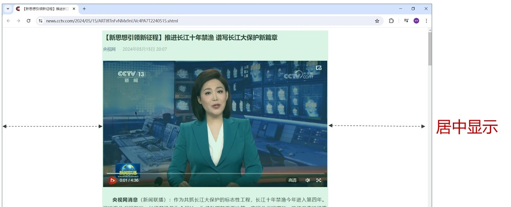
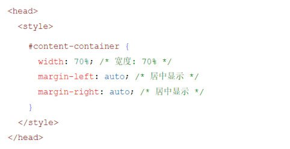
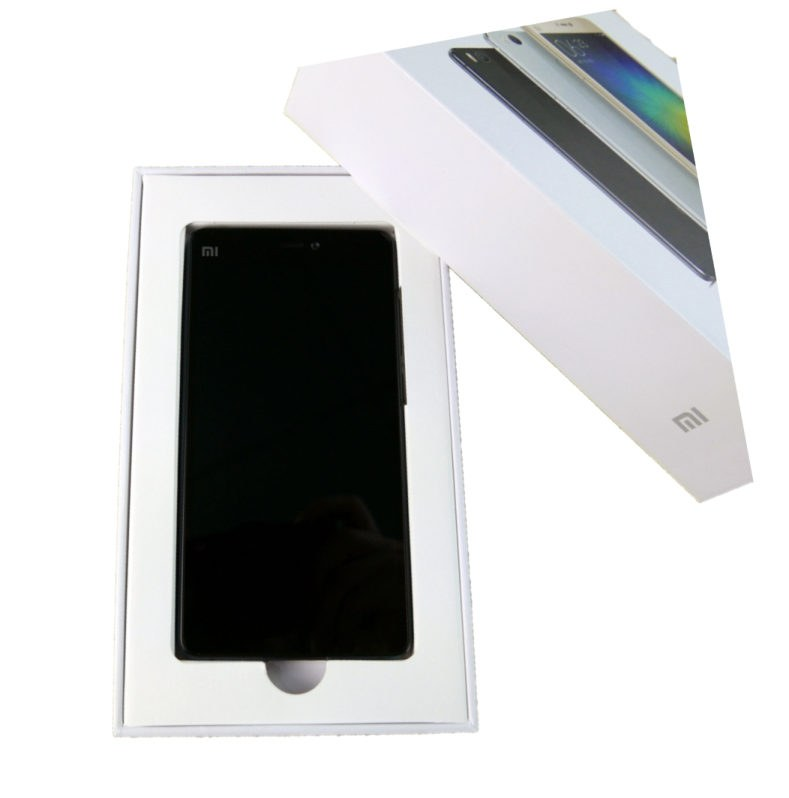
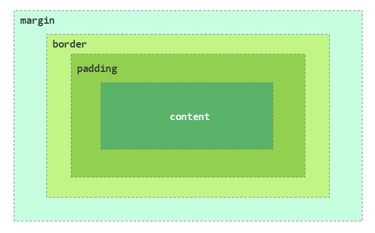
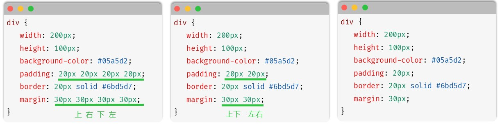
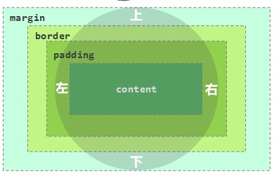

前面几篇都在改"盒子里面"的东西（文字颜色、行高、缩进）。这一篇换个视角：**页面上的每一个元素（标签）都是一个矩形盒子**，把元素当盒子看，才能调它的大小、边框和四周的留白——这才是页面布局真正在做的事。

## 先解决：整块版面怎么居中

做央视新闻页面时，把内容一层层摆好之后遇到一个问题：浏览器窗口那么宽，文字却贴着左边一长条，很难看。要的效果是**整体页面占版面的 70%，并且居中显示**。

给的提示词是：

> [!NOTE] AI 提示词
> 你是一名前端开发工程师，如何设置 html 网页的整体页面占版面的 70%，并居中显示。

答案是把所有内容用一个 `<div>` 包起来，然后给它设置宽度和外边距，课程文件 `08. 央视新闻-整体布局.html` 里就是这么做的：

```html
<head>
  <style>
    /* 整体版面居中显示 */
    #content-container {
      width: 70%;      /* 宽度: 70% —— 相对父元素（这里就是可视区域）的宽度 */
      margin: 0 auto;  /* 上下外边距 0，左右外边距自动均分 —— 于是水平居中 */
    }
  </style>
</head>

<body>
  <!-- 把整篇新闻（标题 + 正文 + 图片）都装进这个容器里 -->
  <div id="content-container">
    <h1>【新思想引领新征程】推进长江十年禁渔 谱写长江大保护新篇章</h1>
    <a href="https://www.cctv.com" target="_blank">央视网</a>
    <span class="cls" id="time">2024年05月15日 20:07</span>
    <br><br>
    <video src="video/news.mp4" controls width="100%"></video>
    <p>……</p>
  </div>
</body>
```


*图：内容容器占版面 70%、左右留白相等——虚线箭头就是两侧"自动均分"出来的外边距*

`margin: 0 auto` 也可以拆成两行写，效果完全一样（PPT 里演示的就是这种写法）：


*图：`width: 70%` 定宽度，`margin-left: auto` 与 `margin-right: auto` 把剩下的空间左右均分*

> [!TIP]
> **水平居中的固定套路**：① 先给元素一个**明确的宽度**（定宽或百分比）；② 再用 `margin: 0 auto` 让左右外边距自动均分。行内元素（如 `<span>`）不能设置宽度，所以这招对它无效。

## 盒子模型是什么

**盒子：页面中所有的元素（标签），都可以看做是一个盒子**，由盒子将页面中的元素包含在一个矩形区域内，通过盒子的视角更方便地进行页面布局。

拿快递盒打比方最直观——手机是"内容"，盒子里面的气泡膜是"内边距"，纸盒本身是"边框"，纸盒外面的空隙是"外边距"：


*图：PPT 用手机包装盒作类比——内容被一层层"包装"起来*

**盒子模型的组成**（由内到外四层）：

| 组成 | 名称 | 作用 |
| --- | --- | --- |
| **content** | 内容区域 | 元素真正装东西的地方（文字、图片），由 `width`、`height` 决定大小 |
| **padding** | 内边距区域 | 内容与边框之间的距离（盒子内部的"缓冲层"） |
| **border** | 边框区域 | 盒子自己的边框线 |
| **margin** | 外边距区域 | 这个盒子与**其它盒子**之间的距离 |


*图：由内到外依次是 content（内容）、padding（内边距）、border（边框）、margin（外边距）——这就是盒子模型*

> [!IMPORTANT]
> 记顺序：**content → padding → border → margin**（内容、内边距、边框、外边距，由内向外）。看到某个属性先问一句"它加在哪一层"，盒子模型就不会乱。

## 布局标签 `<div>` 与 `<span>`

要摆盒子，得先有盒子。网页开发中会使用 `<div>` 和 `<span>` 这两个**没有语义的布局标签**（05 篇已经介绍过，这里从"盒子能不能设宽高"的角度再看一遍）：

| 标签 | 特点 |
| --- | --- |
| `<div>` | **一行只显示一个（独占一行）**；宽度默认是**父元素的宽度**，高度默认**由内容撑开**；**可以设置宽高**（width、height） |
| `<span>` | **一行可以显示多个**；宽度和高度默认**由内容撑开**；**不可以设置宽高**（width、height） |


*图：上面是 PPT 对 div/span 特点的对比与"上右下左"方位示意，下面三个代码框是同一份样式用 4 个值、2 个值、1 个值写出来的三种等价写法*

一句话：**`<div>` 是块级元素**（独占一行、宽高可设，用来划分大区域）；**`<span>` 是行内元素**（一行多个、宽高由内容决定，用来包住一小段文字）。给 `<span>` 写 `width: 200px` 是**没有效果**的。

## padding / border / margin 的四种简写写法

这三个属性都可以一次给不同方向设不同的值，写法有四种，**都遵循"从上方开始、顺时针转一圈"的规则**：

| 写法 | 值的个数 | 含义 | 例子 |
| --- | --- | --- | --- |
| 四个值 | 4 | **上 右 下 左** | `padding: 20px 20px 20px 20px` |
| 三个值 | 3 | **上 左右 下** | `padding: 10px 20px 30px` |
| 两个值 | 2 | **上下 左右** | `padding: 20px 20px` |
| 一个值 | 1 | 上下左右**都一样** | `padding: 20px` |


*图：上下左右四个方位的名字——简写里的值就是按"上 → 右 → 下 → 左"的顺序对号入座*

课程 PPT 用同一个样式演示了其中三种：

```css
/* ① 四个值：上 20 右 20 下 20 左 20（等价于下面两个） */
div {
  width: 200px;
  height: 100px;
  background-color: #05a5d2;
  padding: 20px 20px 20px 20px;
  border: 20px solid #6bd5d7;
  margin: 30px 30px 30px 30px;
}

/* ② 两个值：上下 20、左右 20 */
div {
  width: 200px;
  height: 100px;
  background-color: #05a5d2;
  padding: 20px 20px;
  border: 20px solid #6bd5d7;
  margin: 30px 30px;
}

/* ③ 一个值：上下左右全是 20 */
div {
  width: 200px;
  height: 100px;
  background-color: #05a5d2;
  padding: 20px;
  border: 20px solid #6bd5d7;
  margin: 30px;
}
```

**三个值的规则**（PPT 没列例子，但规则是统一的）：`padding: 10px 20px 30px` = 上 10、左右 20、下 30。记住了顺序，4/3/2/1 个值都能推出来：

- 1 个值 → 四个方向都是它；
- 2 个值 → 第 1 个给上下、第 2 个给左右；
- 3 个值 → 第 1 个给上、第 2 个给左右、第 3 个给下；
- 4 个值 → 依次给上、右、下、左。

`border` 是唯一的例外——它**不能只写数值**，格式固定为"**宽度 样式 颜色**"三个部分：

```css
border: 20px solid #6bd5d7;   /* 20px 粗、实线、青色 */
```

| 部分 | 可取值举例 |
| --- | --- |
| 宽度 | `20px`、`1px` |
| 样式 | `solid`（实线） |
| 颜色 | `#6bd5d7`、`red`、`rgb(107, 213, 215)` |

## 只想改某一个方向：加"-位置"

如果只需要设置某一个方位的边框、内边距、外边距，可以在属性名后加上 `-位置`：

| 方位 | 内边距 | 外边距 | 边框 |
| --- | --- | --- | --- |
| 上 | `padding-top` | `margin-top` | `border-top` |
| 下 | `padding-bottom` | `margin-bottom` | `border-bottom` |
| 左 | `padding-left` | `margin-left` | `border-left` |
| 右 | `padding-right` | `margin-right` | `border-right` |

```css
p {
  padding-left: 40px;    /* 只在左边加 40px 内边距（比如给段落留个引用缩进） */
  margin-top: 20px;      /* 只跟上面那个盒子隔开 20px */
  border-bottom: 1px solid #b2b2b2;   /* 只加一条下边框 */
}
```

`margin: 0 auto` 里的 `auto` 就是"自动均分剩余空间"，**只有左右方向能靠 auto 居中**（上下方向的 auto 不会让元素垂直居中）。

## box-sizing：宽高到底算哪一层

写下 `width: 200px` 时，这个 200px 到底指哪一层？由 `box-sizing` 决定：

| 取值 | 含义 | 元素**总宽度** |
| --- | --- | --- |
| `content-box` | **默认值**：`width`/`height` 只设置**内容区域**的大小 | `width` + 左右 padding + 左右 border —— **会被撑大** |
| `border-box` | `width`/`height` 设置的是**内容 + 内边距 + 边框**的总和 | 就是你写的 `width` —— **不会被撑大** |

课程文件 `09. 盒子模型.html` 用的就是 `border-box`：

```html
<head>
  <style>
    #div1 {
      width: 400px;   /* 宽度: 400像素; 默认是内容展示区域的宽度 */
      height: 300px;  /* 高度: 300像素; 默认是内容展示区域的高度 */
      background-color: #ffff00;
      padding: 30px;  /* 内边距: 30像素 */
      box-sizing: border-box;             /* 宽高按"内容+内边距+边框"算 */
      border: 20px solid #ff00ff;         /* 边框: 20像素 */
      margin: 30px auto;                  /* 上下 30px、左右自动（水平居中） */
    }
  </style>
</head>

<body>
  <div id="div1">
    A A A A A A A A A A A A A A A A A A A A A A A A A A A A A A A A A A A A A A A A A A A A
  </div>
</body>
```

这个例子里 `width: 400px` + `box-sizing: border-box`，所以盒子**总宽就是 400px**，内容区只剩 `400 - 30×2 - 20×2 = 300px`；高度同理：`300 - 30×2 - 20×2 = 200px`。

> [!WARNING]
> 换成默认的 `content-box` 写同样的样式，这个盒子的总宽会变成 `400 + 30×2 + 20×2 = 500px`、总高 `400px`——**你以为写了 400，实际占了 500**，这就是"页面怎么老是被撑破"的最常见原因。做实际项目时通常一上来就统一下一句 `* { box-sizing: border-box; }`，让宽高所见即所得。

## 小结

| 类别 | 属性 | 说明 |
| --- | --- | --- |
| **盒子模型** | 作用 | 控制元素尺寸、内边距、边框、外边距，从而控制页面的布局展示 |
| | `width`、`height` | 高度、宽度 |
| | `box-sizing` | 高度和宽度的计算方式；`content-box`（默认，只算内容区）、`border-box`（含内边距和边框） |
| | `padding` | 内边距（四个值：上、右、下、左；两个值：上下、左右） |
| | `border` | 边框（宽度 样式 颜色） |
| | `margin` | 外边距（四个值：上、右、下、左；两个值：上下、左右） |
| | 方位后缀 | `padding-top`、`margin-left`、`border-bottom` … 只改某一个方向 |
| **布局标签** | `<div>` | 独占一行，宽高可设，宽度默认撑满父元素 |
| | `<span>` | 一行多个，宽高由内容撑开，不可设置宽高 |

## 相关

- [CSS选择器](/posts/编程学习/javaweb学习笔记/07-css选择器/)
- [Flex弹性布局](/posts/编程学习/javaweb学习笔记/09-flex弹性布局/)

## 练习题

### 一、知识回顾（读完直接做下面的实践题）

1. **盒子模型**：页面中**所有的元素（标签）都可以看做一个盒子**，由盒子把元素包含在一个矩形区域内，通过盒子的视角更方便地进行页面布局
2. 盒子模型的组成（由内向外）：**内容区域 content → 内边距区域 padding → 边框区域 border → 外边距区域 margin**
3. **`<div>`**：一行只显示一个（**独占一行**），宽度默认是**父元素的宽度**、高度默认**由内容撑开**，**可以设置宽高**；`<span>`：一行可以显示**多个**，宽高默认由内容撑开，**不可以设置宽高**
4. **padding/margin 简写**：四个值 = **上 右 下 左**；三个值 = **上 左右 下**；两个值 = **上下 左右**；一个值 = **四个方向都一样**
5. `border` 的写法是"**宽度 样式 颜色**"，如 `border: 20px solid #6bd5d7`（实线用 `solid`），**不能只写一个数值**
6. 只改某一个方向时，在属性名后加**方位后缀**：`padding-top`、`padding-left`、`padding-right`、`padding-bottom`，`margin` 和 `border` 同理
7. **`box-sizing: content-box`（默认）**：`width`/`height` 只指**内容区域**，元素总宽 = **width + 左右 padding + 左右 border**（会被撑大）
8. **`box-sizing: border-box`**：`width`/`height` 指的是**内容 + 内边距 + 边框**的总和，写了多少就是多少（不会被撑大）
9. **水平居中套路**：先给元素明确的宽度（`width: 70%` 或固定像素），再写 **`margin: 0 auto`**（或 `margin-left: auto` + `margin-right: auto`）让左右外边距均分剩余空间
10. `margin: 0 auto` 里的 **`auto` 只在左右方向能居中**；行内元素（`<span>`）不能设置宽度，所以居中套路对它无效

### 二、裸写题

- [ ] **2-1 让整块内容占版面 70% 并居中**
  页面里有一个装着新闻内容的容器（`<div id="content-container">`），要求：**它占浏览器宽度的 70%**，并且**左右居中显示**（上下不留额外间距）。
  （练习文件 `test_08_版面居中.html` 里有页面内容，样式写在 head 的样式区。）

  > [!TIP]- 提示（先自己想，实在想不出再点开）
  > **一级 · 思路**：居中 = 先定宽度，再把**左右两边剩下的空间均分**给它
  > **二级 · 方法**：宽度用 `width`（百分比）；左右均分用 `margin` 的**两值简写**（上下一个值、左右一个值），左右那个值写 `auto`
  > **三级 · 骨架**：`#content-container { width: ____; margin: ____ auto; }`

  > [!TIP]- 参考答案（做完再点开）
  > ```html
  > <style>
  >   #content-container {
  >     width: 70%;      /* 占版面 70% */
  >     margin: 0 auto;  /* 上下 0，左右自动均分 —— 水平居中 */
  >   }
  > </style>
  > ```
  > 对照课程 `08. 央视新闻-整体布局.html`。等价写法：`margin-left: auto; margin-right: auto;`（PPT 上演示的就是这种）。要点是**必须先有宽度**，`auto` 才有剩余空间可均分。

- [ ] **2-2 算一算：加完内边距和边框，盒子总宽变成多少**
  有一个盒子样式写着 `width: 200px; padding: 20px; border: 2px solid #05a5d2;`（**没有**写 `box-sizing`）。
  要求做两件事：
  1. 先在心里算出这个盒子在页面上**实际占多宽**，然后动手验证（浏览器 F12 的"计算样式"或元素盒模型面板能看到总宽）
  2. 如果希望**总宽就是 200px 不被撑大**，加一条属性把计算方式改掉，再验证一次
  （练习文件 `test_08_内边距与边框.html` 里有这个盒子。）

  > [!TIP]- 提示（先自己想，实在想不出再点开）
  > **一级 · 思路**：`width` 默认只管"内容区"，内边距和边框是**额外加上去**的；想让它"包在 200px 里"就得换一种计算方式
  > **二级 · 方法**：默认计算方式是 `content-box`；改用属性 `box-sizing`，值 `border-box`
  > **三级 · 骨架**：总宽 = `width` + 左右 `padding` + 左右 `border`；改造后 `____: ____;`

  > [!TIP]- 参考答案（做完再点开）
  > ```css
  > /* 第 1 问：默认 content-box 下 */
  > /* 总宽 = 200 + 20×2 + 2×2 = 244px；总高 = 100 + 40 + 4 = 144px */
  >
  > /* 第 2 问：改成 border-box，宽高含内边距与边框 */
  > .box {
  >   width: 200px;
  >   height: 100px;
  >   padding: 20px;
  >   border: 2px solid #05a5d2;
  >   box-sizing: border-box;   /* 总宽就固定是 200px，内容区剩 200-40-4 = 156px */
  > }
  > ```
  > 验证办法：浏览器里选中元素看"盒模型"面板——`content-box` 时面板上的总宽是 244（内容 200 + 内边距 40 + 边框 4）；`border-box` 时总宽 200（内容区 156）。

- [ ] **2-3 用最少的代码给盒子四边留出不同间距**
  一个盒子的需求是：**上面留 10px、左右留 20px、下面留 30px** 的外边距，同时**内边距四边都是 15px**。要求每个属性各写**一条声明**（不许拆成 `margin-top` 那样的四行）。
  （练习文件 `test_08_外边距简写.html` 里有这个盒子，它的边框是 1px 实线灰色。）

  > [!TIP]- 提示（先自己想，实在想不出再点开）
  > **一级 · 思路**：三个方向的值不一样，数一数需要几个值才能表达；四边一样的最省事
  > **二级 · 方法**：简写顺序是"从上开始顺时针"：**上 右 下 左**，中间的值同时管左右；四边相同写一个值
  > **三级 · 骨架**：`margin: ____ ____ ____;` / `padding: ____;`

  > [!TIP]- 参考答案（做完再点开）
  > ```css
  > .box {
  >   margin: 10px 20px 30px;   /* 上 10、左右 20、下 30 */
  >   padding: 15px;            /* 四边都是 15px */
  >   border: 1px solid #b2b2b2;
  > }
  > ```
  > 三个值的规则：**第 1 个给上、第 2 个给左右、第 3 个给下**。要写成四个值就是 `margin: 10px 20px 30px 20px;`（上右下左），效果完全一样——三个值只是省掉"下和上相同时"的重复。

- [ ] **2-4 只给左侧留出缩进**
  有一段引用的文字（`<p class="quote">`），要求：**只在左边**留 40px 的空白（把文字往右推），右边、上下都不动；再给它**只加一条下边框**（1px 实线浅灰 `#b2b2b2`）。
  （练习文件 `test_08_方位后缀.html` 里有这段文字。）

  > [!TIP]- 提示（先自己想，实在想不出再点开）
  > **一级 · 思路**：只要一边有效果，那就别用简写（简写会同时管四个方向），改成"属性名 + 方位"
  > **二级 · 方法**：内边距的左边是 `padding-left`；边框的下边是 `border-bottom`，格式仍是"宽度 样式 颜色"
  > **三级 · 骨架**：`.quote { ____-____: 40px; ____-____: 1px solid ____; }`

  > [!TIP]- 参考答案（做完再点开）
  > ```css
  > .quote {
  >   padding-left: 40px;                     /* 只在左内侧留 40px */
  >   border-bottom: 1px solid #b2b2b2;       /* 只加一条下边框 */
  > }
  > ```
  > 方位后缀有八种：`padding-top/right/bottom/left`、`margin-…`、`border-…`。PPT 的原话是"**如果只需要设置某一个方位的边框、内边距、外边距，可以在属性名后加上 –位置**"。

### 三、综合题

- [ ] **3-1 给新闻页面做一块"卡片"**
  练习文件里准备好了页面骨架：一个内容容器（`#content-container`）里面放一行标题、一段正文，正文后面还有一张"延伸阅读卡片"（`<div class="card">`）。按步骤做：

  1. **整体居中**：让 `#content-container` 占版面 70%，上下不留间距、左右居中
  2. **卡片内部留白**：卡片四边内边距都是 20px
  3. **卡片边框**：加 2px 实线边框、颜色 `#05a5d2`
  4. **卡片与上方正文隔开**：上外边距 30px、左右 0、下外边距 30px（用一条三值简写）
  5. **锁住卡片尺寸**：把卡片的宽高计算方式改成"含内边距和边框"，让 `width: 600px` 就是实际占的宽度
  6. **验证**：做完打开浏览器 F12 检查两件事——内容容器左右两侧留白是否相等；卡片在改成第 5 步之前和之后的**总宽**分别是 644px 和 600px（4+5 两步前后的差别）

  > [!TIP]- 提示（先自己想，实在想不出再点开）
  > **一级 · 思路**：第 1 步用"定宽 + 左右 auto"；第 2~4 步都在给这个盒子加"层"——内边距、边框、外边距；第 5 步换宽高的计算方式
  > **二级 · 方法**：`width` + `margin: 0 auto`；`padding` 一个值；`border: 2px solid #05a5d2`；`margin: 30px 0`… 注意第 4 步要求上下都是 30 但左右为 0，需要用**三值**简写；`box-sizing: border-box`
  > **三级 · 骨架**：`#content-container { width: ____; margin: 0 ____; }` / `.card { padding: ____; border: ____ solid ____; margin: ____ ____ ____; box-sizing: ____; width: 600px; }`

  > [!TIP]- 参考答案（做完再点开）
  > ```html
  > <style>
  >   /* 1. 整体版面占 70% 并居中 */
  >   #content-container {
  >     width: 70%;
  >     margin: 0 auto;
  >   }
  >
  >   /* 2~5. 延伸阅读卡片 */
  >   .card {
  >     width: 600px;
  >     padding: 20px;                  /* 四边内边距 20px */
  >     border: 2px solid #05a5d2;      /* 2px 实线边框 */
  >     margin: 30px 0 30px;            /* 上 30、左右 0、下 30 */
  >     box-sizing: border-box;         /* 600px 就是实际总宽 */
  >   }
  > </style>
  > ```
  > 第 6 步的答案：**不写 `box-sizing` 时**（content-box）卡片总宽 = `600 + 20×2 + 2×2 = 644px`；写了 `border-box` 之后总宽回到 **600px**，内容区 556px。`#content-container` 的左右留白相等（各占 `(100% - 70%) / 2`）。
  > `margin: 30px 0 30px` 也可以写成 `margin-top: 30px; margin-bottom: 30px;`——但用三值简写一行更符合"能简写就简写"的习惯。
