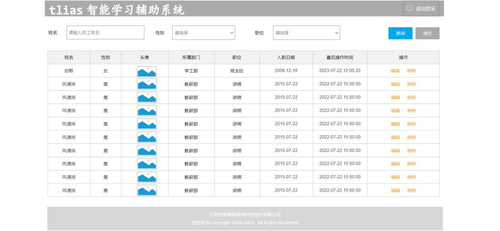
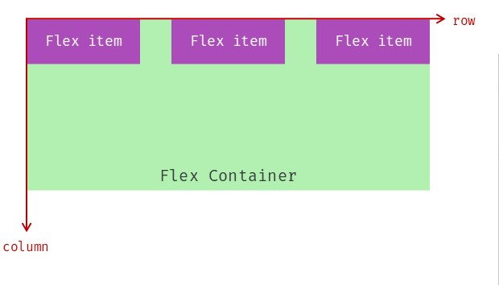
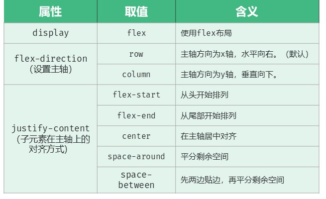
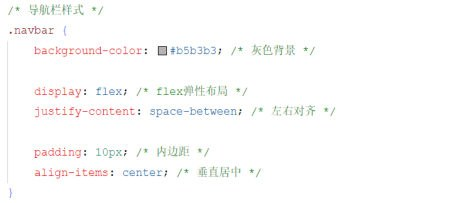

08 篇把"一个盒子"的里里外外都调明白了。但页面是**一排排盒子**：怎么让"标题靠左、退出登录靠右"在同一行里自动分开？靠 `margin` 一个个算也可以，但很难算准——这一篇用 **flex 弹性布局**一次性解决。

## 案例背景：Tlias 员工管理页面

从这一篇开始做课程的第二个案例：**参照页面原型，完成员工管理页面制作**。页面整体分四个区域：


*图：页面原型上标出的第一个部分是顶部导航栏（灰底、左边标题、右边"退出登录"）*

**页面原型：指在应用程序开发初期，由产品经理制作的一个早期项目模型**，它用于展示页面的基本布局、功能和交互设计。通常用来帮助设计师、开发者等更好地理解和讨论最终产品的外观和行为。

四个区域按顺序实现：**① 顶部导航栏 → ② 搜索表单区域 → ③ 表格数据展示区域 → ④ 底部版权区域**。这一篇先做第一个，它的提示词是：

> [!NOTE] AI 提示词
> 你是一名前端开发工程师，帮我生成一个 HTML 页面，页面整体有 4 个部分组成，先来实现第一个部分…

## flex 是什么

**flex 是 flexible Box（弹性盒子）的缩写，意为"弹性布局"，是一种一维的布局模型**。flex 布局可以为元素之间提供强大的**空间分布**和**对齐能力**。

- **一维布局模型**：只管一个方向——横着排或者竖着排（一次解决一个方向的分布问题）；
- **空间分布**：子元素之间怎么分剩余的空间（贴边、均分、散开）；
- **对齐能力**：子元素在另一个方向上怎么对齐（靠上、居中、靠下）。

用法上最反直觉的一点：

> [!IMPORTANT]
> **flex 的属性写在"父容器"身上，控制的是"子元素"的位置和排列方式。** 也就是说，想让三个 `<div>` 横着排开会散开，就给**包着它们的那一层**加 `display: flex`，而不是给这三个 `<div>` 分别加。

两个术语：

| 术语 | 指的是 | 例子 |
| --- | --- | --- |
| **Flex Container** | 弹性容器：加了 `display: flex` 的**父元素** | `<div id="container">` |
| **Flex item** | 弹性项目：容器里**直接被它包着的子元素** | 三个 `<div class="item">` |


*图：绿色的是 Flex Container，紫色的是 Flex item；`row` 箭头是主轴方向（水平向右），`column` 箭头是交叉轴方向（垂直向下）*

## flex 的三个属性

PPT 给了完整的属性表：

| 属性 | 取值 | 含义 |
| --- | --- | --- |
| `display` | `flex` | 使用 flex 布局 |
| `flex-direction`（设置主轴） | `row` | 主轴方向为 **x 轴，水平向右**。（默认） |
| | `column` | 主轴方向为 **y 轴，垂直向下**。 |
| `justify-content`（子元素在主轴上的对齐方式） | `flex-start` | **从头开始排列** |
| | `flex-end` | **从尾部开始排列** |
| | `center` | **在主轴居中对齐** |
| | `space-around` | **平分剩余空间** |
| | `space-between` | **先两边贴边，再平分剩余空间** |


*图：PPT 原表——最左列是属性名，中间是取值，右边是含义*

### display: flex 与 flex-direction

```css
#container {
  display: flex;        /* ① 开启 flex 布局（写在父容器上） */
  flex-direction: row;  /* ② 主轴方向：row 水平（默认值，不写也是它） */
}
```

`flex-direction` 决定"主轴"朝哪边——**主轴的默认值是 `row`（水平向右）**，所以只写 `display: flex` 时，子元素就自动排成一行；改成 `column` 就变成一列（`column` 就是"列"的意思）：

```css
#container {
  display: flex;
  flex-direction: column;   /* 主轴方向为 y 轴，垂直向下，子元素从上往下排 */
}
```

`justify-content` 管的就是**沿主轴方向**的排列方式：主轴是 `row` 时它管"左右怎么分布"，主轴换成 `column` 时它管的就是"上下怎么分布"。

### justify-content 的五个取值

```css
#container {
  display: flex;
  justify-content: space-between;   /* 子元素在主轴上的对齐方式 */
}
```

| 取值 | 效果 |
| --- | --- |
| `flex-start` | 全部挤在**开头**（默认就相当于这个） |
| `flex-end` | 全部挤在**末尾** |
| `center` | 整体在主轴**居中** |
| `space-around` | 每个子元素的**两侧留白相等**（最外侧留白是相邻间隙的一半） |
| `space-between` | **两端贴边，中间的间隙平分**剩余空间 |

> [!TIP]
> `space-between` 是日常用得最多的一个：**"一行两端的两个东西"**（左边标题 + 右边退出登录、左边文字 + 右边按钮）直接就用它，中间不用写任何间距。

## 案例实战：顶部导航栏

课程文件 `10. Tlias案例-顶部导航栏.html` 的完整做法——外层 `div` 当 Flex Container，里面放标题和链接两个子元素：

```html
<head>
  <style>
    /* 导航栏样式 */
    .navbar {
      background-color: #b5b3b3;          /* 灰色背景 */

      display: flex;                      /* flex弹性布局 */
      justify-content: space-between;     /* 左右对齐：标题贴左、链接贴右 */

      padding: 10px;                      /* 内边距 */
      align-items: center;                /* 垂直居中 */
    }
    .navbar h1 {
      margin: 0;                          /* 移除默认的上下外边距 */
      font-weight: bold;                  /* 加粗 */
      color: white;
      /* 设置字体为楷体 */
      font-family: "楷体";
    }
    .navbar a {
      color: white;                       /* 链接颜色为白色 */
      text-decoration: none;              /* 移除下划线 */
    }
  </style>
</head>
<body>
  <!-- 顶部导航栏 -->
  <div class="navbar">
    <h1>Tlias智能学习辅助系统</h1>
    <a href="#">退出登录</a>
  </div>
</body>
```


*图：PPT 上截的就是这段 `.navbar` 样式——`display: flex` 开启弹性布局、`justify-content: space-between` 一行分两端、`align-items: center` 垂直居中*

代码里有五个点值得说清楚：

1. **`display: flex` 写在 `.navbar` 上**，管的是里面的 `<h1>` 和 `<a>` 两个子元素——这是 flex 最核心的使用姿势。
2. **`justify-content: space-between` 一步实现"标题居左、退出登录居右"**：两个子元素各自贴到主轴的**两端**，中间的空间自动留出来，不用给任何一个子元素写 `margin`。
3. **`padding: 10px`** 用的是 08 篇讲的内边距简写（一个值 = 四边都是 10px），让文字不要贴着导航栏的边。
4. **`align-items: center`** 是正文 PPT 属性表之外的补充（案例代码里用到）：它以**交叉轴**为准做对齐——主轴是水平方向时，它管的是"**垂直方向居中**"，让标题和链接在导航栏高度里上下居中。名字好记：`justify-content` 管主轴、`align-items` 管交叉轴。
5. **`h1` 要写 `margin: 0`**：浏览器给标题标签自带一圈默认外边距（这正是 08 篇的盒子模型——`margin` 是外边距那一层），不删掉的话导航栏上下会多出空白、撑得过高。

> [!WARNING]
> **`display: flex` 要加在"包着它们的那一层"上**。如果把 `display: flex` 写在了子元素（比如 `<h1>`）身上，那条 "space-between" 就没有任何效果——这是初学者最常犯的错。

## 小结

| 要点 | 内容 |
| --- | --- |
| flex 的作用 | 是一种**一维的布局模型**，为元素之间提供强大的**空间分布和对齐能力** |
| 加在哪 | 通过给**父容器**添加 flex 的相关属性，来控制**子元素**的位置和排列方式 |
| `display: flex` | 使用 flex 布局（写在父容器上） |
| `flex-direction` | 设置主轴方向：`row`（x 轴、水平向右、**默认**）、`column`（y 轴、垂直向下） |
| `justify-content` | 子元素在**主轴**上的对齐方式：`flex-start` 从头、`flex-end` 从尾、`center` 居中、`space-around` 平分剩余空间、`space-between` 先两边贴边再平分剩余空间 |
| 案例里的用法 | 顶部导航栏：`.navbar` 加 `display: flex` + `justify-content: space-between` → **标题居左、退出登录居右** |

## 相关

- [CSS盒子模型](/posts/编程学习/javaweb学习笔记/08-css盒子模型/)
- [HTML表单与表格标签](/posts/编程学习/javaweb学习笔记/10-html表单与表格标签/)

## 练习题

### 一、知识回顾（读完直接做下面的实践题）

1. **flex 是 flexible Box 的缩写**，意为"**弹性布局**"，是一种**一维的布局模型**，为元素之间提供强大的**空间分布和对齐能力**
2. **flex 属性写在父容器上**，控制的是**子元素**的位置和排列方式；被控制的父元素叫 **Flex Container**，里面的子元素叫 **Flex item**
3. 开启 flex 布局的属性是 **`display: flex`**
4. **`flex-direction` 设置主轴方向**：`row` 主轴为 x 轴、水平向右（**默认值**）；`column` 主轴为 y 轴、垂直向下
5. **`justify-content` 控制子元素在主轴上的对齐方式**，五个取值：`flex-start`（从头开始排列）、`flex-end`（从尾部开始排列）、`center`（在主轴居中对齐）、`space-around`（平分剩余空间）、`space-between`（先两边贴边，再平分剩余空间）
6. **做"标题居左、退出登录居右"**：父容器加 `display: flex` + **`justify-content: space-between`**，两个子元素自动贴到主轴两端
7. **`align-items: center`** 沿**交叉轴**对齐（主轴水平时它就是"垂直居中"，案例代码里用到）；`justify-content` 管主轴、`align-items` 管交叉轴
8. 导航栏案例里 `<h1>` 要写 **`margin: 0`**，因为标题标签自带默认外边距，不删会让导航栏被撑高
9. 案例里链接的样式是 **`text-decoration: none`**（去掉下划线）+ `color: white`；标题用 `font-family: "楷体"` 和 `font-weight: bold`
10. `justify-content` 的效果**跟着主轴走**：主轴换成 `column` 之后，它管的就是子元素"**从上往下的分布**"（比如 `center` 变成垂直居中）

### 二、裸写题

- [ ] **2-1 三个方块横向排开，两端贴边、中间均分**
  容器里有三个方块，要求：**横着排成一行**，第一个贴着左边、第三个贴着右边，剩下的空间在它们之间的空隙里**平分**。
  （练习文件 `test_09_两端贴边.html` 里有容器和三个方块，样式写在 head 的样式区。）

  > [!TIP]- 提示（先自己想，实在想不出再点开）
  > **一级 · 思路**："横着排" + "两端贴边、中间均分" → 用弹性布局，而且是"先两边贴边再平分"的那个取值
  > **二级 · 方法**：父容器加 `display: flex`（默认主轴就是水平方向）；对齐方式用 `justify-content: space-between`
  > **三级 · 骨架**：`#container { display: ____; justify-content: ____; }`

  > [!TIP]- 参考答案（做完再点开）
  > ```css
  > #container {
  >   display: flex;                  /* 开启 flex 布局，主轴默认水平向右 */
  >   justify-content: space-between; /* 先两边贴边，再平分剩余空间 */
  > }
  > ```
  > 对照课程 `11. flex布局.html`（那份文件改的就是这一条 `justify-content`）。注意三个方块**不要**写 `margin`——空隙是 flex 自己分出来的。

- [ ] **2-2 三个方块的间距要"散得均匀"**
  同样三个方块横排，这次要求：**每个方块左右两侧的留白一样多**（所以方块之间的空隙看起来比两端到边缘的距离大一倍）。
  （练习文件 `test_09_均分间距.html` 里有容器和三个方块。）

  > [!TIP]- 提示（先自己想，实在想不出再点开）
  > **一级 · 思路**：还是横向排 + 分剩余空间，但这次是"每块两边都留白"，不是"两端贴边"
  > **二级 · 方法**：`display: flex` + `justify-content` 的 **`space-around`**
  > **三级 · 骨架**：`#container { display: ____; justify-content: ____; }`

  > [!TIP]- 参考答案（做完再点开）
  > ```css
  > #container {
  >   display: flex;
  >   justify-content: space-around;   /* 平分剩余空间：每个元素两侧留白相等 */
  > }
  > ```
  > `space-around` 与 `space-between` 的差别就在**两端**：`space-between` 两端贴边（第一个元素左边没有空隙），`space-around` 两端也留白（等于相邻间隙的一半）。PPT 上这两个取值的描述分别是"**平分剩余空间**"和"**先两边贴边，再平分剩余空间**"。

- [ ] **2-3 让三个方块竖着排，并且整体上下居中**
  容器高度 300px，里面三个方块现在横着排。要求：改成**从上往下竖着排**，而且这一列**在容器里上下居中**。
  （练习文件 `test_09_竖排居中.html` 里有容器和三个方块。）

  > [!TIP]- 提示（先自己想，实在想不出再点开）
  > **一级 · 思路**：排列方向由"主轴"决定，改主轴方向就能从横排变竖排；居中仍然是 `justify-content`，只是这次它沿的主轴变成了上下方向
  > **二级 · 方法**：`flex-direction` 改成 `column`（y 轴、垂直向下）；`justify-content` 用 `center`
  > **三级 · 骨架**：`#container { display: flex; flex-direction: ____; justify-content: ____; }`

  > [!TIP]- 参考答案（做完再点开）
  > ```css
  > #container {
  >   display: flex;
  >   flex-direction: column;   /* 主轴方向为 y 轴，垂直向下 */
  >   justify-content: center;  /* 子元素在主轴（此时是上下方向）居中对齐 */
  > }
  > ```
  > 验证一下 `justify-content` "跟着主轴走"：把 `flex-direction` 换回 `row`，`center` 就变成**水平居中**了。课件里那句"**子元素在主轴上的对齐方式**"，就是提醒你别把它当成固定的"左右对齐"。

### 三、综合题

- [ ] **3-1 照着课程案例做 Tlias 的顶部导航栏**
  练习文件里已经给了 `<div class="navbar">`（里面一个标题和一个"退出登录"链接）。按步骤做：

  1. **让标题和退出登录排到同一行**：给导航栏开启弹性布局
  2. **一行分两端**：标题贴左、退出登录贴右（一条属性）
  3. **上下也要对齐**：让两个子元素在导航栏里**垂直居中**
  4. **留白与底色**：四边内边距 10px；背景色 `#b5b3b3`
  5. **标题样式**：去掉 `<h1>` 自带的上下外边距、白色、加粗、字体"楷体"（`font-family: "楷体"`）
  6. **链接样式**：白色、去掉下划线
  7. **观察题**：把第 1~3 步里的 `flex-direction` 临时改成 `column`，刷新看效果——说明为什么"标题居左、退出登录居右"在这时就不成立了

  > [!TIP]- 提示（先自己想，实在想不出再点开）
  > **一级 · 思路**：导航栏就是一个"一行两格"的弹性容器；第 1~3 步全是写在**父容器** `.navbar` 上的属性
  > **二级 · 方法**：`display: flex` / `justify-content: space-between` / `align-items: center` / `padding` / `background-color`；标题 `margin: 0`、`color: white`、`font-weight: bold`、`font-family`；链接 `color: white`、`text-decoration: none`
  > **三级 · 骨架**：`.navbar { display: ____; justify-content: ____; align-items: ____; padding: ____; background-color: ____; }`

  > [!TIP]- 参考答案（做完再点开）
  > ```html
  > <style>
  >   /* 导航栏样式 */
  >   .navbar {
  >     background-color: #b5b3b3;        /* 灰色背景 */
  >     display: flex;                    /* flex弹性布局 */
  >     justify-content: space-between;   /* 左右对齐 */
  >     padding: 10px;                    /* 内边距 */
  >     align-items: center;              /* 垂直居中 */
  >   }
  >   .navbar h1 {
  >     margin: 0;                        /* 移除默认的上下外边距 */
  >     font-weight: bold;                /* 加粗 */
  >     color: white;
  >     font-family: "楷体";
  >   }
  >   .navbar a {
  >     color: white;                     /* 链接颜色为白色 */
  >     text-decoration: none;            /* 移除下划线 */
  >   }
  > </style>
  > <body>
  >   <div class="navbar">
  >     <h1>Tlias智能学习辅助系统</h1>
  >     <a href="#">退出登录</a>
  >   </div>
  > </body>
  > ```
  > 第 7 步的答案：`flex-direction: column` 把**主轴换成了上下方向**，`justify-content` 的"两端贴边"就变成"**上端贴顶、下端贴底**"，两个子元素也就一上一下竖着排了——`space-between` 本身没变，变的是它作用的那条轴。
