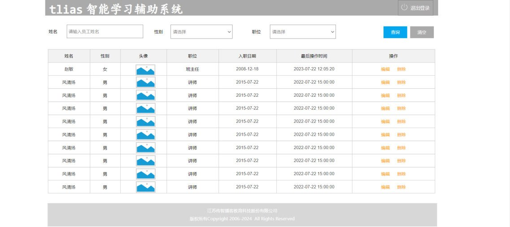
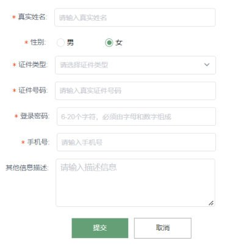
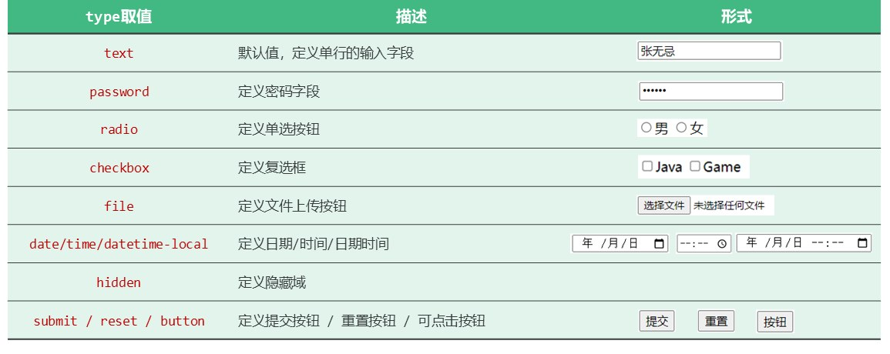
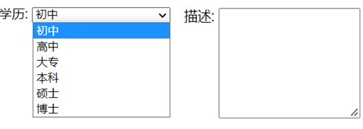
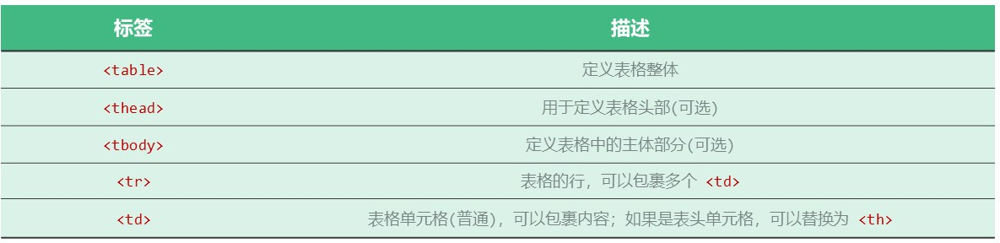
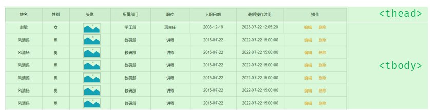

09 篇把顶部导航栏做好了。页面接下来要干两件事：**让用户填东西**（搜索条件、注册信息）和**把一堆数据摆整齐**（员工列表）——前者靠**表单标签**，后者靠**表格标签**。这一篇把这两类标签一次讲完。

## 案例背景：第二个、第三个区域

Tlias 页面原型里，导航栏下面就是这两个区域：


*图：导航栏下面是"搜索表单区域"（一排查询条件 + 查询/清空按钮），再下面是"表格数据展示区域"（姓名/性别/头像/职位/入职日期…）*

对应的提示词分别是：

> [!NOTE] AI 提示词
> 再继续帮我生成第二个部分：2. 搜索表单区域…
>
> 再继续帮我生成第三个部分：3. 表格数据展示区域…

## 表单：网页的数据采集器

**表单：在网页中主要负责数据采集功能**，如注册、登录等数据采集。

生活里到处都是表单——注册页面要填用户名/手机号/密码/验证码，实名认证要填证件信息、选性别、选证件类型，登录框要填账号密码：


*图：一个典型表单：若干个输入框 + 一个提交按钮（每个框里还有灰字的提示语）*


*图：复杂一点的表单——单选框（性别）、下拉列表（证件类型）、文本域（其它信息描述）都上场了*

表单由三部分组成：

| 组成 | 标签 | 说明 |
| --- | --- | --- |
| **表单标签** | `<form>` | 把整张表单圈起来，管"这批数据提交到哪、怎么提交" |
| **表单项** | `<input>` | 不同类型的 input 元素，通过 `type` 属性控制输入形式（text/password/…） |
| | `<select>` | 定义下拉列表 |
| | `<textarea>` | 定义文本域（多行输入框） |

先看最小的一个表单（课程文件 `12. 表单标签.html`）：

```html
<form action="/save" method="post">
  姓名: <input type="text" name="name">
  年龄: <input type="text" name="age">
  <input type="submit" value="提交">
</form>
```

> [!IMPORTANT]
> **表单项要想能够采集数据，必须设置 `name` 属性**，它表示这个表单项的"名字"。后端收到的是 `name=值` 这样成对的数据——**没写 `name` 的输入框，用户填了也提交不上去**。

## `<form>` 的两个属性：action 与 method

| 属性 | 作用 |
| --- | --- |
| `action` | 规定当提交表单时向何处发送表单数据，值是 **URL**（表单数据提交的 url 地址） |
| `method` | 规定用于发送表单数据的方式，取值 **GET、POST** |

`method` 的两种方式差别很大：

| 对比项 | GET | POST |
| --- | --- | --- |
| 数据放在哪 | 拼在 **url 后面**，如 `/save?name=java` | 在**请求体**（消息体）中携带 |
| 大小限制 | **有大小限制**（浏览器对 url 长度有限制），不适合提交大数据量的表单 | **没有大小限制** |
| 安全性 | **不安全**：url 谁都能看到，含隐私数据不推荐 | **安全**：数据在请求体里 |
| 典型用途 | 查询、搜索这类"取数据"的请求 | 提交注册/登录/保存这类"送数据"的请求 |

```html
<!-- 数据会以 /save?name=Tom&age=18 的形式发出去，隐私数据一眼可见 -->
<form action="/save" method="get">
  姓名: <input type="text" name="name">
  <input type="submit" value="提交">
</form>

<!-- 数据放在请求体里发出去，url 上看不到 -->
<form action="/save" method="post">
  姓名: <input type="text" name="name">
  <input type="submit" value="提交">
</form>
```

> [!TIP]
> `method` 不写时默认是 **GET**。课程案例里两个表单一个都没省：搜索表单用 `method="post"`、注册这类都是 `post`。后面学后端时你会再见到这两种请求方式——**这里记住"数据放哪儿"和"有没有大小限制"这两个差别就够了**。

## 表单项一：`<input>` 的 type 取值

`<input>` 是表单项里出场最多的一个，**通过 `type` 属性控制输入形式**：

| type 取值 | 描述 | 页面上长什么样 |
| --- | --- | --- |
| `text` | 默认值，定义单行的输入字段 | 一个可以打字的方框（如 `张无忌`） |
| `password` | 定义密码字段 | 输入内容显示成圆点 `······` |
| `radio` | 定义单选按钮 | ○ 男 ○ 女（一组里只能选一个） |
| `checkbox` | 定义复选框 | □ Java □ Game（可以选多个） |
| `file` | 定义文件上传按钮 | 一个"选择文件"按钮 + "未选择任何文件" |
| `date` / `time` / `datetime-local` | 定义日期 / 时间 / 日期时间 | 带日历/时钟图标的日期时间选择器 |
| `hidden` | 定义隐藏域 | 页面上看不见，但数据照样提交 |
| `submit` / `reset` / `button` | 定义提交按钮 / 重置按钮 / 可点击按钮 | 三个小按钮：提交、重置、按钮 |


*图：PPT 原表——每一行右边都直接给出了该类型的实际外观（文字、圆点、单选框、复选框、文件上传、日期时间、按钮）*

课程文件 `13. 表单项标签.html` 把常用的类型挨个写了一遍：

```html
<!-- value: 表单项提交的值 -->
<form action="/save" method="post">
  姓名: <input type="text" name="name"> <br><br>

  密码: <input type="password" name="password"> <br><br>

  性别: <input type="radio" name="gender" value="1"> 男
        <label><input type="radio" name="gender" value="2"> 女 </label> <br><br>

  爱好: <label><input type="checkbox" name="hobby" value="java"> java </label>
        <label><input type="checkbox" name="hobby" value="game"> game </label>
        <label><input type="checkbox" name="hobby" value="sing"> sing </label> <br><br>

  图像: <input type="file" name="image">  <br><br>

  生日: <input type="date" name="birthday"> <br><br>

  时间: <input type="time" name="time"> <br><br>

  日期时间: <input type="datetime-local" name="datetime"> <br><br>

  学历: <select name="degree">
            <option value="">----------- 请选择 -----------</option>
            <option value="1">大专</option>
            <option value="2">本科</option>
            <option value="3">硕士</option>
            <option value="4">博士</option>
        </select>  <br><br>

  描述: <textarea name="description" cols="30" rows="10"></textarea>  <br><br>

  <input type="hidden" name="id" value="1">

  <!-- 表单常见按钮 -->
  <input type="button" value="按钮">
  <input type="reset" value="重置">
  <input type="submit" value="提交">
  <br>
</form>
```

这段代码里有几个必须掌握的细节：

1. **`name` 相同的单选框是一组**：两个 `type="radio"` 都写了 `name="gender"`，所以它们**互斥**（选了男就选不了女）。如果两份 name 不一样，就变成两组单选框、能同时选中——这是单选按钮最常见的错。
2. **`value` 是"提交出去的值"**：页面上显示的是"男"，提交给服务器的却是 `gender=1`。复选框同理：勾了 Java 提交的是 `hobby=java`。
3. **下拉列表的 `<option>` 也靠 `value` 提交**，第一个 `value=""` 的"请选择"是**占位项**（默认选中一个空的，逼用户自己选）。
4. **`hidden` 隐藏域**：页面看不见，但 `id=1` 会跟表单一起提交——用来悄悄带上一个不需要用户填、但后端要用的值（比如"当前正在编辑的是哪条数据"）。
5. **三种按钮的差别**：`submit` 提交表单、`reset` 把表单里的内容恢复成初始值、`button` 只是个可点击按钮（点了不干任何事，行为要靠 JavaScript）。

> [!NOTE] 补充：`<label>` 是"标签"，在课程代码里配合表单项使用。`<label><input type="checkbox" …> java </label>` 这种包起来的写法，可以让**点文字也能勾选**；另一种写法是 `<label for="name">姓名：</label>` + `<input id="name">`（`for` 的值等于输入框的 `id`）。PPT 没有展开讲，但案例代码里到处都在用。

## 表单项二、三：`<select>` 与 `<textarea>`


*图：左边是下拉列表（点开后有初中/高中/大专/本科/硕士/博士若干选项），右边是文本域（一个可以输入多行的大方框）*

- **`<select>`**：定义**下拉列表**，里面的 **`<option>` 定义列表项**（每一项。`<select>` 要有 `name`，`<option>` 要有 `value`）：

```html
<select name="degree">
  <option value="">----------- 请选择 -----------</option>
  <option value="1">大专</option>
  <option value="2">本科</option>
</select>
```

- **`<textarea>`**：定义**文本域**（多行输入框），用 `cols`（列数/宽度）和 `rows`（行数/高度）控制大小：

```html
<textarea name="description" cols="30" rows="10"></textarea>
```

| 标签 | 作用 | 关键属性 |
| --- | --- | --- |
| `<select>` / `<option>` | 下拉列表 / 列表项 | `name`（列表名）、`value`（该项提交的值） |
| `<textarea>` | 文本域（多行文本） | `name`、`cols`、`rows` |

## 表格标签

第三个区域要把员工数据一行行列出来，用的是表格标签：

| 标签 | 描述 |
| --- | --- |
| `<table>` | 定义表格**整体** |
| `<thead>` | 用于定义表格**头部**（可选） |
| `<tbody>` | 定义表格中的**主体部分**（可选） |
| `<tr>` | 表格的**行**，可以包裹多个 `<td>` |
| `<td>` | 表格**单元格**（普通），可以包裹内容；如果是表头单元格，可以替换为 `<th>` |


*图：PPT 原表——五个表格标签各自的描述（`<table>` 表格整体、`<thead>` 表头可选、`<tbody>` 主体可选、`<tr>` 行、`<td>` 单元格）*


*图：一张表格被分成两截——上面那一行（表头）属于 `<thead>`，下面所有数据行属于 `<tbody>`*

结构关系一句话记住：**`<table>` 里放 `<thead>` 和 `<tbody>`；它们里面放 `<tr>`（行）；`<tr>` 里面放 `<td>`（单元格）或 `<th>`（表头单元格）**。

```html
<table>
  <!-- 表头：thead 里的一行，单元格用 th -->
  <thead>
    <tr>
      <th>姓名</th>
      <th>职位</th>
      <th>入职日期</th>
    </tr>
  </thead>

  <!-- 表格主体：tbody 里可以有多行 -->
  <tbody>
    <tr>
      <td>令狐冲</td>
      <td>讲师</td>
      <td>2021-06-15</td>
    </tr>
    <tr>
      <td>任盈盈</td>
      <td>咨询师</td>
      <td>2021-07-20</td>
    </tr>
  </tbody>
</table>
```

课程文件 `15. Tlias案例-表格数据展示区域.html` 就是按这个结构写的（单元格里还放了头像图片和"编辑/删除"按钮）：

```html
<table>
  <!-- 表头 -->
  <thead>
    <tr>
      <th>姓名</th>
      <th>性别</th>
      <th>头像</th>
      <th>职位</th>
      <th>入职日期</th>
      <th>最后操作时间</th>
      <th>操作</th>
    </tr>
  </thead>

  <!-- 表格主体内容 -->
  <tbody>
    <tr>
      <td>令狐冲</td>
      <td>男</td>
      <td></td>
      <td>讲师</td>
      <td>2021-06-15</td>
      <td>2024-09-16 15:30</td>
      <td class="action-buttons">
        <button type="button">编辑</button>
        <button type="button">删除</button>
      </td>
    </tr>
    <!-- 后面还有若干行 -->
  </tbody>
</table>
```

配套的表格样式（同一份课程文件里的 CSS，PPT 没展开，先知道"表格默认很丑、要加这些"就行）：

```css
table {
  width: 100%;
  border-collapse: collapse;   /* 相邻单元格的边框合并成一条，表格才不会像网格线 */
}
th, td {
  border: 1px solid #ddd;      /* 单元格边框 */
  padding: 8px;                /* 单元格内边距 */
  text-align: center;          /* 内容居中 */
}
th {
  background-color: #f2f2f2;   /* 表头灰底 */
  font-weight: bold;
}
```

> [!WARNING]
> `<table>` 里**直接写 `<tr>` 也是合法的**（浏览器会自动补一层 `<tbody>`），但课程案例的写法是**把 `<thead>` 和 `<tbody>` 都写全**——语义清楚，后面用 CSS/JS 分别控制表头和数据行也方便。另外别把 `<td>` 和 `<th>` 写混：**表头单元格用 `<th>`**（默认加粗居中），数据单元格用 `<td>`。

## 小结

| 类别 | 标签 / 属性 | 说明 |
| --- | --- | --- |
| **表单** | `<form>` | 定义表单（属性：`action` 提交地址、`method` 提交方式 GET/POST） |
| | `<input type="text/button/…">` | 表单项（文本输入框、按钮等），`type` 控制形式、`name` 决定能否被提交、`value` 是提交的值 |
| | `<select>` / `<option>` | 表单项（下拉列表 / 列表项） |
| | `<textarea>` | 表单项（文本域，多行输入） |
| **表格** | `<table>`、`<thead>`、`<tbody>` | 表格、表头、表格主体 |
| | `<tr>` / `<th>`、`<td>` | 行 / 表头单元格、普通单元格 |
| 注意 | 表单项必须有 `name` | 没有 `name` 的表单项**采集不到数据** |

## 相关

- [Flex弹性布局](/posts/编程学习/javaweb学习笔记/09-flex弹性布局/)
- [CSS盒子模型](/posts/编程学习/javaweb学习笔记/08-css盒子模型/)

## 练习题

### 一、知识回顾（读完直接做下面的实践题）

1. **表单**在网页中主要负责**数据采集**功能（注册、登录等）；表单标签是 **`<form>`**，表单项包括**不同类型的 input 元素、下拉列表、文本域**
2. 表单项三种标签：**`<input>`**（通过 `type` 属性控制输入形式）、**`<select>`**（下拉列表，里面的 **`<option>` 定义列表项**）、**`<textarea>`**（文本域，多行输入，用 `cols`/`rows` 控制大小）
3. **`action`**：规定当提交表单时向何处发送表单数据（**URL**）；**`method`**：规定用于发送表单数据的方式（**GET、POST**，不写默认 GET）
4. **GET**：表单数据**拼接在 url 后面**（如 `/save?name=java`），**大小有限制**、含隐私数据不安全；**POST**：表单数据在**请求体中携带**，**大小没有限制**、安全
5. 注意：**表单项必须有 `name` 属性才可以提交**——没有 `name` 的输入框，用户填了也采集不到
6. `<input>` 的 `type` 取值：`text`（默认，单行输入）、`password`（密码）、`radio`（单选）、`checkbox`（复选）、`file`（文件上传）、`date`/`time`/`datetime-local`（日期/时间/日期时间）、`hidden`（隐藏域）、`submit`/`reset`/`button`（提交/重置/可点击按钮）
7. **`value` 是表单项提交的值**：页面上写"男"，提交出去的是 `gender=1`；**一组单选按钮必须共用同一个 `name`** 才会互斥（只能选一个）
8. `<textarea>` 用 **`cols`（列/宽）和 `rows`（行/高）** 控制输入框大小；`<select>` 的 `<option value="">` 常用来做"请选择"占位项
9. 表格标签结构：**`<table>`**（表格整体）里放 **`<thead>`**（表头，可选）和 **`<tbody>`**（主体，可选）；它们里面是 **`<tr>`**（行）；行里放 **`<td>`**（普通单元格）或 **`<th>`**（表头单元格）
10. 表格样式要点：`border-collapse: collapse` 让相邻单元格边框合并、`th,td` 设 `border` 与 `padding`（案例里表格宽度 `width: 100%`）

### 二、裸写题

- [ ] **2-1 做一个"按姓名搜索"的表单**
  页面上要有一条搜索栏，要求：
  1. 里面有一个**输入框**用来填姓名，还有一个**下拉列表**可以选择性别（男/女，第一项是"请选择"）
  2. 还要一个**查询按钮**和**清空按钮**
  3. 整个表单提交到 `/search`，并且**用 POST 方式提交**（填进去的内容不能出现在 url 上）
  4. 两个表单项都要能被提交出去
  （练习文件 `test_10_搜索表单.html` 里有写作区，页面骨架已备好。）

  > [!TIP]- 提示（先自己想，实在想不出再点开）
  > **一级 · 思路**：三步——① 用表单标签把这一组控件圈起来并指定"提交到哪、怎么提交"；② 写单行输入框和下拉列表；③ 写按钮
  > **二级 · 方法**：`<form action="/search" method="post">`；输入框 `<input type="text" name="name">`；下拉 `<select name="gender"><option value="">…</option><option value="1">男</option>…</select>`；按钮 `<button type="submit">查询</button>` / `<button type="reset">清空</button>`
  > **三级 · 骨架**：`<form action="____" method="____">` … `<input type="____" name="____">` … `<select name="____"><option value="">…</option></select>` … `<button type="____">查询</button>`

  > [!TIP]- 参考答案（做完再点开）
  > ```html
  > <form action="/search" method="post">
  >   <label for="name">姓名：</label>
  >   <input type="text" id="name" name="name" placeholder="请输入姓名">
  >
  >   <label for="gender">性别：</label>
  >   <select id="gender" name="gender">
  >     <option value=""></option>
  >     <option value="1">男</option>
  >     <option value="2">女</option>
  >   </select>
  >
  >   <button type="submit">查询</button>
  >   <button type="reset">清空</button>
  > </form>
  > ```
  > 对照课程 `14. Tlias案例-搜索表单区域.html`。三个检查点：`method="post"`（不能用默认的 get，否则姓名会出现在 url 上）；两个控件都写了 `name`；按钮写了 `type="submit"` 才能触发表单提交（`reset` 负责恢复初始值）。

- [ ] **2-2 做"员工登记"里的三组控件**
  要求做一块登记信息，包含：
  1. **性别**：两个单选项（男 / 女），**只能选一个**；选男提交 `gender=1`、选女提交 `gender=2`
  2. **爱好**：三个复选项（java / game / sing），可以多选，提交的名字统一叫 `hobby`
  3. **生日**：一个日期选择控件，提交的名字叫 `birthday`
  （练习文件 `test_10_登记表单项.html` 里有写作区。）

  > [!TIP]- 提示（先自己想，实在想不出再点开）
  > **一级 · 思路**：单选用一种输入类型、复选用另一种；"只能选一个"这件事是由**同一个 name** 保证的，不是靠属性开关
  > **二级 · 方法**：`type="radio"`（一组共用同一个 `name="gender"`，每项用 `value` 区分）；`type="checkbox"`（多项共用 `name="hobby"`）；日期用 `type="date"`
  > **三级 · 骨架**：`<input type="____" name="gender" value="1"> 男` / `<input type="____" name="hobby" value="java"> java` / `<input type="____" name="birthday">`

  > [!TIP]- 参考答案（做完再点开）
  > ```html
  > <form action="/save" method="post">
  >   性别: <input type="radio" name="gender" value="1"> 男
  >         <label><input type="radio" name="gender" value="2"> 女 </label> <br><br>
  >
  >   爱好: <label><input type="checkbox" name="hobby" value="java"> java </label>
  >         <label><input type="checkbox" name="hobby" value="game"> game </label>
  >         <label><input type="checkbox" name="hobby" value="sing"> sing </label> <br><br>
  >
  >   生日: <input type="date" name="birthday">
  > </form>
  > ```
  > 对照课程 `13. 表单项标签.html`。要点：单选框**两个 name 必须一样**（`gender`）才会互斥，靠 `value` 区分提交值（1 / 2）；复选框**三项 name 也一样**（`hobby`），可以同时勾多个，提交出去是 `hobby=java&hobby=game` 这种多值形式；每个 `<label>` 把输入框和文字包起来，点文字也能选中。

- [ ] **2-3 做一个"职位 + 学历"的下拉列表**
  要求：
  1. 一个**职位**下拉列表，提交名字叫 `position`，选项有：班主任、讲师、学工主管、教研主管、咨询师，第一项是空的"请选择"
  2. 一个**描述**文本域，提交名字叫 `description`，宽 30 列、高 10 行
  （练习文件 `test_10_下拉与文本域.html` 里有写作区。）

  > [!TIP]- 提示（先自己想，实在想不出再点开）
  > **一级 · 思路**：下拉用一个外层标签把若干"选项"装起来；多行输入用另外那个标签，尺寸靠两个属性控制
  > **二级 · 方法**：`<select name="position">` 里放多个 `<option value="1">班主任</option>`；文本域 `<textarea name="description" cols="30" rows="10"></textarea>`
  > **三级 · 骨架**：`<select name="____"><option value="">----------- 请选择 -----------</option>…</select>` / `<textarea name="____" cols="____" rows="____"></textarea>`

  > [!TIP]- 参考答案（做完再点开）
  > ```html
  > 职位: <select name="position">
  >         <option value="">----------- 请选择 -----------</option>
  >         <option value="1">班主任</option>
  >         <option value="2">讲师</option>
  >         <option value="3">学工主管</option>
  >         <option value="4">教研主管</option>
  >         <option value="5">咨询师</option>
  >       </select> <br><br>
  >
  > 描述: <textarea name="description" cols="30" rows="10"></textarea>
  > ```
  > 对照课程 `13. 表单项标签.html`（学历下拉）和 `14. Tlias案例-搜索表单区域.html`（职位下拉）。`<option>` 的 `value` 才是提交的值；不写 `value` 时会默认提交标签里的文字，但实际项目里都是显式写 `value`（一般是数据库里的编号）。

- [ ] **2-4 提交时"悄悄带上"数据，再给一个"重置"按钮**
  要求：
  1. 表单里有一个**文件上传**控件（提交名字 `image`）
  2. 有一个**隐藏的**表单项，把 `id=1` 一起提交（用户看不到它）
  3. 有一个**重置**按钮，点了能把表单内容恢复到初始状态
  （练习文件 `test_10_文件与隐藏域.html` 里有写作区。）

  > [!TIP]- 提示（先自己想，实在想不出再点开）
  > **一级 · 思路**：文件上传、看不见的项、重置按钮——都是同一个标签换一种 `type`
  > **二级 · 方法**：`<input type="file" name="image">`；隐藏域 `<input type="hidden" name="id" value="1">`；重置按钮 `<input type="reset" value="重置">`
  > **三级 · 骨架**：`<input type="____" name="image">` / `<input type="____" name="id" value="____">` / `<input type="____" value="重置">`

  > [!TIP]- 参考答案（做完再点开）
  > ```html
  > <form action="/save" method="post">
  >   图像: <input type="file" name="image">  <br><br>
  >
  >   <!-- 隐藏域：页面看不见，但值会跟着表单提交 -->
  >   <input type="hidden" name="id" value="1">
  >
  >   <input type="reset" value="重置">
  >   <input type="submit" value="提交">
  > </form>
  > ```
  > 对照课程 `13. 表单项标签.html`。隐藏域虽然看不见，但**照样要有 `name` 和 `value`**（`name` 是它的名字、`value` 是它提交的值）；`type="reset"` 只清空**这个表单内部**的内容，不会刷新页面。

### 三、综合题

- [ ] **3-1 完成 Tlias 的"搜索表单区域 + 表格数据展示区域"**
  练习文件里已经给出了 `<body>` 和一份待填的样式占位。按步骤做：

  1. **表单**：用表单标签把搜索区圈起来，提交到 `/search`、用 POST 方式
  2. **姓名**：加一个单行输入框（名字 `name`），配一个"姓名："的说明文字
  3. **性别与职位**：两个下拉列表（名字分别 `gender`、`position`），性别选项为 空/男/女，职位选项为 空/班主任/讲师/学工主管/教研主管/咨询师
  4. **按钮**：加"查询"和"清空"两个按钮
  5. **表格**：表格整体 + 表头行（姓名、性别、职位、入职日期）用**表头单元格**
  6. **表格数据**：主体部分加**两行**数据（令狐冲/男/讲师/2021-06-15、任盈盈/女/咨询师/2021-07-20）
  7. **自查**：数一数表单里一共有几个 `name`？表格里表头用了 `<th>`、数据用了 `<td>` 吗？

  > [!TIP]- 提示（先自己想，实在想不出再点开）
  > **一级 · 思路**：第 1~4 步是"表单 + 几个表单项"；第 5~6 步是"表格整体 → 头部 → 主体"，一层套一层
  > **二级 · 方法**：`<form action="/search" method="post">`；`<input type="text" name="name">`；两个 `<select>` 里放 `<option>`；`<button type="submit">查询</button>` / `<button type="reset">清空</button>`；表格 `<table><thead><tr><th>…` + `<tbody><tr><td>…`
  > **三级 · 骨架**：`<form action="____" method="____">` … `<table><thead><tr><th>____</th></tr></thead><tbody><tr><td>____</td></tr></tbody></table>`

  > [!TIP]- 参考答案（做完再点开）
  > ```html
  > <!-- 搜索表单区域 -->
  > <form action="/search" method="post">
  >   <label for="name">姓名：</label>
  >   <input type="text" id="name" name="name" placeholder="请输入姓名">
  >
  >   <label for="gender">性别：</label>
  >   <select id="gender" name="gender">
  >     <option value=""></option>
  >     <option value="1">男</option>
  >     <option value="2">女</option>
  >   </select>
  >
  >   <label for="position">职位：</label>
  >   <select id="position" name="position">
  >     <option value=""></option>
  >     <option value="1">班主任</option>
  >     <option value="2">讲师</option>
  >     <option value="3">学工主管</option>
  >     <option value="4">教研主管</option>
  >     <option value="5">咨询师</option>
  >   </select>
  >
  >   <button type="submit">查询</button>
  >   <button type="reset">清空</button>
  > </form>
  >
  > <!-- 表格展示区 -->
  > <table>
  >   <!-- 表头 -->
  >   <thead>
  >     <tr>
  >       <th>姓名</th>
  >       <th>性别</th>
  >       <th>职位</th>
  >       <th>入职日期</th>
  >     </tr>
  >   </thead>
  >
  >   <!-- 表格主体内容 -->
  >   <tbody>
  >     <tr>
  >       <td>令狐冲</td>
  >       <td>男</td>
  >       <td>讲师</td>
  >       <td>2021-06-15</td>
  >     </tr>
  >     <tr>
  >       <td>任盈盈</td>
  >       <td>女</td>
  >       <td>咨询师</td>
  >       <td>2021-07-20</td>
  >     </tr>
  >   </tbody>
  > </table>
  > ```
  > 第 7 步的答案：表单里有 **3 个 `name`**（`name`、`gender`、`position`）——按钮不需要 `name`（它们不是"数据"，是操作）；表格里表头四个单元格用的是 `<th>`、数据行用的是 `<td>`。对照课程 `14. Tlias案例-搜索表单区域.html` 与 `15. Tlias案例-表格数据展示区域.html`，课程版本还多加了头像列、操作列和表格样式，结构是一样的。
