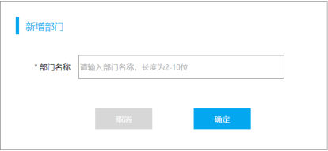
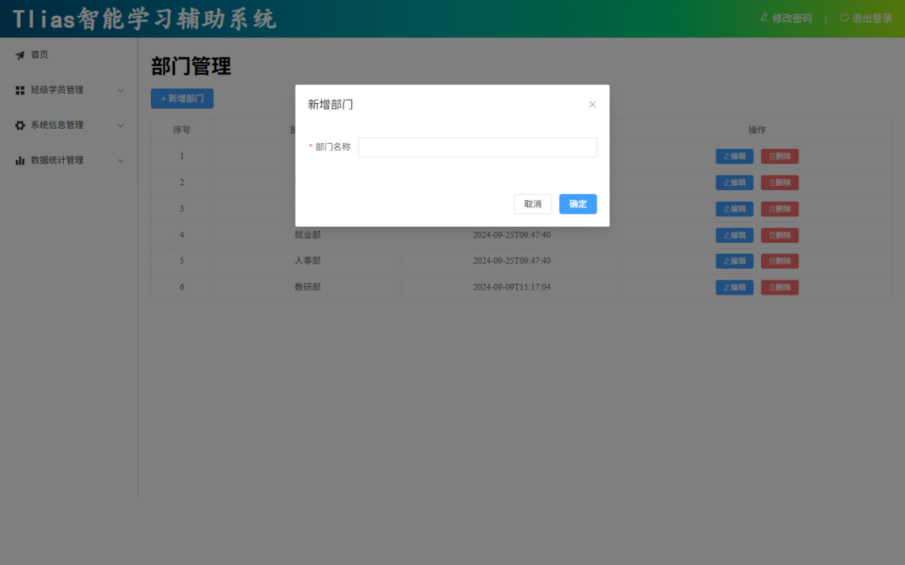
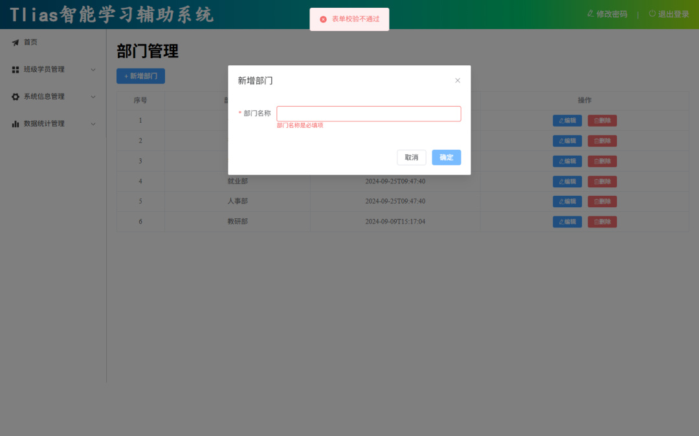
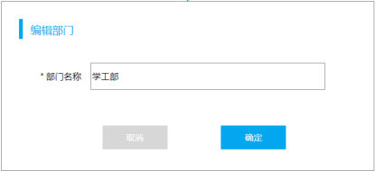
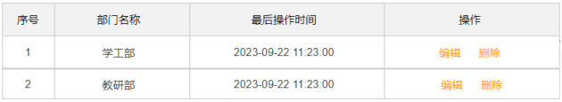
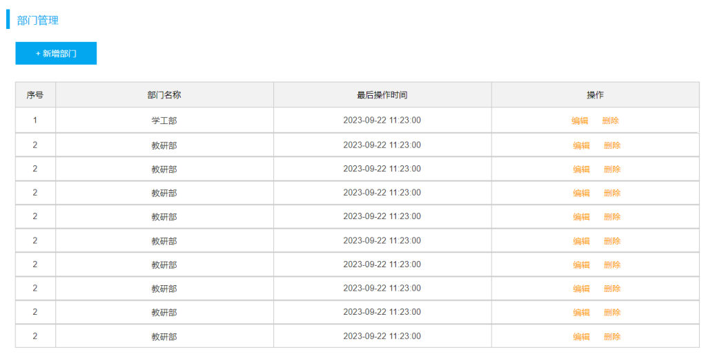
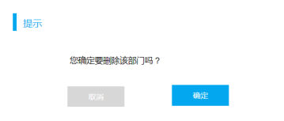
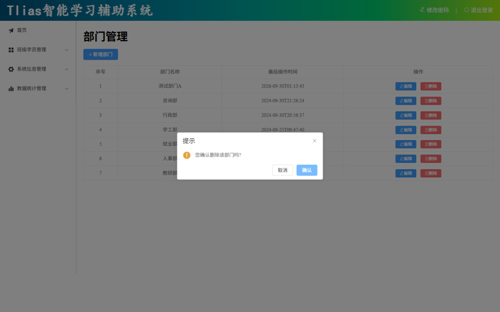

[99 篇](/posts/编程学习/javaweb学习笔记/99-部门管理-列表查询/)把部门数据从后端查回来、铺进了表格，但那个表格是**只读**的——页面上除了"+ 新增部门"这个按钮，没有任何地方能改数据、删数据。这一篇补上剩下的三件事（PPT 第 32~38 页）。

| PPT 页 | 内容 | 本篇对应小节 |
| --- | --- | --- |
| 32、35、37 | 目录页（03 部门管理 → 列表查询 / 新增部门 / 修改部门 / 删除部门） | 同一张卡片列表，讲完一节翻一次 |
| 33~34 | 新增部门（Dialog 对话框组件 + Form 表单组件）、表单校验 | 新增部门、表单校验三步 |
| 36 | 修改部门（查询回显 + 保存修改） | 修改部门 |
| 38 | 删除部门（ElMessageBox 消息弹出框组件） | 删除部门 |

第 32、35、37 页是**同一张目录页**：[97 篇](/posts/编程学习/javaweb学习笔记/97-elementplus组件库/)里"快速入门 / 常见组件 / 案例"那张卡片列表的 Tlias 版——**列表查询**在三节之前已经做完了，所以第一次翻到它时"列表查询"那张卡片是亮的，后面每做完一件事（新增、修改、删除）就再翻一次目录，又点亮一张。这种目录页没有新知识，但它标出了这一段路的**顺序**：先查（99 篇）→ 再增 → 再改 → 最后删。

## 新增部门（PPT 第 32~33 页）

PPT 第 33 页给的做法还是那句干活的口诀：

> **根据页面原型、需求说明、接口文档，先完成页面的基本布局。**

这一节的界面在**页面原型**里长这样（PPT 第 33 页的原型图）：


*图：需求说明里的"新增部门"界面——一个对话框，标题"新增部门"，里面只有一项带红色星号的"部门名称"，输入框里的提示文字写着"请输入部门名称，长度为2-10位"，底部"取消 / 确定"两个按钮。**这一行提示文字就是后面表单校验规则的原型说明**（必填、2~10 位）*

用到的组件是 PPT 第 33 页点名的两个：**Dialog 对话框组件** + **Form 表单组件**（两个组件在 [97 篇](/posts/编程学习/javaweb学习笔记/97-elementplus组件库/)里都单独认识过，这里是第一次拿它们做正事）。PPT 第 33 页还埋了一句很关键的提示：

> **提示：新增部门 和 编辑部门可以共用一个 Dialog 对话框。**

为什么要合用？因为这两件事的界面**几乎一模一样**——同样一个标题、同样一个"部门名称"输入框、同样两个按钮；真正不同的只有两点：**标题文字**（"新增部门"还是"修改部门"）和**点确定时调哪个接口**。界面上的一点点差别用变量控制就行，没必要复制一个对话框出来。

### 接口先看一眼（接口文档）

按口诀的顺序，动手写布局之前先看接口文档（课程 `资料\02. 接口文档`）：

| 项 | 内容 |
| --- | --- |
| 请求方式 | `POST` |
| 请求路径 | `/depts` |
| 请求体 | `{"name": "部门名称"}`（JSON，只要一个名字） |
| 响应 | `{code, msg, data}` —— `code` 为 1 表示成功 |

于是 `src/api/dept.js` 里加一行（[99 篇](/posts/编程学习/javaweb学习笔记/99-部门管理-列表查询/)建立的那个"按模块封装接口"的文件，现在开始长内容）：

```js
import request from "@/utils/request";

//查询全部部门数据
export const queryAllApi = () =>  request.get('/depts');

//新增
export const addApi = (dept) =>  request.post('/depts', dept);
```

`request.post(路径, 数据)` 的第二个参数就是要发给后端的请求体——组件里把整个表单对象 `dept` 传进来，序列化成 `{"name": "xxx"}` 发出去。

### 布局：Dialog 里装 Form

模板部分（课程工程 `src/views/dept/index.vue`）：

```html
<!-- Dialog对话框 -->
<el-dialog v-model="dialogFormVisible" :title="formTitle" width="500">
  <el-form :model="dept" :rules="rules" ref="deptFormRef">
    <el-form-item label="部门名称" label-width="80px" prop="name">
      <el-input v-model="dept.name" />
    </el-form-item>
  </el-form>
  <template #footer>
    <div class="dialog-footer">
      <el-button @click="dialogFormVisible = false">取消</el-button>
      <el-button type="primary" @click="save">确定</el-button>
    </div>
  </template>
</el-dialog>
```

对着 [97 篇](/posts/编程学习/javaweb学习笔记/97-elementplus组件库/)的知识点拆一下，这里面**每一件都学过**：

| 位置 | 写法 | 说明 |
| --- | --- | --- |
| 对话框显隐 | `v-model="dialogFormVisible"` | 97 篇讲的"一个 boolean 控制藏/显" |
| 对话框标题 | `:title="formTitle"` | 标题是**变量**——这就是"共用一个 Dialog"的关键：新增时给它"新增部门"，编辑时给它"修改部门" |
| 表单容器 | `<el-form :model="dept">` | `dept` 是表单数据对象（一个对象装所有表单项，97 篇演示页里叫 `user`） |
| 一行表单项 | `<el-form-item label="部门名称" prop="name">` | `label` 是左边的标签文字；`prop` 这一节要讲（校验用） |
| 输入控件 | `<el-input v-model="dept.name" />` | 输入框直接绑到对象的字段上，用户打字就同步进 `dept` |
| 底部按钮 | `<template #footer>` 里放两个按钮 | 对话框的页脚插槽；"取消"直接把变量改成 `false`，"确定"调 `save` |

`script` 里新增相关的一段：

```js
//Dialog对话框
const dialogFormVisible = ref(false);
const formTitle = ref('');
const dept = ref({name: ''});

//新增部门
const addDept = () => {
  dialogFormVisible.value = true;
  formTitle.value = '新增部门';
  dept.value = {name: ''};

  //重置表单的校验规则-提示信息
  if (deptFormRef.value){
    deptFormRef.value.resetFields();
  }
}
```

配合页面上那个按钮：

```html
<el-button type="primary" @click="addDept"> + 新增部门</el-button>
```

三句话读完这个函数：

1. `formTitle.value = '新增部门'` —— 先把标题写成"新增部门"（编辑时这里会是"修改部门"）；
2. `dept.value = {name: ''}` —— 把表单数据**重新赋成一个空对象**，保证弹出来的是干净的输入框，不会残留上一次输入的内容；
3. `if (deptFormRef.value) { deptFormRef.value.resetFields() }` —— 清掉上一次留下的**校验红字**。这里的 `if` 判断不是多余的：`<el-dialog>` 里的内容默认是**懒渲染**的（第一次打开之前，表单还没被创建出来），所以 `deptFormRef.value` 在最开始可能是 `undefined`，直接调 `resetFields()` 会报错。

本机实测（前端 5173 连着课程后端、后端读 MySQL 的 `tlias` 库）：


*图（本机实测）：点"+ 新增部门"后弹出的对话框——标题"新增部门"、一行"* 部门名称"输入框、右下角"取消 / 确定"；**背后的列表页还在原地没跳走**（对话框"保留当前页面状态"那个特点）。标签前面那个红色星号是后面要讲的 `required` 必填规则带出来的标记*

## 表单校验三步（PPT 第 34 页）

PPT 第 34 页的原话：

> 在 ElementPlus 提供的 form 表单组件中，就提供了对应的表单校验的功能。具体步骤如下：
> 1. **定义表单校验规则**，通过 `rules` 属性与表单绑定
> 2. 通过 `prop` 属性**绑定对应的表单项**
> 3. 通过 `ref` 属性**注册表单的引用**，表单提交时，校验表单，校验通过，则允许提交表单

把这三步落到代码上，要写的地方其实是 5 处（第 1 步拆成"定义规则 + 规则挂到表单"，第 3 步拆成"注册引用 + 提交时校验"），**缺一处都不生效**：

```js
//表单校验
const rules = ref({//表单校验规则
  name: [
    { required: true, message: '部门名称是必填项', trigger: 'blur' },
    { min: 2, max: 10, message: '部门名称的长度应该在2-10位', trigger: 'blur' }
  ]
})
const deptFormRef = ref();
```

```html
<el-form :model="dept" :rules="rules" ref="deptFormRef">
  <el-form-item label="部门名称" label-width="80px" prop="name">
    <el-input v-model="dept.name" />
  </el-form-item>
</el-form>
```

```js
const save = () => {
  //表单校验
  deptFormRef.value.validate(async (valid) => {
    if(valid) {
      //...
    }
  })
}
```

| 步骤 | 代码写在哪儿 | 它在干什么 |
| --- | --- | --- |
| ① 定义规则 | `<script setup>` 里 `rules = ref({...})` | 给每个字段列一组规则：`required: true`（必填）、`min/max`（长度 2~10）；`message` 是提示文字，`trigger: 'blur'` 表示"鼠标离开输入框时检查" |
| ② 规则挂到表单 | `<el-form :rules="rules" :model="dept">` | 告诉表单"这套规则归你了"，同时得知道**校验谁**（`:model` 指向那份数据） |
| ③ 规则挂到表单项 | `<el-form-item prop="name">` | **`prop` 是一座桥**：把 `rules` 里叫 `name` 的那组规则，接到这一行表单项上（`prop` 里的名字要和规则里的键、以及 `dept` 里的字段名**三处一致**） |
| ④ 注册表单引用 | `<el-form ref="deptFormRef">` + `const deptFormRef = ref()` | 拿到表单组件实例——`validate()` 是实例上的方法，没有它就没法手动触发校验 |
| ⑤ 提交时校验 | `deptFormRef.value.validate((valid) => {...})` | 表单自己把所有规则跑一遍，把结果作为回调参数 `valid` 给你：`true` 放行、`false` 拦下 |

> [!IMPORTANT]
> 第 ⑤ 步的 **`if (valid)` 就是"必须先过校验才能提交"的闸门**：真正发请求的代码写在 `if(valid)` 里面，校验不过就一个字都不会发出去。PPT 第 34 页写这句话的顺序也很讲究——"校验通过，则允许提交表单"。

课程工程里这段保存逻辑的完整样子：

```js
//保存部门
const save = async () => {
  //表单校验
  if(!deptFormRef.value) return;
  deptFormRef.value.validate(async (valid) => { //valid 表示是否校验通过: true 通过 / false 不通过
    if(valid){ //通过

      let result ;
      if(dept.value.id){ //修改
        result = await updateApi(dept.value);
      }else{ //新增
        result = await addApi(dept.value);
      }

      if(result.code){ //成功
        //提示信息
        ElMessage.success('操作成功');
        //关闭对话框
        dialogFormVisible.value = false;
        //查询
        search();
      }else{ //失败
        ElMessage.error(result.msg);
      }
    }else { //不通过
      ElMessage.error('表单校验不通过');
    }
  })
}
```

（开头那句 `if(!deptFormRef.value) return;` 和前面 `addDept` 里的判断是同一个原因——对话框内容懒渲染，第一次打开前表单实例还不存在。这段代码里那个 `if/else` 是给"共用 Dialog"准备的分流，**先在"修改部门"那节记一笔，下面马上讲**。）

保存成功之后做三件事：`ElMessage.success('操作成功')` 给一句绿色提示 → `dialogFormVisible.value = false` 关掉对话框 → `search()` **重新查一次列表**（[99 篇](/posts/编程学习/javaweb学习笔记/99-部门管理-列表查询/)里的查询函数），新数据立刻出现在表格里。这三件事在新增、修改两条路上是**同一段代码**。

> [!NOTE]
> PPT 第 34 页给的 `rules` 文案和课程工程里的**不完全一样**：PPT 上写的是 `请输入部门名称` 和 `部门名称的长度在2-10之间`，工程里写的是 `部门名称是必填项` 和 `部门名称的长度应该在2-10位`。**本机实测弹出来的是工程那一版**（见下图）——抄的时候以工程为准。另外 PPT 第 34 页的按钮叫"保存"（绑 `save`），工程里对话框底部是"取消 / 确定"（"确定"绑 `save`），只是叫法不同，代码是同一个函数。

本机实测（空表单直接点"确定"）：


*图（本机实测）：什么都不填就点"确定"——输入框被**描红**、下面出现一行红字"部门名称是必填项"（第 ① 条 `required` 规则报的），同时页面顶部弹出一条红色提示"表单校验不通过"（`save` 里 `else` 分支那句 `ElMessage.error`）。**请求根本没发出去**——这就是 `if(valid)` 那道闸门在起作用*

再补一条本机实测：填上"测试部门A"再点"确定"，列表从 **6 行变成 7 行**，新部门出现在第一行（按最后操作时间倒序，刚新增的排最前）——新增这条链路走通了（后面"删除部门"那张截图里还能看到这行多出来的"测试部门A"）。

## 修改部门（PPT 第 35~36 页）

第 35 页又是那张目录页，跳过；第 36 页给了修改的**两步法**：

> 对于修改操作，通常会分为两步进行：**① 查询回显、② 保存修改**。
>
> 交互逻辑：
> - 点击 **编辑** 按钮，根据ID进行查询，弹出对话框，完成页面回显展示。（**查询回显**）
> - 点击 **确定** 按钮，保存修改后的数据，完成数据更新操作。（**保存修改**）

为什么要先查一次？因为列表里那一行只有"名称、时间"这些展示用的字段，用户点"编辑"时要的是**这条数据的完整、最新的样子**——所以按 id 去后端再取一次，取到什么就回显什么。这一步的图在 PPT 第 36 页：


*图：PPT 第 36 页的原型——点列表里的"编辑"后弹出的对话框。和"新增部门"那张（PPT 第 33 页）比，**只有标题和输入框里的内容不一样**：标题成了"编辑部门"，输入框里**已经带出了这一行的部门名称"学工部"**（这就是"回显"）。顺带说一句，原型图上的标题写的是"编辑部门"，课程工程实现里用的是"修改部门"——两张图对着看时别以为是两个功能*


*图：PPT 第 36 页的部门列表——每一行的"操作"列里就是"编辑"和"删除"两个按钮（[99 篇](/posts/编程学习/javaweb学习笔记/99-部门管理-列表查询/)搭表格时留的这列，现在派上用场）。点"编辑"时，要做的第一件事就是**把这一行的 id 传出去**，后面查回显、保存都用它*

### 先看接口：查回显一条、保存一条

| 步 | 请求 | 说明 |
| --- | --- | --- |
| 查询回显 | `GET /depts/{id}` | 路径上带 id，返回 `data` 就是这个部门对象（含 id、name） |
| 保存修改 | `PUT /depts` | 请求体带 `{"id": 部门ID, "name": "新名称"}` ——**比新增多一个 id** |

`src/api/dept.js` 再加两行：

```js
//根据ID查询
export const queryByIdApi = (id) =>  request.get(`/depts/${id}`);

//修改
export const updateApi = (dept) =>  request.put('/depts', dept);
```

注意 `queryByIdApi` 用的是**模板字符串**把 id 拼进路径（反引号 + `${}`），因为它是路径参数；而删除那节的 id 要拼在问号后面（查询参数）。

### 布局：列表操作列加两个按钮

[99 篇](/posts/编程学习/javaweb学习笔记/99-部门管理-列表查询/)的表格里，"操作"列当时是空的占位，现在填上：

```html
<el-table-column label="操作" align="center">
  <template #default="scope">
    <el-button type="primary" size="small" @click="edit(scope.row.id)"><el-icon><EditPen /></el-icon> 编辑</el-button>
    <el-button type="danger" size="small" @click="delById(scope.row.id)"><el-icon><Delete /></el-icon> 删除</el-button>
  </template>
</el-table-column>
```

`<template #default="scope">` 和 `scope.row` 是 [97 篇](/posts/编程学习/javaweb学习笔记/97-elementplus组件库/)讲的自定义列写法——**行数据在 `scope.row` 里**，所以 `scope.row.id` 就是这一行的 id。两个按钮分别把 id 交给 `edit` 和 `delById`（"编辑"用的主色按钮、`type="danger"` 的红色按钮留给"删除"，一眼看出哪个危险）。

按钮里那两个小图标（`<EditPen />`、`<Delete />`）来自 `@element-plus/icons-vue` 包，本机实测这个工程的 `main.js` 把它们**全部注册成了全局组件**：

```js
import * as ElementPlusIconsVue from '@element-plus/icons-vue'
//...
for (const [key, component] of Object.entries(ElementPlusIconsVue)) {
  app.component(key, component)
}
```

（这一段是 [97 篇](/posts/编程学习/javaweb学习笔记/97-elementplus组件库/)看 `main.js` 时还没有的——图标不注册的话，按钮里那两个字前面就是空白。）

### "查询回显"这一步的代码

```js
//编辑
const edit = async (id) => {
  formTitle.value = '修改部门';
  //重置表单的校验规则-提示信息
  if (deptFormRef.value){
    deptFormRef.value.resetFields();
  }

  const result = await queryByIdApi(id);
  if(result.code){
    dialogFormVisible.value = true;
    dept.value = result.data;
  }
}
```

按顺序读：

1. `formTitle.value = '修改部门'` —— 改标题，**这就是"新增与编辑共用一个 Dialog"的第一半**（同一个 `<el-dialog :title="formTitle">`，只是变量变了）；
2. 清掉上一次的红字（和 `addDept` 里同款处理）；
3. `await queryByIdApi(id)` —— 按 id 查这条部门；
4. `dept.value = result.data` —— **这就是"回显"**：把接口返回的那个部门对象（`{id, name, createTime, updateTime}`）整个塞给表单绑定的 `dept`，输入框里立刻就有名字了（`v-model` 是双向的：对象变了，界面就变）；
5. 注意顺序——`dialogFormVisible.value = true` 写在**查询成功之后**。工程里特意这么排：先拿到数据再开对话框，就不会出现"对话框先弹出来、名字空白一下再跳出来"的闪动。

本机实测：点某一行的"编辑"，对话框标题变成"**修改部门**"，输入框里**已经带出该行的部门名称**——回显成功，这就是 PPT 说的第一步走完了。

### "保存修改"这一步：共用 Dialog 的玄机

第二步不用新写函数——**还是那个 `save`**，请看新增那节里贴过的完整代码，重点在这一段：

```js
      let result ;
      if(dept.value.id){ //修改
        result = await updateApi(dept.value);
      }else{ //新增
        result = await addApi(dept.value);
      }
```

**判断依据就是 `dept.value.id`**：

| 场景 | `dept.value` 是什么 | 有没有 id | 走哪条路 |
| --- | --- | --- | --- |
| 新增 | 点"+ 新增部门"时被赋成 `{name: ''}` | **没有** | `addApi` → `POST /depts` |
| 修改 | 点"编辑"时被赋成接口返回的 `result.data`（`{id, name, ...}`） | **有** | `updateApi` → `PUT /depts`（请求体里带着 id） |

回头看 PPT 第 33 页那句提示，现在能说全了：**新增和编辑共用一个 Dialog**，靠三样东西区分——

1. **标题**：`formTitle` 变量（`addDept` 里写"新增部门"、`edit` 里写"修改部门"）；
2. **数据**：`dept` 变量（新增时是空对象、编辑时是查回来的对象，所以输入框有时空、有时有值）；
3. **接口**：`save` 里看 `dept.value.id` 分流（一个发 `POST`、一个发 `PUT`）。

后面的处理（`ElMessage.success('操作成功')` → 关对话框 → `search()` 刷新列表）两条路完全一样。

## 删除部门（PPT 第 37~38 页）

第 37 页又是目录页。第 38 页讲删除：

> 点击删除按钮，需要删除当前这条数据，**删除完成之后，刷新页面，展示出最新的数据**。
> 由于删除是一个比较危险的操作，为避免误操作，通常会在**点击删除之后，弹出确认框进行确认**。
> **Element 组件：ElMessageBox 消息弹出框组件**

这一节的原型图（PPT 第 38 页）：


*图：PPT 第 38 页给出的需求说明页面——部门管理整页：左上角"+ 新增部门"按钮、四列表格（序号 / 部门名称 / 最后操作时间 / 操作）。这一节要动的就是**"操作"列里那个"删除"**：删掉某一行之后，表格里立刻不能再有它（"刷新"成最新的数据）*


*图：PPT 第 38 页的删除确认框原型——标题"提示"、一句"您确定要删除该部门吗？"、两个按钮"取消 / 确定"。**多弹这一下，就是为了拦住手滑点错的删除**（本机实测的成品和它长得一样，只有个别字不一样，见下）*

### 接口：一个带了 id 的 DELETE

| 项 | 内容 |
| --- | --- |
| 请求方式 | `DELETE` |
| 请求路径 | `/depts?id=部门ID`（id 是**查询参数**，拼在问号后面） |
| 响应 | `{code, msg, data}` |

```js
//删除
export const deleteByIdApi = (id) =>  request.delete(`/depts?id=${id}`);
```

### 代码：确认框里才放删除

```js
//删除
const delById = async (id) => {
  //弹出确认框
  ElMessageBox.confirm('您确认删除该部门吗?','提示',
    { confirmButtonText: '确认',cancelButtonText: '取消',type: 'warning'}
  ).then(async () => { //确认
    const result = await deleteByIdApi(id);
    if(result.code){
      ElMessage.success('删除成功');
      search();
    }else{
      ElMessage.error(result.msg);
    }
  }).catch(() => { //取消
    ElMessage.info('您已取消删除');
  })
}
```

三句话读懂：

1. `ElMessageBox.confirm(内容, 标题, 配置)` —— 用**代码召唤**出来的确认框（不是写在模板里的标签），浏览器里"提示 / 您确认删除该部门吗? / 取消 确认"那一小张卡片就是它；
2. 它返回一个 **Promise**：点"确认"走 `.then()`、点"取消"（或右上角 ×）走 `.catch()`——所以**"先确认再删除"是靠把删除代码写进 `.then()` 里做到的**：用户没点确认，那段代码根本不会执行；
3. 进到 `.then()` 里，删除成功后 `ElMessage.success('删除成功')` + `search()`。PPT 说的"删除完成之后，刷新页面，展示出最新的数据"，在单页应用里的做法**不是刷新整个浏览器页面**（`location.reload()`），而是**重新查一次接口**——表格的数据源变了，界面自然就是最新的。

第三个参数是个小配置对象：

| 配置 | 作用 |
| --- | --- |
| `confirmButtonText: '确认'` | 确认按钮上的字（**默认是"确定"**，工程里改成了"确认"） |
| `cancelButtonText: '取消'` | 取消按钮上的字 |
| `type: 'warning'` | 左边那个橙色的警告图标 |

> [!TIP]
> `ElMessage` 和 `ElMessageBox` 这两个是**函数式**调用的（`ElMessage.success(...)`、`ElMessageBox.confirm(...)`），不像 `el-button`、`el-dialog` 那样直接写在模板里当标签用。所以工程文件开头必须 import：
> ```js
> import { ElMessage, ElMessageBox } from 'element-plus';
> ```

本机实测（点某一行的"删除"）：


*图（本机实测）：点"删除"弹出的确认框——`提示 / 您确认删除该部门吗? / 取消 确认`。注意两个细节：**正文文案和原型图不完全一样**（原型写"您确定要**删除该部门**吗？"，工程里是"您**确认删除该部门**吗?"），**按钮上的字是"确认"不是"确定"**（工程里改过 `confirmButtonText`）。表格第一行那个"测试部门A"就是新增那节造的测试数据。点"确认"之后这一行消失、列表回到 **6 行**；点"取消"则只会弹一条"您已取消删除"*

## 三个容易卡住的坑（本机实测）

这三条是这次把前端跑起来真做一遍时遇到的，和 Tlias 这一章的联调环境直接相关：

1. **前端端口会被自动换掉**。Vite 默认起在 5173，但**被占用时会自动往后试**（本机日志里出现过 `Port 5173 is in use, trying another one...`，最后跑在 5174）。发现"页面怎么不是我刚才改的那个"时，先看启动日志里实际用的是哪个端口。
2. **代理的 target 必须和后端端口对上**。课程里后端在 8080；本机 8080 被别的项目占着，所以把课程后端换到 **8081** 启动、并把 `vite.config.js` 里 `/api` 代理的 `target` 改成 `http://localhost:8081`。**没对上时的现象很迷惑**：页面不报错，只是表格"暂无数据"——因为前端确实请求成功了，只不过请求打到的是另一个服务，拿回来的是它返回的 401 JSON。
3. **删除确认框的按钮文案是"确认"，不是"确定"**。工程里显式配了 `confirmButtonText: '确认'`（ElMessageBox 的默认值是"确定"）——照着默认值去点会点不着。

## 小结

| 问题 | 答案 |
| --- | --- |
| 部门管理这一节做了几件事？ | 列表查询（[99 篇](/posts/编程学习/javaweb学习笔记/99-部门管理-列表查询/)）+ **新增、修改、删除**（本篇），顺序就是 PPT 第 32/35/37 页那张目录页的顺序 |
| 新增部门用哪两个组件？ | **Dialog 对话框**（`el-dialog`，boolean 控制显隐）+ **Form 表单**（`el-form` + `el-form-item` + `el-input`） |
| 新增和编辑怎么共用一个 Dialog？ | 标题用变量 `:title="formTitle"`；数据用同一个 `dept` 对象；`save` 里看 **`dept.value.id`** 分流——没有 id 走 `addApi`（`POST /depts`），有 id 走 `updateApi`（`PUT /depts`） |
| 表单校验三步？ | ① `rules` 定义规则并用 `:rules` 绑到表单 → ② 表单项用 **`prop`** 绑定规则里的字段名 → ③ `ref` 注册表单引用，提交时 `validate(callback)` 校验，`valid` 为 `true` 才提交 |
| 校验规则怎么写？ | `name: [{required: true, message: '部门名称是必填项', trigger: 'blur'}, {min: 2, max: 10, message: '...', trigger: 'blur'}]` |
| 修改部门的两步？ | **① 查询回显**（点"编辑"→ `GET /depts/{id}` → `dept.value = result.data`，输入框自动有值）**② 保存修改**（点"确定"→ `PUT /depts`，请求体带 id 和 name） |
| 删除怎么做才安全？ | 先 `ElMessageBox.confirm(内容, 标题, {confirmButtonText: '确认', cancelButtonText: '取消', type: 'warning'})`，**删除代码写在 `.then()` 里**、取消的处理写在 `.catch()` 里 |
| 增删改之后为什么要 `search()`？ | PPT 说的"刷新页面展示最新数据"，在单页应用里是**重新查一次列表接口**，不是刷新浏览器 |
| 函数与接口对照？ | `addDept`（开新增弹窗）→ `save`（`POST`/`PUT` 分流）→ `edit`（`GET` 查回显）→ `delById`（`DELETE` 删）→ `search`（`GET` 刷列表） |
| 本机实测最值得记的一条？ | 空表单点"确定"出红字 **"部门名称是必填项"** 且请求不发；新增"测试部门A"后列表 7 行；编辑标题变"修改部门"并有回显；删除确认框按钮是**"确认"**，删完回到 6 行 |

## 相关

- [上一篇：部门管理-列表查询](/posts/编程学习/javaweb学习笔记/99-部门管理-列表查询/)
- [下一篇：员工管理-条件分页查询](/posts/编程学习/javaweb学习笔记/101-员工管理-条件分页查询/)

## 练习题

### 一、知识回顾（读完直接做下面的实践题）

1. **部门管理这一节的四件事**：列表查询（99 篇做的事）、**新增部门、修改部门、删除部门**（本篇）；顺序就是 PPT 第 32、35、37 页反复出现的那张目录页的顺序
2. **新增部门** = **Dialog 对话框组件**（装内容）+ **Form 表单组件**（收数据）；接口是 `POST /depts`，请求体 `{"name": "部门名称"}`；成功后做三件事——`ElMessage.success('操作成功')`、关对话框、`search()` 重新查列表
3. **新增和编辑共用一个 Dialog**：标题靠变量（`:title="formTitle"`）；保存时靠 **`dept.value.id`** 分流——**没有 id 走 `addApi`（新增，POST），有 id 走 `updateApi`（修改，PUT）**
4. **表单校验三步**：① 定义规则 `rules` 并用 `:rules` 与表单绑定；② 表单项用 **`prop`** 绑定规则里的字段名（`prop="name"`）；③ 用 **`ref`** 注册表单引用（`ref="deptFormRef"` + `const deptFormRef = ref()`），提交时 `deptFormRef.value.validate((valid) => {...})`，**`valid` 为 `true` 才允许提交**
5. 工程里的校验规则是两条：`{required: true, message: '部门名称是必填项', trigger: 'blur'}` 和 `{min: 2, max: 10, message: '部门名称的长度应该在2-10位', trigger: 'blur'}`；**本机实测**空表单点"确定"→ 输入框描红 + 红字"部门名称是必填项" + 顶部红色提示"表单校验不通过"（PPT 上写的提示语是"请输入部门名称"，工程里改过，以工程为准）
6. **修改部门的两步**：**① 查询回显**（点"编辑"→ `GET /depts/{id}` → `dept.value = result.data`，输入框自动带出名字）；**② 保存修改**（点"确定"→ `PUT /depts`，请求体带 `id` 和 `name`）
7. 点"编辑"时工程里是**先查询、查到数据后再打开对话框**（`dialogFormVisible.value = true` 写在 `if(result.code)` 里面），避免"对话框先弹出来、名字空白一下再跳出来"
8. **删除部门**：`DELETE /depts?id=部门ID`；删除成功后调 `search()` 重新查列表（PPT 说的"刷新页面"在单页应用里就是重新请求数据，不是 `location.reload()`）
9. **危险操作要先确认**：`ElMessageBox.confirm('您确认删除该部门吗?', '提示', {confirmButtonText: '确认', cancelButtonText: '取消', type: 'warning'})` 返回一个 Promise——**删除代码写在 `.then()` 里、取消处理写在 `.catch()` 里**；`ElMessage` 和 `ElMessageBox` 是函数式组件，用之前要 `import { ElMessage, ElMessageBox } from 'element-plus'`
10. **本机实测的三个坑**：前端 5173 被占用会**自动换端口**（日志里有 `Port 5173 is in use, trying another one...`）；**代理 target 和后端端口必须对上**（本机 8080 被占，后端改 8081、代理 target 也跟着改 8081，没对上时页面表现为"暂无数据"）；**删除确认框的按钮文案是"确认"不是"确定"**

### 二、裸写题

- [ ] **2-1 做一个"新增部门"的弹窗**
  需求：部门列表页面上有一个"+ 新增部门"按钮；点它弹出一个标题为"新增部门"、宽度 500 的对话框，里面只有一项"部门名称"（输入框），底部是"取消""确定"两个按钮；点"确定"时把用户填的部门名称打印到控制台，然后关掉对话框；点"取消"直接关掉对话框，不打印任何东西。

  > [!TIP]- 提示（先自己想，实在想不出再点开）
  > **一级 · 思路**：对话框是一个"藏还是显"由数据控制的东西（先准备一个 boolean）；对话框里装一个表单容器，表单项里的输入框绑到"一个装表单数据的对象"上；两个按钮各自绑一个动作——一个把名字打印出来并关窗，一个直接关窗
  > **二级 · 方法**：`const dialogFormVisible = ref(false)` 控制显隐；`<el-dialog v-model="dialogFormVisible" title="新增部门" width="500">`；里面放 `<el-form :model="dept">` + `<el-form-item label="部门名称" label-width="80px">` + `<el-input v-model="dept.name" />`；按钮写在 `<template #footer>` 里，取消用 `@click="dialogFormVisible = false"`，确定用 `@click="save"`
  > **三级 · 骨架**：`const dept = ref({name: '____'})` / `<el-dialog ____="dialogFormVisible" title="新增部门" width="500">` / `<el-input v-model="dept.____" />` / `const save = () => { console.log(dept.____); dialogFormVisible.value = ____ }`

  > [!TIP]- 参考答案（做完再点开）
  > ```vue
  > <!-- 课程工程 src/views/dept/index.vue 的对话框骨架（把校验先去掉） -->
  > <script setup>
  > import { ref } from 'vue';
  >
  > //控制对话框的显示与隐藏
  > const dialogFormVisible = ref(false);
  >
  > //表单数据：一个对象装所有表单项
  > const dept = ref({name: ''});
  >
  > //点"+ 新增部门"：打开对话框，顺手把表单清空
  > const addDept = () => {
  >   dialogFormVisible.value = true;
  >   dept.value = {name: ''};
  > }
  >
  > //点"确定"
  > const save = () => {
  >   console.log(dept.value);
  >   dialogFormVisible.value = false;
  > }
  > </script>
  >
  > <template>
  >   <h1>部门管理</h1>
  >   <el-button type="primary" @click="addDept"> + 新增部门</el-button>
  >
  >   <el-dialog v-model="dialogFormVisible" title="新增部门" width="500">
  >     <el-form :model="dept">
  >       <el-form-item label="部门名称" label-width="80px">
  >         <el-input v-model="dept.name" />
  >       </el-form-item>
  >     </el-form>
  >     <template #footer>
  >       <div class="dialog-footer">
  >         <el-button @click="dialogFormVisible = false">取消</el-button>
  >         <el-button type="primary" @click="save">确定</el-button>
  >       </div>
  >     </template>
  >   </el-dialog>
  > </template>
  >
  > <style scoped>
  > </style>
  > ```
  > 检查点：① 一进页面看不到对话框，点"+ 新增部门"才弹出来；② 在输入框里打字再点"确定"，控制台打印出 `{name: '你刚打的字'}`，对话框同时关上；③ 再点开一次，输入框是空的（`addDept` 里那句 `dept.value = {name: ''}` 起作用了）；④ 点"取消"只关窗、控制台没有输出。

- [ ] **2-2 给新增表单加校验：名字不填不让提交**
  需求：在 2-1 的弹窗上加校验——**部门名称必填**，并且**长度必须在 2~10 位之间**；不满足时输入框下面要出红色的提示文字；**不满足时点"确定"不能提交**（控制台不打印、请求也不发），校验通过才放行；另外，**再次打开弹窗时要把上一次留下的红字清掉**。

  > [!TIP]- 提示（先自己想，实在想不出再点开）
  > **一级 · 思路**：校验这件事不要手写 `if` 去判断，交给表单组件自己干——但得告诉它三件事：规则是什么、规则归哪个表单项、以及"要校验的时候上哪儿找这个表单"
  > **二级 · 方法**：`rules = ref({name: [{required: true, message: '...', trigger: 'blur'}, {min: 2, max: 10, message: '...', trigger: 'blur'}]})`；表单上 `:rules="rules"` 挂规则、`ref="deptFormRef"` 拿实例；表单项上 `prop="name"` 指定"这条规则给谁"；提交函数里 `deptFormRef.value.validate((valid) => { if(valid){ 提交 } else { ElMessage.error('表单校验不通过') } })`；清红字用 `deptFormRef.value.resetFields()`（调之前先判断 `deptFormRef.value` 存在，因为对话框内容是懒渲染的）
  > **三级 · 骨架**：`const rules = ref({ name: [{ ____: true, message: '部门名称是必填项', trigger: '____' }, { ____: 2, ____: 10, message: '部门名称的长度应该在2-10位', trigger: 'blur' }] })` / `<el-form :model="dept" :____="rules" ____="deptFormRef">` / `<el-form-item label="部门名称" prop="____">` / `deptFormRef.value.____((valid) => { if(valid){ ... } else { ElMessage.error('____') } })`

  > [!TIP]- 参考答案（做完再点开）
  > ```vue
  > <script setup>
  > import { ref } from 'vue';
  > import { ElMessage } from 'element-plus';
  >
  > const dialogFormVisible = ref(false);
  > const dept = ref({name: ''});
  >
  > //① 定义校验规则
  > const rules = ref({
  >   name: [
  >     { required: true, message: '部门名称是必填项', trigger: 'blur' },
  >     { min: 2, max: 10, message: '部门名称的长度应该在2-10位', trigger: 'blur' }
  >   ]
  > })
  >
  > //③ 注册表单引用（用来手动触发校验 / 重置提示）
  > const deptFormRef = ref();
  >
  > const addDept = () => {
  >   dialogFormVisible.value = true;
  >   dept.value = {name: ''};
  >
  >   //重置上一次的红字提示
  >   if (deptFormRef.value){
  >     deptFormRef.value.resetFields();
  >   }
  > }
  >
  > const save = () => {
  >   if(!deptFormRef.value) return;
  >   deptFormRef.value.validate((valid) => {   //valid：true 通过 / false 不通过
  >     if(valid){
  >       console.log(dept.value);     //校验通过 —— 真实项目里这里才是发请求
  >       dialogFormVisible.value = false;
  >     }else{
  >       ElMessage.error('表单校验不通过');
  >     }
  >   })
  > }
  > </script>
  >
  > <template>
  >   <h1>部门管理</h1>
  >   <el-button type="primary" @click="addDept"> + 新增部门</el-button>
  >
  >   <!-- ② 规则通过 :rules 与表单绑定 -->
  >   <el-dialog v-model="dialogFormVisible" title="新增部门" width="500">
  >     <el-form :model="dept" :rules="rules" ref="deptFormRef">
  >       <el-form-item label="部门名称" label-width="80px" prop="name">
  >         <el-input v-model="dept.name" />
  >       </el-form-item>
  >     </el-form>
  >     <template #footer>
  >       <div class="dialog-footer">
  >         <el-button @click="dialogFormVisible = false">取消</el-button>
  >         <el-button type="primary" @click="save">确定</el-button>
  >       </div>
  >     </template>
  >   </el-dialog>
  > </template>
  >
  > <style scoped>
  > </style>
  > ```
  > 检查点：① 什么都不填点"确定"——输入框描红、下面出"部门名称是必填项"、顶部弹"表单校验不通过"，**控制台没有打印**；② 只填一个字点"确定"——提示变成"部门名称的长度应该在2-10位"（第二条规则生效）；③ 填"测试部"点"确定"——打印出 `{name: '测试部'}` 并关窗；④ 关掉再点开，上一次的红字不见了（`resetFields`）；⑤ 把表单项上的 `prop="name"` 删掉试试——红字和拦截**全都失效**（`prop` 是规则和表单项之间那座桥）。

- [ ] **2-3 点"编辑"先把老数据回显出来（新增和编辑共用一个弹窗）**
  需求：列表每行的"操作"列里有一个"编辑"按钮。点它时要做到：① **按这一行的 id 去后端查一次**，把查回来的部门名称**填进弹窗的输入框**；② 弹窗标题变成"修改部门"；③ 点"确定"时，**如果是编辑过的数据（带着 id）就走修改接口，如果是新增的空数据就走新增接口**；④ 无论走哪条路，成功后提示一句、关掉弹窗、并让列表显示最新数据。

  > [!TIP]- 提示（先自己想，实在想不出再点开）
  > **一级 · 思路**：这就是"修改两步法"的第一步——**查询回显**：点编辑 → 按 id 查 → 把查到的对象交给表单数据对象（输入框会自动跟着变）。标题不能写死在模板上，得是个变量。至于"新增还是修改"，看这份数据里**有没有 id** 就知道了
  > **二级 · 方法**：标题变量 `formTitle` + `<el-dialog :title="formTitle">`；`queryByIdApi(id)` 请求 `GET /depts/{id}`，把 `result.data` 赋给 `dept` 完成回显；保存时 `if(dept.value.id){ result = await updateApi(dept.value) }else{ result = await addApi(dept.value) }`（修改是 `PUT /depts`，请求体带 id）；成功后 `ElMessage.success('操作成功')` + `dialogFormVisible.value = false` + `search()`
  > **三级 · 骨架**：`const formTitle = ref('____')` / `const edit = async (id) => { formTitle.value = '修改部门'; const result = await ____(id); if(result.code){ dialogFormVisible.value = ____; dept.value = result.____ } }` / `if(dept.value.____){ result = await updateApi(dept.value) }else{ result = await addApi(dept.value) }`

  > [!TIP]- 参考答案（做完再点开）
  > ```js
  > // api/dept.js —— 这一题要用到的四个接口
  > import request from '@/utils/request'
  >
  > export const queryAllApi = () =>  request.get('/depts');          //查列表
  > export const addApi = (dept) =>  request.post('/depts', dept);    //新增（请求体只有 name）
  > export const queryByIdApi = (id) =>  request.get(`/depts/${id}`); //按 ID 查（回显用）
  > export const updateApi = (dept) =>  request.put('/depts', dept);  //修改（请求体带 id + name）
  > ```
  >
  > ```vue
  > <script setup>
  > import { ref, onMounted } from 'vue';
  > import { queryAllApi, addApi, queryByIdApi, updateApi } from '@/api/dept';
  > import { ElMessage } from 'element-plus';
  >
  > //列表数据（99 篇做的）
  > const deptList = ref([])
  > const search = async () => {
  >   const result = await queryAllApi();
  >   if(result.code){ deptList.value = result.data; }
  > }
  > onMounted(() => { search(); })
  >
  > //弹窗相关
  > const dialogFormVisible = ref(false);
  > const formTitle = ref('');          //标题是变量 —— 共用一个 Dialog 的关键之一
  > const dept = ref({name: ''});
  > const deptFormRef = ref();
  >
  > //新增：标题"新增部门"、数据清空
  > const addDept = () => {
  >   dialogFormVisible.value = true;
  >   formTitle.value = '新增部门';
  >   dept.value = {name: ''};
  > }
  >
  > //编辑：查询回显
  > const edit = async (id) => {
  >   formTitle.value = '修改部门';
  >   const result = await queryByIdApi(id);
  >   if(result.code){
  >     dialogFormVisible.value = true;   //查到数据再开窗，避免名字"闪"一下
  >     dept.value = result.data;         //回显：接口返回的对象直接给 dept
  >   }
  > }
  >
  > //确定：看 dept 里有没有 id 决定走哪条路
  > const save = async () => {
  >   let result;
  >   if(dept.value.id){                    //有 id —— 修改
  >     result = await updateApi(dept.value);
  >   }else{                                //没有 id —— 新增
  >     result = await addApi(dept.value);
  >   }
  >   if(result.code){
  >     ElMessage.success('操作成功');
  >     dialogFormVisible.value = false;
  >     search();                           //刷新列表
  >   }else{
  >     ElMessage.error(result.msg);
  >   }
  > }
  > </script>
  >
  > <template>
  >   <h1>部门管理</h1>
  >   <el-button type="primary" @click="addDept"> + 新增部门</el-button>
  >
  >   <el-table :data="deptList" border style="width: 100%">
  >     <el-table-column type="index" label="序号" width="100" align="center"/>
  >     <el-table-column prop="name" label="部门名称" width="300" align="center"/>
  >     <el-table-column prop="updateTime" label="最后操作时间" width="350" align="center"/>
  >     <el-table-column label="操作" align="center">
  >       <template #default="scope">
  >         <el-button type="primary" size="small" @click="edit(scope.row.id)">编辑</el-button>
  >       </template>
  >     </el-table-column>
  >   </el-table>
  >
  >   <el-dialog v-model="dialogFormVisible" :title="formTitle" width="500">
  >     <el-form :model="dept" ref="deptFormRef">
  >       <el-form-item label="部门名称" label-width="80px" prop="name">
  >         <el-input v-model="dept.name" />
  >       </el-form-item>
  >     </el-form>
  >     <template #footer>
  >       <div class="dialog-footer">
  >         <el-button @click="dialogFormVisible = false">取消</el-button>
  >         <el-button type="primary" @click="save">确定</el-button>
  >       </div>
  >     </template>
  >   </el-dialog>
  > </template>
  >
  > <style scoped>
  > </style>
  > ```
  > 检查点：① 点"编辑"，标题变"修改部门"且输入框里有这个部门的名字（回显成功）；② 直接点"确定"不改任何东西，走的是修改接口（`PUT /depts`，请求体里有 id）；③ 点"+ 新增部门"，标题是"新增部门"、输入框是空的，点"确定"走的是新增接口（`POST /depts`，请求体里没有 id）；④ 两条路走完列表都会刷新（刚改的名字/刚加的行立刻出现在表格里）；⑤ 如果把 `if(dept.value.id)` 删掉永远只走新增——你就会看到"编辑完点了确定，列表里多出来一行"这种怪现象。

- [ ] **2-4 删除前先弹确认框**
  需求：列表每行的"操作"列里再加一个"删除"按钮。点它时**先弹出一个确认框**（标题"提示"、内容"您确认删除该部门吗?"、两个按钮"取消""确认"、带一个警告图标）；点"确认"才真的去删——删成功后提示"删除成功"，并让列表刷新（那一行消失）；点"取消"什么都不删，只提示一句"您已取消删除"。

  > [!TIP]- 提示（先自己想，实在想不出再点开）
  > **一级 · 思路**：确认框不是一个要自己画的组件，而是"喊一声就出来"的（用代码调用它）。它会把用户点了哪个按钮通过一个 Promise 告诉你——**点确认走成功回调、点取消走失败回调**，所以把真正的删除动作写进成功回调里，"不确认就不删"就自动成立了。删完还是老规矩：重新查一次列表
  > **二级 · 方法**：`ElMessageBox.confirm(内容, 标题, {confirmButtonText: '确认', cancelButtonText: '取消', type: 'warning'})`，后面 `.then(async () => { 删除 })` / `.catch(() => { 取消提示 })`；删除接口 `deleteByIdApi(id)` → `request.delete('/depts?id=' + id)`；提示用 `ElMessage.success('删除成功')` / `ElMessage.info('您已取消删除')`；函数式组件要记得 `import { ElMessage, ElMessageBox } from 'element-plus'`
  > **三级 · 骨架**：`ElMessageBox.____('您确认删除该部门吗?', '提示', { confirmButtonText: '____', cancelButtonText: '取消', type: 'warning' }).then(async () => { const result = await ____(id); if(result.code){ ElMessage.success('删除成功'); ____(); } }).catch(() => { ElMessage.____('您已取消删除') })`

  > [!TIP]- 参考答案（做完再点开）
  > ```js
  > // api/dept.js 里再加一条
  > export const deleteByIdApi = (id) =>  request.delete(`/depts?id=${id}`);
  > ```
  >
  > ```vue
  > <!-- src/views/dept/index.vue 里的删除部分 -->
  > <script setup>
  > import { ref, onMounted } from 'vue';
  > import { queryAllApi, deleteByIdApi } from '@/api/dept';
  > import { ElMessage, ElMessageBox } from 'element-plus';
  >
  > const deptList = ref([])
  > const search = async () => {
  >   const result = await queryAllApi();
  >   if(result.code){ deptList.value = result.data; }
  > }
  > onMounted(() => { search(); })
  >
  > //删除
  > const delById = async (id) => {
  >   //弹出确认框
  >   ElMessageBox.confirm('您确认删除该部门吗?', '提示',
  >     { confirmButtonText: '确认', cancelButtonText: '取消', type: 'warning' }
  >   ).then(async () => {          //用户点了"确认"
  >     const result = await deleteByIdApi(id);
  >     if(result.code){
  >       ElMessage.success('删除成功');
  >       search();                 //删完重新查一次 —— 列表就是最新的
  >     }else{
  >       ElMessage.error(result.msg);
  >     }
  >   }).catch(() => {              //用户点了"取消"（或右上角 ×）
  >     ElMessage.info('您已取消删除');
  >   })
  > }
  > </script>
  >
  > <template>
  >   <el-table :data="deptList" border style="width: 100%">
  >     <el-table-column type="index" label="序号" width="100" align="center"/>
  >     <el-table-column prop="name" label="部门名称" width="300" align="center"/>
  >     <el-table-column label="操作" align="center">
  >       <template #default="scope">
  >         <el-button type="danger" size="small" @click="delById(scope.row.id)">删除</el-button>
  >       </template>
  >     </el-table-column>
  >   </el-table>
  > </template>
  >
  > <style scoped>
  > </style>
  > ```
  > 检查点：① 点"删除"先出确认框（**不会直接删**）；② 点"取消"，表格一行不少、顶部出现"您已取消删除"（打开浏览器 F12 的 Network 面板看：**没有发出 DELETE 请求**）；③ 再点"删除"→"确认"，该行消失、顶部提示"删除成功"；④ 注意确认框按钮上的字是"确认"（工程里配的 `confirmButtonText`），不是默认的"确定"。

### 三、综合题

- [ ] **3-1 跟着课程把部门管理的"增删改"做全**
  需求：在 [99 篇](/posts/编程学习/javaweb学习笔记/99-部门管理-列表查询/)做好的"部门列表查询"页面上，把新增、修改、删除三个功能全部补齐（这就是 PPT 第 33~38 页的那个案例）。分步做：

  1. **补接口层**：在 `src/api/dept.js` 里把 5 个方法补齐——查全部、新增、按 ID 查、修改、删除（对应 `GET /depts`、`POST /depts`、`GET /depts/{id}`、`PUT /depts`、`DELETE /depts?id=`）
  2. **补操作列**：给表格的"操作"列填上"编辑"和"删除"两个按钮，点的时候把这一行的 id 传出去
  3. **搭弹窗**：页面里加一个对话框，里面装一个"部门名称"表单项，底部"取消 / 确定"；标题用变量控制
  4. **加校验**：部门名称必填、长度 2~10 位；每次打开弹窗前把上次的红字清掉
  5. **做新增**：点"+ 新增部门"→ 标题"新增部门"、表单清空 → 填名字 → 点"确定"→ 校验通过才发请求 → 成功后提示 + 关弹窗 + 刷新列表
  6. **做修改**：点"编辑"→ 标题"修改部门"、按 id 查询回显 → 改完点"确定"→ 走修改接口 → 成功后提示 + 关弹窗 + 刷新列表
  7. **做删除**：点"删除"→ 先弹确认框 → 点"确认"才调删除接口 → 成功后提示 + 刷新列表；点"取消"只提示"您已取消删除"
  8. **验证**（对着后端跑起来看）：空表单点"确定"要出红字且不发请求；新增一个"测试部门A"后表格变 7 行；点"编辑"标题变"修改部门"且名字回显；删除确认框的按钮文案是"确认"，删完回到 6 行

  > [!TIP]- 提示（先自己想，实在想不出再点开）
  > **一级 · 思路**：四件事其实是一张图——**一个弹窗（新增+修改共用）+ 一个确认框（删除）+ 一个刷新函数（`search`）**。先把"弹窗"这条主线做好（开窗、回显、校验、提交分流），删除单独收尾
  > **二级 · 方法**：`dialogFormVisible` 控制弹窗、`formTitle` 控制标题、`dept` 装表单数据、`deptFormRef` 拿表单实例；`rules` + `:rules` + `prop="name"` + `validate((valid) => ...)`；`dept.value.id` 决定 `updateApi` 还是 `addApi`；`ElMessageBox.confirm(...).then(删除).catch(取消)`；每个动作成功后都 `search()`
  > **三级 · 骨架**：`<el-dialog v-model="dialogFormVisible" :____="formTitle" width="500">` / `<el-form :model="dept" :rules="rules" ____="deptFormRef">` / `<el-form-item label="部门名称" prop="____">` / `if(dept.value.____){ await updateApi(...) }else{ await addApi(...) }` / `ElMessageBox.____('您确认删除该部门吗?', '提示', {...}).then(...).catch(...)`

  > [!TIP]- 参考答案（做完再点开）
  > ```js
  > // src/api/dept.js —— 五个接口
  > import request from "@/utils/request";
  >
  > //查询全部部门数据
  > export const queryAllApi = () =>  request.get('/depts');
  >
  > //新增
  > export const addApi = (dept) =>  request.post('/depts', dept);
  >
  > //根据ID查询
  > export const queryByIdApi = (id) =>  request.get(`/depts/${id}`);
  >
  > //修改
  > export const updateApi = (dept) =>  request.put('/depts', dept);
  >
  > //删除
  > export const deleteByIdApi = (id) =>  request.delete(`/depts?id=${id}`);
  > ```
  >
  > ```vue
  > <!-- src/views/dept/index.vue —— 课程工程原文 -->
  > <script setup>
  > import { ref, onMounted } from 'vue';
  > import { queryAllApi, addApi, queryByIdApi, updateApi, deleteByIdApi } from '@/api/dept';
  > import { ElMessage, ElMessageBox } from 'element-plus';
  >
  > //钩子函数
  > onMounted(() => {
  >   search();
  > })
  >
  > //查询
  > const deptList = ref([])
  > const search = async () => {
  >   const result = await queryAllApi();
  >   if(result.code){
  >     deptList.value = result.data;
  >   }
  > }
  >
  > //Dialog对话框
  > const dialogFormVisible = ref(false);
  > const formTitle = ref('');
  > const dept = ref({name: ''});
  >
  > //新增部门
  > const addDept = () => {
  >   dialogFormVisible.value = true;
  >   formTitle.value = '新增部门';
  >   dept.value = {name: ''};
  >
  >   //重置表单的校验规则-提示信息
  >   if (deptFormRef.value){
  >     deptFormRef.value.resetFields();
  >   }
  > }
  >
  > //保存部门
  > const save = async () => {
  >   //表单校验
  >   if(!deptFormRef.value) return;
  >   deptFormRef.value.validate(async (valid) => { //valid 表示是否校验通过: true 通过 / false 不通过
  >     if(valid){ //通过
  >       let result ;
  >       if(dept.value.id){ //修改
  >         result = await updateApi(dept.value);
  >       }else{ //新增
  >         result = await addApi(dept.value);
  >       }
  >
  >       if(result.code){ //成功
  >         ElMessage.success('操作成功');
  >         dialogFormVisible.value = false;
  >         search();
  >       }else{ //失败
  >         ElMessage.error(result.msg);
  >       }
  >     }else { //不通过
  >       ElMessage.error('表单校验不通过');
  >     }
  >   })
  > }
  >
  > //表单校验
  > const rules = ref({
  >   name: [
  >     { required: true, message: '部门名称是必填项', trigger: 'blur' },
  >     { min: 2, max: 10, message: '部门名称的长度应该在2-10位', trigger: 'blur' }
  >   ]
  > })
  > const deptFormRef = ref();
  >
  > //编辑
  > const edit = async (id) => {
  >   formTitle.value = '修改部门';
  >   //重置表单的校验规则-提示信息
  >   if (deptFormRef.value){
  >     deptFormRef.value.resetFields();
  >   }
  >
  >   const result = await queryByIdApi(id);
  >   if(result.code){
  >     dialogFormVisible.value = true;
  >     dept.value = result.data;
  >   }
  > }
  >
  > //删除
  > const delById = async (id) => {
  >   //弹出确认框
  >   ElMessageBox.confirm('您确认删除该部门吗?','提示',
  >     { confirmButtonText: '确认',cancelButtonText: '取消',type: 'warning'}
  >   ).then(async () => { //确认
  >     const result = await deleteByIdApi(id);
  >     if(result.code){
  >       ElMessage.success('删除成功');
  >       search();
  >     }else{
  >       ElMessage.error(result.msg);
  >     }
  >   }).catch(() => { //取消
  >     ElMessage.info('您已取消删除');
  >   })
  > }
  > </script>
  >
  > <template>
  >   <h1>部门管理</h1>
  >   <div class="container">
  >     <el-button type="primary" @click="addDept"> + 新增部门</el-button>
  >   </div>
  >
  >   <!-- 表格 -->
  >   <div class="container">
  >     <el-table :data="deptList" border style="width: 100%">
  >       <el-table-column type="index" label="序号" width="100" align="center"/>
  >       <el-table-column prop="name" label="部门名称" width="300" align="center"/>
  >       <el-table-column prop="updateTime" label="最后操作时间" width="350" align="center"/>
  >       <el-table-column label="操作" align="center">
  >         <template #default="scope">
  >           <el-button type="primary" size="small" @click="edit(scope.row.id)"><el-icon><EditPen /></el-icon> 编辑</el-button>
  >           <el-button type="danger" size="small" @click="delById(scope.row.id)"><el-icon><Delete /></el-icon> 删除</el-button>
  >         </template>
  >       </el-table-column>
  >     </el-table>
  >   </div>
  >
  >   <!-- Dialog对话框 -->
  >   <el-dialog v-model="dialogFormVisible" :title="formTitle" width="500">
  >     <el-form :model="dept" :rules="rules" ref="deptFormRef">
  >       <el-form-item label="部门名称" label-width="80px" prop="name">
  >         <el-input v-model="dept.name" />
  >       </el-form-item>
  >     </el-form>
  >     <template #footer>
  >       <div class="dialog-footer">
  >         <el-button @click="dialogFormVisible = false">取消</el-button>
  >         <el-button type="primary" @click="save">确定</el-button>
  >       </div>
  >     </template>
  >   </el-dialog>
  > </template>
  >
  > <style scoped>
  > .container {
  >   margin: 15px 0px;
  > }
  > </style>
  > ```
  > 检查点：① 上面 8 步逐条对着做一遍，每一步都要在浏览器里看到效果再往下走；② 空表单点"确定"必须"只出红字、不发请求"；③ 新增 / 修改 / 删除成功后**列表都要自动刷新**（不用手动按 F5）；④ 弹窗在新增和修改之间来回点，标题、输入框内容、红字提示都要跟着正确变化；⑤ 验证时用普通浏览器打开、确认 `vite.config.js` 代理的 `target` 和后端实际端口一致（本机是 8081）。
