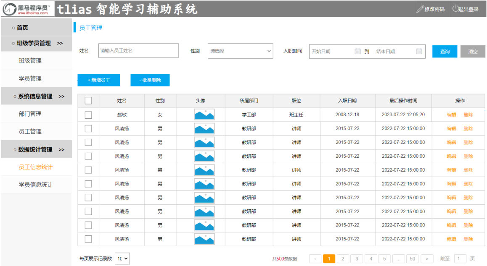
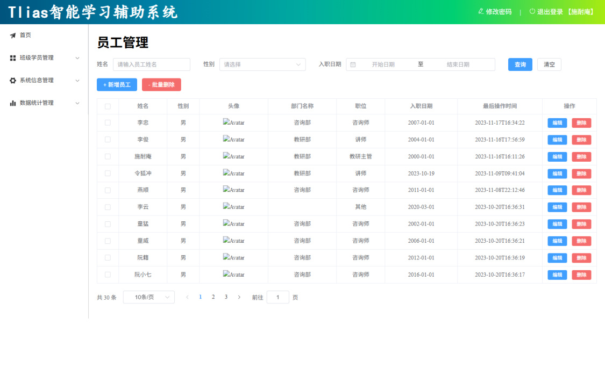

[100 篇](/posts/编程学习/javaweb学习笔记/100-部门管理-新增修改删除/)收尾时，部门管理那块的四件事（列表查询、新增、修改、删除）全做完了：表格能查、能改、能删。这一篇起进入**第 17 章**——**员工管理**。

> [!IMPORTANT]
> 先说一个必须交代的背景：**第 16 章给的工程里，`src/views/emp/index.vue` 是一个空壳**——点左侧菜单"员工管理"，右侧只有"员工管理"四个字，页面主体什么都没写。这不是漏发了文件，而是**员工管理整块是留给学员自己实现的练习页**（[98 篇](/posts/编程学习/javaweb学习笔记/98-前后端分离与整体布局/)搭外壳时，`dept` 和 `emp` 两个页面都是占位）。
>
> **完整实现**在第 18 章的 `资料\05. 完整功能前端代码\vue-tlias-management.zip` 里。本篇和下一篇的代码都以**这份完整版工程**为准（`src/views/emp/index.vue`、`src/api/emp.js`）。

前端要写的这个页面，后端接口其实早在第 13~15 章就写完了：条件分页查询是 [68 篇](/posts/编程学习/javaweb学习笔记/68-条件分页查询与动态sql/)的 `GET /emps`，新增是 [69 篇](/posts/编程学习/javaweb学习笔记/69-新增员工/)的 `POST /emps`。**这一章后端一行不动，只把页面做出来。**

| PPT 页 | 内容 | 本篇对应小节 |
| --- | --- | --- |
| 1 | 章节封面（Web前端实战(案例) · Tlias智能学习辅助系统） | 本篇开头这段背景 |
| 2~3 | 需求分析：员工管理的四个功能 | 员工管理的四个功能 |
| 4 | 目录页（条件分页查询 / 新增员工） | 同一张目录卡片，做一节翻一次 |
| 5、13 | 小节页（01 员工管理-条件分页查询：页面布局 / 页面交互） | 页面布局、页面交互两节的开头 |
| 6 | 需求分析：搜索栏 / 按钮 / 数据展示表格 / 分页条 | 一个页面四块 |
| 7 | 页面布局-搜索表单（表单数据绑定到一个对象；日期范围数组） | 搜索表单 |
| 8~9 | watch 侦听器（作用、用法、侦听对象的单个属性/全部属性） | watch 侦听器 |
| 10 | 问答页（watch 三问） | 回顾三问 |
| 11~12 | 页面布局：按钮 / 数据展示表格 / 分页条 | 按钮、表格与分页条 |
| 14 | 页面交互（三条） | 页面交互三条 |

## 第 17 章开张：员工管理的四个功能（PPT 第 1~4 页）

第 1 页是章节封面，一行标题把这一章的性质写明了：**Web前端实战(案例) · Tlias智能学习辅助系统**。和 [97 篇](/posts/编程学习/javaweb学习笔记/97-elementplus组件库/)那种"认识组件"的章节不一样——这一章**不教新组件的用法，而是拿已经学过的组件做一个完整的业务模块**。

第 2~3 页是需求分析，第 3 页把"员工管理"这四个字拆开：

```text
员工管理 ──┬── 条件分页查询   ← 本篇（先有列表，才谈得上增删改）
           ├── 新增员工      ← 102 篇
           ├── 修改员工      ← 103 篇（第 18 章）
           └── 删除员工      ← 103 篇（第 18 章）
```

第 4 页是**目录页**：一张卡片列表，上面写着"员工管理-条件分页查询"和"员工管理-新增员工"两项。这一页在第 15 页还会再出现一次（做新增员工之前）——**目录页本身没有新知识，它标的是顺序**：把上一节做完才翻到下一节。这个套路和部门管理那一节（[99 篇](/posts/编程学习/javaweb学习笔记/99-部门管理-列表查询/)、[100 篇](/posts/编程学习/javaweb学习笔记/100-部门管理-新增修改删除/)）完全一样：**先查（101）→ 再增（102）→ 再改、再删（103）**，因为增删改做完都要回头刷新这张列表。

第 5 页和第 13 页都是小节页，写着这一节的**两条腿**：

> **页面布局 / 页面交互**

也就是本节的讲法：**先把页面照着原型摆好（布局），再让它动起来（交互）**。前半段（第 6~12 页）是布局，后半段（第 13~14 页）是交互。

## 需求分析：一个页面四块（PPT 第 6 页）

第 6 页把员工管理页面拆成四块：

> **搜索栏 / 按钮 / 数据展示表格 / 分页条**

这四块在**页面原型**里一眼就能认出来：


*图：PPT 第 2、3、6 页都贴的"员工管理"页面原型（来自需求说明的页面原型，不是最终成品）——从上到下依次是**搜索栏**（姓名输入框 / 性别下拉 / 入职时间范围 + 查询、清空两个按钮）、**按钮**（蓝色"+ 新增员工"、蓝色"- 批量删除"）、**数据展示表格**（复选框 / 姓名 / 性别 / 头像 / 所属部门 / 职位 / 入职日期 / 最后操作时间 / 操作）、**分页条**（每页展示记录数 + "共500条数据" + 页码 + 跳至）。原型里的数据是占位数据（连着好几行都是"风清扬"、共 500 条），本机实测的真数据见本篇末尾*

对照 [99 篇](/posts/编程学习/javaweb学习笔记/99-部门管理-列表查询/)的部门管理页，能看出员工管理页多出来的东西正是这四块里的两块：

| 块 | 部门管理页 | 员工管理页 |
| --- | --- | --- |
| 搜索栏 | 没有 | **有**——多了姓名 / 性别 / 入职日期三个条件，这就是标题里的"**条件**" |
| 按钮 | "+ 新增部门" | "+ 新增员工" **+ "- 批量删除"**（删员工是按 id 删，可能删多条） |
| 数据展示表格 | 4 列 | **9 列**（多了性别、头像、部门、职位、入职日期，还多一列复选框） |
| 分页条 | 没有 | **有**——这就是标题里的"**分页**" |

所以"条件分页查询"这个功能的含义是：**带着条件去查一页数据**。接口（[68 篇](/posts/编程学习/javaweb学习笔记/68-条件分页查询与动态sql/)）：

| 项 | 内容 |
| --- | --- |
| 请求 | **GET `/emps?name=&gender=&begin=&end=&page=&pageSize=`** |
| 说明 | 分页查询员工，可按姓名（模糊）、性别、入职日期范围过滤 |
| 响应 | `{ "code": 1, "msg": "success", "data": { "total": 30, "rows": [ { "id": 1, "username": "...", "name": "...", "gender": 1, "image": "...", "deptName": "咨询部", "job": 5, "entryDate": "2007-01-01", "updateTime": "2023-11-17T16:34:22" } ] } }` |

注意**响应里 `data` 里面装的是一个对象**（不是数组）：`total` 是"符合当前条件的总记录数"、`rows` 才是"当前这一页的数据"（[66 篇](/posts/编程学习/javaweb学习笔记/66-员工列表查询与分页分析/)分析过分页要传什么、要还什么）。这一点和部门管理的"查全部"（`data` 直接是数组）不一样，写代码时取的是 **`result.data.rows`**。

## 页面布局-搜索表单（PPT 第 7 页）

第 7 页给的做法还是那句口诀的后半句——**先完成页面的基本布局**。它先点了搜索表单的第一个要领：

> **如果表单封装的数据较多，建议绑定到一个对象中**

为什么？搜索条件有三个（姓名、性别、入职日期），如果每个都用一个独立的 `ref` 变量，组件里就会散着三个变量；**绑到一个对象里**，将来发请求时整个对象一起送出去、清空时整个对象一起恢复成空，都只用碰一个变量。

第 7 页贴的这张图就是搜索栏那一行在页面上的样子：


*图：PPT 第 7 页的搜索栏——三个表单项（**姓名**输入框、**性别**下拉、"**入职时间**"的日期范围选择器写着"开始日期 到 结束日期"）加两个按钮（蓝色"查询"、灰色"清空"）。这张图就是"搜索栏 + 按钮"两块要照着做出来的样子*

完整版工程里，搜索表单的数据对象是这样的（`src/views/emp/index.vue`）：

```js
//搜索表单对象
const searchEmp = ref({
  name: '',
  gender: '',
  date: [],      // 日期范围：【开始日期, 结束日期】这样一个数组
  begin: '',     // 请求参数要的"开始日期"
  end: ''        // 请求参数要的"结束日期"
})
```

为什么一个"入职日期"要占**三个**字段（`date`、`begin`、`end`）？这正是第 7 页重点圈出来的地方：

| 字段 | 谁在用 | 长什么样 |
| --- | --- | --- |
| `date` | **日期范围选择器**绑它 | `['2025-01-01', '2025-12-31']`——一个**数组**，下标 0 是开始、1 是结束 |
| `begin` / `end` | **接口**要这两个参数 | `'2025-01-01'` 和 `'2025-12-31'`——两个**独立**的字符串 |

页面上的控件（日期范围）和接口（两个参数）对不上，中间就得有人做一次"翻译"。PPT 第 7 页给的办法是 **`watch()` 侦听**：`date` 一变，就把数组拆成 `begin`、`end` 塞进同一个对象。这就是下一节的内容。

支撑这个"翻译"能成立的还有一个属性——日期范围选择器上的 `value-format="YYYY-MM-DD"`：

```html
<el-form :inline="true" :model="searchEmp">
  <el-form-item label="姓名">
    <el-input v-model="searchEmp.name" placeholder="请输入员工姓名"></el-input>
  </el-form-item>

  <el-form-item label="性别">
    <el-select v-model="searchEmp.gender" placeholder="请选择">
      <el-option label="男" value="1"></el-option>
      <el-option label="女" value="2"></el-option>
    </el-select>
  </el-form-item>

  <el-form-item label="入职日期">
    <!-- 日期范围选择器：type="daterange" 才是"开始~结束"两根日期一起选 -->
    <el-date-picker
      v-model="searchEmp.date"
      type="daterange"
      range-separator="至"
      start-placeholder="开始日期"
      end-placeholder="结束日期"
      value-format="YYYY-MM-DD"
    ></el-date-picker>
  </el-form-item>

  <el-form-item>
    <el-button type="primary" @click="handleSearch">查询</el-button>
    <el-button @click="handleReset">清空</el-button>
  </el-form-item>
</el-form>
```

| 属性 | 作用 |
| --- | --- |
| `:inline="true"` | 表单**横向排列**（不加的话每个表单项各占一行） |
| `:model="searchEmp"` | 表单**绑定的数据对象**——里面每个表单项用 `v-model="searchEmp.xxx"` 挂到这个对象上 |
| `type="daterange"` | 日期选择器变成"**范围**"型：一次选开始、结束两个日期，`v-model` 拿到的是**数组** |
| `value-format="YYYY-MM-DD"` | **取值的格式**：不写的话 `date` 里是两个 Date 对象（时间戳那种），写了才是 `'2025-01-01'` 这样的字符串——**后端要的正是这种字符串**（[68 篇](/posts/编程学习/javaweb学习笔记/68-条件分页查询与动态sql/)的 `@DateTimeFormat(pattern = "yyyy-MM-dd")`） |

> [!TIP]
> 这就是"**前后端约定**"在页面上的一个具体落点：接口文档说日期参数是 `begin=2022-09-01` 这种字符串，前端就用 `value-format` 把控件里的日期转成这个格式——**格式对不上的话，前端页面看着一切正常，后端却会因为解析不了日期而报错**。

## watch 侦听器（PPT 第 8~9 页）

### 作用与三步用法（PPT 第 8 页）

第 8 页先给定义（这句话值得原样记住）：

> **作用：侦听一个或多个响应式数据源，并在数据源变化时调用传入的回调函数。**

> **用法：① 导入 watch 函数；② 执行 watch 函数，传入要侦听的响应式数据源（ref 对象）和回调函数。**

PPT 上的最小例子：

```js
import { ref, watch } from 'vue'

const a = ref('')

watch(a, (newVal, oldVal) => {   // 侦听 a 的变化
  console.log(`a的值为: newVal: ${newVal}, oldVal: ${oldVal}`);
})
```

三行读完：

| 步骤 | 代码 | 说明 |
| --- | --- | --- |
| ① 导入 | `import { ref, watch } from 'vue'` | `watch` 和 `ref` 一样，是**从 vue 里按需 import 进来的函数**（[96 篇](/posts/编程学习/javaweb学习笔记/96-vue项目开发流程与组合式api/)的组合式 API 风格） |
| ② 传入"侦听的源" | `watch(a, ...)` | 第一个参数：**要盯着谁**。可以直接是一个 `ref` 对象（写 `a` 而不是 `a.value`） |
| ③ 传入"回调函数" | `(newVal, oldVal) => {...}` | 第二个参数：**变化时干什么**。回调有两个形参——**新值**和**旧值**，函数一执行就说明"它变了" |

用一句话说人话：**`watch` 是"当某个数据变了，自动执行一段代码"的开关**。前面几篇里，代码都是"用户点了按钮 → 执行函数"（事件驱动）；`watch` 补上了另一种情况——**数据被改了，我也想自动做点什么**（数据驱动）。

### 侦听对象的单个属性（PPT 第 9 页）

第一个参数是 `ref` 对象时，盯着的是**这个 ref 的整体**（`.value` 被换掉才触发）。如果只想盯对象里的**某一个属性**，第一个参数要传**一个函数**（PPT 第 9 页的写法）：

```js
import { ref, watch } from 'vue'
const user = ref({name:'', age:10})

watch( () => user.value.name , (newVal , oldVal) => {   // 侦听 user 对象中 name 的变化
  console.log(`a的值为: newVal: ${newVal}, oldVal: ${oldVal}`);
})
```

`() => user.value.name` 这个箭头函数的作用是"**把要盯的那个属性取出来交给 watch**"——watch 会记住"这个函数读了 `user.value.name`"，于是以后**只有 `name` 变了才回调**（改 `age` 不会触发）。

第 10 页的问答里把这一点总结成："**参数一：侦听的源，可以是一个 ref 对象，一个函数等**"——传函数，就是为了"盯住对象的某一个属性"。

### 侦听对象的全部属性（PPT 第 9 页）

要盯整个对象里的**所有**属性，就在第三个数传一个配置对象，指定**深度侦听**：

```js
import { ref, watch } from 'vue'
const user = ref({name:'', age:10})

watch(user, (newVal , oldVal) => {   // 侦听 user 对象中全部属性的变化
  console.log(`a的值为: newVal: ${newVal}, oldVal: ${oldVal}`);
}, {deep: true})                     // ← 第三个可选参数：深度侦听
```

**为什么监视"整个对象"要额外加 `deep: true`？** 因为 watch 默认是**浅层侦听**：只关心"这个 ref 有没有被整体换掉"（比如 `user.value = {name:'李四', age:20}`）。而防 `user.value.name = '李四'` 这种"**只改对象里的一个属性、对象本身还是那个对象**"的改动，默认是看不见的。`deep: true` 就是让 watch 往对象里面看一层。

第 9 页把第三个可选参数里最常见的两个列了出来：

| 选项 | 类型 | 含义 |
| --- | --- | --- |
| **`deep`** | boolean | **是否深度侦听，默认浅层侦听**（`true` = 对象内部的属性变化也触发回调） |
| **`immediate`** | boolean | **是否在侦听创建时立即触发回调**（默认 `false`：只有"变化"才触发，创建那一下不算） |

`immediate: true` 的用处举个本项目的例子：如果希望"页面一进来就把 `date` 拆一次"（或者把查询条件同步给接口），默认写法是 `onMounted` 里手动调一次；加了 `immediate: true` 就不用——**watch 创建的那一刻先跑一遍回调**，等于"初始化"和"后续变化"两件事用同一个函数处理了。

> [!NOTE]
> 三种写法的区别可以一张表记住（第 10 页的问答就是问这个）：
>
> | 想盯什么 | 第一个参数怎么写 | 第三个参数 |
> | --- | --- | --- |
> | 一个 ref 本身 | `watch(a, 回调)` | 不用 |
> | 对象里的**某个**属性 | `watch(() => 对象.value.属性名, 回调)` | 不用 |
> | 对象里的**全部**属性 | `watch(对象, 回调)` | `{deep: true}` |

### 落到本项目：把日期范围拆成 begin / end

现在把 watch 用到第 7 页留下的那个问题上——**`date` 是数组，接口要 `begin` + `end`**。完整版工程里的代码：

```js
//侦听searchEmp中的date属性
watch(
  () => searchEmp.value.date,          // 侦听"搜索对象里的 date 这一个属性"
  (newValue, oldValue) => {            // date 一变就执行
     if(newValue.length == 2){         // 选齐了开始+结束两个日期
      searchEmp.value.begin = newValue[0]   // 数组第 0 个 → begin
      searchEmp.value.end = newValue[1]     // 数组第 1 个 → end
     }else {
      searchEmp.value.begin = ''       // 用户点了清空（数组变成空）→ 两个参数也清空
      searchEmp.value.end = ''
     }
  }
)
```

逐行对照着第 9 页的知识点：

| 这一行 | 用的是第 9 页的哪个知识点 |
| --- | --- |
| `() => searchEmp.value.date` | **侦听对象的单个属性**——`searchEmp` 是个对象，我们只关心 `date`，所以第一个参数传一个"取属性的函数" |
| `(newValue, oldValue) => {...}` | **回调函数的两个参数**：`newValue` 是改完之后的数组（这里用上了，`oldValue` 用不上所以没写） |
| `if(newValue.length == 2)` | 日期范围的两种状态：选了完整范围是长度为 2 的数组；**点了清空是空数组**——这两种情况都得管，否则"清空之后条件还留在 `begin`/`end` 里"，后面的查询会带着旧日期去查 |
| 没有第三个参数 | 这里盯的是 `date` 这个数组属性本身（`searchEmp.value.date` 被换成了一个新数组），**不需要 `deep`** |

> [!WARNING]
> 这里有个很容易混的点：`watch` 第一个参数传的是**函数**（`() => searchEmp.value.date`）而不是 `searchEmp` 本身。如果写成 `watch(searchEmp, 回调, {deep: true})`，那就是"盯**全部**属性"——姓名输入框每敲一个字、性别下拉每改一次都会触发回调，虽然结果也能跑通，但回调被白白多调了很多次（而且要记得补 `deep`，否则连日期变了都不触发）。**盯一个属性，就写一个取属性的函数。**

## 回顾三问（PPT 第 10 页）

第 10 页是这一节的问答页，三个问题正好是本节的三个要点，答案都写在第 9 页讲的代码里：

| 问题（PPT 原文） | 答案 |
| --- | --- |
| **watch 侦听函数的作用？** | 侦听**一个或多个响应式数据源**，并在数据源变化时调用所给的回调函数 |
| **watch 函数调用时传入的参数？** | **参数一：侦听的源**，可以是一个 ref 对象、一个函数等；**参数二：侦听的源发生变化时触发的回调函数**；**参数三（可选）：一个对象**（常见 `deep`、`immediate`） |
| **能否侦听对象的一个属性或全部属性？** | 可以。**侦听一个属性**：第一个参数传一个函数 `() => user.value.name`；**侦听全部属性**：第三个参数传一个对象，指定 `deep` 深度侦听 |

## 页面布局：按钮、表格与分页条（PPT 第 11~12 页）

第 11 页把剩下的布局拆成三样：

> **按钮 / 数据展示表格 / 分页条**

### 按钮行

```html
<el-button type="primary" @click="addEmp"> + 新增员工</el-button>
<el-button type="danger" @click="deleteByIds"> - 批量删除</el-button>
<br><br>
```

两个按钮分别用 `type="primary"`（蓝色）和 `type="danger"`（红色）——**颜色在这里是有含义的**：新增是普通操作、批量删除是危险操作（和 [99 篇](/posts/编程学习/javaweb学习笔记/99-部门管理-列表查询/)给"删除"用红色是同一个思路）。`addEmp` 和 `deleteByIds` 两个方法分别属于 102 篇（新增）和 103 篇（删除），本篇先把按钮摆上去，让布局完整。

### 数据展示表格

员工表格一共 9 列，比部门表格复杂，**分三类**：

```html
<el-table :data="empList" border style="width: 100%" @selection-change="handleSelectionChange">
  <!-- ① 表格自带的特殊列：复选框列 -->
  <el-table-column type="selection" width="55" align="center"></el-table-column>

  <!-- ② 有现成字段、直接用 prop 显示的列 -->
  <el-table-column prop="name" label="姓名" width="120" align="center"></el-table-column>

  <!-- ③ 要自己加工才能显示的列：自定义列 -->
  <el-table-column label="性别" width="80" align="center">
    <template #default="scope">
      {{ scope.row.gender == 1 ? '男' : '女' }}
    </template>
  </el-table-column>
  <el-table-column label="头像" width="170" align="center">
    <template #default="scope">
      
    </template>
  </el-table-column>
  <el-table-column prop="deptName" label="部门名称" width="170" align="center"></el-table-column>
  <el-table-column label="职位" width="120" align="center">
    <template #default="scope">
      {{ getJobTitle(scope.row.job) }}
    </template>
  </el-table-column>
  <el-table-column prop="entryDate" label="入职日期" width="180" align="center"></el-table-column>
  <el-table-column prop="updateTime" label="最后操作时间" width="210" align="center"></el-table-column>
  <el-table-column label="操作" fixed="right" align="center">
    <template #default="scope">
      <el-button size="small" type="primary" @click="handleEdit(scope.row.id)">编辑</el-button>
      <el-button size="small" type="danger" @click="handleDelete(scope.row.id)">删除</el-button>
    </template>
  </el-table-column>
</el-table>
```

| 列 | 写法 | 为什么这么写 |
| --- | --- | --- |
| 复选框 | `type="selection"` | 和序号列的 `type="index"` 一样，是**表格自带的特殊列**，不用给数据；勾选结果靠 `@selection-change` 事件拿（103 篇批量删除要用） |
| 姓名 | `prop="name"` | 后端返回的字段直接显示 |
| **性别** | 自定义列 + 三元表达式 | 数据库里存的是 **1 / 2**，页面要显示"男 / 女"——`scope.row.gender == 1 ? '男' : '女'` |
| **头像** | 自定义列 + `` | 要显示的是**图片**不是文字，`` |
| 部门名称 | `prop="deptName"` | 注意字段名是 **`deptName`**——这是后端多表查询时**查出来的部门名字**（[65 篇](/posts/编程学习/javaweb学习笔记/65-多表查询/)的多表查询结果），不是部门 id |
| **职位** | 自定义列 + 函数 | 存的是 **1~6 的数字**，要用函数翻译成文字 |
| 入职日期 | `prop="entryDate"` | 后端返回的已经是 `'2007-01-01'` 这种字符串 |
| 最后操作时间 | `prop="updateTime"` | 带 `T` 的格式（[99 篇](/posts/编程学习/javaweb学习笔记/99-部门管理-列表查询/)解释过，课程没做格式化） |
| 操作 | 自定义列 + `fixed="right"` | 两个按钮（编辑、删除）属于 103 篇；**`fixed="right"` 让这一列固定在表格右侧**——列多了横向滚动时它不跟着滚，避免"操作"两字滚出屏幕 |

把数字职位翻译成文字的那个函数，PPT 的布局素材（`2. 表格-基本布局.vue`）里是用一串 `v-if` 写的，完整版工程里改用 `switch` 写成函数：

```js
// 职位转换函数
const getJobTitle = (job) => {
  switch (job) {
    case 1:
      return '班主任'
    case 2:
      return '讲师'
    case 3:
      return '学工主管'
    case 4:
      return '教研主管'
    case 5:
      return '咨询师'
    default:
      return '其他'
  }
}
```

### 分页条（PPT 第 12 页）

第 12 页专门把"分页条"单独列了一页——它是这一节唯一没有见过的组件：

```html
<el-pagination
  @size-change="handleSizeChange"
  @current-change="handleCurrentChange"
  :current-page="currentPage"
  :page-sizes="[10, 20, 30, 40]"
  :page-size="pageSize"
  layout="total, sizes, prev, pager, next, jumper"
  :total="total"
></el-pagination>
```

拆开看，它是"**三个数据 + 两个事件 + 一个排版**"：

| 属性 / 事件 | 作用 |
| --- | --- |
| `:current-page="currentPage"` | 当前是**第几页**（`ref(1)`） |
| `:page-size="pageSize"` | **每页几条**（`ref(10)`） |
| `:page-sizes="[10, 20, 30, 40]"` | "每页条数"下拉里的可选值 |
| `:total="total"` | **总记录数**——分页条靠它算出"共 X 条""有几页"，所以它必须来自**接口返回的 `total`**，不能自己数当前页的行数 |
| `layout="total, sizes, prev, pager, next, jumper"` | 分页条上**显示哪些部件、按什么顺序**（总条数 / 每页条数下拉 / 上一页 / 页码 / 下一页 / 跳页输入框） |
| `@size-change` / `@current-change` | 两个变化事件：**每页条数变了**、**页码变了**（下一节要用它们重新查数据） |

### 接口这一层：加一个查询函数

[99 篇](/posts/编程学习/javaweb学习笔记/99-部门管理-列表查询/)建立的 `src/api/emp.js`（按模块封装接口的文件），现在加进条件分页查询：

```js
import request from '@/utils/request'

//查询员工列表（条件分页查询）
export const queryPageApi = (name,gender,begin,end,page,pageSize) => request.get(`/emps?name=${name}&gender=${gender}&begin=${begin}&end=${end}&page=${page}&pageSize=${pageSize}`)
```

> [!NOTE]
> 这里把 6 个参数拼进查询字符串（`?name=...&page=...`），和部门那篇的 `request.get('/depts')` 相比"参数多了"而已——**`request` 工具类、公共前缀 `/api`、代理转发这些机制一个字都没变**。另外注意接口路径是 **`/emps`**（多个 s），与 `/depts` 是同一个套路。

## 页面交互三条（PPT 第 13~14 页）

第 13 页又是小节页（"页面布局 / 页面交互"），第 14 页给出这一节要做的三件事（PPT 原文）：

> - **页面加载完毕后，查询员工信息列表。**
> - **点击查询按钮，查询员工信息列表。**
> - **当页码、每页展示记录数发生变化时，查询员工信息列表。**

三条都落在**同一个查询函数**上——查询函数只写一遍，三个"入口"分别调它：

```js
//查询员工（条件分页查询）
const handleSearch = async () => {
  const result = await queryPageApi(searchEmp.value.name, searchEmp.value.gender, searchEmp.value.begin, searchEmp.value.end, currentPage.value, pageSize.value);
  if(result.code){
    empList.value = result.data.rows    // 表格数据 = 当前页的数据
    total.value = result.data.total     // 总记录数 = 分页条要用
  }
}

// 表格数据源：当前页的员工列表
const empList = ref([])

// 分页配置
const currentPage = ref(1)   // 第几页
const pageSize = ref(10)     // 每页几条
const total = ref(0)         // 总记录数
```

`handleSearch` 里有两件事值得单独记住：

1. **参数从哪来**：前四个是搜索表单对象里的字段（`name` / `gender` / `begin` / `end`），后两个是分页配置（`currentPage` / `pageSize`）——**搜索条件 + 分页参数一起发给接口**，这就是"条件分页查询"一次请求的全貌；
2. **回来的数据放哪**：`result.data.rows` 给表格（`:data="empList"`），`result.data.total` 给分页条（`:total="total"`）——**一个响应喂两个组件**。

### ① 页面加载完毕就查一次

和 [99 篇](/posts/编程学习/javaweb学习笔记/99-部门管理-列表查询/)一样用钩子函数：

```js
onMounted(async () => {
  handleSearch()                        // ← 页面一打开就先查第一页

  //加载所有部门数据（新增员工的"所属部门"下拉要用，102 篇讲）
  const result = await queryAllDeptApi();
  if(result.code){
    deptList.value = result.data
  }
})
```

`onMounted` 的回调在**组件挂载完成后**执行，此时 `currentPage` 是 1、`pageSize` 是 10、搜索条件全空——所以请求发出去的是"第 1 页、每页 10 条、不带条件"，页面一打开表格里就有数据。

### ② 点"查询"按钮

```html
<el-button type="primary" @click="handleSearch">查询</el-button>
```

按钮直接绑 `handleSearch`——点一下 = 用当前表单里的条件重新查（页码保持当前值；如果想让"重新查询"从第一页开始，可以在函数里先把 `currentPage.value = 1`）。

### ③ 页码 / 每页条数变化

分页条的这两个事件，做法都是"**先把新值存进变量，再重新查**"：

```js
// 每页展示记录数发生变化
const handleSizeChange = (val) => {
  pageSize.value = val
  handleSearch()
}
// 页码发生变化
const handleCurrentChange = (val) => {
  currentPage.value = val
  handleSearch()
}
```

事件回调的第一个参数就是分页条传出来的新值（新的每页条数 / 新的页码）。

> [!IMPORTANT]
> **为什么"改条数"也要重新查？** 因为**数据在服务端**——前端手上只有当前这一页的 10 条，想要"第 2 页的 10 条"或"每页 20 条"必须**再发一次请求让后端重算**。这也是分页查询的基本约定："翻页"永远是"带着新的 `page`/`pageSize` 再查一次"（[48 篇](/posts/编程学习/javaweb学习笔记/48-dql排序与分页查询/)的 `LIMIT` 在后端干这件事）。前端**不会**把 30 条全拿过来自己切片。

### 顺带：清空按钮

搜索栏上的"清空"按钮不属于 PPT 第 14 页那三条，但工程里有，做法正好顺带复习上面两个知识点：

```js
const handleReset = () => {
  // 清空表单：把整个搜索对象恢复成初始值（注意 date 也要清）
  searchEmp.value = {
    name: '',
    gender: '',
    date: [],
    begin: '',
    end: ''
  }
  handleSearch()   // 清空之后马上按"无条件"再查一次
}
```

`searchEmp` 是**一个对象**（第 7 页的建议在这里省事了）：清空时整体赋一个新对象就行，不用一个个字段去还原。另外把 `date` 也清成空数组，`watch` 会跟着触发一次、把 `begin`/`end` 也置空——**两条清理路径都指向"干净"**。

## 本机实测：表格 10 行、分页条"共 30 条"

环境：完整版前端 dev server（本机 **5174**，5173 被另一个工程占用时 Vite 自动换端口）+ Vite 代理 `/api` + 课程后端 `tlias-web-management`（本机跑在 **8081**，8080 被用户自己的项目占着）+ MySQL `tlias` 库的 `emp` 表（30 条数据）。登录后访问 `/emp`：


*图（本机实测）：打开 `http://localhost:5174/emp`——顶部是搜索栏（姓名输入框、性别下拉、"入职日期"范围选择器 + 查询 / 清空），下面一行是"+ 新增员工""- 批量删除"两个按钮，表格 9 列（复选框 / 姓名 / 性别 / 头像 / 部门名称 / 职位 / 入职日期 / 最后操作时间 / 操作），最下面是分页条"**共 30 条**、10条/页、页码 1 2 3"。表格里是**10 行**真实数据（李忠 / 李俊 / 施耐庵 / 令狐冲 / 燕顺 / 李云 / 童猛 / 童威 / 阮籍 / 阮小七），每行"操作"列都有蓝色"编辑"、红色"删除"*

本机实测核对到的几件事：

| 观察到的现象 | 说明 |
| --- | --- |
| **表格 10 行** | 默认 `pageSize = 10`，所以第一页正好 10 行 |
| **分页条"共 30 条  1 2 3"** | `total` 是接口返回的 **30**（`emp` 表的记录数），30 ÷ 10 = **3 页**——分页条上是 1、2、3 三个页码 |
| **页面按钮清单** | **查询 / 清空 / + 新增员工 / - 批量删除**，以及每行都有的**编辑 / 删除**（后四个分别属于 102、103 篇） |
| **性别列显示"男/女"** | 数据库里存的是 1/2，三元表达式翻译过来的 |
| **头像列显示的是文字 `Avatar`** | 那几行员工的 `image` 字段是空的，`` 加载不到图片就显示 `alt="Avatar"` 这段替代文字——**不是页面坏了**，等 102 篇上传一张头像就正常了 |
| **最后操作时间带 `T`**（如 `2023-11-17T16:34:22`） | 后端 `LocalDateTime` 直接序列化的结果，课程没做格式化（[99 篇](/posts/编程学习/javaweb学习笔记/99-部门管理-列表查询/)同一现象） |

数据链路和部门那篇完全一样，只是这一条**带了条件和分页参数**：组件 `handleSearch()` → `queryPageApi(...)` → `request.get('/emps?name=&gender=&begin=&end=&page=1&pageSize=10')` → 实例拼上 `baseURL` 得 `/api/emps?...` → 打到前端自己的 5174 → 代理命中 `/api`、抹掉前缀后转发 → **后端 8081 的 `GET /emps`** → MyBatis 分页查询 MySQL 的 `tlias.emp` 表 → 返回 `{total: 30, rows: [...10 条...]}` → 表格填 10 行、分页条显示"共 30 条"。

## 小结

| 问题 | 答案 |
| --- | --- |
| 第 17 章做什么？ | **员工管理**的四个功能：**条件分页查询（本篇）/ 新增员工（102 篇）/ 修改员工、删除员工（103 篇）**；顺序是"先查，再增删改" |
| 为什么 `emp` 页面是空的？ | 第 16 章的工程里 `src/views/emp/index.vue` **是留给学员自己实现的练习页**（只有"员工管理"四个字）；**完整实现在第 18 章 `资料\05. 完整功能前端代码`** 里，笔记按完整版讲 |
| 员工管理页面有哪四块？ | **搜索栏 / 按钮 / 数据展示表格 / 分页条**（部门管理页只有前两块和表格） |
| 搜索表单为什么要绑到一个对象？ | 数据项多（姓名、性别、日期）；绑成 `searchEmp` 一个对象后，**发请求、清空都只碰一个变量** |
| 日期范围为什么是三个字段？ | 日期范围控件的值是一个**数组** `['2025-01-01','2025-12-31']`（`date`），接口要的是**两个独立参数** `begin` / `end`——中间靠 **`watch` 侦听 `date` 来拆** |
| `watch` 的作用与三个参数？ | 侦听一个或多个响应式数据源，变化时调用回调；**参数一是源**（ref 对象 / 函数）、**参数二是回调** `(newVal, oldVal)`、**参数三可选**（`deep`、`immediate`） |
| 侦听对象单个属性 vs 全部属性？ | 单个属性：第一个参数传函数 **`() => 对象.value.属性名`**；全部属性：第一个参数传对象本身，第三个参数加 **`{deep: true}`**（默认是浅层侦听，改内部属性不触发） |
| `deep` 和 `immediate` 各是什么？ | `deep`：是否深度侦听（默认 false=浅层）；`immediate`：是否在**创建侦听时立即触发一次**回调（默认 false） |
| 表格 9 列里哪些要"加工"？ | **性别**（1/2 → 男/女，三元表达式）、**头像**（``）、**职位**（1~6 → 文字，`getJobTitle` 函数）、**操作**（自定义列 + `fixed="right"`）；复选框列用 `type="selection"` |
| 分页条的三个数据和两个事件？ | 数据 `:current-page`、`:page-size`、`:total`（**total 必须是接口返回的总数**）；事件 `@size-change`、`@current-change`；`layout` 决定显示哪些部件 |
| 页面交互三条是什么？ | ① **页面加载完毕**查询（`onMounted`）② **点"查询"按钮**查询（`@click="handleSearch"`）③ **页码 / 每页条数变化**时查询（两个 change 事件里"改值 + 重查"）——三条共用一个 `handleSearch` |
| 接口与返回值？ | **`GET /emps?name=&gender=&begin=&end=&page=&pageSize=`**，响应 `data` 里是 `{ total, rows }`——**`rows` 给表格、`total` 给分页条** |
| 本机实测验证了什么？ | 表格 **10 行**真实数据、分页条 **"共 30 条 1 2 3"**、页面上有查询/清空/新增/批量删除/编辑/删除六个按钮；数据经代理打到 8081 的后端、读的是 MySQL `tlias.emp`（本机端口与课程 8080 不同的原因见 [99 篇](/posts/编程学习/javaweb学习笔记/99-部门管理-列表查询/)） |

## 相关

- [上一篇：部门管理-新增、修改、删除](/posts/编程学习/javaweb学习笔记/100-部门管理-新增修改删除/)
- [下一篇：员工管理-新增员工](/posts/编程学习/javaweb学习笔记/102-员工管理-新增员工/)
- [条件分页查询与动态SQL（本篇这个接口的后端实现）](/posts/编程学习/javaweb学习笔记/68-条件分页查询与动态sql/)
- [员工列表查询与分页分析（分页要传什么、要还什么）](/posts/编程学习/javaweb学习笔记/66-员工列表查询与分页分析/)

## 练习题

### 一、知识回顾（读完直接做下面的实践题）

1. **第 17 章做的模块与四个功能**：**员工管理**——**条件分页查询（本篇）/ 新增员工（102 篇）/ 修改员工、删除员工（103 篇）**；顺序是**先查，再增删改**（增删改做完都要回头刷新这张列表）
2. **`emp` 页面为什么是空壳**：第 16 章的工程里 `src/views/emp/index.vue` 只有"员工管理"四个字，**员工管理整块是留给学员自己实现的练习页**；**完整实现在第 18 章的 `资料\05. 完整功能前端代码\vue-tlias-management.zip`** 里（本篇代码以它为准）
3. **员工管理页面的四块**（PPT 第 6 页）：**搜索栏 / 按钮 / 数据展示表格 / 分页条**；其中"搜索栏"对应标题里的**条件**、"分页条"对应**分页**
4. **搜索表单绑成一个对象**：`searchEmp = ref({ name, gender, date, begin, end })`——**数据项多，绑成一个对象**方便整体发请求、整体清空
5. **日期范围要三个字段**：页面控件给的是**数组** `date: ['2025-01-01','2025-12-31']`，接口要的是**两个独立参数** `begin`、`end`；中间用 **`watch` 侦听 `date`** 来拆（选齐了取 `[0]`/`[1]`，清空了就把两个都置 `''`）
6. **`watch` 的作用与三个参数**：**侦听一个或多个响应式数据源，变化时调用回调函数**；参数一 = **侦听的源**（ref 对象 / 函数）、参数二 = **回调** `(newVal, oldVal)`、参数三 = **可选对象**（常见 `deep`、`immediate`）
7. **侦听对象两种写法 + 两个选项**：**单个属性** `watch(() => user.value.name, 回调)`；**全部属性** `watch(user, 回调, {deep: true})`——**默认是浅层侦听**，不加 `deep` 时"只改对象内部属性"不会触发；`deep`（boolean）= **是否深度侦听**，`immediate`（boolean）= **是否在侦听创建时立即触发回调**（默认都是 false）
8. **分页条的三个数据两个事件**：`:current-page`（第几页）、`:page-size`（每页几条）、`:total`（**总记录数，必须是接口返回的 total**）；`@size-change`、`@current-change` 里做"**改值 + 重新查询**"；`layout="total, sizes, prev, pager, next, jumper"` 决定显示哪些部件
9. **接口与页面交互三条**：接口 **`GET /emps?name=&gender=&begin=&end=&page=&pageSize=`**，响应 `data` 里是 **`{ total, rows }`**（`rows` 给表格、`total` 给分页条）；交互三条 = **页面加载完毕查询（`onMounted`）/ 点查询按钮查询 / 页码或每页条数变化时查询**，三条共用一个 `handleSearch`
10. **本机实测**：表格 **10 行**、分页条 **"共 30 条 1 2 3"**、页面按钮是**查询 / 清空 / + 新增员工 / - 批量删除 / 编辑 / 删除**；头像列显示文字 `Avatar` 是因为 `image` 字段为空；最后操作时间带 `T` 是后端未格式化

### 二、裸写题

- [ ] **2-1 把员工管理页的搜索栏搭出来**
  要求：页面标题"员工管理"，下面是一行横向排列的搜索表单，三个条件——**姓名**（输入框，提示"请输入员工姓名"）、**性别**（下拉，两个选项：男 / 女，值分别是 1 和 2）、**入职日期**（能一次选"开始日期 到 结束日期"的范围选择器）；这一行最后放两个按钮："查询"（蓝色）和"清空"（灰色）。
  另外要求：**三个条件的数据不要用三个独立变量装，装进一个对象里**（对象叫 `searchEmp`）。
  检查点：① 三个表单项在同一行；② 范围选择器选完日期后，`searchEmp.date` 里是 `['2025-01-01','2025-12-31']` 这种**字符串数组**（不是 Date 对象）；③ 性别下拉选中后 `searchEmp.gender` 是 `'1'` 或 `'2'`。

  > [!TIP]- 提示（先自己想，实在想不出再点开）
  > **一级 · 思路**：一行横向表单 = 一个表单容器 + 三个表单项 + 一个装着两个按钮的表单项；"装进一个对象"= 表单绑一个对象，每个控件的 `v-model` 写"对象.字段"
  > **二级 · 方法**：`<el-form :inline="true" :model="searchEmp">` + `<el-form-item label="...">`；输入框 `el-input`、下拉 `el-select` + `el-option`、范围日期 `el-date-picker` 且 **`type="daterange"`**；日期要能用字符串取值，加 **`value-format="YYYY-MM-DD"`**；数据用 `ref({ name:'', gender:'', date:[] })`
  > **三级 · 骨架**：`<el-form :____="true" :____="searchEmp">` / `<el-form-item label="姓名"><el-input v-____="searchEmp.____"></el-input></el-form-item>` / `<el-select v-model="searchEmp.____"><el-option label="男" value="1"/><el-option label="女" value="2"/></el-select>` / `<el-date-picker v-model="searchEmp.____" type="____" value-____="YYYY-MM-DD"/>` / `<el-button type="____" @click="handleSearch">查询</el-button>`

  > [!TIP]- 参考答案（做完再点开）
  > ```js
  > // 搜索表单对象：三个条件 + 后面要拆出来的 begin / end
  > const searchEmp = ref({
  >   name: '',
  >   gender: '',
  >   date: [],
  >   begin: '',
  >   end: ''
  > })
  > ```
  >
  > ```html
  > <el-form :inline="true" :model="searchEmp">
  >   <el-form-item label="姓名">
  >     <el-input v-model="searchEmp.name" placeholder="请输入员工姓名"></el-input>
  >   </el-form-item>
  >
  >   <el-form-item label="性别">
  >     <el-select v-model="searchEmp.gender" placeholder="请选择">
  >       <el-option label="男" value="1"></el-option>
  >       <el-option label="女" value="2"></el-option>
  >     </el-select>
  >   </el-form-item>
  >
  >   <el-form-item label="入职日期">
  >     <el-date-picker
  >       v-model="searchEmp.date"
  >       type="daterange"
  >       range-separator="至"
  >       start-placeholder="开始日期"
  >       end-placeholder="结束日期"
  >       value-format="YYYY-MM-DD"
  >     ></el-date-picker>
  >   </el-form-item>
  >
  >   <el-form-item>
  >     <el-button type="primary" @click="handleSearch">查询</el-button>
  >     <el-button @click="handleReset">清空</el-button>
  >   </el-form-item>
  > </el-form>
  > ```
  > 检查点：① 不写 `:inline="true"` 的话三个表单项会各占一行；② 不写 `value-format` 时 `date` 里是两个 Date 对象，直接发给后端会解析失败；③ 对照 PPT 第 7 页和课程资料 `03. 员工管理-基础文件\1. 搜索栏-基本布局.vue`。

- [ ] **2-2 把日期范围数组拆成 begin 和 end**
  素材：页面上的日期范围控件给出的是一个**数组**，例如 `['2025-01-01', '2025-12-31']`；用户点"清空"后它变成一个**空数组**。而接口要的是两个独立的参数 `begin` 和 `end`。
  要求：在 2-1 的搜索对象里加两个字段 `begin`、`end`，然后让它俩**跟着日期范围自动同步**——数组里有开始和结束两个值时，分别填进 `begin`/`end`；数组被清空时，`begin`/`end` 也一起清空。**不要**在点查询按钮时才去拆，要"数组一变就同步"。
  检查点：① 选完日期不点任何按钮，对象里的 `begin`/`end` 就已经有值了；② 点"清空"之后 `begin`/`end` 变回空字符串；③ 只盯着日期这一个属性做同步，改姓名 / 性别不应该触发这段代码。

  > [!TIP]- 提示（先自己想，实在想不出再点开）
  > **一级 · 思路**：要的是"**某个数据一变，自动执行一段代码**"——这正是侦听器干的活；盯的是搜索对象里**那一个属性**（日期数组），不是整个对象
  > **二级 · 方法**：从 vue 里按需导入 **`watch`**；第一个参数传**一个箭头函数**把数组取出来（`() => searchEmp.value.date`，这叫"侦听对象的单个属性"）；第二个参数是回调，`newValue` 就是最新的数组——用 `newValue.length == 2` 判断"选齐了没有"，`else` 分支把两个字段清空
  > **三级 · 骨架**：`import { ref, ____ } from 'vue'` / `____(() => searchEmp.value.____, (newValue, oldValue) => { if(newValue.____ == 2){ searchEmp.value.begin = newValue[____]; searchEmp.value.end = newValue[____] } else { searchEmp.value.begin = ____; searchEmp.value.end = ____ } })`

  > [!TIP]- 参考答案（做完再点开）
  > ```js
  > import { ref, watch } from 'vue'
  >
  > //搜索表单对象
  > const searchEmp = ref({
  >   name: '',
  >   gender: '',
  >   date: [],
  >   begin: '',
  >   end: ''
  > })
  >
  > //侦听searchEmp中的date属性
  > watch(
  >   () => searchEmp.value.date,
  >   (newValue, oldValue) => {
  >      if(newValue.length == 2){          // 选齐了开始 + 结束
  >       searchEmp.value.begin = newValue[0]
  >       searchEmp.value.end = newValue[1]
  >      }else {                            // 被清空（空数组）
  >       searchEmp.value.begin = ''
  >       searchEmp.value.end = ''
  >      }
  >   }
  > )
  > ```
  > 检查点：① 第一个参数写成 `() => searchEmp.value.date`（**函数**）就是"盯单个属性"；写成 `searchEmp` 再加 `{deep: true}` 也能跑，但那是"盯全部属性"，改姓名、改性别都会触发；② 别忘 `else` 分支——否则"清空日期"之后 `begin`/`end` 还留着上一次的值，请求会带着旧条件；③ 对照完整版工程 `src/views/emp/index.vue` 里那段 `watch(() => searchEmp.value.date, ...)`。

- [ ] **2-3 把三条交互接上（加载完查一次、点查询、翻页）**
  素材（接口）：`GET /emps?name=&gender=&begin=&end=&page=&pageSize=`，响应结构 `{ "code": 1, "msg": "success", "data": { "total": 30, "rows": [ ... ] } }`，`code` 为 1 表示成功。
  要求：① 页面一打开就自动查一次（第 1 页、每页 10 条）；② 点搜索栏的"查询"按钮，用当前表单里的条件重新查；③ 分页条上**换页码**或**改每页条数**时也重新查。三次查询共用同一个查询函数，查询函数要会把返回的 `rows` 交给表格、`total` 交给分页条。
  检查点：① 刷新页面，表格自动出现 10 行、分页条显示"共 30 条"；② 点第 2 页，表格内容变成第 2 页的数据（表格数据来自接口，不是前端切片）；③ 把"每页条数"改成 20，请求里的 `pageSize` 变成 20。

  > [!TIP]- 提示（先自己想，实在想不出再点开）
  > **一级 · 思路**：三条交互 = 三个"入口"，入口里都只做一件事——调用查询函数；查询函数里做"发请求 → 判断状态码 → 把 rows 给表格、total 给分页条"
  > **二级 · 方法**：数据源变量 `ref([])`；分页三个变量 `currentPage` / `pageSize` / `total` 都用 `ref`；"页面加载完"用**钩子函数** `onMounted`；按钮用 `@click`；分页条用 `@size-change` / `@current-change`，两个回调的参数就是新值，**先改变量再调查询函数**
  > **三级 · 骨架**：`const handleSearch = async () => { const result = await ____(searchEmp.value.name, searchEmp.value.gender, searchEmp.value.begin, searchEmp.value.end, currentPage.____, pageSize.____); if(result.____){ empList.value = result.data.____; total.value = result.data.____ } }` / `____(() => { handleSearch() })` / `const handleSizeChange = (val) => { pageSize.value = val; ____() }` / `const handleCurrentChange = (val) => { currentPage.value = val; ____() }`

  > [!TIP]- 参考答案（做完再点开）
  > ```js
  > import { ref, onMounted } from 'vue'
  > import { queryPageApi } from '@/api/emp'
  >
  > // 表格数据源（当前页的员工列表）
  > const empList = ref([])
  >
  > // 分页配置
  > const currentPage = ref(1)    // 第几页
  > const pageSize = ref(10)      // 每页几条
  > const total = ref(0)          // 总记录数（分页条用）
  >
  > //查询员工（条件分页查询）
  > const handleSearch = async () => {
  >   const result = await queryPageApi(searchEmp.value.name, searchEmp.value.gender, searchEmp.value.begin, searchEmp.value.end, currentPage.value, pageSize.value);
  >   if(result.code){
  >     empList.value = result.data.rows     // 当前页数据 → 表格
  >     total.value = result.data.total      // 总记录数 → 分页条
  >   }
  > }
  >
  > // ① 页面加载完毕就查一次
  > onMounted(() => {
  >   handleSearch()
  > })
  >
  > // ② 点"查询"按钮：模板里写 @click="handleSearch"
  >
  > // ③ 每页条数变化
  > const handleSizeChange = (val) => {
  >   pageSize.value = val
  >   handleSearch()
  > }
  > // ③ 页码变化
  > const handleCurrentChange = (val) => {
  >   currentPage.value = val
  >   handleSearch()
  > }
  > ```
  >
  > ```html
  > <el-table :data="empList" border style="width: 100%">
  >   <el-table-column type="selection" width="55" align="center"></el-table-column>
  >   <el-table-column prop="name" label="姓名" width="120" align="center"></el-table-column>
  >   <!-- 其余列见 2-4 与综合题 -->
  > </el-table>
  >
  > <el-pagination
  >   @size-change="handleSizeChange"
  >   @current-change="handleCurrentChange"
  >   :current-page="currentPage"
  >   :page-sizes="[10, 20, 30, 40]"
  >   :page-size="pageSize"
  >   layout="total, sizes, prev, pager, next, jumper"
  >   :total="total"
  > ></el-pagination>
  > ```
  > 检查点：① 写成 `result.data` 交给表格会拿到一个对象（不是数组），表格会空白——**要写 `result.data.rows`**；② 分页条的 `:total` 必须绑接口返回的总数，绑成 `empList.length` 的话分页条只会显示"共 10 条、1 页"；③ 换页返回的数据是后端重新查的（[48 篇](/posts/编程学习/javaweb学习笔记/48-dql排序与分页查询/)的 `LIMIT` 在后端）。

- [ ] **2-4 辨析题（三种侦听写法 + 两个选项）**
  要求：为下面每个需求选一种侦听写法，并说清第三个参数要不要加、加什么——
  ① 盯住搜索对象里的**日期数组**（就是 2-2）；
  ② 盯住**整个** `employee` 表单对象（102 篇要用：工作经历的日期一变就同步）；
  ③ 希望"侦听创建的那一瞬间先执行一次回调"，不要点了才执行；
  ④ 判断题：`watch(user, 回调)` 能侦听到 `user.value.name = '李四'` 这种改动吗？为什么？
  检查点：① 每个需求都要说出"第一个参数传什么、第三个参数加不加"；② 判断题要落到"默认是浅层还是深层"上。

  > [!TIP]- 提示（先自己想，实在想不出再点开）
  > **一级 · 思路**：判断"盯的是对象的某个属性还是整个对象"——盯一个属性传函数、盯整个对象加 `deep`；"创建时就执行"不是靠 `deep`，而是第三个参数里的另一个选项
  > **二级 · 方法**：`() => 对象.value.属性名` = 单个属性；`{deep: true}` = 全部属性（**默认浅层侦听**）；`{immediate: true}` = 创建时立即触发；两个选项可以同时写在同一个配置对象里
  > **三级 · 骨架**：① `____(() => searchEmp.value.____, 回调)`；② `watch(employee, 回调, {____: true})`；③ 第三个参数写成 `{____: true}`；④ 从"默认浅层侦听"这句话出发解释"对象没被整体替换"时会发生什么

  > [!TIP]- 参考答案（做完再点开）
  > ① **侦听对象的单个属性**：
  > ```js
  > watch(() => searchEmp.value.date, (newValue, oldValue) => { /* 拆 begin / end */ })
  > ```
  > 第一个参数传"取属性的函数"，**不需要第三个参数**（盯的是 `date` 这个数组本身）。
  >
  > ② **侦听对象的全部属性**（深度侦听）：
  > ```js
  > watch(employee, (newVal, oldVal) => { /* 把每行工作经历的 exprDate 拆成 begin / end */ }, {deep: true})
  > ```
  > 对象内部的任何属性（包括数组里每个元素的属性）变化都触发回调，所以**必须加 `deep: true`**。
  >
  > ③ 加的是 **`immediate`**：
  > ```js
  > watch(源, 回调, {immediate: true})
  > ```
  > 默认 `false`（只有变化才触发）；`true` 表示**侦听创建时立即先触发一次回调**——适合"初始化和后续变化共用同一段代码"。
  >
  > ④ **不能**。`watch` **默认是浅层侦听**：`user.value.name = '李四'` 只改了对象内部的一个属性，`user.value` 本身没被换成新对象，所以回调不会触发；想侦听到就得加第三个参数 `{deep: true}`（或者改成侦听那一个属性 `() => user.value.name`）。

### 三、综合题

- [ ] **3-1 照课程案例做一遍"员工管理-条件分页查询"**
  分步做（顺序和 PPT 第 5~14 页一致）：
  1. 打开第 16 章的工程，点左侧菜单"员工管理"进入 `/emp`——页面主体是空的（这就是留给自己的练习页）
  2. 照页面原型搭**搜索栏**：姓名输入框、性别下拉、入职日期范围选择器，外加"查询 / 清空"按钮；**三个条件绑到一个对象**里（对象里给日期范围留 `date` 数组，并留出 `begin`/`end`）
  3. 写 **`watch`**：盯住那个日期数组，一变就拆成 `begin`/`end`（清空时两个都置空）
  4. 搭**按钮行**：蓝色"+ 新增员工"、红色"- 批量删除"（点击事件先留空）
  5. 搭**表格**：复选框列（`type="selection"`）、姓名、性别（1/2 → 男/女）、头像（``）、部门名称（`prop="deptName"`）、职位（数字 → 文字）、入职日期、最后操作时间、操作列（编辑/删除，`fixed="right"`）
  6. 搭**分页条**：三个数据（当前页、每页条数、总记录数）+ 两个变化事件 + `layout`
  7. 写查询函数（条件 + 分页参数一起发，`rows` 给表格、`total` 给分页条），再把三条交互接上：加载完毕查一次、点查询按钮查、页码/条数变化查；顺手把"清空"也做完
  8. 启动后端（课程那套 `tlias-web-management`），确认它跑在哪个端口、和 `vite.config.js` 里代理的 `target` 对得上；打开浏览器验证
  9. 打开 F12 → Network，看这一次请求的地址（`/api/emps?...`）和响应（`data.total`、`data.rows` 各是什么）
  10. 顺手练排查：把"每页条数"改成 20 看请求里的 `pageSize` 变化；把日期范围选上再点查询，看请求里 `begin`/`end` 是否带上

  > [!TIP]- 提示（先自己想，实在想不出再点开）
  > **一级 · 思路**：布局四块（搜索栏 / 按钮 / 表格 / 分页条）+ 交互三条（加载完 / 点查询 / 翻页条数变化），中间夹一个 `watch` 做日期翻译；接口和工具类都沿用 99 篇那套
  > **二级 · 方法**：`el-form :inline` + `el-input` / `el-select` / `el-date-picker type="daterange" value-format`；`watch(() => 对象的.value.属性, 回调)`；`el-table` + `el-table-column`（`type="selection"`、`prop`、`#default="scope"`、`fixed="right"`）；`el-pagination`（`:current-page` / `:page-size` / `:total` / `@size-change` / `@current-change` / `layout`）；`ref` 装 `empList` / `currentPage` / `pageSize` / `total`；`onMounted` + `async/await`
  > **三级 · 骨架**：`const searchEmp = ref({ name:'', gender:'', date:[], ____:'', ____:'' })` / `watch(() => searchEmp.value.____, (newValue) => { … })` / `const handleSearch = async () => { const result = await queryPageApi(…); if(result.code){ empList.value = result.data.____; total.value = result.data.____ } }` / `onMounted(() => { ____() })` / `<el-pagination :____="total" …>`

  > [!TIP]- 参考答案（做完再点开）
  > ```js
  > // src/api/emp.js —— 加一个"条件分页查询"的接口函数
  > import request from '@/utils/request'
  >
  > export const queryPageApi = (name,gender,begin,end,page,pageSize) => request.get(`/emps?name=${name}&gender=${gender}&begin=${begin}&end=${end}&page=${page}&pageSize=${pageSize}`)
  > ```
  >
  > ```vue
  > <!-- src/views/emp/index.vue —— 脚本部分 -->
  > <script setup>
  > import { ref, watch, onMounted } from 'vue'
  > import { queryPageApi } from '@/api/emp'
  >
  > //搜索表单对象
  > const searchEmp = ref({
  >   name: '',
  >   gender: '',
  >   date: [],
  >   begin: '',
  >   end: ''
  > })
  >
  > //侦听searchEmp中的date属性：把日期数组拆成接口要的两个参数
  > watch(
  >   () => searchEmp.value.date,
  >   (newValue, oldValue) => {
  >      if(newValue.length == 2){
  >       searchEmp.value.begin = newValue[0]
  >       searchEmp.value.end = newValue[1]
  >      }else {
  >       searchEmp.value.begin = ''
  >       searchEmp.value.end = ''
  >      }
  >   }
  > )
  >
  > // 表格数据源
  > const empList = ref([])
  >
  > // 分页配置
  > const currentPage = ref(1)
  > const pageSize = ref(10)
  > const total = ref(0)
  >
  > //查询员工（条件分页查询）
  > const handleSearch = async () => {
  >   const result = await queryPageApi(searchEmp.value.name, searchEmp.value.gender, searchEmp.value.begin, searchEmp.value.end, currentPage.value, pageSize.value);
  >   if(result.code){
  >     empList.value = result.data.rows
  >     total.value = result.data.total
  >   }
  > }
  >
  > //清空搜索条件，再重新查一次
  > const handleReset = () => {
  >   searchEmp.value = {
  >     name: '',
  >     gender: '',
  >     date: [],
  >     begin: '',
  >     end: ''
  >   }
  >   handleSearch()
  > }
  >
  > // 分页处理：改完值重新查
  > const handleSizeChange = (val) => {
  >   pageSize.value = val
  >   handleSearch()
  > }
  > const handleCurrentChange = (val) => {
  >   currentPage.value = val
  >   handleSearch()
  > }
  >
  > // 职位转换函数：数字 → 文字
  > const getJobTitle = (job) => {
  >   switch (job) {
  >     case 1:
  >       return '班主任'
  >     case 2:
  >       return '讲师'
  >     case 3:
  >       return '学工主管'
  >     case 4:
  >       return '教研主管'
  >     case 5:
  >       return '咨询师'
  >     default:
  >       return '其他'
  >   }
  > }
  >
  > //钩子函数：页面加载完毕先查一次
  > onMounted(() => {
  >   handleSearch()
  > })
  > </script>
  >
  > <template>
  >   <h1>员工管理</h1> <br>
  >   <el-form :inline="true" :model="searchEmp">
  >     <el-form-item label="姓名">
  >       <el-input v-model="searchEmp.name" placeholder="请输入员工姓名"></el-input>
  >     </el-form-item>
  >     <el-form-item label="性别">
  >       <el-select v-model="searchEmp.gender" placeholder="请选择">
  >         <el-option label="男" value="1"></el-option>
  >         <el-option label="女" value="2"></el-option>
  >       </el-select>
  >     </el-form-item>
  >     <el-form-item label="入职日期">
  >       <el-date-picker
  >         v-model="searchEmp.date"
  >         type="daterange"
  >         range-separator="至"
  >         start-placeholder="开始日期"
  >         end-placeholder="结束日期"
  >         value-format="YYYY-MM-DD"
  >       ></el-date-picker>
  >     </el-form-item>
  >     <el-form-item>
  >       <el-button type="primary" @click="handleSearch">查询</el-button>
  >       <el-button @click="handleReset">清空</el-button>
  >     </el-form-item>
  >   </el-form>
  >
  >   <el-button type="primary"> + 新增员工</el-button>
  >   <el-button type="danger"> - 批量删除</el-button>
  >   <br><br>
  >
  >   <el-table :data="empList" border style="width: 100%">
  >     <el-table-column type="selection" width="55" align="center"></el-table-column>
  >     <el-table-column prop="name" label="姓名" width="120" align="center"></el-table-column>
  >     <el-table-column label="性别" width="80" align="center">
  >       <template #default="scope">
  >         {{ scope.row.gender == 1 ? '男' : '女' }}
  >       </template>
  >     </el-table-column>
  >     <el-table-column label="头像" width="170" align="center">
  >       <template #default="scope">
  >         
  >       </template>
  >     </el-table-column>
  >     <el-table-column prop="deptName" label="部门名称" width="170" align="center"></el-table-column>
  >     <el-table-column label="职位" width="120" align="center">
  >       <template #default="scope">
  >         {{ getJobTitle(scope.row.job) }}
  >       </template>
  >     </el-table-column>
  >     <el-table-column prop="entryDate" label="入职日期" width="180" align="center"></el-table-column>
  >     <el-table-column prop="updateTime" label="最后操作时间" width="210" align="center"></el-table-column>
  >     <el-table-column label="操作" fixed="right" align="center">
  >       <template #default="scope">
  >         <el-button size="small" type="primary">编辑</el-button>
  >         <el-button size="small" type="danger">删除</el-button>
  >       </template>
  >     </el-table-column>
  >   </el-table>
  >   <br>
  >
  >   <el-pagination
  >     @size-change="handleSizeChange"
  >     @current-change="handleCurrentChange"
  >     :current-page="currentPage"
  >     :page-sizes="[10, 20, 30, 40]"
  >     :page-size="pageSize"
  >     layout="total, sizes, prev, pager, next, jumper"
  >     :total="total"
  >   ></el-pagination>
  > </template>
  >
  > <style scoped>
  > .avatar {
  >   height: 40px;
  > }
  > </style>
  > ```
  > 检查点：
  > 1. 表格自动出现 **10 行**数据、序号不需要自己造（这页没有序号列，但复选框要能勾）；
  > 2. 分页条显示 **"共 30 条"**、页码 **1 2 3**（本机实测就是这三个数）；
  > 3. F12 → Network 里的请求是 **`/api/emps?name=&gender=&begin=&end=&page=1&pageSize=10`**，响应里有 `data.total` 和 `data.rows`；
  > 4. 选一个日期范围点"查询"，请求里的 `begin`/`end` 变成 `2025-01-01` 这种格式——**说明 `watch` 那一段真的在工作**；
  > 5. 点"清空"后表格回到 10 行、条件框全空、`begin`/`end` 也是空的；
  > 6. 头像列显示 `Avatar` 文字是正常的（那几行没上传头像，走的是 `alt`）。
  > 做完这一题，102 篇会在这个页面上加"新增员工"：那里新增/修改共用一个对话框，保存成功后回头调的就是本篇这个 `handleSearch()`。
