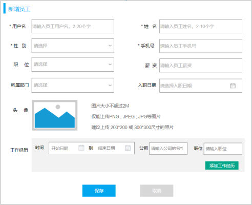
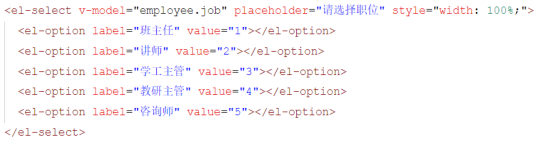
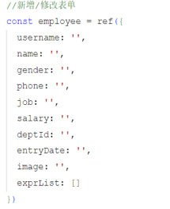
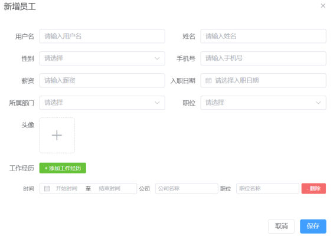
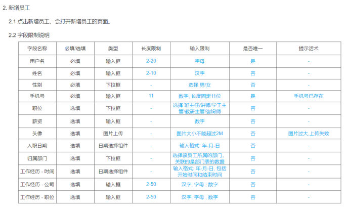
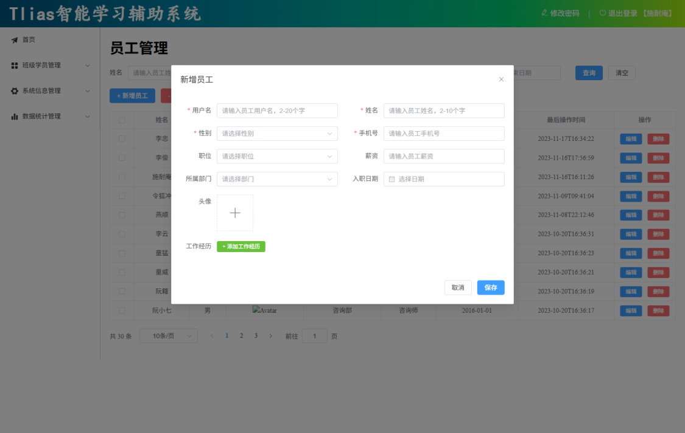
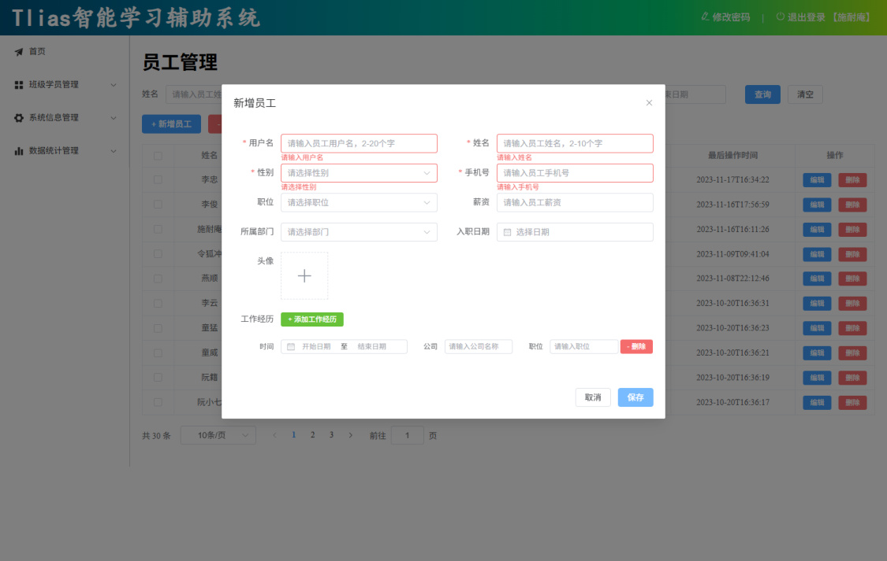

[101 篇](/posts/编程学习/javaweb学习笔记/101-员工管理-条件分页查询/)把员工列表查出来了：表格能显示、条件能用、分页能翻——但这个页面**只能看**，" + 新增员工"那个蓝色按钮当时是空着的（点击事件没写）。这一篇（PPT 第 15~23 页）就把它接上：**弹出一个对话框，把一名新员工填进去、存到数据库，再让列表里出现他。**

| PPT 页 | 内容 | 本篇对应小节 |
| --- | --- | --- |
| 15 | 目录页（条件分页查询 / 新增员工） | 第 17 章的下半场 |
| 16、19 | 小节页（02 员工管理-新增员工：页面布局 / 页面交互） | 同一节翻两次，把这一节切成"布局 / 交互"两段 |
| 17 | 页面布局：表单包含两个部分 | 表单的两部分 |
| 18 | 页面布局：表单项数据动态展示（性别 / 职位 / 所属部门） | 三处动态展示 |
| 20 | 页面交互：添加工作经历 / 删除工作经历（数据驱动视图） | 动态添加删除工作经历 |
| 21 | 页面交互：保存（成功 / 失败） | 保存员工信息 |
| 22 | 表单校验（四条规则） | 表单校验 |
| 23 | 空白页（第 17 章到此结束） | 本篇末尾的章末交代 |

## 第 17 章的下半场（PPT 第 15~16 页）

第 15 页是**目录页**：还是那张写着"员工管理-条件分页查询"和"员工管理-新增员工"的卡片列表，但这次第一格已经做完、被点亮了，翻到第二格。第 16 页是**小节页**，写着：

> **02 员工管理-新增员工 / 页面布局 / 页面交互**

第 19 页又翻到这同一张小节页——**"页面布局"那一节讲完、准备讲"页面交互"时会再出现一次**。这两页本身没有新知识，但它们把这一节切成两段，也顺手把做法交代清楚了：**先照原型把表单摆出来（布局），再让它会响（交互）**——和 [101 篇](/posts/编程学习/javaweb学习笔记/101-员工管理-条件分页查询/)、和整个部门管理那一节是同一个节奏。

## 表单的两部分（PPT 第 17 页）

第 17 页只有一句话，但它是这一节布局的总纲：

> **新增员工信息的表单包含两个部分：员工的基本信息 / 员工的工作经历信息。**

在页面原型里长这样：


*图：PPT 第 17 页给的"新增员工"页面原型——上半部分是**基本信息**（第一行"用户名 / 姓名"，第二行"性别 / 手机号"，第三行"职位 / 薪资"，第四行"所属部门 / 入职日期"，第五行"头像"加三条提示："图片大小不超过2M""仅能上传PNG、JPEG、JPG等图片""建议上传200*200或300*300尺寸的照片"）；下半部分是**工作经历**（一行"时间 / 公司 / 职位"，右下角一个"添加工作经历"按钮）；最下面是"保存 / 取消"。**必填项前面有红色星号**：用户名、姓名、性别、手机号*

为人父母式的表格拆一下，两部分的字段一共 **10 个表单项**：

| 部分 | 表单项 | 说明 |
| --- | --- | --- |
| **员工的基本信息** | 用户名 | 必填（2~20 字），登录用的账号（[81 篇](/posts/编程学习/javaweb学习笔记/81-登录功能/)的登录名就是它） |
| | 姓名 | 必填（2~10 字） |
| | 性别 | 必填（下拉） |
| | 手机号 | 必填（11 位） |
| | 职位 | 下拉（3 个字的"教研主管"这种） |
| | 薪资 | 输入框 |
| | 所属部门 | 下拉（**动态查询**，见下一节） |
| | 入职日期 | 日期选择（单个日期，不是范围） |
| | 头像 | 图片上传（不超 2M、PNG/JPEG/JPG、建议 200×200 或 300×300） |
| **工作经历信息** | 工作经历 | 一行 = 时间（开始~结束）+ 公司 + 职位；**可以有多行**（下一节讲怎么增删） |

布局上它和部门管理那次的新增有什么不同？部门的新增对话框里只有一个"部门名称"输入框，一行就完了；员工的新增**要在一张对话框里塞下 10 个表单项**，所以工程里用**一行两列**的排法：拿行组件把一行切开、每一块占一半宽度（如"用户名"占左半边、"姓名"占右半边），到"头像"那一行才单独占满整行。

> [!NOTE]
> 这张对话框还有两个"看名字就知道"的伏笔：升起来时标题叫"**新增员工**"，但工程里它是**新增和修改共用的**——[103 篇](/posts/编程学习/javaweb学习笔记/103-员工管理-修改与删除/)点"编辑"时弹的是**同一个对话框**，只是标题换成"修改员工"、数据换成查回来的。所以现在写的时候，对话框的**标题**要用一个变量（工程里叫 `dialogTitle`），而不是在模板里写死"新增员工"。

## 三处"动态展示"（PPT 第 18 页）

第 18 页点出表单里有三个地方的数据**不是写死的**：

> **表单项数据动态展示：性别（男/女）/ 职位（班主任/讲师/学工主管/教研主管/...）/ 所属部门（动态查询）**

前两个是"把一份固定的数据摆出来"，第三个是"每次都要去后端问"。工程里是这样写的：

```js
//职位列表数据
const jobs = ref([{ name: '班主任', value: 1 },{ name: '讲师', value: 2 },{ name: '学工主管', value: 3 },{ name: '教研主管', value: 4 },{ name: '咨询师', value: 5 },{ name: '其他', value: 6 }])
//性别列表数据
const genders = ref([{ name: '男', value: 1 }, { name: '女', value: 2 }])
//部门列表数据（动态查询来的）
const deptList = ref([])
```

三个下拉的模板（拿"职位"和"所属部门"举例，它们都用 `v-for` 把数组铺成选项）：

```html
<el-form-item label="性别" prop="gender">
  <el-select v-model="employee.gender" placeholder="请选择性别" style="width: 100%;">
    <el-option v-for="gender in genders" :key="gender.name" :label="gender.name" :value="gender.value"></el-option>
  </el-select>
</el-form-item>

<el-form-item label="职位">
  <el-select v-model="employee.job" placeholder="请选择职位" style="width: 100%;">
    <el-option v-for="job in jobs" :key="job.name" :label="job.name" :value="job.value"></el-option>
  </el-select>
</el-form-item>

<el-form-item label="所属部门">
  <el-select v-model="employee.deptId" placeholder="请选择部门" style="width: 100%;">
    <el-option v-for="dept in deptList" :key="dept.id" :label="dept.name" :value="dept.id"></el-option>
  </el-select>
</el-form-item>
```

第 18 页配的另一张图就是写死的选项代码（早期布局版本的写法，每一项一行）：


*图：PPT 第 18 页的"职位"下拉——一个一个写出来的五个选项（班主任 / 讲师 / 学工主管 / 教研主管 / 咨询师），每个 `<el-option>` 上 `label` 是显示的文字、`value` 是提交给后端的数字。完整版工程把这串选项**收进了一个 `jobs` 数组**（多补了一个"其他"= 6），模板里用 `v-for` 循环铺开——**选项要改动时只动数组、不动模板***

三处的数据来源，一张表看清：

| 表单项 | 数据来源 | 为什么 |
| --- | --- | --- |
| 性别 | 组件里写死的小数组 `genders`（男=1、女=2） | 性别就这两种，永远不会变 |
| 职位 | 组件里写死的小数组 `jobs`（班主任=1 … 咨询师=5、其他=6） | 职位是这套系统内部约定好的几档，改动频率极低 |
| **所属部门** | **动态查询**——`queryAllDeptApi()` 查回 `deptList` | **部门是会变的**（[100 篇](/posts/编程学习/javaweb学习笔记/100-部门管理-新增修改删除/)刚做过新增/修改/删除部门）：今天新增一个"电商部"，明天员工表单里就该能选到它 |

### 所属部门是怎么"动态"来的

用 [99 篇](/posts/编程学习/javaweb学习笔记/99-部门管理-列表查询/)那两个现成的东西——部门模块的 api 函数 + `onMounted`：

```js
import { queryAllApi as queryAllDeptApi } from '@/api/dept'   // 部门模块的"查全部"

// 部门列表数据（给"所属部门"下拉用）
const deptList = ref([])

onMounted(async () => {
  handleSearch()                        // 101 篇的查询列表
  //加载所有部门数据
  const result = await queryAllDeptApi();
  if(result.code){
    deptList.value = result.data
  }
})
```

> [!TIP]
> `import { queryAllApi as queryAllDeptApi } from '@/api/dept'` 里的 **`as` 是"起别名"**：员工模块自己的 `api/emp.js` 里也有一个 `queryAllApi`（查所有员工），两个同名函数进口同一个文件会撞车，所以把部门那个改叫 `queryAllDeptApi`。**"按模块封装 api"的好处在这里显出来了**——要用别的模块的接口，只要 import 一下，路径、参数这些细节都不用管。

## 表单的数据对象（PPT 第 20 页的代码图）

表单要提交哪些字段，先看这个对象（PPT 第 20 页贴的就是它，工程 `src/views/emp/index.vue`）：


*图：PPT 第 20 页贴的"新增/修改表单"数据对象代码——从 `username`、`name`、`gender`、`phone`、`job`、`salary`、`deptId`、`entryDate`、`image` 一直到 `exprList: []`，正好对上前一节的"基本信息 + 工作经历"两部分：**前 9 个是基本信息，最后一个 `exprList` 是工作经历列表***

```js
//新增/修改表单
const employee = ref({
  username: '',     // 用户名
  name: '',         // 姓名
  gender: '',       // 性别（1 男 / 2 女）
  phone: '',        // 手机号
  job: '',          // 职位（1~6）
  salary: '',       // 薪资
  deptId: '',       // 所属部门 id（提交的是 id，不是名字）
  entryDate: '',    // 入职日期
  image: '',        // 头像（上传成功后拿到的图片地址）
  exprList: []      // 工作经历列表（数组，每个元素是一条经历）
})
```

| 字段 | 提交给后端的是什么 | 对应接口里的哪一个 |
| --- | --- | --- |
| `username` / `name` / `phone` / `salary` / `entryDate` | 输入框 / 日期选择器里填的字符串 | 一一对应 |
| `gender` / `job` / `deptId` | **数字**（下拉选项的 `value`） | 一一对应（后端是 Integer） |
| `image` | 图片的**访问地址**（不是图片本身） | 一一对应 |
| `exprList` | **一个数组**，每个元素是 `{ begin, end, company, job }` | `Emp` 里的 `List<EmpExpr>`（[69 篇](/posts/编程学习/javaweb学习笔记/69-新增员工/)） |

`exprList` 是这份对象里唯一"条数会变"的字段——它就是下一节的主角。

## 页面交互一：动态添加、删除工作经历（PPT 第 20 页）

第 20 页把两件事说得很直白：

> - **添加工作经历：下方就会增加一个工作经历信息**
> - **删除工作经历：删除当前这一个工作经历信息**
>
> **Vue 是基于数据驱动视图展示的**

对话框里"工作经历"那一段的样子（PPT 第 20~21 页都贴的这张）：


*图：PPT 第 20 页贴的"新增员工"对话框——基本信息下面有一行"工作经历"加一个绿色的"+ 添加工作经历"按钮；再下面就是**一条已添加的工作经历**：时间（开始时间 ~ 结束时间）、公司、职位，最右边是红色的"- 删除"。**几条经历就是几行这样的控件**，而这几行不是写死的——下面讲*

### 数据驱动视图：改数组，行数跟着变

先记住一句话：**"增加一行工作经历"这件事，在 Vue 里不是"往页面上插一段 HTML"，而是"往数组里塞一个对象"。** 数据变了，页面自己就跟着变了——这就是"数据驱动视图"。

工程代码短得离谱：

```js
//动态添加工作经历
const addExprItem = () => {
  employee.value.exprList.push({exprDate: [], begin: '', end: '', company: '', job: ''})
}

//动态删除工作经历
const delExprItem = (index) => {
  employee.value.exprList.splice(index, 1)
}
```

| 代码 | 干了什么 | 页面上发生什么 |
| --- | --- | --- |
| `exprList.push({...})` | 往数组**末尾加一个对象** | 工作经历区**多出一行**（时间 / 公司 / 职位 / 删除） |
| `exprList.splice(index, 1)` | 从数组的 `index` 位置**删掉 1 个** | 第 `index+1` 行**消失**，其余行自动往前补 |
| `{exprDate: [], begin: '', end: '', company: '', job: ''}` | 新增的那个"空行"对象 | 三个控件都是空的，等用户填 |

模板这边就一句 `v-for`——**"数组里有几个对象，就渲染几行"**：

```html
<!-- 第六行：标题行 + 添加按钮 -->
<el-row :gutter="10">
  <el-col :span="24">
    <el-form-item label="工作经历">
      <el-button type="success" size="small" @click="addExprItem">+ 添加工作经历</el-button>
    </el-form-item>
  </el-col>
</el-row>

<!-- 第七行开始：每一条工作经历渲染一行 -->
<el-row :gutter="3" v-for="(expr, index) in employee.exprList">
  <el-col :span="10">
    <el-form-item size="small" label="时间" label-width="80px">
      <el-date-picker type="daterange" v-model="expr.exprDate" range-separator="至" start-placeholder="开始日期" end-placeholder="结束日期" format="YYYY-MM-DD" value-format="YYYY-MM-DD"></el-date-picker>
    </el-form-item>
  </el-col>
  <el-col :span="6">
    <el-form-item size="small" label="公司" label-width="60px">
      <el-input placeholder="请输入公司名称" v-model="expr.company"></el-input>
    </el-form-item>
  </el-col>
  <el-col :span="6">
    <el-form-item size="small" label="职位" label-width="60px">
      <el-input placeholder="请输入职位" v-model="expr.job"></el-input>
    </el-form-item>
  </el-col>
  <el-col :span="2">
    <el-form-item size="small" label-width="0px">
      <el-button type="danger" @click="delExprItem(index)">- 删除</el-button>
    </el-form-item>
  </el-col>
</el-row>
```

这一段模板里有三个关键点：

1. **`v-for="(expr, index) in employee.exprList"`**：把数组里每条经历循环成一行——**数组有几条就几行**，所以 `push` 完页面立刻多一行；
2. **每个控件的 `v-model` 绑的是"那一条"的属性**（`expr.company`、`expr.job`），不是表单总对象的字段——**用户在第 2 行里填的公司，存进数组第 2 个元素**；
3. **删除按钮把 `index` 传出去**（`@click="delExprItem(index)"`）：点第几行的删除，就删数组里的第几个。

> [!IMPORTANT]
> 这三条合起来就是"数据驱动视图"的完整证据链：**点击 → 改数组 → 视图（行数）跟着变**。如果想"在页面上插一行"，那要自己操作 DOM；而在这里，**我们从头到尾只碰了数组**（[96 篇](/posts/编程学习/javaweb学习笔记/96-vue项目开发流程与组合式api/)讲的声明式渲染在这里显出了它的省事）。

### 每一行的日期也要拆成 begin / end

每条工作经历里的"时间"用的还是**日期范围选择器**（`type="daterange"`），拿到的又是**一个数组** `exprDate`——而 [69 篇](/posts/编程学习/javaweb学习笔记/69-新增员工/)的接口里，每条经历要的是 `begin` 和 `end` 两个字段。所以 [101 篇](/posts/编程学习/javaweb学习笔记/101-员工管理-条件分页查询/)学的 `watch` 这里**再用一次**，只不过这次侦听的是**整个 `employee` 对象**、并且要遍历数组里的每一条：

```js
//监听employee员工对象中的工作经历数据
watch(employee, (newVal, oldVal) => {
  if(employee.value.exprList) {
    employee.value.exprList.forEach(expr => {
      expr.begin = expr.exprDate[0]   // 数组第 0 个 → begin
      expr.end = expr.exprDate[1]     // 数组第 1 个 → end
    })
  }
}, {deep: true})
```

对比 101 篇那段，这次的三个不同点：

| | 101 篇（搜索栏的日期） | 本篇（工作经历的日期） |
| --- | --- | --- |
| 盯什么 | 搜索对象里的**一个属性**（`date`） | **整个** `employee` 对象 |
| 第一个参数 | `() => searchEmp.value.date` | `employee` |
| 第三个参数 | 不写 | **`{deep: true}`**——因为数组里每个元素的属性变化要能被看见 |

## 页面交互二：保存员工信息（PPT 第 21 页）

第 21 页把保存的流程说得很清楚：

> - **点击保存之后，发送异步请求到服务端，提交数据。**
> - **保存完毕之后，如果成功，关闭对话框，重新加载列表数据。**
> - **保存完毕之后，如果失败，提示错误信息。**

三句话翻译成代码（完整版工程）：

```js
//保存员工信息
const save = async () => {
  employeeFormRef.value.validate(async valid => {   // ① 先校验
    if(valid){                                      // 校验通过才往下走
      let result ;
      if(employee.value.id){                        // 有 id → 修改（103 篇）
        result = await updateEmpApi(employee.value);
      }else {                                       // 没有 id → 新增
        result = await addEmpApi(employee.value);
      }
      if(result.code){                              // ② 成功：提示 + 关框 + 重查
        ElMessage.success('新增员工成功')
        dialogVisible.value = false
        handleSearch()
      }else {                                       // ③ 失败：把后端的提示弹出来
        ElMessage.error(result.msg)
      }
    }
  })
}
```

| PPT 的话 | 代码 | 说明 |
| --- | --- | --- |
| "发送异步请求到服务端，提交数据" | `await addEmpApi(employee.value)` | `api/emp.js` 里 `export const addEmpApi = (data) => request.post('/emps', data)`——整个表单对象当作**请求体**发出去 |
| "如果成功，关闭对话框" | `dialogVisible.value = false` | 对话框的显隐本来就是靠这个布尔变量控制的（打开时 `true`、这里 `false`） |
| "重新加载列表数据" | `handleSearch()` | **就是 [101 篇](/posts/编程学习/javaweb学习笔记/101-员工管理-条件分页查询/)写的那个查询函数**——单页应用里的"刷新页面"= 重查一次接口，不是 `location.reload()` |
| "如果失败，提示错误信息" | `ElMessage.error(result.msg)` | `msg` 是后端返回的错误说明（比如用户名重复、手机号已存在），**直接弹给用户看**——这比"操作失败"四个字有用得多 |

接口本身（[69 篇](/posts/编程学习/javaweb学习笔记/69-新增员工/)做过）：

| 项 | 内容 |
| --- | --- |
| 请求 | **POST `/emps`** |
| 请求体 | `application/json`——就是那个 `employee` 对象：`{ username, name, gender, phone, job, salary, deptId, entryDate, image, exprList: [ { company, job, begin, end } ] }` |
| 必填 | `username`、`name`、`gender`（后端角度）；其余非必须 |
| 响应 | `{code, msg, data}`——`code` 为 1 表示成功 |

> [!TIP]
> 打开对话框（点"+ 新增员工"）时做了三件事，正好都是"**让同一个对话框能当新增用**"的准备：
> ```js
> const addEmp = () => {
>   dialogVisible.value = true          // 打开对话框
>   dialogTitle.value = '新增员工'      // 标题
>   employee.value = {                  // 把表单数据清成一个"全新的空对象"
>     username: '', name: '', gender: '', phone: '',
>     job: '', salary: '', deptId: '', entryDate: '', image: '', exprList: []
>   }
>   employeeFormRef.value.resetFields() // 顺手把校验的红字也清掉（否则上一次的报错还挂着）
> }
> ```
> [103 篇](/posts/编程学习/javaweb学习笔记/103-员工管理-修改与删除/)的"编辑"进来时，前两件事一样、第三件换成了"把查回来的员工数据放进 `employee`"——**这就是"新增/修改共用一个对话框"的全部秘密**。

## 表单校验（PPT 第 22 页）

第 22 页把这一节的规则列成了一张表（PPT 原文）：

> **表单校验规则：**
> - **用户名：必填，长度 2-20**
> - **姓名：必填，长度 2-10**
> - **性别：必填**
> - **手机号：必填，符合手机号规则**

这几条不是从代码里推出来的，而是**需求本身**——PPT 第 22 页配的那张图就是需求说明里的字段限制表：


*图：PPT 第 22 页配的需求说明"新增员工"字段限制表——`字段名称 / 必填选填 / 类型 / 长度限制 / 输入限制 / 是否唯一 / 提示话术` 七列。写"必填"的有用户名、姓名、性别、手机号、手机号重复时的提示话术是"手机号已存在"；头像那行写着"图片大小不能超过2M，超过就提示'图片过大,上传失败'"。**表单校验规则就是把这张表翻译成代码，两者要对得上***

工程里的规则对象（`src/views/emp/index.vue`）：

```js
//表单校验规则
const rules = ref({
  username: [
    { required: true, message: '请输入用户名', trigger: 'blur' },
    { min: 2, max: 20, message: '用户名长度应在2到20个字符之间', trigger: 'blur' }
  ],
  name: [
    { required: true, message: '请输入姓名', trigger: 'blur' },
    { min: 2, max: 10, message: '姓名长度应在2到10个字符之间', trigger: 'blur' }
  ],
  gender: [
    { required: true, message: '请选择性别', trigger: 'change' }
  ],
  phone: [
    { required: true, message: '请输入手机号', trigger: 'blur' },
    { pattern: /^1\d{10}$/, message: '请输入有效的手机号', trigger: 'blur' }
  ]
});
```

逐条对照 PPT 的四句话：

| PPT 的规则 | 规则对象里怎么写 | 提示语 |
| --- | --- | --- |
| 用户名必填 | `{required: true, ...}` | 请输入用户名 |
| 用户名长度 2-20 | `{min: 2, max: 20, ...}` | 用户名长度应在2到20个字符之间 |
| 姓名必填 | `{required: true, ...}` | 请输入姓名 |
| 姓名长度 2-10 | `{min: 2, max: 10, ...}` | 姓名长度应在2到10个字符之间 |
| 性别必填 | `{required: true, ...}` | 请选择性别 |
| 手机号必填 | `{required: true, ...}` | 请输入手机号 |
| 手机号符合规则 | `{pattern: /^1\d{10}$/, ...}` | 请输入有效的手机号 |

两个细节值得单独说：

**① `trigger` 为什么有的是 `'blur'`、有的是 `'change'`？** 它决定"什么时候查一次"：`blur` 是**输入框失去焦点时**（敲完点别处才校验，边打字边报红也太吵）；`change` 是**值一变就校验**——下拉框（性别）没有"失焦"这个动作，所以用 `change`。

**② 四条规则对应**四个 `prop`。规则定义好只是"有了规则"，还得**告诉每个表单项它归哪条规则管**：在模板里给表单项加 `prop="字段名"`（`<el-form-item label="用户名" prop="username">`）。工程里只有这 4 个表单项写了 `prop`——因为**需求上只校验这 4 项**（职位、薪资、所属部门、入职日期、头像、工作经历都不做前端校验）。

> [!NOTE]
> 手机号的正则有一点点差异：**完整版工程写的是 `/^1\d{10}$/`**（1 开头、后面 10 位数字，共 11 位），**课程给的布局素材 `5. 表单校验规则.js` 写的是 `/^1[3-9]\d{9}$/`**（第二位必须是 3~9）。两种都能拦住明显不对的号码，**按完整版工程为准**即可；需求表里对手机号的输入限制写的是"数字、长度固定 11 位"。

### 校验的三步与"什么时候校验"

和 [100 篇](/posts/编程学习/javaweb学习笔记/100-部门管理-新增修改删除/)表单校验的三步完全一样，这里复习一遍（顺序不能乱）：

| 步骤 | 做什么 | 本工程里对应的代码 |
| --- | --- | --- |
| ① 定义规则 | 写一个规则对象 | `const rules = ref({ username: [...], name: [...], gender: [...], phone: [...] })` |
| ② 规则绑到表单、字段绑到表单项 | `<el-form :model="employee" :rules="rules">`，要校验的表单项写 `prop="username"` 等 | `<el-form ref="employeeFormRef" :model="employee" :rules="rules" label-width="80px">` |
| ③ 提交前校验 | 用 `ref` 拿到表单引用，点保存时**先校验、通过才提交** | `employeeFormRef.value.validate(async valid => { if(valid){ ...  } })` |

`validate` 传进去的是一个**回调函数**，它会被调用、参数 `valid` 告诉我们是"通过（true）"还是"没通过（false）"——所以**发请求那几行必须写在 `if(valid)` 里面**：没通过就什么都不发，页面上留着红字提示让用户改。

## 本机实测：对话框 10 个表单项 + 空表单保存的四条红字

环境：完整版前端（本机 5174）+ 代理 `/api` → 课程后端（本机 8081）+ MySQL `tlias`。登录后进 `/emp`，点"+ 新增员工"：


*图（本机实测）：点"+ 新增员工"弹出的对话框——标题"**新增员工**"，里面一共 **10 个表单项**：用户名 / 姓名 / 性别 / 手机号 / 职位 / 薪资 / 所属部门 / 入职日期 / 头像 / 工作经历。**用户名、姓名、性别、手机号**四项前面有红色星号（必填，和 PPT 第 22 页的校验规则对得上）；工作经历那一行只有绿色的"+ 添加工作经历"按钮；底部是"取消 / 保存"*

**空表单直接点"保存"**——一条都没填就提交，页面给出四条校验提示：


*图（本机实测）：空表单点"保存"之后——**四个必填项下面各自出现一行红字**：用户名下面"**请输入用户名**"、姓名下面"**请输入姓名**"、性别下拉下面"**请选择性别**"、手机号下面"**请输入手机号**"，四个输入框也都变红。这四条正是 PPT 第 22 页那四条规则里的"必填"部分；**没有任何请求发出去**（`validate` 没过，`if(valid)` 里面那几行根本没执行），对话框也**不会关**——这是"校验拦住提交"最直观的样子*

两张图对比还能看出一个细节：**校验那张图里，工作经历区多了一行**（时间 / 公司 / 职位 / "- 删除"）——点保存之前先点了"+ 添加工作经历"，数组里 `push` 进一个空对象，于是视图里就多出一行。**这一行不是"弹出来"的，是数据变了**（本节"数据驱动视图"那条链路的现场证据）。

本机实测核对到的几条：

| 观察到的现象 | 说明 |
| --- | --- |
| 对话框标题"新增员工"、10 个表单项 | 与 PPT 第 17 页原型一致（多了一个"头像"上传框） |
| 必填四项带红色星号 | 规则里 `required: true` 的四个字段（用户名 / 姓名 / 性别 / 手机号） |
| 空表单点保存 → 四条红字 | `validate` 的校验结果，**请求不发、对话框不关** |
| 点"+ 添加工作经历" → 多一行 | `exprList.push(...)`；视图跟着数组变 |
| 保存成功后 | 关对话框 + 调 [101 篇](/posts/编程学习/javaweb学习笔记/101-员工管理-条件分页查询/)的 `handleSearch()` 重查列表（本机这次**没有真的提交数据**，数据库保持 30 条不动的状态） |

### 章末交代（PPT 第 23 页）

第 23 页在讲义里是**空白页**——第 17 章到此结束。员工管理的四个功能，这一章只做完了前两个：**条件分页查询（101 篇）+ 新增员工（本篇）**。剩下的**修改员工、删除员工**在第 18 章，也就是 [103 篇](/posts/编程学习/javaweb学习笔记/103-员工管理-修改与删除/)——它会回到本节的这个对话框和这个 `save` 函数上，把"有 id 就修改"的那条分支补全。

## 小结

| 问题 | 答案 |
| --- | --- |
| 新增员工的表单分哪两部分？ | **员工的基本信息**（用户名、姓名、性别、手机号、职位、薪资、所属部门、入职日期、头像）+ **员工的工作经历信息**（时间、公司、职位，可以多条） |
| 三个"动态展示"的表单项？ | **性别**（写死两项 1 男 / 2 女）、**职位**（写死 `jobs` 数组六项）、**所属部门**（**动态查询** `deptList`）——部门会变，所以必须查 |
| 所属部门的数据从哪来？ | 复用部门模块的接口 `queryAllApi`（起别名 `queryAllDeptApi`），在 `onMounted` 里查出来存进 `deptList` |
| 表单的数据对象有哪些字段？ | `username`、`name`、`gender`、`phone`、`job`、`salary`、`deptId`、`entryDate`、`image`、**`exprList`**（工作经历数组） |
| 工作经历怎么"增加一行"？ | **数据驱动视图**——`exprList.push({...})` 往数组里加一个对象；模板 `v-for="(expr, index) in employee.exprList"` 自动多渲染一行。**不碰 DOM，只碰数组** |
| 工作经历怎么"删除一行"？ | `exprList.splice(index, 1)`（`index` 由删除按钮 `@click="delExprItem(index)"` 传进来） |
| 工作经历里的日期怎么处理？ | 又是日期范围（数组）→ 用 **`watch(employee, 回调, {deep: true})`** 遍历 `exprList`，把 `exprDate` 拆成 `begin` / `end` |
| 保存的三步（PPT 第 21 页）？ | ① 点保存**发异步请求**（`POST /emps`，整个 `employee` 当请求体）② **成功**：`ElMessage.success` + **关对话框** + `handleSearch()` **重新加载列表** ③ **失败**：`ElMessage.error(result.msg)` 把后端的错误信息提示出来 |
| 点"新增员工"时做了哪三件事？ | `dialogVisible = true`（开框）、`dialogTitle = '新增员工'`（标题）、`employee` 重置成空对象 + `resetFields()` 清掉上次的校验红字 |
| 表单校验的四条规则？ | **用户名**必填 + 2~20 位；**姓名**必填 + 2~10 位；**性别**必填；**手机号**必填 + 格式（`/^1\d{10}$/`） |
| 校验三步？ | ① 定义 **`rules`** 规则对象 → ② `<el-form :model :rules>` 绑定、要校验的表单项加 **`prop`** → ③ `ref` 拿表单引用，提交时 **`validate(callback)`**，`valid` 为 true 才发请求 |
| `trigger` 为什么有 blur 和 change？ | 输入框用 **`blur`**（失去焦点时校验，不边打字边报错）；下拉框没有失焦动作，用 **`change`**（值一变就校验） |
| 本机实测验证了什么？ | 对话框 **10 个表单项**（必填四项带星号）；空表单点保存 → **"请输入用户名 / 请输入姓名 / 请选择性别 / 请输入手机号"**四条红字，**请求不发、框不关**；点"+ 添加工作经历"会多出一行（数据驱动） |

## 相关

- [上一篇：员工管理-条件分页查询](/posts/编程学习/javaweb学习笔记/101-员工管理-条件分页查询/)
- [下一篇：员工管理-修改与删除](/posts/编程学习/javaweb学习笔记/103-员工管理-修改与删除/)
- [新增员工（本篇这个接口的后端实现）](/posts/编程学习/javaweb学习笔记/69-新增员工/)
- [部门管理-新增、修改、删除（表单校验三步的第一次登场）](/posts/编程学习/javaweb学习笔记/100-部门管理-新增修改删除/)

## 练习题

### 一、知识回顾（读完直接做下面的实践题）

1. **新增员工表单的两部分**：**员工的基本信息**（用户名 / 姓名 / 性别 / 手机号 / 职位 / 薪资 / 所属部门 / 入职日期 / 头像，共 9 项）+ **员工的工作经历信息**（时间 / 公司 / 职位，**可以有多条**）——一共 10 个表单项；必填的是**用户名、姓名、性别、手机号**
2. **对话框是新增/修改共用的**：标题用变量 **`dialogTitle`**（不是写死"新增员工"），数据用同一个 `employee` 对象——[103 篇](/posts/编程学习/javaweb学习笔记/103-员工管理-修改与删除/)的"编辑"弹的是同一个框
3. **三处"动态展示"**：**性别**（写死的 `genders`，男=1 / 女=2）、**职位**（写死的 `jobs`，班主任=1…咨询师=5、其他=6）、**所属部门**（**动态查询**部门列表 `deptList`）——因为**部门会增删改**，写死就废了；部门数据复用部门模块的接口函数（进口时用 **`as` 起别名** `queryAllDeptApi`，因为员工模块自己也有 `queryAllApi`），在 `onMounted` 里查出来
4. **工作经历的"增"与"删"（数据驱动视图）**：增加 = **`exprList.push({exprDate: [], begin: '', end: '', company: '', job: ''})`**；删除 = **`exprList.splice(index, 1)`**（`index` 由那一行的删除按钮传进来）；模板用 **`v-for="(expr, index) in employee.exprList"`** 渲染**每一条一行**——**只碰数组，页面自己变**
5. **工作经历的日期也要拆**：范围选择器给的是数组 `exprDate`，接口要 `begin` / `end` → 用 **`watch(employee, 回调, {deep: true})`** 遍历 `exprList` 来拆（对比 101 篇盯的是"一个属性"）
6. **保存的三步 + 接口**（PPT 第 21 页）：① 点保存发**异步请求**（接口是 **`POST /emps`**，请求体 JSON 就是整个 `employee`，`username`/`name`/`gender` 必填、`exprList` 是 `[{company, job, begin, end}]`）② **成功** = `ElMessage.success` + **关对话框**（`dialogVisible = false`）+ **重新加载列表**（`handleSearch()`）③ **失败** = `ElMessage.error(result.msg)` 提示后端的错误信息
7. **表单校验的四条规则**（PPT 第 22 页）：**用户名**必填 + 长度 2~20；**姓名**必填 + 长度 2~10；**性别**必填；**手机号**必填 + 符合手机号规则（`/^1\d{10}$/`）——只有这四项写 `prop`
8. **校验三步 + 两个 trigger**：① 定义 **`rules`** → ② `<el-form :model :rules>` + 表单项 **`prop`** → ③ **`ref`** 拿表单引用、提交时 **`validate(valid => { if(valid){...} })`**；`trigger` 输入框用 **`blur`**、下拉框用 **`change`**
9. **点"新增员工"开框时做三件事**：`dialogVisible = true`、`dialogTitle = '新增员工'`、`employee` 重置成空对象 + `resetFields()` 清掉上次的校验红字
10. **本机实测**：对话框 **10 个表单项**（必填四项带红星）；空表单点保存 → **四条红字**（请输入用户名 / 请输入姓名 / 请选择性别 / 请输入手机号）、**请求不发、框不关**；点"+ 添加工作经历"页面立刻多一行

### 二、裸写题

- [ ] **2-1 把新增员工对话框的表单摆出来**
  要求：做一个对话框，标题由变量控制（先给"新增员工"），里面一张表单，**一行两项**排下来——第一行用户名（左）和姓名（右），第二行性别（左）和手机号（右），下面依次是职位、薪资、所属部门、入职日期、头像；再往下是"工作经历"这一块的标题行（带一个绿色的"+ 添加工作经历"按钮）。对话框底部放"取消"（关掉对话框）和"保存"两个按钮。
  另外要求：表单所有控件都绑到**同一个对象** `employee` 上（对象里先备好基本信息那 9 个字段 + 工作经历数组 `exprList`）。
  检查点：① 每个表单项左边有标签、右边有控件；② 点"取消"能关掉对话框；③ 下拉框先写死选项（性别两项、职位几项），部门下拉先留空数组。

  > [!TIP]- 提示（先自己想，实在想不出再点开）
  > **一级 · 思路**：一个对话框（谁控制它出现/消失）+ 一张表单（绑一个对象）+ 若干"一行两列"的排法 + 底部按钮；控件类型按"填什么"选：文字用输入框、固定几选一用下拉、日期用日期选择器、图片用上传
  > **二级 · 方法**：`<el-dialog v-model="dialogVisible" :title="dialogTitle">`；`<el-form :model="employee" label-width="80px">`；一行两列用 `<el-row :gutter="20">` + 两个 `<el-col :span="12">`；控件：`el-input` / `el-select` + `el-option` / `el-date-picker`；底部按钮放 `<template #footer>` 里
  > **三级 · 骨架**：`<el-dialog v-____="dialogVisible" :title="dialogTitle">` / `<el-form :____="employee" label-width="80px">` / `<el-row :____="20"><el-col :____="12"><el-form-item label="用户名"><el-input v-model="employee.____"/></el-form-item></el-col><el-col :span="12">…</el-col></el-row>` / `<template #____><el-button @click="dialogVisible = false">取消</el-button><el-button type="primary">保存</el-button></template>`

  > [!TIP]- 参考答案（做完再点开）
  > ```js
  > // 控制弹窗
  > const dialogVisible = ref(false)
  > const dialogTitle = ref('新增员工')
  >
  > //新增/修改表单
  > const employee = ref({
  >   username: '',
  >   name: '',
  >   gender: '',
  >   phone: '',
  >   job: '',
  >   salary: '',
  >   deptId: '',
  >   entryDate: '',
  >   image: '',
  >   exprList: []
  > })
  >
  > //职位列表数据
  > const jobs = ref([{ name: '班主任', value: 1 },{ name: '讲师', value: 2 },{ name: '学工主管', value: 3 },{ name: '教研主管', value: 4 },{ name: '咨询师', value: 5 },{ name: '其他', value: 6 }])
  > //性别列表数据
  > const genders = ref([{ name: '男', value: 1 }, { name: '女', value: 2 }])
  > //部门列表数据（下一题再查）
  > const deptList = ref([])
  > ```
  >
  > ```html
  > <el-dialog v-model="dialogVisible" :title="dialogTitle">
  >   <el-form :model="employee" label-width="80px">
  >     <!-- 第一行：用户名 / 姓名 -->
  >     <el-row :gutter="20">
  >       <el-col :span="12">
  >         <el-form-item label="用户名">
  >           <el-input v-model="employee.username" placeholder="请输入员工用户名，2-20个字"></el-input>
  >         </el-form-item>
  >       </el-col>
  >       <el-col :span="12">
  >         <el-form-item label="姓名">
  >           <el-input v-model="employee.name" placeholder="请输入员工姓名，2-10个字"></el-input>
  >         </el-form-item>
  >       </el-col>
  >     </el-row>
  >
  >     <!-- 第二行：性别 / 手机号 -->
  >     <el-row :gutter="20">
  >       <el-col :span="12">
  >         <el-form-item label="性别">
  >           <el-select v-model="employee.gender" placeholder="请选择性别" style="width: 100%;">
  >             <el-option v-for="gender in genders" :key="gender.name" :label="gender.name" :value="gender.value"></el-option>
  >           </el-select>
  >         </el-form-item>
  >       </el-col>
  >       <el-col :span="12">
  >         <el-form-item label="手机号">
  >           <el-input v-model="employee.phone" placeholder="请输入员工手机号"></el-input>
  >         </el-form-item>
  >       </el-col>
  >     </el-row>
  >
  >     <!-- 第三行：职位 / 薪资 -->
  >     <el-row :gutter="20">
  >       <el-col :span="12">
  >         <el-form-item label="职位">
  >           <el-select v-model="employee.job" placeholder="请选择职位" style="width: 100%;">
  >             <el-option v-for="job in jobs" :key="job.name" :label="job.name" :value="job.value"></el-option>
  >           </el-select>
  >         </el-form-item>
  >       </el-col>
  >       <el-col :span="12">
  >         <el-form-item label="薪资">
  >           <el-input v-model="employee.salary" placeholder="请输入员工薪资"></el-input>
  >         </el-form-item>
  >       </el-col>
  >     </el-row>
  >
  >     <!-- 第四行：所属部门 / 入职日期 -->
  >     <el-row :gutter="20">
  >       <el-col :span="12">
  >         <el-form-item label="所属部门">
  >           <el-select v-model="employee.deptId" placeholder="请选择部门" style="width: 100%;">
  >             <el-option v-for="dept in deptList" :key="dept.id" :label="dept.name" :value="dept.id"></el-option>
  >           </el-select>
  >         </el-form-item>
  >       </el-col>
  >       <el-col :span="12">
  >         <el-form-item label="入职日期">
  >           <el-date-picker v-model="employee.entryDate" type="date" style="width: 100%;" placeholder="选择日期" format="YYYY-MM-DD" value-format="YYYY-MM-DD"></el-date-picker>
  >         </el-form-item>
  >       </el-col>
  >     </el-row>
  >
  >     <!-- 第五行：头像 -->
  >     <el-row :gutter="20">
  >       <el-col :span="24">
  >         <el-form-item label="头像">
  >           <el-upload class="avatar-uploader" action="/api/upload" :show-file-list="false">
  >             
  >             <el-icon v-else class="avatar-uploader-icon"><Plus /></el-icon>
  >           </el-upload>
  >         </el-form-item>
  >       </el-col>
  >     </el-row>
  >
  >     <!-- 工作经历标题行（下一题把行补上） -->
  >     <el-row :gutter="10">
  >       <el-col :span="24">
  >         <el-form-item label="工作经历">
  >           <el-button type="success" size="small">+ 添加工作经历</el-button>
  >         </el-form-item>
  >       </el-col>
  >     </el-row>
  >   </el-form>
  >
  >   <template #footer>
  >     <span class="dialog-footer">
  >       <el-button @click="dialogVisible = false">取消</el-button>
  >       <el-button type="primary">保存</el-button>
  >     </span>
  >   </template>
  > </el-dialog>
  > ```
  > 检查点：① 两个下拉的选项都来自数组（`v-for`），不是一项一行堆出来的；② `el-date-picker` 单日期用 `type="date"`，**不要**写成 `daterange`（这里是"某一天"，不是范围）；③ 对照 PPT 第 17 页原型与课程资料 `03. 员工管理-基础文件\3. 添加-修改员工-基本布局.vue`。

- [ ] **2-2 让"工作经历"能加一行、删一行**
  要求：在"工作经历"的标题行下面，**有几条工作经历就显示几行**——每行四个东西：时间（能选"开始日期 至 结束日期"）、公司、职位，以及最右边一个红色的"- 删除"按钮。点"+ 添加工作经历"就多出一行空的；点某一行的"- 删除"就把那一行去掉，别的行不受影响。
  另外要求：每行填的内容要跟着表单一起提交给后端——所以每行的数据也要**挂到同一个表单对象**上（用数组装，每个元素一条经历）。
  检查点：① 一开始一条也没有（对话框里看不到经历行）；② 连点两次"+ 添加工作经历"出现两行，两行星的数据互不影响（改第 2 行的公司，第 1 行不变）；③ 删掉第 1 行后，第 2 行变成第 1 行，数据也跟着上移。

  > [!TIP]- 提示（先自己想，实在想不出再点开）
  > **一级 · 思路**：**不要去操作页面上的行**（那是 DOM 的活儿）；改成"操作数组"——数组里多一个元素，页面就多一行；少一个元素，页面就少一行。这就是"数据驱动视图"
  > **二级 · 方法**：表单对象里准备一个数组字段（`exprList`）；添加 = 给数组**末尾追加**一个空对象（`push`）；删除 = 从数组里**删掉指定位置的一个**（`splice(index, 1)`）；模板里用 **`v-for="(expr, index) in employee.exprList"`** 循环渲染行，行内控件的 `v-model` 绑 **`expr.公司/职位/时间`**；删除按钮把循环下标传出去 `@click="delExprItem(index)"`
  > **三级 · 骨架**：数据：`exprList: []`（在那个表单对象里）；函数：`const addExprItem = () => { employee.value.exprList.____({exprDate: [], begin: '', end: '', company: '', job: ''}) }` / `const delExprItem = (index) => { employee.value.exprList.____(index, 1) }`；模板：`<el-row v-____="(expr, index) in employee.exprList">` 里放 `<el-date-picker v-model="expr.____" type="daterange">` / `<el-input v-model="expr.____">` / `<el-button type="danger" @click="delExprItem(____)">- 删除</el-button>`

  > [!TIP]- 参考答案（做完再点开）
  > ```js
  > //动态添加工作经历
  > const addExprItem = () => {
  >   employee.value.exprList.push({exprDate: [], begin: '', end: '', company: '', job: ''})
  > }
  >
  > //动态删除工作经历
  > const delExprItem = (index) => {
  >   employee.value.exprList.splice(index, 1)
  > }
  > ```
  >
  > ```html
  > <!-- 工作经历：数组里有几条就渲染几行 -->
  > <el-row :gutter="3" v-for="(expr, index) in employee.exprList">
  >   <el-col :span="10">
  >     <el-form-item size="small" label="时间" label-width="80px">
  >       <el-date-picker type="daterange" v-model="expr.exprDate" range-separator="至" start-placeholder="开始日期" end-placeholder="结束日期" format="YYYY-MM-DD" value-format="YYYY-MM-DD"></el-date-picker>
  >     </el-form-item>
  >   </el-col>
  >   <el-col :span="6">
  >     <el-form-item size="small" label="公司" label-width="60px">
  >       <el-input placeholder="请输入公司名称" v-model="expr.company"></el-input>
  >     </el-form-item>
  >   </el-col>
  >   <el-col :span="6">
  >     <el-form-item size="small" label="职位" label-width="60px">
  >       <el-input placeholder="请输入职位" v-model="expr.job"></el-input>
  >     </el-form-item>
  >   </el-col>
  >   <el-col :span="2">
  >     <el-form-item size="small" label-width="0px">
  >       <el-button type="danger" @click="delExprItem(index)">- 删除</el-button>
  >     </el-form-item>
  >   </el-col>
  > </el-row>
  > ```
  > 检查点：① 一定要给 `v-for` 加 `:key` 一类的稳定标识（工程里靠下标和内容，够用就行）；② `v-model` 写的是 **`expr.xxx`**（当前这条经历），**不要**写成 `employee.xxx`——那样两条经历会共用同一个字段；③ 每行的"时间"是**范围**（`daterange`），拿到的又是数组，别忘了它还要拆成 `begin`/`end`（见 2-3）。
  > **加餐（对照 101 篇）**：这一行的日期数组和接口字段也对不上，用侦听把它拆开：
  > ```js
  > watch(employee, (newVal, oldVal) => {
  >   if(employee.value.exprList) {
  >     employee.value.exprList.forEach(expr => {
  >       expr.begin = expr.exprDate[0]
  >       expr.end = expr.exprDate[1]
  >     })
  >   }
  > }, {deep: true})
  > ```
  > 和 101 篇的区别：这次盯的是**整个对象**，所以要 **`{deep: true}`**；数组里每一条都要遍历着拆。

- [ ] **2-3 给表单加上校验规则**
  素材（需求说明里的字段限制）：

  ```text
  字段名称   必填选填   长度限制   输入限制
  用户名     必填       2-20       字母
  姓名       必填       2-10       汉字
  性别       必填       -          选择 男/女
  手机号     必填       11         数字，长度固定 11 位
  ```

  要求：给表单加校验——**用户名、姓名必填且有长度限制，性别必填，手机号必填且要符合手机号格式**；校验不通过时要在对应输入框下面显示提示文字；而且**提交时如果没通过，就不许把请求发出去**。
  检查点：① 用户名只填一个字母、然后点到别处，输入框下面立刻出现长度提示；② 性别下拉一改值（不需要点到别处）就能校验；③ 空表单点保存：四个必填项各出一行红字，**且没有任何请求发出**、对话框不关。

  > [!TIP]- 提示（先自己想，实在想不出再点开）
  > **一级 · 思路**：三件事——**写规则**（一个对象，字段名 → 该字段的规则数组）、**把规则和字段接起来**（表单绑规则对象、每个要校验的表单项声明"我对应哪个字段"）、**提交前问一句"通过了吗"**（用表单引用调校验，回调参数为真才提交）
  > **二级 · 方法**：`const rules = ref({ 字段名: [ {required, message, trigger}, {min, max, message, trigger} ] })`；`<el-form :model="employee" :rules="rules" ref="employeeFormRef">` + `<el-form-item prop="username">`；提交时 `employeeFormRef.value.validate(valid => { if(valid){ … } })`；输入框用 **`trigger: 'blur'`**、下拉用 **`trigger: 'change'`**；手机号格式用 **`pattern`** 配一个正则
  > **三级 · 骨架**：`const rules = ref({ username: [{ ____: true, message: '请输入用户名', trigger: '____' }, { ____: 2, max: 20, message: '…', trigger: 'blur' }], name: […], gender: [{ required: true, message: '请选择性别', trigger: '____' }], phone: [{ required: true, … }, { ____: /^1\d{10}$/, message: '请输入有效的手机号', trigger: 'blur' }] })` / `<el-form :____="employee" :____="rules" ref="employeeFormRef">` / `<el-form-item label="用户名" ____="username">` / `employeeFormRef.value.____(valid => { if(____){ …发请求… } })`

  > [!TIP]- 参考答案（做完再点开）
  > ```js
  > //表单校验规则
  > const rules = ref({
  >   username: [
  >     { required: true, message: '请输入用户名', trigger: 'blur' },
  >     { min: 2, max: 20, message: '用户名长度应在2到20个字符之间', trigger: 'blur' }
  >   ],
  >   name: [
  >     { required: true, message: '请输入姓名', trigger: 'blur' },
  >     { min: 2, max: 10, message: '姓名长度应在2到10个字符之间', trigger: 'blur' }
  >   ],
  >   gender: [
  >     { required: true, message: '请选择性别', trigger: 'change' }
  >   ],
  >   phone: [
  >     { required: true, message: '请输入手机号', trigger: 'blur' },
  >     { pattern: /^1\d{10}$/, message: '请输入有效的手机号', trigger: 'blur' }
  >   ]
  > });
  >
  > //保存前的校验
  > const save = async () => {
  >   employeeFormRef.value.validate(async valid => {
  >     if(valid){        // 只有校验通过才发请求
  >       const result = await addEmpApi(employee.value);
  >       if(result.code){
  >         ElMessage.success('新增员工成功')
  >         dialogVisible.value = false
  >         handleSearch()
  >       }else {
  >         ElMessage.error(result.msg)
  >       }
  >     }
  >   })
  > }
  > ```
  >
  > ```html
  > <el-form ref="employeeFormRef" :model="employee" :rules="rules" label-width="80px">
  >   <el-form-item label="用户名" prop="username">
  >     <el-input v-model="employee.username" placeholder="请输入员工用户名，2-20个字"></el-input>
  >   </el-form-item>
  >   <!-- 姓名 prop="name"、性别 prop="gender"、手机号 prop="phone" 同理 -->
  > </el-form>
  > ```
  > 检查点：① **三个地方都要有**——规则对象 `rules`、表单上的 `:model` 与 `:rules`、表单项上的 `prop`（少任何一个校验都不会生效，这是最常见的"校验不工作"原因）；② 下拉用 `'change'`，它没有失焦动作；③ 需求里没写要校验的字段（职位、薪资、部门、入职日期、头像）**不要**加 `prop`；④ 参照课程资料 `03. 员工管理-基础文件\5. 表单校验规则.js`，手机号正则工程里用的是 `/^1\d{10}$/`。

- [ ] **2-4 说说"保存"点下去之后发生什么**
  要求：按顺序写清点"保存"之后的每一步，包括——① 提交之前先做什么、没通过会怎样；② 请求发给谁（方法和路径）、请求体里装什么；③ **成功**了做哪三件事；④ **失败**了做什么、提示文字从哪来；⑤ 为什么"重新加载列表"不是刷新浏览器。

  > [!TIP]- 提示（先自己想，实在想不出再点开）
  > **一级 · 思路**：把 PPT 第 21 页那三句话（发请求 / 成功怎么办 / 失败怎么办）补上前面的"校验"，再想清楚每条数据的去向
  > **二级 · 方法**：提交前用表单引用的 `validate`；请求用 api 文件里的新增函数（走 `request` 工具类，路径 `/emps`、方法 `POST`）；成功 = 一条绿色提示 + 关对话框 + 调 101 篇写的查询函数；失败 = 红色提示，内容取响应里的 `msg`；"刷新"在单页应用里是**重查一次列表接口**
  > **三级 · 骨架**：`employeeFormRef.value.____(async valid => { if(____){ const result = await ____(employee.value); if(result.____){ ElMessage.____('新增员工成功'); dialogVisible.value = false; ____() } else { ElMessage.____(result.____) } } })`

  > [!TIP]- 参考答案（做完再点开）
  > ```js
  > //保存员工信息
  > const save = async () => {
  >   employeeFormRef.value.validate(async valid => {   // ① 提交前先校验
  >     if(valid){                                      // 没通过 → 直接结束，请求不发
  >       const result = await addEmpApi(employee.value);  // ② POST /emps，请求体是整个 employee
  >       if(result.code){                              // ③ 成功
  >         ElMessage.success('新增员工成功')            //    · 绿色提示
  >         dialogVisible.value = false                 //    · 关掉对话框
  >         handleSearch()                              //    · 重新查一次列表（101 篇那个函数）
  >       }else {                                       // ④ 失败
  >         ElMessage.error(result.msg)                 //    把后端返回的错误信息弹出来
  >       }
  >     }
  >   })
  > }
  > ```
  > ⑤ **不刷新浏览器**的原因：页面是单页应用，表格的数据源是 `empList` 这个变量——**只要重新请求一次列表接口、把新数据赋给它，页面就"刷新"了**；而且这样不会丢掉当前的分页状态（如果 `location.reload()`，页码会回到第 1 页）。这一点和 [100 篇](/posts/编程学习/javaweb学习笔记/100-部门管理-新增修改删除/)部门新增完的做法完全一样。

### 三、综合题

- [ ] **3-1 照课程案例做一遍"员工管理-新增员工"**
  分步做（顺序和 PPT 第 15~22 页一致）：
  1. 接着 101 篇的工程，在 `/emp` 页面上给"+ 新增员工"按钮绑事件：点它就把对话框打开
  2. 照页面原型把**对话框里的表单**摆出来：**基本信息**（用户名 / 姓名 / 性别 / 手机号 / 职位 / 薪资 / 所属部门 / 入职日期 / 头像，一行两项）+ **工作经历**（标题行带"+ 添加工作经历"按钮）
  3. 让三个表单项"动态"起来：性别、职位用写在组件里的小数组铺选项；**所属部门**在 `onMounted` 里调部门接口查回来（记得两个模块重名的函数要起别名）
  4. 做**工作经历**的增删：点"+ 添加工作经历"往数组里追加一个空对象（页面自动多一行）、点某行"- 删除"把数组里对应位置删掉；每行的控件绑到"那一条经历"上
  5. 把工作经历里的日期数组也拆成 `begin`/`end`（侦听整个表单对象 + 深度侦听）
  6. 写**校验规则**：用户名 2~20、姓名 2~10、性别必填、手机号必填 + 格式；把规则绑到表单、把 4 个表单项的 `prop` 补上
  7. 写**保存**：先校验，通过后发请求；成功就提示 + 关对话框 + 重查列表；失败就把后端的 `msg` 提示出来
  8. 打开浏览器验证：点"+ 新增员工"→ 空表单点保存看四条红字 → 填一个完整员工（含一条工作经历）→ 保存后看对话框关闭、列表里出现新员工
  9. 顺手查数据库：新增成功后 `emp` 表多一条、`emp_expr` 表多出这条员工的工作经历（主键由后端返回、批量插入由 [69 篇](/posts/编程学习/javaweb学习笔记/69-新增员工/)的 `<foreach>` 完成）

  > [!TIP]- 提示（先自己想，实在想不出再点开）
  > **一级 · 思路**：五块——开框、摆表单、铺下拉数据、工作经历动起来、校验 + 保存；保存成功后回头调的就是 101 篇的查询函数
  > **二级 · 方法**：`dialogVisible` / `dialogTitle` / `employee`；`el-dialog` + `el-form` + `el-row`/`el-col`；`el-select` + `v-for` 的 `el-option`；`exprList.push` / `splice(index, 1)` + `v-for`；`watch(employee, 回调, {deep: true})`；`rules` + `:rules` + `prop` + `validate(valid => ...)`；`addEmpApi`（`POST /emps`）+ `ElMessage`；成功后 `dialogVisible = false` + `handleSearch()`
  > **三级 · 骨架**：`const addEmp = () => { dialogVisible.value = true; dialogTitle.value = '新增员工'; employee.value = { …, exprList: [] } }` / `const addExprItem = () => employee.value.exprList.____({…})` / `const delExprItem = (index) => employee.value.exprList.____(index, 1)` / `const rules = ref({ username: [ … ], name: [ … ], gender: [ … ], phone: [ … ] })` / `const save = async () => { employeeFormRef.value.____(async valid => { if(valid){ const result = await ____(employee.value); if(result.code){ … } } }) }`

  > [!TIP]- 参考答案（做完再点开）
  > **① 打开对话框 + 让接口函数就位**
  > ```js
  > // src/api/emp.js（沿用 101 篇，加一行"新增"）
  > import request from '@/utils/request'
  >
  > //查询员工列表（条件分页查询）
  > export const queryPageApi = (name,gender,begin,end,page,pageSize) => request.get(`/emps?name=${name}&gender=${gender}&begin=${begin}&end=${end}&page=${page}&pageSize=${pageSize}`)
  >
  > //添加员工
  > export const addEmpApi = (data) => request.post('/emps', data)
  > ```
  >
  > **② 组件脚本（新增员工相关部分）**
  > ```js
  > import { ref, watch, onMounted } from 'vue'
  > import { ElMessage } from 'element-plus'
  > import { addEmpApi } from '@/api/emp'
  > import { queryAllApi as queryAllDeptApi } from '@/api/dept'
  >
  > //职位列表数据
  > const jobs = ref([{ name: '班主任', value: 1 },{ name: '讲师', value: 2 },{ name: '学工主管', value: 3 },{ name: '教研主管', value: 4 },{ name: '咨询师', value: 5 },{ name: '其他', value: 6 }])
  > //性别列表数据
  > const genders = ref([{ name: '男', value: 1 }, { name: '女', value: 2 }])
  > //部门列表数据（动态查询）
  > const deptList = ref([])
  >
  > //新增/修改表单：employeeFormRef 是表单引用（校验要用），employee 是数据对象
  > const employeeFormRef = ref(null)
  > const employee = ref({
  >   username: '', name: '', gender: '', phone: '', job: '',
  >   salary: '', deptId: '', entryDate: '', image: '', exprList: []
  > })
  >
  > // 控制弹窗
  > const dialogVisible = ref(false)
  > const dialogTitle = ref('新增员工')
  >
  > //表单校验规则
  > const rules = ref({
  >   username: [
  >     { required: true, message: '请输入用户名', trigger: 'blur' },
  >     { min: 2, max: 20, message: '用户名长度应在2到20个字符之间', trigger: 'blur' }
  >   ],
  >   name: [
  >     { required: true, message: '请输入姓名', trigger: 'blur' },
  >     { min: 2, max: 10, message: '姓名长度应在2到10个字符之间', trigger: 'blur' }
  >   ],
  >   gender: [
  >     { required: true, message: '请选择性别', trigger: 'change' }
  >   ],
  >   phone: [
  >     { required: true, message: '请输入手机号', trigger: 'blur' },
  >     { pattern: /^1\d{10}$/, message: '请输入有效的手机号', trigger: 'blur' }
  >   ]
  > });
  >
  > //工作经历：动态添加
  > const addExprItem = () => {
  >   employee.value.exprList.push({exprDate: [], begin: '', end: '', company: '', job: ''})
  > }
  > //工作经历：动态删除
  > const delExprItem = (index) => {
  >   employee.value.exprList.splice(index, 1)
  > }
  >
  > //侦听整个员工对象：把每条经历的时间数组拆成 begin / end
  > watch(employee, (newVal, oldVal) => {
  >   if(employee.value.exprList) {
  >     employee.value.exprList.forEach(expr => {
  >       expr.begin = expr.exprDate[0]
  >       expr.end = expr.exprDate[1]
  >     })
  >   }
  > }, {deep: true})
  >
  > //新增员工：打开对话框
  > const addEmp = () => {
  >   dialogVisible.value = true
  >   dialogTitle.value = '新增员工'
  >   employee.value = {
  >     username: '', name: '', gender: '', phone: '', job: '',
  >     salary: '', deptId: '', entryDate: '', image: '', exprList: []
  >   }
  >   employeeFormRef.value.resetFields()
  > }
  >
  > //保存员工信息
  > const save = async () => {
  >   employeeFormRef.value.validate(async valid => {
  >     if(valid){
  >       const result = await addEmpApi(employee.value);
  >       if(result.code){
  >         ElMessage.success('新增员工成功')
  >         dialogVisible.value = false
  >         handleSearch()          // 101 篇的查询函数：重新加载列表
  >       }else {
  >         ElMessage.error(result.msg)
  >       }
  >     }
  >   })
  > }
  >
  > //（101 篇的 handleSearch、searchEmp 等按原样保留；onMounted 里再加一句查部门：deptList.value = result.data）
  > ```
  >
  > **③ 模板（对话框部分）**
  > ```html
  > <el-button type="primary" @click="addEmp"> + 新增员工</el-button>
  >
  > <el-dialog v-model="dialogVisible" :title="dialogTitle">
  >   <el-form ref="employeeFormRef" :model="employee" :rules="rules" label-width="80px">
  >     <el-row :gutter="20">
  >       <el-col :span="12">
  >         <el-form-item label="用户名" prop="username">
  >           <el-input v-model="employee.username" placeholder="请输入员工用户名，2-20个字"></el-input>
  >         </el-form-item>
  >       </el-col>
  >       <el-col :span="12">
  >         <el-form-item label="姓名" prop="name">
  >           <el-input v-model="employee.name" placeholder="请输入员工姓名，2-10个字"></el-input>
  >         </el-form-item>
  >       </el-col>
  >     </el-row>
  >
  >     <el-row :gutter="20">
  >       <el-col :span="12">
  >         <el-form-item label="性别" prop="gender">
  >           <el-select v-model="employee.gender" placeholder="请选择性别" style="width: 100%;">
  >             <el-option v-for="gender in genders" :key="gender.name" :label="gender.name" :value="gender.value"></el-option>
  >           </el-select>
  >         </el-form-item>
  >       </el-col>
  >       <el-col :span="12">
  >         <el-form-item label="手机号" prop="phone">
  >           <el-input v-model="employee.phone" placeholder="请输入员工手机号"></el-input>
  >         </el-form-item>
  >       </el-col>
  >     </el-row>
  >
  >     <el-row :gutter="20">
  >       <el-col :span="12">
  >         <el-form-item label="职位">
  >           <el-select v-model="employee.job" placeholder="请选择职位" style="width: 100%;">
  >             <el-option v-for="job in jobs" :key="job.name" :label="job.name" :value="job.value"></el-option>
  >           </el-select>
  >         </el-form-item>
  >       </el-col>
  >       <el-col :span="12">
  >         <el-form-item label="薪资" prop="salary">
  >           <el-input v-model="employee.salary" placeholder="请输入员工薪资"></el-input>
  >         </el-form-item>
  >       </el-col>
  >     </el-row>
  >
  >     <el-row :gutter="20">
  >       <el-col :span="12">
  >         <el-form-item label="所属部门">
  >           <el-select v-model="employee.deptId" placeholder="请选择部门" style="width: 100%;">
  >             <el-option v-for="dept in deptList" :key="dept.id" :label="dept.name" :value="dept.id"></el-option>
  >           </el-select>
  >         </el-form-item>
  >       </el-col>
  >       <el-col :span="12">
  >         <el-form-item label="入职日期">
  >           <el-date-picker v-model="employee.entryDate" type="date" style="width: 100%;" placeholder="选择日期" format="YYYY-MM-DD" value-format="YYYY-MM-DD"></el-date-picker>
  >         </el-form-item>
  >       </el-col>
  >     </el-row>
  >
  >     <el-row :gutter="20">
  >       <el-col :span="24">
  >         <el-form-item label="头像">
  >           <el-upload class="avatar-uploader" action="/api/upload" :show-file-list="false">
  >             
  >             <el-icon v-else class="avatar-uploader-icon"><Plus /></el-icon>
  >           </el-upload>
  >         </el-form-item>
  >       </el-col>
  >     </el-row>
  >
  >     <el-row :gutter="10">
  >       <el-col :span="24">
  >         <el-form-item label="工作经历">
  >           <el-button type="success" size="small" @click="addExprItem">+ 添加工作经历</el-button>
  >         </el-form-item>
  >       </el-col>
  >     </el-row>
  >
  >     <el-row :gutter="3" v-for="(expr, index) in employee.exprList">
  >       <el-col :span="10">
  >         <el-form-item size="small" label="时间" label-width="80px">
  >           <el-date-picker type="daterange" v-model="expr.exprDate" range-separator="至" start-placeholder="开始日期" end-placeholder="结束日期" format="YYYY-MM-DD" value-format="YYYY-MM-DD"></el-date-picker>
  >         </el-form-item>
  >       </el-col>
  >       <el-col :span="6">
  >         <el-form-item size="small" label="公司" label-width="60px">
  >           <el-input placeholder="请输入公司名称" v-model="expr.company"></el-input>
  >         </el-form-item>
  >       </el-col>
  >       <el-col :span="6">
  >         <el-form-item size="small" label="职位" label-width="60px">
  >           <el-input placeholder="请输入职位" v-model="expr.job"></el-input>
  >         </el-form-item>
  >       </el-col>
  >       <el-col :span="2">
  >         <el-form-item size="small" label-width="0px">
  >           <el-button type="danger" @click="delExprItem(index)">- 删除</el-button>
  >         </el-form-item>
  >       </el-col>
  >     </el-row>
  >   </el-form>
  >
  >   <template #footer>
  >     <span class="dialog-footer">
  >       <el-button @click="dialogVisible = false">取消</el-button>
  >       <el-button type="primary" @click="save">保存</el-button>
  >     </span>
  >   </template>
  > </el-dialog>
  > ```
  > 检查点：
  > 1. 空表单点"保存"→ 四条红字（**请输入用户名 / 请输入姓名 / 请选择性别 / 请输入手机号**）、请求不发、框不关（本机实测就是这个样子）；
  > 2. 点"+ 添加工作经历"每点一次多一行，点某行"- 删除"只少那一行；
  > 3. 填完整后保存 → F12 → Network 里看到 **`POST /api/emps`**，请求体 JSON 里的 `exprList` 是数组、每条里有 `begin` / `end` / `company` / `job`；
  > 4. 保存成功 → 绿字提示 + 对话框关闭 + 列表重新查一次（新员工出现在列表里）；
  > 5. 失败（比如用户名重复）→ 红字提示里出现后端返回的 `msg`；
  > 6. 数据库里 `emp` 表多一条、`emp_expr` 表多出对应的经历记录。
