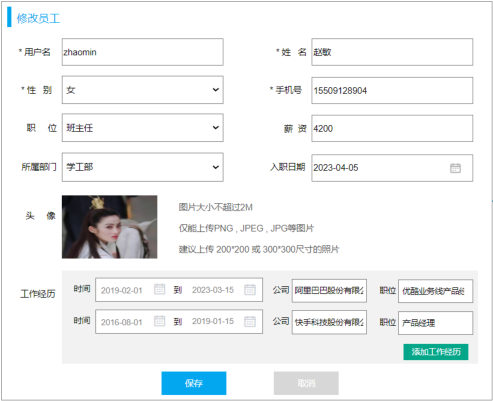
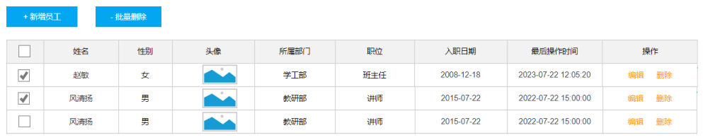

[101 篇](/posts/编程学习/javaweb学习笔记/101-员工管理-条件分页查询/)和 [102 篇](/posts/编程学习/javaweb学习笔记/102-员工管理-新增员工/)把 Tlias 的员工管理做到了"能查、能加"，这一篇（第 18 章 PPT 第 1～12 页）把最后两件事补齐：**修改员工**和**删除员工**。

> [!NOTE]
> **背景交代一句**：第 16 章给的 `vue-tlias-management.zip` 里 `src/views/emp/index.vue` 是个**空壳**（里面只有"员工管理"四个字）——员工管理整页是留给学员自己实现的练习页；**真正写完的那一版在第 18 章的 `资料\05. 完整功能前端代码\vue-tlias-management.zip`** 里（含 emp、login 等全部页面）。本篇的代码全部以这份**完整版工程**为准。

> [!WARNING]
> **这一节没有逐个真机点过**：员工管理页面上的按钮都在（每行的"编辑/删除"和顶部的"- 批量删除"；条件分页查询与新增员工的实测见 101、102 篇），但"点编辑看回显、点保存、点删除"这几步本轮没有实际执行。下面按**第 18 章 PPT 的步骤 + 完整版工程的代码**讲，插图用的是课程 PPT 里的界面图（出处都标在页号上），凡是引用本机结果的地方都单独写"本机实测"。

| PPT 页 | 内容 | 本篇对应小节 |
| --- | --- | --- |
| 1 | 封面——Web前端实战(案例)·Tlias智能学习辅助系统 | 第 18 章整章的封面 |
| 2 | 需求分析（三张图：员工管理页、修改员工表单、登录页） | 需求分析 |
| 3、8、13、21 | 目录页（员工管理-修改 / 员工管理-删除 / 登录退出 / 打包部署） | 目录页（同一张卡片列表翻四次） |
| 4 | 小节标题页——员工管理-修改员工 01 | 修改员工 |
| 5～7 | 修改员工（两步操作、查询回显、保存数据） | 修改员工 |
| 9 | 小节标题页——员工管理-删除员工 02 | 删除员工 |
| 10～12 | 删除员工（两个操作入口、删除单个、批量删除） | 删除员工 |
| 13～20 | 登录退出 | [104 篇](/posts/编程学习/javaweb学习笔记/104-登录退出与令牌管理/) |
| 21～30 | 打包部署 | [105 篇](/posts/编程学习/javaweb学习笔记/105-前端打包部署/) |

## 需求分析（PPT 第 1～3 页）

第 18 章是 Tlias 前端实战这一段的**收尾章**。PPT 第 3 页的目录页列了四件事——**员工管理-修改、员工管理-删除、登录退出、打包部署**；第 8、13、21 页又把这张目录页翻出来（每翻一次就代表上一件事做完了、下一件开始），和 [100 篇](/posts/编程学习/javaweb学习笔记/100-部门管理-新增修改删除/)里部门管理那张"目录页翻三次"的套路一模一样。这种页面本身没有新知识，但它标出了**顺序**：先把员工管理的改和删做完，再去管登录退出，最后才谈上线。

第 2 页"需求分析"放的是**成品长什么样**的三张图，正好对应本章三个阶段：

| 需求分析页上的图 | 讲的是哪一块 | 落在哪篇 |
| --- | --- | --- |
| 员工管理页（搜索表单 + "+ 新增员工 / - 批量删除" + 表格 + 分页条） | 员工管理整页的最终形态 | [101 篇](/posts/编程学习/javaweb学习笔记/101-员工管理-条件分页查询/)（查询）＋ [102 篇](/posts/编程学习/javaweb学习笔记/102-员工管理-新增员工/)（新增）＋本篇（改、删） |
| 修改员工表单（十个表单项 + 两行工作经历 + 保存/取消） | 修改员工的界面 | 本篇 |
| 登录页（用户名、密码、登录、取消） | 登录退出 | [104 篇](/posts/编程学习/javaweb学习笔记/104-登录退出与令牌管理/) |

一句话把分工说清：**第 17 章把员工管理做到"能查、能加"，这一章开头 12 页补上"能改、能删"，后面 18 页再去解决"怎么登录、怎么退出、怎么上线"**。

## 修改员工（PPT 第 4～7 页）

第 5 页把修改员工说成**两步操作**：

> **修改员工**
> 两步操作：
> 点击 "编辑" 按钮，执行根据 ID 查询员工信息，页面回显。
> 点击 "保存" 按钮，执行修改操作。

第 6、7 页把这两步各展开一遍：

> **修改员工-查询回显**（第 6 页）
> 步骤：
> 1. 为 "编辑" 按钮绑定事件。
> 2. 发送异步请求，根据 ID 查询员工详细信息，页面回显。
>
> **修改员工-保存数据**（第 7 页）
> 步骤：
> 1. 点击保存按钮，执行修改数据操作。
> 备注：添加员工 与 修改员工使用的是同一个表单，需要**根据 id 判断**到底执行新增还是修改。

为什么改之前要先查一次？和 [100 篇](/posts/编程学习/javaweb学习笔记/100-部门管理-新增修改删除/)部门管理的"修改两步法"是同一个道理：列表里的那一行只有"姓名、性别、部门、职位……"这几个**展示用**的字段，用户点"编辑"时要的是**这条员工的完整、最新数据**（包括下面那几行工作经历），所以按 id 再去后端取一次，取到什么就回显什么。后端那一侧（一条多表查询 + `Emp` 里的 `exprList` 怎么装工作经历）在 [75 篇](/posts/编程学习/javaweb学习笔记/75-修改员工/)里，这里只管前端。

### 这一步要用到的两个接口

| 步 | 请求 | 说明 |
| --- | --- | --- |
| 查询回显 | `GET /emps/{id}` | 路径上带 id（**路径参数**）；返回 `data` 是**一个员工对象**，里面还有 `exprList`（工作经历列表，每项有 `company`、`job`、`begin`、`end`） |
| 保存修改 | `PUT /emps` | 请求体是整个员工对象——**比新增多一个 id**，还带着 `exprList` |

`src/api/emp.js`（[101 篇](/posts/编程学习/javaweb学习笔记/101-员工管理-条件分页查询/)建的那个文件）里再补两行：

```js
//根据ID查询员工信息
export const queryInfoApi = (id) => request.get(`/emps/${id}`)

//修改员工信息
export const updateEmpApi = (data) => request.put('/emps', data)
```

和 [100 篇](/posts/编程学习/javaweb学习笔记/100-部门管理-新增修改删除/)里部门那两个接口对比一下：查回显同样是把 id 拼进路径（用反引号 + `${}` 的模板字符串），修改同样是 `PUT` 一个带 id 的对象，只是模块从 `dept` 换成了 `emp`。

### 第一步 · 查询回显

先看"编辑"按钮长在哪儿——它是表格"操作"列里的按钮，点的时候把**这一行的 id** 传出去：

```html
<el-table-column label="操作" fixed="right" align="center">
  <template #default="scope">
    <el-button size="small" type="primary" @click="handleEdit(scope.row.id)">编辑</el-button>
    <el-button size="small" type="danger" @click="handleDelete(scope.row.id)">删除</el-button>
  </template>
</el-table-column>
```


*图：PPT 第 5、6 页配的员工列表——每一行最后是"操作"列，里面是"编辑"和"删除"两个按钮；最左边那列复选框是下一节"批量删除"要用的（这两张图都是老版原型的界面，字段与新工程的样式略有差别，位置关系是一样的）。`fixed="right"` 表示这列**固定在表格右侧**——员工表格有十列，不固定的话横向滚动时按钮会被滚出屏幕*

点"编辑"后跑的函数是 `handleEdit`：

```js
// 操作处理
const handleEdit = async (id) => {
  console.log('Edit:', id)
  const result = await queryInfoApi(id);
  if(result.code){
    dialogVisible.value = true
    dialogTitle.value = '修改员工'
    employee.value = result.data

    //处理返回的工作经历信息
    let exprList = employee.value.exprList;
    if(exprList && exprList.length > 0){
      exprList.forEach(expr => {
        expr.exprDate = [expr.begin, expr.end]
      })
    }
  }
}
```

按顺序读这五件事：

1. `queryInfoApi(id)` —— 拿到这一行的 id 后，先**按 id 查一次**（`GET /emps/{id}`）；
2. `dialogVisible.value = true` —— 查到数据（`result.code` 为真）**才**打开对话框（顺序和 [100 篇](/posts/编程学习/javaweb学习笔记/100-部门管理-新增修改删除/)里"先查数据再开窗"一样，避免"框先弹出来、内容空白一下才跳出来"）；
3. `dialogTitle.value = '修改员工'` —— 标题改成"修改员工"，**这就是"新增与修改共用一张表单"的第一半**（同一个 `<el-dialog :title="dialogTitle">`，只是变量换了值）；
4. `employee.value = result.data` —— **这就是"回显"**：把接口返回的那个员工对象整个交给表单绑定的 `employee`，因为每个输入框都是 `v-model="employee.xxx"`，对象一换，输入框里立刻就有了原来填过的值；
5. 最后那段 `forEach` 是**工作经历那一块的"翻译"**：后端返回的每条经历里时间拆成 `begin`、`end` 两个字段（[75 篇](/posts/编程学习/javaweb学习笔记/75-修改员工/)的 `exprList`），而表单里那行时间用的是"范围型"日期选择器、`v-model` 绑的是**一个数组** `expr.exprDate`（[102 篇](/posts/编程学习/javaweb学习笔记/102-员工管理-新增员工/)里 `+ 添加工作经历` 时初始化的 `{exprDate: [], begin: '', end: '', ...}`）。所以回显时要 `expr.exprDate = [expr.begin, expr.end]`，把"两个字段"拼成"一个数组"——**不拼这一步，工作经历那两行时间就是空的**。


*图：PPT 第 5、6、7 页配的"修改员工"表单——上方是基本信息（用户名、姓名、性别、手机号、职位、薪资、所属部门、入职日期、头像），下方是"工作经历"两行（时间 从 到 / 公司 / 职位，右下角还有"+ 添加工作经历"），最底下是"保存 / 取消"。**每个框里都已经有值了**，这些值就是"查询回显"的结果；和 [102 篇](/posts/编程学习/javaweb学习笔记/102-员工管理-新增员工/)新增员工时那张空表单是**同一张表单**，只是标题改成了"修改员工"、内容换成了被编辑的那条数据*

### 第二步 · 保存数据：新增与修改共用一张表单

第 7 页那句"备注"是这一节最要紧的一句话：

> **添加员工 与 修改员工使用的是同一个表单，需要根据 id 判断到底执行新增还是修改。**

为什么能共用？因为两个操作**要填的东西完全一样**（都是那十项 + 工作经历），界面上只有两处小差别——**标题**和**数据填了没有**；真正决定"存到哪儿"的，只在点"保存"的那一瞬间：看这份数据里**有没有 id**。

先看对话框本身（[102 篇](/posts/编程学习/javaweb学习笔记/102-员工管理-新增员工/)搭的那个）：

```html
<!-- 新增/修改员工的对话框 -->
<el-dialog v-model="dialogVisible" :title="dialogTitle">
  <el-form ref="employeeFormRef" :model="employee" :rules="rules" label-width="80px">
    <!-- ……十个表单项（102 篇搭好的），最后一块是工作经历 -->
  </el-form>

  <!-- 底部按钮 -->
  <template #footer>
    <span class="dialog-footer">
      <el-button @click="dialogVisible = false">取消</el-button>
      <el-button type="primary" @click="save">保存</el-button>
    </span>
  </template>
</el-dialog>
```

注意两处：标题是**变量** `:title="dialogTitle"`；底部两个按钮是 **"取消 / 保存"**（不是部门页的"取消 / 确定"），"保存"绑的还是那个 `save`。

"保存"这一下要干的事，全在这个函数里：

```js
//保存员工信息
const save = async () => {
  employeeFormRef.value.validate(async valid => {
    if(valid){ // 校验通过
      let result ;
      if(employee.value.id){ //存在ID, 修改
        result = await updateEmpApi(employee.value);
      }else { //不存在ID, 新增
        result = await addEmpApi(employee.value);
      }
      if(result.code){
        ElMessage.success('新增员工成功')
        dialogVisible.value = false
        handleSearch()
      }else {
        ElMessage.error(result.msg)
      }
    }
  })
}
```

`if(employee.value.id)` 这一行就是"分流"的全部秘密：

| 场景 | 谁把它打开 | `dialogTitle` | `employee.value` 是什么 | 有没有 id | 走哪条路 |
| --- | --- | --- | --- | --- | --- |
| 新增 | 点"+ 新增员工"（`addEmp`） | "新增员工" | 一个**空对象**（十个空字段 + `exprList: []`） | **没有** | `addEmpApi` → `POST /emps` |
| 修改 | 点某一行的"编辑"（`handleEdit`） | "修改员工" | 接口返回的 `result.data`（含 `id`、`exprList`） | **有** | `updateEmpApi` → `PUT /emps`（请求体里带着 id） |

配合新增那半边的函数（[102 篇](/posts/编程学习/javaweb学习笔记/102-员工管理-新增员工/)讲过，这里把它和 `handleEdit` 摆在一起看）：

```js
//新增员工
const addEmp = () => {
  dialogVisible.value = true
  dialogTitle.value = '新增员工'
  employee.value = {
    username: '', name: '', gender: '', phone: '', job: '',
    salary: '', deptId: '', entryDate: '', image: '', exprList: []
  }
  employeeFormRef.value.resetFields()
}
```

于是"共用一张表单"的三处开关就齐了（和部门管理那节的结论完全一致）：

1. **标题**：`dialogTitle` 变量——`addEmp` 写"新增员工"、`handleEdit` 写"修改员工"；
2. **数据**：`employee` 变量——新增时被赋成空对象、修改时被赋成查回来的对象（所以输入框有时空有时满）；
3. **接口**：`save` 里看 `employee.value.id` 分流（一个 `POST`、一个 `PUT`）。

两条路走完之后的收尾也是同一段：`ElMessage.success(...)` 提示 → `dialogVisible.value = false` 关对话框 → `handleSearch()` **重新查一遍列表**（[101 篇](/posts/编程学习/javaweb学习笔记/101-员工管理-条件分页查询/)那个查询函数），改完的数据立刻出现在表格里。

### 读这段代码时值得记下的几个细节

这几处不影响功能、但自己动手时容易对不上现象（都是**读完整版工程代码**看到的，本轮没有真机验证）：

1. **保存成功的提示语写死成"新增员工成功"**——修改成功也是弹这一句（工程代码里没按 `id` 分开写）。照着 PPT 讲"修改保存成功"、页面上却弹出"新增员工成功"时，别以为路由错了。
2. **对话框底部按钮是"取消 / 保存"**（部门管理那节是"取消 / 确定"）——同一个 ElementPlus 对话框，按钮文字看工程里怎么写的。
3. **`addEmp` 里的 `employeeFormRef.value.resetFields()` 没做"实例存在"判断**。[100 篇](/posts/编程学习/javaweb学习笔记/100-部门管理-新增修改删除/)里专门讲过：`<el-dialog>` 的内容是**懒渲染**的（第一次打开之前表单还没被创建），所以那一句在"第一次点开对话框"这个时机是有风险的，部门页写的 `if (deptFormRef.value){ ... }` 就是防这个。自己照着做时建议把判断补上。
4. **`handleEdit` 里没有再调 `resetFields()`**——它不重置表单，因为它马上要把接口数据整个赋给 `employee`，有几项（职位、所属部门、入职日期）本来也不在 `rules` 里。

## 删除员工（PPT 第 9～12 页）

第 10 页先把"删除有两个入口"讲清楚：

> **删除员工**
> 在删除员工信息时，有两个操作入口：
> - 点击每条记录之后的"删除"按钮，删除当前这条记录；
> - 选择前面的复选框，选中要删除的员工，点击"批量删除"之后，会批量删除员工信息。

第 11、12 页分别给这两条路：

> **删除员工-删除单个**（第 11 页）
> 步骤：
> 1. 为 "删除" 按钮绑定事件，触发事件，调用函数。
> 2. 发送异步请求到服务端，根据 id 删除员工信息。
>
> **删除员工-批量删除**（第 12 页）
> 步骤：
> 1. 为表格的复选框绑定事件，点击复选框之后，获取到目前选中的条件的 id（多个 id 可以封装到数组中）。
> 2. 为 "批量删除" 按钮绑定事件，发送异步请求到服务端，根据 id 批量删除员工信息。


*图：PPT 第 10、11、12 页配的员工管理页——顶部两个按钮"+ 新增员工"和"- 批量删除"（批量删除是红色的），表格最左边一列是**复选框**（画着勾的那两行就是被选中的），每行最后的"操作"列里还有单独的"编辑 / 删除"。两处删除的入口在这张图上都齐了：一个在表头下面（批量），一个在每行末尾（单条）*

### 接口：一个地址管两种删除

| 项 | 内容 |
| --- | --- |
| 请求方式 | `DELETE` |
| 请求路径 | `/emps?ids=1,2,3`（id 是**查询参数**，可以是一串） |
| 说明 | 接口文档里这个接口叫"**批量**删除员工"，但**单个删除也调它**——传一个 id 就是"批量里只有一条" |

后端那一侧（`@DeleteMapping` 收 `List<Integer> ids`、Service 里同时删员工基本信息和工作经历、Mapper 用 `foreach` 拼 `in` 子句）在 [74 篇](/posts/编程学习/javaweb学习笔记/74-删除员工/)里，`src/api/emp.js` 里只要一行：

```js
//删除员工
export const deleteEmpApi = (ids) => request.delete(`/emps?ids=${ids}`)
```

这一行**同一个函数要接两种东西**：单个删除传进来的是一个数字（`deleteEmpApi(1)` → `/emps?ids=1`），批量删除传进来的是一个数组（`deleteEmpApi([1,2,3])`）。为什么数组也能拼进去？因为模板字符串里放数组会自动把它**变成"逗号连起来的一串"**（等价于 `[1,2,3].join(',')`），正好就是后端要的 `1,2,3`。这也是接口文档里 `ids` 的"示例 `1,2,3`"那种写法的由来。

### 删除单个

"删除"按钮就在上面那张表格的操作列里，点的时候同样只传 id：

```js
// 删除单个员工
const handleDelete = async (id) => {
  //弹出一个确认框, 如果确认, 就删除;
  ElMessageBox.confirm('确定删除该员工吗?', '提示', {
    confirmButtonText: '确定',
    cancelButtonText: '取消',
    type: 'warning'
  }).then(async () => {
    // 删除员工
    const result = await deleteEmpApi(id);
    if(result.code){
      ElMessage.success('删除员工成功')
      handleSearch()
    }else{
      ElMessage.error(result.msg)
    }
  })
}
```

读这段有四个点：

1. **先弹确认框，删除代码写在 `.then()` 里**——这是 [100 篇](/posts/编程学习/javaweb学习笔记/100-部门管理-新增修改删除/)讲过的"危险操作先确认"：用户没点"确定"，`deleteEmpApi` 那行根本不会执行；
2. 确认框的参数：内容 `'确定删除该员工吗?'`、标题 `'提示'`、配置里 `confirmButtonText: '确定'` / `cancelButtonText: '取消'` / `type: 'warning'`（左边那个橙色警告图标）。注意**这里两个按钮的字是"确定 / 取消"**——部门管理那节工程里配的是"确认"（[100 篇](/posts/编程学习/javaweb学习笔记/100-部门管理-新增修改删除/)的坑清单里那条），两处不一样；
3. 这段代码**没有 `.catch()`**（部门页有，点取消会提示"您已取消删除"）——所以员工管理这里，点"取消"或者右上角 × **什么都不会发生**，也不弹提示。功能上没问题，少一句反馈而已。
4. 删完还是老规矩：`ElMessage.success('删除员工成功')` + `handleSearch()` 重新查列表——PPT 说的"删除之后数据要更新"，在单页应用里就是**重新请求一次**，不是刷新浏览器。

### 批量删除：先把选中的 id 收集起来

批量删除比单个多出**前半段**：得先知道"用户勾了哪几行"。这前半段全靠表格自己的两个开关（PPT 第 12 页第 1 步说的"为表格的复选框绑定事件"）：

```html
<!-- 表格：多了一个"选择变化"的事件 -->
<el-table :data="empList" border style="width: 100%" @selection-change="handleSelectionChange">
  <!-- 复选框列 -->
  <el-table-column type="selection" width="55" align="center"></el-table-column>
  <el-table-column prop="name" label="姓名" width="120" align="center"></el-table-column>
  <!-- ……其它展示列（101 篇搭的） -->
</el-table>
```

| 位置 | 写法 | 说明 |
| --- | --- | --- |
| 多出一列复选框 | `<el-table-column type="selection" width="55">` | `type="selection"` 是表格**特殊的列类型**，一写就自动在每行前面加一个复选框（连表头那个"全选"框一起给） |
| 表格上挂事件 | `@selection-change="handleSelectionChange"` | 选中状态一变（勾一个、取消一个、点表头全选）就触发，**参数是当前所有被选中行的完整行数据**（一个数组，每项是一整行 `{id, name, ...}`） |

处理这个事件的函数，做的工作就是"把行数据变成 id 数组"：

```js
// 存储选中的 ID
const selectedIds = ref([]);

// 处理复选框选择变化的函数
function handleSelectionChange(selection) {
  const ids = selection.map(item => item.id);
  selectedIds.value = ids;
}
```

`selection` 里装的是**整行对象**（整整十列的数据），而后端只认 id，所以用 `.map(item => item.id)` 把每一行的 id 抠出来、放进 `selectedIds`（`map` 就是"按同一套规则把一个数组映射成另一个数组"）。这样"用户随时勾、随时改"，组件里始终留着**最后一次**的选中结果。

后半段就和单个删除几乎一样了——顶部那个按钮绑 `deleteByIds`：

```html
<el-button type="danger" @click="deleteByIds"> - 批量删除</el-button>
```

```js
//批量删除
const deleteByIds = async () => {
  //弹出一个确认框, 如果确认, 就删除;
  ElMessageBox.confirm('确定删除选中员工吗?', '提示', {
    confirmButtonText: '确定',
    cancelButtonText: '取消',
    type: 'warning'
  }).then(async () => {
    // 删除员工
    const result = await deleteEmpApi(selectedIds.value);
    if(result.code){
      ElMessage.success('删除员工成功')
      handleSearch()
    }else{
      ElMessage.error(result.msg)
    }
  })
}
```

对比一下就能看出"批量"和"单条"的差别只有**传进去的是什么**：

| | 单个删除 `handleDelete(id)` | 批量删除 `deleteByIds()` |
| --- | --- | --- |
| 谁调用 | 每行"删除"按钮（`@click="handleDelete(scope.row.id)"`） | 顶部"- 批量删除"按钮（`@click="deleteByIds"`） |
| 参数从哪来 | 直接写在按钮上（这一行的 id） | 从 `selectedIds` 里取（复选框那一列收集来的） |
| 传给接口的东西 | 一个数字 | 一个数组 |
| 实际请求 | `DELETE /emps?ids=5` | `DELETE /emps?ids=5,8,9` |
| 确认框文案 | 确定删除该员工吗? | 确定删除选中员工吗? |
| 剩下的（提示、刷新列表） | **一模一样** | **一模一样** |

> [!TIP]
> 工程里**没写"一条都没选"的保护**：不勾任何行直接点"- 批量删除"，`selectedIds` 是空数组，请求地址会拼成 `/emps?ids=`（空的一串）。实际项目里应该在这里先判断一句"请至少选择一条记录"。这是读代码时看到的一个可以自己补的完善点，本轮没有真机验证后端对空参数的反应。

## 小结

| 问题 | 答案 |
| --- | --- |
| 这一篇做了员工管理的哪两件事？ | **修改**（PPT 第 4～7 页）+ **删除**（PPT 第 9～12 页）；加上 101、102 篇的查询和新增，员工管理四个功能就齐了 |
| 修改员工为什么分两步？ | PPT 第 5 页的"两步操作"——**① 点"编辑"按 ID 查询回显 ② 点"保存"执行修改**。列表那一行字段不全，回显要的是这条员工的完整数据（含工作经历） |
| 两个接口分别是什么？ | 查回显 `GET /emps/{id}`（路径参数 id）；修改 `PUT /emps`（请求体是整个员工对象，**带 id**） |
| 新增与修改怎么共用一张表单？ | 三处开关——**标题**（`:title="dialogTitle"`，新增"新增员工"、修改"修改员工"）、**数据**（`employee`，新增是空对象、修改是查回来的对象）、**接口**（`save` 里看 `employee.value.id` 分流：有 id 走 `PUT`、没有走 `POST`） |
| 工作经历回显为什么要多做一步？ | 后端每条经历的时间是 `begin`、`end` **两个字段**，表单里那行时间用范围选择器、绑的是**数组** `exprDate`，所以要 `expr.exprDate = [expr.begin, expr.end]` 拼一下 |
| 删除有哪两个入口？ | ① 每行的"删除"按钮（删这一条）② 勾选前面的复选框 + 顶部"- 批量删除"（删一批）；**两个入口调的是同一个接口**（`DELETE /emps?ids=...`） |
| 批量删除的 id 怎么来的？ | 复选框列 `<el-table-column type="selection">` + 表格上挂 `@selection-change="handleSelectionChange"`，事件参数是**选中的整行数据**，用 `selection.map(item => item.id)` 抠出 id 存进 `selectedIds` |
| 数组为什么能拼进 URL？ | 模板字符串里的数组会自动变成"逗号连接的一串"（`[1,2,3]` → `1,2,3`），正好对上接口文档里 `ids=1,2,3` 的格式 |
| 删完/改完为什么要 `handleSearch()`？ | PPT 说的"操作完成后更新数据"，在单页应用里就是**重新查一次列表接口**，不是刷新浏览器 |
| 本轮实测情况？ | **修改与删除没有逐个真机点过**（按钮都在、代码看的是第 18 章完整版工程）；条件分页查询与新增有实测，见 101、102 篇 |

## 相关

- [上一篇：员工管理-新增员工](/posts/编程学习/javaweb学习笔记/102-员工管理-新增员工/)
- [下一篇：登录退出与令牌管理](/posts/编程学习/javaweb学习笔记/104-登录退出与令牌管理/)

## 练习题

### 一、知识回顾（读完直接做下面的实践题）

1. **第 18 章这一段的顺序**：员工管理-修改 → 员工管理-删除 → 登录退出 → 打包部署（PPT 第 3、8、13、21 页是同一张目录页，每做完一件翻一次）；本篇管前两件（PPT 第 1～12 页）
2. **修改员工的两步**：**① 查询回显**——点"编辑"，按 ID 查询员工详细信息，页面回显；**② 保存数据**——点"保存"，执行修改。两个接口分别是 `GET /emps/{id}`（路径参数）和 `PUT /emps`（请求体带 id）
3. **回显 = `employee.value = result.data`**：接口返回的整个员工对象直接交给表单数据对象，`v-model` 会让输入框立刻显示出来；打开对话框的时机放在**查到数据之后**
4. **工作经历的回显要"翻译"一下**：后端每条经历是 `begin`、`end` 两个字段，表单里时间绑的是数组 `exprDate`，所以 `exprList.forEach(expr => expr.exprDate = [expr.begin, expr.end])`
5. **新增与修改共用一张表单**：标题靠变量 `dialogTitle`（`:title="dialogTitle"`）；数据靠同一个 `employee`（新增时空对象、修改时接口数据）；接口靠 `save` 里 **`if(employee.value.id)`** 分流——有 id 走 `updateEmpApi`（`PUT`）、没有走 `addEmpApi`（`POST`）
6. 保存成功后的三件事：`ElMessage.success(...)` → `dialogVisible.value = false`（关对话框）→ `handleSearch()`（重新查列表）。工程里的提示语写死成"新增员工成功"（修改成功也是这句）
7. **删除的两个入口**：每行后面的"删除"按钮删这一条；勾选前面的复选框再点顶部"- 批量删除"删一批。PPT 第 10 页原文就是这两条
8. **两个入口用同一个接口**：`DELETE /emps?ids=1,2,3`——单个删除传一个 id（"批量里只有一条"），批量删除传一组 id；`src/api/emp.js` 里就一行 ``deleteEmpApi = (ids) => request.delete(`/emps?ids=${ids}`)``，模板字符串里数组会自动连成 `1,2,3`
9. **批量删除的 id 收集**：表格加复选框列 `<el-table-column type="selection" width="55">` 并在表格上挂 `@selection-change="handleSelectionChange"`；事件参数是**选中的整行数据数组**，用 `selection.map(item => item.id)` 抠成 id 数组存进 `selectedIds`，点按钮时把这个数组交给接口
10. **危险操作先确认**：两个删除都先 `ElMessageBox.confirm(内容, '提示', { confirmButtonText: '确定', cancelButtonText: '取消', type: 'warning' })`，删除代码写在 `.then()` 里；工程里两处按钮文字都是"**确定 / 取消**"（部门管理那节是"确认"，注意区别），并且都没有 `.catch()`（点取消不会有任何提示）
11. **本轮实测边界**：修改、删除**没有逐个真机点过**（页面上按钮都在）；有实测的是条件分页查询、新增员工（101、102 篇）与登录退出（104 篇）

### 二、裸写题

- [ ] **2-1 点"编辑"把这一条员工的数据回显到表单里**
  需求：员工列表每行的"操作"列里有一个"编辑"按钮。点它时要做到——① 用这一行的 id 去后端把这条员工的**详细信息**取回来；② 查到之后才打开对话框，标题显示"修改员工"；③ 表单里各个输入框**自动填上取回来的值**（最基本的信息和下面那几行工作经历都要有）；④ 其中工作经历那几行的"时间"是一个"开始—结束"的范围选择，而后端给的是一条经历里的开始时间和结束时间两个值，这里要处理好。
  素材：查回显接口 `GET /emps/{id}`，返回 `data` 里除基本信息外还有 `exprList`（每项形如 `{ id, company, job, begin: '2019-02-01', end: '2022-03-15' }`）。

  > [!TIP]- 提示（先自己想，实在想不出再点开）
  > **一级 · 思路**：这就是"修改两步法"的**第一步·查询回显**——先去后端把这条员工的完整数据取回来，再"把这份数据交给表单"，输入框因为绑着表单数据对象，会自己跟着变。工作经历那一块两边格式不一样，需要一次"两个值 ⇄ 一个数组"的转换
  > **二级 · 方法**：`queryInfoApi(id)` 请求 `GET /emps/{id}`（api 文件里写好）；把接口返回的 `result.data` 整个赋给表单数据对象 `employee`；对话框的显示开关放在 `if(result.code)` 里面；工作经历用 `exprList.forEach(expr => { expr.exprDate = [expr.begin, expr.end] })` 转换（`exprDate` 是范围日期选择器 `el-date-picker type="daterange"` 绑的那个数组）
  > **三级 · 骨架**：`const handleEdit = async (id) => { const result = await ____(id); if(result.____){ dialogVisible.value = ____; dialogTitle.value = '____'; employee.value = result.____; const exprList = employee.value.exprList; if(exprList && exprList.length > 0){ exprList.forEach(expr => { expr.____ = [expr.____, expr.____] }) } } }`

  > [!TIP]- 参考答案（做完再点开）
  > ```js
  > // 完整版工程 src/views/emp/index.vue
  > // 操作处理
  > const handleEdit = async (id) => {
  >   console.log('Edit:', id)
  >   const result = await queryInfoApi(id);
  >   if(result.code){
  >     dialogVisible.value = true
  >     dialogTitle.value = '修改员工'
  >     employee.value = result.data
  >
  >     //处理返回的工作经历信息
  >     let exprList = employee.value.exprList;
  >     if(exprList && exprList.length > 0){
  >       exprList.forEach(expr => {
  >         expr.exprDate = [expr.begin, expr.end]
  >       })
  >     }
  >   }
  > }
  > ```
  > ```js
  > // src/api/emp.js 里要用到的那一条
  > export const queryInfoApi = (id) => request.get(`/emps/${id}`)
  > ```
  > 检查点：① 点"编辑"后对话框标题是"修改员工"，每个输入框里都有值；② 下面工作经历那几行的时间显示成"开始日期 至 结束日期"，不是空的；③ 把 `expr.exprDate = [expr.begin, expr.end]` 那一步删掉再看——基本信息照样有值，**只有工作经历的时间是空的**（能解释这个现象就说明真懂了）；④ 查询失败（`code` 为 0）时对话框不应该打开。

- [ ] **2-2 一个"保存"按钮同时管新增和修改**
  需求：新增和修改共用同一个对话框、同一个"保存"按钮。点"保存"时要按情况分流——**如果这份数据是"编辑"带出来的（带着主键 id），就把它整个提交给后端的修改接口；如果是点"+ 新增员工"打开的空表单（没有 id），就提交给新增接口**；两条路都要"先过表单校验才发请求"，成功后提示一句、关掉对话框、并让列表显示最新数据；失败就把后端返回的原因弹出来。
  素材：修改接口 `PUT /emps`（请求体是整个员工对象，**含 id**）、新增接口 `POST /emps`（请求体不含 id）。

  > [!TIP]- 提示（先自己想，实在想不出再点开）
  > **一级 · 思路**："到底是新增还是修改"，判据不是用户点了哪个按钮，而是**这份表单数据本身有没有 id**——因为新增时表单被清成空对象、修改时表单被赋成接口查回来的对象（里面有 id）。判断放在"保存"函数里，一段代码管两条路
  > **二级 · 方法**：提交前先 `employeeFormRef.value.validate(async valid => { if(valid){ ... } })`；里面用 `if(employee.value.id){ result = await updateEmpApi(employee.value) }else{ result = await addEmpApi(employee.value) }`；成功分支 `ElMessage.success(...)` + `dialogVisible.value = false` + `handleSearch()`
  > **三级 · 骨架**：`employeeFormRef.value.____(async valid => { if(valid){ let result; if(employee.value.____){ result = await updateEmpApi(employee.value) }else{ result = await addEmpApi(employee.value) } if(result.code){ ElMessage.success('____'); dialogVisible.value = ____; handleSearch() }else{ ElMessage.error(result.msg) } } })`

  > [!TIP]- 参考答案（做完再点开）
  > ```js
  > //保存员工信息
  > const save = async () => {
  >   employeeFormRef.value.validate(async valid => {
  >     if(valid){ // 校验通过
  >       let result ;
  >       if(employee.value.id){ //存在ID, 修改
  >         result = await updateEmpApi(employee.value);
  >       }else { //不存在ID, 新增
  >         result = await addEmpApi(employee.value);
  >       }
  >       if(result.code){
  >         ElMessage.success('新增员工成功')
  >         dialogVisible.value = false
  >         handleSearch()
  >       }else {
  >         ElMessage.error(result.msg)
  >       }
  >     }
  >   })
  > }
  > ```
  > ```js
  > // src/api/emp.js
  > export const addEmpApi = (data) => request.post('/emps', data)
  > export const updateEmpApi = (data) => request.put('/emps', data)
  > ```
  > 检查点：① 点"+ 新增员工"（空表单）点"保存"→ 发的是 `POST /emps`，请求体里**没有** id；② 点某一行"编辑"（有数据）不改任何东西直接点"保存"→ 发的是 `PUT /emps`，请求体里**有** id；③ 两条路走完列表都会自动刷新；④ 把 `if(employee.value.id)` 那层判断去掉（永远走新增）→ 编辑完点保存会在列表里**多出一行**（现象能解释得通就算过）。

- [ ] **2-3 删单条之前先弹确认框**
  需求：列表每行的"操作"列里有一个"删除"按钮。点它时**先弹出一个确认框**（标题"提示"、内容"确定删除该员工吗?"、两个按钮"取消""确定"、带警告图标）；点"确定"才真的去删——删成功后提示"删除员工成功"，并让列表刷新（那一行消失）；点"取消"什么都不做（不弹提示也可以）。
  素材：删除接口 `DELETE /emps?ids=员工ID`（单个删除传一个 id 就行，返回 `{code, msg, data}`，`code` 为 1 表示成功）。

  > [!TIP]- 提示（先自己想，实在想不出再点开）
  > **一级 · 思路**：确认框不用自己画，是"喊一声就出来"的（用代码调用它）；它会用 Promise 告诉你用户点了哪个按钮——**把删除动作放进"点了确定"那个分支里**，"不确认就不删"就自动成立了。删完照老规矩重新查一次列表
  > **二级 · 方法**：`ElMessageBox.confirm('确定删除该员工吗?', '提示', { confirmButtonText: '确定', cancelButtonText: '取消', type: 'warning' }).then(async () => { ... })`；删除接口 `deleteEmpApi(id)` → `request.delete('/emps?ids=' + id)`（工程里是模板字符串写法）；提示用 `ElMessage.success('删除员工成功')`；函数式组件要 `import { ElMessage, ElMessageBox } from 'element-plus'`
  > **三级 · 骨架**：`ElMessageBox.____('确定删除该员工吗?', '提示', { confirmButtonText: '____', cancelButtonText: '取消', type: 'warning' }).then(async () => { const result = await ____(id); if(result.code){ ElMessage.success('删除员工成功'); ____(); } else { ElMessage.error(result.msg) } })`，按钮上写 `@click="handleDelete(scope.row.id)"`

  > [!TIP]- 参考答案（做完再点开）
  > ```js
  > // 删除单个员工
  > const handleDelete = async (id) => {
  >   //弹出一个确认框, 如果确认, 就删除;
  >   ElMessageBox.confirm('确定删除该员工吗?', '提示', {
  >     confirmButtonText: '确定',
  >     cancelButtonText: '取消',
  >     type: 'warning'
  >   }).then(async () => {
  >     // 删除员工
  >     const result = await deleteEmpApi(id);
  >     if(result.code){
  >       ElMessage.success('删除员工成功')
  >       handleSearch()
  >     }else{
  >       ElMessage.error(result.msg)
  >     }
  >   })
  > }
  > ```
  > ```html
  > <el-table-column label="操作" fixed="right" align="center">
  >   <template #default="scope">
  >     <el-button size="small" type="primary" @click="handleEdit(scope.row.id)">编辑</el-button>
  >     <el-button size="small" type="danger" @click="handleDelete(scope.row.id)">删除</el-button>
  >   </template>
  > </el-table-column>
  > ```
  > 检查点：① 点"删除"先出确认框，**不会直接删**；② 点"取消"，表格一行不少（F12 的 Network 面板里**没有 DELETE 请求**）；③ 点"确定"该行消失、顶部提示"删除员工成功"；④ 确认框按钮上的字是"确定"（工程里配的）——和部门管理那节的"确认"不一样。

- [ ] **2-4 勾选多行，一次删掉（批量删除）**
  需求：表格最左边要有**一列复选框**（表头那个能全选）。用户在表格里勾几行、再点顶部的"- 批量删除"按钮，先弹确认框（内容"确定删除选中员工吗?"），点"确定"之后把**勾选这几行的 id** 一次性发给后端删掉；删成功后提示一句并让列表刷新。
  素材：删除接口 `DELETE /emps?ids=1,2,3`（`ids` 是逗号分隔的一串 id，一次可以传多个）。

  > [!TIP]- 提示（先自己想，实在想不出再点开）
  > **一级 · 思路**：批量删除比单条多出"前半段"——**得先知道用户勾了哪几行**。这件事不用自己管复选框的点击，表格会把"当前选中了哪些行"通过一个事件告诉你；但事件给的是**整行数据**，而后端只要 id，所以要"映射"成 id 数组存起来，点按钮时把这个数组交出去
  > **二级 · 方法**：表格加一列 `<el-table-column type="selection" width="55">`，表格标签上挂 `@selection-change="handleSelectionChange"`；事件参数 `selection` 是选中行的数组，用 `selection.map(item => item.id)` 抠 id 存进 `const selectedIds = ref([])`；按钮 `@click="deleteByIds"`，函数里照样先 `ElMessageBox.confirm('确定删除选中员工吗?', '提示', {...})`，`.then()` 里 `deleteEmpApi(selectedIds.value)`；api 那条 ``deleteEmpApi = (ids) => request.delete(`/emps?ids=${ids}`)``
  > **三级 · 骨架**：`<el-table :data="empList" @____="handleSelectionChange">` / `<el-table-column type="____" width="55" align="center"></el-table-column>` / `const handleSelectionChange = (selection) => { selectedIds.value = selection.____(item => item.____) }` / `const result = await deleteEmpApi(____.value)`

  > [!TIP]- 参考答案（做完再点开）
  > ```js
  > // 存储选中的 ID
  > const selectedIds = ref([]);
  >
  > // 处理复选框选择变化的函数
  > function handleSelectionChange(selection) {
  >   const ids = selection.map(item => item.id);
  >   selectedIds.value = ids;
  > }
  >
  > //批量删除
  > const deleteByIds = async () => {
  >   //弹出一个确认框, 如果确认, 就删除;
  >   ElMessageBox.confirm('确定删除选中员工吗?', '提示', {
  >     confirmButtonText: '确定',
  >     cancelButtonText: '取消',
  >     type: 'warning'
  >   }).then(async () => {
  >     // 删除员工
  >     const result = await deleteEmpApi(selectedIds.value);
  >     if(result.code){
  >       ElMessage.success('删除员工成功')
  >       handleSearch()
  >     }else{
  >       ElMessage.error(result.msg)
  >     }
  >   })
  > }
  > ```
  > ```html
  > <el-button type="danger" @click="deleteByIds"> - 批量删除</el-button>
  >
  > <el-table :data="empList" border style="width: 100%" @selection-change="handleSelectionChange">
  >   <el-table-column type="selection" width="55" align="center"></el-table-column>
  >   <!-- ……其它列 -->
  > </el-table>
  > ```
  > ```js
  > // src/api/emp.js
  > export const deleteEmpApi = (ids) => request.delete(`/emps?ids=${ids}`)
  > ```
  > 检查点：① 勾两行点"批量删除"→ F12 的 Network 里那条请求是 `DELETE /emps?ids=5,8`（id 用逗号连着，顺序按表格里的顺序）；② 点表头那个复选框能全选/全不选，`selectedIds` 跟着变；③ 不勾任何行直接点按钮，请求会变成 `?ids=`（工程里没做"至少选一条"的判断——想更稳就自己加一句提示）；④ 删除完成后表格自动刷新。

### 三、综合题

- [ ] **3-1 跟着课程把员工管理的"改"和"删"做全**
  需求：在 [101 篇](/posts/编程学习/javaweb学习笔记/101-员工管理-条件分页查询/)、[102 篇](/posts/编程学习/javaweb学习笔记/102-员工管理-新增员工/)做好的员工管理页面上（条件分页查询 + 新增员工已经能跑），把修改和删除两个功能补齐——这就是 PPT 第 1～12 页的那个案例。分步做：

  1. **补接口层**：在 `src/api/emp.js` 里补三个方法——按 ID 查员工（`GET /emps/{id}`）、修改员工（`PUT /emps`）、删除员工（`DELETE /emps?ids=`，一个函数同时管单条和批量）
  2. **补操作列**：表格"操作"列里加"编辑"和"删除"两个按钮，点的时候把这一行的 id 传出去；操作列固定到表格右侧
  3. **做查询回显**：点"编辑"→ 按 id 查询 → 查到数据才打开对话框、标题写"修改员工"、把返回的对象整个交给表单数据对象 → 再把工作经历的 `begin`/`end` 拼成范围选择器要的数组
  4. **做保存分流**：点"保存"→ 先表单校验 → 看表单数据里有没有主键 id，有走修改接口、没有走新增接口 → 成功后提示 + 关对话框 + 重新查列表
  5. **做单条删除**：点某行"删除"→ 先弹确认框 → 点"确定"才调删除接口（传一个 id）→ 成功后提示 + 重新查列表
  6. **做批量删除**：表格加复选框列 + 挂"选择变化"事件，把选中行的 id 收集成数组 → 顶部"- 批量删除"按钮 → 确认框 → 把 id 数组交给同一个删除接口 → 成功后提示 + 重新查列表
  7. **验证**（把前后端一起跑起来看）：点"编辑"标题变"修改员工"且各字段（含工作经历时间）都有值；改一个字段点"保存"，列表里那一行变成新值且**没有多出一行**；点"新增员工"填一份数据保存，列表**多一行**；勾两行点"批量删除"，两行一起消失；删除确认框的按钮文案是"确定"
  8. **对照检查**：`git diff` 或直接翻第 18 章完整版工程的 `src/views/emp/index.vue`，看自己写的三处开关（标题变量、数据对象、`id` 分流）是否一致

  > [!TIP]- 提示（先自己想，实在想不出再点开）
  > **一级 · 思路**：这一题其实是"一个表单 + 一个按钮 + 两个删除出口"——表单靠 `dialogTitle` 和 `employee` 两个变量在"新增/修改"之间切换，`save` 用 `employee.value.id` 决定发哪个接口；删除的两种入口最后都汇到"收集 id → 确认 → 调删除接口 → 刷新列表"这一条线上
  > **二级 · 方法**：`handleEdit` 里 `queryInfoApi` + `dialogVisible.value = true` + `dialogTitle.value = '修改员工'` + `employee.value = result.data` + 工作经历 `exprDate` 转换；`save` 里 `validate(valid => ...)` + `if(employee.value.id)` 分流；删除用 `ElMessageBox.confirm(...).then(async () => { await deleteEmpApi(...); handleSearch() })`；批量的 id 来自 `@selection-change` 里的 `selection.map(item => item.id)`
  > **三级 · 骨架**：`const handleEdit = async (id) => { const result = await ____(id); if(result.code){ dialogVisible.value = true; dialogTitle.value = '修改员工'; employee.value = result.____; ... } }` / `if(employee.value.____){ result = await updateEmpApi(employee.value) }else{ result = await addEmpApi(employee.value) }` / `<el-table ... @selection-change="____">` + `<el-table-column type="____">` / `selectedIds.value = selection.map(item => item.id)`

  > [!TIP]- 参考答案（做完再点开）
  > ```js
  > // src/api/emp.js —— 本篇相关的几条（101、102 篇还有查询分页和新增）
  > import request from '@/utils/request'
  >
  > //查询员工列表（条件 + 分页，101 篇）
  > export const queryPageApi = (name,gender,begin,end,page,pageSize) => request.get(`/emps?name=${name}&gender=${gender}&begin=${begin}&end=${end}&page=${page}&pageSize=${pageSize}`)
  >
  > //添加员工（102 篇）
  > export const addEmpApi = (data) => request.post('/emps', data)
  >
  > //根据ID查询员工信息（回显用）
  > export const queryInfoApi = (id) => request.get(`/emps/${id}`)
  >
  > //修改员工信息
  > export const updateEmpApi = (data) => request.put('/emps', data)
  >
  > //删除员工（单个和批量共用：单个传 id，批量传 id 数组）
  > export const deleteEmpApi = (ids) => request.delete(`/emps?ids=${ids}`)
  > ```
  >
  > ```js
  > // src/views/emp/index.vue —— 本篇新增的那几段（完整版工程原文）
  > // 操作处理：查询回显
  > const handleEdit = async (id) => {
  >   console.log('Edit:', id)
  >   const result = await queryInfoApi(id);
  >   if(result.code){
  >     dialogVisible.value = true
  >     dialogTitle.value = '修改员工'
  >     employee.value = result.data
  >
  >     //处理返回的工作经历信息
  >     let exprList = employee.value.exprList;
  >     if(exprList && exprList.length > 0){
  >       exprList.forEach(expr => {
  >         expr.exprDate = [expr.begin, expr.end]
  >       })
  >     }
  >   }
  > }
  >
  > // 删除单个员工
  > const handleDelete = async (id) => {
  >   //弹出一个确认框, 如果确认, 就删除;
  >   ElMessageBox.confirm('确定删除该员工吗?', '提示', {
  >     confirmButtonText: '确定',
  >     cancelButtonText: '取消',
  >     type: 'warning'
  >   }).then(async () => {
  >     // 删除员工
  >     const result = await deleteEmpApi(id);
  >     if(result.code){
  >       ElMessage.success('删除员工成功')
  >       handleSearch()
  >     }else{
  >       ElMessage.error(result.msg)
  >     }
  >   })
  > }
  >
  > //新增员工（102 篇那个函数的完整样子，放在这里一起对照）
  > const addEmp = () => {
  >   dialogVisible.value = true
  >   dialogTitle.value = '新增员工'
  >   employee.value = {
  >     username: '', name: '', gender: '', phone: '', job: '',
  >     salary: '', deptId: '', entryDate: '', image: '', exprList: []
  >   }
  >   employeeFormRef.value.resetFields()
  > }
  >
  > //保存员工信息：新增/修改共用一个函数，靠 id 分流
  > const save = async () => {
  >   employeeFormRef.value.validate(async valid => {
  >     if(valid){ // 校验通过
  >       let result ;
  >       if(employee.value.id){ //存在ID, 修改
  >         result = await updateEmpApi(employee.value);
  >       }else { //不存在ID, 新增
  >         result = await addEmpApi(employee.value);
  >       }
  >       if(result.code){
  >         ElMessage.success('新增员工成功')
  >         dialogVisible.value = false
  >         handleSearch()
  >       }else {
  >         ElMessage.error(result.msg)
  >       }
  >     }
  >   })
  > }
  >
  > // 存储选中的 ID
  > const selectedIds = ref([]);
  >
  > // 处理复选框选择变化的函数
  > function handleSelectionChange(selection) {
  >   const ids = selection.map(item => item.id);
  >   selectedIds.value = ids;
  > }
  >
  > //批量删除
  > const deleteByIds = async () => {
  >   //弹出一个确认框, 如果确认, 就删除;
  >   ElMessageBox.confirm('确定删除选中员工吗?', '提示', {
  >     confirmButtonText: '确定',
  >     cancelButtonText: '取消',
  >     type: 'warning'
  >   }).then(async () => {
  >     // 删除员工
  >     const result = await deleteEmpApi(selectedIds.value);
  >     if(result.code){
  >       ElMessage.success('删除员工成功')
  >       handleSearch()
  >     }else{
  >       ElMessage.error(result.msg)
  >     }
  >   })
  > }
  > ```
  >
  > ```html
  > <!-- 两个删除入口和对话框的模板骨架（完整版工程 src/views/emp/index.vue） -->
  > <el-button type="primary" @click="addEmp"> + 新增员工</el-button>
  > <el-button type="danger" @click="deleteByIds"> - 批量删除</el-button>
  > <br><br>
  >
  > <!-- 表格：复选框列 + 选择变化事件 -->
  > <el-table :data="empList" border style="width: 100%" @selection-change="handleSelectionChange">
  >   <el-table-column type="selection" width="55" align="center"></el-table-column>
  >   <el-table-column prop="name" label="姓名" width="120" align="center"></el-table-column>
  >   <!-- ……其它展示列 -->
  >   <el-table-column label="操作" fixed="right" align="center">
  >     <template #default="scope">
  >       <el-button size="small" type="primary" @click="handleEdit(scope.row.id)">编辑</el-button>
  >       <el-button size="small" type="danger" @click="handleDelete(scope.row.id)">删除</el-button>
  >     </template>
  >   </el-table-column>
  > </el-table>
  >
  > <!-- 新增/修改员工的对话框：标题用变量 -->
  > <el-dialog v-model="dialogVisible" :title="dialogTitle">
  >   <el-form ref="employeeFormRef" :model="employee" :rules="rules" label-width="80px">
  >     <!-- ……十个表单项 + 工作经历（102 篇搭的） -->
  >   </el-form>
  >   <template #footer>
  >     <span class="dialog-footer">
  >       <el-button @click="dialogVisible = false">取消</el-button>
  >       <el-button type="primary" @click="save">保存</el-button>
  >     </span>
  >   </template>
  > </el-dialog>
  > ```
  > 检查点：① 上面 8 步逐条做，每一步都要在浏览器里看到效果再往下走；② 编辑一条数据保存后**列表行数不变**（改的是同一行），新增一条后**行数 +1**；③ 批量删除勾两行 → 确认后两行一起消失、请求是 `DELETE /emps?ids=?,?`；④ 单条删除和批量删除成功后列表都自动刷新；⑤ 对照完整版工程，确认三处开关（`dialogTitle` / `employee` / `employee.value.id`）都在。
