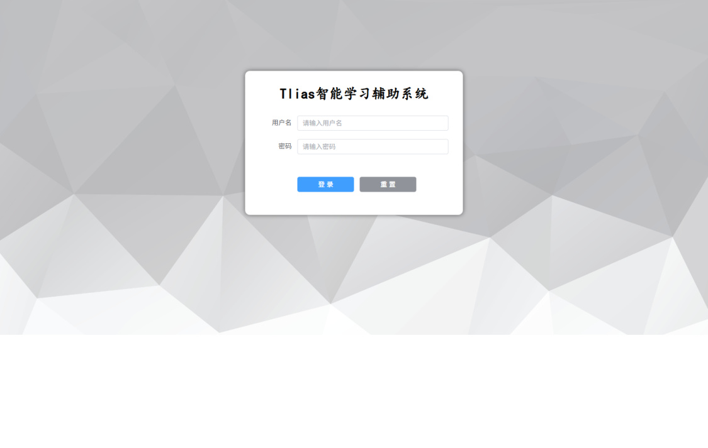
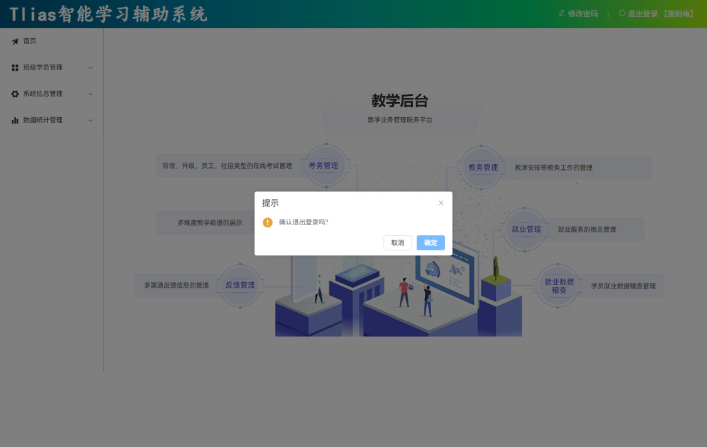
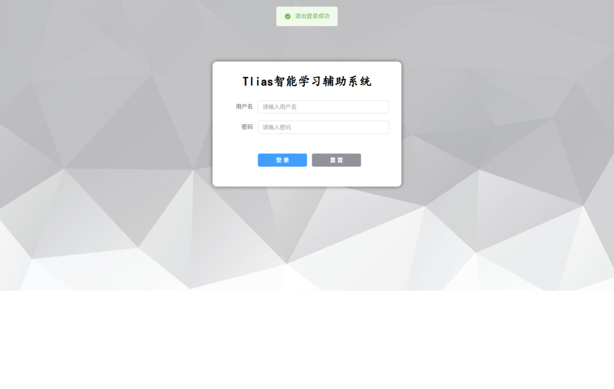

[103 篇](/posts/编程学习/javaweb学习笔记/103-员工管理-修改与删除/)把员工管理的增删改查四件事做齐了，但那时候页面上少了一样东西——**登录**。这一篇（第 18 章 PPT 第 13～20 页）做的是"登录退出"，它看起来只是两个页面上的小功能，实质是把**后端已经做好的令牌机制**接到前端来：登录成功后把令牌存进浏览器，之后每次请求自动带上它，一旦后端说"你没登录"（401），前端自己把人送回登录页。

> [!NOTE]
> 这一篇的内容一半在前端、一半在后端：[81 篇](/posts/编程学习/javaweb学习笔记/81-登录功能/)做的 `POST /login` 接口（成功时返回 `id`、`username`、`name`、`token` 四项）和 [82 篇](/posts/编程学习/javaweb学习笔记/82-会话技术与jwt令牌/)的 JWT 令牌是"发令牌"的那一半；[83 篇](/posts/编程学习/javaweb学习笔记/83-过滤器filter/)、[84 篇](/posts/编程学习/javaweb学习笔记/84-拦截器interceptor/)管的"没令牌就响应 401"是校验的那一半。**前端要做的是接送**——登录后收下令牌存好，之后每次请求带着它出门。

| PPT 页 | 内容 | 本篇对应小节 |
| --- | --- | --- |
| 13 | 目录页（员工管理-修改 / 员工管理-删除 / 登录退出 / 打包部署） | 目录页——前面两件已做完，轮到"登录退出" |
| 14 | 小节标题页——登录退出／登录、退出 03 | 登录 |
| 15 | 登录（绑定登录按钮、取消按钮清空表单） | 登录 |
| 16 | 问题（登录成功后没有把令牌存起来）+ 方案（存起来、后续请求再取出来）+ localStorage 的四个 API | 令牌为什么要存起来 |
| 17 | 请求拦截器（每次请求从 localStorage 取出令牌、塞进请求头） | 请求拦截器 |
| 18 | 响应拦截器（401 → 提示"登录失效" + 跳登录页） | 响应拦截器 |
| 19 | 目录页（登录退出／登录、退出 03）——"登录"这张卡片点亮了，轮到"退出" | 退出登录 |
| 20 | 退出（展示当前登录用户、退出登录） | 退出登录 |
| 21 | 目录页（四张卡片）——登录退出做完了，只剩打包部署 | [105 篇](/posts/编程学习/javaweb学习笔记/105-前端打包部署/) |

## 登录（PPT 第 14～15 页）

第 14 页是小节标题页（"登录退出／登录、退出 03"，和第 19 页同一张），第 15 页给登录的步骤：

> **登录**
> 步骤：
> 1. 为 "登录" 按钮绑定事件，点击登录按钮发送异步请求到服务端，执行登录操作。
> 2. 为 "取消" 按钮绑定事件，点击取消按钮，清空登录表单数据。

登录页在工程里是单独一个路由页面 `src/views/login/index.vue`（路由表里 `{ path: '/login', component: Login }`，[98 篇](/posts/编程学习/javaweb学习笔记/98-前后端分离与整体布局/)搭的那个路由配置），和前几篇一直在改的 Layout 里的页面不一样——**它不在主布局里**，没有左边的菜单、没有顶栏，就是中间一张卡片。

### 接口先看一眼

| 项 | 内容 |
| --- | --- |
| 请求方式 | `POST` |
| 请求路径 | `/login` |
| 请求体 | `{"username": "用户名", "password": "密码"}` |
| 响应 `data` | `id`、`username`、`name`、**`token`** 四项（后端 [81 篇](/posts/编程学习/javaweb学习笔记/81-登录功能/)的 `LoginInfo`） |

`src/api/login.js` 里就一行：

```js
import request from '@/utils/request'

//登录
export const loginApi = (data) => request.post('/login', data)
```

### 页面：两个输入框 + 两个按钮

```html
<template>
  <div id="container">
    <div class="login-form">
      <el-form label-width="80px">
        <p class="title">Tlias智能学习辅助系统</p>
        <el-form-item label="用户名" prop="username">
          <el-input v-model="loginForm.username" placeholder="请输入用户名"></el-input>
        </el-form-item>

        <el-form-item label="密码" prop="password">
          <el-input type="password" v-model="loginForm.password" placeholder="请输入密码"></el-input>
        </el-form-item>

        <el-form-item>
          <el-button class="button" type="primary" @click="login">登 录</el-button>
          <el-button class="button" type="info" @click="cancel">重 置</el-button>
        </el-form-item>
      </el-form>
    </div>
  </div>
</template>
```

两处值得注意：密码框用 `type="password"`（打进去的字变成圆点）；两个按钮的文字是"**登 录**"和"**重 置**"——**PPT 上画的原型写的是"取消"**，工程实现里改成了"重置"（本机截图和工程代码都是"重置"），功能一样，都是"把表单清空"。

### 两个动作

```js
<script setup>
import { ref } from 'vue'
import { loginApi } from '@/api/login'
import { ElMessage } from 'element-plus'
import { useRouter } from 'vue-router'

let loginForm = ref({username:'', password:''})
let router = useRouter()

//登录
const login = async () => {
  const result = await loginApi(loginForm.value)
  if (result.code) {// 登录成功
    ElMessage.success('登录成功')
    localStorage.setItem('loginUser', JSON.stringify(result.data))
    router.push('/')// 跳转
  }else {
    ElMessage.error(result.msg)
  }
}

//取消
const cancel = () => {
  loginForm.value = {
    username: '',
    password: ''
  }
}
</script>
```

- **`loginForm`** 是一个对象装两个表单项（用户名、密码），和 [100 篇](/posts/编程学习/javaweb学习笔记/100-部门管理-新增修改删除/)那个 `dept` 对象是同一种做法；
- **`useRouter()`** 拿到路由对象，跳转靠它（`router.push(...)`）——**在组合式 API 里拿路由要用这个函数**，和模板里 `<router-link>` 那种用法不同；
- **`login`** 三件事：发请求 → 成功就提示 + **存令牌** + 跳转；失败就 `ElMessage.error(result.msg)` 把后端给的失败原因弹出来（比如"用户名或密码错误"）；
- **`router.push('/')`** 去的是根路径，而路由表里 `'/'` 配的是 `redirect: '/index'`——所以登录成功后实际落在**首页**；
- **`cancel`（页面上写"重置"）** 就是把 `loginForm` 重新赋成一个两个字段都空的**新对象**——输入框立刻变空（`v-model` 双向绑定，数据变了界面就变）。

本机实测（前端连着带登录校验的后端、账号 `shinaian / 123456`）：


*图（本机实测）：本机跑起来的登录页——灰底几何背景上浮着一张白色卡片，"Tlias智能学习辅助系统"标题、"用户名 / 密码"两个输入框、蓝色"登 录"与灰色"重 置"两个按钮。**和 PPT 第 15 页画的原型（左侧一张大插画 + 右侧表单）长得不一样**——课程最终版本的登录页就是这张卡片（背景图是工程 `src/assets/bg1.jpg`），原型只是需求说明*

本机实测：填对账号密码点"登 录"，页面提示"登录成功"、地址栏变成 `http://localhost:5174/index`（**跳到了首页**）。至于密码填错那条路（走 `else` 分支、把后端的失败原因弹出来、人留在登录页），本轮没有在页面上实测——后端那种响应在 [81 篇](/posts/编程学习/javaweb学习笔记/81-登录功能/)的联调里验过。

## 令牌为什么要存起来（PPT 第 16 页）

第 16 页先提了个问题，再给方案：

> **问题**：目前执行登录操作，登录成功之后，并没有将令牌信息起来，在后续的每次操作中，也就拿不到登录时的令牌信息了。
> **方案**：需要在登录成功后，将令牌等信息存储起来。 在后续的请求中，再将令牌取出来，携带到服务端。

第 16 页旁边配的两张图，一张是登录页（`/login/index.vue`）、一张是部门管理页（`/dept/index.vue`），意思很直白：**令牌不是登录页自己用的**——登录页负责"领到"它，后面部门管理、员工管理这些页面发的每一个请求都要用它。所以它得存在一个"谁都能拿到的地方"，而且**刷新页面也不能丢**。

### localStorage：浏览器给的本地存储

PPT 第 16 页点名的就是它：

> **localStorage** 是浏览器提供的本地存储机制（**5MB**）。
> 存储形式为 **key-value** 形式，键和值都是**字符串**类型。
> API 方法：
> - `localStorage.setItem(key, value)`
> - `localStorage.getItem(key)`
> - `localStorage.removeItem(key)`
> - `localStorage.clear()`

四个 API 一句话一个：

| API | 干什么 | 类比 |
| --- | --- | --- |
| `localStorage.setItem(key, value)` | **存**：给一个键、一个值（都按字符串处理） | 往柜子里放东西，贴上标签 |
| `localStorage.getItem(key)` | **取**：按键把字符串拿回来；这个键没有就返回 `null` | 按标签取东西 |
| `localStorage.removeItem(key)` | **删**：只删掉这一个键 | 把这一格清空 |
| `localStorage.clear()` | **清空**：把本站存在 localStorage 里的**所有**键值全删 | 整个柜子清空 |

两个"必须记住"的细节：

1. **存进去的都是字符串**。所以要把一个**对象**（登录返回的 `{id, username, name, token}`）存进去，得先用 `JSON.stringify(obj)` 把它**变成 JSON 字符串**；取出来时用 `JSON.parse(str)` 再变回对象——`JSON.stringify` / `JSON.parse` 在 [22 篇](/posts/编程学习/javaweb学习笔记/22-实战-vueaxios员工列表/)那类例子和 [95 篇](/posts/编程学习/javaweb学习笔记/95-前端工程化与vue项目/)的工程里都见过，这里是它俩最典型的一次应用。
2. **数据在浏览器里，刷新页面也不丢**（这也是为什么它比"存在组件的 `ref` 里"靠谱——`ref` 一刷新就回到初始值了）。

### 登录成功后存 `loginUser`

第 16 页说的"存起来"，落到代码上就是 `login` 函数里的这一句（上面贴过了）：

```js
localStorage.setItem('loginUser', JSON.stringify(result.data))
```

三个信息点：

| 位置 | 内容 |
| --- | --- |
| **键**（key） | `'loginUser'`——后面请求拦截器、退出登录都按这个字符串来取 |
| **值**（value） | `JSON.stringify(result.data)`，也就是 `/login` 返回的 `data`（`{id, username, name, token}`）转成的字符串 |
| 存的时机 | `if (result.code)` 里——**只有登录成功才存** |

本机实测：登录成功后打开浏览器开发者工具（Application → Local Storage），能看到这样一条记录——

```json
loginUser = {"id":1,"username":"shinaian","name":"施耐庵","token":"eyJhbGciOiJIUzI1NiJ9.eyJpZCI6MSwidXNlcm5hbWUiOiJzaGluYWlhbiIsImV4cCI6MTc5MDc0Njg0OH0.……（后面省略）"}
```

**一条记录里同时装着"我是谁"（id、username、name）和"凭证"（token）**——名字和 id 是给顶栏显示用的（这一篇最后一节），token 是每次请求要带的。这个结构就是后端 [81 篇](/posts/编程学习/javaweb学习笔记/81-登录功能/)那个 `LoginInfo` 原封不动存下来的结果。

## 请求拦截器（PPT 第 17 页）

第 17 页说的是"令牌怎么带出去"：

> 在后续的每一次 Ajax 请求中都获取 localStorage 中的令牌，在请求头中将令牌携带到服务端。**（繁琐）**
>
> **（axios 拦截器）**

PPT 上那张图把这些请求都列了出来——部门管理的查询 / 新增 / 修改 / 删除、员工管理的查询……**每一个**请求都要带令牌。如果按"每个请求自己写一遍"的做法：每次调用都要先 `localStorage.getItem`、`JSON.parse`、再手动往请求头上塞 token——写六遍同样的代码，还容易漏一个。这就是图上那个"**繁琐**"的意思。

axios 给了一个一劳永逸的开关：**拦截器**（interceptors）。它在"请求真正发出去之前"和"响应回来之后"各提供一个插口，所有从这个 axios 实例发出去的请求都会经过它。工程里这段代码写在 `src/utils/request.js`（[99 篇](/posts/编程学习/javaweb学习笔记/99-部门管理-列表查询/)建的那个"请求工具类"，axios 实例创建之后、`export default` 之前）：

```js
//axios的请求 request 拦截器, 每次请求获取localStorage中的loginUser, 从中获取到token, 在请求头token中携带到服务端
request.interceptors.request.use(
  (config) => {
    let loginUser = JSON.parse(localStorage.getItem('loginUser'))
    console.log(localStorage.getItem('loginUser'))
    if (loginUser) {
      config.headers.token = loginUser.token
    }
    return config
  }
)
```

逐行读：

| 行 | 在干什么 |
| --- | --- |
| `request.interceptors.request.use(...)` | 在 axios 实例上注册**请求拦截器**；`.use(成功回调, 失败回调)` 是它的固定写法（这里只写了成功回调） |
| `(config) => { ... }` | 这个回调的**参数 `config` 就是"这次请求的全部配置"**（地址、方法、请求头……），拿走它就能在发送前动手脚 |
| `JSON.parse(localStorage.getItem('loginUser'))` | 从 localStorage 里按 `loginUser` 取出**字符串**、解析回**对象**（没登录过时取到 `null`，`JSON.parse(null)` 还是 `null`，不会报错） |
| `if (loginUser)` | **先判断有没有登录信息**——没登录就不做任何事（不能对 `null` 取 `.token`） |
| `config.headers.token = loginUser.token` | **核心那一行**：把令牌塞进请求头，头名字就叫 `token`（接口文档 [81 篇](/posts/编程学习/javaweb学习笔记/81-登录功能/)里写明的请求头名） |
| `return config` | **必须返回** `config`——拦截器是"过一道手"，不还回去这次请求就发不出去了 |

> [!TIP]
> **PPT 上的版本和工程里的版本有一点点差别**，抄的时候以工程为准。PPT 第 17 页写的是：
> ```js
> request.interceptors.request.use(
>   (config) => {
>     const data = JSON.parse(localStorage.getItem('loginUser'))
>     if (data && data.token) {
>       config.headers.token = data.token
>     }
>     return config
>   },
>   (error) => {
>     return Promise.reject(error)
>   }
> )
> ```
> 差别只在"判断写得细不细"：PPT 把判断写成 `if (data && data.token)`（既要有登录信息、也要真的有令牌），工程写成 `if (loginUser)`（有登录信息就取 `.token`）；工程还多留了一句 `console.log`，另外省掉了第二个"失败回调"参数。两版的效果一样——**没登录就什么都不加**。

**这套机制跑通没跑通，有一条间接证据**：本机实测里，登录之后访问员工管理页能正常查出 **10 行数据**（[101 篇](/posts/编程学习/javaweb学习笔记/101-员工管理-条件分页查询/)那张列表），而后端是**带登录校验的**（令牌不对就响应 401）——能查出数据，说明请求确实带上了 localStorage 里那个令牌。

> [!TIP]
> **一个例外要记住：不是所有请求都走 axios**。员工新增/修改表单里的**头像上传**用的是 `el-upload` 组件自带的请求（它自己发 HTTP，不经过 axios 实例），所以**请求拦截器管不到它**。工程里是这么处理的——在页面里单独从 localStorage 取一次令牌，再塞给 `el-upload` 的请求头：
> ```js
> // 声明 token
> const token = ref('')
>
> onMounted(async () => {
>   //……
>   //加载localStorage存储的员工登录信息
>   const loginUser = localStorage.getItem('loginUser');
>   if(loginUser){
>     token.value = JSON.parse(loginUser).token
>   }
> })
> ```
> ```html
> <el-upload action="/api/upload" :headers="{'token': token}" ... >
> ```
> [102 篇](/posts/编程学习/javaweb学习笔记/102-员工管理-新增员工/)里那个头像上传的 `:headers` 就是为它准备的——**看懂了拦截器，也就看懂了这里为什么偏要手动写一遍**。

## 响应拦截器（PPT 第 18 页）

第 18 页说的是反方向的问题：

> 目前，即使用户未登录的情况下访问服务器，服务器会响应 **401** 状态码，但是**前端并不会跳转到登录页面**。

后端已经会拒绝了（[82 篇](/posts/编程学习/javaweb学习笔记/82-会话技术与jwt令牌/)的接口文档写着"如果检测到用户未登录，则直接响应 401 状态码"，实现见 [83](/posts/编程学习/javaweb学习笔记/83-过滤器filter/)、[84 篇](/posts/编程学习/javaweb学习笔记/84-拦截器interceptor/)）——但前端拿到这个 401 只是"请求失败了"，用户还傻坐在原来的页面上。所以要在响应回来的路上也装一个拦截器：

```js
//axios的响应 response 拦截器
request.interceptors.response.use(
  (response) => { //成功回调
    return response.data
  },
  (error) => { //失败回调
    //如果响应的状态码为401, 则路由到登录页面
    if (error.response.status === 401) {
      ElMessage.error('登录失效, 请重新登录')
      router.push('/login')
    }
    return Promise.reject(error)
  }
)
```

分两半看（PPT 第 18 页给的代码和工程里的差别只有一处，下面单独说）：

**成功回调 `return response.data`** —— 这一句不是这一篇新加的，是 [99 篇](/posts/编程学习/javaweb学习笔记/99-部门管理-列表查询/)封装请求工具类时就写好的：axios 原本把响应包成一层厚壳（`response.data` 里才是后端真正的 JSON），这里**统一剥掉一层**，所以后面所有组件里都能直接写 `result.code`、`result.data`。响应拦截器正好是"剥壳"最合适的位置。

**失败回调** —— 请求出错（HTTP 状态码不是 2xx）时进来，参数 `error` 里带着响应对象：

| 行 | 在干什么 |
| --- | --- |
| `error.response.status === 401` | 判断"HTTP 状态码是不是 **401**"（未认证）——这是后端在说"你没登录 / 令牌无效" |
| `ElMessage.error('登录失效, 请重新登录')` | 给用户一句人话提示（红色的消息条） |
| `router.push('/login')` | **把人送回登录页**——这一步是关键：用户看到的界面自动切换，不需要自己点任何东西 |
| `return Promise.reject(error)` | 这个错误还得继续往外传（组件里 `await` 的地方会抛出异常）——**不写这一句，错误就被"吞掉"了** |

（这一段代码能直接 `router.push`，是因为 `request.js` 开头 `import router from '../router'` 把路由对象引进来了。）

> [!TIP]
> **工程版本和 PPT 第 18 页的版本只差一个"否则"分支**：PPT 上写的是
> ```js
> if(error.response.status == 401){ //跳转登录页面
>   ElMessage.error('登录失效, 请重新登录')
>   router.push('/login')
> }else {
>   ElMessage.error('接口访问异常')
> }
> ```
> 也就是"不是 401 的其它错误也要提示一句'接口访问异常'"；工程里的 `request.js` **省掉了这个 `else`**（不是 401 的时候什么都不弹，只把错误往上抛）。自己写的时候照 PPT 把 `else` 补上更完整——不然接口 500 时页面会"毫无反应"。

本机实测（**未登录直接访问需要登录的页面**）：

```
直接访问 http://localhost:5174/emp
当前 URL：http://localhost:5174/login      ← 被自动跳到了登录页
localStorage.loginUser：null              ← 本地根本没有登录信息
```

页面上弹出一条"登录失效, 请重新登录"，浏览器控制台里能看到**两次** `AxiosError`——因为员工管理页一加载就会发两个请求（员工分页查询 + 部门列表，见 [101 篇](/posts/编程学习/javaweb学习笔记/101-员工管理-条件分页查询/)的 `onMounted` 和 [102 篇](/posts/编程学习/javaweb学习笔记/102-员工管理-新增员工/)的部门下拉数据），两个请求都没有令牌、都被后端判了 401，所以拦截器跑了两次。

> 本机说明：这台机器上前端跑在 **5174**（Vite 默认 5173 被别的工程占着时会自动往后试），课程里默认是 5173——访问地址里的端口号以自己启动日志里的为准。

## 退出登录（PPT 第 19～20 页）

第 19 页又是那张"登录退出"的目录页——"登录"这张卡片点亮了，翻到这一页代表轮到"退出"。第 20 页给了两件事：

> **退出**
> - 展示当前登录用户。
> - 退出登录。

这两件事都在主布局 `src/views/layout/index.vue`（[98 篇](/posts/编程学习/javaweb学习笔记/98-前后端分离与整体布局/)搭的 Layout）里，位置是顶栏右上角：`修改密码 | 退出登录 【施耐庵】`。

### 展示当前登录用户

```js
import { ref, onMounted } from 'vue'

const loginName = ref('')
//定义钩子函数, 获取登录用户名
onMounted(() => {
  //获取登录用户名
  let loginUser = JSON.parse(localStorage.getItem('loginUser'))
  if (loginUser) {
    loginName.value = loginUser.name
  }
})
```

```html
<span class="right_tool">
  <a href="">
    <el-icon><EditPen /></el-icon> 修改密码 &nbsp;&nbsp;&nbsp; |  &nbsp;&nbsp;&nbsp;
  </a>
  <a href="javascript:void(0)" @click="logout">
    <el-icon><SwitchButton /></el-icon> 退出登录 【{{ loginName }}】
  </a>
</span>
```

- 页面**一挂载**（`onMounted`）就从 localStorage 里把登录信息取出来，只取 **`name`** 两个字放进 `loginName`；
- 模板里用 `{{ loginName }}` 插进"退出登录 【…】"这行字里——这就解释了为什么 [103 篇](/posts/编程学习/javaweb学习笔记/103-员工管理-修改与删除/)那套"存 `loginUser` 要连 name 一起存"是有用的；
- 这个 `<a>` 上写的是 `href="javascript:void(0)"`，意思是"点了别跳转"——跳转交给 `@click="logout"`。（旁边那个"修改密码"是课程里的样子货，`href=""` 什么都不做。）

### 退出登录：三步

```js
import { ElMessage, ElMessageBox } from 'element-plus';
import { useRouter } from 'vue-router'

let router = useRouter()

const logout = () => {
  //弹出确认框, 如果确认, 则退出登录, 跳转到登录页面
  ElMessageBox.confirm('确认退出登录吗?', '提示', {
    confirmButtonText: '确定',
    cancelButtonText: '取消',
    type: 'warning'
  }).then(() => {//确认, 则清空登录信息
    ElMessage.success('退出登录成功')
    localStorage.removeItem('loginUser')
    router.push('/login')//跳转到登录页面
  })
}
```

点"退出登录"先弹确认框（[100 篇](/posts/编程学习/javaweb学习笔记/100-部门管理-新增修改删除/)用过的那套 `ElMessageBox.confirm`），点"确定"之后干**三件事**：

| 顺序 | 代码 | 干了什么 | 为什么 |
| --- | --- | --- | --- |
| ① | `ElMessage.success('退出登录成功')` | 绿色提示"退出登录成功" | 给用户一个反馈 |
| ② | `localStorage.removeItem('loginUser')` | **把存着的 `loginUser` 删掉**（令牌一起没了） | 这才是"退出"的实质：本地没有令牌了 |
| ③ | `router.push('/login')` | 跳回登录页 | 把人从业务页面挪走 |

第二步是重点。为什么"删掉 localStorage 里的东西"就等于退出登录了？因为**请求拦截器取令牌就是从这儿取的**：清掉之后再发任何请求，`loginUser` 是 `null`，请求头上就不会带令牌 → 后端判 401 → 响应拦截器提示"登录失效"并把人送回登录页。**清本地 + 后端 401 这条闭环，把"退出"落到了实处**——不删的话，下一个在这个浏览器里操作的人还会带着上一个账号的令牌。

本机实测（点顶栏"退出登录"）：


*图（本机实测）：点"退出登录"弹出的确认框——标题"提示"、内容"确认退出登录吗?"、按钮"取消 / 确定"（警告图标）。注意**背后的顶栏**：右上角写着"修改密码 | 退出登录 【**施耐庵**】"，这就是"展示当前登录用户"的效果（数据从 localStorage 里的 `loginUser.name` 来）*

点"确定"之后：

```
当前 URL：http://localhost:5174/login     ← 回到登录页
localStorage.loginUser：null              ← 本地存的登录信息被清掉了
```


*图（本机实测）：点"确定"之后的落点——页面回到登录页那张卡片，**顶部还挂着一条绿色的"退出登录成功"提示**（`ElMessage.success` 在页面切换后仍然显示在顶部），两个输入框是空的。这时候再打开开发者工具的 Application → Local Storage，会发现 `loginUser` 已经不见了*

## 小结

| 问题 | 答案 |
| --- | --- |
| 登录这一节做了哪几个动作？ | ① "登录"按钮绑定事件发 `POST /login`；② "取消/重置"按钮把 `loginForm` 清空；③ **登录成功后存令牌**并跳转首页 |
| 登录接口返回什么？ | `data` 里有 `id`、`username`、`name`、`token` 四项（[81 篇](/posts/编程学习/javaweb学习笔记/81-登录功能/)的 `LoginInfo`）；前端把整个 `data` 存起来 |
| 为什么要把令牌存起来？ | 令牌是登录页"领"的，但**后面每个页面发的每个请求都要用它**；不存的话，后续请求取不到令牌，服务端就认为你没登录 |
| localStorage 是什么？ | 浏览器提供的本地存储机制，**5MB**、**key-value** 形式、**键和值都是字符串**；刷新页面数据还在 |
| 四个 API？ | `setItem(key, value)` 存、`getItem(key)` 取（没有返回 `null`）、`removeItem(key)` 删一个、`clear()` 清空全部 |
| 存对象为什么要 `JSON.stringify`？ | 因为 localStorage 只认字符串——存进去时把对象转成 JSON 字符串，取出来时用 `JSON.parse` 转回对象 |
| 登录成功后存了什么？ | `localStorage.setItem('loginUser', JSON.stringify(result.data))`，键是 `loginUser`，值里同时有 id、username、name 和 token |
| 请求拦截器干什么？ | 每次请求发出前，从 localStorage 取出 `loginUser`、把 `token` 塞进**请求头 `token`**（`config.headers.token = loginUser.token`），最后**必须 `return config`**；好处是不用在每个请求里手写一遍（PPT 说的"繁琐"） |
| 响应拦截器干什么？ | 成功回调 `return response.data`（统一剥一层，[99 篇](/posts/编程学习/javaweb学习笔记/99-部门管理-列表查询/)的封装）；失败回调里 `error.response.status === 401` 时 `ElMessage.error('登录失效, 请重新登录')` + `router.push('/login')`，最后 `return Promise.reject(error)` |
| 退出登录三步？ | `ElMessage.success('退出登录成功')` + `localStorage.removeItem('loginUser')` + `router.push('/login')`；点按钮前先弹确认框 |
| "展示当前登录用户"怎么做的？ | Layout 里 `onMounted` 从 localStorage 取 `loginUser` 的 **name** 放进 `loginName`，模板里 `退出登录 【{{ loginName }}】` |
| 本机实测到了什么？ | 未登录访问 `/emp` → 自动跳到 `/login`、`localStorage.loginUser` 为 `null`、提示"登录失效, 请重新登录"；登录后 `localStorage.loginUser` 里同时有 id/username/name/token；点退出 → 确认框"确认退出登录吗?"→ 确定后回到登录页并清空 localStorage |

## 相关

- [上一篇：员工管理-修改与删除](/posts/编程学习/javaweb学习笔记/103-员工管理-修改与删除/)
- [下一篇：前端打包部署](/posts/编程学习/javaweb学习笔记/105-前端打包部署/)

## 练习题

### 一、知识回顾（读完直接做下面的实践题）

1. **登录的步骤**（PPT 第 15 页）：为"登录"按钮绑定事件、点击后发送异步请求执行登录；为"取消"按钮绑定事件、点击后清空登录表单数据（工程里这个按钮叫"**重置**"）
2. **登录接口**：`POST /login`，请求体 `{"username": ..., "password": ...}`，响应 `data` 里有 `id`、`username`、`name`、**`token`** 四项；`src/api/login.js` 里就一行 `loginApi = (data) => request.post('/login', data)`
3. **登录成功后做三件事**：`ElMessage.success('登录成功')` → `localStorage.setItem('loginUser', JSON.stringify(result.data))` → `router.push('/')`（根路径配了 `redirect: '/index'`，实际落在首页）
4. **为什么要把令牌存起来**（PPT 第 16 页的"问题+方案"）：登录成功后不存，后续每次操作就拿不到令牌了；存起来之后，"后续的请求再把令牌取出来携带到服务端"
5. **localStorage 的四条 API + 三条常识**：`setItem(key, value)` / `getItem(key)`（没有返回 `null`）/ `removeItem(key)` / `clear()`；localStorage 是浏览器提供的本地存储机制，**5MB**、**key-value**、**键和值都是字符串**——所以对象要用 `JSON.stringify` 存、`JSON.parse` 取
6. **存的键名是 `loginUser`**，值是登录接口返回的 `data`（id、username、name、token 都在里面）；本机实测登录后能在浏览器里看到这条 JSON 字符串
7. **请求拦截器**（PPT 第 17 页）：写在 `src/utils/request.js`，`request.interceptors.request.use((config) => {...})`；从 localStorage 取 `loginUser`、`config.headers.token = loginUser.token`、**最后 `return config`**；它解决的是"每个请求都手写一遍令牌（繁琐）"的问题
8. **响应拦截器**（PPT 第 18 页）：成功回调 `return response.data`（统一剥掉 axios 那层壳，[99 篇](/posts/编程学习/javaweb学习笔记/99-部门管理-列表查询/)封装时就写好的）；失败回调里判断 `error.response.status === 401` → `ElMessage.error('登录失效, 请重新登录')` + `router.push('/login')`，最后 `return Promise.reject(error)`
9. **退出登录三步**：`ElMessage.success('退出登录成功')` + `localStorage.removeItem('loginUser')` + `router.push('/login')`；点"退出登录"先弹 `ElMessageBox.confirm('确认退出登录吗?', '提示', {...})`
10. **展示当前登录用户**：Layout 里 `onMounted` 从 localStorage 取 `loginUser` 的 `name` 放进 `loginName`，模板里 `退出登录 【{{ loginName }}】`
11. **本机实测三条**：未登录访问 `/emp` → 自动跳到 `/login`、`localStorage.loginUser` 是 `null`、页面弹"登录失效, 请重新登录"（控制台两次 `AxiosError`，因为页面加载发了两个请求）；登录后 localStorage 里同时有 id/username/name/token；点退出 → 确认框 → 确定后回到登录页、localStorage 被清空（顶栏还能看到"退出登录成功"的绿色提示）
12. **一个例外**：头像上传用的 `el-upload` 不走 axios，拦截器管不到，所以工程在页面里单独从 localStorage 取令牌、塞进上传请求头（`:headers="{'token': token}"`）

### 二、裸写题

- [ ] **2-1 让登录按钮真的登录**
  需求：登录页上有"用户名""密码"两个输入框和一个"登 录"按钮、一个"重 置"按钮。点"登 录"时把两个输入框里的内容发给后端的登录接口；**成功**了就提示一句"登录成功"并跳到首页；**失败**了把后端给的失败原因弹出来（并且留在登录页）；点"重 置"把两个输入框清空。
  素材：登录接口 `POST /login`，请求体 `{"username": "...", "password": "..."}`，响应 `{code, msg, data}`（`code` 为 1 表示成功，失败时 `msg` 里是原因）；跳转要用组合式 API 里的路由写法。

  > [!TIP]- 提示（先自己想，实在想不出再点开）
  > **一级 · 思路**：两个输入框的内容装在一个对象里（双向绑定），点按钮就"把这个对象发出去"；返回值里有个字段告诉你成没成，成了提示+跳走，没成就把原因弹出来。清空表单 = 把这个对象重新赋成两个字段都空的新对象
  > **二级 · 方法**：`const loginForm = ref({username:'', password:''})` + `<el-input v-model="loginForm.username">`；`import { useRouter } from 'vue-router'` 然后 `const router = useRouter()`，跳转 `router.push('/')`；api 文件里 `export const loginApi = (data) => request.post('/login', data)`；提示用 `ElMessage.success` / `ElMessage.error`
  > **三级 · 骨架**：`const login = async () => { const result = await ____(loginForm.value); if(result.____){ ElMessage.____('登录成功'); router.____('/'); }else{ ElMessage.____(result.msg) } }` / `const cancel = () => { loginForm.value = { username: '____', password: '____' } }`

  > [!TIP]- 参考答案（做完再点开）
  > ```js
  > // src/api/login.js
  > import request from '@/utils/request'
  >
  > //登录
  > export const loginApi = (data) => request.post('/login', data)
  > ```
  >
  > ```js
  > // src/views/login/index.vue 的 script 部分
  > import { ref } from 'vue'
  > import { loginApi } from '@/api/login'
  > import { ElMessage } from 'element-plus'
  > import { useRouter } from 'vue-router'
  >
  > let loginForm = ref({username:'', password:''})
  > let router = useRouter()
  >
  > //登录
  > const login = async () => {
  >   const result = await loginApi(loginForm.value)
  >   if (result.code) {// 登录成功
  >     ElMessage.success('登录成功')
  >     router.push('/')// 跳转
  >   }else {
  >     ElMessage.error(result.msg)
  >   }
  > }
  >
  > //取消
  > const cancel = () => {
  >   loginForm.value = {
  >     username: '',
  >     password: ''
  >   }
  > }
  > ```
  >
  > ```html
  > <!-- 模板里的两个按钮 -->
  > <el-form-item>
  >   <el-button class="button" type="primary" @click="login">登 录</el-button>
  >   <el-button class="button" type="info" @click="cancel">重 置</el-button>
  > </el-form-item>
  > ```
  > 检查点：① 两个框里打字，点"重 置"立刻变空；② 账号密码正确 → 顶部提示"登录成功"且地址变成首页（本机是 `/index`）；③ 密码填错 → 顶部弹出后端返回的原因，**页面停在登录页**；④ 打开 F12 的 Network，登录请求是 `POST /login`、请求体是 `{"username": "...", "password": "..."}`。

- [ ] **2-2 登录成功后把"登录信息 + 令牌"存到浏览器本地，并且会用它的四个 API**
  需求：登录成功之后，把后端返回的那份登录信息（里面有 id、用户名、姓名、令牌）**存到浏览器本地存储里**，键名用 `loginUser`；存进去之后要能在别的地方（比如浏览器开发者工具里、或者别的组件里）读出来一个**对象**（而不是一坨看不懂的字符串）；另外请把本地存储的四个 API 各写一行示例——存一条、读一条、删掉某一条、清空全部。
  素材：登录接口成功时返回 `{code: 1, msg: 'success', data: {id: 1, username: 'shinaian', name: '施耐庵', token: 'eyJh...'}}`。

  > [!TIP]- 提示（先自己想，实在想不出再点开）
  > **一级 · 思路**：本地存储只认字符串，所以"存对象"要分两步——存之前把它转成 JSON 字符串，取出来之后再转回对象。存的位置就在登录成功那个分支里（存早了可能是错的账号）
  > **二级 · 方法**：存 `localStorage.setItem('loginUser', JSON.stringify(result.data))`；取 `JSON.parse(localStorage.getItem('loginUser'))`（没存过时取到 `null`，`JSON.parse(null)` 不会报错，可以配一个 `if` 判断）；删 `localStorage.removeItem('loginUser')`；清空 `localStorage.clear()`
  > **三级 · 骨架**：`localStorage.setItem('____', JSON.stringify(result.____))` / `let loginUser = JSON.parse(localStorage.getItem('____'))` / `localStorage.____('loginUser')` / `localStorage.____()`

  > [!TIP]- 参考答案（做完再点开）
  > ```js
  > // ① 存：登录成功后（只存 data，不存整包）
  > ElMessage.success('登录成功')
  > localStorage.setItem('loginUser', JSON.stringify(result.data))
  > router.push('/')
  >
  > // ② 取：别的地方要用时（取到的是对象）
  > let loginUser = JSON.parse(localStorage.getItem('loginUser'))
  > if (loginUser) {
  >   console.log(loginUser.name)    // 施耐庵
  >   console.log(loginUser.token)   // 令牌
  > }
  >
  > // ③ 删：只删这一个键
  > localStorage.removeItem('loginUser')
  >
  > // ④ 清空：把本站 localStorage 里的所有键值都删掉（慎用）
  > localStorage.clear()
  > ```
  > 检查点：① 登录成功后打开 F12 → Application → Local Storage，能看到一条 `loginUser = {"id":1,...}`；② 只存 `result.data`，键名是 `loginUser`；③ 不加 `JSON.stringify` 直接存对象，浏览器里会变成 `[object Object]`（取出来没法用）——能说清这个现象；④ 刷新页面后这条记录还在（本地存储不随刷新消失，这也是它比组件里的 `ref` 合适的原因）。

- [ ] **2-3 让每一个请求都自动带上令牌（请求拦截器）**
  需求：登录之后，从 axios 实例发出去的**任何**请求都要自动带上令牌，不用在每个组件里手写；令牌从浏览器本地存的那份登录信息里取；**没有登录信息时不要往请求里加东西**（更不能报错）；请求头名字就叫 `token`。
  素材：请求工具类 `src/utils/request.js` 里已经建好了 axios 实例 `request`（有 `baseURL: '/api'` 和超时时间），并导出了它；组件里所有接口都通过这个实例发请求。

  > [!TIP]- 提示（先自己想，实在想不出再点开）
  > **一级 · 思路**：给 axios 实例装一个"出发前的关口"——每次请求发出去之前它都会被叫一次，参数里带着这次请求的配置；在关口里把令牌塞进请求头，再把配置还回去。这件事只写一遍，所有请求就都享受到了
  > **二级 · 方法**：`request.interceptors.request.use((config) => { ... })`；里面对 `localStorage.getItem('loginUser')` 取出来的字符串做 `JSON.parse`，判断存在之后 `config.headers.token = loginUser.token`；**一定要 `return config`**；这段代码写在创建 axios 实例之后、`export default request` 之前（页面里不用 import 任何东西，只要这个模块被加载过就生效）
  > **三级 · 骨架**：`request.interceptors.____.use((config) => { let loginUser = JSON.parse(localStorage.getItem('____')); if (loginUser) { config.____.token = loginUser.____ } return ____ })`

  > [!TIP]- 参考答案（做完再点开）
  > ```js
  > // src/utils/request.js
  > import axios from 'axios'
  > import { ElMessage } from 'element-plus'
  > import router from '../router'
  >
  > //创建axios实例对象
  > const request = axios.create({
  >   baseURL: '/api',
  >   timeout: 600000
  > })
  >
  > //axios的请求 request 拦截器, 每次请求获取localStorage中的loginUser, 从中获取到token, 在请求头token中携带到服务端
  > request.interceptors.request.use(
  >   (config) => {
  >     let loginUser = JSON.parse(localStorage.getItem('loginUser'))
  >     if (loginUser) {
  >       config.headers.token = loginUser.token
  >     }
  >     return config
  >   }
  > )
  >
  > export default request
  > ```
  > 检查点：① 登录后随便点几个页面（部门管理、员工管理），F12 的 Network 里每个请求的 **Request Headers** 里都有 `token: eyJ...`；② 把 `return config` 删掉试试——**请求根本发不出去**（拦截器吞掉了这次请求）；③ 退出登录（localStorage 被清空）后再发请求，请求头里没有 token、后端返回 401；④ 这段代码只在 `request.js` 里写了一次，组件里一个字都没改。

- [ ] **2-4 未登录时自动被送回登录页（响应拦截器）**
  需求：用户没登录（或者令牌失效）时，后端会返回 **401**。要做的效果是——① 页面上提示一句"登录失效, 请重新登录"；② **自动跳转**到登录页，用户不用自己点；③ 其它错误（比如 500）提示一句"接口访问异常"；④ 出错这件事还要继续往上抛给调用方（不能悄悄吞掉）。
  素材：`src/utils/request.js` 里已经有 axios 实例 `request`；路由对象可以 `import router from '../router'` 拿来用（跳转用 `router.push('/login')`）。

  > [!TIP]- 提示（先自己想，实在想不出再点开）
  > **一级 · 思路**：这是"回来路上的关口"——请求成功回来时它先过一道手（顺手把 axios 的外壳剥掉，只留后端给的数据），请求失败时也进来，可以从错误里问出"HTTP 状态码是多少"，是 401 就提示 + 跳登录页
  > **二级 · 方法**：`request.interceptors.response.use((response) => { return response.data }, (error) => { ... })`；失败回调里 `if (error.response.status === 401) { ElMessage.error('登录失效, 请重新登录'); router.push('/login') } else { ElMessage.error('接口访问异常') }`；最后 `return Promise.reject(error)`
  > **三级 · 骨架**：`request.interceptors.response.use((response) => { return response.____ }, (error) => { if (error.response.____ === 401) { ElMessage.____('登录失效, 请重新登录'); router.____('/login') } return Promise.____(error) })`

  > [!TIP]- 参考答案（做完再点开）
  > ```js
  > // src/utils/request.js（响应拦截器部分）
  > //axios的响应 response 拦截器
  > request.interceptors.response.use(
  >   (response) => { //成功回调
  >     return response.data
  >   },
  >   (error) => { //失败回调
  >     //如果响应的状态码为401, 则路由到登录页面
  >     if (error.response.status === 401) {
  >       ElMessage.error('登录失效, 请重新登录')
  >       router.push('/login')
  >     } else {
  >       ElMessage.error('接口访问异常')
  >     }
  >     return Promise.reject(error)
  >   }
  > )
  > ```
  > 检查点：① **不登录**直接在地址栏访问 `/emp`（或把 localStorage 里的 `loginUser` 手动删掉再刷新）→ 页面自动变成登录页，顶部弹"登录失效, 请重新登录"；② 控制台里能看到 `AxiosError`（那是"继续往上抛"的结果，这正是 `return Promise.reject(error)` 在起作用）；③ 登录状态下访问同一页面一切正常（令牌被请求拦截器带上了）；④ 把 `return response.data` 改成 `return response`，组件里所有 `result.code` 都会变成 `undefined`（说明这行"剥壳"是必须的）。

- [ ] **2-5 顶栏显示当前登录用户，并能退出登录**
  需求：主布局的顶栏右侧要有"退出登录 【当前登录人的姓名】"。姓名从**本地存的那份登录信息**里取（页面一加载就显示出来，不用等接口）。点"退出登录"要先弹确认框（标题"提示"、内容"确认退出登录吗?"、按钮"取消/确定"）；点"确定"之后做三件事——提示"退出登录成功"、把本地存的登录信息**清掉**、跳回登录页。
  素材：本地存储里的键名是 `loginUser`，里面是 `{id, username, name, token}`；跳转用组合式 API 的路由写法。

  > [!TIP]- 提示（先自己想，实在想不出再点开）
  > **一级 · 思路**：姓名的来源和"请求拦截器取令牌"是同一份数据（本地存储里的那个对象），只是这次只要 `name` 这一项；页面挂载时读一次放进变量，模板里插值显示。退出就是"清掉这份数据 + 把人挪回登录页"，清之前先问一句
  > **二级 · 方法**：`onMounted(() => { let loginUser = JSON.parse(localStorage.getItem('loginUser')); if (loginUser) { loginName.value = loginUser.name } })`；模板 `<a href="javascript:void(0)" @click="logout">退出登录 【{{ loginName }}】</a>`；`logout` 里 `ElMessageBox.confirm('确认退出登录吗?', '提示', { confirmButtonText: '确定', cancelButtonText: '取消', type: 'warning' }).then(() => { ElMessage.success('退出登录成功'); localStorage.removeItem('loginUser'); router.push('/login') })`
  > **三级 · 骨架**：`onMounted(() => { let loginUser = JSON.parse(localStorage.getItem('____')); if (loginUser) { loginName.value = loginUser.____ } })` / `ElMessageBox.____('确认退出登录吗?', '提示', {...}).then(() => { ElMessage.success('退出登录成功'); localStorage.____('loginUser'); router.push('____') })`

  > [!TIP]- 参考答案（做完再点开）
  > ```js
  > // src/views/layout/index.vue 的 script 部分
  > import { ref, onMounted } from 'vue'
  > import { ElMessage, ElMessageBox } from 'element-plus';
  > import { useRouter } from 'vue-router'
  >
  > let router = useRouter()
  >
  > const loginName = ref('')
  > //定义钩子函数, 获取登录用户名
  > onMounted(() => {
  >   //获取登录用户名
  >   let loginUser = JSON.parse(localStorage.getItem('loginUser'))
  >   if (loginUser) {
  >     loginName.value = loginUser.name
  >   }
  > })
  >
  > const logout = () => {
  >   //弹出确认框, 如果确认, 则退出登录, 跳转到登录页面
  >   ElMessageBox.confirm('确认退出登录吗?', '提示', {
  >     confirmButtonText: '确定',
  >     cancelButtonText: '取消',
  >     type: 'warning'
  >   }).then(() => {//确认, 则清空登录信息
  >     ElMessage.success('退出登录成功')
  >     localStorage.removeItem('loginUser')
  >     router.push('/login')//跳转到登录页面
  >   })
  > }
  > ```
  >
  > ```html
  > <!-- 顶栏右上角那一段 -->
  > <span class="right_tool">
  >   <a href="javascript:void(0)" @click="logout">
  >     <el-icon><SwitchButton /></el-icon> 退出登录 【{{ loginName }}】
  >   </a>
  > </span>
  > ```
  > 检查点：① 登录后顶栏显示自己的姓名（本机实测显示"退出登录 【施耐庵】"）；② 点"退出登录"先弹确认框，点"取消"什么都不发生、页面还在原地；③ 点"确定"→ 顶部提示"退出登录成功"、地址变成 `/login`、F12 里 `loginUser` 不见了；④ 退出后再点浏览器"后退"回到业务页面，会被 401 拦截器送回登录页（本地没令牌了）。

### 三、综合题

- [ ] **3-1 跟着课程把"登录 → 存令牌 → 自动携带 → 退出"整条链路接起来**
  需求：把 PPT 第 13～20 页这套东西按顺序做全（前端部分，后端接口已经就绪）。分步做：

  1. **补接口层**：在 `src/api/login.js` 里封装登录接口（`POST /login`）
  2. **做登录页**：两个输入框绑到一个表单对象上；点"登 录"发请求——成功提示 + **把返回的登录信息存到本地** + 跳首页；失败把后端的失败原因弹出来；点"重 置"清空表单
  3. **装请求拦截器**：在 `src/utils/request.js` 里加请求拦截器，让每次请求都从本地登录信息里取出令牌、塞进请求头，没登录就什么都不加
  4. **装响应拦截器**：同一个文件里加响应拦截器——成功时统一"剥壳"返回数据；失败时判断 401，提示"登录失效, 请重新登录"并**自动跳登录页**，最后把错误继续往外抛
  5. **做退出的界面**：主布局顶栏显示"退出登录 【当前登录人姓名】"，姓名从本地登录信息里取
  6. **做退出的动作**：点"退出登录"先弹确认框；确定后提示"退出登录成功"、**清掉本地登录信息**、跳回登录页
  7. **验证整条链路**（对着后端跑起来看）：不登录访问 `/emp` 会不会被送回登录页；登录成功后本地存储里有没有那份登录信息（含令牌）；登录状态下点几个页面，Network 里每个请求头有没有带令牌；点退出后本地存储是否清空、是不是回到了登录页、再点后退会不会被拦住

  > [!TIP]- 提示（先自己想，实在想不出再点开）
  > **一级 · 思路**：整条链路其实是一个"令牌的一生"——登录页领到它、存在本地、请求拦截器每次带它出门、响应拦截器在它失效（401）时把人送回登录页、退出时把它删掉。两个拦截器都写在**请求工具类**里（只写一处，全局生效）
  > **二级 · 方法**：`loginApi(loginForm.value)` + `localStorage.setItem('loginUser', JSON.stringify(result.data))` + `router.push('/')`；`request.interceptors.request.use((config) => { ... config.headers.token = loginUser.token ... return config })`；`request.interceptors.response.use((response) => response.data, (error) => { if (error.response.status === 401) { ElMessage.error('登录失效, 请重新登录'); router.push('/login') } return Promise.reject(error) })`；Layout 里 `onMounted` 取 `loginUser.name`、`logout` 里 `ElMessageBox.confirm(...).then(() => { ElMessage.success('退出登录成功'); localStorage.removeItem('loginUser'); router.push('/login') })`
  > **三级 · 骨架**：`localStorage.setItem('____', JSON.stringify(result.data))` / `config.headers.____ = loginUser.token; return ____` / `if (error.response.status === ____) { ElMessage.error('____'); router.push('/login') } return Promise.reject(error)` / `localStorage.____('loginUser'); router.push('____')`

  > [!TIP]- 参考答案（做完再点开）
  > ```js
  > // ① src/api/login.js
  > import request from '@/utils/request'
  >
  > //登录
  > export const loginApi = (data) => request.post('/login', data)
  > ```
  >
  > ```js
  > // ② src/views/login/index.vue —— 登录与重置
  > import { ref } from 'vue'
  > import { loginApi } from '@/api/login'
  > import { ElMessage } from 'element-plus'
  > import { useRouter } from 'vue-router'
  >
  > let loginForm = ref({username:'', password:''})
  > let router = useRouter()
  >
  > const login = async () => {
  >   const result = await loginApi(loginForm.value)
  >   if (result.code) {
  >     ElMessage.success('登录成功')
  >     localStorage.setItem('loginUser', JSON.stringify(result.data))  // 存令牌
  >     router.push('/')
  >   }else {
  >     ElMessage.error(result.msg)
  >   }
  > }
  >
  > const cancel = () => {
  >   loginForm.value = { username: '', password: '' }
  > }
  > ```
  >
  > ```js
  > // ③④ src/utils/request.js —— 两个拦截器（完整文件）
  > import axios from 'axios'
  > import { ElMessage } from 'element-plus'
  > import router from '../router'
  >
  > //创建axios实例对象
  > const request = axios.create({
  >   baseURL: '/api',
  >   timeout: 600000
  > })
  >
  > //请求拦截器：每次请求从 localStorage 取令牌，塞进请求头 token
  > request.interceptors.request.use(
  >   (config) => {
  >     let loginUser = JSON.parse(localStorage.getItem('loginUser'))
  >     if (loginUser) {
  >       config.headers.token = loginUser.token
  >     }
  >     return config
  >   }
  > )
  >
  > //响应拦截器：成功剥壳；401 提示并跳登录页
  > request.interceptors.response.use(
  >   (response) => {
  >     return response.data
  >   },
  >   (error) => {
  >     if (error.response.status === 401) {
  >       ElMessage.error('登录失效, 请重新登录')
  >       router.push('/login')
  >     } else {
  >       ElMessage.error('接口访问异常')
  >     }
  >     return Promise.reject(error)
  >   }
  > )
  >
  > export default request
  > ```
  >
  > ```js
  > // ⑤⑥ src/views/layout/index.vue —— 显示当前用户 + 退出登录
  > import { ref, onMounted } from 'vue'
  > import { ElMessage, ElMessageBox } from 'element-plus';
  > import { useRouter } from 'vue-router'
  >
  > let router = useRouter()
  > const loginName = ref('')
  >
  > onMounted(() => {
  >   let loginUser = JSON.parse(localStorage.getItem('loginUser'))
  >   if (loginUser) {
  >     loginName.value = loginUser.name
  >   }
  > })
  >
  > const logout = () => {
  >   ElMessageBox.confirm('确认退出登录吗?', '提示', {
  >     confirmButtonText: '确定',
  >     cancelButtonText: '取消',
  >     type: 'warning'
  >   }).then(() => {
  >     ElMessage.success('退出登录成功')
  >     localStorage.removeItem('loginUser')
  >     router.push('/login')
  >   })
  > }
  > ```
  > 检查点：① 七个步骤每步都要在浏览器里验证过再往下走；② 不登录访问 `/emp` → 自动回登录页 + 提示"登录失效, 请重新登录"；③ 登录后 F12 里 `loginUser` 里能看到 token，Network 里每个请求头都带着 `token`；④ 顶栏显示当前登录人姓名；⑤ 退出后 → 回登录页 + localStorage 清空 + 再访问业务页面会被拦住；⑥ 全程只在一个文件（`request.js`）里写了拦截器，组件里没有任何一处在手写令牌。
