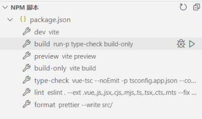
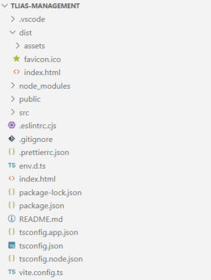
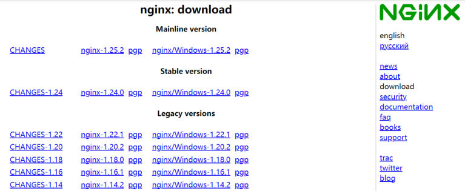
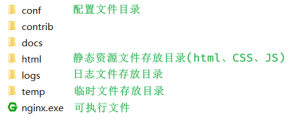
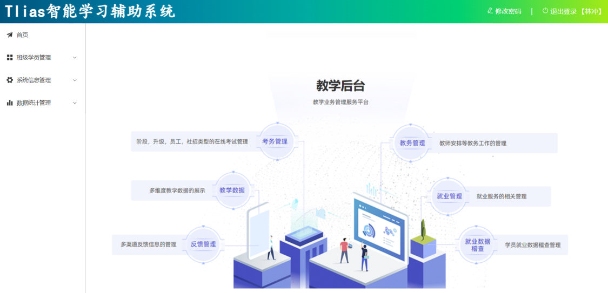
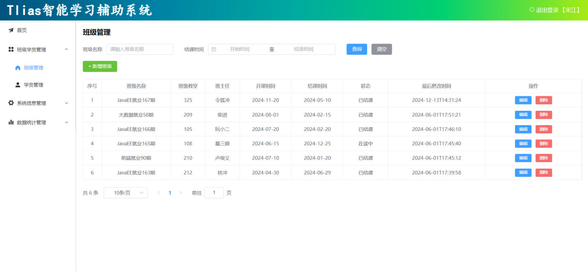
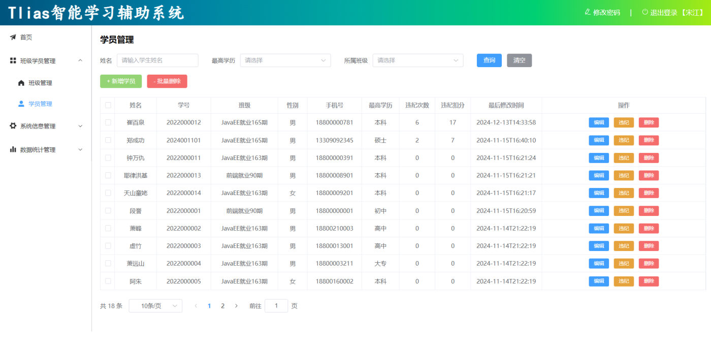

[104 篇](/posts/编程学习/javaweb学习笔记/104-登录退出与令牌管理/)把登录退出做完，Tlias 的前端功能就全了——但那时候它还只在**自己电脑的开发服务器上**跑着（`npm run dev` 起的 5173）。这一篇（第 18 章 PPT 第 21～30 页）是最后一步：**把工程打包成静态文件，交给 Nginx，从 80 端口访问**。

> [!WARNING]
> **这一篇的打包与 nginx 部署本轮没有在本机实测**——第 18 章这次实测只跑到登录退出（前端 dev 服务器 + 后端联调）。课上有两处旧实测可以参照：[95 篇](/posts/编程学习/javaweb学习笔记/95-前端工程化与vue项目/)里跑过同版本脚手架的 `npm run build`（见过 `dist` 产物和它的大小），[59 篇](/posts/编程学习/javaweb学习笔记/59-部门管理-前后端联调与反向代理/)里起过 Windows 版 nginx（那次监听的是 90 端口、配的是反向代理）。下面按 **PPT 第 21～28 页的口径**讲"打包 → 部署 → 访问"，凡引用上面两处旧实测的地方都会写明出处。

| PPT 页 | 内容 | 本篇对应小节 |
| --- | --- | --- |
| 21 | 目录页（员工管理-修改 / 员工管理-删除 / 登录退出 / 打包部署） | 四张卡片只剩最后一张没点亮 |
| 22 | 小节标题页——打包部署 04 | 打包部署 |
| 23 | 前后端分离下的开发形态（前端开发 / 后端开发 / 接口文档，"阅读-开发"） | 从开发到上线 |
| 24 | 打包（NPM 脚本面板 + 打包产物目录） | 打包 |
| 25 | Nginx 介绍（定义、官网） | Nginx 是什么 |
| 26 | 部署（复制 dist 里的文件到 html 目录；双击 nginx.exe；默认占用 80 端口） | 部署三步 |
| 27 | 访问 `http://localhost:80` + 注意（80 被占用可改 nginx.conf；`netstat –ano \| findStr 80`） | 部署三步、80 端口被占用怎么办 |
| 28 | 前端项目的打包部署小结（打包 / 部署 / nginx 三条命令） | 三条命令 |
| 29 | 班级管理 & 学员管理（自己实现的两个页面） | 班级管理 & 学员管理 |
| 30 | 空白页——第 18 章收尾 | 本章到此结束 |

## 从开发到上线（PPT 第 21～23 页）

第 21 页是那张目录页（"员工管理-修改 / 员工管理-删除 / 登录退出 / 打包部署"），**前三张卡片都点亮了，只剩最后一张**；第 22 页是小节标题页"打包部署 04"。

第 23 页回顾的是**开发阶段**的形态：前端工程师和后端工程师**同时开工**，前端拿着页面原型和需求写页面、后端照着接口文档写接口，两边约定好接口的路径、参数、响应格式，各自"阅读—开发"，中间靠**请求/响应**对接（这就是 [96 篇](/posts/编程学习/javaweb学习笔记/96-vue项目开发流程与组合式api/)、[98 篇](/posts/编程学习/javaweb学习笔记/98-前后端分离与整体布局/)一直在用的前后端分离模式）。这一页画的两样东西——一份前端工程（HTML/JS/CSS 那堆文件）、一份后端工程（Java 那堆文件）——正是现在电脑里躺着的两个项目。

开发阶段是怎么跑起来的，前面几篇已经交待过：前端 `npm run dev` 起 **Vite 开发服务器**（默认 5173），页面里的 `/api/...` 请求由 `vite.config.js` 里那段**代理**转发给后端（[99 篇](/posts/编程学习/javaweb学习笔记/99-部门管理-列表查询/)配的，本机因为 8080 被占，后端换到了 8081 起、代理的 target 也跟着改）。

**上线**要面对的是另一个问题：服务器上不会给你开一个 Vite 开发服务器。用户要的只是"打开网址、看到页面"，所以前端工程必须先变成**浏览器能直接认的静态文件**（一个 html + 一堆 css/js/图片），再交给一个 **Web 服务器**发出去——这就是这一篇剩下的三步：**打包 → 部署 → 访问**。

## 打包：`npm run build` → `dist`（PPT 第 24 页）

PPT 第 24 页只写了两个字："**打包**"，配的两张图就是答案——一张是 `package.json` 的 NPM 脚本面板，另一张是打包之后的目录结构。

在工程根目录（有 `package.json` 的那一层）执行：

```bash
npm run build      # 把源码编译、压缩成可以直接部署的静态文件（输出到 dist 目录）
```

命令名 `build` 是脚手架的约定，它真正执行什么写在 `package.json` 的 `scripts` 里。本课程这个工程（`vue-tlias-management`，JS 版模板）写的是：

```json
"scripts": {
  "dev": "vite",
  "build": "vite build",
  "preview": "vite preview --port 4173",
  "lint": "eslint . --ext .vue,.js,.jsx,.cjs,.mjs --fix --ignore-path .gitignore"
}
```

也就是 `npm run build` = **`vite build`**：Vite 把 `src/` 下几百个 `.vue`、`.js` 模块编译、合并、压缩，输出到工程的 **`dist` 目录**。


*图：PPT 第 24 页的 NPM 脚本面板——`package.json` 里 `dev` / `build` / `preview` 等脚本一字排开，鼠标所在那行就是 **build**（"跑的就是它"）。这张图截的是课程模板工程（TypeScript 版，`build` 里还串了一步 `type-check`），所以脚本内容比本课程这份 `.js` 工程多几项——**认的是"build 这个脚本就是打包入口"这件事，具体命令以自己工程的 `package.json` 为准***


*图：PPT 第 24、26 页配的打包产物——项目根目录下多出一个 **`dist`** 文件夹，里面是 `assets/`（编译后的 js、css 等）、`favicon.ico` 和 `index.html`。整个 `dist` 就是**要交给服务器的那一份东西**，源码、`node_modules`、配置文件都用不着带*

打包到底干了什么，用大白话说三句：

1. **编译**：`.vue` 文件浏览器不认识，里面那套组合式 API、模板语法都要转成普通 JS；
2. **合并与压缩**：上百个模块合成几个文件（`index.xxxx.js`、`index.xxxx.css`），多余的空格、注释、换行全去掉——体积能小一大截；
3. **产出静态文件**：最终就是"一个 `index.html` + 一个 `assets` 目录"，**不需要 Node、不需要 Vite**，任何静态服务器都能发。

打包结果长什么样，[95 篇](/posts/编程学习/javaweb学习笔记/95-前端工程化与vue项目/)里对**同版本脚手架建的工程**实测过一次，可直接对照：

| 产物 | 大小 | gzip |
| --- | --- | --- |
| `dist/index.html` | 0.42 KiB | — |
| `dist/assets/index.xxxx.css` | 316.98 KiB | 42.98 KiB |
| `dist/assets/index.xxxx.js` | 877.21 KiB | 290.77 KiB |

当时还带出一句提示 `chunks are larger than 500 KiB`——原因和 [97 篇](/posts/编程学习/javaweb学习笔记/97-elementplus组件库/)说的一样：**ElementPlus 是全量引入**的，打包时会连没用到的组件样式一起带上（真实项目里会改成按需引入来瘦身）。本课程这个 Tlias 工程同样是全量引入，所以打包出来的体积也不会小——这是打包环节最容易先撞上的一件事，知道来龙去脉就够了。

## Nginx 是什么（PPT 第 25 页）

有了 `dist` 这份静态文件，还得有个"Web 服务器"把它发出去——PPT 第 25 页介绍的就是它：

> **介绍**：Nginx 是一款**轻量级的 Web 服务器/反向代理服务器**及电子邮件（IMAP/POP3）代理服务器。其特点是**占有内存少，并发能力强**，在各大型互联网公司都有非常广泛的使用。
> **官网**：https://nginx.org/


*图：PPT 第 25 页配的 nginx 官网下载页（nginx.org）——按版本分了三档：**Mainline version**（主线版，功能最新）、**Stable version**（稳定版）、**Legacy versions**（历史版本），每个版本都给 `nginx-1.x.x` 的源码包和 `nginx/Windows-1.x.x` 的 Windows 版包。生产环境一般选稳定版；课程里用的是 Windows 版（绿色免安装，解压即用）*

这句话里有两个身份，我们**都已经见过一次**了：

| nginx 的身份 | 干什么 | 在哪见过 |
| --- | --- | --- |
| **Web 服务器**（静态） | 把页面（html/css/js/图片）发给浏览器 | **本篇**——发前端打包产物 |
| **反向代理服务器** | 把请求转发给后端的服务器（可多个，安全、灵活、负载均衡） | [59 篇](/posts/编程学习/javaweb学习笔记/59-部门管理-前后端联调与反向代理/)（第 7 章联调那次，nginx 监听 90 端口，把 `/api/depts` 转给 8080 的 Tomcat） |

同一个软件、两套用法。顺带回忆一件事：[59 篇](/posts/编程学习/javaweb学习笔记/59-部门管理-前后端联调与反向代理/)里那个"前端环境压缩包"解出来的 nginx，`html` 目录里装的正是**一份打包好的前端页面**——那一份就是第 7 章的老师提前帮你 `npm run build` 出来的，本篇只是把这个动作自己做一遍。

## 部署三步（PPT 第 26～27 页）

第 26、27 页把部署说成三件事：

> **部署**：将打包好的 dist 目录下的文件，复制到 nginx 安装目录的 **html** 目录下。
> **启动**：双击 **nginx.exe** 文件即可，Nginx 服务器默认占用 **80** 端口号。
> **访问**：`http://localhost:80`

| 步 | 做什么 | 图上的说法 |
| --- | --- | --- |
| ① 部署（放文件） | 把 **`dist` 目录里**的东西（`index.html`、`assets/`、`favicon.ico`）复制到 nginx 安装目录的 **`html`** 目录下 | "将打包好的 dist 目录下的文件，复制到 nginx 安装目录的 html 目录下" |
| ② 启动（起服务） | 到 nginx 安装目录里**双击 `nginx.exe`**（或命令行执行它），nginx 默认监听 **80** 端口 | "双击 nginx.exe 文件即可，Nginx 服务器默认占用 80 端口号" |
| ③ 访问（用浏览器看） | 浏览器打开 **`http://localhost:80`**（也就是 `http://localhost`） | "访问：http://localhost:80" |

注意第①步复制的是 **`dist` 里面**的文件，不是把 `dist` 这个文件夹整个塞进 `html`：nginx 的静态服务是**以 `html` 目录为根**去找文件的，浏览器请求 `/` 时它去 `html` 下找 `index.html`；要是套了一层 `html/dist/index.html`，访问地址就得变成 `http://localhost/dist/`——和 PPT 上写的 `http://localhost:80` 就对不上了。

nginx 目录里都有什么（第 26 页那张图给每个文件夹标了中文注释）：


*图：PPT 第 26 页配的 nginx 安装目录——`conf`（**配置文件目录**，`nginx.conf` 就在里面）、`contrib`、`docs`、**`html`（静态资源文件存放目录，html、CSS、JS 都放这儿）**、`logs`（日志文件存放目录）、`temp`（临时文件存放目录），最下面是可执行文件 **`nginx.exe`**。第①步把打包产物放进 `html`，第②步双击的就是这个 `nginx.exe`*

第③步打开浏览器之后看到什么？——**和开发时一模一样的 Tlias 页面**：


*图：PPT 第 27 页配的"访问 `http://localhost:80`"效果——左边是首页、班级学员管理、系统信息管理、数据统计管理四个菜单，右上角"修改密码 | 退出登录【宋江】"，中间是"教学后台"那张插画。这个页面就是你打包出来的 `index.html` + `assets` 渲染的结果，由 nginx 这个"静态 Web 服务器"从 80 端口发出来——**路径里没有 5173、也没有 vite**，说明它真的是一份独立的前端产物*

> [!NOTE]
> 这一步里还有一个"看不见但必须有"的前提：**后端也得起着**（[57 篇](/posts/编程学习/javaweb学习笔记/57-tlias项目准备与开发规范/)那套 SpringBoot 工程，打成 jar 跑在自己端口上，本课程是 8080）。前端只是页面，数据还得到后端去取——所以真正上线是"前端静态文件 + 后端 jar"两样都部署。PPT 这里只讲前端那一半。

## 80 端口被占用怎么办（PPT 第 27 页的"注意"）

第 27 页末尾专门留了一条"注意"：

> **注意**：Nginx 默认占用 80 端口号，如果 80 端口号被占用，可以在 **nginx.conf** 中修改端口号。（`netstat –ano | findStr 80`）

为什么要专门提这一条？因为 **80 端口是浏览器默认的 HTTP 端口**——地址里不写端口时走的就是它，所以 `http://localhost:80` 可以直接写成 `http://localhost`。反过来说，80 也是个"抢手"端口：IIS、某些开发工具、别的 Web 服务都爱占它，一旦被占，nginx **起不来**（现象往往是"双击了 nginx.exe 却什么都没发生"、浏览器打不开页面）。

排查和处理分三步：

1. **查是谁占了 80**：命令行执行 `netstat -ano | findStr 80`（PPT 上写的 `netstat –ano | findStr 80`）——`netstat` 列出网络连接和端口占用情况，`-ano` 让输出带上"进程号 PID"，`| findStr 80` 把跟 80 有关的行筛出来；拿到 PID 后到**任务管理器 → 详细信息**里对一下是哪个程序。
2. **改 nginx 的端口**：打开 nginx 安装目录下的 **`conf/nginx.conf`**，找到 `server` 块里的 `listen 80;`，改成别的端口（比如 90）。
3. **按新端口访问**：重载（或重启）nginx 之后，浏览器里改成 `http://localhost:90`（端口不是 80 时**必须写出来**）。

改的就是这一段：

```nginx
server {
    listen       80;                    # ← 被占用的就是这里，改一个没被用的端口
    server_name  localhost;

    location / {
        root   html;                    # 静态文件目录：打包产物放在这儿（第①步的落点）
        index  index.html index.htm;
    }
}
```

> [!TIP]
> 这里的"改端口"和 [59 篇](/posts/编程学习/javaweb学习笔记/59-部门管理-前后端联调与反向代理/)里那次是同一件事：**第 7 章那份 nginx 配的就是 `listen 90;`**，所以访问地址写成了 `http://localhost:90`。改完配置**必须让 nginx 重新读配置**才生效——用下面的重载命令。

## 三条命令（PPT 第 28 页）

PPT 第 28 页把整节收成一张小结（这是最该背下来的一页）：

> **前端项目的打包部署**
> - **打包**：运行 build ---> dist
> - **部署**：将 dist 目录下的打包好的文件 ---> nginx/html 目录中
> - **nginx 命令**：
>   - **启动**：`nginx.exe`
>   - **重载**：`nginx.exe -s reload`
>   - **停止**：`nginx.exe -s stop`

| 命令 | 什么意思 | 什么时候用 |
| --- | --- | --- |
| `nginx.exe` | **启动**：起 nginx 服务（Windows 下双击也行） | 第一次起服务；`-s stop` 停掉之后要重新起 |
| `nginx.exe -s reload` | **重载**：让 nginx 重新读一遍 `conf/nginx.conf`，**不停服务**就换上新配置 | **改了 `nginx.conf`（比如换了端口）之后必须执行**；换了 `html` 里的页面文件后也顺手 reload 一下最稳 |
| `nginx.exe -s stop` | **停止**：关掉 nginx（干掉它的进程） | 不想让它继续跑、或者要腾端口的时候 |

三个使用细节（[59 篇](/posts/编程学习/javaweb学习笔记/59-部门管理-前后端联调与反向代理/)踩过的同款）：

1. **命令要在 nginx 的安装目录里执行**（`nginx.exe` 所在的那个目录），否则系统找不到这个命令；
2. Windows 版 nginx 是**绿色免安装**的，双击启动后**没有窗口、没有托盘图标**，它就在后台跑着——"有没有起来"要靠浏览器访问或任务管理器看进程；
3. 三条命令里"重载"是最常用的：改了配置**不重载等于没改**，页面表现还和以前一模一样（容易以为"改了没用"）。

## 一个 PPT 没提、但迟早要撞上的问题（补充）

到这里，按 PPT 的步骤：**打包 → 复制到 html → 启动 nginx → 访问 `http://localhost`**，页面确实能打开了。但页面打开之后，它做的事和开发时一样——**发请求取数据**（比如员工管理页一进去就查列表）。而这些请求的地址是 `/api/emps?...`（[99 篇](/posts/编程学习/javaweb学习笔记/99-部门管理-列表查询/)在 `request.js` 里配的 `baseURL: '/api'`）。

问题来了：

| 阶段 | `/api/...` 的请求会打到哪 | 结果 |
| --- | --- | --- |
| 开发阶段（`npm run dev`） | Vite 开发服务器的**代理**把它转发给后端（`vite.config.js` 的 `server.proxy`） | 正常拿到数据 |
| 上线之后（nginx 的 80） | **nginx**——而 nginx 按当前配置只会去 `html` 目录里找 `/api/emps` 这个"文件" | 找不到 → **404** |

也就是说，**打好了包、放进了 html、nginx 也起来了，页面能看，但数据全是空的**。要补的那一步在第 7 章其实做过：给 nginx 加一段**反向代理**，把 `/api` 开头的请求转给后端（[59 篇](/posts/编程学习/javaweb学习笔记/59-部门管理-前后端联调与反向代理/)逐行拆过 `location ^~ /api/`、`rewrite`、`proxy_pass` 三行）：

```nginx
    # 【补充】把前端发来的 /api 请求转发给后端（不在 PPT 第 18 章里，参照 59 篇）
    location ^~ /api/ {
        rewrite ^/api/(.*)$ /$1 break;      # 摘掉 /api 前缀（后端接口路径里没有 /api）
        proxy_pass http://localhost:8080;   # 转给后端服务
    }
```

> [!IMPORTANT]
> 这一段**PPT 第 21～28 页里没有**，是本站补的——理由很实在：第 18 章的部署演示大概率是**只验"页面能不能打开"**，而"页面里的数据从哪来"这个问题在第 7 章已经用反向代理解决过一次（[59 篇](/posts/编程学习/javaweb学习笔记/59-部门管理-前后端联调与反向代理/)，那次访问的是 90 端口）。把两章接起来看，"上线"这套东西其实是 **静态托管（nginx 发页面）+ 反向代理（nginx 转 /api 给后端）** 两件事一起做。真要照这一篇上线，记得把这段补上，并确认 `proxy_pass` 的端口和后端实际起的端口一致。

## 班级管理 & 学员管理（PPT 第 29 页）

第 29 页只有一行字："**班级管理 & 学员管理**"，配两张成品截图——这两个页面是课程留给学员**自己实现**的（PPT 里没给步骤）。后端那两套接口在 [78 篇](/posts/编程学习/javaweb学习笔记/78-项目实战-班级管理/)、[79 篇](/posts/编程学习/javaweb学习笔记/79-项目实战-学员管理/)里已经做过。


*图：PPT 第 29 页配的班级管理页——顶部是条件查询表单（班级名称输入框 + 结课时间范围 + "查询 / 清空"），下面绿色"+ 新增班级"按钮，表格九列（序号 / 班级名称 / 班级教室 / 班主任 / 开课时间 / 结课时间 / 状态 / 最后修改时间 / 操作），操作列里每行"编辑 / 删除"，底部"共 6 条"的分页条。**结构和员工管理页一个套路**：条件查询 + 新增 + 修改 + 删除*


*图：PPT 第 29 页配的学员管理页——条件查询（姓名 / 最高学历 / 所属班级 + "查询 / 清空"），绿色"+ 新增学员"和红色"- 批量删除"两个按钮，表格最左边是复选框列、每行操作列有"编辑 / 违纪 / 删除"三个按钮，底部"共 18 条"分页条。**批量删除那一套（复选框收集 id）就是 [103 篇](/posts/编程学习/javaweb学习笔记/103-员工管理-修改与删除/)做过的东西***

自己实现时的"照葫芦画瓢"路径：接口照 [78](/posts/编程学习/javaweb学习笔记/78-项目实战-班级管理/)、[79 篇](/posts/编程学习/javaweb学习笔记/79-项目实战-学员管理/)的接口文档封进 `src/api/`；页面结构对着上面两张截图；交互照员工管理那一套（[101](/posts/编程学习/javaweb学习笔记/101-员工管理-条件分页查询/)～[103 篇](/posts/编程学习/javaweb学习笔记/103-员工管理-修改与删除/)）。

第 30 页是一张**空白页**——第 18 章到此结束，Tlias 的前端实战这一段也就收官了。再往后（第 19 章起）就是把项目搬到真正的服务器上去的章节（Linux、Docker，见 [95 篇](/posts/编程学习/javaweb学习笔记/95-前端工程化与vue项目/)开头那张全景表）——那是"部署"这两个字的下一个层次。

## 小结

| 问题 | 答案 |
| --- | --- |
| 为什么前端要打包？ | 服务器上不会给你开 Vite 开发服务器；用户要的是"打开网址就能看页面"，所以工程要先变成**浏览器能直接认的静态文件**（html + css + js），再交给 Web 服务器发出去 |
| 打包命令与产物？ | 在工程根目录执行 **`npm run build`**（本课程工程里这个脚本就是 `vite build`），产出 **`dist`** 目录：`index.html` + `assets/`（js、css）+ `favicon.ico` |
| 打包做了哪三件事？ | 编译（`.vue` 等浏览器不认的语法转成 JS）、合并压缩（上百个模块合成几个文件、去掉多余字符）、产出纯静态文件（不需要 Node/Vite 也能跑） |
| Nginx 是什么？ | **轻量级 Web 服务器 / 反向代理服务器**；特点**占有内存少、并发能力强**；官网 https://nginx.org/ |
| nginx 的两个身份分别用在哪？ | **Web 服务器**（本篇：发前端静态文件）；**反向代理**（[59 篇](/posts/编程学习/javaweb学习笔记/59-部门管理-前后端联调与反向代理/)：把 `/api` 请求转给后端） |
| 部署三步？ | ① 把 **`dist` 里的文件**复制到 nginx 的 **`html`** 目录 ② 双击 **`nginx.exe`** 启动（默认 **80** 端口）③ 浏览器访问 **`http://localhost:80`**（即 `http://localhost`） |
| nginx 目录里哪些要记？ | `conf`（配置，`nginx.conf`）、**`html`（静态资源，打包产物的落点）**、`logs`（日志）、`nginx.exe`（可执行文件） |
| 80 端口被占用怎么办？ | 先查 `netstat -ano \| findStr 80` 找出占用进程；再改 **`conf/nginx.conf`** 里 `listen 80;`（比如 90）；重载后按新端口访问 `http://localhost:90` |
| 三条命令？ | 启动 **`nginx.exe`**、重载 **`nginx.exe -s reload`**、停止 **`nginx.exe -s stop`**；命令要在 nginx 安装目录里执行，**改了 `nginx.conf` 必须 reload** |
| 打包部署完页面能开但没数据，为什么？ | 上线后没有 Vite 的代理了，`/api` 请求打到了 nginx 上、被当成静态文件找不到（404）——要照 [59 篇](/posts/编程学习/javaweb学习笔记/59-部门管理-前后端联调与反向代理/)补一段 `location ^~ /api/` + `rewrite` + `proxy_pass` 的反向代理（PPT 没讲，属于本站补充） |
| 这一篇的实测情况？ | **打包与 nginx 部署本轮没有实测**；可参照 [95 篇](/posts/编程学习/javaweb学习笔记/95-前端工程化与vue项目/)（同版本工程的 `npm run build` 与 dist 产物大小）和 [59 篇](/posts/编程学习/javaweb学习笔记/59-部门管理-前后端联调与反向代理/)（Windows 版 nginx 起 90 端口 + 反向代理的实测） |
| 第 29 页说的班级管理、学员管理呢？ | 课程明确留给学员**自己实现**（第 18 章不演示）；页面结构照 PPT 那两张截图，交互照员工管理那一套 |

## 相关

- [上一篇：登录退出与令牌管理](/posts/编程学习/javaweb学习笔记/104-登录退出与令牌管理/)
- [下一篇：Linux概述与系统安装](/posts/编程学习/javaweb学习笔记/106-linux概述与系统安装/)

## 练习题

### 一、知识回顾（读完直接做下面的实践题）

1. **为什么要打包**：开发阶段靠 Vite 开发服务器（默认 5173）+ `vite.config.js` 里的代理跑；**上线时服务器上不会有这东西**，前端必须先变成浏览器能直接认的静态文件，再交给 Web 服务器发出去
2. **打包命令**：到工程根目录（有 `package.json` 的那层）执行 **`npm run build`**（本课程工程的 `build` 脚本 = `vite build`），产物是 **`dist`** 目录
3. **`dist` 里有什么**：`index.html`、`assets/`（编译压缩后的 js、css 等）、`favicon.ico`——就是"一个 html + 一堆资源"，源码和 `node_modules` 都不用带
4. **打包干的三件事**：编译（`.vue`/组合式 API 等转成普通 JS）、合并压缩（上百模块合成几个文件）、产出**纯静态文件**（不需要 Node、不需要 Vite）
5. 打包体积可以和 [95 篇](/posts/编程学习/javaweb学习笔记/95-前端工程化与vue项目/)的实测对照：`index.html` 0.42 KiB、`index.css` 316.98 KiB、`index.js` 877.21 KiB，还有 `chunks are larger than 500 KiB` 的提示（ElementPlus 全量引入所致）
6. **Nginx 是什么**：轻量级的 **Web 服务器 / 反向代理服务器**及电子邮件（IMAP/POP3）代理服务器；特点是**占有内存少、并发能力强**；官网 https://nginx.org/ ；两个身份本站都见过——[59 篇](/posts/编程学习/javaweb学习笔记/59-部门管理-前后端联调与反向代理/)用的是"反向代理"，本篇用的是"Web 服务器"
7. **部署三步**（PPT 第 26～27 页）：① 把 **`dist` 目录下的文件**复制到 nginx 安装目录的 **`html`** 目录里 ② **双击 `nginx.exe`** 启动（默认占用 **80** 端口）③ 浏览器访问 **`http://localhost:80`**（= `http://localhost`）
8. **nginx 目录结构**：`conf`（配置文件目录，`nginx.conf` 在这里）、`contrib`、`docs`、**`html`（静态资源文件存放目录，html/css/js 放这儿）**、`logs`（日志）、`temp`（临时文件）、`nginx.exe`（可执行文件）
9. **80 端口被占用的处理**：查占用用 `netstat -ano | findStr 80`（拿到 PID 去任务管理器对程序）；改端口改 **`conf/nginx.conf`** 里 `server` 块的 `listen 80;`；重载/重启后按新端口访问（`http://localhost:90`）——[59 篇](/posts/编程学习/javaweb学习笔记/59-部门管理-前后端联调与反向代理/)那份 nginx 就是 90
10. **三条命令**（PPT 第 28 页）：启动 `nginx.exe`、重载 `nginx.exe -s reload`、停止 `nginx.exe -s stop`；命令在 nginx 安装目录里执行；**改了 `nginx.conf` 必须 reload 才生效**；Windows 版双击启动后没有窗口，靠浏览器/任务管理器确认
11. **一个补充**：打包上线后 `/api` 请求会打到 nginx 上（没有 Vite 代理了），要在 `nginx.conf` 里照 [59 篇](/posts/编程学习/javaweb学习笔记/59-部门管理-前后端联调与反向代理/)加 `location ^~ /api/` + `rewrite ^/api/(.*)$ /$1 break;` + `proxy_pass http://localhost:8080;` 才能真正取到数据（PPT 第 21～28 页没讲）
12. **本轮实测边界**：打包与 nginx 部署**没有实测**；可参照第 95 篇（同版本工程的 `npm run build` 与 dist 大小）和第 59 篇（nginx 起 90 端口 + 反向代理）；第 29 页的班级管理、学员管理是"自己实现"，本轮不涉及

### 二、裸写题

- [ ] **2-1 把工程变成一份能交给服务器的文件**
  需求：假设你的前端工程在 `D:\code\vue-tlias-management`，现在要交给服务器。请写出：① 在哪个目录、执行哪条命令来做"打包"；② 打包产出的文件夹叫什么、里面主要有哪些东西；③ 为什么不能直接把 `src`、`node_modules` 拷给服务器；④ 打包结果需不需要 Node 环境才能跑。
  素材：工程的 `package.json` 里 `scripts` 段有 `dev`、`build`、`preview`、`lint` 四条脚本。

  > [!TIP]- 提示（先自己想，实在想不出再点开）
  > **一级 · 思路**：打包是"把源码翻译成浏览器能认的东西"，翻译的入口写在 `package.json` 的脚本里；命令要在工程根目录（`package.json` 所在的那层）执行，产出固定是那个文件夹
  > **二级 · 方法**：命令是 **`npm run build`**（这个脚本的实际内容 `vite build`）；产物目录 **`dist`**，里面有 `index.html`、`assets/`（js、css）、`favicon.ico`；`src` 是源码（浏览器不认 `.vue`、也不认一个个小模块）、`node_modules` 是开发用的依赖包（体积巨大且运行期不需要）
  > **三级 · 骨架**：① 目录：`____`（有 package.json 的那层）；命令：`____`；② 产物目录：`____`，里面有 `____`、`____`；③ 因为源码浏览器不认识、依赖包运行时用不上；④ `dist` 是**纯静态文件**，交给任何静态服务器（nginx）就能发，**不需要 Node/Vite**

  > [!TIP]- 参考答案（做完再点开）
  > ```
  > ① 目录：D:\code\vue-tlias-management（工程根目录，有 package.json 的那一层）
  >    命令：npm run build
  >    （本课程工程里 build 脚本的实际内容是 vite build）
  >
  > ② 产物：dist 目录
  >    dist/
  >    ├── assets/              编译压缩后的 js、css 等
  >    ├── favicon.ico          站点图标
  >    └── index.html           入口页面
  >
  > ③ 不能直接拷 src / node_modules 的原因：
  >    · src 是源码：.vue 文件、组合式 API、模板语法浏览器都不认识，必须编译；
  >    · 上百个模块要合并压缩后才适合在网络上传输；
  >    · node_modules 是开发期依赖包，体积巨大，运行期用不到。
  >
  > ④ dist 是纯静态文件（html + css + js + 图片），
  >    不需要 Node、不需要 Vite，交给 nginx 这类静态服务器就能访问。
  > ```
  > 检查点：① 命令写的是 `npm run build`（不是 `npm run dev`）；② 产物是 `dist`（不是 `src`、不是 `public`）；③ 能说清楚"编译 + 压缩 + 纯静态"这三层理由；④ 知道 [95 篇](/posts/编程学习/javaweb学习笔记/95-前端工程化与vue项目/)里跑过同一条命令、产物大小是多少。

- [ ] **2-2 把打包产物部署到 nginx 上并访问**
  需求：手上有一台 Windows 机器，装好了一份绿色版 nginx（目录里有 `conf`、`html`、`logs`、`temp` 和 `nginx.exe`），也已经打包出了 `dist`。请写出从"放文件"到"浏览器里看到页面"的完整步骤（每一步写清楚动作 + 落点），并说明：① 为什么是放到那个目录；② 启动之后浏览器该访问什么地址；③ 后端要不要一起起。
  素材：nginx 默认监听 80 端口；`conf/nginx.conf` 里 `location / { root html; index index.html index.htm; }`。

  > [!TIP]- 提示（先自己想，实在想不出再点开）
  > **一级 · 思路**：三件事——**放文件**（放到 nginx 认的那个静态根目录里）、**起服务**（运行 nginx 的可执行文件）、**访问**（浏览器默认端口）。放文件时要注意层次：nginx 是拿那个目录当"根"去找 `index.html` 的
  > **二级 · 方法**：把 `dist` **里面的文件**（`index.html`、`assets/`、`favicon.ico`）复制到 nginx 安装目录的 **`html`** 目录下；双击（或命令行运行）**`nginx.exe`**；浏览器访问 **`http://localhost`**（等同 `http://localhost:80`）；后端还是要单独起自己的服务（课件里是 SpringBoot 打 jar 跑 8080），否则页面能开但取不到数据
  > **三级 · 骨架**：① 复制 `dist` 里的文件 → nginx 的 `____` 目录；② 运行 `____`；③ 访问 `http://____`；④ 后端**也要起**（不然页面能看、数据取不到）

  > [!TIP]- 参考答案（做完再点开）
  > ```
  > ① 部署（放文件）
  >    把 dist 目录下的文件——index.html、assets/、favicon.ico——
  >    复制到 nginx 安装目录的 html 目录下。
  >    （注意是 dist 里面的东西，不是把 dist 文件夹整个塞进 html）
  >
  > ② 启动（起服务）
  >    到 nginx 安装目录，双击 nginx.exe（或命令行执行 nginx.exe）。
  >    nginx 默认占用 80 端口；启动后没有窗口，在后台跑。
  >
  > ③ 访问
  >    浏览器打开 http://localhost:80（也就是 http://localhost）。
  >
  > ④ 后端
  >    要一起起（SpringBoot 打 jar 跑自己的端口，课程里是 8080）；
  >    前端只是页面，数据还得到后端去取。
  > ```
  > 检查点：① 顺序是"放文件 → 起 nginx → 访问"（不是先访问再放文件）；② 落点是 **`html` 目录**、复制的是 `dist` **里面的文件**（不嵌套一层）；③ 访问地址写 `http://localhost`（80 可省）；④ 知道后端要另起；⑤ 能顺嘴说出 `html` 目录在 nginx 里是"静态资源文件存放目录"（PPT 第 26 页那张图的注释）。

- [ ] **2-3 nginx 起不来——80 端口被别的程序占了**
  需求：双击 `nginx.exe` 之后浏览器打不开 `http://localhost`，怀疑 80 端口被占用。请写出：① 用什么命令查出到底是哪个进程占了 80 端口（以及怎么看出进程号）；② 改哪个文件的哪个位置能换端口（写出改前改后的样子）；③ 改完之后要做什么才能生效；④ 换成 90 端口之后浏览器该访问什么地址。
  素材：nginx 的配置文件是 `conf/nginx.conf`，里面有个 `server` 块；Windows 下可以用任务管理器对进程号。

  > [!TIP]- 提示（先自己想，实在想不出再点开）
  > **一级 · 思路**：先"抓到占端口的人"，再"给 nginx 换个门牌号"，然后"让 nginx 重新读一遍配置"，最后"按新门牌号访问"。门牌号写在配置文件里，改配置不重载等于没改
  > **二级 · 方法**：查占用 `netstat -ano | findStr 80`（`-ano` 会带上 PID，拿 PID 去任务管理器对）；改 `conf/nginx.conf` 里 `server` 块的 `listen 80;` → `listen 90;`；用 **`nginx.exe -s reload`** 重载（或先 stop 再启动）；访问改成 `http://localhost:90`
  > **三级 · 骨架**：① 查：`____ -ano | findStr ____`；② 改 `conf/____` 里的 `listen ____;` → `listen 90;`；③ 生效：`nginx.exe -s ____`；④ 访问：`http://localhost:____`

  > [!TIP]- 参考答案（做完再点开）
  > ```
  > ① 查占用：
  >    netstat -ano | findStr 80
  >    · -a 列出所有连接与监听端口，-n 用数字显示地址和端口，-o 显示占用它的进程号（PID）
  >    · 找到 PID 后到「任务管理器 → 详细信息」里对一下是哪个程序
  >    （PPT 第 27 页给的就是 netstat –ano | findStr 80）
  >
  > ② 改端口（conf/nginx.conf 的 server 块）：
  >    server {
  >        listen       80;      ← 改成 listen       90;
  >        server_name  localhost;
  >        location / {
  >            root   html;
  >            index  index.html index.htm;
  >        }
  >    }
  >
  > ③ 生效：
  >    nginx.exe -s reload     （改完 nginx.conf 必须重载；也可以先 nginx.exe -s stop 再启动）
  >
  > ④ 访问：
  >    http://localhost:90     （端口不是 80 时，地址里必须写出来）
  > ```
  > 检查点：① 命令是 `netstat -ano | findStr 80`（能说出 `-ano` 里有"显示进程号"的作用）；② 改的是 `conf/nginx.conf` 里 `server` 块的 `listen`（不是别的地方）；③ 知道改完**必须 reload**（不重载的话现象和改之前一模一样）；④ 访问地址带上新端口；⑤ 联想 [59 篇](/posts/编程学习/javaweb学习笔记/59-部门管理-前后端联调与反向代理/)那份 nginx 就是 `listen 90;`。

- [ ] **2-4 nginx 的三条命令分别什么时候用**
  需求：请写出 nginx 在 Windows 下的**启动 / 重载 / 停止**三条命令，并针对下面四种情形各挑一条命令说明理由——① 第一次把 nginx 跑起来；② 把 `listen 80;` 改成了 `listen 90;`；③ 前端重新打包了，换掉了 `html` 目录里的 `index.html` 和 `assets`；④ 想腾出端口给别的程序，先让 nginx 别再占着。另外说明：这些命令要在什么目录里执行、启动后怎么确认它真的在跑。
  素材：nginx 是绿色免安装的，可执行文件叫 `nginx.exe`。

  > [!TIP]- 提示（先自己想，实在想不出再点开）
  > **一级 · 思路**：三条命令是"起 / 换口气 / 停"——改配置那件事只有"换口气"（重载）能办到，而且它不停服务；纯替换静态文件一般刷新浏览器就行，但顺手重载最稳
  > **二级 · 方法**：启动 `nginx.exe`、重载 `nginx.exe -s reload`、停止 `nginx.exe -s stop`（PPT 第 28 页原文）；命令要在 **nginx 安装目录**（`nginx.exe` 所在目录）里执行；Windows 版启动后**没有窗口**，靠浏览器访问或任务管理器里的 `nginx` 进程确认
  > **三级 · 骨架**：① `____`；② `nginx.exe -s ____`；③ 刷新浏览器即可 / 稳妥做法还是 `____`；④ `nginx.exe -s ____`；执行位置：`____` 目录

  > [!TIP]- 参考答案（做完再点开）
  > ```
  > 三条命令（PPT 第 28 页）：
  >   启动：nginx.exe
  >   重载：nginx.exe -s reload
  >   停止：nginx.exe -s stop
  >
  > ① 第一次起服务 → 启动：nginx.exe（双击也行）
  > ② 改了 listen 80 → 90 → 重载：nginx.exe -s reload
  >    （改的是 conf/nginx.conf，不重载不生效；重载不用停服务）
  > ③ 换了 html 里的 index.html / assets → 刷新浏览器一般就能看到；
  >    稳妥做法还是 nginx.exe -s reload
  > ④ 想腾出端口 → 停止：nginx.exe -s stop
  >
  > 执行位置：nginx 的安装目录（nginx.exe 所在目录），否则找不到命令。
  > 确认在跑：浏览器访问 http://localhost[:端口]；或任务管理器里找 nginx 进程
  > （Windows 版双击启动后没有窗口、没有托盘图标）。
  > ```
  > 检查点：① 三条命令一字不错（尤其 `-s reload` / `-s stop` 的 `-s`）；② 情形②必须选"重载"而不是"停止"（重载能不停服务换配置）；③ 知道命令要在 nginx 安装目录执行；④ 知道 Windows 版 nginx 启动后"看不见窗口"，要另找办法确认。

### 三、综合题

- [ ] **3-1 把"从源码到浏览器访问"这条路走一遍（并把它写成清单）**
  需求：照着 PPT 第 21～28 页，把你自己的 Tlias 前端工程从"源码"一路做到"浏览器访问 `http://localhost` 能看到页面"，并把整个过程写成一份可以照着做的清单（每一步写清"在哪儿、做什么、怎么确认成功"）。分步做：

  1. **先确认前提**：工程能正常开发跑（`npm run dev`）、后端能起（数据接口能通）；记下两者各自的端口
  2. **打包**：到工程根目录执行打包命令，确认产出目录和里面的文件（`index.html`、`assets/`）
  3. **准备 nginx**：确认机器上有一份 nginx，认清它的目录（配置文件在哪、静态目录在哪、可执行文件在哪）；如果 80 端口已经被占，先把它查出来
  4. **部署**：把打包产物里的文件放到 nginx 的静态目录里；如果换了端口，改配置文件里监听的那一行
  5. **启动与生效**：起 nginx（改了配置就让它重载）；确认服务真的在跑
  6. **访问验证**：浏览器打开对应地址，确认页面显示出来（菜单、页面标题、登录页都在）
  7. **再想一层**：页面能开了，但数据从哪来？把"上线后 `/api` 请求该由谁转发、怎么配"这一步补进清单（提示：第 7 章 [59 篇](/posts/编程学习/javaweb学习笔记/59-部门管理-前后端联调与反向代理/)做过）
  8. **收尾**：把自己的清单和 PPT 第 28 页那一页小结对一遍（打包 / 部署 / 三条命令），看有没有漏项

  > [!TIP]- 提示（先自己想，实在想不出再点开）
  > **一级 · 思路**：这条链路的四站是——**工程（源码）→ dist（产物）→ nginx 的 html（部署）→ 浏览器（访问）**；每一站都问自己"东西进了哪个目录、由谁读它"。第 7 步是这道题的重点：页面归 nginx 发，接口得有人转
  > **二级 · 方法**：`npm run build` 出 `dist`；把 `dist` 里的文件复制到 nginx 的 `html`；双击 `nginx.exe` 启动（默认 80）、改过 `nginx.conf` 就 `nginx.exe -s reload`；访问 `http://localhost`；上线后的 `/api` 请求用 `location ^~ /api/` + `rewrite ^/api/(.*)$ /$1 break;` + `proxy_pass http://localhost:8080;` 转给后端
  > **三级 · 骨架**：清单四段——① 打包（`____` → `dist`）② 部署（`dist` 里文件 → `nginx/____`）③ 启动（`____`，改了配置用 `nginx.exe -s ____`）④ 访问（`http://localhost[:____]`）＋ ⑤ 补充：`/api` 交给 `____`（`location ____ /api/`）

  > [!TIP]- 参考答案（做完再点开）
  > ```
  > 清单：从源码到浏览器访问
  >
  > 【0】前提确认
  >   · 前端：npm run dev 能起来（开发端口 5173，或日志里实际用的那个）
  >   · 后端：SpringBoot 工程已启动（课程里 8080；本机因 8080 被占改成了 8081）
  >
  > 【1】打包（PPT 第 24 页）
  >   · 位置：前端工程根目录（有 package.json 的那层）
  >   · 命令：npm run build      （= vite build）
  >   · 产物：dist/ → index.html、assets/（js、css）、favicon.ico
  >   · 确认成功：命令行没有报错，dist 目录里确实有上面这些文件
  >
  > 【2】准备 nginx（PPT 第 25～26 页）
  >   · 认清目录：conf/（nginx.conf）、html/（静态资源目录）、logs/、temp/、nginx.exe
  >   · 先查 80 端口有没有被占：netstat -ano | findStr 80（被占了就准备改端口）
  >
  > 【3】部署（PPT 第 26 页）
  >   · 把 dist 里面的文件（不是 dist 文件夹本身）复制到 nginx 的 html 目录
  >   · 如果 80 被占：改 conf/nginx.conf 里 server 块的 listen 80; → listen 90;
  >   · 确认成功：html 目录下直接能看到 index.html 和 assets
  >
  > 【4】启动 / 重载（PPT 第 26、28 页）
  >   · 在 nginx 安装目录执行：nginx.exe（启动）
  >   · 改过 conf/nginx.conf 的话：nginx.exe -s reload
  >   · 确认在跑：浏览器能打开；或任务管理器里能看到 nginx 进程
  >     （Windows 版双击启动后没有窗口）
  >
  > 【5】访问（PPT 第 27 页）
  >   · http://localhost        （80 端口可省略）
  >   · 改过端口就带上：http://localhost:90
  >   · 确认成功：页面显示出来（左侧四个菜单、右上角"修改密码 | 退出登录【…】"）
  >
  > 【6】补充一层：页面里的 /api 请求怎么到后端
  >   · 开发时是 vite.config.js 的代理干的；上线后没有 Vite 了
  >   · 在 conf/nginx.conf 的 server 块里加反向代理（参照 59 篇）：
  >       location ^~ /api/ {
  >           rewrite ^/api/(.*)$ /$1 break;
  >           proxy_pass http://localhost:8080;
  >       }
  >   · 加完 nginx.exe -s reload，再刷新页面验证数据能取到
  >   · proxy_pass 的端口必须和后端实际端口一致
  >
  > 【7】对照 PPT 第 28 页小结
  >   打包：run build → dist
  >   部署：dist 下的文件 → nginx/html
  >   命令：nginx.exe / nginx.exe -s reload / nginx.exe -s stop
  > ```
  > 检查点：① 清单每一步都写了"在哪儿做、怎么确认"；② 第 4 步能说清"改了配置必须重载"；③ 第 6 步能解释"没有这一步页面能开但数据为空（404）"，并写对那三行配置；④ 全程没有把"打包"和"部署"混为一谈（一个在本机工程里、一个在 nginx 目录里）；⑤ 与 PPT 第 28 页那三条命令对得上。
