[105 篇](/posts/编程学习/javaweb学习笔记/105-前端打包部署/)把前端工程打包成 `dist`、交给 nginx 从 80 端口发出去——但那台 nginx 还在**自己的 Windows 电脑**上。真正上线时，这一堆东西（前端静态文件、后端 jar、MySQL、Redis）要放到**机房里的一台服务器**上，而服务器上跑的操作系统，绝大多数是 **Linux**。

这一篇是第 19 章（项目部署）的开头，覆盖 **PPT 第 1～21 页**：先讲清 Linux 是什么、为什么后端必须会它，再手把手走一遍**装一台 CentOS 7 虚拟机 → 配网络 → 查到 IP → 远程连上去 → 认清目录结构**。

| PPT 页 | 内容 | 本篇对应小节 |
| --- | --- | --- |
| 1～3 | 封面、课程全景图（Web 前端基础 / Web 前端实战 / Web 后端基础 / Web 后端实战 / **Web 项目部署**）、章节标题"项目部署(Linux)" | 从打包完成到"真上线" |
| 4 | Linux 是什么 + 操作系统分类表 + 后端为什么要学 Linux（软件环境 / 项目部署） | 操作系统分类与"为什么后端要学 Linux" |
| 5 | 本章目录页（Linux 概述 / Linux 常用命令 / Linux 软件安装 / 项目部署） | 从打包完成到"真上线" |
| 6 | 小节页——Linux 概述 01（系统安装 / 远程连接 / 目录介绍） | 本节导读 |
| 7 | Linux 系统版本：内核版 vs 发行版 + 6 个常见发行版 | 内核版与发行版 |
| 8 | 安装方式：物理机安装 / 虚拟机安装 + 三款虚拟机软件 | 物理机与虚拟机 |
| 9 | VMware 安装（双击安装程序） | 装 VMware |
| 10 | 虚拟机网络配置（NAT 模式） | 网络配置 |
| 11 | 挂载镜像（解压 CentOS7 镜像包、双击 .vmx、启动服务器 root/1234） | 挂载镜像与开机 |
| 12 | 虚拟网络编辑器 → NAT → 子网 IP 192.168.100.0、`ip addr`、start-ens33.sh、init 0/6 | 网络配置 |
| 13 | 远程连接的由来（公司在北京，服务器可能在上海/天津/香港/海外） | 远程连接 |
| 14 | 小节页——重复第 6 页 | 远程连接 |
| 15 | 远程连接工具（SSH 协议；Putty / SecureCRT / Xshell / FinalShell） | 远程连接工具 |
| 16 | FinalShell 安装 | FinalShell 安装 |
| 17 | FinalShell 连接 Linux（新建 SSH 连接） | FinalShell 连接虚拟机 |
| 18 | 小节页——重复第 6 页 | 目录介绍 |
| 19 | Linux 目录 VS Windows 目录（/ 是顶点、倒挂的树） | Linux 的目录结构 |
| 20 | Linux 目录结构（12 个目录各自放什么） | 12 个目录逐个说 |
| 21 | 问答页：`/itheima` 与 `itheima` 有区别吗 | 绝对路径与相对路径 |

> [!IMPORTANT]
> **课程环境是 CentOS 7，本站实测环境是 Ubuntu 24.04（WSL）**——这一章后面的命令、软件安装、防火墙，课程里讲的都是 CentOS 那一套（`yum`、`systemctl`、`firewalld`），而本机实测用的是 Ubuntu（`apt`、`ufw`）。**命令的行为可以照着看，包管理和防火墙的命令别混着抄**。凡是引用实测的地方，本篇都会写清是哪种环境。

## 从打包完成到"真上线"（PPT 第 1～5 页）

第 1 页是课程封面，第 2 页是**整门课的全景图**——这张图把 JavaWeb 的全部内容分成五块：

| 阶段 | 包含的技术 |
| --- | --- |
| Web 前端基础 | HTML、CSS、JavaScript |
| Web 前端实战 | Vue3、Ajax/Axios、Vue 工程化、ElementPlus |
| Web 后端基础 | Maven、Web 基础知识、MySQL、JDBC、MyBatis |
| Web 后端实战 | Tlias 案例（以及第 13～18 章的一堆真实业务模块） |
| **Web 项目部署** | **Linux、Docker** |

前四块我们已经走完了（前端从 [3 篇](/posts/编程学习/javaweb学习笔记/03-html快速入门/)一路到 [105 篇](/posts/编程学习/javaweb学习笔记/105-前端打包部署/)，后端从 Maven 到 Tlias 项目实战），**现在站在最后一块上**。第 3 页就是这一块的章节标题："**项目部署(Linux)**"。

第 5 页给出第 19 章的目录，四节依次是：

| 第 19 章的小节 | PPT 页 | 会写成本站的哪一篇 |
| --- | --- | --- |
| Linux 概述 | 1～21 | **本篇（106）** |
| Linux 常用命令 | 22～51 | [107 篇](/posts/编程学习/javaweb学习笔记/107-linux常用命令/) |
| Linux 软件安装 | 52～62 | 108 篇 |
| 项目部署 | 63～70 | 109 篇 |

第 19 章结束后还有第 20 章（Docker）——同样是"项目部署"，但玩法和这一章完全不同（110～113 篇）。

## 操作系统分类与"为什么后端要学 Linux"（PPT 第 4 页）

第 4 页先给 Linux 下定义，再给出这张**必须记住的分类表**：

> **Linux**：Linux 是一套**免费使用和自由传播**的操作系统。

| 分类 | 系统 | 特点 |
| --- | --- | --- |
| **桌面操作系统** | Windows | 用户数量最多 |
| | Mac OS | 操作体验好，办公人士首选 |
| | Linux | 用户数量少 |
| **移动设备操作系统** | Android | 基于 Linux、开源，主要用于智能手机、平板、智能电视 |
| | IOS | 苹果公司开发、不开源，用于苹果公司的产品 |
| | HarmonyOS | 华为公司开发、开源，目前用于华为公司的产品 |
| **服务器操作系统** | Unix | 安全、稳定、付费 |
| | Linux | **安全、稳定、免费、占有率高** |
| | Windows Server | 付费、占有率低 |

这张表要看懂的是**同一个名字在不同场景里的地位完全不同**：Linux 在桌面场景是"用户数量少"（普通人不用），在移动端是 Android 的底座，而在**服务器场景**它是"安全、稳定、免费、占有率高"——这个"占有率高"就是后端必须学它的原因。

PPT 第 4 页右下角还配了这张图里最实际的两句话：

> **软件环境（mysql、redis、MQ）+ 项目部署**

翻译一下就是：**公司买来（或租来）的那台服务器上装的几乎都是 Linux**，我们要把三样东西放上去——

1. **中间件**：MySQL（数据库）、Redis（缓存）、MQ（消息队列），它们都得在 Linux 上装、在 Linux 上跑；
2. **后端项目**：Tlias 那种 SpringBoot 工程打成 jar，也在 Linux 上跑（[57 篇](/posts/编程学习/javaweb学习笔记/57-tlias项目准备与开发规范/)里它还在自己电脑的 8080 上）；
3. **前端静态资源**：就是 [105 篇](/posts/编程学习/javaweb学习笔记/105-前端打包部署/)打包出来的那份 `dist`，交给 Linux 上的 nginx 发。

> [!NOTE]
> 一句话记住这个理由：**写代码可以挑系统，部署项目没得挑**。你本机是 Windows 还是 Mac 都行，但项目上线的那台机器是 Linux，所以 Linux 的登录、传文件、装软件、看日志、启停服务这一套必须会——这就是第 19 章存在的意义。

## Linux 的内核版与发行版（PPT 第 6～7 页）

第 6 页是小节页（"**Linux 概述 01**"，下面三个子项：**系统安装 / 远程连接 / 目录介绍**）——本篇后面就按这三件事往下讲。

第 7 页讲 Linux 的版本，第一句是结论：**Linux 系统分为内核版和发行版**。

| | 内核版（Kernel） | 发行版（Distribution） |
| --- | --- | --- |
| **谁开发、谁维护** | 由 Linux **核心团队**开发、维护 | 基于 Linux 内核版**进行扩展**，由各个 **Linux 厂商**开发、维护 |
| **收费情况** | **免费、开源** | **有收费版本，也有免费版本** |
| **职责** | 负责**控制硬件** | 在内核之上打包出完整可用的系统（工具、软件包、界面等） |

打个不严谨但好懂的比方：**内核版是"发动机"，发行版是整辆车**。发动机只有一套（Linux 核心团队维护的内核），但各家厂商拿它造出了外观、配置、价格都不同的车。

PPT 第 7 页列了 **6 个常见发行版**：

| 发行版 | 特点 |
| --- | --- |
| **Ubuntu** | 以桌面应用为主，免费 |
| **RedHat** | 面向企业用户，**收费** |
| **CentOS** | **RedHat 的社区版，免费** |
| **Fedora** | 功能完备、快速更新，免费 |
| **openSUSE** | 对个人完全免费、图形界面华丽 |
| **红旗 Linux** | 北京中科红旗软件技术有限公司开发 |

> [!IMPORTANT]
> **课程用的是 CentOS 7**（表中第三个）：它和收费的 RedHat 同源、免费、公司里用得多——"企业里在用的、又不用花钱的"，就是它适合教学的原因。这个选择决定了后面所有命令的样子：**包管理是 `yum`、防火墙是 `firewalld`、服务管理是 `systemctl`**（[108 篇](/posts/编程学习/javaweb学习笔记/108-linux软件安装/)那一套软件安装就全建立在 CentOS 之上）。
>
> 本机实测环境恰好是一台 **Ubuntu 24.04**，所以本篇最后会专门列一张"两个发行版的命令差异表"，避免把两边的命令抄串。

## 装 Linux 的两条路：物理机与虚拟机（PPT 第 8 页）

第 8 页把安装方式分成两种：

> - **物理机安装**：直接将操作系统安装到**服务器硬件**上
> - **虚拟机安装**：通过**虚拟机软件**安装

**物理机安装**就是"整台机器只有一个系统"：买一台服务器，把 Linux 装在它的硬盘上，开机就是 Linux。生产环境正式上线都是这么干的。

**虚拟机安装**则是先给"虚拟机"下定义：

> **虚拟机（Virtual Machine）**指通过软件模拟的具有**完整硬件系统功能**、运行在**完全隔离环境**中的完整计算机系统。

也就是说：**用软件在自己电脑上"模拟"出一台完整的电脑**——它有自己虚拟的 CPU、内存、硬盘、网卡，可以在里面装一个和 Windows 完全隔离的 Linux。原机上的 Windows 一点不受影响，虚拟机里哪怕把系统搞坏了，删掉重装就行。

PPT 第 8 页列了三款虚拟机软件：

| 虚拟机软件 | 说明 |
| --- | --- |
| **VMWare WorkStation** | 课程用的就是它 |
| **VirtualBox** | 免费开源的那款 |
| **VMLite WorkStation** | 更轻量的选择 |

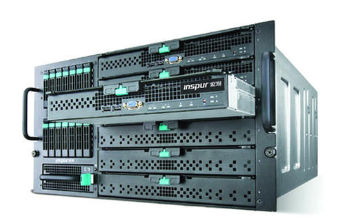
*图：PPT 第 8 页配的服务器实物——"物理机安装"就是把操作系统**直接装到这样一台机器的硬件上**；而学习阶段手上只有一台笔记本/台式机，所以走"虚拟机安装"这条路，用软件在这台电脑里再"造"出一台机器来*

> [!TIP]
> **为什么学习阶段一定要用虚拟机**（PPT 没说、但每个踩过坑的人都懂的三条理由）：① **不破坏本机**——装系统、删软件、改配置随便折腾，坏了删掉重来；② **可以随时"回到过去"**——虚拟机支持快照，装完一个干净的 CentOS 7 先拍一张，之后怎么乱搞都能回滚；③ **本机 Windows 要留着开发**——IDEA、Node、浏览器都在上面，Linux 只是"另一台机器"。
>
> 本篇实测用的 WSL 是**另一种**思路（Windows 内嵌的 Linux 子系统，见下文"本机实测"）：它更轻、启动更快，但没有完整虚拟机那套"装系统 / 挂镜像 / 配网卡"的过程——**课程实验还是要按 PPT 在 VMware 里做**。

## 装 VMware 与"挂载"CentOS 7 镜像（PPT 第 9、11 页）

安装 VMware 这一步 PPT 只写了一句话：

> **虚拟机安装**：直接双击运行资料中的 VMWare 安装程序，根据提示完成安装即可。

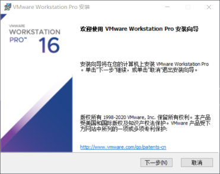
*图：PPT 第 9 页配的安装界面——**VMware Workstation Pro 16** 的安装向导第一步，"下一步 / 取消"。安装过程没有需要特别设置的地方：接受许可、选安装目录（想省 C 盘空间就换到 D 盘）、一路下一步，最后重启一下*

第 11 页是**挂载镜像**（把老师给的 CentOS 7 虚拟机文件"挂"到 VMware 里）：

> 解压 CentOS7 的镜像压缩包到磁盘目录，然后**双击 .vmx 文件**完成挂载，然后**启动服务器（root/1234）**。

三步拆开看：

**① 解压镜像包到磁盘目录**——把资料里的 CentOS7 压缩包解压出来，会看到一个目录（PPT 图里是 `D:\VMimages\CentOS7-1`），里面是一堆虚拟机文件：

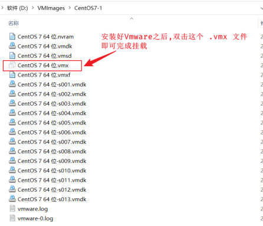
*图：PPT 第 11 页配的解压结果——`CentOS 7 64 位.vmx`（红色箭头指的那个，图标上带着 VMware 的标志）是整台虚拟机的"入口文件"，`.vmdk` 是虚拟硬盘（一台机器可能被切成 s001～s013 好几个）、`.nvram` / `.vmsd` 是状态与快照文件。**这一堆文件都不能删、不能单独移动，要动就整个文件夹一起动***

**② 双击 `.vmx` 完成挂载**——双击之后 Windows 会问"用什么打开"，选 **VMware Workstation**：

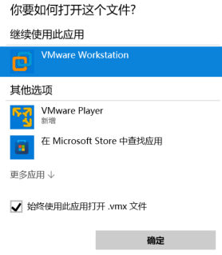
*图：PPT 第 11 页配的"你要如何打开这个文件?"对话框——选 **VMware Workstation** 并勾上"始终使用此应用打开 .vmx 文件"，之后再双击就直接进 VMware 了（第一次没勾的话，每次都要再选一遍）*

**③ 启动服务器**——这台虚拟机就被"挂"进 VMware 的列表里了，点"**开启此虚拟机**"开机：

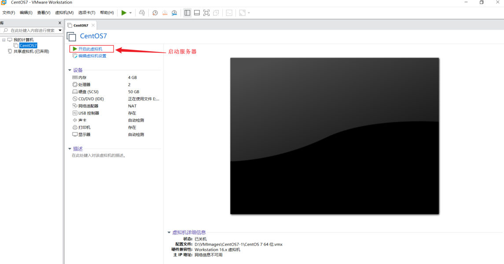
*图：PPT 第 11 页配的 VMware 界面——左侧是这台机器的设备清单（内存 4 GB、处理器 2 个、硬盘 50 GB、**网络适配器 NAT**、CD/DVD 正在使用文件……），右侧中间那个红箭头指向的按钮就是"**开启此虚拟机**"；底部"虚拟机详细信息"里能看到配置文件路径（`.vmx`）和"状态：已关机"*

开机之后要登录：**用户名 `root`，密码 `1234`**（PPT 原文给的）。`root` 是 Linux 的**超级管理员**，相当于 Windows 的 Administrator——后面 [108 篇](/posts/编程学习/javaweb学习笔记/108-linux软件安装/)装软件、[109 篇](/posts/编程学习/javaweb学习笔记/109-项目部署到linux/)部署项目，用的都是这个账号。

## 虚拟机网络配置：NAT 模式与查 IP（PPT 第 10、12 页）

装完系统只是"这台机器能开机了"，PPT 第 10 页紧接着说：

> 安装完毕之后，需要**配置网络**，才可以在 windows 系统上连接虚拟机上的 linux 系统。

为什么非要配网络？因为默认情况下虚拟机可能**没有 IP**——没有 IP，Windows 就没法"够到"它，自然也谈不上后面用 FinalShell 连上去。

第 12 页把配置过程写成了三件事：

> - **虚拟网络编辑器 → NAT 模式 → 子网 IP：设置为 `192.168.100.0`**
> - 查看 IP 地址的命令：**`ip addr`**；如果没有 IP 地址：执行 **`start-ens33.sh`** 脚本，手动激活 **ens33** 网卡
> - 启动/停止/重启 Linux 系统：**图形化界面 / 命令（`init 0`：关闭，`init 6`：重启）**

### ① 在 VMware 里认出虚拟网卡

虚拟网络编辑器藏在 VMware 的菜单里：

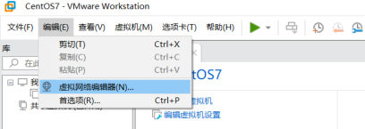
*图：PPT 第 10 页配的位置图——VMware 的菜单栏"**编辑(E) → 虚拟网络编辑器(N)...**"，就是从这里进去改虚拟机用的那张"虚拟网卡"*

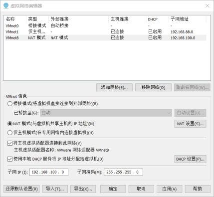
*图：PPT 第 10、12 页配的核心设置界面——上半张表里 **VMnet8** 的类型是"**NAT 模式**"（`VMnet8` 就是 VMware 给 NAT 模式准备的虚拟网卡，`VMnet1` 是仅主机模式，`VMnet0` 是桥接）；下半部分是它的详细设置：勾着 **NAT 模式（用于共享主机的 IP 地址）**，下面的"**子网 IP (I)：192.168.100.0**"和"子网掩码 255.255.255.0"就是 PPT 第 12 页要求改的那一项。改完点"应用 / 确定"*

> [!IMPORTANT]
> **为什么是 NAT 模式、为什么是 `192.168.100.0` 这个网段**：
>
> - **NAT（网络地址转换）**：虚拟机相当于"蹭"主机的网络出去——虚拟机能上网、主机能访问虚拟机，但外面看不进来。用在练习机上最省心：不用管公司/家里的网段是什么、换 WiFi 也不用重配。
> - **`192.168.100.0/24`** 是一个**私有网段**（`192.168.x.x` 都是局域网地址，不会和公网冲突）。课程把它统一成 `192.168.100.0`，原因很实在：**全班同学、所有 PPT 截图、老师演示的 IP 就都是同一串**（后面最终会看到虚拟机拿到 `192.168.100.128` 这样的地址），照着抄不会错。
> - 要远离的两件事：别选"**桥接模式**"（那样虚拟机会直接接进你所在的实际网络、抢路由器的 IP，IP 说变就变）；也别随手把网段改成和自己家路由器一样的（可能和真实网卡撞车）。

### ② 进 Linux 里查 IP

网络配好之后，进虚拟机的桌面/终端执行 PPT 给的那条命令：

```bash
ip addr        # 查看本机所有网卡的 IP 地址（CentOS 7 自带；旧系统里对应的是 ifconfig）
```

`ens33` 是这台 CentOS 7 的**网卡名**（`en` = ethernet 以太网、`s33` 是这块网卡在机器里的编号），输出里会看到它拿到了一个 `192.168.100.x` 的地址。

**如果 `ip addr` 里没有 IP**（`ens33` 那一块看不到 `inet 192.168.100.x`），就按 PPT 说的执行资源包里的脚本，手动把网卡激活：

```bash
./start-ens33.sh       # 手动激活 ens33 网卡（老师给的脚本，通常内部是在启动网卡并让 dhcp 重新取地址）
```

> [!NOTE]
> 课程环境下"没有 IP"最常见的原因就一个：**CentOS 7 的网卡默认没开机自启**，装完之后得手动激活一次。

### ③ 关机和重启

PPT 还顺带给了两个"用命令开关机"的写法：

| 命令 | 作用 | 说明 |
| --- | --- | --- |
| `init 0` | **关机** | 不用去点图形界面的按钮，直接敲命令 |
| `init 6` | **重启** | 改完配置要重启时用 |

图形界面里当然也能点（右上角电源按钮），但**远程连上去之后就只剩命令这条路了**——这两个命令要记住。

## 本机实测：一台真实的 Linux 长什么样（WSL Ubuntu 24.04）

> 本节输出全部来自本机实测：**WSL（Windows Subsystem for Linux）里的 Ubuntu 24.04.3 LTS，内核 6.6.87.2-microsoft-standard-WSL2**。WSL 是"Windows 里内嵌的 Linux"，不是 VMware 那种完整虚拟机，但**命令行行为与虚拟机里的 Linux 完全一致**，用来验证命令足够。

```bash
$ uname -r
6.6.87.2-microsoft-standard-WSL2        # 内核版本

$ cat /etc/os-release                    # 发行版信息
PRETTY_NAME="Ubuntu 24.04.3 LTS"
NAME="Ubuntu"
VERSION="24.04.3 LTS (Noble Numbat)"

$ whoami                                 # 当前登录的用户
dumplingandcake

$ which java nginx mysql vim              # 这四个软件装在哪儿（只回显已安装的）
/usr/bin/vim                             # 只有 vim 装了，java / nginx / mysql 都没有
```

这四条命令正好对上本篇几个知识点：

| 实测的东西 | 说明什么 |
| --- | --- |
| `uname -r` → `6.6.87.2-microsoft-standard-WSL2` | 这就是**内核版**——一台机器只有一个内核，Linux 核心团队维护；后面的"发行版"才是各家厂商的包装 |
| `cat /etc/os-release` → `Ubuntu 24.04.3 LTS` | 这是**发行版**信息：**课程环境是 CentOS 7，本机是 Ubuntu 24.04**，两边的"厂商"不同 |
| `whoami` → `dumplingandcake` | 当前登录的是普通用户 `dumplingandcake`（家目录 `/home/dumplingandcake`）；而课程里用的是**超级管理员 `root`**（家目录 `/root`），权限完全不同 |
| `which java nginx mysql vim` → 只有 `/usr/bin/vim` | 这台机器上**只有 vim**，后面 108 篇要装的 JDK、MySQL、Nginx 一个都没有——正好可以从零演示一遍"软件安装" |

### CentOS 7 与 Ubuntu 24.04 的命令差异表

因为课程环境（CentOS 7）和实测环境（Ubuntu 24.04）是两个不同的发行版，下面这些"**换了个发行版就不一样**"的地方要提前分清：

| 事情 | 课程环境 CentOS 7 | 本机实测 Ubuntu 24.04 |
| --- | --- | --- |
| 装软件（包管理） | **`yum`**（如 `yum install vim`） | `apt`（如 `apt install vim`） |
| 防火墙 | **`firewalld`**（`firewall-cmd`，[108 篇](/posts/编程学习/javaweb学习笔记/108-linux软件安装/)要考） | `ufw` |
| 管理服务 | `systemctl start/stop/status xxx`（[108 篇](/posts/编程学习/javaweb学习笔记/108-linux软件安装/)用得上） | 同样有 `systemctl`（WSL 里默认没开 systemd，情况特殊） |
| `ll` 这个简写 | **能用**（PPT 第 25 页明说了 `ll` 是 `ls -l` 的简写） | **默认没有**，得写 `ls -l`（[107 篇](/posts/编程学习/javaweb学习笔记/107-linux常用命令/)实测里就踩到这一点） |
| 查看网卡 IP | `ip addr`（一样） | `ip addr`（一样） |

其余命令（`cd`、`mkdir`、`cp`、`mv`、`tar`、`find`、`grep`、`vi/vim`……）**两个发行版完全一样**——这部分占了第 19 章的大半，也是 [107 篇](/posts/编程学习/javaweb学习笔记/107-linux常用命令/)的全部内容。

## 远程连接：从 Windows 连上 Linux（PPT 第 13～17 页）

### 为什么需要远程连接（PPT 第 13 页）

第 13 页抛了一个真实场景的问题：

> **公司在北京，服务器可能在上海/天津/香港/海外，该如何进行软件安装/项目部署？**


*图：PPT 第 13 页配的机房照片——服务器躺在**机房**里，人在办公室，中间隔着城市甚至国界。总不可能背着显示器键盘飞过去装软件：所以**能操作到的只有网络**，这就是"远程连接"要解决的问题*

答案就是**远程连接**：服务器在哪儿不重要，只要能通过网络连到它的 **22 端口**，在自己的电脑上敲命令，效果和坐在它面前一模一样。

> [!TIP]
> 这里的"远程连接"和以后工作里的场景是同一件事：测试环境、预发布环境、生产环境，每台机器都在机房里，日常操作（启服务、传 jar、看日志、改配置）**全是在自己的电脑上通过远程连接工具完成的**。所以这套东西不是"课程演示用一下"，是**上班之后的日常工具**。

### SSH 与四种远程连接工具（PPT 第 15 页）

> 常用的 **SSH（Secure Shell，安全外壳协议）**远程连接工具：**Putty、SecureCRT、Xshell、FinalShell** 等。

拆两点：

1. **SSH 是"协议"**（双方约定好的一套通信规则），规定了怎么加密、怎么认证、怎么开一个远程终端。一个 Linux 服务器只要装了 SSH 服务（sshd 默认就开着、监听 22 端口），任何支持 SSH 的客户端都能连它。
2. **Putty / SecureCRT / Xshell / FinalShell 是"客户端软件"**——相当于同一个协议的四个不同"电话机"。它们都是远程连接工具，区别在功能和界面：

| 工具 | 特点 |
| --- | --- |
| Putty | 老牌、极轻量，功能最基础 |
| SecureCRT | 商业软件，功能强、企业里常见 |
| Xshell | 界面友好、Windows 上很流行 |
| **FinalShell** | **国产、免费、带上传下载和服务器监控**——课程用它 |

**课程选 FinalShell 的现实原因**：它自带"**文件上传/下载**"面板（后面 [108 篇](/posts/编程学习/javaweb学习笔记/108-linux软件安装/)要把 JDK、MySQL、Nginx 的安装包传到服务器上，[109 篇](/posts/编程学习/javaweb学习笔记/109-项目部署到linux/)要传打好的 jar 和前端资源——用鼠标拖进去，比命令简单得多）。

### FinalShell 安装（PPT 第 16 页）

> 直接双击运行 FinalShell 的安装程序完成安装即可。

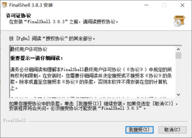
*图：PPT 第 16 页配的安装界面——FinalShell 3.8.3 的安装向导，"最终用户许可协议"这一步（按 PgDn 读完、点"我接受(I)"继续）。同样是一路下一步的普通 Windows 安装，不需要额外配置*

### FinalShell 连接虚拟机（PPT 第 17 页）

装完之后就是**配一个连接**，让它去连我们刚装好的那台 CentOS 7。数据来自网络配置那一步查到的 IP（PPT 里的机器是 `192.168.100.128`）：

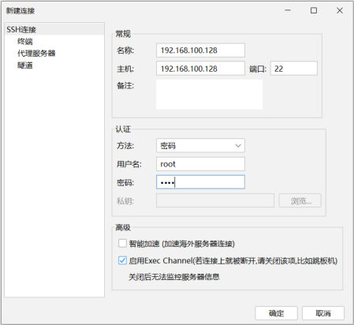
*图：PPT 第 17 页配的"新建连接"对话框——左侧树里选的是 **SSH 连接**（下面还有"终端 / 代理服务器 / 隧道"可展开）；右侧"常规"里 **名称和主机都填虚拟机的 IP `192.168.100.128`**、"端口 **22**"（SSH 的默认端口）；"认证"里方法选**密码**、**用户名 `root`**、**密码**（课程里就是 `1234`）。填完点确定*

配好的连接会出现在连接管理器里，双击就能连上：

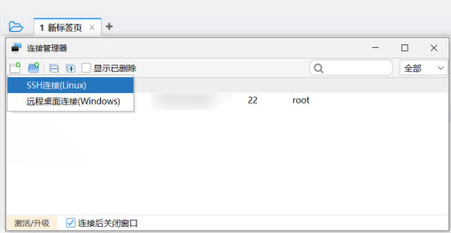
*图：PPT 第 17 页配的连接管理器——列表里躺着配好的连接（`192.168.100.128`、端口 `22`、用户 `root`），右键或双击即可打开一个远程终端；下面还勾着"连接后关闭窗口"。连上之后，**面板里敲的命令 = 在虚拟机里敲的命令**，接下来 [107 篇](/posts/编程学习/javaweb学习笔记/107-linux常用命令/)的所有命令都可以在这里练*

> [!WARNING]
> 连不上时的排查顺序（这三条覆盖了 90% 的情况）：① **虚拟机的 IP 对不对**——进虚拟机执行 `ip addr`，看 `ens33` 有没有 `192.168.100.x`，没 IP 就先激活网卡；② **本机的虚拟网卡在不在**——Windows 的"网络连接"里要有 **VMware Network Adapter VMnet8**，装完 VMware 一般自动就有（对应 PPT 第 10 页那张"将主机虚拟适配器连接到此网络"的勾）；③ **虚拟机开机了没**——VMware 里点"开启此虚拟机"，别停在关机状态。

## Linux 的目录结构（PPT 第 18～20 页）

第 18 页又是那张小节页（**Linux 概述 01**），下面进入第三件事：**目录介绍**。

### Linux 目录 VS Windows 目录（PPT 第 19 页）

> **Linux 系统中的目录特点**：
> - `/` 是所有目录的**顶点**
> - 目录结构像**一颗倒挂的树**

先看 Windows 是怎么组织的：

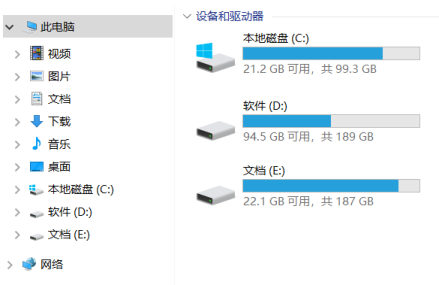
*图：PPT 第 19 页配的 Windows"此电脑"——**本地磁盘 (C:)、软件 (D:)、文档 (E:)** 三个盘各自独立，每个盘下面都是一棵树。Windows 的目录结构是"**多棵树**"，根是盘符（`C:\`、`D:\`）*

再看 Linux：

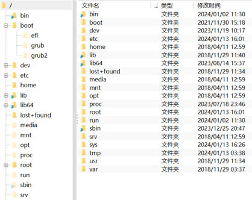
*图：PPT 第 19 页配的 Linux 根目录——**只有一个根 `/`**，下面挂着一排目录（`bin`、`boot`、`dev`、`etc`、`home`、`lib`、`opt`、`root`、`sbin`、`tmp`、`usr`、`var`……），每个目录下面再套子目录。整台机器**只有这一棵树**，所有文件都在这棵树上的某个位置*

| | Windows | Linux |
| --- | --- | --- |
| 有几棵树 | **多棵**——每个盘符（C:、D:、E:）一棵 | **只有一棵** |
| 树的顶点 | 盘符（`C:\`、`D:\`） | **`/`（根目录）**，它是**所有目录的顶点** |
| 盘去哪了 | 就是"根" | **盘被"挂"到树上的某个目录里**（插一块硬盘、U 盘，是把它挂到 `/mnt/usb` 这样的目录下，不在根上多长出一棵树） |
| 路径写法 | `D:\VMimages\CentOS7-1\CentOS 7 64 位.vmx` | `/usr/local/mysql`（分隔符是 `/`，不是 `\`） |

### 12 个目录逐个说（PPT 第 20 页）

PPT 第 20 页把根目录下的 12 个目录逐个标了中文说明（**这张表要背，因为它决定了"东西该放哪"**）：

| 目录 | 放什么 |
| --- | --- |
| **bin** | 存放**二进制可执行文件**（平时敲的 `ls`、`cd`、`cp` 这些命令本体都在这里） |
| **boot** | 存放**系统引导**时使用的各种文件（内核、启动菜单之类，**别乱动**） |
| **dev** | 存放**设备文件**（Linux 里"一切皆文件"，硬盘、键盘也是文件） |
| **etc** | 存放**系统配置文件**（[108 篇](/posts/编程学习/javaweb学习笔记/108-linux软件安装/)要改的 `/etc/profile` 配环境变量就在这儿） |
| **home** | 存放**系统用户的文件**（普通用户的家目录，形如 `/home/用户名`） |
| **lib** | 存放程序运行所需的**共享库和内核模块** |
| **opt** | **额外安装的可选应用程序包**所放置的位置 |
| **root** | **超级用户目录**（root 用户的家目录，注意它就在根下，不在 `/home` 里） |
| **sbin** | 存放二进制可执行文件，**只有 root 用户才能访问**（`s` = super，里面是给管理员用的命令） |
| **tmp** | 存放**临时文件**（重启可能被清掉，试验用的东西扔这儿） |
| **usr** | 存放**系统应用程序**（`/usr/local` 是"后来自己装的软件"的地盘——[108 篇](/posts/编程学习/javaweb学习笔记/108-linux软件安装/)装的 JDK、MySQL、Nginx 全在 `/usr/local` 下） |
| **var** | 存放**运行时需要改变数据的文件**，例如**日志文件**（项目跑起来之后日志一般落在 `/var/log` 一带） |

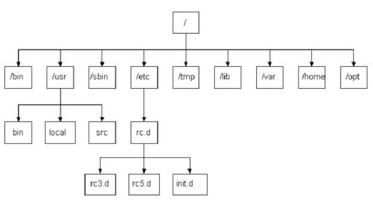
*图：PPT 第 20 页配的目录结构图——最上面是根 `/`，一层层往下挂：`/usr` 下有 `bin`、`local`、`src`（自己装的软件在 `local`、源码包在 `src`），`/etc` 下有 `rc.d` → `rc3.d` / `rc5.d` / `init.d`（系统服务和自启动脚本），左边一列还有 `bin`、`sbin`、`tmp`、`lib`、`var`、`home`、`opt`。**记住"倒挂的树"这个形状**：越靠上越"系统"，越往下越"具体某个软件自己的东西"*

目录为什么重要？因为后面每一篇都在往这些目录里放东西——**装软件放 `/usr/local`、环境变量改 `/etc/profile`、日志在 `/var/log` 一带、自己的试验放 `/tmp` 或家目录**。位置错了轻则找不到文件，重则覆盖系统的东西。

## 绝对路径与相对路径（PPT 第 21 页）

第 21 页是一个问答：

> **Linux 系统中的路径 `/itheima` 与 `itheima` 有区别吗？**
> **有。**
> - `/itheima` 是**绝对路径**，是指**根目录 `/` 下的 itheima 目录**
> - `itheima` 是**相对路径**，是指**当前目录下的 itheima 目录**

用一句话概括规则：

| 写法 | 名字 | 从哪儿开始找 | 举例（假设当前在 `/home/dumplingandcake`） |
| --- | --- | --- | --- |
| 以 **`/` 开头** | **绝对路径** | 从**根目录 `/`** 开始，一层层往下 | `/itheima` → 找 `/itheima`；`/usr/local/mysql` → 找根下 `usr` 里的 `local` 里的 `mysql` |
| **不以 `/` 开头** | **相对路径** | 从**当前目录**开始 | `itheima` → 找 `/home/dumplingandcake/itheima` |

> [!WARNING]
> 这是初学者最容易吃亏的地方：**同一条命令在 A 目录敲和在 B 目录敲，结果可能完全不同**——因为相对路径是"相对当前目录"的。想写"不管在哪儿都指同一个地方"的路径，就用绝对路径（以 `/` 开头）；[107 篇](/posts/编程学习/javaweb学习笔记/107-linux常用命令/)的 `find` / `grep` 举例里会出现 `find . -name "*.log"`，那个 `.` 也是路径的一种写法，意思是"当前目录"。

## 小结

| 问题 | 答案 |
| --- | --- |
| 后端为什么要学 Linux？ | **服务器上跑的就是它**——软件环境（MySQL、Redis、MQ）+ 项目部署（后端 jar、前端静态资源）都在 Linux 上，写代码可以挑系统、部署项目没得挑 |
| 操作系统怎么分类？ | 桌面（Windows / Mac OS / Linux）、移动设备（Android / IOS / HarmonyOS）、服务器（Unix / Linux / Windows Server）；**Linux 在服务器里"安全、稳定、免费、占有率高"** |
| 内核版和发行版差在哪？ | **内核版**由 Linux 核心团队开发维护、免费开源、负责控制硬件；**发行版**是各厂商在内核之上扩展出来的，有免费也有收费 |
| 6 个发行版？ | Ubuntu（桌面为主，免费）、RedHat（企业，收费）、**CentOS（RedHat 社区版，免费——课程用它）**、Fedora、openSUSE、红旗 Linux |
| 两种安装方式？ | **物理机安装**（直接装到服务器硬件上）和**虚拟机安装**（用虚拟机软件模拟出一台完整计算机）；虚拟机软件：**VMware WorkStation**、VirtualBox、VMLite WorkStation |
| 装虚拟机的三步？ | ① 双击安装 **VMware** ② 解压 CentOS7 镜像包、**双击 `.vmx`** 挂载 ③ **启动服务器**（登录 `root` / `1234`） |
| 网络要怎么配？ | VMware 的"**编辑 → 虚拟网络编辑器**"里选 **VMnet8 的 NAT 模式**，**子网 IP 填 `192.168.100.0`**；配完才能从 Windows 连到 Linux |
| 怎么查 IP / 没 IP 怎么办？ | 坐进虚拟机执行 **`ip addr`**，看 `ens33` 网卡的 `inet` 地址；**没有 IP 就执行 `start-ens33.sh` 手动激活 ens33 网卡** |
| 关机、重启的命令？ | **`init 0`** 关机、**`init 6`** 重启（图形界面也能点，但远程连上之后只能靠命令） |
| 为什么要远程连接？ | 服务器在机房（可能在上海、香港、海外），人不可能过去，只能通过网络连它的 **22 端口**操作 |
| SSH 与工具？ | **SSH = Secure Shell，安全外壳协议**；工具：Putty、SecureCRT、Xshell、**FinalShell**（国产免费、带上传下载，课程用它） |
| FinalShell 怎么连？ | 新建 **SSH 连接**：名称/主机填**虚拟机的 IP**（如 `192.168.100.128`）、端口 **22**、用户名 **`root`**、密码（课程里 `1234`）——主机就是 IP，端口是 SSH 的默认端口 |
| Linux 目录的特点？ | **`/` 是所有目录的顶点**，结构像**倒挂的树**；Windows 是"多棵（每个盘一棵）树"，Linux **只有一棵** |
| 12 个目录？ | `bin`（二进制可执行文件）、`boot`（系统引导）、`dev`（设备文件）、**`etc`（系统配置文件）**、`home`（用户文件）、`lib`（共享库）、`opt`（额外可选应用）、`root`（超级用户目录）、`sbin`（二进制可执行文件，只有 root 能访问）、**`tmp`（临时文件）**、**`usr`（系统应用程序，`/usr/local` 装自己下的软件）**、**`var`（运行时改变的数据，如日志）** |
| 绝对路径与相对路径？ | **以 `/` 开头的是绝对路径**（从根开始找），**不以 `/` 开头的是相对路径**（从当前目录开始找）：`/itheima` ≠ `itheima` |
| 本机实测的环境与结论？ | 本机是 **WSL Ubuntu 24.04.3 LTS**（内核 `6.6.87.2-microsoft-standard-WSL2`），`whoami` 是 `dumplingandcake`、`which java nginx mysql vim` 只有 `/usr/bin/vim`；**课程环境是 CentOS 7，包管理用 `yum`、防火墙用 `firewalld`，别把 Ubuntu 的 `apt` 抄进去** |

## 相关

- [上一篇：前端打包部署](/posts/编程学习/javaweb学习笔记/105-前端打包部署/)
- [下一篇：Linux常用命令](/posts/编程学习/javaweb学习笔记/107-linux常用命令/)

## 练习题

### 一、知识回顾（读完直接做下面的实践题）

1. **为什么后端要学 Linux**：服务器上跑的就是 Linux——**软件环境（MySQL、Redis、MQ）+ 项目部署（后端 jar、前端静态资源）**都在这上面；写代码可以挑系统，部署项目没得挑
2. **操作系统分类**：桌面（Windows / Mac OS / Linux）、移动设备（Android / IOS / HarmonyOS）、服务器（Unix / Linux / Windows Server）；Linux 在服务器场景里是"**安全、稳定、免费、占有率高**"
3. **内核版 vs 发行版**：内核版由 **Linux 核心团队**开发维护、免费开源、**负责控制硬件**；发行版基于内核版扩展、由**各 Linux 厂商**开发维护，有收费也有免费。常见发行版 6 个——Ubuntu（桌面应用为主，免费）、RedHat（面向企业，收费）、**CentOS（RedHat 的社区版，免费——课程用它）**、Fedora（功能完备、快速更新）、openSUSE（对个人免费、界面华丽）、红旗 Linux
4. **两种安装方式**：**物理机安装**（直接把操作系统装到服务器硬件上）和**虚拟机安装**（通过虚拟机软件安装）。**虚拟机**指通过软件模拟的具有完整硬件系统功能、运行在完全隔离环境中的完整计算机系统；三款软件是 **VMWare WorkStation / VirtualBox / VMLite WorkStation**
5. **装虚拟机三步**：① 双击运行 **VMware** 安装程序；② 解压 CentOS7 镜像包到磁盘目录、**双击 `.vmx` 文件**完成挂载；③ **启动服务器**，登录 **root / 1234**
6. **网络配置**：VMware 菜单"编辑 → **虚拟网络编辑器**"→ 选 **VMnet8 的 NAT 模式** → **子网 IP 设为 `192.168.100.0`**；配完才能在 Windows 上连虚拟机里的 Linux
7. **查 IP 与激活网卡**：**`ip addr`** 查看 IP 地址；**没有 IP 就执行 `start-ens33.sh`** 手动激活 **ens33** 网卡。另外 **`init 0` 关机、`init 6` 重启**
8. **远程连接**：服务器在机房（可能在上海/天津/香港/海外），人过不去，只能通过网络连它。**SSH = Secure Shell，安全外壳协议**；常用工具 **Putty、SecureCRT、Xshell、FinalShell**；FinalShell 的连接要填 **主机（虚拟机 IP）、端口 22、用户名 root、密码**
9. **目录结构与路径**：**`/` 是所有目录的顶点**，结构像**倒挂的树**（Windows 是多棵树）；12 个目录见上表（重点：`etc` 配置文件、`usr` 系统应用程序/`/usr/local`、`var` 日志、`tmp` 临时、`root` 超级用户目录、`sbin` 只有 root 能访问）；**以 `/` 开头是绝对路径，不以 `/` 开头是相对路径**
10. **本机的实测环境**：**WSL Ubuntu 24.04.3 LTS**（内核 `6.6.87.2-microsoft-standard-WSL2`），`whoami` = `dumplingandcake`，`which java nginx mysql vim` 只回显 `/usr/bin/vim`（说明这台机器上 JDK/MySQL/Nginx 都没装，正好对应本章后面的软件安装）；**课程环境是 CentOS 7（`yum` / `firewalld`），本机是 Ubuntu（`apt` / `ufw`），命令别混**

### 二、裸写题

- [ ] **2-1 先认清这个系统：它属于哪一类、又是哪个版本**
  需求：两问一起做。**第一问（分类）**：判断下面三句话分别在说哪个场景的操作系统，并各补一个"这个场景里的代表系统 + 它最突出的特点"：① "用户数量最多，办公和家庭最常见"；② "基于 Linux、开源，主要用在智能手机、平板、智能电视"；③ "安全、稳定、免费、占有率高"；再说出第③句里的那个系统"**我们为什么要专门学它**"的两条理由。**第二问（版本）**：用一张两列表把"**内核版**"和"**发行版**"比清楚——谁开发维护、收不收费、各自负责干什么；然后回答：① 课程为什么选 CentOS？② Ubuntu 属于哪一类？③ "由厂商开发维护、基于内核版进行扩展"说的是哪一个？
  素材：PPT 第 4 页那张三行九列的分类表；PPT 第 7 页的六款发行版（Ubuntu、RedHat、CentOS、Fedora、openSUSE、红旗 Linux）。

  > [!TIP]- 提示（先自己想，实在想不出再点开）
  > **一级 · 思路**：第一问先把"桌面 / 移动设备 / 服务器"三行认出来，再想后端工程师真正要打交道的是哪一行；第二问想想"发动机与整车"的关系——只有一套发动机（核心团队维护），但各家厂商拿它造出不同的车（发行版）
  > **二级 · 方法**：第一问——桌面行写 **Windows / Mac OS / Linux**，移动设备行 **Android / IOS / HarmonyOS**，服务器行 **Unix / Linux / Windows Server**；"为什么要学"的两条理由是**服务器上跑的就是它**：软件环境（mysql、redis、MQ）+ 项目部署。第二问——内核版 = **Linux 核心团队**开发维护、**免费开源**、**负责控制硬件**；发行版 = 基于内核版扩展、**各 Linux 厂商**开发维护、**有收费也有免费**；CentOS 是 **RedHat 的社区版、免费**，所以课程用它
  > **三级 · 骨架**：分类：① 桌面 `____` ② 移动设备 `____` ③ 服务器 `____` ＋ 理由 `____`、`____`；版本：内核版（维护 `____`、费用 `____`、职责 `____`）/ 发行版（维护 `____`、费用 `____`）

  > [!TIP]- 参考答案（做完再点开）
  > ```
  > 【第一问：操作系统分类】
  > ① 桌面操作系统 —— Windows（用户数量最多）；同场景还有 Mac OS（操作体验好、
  >    办公人士首选）、Linux（用户数量少）。
  > ② 移动设备操作系统 —— Android（基于 Linux、开源，主要用于智能手机、平板、
  >    智能电视）；同场景还有 IOS（苹果开发、不开源）、HarmonyOS（华为开发、开源）。
  > ③ 服务器操作系统 —— Linux（安全、稳定、免费、占有率高）；同场景还有
  >    Unix（安全、稳定、付费）、Windows Server（付费、占有率低）。
  >
  >    为什么要专门学 Linux（PPT 第 4 页右下角那两行）：
  >      · 软件环境：MySQL、Redis、MQ 这些中间件都装在 Linux 服务器上、在它上面跑；
  >      · 项目部署：后端 SpringBoot 工程打的 jar、前端打包出来的静态资源，
  >        最终都部署到 Linux 服务器上。
  >    一句话：写代码可以挑系统，部署项目没得挑。
  >
  > 【第二问：内核版与发行版】
  >                内核版（Kernel）            发行版（Distribution）
  > 谁开发维护  Linux 核心团队             各个 Linux 厂商
  > 收不收费    免费、开源                 有收费版本也有免费版本
  > 干什么      负责控制硬件               基于 Linux 内核版进行扩展
  >
  > ① 课程选 CentOS 因为它是 RedHat 的社区版：
  >    · 和收费的企业版 RedHat 同源（企业里真在用它）；
  >    · 自己免费，拿来教学不用花钱。
  > ② Ubuntu 属于发行版（以桌面应用为主，免费）。
  > ③ "由厂商开发维护、基于内核版扩展"说的是发行版。
  >
  >    顺便记一下课程环境与实测环境的差别：
  >      课程用的是 CentOS 7 —— 包管理 yum、防火墙 firewalld；
  >      本机实测环境是 Ubuntu 24.04 —— 包管理 apt、防火墙 ufw。
  >      命令（ls/cd/cp/tar/find/grep…）两边一样，包管理与防火墙命令别混。
  > ```
  > 检查点：① 三行的系统别串行（Android 属于移动设备、Linux 属于服务器）；② 能说清"服务器上跑的就是 Linux"；③ 内核版是"核心团队 + 控制硬件"、发行版是"厂商 + 扩展"，并知道 CentOS = RedHat 社区版、免费；④ 能说出 CentOS 与 Ubuntu 至少两处命令差异（`yum` vs `apt`、`firewalld` vs `ufw`）。

- [ ] **2-2 在一台 Windows 电脑上把 CentOS 7 跑起来**
  需求：手上只有一台装着 Windows 的电脑，也拿到了老师给的 CentOS7 虚拟机文件（一个压缩包）。请写出**从"什么都没有"到"看到一个能登录的 Linux"**的完整步骤：① 装什么软件；② 压缩包怎么用；③ 哪个文件是"入口"、怎么把它挂进去；④ 开机之后用什么账号密码登录；⑤ 顺手说出虚拟机的定义（用 PPT 的原话）和"为什么学习阶段宁愿用虚拟机也不用物理机"的两条理由。
  素材：PPT 第 8、9、11 页；虚拟机软件三款 VMWare WorkStation / VirtualBox / VMLite WorkStation；登录账号 `root`、密码 `1234`。

  > [!TIP]- 提示（先自己想，实在想不出再点开）
  > **一级 · 思路**：三件事——**先有"能跑虚拟机的软件"**、**再把机器文件挂进去**、**最后开机登录**。第二步的入口不是 `.vmdk`（那是虚拟硬盘），而是图标带 VMware 标志的那个文件
  > **二级 · 方法**：装 **VMware WorkStation**（双击安装程序一路下一步）；把 CentOS7 镜像压缩包**解压到磁盘目录**，里面的 **`.vmx`** 文件就是入口——**双击它**（选 VMware Workstation 打开、勾"始终使用此应用"）完成**挂载**；然后在 VMware 里点"**开启此虚拟机**"，用 **root / 1234** 登录。虚拟机定义：通过软件模拟的具有完整硬件系统功能、运行在完全隔离环境中的完整计算机系统
  > **三级 · 骨架**：① 装 `____`；② 解压镜像包到 `____`；③ 双击 `____` 完成挂载；④ 点 `____`，用 `____` / `____` 登录；⑤ 定义：用软件模拟的 `____`、运行在 `____` 环境中的完整计算机系统；理由：`____`、`____`

  > [!TIP]- 参考答案（做完再点开）
  > ```
  > ① 装虚拟机软件：VMware WorkStation（双击安装程序，按提示完成安装即可）
  >    —— 课程资料里给的就是它；另两款是 VirtualBox、VMLite WorkStation。
  >
  > ② 解压 CentOS7 的镜像压缩包到磁盘目录（比如 D:\VMimages\CentOS7-1），
  >    解压出来是一堆文件：CentOS 7 64 位.vmx、.vmdk（虚拟硬盘，可能有 s001~s013）、
  >    .nvram、.vmsd …
  >    注意：这一堆文件不能单独删、不能单独移动，要动就整个文件夹一起动。
  >
  > ③ 入口是 CentOS 7 64 位.vmx，双击它 → 弹出"你要如何打开这个文件?"→
  >    选 VMware Workstation（勾"始终使用此应用打开 .vmx 文件"）→ 完成挂载，
  >    这台机器就出现在 VMware 的列表里了。
  >
  > ④ 在 VMware 里点"开启此虚拟机"启动；登录账号 root，密码 1234。
  >    root 是 Linux 的超级管理员（相当于 Windows 的 Administrator）；
  >    后面装软件、部署项目都用这个账号。
  >
  > ⑤ 虚拟机的定义（PPT 第 8 页原话）：
  >    指通过软件模拟的具有完整硬件系统功能、运行在完全隔离环境中的完整计算机系统。
  >
  >    学习阶段用虚拟机（而不是物理机）的两条理由：
  >    · 不破坏本机：装系统、删软件、改配置随便折腾，坏了删掉重来；
  >    · 可以随时回到过去：支持快照，装完干净的 CentOS 7 先拍一张，之后能回滚；
  >    （第三条：本机 Windows 要留着开发——IDEA、Node、浏览器都在上面。）
  > ```
  > 检查点：① 顺序是"装 VMware → 解压 → 双击 .vmx → 开启虚拟机"；② 入口写的是 **`.vmx`** 而不是 `.vmdk`；③ 登录写 **root / 1234**；④ 虚拟机定义能说出"软件模拟 + 完整硬件功能 + 完全隔离环境"；⑤ 理由里至少有"不破坏本机 / 可快照回滚"中的一条。

- [ ] **2-3 配好网络、查到 IP、远程连上去**
  需求：CentOS 7 的虚拟机已经装好了，现在要从 Windows 上用 FinalShell 连过去，但直接连是连不上的。请按顺序写出全过程：① 在 VMware 里把网络配成什么样（菜单怎么走、选哪个模式、子网 IP 填什么）；② 进虚拟机用什么命令查 IP、网卡名是什么、**如果没查到 IP 该怎么办**；③ 在 FinalShell 里新建连接时"名称/主机/端口/用户名/密码"分别填什么；④ 最后说出在 FinalShell 里敲命令和在虚拟机里敲命令有没有区别，为什么。
  素材：PPT 第 10、12、17 页；虚拟机里查到的 IP 是 `192.168.100.128`；SSH 默认端口 22；登录用户 root。

  > [!TIP]- 提示（先自己想，实在想不出再点开）
  > **一级 · 思路**：四步是"**在 VMware 里给虚拟机配一张网卡** → **在 Linux 里确认这张网卡拿到了地址** → **在 Windows 上让 FinalShell 拿着这个地址连过去** → **连上之后就是黑窗口敲命令**"
  > **二级 · 方法**：菜单"**编辑 → 虚拟网络编辑器**"→ 选 **VMnet8 的 NAT 模式** → 子网 IP 填 **`192.168.100.0`**；进虚拟机执行 **`ip addr`** 看网卡 **ens33** 的 `inet` 地址，**没有 IP 就执行 `start-ens33.sh`** 手动激活 ens33 网卡；FinalShell 新建 **SSH 连接**，主机填 IP、端口 **22**、用户名 **root**、密码（`1234`）；连上后敲命令没有区别，因为**远程连接就是开了一个到服务器的终端**，命令是由对面那台 Linux 执行的
  > **三级 · 骨架**：① `____` → `____` → 子网 IP `____`；② `____` 看 `____` 网卡，没 IP 就 `____`；③ 主机 `____`、端口 `____`、用户名 `____`；④ 没区别，因为命令在 `____` 上执行

  > [!TIP]- 参考答案（做完再点开）
  > ```
  > ① 配置虚拟网卡（VMware 里）：
  >    VMware 菜单栏「编辑(E) → 虚拟网络编辑器(N)...」→ 选中 VMnet8 →
  >    模式选「NAT 模式（用于共享主机的 IP 地址）」→
  >    子网 IP (I) 填 192.168.100.0，子网掩码 255.255.255.0 → 应用 / 确定。
  >    （为什么用 NAT：虚拟机通过主机上网、主机能访问虚拟机，外面看不进来；
  >      192.168.100.0 是私有网段，课程统一用这个，截图里的 IP 也都是这个网段。）
  >
  > ② 查 IP（在虚拟机的终端里执行）：
  >    ip addr
  >    看 ens33 这块网卡下面的 inet 地址（比如 192.168.100.128）。
  >    如果 ens33 下没有 inet 地址（没查到 IP）：
  >        ./start-ens33.sh        # 手动激活 ens33 网卡，然后再 ip addr 确认一次
  >
  > ③ FinalShell（Windows 上）新建连接：
  >    左侧选「SSH 连接」；
  >    常规 → 名称：192.168.100.128（和主机一致即可）
  >           主机：192.168.100.128     ← 填虚拟机的 IP
  >           端口：22                  ← SSH 的默认端口
  >    认证 → 方法：密码
  >           用户名：root
  >           密码：（课程里是 1234）
  >    确定后双击列表里的连接即可。
  >
  > ④ 在 FinalShell 里敲命令和坐在虚拟机前敲命令没有区别：
  >    远程连接只是把虚拟机的一个终端"搬"到了你的 Windows 上，
  >    命令真正执行的地方还是那台 Linux（所以目录、文件、权限全都是它的）。
  > ```
  > 检查点：① 选的是 **NAT 模式**、子网 IP 是 **`192.168.100.0`**（不是随便一个网段）；② 查 IP 用 **`ip addr`**、没 IP 用 **`start-ens33.sh`** 激活 **ens33**；③ 端口写 **22**、用户名 **root**、主机填 **虚拟机的 IP**；④ 能解释"远程连的其实是同一台机器"。

- [ ] **2-4 一个路径到底是绝对路径还是相对路径**
  需求：判断下面四条路径分别是绝对路径还是相对路径，并说出它到底指向哪里（假设当前用户在 `/home/dumplingandcake`）：① `/usr/local`；② `itcast`；③ `/etc/profile`；④ `../itheima`。再回答两个附加问题：Linux 的目录结构和 Windows 有什么根本区别（谁是多棵树、谁是倒挂的树）？下面这些"东西"该放在哪个目录——**系统配置文件**、**自己下载安装的软件**、**日志文件**、**临时试验文件**、**root 用户的家目录**？
  素材：PPT 第 19、20、21 页；12 个目录表。

  > [!TIP]- 提示（先自己想，实在想不出再点开）
  > **一级 · 思路**：只看一件事——**开头有没有 `/`**。有就是从根开始找（绝对），没有就是从当前目录开始找（相对）。至于"该放哪"，靠的是每个目录的职责分工
  > **二级 · 方法**：`/usr/local`、`/etc/profile` 以 `/` 开头是**绝对路径**；`itcast` 不以 `/` 开头是**相对路径**（= 当前目录下的 itcast）；`../itheima` 也是相对路径（`..` 是上一级目录）。放东西：配置文件 → **`etc`**，自己装的软件 → **`/usr/local`**（`usr` 是系统应用程序目录），日志 → **`var`**（运行时改变的数据），临时文件 → **`tmp`**，root 的家目录 → **`/root`**
  > **三级 · 骨架**：① 绝对，指向 `____`；② 相对，指向 `____`；③ 绝对，指向 `____`；④ 相对，指向 `____` 的上一级目录里的 `____`；Linux 只有 `____` 棵树、顶点是 `____`，Windows 是 `____` 棵树；落点：配置 `____` / 软件 `____` / 日志 `____` / 临时 `____` / root 家目录 `____`

  > [!TIP]- 参考答案（做完再点开）
  > ```
  > 四条路径（当前在 /home/dumplingandcake）：
  > ① /usr/local      → 绝对路径（以 / 开头，从根目录开始找）：根下 usr 里的 local 目录
  > ② itcast          → 相对路径：当前目录下的 itcast，也就是
  >                     /home/dumplingandcake/itcast
  > ③ /etc/profile    → 绝对路径：根下 etc 里的 profile 文件（系统配置文件）
  > ④ ../itheima      → 相对路径：当前目录的上一级目录里的 itheima，也就是
  >                     /home/itheima（.. 表示上一级目录）
  >
  > 目录结构的根本区别：
  >   · Linux 只有一棵树，/ 是所有目录的顶点，结构像一颗倒挂的树；
  >   · Windows 是多棵树，每个盘符（C:、D:、E:）各是一棵树，盘符就是"根"。
  >   · 在 Linux 里，"盘"是被挂到树上某个目录里的，不会在根上多长出一棵树。
  >
  > 东西该放哪：
  >   系统配置文件      → /etc        （比如 /etc/profile 配环境变量）
  >   自己下载安装的软件 → /usr/local  （usr 是系统应用程序目录，local 是"后来自己装的"）
  >   日志文件          → /var        （存放运行时需要改变数据的文件，例如日志）
  >   临时试验文件      → /tmp        （存放临时文件）
  >   root 用户的家目录  → /root       （超级用户目录，就在根下，不在 /home 里）
  > ```
  > 检查点：① 判断标准只有"开头有没有 `/`"；② 相对路径要说出"相对于当前目录"的结果；③ 能说出"Linux 一棵树 / Windows 多棵树"；④ 五个落点全对（尤其 `/usr/local` 和 `/var`）。

### 三、综合题

- [ ] **3-1 写一份"从一台 Windows 电脑到远程操作 CentOS 7"的清单**
  需求：假设你现在什么都没装，只有一台 Windows 电脑和老师给的资料包（里面有 VMware 安装程序、CentOS7 镜像压缩包、FinalShell 安装程序）。请写出一份**可以照着做的清单**，把下面每一站都写清"做什么、得到什么结果、怎么确认成功"：

  1. **认清环境**：这一章为什么必须学 Linux（写两条理由）
  2. **装虚拟机软件**：装哪个软件、怎么装
  3. **挂载并启动 CentOS 7**：压缩包怎么处理、哪个文件是入口、怎么开机、用什么账号登录
  4. **配网络**：在 VMware 里改哪一项（模式 + 子网 IP 写成什么），为什么必须是这个网段
  5. **在 Linux 里确认 IP**：用什么命令看哪个网卡，如果没看到 IP 怎么办
  6. **从 Windows 远程连上去**：用什么工具、连接里四项信息分别填什么、怎么判断连上了
  7. **收尾一层**：连上之后，你打算把"自己下载的软件"和"临时试验文件"分别放在哪个目录？为什么（各说一句职责）？
  8. **自查**：把清单和 PPT 第 12、17 页对一遍，看有没有漏项

  > [!TIP]- 提示（先自己想，实在想不出再点开）
  > **一级 · 思路**：整条链路是**本机（Windows）→ VMware 软件 → 虚拟机（CentOS 7）→ 网络（同一 NAT 网段）→ 远程客户端（FinalShell）**；每一站都问自己"东西在哪儿、怎么确认它在正常工作"
  > **二级 · 方法**：VMware 双击安装；CentOS7 压缩包解压后**双击 `.vmx`** 挂载、**开启此虚拟机**、`root`/`1234` 登录；虚拟网络编辑器里 **VMnet8 + NAT 模式 + 子网 IP 192.168.100.0**；`ip addr` 看 **ens33**，没 IP 就 `start-ens33.sh`；FinalShell 新建 **SSH 连接**（主机 = 虚拟机 IP、端口 **22**、用户名 **root**、密码 `1234`）；自己装的软件放 **`/usr/local`**，临时的放 **`/tmp`**
  > **三级 · 骨架**：清单七段——① 理由（`____`、`____`）② 装 `____` ③ 双击 `____` 挂载 + 开启 + 登录 `____`/`____` ④ `____` 模式 + 子网 IP `____` ⑤ `____` 看 `____`（没有就 `____`）⑥ 工具 `____`：主机 `____`、端口 `____`、用户 `____` ⑦ 软件 `____`、临时 `____`

  > [!TIP]- 参考答案（做完再点开）
  > ```
  > 清单：从一台 Windows 电脑到远程操作 CentOS 7
  >
  > 【1】认清环境——为什么必须学 Linux
  >   · 服务器上跑的就是 Linux：软件环境（MySQL、Redis、MQ）都装在上面；
  >   · 项目部署：后端 jar、前端打包出来的静态资源最终都部署到 Linux 服务器。
  >   · 一句话：写代码可以挑系统，部署项目没得挑。
  >
  > 【2】装虚拟机软件（PPT 第 9 页）
  >   · 装的是 VMware WorkStation：双击资料里的安装程序 → 接受许可 → 选安装目录
  >     （想省 C 盘空间就换盘）→ 一路下一步，完成后重启。
  >   · 确认成功：开始菜单/桌面能找到 VMware Workstation，打开能看到"库"的界面。
  >
  > 【3】挂载并启动 CentOS 7（PPT 第 11 页）
  >   · 解压 CentOS7 镜像压缩包到磁盘目录（如 D:\VMimages\CentOS7-1）；
  >   · 目录里的 CentOS 7 64 位.vmx 是入口文件，双击它 →（选 VMware Workstation
  >     打开、勾"始终使用此应用"）→ 完成挂载；
  >   · 在 VMware 里点「开启此虚拟机」，启动后登录：账号 root，密码 1234。
  >   · 确认成功：屏幕上是 CentOS 7 的登录界面/桌面，能进去。
  >   · 注意：那一堆 .vmx/.vmdk 文件不能单独删、单独移动，要动整个文件夹一起动。
  >
  > 【4】配置网络（PPT 第 10、12 页）
  >   · 位置：VMware 菜单「编辑 → 虚拟网络编辑器」；
  >   · 选中 VMnet8 → 模式勾「NAT 模式」→ 子网 IP 填 192.168.100.0
  >     （子网掩码 255.255.255.0）→ 应用 / 确定。
  >   · 为什么必须是 NAT + 192.168.100.0：
  >     NAT = 虚拟机通过主机上网、主机能访问虚拟机，外面看不进来，换网络也不用重配；
  >     192.168.100.0 是私有网段，课程统一用它，所有演示和截图里的 IP 都是这个网段。
  >
  > 【5】在 Linux 里确认 IP（PPT 第 12 页）
  >   · 命令：ip addr    → 看 ens33 网卡下的 inet 地址（如 192.168.100.128）；
  >   · 如果没有 IP：执行 ./start-ens33.sh 手动激活 ens33 网卡，再 ip addr 复查；
  >   · 顺带记：init 0 关机、init 6 重启。
  >
  > 【6】远程连上去（PPT 第 15～17 页）
  >   · 工具：FinalShell（SSH 协议，默认端口 22）；
  >   · 新建「SSH 连接」：主机 = 虚拟机 IP（192.168.100.128）、端口 22、
  >     用户名 root、密码 1234；名称可以和主机写成一样，方便认；
  >   · 确认成功：连接列表里双击后出现一个远程终端，能敲命令且提示符显示
  >     [root@localhost ~]# 之类的信息（连不上先查：虚拟机 IP、VMnet8 这张
  >     虚拟网卡在不在、虚拟机开没开机）。
  >
  > 【7】收尾——东西放哪
  >   · 自己下载安装的软件 → /usr/local（usr 是系统应用程序目录，
  >     local 是"后来自己装的"地方；后面 JDK、MySQL、Nginx 都装这儿）；
  >   · 临时试验文件 → /tmp（存放临时文件）。
  >
  > 【8】自查（对 PPT 第 12、17 页）
  >   网络：NAT 模式 + 子网 IP 192.168.100.0 + ip addr + start-ens33.sh + init 0/6 ✔
  >   远程：SSH + FinalShell + 主机/22/root/密码 ✔
  >   目录：/usr/local 放自己装的软件、/tmp 放临时文件 ✔
  > ```
  > 检查点：① 清单每一步都写了"在哪儿做、怎么确认"；② 网络那一步写的是 VMware 的**虚拟网络编辑器 + NAT + 192.168.100.0**（不是去 Linux 里改文件）；③ 登录信息（`root`/`1234`）和连接信息（端口 `22`）没写错；④ 知道没有 IP 时用 `start-ens33.sh`；⑤ 目录落点写对（`/usr/local`、`/tmp`）。
