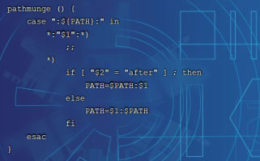
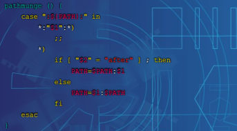
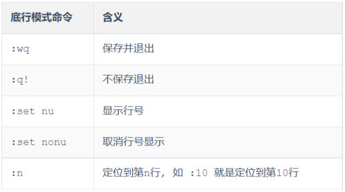

[106 篇](/posts/编程学习/javaweb学习笔记/106-linux概述与系统安装/)把 CentOS 7 装进了 VMware、配好了 NAT 网络、用 FinalShell 从 Windows 连了上去——远程终端一开，迎面就是一个**黑窗口加一个提示符**，接下来所有事情都得靠**命令**跟这台机器说话。

这一篇覆盖第 19 章 PPT 第 22～51 页，把课程里列的**六组常用命令**逐个讲透：**目录操作 → 文件查看 → 拷贝移动 → 打包压缩 → 文本编辑 → 查找**。每组都按 PPT 的四要素来——**作用、语法、选项、举例**，并且在每条命令后面贴上**本机实测的真实输出**（原文来自 `lab/linux-cmd-test-output.txt`）。

> [!IMPORTANT]
> **环境提醒（很重要）**：本机实测环境是 **WSL 里的 Ubuntu 24.04.3 LTS**（内核 `6.6.87.2-microsoft-standard-WSL2`，用户 `dumplingandcake`），而**课程环境是 CentOS 7**（用户 `root`）。两边在**这一篇的命令上完全一致**（`ls/cd/mkdir/rm/cat/head/tail/cp/mv/tar/find/grep/vi/vim` 都一样），真正会分叉的是**包管理和防火墙**（[106 篇](/posts/编程学习/javaweb学习笔记/106-linux概述与系统安装/)那张差异表）：CentOS 用 `yum` + `firewalld`，Ubuntu 用 `apt` + `ufw`。所以下文的实测输出只当"命令行为长什么样"的证据看，**发到服务器上的命令照 CentOS 7 那一套写**。
>
> 另外，本机实测里有一处平台差异要特别点出来：**Ubuntu 默认没有 `ll` 这个别名**（Linux 环境下习惯把 `ls -l` 简写成 `ll`），所以实测里都写 `ls -l`。

| PPT 页 | 内容 | 本篇对应小节 |
| --- | --- | --- |
| 22 | 章节目录页（Linux 概述 / **Linux 常用命令** / Linux 软件安装 / 项目部署） | 这一节要学什么 |
| 23 | 小节页——Linux 常用命令 02（六组命令清单） | 这一节要学什么 |
| 24 | Linux 命令初识（命令格式 + 四个使用技巧） | 命令格式与四个使用技巧 |
| 25 | `ls` | 目录操作命令 |
| 26 | `cd` | 目录操作命令 |
| 27 | `mkdir` | 目录操作命令 |
| 28 | `rm` | 目录操作命令 |
| 29 | 问答页：查看/切换/创建/删除目录的命令是什么 | 目录操作命令（小结） |
| 30 | 小节页——重复第 23 页（分隔线） | 文件查看命令 |
| 31 | `cat` | 文件查看命令 |
| 32 | `more` | 文件查看命令 |
| 33 | `head` | 文件查看命令 |
| 34 | `tail` | 文件查看命令 |
| 35 | 问答页：cat / more / head / tail 有什么区别 | 文件查看命令（小结） |
| 36 | 小节页——重复第 23 页（分隔线） | 拷贝与移动命令 |
| 37 | `cp` | 拷贝与移动命令 |
| 38 | `mv` | 拷贝与移动命令 |
| 39 | 问答页：拷贝与移动的命令是什么、mv 什么时候移动什么时候重命名 | 拷贝与移动命令（小结） |
| 40 | 小节页——重复第 23 页（分隔线） | 打包压缩命令 |
| 41 | `tar` 的作用、语法与五个选项 | 打包压缩命令 |
| 42 | `tar` 的打包、解包举例 | 打包压缩命令 |
| 43 | 问答页：如何把 itheima 打成 tar.gz、如何解压 tomcat.tar.gz | 打包压缩命令（小结） |
| 44 | 小节页——重复第 23 页（分隔线） | 文本编辑命令 |
| 45 | `vi` / `vim`（作用、语法、vim 要自己装、vi 与 vim 的效果对比） | 文本编辑命令 |
| 46 | vim 的三种模式（命令模式 / 插入模式 / 底行模式） | 文本编辑命令 |
| 47 | 三种模式的切换与 `:wq` / `:q!` | 文本编辑命令 |
| 48 | 小节页——重复第 23 页（分隔线） | 查找命令 |
| 49 | `find` | 查找命令 |
| 50 | `grep` | 查找命令 |
| 51 | 问答页：find 与 grep 的区别 | 查找命令（小结） |

## 这一节要学什么（PPT 第 22～23 页）

第 22 页是第 19 章的章节目录页——"Linux 概述 / **Linux 常用命令** / Linux 软件安装 / 项目部署"；[106 篇](/posts/编程学习/javaweb学习笔记/106-linux概述与系统安装/)走完了第一块（还把机器装好、连上了），**这一篇整篇都在第二块上**。

第 23 页是小节页，把这一节要学的**六组命令**列了出来：

| 六组命令 | PPT 页 | 本篇对应小节 |
| --- | --- | --- |
| **目录操作命令** | 25～29 | 目录操作命令 |
| **文件操作命令** | 31～35 | 文件查看命令 |
| **拷贝移动命令** | 37～39 | 拷贝与移动命令 |
| **打包压缩命令** | 41～43 | 打包压缩命令 |
| **文本编辑命令** | 45～47 | 文本编辑命令：vi / vim |
| **查找命令** | 49～51 | 查找命令：find 与 grep |

> [!NOTE]
> 第 23、30、36、40、44、48 页都是**同一张小节页**——PPT 用它在六组命令之间做分隔，每放一次，紧接着就是那一组的具体命令。所以本节的节奏是"**六组命令，一组一组往下走**"，每组结束的位置还有一页**问答页**（第 29、35、39、43、51 页）把那组命令收个口。

## 本篇实测用的那套"素材"

实测是在一个临时目录里做的（`/tmp/linux-cmd-test`，跑完就清掉了，没动系统、没装软件）。为了让后面的输出能看懂，先把素材交代清楚：

| 素材 | 内容 |
| --- | --- |
| 目录 | `/tmp/linux-cmd-test`（所有命令都在这里面执行） |
| `1.log` | 一个 30 行的日志文件，**每行就是一个数字**：第 1 行是 `1`、第 2 行是 `2`……第 30 行是 `30`（这样数行号一眼就能看出来） |
| `hello.txt` | 一个普通文本文件（拿来练复制、改名、打包） |
| `HelloWorld.java` | 两行内容：第 1 行 `hey there`、第 2 行 `hello java`（拿来练 `grep` 搜关键字） |
| `vim-test.txt` | 两行内容：第 1 行 `line1`、第 2 行 `line2`（拿来练 vim 改内容） |
| `itcast/` | 一开始用 `mkdir -p` 建出来的目录（`itcast/test` 是它的子目录） |
| `itheima/`、`unpack/` | 后面用 `cp -r`、`tar -zxvf -C` 造出来的目录 |

## 命令格式与四个使用技巧（PPT 第 24 页）

第 24 页是这一节的"总纲"，先给格式：

> **Linux 命令格式**：`command [-options] [parameter]`
> - `command`：**命令名**
> - `[-options]`：**选项**，可用来对命令进行控制，也可以省略（可选）
> - `[parameter]`：**参数**，可以是零个、一个或多个（可选）

对照一个具体例子拆开看：

```
tar  -zcvf  itcast.tar.gz  itcast
│     │                    └─ parameter：参数（要处理的文件/目录，可以没有、可以多个）
│     └─ [-options]：选项（控制命令怎么干，可以没有；多个选项可以合并写）
└─ command：命令名
```

> [!TIP]
> **中括号 [] 的意思就是"可省略"**，所以 `ls`（只有命令名）、`ls -l`（命令 + 选项）、`ls -l /usr/local`（命令 + 选项 + 参数）都是合法写法。另外**命令名、选项、参数之间必须用空格隔开**，`ls-l` 是错的。

PPT 第 24 页还给了四个使用技巧——**这四个技巧能让敲命令的体验好一大截**：

| 技巧 | 怎么用 | 有什么用 |
| --- | --- | --- |
| **Tab 键自动补全** | 输入前几个字母后按 Tab | 命令名、**文件名、目录名**都能自动补全——少打字，更重要的是**避免拼错**（文件名叫 `HelloWorld.java`，敲 `hel` + Tab 就出来了） |
| **连续两次 Tab** | 连按两下 | 给出**操作提示**：把当前所有可能匹配的候选列出来（不知道有哪些文件、有哪些命令时特别有用） |
| 使用**上下箭头** | ↑ / ↓ | 快速调出**曾经使用过的命令**（历史命令），改一改就能再跑一遍 |
| **清屏** | `clear` 命令 或 `Ctrl + l` 快捷键 | 把屏幕清干净（`Ctrl+l` 是快捷键版，更快） |

> [!NOTE]
> 这四个技巧都是**交互式操作**（要靠键盘和屏幕实时反应），本机实测是在非交互环境里批量跑的脚本，**没法演示**——知道它们存在、并且第一条"Tab 补全"从现在起就要用起来就行。第四条的 `clear` 是命令，随时可敲。

## 目录操作命令（PPT 第 25～29 页）

这一组命令（PPT 第 25～29 页）回答的是一个问题：**在这台机器的目录树里，我怎么"看见"、"走进去"、"造出来"、"删掉"？**

### `ls`：显示指定目录下的内容（PPT 第 25 页）

> **作用**：显示指定目录下的内容
> **语法**：`ls [-al] [dir]`
> **选项**：
> - **`-a`**：显示所有文件及目录（`.` 开头的隐藏文件也会列出）
> - **`-l`**：除文件名称外，同时将**文件类型**（`d` 表示目录，`-` 表示文件）、**权限**、**拥有者**、**文件大小**等信息详细列出
>
> **提示**：由于我们使用 `ls` 命令时经常需要加入 `-l` 选项，所以 Linux 为 `ls -l` 命令提供了一种简写方式，即 **`ll`**。

举几个例子（含本机实测）：

```bash
ls                    # 显示当前目录下的内容（只有名字）
ls -a                 # 连 . 开头的隐藏文件一起显示
ls -l                 # 详细列表：文件类型、权限、拥有者、大小、时间（= ll）
ls -al /usr/local     # -a 和 -l 合并写，再加个参数：看 /usr/local 目录的详细内容
```

本机实测输出（在 `/tmp/linux-cmd-test` 里执行）：

```bash
$ ls -al itcast
total 12
drwxr-xr-x 3 dumplingandcake dumplingandcake 4096 Sep 30 02:18 .
drwxr-xr-x 3 dumplingandcake dumplingandcake 4096 Sep 30 02:18 ..
drwxr-xr-x 2 dumplingandcake dumplingandcake 4096 Sep 30 02:18 test

$ ls -l          # 等价于 ll，但 Ubuntu 默认没有 ll 这个别名
total 4
drwxr-xr-x 3 dumplingandcake dumplingandcake 4096 Sep 30 02:18 itcast
```

这张列表要会读，从左到右五段：

| 输出片段 | 什么意思 |
| --- | --- |
| `drwxr-xr-x` | 第 1 位是**文件类型**（`d` = 目录，`-` = 普通文件）；后面 9 位是三组权限（**拥有者 / 同组用户 / 其他人**各占 3 位，`r` 读、`w` 写、`x` 执行） |
| `3`、`2` | 链接数（目录下的子目录个数等），知道有这么一列就行 |
| `dumplingandcake dumplingandcake` | **拥有者**和**所属组**（本机实测的用户名；课程环境里 root 建的文件这里是 `root root`） |
| `4096` | 文件大小（**字节**；目录本身通常显示 4096，别拿它当"目录里内容的大小"） |
| `Sep 30 02:18 test` | 最后修改时间 + 名字 |

另外注意 `-a` 带出来的**前两行**：`.` 是"**当前目录**"、`..` 是"**上级目录**"——它们不是真的文件，而是每级目录都自带的两个"快捷方式"（下一节 `cd` 就要用它们）。最上面的 `total 12` 是这些文件占用的**磁盘块数**，不是文件个数。

### `cd`：切换当前工作目录（PPT 第 26 页）

> **作用**：用于切换当前工作目录，即进入指定目录
> **语法**：`cd [dirName]`
> **说明**：
> - **`.`** 表示目前所在的目录
> - **`..`** 表示目前目录位置的上级目录
> - **`~`** 表示用户的 home 目录
>
> **举例**：
> ```bash
> cd ..            # 切换到当前目录的上级目录
> cd ~             # 切换到用户的 home 目录
> cd /usr/local    # 切换到 /usr/local 目录（绝对路径）
> cd -             # 切换到上一次所在目录
> ```

本机实测输出：

```bash
$ pwd                           # pwd = print working directory，先看自己在哪
/tmp/linux-cmd-test

$ cd itcast && cd ..            # 进 itcast，再退回上一级
/tmp/linux-cmd-test/itcast      # 进入后 pwd 的结果
/tmp/linux-cmd-test             # 退回后 pwd 的结果

$ cd ~                          # 回自己的家目录
/home/dumplingandcake

$ cd -                          # 回上一次所在的目录
/tmp/linux-cmd-test
```

两个容易忽略的点：**`cd` 后面不写任何东西时也回 home 目录**（等价于 `cd ~`）；**`cd -` 是"在两个目录之间来回跳"的利器**（它靠的是系统记着的"上一次目录"），比如从 `/usr/local/mysql` 跳到 `/etc` 改完配置，一条 `cd -` 就回到刚才那儿了。

### `mkdir`：创建目录（PPT 第 27 页）

> **作用**：创建目录
> **语法**：`mkdir [-p] dirName`
> **说明**：
> **`-p`**：确保目录名称存在，不存在的就创建一个。通过此选项，可以实现**多层目录同时创建**
>
> **举例**：
> ```bash
> mkdir itcast            # 在当前目录下，建立一个名为 itcast 的子目录
> mkdir -p itcast/test    # 在 itcast 目录中创建 test 子目录，若 itcast 目录不存在，则建立一个
> ```

本机实测：

```bash
$ mkdir -p itcast/test          # 一条命令建出两层（itcast 和它下面的 test）
$ ls -al itcast                 # 验证：itcast 里确实有 test（见上面 ls 的实测输出）
```

> [!TIP]
> **`-p` 是"顺手救命的选项"**：不加 `-p` 时，如果上级目录不存在，`mkdir` 会直接报错（`No such file or directory`）——这也是它能被用来"一层层建目录"的原因。以后要建的目录路径比较深（比如 `/usr/local/nginx/conf/backup`），**一律加上 `-p`**：存在就不动它、不存在才建，重复执行也不会报错。

### `rm`：删除文件或目录（PPT 第 28 页）

> **作用**：删除文件或者目录
> **语法**：`rm [-rf] name`
> **说明**：
> - **`-r`**：将目录及目录中所有文件（目录）逐一删除，即**递归删除**
> - **`-f`**：**无需确认，直接删除**
>
> **举例**：
> ```bash
> rm -r itcast/       # 删除名为 itcast 的目录和目录中所有文件，删除前需确认
> rm -rf itcast/      # 无需确认，直接删除名为 itcast 的目录和目录中所有文件
> rm -f hello.txt     # 无需确认，直接删除 hello.txt 文件
> ```

| 写法 | 效果 | 什么时候用 |
| --- | --- | --- |
| `rm hello.txt` | 删**文件**，删之前会问一句 `rm: remove regular file 'hello.txt'?` | 删单个文件，想稳妥一点 |
| `rm -f hello.txt` | 删文件，**不问直接删** | 确认要删、不想每次都回一个 y |
| `rm -r itcast/` | 删**目录**（连同里面所有东西），**会逐个确认** | 删目录，想看一眼再删 |
| `rm -rf itcast/` | 删目录（连同里面所有东西），**不问直接删** | 打包前的清理、清临时目录——**要格外小心** |

> [!WARNING]
> **`rm -rf` 是这一章最危险的命令，没有之一**：Linux 的删除是**真删**——没有 Windows 那样的回收站，删完就没了，也**没有"撤销"**。两条保命习惯：① 敲 `rm -rf` 之前先 **`pwd` 看一眼自己在哪、`ls` 看一眼要删的是什么**；② **路径尽量别用变量、别随手加通配符**（`rm -rf *` 这种命令如果在错误的目录里执行，后果不堪设想），需要整目录删除时，名字一定写全（`rm -rf itcast`）。
>
> 本机实测里并没有拿 `itcast` 单独演示删除（跑完还要用它），而是在**收尾时把整个测试目录清掉了**——脚本最后一行输出的就是"`已清理 /tmp/linux-cmd-test`"。

### 第 29 页问答：四组"目录操作"速查

PPT 第 29 页用四问四答把这组命令收了口，**这四条要背到能条件反射**：

| 问题 | 命令 |
| --- | --- |
| 查看目录命令? | **`ls [-al]`** |
| 切换目录命令? | **`cd`** |
| 创建目录命令? | **`mkdir [-p]`** |
| 删除目录命令? | **`rm [-rf]`** |

## 文件查看命令（PPT 第 31～35 页）

第 30 页那张小节页过去之后，进入第二组：**文件里的东西怎么"看"**。四条命令各管一种场景，PPT 第 35 页的问答页会把它们摆在一起对比。

### `cat`：显示文件的所有内容（PPT 第 31 页）

> **作用**：用于显示**文件的全部内容**
> **语法**：`cat [-n] fileName`
> **说明**：**`-n`**：由 1 开始对所有输出的行数编号
> **举例**：`cat /etc/profile`（查看 /etc 目录下的 profile 文件内容）

本机实测（`1.log` 是 1～30 每行一个数字，这里只截前 5 行看效果）：

```bash
$ cat -n 1.log          # -n：给每一行加上行号（由 1 开始）
     1	1
     2	2
     3	3
     4	4
     5	5
```

### `more`：分页显示文件内容（PPT 第 32 页）

> **作用**：以**分页**的形式显示文件内容
> **语法**：`more fileName`
> **操作说明**：
> - **回车键**：向下滚动一行
> - **空格键**：向下滚动一屏
> - **b**：返回上一屏
> - **q 或 Ctrl+C**：退出 more
>
> **举例**：`more /etc/profile`

`more` 和 `cat` 的区别就一个字：**大文件**。`cat` 是把整个文件一次性甩到屏幕上（几十万行的日志能刷到你怀疑人生），`more` 则是**一屏一屏给**，看完一屏敲空格继续。

> [!NOTE]
> `more` 是**交互式**的（敲一下按键才动一下），本机实测跑在非交互环境里，脚本对它的记录就是一行"`(more 需要交互，略)`"——这不算"没验证"，而是这类命令**只能在真实的终端里体验**，你在 FinalShell 的窗口里随便找个大文件（比如 `/etc/profile`）敲一下 `more` 就明白了。

### `head`：查看文件开头的内容（PPT 第 33 页）

> **作用**：查看**文件开头**的内容
> **语法**：`head [-n] fileName`
> **说明**：**`-n`**：输出文件开头的 **n 行**内容
> **举例**：
> ```bash
> head 1.log          # 默认显示 1.log 文件开头的 10 行内容
> head -20 1.log      # 显示 1.log 文件开头的 20 行内容
> ```

本机实测：

```bash
$ head 1.log | wc -l    # head 不写 -n 时默认前 10 行；wc -l 数行数
10
$ head -3 1.log         # 只要开头 3 行
1
2
3
```

> [!TIP]
> "**默认 10 行**"这件事PPT 只写在举例的注释里，很容易漏——上面第一条实测就是专门把它量出来的：`head 1.log | wc -l` 输出 `10`。顺带认识一个以后天天要用的符号：**`|` 是管道**，把前一个命令的输出交给后一个命令处理（`wc -l` 数行数）。它和 `>` / `>>`（重定向）会在 [109 篇](/posts/编程学习/javaweb学习笔记/109-项目部署到linux/)讲 `nohup java -jar ... &> tlias.log &` 时正式登场。

### `tail`：查看文件末尾的内容（PPT 第 34 页）

> **作用**：查看**文件末尾**的内容
> **语法**：`tail [-nf] fileName`
> **说明**：
> - **`-n`**：输出文件末尾的 **n 行**内容
> - **`-f`**：**动态读取文件末尾内容并显示**，通常用于**日志文件**的内容输出
>
> **举例**：
> ```bash
> tail 1.log          # 默认显示 1.log 文件末尾 10 行的内容
> tail -20 1.log      # 显示 1.log 文件末尾 20 行的内容
> tail -f 1.log       # 动态读取 1.log 文件末尾内容并显示（实时刷新）
> ```

本机实测：

```bash
$ tail -3 1.log         # 最后 3 行
28
29
30
```

| 写法 | 看到什么 |
| --- | --- |
| `tail 1.log` | 末尾**默认 10 行**（和 `head` 一样，不写 `-n` 就是 10） |
| `tail -20 1.log` | 末尾 **20 行** |
| `tail -f 1.log` | **动态**：先显示末尾若干行，然后**文件一有新内容就立刻追加到屏幕上**，不退出 |

> [!IMPORTANT]
> **`tail -f` 是后端工程师用得最多的命令**：项目跑起来之后日志一直在写，`tail -f tlias.log` 打开就等于"盯着日志看"，页面一出错、后台一抛异常，屏幕上马上滚出来。它**不会自己结束**——看够了按 **`Ctrl + C`** 退出（本机实测里没有跑 `-f`，因为它会一直挂在终端上）。
>
> 顺带对比 `tail -n 100 -f xxx.log` 这种写法：**先给 `-n` 表示"从末尾 100 行开始跟"**，比默认的十几行更实用。

### 第 35 页问答：四条命令的区别（这页是重点）

> **cat、more、head、tail 都可以查看文件的内容，之间有什么区别？**
> - **cat**：查看文件内容，**一次性查看所有内容**。适用于查看**小文件**
> - **more**：**分页**查看文件内容。适用于查看**大文件**
> - **head**：查看文件**开头**部分的内容
> - **tail**：查看文件**结尾**部分的内容

| 命令 | 看哪儿 | 适合什么场景 |
| --- | --- | --- |
| `cat` | 全部内容 | 小文件（几行到几十行的配置、脚本） |
| `more` | 全部内容，分页翻 | 大文件（要一屏一屏看） |
| `head` | 开头（默认 10 行） | 只想确认"文件大概是啥"，或看文件头部的说明/表头 |
| `tail` / `tail -f` | 结尾（默认 10 行） | **看日志**——日志新内容都在末尾，`-f` 还能实时跟 |

## 拷贝与移动命令（PPT 第 37～39 页）

### `cp`：复制文件或目录（PPT 第 37 页）

> **作用**：用于**复制**文件或目录
> **语法**：`cp [-r] source dest`
> **选项**：**`-r`**：如果复制的是**目录**需要使用此选项，此时将复制该目录下所有的子目录和文件
> **举例**：
> ```bash
> cp hello.txt itcast/            # 将 hello.txt 复制到 itcast 目录中
> cp hello.txt ./hi.txt           # 将 hello.txt 复制到当前目录，并改名为 hi.txt
> cp -r itcast/ ./itheima/        # 将 itcast 目录和目录下所有文件复制到 itheima 目录下
> cp -r itcast/* ./itheima/       # 将 itcast 目录下所有文件复制到 itheima 目录下
> ```

本机实测：

```bash
$ cp hello.txt itcast/          # 复制到 itcast 目录里
$ ls itcast                     # 看一眼目标目录（下面两行是它的内容）
hello.txt
test

$ cp hello.txt ./hi.txt         # 复制到当前目录并改名（原文件还在）
$ ls
hi.txt

$ cp -r itcast/ ./itheima/      # 复制整个目录必须加 -r
$ ls itheima                    # 新目录里带着 itcast 的所有内容
hello.txt
test
```

三个要点：

1. **`cp` 不改动原文件**（复制嘛，源文件原地不动）——这一点和下一节 `mv` 正相反；
2. **复制目录必须加 `-r`**：不加会直接报"省略目录"（`omitting directory`）；
3. **`dest` 写成什么，结果就不一样**：`cp a.txt b/` 是"把 a.txt 放进 b 目录"（**b 必须已经存在且是目录**）；`cp a.txt b.txt` 是"复制并改名成 b.txt"（**b.txt 不存在时就是新名字**）。PPT 那两条举例就是在区分这两件事。

### `mv`：重命名或移动（PPT 第 38 页）

> **作用**：为文件或目录**重命名**、或将文件或目录**移动到其它位置**（**第二个参数是已存在的目录就执行移动**）
> **语法**：`mv source dest`
> **举例**：
> ```bash
> mv hello.txt hi.txt             # 将 hello.txt 改名为 hi.txt
> mv hi.txt itheima/              # 将文件 hi.txt 移动到 itheima 目录中
> mv hi.txt itheima/hello.txt     # 将 hi.txt 移动到 itheima 目录中，并改名为 hello.txt
> mv itcast/ itheima/             # 如果 itheima 目录不存在，将 itcast 目录改名为 itheima
> mv itcast/ itheima/             # 如果 itheima 目录存在，将 itcast 目录移动到 itheima 目录中
> ```

本机实测：

```bash
$ mv hi.txt hello2.txt          # 重命名：改完 hi.txt 就没了
$ ls
hello2.txt
$ ls hi.txt                     # 验证：原来的名字确实不存在了
ls: cannot access 'hi.txt': No such file or directory

$ mv hello2.txt itcast/         # 移动到已存在的目录里
$ ls itcast                     # itcast 里多了 hello2.txt
hello.txt
hello2.txt
test
```

**`mv` 只有一条规则要记**（PPT 第 39 页的问答就考它）：

> **`mv source dest`：如果第二个参数 `dest` 是已存在的目录，就执行移动；否则就是重命名。**

再补一句"为什么"：`mv` 其实**根本没在"移动文件"**——它做的事是**把文件在目录树里的位置改掉，或者换个名字**（都是改目录项）。所以**同一个磁盘里的 `mv` 是瞬间完成的**，跟文件多大没关系（这也解释了为什么它既能改名又能移动：两件事在底层是一样的）。

### 第 39 页问答：两条容易混的命令

| 问题 | 答案 |
| --- | --- |
| 拷贝与移动的命令是什么? | **`cp`、`mv`** |
| `mv` 命令什么时候执行移动，什么时候执行重命名? | **第二个参数 `dest` 是已存在的目录 → 移动；否则 → 重命名** |

一句话区分 `cp` 和 `mv`：**`cp` 是"抄一份"（源文件留着，多一份），`mv` 是"搬走/改名"（源文件不在了）**。

## 打包压缩命令（PPT 第 41～43 页）

### `tar`：打包、解包、压缩、解压（PPT 第 41～42 页）

> **作用**：对文件进行**打包、解包、压缩、解压**
> **语法**：`tar [-zcxvf] fileName [files]`
> **说明**：
> - 包文件后缀为 **`.tar`** 表示**只是完成了打包，并没有压缩**
> - 包文件后缀为 **`.tar.gz`** 表示**打包的同时还进行了压缩**
>
> **选项**：
> - **`-z`**：z 代表的是 **gzip**，通过 gzip 命令处理文件，gzip 可以对文件**压缩或解压**
> - **`-c`**：c 代表的是 **create**，即**创建新的包文件**
> - **`-x`**：x 代表的是 **extract**，实现从包文件中**还原**文件
> - **`-v`**：v 代表的是 **verbose**，**显示命令的执行过程**
> - **`-f`**：f 代表的是 **file**，用于**指定包文件的名称**

**先说清楚"打包"和"压缩"是两件事**——这是初学者最容易含糊的地方：

| 动作 | 干了什么 | 结果 |
| --- | --- | --- |
| **打包** | 把一堆文件/目录**塞进一个文件**里（不做任何压缩，谁来都得整个包一起给） | `.tar` |
| **压缩** | 在打包的基础上，用 gzip 把内容**再压小** | `.tar.gz`（也叫 tgz） |

PPT 第 42 页的举例分成两组：

```bash
# 打包
tar -cvf hello.tar hello             # 将 hello 打包，包名为 hello.tar
tar -zcvf hello.tar.gz hello         # 将 hello 打包并压缩，包名为 hello.tar.gz

# 解包
tar -xvf hello.tar                   # 将 hello.tar 解包，解到当前目录
tar -zxvf hello.tar.gz               # 将 hello.tar.gz 解压，解到当前目录
tar -zxvf hello.tar.gz -C /usr/local # 解压到指定的 /usr/local 目录
```

本机实测（**这段的体积对比是全篇最有用的一组数据**）：

```bash
$ tar -zcvf itcast.tar.gz itcast        # 打包 + 压缩，-v 会把过程列出来
itcast/
itcast/hello.txt
itcast/test/
itcast/hello2.txt

$ ls -lh itcast.tar.gz
-rw-r--r-- 1 dumplingandcake dumplingandcake 207 Sep 30 02:18 itcast.tar.gz

$ tar -zxvf itcast.tar.gz -C unpack     # 解压到指定目录 unpack（-C 指定目标目录）
itcast/
itcast/hello.txt
itcast/test/
itcast/hello2.txt

$ ls unpack/itcast                      # 验证：解出来的内容在里面
hello.txt
hello2.txt
test

$ tar -cvf itcast.tar itcast            # 只打包、不压缩（去掉了 -z）
$ # 把两个包放在一起比大小（脚本打印出来的两行）：
10240 itcast.tar
207 itcast.tar.gz
```

| 包 | 做法 | 大小（本机实测） |
| --- | --- | --- |
| `itcast.tar` | 只打包（`tar -cvf`） | **10240 字节** |
| `itcast.tar.gz` | 打包 + 压缩（`tar -zcvf`） | **207 字节** |

**同样一份内容，压不压缩差了近 50 倍**——原因也不神秘：测试文件是一堆重复的文本（30 行数字），压缩率当然夸张；真实项目里 jar 包、日志的压缩比没这么夸张，但"**压缩能省传输量**"这件事是一致的。**这就是为什么往服务器上传东西前要先打包压缩**（[108 篇](/posts/编程学习/javaweb学习笔记/108-linux软件安装/)上传 JDK、MySQL、Nginx 的安装包就是这个套路）。

记忆方法（照着 PPT 的五个字母记）：

| 需要干什么 | 用哪个字母 | 完整写法 |
| --- | --- | --- |
| **打包**（造一个新包） | `c`（create） | `tar -cvf xxx.tar 目录名` |
| **打包 + 压缩** | `c` + `z` | `tar -zcvf xxx.tar.gz 目录名` |
| **解包**（从包里还原） | `x`（extract） | `tar -xvf xxx.tar` |
| **解压** | `x` + `z` | `tar -zxvf xxx.tar.gz` |
| 想看过程 | 加 `v`（verbose） | 上面每一条都可以加 `v` |
| **必须带的** | `f`（file） | **`f` 要放在选项最后、紧跟包名**：`tar -zcvf itcast.tar.gz itcast` |

> [!TIP]
> 几个实战里的细节：
> ① **`-C` 是"解到哪去"**：不加 `-C` 就解在当前目录；课件里装 JDK 用的正是 `tar -zxvf jdk-17...tar.gz -C /usr/local`（[108 篇](/posts/编程学习/javaweb学习笔记/108-linux软件安装/)）。
> ② **`f` 后面必须紧跟包名**：`tar -zcvf itcast.tar.gz itcast` 里 `f` 是最后一个选项字母，紧跟着的就是包名，再后面才是"要打包的文件/目录"。
> ③ 想**只解压包里的某个文件**，可以在最后写上路径（如 `tar -zxvf xxx.tar.gz itcast/hello.txt`）。
> ④ GNU tar 解压时其实能**自动识别压缩格式**（`.tar.gz` 写 `-xvf` 也能解开），但课程统一要求 **`.tar` 配 `-xvf`、`.tar.gz` 配 `-zxvf`**，照课程记就不会出错。

### 第 43 页问答：两条必会的实操

> **如何将 itheima 目录下的所有内容，打成一个 tar.gz 的压缩包？**
> ```bash
> tar -zcvf itheima.tar.gz itheima
> ```
> **如果将 tomcat.tar.gz 压缩包中的内容解压出来？**
> ```bash
> tar -zxvf tomcat.tar.gz                 # 解压到当前目录
> tar -zxvf tomcat.tar.gz -C /usr/local   # 解压到指定目录
> ```

注意第一条的写法有个小陷阱：`tar -zcvf itheima.tar.gz itheima` 打包的是 **`itheima` 这个目录本身**（包里第一层是 `itheima/`，解压出来还是它）；而不是把目录"里面的文件"散着打进包里。

## 文本编辑命令：vi / vim（PPT 第 45～47 页）

### 作用与安装（PPT 第 45 页）

> **vi 作用**：vi 命令是 Linux 系统提供的一个**文本编辑工具**，可以对文件内容进行编辑，**类似于 Windows 中的记事本**
> **语法**：`vi fileName`
> **说明**：
> 1. **vim** 是从 vi 发展来的一个**功能更加强大**的文本编辑工具，在编辑文件时可以**对文本内容进行着色**（更常用）
> 2. 要使用 **vim** 命令，需要我们自己完成安装。可以使用下面的命令来完成安装：**`yum install vim`**

"着色"是什么效果，看这两张对比图最直观：


*图：PPT 第 45 页配的 **vi** 效果——打开的是一段 shell 脚本，**通篇一个颜色**（白字蓝底），变量、关键字、字符串都看不出区别*


*图：PPT 第 45 页配的 **vim** 效果——同一个文件，**关键字和变量被染了色**（`if`、`then`、`else`、`fi`、变量 `PATH` 高亮成不同颜色）。功能一样、显示更友好，所以实际工作里几乎只用 vim*

本机实测（先确认这台机器上装的是哪个版本）：

```bash
$ vim --version | head -1
VIM - Vi IMproved 9.1 (2024 Jan 02, compiled Aug 24 2026 22:13:04)
```

> [!NOTE]
> **`yum install vim`** 是 PPT 给 CentOS 的安装命令（Ubuntu 上对应 `apt install vim`）。本机实测这台 Ubuntu 里 vim **是装好的**（前面 `which java nginx mysql vim` 唯一回显的就是 `/usr/bin/vim`，见 [106 篇](/posts/编程学习/javaweb学习笔记/106-linux概述与系统安装/)）。

### 三种模式与切换（PPT 第 46～47 页）

vim 和"记事本"最大的不同：它**有好几个模式**，你敲的键在不同模式下是不同意思——按 `i` 是"进插入模式"，而在插入模式里敲的 `i` 就只是往文件里写了一个字母 i。所以**先认清模式，再谈操作**。

```
vim filename
                ┌──────────────┐
   打开文件 ───→ │  命令模式     │ ←─────────────┐
                │  (默认进来在这) │              │
                └──────┬───────┘              │
                       │ i, a, o              │ ESC
                       ↓                      │
                ┌──────────────┐        ┌─────┴────────┐
                │  插入模式     │        │  底行模式     │
                │  (正常打字)   │        │  (敲 ":xxx")  │
                └──────────────┘        └──────────────┘
                       ↑                      ↑
                       └──── ESC ──── 命令模式 ─┘  敲 :
```

| 模式 | 进去的方式 | 能干什么 |
| --- | --- | --- |
| **命令模式** | 用 `vim 文件名` 打开**默认就在这儿**；插入/底行模式按 **ESC** 也回到这儿 | 移动光标、复制删除（`gg`、`G`、`dd`、`u`…），**不能直接打字** |
| **插入模式** | 命令模式下按 **`i` / `a` / `o`** | **像记事本一样打字**；按 ESC 回到命令模式 |
| **底行模式** | 命令模式下按 **`:`** | 敲保存/退出/显示行号这类命令（`wq`、`q!`、`set nu`…） |

PPT 第 46 页配的是两张模式示意图（和上面画的一致），第 47 页则给全了切换关系与两条退出命令：

> **vi/vim 编辑器三种模式的切换**：`vim filename` → **命令模式** --`i,a,o`--> **插入模式** --`ESC`--> **命令模式** --`:`--> **底行模式** --`ESC`--> 命令模式
> - **`:wq`** —— **保存并退出**
> - **`:q!`** —— **退出**（不保存）

命令模式里的常用指令（这些是 PPT 第 46 页那张表里的内容，用图片看不方便记，抄成表格）：

| 命令模式指令 | 含义 |
| --- | --- |
| **gg** | 定位到文本内容的**第一行** |
| **G** | 定位到文本内容的**最后一行** |
| **dd** | **删除光标所在行**的数据 |
| **ndd** | 删除当前光标所在行**及之后的 n 行**数据 |
| **u** | **撤销**操作 |
| **i 或 a 或 o** | 进入**插入模式**（进入后光标所处的位置不同而已） |

底行模式里的常用命令（同样来自 PPT 第 46 页那张表）：

| 底行模式命令 | 含义 |
| --- | --- |
| **`:wq`** | **保存并退出** |
| **`:q!`** | **不保存退出** |
| **`:set nu`** | 显示**行号** |
| **`:set nonu`** | **取消**行号显示 |
| **`:n`** | **定位到第 n 行**，如 `:10` 就是定位到第 10 行 |


*图：PPT 第 46 页配的**命令模式指令表**——`gg` 第一行、`G` 最后一行、`dd` 删当前行、`ndd` 删当前行及之后 n 行、`u` 撤销、`i/a/o` 进插入模式（进的位置不同而已）。这张表在命令模式（不是插入模式）下才有效*


*图：PPT 第 47 页配的**底行模式命令表**——`:wq` 保存并退出、`:q!` 不保存退出、`:set nu` 显示行号、`:set nonu` 取消行号、`:n` 定位到第 n 行（如 `:10`）。这些命令要先在命令模式敲一个 `:` 进到底行模式，再敲后面的内容*

本机实测（用"命令行参数"代替手敲按键，证明"命令模式里改一行再保存退出"这件事是通的）：

```bash
$ vim -c ':1s/line1/第一行/' -c ':wq' vim-test.txt   # 打开后执行 :1s/line1/第一行/ 把第 1 行的 line1 换成 第一行，再 :wq 保存退出
$ cat vim-test.txt                                   # 看结果
第一行
line2
```

真实的操作流程是**三次按键**：`vim vim-test.txt` 打开（命令模式）→ 按 **`i`** 进插入模式、改内容 → 按 **ESC** 回命令模式 → 敲 **`:wq`** 回车保存退出。这套流程在本机非交互环境里没法"代敲"，所以脚本里用 `-c` 参数把该敲的命令直接传了进去（**-c 后面跟的就是底行模式的命令**）。

> [!WARNING]
> 两个新手必踩的坑：
> ① **`:` 不认识"直接打字"**——在命令模式敲字母是"移动/删除"的意思，想打字必须**先按 `i`**（按了没反应不是卡了，是在等你按对键）；
> ② **退不出去**时按 **ESC** 回到命令模式，再敲 `:q!`（**不保存**退出，放弃这次修改）或 `:wq`（保存）。另外**只有 `:wq` 会写文件**，别用 `:q` 试图"退出不保存"——它遇到未保存的修改会报错不让你退（这正是它提醒你的方式）。

## 查找命令：find 与 grep（PPT 第 49～51 页）

### `find`：在指定目录下查找文件（PPT 第 49 页）

> **作用**：在指定目录下**查找文件**
> **语法**：`find dirName -option fileName`
> **举例**：
> ```bash
> find . -name "*.log"        # 在当前目录及其子目录下查找 .log 结尾文件
> find /itcast -name "*.log"  # 在 /itcast 目录及其子目录下查找 .log 结尾的文件
> ```

本机实测（当前目录就是 `/tmp/linux-cmd-test`）：

```bash
$ find . -name '*.log'
./1.log
```

读法是"**在哪儿找 → 按什么条件找**"：

| 片段 | 意思 |
| --- | --- |
| `.` | 递归查**当前目录**（`find /itcast ...` 就是从 `/itcast` 开始递归查；`.` 和 `..` 的写法与 `cd` 里那套一致） |
| `-name` | 按**文件名**匹配 |
| `'*.log'` | 通配符：`*` 代表任意多个字符 → 所有 `.log` 结尾的文件。**建议用单引号包住**，避免通配符被 shell 提前展开 |

> [!TIP]
> `find` 的强项是**递归**（目录套目录也照样找下去）和**按属性找**——文件名、大小（`-size`）、修改时间（`-mtime`）都行。最常用的还是按名字找：`find / -name "*.log"` 这种"全盘找"会扫很久，日常都是**限定在某个目录里**找。

### `grep`：从指定文件中查找文本内容（PPT 第 50 页）

> **作用**：从指定文件中查找**指定的文本内容**
> **语法**：`grep [-inAB] word fileName`
> **选项**：
> - **`-i`**：检索的关键字**忽略（ignore）大小写**
> - **`-n`**：显示关键字所在的这一行的**行号**
> - **`-A`**：输出关键字所在行**及之后（After）**的几行记录（如 `-A5` 表示输出关键字所在行之后的 5 行记录）
> - **`-B`**：输出关键字所在行**及之前（Before）**的几行记录（如 `-B5` 表示输出关键字所在行之前的 5 行记录）
> **举例**：
> ```bash
> grep Hello HelloWorld.java      # 查找 HelloWorld.java 文件中出现的 Hello 字符串的位置
> grep hello *.java               # 查找当前目录中所有 .java 结尾的文件中包含 hello 字符串的位置
> ```

本机实测（`HelloWorld.java` 的内容是第 1 行 `hey there`、第 2 行 `hello java`）：

```bash
$ grep -n hello HelloWorld.java
2:hello java                    # -n：连行号一起给出来（第 2 行）

$ grep -in HELLO HelloWorld.java
2:hello java                    # -i：大写 HELLO 也能搜到小写的 hello

$ grep -A1 hey HelloWorld.java
hey there                       # 关键字所在的行
hello java                      # -A1：再带出它后面 1 行
```

看懂这几条，就明白 `grep` 的用法是"**关键字 + 文件名**"，选项负责调节"怎么搜、显示多少"：

| 选项 | 场景 |
| --- | --- |
| `-n` | 找到之后要"跳过去看"——有行号才好用 `vim +行号 文件` 或 `:n` 定位 |
| `-i` | **搜关键字时一律加上**：日志里 `ERROR` / `error` / `Error` 混着写是常态 |
| `-A` / `-B` | 出错时**只看关键行不够**（异常信息往往在关键行之**后**几行、上下文在**之前**几行），`-A5` / `-B5` 就是"把上下文带出来" |
| 文件名写 `*.java` | 支持通配符，一次搜一批文件（PPT 举例里的 `grep hello *.java`） |

> [!TIP]
> `grep` 真正的高频用武之地是**配合管道**看进程和日志：`ps -ef | grep java`（把 `ps -ef` 列出的进程交给 `grep` 筛出含 java 的那行）——这条命令会在 [109 篇](/posts/编程学习/javaweb学习笔记/109-项目部署到linux/)部署后端时正式出场；现在先记住"**命令的输出可以用 `|` 丢给 `grep` 筛**"就行。

### 第 51 页问答：find 和 grep 差在哪（这页要背）

> **find 与 grep 都是查找命令，两者之间的区别是什么？**
> - **find** 命令是根据**文件的属性（如：文件名）**来查找**文件**的
> - **grep** 命令是根据**指定的关键字**，来查找**文件内容**的

| | `find` | `grep` |
| --- | --- | --- |
| 找的是什么 | **文件本身**（按名字、大小、时间等属性） | **文件里的内容**（按关键字） |
| 典型的问法 | "那个 `.log` 文件在哪？" | "哪个文件里出现了 `hello`？" |
| 典型写法 | `find . -name "*.log"` | `grep -in HELLO HelloWorld.java` |
| 会不会递归 | **会**（顺着子目录一层层找） | 默认只看给定的文件（配合 `*` / `-r` 才能扫一批） |

## 小结

**六组命令的总表**（把"作用 + 最常用的写法"背下来，这一节就过关了）：

| 组 | 命令 | 作用 | 最常用写法（本机实测过） |
| --- | --- | --- | --- |
| 目录操作 | `ls` | 显示目录下的内容 | `ls -al`（= `ll`，CentOS 里 `ll` 可用） |
| | `cd` | 切换工作目录 | `cd /usr/local`、`cd ..`、`cd ~`、`cd -` |
| | `mkdir` | 创建目录 | `mkdir -p itcast/test`（多层一次建） |
| | `rm` | 删除文件或目录 | `rm -rf itcast`（**真删，小心**） |
| 文件查看 | `cat` | 显示全部内容 | `cat -n 1.log`（带行号；小文件） |
| | `more` | 分页显示 | `more /etc/profile`（回车一行、空格一屏、`b` 上翻、`q` 退出） |
| | `head` | 看开头 | `head -3 1.log`（默认 10 行） |
| | `tail` | 看末尾 | `tail -3 1.log`、**`tail -f 1.log`（盯日志，Ctrl+C 退）** |
| 拷贝移动 | `cp` | 复制 | `cp hello.txt itcast/`、`cp hello.txt ./hi.txt`、`cp -r itcast/ ./itheima/` |
| | `mv` | 重命名 / 移动 | `mv hi.txt hello2.txt`（改名）、`mv hello2.txt itcast/`（移动） |
| 打包压缩 | `tar` | 打包 / 压缩 / 解压 | `tar -zcvf itcast.tar.gz itcast`、`tar -zxvf itcast.tar.gz -C unpack` |
| 文本编辑 | `vi` / `vim` | 编辑文件内容 | `vim 文件` → `i` 编辑 → `ESC` → `:wq` 保存退出 |
| 查找 | `find` | 按**文件名**找文件 | `find . -name "*.log"` |
| | `grep` | 按**内容**筛文件 | `grep -n hello HelloWorld.java`、`grep -in HELLO ...`、`grep -A1 hey ...` |

**本篇出现的实测数据**（这些数字看一遍比背解释管用）：

| 实测 | 结果 |
| --- | --- |
| `head 1.log \| wc -l` | **10**（`head` 不写 `-n` 默认前 10 行） |
| `tail -3 1.log` | `28 29 30`（末尾 3 行） |
| `cat -n 1.log` | 每行前面多了行号（`1`、`2`、`3`……） |
| `tar -cvf itcast.tar itcast` | **10240** 字节（只打包） |
| `tar -zcvf itcast.tar.gz itcast` | **207** 字节（打包 + 压缩） |
| `find . -name '*.log'` | `./1.log` |
| `grep -in HELLO HelloWorld.java` | `2:hello java`（大写也能搜到） |
| `grep -A1 hey HelloWorld.java` | `hey there` + 下一行 `hello java` |
| `vim --version \| head -1` | `VIM - Vi IMproved 9.1` |

**往后哪一篇会用到哪个命令**（先有个印象，用的时候回来查）：

| 场景 | 用到的命令 |
| --- | --- |
| [108 篇](/posts/编程学习/javaweb学习笔记/108-linux软件安装/)：装 JDK / MySQL / Nginx | `tar -zxvf ... -C /usr/local`（解压到指定目录）、`vim /etc/profile`（改环境变量）、`yum install`（装依赖）、`source`（重载配置） |
| [109 篇](/posts/编程学习/javaweb学习笔记/109-项目部署到linux/)：部署项目 | `cp` / `mv`（摆文件）、`nohup java -jar xxx.jar &> tlias.log &`（后台跑）、**`tail -f tlias.log`**（盯日志）、`ps -ef \| grep java`（看进程）、`kill -9`（杀进程） |

## 相关

- [上一篇：Linux概述与系统安装](/posts/编程学习/javaweb学习笔记/106-linux概述与系统安装/)
- [下一篇：Linux软件安装](/posts/编程学习/javaweb学习笔记/108-linux软件安装/)

## 练习题

### 一、知识回顾（读完直接做下面的实践题）

1. **命令格式与四个使用技巧**：格式是 `command [-options] [parameter]`——命令名、**选项（可省略）**、**参数（零个/一个/多个，可省略）**，三者用空格隔开（例：`tar -zcvf itcast.tar.gz itcast`）；技巧是 **Tab 自动补全**、**连续两次 Tab 给操作提示**、**上下箭头调历史命令**、**`clear` 或 `Ctrl+l` 清屏**
2. **`ls`**：作用是显示指定目录下的内容；`-a` 显示所有文件（**`.` 开头的隐藏文件也列出**）、`-l` 详细列出（**文件类型：`d` 目录 / `-` 文件**、权限、拥有者、大小）；`ls -l` 的简写是 **`ll`**（本机 Ubuntu 默认没有这个别名，实测里都用 `ls -l`）
3. **`cd`**：`.` 当前目录、`..` 上级目录、`~` 用户 home 目录；`cd ..` 去上一级、`cd ~` 回家目录、`cd /usr/local` 用绝对路径、**`cd -` 回上一次所在目录**
4. **`mkdir -p` 与 `rm -rf`**：`mkdir -p` 的 `-p` 保证目录存在（不存在的就创建），能**多层目录同时创建**（实测 `mkdir -p itcast/test` 一次建两层）；`rm -rf` 的 `-r` 是**递归删除**（删目录必须带）、`-f` 是**无需确认直接删**——Linux 的删除**没有回收站**，删前先 `pwd` + `ls` 看清对象
5. **四条查看文件的命令**：`cat`（一次性看全部，小文件）、`more`（分页，大文件；回车一行/空格一屏/`b` 上翻/`q` 退出）、**`head`（开头，默认 10 行——实测 `head 1.log | wc -l` 得到 10）**、**`tail`（末尾，默认 10 行；`-f` 动态跟日志，`Ctrl+C` 退出）**
6. **`cp` / `mv`**：`cp -r` 复制**目录**必须加 `-r`；`cp hello.txt ./hi.txt` 是复制并改名；**`mv source dest`：`dest` 是已存在的目录 → 移动，否则 → 重命名**
7. **`tar` 的五个选项**：`-z` gzip（压缩/解压）、`-c` create（创建新包）、`-x` extract（还原）、`-v` verbose（显示过程）、`-f` file（指定包名，**放选项最后、紧跟包名**）；**`.tar` 只是打包、`.tar.gz` 打包并压缩**（实测同一份内容：**10240 字节 vs 207 字节**）；解压到指定目录用 **`-C`**
8. **`vi` / `vim`**：Linux 的文本编辑工具（vim 功能更强、**能着色**，要自己装：**`yum install vim`**）；三种模式——**命令模式**（默认）/ **插入模式**（按 `i`、`a`、`o` 进，按 `ESC` 回）/ **底行模式**（按 `:` 进）；**`:wq` 保存并退出、`:q!` 不保存退出**，还有 `:set nu` 显示行号、`:n` 定位到第 n 行；命令模式里 `gg` 第一行、`G` 最后一行、`dd` 删当前行、`ndd` 删 n 行、`u` 撤销
9. **`find` 与 `grep`**：**`find` 按文件属性（如文件名）找文件**（`find . -name "*.log"` → 实测 `./1.log`）；**`grep` 按关键字找文件内容**（`-i` 忽略大小写、`-n` 显示行号、`-A`/`-B` 带出后/前几行）；实测 `grep -n hello HelloWorld.java` → `2:hello java`
10. **实测环境提醒**：本篇所有输出都是本机 **WSL Ubuntu 24.04** 上的真实结果；**课程环境是 CentOS 7**（`yum` / `firewalld`）——这一篇的命令两边一致，但**包管理和防火墙命令别混**（[106 篇](/posts/编程学习/javaweb学习笔记/106-linux概述与系统安装/)有差异表）

### 二、裸写题

- [ ] **2-1 在 /tmp 下搭一个练习用的目录结构**
  需求（只给需求，命令自己想）：① 在当前目录下建出一个 `itcast` 目录，并在它里面再建一个 `test` 子目录——**要能一条命令建出这两层**；② 列出 `itcast` 目录下的内容，要求**连 `.` 开头的隐藏文件一起显示**，而且能看到**权限、拥有者、大小**这些详细信息；③ 练习做完了，把整个 `itcast` 目录（连着里面的东西）删掉，**不要一条条确认**；④ 顺手说出：删之前应该先做什么检查？为什么 Linux 的删除要格外小心？
  素材：本机实测的练习目录是 `/tmp/linux-cmd-test`，`itcast` 里后来还有 `hello.txt`、`test/`、`hello2.txt`。

  > [!TIP]- 提示（先自己想，实在想不出再点开）
  > **一级 · 思路**：四件事对应四条命令——"建目录"、"详细看目录"、"删目录"、再谈安全习惯。注意②里"隐藏文件 + 详细信息"是**两个选项叠加**
  > **二级 · 方法**：建多层目录用 **`mkdir -p itcast/test`**（`-p` = 上级不存在就创建）；详细看目录用 **`ls -al itcast`**（`-a` 显示隐藏文件、`-l` 详细列表）；删目录用 **`rm -rf itcast`**（`-r` 递归、`-f` 不确认）。检查：删之前先 **`pwd`（我在哪）** 和 **`ls`（要删的是什么）**；小心是因为**Linux 没有回收站，删了不能恢复**
  > **三级 · 骨架**：① `mkdir ____ itcast/test` ② `ls ____ itcast` ③ `rm ____ itcast` ④ 先 `____` + `____` 确认对象；原因：没有 `____`、无法恢复

  > [!TIP]- 参考答案（做完再点开）
  > ```bash
  > ① 一条命令建出两层：
  >    mkdir -p itcast/test
  >    （本机实测：mkdir -p itcast/test 之后 ls -al itcast，里面能看到 test 目录）
  >
  > ② 连隐藏文件一起详细列出：
  >    ls -al itcast
  >    本机实测输出：
  >      total 12
  >      drwxr-xr-x 3 dumplingandcake dumplingandcake 4096 Sep 30 02:18 .
  >      drwxr-xr-x 3 dumplingandcake dumplingandcake 4096 Sep 30 02:18 ..
  >      drwxr-xr-x 2 dumplingandcake dumplingandcake 4096 Sep 30 02:18 test
  >    读法：第 1 位 d = 目录（- 表示文件）；后面 9 位是权限（拥有者/同组/其他人
  >    的 rwx）；再后面是拥有者、所属组、大小、时间、名字。
  >    -a 让 . （当前目录）和 .. （上级目录）这两行也显示出来。
  >
  > ③ 连内容一起删掉、不确认：
  >    rm -rf itcast
  >
  > ④ 删之前的检查：pwd（确认自己在哪个目录）、ls（确认要删的是什么）。
  >    要小心是因为：Linux 的删除是真删——没有回收站，也没有"撤销"，
  >    尤其 rm -rf 一旦目录敲错就没有任何补救。
  >    （本机实测是收尾时把整个测试目录清掉的，脚本输出"已清理 /tmp/linux-cmd-test"）
  > ```
  > 检查点：① 建多层目录用了 `-p`；② 看目录用的是 `ls -al`（`-a` 和 `-l` 都要有）；③ 删目录用的是 `rm -rf`（不是 `rm -f`、不是 `rm -r` 就完事）；④ 能说出"没有回收站"。

- [ ] **2-2 看一眼日志和配置文件**
  需求：① 项目日志 `1.log` 一共有 30 行，先看它**开头的 3 行**，再看**末尾的 3 行**；② 想知道"默认看开头"的那条命令默认看多少行——写出命令并说明结果；③ 要把 `/etc/profile` 的每一行带上行号看（一次性全打出来）；④ 服务正在跑，想**盯着**日志文件的新内容（写出命令，并说明怎么退出）。
  素材：`1.log` 的内容是第 1 行 `1`、第 2 行 `2`……第 30 行 `30`（这样行号一眼可数）。

  > [!TIP]- 提示（先自己想，实在想不出再点开）
  > **一级 · 思路**：四条需求分别是"看头"、"看尾"、"数行数"、"实时跟"——正好是这一组四条查看命令各自的看家本领。①②③ 都是**一次性输出**（自动结束），④ 是**交互式**的（要手动停）
  > **二级 · 方法**：看开头用 **`head -3 1.log`**；看末尾用 **`tail -3 1.log`**；数行数用 **`head 1.log | wc -l`**（`head` 不写 `-n` 默认 10 行，管道 `|` 把输出交给 `wc -l` 数行）；带行号看整个文件用 **`cat -n /etc/profile`**（`-n` 由 1 开始编号）；实时跟新内容用 **`tail -f 1.log`**，退出按 **`Ctrl+C`**
  > **三级 · 骨架**：① `____ -3 1.log` / `____ -3 1.log` ② `head 1.log | ____ -l` ③ `cat ____ /etc/profile` ④ `tail ____ 1.log`，退出 `____`

  > [!TIP]- 参考答案（做完再点开）
  > ```bash
  > ① 开头 3 行、末尾 3 行：
  >    head -3 1.log
  >    1
  >    2
  >    3
  >
  >    tail -3 1.log
  >    28
  >    29
  >    30
  >    （以上是本机实测的真实输出）
  >
  > ② 默认看多少行：
  >    head 1.log | wc -l
  >    10
  >    → head 不写 -n 时默认输出前 10 行；tail 不写 -n 时同样是末尾 10 行。
  >    （| 是管道：把 head 的输出交给 wc -l 去数行数）
  >
  > ③ 带行号看整个文件：
  >    cat -n /etc/profile
  >    每行前面会多出由 1 开始的行号（本机实测 cat -n 1.log 的效果）：
  >         1	1
  >         2	2
  >         3	3
  >         4	4
  >         5	5
  >    （小文件用 cat 合适；几百上千行的大文件应该用 more 分页看）
  >
  > ④ 实时盯日志：
  >    tail -f 1.log
  >    · 先显示末尾若干行，之后文件一有新内容就立刻追加显示；
  >    · 它不会自己结束，看够了按 Ctrl+C 退出；
  >    · 常用变体：tail -n 100 -f 1.log（从末尾 100 行开始跟）。
  >    （本机实测没有跑 -f，因为它会一直挂在终端上，不属于"一次性命令"）
  > ```
  > 检查点：① 看头 / 看尾分别用 `head -3` / `tail -3`（数字写在选项后）；② 数行数用的是 `head ... | wc -l`，结果 **10**；③ 带行号用的是 `cat -n`；④ 实时跟日志是 `tail -f` 并用 `Ctrl+C` 退出。

- [ ] **2-3 复制、改名、搬走**
  需求：当前目录下有 `hello.txt` 和目录 `itcast/`，请依次完成：① 把 `hello.txt` **复制**到 `itcast` 目录里（原文件留着）；② 把 `hello.txt` 复制到当前目录、并且**改名为 `hi.txt`**；③ 把整个 `itcast` 目录**连同里面所有文件**复制一份成 `itheima`；④ 把 `hi.txt` **改名**成 `hello2.txt`，并写出**怎么验证改名成功**；⑤ 把 `hello2.txt` **移动**进 `itcast` 目录；⑥ 最后说清楚：`cp` 和 `mv` 最本质的区别是什么，"复制整个目录"必须加哪个选项。
  素材：本机实测里 `itcast` 目录最初只有一个 `test` 子目录，`hello.txt` 和 `hello2.txt` 都是这几步操作后进去的。

  > [!TIP]- 提示（先自己想，实在想不出再点开）
  > **一级 · 思路**：五个动作里，"复制到目录"和"复制并改名"是同一命令的两种写法（看**第二个参数是不是已存在的目录**）；"改名"和"移动"也是**同一个命令**的两种结果（同样是看第二个参数）
  > **二级 · 方法**：复制到目录 **`cp hello.txt itcast/`**；复制并改名 **`cp hello.txt ./hi.txt`**；复制目录 **`cp -r itcast/ ./itheima/`**（`-r` 递归）；改名 **`mv hi.txt hello2.txt`**，验证用 **`ls hi.txt`**（会报 `No such file or directory` 说明旧名字没了）；移动到目录 **`mv hello2.txt itcast/`**。区别：**`cp` 会留下源文件（多一份），`mv` 不留（搬走或改名）**
  > **三级 · 骨架**：① `cp hello.txt ____/` ② `cp hello.txt ./____` ③ `cp ____ itcast/ ./itheima/` ④ `mv hi.txt ____`，验证 `____ hi.txt` ⑤ `mv hello2.txt ____/` ⑥ `cp` 留下源文件、`mv` 不留；复制目录必须加 `____`

  > [!TIP]- 参考答案（做完再点开）
  > ```bash
  > ① cp hello.txt itcast/
  >    本机实测 ls itcast 的结果（hello.txt 进来了，原来就有 test）：
  >      hello.txt
  >      test
  >
  > ② cp hello.txt ./hi.txt        # 复制到当前目录并改名，hello.txt 还在
  >    本机实测 ls 能看到 hi.txt
  >
  > ③ cp -r itcast/ ./itheima/     # 复制目录必须加 -r
  >    本机实测 ls itheima 的结果（itcast 的全部内容都复制过来了）：
  >      hello.txt
  >      test
  >
  > ④ mv hi.txt hello2.txt         # 重命名
  >    验证：
  >      ls hi.txt
  >      ls: cannot access 'hi.txt': No such file or directory
  >      ls                            # 能看到 hello2.txt
  >    → 旧名字已经不存在了，说明是"改名"而不是"复制了一份"。
  >
  > ⑤ mv hello2.txt itcast/        # 移动到已存在的目录里
  >    本机实测 ls itcast 的结果：
  >      hello.txt
  >      hello2.txt
  >      test
  >
  > ⑥ 本质区别：
  >    · cp 是"抄一份"——源文件还在，结果是两份；
  >    · mv 是"搬走 / 改名"——源文件不在了，结果还是一份。
  >    复制目录必须加 -r（递归），不加会报 "omitting directory"。
  >
  >    另外记死 mv 的那条规则：mv source dest —— dest 是已存在的目录就移动，
  >    否则就是重命名（④ 和 ⑤ 就是这句话的两次演示）。
  > ```
  > 检查点：① 复制目录写了 `-r`；② 改名后知道要用 `ls 旧名字`（或 `ls` 看列表）来验证；③ 能说出 `cp` 留源文件、`mv` 不留；④ 能说出 `mv` 判断移动还是重命名的依据是"第二个参数是不是已存在的目录"。

- [ ] **2-4 打包、解压、查找**
  需求：① 把 `itcast` 目录打成一个 **`.tar.gz`** 的压缩包，并且**打包过程要能看到文件列表**；② 把上面那个包**解压到 `unpack` 目录**（不是解到当前目录）；③ 再试一次"**只打包不压缩**"，说明两种做法**后缀**和**体积**的差别；④ 在当前目录**及其子目录**下找出所有 `.log` 结尾的文件；⑤ 在 `HelloWorld.java` 里搜内容含 `hello` 的行，要求：a) 带行号；b) 关键字写成大写 `HELLO` 也要能搜到；c) 把关键字**所在行及它后面 1 行**都带出来。
  素材：`HelloWorld.java` 的内容是第 1 行 `hey there`、第 2 行 `hello java`；`1.log` 就在当前目录；`itcast` 里有 `hello.txt`、`hello2.txt`、`test/`。

  > [!TIP]- 提示（先自己想，实在想不出再点开）
  > **一级 · 思路**：①②③ 是同一个命令的三种形态（**造包** vs **还原**，加不加压缩）；④⑤ 是两个不同的"查找"——一个按**文件名**，一个按**内容**
  > **二级 · 方法**：打包并压缩 **`tar -zcvf itcast.tar.gz itcast`**；解压到指定目录 **`tar -zxvf itcast.tar.gz -C unpack`**；只打包 **`tar -cvf itcast.tar itcast`**（`.tar` 10240 字节 vs `.tar.gz` 207 字节，本机实测）；找文件 **`find . -name "*.log"`**；搜内容 **`grep -n hello HelloWorld.java`**、**`grep -in HELLO HelloWorld.java`**、**`grep -A1 hey HelloWorld.java`**
  > **三级 · 骨架**：① `tar ____ itcast.tar.gz itcast` ② `tar -zxvf itcast.tar.gz ____ unpack` ③ `tar -cvf ____ itcast`（对比后缀与体积）④ `find . ____ "*.log"` ⑤ `grep ____ hello ...` / `grep -in ____ ...` / `grep ____ hey ...`

  > [!TIP]- 参考答案（做完再点开）
  > ```bash
  > ① 打包 + 压缩（-v 显示过程）：
  >    tar -zcvf itcast.tar.gz itcast
  >    本机实测输出（能看到打进去的每一个目录/文件）：
  >      itcast/
  >      itcast/hello.txt
  >      itcast/test/
  >      itcast/hello2.txt
  >    再看一眼体积：
  >      ls -lh itcast.tar.gz
  >      -rw-r--r-- 1 dumplingandcake dumplingandcake 207 Sep 30 02:18 itcast.tar.gz
  >
  > ② 解压到指定目录：
  >    tar -zxvf itcast.tar.gz -C unpack
  >    本机实测 ls unpack/itcast 的结果：
  >      hello.txt
  >      hello2.txt
  >      test
  >    （-C 就是"解到哪去"；不写 -C 解到当前目录）
  >
  > ③ 只打包、不压缩：
  >    tar -cvf itcast.tar itcast
  >    体积对比（本机实测）：
  >      itcast.tar      10240 字节   ← 只打包（没有 -z）
  >      itcast.tar.gz     207 字节   ← 打包 + 压缩
  >    后缀规律：.tar = 只打包；.tar.gz = 打包并压缩；
  >    解包相应写 tar -xvf xxx.tar、tar -zxvf xxx.tar.gz。
  >
  > ④ 按文件名递归查找：
  >    find . -name "*.log"
  >    本机实测输出：
  >      ./1.log
  >
  > ⑤ 按内容搜（HelloWorld.java 第 1 行 hey there、第 2 行 hello java）：
  >    a) grep -n hello HelloWorld.java
  >       2:hello java                      ← -n 带出行号
  >    b) grep -in HELLO HelloWorld.java
  >       2:hello java                      ← -i 忽略大小写，大写 HELLO 也能搜到
  >    c) grep -A1 hey HelloWorld.java
  >       hey there                         ← 关键字所在行
  >       hello java                        ← -A1：再带出后面 1 行
  >    （-B1 则是带出关键字所在行之前的 1 行）
  > ```
  > 检查点：① 打包用 `tar -zcvf`（有 `z`、有 `v`、`f` 在最后紧跟包名）；② 解压到指定目录用了 `-C`；③ 体积对比记住 **10240 vs 207**（`.tar` vs `.tar.gz`）；④ `find` 是按文件名找（`-name "*.log"`）、`grep` 是按内容找；⑤ `-i` / `-n` / `-A1` 三个选项的效果能各说一句。

### 三、综合题

- [ ] **3-1 在服务器上做一遍"建目录 → 写文件 → 打包 → 解压 → 查找 → 清理"的完整演练**
  需求：刚拿到一台 CentOS 7 服务器（用 root 登录，当前在 `/tmp` 下），要按下面的步骤做一次完整演练。**每一步先写命令，再写"怎么确认这步成功了"**：

  1. 在 `/tmp` 下建一个 `itcast` 目录，并在它里面建一个 `test` 子目录（一条命令搞定）
  2. 用文本编辑器在 `itcast` 里新建一个文件 `HelloWorld.java`，写两行内容（第 1 行 `hey there`、第 2 行 `hello java`）并**保存退出**——写出"打开 → 编辑 → 保存退出"的**按键顺序**
  3. 把 `HelloWorld.java` 的内容带**行号**看一遍
  4. 在这个文件里搜 `hello`：要求**忽略大小写**、**显示行号**
  5. 把整个 `itcast` 目录**打包并压缩**成 `itcast.tar.gz`，打包时能看到过程
  6. 把 `itcast.tar.gz` **解压到 `unpack` 目录**
  7. 在当前目录及其子目录里找出所有 `.java` 结尾的文件
  8. 演练结束，把 `itcast` 目录和刚才那两个包都清理掉（不用一个个确认）
  9. **收尾回答三个问题**：① "打包"和"压缩"的区别是什么？② `find` 和 `grep` 的区别是什么？③ 万一在 `vim` 里改错了内容、又不想保存，怎么退出？

  > [!TIP]- 提示（先自己想，实在想不出再点开）
  > **一级 · 思路**：这是一条"**造 → 看 → 搜 → 包 → 解 → 找 → 清**"的完整流水线，每一步只用一条命令；第 2 步是唯一一个"交互式"的（要在 vim 里按键），第 5、6 步都是 `tar` 的变体，第 7 步不要和"按内容搜"搞混
  > **二级 · 方法**：① `mkdir -p itcast/test`；② `vim itcast/HelloWorld.java` → 按 **`i`** 打字 → 按 **`ESC`** → 敲 **`:wq`** 回车；③ `cat -n itcast/HelloWorld.java`；④ `grep -in hello itcast/HelloWorld.java`；⑤ `tar -zcvf itcast.tar.gz itcast`；⑥ `tar -zxvf itcast.tar.gz -C unpack`；⑦ `find . -name "*.java"`；⑧ `rm -rf itcast itcast.tar.gz itcast.tar`。收尾：打包 = 装进一个文件、压缩 = 再压小（`.tar` 10240 字节 vs `.tar.gz` 207 字节）；`find` 按文件名、`grep` 按内容；改错了用 **`ESC` 后 `:q!`**（不保存退出）
  > **三级 · 骨架**：① `____ -p itcast/test` ② `vim ____` → `i` → 打字 → `____` → `:____` ③ `cat ____ ...` ④ `grep ____ hello ...` ⑤ `tar -zcvf ____ itcast` ⑥ `tar -zxvf itcast.tar.gz ____ unpack` ⑦ `find . ____ "*.java"` ⑧ `rm ____ itcast ...`

  > [!TIP]- 参考答案（做完再点开）
  > ```bash
  > ① 建两层目录：
  >    mkdir -p itcast/test
  >    确认：ls -al itcast   → 能看到 test 目录
  >    （本机实测：mkdir -p itcast/test 后，ls -al itcast 里有 test）
  >
  > ② 用 vim 建文件并写两行：
  >    vim itcast/HelloWorld.java
  >    按键顺序：进入后是【命令模式】→ 按 i 进【插入模式】→ 输入两行：
  >        hey there
  >        hello java
  >      → 按 ESC 回【命令模式】→ 敲 :wq 回车（保存并退出）
  >    确认：cat itcast/HelloWorld.java → 两行内容都在
  >
  > ③ 带行号看内容：
  >    cat -n itcast/HelloWorld.java
  >         1	hey there
  >         2	hello java
  >    （-n 由 1 开始给每一行编号）
  >
  > ④ 忽略大小写 + 带行号搜：
  >    grep -in hello itcast/HelloWorld.java
  >    本机实测同样的写法（文件在工作目录下时）：grep -in HELLO HelloWorld.java
  >       2:hello java
  >    （-i 忽略大小写、-n 显示行号；想带上下文再加 -A5 / -B5）
  >
  > ⑤ 打包并压缩：
  >    tar -zcvf itcast.tar.gz itcast
  >    本机实测输出（过程看得见）：
  >        itcast/
  >        itcast/hello.txt
  >        itcast/test/
  >        itcast/hello2.txt
  >    确认：ls -lh itcast.tar.gz → 207 字节（本机实测）
  >
  > ⑥ 解压到指定目录：
  >    tar -zxvf itcast.tar.gz -C unpack
  >    确认：ls unpack/itcast → 能看到包里的内容
  >    （本机实测：unpack/itcast 下是 hello.txt、hello2.txt、test）
  >
  > ⑦ 按文件名递归查找：
  >    find . -name "*.java"
  >    确认：输出里应该有 ./itcast/HelloWorld.java
  >    （本机实测同款写法：find . -name '*.log' → ./1.log）
  >
  > ⑧ 清理（不用一条条确认）：
  >    rm -rf itcast itcast.tar.gz unpack itcast.tar
  >    确认：ls → 这些名字都不在了
  >    注意：rm -rf 之前先 pwd + ls 看清对象；Linux 没有回收站，删了不能恢复。
  >
  > ⑨ 三个问题：
  >    ① 打包 vs 压缩：打包是把一堆文件装进一个文件（后缀 .tar，本机实测 10240 字节）；
  >       压缩是在打包基础上用 gzip 再压小（后缀 .tar.gz，同样内容只有 207 字节）。
  >       命令上差一个 -z；解的时候 .tar 用 -xvf、.tar.gz 用 -zxvf。
  >    ② find vs grep：find 按"文件的属性（尤其是文件名）"找文件，
  >       会顺着目录递归找，如 find . -name "*.java"；
  >       grep 按"文件里的关键字"搜内容，如 grep -in hello HelloWorld.java。
  >    ③ vim 改错了不想保存：按 ESC 回命令模式，敲 :q! 回车（不保存退出）；
  >       想保存就是 :wq。
  > ```
  > 检查点：① 建目录用 `-p`、看内容用 `cat -n`、搜内容用 `grep -in`，选项一个不漏；② vim 那一步写清了"`i` → 打字 → `ESC` → `:wq`"的完整按键顺序；③ 打包用 `-zcvf`、解压到指定目录用 `-C`；④ `find` 用法是 `-name "*.java"`（不是 grep）；⑤ 清理用的是 `rm -rf` 且知道"先 `pwd` + `ls` 确认对象"；⑥ 三个收尾问题答得上（尤其 `:q!` 与 `:wq` 的区别）。
