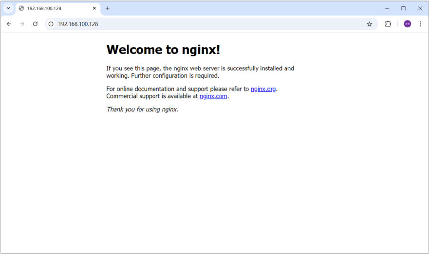

[107 篇](/posts/编程学习/javaweb学习笔记/107-linux常用命令/)把 Linux 上的命令摸熟了，但那时候干的事还是"看目录、看文件、打包解压"——服务器上真正要跑的东西一样都还没有：**MySQL 要有人装、JDK 要有人装、Nginx 要有人装**。这一篇（PPT 第 52～62 页）就是给一台刚装好的 CentOS 7 **装软件环境**，也是 [109 篇](/posts/编程学习/javaweb学习笔记/109-项目部署到linux/)能部署项目的前提。

> [!WARNING]
> **这一篇的安装步骤本轮没有在本机实测**——装 JDK / MySQL / Nginx 要 root 权限、要联网用 yum 装依赖、还要把服务注册进系统，属于"会真的改动一台 Linux 环境"的操作，[106 篇](/posts/编程学习/javaweb学习笔记/106-linux概述与系统安装/)那台 WSL 实验环境里没有执行（实验环境里 `which java nginx mysql vim` 只找得到 `vim`，java/nginx/mysql 一个都没装——也正好说明"环境是空的"这件事）。下面按 **PPT 第 52～62 页与课程讲义**的步骤写，每一步都写清"命令 + 它在干什么 + 怎么才算成功"。

| PPT 页 | 内容 | 本篇对应小节 |
| --- | --- | --- |
| 52 | 章节目录页（Linux 概述 / Linux 常用命令 / Linux 软件安装 / 项目部署） | 开篇——第一章的第三站 |
| 53 | 小节标题页——"Linux软件安装 03" | 开篇 |
| 54 | 安装方式介绍（二进制发布包 / rpm / yum / 源码编译） | 四种安装方式 |
| 55 | 小节目录页（安装 JDK / 安装 MySQL / 安装 Nginx） | 这一节要装的三样 |
| 56 | 安装 JDK（五步） | 安装 JDK |
| 57 | 同一张目录页（讲完 JDK 回到这里） | 安装 JDK 末尾 |
| 58 | 安装 MySQL 前半（卸 mariadb → 上传 → 解压改名 → 环境变量 → 注册服务） | 安装 MySQL ①～④ |
| 59 | 安装 MySQL 后半（初始化 → 启动登录 → 改密码 + 授权远程四条 SQL） | 安装 MySQL ⑤～⑦ |
| 60 | 防火墙操作（8 条命令 + 3 条注意） | 防火墙操作 |
| 61 | 同一张目录页（讲完 MySQL 回到这里） | 安装 MySQL 末尾 |
| 62 | 安装 Nginx（依赖 → 解压 → configure → make → make install → 启动） | 安装 Nginx |

## 这一篇在第一章里的位置（PPT 第 52～53 页）

第 52 页是这一章的目录页，四张卡片是 **Linux 概述 / Linux 常用命令 / Linux 软件安装 / 项目部署**——[106 篇](/posts/编程学习/javaweb学习笔记/106-linux概述与系统安装/)点亮了第一张、[107 篇](/posts/编程学习/javaweb学习笔记/107-linux常用命令/)点亮了第二张，本篇是**第三张**；第 53 页是小节标题页"Linux软件安装 03"。

为什么"装软件"要单独占一节？因为服务器上的项目不是"jar 扔进去就能跑"：

| 项目跑起来需要谁 | 由谁提供 | 不装会怎样 |
| --- | --- | --- |
| 执行 `java -jar xxx.jar` 的运行时 | **JDK** | 服务器上根本没有 java 这个命令（实验环境里就是这样） |
| 项目连的数据库 | **MySQL** | 项目启动就报连不上数据库 |
| 把页面发给浏览器的 Web 服务器、以及给后端做反向代理 | **Nginx** | 用户没有入口访问这套系统 |

这三样加上[远程连接](/posts/编程学习/javaweb学习笔记/106-linux概述与系统安装/)能连上，才算"环境齐了"，[109 篇](/posts/编程学习/javaweb学习笔记/109-项目部署到linux/)的项目部署才有地方落。

## 四种安装方式（PPT 第 54 页）

第 54 页先把 Linux 上装软件的四种方式摆出来，讲的是**同一件事的四种做法**：

| 方式 | PPT 的说法 | 拆开理解 |
| --- | --- | --- |
| **二进制发布包安装** | 软件已经针对具体平台编译打包发布，只要**解压，修改配置**即可 | 别人已经在对应平台上编译好了，拿到手就是"能直接跑的程序"——解压 + 改配置就能用，最省事 |
| **rpm 安装** | 软件已经按照 redhat 的包管理规范进行打包，使用 **rpm 命令**进行安装，**不能自行解决库依赖问题** | 像 Windows 的 `.exe` 安装包（RedHat 系专用）；用 `rpm` 命令装，但**缺哪个依赖库要你自己补**，它不会替你下载 |
| **yum 安装** | 一种**在线**软件安装方式，本质上还是 rpm 安装，**自动下载安装包并安装**，安装过程中**自动解决库依赖问题** | 把 rpm 做成了"在线商店"：告诉它要装什么，它自己下载、自己把依赖一起装上——省心但**要联网** |
| **源码编译安装** | 软件以**源码工程**的形式发布，需要**自己编译打包** | 拿到的是一堆 `.c` 源码（和 configure 脚本），要自己编译：`./configure` → `make` → `make install`——最麻烦，但能自己指定装到哪、开哪些功能 |

这一节要装的三样东西，正好把其中三种用上了（这就是为什么先讲这张表）：

| 这一节装的 | 用的哪种方式 | 看得见的证据 |
| --- | --- | --- |
| **JDK** | 二进制发布包 | 包名里带着平台：`jdk-17.0.10_linux-x64_bin.tar.gz`——"linux-x64"就是"已经为 Linux 64 位编译好"，解压 + 配环境变量即可 |
| **MySQL** | 二进制发布包 | `mysql-8.0.30-linux-glibc2.12-x86_64.tar.xz`——连 glibc 版本都编译进去了，解压后配环境变量、注册服务、初始化 |
| **Nginx** | **源码编译安装** | `nginx-1.20.2.tar.gz` 是**源码包**，必须 `./configure --prefix=...` → `make` → `make install` |
| （顺带）**yum** | yum 安装 | 装 Nginx 的依赖（pcre、zlib、openssl）用的就是 `yum install`；要装 `vim` 也是 `yum install vim`（[107 篇](/posts/编程学习/javaweb学习笔记/107-linux常用命令/)那句） |
| （顺带）**rpm** | rpm 安装 | 这一节里 rpm 出场是在**卸载**：`rpm -qa` 查、`rpm -e --nodeps` 卸 MySQL 的死对头 mariadb |

> [!TIP]
> PPT 上有些命令写出来是 `rpm –qa`、`rpm –e –nodeps …`——那个**长一点的横杠是 PPT 的排版字符**，实际敲键盘要用短横杠 `-`：`rpm -qa | grep mariadb`、`rpm -e --nodeps …`。照 PPT 抄命令时这一步最容易"看着一模一样却敲不出来"。

## 这一节要装的三样（PPT 第 55、57、61 页）

第 55 页是小节的目录页，把这一节拆成三件事：**安装 JDK / 安装 MySQL / 安装 Nginx**。第 57、61 页是**同一张目录页又出现一次**——每讲完一个软件就回到这页停一下，接着讲下一个。下面按同样的顺序走。

## 安装 JDK（PPT 第 56 页）

第 56 页把安装 JDK 写成五步，一步不多：

> 1、使用 FinalShell 自带的上传工具将 jdk 的二进制发布包上传到 Linux
> 2、解压安装包，命令为 `tar -zxvf jdk-17.0.10_linux-x64_bin.tar.gz -C /usr/local`
> 3、配置环境变量，使用 vim 命令修改 `/etc/profile` 文件，在文件末尾加入如下配置
> 4、重新加载 profile 文件，使更改的配置立即生效，命令为 `source /etc/profile`
> 5、检查安装是否成功，命令为 `java -version`

**① 上传。** 安装包在课程资料 `资料/04. 软件安装包/jdk-17.0.10_linux-x64_bin.tar.gz`；用 [FinalShell](/posts/编程学习/javaweb学习笔记/106-linux概述与系统安装/) 自带的上传工具把它传到 Linux 上（拖到文件面板里就行，不用敲命令）。

**② 解压到 /usr/local。**

```bash
tar -zxvf jdk-17.0.10_linux-x64_bin.tar.gz -C /usr/local
```

这条命令的五个选项就是 [107 篇](/posts/编程学习/javaweb学习笔记/107-linux常用命令/)打包压缩那一节背过的：`-z` 用 gzip 处理、`-x` 解压（extract）、`-v` 显示过程、`-f` 指定包文件名、`-C` **解压到指定目录**（这里是 `/usr/local`，`usr` 就是"存放系统应用程序"的地方）。解压完 `/usr/local` 下会多出一个 `jdk-17.0.10` 目录。

**③ 配置环境变量**：用 vim 打开 `/etc/profile`（`vim /etc/profile`），在**文件末尾**追加两行：

```bash
export JAVA_HOME=/usr/local/jdk-17.0.10
export PATH=$JAVA_HOME/bin:$PATH
```

三个问题在这里一次性说清：

- **为什么改 `/etc/profile`**：它是**所有用户登录时都会读**的全局配置文件——写在这里，谁登录、开哪个窗口都能用上 java。
- **`JAVA_HOME` 有什么用**：告诉系统"JDK 装在哪"。它本身不执行任何东西，但是**给别的程序看的**（后面的 Tomcat、脚本、构建工具都会去找 `JAVA_HOME`）。
- **`PATH` 有什么用**：`PATH` 是一串目录，敲命令时系统**从左往右**在这些目录里找同名程序。把 `$JAVA_HOME/bin` 加到前面，`java`、`javac` 这些命令就能**在任何目录下直接敲**——不加的话，每次都得写全路径 `/usr/local/jdk-17.0.10/bin/java`。
- 追加时用 vim 的三板斧（[107 篇](/posts/编程学习/javaweb学习笔记/107-linux常用命令/)）：`G` 跳到文件末尾 → `i` 进插入模式敲两行 → `ESC` 回命令模式 → `:wq` 保存退出。

**④ 让配置立即生效。**

```bash
source /etc/profile
```

`source` 是"**在当前窗口重新读一遍这个文件**"。不执行它，你改的配置要**下次登录**才生效（当前窗口还是老样子，敲 `java` 仍然说找不到）——这是新手最容易卡住的一步。

**⑤ 验证。**

```bash
java -version
```

能打出 `openjdk version "17.0.10" …` 就成功了。如果报 `command not found`，先回头查两处：`JAVA_HOME` 写的目录名**和解压出来的目录名是否一字不差**（用 `ls /usr/local` 看一眼真实目录名）、以及 `source /etc/profile` 有没有执行。

> [!TIP]
> JDK 装完，[109 篇](/posts/编程学习/javaweb学习笔记/109-项目部署到linux/)里那句 `java -jar xxxxxx.jar` 才有得用——这一节装的三样东西，都是下一篇要直接用的。

## 安装 MySQL（PPT 第 58～59 页）

MySQL 是三个里面最麻烦的一个：它**不是"解压就能用"**，而是"卸干净旧包 → 放好位置 → 配环境变量 → 注册成系统服务 → 初始化数据目录 → 启动 → 改密码授权"一整套流程。第 58 页讲前半、第 59 页讲后半，这里连着走一遍。

### ① 卸载自带的 mariadb（第 58 页）

原文一句话说清了原因：

> 准备工作：卸载 Linux 系统中自带的 mysql/mariadb 安装包，否则 MySQL 将安装失败

CentOS 7 **自带 mariadb**（mariadb 是 MySQL 的一个分支，占的包名、文件、服务名和 MySQL 高度重合），两套东西同机必冲突，所以先卸掉：

```bash
rpm -qa | grep mariadb
rpm -e --nodeps mariadb-libs-5.5.60-1.el7_5.x86_64
```

- 第一条：`rpm -qa` 列出**所有已安装的包**，`| grep mariadb`（[107 篇](/posts/编程学习/javaweb学习笔记/107-linux常用命令/)的管道符 + grep）把带 mariadb 的筛出来看；
- 第二条：`rpm -e` 是卸载（erase），`--nodeps` 表示**不管依赖关系直接卸**——不加它，系统会因为"别的包还依赖这个库"而拒绝卸载。**包名要用第一条命令查出来的实际名字**（版本号可能和 PPT 上不一样）。
- 卸完再跑一遍第一条，查不到东西就算干净了。

### ② 解压、挪位置、改名（第 58 页）

安装包在 `资料/04. 软件安装包/mysql-8.0.30-linux-glibc2.12-x86_64.tar.xz`，上传到 Linux 后：

```bash
tar -xvf mysql-8.0.30-linux-glibc2.12-x86_64.tar.xz
mv mysql-8.0.30-linux-glibc2.12-x86_64 /usr/local/mysql
```

- 第一条**解压到当前目录**（`.tar.xz` 是 xz 压缩，tar 能自动识别格式，PPT 上给的就是不带额外选项的这条写法）；
- 第二条把解压出来的整个文件夹**移动到 `/usr/local` 并改名为 `mysql`**——这个位置是整个安装套路的"约定落点"：MySQL 自带的启动脚本、后面注册服务、配置里写的路径，都按 `/usr/local/mysql` 来。
- 确认：`ls /usr/local` 能看到 `mysql` 目录；还想验证的话 `ls /usr/local/mysql` 里能看到 `bin`、`support-files` 这些目录。

### ③ 配置环境变量（第 58 页）

和 JDK 那一节同一个套路，`vim /etc/profile` 末尾追加：

```bash
export MYSQL_HOME=/usr/local/mysql
export PATH=$MYSQL_HOME/bin:$PATH
```

然后 `source /etc/profile` 让它立即生效。配完 `mysql`、`mysqld` 这些命令才能直接敲。

### ④ 注册 MySQL 为系统服务（第 58 页）

```bash
cp /usr/local/mysql/support-files/mysql.server /etc/init.d/mysql
chkconfig --add mysql
```

- 第一条：MySQL 自带一份启动脚本（`support-files/mysql.server`），把它**复制成系统的服务脚本** `/etc/init.d/mysql`——这样 MySQL 才像一个"系统服务"，可以用 `systemctl start/stop/status mysql` 来管，而不用每次自己去翻脚本；
- 第二条：`chkconfig --add mysql` 把 mysql **加入系统服务列表**（开机自启、服务管理都靠它登记）。
- 验证：`chkconfig --list mysql` 能列出 mysql 这个服务。

### ⑤ 初始化数据库（第 59 页）

```bash
groupadd mysql
useradd -r -g mysql -s /bin/false mysql
mysqld --initialize --user=mysql --basedir=/usr/local/mysql --datadir=/usr/local/mysql/data
```

- 前两条**建一个专用的用户组和用户**：`groupadd mysql` 建组，`useradd -r -g mysql -s /bin/false mysql` 建用户（`-r` 建的是系统用户、`-g mysql` 指定所属组、`-s /bin/false` 表示这个用户**不能登录系统**）。数据库服务以后就用这个身份跑，而不是用 root——安全。
- 第三条是**初始化数据目录**：`--user=mysql` 指定用 mysql 用户跑、`--basedir` 是 MySQL 装在哪、`--datadir` 是数据放哪（`/usr/local/mysql/data`）。它会建好系统库和系统表。
- ⚠️ **初始化完成后，输出里会打出一行 root 用户的临时密码**（形如 `root@localhost: xxxxxxxx`），**当场复制记下来**——这个密码是自动生成的，关掉就找不回来了，下一步登录就靠它。

> [!TIP]
> 这一步是本站补充的经验：如果初始化时报"权限不足"，多半是 `/usr/local/mysql` 目录的属主不对（解压/移动时都是 root 的），先执行 `chown -R mysql:mysql /usr/local/mysql` 把目录交给 mysql 用户，把没初始化完整的 `data` 目录清掉再重跑第三条命令。

### ⑥ 启动服务、登录 MySQL（第 59 页）

```bash
systemctl start mysql
mysql -uroot -pxxxxx
```

- 第一条启动服务——因为第 ④ 步已经把它注册成系统服务了，所以这里是 `systemctl start mysql` 而不是"去某个目录里跑脚本"；
- 第二条用 root + **刚才记下的临时密码**登录（`-p` 后面紧跟密码，中间不要空格。登录成功后提示符会变成 `mysql>`，用完 `exit` 退出）。

### ⑦ 改密码、授权远程访问（第 59 页，四条 SQL）

```
ALTER USER 'root'@'localhost' IDENTIFIED WITH mysql_native_password BY '1234';
CREATE USER 'root'@'%' IDENTIFIED BY '1234';
GRANT ALL PRIVILEGES ON *.* TO 'root'@'%';
FLUSH PRIVILEGES;
```

| SQL | 它在干什么 |
| --- | --- |
| `ALTER USER 'root'@'localhost' … BY '1234';` | 把**本机登录**（`localhost`）的 root 密码从临时密码改成 `1234`；`IDENTIFIED WITH mysql_native_password` 是指定用这个认证插件（MySQL 8 默认换成了新的认证插件，很多旧客户端/驱动认不了，课程统一用它来保持兼容） |
| `CREATE USER 'root'@'%' …;` | 新建一个 **`'root'@'%'`** 的用户：`%` 表示"**允许从任意主机连过来**"，而 `localhost` 只认本机。这就是"**授权远程访问**"的第一步 |
| `GRANT ALL PRIVILEGES ON *.* TO 'root'@'%';` | 把**所有库所有表**（`*.*`）的全部权限授给这个远程 root |
| `FLUSH PRIVILEGES;` | 刷新权限表，让上面的授权**立即生效**（不刷新的老毛病：授权"看着执行了"却要等重启才认） |

为什么非要 `'%'` 这个用户？因为**项目不在数据库这台机器上跑**——开发时项目在 Windows 的开发机上（[57 篇](/posts/编程学习/javaweb学习笔记/57-tlias项目准备与开发规范/)那套工程），部署后 [109 篇](/posts/编程学习/javaweb学习笔记/109-项目部署到linux/)的 jar 也在服务器上连它：**从"别的主机"连过来的连接，只认识 `'%'` 那个用户**。所以"MySQL 装完怎么让 root 能远程连"的标准答案就是这四条 SQL。

验证远程连接：在 Windows 上用 SQLyog / Navicat 之类的工具连 `192.168.100.128:3306`，用户名 root、密码 `1234`。连不上先别怀疑 SQL——先把下一节的防火墙端口放行做了（**防火墙就是"外面连不进来"最常见的原因**）。

> [!WARNING]
> `GRANT ALL PRIVILEGES ON *.* TO 'root'@'%'` 加上密码 `1234`，是**教学环境图省事**的写法（课程原文如此）。生产环境不会给 root 开远程、也不会用这种弱密码——真要上线，应该按业务建专用账号、只授必要权限、配强密码。这里照 PPT 写，是为了和课程的步骤一致。

## 防火墙操作（PPT 第 60 页）

MySQL 装完、明明服务开着，用工具却连不上——大概率是 **CentOS 7 的防火墙（firewalld）默认开着、端口没放行**。第 60 页给的八条命令要分成**两组**来理解：

| 组 | 命令 | 管什么 |
| --- | --- | --- |
| `systemctl` | 查看 `systemctl status firewalld`、关闭 `systemctl stop firewalld`、开启 `systemctl start firewalld`、永久关闭 `systemctl disable firewalld` | 管**防火墙这个服务本身**（开着还是关着、要不要开机自启） |
| `firewall-cmd` | `firewall-cmd --state`、`--add-port=…`、`--remove-port=…`、`--reload`、`--list-ports` | 管**防火墙里的规则**（放行哪个端口） |

PPT 上的原文对照：

| PPT 的说 | 命令 |
| --- | --- |
| 查看防火墙状态 | `systemctl status firewalld`、`firewall-cmd --state` |
| 关闭防火墙 | `systemctl stop firewalld` |
| 开启防火墙 | `systemctl start firewalld` |
| 永久关闭防火墙 | `systemctl disable firewalld` |
| 开放指定端口 | `firewall-cmd --zone=public --add-port=8080/tcp --permanent` |
| 关闭指定端口 | `firewall-cmd --zone=public --remove-port=8080/tcp --permanent` |
| 立即生效 | `firewall-cmd --reload` |
| 查看开放的端口 | `firewall-cmd --zone=public --list-ports` |

**"开放一个端口"实际是四步**（把上面几条串起来）：

```bash
# ① 先看防火墙的状态：开着还是关着（开着才需要放行，关着当然通）
systemctl status firewalld          # 或 firewall-cmd --state

# ② 加放行规则：8080/tcp 这个端口，写进永久配置
firewall-cmd --zone=public --add-port=8080/tcp --permanent

# ③ 让规则立即生效（加了 --permanent 也要 reload 才马上起作用）
firewall-cmd --reload

# ④ 复核：看放行的端口列表里有没有刚加的这条
firewall-cmd --zone=public --list-ports
```

三个参数值得记一下：`--zone=public` 是**作用域**（规则加在 public 这个区域）；`--permanent` 表示**写进永久配置**（不加它只是一次性生效，重启就没了）；`--reload` 是**重新加载规则**，让改动马上生效。

PPT 末尾的三条注意，是这一节最该记住的话：

1. **systemctl 是管理 Linux 中服务的命令**，可以对服务进行启动、停止、重启、查看状态等操作（不只是防火墙——MySQL 的启动也是它）；
2. **firewall-cmd 是 Linux 中专门用于控制防火墙的命令**（管"规则"，和"服务"是两件事）；
3. **为了保证系统安全，生产服务器的防火墙不建议关闭**——图省事可以 `systemctl stop firewalld`（很多教学环境就是这么干的），但生产上应该"**按端口放行**"而不是一关了之：该开的 80、3306 开，其他的挡在外面。

顺着往下想一步，后面两篇要用的端口正好对得上：

| 端口 | 谁在用 | 要不要对外放行 |
| --- | --- | --- |
| **3306** | MySQL（Windows 上的客户端 / 别的机器连它） | 要用图形化工具远程连就得放行 |
| **8080** | 后端 SpringBoot（[109 篇](/posts/编程学习/javaweb学习笔记/109-项目部署到linux/)的 jar） | **通常不用**——nginx 在服务器**内部**访问它（`proxy_pass http://localhost:8080`），外面碰不到它，这正是反向代理"安全"的体现 |
| **80** | Nginx | **要**——浏览器的访问入口（[109 篇](/posts/编程学习/javaweb学习笔记/109-项目部署到linux/)） |

## 安装 Nginx（PPT 第 62 页）

第 62 页的 Nginx 走的是**源码编译安装**（第 54 页四种方式里的第四种），所以比前两个多出"编译"的两步：

**① 装依赖。**

```bash
yum install -y pcre pcre-devel zlib zlib-devel openssl openssl-devel
```

Nginx 编译时要用到这些库（用第 54 页的话说：**这一步就是 yum 的"自动解决库依赖问题"**）：`pcre` 提供正则表达能力（location 匹配、rewrite 重写都靠它）、`zlib` 负责 gzip 压缩、`openssl` 负责加密/HTTPS。`-devel` 是"开发版"（编译时需要头文件），`-y` 表示不用一条条确认。

**② 上传源码包、解压。**

```bash
tar -zxvf nginx-1.20.2.tar.gz
```

源码包在 `资料/04. 软件安装包/nginx-1.20.2.tar.gz`，解压到当前目录，多出一个 `nginx-1.20.2` 目录。

**③ 配置（configure）：指定装到哪。**

```bash
cd nginx-1.20.2
./configure --prefix=/usr/local/nginx
```

`./configure` 会**检查这台机器的环境和依赖**、生成后面编译要用的 Makefile；`--prefix=/usr/local/nginx` 指定**安装位置**（装完的东西都进这个目录）。这一步要是报错，通常是第 ① 步的依赖没装全。

**④ 编译。**

```bash
make
```

把源码**编译成可执行文件**（这一步最慢，屏幕上会滚很多编译输出）。

**⑤ 安装。**

```bash
make install
```

把编译好的东西**安装到 `--prefix` 指定的 `/usr/local/nginx`**。装完进去看一眼：`conf`（配置）、`html`（静态资源，[109 篇](/posts/编程学习/javaweb学习笔记/109-项目部署到linux/)前端页面要放这儿）、`logs`（日志）、`sbin`（可执行文件）——和 [105 篇](/posts/编程学习/javaweb学习笔记/105-前端打包部署/)里那份 Windows 绿色版 nginx 的目录结构是一个套路。

**⑥ 启动。**

```bash
cd /usr/local/nginx      # 进到 nginx 安装目录
sbin/nginx               # 启动 nginx 服务（PPT 原文）
```

`sbin/nginx` 这种"带斜杠"的命令，shell 是按**当前目录下的相对路径**去找的（这也是为什么不加 `./` 也能执行——命令名里带 `/` 就已经是路径了；Linux 的 `sbin` 就是 [106 篇](/posts/编程学习/javaweb学习笔记/106-linux概述与系统安装/)目录结构里说的"只有 root 才能访问的二进制目录"）。

启动成功后，nginx **默认监听 80 端口**，在 Windows 的浏览器里访问服务器的 IP，就能看到它的默认首页：


*图：PPT 第 62 页配的验证截图——装完并启动 nginx 后，在浏览器里访问 Linux 服务器的 IP（`192.168.100.128`）看到「Welcome to nginx!」，说明这台机器上的 nginx 已经起来了、80 端口也通（这台机器就是 [106 篇](/posts/编程学习/javaweb学习笔记/106-linux概述与系统安装/)里装好的那台 CentOS 7 虚拟机）。这一页就是"安装成功"的判定标准——[109 篇](/posts/编程学习/javaweb学习笔记/109-项目部署到linux/)要把这个默认首页换成 Tlias 的前端页面*

访问不通就按两条线索查：**nginx 起了没有**（`ps -ef | grep nginx`）、**80 端口放行了没有**（上一节的四步）。

## 小结

| 问题 | 答案 |
| --- | --- |
| 四种安装方式？ | **二进制发布包**（解压 + 改配置）、**rpm**（RedHat 包规范，自己解决依赖）、**yum**（在线安装、自动解决依赖，本质还是 rpm）、**源码编译**（自己 `./configure` → `make` → `make install`） |
| 这一节三个软件分别怎么装？ | **JDK**：二进制发布包（解压到 `/usr/local` + 配环境变量）；**MySQL**：二进制发布包（卸 mariadb → 解压改名 → 环境变量 → 注册服务 → 初始化 → 启动 → 改密码授权）；**Nginx**：源码编译（装依赖 → 解压 → configure → make → make install） |
| 装 JDK 五步？ | 上传 → `tar -zxvf … -C /usr/local` → 改 `/etc/profile` 配 `JAVA_HOME` 与 `PATH` → `source /etc/profile` → `java -version` 验证 |
| 为什么要配环境变量？ | 写进 `/etc/profile`（登录都读）；`JAVA_HOME` 给别的程序引用；`PATH` 让 `java` 等命令在任何目录都能直接敲；**`source` 让当前窗口立即生效**（不 source 要重新登录） |
| MySQL 为什么要先卸 mariadb？ | CentOS 7 **自带 mariadb**，与 MySQL 争同一套文件/服务名，**不卸会装失败**。查 `rpm -qa \| grep mariadb`、卸 `rpm -e --nodeps 包名` |
| MySQL 装好后注册服务做什么？ | `cp /usr/local/mysql/support-files/mysql.server /etc/init.d/mysql` + `chkconfig --add mysql`——把 MySQL 变成系统服务，之后用 `systemctl start mysql` 这类命令管它 |
| 初始化那一步要注意什么？ | `groupadd mysql`、`useradd … mysql` 建专用用户；`mysqld --initialize --user=mysql --basedir=… --datadir=…` 初始化；**输出里的 root 临时密码要立刻记下来** |
| 改密码 + 授权远程的四条 SQL？ | `ALTER USER 'root'@'localhost' … BY '1234'`（改本机密码）、`CREATE USER 'root'@'%' …`（建允许任意主机登录的用户）、`GRANT ALL PRIVILEGES ON *.* TO 'root'@'%'`（授权）、`FLUSH PRIVILEGES`（立即生效） |
| `'localhost'` 和 `'%'` 有什么区别？ | `localhost` 只认**本机**连接，`'%'` 认**从任意主机**连过来——项目/工具从别的机器连数据库，靠的就是 `'%'` 那个用户 |
| 防火墙的两组命令分别管什么？ | `systemctl`（status/stop/start/disable firewalld）管**防火墙这个服务**；`firewall-cmd`（--state / --add-port / --remove-port / --reload / --list-ports）管**防火墙里的规则** |
| 开放端口的四步？ | ① 查状态 ② `firewall-cmd --zone=public --add-port=8080/tcp --permanent` ③ `firewall-cmd --reload` ④ `--list-ports` 复核。生产服务器**不建议关闭**防火墙，按端口放行 |
| 装 Nginx 的步骤？ | `yum install -y pcre pcre-devel zlib zlib-devel openssl openssl-devel` → 解压源码包 → `./configure --prefix=/usr/local/nginx` → `make` → `make install` → 进安装目录 `sbin/nginx` 启动，浏览器访问服务器 IP 看到「Welcome to nginx!」 |
| 这一篇的实测情况？ | **安装过程本轮没有实测**（要 root、要联网、会改真实环境）；实验环境里 `which java nginx mysql vim` 只有 `vim`，说明这些软件确实一个都没装 |

## 相关

- [上一篇：Linux常用命令](/posts/编程学习/javaweb学习笔记/107-linux常用命令/)
- [下一篇：项目部署到Linux](/posts/编程学习/javaweb学习笔记/109-项目部署到linux/)

## 练习题

### 一、知识回顾（读完直接做下面的实践题）

1. **这一节装哪三样、为什么**：JDK（执行 `java -jar` 的运行时）、MySQL（项目要连的数据库）、Nginx（发页面的 Web 服务器 + 给后端做反向代理）——加上前一节的远程连接，环境才算齐
2. **四种安装方式**：二进制发布包（**解压 + 改配置**，最省事）、rpm（RedHat 包规范，**不能自行解决库依赖**）、yum（**在线**安装、自动下载并**自动解决依赖**，本质还是 rpm）、源码编译（给源码，自己 `./configure` → `make` → `make install`）
3. **这一节谁用哪种方式**：JDK = 二进制发布包（`jdk-17.0.10_linux-x64_bin.tar.gz`）；MySQL = 二进制发布包（`mysql-8.0.30-linux-glibc2.12-x86_64.tar.xz`）；Nginx = **源码编译**（`nginx-1.20.2.tar.gz`）；yum 用来装 Nginx 的依赖；rpm 用来**卸** mariadb
4. **装 JDK 五步**（PPT 第 56 页）：① FinalShell 上传安装包 ② `tar -zxvf jdk-17.0.10_linux-x64_bin.tar.gz -C /usr/local` ③ `vim /etc/profile` 末尾加 `export JAVA_HOME=/usr/local/jdk-17.0.10` 和 `export PATH=$JAVA_HOME/bin:$PATH` ④ `source /etc/profile` ⑤ `java -version` 验证
5. **环境变量的三个要点**：写在 `/etc/profile`（所有用户登录都读）；`JAVA_HOME` 给别的程序引用、`PATH` 让命令全局可用；**必须 `source /etc/profile`** 才在当前窗口立即生效，否则要重新登录
6. **MySQL 卸载准备**：`rpm -qa | grep mariadb` 查出包名 → `rpm -e --nodeps 包名` 强制卸载（`--nodeps` = 不管依赖直接卸）；不卸干净，CentOS 7 自带的 mariadb 会让 MySQL 装失败
7. **MySQL 放位置**：`tar -xvf mysql-8.0.30-linux-glibc2.12-x86_64.tar.xz` 解压到当前目录 → `mv mysql-8.0.30-linux-glibc2.12-x86_64 /usr/local/mysql`（**移动并改名成 mysql**）→ 配 `MYSQL_HOME` 与 `PATH`
8. **注册系统服务**：`cp /usr/local/mysql/support-files/mysql.server /etc/init.d/mysql`、`chkconfig --add mysql`——之后才能用 `systemctl start mysql` 启动
9. **初始化数据库**：`groupadd mysql`、`useradd -r -g mysql -s /bin/false mysql`（建不能登录的专用用户）、`mysqld --initialize --user=mysql --basedir=/usr/local/mysql --datadir=/usr/local/mysql/data`；**输出里的 root 临时密码要当场记下**
10. **启动与登录**：`systemctl start mysql` → `mysql -uroot -p临时密码`
11. **改密码 + 授权远程四条 SQL**：`ALTER USER 'root'@'localhost' IDENTIFIED WITH mysql_native_password BY '1234';` / `CREATE USER 'root'@'%' IDENTIFIED BY '1234';` / `GRANT ALL PRIVILEGES ON *.* TO 'root'@'%';` / `FLUSH PRIVILEGES;`——`localhost` 只认本机、`'%'` 认任意主机
12. **防火墙两组命令 + 开放端口四步**：`systemctl`（管服务：status/stop/start/disable firewalld）、`firewall-cmd`（管规则：--state/--add-port/--remove-port/--reload/--list-ports）；开放端口：查状态 → `--add-port=8080/tcp --permanent` → `--reload` → `--list-ports` 复核；**生产服务器不建议关防火墙**
13. **装 Nginx 六步**：`yum install -y pcre pcre-devel zlib zlib-devel openssl openssl-devel` → 解压源码包 → 进目录 `./configure --prefix=/usr/local/nginx` → `make` → `make install` → 进安装目录 `sbin/nginx` 启动，浏览器访问服务器 IP 看到「Welcome to nginx!」
14. **本轮实测边界**：**安装步骤没有实测**（要 root、联网、会改真实环境）；实验环境里只有 `vim` 装好了，java/nginx/mysql 都没有

### 二、裸写题

- [ ] **2-1 把 JDK 装到 /usr/local，并让 `java -version` 能输出版本**
  需求：你用 FinalShell 连上了一台干净的 CentOS 7，安装包 `jdk-17.0.10_linux-x64_bin.tar.gz` 已经传到当前目录（root 的家目录）。请写出把 JDK 装到 `/usr/local` 并让它**在任何目录下都能直接用**的完整命令序列，并说明每一步在干什么、怎么确认成功。
  素材：安装包是二进制发布包（linux-x64 平台已编译好）；系统里原本没有任何 java。

  > [!TIP]- 提示（先自己想，实在想不出再点开）
  > **一级 · 思路**：五件事——**放文件**（把解压结果放进 `/usr/local`）、**配环境变量**（让系统知道 JDK 在哪、让命令全局可用）、**让配置立即生效**、**验证**
  > **二级 · 方法**：解压用 `tar -zxvf … -C /usr/local`（`-C` 指定解压到哪）；环境变量写在 `/etc/profile` 里，两行是 `export JAVA_HOME=/usr/local/jdk-17.0.10` 和 `export PATH=$JAVA_HOME/bin:$PATH`；生效用 `source`；验证用 `java -version`
  > **三级 · 骨架**：① `tar -____ jdk-17.0.10_linux-x64_bin.tar.gz ____ /usr/local`；② `vim ____` 末尾追加 `export JAVA_HOME=____` 与 `export PATH=$JAVA_HOME/bin:$____`；③ `____ /etc/profile`；④ `java ____` 看版本

  > [!TIP]- 参考答案（做完再点开）
  > ```bash
  > # ① 解压到 /usr/local（-z gzip、-x 解压、-v 过程、-f 文件名、-C 指定目录）
  > tar -zxvf jdk-17.0.10_linux-x64_bin.tar.gz -C /usr/local
  > #    解压后 /usr/local 下多出 jdk-17.0.10 目录
  >
  > # ② 配环境变量（/etc/profile 是所有用户登录都会读的全局配置）
  > vim /etc/profile
  > #    在文件末尾追加这两行（G 跳到末尾 → i 插入 → ESC → :wq 保存退出）：
  > #    export JAVA_HOME=/usr/local/jdk-17.0.10
  > #    export PATH=$JAVA_HOME/bin:$PATH
  > #    （JAVA_HOME 给别的程序引用；把 $JAVA_HOME/bin 加进 PATH 才能全局敲 java）
  >
  > # ③ 让配置在当前窗口立即生效（不做这步要重新登录）
  > source /etc/profile
  >
  > # ④ 验证：能打出 openjdk version "17.0.10" 就算成功
  > java -version
  > ```
  > 注意点：① `JAVA_HOME` 写的目录名必须和解压出来的目录名**一字不差**（`ls /usr/local` 看一眼）；② `PATH` 里把 `$JAVA_HOME/bin` 放在前面（PATH 从左往右找，放前面优先用自己装的这个 JDK）；③ 报 `command not found` 先查这两处和有没有 `source`。

- [ ] **2-2 把 MySQL 装进 /usr/local 并注册成系统服务**
  需求：一台干净的 CentOS 7，安装包 `mysql-8.0.30-linux-glibc2.12-x86_64.tar.xz` 已经上传。请写出**从"清理旧包"到"注册成系统服务"**的全部命令，并说明：① 为什么要先清理；② 为什么要把目录改名成 `mysql` 放到 `/usr/local`；③ 注册服务那两句各在干什么。
  素材：CentOS 7 **自带 mariadb**；MySQL 自带一份启动脚本在 `support-files/mysql.server`；系统里还没配过任何 MySQL 环境变量。

  > [!TIP]- 提示（先自己想，实在想不出再点开）
  > **一级 · 思路**：四件事按顺序——**把抢位置的旧包卸掉** → **把装好的目录放到 /usr/local 并改名** → **配环境变量** → **把它登记成一个系统服务**
  > **二级 · 方法**：查旧包 `rpm -qa | grep mariadb`、卸旧包 `rpm -e --nodeps 包名`；解压 `tar -xvf …tar.xz`、移动改名 `mv 解压出来的目录 /usr/local/mysql`；环境变量两行 `export MYSQL_HOME=/usr/local/mysql`、`export PATH=$MYSQL_HOME/bin:$PATH`；注册服务 `cp …/support-files/mysql.server /etc/init.d/mysql` 和 `chkconfig --add mysql`
  > **三级 · 骨架**：① `rpm -qa | grep ____` → `rpm -e --____ 包名`；② `tar -____ mysql-…tar.xz` → `mv mysql-8.0.30-… /usr/local/____`；③ `/etc/profile` 里加 `export MYSQL_HOME=____`、`export PATH=$MYSQL_HOME/bin:$____`；④ `cp /usr/local/mysql/support-files/mysql.____ /etc/init.d/mysql` → `chkconfig --____ mysql`

  > [!TIP]- 参考答案（做完再点开）
  > ```bash
  > # ① 卸载自带的 mariadb（不卸会让 MySQL 安装失败）
  > rpm -qa | grep mariadb                      # 查出带 mariadb 的包（-qa 列出所有已安装包）
  > rpm -e --nodeps mariadb-libs-5.5.60-1.el7_5.x86_64
  > #    -e 卸载；--nodeps 不管依赖直接卸；包名用上一条查出来的实际名字
  >
  > # ② 解压到当前目录，并把整份目录移到 /usr/local 改名为 mysql
  > tar -xvf mysql-8.0.30-linux-glibc2.12-x86_64.tar.xz
  > mv mysql-8.0.30-linux-glibc2.12-x86_64 /usr/local/mysql
  > #    /usr/local/mysql 是这套安装的约定落点，后面的脚本与配置都按它写
  >
  > # ③ 配环境变量（/etc/profile 末尾追加两行）
  > export MYSQL_HOME=/usr/local/mysql
  > export PATH=$MYSQL_HOME/bin:$PATH
  > source /etc/profile
  >
  > # ④ 注册成系统服务
  > cp /usr/local/mysql/support-files/mysql.server /etc/init.d/mysql
  > chkconfig --add mysql
  > #    之后就可以用 systemctl start mysql 这类命令来管它
  > ```
  > 注意点：① 卸载要用**查出来的真实包名**（版本号可能和 PPT 不同）；② `--nodeps` 的作用是"忽略依赖强制卸"；③ 改名成 `mysql` + 放 `/usr/local` 是约定落点，后面所有路径（`MYSQL_HOME`、注册服务、初始化）都依赖它；④ 别忘了 `source /etc/profile`。

- [ ] **2-3 初始化 MySQL 并第一次登录**
  需求：MySQL 已经放在 `/usr/local/mysql`、环境变量和服务都注册好了，但**数据目录还是空的**（服务起不来）。请写出初始化的命令、说明为什么要先建一个专门的用户，并说明**初始化输出里必须留意什么**、之后怎么启动和登录。
  素材：初始化要用 `mysqld` 的 `--initialize`；MySQL 装在哪、数据放哪都可以用参数指定；启动服务用 `systemctl`。

  > [!TIP]- 提示（先自己想，实在想不出再点开）
  > **一级 · 思路**：三步——**建一个专用用户/组**（服务用它的身份跑）→ **初始化数据目录**（同时会生成 root 的临时密码）→ **启动服务并用临时密码登录**
  > **二级 · 方法**：`groupadd mysql`、`useradd -r -g mysql -s /bin/false mysql`；`mysqld --initialize --user=mysql --basedir=/usr/local/mysql --datadir=/usr/local/mysql/data`（`--basedir` 程序位置、`--datadir` 数据位置）；`systemctl start mysql`、`mysql -uroot -p临时密码`
  > **三级 · 骨架**：① `____ mysql` 建组、`useradd -r -g mysql -s ____ mysql` 建用户；② `mysqld --____ --user=mysql --basedir=____ --datadir=____`；③ 记下输出里的 `root@localhost: ____`；④ `systemctl ____ mysql`、`mysql -uroot -p____`

  > [!TIP]- 参考答案（做完再点开）
  > ```bash
  > # ① 建专用的组和用户（-r 系统用户；-s /bin/false 表示不能登录系统）
  > groupadd mysql
  > useradd -r -g mysql -s /bin/false mysql
  >
  > # ② 初始化数据目录（同时生成 root 的临时密码）
  > mysqld --initialize --user=mysql --basedir=/usr/local/mysql --datadir=/usr/local/mysql/data
  > #    --user=mysql      用 mysql 用户的身份跑（不用 root，安全）
  > #    --basedir=…       MySQL 程序装在哪个目录
  > #    --datadir=…       数据目录（数据文件、系统库都在这儿）
  >
  > # ★ 输出里会打印一行形如：… root@localhost: 7fKd!x9q2LmZ
  > #   这就是 root 的临时密码，立刻复制记下来（关掉就找不回来了）
  >
  > # ③ 启动服务并用临时密码登录
  > systemctl start mysql
  > mysql -uroot -p7fKd!x9q2LmZ     # -p 后面紧跟密码，中间不要空格
  > exit                            # 登录成功后是 mysql> 提示符，exit 退出
  > ```
  > 注意点：① 专用用户的意义是"数据库服务不用 root 跑"（`-s /bin/false` 让它不能登录系统）；② `--basedir` / `--datadir` 要和实际位置对上；③ **临时密码只在初始化那一步的输出里出现一次**，必须当场记下；④ 启动是 `systemctl start mysql`——前提是前面已经 `cp` 脚本 + `chkconfig --add mysql` 注册过了。

- [ ] **2-4 让 root 能远程连接（改密码 + 授权远程）**
  需求：MySQL 已经能用临时密码在本机登录。要求：① 把本机 root 的密码改成 `1234`；② 让**别的机器**（Windows 上的图形化客户端、以后部署在服务器上的项目）也能用 root 连过来；③ 让授权立即生效；④ 写出在别的机器上验证连接的方式。请写出这四条 SQL 并逐条解释。
  素材：MySQL 8 默认的认证插件换过了，很多旧客户端认不了；`localhost` 和 `%` 表示两类不同的"来源主机"。

  > [!TIP]- 提示（先自己想，实在想不出再点开）
  > **一级 · 思路**：两件事分开做——**本机用户改密码**（他原来存在，只是密码是临时的）；**再建一个"允许任意主机登录"的用户并授权**（他要新建）；最后**刷新权限**让改动马上生效
  > **二级 · 方法**：改密码用 `ALTER USER 'root'@'localhost' IDENTIFIED WITH mysql_native_password BY '1234';`；新建远程用户 `CREATE USER 'root'@'%' IDENTIFIED BY '1234';`；授权 `GRANT ALL PRIVILEGES ON *.* TO 'root'@'%';`；刷新 `FLUSH PRIVILEGES;`。验证：在 Windows 上用 SQLyog/Navicat 连 `192.168.100.128:3306`
  > **三级 · 骨架**：① `____ USER 'root'@'____' IDENTIFIED WITH mysql_native_password BY '1234';`；② `CREATE USER 'root'@'____' IDENTIFIED BY '1234';`；③ `____ ALL PRIVILEGES ON *.* TO 'root'@'%';`；④ `____ PRIVILEGES;`

  > [!TIP]- 参考答案（做完再点开）
  > ```sql
  > -- ① 把本机（localhost）root 的密码从临时密码改成 1234
  > ALTER USER 'root'@'localhost' IDENTIFIED WITH mysql_native_password BY '1234';
  > --   IDENTIFIED WITH mysql_native_password：指定用这个认证插件
  > --   （MySQL 8 默认换了新插件，旧客户端/驱动认不了，课程统一用它）
  >
  > -- ② 新建"允许从任意主机连过来"的 root 用户
  > CREATE USER 'root'@'%' IDENTIFIED BY '1234';
  > --   localhost 只认本机连接，'%' 认任意主机 —— 这就是"授权远程访问"的关键
  >
  > -- ③ 把这个用户能干的活授权给他（*.* = 所有库所有表）
  > GRANT ALL PRIVILEGES ON *.* TO 'root'@'%';
  >
  > -- ④ 刷新权限表，让上面的授权立即生效
  > FLUSH PRIVILEGES;
  > ```
  > 验证：在 Windows 上用 SQLyog / Navicat 新建连接 → 主机 `192.168.100.128`、端口 `3306`、用户 `root`、密码 `1234` → 能进就成功。
  > 连不上的排查顺序：先看**防火墙有没有放行 3306**（`firewall-cmd --zone=public --add-port=3306/tcp --permanent` + `firewall-cmd --reload`），再看这四条 SQL 是不是都执行了（尤其是 `'%'` 那条）。
  > 另外提醒：给 root 开远程 + 弱密码是**教学环境图省事**的写法（PPT 原文如此），生产上要按业务建专用账号、只授必要权限。

- [ ] **2-5 防火墙里开放一个端口**
  需求：MySQL 装好了，可是 Windows 上的客户端连不上 `192.168.100.128:3306`。请写出**在防火墙里开放 3306 端口的完整四步**（含每一步的命令与目的），并说明：① `systemctl` 和 `firewall-cmd` 这两组命令分别管什么；② 为什么生产服务器不建议直接关掉防火墙。
  素材：CentOS 7 的防火墙服务叫 `firewalld`；`firewall-cmd` 的规则有"一次性"和"永久"的区别。

  > [!TIP]- 提示（先自己想，实在想不出再点开）
  > **一级 · 思路**：四步是"**先看状态 → 加规则 → 让它生效 → 复核**"；两组命令的分工是"管服务"和"管规则"
  > **二级 · 方法**：查状态 `systemctl status firewalld`（或 `firewall-cmd --state`）；加规则 `firewall-cmd --zone=public --add-port=3306/tcp --permanent`；生效 `firewall-cmd --reload`；复核 `firewall-cmd --zone=public --list-ports`。`--permanent` 写永久配置，不加则重启后失效
  > **三级 · 骨架**：① `systemctl ____ firewalld` / `firewall-cmd --____`；② `firewall-cmd --zone=____ --add-port=____/tcp --____`；③ `firewall-cmd --____`；④ `firewall-cmd --zone=public --list-____`

  > [!TIP]- 参考答案（做完再点开）
  > ```bash
  > # ① 查防火墙状态（开着才需要放行）
  > systemctl status firewalld        # 或 firewall-cmd --state
  >
  > # ② 加放行规则：3306/tcp，写进永久配置
  > firewall-cmd --zone=public --add-port=3306/tcp --permanent
  >
  > # ③ 立即生效：重新加载防火墙规则
  > firewall-cmd --reload
  >
  > # ④ 复核：放行列表里应该有 3306/tcp
  > firewall-cmd --zone=public --list-ports
  > ```
  > ① 两组命令的分工：
  >    · `systemctl`（`status` / `stop` / `start` / `disable firewalld`）——管**防火墙这个服务本身**（启停、开机自启）；
  >    · `firewall-cmd`（`--state` / `--add-port` / `--remove-port` / `--reload` / `--list-ports`）——管**防火墙里的规则**（放行哪个端口）。
  > ② 生产不建议关防火墙的原因：关掉等于"所有端口对外全开"，安全风险大；正确做法是**按端口放行**——该开的（80、3306 等）开，其余挡在外面。关闭/永久关闭（`systemctl stop firewalld` / `systemctl disable firewalld`）只适合教学或内网临时环境。
  > 另外：`--zone=public` 是规则作用的区域，`--permanent` 表示写永久配置（**加了它也必须 `--reload` 才马上生效**）。

- [ ] **2-6 源码编译安装 Nginx 并在浏览器里验证**
  需求：请写出在 CentOS 7 上用**源码编译**的方式安装 Nginx（`nginx-1.20.2.tar.gz`）并启动、验证的完整步骤，并说明：① 为什么要先装那几个依赖包；② `./configure --prefix=/usr/local/nginx` 里的 `--prefix` 决定了什么；③ 装完怎么验证"成了"、访问不通时先查什么。
  素材：Nginx 编译要用到 pcre（正则）、zlib（gzip 压缩）、openssl（加密）相关的库；装完的目录结构里有 `conf`、`html`、`logs`、`sbin`。

  > [!TIP]- 提示（先自己想，实在想不出再点开）
  > **一级 · 思路**：源码编译的标准三步是"**配置 → 编译 → 安装**"，前面还要先"把编译要用的库装齐"、最后"启动并访问验证"
  > **二级 · 方法**：依赖 `yum install -y pcre pcre-devel zlib zlib-devel openssl openssl-devel`；解压 `tar -zxvf nginx-1.20.2.tar.gz`；`cd` 进目录后 `./configure --prefix=/usr/local/nginx` → `make` → `make install`；进 `/usr/local/nginx` 执行 `sbin/nginx` 启动；浏览器访问服务器 IP（默认 80）
  > **三级 · 骨架**：① `yum install -y pcre pcre-devel zlib zlib-devel openssl openssl-____`；② `tar -____ nginx-1.20.2.tar.gz` → `cd nginx-1.20.2`；③ `./____ --prefix=____`；④ `make`；⑤ `make ____`；⑥ `cd /usr/local/nginx` → `____/nginx`

  > [!TIP]- 参考答案（做完再点开）
  > ```bash
  > # ① 装编译时要用到的依赖（yum 的"自动解决依赖"就体现在这里）
  > yum install -y pcre pcre-devel zlib zlib-devel openssl openssl-devel
  > #    pcre → 正则（location / rewrite 用）；zlib → gzip 压缩；openssl → 加密/HTTPS
  >
  > # ② 上传并解压源码包
  > tar -zxvf nginx-1.20.2.tar.gz
  > cd nginx-1.20.2
  >
  > # ③ 配置：检查环境 + 生成 Makefile，并指定装到哪
  > ./configure --prefix=/usr/local/nginx
  >
  > # ④ 编译
  > make
  >
  > # ⑤ 安装到 --prefix 指定的目录
  > make install
  >
  > # ⑥ 启动（进安装目录，执行 sbin 下的可执行文件）
  > cd /usr/local/nginx
  > sbin/nginx
  > ```
  > 验证：浏览器访问服务器 IP（如 `http://192.168.100.128`）看到「Welcome to nginx!」就成功。
  > ① 依赖的作用：pcre 提供正则（location 匹配、rewrite 重写）、zlib 负责 gzip 压缩、openssl 负责加密——**缺了 configure 或编译会报错**。
  > ② `--prefix=/usr/local/nginx` 决定**装到哪个目录**：装完后 `conf`（配置）、`html`（静态资源）、`logs`（日志）、`sbin`（可执行文件）都在这个目录下（[109 篇](/posts/编程学习/javaweb学习笔记/109-项目部署到linux/)前端页面要放进这个 `html`）。
  > ③ 访问不通先查两条：`ps -ef | grep nginx` 看进程在不在；80 端口有没有在防火墙里放行（`firewall-cmd --zone=public --add-port=80/tcp --permanent` + `firewall-cmd --reload`）。

### 三、综合题

- [ ] **3-1 给一台空白的 CentOS 7 装齐"服务器环境"（写成一份可以照着做的清单）**
  需求：手上是一台刚装好的 CentOS 7（能远程连上、命令会敲，除此之外什么都没有）。请照着 PPT 第 52～62 页，把这一节的三样软件**装齐并逐个验证**，最后把整个过程的清单写下来——每一步写清"做什么命令、为什么要它、怎么确认成功"。
  1. **先想清楚三样东西各自解决什么问题**（谁提供 java、谁提供数据库、谁提供 Web 入口），想清楚再动手；
  2. **选安装方式**：认一遍三种包分别属于"二进制发布包"还是"源码编译"（以及 yum 在哪儿出场、rpm 在哪儿出场）；
  3. **装 JDK**：上传 → 解压到 `/usr/local` → 改 `/etc/profile` 配 `JAVA_HOME` 与 `PATH` → `source` → `java -version` 打出 17.0.10；
  4. **装 MySQL 前半**：卸 mariadb → 解压并改名放到 `/usr/local/mysql` → 配 `MYSQL_HOME` 与 `PATH` → 注册系统服务；
  5. **装 MySQL 后半**：建 mysql 用户 → 初始化（**记下临时密码**）→ 启动并用临时密码登录 → 执行改密码与授权远程的四条 SQL；
  6. **放行端口**：按"查状态 → 加端口 → reload → list-ports"四步，把 3306 放行，并在 Windows 上用图形化客户端验证能远程连上；
  7. **装 Nginx**：装依赖 → 解压源码包 → `./configure --prefix=` → `make` → `make install` → 启动，浏览器访问服务器 IP 看到「Welcome to nginx!」（访问不通就把 80 也放行）；
  8. **收尾**：把清单顺着念一遍——每一步都有一个"看得见的结果"（版本号、`mysql>` 提示符、客户端连上、欢迎页），对着 PPT 第 54 页的四种安装方式说清每种用在了哪里。

  > [!TIP]- 提示（先自己想，实在想不出再点开）
  > **一级 · 思路**：这一步是"把五个小节的命令按**正确的顺序**串起来"——顺序错了会互相卡住（比如没卸 mariadb 就装不了 MySQL、没 `source` 就敲不到 java、没放行端口就连不上）；每一步都留一个**可核对的痕迹**
  > **二级 · 方法**：JDK 是 `tar -zxvf … -C /usr/local` + `/etc/profile`；MySQL 是 `rpm -e --nodeps` + `mv … /usr/local/mysql` + `cp …/mysql.server /etc/init.d/mysql` + `chkconfig --add mysql` + `mysqld --initialize` + `systemctl start mysql` + 四条 SQL；端口用 `firewall-cmd …--add-port=…/tcp --permanent` + `--reload`；Nginx 是 `yum install` 依赖 + `./configure --prefix=/usr/local/nginx` + `make` + `make install` + `sbin/nginx`
  > **三级 · 骨架**：清单六站——① JDK（验证：`java -____`）；② MySQL 准备（验证：`ls /usr/local/mysql`）；③ MySQL 初始化与授权（验证：别的机器能连上）；④ 防火墙（验证：`--list-____` 里有端口）；⑤ Nginx（验证：浏览器看到 `____`）；⑥ 顺一遍顺序与原因

  > [!TIP]- 参考答案（做完再点开）
  > ```
  > 清单：给空白 CentOS 7 装齐服务器环境（PPT 第 52～62 页）
  >
  > 【0】先明确三样东西各解决什么问题
  >   · JDK  → 服务器上能跑 java（java -jar 执行项目）
  >   · MySQL → 项目要连的数据库
  >   · Nginx → 把页面发给浏览器的 Web 服务器（下一节还要给后端做反向代理）
  >   安装方式对号：JDK / MySQL = 二进制发布包；Nginx = 源码编译；
  >   中间用得上 yum（装 Nginx 依赖）和 rpm（卸 mariadb）
  >
  > 【1】安装 JDK
  >   · 上传 jdk-17.0.10_linux-x64_bin.tar.gz
  >   · tar -zxvf jdk-17.0.10_linux-x64_bin.tar.gz -C /usr/local
  >   · vim /etc/profile 追加：
  >       export JAVA_HOME=/usr/local/jdk-17.0.10
  >       export PATH=$JAVA_HOME/bin:$PATH
  >   · source /etc/profile
  >   · 确认成功：java -version 输出 17.0.10
  >
  > 【2】MySQL：清理与就位
  >   · rpm -qa | grep mariadb  →  rpm -e --nodeps 查出来的包名
  >   · tar -xvf mysql-8.0.30-linux-glibc2.12-x86_64.tar.xz
  >   · mv mysql-8.0.30-linux-glibc2.12-x86_64 /usr/local/mysql
  >   · /etc/profile 追加 MYSQL_HOME 与 PATH，然后 source
  >   · cp /usr/local/mysql/support-files/mysql.server /etc/init.d/mysql
  >   · chkconfig --add mysql
  >   · 确认成功：/usr/local 下有 mysql 目录；chkconfig --list mysql 能看到服务
  >
  > 【3】MySQL：初始化、登录、授权
  >   · groupadd mysql
  >   · useradd -r -g mysql -s /bin/false mysql
  >   · mysqld --initialize --user=mysql --basedir=/usr/local/mysql --datadir=/usr/local/mysql/data
  >     ★ 记下输出里的 root@localhost 临时密码
  >   · systemctl start mysql
  >   · mysql -uroot -p临时密码
  >   · 四条 SQL：
  >       ALTER USER 'root'@'localhost' IDENTIFIED WITH mysql_native_password BY '1234';
  >       CREATE USER 'root'@'%' IDENTIFIED BY '1234';
  >       GRANT ALL PRIVILEGES ON *.* TO 'root'@'%';
  >       FLUSH PRIVILEGES;
  >   · 确认成功：Windows 上的图形化客户端能连 192.168.100.128:3306
  >
  > 【4】防火墙（连不上就先想它）
  >   · systemctl status firewalld              （或 firewall-cmd --state）
  >   · firewall-cmd --zone=public --add-port=3306/tcp --permanent
  >   · firewall-cmd --reload
  >   · firewall-cmd --zone=public --list-ports   → 列表里能看到 3306/tcp
  >   · 记住：生产服务器不建议关闭防火墙，按端口放行
  >
  > 【5】安装 Nginx（源码编译）
  >   · yum install -y pcre pcre-devel zlib zlib-devel openssl openssl-devel
  >   · tar -zxvf nginx-1.20.2.tar.gz  →  cd nginx-1.20.2
  >   · ./configure --prefix=/usr/local/nginx
  >   · make  →  make install
  >   · cd /usr/local/nginx  →  sbin/nginx
  >   · 确认成功：浏览器访问服务器 IP 看到「Welcome to nginx!」
  >     （打不开先查 ps -ef | grep nginx 和 80 端口放行）
  >
  > 【6】对照 PPT 第 54 页
  >   二进制发布包：JDK、MySQL（解压 + 改配置就能用）
  >   源码编译：Nginx（configure → make → make install）
  >   yum：装 Nginx 依赖（自动解决依赖）
  >   rpm：卸载 mariadb（-qa 查、-e --nodeps 卸）
  > ```
  > 检查点：① 顺序对（先卸 mariadb 再装 MySQL；先 source 再用 java；先注册服务再 systemctl start）；② 每一步都有一个"看得见的结果"；③ 临时密码、`'%'` 授权、防火墙四步这三个细节没漏；④ 能说清三种包各属于哪种安装方式、yum 和 rpm 各在哪儿出场。
