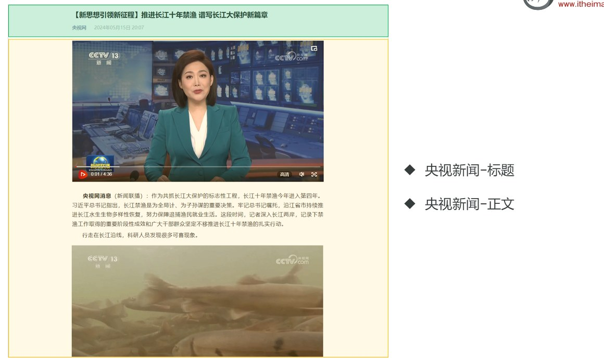
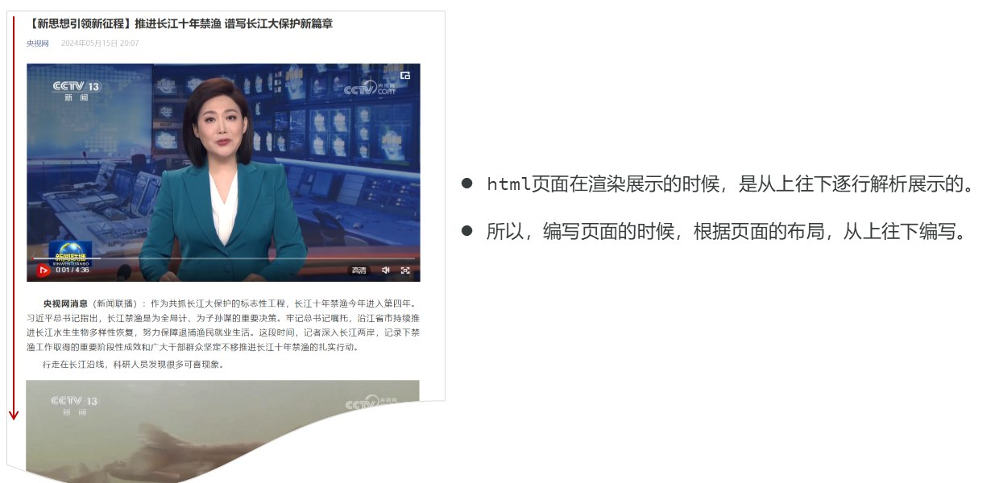
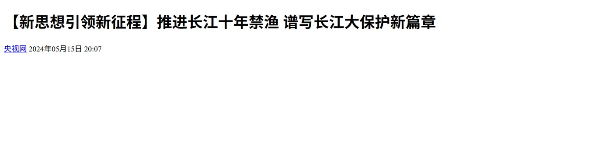
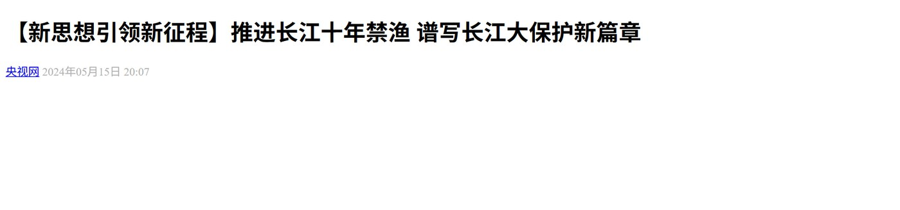
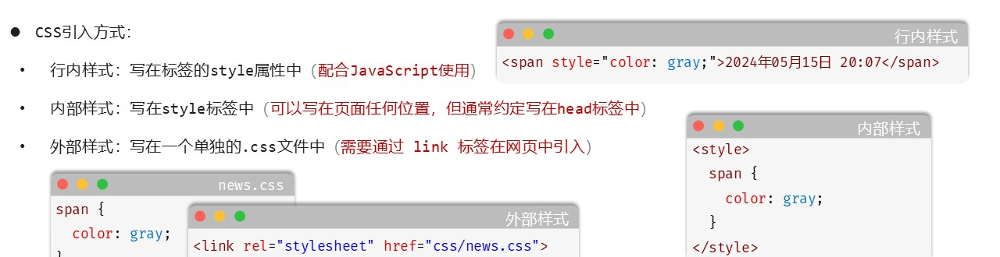
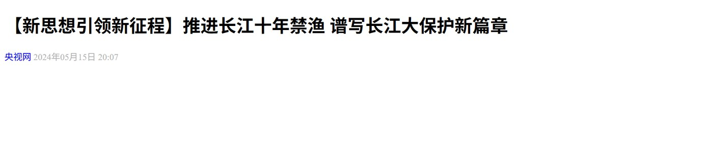
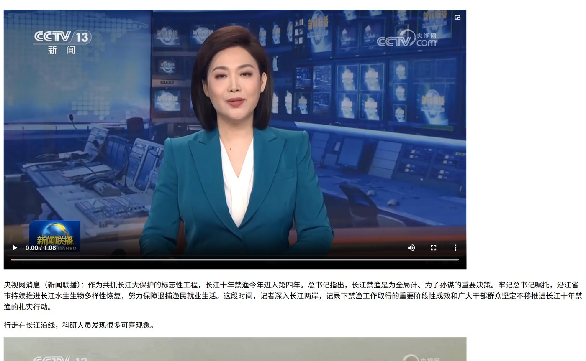
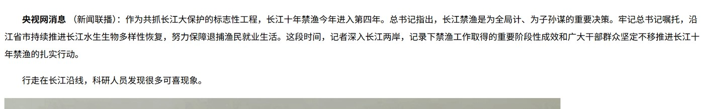
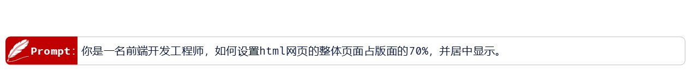
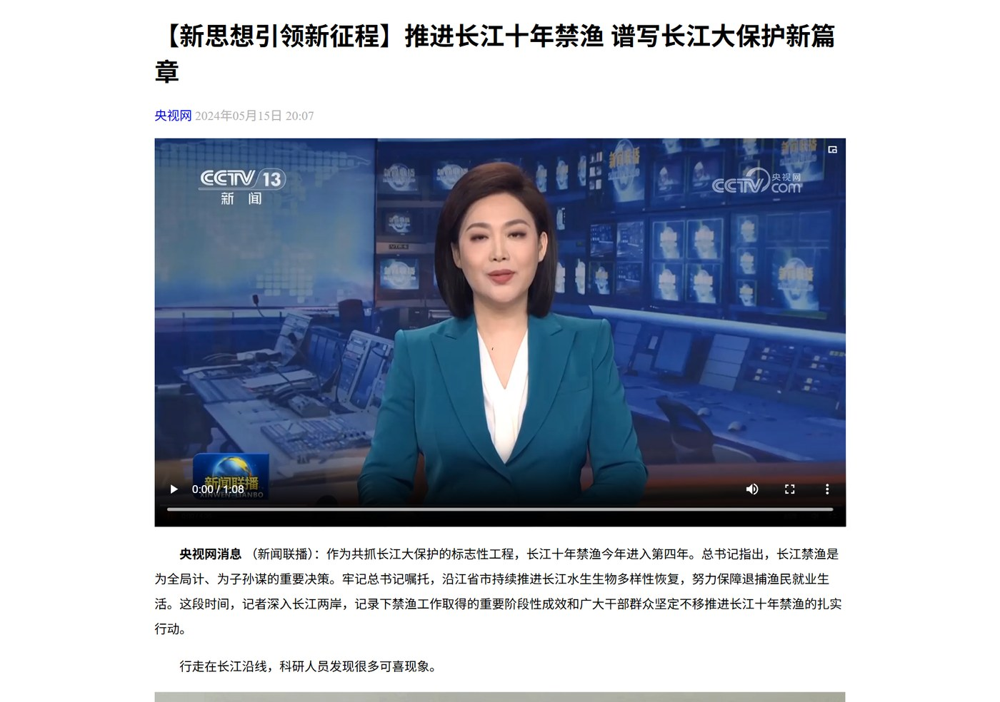

05~08 篇是"分块学"：标签（05）、CSS 引入方式与颜色（06）、选择器（07）、盒子模型（08）。这一篇把它们合起来用一次——**从一张白纸开始，一步步做出课程里的"央视新闻页面"**：每一步都按"**目标 → 代码 → 效果 → 为什么这么做**"讲一遍，照着做就能把页面做出来。

## 目标：这个页面长什么样


*图：案例做完的样子——绿色框是**标题区**（大标题 + 来源"央视网" + 发布时间），黄色框是**正文区**（新闻视频 + 若干段落 + 穿插的配图）*

整个页面其实只有两块内容：

| 区域 | 里面有什么 | 由哪几步做出来 |
| --- | --- | --- |
| **标题区** | 大标题、来源链接"央视网"、发布时间 | 第 1~3 步 |
| **正文区** | 新闻视频、一段段文字、穿插的配图 | 第 4~5 步 |
| 整块版面 | 内容占版面 70%、居中显示 | 第 6 步 |

### 为什么按"从上往下"写

课程在动手前先给了一条原则：


*图：左边那根红色箭头标的就是"解析顺序"——标题在最上面、视频和正文依次往下来*

> [!IMPORTANT]
> **html 页面在渲染展示的时候，是从上往下逐行解析展示的。所以，编写页面的时候，根据页面的布局，从上往下编写。**

也就是说：**页面长什么样，代码就照着那个顺序写**。标题在最上面就先写标题，视频在标题下面紧接着写视频——我们的六步顺序就是这么来的。

### 六步总览

| 步骤 | 目标 | 这一步新用到的标签 / 属性 | 课程文件 |
| --- | --- | --- | --- |
| ① 标题排版 | 标题区先有**结构**（还不管好不好看） | `<h1>`、`<a href target>`、纯文本日期 | `03. 央视新闻-标题-排版.html` |
| ② 标题样式 | 把发布时间改成**浅灰色** | `<span>` + `<style>` 内部样式、`color` | `04. 央视新闻-标题-样式.html` |
| ③ 选择器精修 | 精确选中日期、去掉链接下划线 | `#time`（id 选择器）、`a`（元素选择器）、`text-decoration` | `05. 央视新闻-标题-样式(选择器).html` |
| ④ 正文排版 | 视频、段落、配图按顺序摆好 | `<video src controls width>`、`<p>`、``、`<br>` | `06. 央视新闻-正文-排版.html` |
| ⑤ 正文样式 | 正文读起来舒服：行高拉开、首行缩进、首句加粗 | `line-height`、`text-indent`、`<strong>` | `07. 央视新闻-正文-样式.html` |
| ⑥ 整体布局 | 整块内容占版面 **70%**、左右居中 | `<div>` 包一层、`width: 70%`、`margin: 0 auto` | `08. 央视新闻-整体布局.html` |

> [!TIP]
> 开始之前先把"工程目录"摆好：新建一个 html 文件（比如 `央视新闻.html`）放在文件夹里，同目录下建 `img/` 放配图、`video/` 放视频、`css/` 放外部样式文件。课程把六个步骤存成了六个文件，**每一步都是在上一份文件的基础上改**——自己做的时候也可以先另存一份，改坏了能退回去。

## 第 1 步：标题排版

**目标**：先把标题区的"骨头"搭出来，把标题、来源、日期放到页面上——先不管样式。

**代码**：

```html
<body>
  <!-- 定义一个标题, 标题内容: 【新思想引领新征程】推进长江十年禁渔 谱写长江大保护新篇章 -->
  <h1>【新思想引领新征程】推进长江十年禁渔 谱写长江大保护新篇章</h1>

  <!-- 定义一个超链接, 里面展示 央视网 -->
  <a href="https://www.cctv.com" target="_blank">央视网</a>
  2024年05月15日 20:07
</body>
```

**效果**：


*图：标题变成了又大又粗的一行字，"央视网"是蓝色的带下划线链接，日期挨在链接后面是普通黑字*

**为什么这么做**：

1. **大标题用 `<h1>` 而不是随便写一行字**：`<h1>`~`<h6>` 是一到六级标题标签，浏览器默认就把它渲染成"加粗、字号大、独占一行"的样子——**用对标签，浏览器自己就帮你做好一半的排版**。
2. **"央视网"用 `<a>` 而不是普通文字**：它是新闻来源，点击要能跳到央视网，所以用超链接标签，`href` 填目标网址，`target` 决定在哪打开：

| 属性 | 作用 | 取值 |
| --- | --- | --- |
| `href` | 指定资源访问的 url（点它跳到哪） | `https://www.cctv.com` |
| `target` | 指定在何处打开资源链接 | `_self`：默认值，在当前页面打开；`_blank`：在空白（新）页面打开 |

3. **日期先按普通文字写**：它既不是标题也不是链接，这一步先原样放着——**排版阶段只管"有什么"，不管"长什么样"**，颜色留到第 2 步再改。这也解释了为什么第 2 步要给它单独套一个标签。

## 第 2 步：标题样式

**目标**：让发布时间变浅灰（新闻网站上日期都比标题浅，这样视线才先落在标题上）。

**关键动作：先用 `<span>` 把日期"圈"出来**

```html
<span>2024年05月15日 20:07</span>
```

**为什么要套一层 `<span>`**：要给"这一小段文字"单独上颜色，前提是能**单独选中它**。`<span>` 是 08 篇讲过的布局标签，特点是：

- **一行可以显示多个**（不会像 `<div>` 那样独占一行把日期挤到下一行去）；
- 宽度和高度由内容撑开，本身不带任何默认样式。

所以它是"圈一小段文字"的最佳选择。

**代码**：在 `<head>` 里用**内部样式**给 `span` 定颜色：

```html
<head>
  ...
  <!-- 方式二: 内部样式 -->
  <style>
    span {
      color: #b2b2b2;      /* 十六进制表示法：浅灰色 */
    }
  </style>
</head>
```

**效果**：


*图：日期已经从黑色变成浅灰色——只有它变了，标题和链接不受影响*

**为什么用内部样式**：PPT 把三种引入方式一次列清楚了——


*图：行内样式写在标签的 style 属性里、内部样式写在 style 标签里、外部样式写在一个单独的 .css 文件里再用 link 标签引入*

| 引入方式 | 写在哪 | 写法 | 什么时候用 |
| --- | --- | --- | --- |
| **行内样式** | 标签的 `style` 属性里 | `<span style="color: gray;">…</span>` | 只改**某一个元素**、且配合 JavaScript 动态改样式时用 |
| **内部样式** | `<style>` 标签里 | `<style> span { color: #b2b2b2; } </style>` | 只服务**这一个页面**时用（约定写在 `<head>` 里） |
| **外部样式** | 单独的 `.css` 文件 | `news.css` 里写 `span { color: gray; }`，页面里用 `<link rel="stylesheet" href="css/news.css">` 引入 | **多个页面共用**一套样式时用（改一处、全站生效），实际项目里最常用 |

课程演示的顺序是：先图省事写行内样式，再改成内部样式（本案例用的就是它），最后给出外部样式的写法。**同一个页面里三种方式可以并存**，冲突时按"就近"和选择器优先级规则决定谁生效。

**顺便回顾颜色**：`color` 是设置文本颜色的属性，颜色值有四种表示法（06 篇细讲过）：

| 表示方式 | 属性值 | 说明 | 示例 |
| --- | --- | --- | --- |
| 关键字 | 颜色英文单词 | `red`、`green`、`blue` | `red`、`gray` |
| rgb 表示法 | `rgb(r,g,b)` | 红绿蓝三原色，取值 0-255 | `rgb(0,0,0)`、`rgb(255,0,0)` |
| rgba 表示法 | `rgba(r,g,b,a)` | 多一个 `a` 表示透明度，取值 0-1 | `rgba(0,0,0,0.3)` |
| 十六进制表示法 | `#rrggbb` | `#` 开头，把数字换成十六进制，可简写 | `#000000`、`#ff0000`，简写 `#000`、`#f00` |

## 第 3 步：用选择器精修

**目标**：两件小事——① 日期还是用"所有 span 都变灰"的办法改的，页面一复杂就会误伤别的 span，改成只选它一个；② "央视网"这条链接的下划线不好看，去掉。

**代码**（课程文件 `05`，同一个 `<span>` 上同时挂了 `class` 和 `id`，用它们做练习）：

```html
<head>
  <style>
    /* 元素选择器 */
    /* span {
      color: #b2b2b2;
    } */

    /* 类选择器 */
    /* .cls {
      color: #ff0000;
    } */

    /* ID选择器 */
    #time {
      color: #b2b2b2;
    }

    a {
      /* 去除超链接下方的下划线 */
      text-decoration: none;
    }
  </style>
</head>
<body>
  <h1>【新思想引领新征程】推进长江十年禁渔 谱写长江大保护新篇章</h1>
  <a href="https://www.cctv.com" target="_blank">央视网</a>

  <span class="cls" id="time">2024年05月15日 20:07</span>
</body>
```

**效果**：


*图：日期仍然是灰色，但这次是"点名"选中的；"央视网"的下划线没了，日期和链接都更干净*

**为什么这么做**：

1. **元素选择器 `span` 是"一网打尽"**：它会选中页面上**所有的** `<span>`。页面上只有两三个标签时没问题，一旦页面复杂起来，你只想改日期，别的 span 也跟着变了——所以要**换成"点名"的方式**。
2. **最常用的三类选择器**（07 篇讲了六类，日常够用的是这三类）：

| 选择器 | 写法 | 示例 | 说明 |
| --- | --- | --- | --- |
| 元素选择器 | `元素名称 {...}` | `h1 {...}` | 选择页面上所有的 `<h1>` 标签 |
| 类选择器 | `.class属性值 {...}` | `.cls {...}` | 选择页面上所有 `class` 属性为 `cls` 的标签 |
| id 选择器 | `#id属性值 {...}` | `#time {...}` | 选择页面上 `id` 属性为 `time` 的那个标签 |

3. **`class` 和 `id` 都写在标签身上**：`<span class="cls" id="time">` 意思是"这个元素属于 `cls` 这一类、它的唯一编号是 `time`"。类可以多个元素共用（`class="cls"` 只写了一次，但同一个类可以挂到很多标签上），**id 在一个页面里应该唯一**（所以适合"就选它一个"）。
4. **冲突时看优先级**：`id 选择器 > 类选择器 > 元素选择器`。所以就算三条规则都写了，这个日期显示的还是最"具体"的那条（`#time` 的灰色）。
5. **`a` 用元素选择器就够了**：页面上只有一个链接，"改所有 a"就是"改它"。`text-decoration: none` 专门用来**去掉超链接的下划线**——以后见到不想要的下划线，先想到这里。

> [!NOTE]
> 到这里"标题区"就完工了：结构（`h1` + `a` + `span`）+ 样式（`#time` 灰色、`a` 去下划线）。接下来处理正文。

## 第 4 步：正文排版

**目标**：正文区从上到下依次是"视频 → 第一段文字 → 配图 → 文字 → 配图 …"，先把它们按顺序摆进页面（还是先不管好不好看）。

**代码**（在标题区后面追加）：

```html
<!-- --------------------------- 新闻标题 -------------------------------- -->
<h1>【新思想引领新征程】推进长江十年禁渔 谱写长江大保护新篇章</h1>
<a href="https://www.cctv.com" target="_blank">央视网</a>
<span class="cls" id="time">2024年05月15日 20:07</span>
<br><br>

<!-- --------------------------- 新闻正文 -------------------------------- -->
<!-- 定义一个视频, 引入 video/news.mp4 -->
<video src="video/news.mp4" controls width="80%"></video>

<p>
  央视网消息（新闻联播）：作为共抓长江大保护的标志性工程，长江十年禁渔今年进入第四年。……
</p>

<p>
  行走在长江沿线，科研人员发现很多可喜现象。
</p>

<!-- 定义一张图片, 引入 img/1.gif -->


<p>
  在长江南源，一处小头裸裂尻鱼新的栖息地被发现，鱼的数量大约超3万尾，为水生态保护提供了珍贵数据。
</p>
<!-- 后面还有很多段文字和配图，结构完全一样 -->
```

**效果**：


*图：视频排在最上面（带播放控件、"高清/音量/全屏"一条工具条），下面是一段段文字，再往下是第一张配图——顺序和所见网页一模一样*

**这一步的三个新标签**（05 篇的标签表，这里再用一次）：

| 标签 | 作用 | 属性 / 说明 |
| --- | --- | --- |
| `<video>` | 视频标签 | `src`：视频的 url；`controls`：是否显示播放控件；`width`：宽度（像素 / 相对于父元素百分比）；`height`：高度 |
| `` | 图片标签 | `src`、`width`、`height` |
| `<p>` | 段落标签 | 一段文字用一个 `<p>` 包起来 |

**为什么这么做**：

1. **`width` 只写一个**：宽度和高度**只设置一个**即可，另一个会**等比例缩放**——写两个容易把图片/视频压变形。案例里视频和图片都写 `width="80%"`，意思是"占页面宽度的 80%"（百分比是**相对于父元素**的宽度）。
2. **`src` 用相对路径**：`video/news.mp4`、`img/1.gif` 都是相对于当前 html 文件的路径。资源路径的写法（PPT 原话）：

| 写法 | 例子 | 说明 |
| --- | --- | --- |
| 绝对磁盘路径 | `D:/xxx.jpg` | 本机磁盘上的绝对位置，换台电脑就失效，不推荐 |
| 绝对网络路径 | `https://xxx.jpg` | 从网上下载资源，链接失效图就没了 |
| 相对路径 · 当前目录 | `./`（**可以省略**） | 写成 `img/1.gif` 就等于 `./img/1.gif` |
| 相对路径 · 上一级目录 | `../` | 资源在上一级文件夹里时用 |

3. **标题和正文之间要加 `<br><br>`**：标题区里的 `<a>` 和 `<span>` 都是**行内元素**，本身不会换行——不给一个换行，视频就可能挤到日期那一行去。`<br>` 就是"换行"，写两个就是空一行，把两个区域隔开。
4. **文字要一段一个 `<p>`**：`<p>` 是块级元素，**自动独占一行、段与段之间自动留空**；把所有文字堆在一个 `<p>` 里就成了一整坨。

> [!WARNING]
> 课程代码里图片写成了 `</img>`——**`</img>` 是多余的**：`` 和 `<br>` 一样是"自闭合"标签，没有结束标签（浏览器会容忍，但规范写法是 ``）。

## 第 5 步：正文样式

**目标**：让正文"能读"——行距拉开一点、每段开头空两格、第一句"央视网消息"加粗。

**代码**（`<style>` 里加上段落样式，正文第一段里加 `<strong>`）：

```html
<style>
  #time {
    color: #b2b2b2;
  }

  a {
    /* 去除超链接下方的下划线 */
    text-decoration: none;
  }

  p {
    /* 设置行高 */
    line-height: 2;      /* 2 倍行高 */

    /* 设置首行缩进 */
    text-indent: 2em;    /* 首行缩进 2 个字符 */
  }
</style>
...
<p>
  <strong>央视网消息</strong>
  （新闻联播）：作为共抓长江大保护的标志性工程，长江十年禁渔今年进入第四年。……
</p>
```

**效果**：


*图：行与行之间松快了很多，每段开头自动空出两个字的宽度，开头的"央视网消息"是加粗的*

**为什么这么做**：

1. **`line-height` 设置行高**：值写 `2` 表示"2 倍行高"（相对当前字号的倍数），行与行不再挤在一起。写 `2` 比写 `32px` 好——字号以后改了，行高会跟着按比例变。
2. **`text-indent` 设置首行缩进**：`2em` 里的 `em` 是**相对当前字号**的单位，字号多大，"两格"就多大。中文段落开头空两格是排版习惯，`text-indent: 2em` 一条属性就够，**不用去敲四个空格**。
3. **加粗用 `<strong>` 不用 `<b>`**：两个都能加粗，但 `<strong>` **具有强调语义**（告诉浏览器/搜索引擎"这段内容重要"），课程原话是"`<strong>` 具有强调语义"。同一组的还有：

| 标签 | 作用 | 带强调语义的写法 |
| --- | --- | --- |
| `<b>` / **`<strong>`** | 加粗 | `<strong>` |
| `<u>` / **`<ins>`** | 下划线 | `<ins>` |
| `<i>` / **`<em>`** | 倾斜 | `<em>` |
| `<s>` / **`<del>`** | 删除线 | `<del>` |

4. **课程里被划掉的两个"笨办法"**：文件 `07` 里留着两行注释——`<!-- <b>央视网消息</b> -->` 和 `<!-- <strong>&nbsp;&nbsp;&nbsp;&nbsp;央视网消息</strong> -->`。老师把它们划掉，是因为：加粗该用带语义的 `<strong>`；而"缩进"是**样式**，应该交给 CSS 的 `text-indent`，而不是用四个 `&nbsp;`（字符实体空格）去凑。**凡是"好不好看"的事，都归 CSS 管**。

> [!TIP]
> 字符实体回顾（05 篇）：`&nbsp;` 是空格、`&lt;` 是 `<`、`&gt;` 是 `>`。它们是"在 HTML 里写不出原字符时用的替身"，不是排版工具。

## 第 6 步：整体布局（占版面 70%、居中）

**目标**：现在的文字是"从屏幕最左边一直排到最右边"的，屏幕一大就很难读。要求整块内容**占版面 70%、并且居中显示**。

课程在这里用了一句 AI 提示词来问做法：


*图：PPT 上给出的提示词——"你是一名前端开发工程师，如何设置 html 网页的整体页面占版面的 70%，并居中显示。"*

> [!NOTE] AI 提示词
> 你是一名前端开发工程师，如何设置 html 网页的整体页面占版面的 70%，并居中显示。

**做法两步**：

**第一步，把标题区和正文区用一个 `<div>` 整个包起来**（用 id 起个名字叫 `content-container`）：

```html
<body>
  <div id="content-container">
    <!-- 标题区 + 正文区全部内容都在这里面 -->
    <h1>【新思想引领新征程】推进长江十年禁渔 谱写长江大保护新篇章</h1>
    <a href="https://www.cctv.com" target="_blank">央视网</a>
    <span class="cls" id="time">2024年05月15日 20:07</span>
    <br><br>
    ...
  </div>
</body>
```

**第二步，给这个容器设置宽度和居中**：

```css
/* 整体版面居中显示 */
#content-container {
  width: 70%;      /* 宽度: 70% */
  margin: 0 auto;  /* 上下外边距 0，左右外边距 auto（自动均分剩余空间） */
}
```

**同时把视频和图片的宽度改成 100%**：

```html
<video src="video/news.mp4" controls width="100%"></video>

```

**效果**：


*图：内容不再铺满整个窗口，而是占版面 70%、左右两侧留白相等地居中；视频和图也跟着容器一起变窄了*

**为什么这么做**：

1. **要"整体"动它，前提是先有一个"整体"**：原来标题、视频、图片、段落是并列的一堆元素，谁也管不了"整块版面"。包一层 `<div>` 之后，它们都成了这个 div 的内容——**改 div 就等于改整块**。这是 `<div>`（无语义布局标签）最典型的用法。
2. **`width: 70%` 是"占父元素（这里是 `<body>`，也就是窗口）的 70%"**，所以窗口越宽，内容区越宽，永远是窗口的七成——比写死 `800px` 更灵活。
3. **`margin: 0 auto` 的 `auto` 就是"自动均分"**：块级元素左右各写 `auto`，浏览器会把"剩下的 30%"平均分到两边，各 15%——**这就是水平居中的原理**（08 篇盒子模型里的那条）。上下写 `0` 是因为上下不需要额外留白。
4. **为什么视频/图片要从 80% 改成 100%**：百分比是**相对于父元素**算的。容器已经只有页面的 70% 了，视频再取 80% 就只剩页面的 56%，会明显变小。改成 `100%` 表示"**占满内容容器**"——实际宽度交给容器决定，这才是"内容跟着版面走"。
5. **怎么验证**：把浏览器窗口拉宽、缩小，内容始终居中、左右留白始终相等；再打开 F12 看 `#content-container` 的宽度是不是窗口的 70%。

## 小结

### 六步速查表

| 步骤 | 关键代码 | 这一步解决的问题 |
| --- | --- | --- |
| ① 标题排版 | `<h1>`、`<a href target>`、日期文本 | 用对标签，浏览器自带排版 |
| ② 标题样式 | `<span>` 圈住日期 + `span { color: #b2b2b2; }` | 只改一小段文字的颜色 |
| ③ 选择器精修 | `#time { … }`、`a { text-decoration: none; }` | 从"一网打尽"改成"点名"；去掉下划线 |
| ④ 正文排版 | `<video src controls width>`、`<p>`、``、`<br>` | 把视频/文字/图片按顺序摆好 |
| ⑤ 正文样式 | `line-height: 2`、`text-indent: 2em`、`<strong>` | 让正文读起来舒服 |
| ⑥ 整体布局 | `<div id="content-container">` + `width: 70%` + `margin: 0 auto` | 整块版面 70% 宽、居中 |

### 容易踩的坑

- **样式和结构分开做**：先排版（有什么）、再样式（好不好看）。一步到位容易两头乱。
- **`<span>` 不换行、`<div>` 换行**：给一小段文字上样式用 `<span>`；要"一整块"或"换行"用 `<div>`。
- **改样式前先想"要选中谁"**：元素选择器一网打尽、类和 id 精确点名，冲突时 `id > 类 > 元素`。
- **百分比是相对父元素**：容器变窄后，子元素的百分比要重新想一遍（80% → 100%）。
- **`width`/`height` 只写一个**，另一个等比缩放，不然会变形。
- **居中口诀**：定宽度（`width`）+ 左右 `auto`（`margin: 0 auto`）。

## 相关

- [上一篇：HTML表单与表格标签](/posts/编程学习/javaweb学习笔记/10-html表单与表格标签/)
- [下一篇：实战-Tlias员工管理页面](/posts/编程学习/javaweb学习笔记/12-实战-tlias员工管理页面/)
- [HTML常见标签](/posts/编程学习/javaweb学习笔记/05-html常见标签/)
- [CSS引入方式与颜色](/posts/编程学习/javaweb学习笔记/06-css引入方式与颜色/)
- [CSS选择器](/posts/编程学习/javaweb学习笔记/07-css选择器/)
- [CSS盒子模型](/posts/编程学习/javaweb学习笔记/08-css盒子模型/)

## 练习题

### 一、知识回顾（读完直接做下面的实践题）

1. **页面从上往下写**：html 页面在渲染展示时**从上往下逐行解析**，所以编写页面要**根据页面布局从上往下编写**
2. 标题用 **`<h1>`~`<h6>`**（一到六级标题，浏览器默认加粗、字号大、独占一行）；超链接用 **`<a href="url" target="">`**，`href` 指定访问的 url，`target` 取值 **`_self`（默认，当前页面打开）/ `_blank`（空白页面打开）**
3. 要给"一小段文字"单独上样式，先用 **`<span>`** 把它包起来——span **一行可以显示多个**（不像 div 独占一行），宽度高度由内容撑开
4. **CSS 三种引入方式**：**行内样式**（写在标签的 `style` 属性里，配合 JavaScript 使用）、**内部样式**（写在 `<style>` 标签里，通常放 head）、**外部样式**（单独的 `.css` 文件，用 `<link rel="stylesheet" href="...">` 引入）
5. **颜色四种表示法**：关键字（`red`、`gray`）、`rgb(r,g,b)`（0-255）、`rgba(r,g,b,a)`（a 是透明度 0-1）、十六进制 `#rrggbb`（可简写 `#f00`）
6. **最常用的三类选择器**：元素选择器 `h1 {...}`、类选择器 `.cls {...}`、id 选择器 `#time {...}`；**优先级 id > 类 > 元素**
7. **视频/图片标签**：`<video src controls width>`（`controls` 显示播放控件）、``；**宽度和高度只设置一个**，另一个会等比例缩放；`width` 写百分比时是**相对于父元素**的百分比
8. **资源路径**：绝对磁盘路径（`D:/xxx.jpg`，不推荐）、绝对网络路径（`https://xxx.jpg`）、相对路径（`./` 当前目录可省略、`../` 上一级目录）——案例用的是相对路径 `img/1.gif`、`video/news.mp4`
9. 文本样式三件套：`line-height` 设置**行高**（`2` = 2 倍）、`text-indent` 设置**首行缩进**（`2em` = 缩进 2 个字符）、`text-decoration: none` **去掉超链接的下划线**；`color` 设置文字颜色
10. **整体居中的两步**：先用 `<div>` 把整块内容包起来，再给容器 **`width: 70%` + `margin: 0 auto`**（`auto` = 左右自动均分剩余空间）；容器变窄后里面的视频/图片宽度要从 `80%` 改成 **`100%`**（占满容器）；加粗用带强调语义的 **`<strong>`**，别用 `&nbsp;` 凑缩进

### 二、裸写题

- [ ] **2-1 央视新闻的标题区排版**
  做一个新闻详情页的标题区，从上到下依次是：
  1. 一个大标题（内容自拟，比如"推进长江十年禁渔 谱写长江大保护新篇章"）
  2. 一行"来源 + 时间"：来源是能点击跳转到 `https://www.cctv.com` 的文字"央视网"（在新标签页打开），后面跟着"2024年05月15日 20:07"
  3. 先只管结构，颜色和样式下一题再改
  （练习文件 `test_11_标题区排版.html` 里有写作区，样式区已备好。）

  > [!TIP]- 提示（先自己想，实在想不出再点开）
  > **一级 · 思路**：三个元素——"最大的标题"用一种有级别的标题标签、"能点的来源"用链接标签（还要指定打开方式）、时间先用普通文字写着
  > **二级 · 方法**：`<h1>`；`<a href="https://www.cctv.com" target="_blank">央视网</a>`；时间直接写成文本
  > **三级 · 骨架**：`<h1>____</h1>` / `<a href="____" target="____">央视网</a> 2024年05月15日 20:07`

  > [!TIP]- 参考答案（做完再点开）
  > ```html
  > <body>
  >   <!-- 定义一个标题, 标题内容: 推进长江十年禁渔 谱写长江大保护新篇章 -->
  >   <h1>推进长江十年禁渔 谱写长江大保护新篇章</h1>
  >
  >   <!-- 定义一个超链接, 里面展示 央视网 -->
  >   <a href="https://www.cctv.com" target="_blank">央视网</a>
  >   2024年05月15日 20:07
  > </body>
  > ```
  > 对照课程 `03. 央视新闻-标题-排版.html`。检查点：`target="_blank"` 是"新标签页打开"（不写就是默认的 `_self`）；时间**没有**被包在任何标签里，它是普通文本，下一步才需要单独选中它。

- [ ] **2-2 把标题区的"来源和时间"收拾干净**
  在上一题的基础上改样式：
  1. 时间文字改成**浅灰色**（`#b2b2b2`），并且以后即使页面上有别的 `<span>` 也不要被牵连——用**只选它一个**的选择器
  2. "央视网"这条链接**去掉下划线**
  3. 样式统一写在本文件 head 的 `<style>` 里
  （练习文件 `test_11_标题区样式.html` 里有写作区。）

  > [!TIP]- 提示（先自己想，实在想不出再点开）
  > **一级 · 思路**：要让一小段文字能被单独选中，得先在标签上给它起个"唯一编号"；"只选它一个"对应三类选择器里最具体的那一类
  > **二级 · 方法**：给时间套 `<span id="time">`；CSS 写 `#time { color: #b2b2b2; }`；链接去下划线用 `a { text-decoration: none; }`
  > **三级 · 骨架**：`<span ____="time">2024年05月15日 20:07</span>` / `#time { ____: #b2b2b2; }` / `a { text-decoration: ____; }`

  > [!TIP]- 参考答案（做完再点开）
  > ```html
  > <head>
  >   <style>
  >     /* id选择器：只选中 id 为 time 的那个元素 */
  >     #time {
  >       color: #b2b2b2;
  >     }
  >
  >     a {
  >       /* 去除超链接下方的下划线 */
  >       text-decoration: none;
  >     }
  >   </style>
  > </head>
  > <body>
  >   <h1>推进长江十年禁渔 谱写长江大保护新篇章</h1>
  >   <a href="https://www.cctv.com" target="_blank">央视网</a>
  >   <span id="time">2024年05月15日 20:07</span>
  > </body>
  > ```
  > 对照课程 `05. 央视新闻-标题-样式(选择器).html`。检查点：用 `span { color: … }`（元素选择器）也能把这行变灰，但它会选中页面上所有 span——题目要的是"只选它一个"，所以用 `#time`。课程文件里同一个 span 上还挂了 `class="cls"`，就是给你对比类选择器 `.cls` 用的。

- [ ] **2-3 让正文段落"能读"**
  页面里已经有三段正文文字（各自一个 `<p>`）。要求：
  1. 行高改成 **2 倍**
  2. 每段**首行缩进两个字符**
  3. 第一段开头的"央视网消息"四个字**加粗**，并且要带强调语义
  4. 样式写在 head 的 `<style>` 里，不许用敲空格的方式缩进
  （练习文件 `test_11_正文样式.html` 里有写作区。）

  > [!TIP]- 提示（先自己想，实在想不出再点开）
  > **一级 · 思路**：两件事分两侧做——"行与行、段与段的间距和缩进"是段落自己的样式（CSS），"加粗"是给那几个字套一个标签（HTML）
  > **二级 · 方法**：`p { line-height: 2; text-indent: 2em; }`；加粗用带强调语义的 `<strong>`
  > **三级 · 骨架**：`p { line-height: ____; text-indent: ____em; }` / `<____>央视网消息</____>`

  > [!TIP]- 参考答案（做完再点开）
  > ```html
  > <style>
  >   p {
  >     /* 设置行高 */
  >     line-height: 2;    /* 2 倍行高 */
  >
  >     /* 设置首行缩进 */
  >     text-indent: 2em;  /* 首行缩进 2 个字符 */
  >   }
  > </style>
  > <body>
  >   <p>
  >     <strong>央视网消息</strong>（新闻联播）：作为共抓长江大保护的标志性工程，长江十年禁渔今年进入第四年。
  >   </p>
  >   <p>行走在长江沿线，科研人员发现很多可喜现象。</p>
  >   <p>在长江南源，一处小头裸裂尻鱼新的栖息地被发现，鱼的数量大约超3万尾。</p>
  > </body>
  > ```
  > 对照课程 `07. 央视新闻-正文-样式.html`。检查点：`2em` 的 `em` 是相对字号单位（字号变、缩进跟着变）；加粗用 `<strong>` 而不是 `<b>`；缩进是**样式**，所以用 CSS，不用 `&nbsp;` 去凑。

### 三、综合题

- [ ] **3-1 照着课程案例从零做一遍"央视新闻页面"**
  按课程的六步顺序做（练习文件 `test_11_综合_央视新闻页面.html` 里有分步注释块，每一步的写作区都留好了），每一步做完都在浏览器里刷新看一眼，做不出来别急着往下走：

  1. **标题排版**：写出大标题（`<h1>`）、来源链接"央视网"（新标签页打开）、发布时间；先不管颜色
  2. **标题样式**：用 `<span>` 把时间圈出来，在 head 的 `<style>` 里给它浅灰色 `#b2b2b2`
  3. **选择器精修**：把时间的选择器换成"只选它一个"的那种（给它一个 id）；再去掉链接的下划线
  4. **正文排版**：标题下方加一个视频（`video/news.mp4`，带播放控件、宽度占 80%）、两段文字（各一个 `<p>`）和一张图片（`img/1.gif`，宽度占 80%）；标题区和正文区之间记得分隔开
  5. **正文样式**：段落行高 2 倍、首行缩进 2 个字符；第一段开头的"央视网消息"加粗（用带强调语义的标签）
  6. **整体布局**：把全部内容用一个 `<div>` 包起来，让整块占版面 **70%**、左右居中；同时把视频和图片的宽度改成 `100%`
  7. **自查**：拉宽/缩小浏览器窗口，内容是否始终居中？视频和图片有没有变形？按 F12 看看容器宽度是不是窗口的 70%？

  > [!TIP]- 提示（先自己想，实在想不出再点开）
  > **一级 · 思路**：六步就是"先结构、再样式、再精修、再结构、再样式、最后整体"；每一步都在上一份文件上改，改坏了能退回上一步
  > **二级 · 方法**：`<h1>` / `<a href target="_blank">` / `<span id="time">` + `#time{color:#b2b2b2}` / `a{text-decoration:none}` / `<video src controls width>` + `<p>` + `` / `p{line-height:2; text-indent:2em}` + `<strong>` / `<div id="content-container">` + `width:70%; margin:0 auto`
  > **三级 · 骨架**：`<div ____="content-container"> … </div>` / `#content-container { ____: 70%; margin: ____ auto; }` / `p { line-height: ____; text-indent: ____; }`

  > [!TIP]- 参考答案（做完再点开）
  > ```html
  > <!DOCTYPE html>
  > <html lang="zh-CN">
  > <head>
  >   <meta charset="UTF-8">
  >   <title>央视新闻</title>
  >   <style>
  >     /* ③ 精修：只选日期那一个 */
  >     #time {
  >       color: #b2b2b2;
  >     }
  >     a {
  >       text-decoration: none;   /* 去掉链接下划线 */
  >     }
  >     /* ⑤ 正文样式 */
  >     p {
  >       line-height: 2;
  >       text-indent: 2em;
  >     }
  >     /* ⑥ 整体布局：占版面 70% 并居中 */
  >     #content-container {
  >       width: 70%;
  >       margin: 0 auto;
  >     }
  >   </style>
  > </head>
  > <body>
  >   <div id="content-container">
  >     <!-- ① 标题排版 -->
  >     <h1>【新思想引领新征程】推进长江十年禁渔 谱写长江大保护新篇章</h1>
  >     <a href="https://www.cctv.com" target="_blank">央视网</a>
  >     <!-- ② 用 span 圈住日期，再上色 -->
  >     <span id="time">2024年05月15日 20:07</span>
  >     <br><br>
  >
  >     <!-- ④ 正文排版：视频 → 文字 → 配图 -->
  >     <video src="video/news.mp4" controls width="100%"></video>
  >
  >     <p>
  >       <strong>央视网消息</strong>（新闻联播）：作为共抓长江大保护的标志性工程，长江十年禁渔今年进入第四年。
  >     </p>
  >
  >     
  >
  >     <p>
  >       行走在长江沿线，科研人员发现很多可喜现象。
  >     </p>
  >   </div>
  > </body>
  > </html>
  > ```
  > 这就是课程 `08. 央视新闻-整体布局.html` 的完整版（课程的正文段落和配图更多，结构一模一样）。第 7 步的答案：窗口拉宽时内容区始终是窗口的 70%、左右留白相等，说明 `margin: 0 auto` 生效；视频和图片用 `width="100%"` 跟着容器走，所以**不会因为窗口变化而变形或溢出**。
