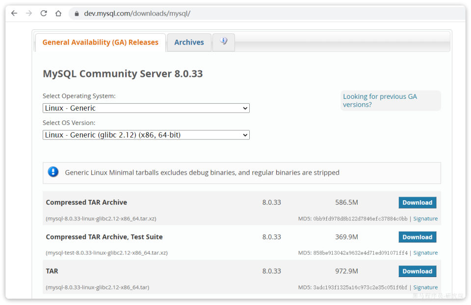
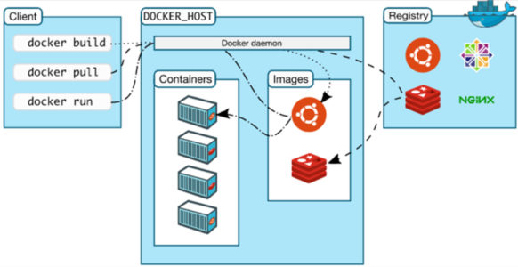

[109 篇](/posts/编程学习/javaweb学习笔记/109-项目部署到linux/)把 Tlias 搬上了 Linux 服务器：前端静态资源进了 nginx 的 html 目录，后端 jar 用 nohup 跑起来。但回头看那台服务器上的东西是怎么来的——[108 篇](/posts/编程学习/javaweb学习笔记/108-linux软件安装/)里 JDK、MySQL、Nginx 是一样一样**手工装上去**的：光 MySQL 就是"卸 mariadb → 解压改名 → 配环境变量 → 注册系统服务 → 初始化 → 启动 → 改密码授权"一长串，一步错了还得从头查。

这一篇（PPT 第 1～21 页）要介绍的 **Docker**，就是来解决"装环境太累"这件事的。它是第 20 章（项目部署 Docker）的**快速入门**——第 1 页封面写着这一章的名字"项目部署(Docker)"，PPT 第 12、21 页那张目录页上写着这一章的三个部分：**快速入门 / Docker核心 / 项目部署**，本篇点亮第一张卡片（第 13 页那张"快速入门 01"的标题页就是它），后两块分别在 [111 篇](/posts/编程学习/javaweb学习笔记/111-docker常见命令与数据卷/)、[112 篇](/posts/编程学习/javaweb学习笔记/112-docker自定义镜像与网络/)、[113 篇](/posts/编程学习/javaweb学习笔记/113-docker项目部署与dockercompose/)里。

| PPT 页 | 内容 | 本篇对应小节 |
| --- | --- | --- |
| 1 | 封面——"项目部署(Docker)" | 开篇 |
| 2 | 什么是 Docker（一句话定义） | Docker 是什么 |
| 3～7 | Linux 中安装 MySQL 回顾（六屏命令：卸载 → 解压 → 环境变量 → 注册服务 → 初始化 → 启动改密码） | 先回顾一下 |
| 8 | 同一屏命令的尾巴 + 三条吐槽（命令太多 / 步骤太多 / 安装包找不到） | 三条痛点 |
| 9 | "如何解决？" | Docker 是什么 |
| 10 | "如何解决？"——一行 `docker run` + 拉取日志 | 一条命令装 MySQL |
| 11 | "Docker：快速构建、运行、管理应用的工具" | Docker 是什么 |
| 12 | 章节目录页（快速入门 / Docker核心 / 项目部署） | 开篇 |
| 13 | 小节标题页——"快速入门 01" | 开篇 |
| 14 | 安装 MySQL——完整命令 + 前置条件 | 一条命令装 MySQL |
| 15 | 镜像和容器（概念 + 镜像仓库） | 镜像与容器 |
| 16 | 镜像和容器（结构图：Client / daemon / Server / Registry） | 一张结构图 |
| 17 | 问答页——镜像 / 容器 / 镜像仓库分别是什么 | 三个问答 |
| 18 | 命令解读（`-d` / `--name` / `-p` / `-e` / 镜像名）+ 端口映射示意 | 命令解读 |
| 19 | 镜像命名规范 `[repository]:[tag]` | 镜像命名规范 |
| 20 | 问答页——`docker run` 常见参数 + 镜像名称结构 | 第二张问答页 |
| 21 | 章节目录页（讲完"快速入门"回到这里） | 小结 |

## 先回顾一下：在 Linux 里装一个 MySQL 有多累（PPT 第 3～8 页）

PPT 第 3～8 页是**第 19 章的"安装 MySQL 回顾"**：六屏终端，把 [108 篇](/posts/编程学习/javaweb学习笔记/108-linux软件安装/)里那一整套命令原样滚了一遍。它不是在教新东西，而是在**铺痛点**——所以这一段要连着看，看的不是命令本身，而是"一共要敲多少东西"。

| PPT 页 | 这一段在干什么 | 关键命令（PPT 原文） |
| --- | --- | --- |
| 3 | 查看并卸载系统自带的 mariadb | `rpm -qa \| grep mysql`、`rpm -qa \| grep mariadb`、`rpm -e --nodeps mariadb-libs-5.5.60-1.el7_5.x86_64` |
| 4 | 上传安装包、解压缩、移动并改名 | `tar -xvf mysql-8.0.30-linux-glibc2.12-x86_64.tar.xz`、`mv mysql-8.0.30-linux-glibc2.12-x86_64 /usr/local/mysql`、`cd /usr/local/mysql` |
| 5 | 配置环境变量、刷新、注册成系统服务 | `vim /etc/profile`、`source /etc/profile`、`cp /usr/local/mysql/support-files/mysql.server /etc/init.d/mysql`、`chkconfig --add mysql` |
| 6 | 建用户组和用户、初始化数据库 | `groupadd mysql`、`useradd -r -g mysql -s /bin/false mysql`、`mysqld --initialize --user=mysql --basedir=/usr/local/mysql --datadir=/usr/local/mysql/data` |
| 7 | 启动服务、用临时密码登录、改密码 | `systemctl start mysql`、`mysql -uroot -pxxxxx`、`ALTER USER 'root'@'localhost' IDENTIFIED WITH mysql_native_password BY '1234';` |
| 8 | 第 7 页的尾巴（"后续省略"）——然后给出三条吐槽 | 见下面三条痛点 |


*图：PPT 第 3～8 页配的这张图是 MySQL 官网的下载页（`dev.mysql.com/downloads/mysql`）——"General Availability (GA) Releases"里要选 `Linux - Generic`、`Linux - Generic (glibc 2.12) (x86, 64-bit)`，再从三个压缩包里挑出那个 586.5M 的 `mysql-8.0.33-linux-glibc2.12-x86_64.tar.xz`。PPT 第 8 页那句"安装包哪里下载，找不到"说的就是这一步：光把页面找对、把平台和包名选对，就够劝退一批人*

六屏命令滚完，PPT 第 8 页把这一整套的"代价"总结成三句话（原文）：

> - 命令太太太多，记不住
> - 步骤太太太多，易出错
> - 安装包哪里下载，找不到

这三句不是抱怨，是**三条需求**——后面的 Docker 就是冲着它们来的：

| PPT 的吐槽 | 手工装的实际情况 | Docker 想怎么解决 |
| --- | --- | --- |
| 命令太多，记不住 | 上面那张表里 15 条命令，还只是"装 MySQL"一件小事 | 只有一条 `docker run` |
| 步骤太多，易出错 | 顺序还有讲究（不卸 mariadb 装不上、不 `source` 敲不到命令、不注册服务没法 `systemctl`） | 镜像里**环境已经装好了**，没有"中间步骤"可错 |
| 安装包找不到 | 要自己去官网翻版本、选平台、下几百 MB 的包再传上去 | 从**镜像仓库**拉现成的，一条命令自动下载 |

## Docker 是什么（PPT 第 2、9、11 页）

PPT 第 2 页在封面之后第一页就给了定义，第 11 页又原样重复了一遍：

> **Docker 就是一款快速构建、运行、管理应用的工具。**

第 9 页则只有两个字——"如何解决？"：前面刚铺完三条痛点，这一页就是转折点，答案在第 10、11 页。这句定义里的三个动词，正好对应三条痛点：

| 动词 | 说的是什么 | 对应哪条痛点 |
| --- | --- | --- |
| **构建** | 把"应用 + 它需要的运行环境、配置、函数库"打成一个包（**镜像**） | 安装包找不到——包由别人做好、放在仓库里 |
| **运行** | 把这个包在机器上跑起来，变成一个**容器** | 步骤太多——没有解压、配环境变量、注册服务这些中间步骤 |
| **管理** | 起停、看日志、进容器、删掉重来 | 命令太多——一套统一的 `docker xxx` 命令，所有软件都长一个样 |

一句话记住区别：**以前是"往机器上装软件"，现在是"把装好的软件搬过来跑"**。

> [!TIP]
> Docker 本身也要先装上：PPT 第 14 页的前提里写着"确保你的虚拟机已经安装 Docker，且网络开通"。Windows / macOS 上装的就是本篇实测用的 **Docker Desktop**（一个带界面的安装包，装完 `docker` 命令就有了），Linux 服务器上装的是 Docker Engine——两种装法都能得到同一套命令。本机这台 Docker Desktop 是早就装好的，本轮**没有走安装流程**（见后面的实测一节）。

## 一条命令装 MySQL（PPT 第 10、14 页）

PPT 第 10 页把两条路并排放：左边是第 3～8 页那六屏命令，右边只有一行：

```bash
docker run -d --name mysql -p 3307:3306 -e MYSQL_ROOT_PASSWORD=123 mysql:8
```

第 14 页把这条命令写成更清楚的**多行续行**形式（`\` 表示"这条命令还没完，下一行接着"），并给了前置条件：

> 先停掉虚拟机中的 MySQL，确保你的虚拟机已经安装 Docker，且网络开通的情况下，执行下面命令即可安装 MySQL：
>
> ```bash
> docker run -d \
> --name mysql \
> -p 3307:3306 \
> -e TZ=Asia/Shanghai \
> -e MYSQL_ROOT_PASSWORD=123 \
> mysql:8
> ```

**为什么先停掉机器上原来那个 MySQL**：这条命令把容器里的 3306 映射到了宿主机的 **3307**，端口上其实不冲突；课程让先停，是为了**不搞混"现在连的到底是哪一个 MySQL"**——原来的还开着，3306 上跑的是第 19 章手工装的那个，查问题时会分不清。停掉之后，这台机器上的 MySQL 就只剩容器里这一个了（本机实测的对应事实：容器和宿主机的端口是**两套**，下面"命令解读"一节细说）。

第 10 页还附了这条命令真正跑起来时的**拉取日志**（原文）：

```
Unable to find image 'mysql:latest' locally
latest: Pulling from library/mysql
72a69066d2fe: Pull complete
93619dbc5b36: Pull complete
99da31dd6142: Pull complete
626033c43d70: Pull complete
Status: Downloaded newer image for mysql:latest
a6cec8ff4765ca0876d0453f3ccab205fca29b5dce74f8cfbad8d76571bf79be
```

这几行的意思，一行一行对：

| 日志行 | 它在说什么 |
| --- | --- |
| `Unable to find image 'mysql:latest' locally` | 本地没有这个镜像，准备去仓库拉 |
| `latest: Pulling from library/mysql` | 正在从 `library/mysql`（Docker Hub 官方命名空间）拉取 |
| `72a69066d2fe: Pull complete` … | 镜像**分层**下载，每层一行（"层"的概念在 [112 篇](/posts/编程学习/javaweb学习笔记/112-docker自定义镜像与网络/)细讲） |
| `Status: Downloaded newer image for mysql:latest` | 下载完成 |
| `a6cec8ff4765…` | 最后这串十六进制是 `docker run` 打印的**容器 ID**——容器已经跑起来了 |

> [!NOTE]
> 日志里写的是 `mysql:latest`，而命令里写的是 `mysql:8`——因为这份日志是**没带 tag 的那次运行**留下的：不写版本号时默认就是 `latest`（PPT 第 19 页那句话的实例）。看到 `latest` 不用奇怪，它就是"最新版"的意思。

和 [108 篇](/posts/编程学习/javaweb学习笔记/108-linux软件安装/)那套手工流程一比，差别是全方位的：

| 环节 | 手工装（[108 篇](/posts/编程学习/javaweb学习笔记/108-linux软件安装/)） | Docker |
| --- | --- | --- |
| 找安装包 | 去官网翻版本、选平台、下几百 MB 的包再上传 | 不用找——镜像仓库里有现成的，`docker run` 时自动下载 |
| 安装 | 解压 → 配环境变量 → 注册系统服务 → 建用户 → 初始化（十几条命令） | 一条 `docker run` |
| 启动 / 停止 | `systemctl start/stop mysql` | `docker start/stop mysql` |
| 卸载 | `rpm -e` + 删目录 + 清配置，还可能卸不干净 | `docker rm` 一条（[111 篇](/posts/编程学习/javaweb学习笔记/111-docker常见命令与数据卷/)） |
| 换版本 | 整套流程重来一遍 | 把 `mysql:8` 换成别的 tag 再来一条 |
| 装第二个软件 | 又是一套全新的步骤（nginx 是源码编译，JDK 是解压） | 还是 `docker run`，只是镜像名换掉 |

## 镜像与容器（PPT 第 15、16 页）

第 15 页和第 16 页是同一段文字的两次出现（第 16 页多了结构图），原文把三个概念一次说清：

> 当我们利用 Docker 安装应用时，Docker 会自动搜索并下载应用**镜像（image）**。镜像不仅包含**应用本身**，还包含应用运行所需要的**环境、配置、系统函数库**。Docker 会在运行镜像时创建一个**隔离环境**，称为**容器（container）**。
>
> **镜像仓库**：存储和管理镜像的平台，Docker 官方维护了一个公共仓库：**Docker Hub**。

先看"镜像里到底装了什么"——第 15 页把镜像拆成四块：

| 镜像里装的 | 举例（还是拿 MySQL 说） | 为什么必须有 |
| --- | --- | --- |
| **应用软件** | MySQL 本身 | 这是我们要的东西 |
| **运行环境** | MySQL 依赖的 glibc 等系统库 | 手工装时"平台选错、版本对不上"就出在这儿 |
| **配置文件** | MySQL 的默认配置 | 装完能直接启动，不用先改配置 |
| **函数库** | 各种依赖库 | 手工装时"缺依赖"要自己补，镜像里已经齐了 |

再看"容器"：**镜像是一份"死的"文件包，容器是它"跑起来"之后的那个隔离环境**。同一个镜像可以跑出好几个容器（各自独立、互不干扰）。两个类比：

| 类比 | 对应 |
| --- | --- |
| 安装包（`.exe` / `.tar.gz`） | **镜像** |
| 装好并正在运行的程序 | **容器** |
| 下载站 / 应用商店 | **镜像仓库** |

### 一张结构图（PPT 第 16 页）


*图：PPT 第 16 页的结构图——左边是 **Client**（我们敲命令的地方），中间是 **DOCKER_HOST**（里面跑着 `docker daemon` 守护进程，下面挂着 Containers 容器和 Images 本地镜像），右边是 **Registry** 镜像仓库（图上画着 Ubuntu、MySQL、NGINX 这些现成的镜像）。箭头就是数据流向：`docker pull` 把镜像从仓库拉到本地，`docker run` 拿本地镜像创建容器，`docker build` 则从 Dockerfile 造出一个新镜像（[112 篇](/posts/编程学习/javaweb学习笔记/112-docker自定义镜像与网络/)）*

这张图按角色拆开看：

| 图上的框 | 是什么 | 我们和它的关系 |
| --- | --- | --- |
| **Client** | Docker 客户端——就是终端里那个 `docker` 命令 | 我们敲的 `docker run` / `docker pull` / `docker build` 都是它在发指令 |
| **docker daemon**（守护进程） | 真正干活的**后台进程**（装好 Docker 后一直在跑） | 我们看不见它，命令都发给它执行；`docker info` 里的 "Server" 就是它 |
| **Images**（本地镜像） | 已经拉到这台机器上的镜像 | `docker images` 能列出来（[111 篇](/posts/编程学习/javaweb学习笔记/111-docker常见命令与数据卷/)） |
| **Containers**（容器） | 由镜像跑出来的隔离环境 | `docker ps` 看运行中的容器 |
| **Registry**（镜像仓库） | 存镜像的地方，最大的是 **Docker Hub** | `docker pull` 从它下载、`docker push` 往它上传 |

## 三个问答（PPT 第 17 页）

第 17 页是这一节的**问答页**，三个问题正好是上面三个概念的"考试版答案"，原文如下：

> 1. 什么是镜像？
> 将应用所需的运行环境、配置文件、系统函数库等与应用一起打包得到的就是镜像
> 2. 什么是容器？
> 为每个镜像的应用进程创建的隔离运行环境就是容器
> 3. 什么是镜像仓库？
> 存储和管理镜像的平台就是镜像仓库
> DockerHub 是目前最大的镜像仓库，其中包含各种常见的应用镜像

三个答案里最值得抠的是**容器那一句的"每个……隔离"**：一个镜像可以起多个容器，每个容器有自己独立的文件系统、进程、网络，互不干扰——所以同一台机器上可以同时跑两个 MySQL 容器（用不同端口映射出去），也可以一个容器坏了直接删掉重建，不影响别的。

## 命令解读：docker run 的四个参数（PPT 第 18 页）

第 18 页把第 14 页那条命令拆开逐段解释，原文如下：

> - `docker run`：创建并运行一个容器，`-d` 是让容器在后台运行
> - `--name mysql`：给容器起个名字，必须唯一
> - `-p 3307:3306`：设置端口映射
> - `-e KEY=VALUE`：是设置环境变量
> - `mysql:8`：指定运行的镜像的名字，版本

逐条展开：

| 参数 | 写法 | 作用 | 细节 |
| --- | --- | --- | --- |
| **`docker run`** | `docker run [参数] 镜像名` | 创建并运行一个容器 | 它 = 创建容器 + 启动容器 两步合一 |
| **`-d`** | `-d` | 让容器在**后台**运行（detached） | 不加它，容器会把终端"占住"、日志直接打在屏幕上，按 Ctrl+C 就退了 |
| **`--name`** | `--name mysql` | 给容器起个名字 | **必须唯一**——已经有一个叫 `mysql` 的容器时，再起同名会报冲突；有了名字后面才能用 `docker stop mysql` 这种"按名字操作" |
| **`-p`** | `-p 3307:3306` | **端口映射**：`宿主机端口:容器端口` | 左边是宿主机的、右边是容器里的，**顺序不能反**（下面细说） |
| **`-e`** | `-e TZ=Asia/Shanghai`、`-e MYSQL_ROOT_PASSWORD=123` | 设置**环境变量** | 给容器里的程序传配置；能传哪些是**镜像规定的**（MySQL 镜像认 `MYSQL_ROOT_PASSWORD`，nginx 镜像就不认） |
| （镜像名） | `mysql:8` | 指定运行的镜像**名字 + 版本** | 本地没有会自动去仓库拉（第 10 页那段日志） |

### 端口映射是怎么回事（PPT 第 18 页的示意图）

第 18 页右侧画了一张端口映射的示意图，信息量都在上面：

```
        宿主机 192.168.100.128                容器（隔离环境）
        ┌──────────────────┐                 ┌──────────────────┐
        │   端口 3307      │ ──── 映射 ────► │   端口 3306      │
        └──────────────────┘                 │   （MySQL 在里面）│
                                             └──────────────────┘
   项目里连数据库写的是：
   jdbc:mysql://192.168.100.128:3307        ← 宿主机 IP + 宿主机端口
```

- **为什么要映射**：容器是**隔离**的，它的 3306 只活在容器自己的网络里，外面的机器根本看不见。`-p 3307:3306` 就是在宿主机上开一个 3307 的口子，所有发给"宿主机 3307"的流量都转进容器的 3306。
- **为什么左边写 3307**：因为宿主机的 3306 通常留给"机器上原来那个 MySQL"（或者留给以后别的容器）——一个端口只能被一个东西占用，把容器映射到 3307 就互不打架了。
- **连接串怎么写**：PPT 第 18 页写得很清楚——`jdbc:mysql://192.168.100.128:3307`。**写的是宿主机的 IP 和宿主机的端口**，不是 3306、也不是容器的 IP。项目在宿主机上跑（或从 Windows 连服务器）时，走的就是这条映射通道。
- 顺序记法：`-p 宿主机:容器`——"**外面 : 里面**"，和 [109 篇](/posts/编程学习/javaweb学习笔记/109-项目部署到linux/) nginx 反向代理"外面 80 → 里面 8080"是同一个思路。

### `-e` 的两条环境变量

第 14 页的命令里给了两条 `-e`，一条是时区、一条是密码：

| 环境变量 | 值 | 为什么要有它 |
| --- | --- | --- |
| `TZ=Asia/Shanghai` | 上海时区 | 容器默认是 UTC 时间，日志、`now()` 会差 8 小时——写库时间对不上时先想它 |
| `MYSQL_ROOT_PASSWORD=123` | root 的初始密码 | MySQL 镜像**第一次启动时会用这个值设 root 密码**；不给它，MySQL 8 镜像会拒绝启动 |

这也解释了 `-e` 的意义：**镜像把"可配置的东西"留成了环境变量**，用 `-e` 在启动时传进去——不传就用默认值（或者像 `MYSQL_ROOT_PASSWORD` 这样必须传）。想知道某个镜像支持哪些 `-e`，看它在 Docker Hub 上的说明页（PPT 第 32 页的 MySQL 案例就标注了"官方文档"）。

## 镜像命名规范（PPT 第 19 页）

第 19 页只有一条规则：

> 镜像名称一般分两部分组成：`[repository]:[tag]`。
> 其中 repository 就是镜像名，tag 是镜像的版本。
> 在没有指定 tag 时，默认是 latest，代表最新版本的镜像。

拿 `mysql:8` 拆开看：

| 部分 | 值 | 含义 |
| --- | --- | --- |
| repository | `mysql` | 镜像名（官方镜像直接用软件名） |
| 分隔符 | `:` | 名字和版本之间用冒号 |
| tag | `8` | 版本号——同一个镜像的不同版本用 tag 区分（`mysql:5.7`、`mysql:8.0.30`…） |

三个要点：

1. **不写 tag 就是 `latest`**：`docker run mysql` 等价于 `docker run mysql:latest`——第 10 页那份日志里的 `mysql:latest` 就是这么来的。
2. **tag 决定"装哪个版本"**：课程统一用 `mysql:8`（大版本 8）。换 tag 就是换版本，这是 Docker 比手工装省事的地方之一。
3. 完整写法其实还能更长（前面带仓库地址、命名空间，比如本机实测里那些 `docker.m.daocloud.io/library/alpine`）——**课程里只讲 `[repository]:[tag]` 两段**，够用了。

## 第二张问答页（PPT 第 20 页）

第 20 页是这一节的收尾问答，把前面所有知识点压成两行，原文如下：

> **docker run 命令中的常见参数**：
> `-d`：让容器后台运行
> `--name`：给容器命名，唯一
> `-e`：环境变量
> `-p`：宿主机端口映射到容器内端口
>
> **镜像名称结构**：`Repository:TAG`
> 镜像名 / 版本号

这张页就是"这一节要背下来的两件事"：

| 要记住的 | 内容 | 用的时候 |
| --- | --- | --- |
| `docker run` 四个参数 | `-d` 后台、`--name` 命名（唯一）、`-e` 环境变量、`-p` 宿主机端口:容器端口 | 起任何容器都是这套（[111 篇](/posts/编程学习/javaweb学习笔记/111-docker常见命令与数据卷/)的 nginx、[113 篇](/posts/编程学习/javaweb学习笔记/113-docker项目部署与dockercompose/)的部署） |
| 镜像名称结构 | `Repository:TAG`（镜像名 + 版本号），不写 TAG 默认 `latest` | 认镜像名、换版本 |

## 本机实测：Docker 环境与"拉镜像"的坑

> [!IMPORTANT]
> **这一节是本机实测（Docker Desktop 29.1.3）**——本机装了 Docker Desktop（Windows 版），实验期间启动过它、跑过容器，实验完成后已经关掉并把实验产物清干净了。下面这些输出都是当时记下来的。

先看环境（`docker --version` / `docker compose version` / `docker info`）：

```
$ docker --version
Docker version 29.1.3

$ docker compose version
Docker Compose version v2.40.3-desktop.1

$ docker info（关键字段）
Server: 29.1.3
产品: Docker Desktop
Docker Root Dir: /var/lib/docker
Registry Mirrors: []          ← 没配镜像加速
```

**然后踩到了本篇最值得记的一个坑**——用"裸名"去拉官方镜像会失败：

```
$ docker run -d --name demo alpine sleep 300
Unable to find image 'alpine:latest' locally
docker: Error response from daemon: failed to resolve reference "docker.io/library/alpine:latest":
  failed to authorize: ... Get "https://auth.docker.io/token?...": EOF
```

报错的意思是：本地没有 `alpine` 这个镜像，于是去 `docker.io`（Docker Hub）拉，但**连不上它的认证服务**（`auth.docker.io` 请求直接 `EOF`）。`docker info` 里那句 `Registry Mirrors: []` 就是原因——**没配国内镜像加速**，直连 Docker Hub 在我们这边经常是连不上的。

解决办法有两条（笔记里按课程写 `docker pull mysql:8` 这种标准写法，在国内环境要照下面改一下）：

| 办法 | 怎么做 | 效果 |
| --- | --- | --- |
| ① 配镜像加速 | 在 Docker Desktop 的设置里加 Registry Mirror（或改 daemon 的 `registry-mirrors`），之后**原来的命令原样可用** | `Registry Mirrors` 不再是空的，`docker pull mysql:8` 走加速站 |
| ② 用带国内源前缀的镜像名 | 把 `mysql:8` 写成 `docker.m.daocloud.io/library/mysql:8` 这种形式 | 不用改配置，命令里把镜像名换掉就行 |

本机当时走的是第 ② 条——`docker images` 里那些镜像名都带着前缀，就是这么来的（本机实测）：

```
$ docker images
REPOSITORY                                TAG      SIZE
docker.m.daocloud.io/library/alpine       latest   13MB
docker.m.daocloud.io/library/mongo        7        1.18GB
```

注意这两个名字的结构：`docker.m.daocloud.io`（仓库地址）+ `library`（命名空间，官方镜像都在 library 下）+ `alpine`（镜像名）+ `latest`（tag）——正好是上面"镜像命名规范"那条规则的**完整形态**。本机的 `alpine` 镜像也正是 [111 篇](/posts/编程学习/javaweb学习笔记/111-docker常见命令与数据卷/) 里做容器、数据卷实验时用的"零下载"底座。

> [!WARNING]
> 看到 `failed to authorize ... EOF` 这类报错，**先别怀疑命令写错了**——多半是网络到 Docker Hub 不通。判断方法：`docker info` 看 `Registry Mirrors` 是不是空的；验证方法：用带前缀的镜像名再拉一次（本机实测同一个 `alpine` 带前缀就能用）。课程 PPT 里的 `docker run … mysql:8`、`docker pull nginx` 都是"网络畅通时的标准写法"。

## 小结

| 问题 | 答案 |
| --- | --- |
| Docker 是什么？ | 一款**快速构建、运行、管理应用**的工具（PPT 第 2、11 页原话） |
| 它解决什么痛点？ | 手工装软件"**命令太多记不住、步骤太多易出错、安装包找不到**"（PPT 第 8 页） |
| 镜像是什么？ | 把应用**和它的运行环境、配置、系统函数库一起打包**得到的文件包（PPT 第 15、17 页） |
| 容器是什么？ | 运行镜像时创建的**隔离运行环境**，为每个镜像的应用进程各建一个（PPT 第 15、17 页） |
| 镜像仓库是什么？ | 存储和管理镜像的平台；**Docker Hub** 是目前最大的公共仓库（PPT 第 17 页） |
| 结构图上都有谁？ | **Client**（敲命令）→ **docker daemon**（干活）→ 本地 **Images** / **Containers**，另一头是 **Registry**（PPT 第 16 页） |
| 镜像名怎么写？ | `[repository]:[tag]`，如 `mysql:8`；不写 tag 默认 `latest`（PPT 第 19 页） |
| `docker run` 四个参数？ | `-d` 后台运行、`--name` 命名（**唯一**）、`-p 宿主机端口:容器端口`、`-e KEY=VALUE` 环境变量（PPT 第 18、20 页） |
| `-p 3307:3306` 什么意思？ | 把**宿主机的 3307** 映射到**容器里的 3306**；项目里连它写 `jdbc:mysql://宿主机IP:3307`（PPT 第 18 页） |
| 一条命令装 MySQL 是什么？ | `docker run -d --name mysql -p 3307:3306 -e TZ=Asia/Shanghai -e MYSQL_ROOT_PASSWORD=123 mysql:8`（PPT 第 14 页） |
| 为什么装之前要先停掉机器上的 MySQL？ | 避免"连的到底是哪一个"搞混——容器那一个映射在 3307，和机器上原来的 3306 是两回事 |
| 本机实测记下了什么？ | Docker Desktop **29.1.3**（Compose v2.40.3）；**没配镜像加速**时裸名拉镜像报 `failed to authorize ... EOF`，带前缀的镜像名（`docker.m.daocloud.io/library/xxx`）可用 |

## 相关

- [上一篇：项目部署到Linux](/posts/编程学习/javaweb学习笔记/109-项目部署到linux/)
- [下一篇：Docker常见命令与数据卷](/posts/编程学习/javaweb学习笔记/111-docker常见命令与数据卷/)

## 练习题

### 一、知识回顾（读完直接做下面的实践题）

1. **Docker 是什么**：一款**快速构建、运行、管理应用**的工具（PPT 第 2、11 页）——构建是把应用和环境打成镜像、运行是把镜像跑成容器、管理是起停删看日志
2. **它冲着哪三条痛点来的**（PPT 第 8 页）：命令太太太多记不住、步骤太太太多易出错、安装包哪里下载找不到——分别对应"一条 `docker run`"、"环境已在镜像里"、"从镜像仓库拉现成的"
3. **镜像是什么**：把**应用本身 + 运行环境 + 配置 + 系统函数库**一起打包得到的文件包（PPT 第 15、17 页）
4. **容器是什么**：运行镜像时创建的**隔离运行环境**，为每个镜像的应用进程各建一个——同一个镜像能起多个互不干扰的容器（PPT 第 15、17 页）
5. **镜像仓库是什么**：存储和管理镜像的平台；**Docker Hub** 是最大的公共仓库（PPT 第 17 页）
6. **结构图上的四个角色**：Client（敲 `docker run/pull/build` 的地方）→ docker daemon（守护进程，真正干活）→ 本地 Images 与 Containers；另一头 Registry 镜像仓库（PPT 第 16 页）
7. **镜像命名规范**：`[repository]:[tag]`，如 `mysql:8`——repository 是镜像名、tag 是版本；**不写 tag 默认 `latest`**（PPT 第 19 页）
8. **`docker run` 四个参数**：`-d` 让容器后台运行、`--name` 给容器命名（**必须唯一**）、`-p` 设置端口映射（`宿主机端口:容器端口`）、`-e KEY=VALUE` 设置环境变量（PPT 第 18、20 页）
9. **端口映射怎么理解**：容器是隔离的，外面看不见它的 3306；`-p 3307:3306` 把宿主机的 3307 转到容器的 3306，项目里连数据库写 `jdbc:mysql://192.168.100.128:3307`——**宿主机 IP + 宿主机端口**（PPT 第 18 页）
10. **装 MySQL 的那条命令 + 前置条件**：`docker run -d --name mysql -p 3307:3306 -e TZ=Asia/Shanghai -e MYSQL_ROOT_PASSWORD=123 mysql:8`；前置是"先停掉机器上原来的 MySQL、装好 Docker、网络开通"（PPT 第 14 页）。`TZ` 管时区，`MYSQL_ROOT_PASSWORD` 是 MySQL 镜像要求的初始 root 密码
11. **本机实测（Docker Desktop 29.1.3）**：`docker --version` → 29.1.3、Compose → v2.40.3；`docker info` 里 `Registry Mirrors: []`（没配加速）；裸名拉镜像报 `failed to authorize ... EOF`；带前缀的镜像名 `docker.m.daocloud.io/library/xxx` 可以正常用

### 二、裸写题

- [ ] **2-1 用一条命令把 MySQL 跑起来**
  需求：一台装好 Docker、能联网的 Linux 服务器（IP `192.168.100.128`）。要求用**一条命令**起一个 MySQL 容器：后台运行、容器名叫 `mysql`、用 `mysql:8` 这个镜像、时区设成上海、root 初始密码设成 `123`，并且让**服务器外面的机器**能连上这个数据库（映射到宿主机的 3307）。
  素材：容器里的 MySQL 监听 3306；服务器上原来装的 MySQL 要先停掉。

  > [!TIP]- 提示（先自己想，实在想不出再点开）
  > **一级 · 思路**：四个参数各管一件事——**后台**、**名字**、**端口**、**环境变量**，最后跟上镜像名；顺序是"命令 → 参数 → 镜像名"
  > **二级 · 方法**：`docker run -d --name … -p 宿主机端口:容器端口 -e KEY=VALUE 镜像名:tag`；端口映射左外右内（宿主机 3307 → 容器 3306）；两条 `-e` 分别是 `TZ=Asia/Shanghai` 与 `MYSQL_ROOT_PASSWORD=123`
  > **三级 · 骨架**：`docker run -____ --____ mysql -p ____:____ -e TZ=____ -e MYSQL_ROOT_PASSWORD=____ mysql:____`

  > [!TIP]- 参考答案（做完再点开）
  > ```bash
  > docker run -d \
  >   --name mysql \
  >   -p 3307:3306 \
  >   -e TZ=Asia/Shanghai \
  >   -e MYSQL_ROOT_PASSWORD=123 \
  >   mysql:8
  > ```
  > 逐段对号：`-d` 后台运行；`--name mysql` 容器名（唯一）；`-p 3307:3306` 宿主机的 3307 映射到容器里的 3306；`-e TZ=Asia/Shanghai` 时区；`-e MYSQL_ROOT_PASSWORD=123` root 初始密码；`mysql:8` 镜像名与版本。
  > 验证：`docker ps` 能看到 `mysql` 容器在运行、PORTS 列显示 `0.0.0.0:3307->3306/tcp`；在别的机器上用客户端连 `192.168.100.128:3307`，用户名 root、密码 `123`。
  > 注意：① 顺序是 `宿主机:容器`，写反了就连不上；② 名字重复会报冲突（先 `docker ps -a` 看看有没有同名容器）；③ 不写 tag 就是 `latest`，课程统一用 `mysql:8`。

- [ ] **2-2 读懂别人写的一条命令**
  需求：同事给了你一条命令，让你说清它干了什么：
  `docker run -d --name nginx -p 80:80 -e TZ=Asia/Shanghai nginx:1.20.2`
  请回答：① 这条命令要起什么、起完之后容器叫什么名字；② `-p 80:80` 两边的 80 分别是谁的端口、为什么这次两边可以写成一样；③ `-e TZ=Asia/Shanghai` 有什么用；④ 如果本地没有 `nginx:1.20.2` 这个镜像，Docker 会做什么；⑤ 命令跑完之后，用哪条命令能确认容器在运行。

  > [!TIP]- 提示（先自己想，实在想不出再点开）
  > **一级 · 思路**：把命令拆成"命令本体 + 参数 + 镜像名"三块，参数一个一个对号；"本地没有镜像"这件事想一想第 10 页那份拉取日志
  > **二级 · 方法**：`-d` 后台、`--name` 名字、`-p 宿主机:容器`、`-e` 环境变量、`镜像名:tag`；本地没有镜像时 Docker 会**自动去镜像仓库搜索并下载**；查看运行中容器用 `docker ps`
  > **三级 · 骨架**：① 起的是 ____ 应用、容器名 ____；② 左边 80 是 ____ 的、右边 80 是 ____ 的，两边相同是因为 ____；③ `-e` 设置的是 ____；④ 本地没有镜像时 Docker 会去 ____ 下载；⑤ 确认命令是 `docker ____`

  > [!TIP]- 参考答案（做完再点开）
  > ① 起的是 **nginx**（Web 服务器）；容器名字叫 **nginx**（`--name nginx`）。
  > ② `-p 80:80` 是"**宿主机 80 : 容器 80**"：左边是服务器对外开的端口，右边是容器里 nginx 真正监听的端口。两边都写 80 是因为**宿主机的 80 正好空着**（没有被别的程序占用）——如果宿主机 80 被占了（比如 [109 篇](/posts/编程学习/javaweb学习笔记/109-项目部署到linux/)里那个装在机器上的 nginx 还在跑），就要改成 `-p 90:80` 之类，**左边随便换、右边不能动**（右边由镜像里的程序决定）。
  > ③ `-e TZ=Asia/Shanghai` 把容器里的时区设成上海，避免日志时间差 8 小时。
  > ④ 本地没有这个镜像时，Docker **自动去镜像仓库（默认 Docker Hub）搜索并下载**，下载完再创建容器——就像第 10 页日志里的 `Unable to find image … locally` → `Pulling` → `Downloaded`。
  > ⑤ `docker ps`（PORTS 列会显示 `0.0.0.0:80->80/tcp`）。
  > 补充：这条命令里的容器名、镜像名、端口都是"起容器的人自己定的"，只有 `-p` 右边那个 80 是镜像里的 nginx 决定的。

- [ ] **2-3 镜像名里每一段是什么意思**
  需求：说出下面三个镜像名各自的 repository 和 tag，并说明它们分别会装到哪个版本：
  ① `mysql:8`　② `mysql`　③ `docker.m.daocloud.io/library/alpine:latest`
  然后回答：本机（`Registry Mirrors: []`）里用第 ② 种写法拉镜像会报什么错、为什么，两条解决办法分别是什么。

  > [!TIP]- 提示（先自己想，实在想不出再点开）
  > **一级 · 思路**：先按 `[repository]:[tag]` 切两段；再想"不写 tag 会怎样"；最后把"拉不到镜像"归到**网络到镜像仓库不通**这件事上
  > **二级 · 方法**：`[repository]:[tag]`，不写 tag 默认 `latest`；本机没配 Registry Mirror 时直连 `auth.docker.io` 会失败（`failed to authorize ... EOF`）；办法是配镜像加速或用带国内源前缀的镜像名
  > **三级 · 骨架**：① `mysql:8` → 镜像名 ____、版本 ____；② `mysql` → 等价于 `mysql:____`；③ 完整形式是"仓库地址/____/镜像名:tag"；④ 报错原文 `failed to ____ ... EOF`，原因是没配 ____

  > [!TIP]- 参考答案（做完再点开）
  > ① `mysql:8`：repository = `mysql`、tag = `8`，装 MySQL 的 8.x 版本。
  > ② `mysql`：**没写 tag，等价于 `mysql:latest`**（最新版）——第 10 页日志里的 `mysql:latest` 就是这么来的。
  > ③ `docker.m.daocloud.io/library/alpine:latest`：这是**完整形式**——`docker.m.daocloud.io` 是仓库地址（国内源）、`library` 是命名空间（官方镜像都在它下面）、`alpine` 是镜像名、`latest` 是 tag。
  > 拉不到镜像的部分：报错形如
  > ```
  > docker: Error response from daemon: failed to resolve reference "docker.io/library/alpine:latest":
  >   failed to authorize: ... Get "https://auth.docker.io/token?...": EOF
  > ```
  > 原因是**没配镜像加速**（`docker info` 里 `Registry Mirrors: []`），直连 Docker Hub 的认证服务不通。
  > 两条办法：① **配 Registry Mirror**（Docker Desktop 设置里加镜像加速地址），之后命令原样可用；② **用带国内源前缀的镜像名**（如 `docker.m.daocloud.io/library/mysql:8`），不改配置、只改镜像名。

- [ ] **2-4 找出这条命令里的问题**
  需求：小明照着 PPT 敲了下面这条命令，结果容器没起来。请逐条指出问题并给出正确写法（一共 4 处）：
  `docker run --name mysql -d -p 3306:3307 -e MYSQL_ROOT_PASSWORD 123 mysql:8`
  （他想要的是：后台运行的 MySQL 容器、名字叫 mysql、外面的 3307 连到容器里的 3306、root 密码 123。）

  > [!TIP]- 提示（先自己想，实在想不出再点开）
  > **一级 · 思路**：一处一处对"他想要的"和"他写的"——名字、后台、端口方向、环境变量的写法
  > **二级 · 方法**：`-p` 是"**宿主机:容器**"；`-e` 是"**KEY=VALUE**"，等号不能少、中间不能有空格
  > **三级 · 骨架**：① 端口顺序应为 `-p ____:____`；② `-e` 要写成 `-e MYSQL_ROOT_PASSWORD=____`；③ 检查容器名是否与已有容器 ____；④ 别忘了镜像名后面的 ____

  > [!TIP]- 参考答案（做完再点开）
  > 问题（对照"他想要的"）：
  > ① **端口映射写反了**：`-p 3306:3307` 是"宿主机 3306 → 容器 3307"，而他要的是外面 3307 连到容器里的 3306，应写 `-p 3307:3306`（**左外右内**）。写反的后果：连 3307 连不上，而且宿主机 3306 上如果还跑着老 MySQL 会直接冲突。
  > ② **`-e` 少写了等号**：`-e MYSQL_ROOT_PASSWORD 123` 会被当成"环境变量 `MYSQL_ROOT_PASSWORD`（值为空）+ 一个多余的参数"，必须写 `-e MYSQL_ROOT_PASSWORD=123`。
  > ③ **名字可能冲突**：`--name` 必须唯一，如果之前已经有个叫 `mysql` 的容器（哪怕是停止状态的），这条会报冲突——先 `docker ps -a` 查，有就先 `docker rm` 掉或者换个名字。
  > ④ **`mysql:8` 只写了镜像名和 tag**——这条本身没错（不写 tag 默认 latest），但课程统一写 `mysql:8` 更稳；真正容易漏的是**镜像名必须放在最后**（参数写完后跟镜像名），顺序写错 Docker 会把它当成参数。
  > 正确写法：
  > ```bash
  > docker run -d --name mysql -p 3307:3306 -e MYSQL_ROOT_PASSWORD=123 mysql:8
  > ```
  > 起完验证：`docker ps` 看状态与 PORTS；再看一眼容器里 MySQL 的日志 `docker logs mysql`（[111 篇](/posts/编程学习/javaweb学习笔记/111-docker常见命令与数据卷/)）。

### 三、综合题

- [ ] **3-1 给新同事写一份"用 Docker 起 MySQL"的交接说明**
  需求：新同事的电脑上**已经装好 Docker Desktop**，现在要在一台 Linux 服务器（`192.168.100.128`）上把 MySQL 跑起来，给开发环境用。请写一份可以照着做的说明，要求包含：
  1. **先交代背景**：为什么不用 [108 篇](/posts/编程学习/javaweb学习笔记/108-linux软件安装/)那套手工装法（把 PPT 第 8 页的三条痛点写进去）；
  2. **起容器**：写出完整命令，并说明每个参数在干什么（后台、名字、端口、两条环境变量、镜像名）；
  3. **说清端口**：为什么映射到 3307 而不是 3306，以及**连接串应该怎么写**；
  4. **验证**：至少写出两条"确认它真的起来了"的办法（一条看容器状态、一条看日志或连接）；
  5. **万一拉不到镜像**：把本机实测那个坑（报错原文 + 两条解决办法）写进去。
  6. 最后用一张小表把"手工装 vs Docker 装"的差别列出来（找包、安装、启停、卸载、换版本）。

  > [!TIP]- 提示（先自己想，实在想不出再点开）
  > **一级 · 思路**：这份说明要能"从零照着做通"——所以顺序是"为什么 → 怎么做（命令+参数）→ 怎么连（端口与连接串）→ 怎么确认 → 出问题怎么办"
  > **二级 · 方法**：命令用 `docker run -d --name mysql -p 3307:3306 -e TZ=Asia/Shanghai -e MYSQL_ROOT_PASSWORD=123 mysql:8`；验证用 `docker ps` 和 `docker logs mysql`（或在别的机器上用客户端连 `192.168.100.128:3307`）；拉不到镜像时要么配 Registry Mirror、要么把镜像名换成带前缀的形式
  > **三级 · 骨架**：① 三条痛点：命令多 / 步骤多 / 包难找；② 命令五段（`-d`、`--name`、`-p`、`-e`×2、镜像名）；③ 连接串 `jdbc:mysql://____:____`；④ 验证 `docker ____` + `docker ____ mysql`；⑤ 报错 `failed to ____ ... EOF` → 配加速或换 ____ 名

  > [!TIP]- 参考答案（做完再点开）
  > ```
  > 【用 Docker 起一个 MySQL（开发环境）】
  >
  > 一、为什么不用手工装
  >   第 19 章那套手工装法的三条代价（PPT 第 8 页）：
  >   · 命令太太太多，记不住（卸载→解压→环境变量→注册服务→初始化→授权，十几条）
  >   · 步骤太太太多，易出错（顺序还有讲究，漏一步就卡住）
  >   · 安装包哪里下载，找不到（官网翻版本、选平台、几百 MB）
  >   Docker 的做法：环境已经装在镜像里，一条命令起容器。
  >
  > 二、起容器（服务器上执行，先确认机器上原来的 MySQL 已停掉）
  >   docker run -d \
  >     --name mysql \
  >     -p 3307:3306 \
  >     -e TZ=Asia/Shanghai \
  >     -e MYSQL_ROOT_PASSWORD=123 \
  >     mysql:8
  >   参数对号：
  >     docker run        创建并运行一个容器
  >     -d                后台运行（不占终端）
  >     --name mysql      容器名，必须唯一（后面 docker stop mysql 靠它）
  >     -p 3307:3306      宿主机 3307 → 容器 3306（左外右内）
  >     -e TZ=…           时区（不然日志和 now() 差 8 小时）
  >     -e MYSQL_ROOT_PASSWORD=123   MySQL 镜像要求的 root 初始密码
  >     mysql:8           镜像名:版本（本地没有会自动去仓库拉）
  >
  > 三、端口与连接串
  >   容器的 3306 是隔离的、外面看不见，所以映射到宿主机 3307：
  >   · 宿主机上原来的 MySQL 占用 3306，映射 3307 互不打架
  >   · 项目/客户端连它写：jdbc:mysql://192.168.100.128:3307
  >     （宿主机 IP + 宿主机端口，不是 3306、也不是容器的 IP）
  >
  > 四、验证
  >   docker ps                      → 状态 Up，PORTS 显示 0.0.0.0:3307->3306/tcp
  >   docker logs mysql              → 看 MySQL 启动日志（[111 篇]）
  >   别的机器用客户端连 192.168.100.128:3307（root / 123）→ 能连上就成
  >
  > 五、拉不到镜像怎么办（本机实测的坑）
  >   报错：
  >     docker: Error response from daemon: failed to resolve reference
  >     "docker.io/library/mysql:8": failed to authorize: … EOF
  >   原因：没配镜像加速（docker info 里 Registry Mirrors 为空），连不上 Docker Hub。
  >   办法①：在 Docker 设置里加 Registry Mirror，命令原样可用；
  >   办法②：把镜像名换成带国内源前缀的写法（如 docker.m.daocloud.io/library/mysql:8）。
  >
  > 六、手工装 vs Docker 装
  >   ┌────────┬──────────────────────────┬───────────────────────┐
  >   │ 环节   │ 手工装（108 篇）          │ Docker                │
  >   ├────────┼──────────────────────────┼───────────────────────┤
  >   │ 找包   │ 官网翻版本、选平台、上传   │ 从镜像仓库自动拉       │
  >   │ 安装   │ 十几条命令                │ 一条 docker run        │
  >   │ 启停   │ systemctl start/stop      │ docker start/stop      │
  >   │ 卸载   │ rpm -e + 删目录 + 清配置   │ docker rm              │
  >   │ 换版本 │ 整套重来                  │ 换 tag 再来一条        │
  >   └────────┴──────────────────────────┴───────────────────────┘
  > ```
  > 检查点：① 三条痛点写全；② 命令里五个参数一个不少、端口方向对；③ 连接串写的是宿主机 IP + 3307；④ 验证方式给了两条；⑤ 报错原文和两条办法都在。
