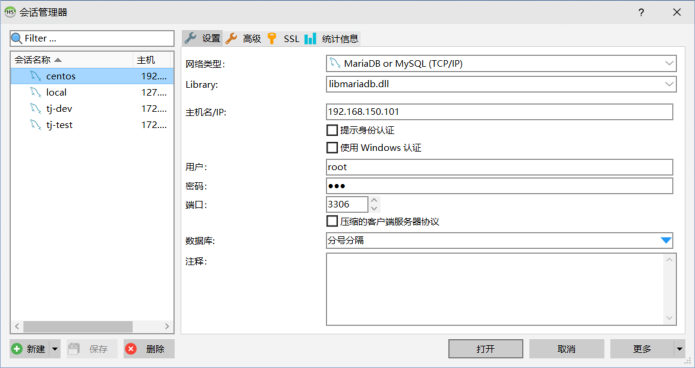
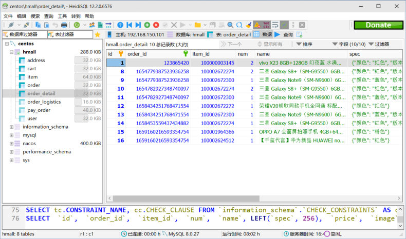

[110 篇](/posts/编程学习/javaweb学习笔记/110-docker快速入门/)用一条 `docker run` 把 MySQL 跑起来了，但那只是"起一个容器"。真到干活的时候，问题会一个接一个冒出来：容器起来了怎么看它在不在跑？日志在哪看？想进去改个文件怎么办？**容器删掉之后里面的数据还在吗**？

这一篇（PPT 第 22～33 页）就是补这些的。PPT 第 22、25 页那张目录页上，"Docker 核心"下面挂着四个入口——**常见命令 / 数据卷 / 自定义镜像 / 网络**，本篇点亮前两个，后两个在 [112 篇](/posts/编程学习/javaweb学习笔记/112-docker自定义镜像与网络/)。顺序也是有讲究的：先会用命令（把容器当"一台小机器"来管），再学数据卷（把容器里该留住的东西接到宿主机上）。

| PPT 页 | 内容 | 本篇对应小节 |
| --- | --- | --- |
| 22 | 小节目录页——"Docker核心 02"（常见命令 / 数据卷 / 自定义镜像 / 网络） | 开篇 |
| 23 | 常见命令全图（镜像仓库 → 本地镜像 → 容器） | 命令全图 |
| 24 | 练习需求——Nginx 镜像"搜索 → 拉取 → 查看 → 运行 → 停止 → 启动 → 进入 → 删除" | Nginx 练习 |
| 25 | 同一张目录页（讲完常见命令回到这里） | 命令全图末尾 |
| 26 | 利用 Nginx 容器部署静态资源（需求两条） | Nginx 部署静态资源 |
| 27 | 数据卷介绍（虚拟目录 = 容器内目录与宿主机目录之间的桥梁 + 示意图） | 数据卷是什么 |
| 28 | 数据卷操作命令表（create / ls / rm / inspect / prune） | 数据卷五个命令 |
| 29 | 利用 Nginx 容器部署静态资源（`-v 数据卷:容器内目录`，不存在会自动创建） | 挂载数据卷 |
| 30 | 问答页——数据卷是什么 / 怎么挂载 / 常见命令 | 三个问答 |
| 31 | 本地目录挂载（`-v 宿主机目录:容器内目录`，**必须以 `/` 或 `./` 开头**） | 本地目录挂载 |
| 32 | 课程案例——创建 MySQL 容器并挂载 data / init / conf 三个目录 | MySQL 容器案例 |
| 33 | 小结页——数据卷挂载与本地目录挂载的对比 | 两种挂载的区别 |

> [!IMPORTANT]
> **本篇的实测说明**：命令与数据卷这两半都做了**本机实测**（Docker Desktop 29.1.3），输出都在下面的"本机实测"小节里——包括"容器删了卷还在"这条硬证据，以及用 nginx 容器 + 数据卷部署静态资源、`curl` 拿到自己写的页面的完整过程。**没有实测**的是课程那两个大镜像：`docker pull mysql:8`（几百 MB，本轮没拉）和课程里 nginx 的完整版镜像，MySQL 那套命令按 PPT 第 32 页写。

## Docker 核心的四块（PPT 第 22、25 页）

第 22 页是小节的目录页，把"Docker 核心"拆成四块：

> **Docker核心** → **常见命令** / **数据卷** / **自定义镜像** / **网络**

第 25 页是**同一张目录页又出现一次**——"常见命令"讲完回到这里停一下，接着讲数据卷（第 34、42 页还会再出现两次，对应自定义镜像和网络）。四块的关系可以这么理解：

| 这一块 | 解决什么问题 | 在哪一篇 |
| --- | --- | --- |
| **常见命令** | 容器起起来之后怎么管（看、停、进、删、翻日志） | 本篇 |
| **数据卷** | 容器里的文件怎么"留得住、改得动"（容器删了数据还在） | 本篇 |
| **自定义镜像** | 自己的项目怎么变成镜像 | [112 篇](/posts/编程学习/javaweb学习笔记/112-docker自定义镜像与网络/) |
| **网络** | 容器之间怎么互相找到 | [112 篇](/posts/编程学习/javaweb学习笔记/112-docker自定义镜像与网络/) |

## 常见命令全图（PPT 第 23 页）

第 23 页只有一句话和一个"全图"：

> Docker 最常见的命令就是操作镜像、容器的命令，详见官方文档：`https://docs.docker.com/`

那张全图把 Docker 的命令按**三块**摆开，中间用箭头连起来——这就是这一节要记住的"地图"：

```
        ┌──────────────┐
        │   镜像仓库    │   （Registry，如 Docker Hub）
        └──────┬───────┘
   docker pull │ ▲ docker push
               ▼ │
        ┌──────────────┐
        │   本地镜像    │   docker images 查看 / docker rmi 删除
        │  (Images)    │   docker build 构建 / docker save 导出 / docker load 导入
        └──────┬───────┘
               │ docker run
               ▼
        ┌──────────────┐
        │    容器      │   docker ps 查看（运行中 / 已停止）
        │ (Containers) │   docker stop 停止 / docker start 启动 / docker rm 删除
        └──────────────┘   docker logs 日志 / docker exec 进入容器执行命令
```

按这三块把命令分成三张表，PPT 第 23 页上的每一个命令都在里面：

**① 镜像仓库 ↔ 本地镜像**（镜像的"进出"）

| 命令 | 说明 | 方向 |
| --- | --- | --- |
| `docker pull` | 从镜像仓库**拉取**镜像到本地 | 仓库 → 本地 |
| `docker push` | 把本地镜像**推送**到镜像仓库 | 本地 → 仓库 |

**② 本地镜像**（Images）

| 命令 | 说明 |
| --- | --- |
| `docker images` | 查看本地已有的镜像（REPOSITORY / TAG / IMAGE ID / SIZE） |
| `docker rmi` | 删除本地镜像（rmi = remove image） |
| `docker build` | 用 Dockerfile 构建镜像（[112 篇](/posts/编程学习/javaweb学习笔记/112-docker自定义镜像与网络/)） |
| `docker save` | 把镜像**保存成文件**（可以拷给别人/拷到没网的机器） |
| `docker load` | 从文件**加载**镜像（`save` 的反操作） |

**③ 容器**（Containers，分"运行中"和"已停止"两种状态）

| 命令 | 说明 |
| --- | --- |
| `docker run` | **创建并运行**一个容器（[110 篇](/posts/编程学习/javaweb学习笔记/110-docker快速入门/)那条命令） |
| `docker ps` | 查看**运行中**的容器（加 `-a` 连已停止的一起看） |
| `docker stop` | 停止容器 |
| `docker start` | 启动一个已停止的容器 |
| `docker rm` | 删除容器（运行中的要先停，或加 `-f` 强制删） |
| `docker logs` | 查看容器**日志**（程序打印的内容） |
| `docker exec` | 在容器里**执行命令**（进去改文件、看目录都靠它） |

三个"顺手的规律"，记住能少查很多文档：

1. **命令都是 `docker 子命令` 的形式**，子命令基本是英文缩写：`ps`（process status）、`rm`（remove）、`rmi`（remove image）、`exec`（execute）、`logs`（日志）。
2. **镜像和容器的命令成对出现**：`images` ↔ `rmi`、`run` ↔ `rm`、`stop` ↔ `start`——一边管镜像、一边管容器。
3. **同一个命令配不同参数能查到不同状态**：`docker ps` 只看运行中的，`docker ps -a` 连停止的也看（排查"容器怎么没了"时用得上）。

## 练习：把 Nginx 容器从"搜"到"删"走一遍（PPT 第 24 页）

第 24 页给了一串**动手需求**，要求把上一页那张命令图真的敲一遍：

> 查看 DockerHub，拉取 Nginx 镜像，创建并运行 Nginx 容器
> 需求：
> - 在 DockerHub 中搜索 Nginx 镜像，查看镜像的名称
> - 拉取 Nginx 镜像（比较耗时）
> - 查看本地镜像列表
> - 创建并运行 Nginx 容器
> - 查看容器
> - 停止容器
> - 再次启动容器
> - 进入 Nginx 容器
> - 删除容器

这 9 条需求就是一条**命令链**：搜 → 拉 → 看 → 跑 → 看 → 停 → 启 → 进 → 删。下面一条条走，每条给"要干什么 + 对应命令 + 会看到什么"：

| # | PPT 的需求 | 对应命令 | 会看到什么 |
| --- | --- | --- | --- |
| 1 | 在 DockerHub 中搜索 Nginx 镜像 | 浏览器打开 `hub.docker.com` 搜 `nginx`（命令行也能 `docker search nginx`） | 官方镜像的**名字就是 `nginx`**（仓库里那一堆 `xxx/nginx` 是别人做的） |
| 2 | 拉取 Nginx 镜像（比较耗时） | `docker pull nginx` | 逐层下载的进度（PPT 第 10 页那种 `Pull complete`），最后 `Downloaded newer image` |
| 3 | 查看本地镜像列表 | `docker images` | 表里出现 `nginx` 这一行，带 TAG、IMAGE ID、SIZE |
| 4 | 创建并运行 Nginx 容器 | `docker run -d --name nginx -p 80:80 nginx` | 打印一串容器 ID |
| 5 | 查看容器 | `docker ps` | `nginx` 容器状态 `Up`，PORTS 列显示 `0.0.0.0:80->80/tcp` |
| 6 | 停止容器 | `docker stop nginx` | 命令回显容器名；再 `docker ps` 就看不到它了（`docker ps -a` 能看到状态 `Exited`） |
| 7 | 再次启动容器 | `docker start nginx` | 回显容器名；`docker ps` 里又出现，`Up` |
| 8 | 进入 Nginx 容器 | `docker exec -it nginx bash` | 提示符变成容器里的（如 `root@a1b2c3:/#`），可以像在一台小机器里一样敲命令；`exit` 退出 |
| 9 | 删除容器 | `docker rm nginx`（运行中的先 `docker stop nginx`，或直接 `docker rm -f nginx`） | 回显容器名；`docker ps -a` 里查不到了 |

> [!TIP]
> 第 4 步的 `-p 80:80` 是按课程的写法（nginx 默认监听 80，宿主机的 80 空着就直接对 80）。如果宿主机上已经有个 nginx（[109 篇](/posts/编程学习/javaweb学习笔记/109-项目部署到linux/)那种手工装的）占着 80，就换成 `-p 90:80` 之类——**右边（容器里的 80）不能动**。

### 本机实测：同一串命令跑起来是什么样

本机实验为了**零下载**，用已有的 `alpine` 镜像走了同一套命令（把"nginx"换成"alpine + sleep 300"这个"会一直跑着"的命令，其余参数与流程完全一样），输出如下（本机实测，Docker Desktop 29.1.3）：

```
# ④ 创建并运行容器（-d 后台，--name 起名，最后是镜像名 + 容器里执行的命令）
$ docker run -d --name ch20-demo docker.m.daocloud.io/library/alpine sleep 300
a303f29946c2bc1f664a78b14912f4b75ab624d184e1c2d2e00bc4d98f0bc3f3

# ⑤ 查看容器
$ docker ps
NAMES       IMAGE                                 STATUS                  COMMAND
ch20-demo   docker.m.daocloud.io/library/alpine   Up Less than a second   "sleep 300"

# ⑧ 进容器执行命令（不用进交互界面，直接让它在容器里跑一条）
$ docker exec ch20-demo hostname
a303f29946c2                                   ← 容器里的"主机名"就是容器 ID 前 12 位
$ docker exec ch20-demo echo "hello from container"
hello from container

# 日志与详情
$ docker logs ch20-demo                        ← 空（sleep 不打印任何东西）
$ docker inspect ch20-demo（关键字段）
状态: running | 网络: bridge | 镜像: docker.m.daocloud.io/library/alpine

# ⑥⑦⑨ 停止 / 启动 / 删除
$ docker stop ch20-demo                        → ch20-demo
$ docker ps -a --filter name=ch20-             → ch20-demo | Exited (137) ...
$ docker start ch20-demo                       → ch20-demo
$ docker rm -f ch20-demo                       → ch20-demo（强制删除）
$ docker ps -a --filter name=ch20-             → （无输出，已经删干净）
```

这一串输出里有四个**只有真敲过才知道**的细节：

| 现象 | 说明 |
| --- | --- |
| `docker run` 打印的那串十六进制 | 是**容器 ID**；后面所有命令用它或者用 `--name` 起的名字都行 |
| `docker exec … hostname` 得到 `a303f29946c2` | 容器默认把**容器 ID 的前 12 位**当主机名——容器真的是"一台独立的小机器" |
| `docker stop` 之后状态是 `Exited (137)` | 137 = 128 + 9，表示被强制结束（Docker 停容器先发"温柔"信号，超时后强制杀掉） |
| `docker logs` 是空的 | `sleep 300` 什么都不打印；日志里有的东西，得是**程序自己往标准输出打的内容**（nginx 的访问日志就是这么看的） |

> [!TIP]
> **在 Git Bash / MSYS 环境里敲带绝对路径的命令要小心**：本机实验时 `docker exec ch20-demo cat /etc/os-release` 报的是 `cat: can't open 'E:/Git/etc/os-release': No such file or directory`——因为 Git Bash 把 `/etc/os-release` 这个"看起来像路径"的参数**改写成了 Windows 路径**再传给 docker。绕开的办法有两个：把命令包一层 `sh -c '…'`（本机就是这么做的：`docker run --rm 镜像 sh -c 'cat /etc/os-release'`），或者给这条命令加 `MSYS_NO_PATHCONV=1`。在 Linux 服务器上用 FinalShell 敲则完全不会遇到这个问题。

### 容器的两种状态与状态流转

`docker ps` 那张表里最关键的一列是 STATUS——容器在"运行中（Up）"和"已停止（Exited）"之间来回切：

```
   docker run                  docker stop                docker start
   ──────────►  运行中 (Up)  ──────────►  已停止 (Exited)  ──────────►  运行中
                 │                                                   │
                 │ docker rm -f                                      │ docker rm
                 ▼                                                   ▼
              （删除，docker ps -a 也看不到了）
```

| 想干的事 | 命令 | 注意 |
| --- | --- | --- |
| 看运行中的容器 | `docker ps` | 刚 `run` 起来的应该在这儿 |
| 看所有容器（含停止的） | `docker ps -a` | "我的容器怎么没了"先看它——多半只是停了 |
| 停止 | `docker stop 容器名` | 停止**不等于**删除，数据还在 |
| 启动已停止的 | `docker start 容器名` | 不是 `docker run`——`run` 会**新建**一个容器 |
| 删除 | `docker rm 容器名` | 运行中的要加 `-f`；**删了就真没了**（数据卷除外，见下一节） |
| 看日志 | `docker logs 容器名` | 加 `-f` 可以像 `tail -f` 一样实时看 |

## 用 Nginx 容器部署静态资源（PPT 第 26 页）

命令练熟之后，第 26 页给了一个**真实需求**：

> 需求：
> - 创建 Nginx 容器，修改 nginx 容器内的 html 目录下的 index.html 文件，查看变化
> - 将静态资源部署到 nginx 的 html 目录

翻译一下就是：nginx 镜像里自带一个默认首页（`Welcome to nginx!`），现在要把**自己的页面**换上去，让浏览器访问到的就是自己写的内容。

但这里立刻冒出一个问题：**文件在容器里面**（`/usr/share/nginx/html`），容器是隔离环境，怎么改？

| 想到的办法 | 可行吗 | 问题 |
| --- | --- | --- |
| 用 `docker exec` 进去 `vim` 改 | 能用（本机实测就是类似做法），但麻烦 | 每次都要敲一长串；容器里不一定有编辑器；**容器删了改动就没了** |
| 改完用 `docker cp` 拷进去 | 能用 | 一次性的，改一次拷一次 |
| **把容器里的目录"接"到宿主机上** | **课程要讲的答案** | 宿主机上改文件 = 改容器里的文件（下一节） |

PPT 第 26 页的这个需求，就是**为了引出数据卷**——不然"怎么改容器里的文件"这个坎过不去。

## 数据卷是什么（PPT 第 27 页）

第 27 页先给定义，再给一张示意图：

> **数据卷（volume）是一个虚拟目录，是 容器内目录 与 宿主机目录 之间映射的桥梁。**

那张示意图把它画得很清楚（nginx 容器 ↔ 数据卷 ↔ 宿主机文件系统）：

```
   ┌────────────── nginx 容器（隔离环境）──────────────┐
   │  /etc/nginx/conf            /usr/share/nginx/html │
   └────────┬───────────────────────────────┬─────────┘
            │ 映射                           │ 映射
   ┌────────▼────────┐             ┌────────▼────────┐
   │   数据卷 conf    │             │   数据卷 html    │
   └────────┬────────┘             └────────┬────────┘
            │                               │
   /var/lib/docker/volumes/conf/_data   /var/lib/docker/volumes/html/_data
   └──────────────── 宿主机文件系统 ────────────────┘
```

三个要点：

1. **数据卷是"虚拟目录"**——它不是一个真实的文件夹摆在你能随便选的地方，而是 Docker 管的一个名字（`conf`、`html`），指向宿主机上一个**固定位置**的目录：`/var/lib/docker/volumes/<数据卷名>/_data`（这个路径是本机实测 `docker volume inspect` 打出来的，见下）。
2. **它是"桥梁"**——一头接容器里的某个目录，一头接宿主机上的目录。**往宿主机侧放文件，容器里立刻能看到**；反过来也一样。
3. **数据卷的生命周期独立于容器**——容器删了，数据卷和里面的文件还在（这是它最值钱的地方，下一节"挂载数据卷"里有实测证据）。

> [!TIP]
> 数据卷解决的是"**容器的数据要留住**"这件事。没有它，容器的文件系统是"临时的"：容器一删，里面写的所有东西一起消失——MySQL 的数据库文件、nginx 的页面、日志，全都留不下来。所以在 Docker 里跑有状态的软件（数据库最典型），**一定要挂数据卷**。

## 数据卷的五个操作命令（PPT 第 28 页）

第 28 页给了一张命令表（PPT 上还带"文档地址"一列，指向官方文档 `https://docs.docker.com/`，每个命令都能在文档里按名字搜到）：

| 命令 | 说明 |
| --- | --- |
| `docker volume create` | **创建**数据卷 |
| `docker volume ls` | **查看**所有数据卷 |
| `docker volume rm` | **删除**指定数据卷 |
| `docker volume inspect` | 查看某个数据卷的**详情**（能看到它在宿主机上的真实目录） |
| `docker volume prune` | **清除所有未使用**的数据卷 |

### 本机实测：五个命令各自输出什么

```
$ docker volume create ch20-vol
ch20-vol                                   ← 创建成功，回显卷名

$ docker volume ls | grep ch20
local     ch20-vol                         ← DRIVER 是 local（本地卷）、名字 ch20-vol

$ docker volume inspect ch20-vol
名称: ch20-vol | 驱动: local
宿主机目录: /var/lib/docker/volumes/ch20-vol/_data      ← ★ 固定在这儿

$ docker volume rm ch20-vol
ch20-vol                                   ← 删除成功（用完就清）
```

`docker volume inspect` 这条最值得记：它把"虚拟目录"翻译成了宿主机上的**真实目录** `/var/lib/docker/volumes/ch20-vol/_data`——这正是 PPT 第 33 页那句话"（宿主机目录固定 `/var/lib/docker/volumes/xxx/_data`）"的出处。也就是说：**具名数据卷的宿主机目录你不用选、也选不了**，Docker 统一放在这个位置；想自己指定宿主机目录，就得用后面的"本地目录挂载"。

## 挂载数据卷，并验证"容器删了数据还在"（PPT 第 29 页）

第 29 页给出挂载的语法：

> 在执行 docker run 命令时，使用 `-v 数据卷:容器内目录` 形式可以完成数据卷挂载（**数据卷不存在，会自动创建**）

拆开看就是：`-v` 左边写**数据卷的名字**、右边写**容器里的目录**，中间用冒号隔开——和 `-p 宿主机:容器` 是同一种"左外右内"的写法。**不用先 `create`**：挂一个不存在的卷名，Docker 会顺手把它建出来（`create` 那条命令留着"我要提前建好、或者建完先 inspect 看看"时用）。

### 本机实测：写文件 → 删容器 → 新容器还能读到

这是数据卷这一节最硬的一条证据（本机实测，Docker Desktop 29.1.3）：

```
# ① 起一个容器，把数据卷 ch20-vol 挂到容器里的 /data
$ docker run -d --name ch20-vol-demo -v ch20-vol:/data docker.m.daocloud.io/library/alpine sleep 300
122ba6146c953a0b8bfdb5631dcece930cfc520276ff8e858dc096f275b2e590

# ② 在容器里往 /data 写一个文件，并当场读出来
$ docker exec ch20-vol-demo sh -c 'echo hello-volume > /data/test.txt; ls -l /data; cat /data/test.txt'
total 4
-rw-r--r--    1 root     root            13 Sep 29 18:09 test.txt
hello-volume

# ③ ★ 把容器删掉（连同它的文件系统一起没了）
$ docker rm -f ch20-vol-demo
ch20-vol-demo

# ④ 用一个全新的容器挂同一个卷，文件还在！
$ docker run --rm -v ch20-vol:/data docker.m.daocloud.io/library/alpine cat /data/test.txt
hello-volume                                ← 容器是新的，数据是旧的

$ docker volume rm ch20-vol                 ← 清理
```

第 ③④ 步就是"**容器删了数据还在**"的直接证明：`docker rm -f` 把容器连同它的可写层一起删了，但数据卷 `ch20-vol` 是**独立存在**的，新容器只要挂同一个卷，就能看到上次写进去的 `test.txt`。这也解释了为什么 MySQL 容器**必须**挂数据卷——不挂的话，哪天容器删了重建，数据库里的表和数据就全没了。

> [!IMPORTANT]
> 数据卷**不会**跟着容器一起被删：`docker rm` 删的是容器，卷还留着（要删卷得用 `docker volume rm`）。反过来说，**卷不删就会一直占着磁盘**——清理那些"没容器在用的卷"用 `docker volume prune`（这也是它存在的意义）。本机实验最后把实验用的容器、卷、镜像都清掉了。

## 三个问答（PPT 第 30 页）

第 30 页是问答页，把数据卷这一节收成三问三答，原文如下：

> **什么是数据卷？**
> 数据卷是一个虚拟目录，它将宿主机目录映射到容器内目录，方便我们操作容器内文件，或者方便迁移容器产生的数据
> **如何挂载数据卷？**
> 在创建容器时，利用 `-v 数据卷名：容器内目录` 完成挂载
> 容器创建时，如果发现挂载的数据卷不存在时，会自动创建
> **数据卷的常见命令有哪些？**
> `docker volume ls`：查看数据卷
> `docker volume rm`：删除数据卷
> `docker volume inspect`：查看数据卷详情
> `docker volume prune`：删除未使用的数据卷

对照前面看，这三个答案各补了一块：

| 问答 | 补充的点 |
| --- | --- |
| 什么是数据卷 | 除了"桥梁"，它还让**迁移**变方便——数据在宿主机上的一个目录里，拷走/备份/换机器都直接对着那个目录操作 |
| 如何挂载 | **创建容器时**挂（`docker run` 那一刻）；卷不存在**自动创建**，不用先 `create` |
| 常见命令 | 注意这里是四条（`ls` / `rm` / `inspect` / `prune`）——`create` 在第 28 页那张表里，第 30 页省略了它 |

## 课程核心实验：用 nginx 容器 + 数据卷部署静态资源（PPT 第 26、29 页）

把前面的东西拼起来，就是第 26 页那个需求的完整答案：**起一个挂数据卷的 nginx 容器 → 往容器里的 html 目录放自己的页面 → 浏览器/curl 看到的就是自己的页面**。本机把这一套完整跑通了（用 nginx 的 alpine 版镜像）：

```
# ① 拉 nginx 镜像（本机用的是带国内源前缀的名字）
$ docker pull docker.m.daocloud.io/library/nginx:alpine
…… 94.4MB，拉取成功

# ② 起容器：映射端口 8084→80，并把数据卷 ch20-html 挂到 nginx 的 html 目录
$ docker run -d --name ch20-nginx -p 8084:80 -v ch20-html:/usr/share/nginx/html \
    docker.m.daocloud.io/library/nginx:alpine
71efc50a937dd2f8f23841a379c7a00b86779c717f64b99ea7fe50e69cb76854

# ③ 看容器：端口映射生效
$ docker ps
NAMES        STATUS         PORTS
ch20-nginx   Up 3 seconds   0.0.0.0:8084->80/tcp, [::]:8084->80/tcp

# ④ 先看容器里 nginx 的默认首页（只取 title 那一行）
$ curl -s http://localhost:8084
<title>Welcome to nginx!</title>

# ⑤ 往"容器里的 html 目录"写一个自己的页面（这个目录已经接到了数据卷上）
$ docker exec ch20-nginx sh -c 'echo "<h1>Hello Docker + Nginx 部署成功</h1>" > /usr/share/nginx/html/index.html'

# ⑥ 再访问：页面已经换成自己的了
$ curl -s http://localhost:8084
<h1>Hello Docker + Nginx 部署成功</h1>

# ⑦ nginx 的访问日志（两次请求都记着，第一次 896 字节是默认页、第二次 43 字节是自己的页）
$ docker logs ch20-nginx
172.17.0.1 - - [29/Sep/2026:18:13:47 +0000] "GET / HTTP/1.1" 200 896 "-" "curl/8.15.0" "-"
172.17.0.1 - - [29/Sep/2026:18:13:47 +0000] "GET / HTTP/1.1" 200 43 "-" "curl/8.15.0" "-"

# ⑧ 清理：容器、卷、镜像一起删
$ docker rm -f ch20-nginx && docker volume rm ch20-html && docker rmi docker.m.daocloud.io/library/nginx:alpine
```

对着 PPT 第 26 页那两条需求看：**"修改容器内的 index.html 并查看变化"**是第 ④⑤⑥ 步，**"将静态资源部署到 nginx 的 html 目录"**就是把第 ⑤ 步那个 `echo` 换成"把自己打包好的页面文件放进这个目录"（[105 篇](/posts/编程学习/javaweb学习笔记/105-前端打包部署/)那套 `dist` 里的东西）——在真实的部署里，更常见的是**从宿主机侧**把文件放进数据卷对应的目录（因为容器里的目录已经接到了宿主机上），效果一样。

> [!TIP]
> 第 ⑦ 步的日志里，访问者的 IP 显示成 `172.17.0.1`——那是 **Docker 默认网桥（docker0）在宿主机这一侧的地址**（PPT 第 43 页那张网络图上的 `172.17.0.1/16`）。也就是说：外面发来的请求先到宿主机，再由 Docker 的网络转进容器，所以容器里看到的"客户端"是网桥的地址。这条在 [112 篇](/posts/编程学习/javaweb学习笔记/112-docker自定义镜像与网络/)讲网络时会再遇到。

## 本地目录挂载（PPT 第 31 页）

数据卷的宿主机目录是 Docker **固定**的（`/var/lib/docker/volumes/xxx/_data`），如果我想让宿主机上**自己挑的目录**（比如 `/root/mysql/data`）跟容器里的目录对上呢？PPT 第 31 页给了第二种挂法——**本地目录挂载**：

> 命令：
> `docker run -d --name 容器名 -p 宿主机端口:容器端口 -v 宿主机目录或文件:容器内目录或文件 镜像名`
>
> 注意：
> 本地目录**必须以 `/` 或 `./` 开头**，如果直接以名称开头，会被识别为数据卷而非本地目录
> - `-v mysql:/var/lib/mysql` 会被识别为**一个数据卷**，数据卷叫 `mysql`
> - `-v ./mysql:/var/lib/mysql` 会被识别为**当前目录下的 `mysql` 目录**

关键就在**开头那两个字符**——Docker 靠它来判断 `-v` 左边到底是"卷名"还是"目录"：

| 写法 | Docker 的理解 | 宿主机上的实际位置 |
| --- | --- | --- |
| `-v mysql:/var/lib/mysql` | 一个**数据卷**，名字叫 `mysql` | `/var/lib/docker/volumes/mysql/_data`（固定，Docker 管） |
| `-v /root/mysql/data:/var/lib/mysql` | **本地目录**（绝对路径） | 就是 `/root/mysql/data`（你指定的） |
| `-v ./mysql:/var/lib/mysql` | **本地目录**（当前目录下的 `mysql`） | 就是 `./mysql`（你指定的） |
| `-v mysql/data:/var/lib/mysql` | 还是**数据卷**！名字叫 `mysql/data` | `/var/lib/docker/volumes/mysql/data/_data` —— 写漏了 `/` 或 `./` 就会掉进这个坑 |

注意最后一行：**只有 `/` 开头或 `./` 开头才被当成本地目录**，"`mysql/data`"这种"看着像路径、其实不带前缀"的写法会被当成卷名——这是这一页最容易踩的坑。另外，本地目录挂载**不要求目录先存在**：Docker 会自动建（和自动建卷一个道理）。

### 两种挂载的区别（PPT 第 33 页）

第 33 页把两种挂法摆在一起对比，是这一节最该背下来的一张表：

| | **数据卷挂载** | **本地目录挂载** |
| --- | --- | --- |
| 语法 | `-v 数据卷:容器内目录或文件` | `-v 宿主机目录或文件:容器内目录或文件` |
| 左边写什么 | **数据卷名**，如 `html`、`conf` | **宿主机目录或文件**，如 `/root/mysql/data` |
| 命名/路径要求 | 名字**不能**以 `/` 或 `./` 开头 | **必须**以 `/` 或 `./` 开头 |
| 宿主机上的位置 | **固定**在 `/var/lib/docker/volumes/xxx/_data` | **任意指定**（写哪就是哪） |
| 谁在管这些文件 | Docker 管（位置你不用操心） | 你自己管（备份、迁移、改配置都直接对着这个目录） |
| 什么时候用 | 数据要留住、又不想操心路径（如 nginx 的 html） | 要**自己指定**位置、要**直接把宿主机上的文件/配置给容器用**（如 MySQL 的 data / init / conf） |

一句话选择法：**"这个目录我想自己看着、自己放文件" → 本地目录挂载；"只要留住就行、位置无所谓" → 数据卷。**

## 课程案例：MySQL 容器挂三个目录（PPT 第 32 页）

第 32 页把本地目录挂载用在一个真实场景上（PPT 标注了"官方文档"——这些容器内的路径都是 MySQL 镜像规定的）：

> 需求：创建 MySQL 容器，并基于本地目录挂载实现 MySQL 容器**数据目录、配置文件、初始化脚本**的目录挂载。
> - 挂载 `/root/mysql/data` 到容器内的 `/var/lib/mysql` 目录
> - 挂载 `/root/mysql/init` 到容器内的 `/docker-entrypoint-initdb.d` 目录（资料中的 sql 脚本）
> - 挂载 `/root/mysql/conf` 到容器内的 `/etc/mysql/conf.d` 目录

把 [110 篇](/posts/编程学习/javaweb学习笔记/110-docker快速入门/)那条命令和这三条 `-v` 拼起来，就是完整写法：

```bash
docker run -d \
  --name mysql \
  -p 3307:3306 \
  -e TZ=Asia/Shanghai \
  -e MYSQL_ROOT_PASSWORD=123 \
  -v /root/mysql/data:/var/lib/mysql \
  -v /root/mysql/init:/docker-entrypoint-initdb.d \
  -v /root/mysql/conf:/etc/mysql/conf.d \
  mysql:8
```

三条挂载各管一件事：

| 宿主机目录 | 容器内目录 | 管什么 | 不挂会怎样 |
| --- | --- | --- | --- |
| `/root/mysql/data` | `/var/lib/mysql` | **数据目录**：MySQL 的数据文件（建过的库、表、数据） | 容器删了数据库就没了；重建容器等于从零开始 |
| `/root/mysql/init` | `/docker-entrypoint-initdb.d` | **初始化脚本**：`.sql` 文件放这儿，MySQL 容器**第一次启动时会自动执行**（建库建表、灌初始数据） | 每次重建容器都要手动导库 |
| `/root/mysql/conf` | `/etc/mysql/conf.d` | **配置文件**：自己写的 `.cnf` 放这儿，MySQL 启动时会读 | 想改参数得进容器改，容器一删就白改 |

三个都是"本地目录挂载"的写法——**开头都带 `/`**（`/root/mysql/...`），所以 Docker 认它们是宿主机上真实存在的目录，而不是数据卷名。


*图：PPT 里配的 MySQL 客户端截图（这里是 HeidiSQL 的"会话管理器"）——主机填服务器 IP、端口填映射出来的端口、用户和密码填 `-e` 里设的那两个，就能连上跑起来的 MySQL。容器里的数据库也是这么连：**填宿主机 IP + 宿主机端口**（[110 篇](/posts/编程学习/javaweb学习笔记/110-docker快速入门/)第 18 页那个 `jdbc:mysql://192.168.100.128:3307`）*


*图：连上之后看到的库与表（左侧是库表树、右侧是表数据）——这就是"MySQL 容器真的能用了"的判定标准。挂载了 `/root/mysql/init` 之后，容器**第一次启动**会自动执行里面的 `.sql` 脚本，用客户端连上看到的这些库表就是那批脚本建出来的*

> [!WARNING]
> 本机**没有拉 `mysql:8`** 这个几百 MB 的大镜像（实验都挑最小成本的方式做，`docker pull mysql:8` 本轮跳过），所以上面这条命令是按 PPT 第 32 页的需求写出来的、**没有整条跑过**；但命令里用到的每一块都实测过：`-p` 端口映射（[110 篇](/posts/编程学习/javaweb学习笔记/110-docker快速入门/)）、`-e` 环境变量、`-v` 挂载与"容器删了数据还在"（本篇）、`/root/...` 这种本地目录的写法（同一条规则）。真跑的时候，记得先在宿主机上建好 `/root/mysql/data`、`/root/mysql/init`、`/root/mysql/conf` 三个目录，并把要用的 `.sql` 放进 `init`。

## 小结

| 问题 | 答案 |
| --- | --- |
| Docker 常见命令分几块？ | 三块：**镜像仓库 ↔ 本地镜像**（`pull` / `push`）、**本地镜像**（`images` / `rmi` / `build` / `save` / `load`）、**容器**（`run` / `ps` / `stop` / `start` / `rm` / `logs` / `exec`）（PPT 第 23 页） |
| 容器的状态怎么看？ | `docker ps` 看运行中的（`Up`）、`docker ps -a` 连停止的（`Exited`）一起看；`stop` ↔ `start` 来回切，`rm` 才真删 |
| Nginx 练习那串需求？ | 搜镜像 → `docker pull nginx` → `docker images` → `docker run -d --name nginx -p 80:80 nginx` → `docker ps` → `docker stop nginx` → `docker start nginx` → `docker exec -it nginx bash` → `docker rm nginx`（PPT 第 24 页） |
| 数据卷是什么？ | 一个**虚拟目录**，是**容器内目录与宿主机目录之间映射的桥梁**——方便操作容器内文件、方便迁移数据（PPT 第 27、30 页） |
| 数据卷的五个命令？ | `create` 创建、`ls` 查看、`rm` 删除、`inspect` 看详情、`prune` 清除未使用的（PPT 第 28 页） |
| 怎么挂数据卷？ | `docker run` 时加 `-v 数据卷:容器内目录`；**卷不存在会自动创建**（PPT 第 29、30 页） |
| 数据卷在宿主机哪儿？ | 固定在 `/var/lib/docker/volumes/<卷名>/_data`（`docker volume inspect` 能看到，本机实测） |
| "容器删了数据还在"怎么证明？ | 本机实测：容器里往 `/data` 写了 `test.txt` → `docker rm -f` 删容器 → **新容器**挂同一个卷 `cat /data/test.txt` → 还是 `hello-volume` |
| 本地目录挂载怎么写？ | `-v 宿主机目录或文件:容器内目录或文件`；**必须以 `/` 或 `./` 开头**——不然会被当成数据卷名（PPT 第 31 页） |
| 两种挂载怎么选？ | 数据卷：位置固定（`/var/lib/docker/volumes/xxx/_data`）、不用操心路径；本地目录：位置**任意指定**、文件在宿主机上看得见摸得着（PPT 第 33 页） |
| 课程里 MySQL 挂了哪三个目录？ | `/root/mysql/data` → `/var/lib/mysql`（数据）、`/root/mysql/init` → `/docker-entrypoint-initdb.d`（初始化脚本，首次启动自动执行）、`/root/mysql/conf` → `/etc/mysql/conf.d`（配置）（PPT 第 32 页） |
| 本机实测最有价值的输出？ | `docker volume inspect` 打出 `/var/lib/docker/volumes/ch20-vol/_data`；nginx 容器 + 数据卷把首页换成自己的 `<h1>`，`curl` 拿到 43 字节的自己页面，访问日志记在 `docker logs` 里 |

## 相关

- [上一篇：Docker快速入门](/posts/编程学习/javaweb学习笔记/110-docker快速入门/)
- [下一篇：Docker自定义镜像与网络](/posts/编程学习/javaweb学习笔记/112-docker自定义镜像与网络/)

## 练习题

### 一、知识回顾（读完直接做下面的实践题）

1. **"Docker 核心"的四块**：常见命令 / 数据卷 / 自定义镜像 / 网络（PPT 第 22、25 页）——本篇是前两块
2. **常见命令的三块地图**：镜像仓库 ↔ 本地镜像（`docker pull` / `docker push`）、本地镜像（`docker images` / `rmi` / `build` / `save` / `load`）、容器（`run` / `ps` / `stop` / `start` / `rm` / `logs` / `exec`）（PPT 第 23 页）
3. **几个命令的含义**：`docker ps` 查看运行中的容器（`-a` 连已停止的一起看）、`docker logs` 看容器日志、`docker exec` 在容器里执行命令、`docker rmi` 删镜像（`rm` 删容器）、`docker save`/`load` 把镜像导出成文件/从文件导入
4. **Nginx 练习的 9 条需求**：搜镜像 → 拉取 → 看本地镜像列表 → 创建并运行 → 查看容器 → 停止 → 再次启动 → 进入容器 → 删除容器（PPT 第 24 页）；对应命令 `docker pull nginx` / `docker images` / `docker run -d --name nginx -p 80:80 nginx` / `docker ps` / `docker stop nginx` / `docker start nginx` / `docker exec -it nginx bash` / `docker rm nginx`
5. **容器两种状态**：`Up`（运行中）与 `Exited`（已停止）；`stop` 停止不等于删除、`start` 只是把停了的再启动（**不是** `run`），`rm` 才是真删（运行中的要 `-f`）
6. **数据卷是什么**：一个**虚拟目录**，是**容器内目录与宿主机目录之间映射的桥梁**——方便操作容器内文件、方便迁移容器产生的数据（PPT 第 27、30 页）
7. **数据卷五个命令**：`docker volume create`（创建）、`ls`（查看）、`rm`（删除指定）、`inspect`（看详情）、`prune`（清除所有未使用的）（PPT 第 28 页）
8. **挂载数据卷的语法**：`docker run` 时用 `-v 数据卷:容器内目录`；**数据卷不存在会自动创建**，不用先 `create`（PPT 第 29、30 页）
9. **数据卷的宿主机位置**：固定在 `/var/lib/docker/volumes/<卷名>/_data`（本机实测 `docker volume inspect` 的输出；PPT 第 33 页也写了这句）
10. **持久化的证据**：容器里往挂载目录写文件 → `docker rm -f` 删掉容器 → **新容器**挂同一个卷仍能读到文件（本机实测 `hello-volume`）——所以有状态的软件（MySQL）必须挂卷
11. **本地目录挂载**：`-v 宿主机目录或文件:容器内目录或文件`，**必须以 `/` 或 `./` 开头**；`-v mysql:/var/lib/mysql` 会被当成"名叫 mysql 的数据卷"，`-v ./mysql:/var/lib/mysql` 才是"当前目录下的 mysql 目录"（PPT 第 31 页）
12. **两种挂载的区别**：数据卷左边写**卷名**（不能以 `/`、`./` 开头）、宿主机位置**固定**；本地目录左边写**路径**（必须 `/` 或 `./` 开头）、宿主机位置**任意指定**（PPT 第 33 页）
13. **课程 MySQL 案例的三个挂载**：`/root/mysql/data` → `/var/lib/mysql`（数据目录）、`/root/mysql/init` → `/docker-entrypoint-initdb.d`（初始化脚本，容器首次启动自动执行）、`/root/mysql/conf` → `/etc/mysql/conf.d`（配置文件）（PPT 第 32 页）
14. **本机实测（Docker Desktop 29.1.3）**：`docker exec … hostname` 得到容器 ID 前 12 位；`docker stop` 后状态 `Exited (137)`；nginx 容器 + 数据卷把默认首页换成自己的 `<h1>`，`curl` 拿到 43 字节的页面、`docker logs` 里有两条 `200` 访问记录

### 二、裸写题

- [ ] **2-1 让容器里的数据在容器删掉之后还在**
  需求：写一组命令，证明"容器里的数据能活过容器的删除"：① 创建一个数据卷（名字自取）；② 起一个容器，把这个卷挂到容器里的某个目录；③ 往那个目录写一个文件并确认写进去了；④ 把容器删掉；⑤ 用**新容器**挂同一个卷，把文件内容读出来。每一步后面注明"能看到什么"。
  素材：实验用最小的 `alpine` 镜像就够；容器要能"一直活着"才会停在那儿等你操作（可以让它跑一条 `sleep` 命令）。

  > [!TIP]- 提示（先自己想，实在想不出再点开）
  > **一级 · 思路**：五步是"**建卷 → 挂卷起容器 → 写文件 → 删容器 → 新容器读文件**"；关键是第 ④ 步删的是容器、**不是卷**
  > **二级 · 方法**：`docker volume create 卷名`；`docker run -d --name 容器名 -v 卷名:/data 镜像 sleep 300`；`docker exec 容器名 sh -c '…'` 写文件；`docker rm -f 容器名`；`docker run --rm -v 卷名:/data 镜像 cat /data/xxx.txt`
  > **三级 · 骨架**：① `docker volume ____ myvol`；② `docker run -d --name demo -v ____:____ 镜像 sleep 300`；③ `docker exec demo sh -c 'echo ____ > /data/test.txt; cat /data/test.txt'`；④ `docker rm -f ____`；⑤ `docker run --rm -v ____:/data 镜像 cat /data/____`

  > [!TIP]- 参考答案（做完再点开）
  > ```bash
  > # ① 创建数据卷
  > docker volume create myvol
  > #    回显 myvol 就是建好了；docker volume ls 能看到它
  >
  > # ② 起容器，把卷挂到容器里的 /data（-v 数据卷:容器内目录）
  > docker run -d --name demo -v myvol:/data alpine sleep 300
  > #    sleep 300 让容器"一直活着"，方便后面进去操作
  >
  > # ③ 往挂载目录写文件并当场验证
  > docker exec demo sh -c 'echo hello-volume > /data/test.txt; ls -l /data; cat /data/test.txt'
  > #    输出里有 test.txt，cat 出来是 hello-volume
  >
  > # ④ 删掉容器（注意：删的是容器，卷 myvol 还在）
  > docker rm -f demo
  >
  > # ⑤ 用新容器挂同一个卷，把文件读出来
  > docker run --rm -v myvol:/data alpine cat /data/test.txt
  > #    输出 hello-volume —— 容器是新的，数据是上次写的
  >
  > # 收尾：不用了就删卷
  > docker volume rm myvol
  > ```
  > 要点：① `-v` 左边是**卷名**（不能带 `/` 或 `./`，带了就变成"本地目录挂载"了）；② `docker rm` 删容器**不会**删卷，卷要单独 `docker volume rm`；③ 这条证据的意义——MySQL 这类有状态的容器必须挂卷，否则容器重建数据就没了。

- [ ] **2-2 用 nginx 容器把"自己的页面"发布出去**
  需求：写一组命令，把 nginx 跑在容器里，并让浏览器访问到**自己写的一行内容**：① 拉取 nginx 镜像；② 起容器（后台运行、命名 `nginx`、把宿主机的 80 映射到容器的 80、并挂一个数据卷到 nginx 的网页目录 `/usr/share/nginx/html`）；③ 先访问一次看看默认页；④ 把容器里网页目录下的 `index.html` 换成自己的内容；⑤ 再访问确认变了；⑥ 看访问日志；⑦ 收尾（删容器、删卷）。
  素材：nginx 容器里网页文件放在 `/usr/share/nginx/html`；宿主机上可以直接用 `curl` 访问 `http://localhost`；日志用 `docker logs` 看。

  > [!TIP]- 提示（先自己想，实在想不出再点开）
  > **一级 · 思路**：起容器（带端口映射 + 数据卷）→ 访问默认页 → 改容器里网页目录的文件 → 再访问 → 看日志 → 清理
  > **二级 · 方法**：`docker pull nginx`；`docker run -d --name nginx -p 80:80 -v html:/usr/share/nginx/html nginx`；`curl http://localhost`；`docker exec nginx sh -c 'echo "<h1>…</h1>" > /usr/share/nginx/html/index.html'`；`docker logs nginx`；`docker rm -f nginx`、`docker volume rm html`
  > **三级 · 骨架**：① `docker ____ nginx`；② `docker run -d --name ____ -p ____:____ -v ____:/usr/share/nginx/html nginx`；③ `curl http://____`；④ `docker exec nginx sh -c 'echo "<h1>____</h1>" > /usr/share/nginx/____/index.html'`；⑤ 再 `curl`；⑥ `docker ____ nginx`；⑦ `docker rm -f nginx` + `docker volume rm ____`

  > [!TIP]- 参考答案（做完再点开）
  > ```bash
  > # ① 拉取 nginx 镜像
  > docker pull nginx
  >
  > # ② 起容器：后台、命名、80→80、数据卷挂到网页目录
  > docker run -d --name nginx -p 80:80 -v html:/usr/share/nginx/html nginx
  > #    -p 80:80        宿主机 80 → 容器 80（左外右内）
  > #    -v html:/usr/share/nginx/html   数据卷 html 接到容器里的网页目录
  >
  > # ③ 访问默认页
  > curl http://localhost
  > #    能看到 <title>Welcome to nginx!</title>
  >
  > # ④ 换掉容器里网页目录下的首页文件
  > docker exec nginx sh -c 'echo "<h1>Hello Docker + Nginx 部署成功</h1>" > /usr/share/nginx/html/index.html'
  >
  > # ⑤ 再访问：页面变成自己的了
  > curl http://localhost
  > #    <h1>Hello Docker + Nginx 部署成功</h1>
  >
  > # ⑥ 看访问日志（两次请求都记着）
  > docker logs nginx
  > #    "GET / HTTP/1.1" 200 896 …（默认页）
  > #    "GET / HTTP/1.1" 200 43  …（自己的页）
  >
  > # ⑦ 收尾
  > docker rm -f nginx
  > docker volume rm html
  > ```
  > 要点：① 挂数据卷的意义是"**这个目录接到了宿主机上**"——真实部署时从宿主机侧往卷的目录里放打包好的静态资源（[105 篇](/posts/编程学习/javaweb学习笔记/105-前端打包部署/)的 `dist`）就行；② 换成 `nginx:alpine` 这类精简镜像时里面只有 `sh`，`docker exec -it nginx bash` 会失败，用 `sh`；③ 容器删了以后卷还在，要单独 `docker volume rm` 清掉。

- [ ] **2-3 起一个 MySQL 容器，让数据、配置、初始化脚本都留在宿主机上**
  需求：一台 Linux 服务器（`192.168.100.128`，root 身份）。要求起一个 MySQL 容器，并做到三件事：① 数据库的数据文件落在宿主机 `/root/mysql/data` 目录里；② 放在 `/root/mysql/init` 里的 `.sql` 脚本能在容器**第一次启动**时自动执行；③ 自己写的配置文件放在 `/root/mysql/conf` 里、容器启动时能读到。请写出完整命令，并说明：这三条挂载分别对应容器里的哪个目录、为什么这里**不能**写成 `-v mysql:/var/lib/mysql` 这种形式。
  素材：容器里 MySQL 的数据目录是 `/var/lib/mysql`、初始化脚本目录是 `/docker-entrypoint-initdb.d`、配置目录是 `/etc/mysql/conf.d`；MySQL 镜像要求的 root 密码用环境变量传；宿主机端口用 3307。

  > [!TIP]- 提示（先自己想，实在想不出再点开）
  > **一级 · 思路**：一条 `docker run`，把 [110 篇](/posts/编程学习/javaweb学习笔记/110-docker快速入门/)那四个参数和**三条本地目录挂载**拼起来；三条挂载的左边都是"宿主机上真实存在的目录路径"
  > **二级 · 方法**：`-v /root/mysql/data:/var/lib/mysql`、`-v /root/mysql/init:/docker-entrypoint-initdb.d`、`-v /root/mysql/conf:/etc/mysql/conf.d`；**本地目录必须以 `/` 或 `./` 开头**，否则会被当成数据卷名
  > **三级 · 骨架**：`docker run -d --name mysql -p ____:____ -e TZ=Asia/Shanghai -e MYSQL_ROOT_PASSWORD=____ -v /root/mysql/data:____ -v /root/mysql/init:____ -v /root/mysql/conf:____ mysql:8`

  > [!TIP]- 参考答案（做完再点开）
  > ```bash
  > # 先在宿主机上把三个目录建好，并把要用的 sql / 配置放进去
  > mkdir -p /root/mysql/data /root/mysql/init /root/mysql/conf
  >
  > # 起容器：四个基础参数 + 三条本地目录挂载
  > docker run -d \
  >   --name mysql \
  >   -p 3307:3306 \
  >   -e TZ=Asia/Shanghai \
  >   -e MYSQL_ROOT_PASSWORD=123 \
  >   -v /root/mysql/data:/var/lib/mysql \
  >   -v /root/mysql/init:/docker-entrypoint-initdb.d \
  >   -v /root/mysql/conf:/etc/mysql/conf.d \
  >   mysql:8
  > ```
  > 三条挂载各管一件事：
  > · `/root/mysql/data` → `/var/lib/mysql`：**数据目录**——建过的库表都在宿主机这个目录里，容器删了重建数据还在；
  > · `/root/mysql/init` → `/docker-entrypoint-initdb.d`：**初始化脚本**——容器**第一次启动**时自动执行目录里的 `.sql`（建库建表、灌数据），之后重启不再执行；
  > · `/root/mysql/conf` → `/etc/mysql/conf.d`：**配置文件**——宿主机上改 `.cnf` 就等于改容器里 MySQL 的配置。
  > 为什么不能写成 `-v mysql:/var/lib/mysql`：**`-v` 左边不带 `/` 或 `./` 开头的名字会被识别成"数据卷"**，那样宿主机上的目录就变成 Docker 管的 `/var/lib/docker/volumes/mysql/_data`（位置固定、不归你指定）——而这里要的是"我自己指定 `/root/mysql/data`"。**必须以 `/` 或 `./` 开头**。
  > 验证：`docker ps` 看容器在跑；用客户端连 `192.168.100.128:3307`（root / 123），能看到 `init` 里脚本建出来的库表；往 `/root/mysql/conf` 放一个 `.cnf` 再重启容器，配置生效。

- [ ] **2-4 容器的日常打理（看、停、启、进、删）**
  需求：服务器上有个叫 `nginx` 的容器，请写出下面每件事对应的命令，并说明**会看到什么**：
  ① 看它现在是不是在运行；② 它其实已经停了、想连停止状态的容器一起看；③ 把它停掉；④ 把它重新启动起来；⑤ 进到它里面去敲命令（退出来怎么办）；⑥ 看它最近打印的日志（想一直盯着新的日志输出）；⑦ 把它彻底删掉（运行中的状态直接删）。
  素材：容器名是 `nginx`；容器里是精简镜像，只有 `sh` 没有 `bash`。

  > [!TIP]- 提示（先自己想，实在想不出再点开）
  > **一级 · 思路**：这七件事就是"查看 → 停止 → 启动 → 进入 → 看日志 → 删除"这几条固定命令，注意 `ps` 加不加参数的区别、`stop` 与 `rm` 的区别
  > **二级 · 方法**：`docker ps` / `docker ps -a`；`docker stop nginx`；`docker start nginx`；`docker exec -it nginx sh`（`exit` 退出）；`docker logs nginx`（`-f` 实时跟随）；`docker rm -f nginx`
  > **三级 · 骨架**：① `docker ____`；② `docker ps ____`；③ `docker ____ nginx`；④ `docker ____ nginx`；⑤ `docker exec -____ nginx ____`；⑥ `docker ____ nginx`（加 `____` 实时看）；⑦ `docker rm ____ nginx`

  > [!TIP]- 参考答案（做完再点开）
  > ```bash
  > # ① 看运行中的容器（能看到 nginx 这一行、状态 Up、PORTS 列有映射）
  > docker ps
  >
  > # ② 连已停止的一起看（状态显示 Exited）
  > docker ps -a
  >
  > # ③ 停止（回显容器名；再 ps 就看不到了，但容器还在）
  > docker stop nginx
  >
  > # ④ 启动已停止的容器（注意不是 docker run —— run 会新建一个容器）
  > docker start nginx
  >
  > # ⑤ 进入容器（-i 保持输入、-t 分配终端；精简镜像用 sh，完整镜像可以 bash）
  > docker exec -it nginx sh
  > #    提示符变成容器里的样子，敲 ls、cat 都在容器里生效；exit 退出
  >
  > # ⑥ 看日志；-f 表示像 tail -f 一样持续输出新日志（Ctrl+C 退出）
  > docker logs nginx
  > docker logs -f nginx
  >
  > # ⑦ 强制删除运行中的容器（不加 -f 要先 stop）
  > docker rm -f nginx
  > ```
  > 要点：① `ps` 与 `ps -a` 的区别（运行中 / 全部）；② `stop` 只是停、`rm` 才是删；③ `start` 是"把停了的再拉起来"，`run` 是"新建一个容器"——搞混会出现一堆重复容器；④ 删容器不会删镜像，也不会删数据卷。

### 三、综合题

- [ ] **3-1 把这一节两个实验连起来做一遍，写成一份清单**
  需求：假设你在一台装好 Docker 的 Linux 服务器上（root 身份），要完成下面这串任务，请把它写成一份**可以照着做的清单**（每步：命令 + 目的 + 怎么确认成功）：
  1. **先熟悉命令**：把 nginx 镜像从仓库拉到本地、看一眼本地镜像列表；
  2. **起一个 nginx 容器**：后台运行、命名 `nginx`、宿主机的 80 映射到容器的 80，先访问一次确认默认页在；
  3. **给它挂数据卷**：把这个容器的网页目录（`/usr/share/nginx/html`）接到一个数据卷上，把自己的页面放进去，再访问确认页面变了、日志里能看到这两次请求；
  4. **验证持久化**：把 nginx 容器删掉，**用新容器挂同一个数据卷**，确认自己写的页面还在；
  5. **换到 MySQL**：起一个 MySQL 容器，用**本地目录挂载**把数据目录、初始化脚本目录、配置文件目录都放到 `/root/mysql/` 下面（说明为什么这三条必须用 `/` 开头的路径）；
  6. **收尾**：说清"数据卷挂载"和"本地目录挂载"各自适合什么场景，以及 `docker rm`、`docker volume rm`、`docker rmi` 三条删除命令各删什么。

  > [!TIP]- 提示（先自己想，实在想不出再点开）
  > **一级 · 思路**：这份清单的骨架就是"**命令练习 → nginx 起容器 → 挂卷改页面 → 删容器验证持久化 → MySQL 本地目录挂载 → 总结两种挂载**"；每一步都要有一个"看得见的结果"
  > **二级 · 方法**：拉镜像 `docker pull nginx`；起容器 `docker run -d --name nginx -p 80:80 -v html:/usr/share/nginx/html nginx`；写页面 `docker exec nginx sh -c 'echo … > /usr/share/nginx/html/index.html'`；验证 `curl http://localhost`；持久化 `docker rm -f nginx` 后用新容器挂 `-v html:/usr/share/nginx/html` 再 `curl`；MySQL 用 `-v /root/mysql/data:/var/lib/mysql` 等三条
  > **三级 · 骨架**：① `docker pull ____` + `docker images`；② `docker run -d --name ____ -p ____:____ nginx` + `curl http://localhost`；③ `-v ____:/usr/share/nginx/html` + `docker exec … > index.html` + `curl` + `docker logs`；④ `docker rm -f ____` → 新容器挂同一个 ____ → `curl`；⑤ `-v /root/mysql/____:____` ×3（**必须 `/` 开头**）；⑥ 两种挂载的区别 + 三条删除命令各删什么

  > [!TIP]- 参考答案（做完再点开）
  > ```
  > 清单：从"练命令"到"两个实验"（PPT 第 22～33 页）
  >
  > 【1】熟悉命令
  >   docker pull nginx          → 逐层下载，最后 Downloaded newer image
  >   docker images              → 列表里出现 nginx（REPOSITORY / TAG / SIZE）
  >   顺带认识：docker push（推回仓库）、docker rmi（删镜像）、
  >             docker save / docker load（导出成文件 / 从文件导入）
  >
  > 【2】起 nginx 容器
  >   docker run -d --name nginx -p 80:80 nginx
  >   docker ps                  → Up、PORTS 显示 0.0.0.0:80->80/tcp
  >   curl http://localhost      → <title>Welcome to nginx!</title>（默认页在）
  >   说明：-d 后台、--name 命名、-p 宿主机 80 → 容器 80
  >
  > 【3】挂数据卷 + 换成自己的页面
  >   docker rm -f nginx         （先删掉上一个，或一开始起就带上 -v）
  >   docker run -d --name nginx -p 80:80 -v html:/usr/share/nginx/html nginx
  >   docker exec nginx sh -c 'echo "<h1>Hello Docker + Nginx 部署成功</h1>" > /usr/share/nginx/html/index.html'
  >   curl http://localhost      → <h1>Hello Docker + Nginx 部署成功</h1>
  >   docker logs nginx          → 两条 200：896（默认页）/ 43（自己的页）
  >   说明：-v 数据卷:容器内目录，卷不存在会自动创建
  >
  > 【4】验证"容器删了数据还在"
  >   docker rm -f nginx
  >   docker run --rm -v html:/usr/share/nginx/html nginx cat /usr/share/nginx/html/index.html
  >     → 还是自己写的那行 <h1>…</h1>（新容器、旧数据）
  >   说明：docker rm 删容器不删卷；要清掉得 docker volume rm html
  >
  > 【5】MySQL：本地目录挂载
  >   mkdir -p /root/mysql/data /root/mysql/init /root/mysql/conf
  >   docker run -d \
  >     --name mysql \
  >     -p 3307:3306 \
  >     -e TZ=Asia/Shanghai \
  >     -e MYSQL_ROOT_PASSWORD=123 \
  >     -v /root/mysql/data:/var/lib/mysql \
  >     -v /root/mysql/init:/docker-entrypoint-initdb.d \
  >     -v /root/mysql/conf:/etc/mysql/conf.d \
  >     mysql:8
  >   为什么必须带 / ：-v 左边**以 / 或 ./ 开头**才被当成本地目录；
  >   写成 mysql:/var/lib/mysql 会被识别为"名叫 mysql 的数据卷"，
  >   宿主机位置就固定成 /var/lib/docker/volumes/mysql/_data 了（不归你指定）
  >   验证：客户端连 192.168.100.128:3307，能看到 init 脚本建出来的库表
  >
  > 【6】两种挂载怎么选 + 三条删除命令
  >   数据卷挂载   -v 卷名:容器内目录        位置固定 /var/lib/docker/volumes/xxx/_data
  >                → 数据要留住、不想操心路径（nginx 的 html）
  >   本地目录挂载 -v 宿主机目录:容器内目录   位置任意指定（必须 / 或 ./ 开头）
  >                → 要自己指定位置、要把宿主机的文件/配置直接给容器用（MySQL 的 data/init/conf）
  >
  >   docker rm 容器名        → 删容器（不删镜像、不删卷）
  >   docker volume rm 卷名   → 删数据卷（里面的文件一起没）
  >   docker rmi 镜像名:tag   → 删本地镜像
  > ```
  > 检查点：① 每步都有"看得见的结果"（镜像列表、Up 状态、curl 的返回、日志里的两条 200）；② 第 4 步是**新容器**读旧数据；③ MySQL 三条挂载的左边都带 `/`，且能说清"不带 `/` 会变成卷名"；④ 收尾能分清 `rm` / `volume rm` / `rmi` 三条删除命令。
