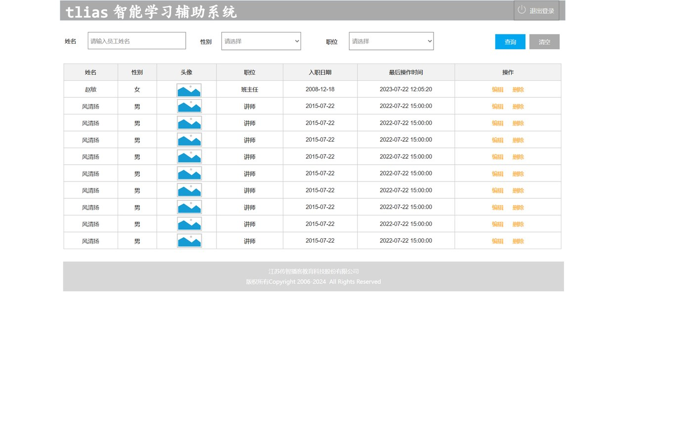
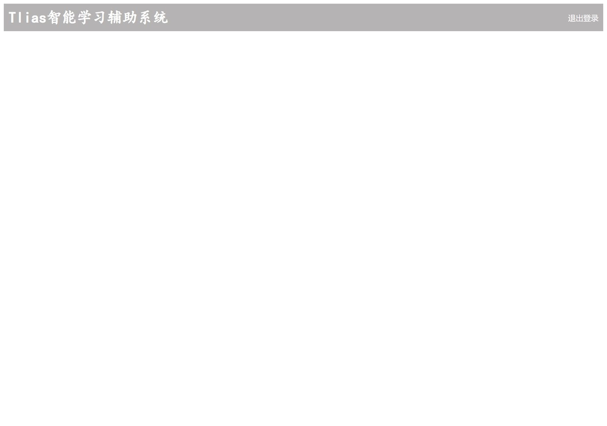
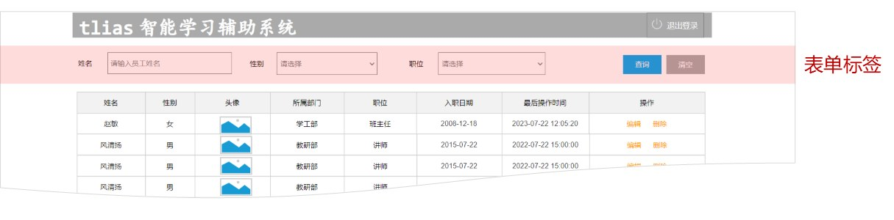
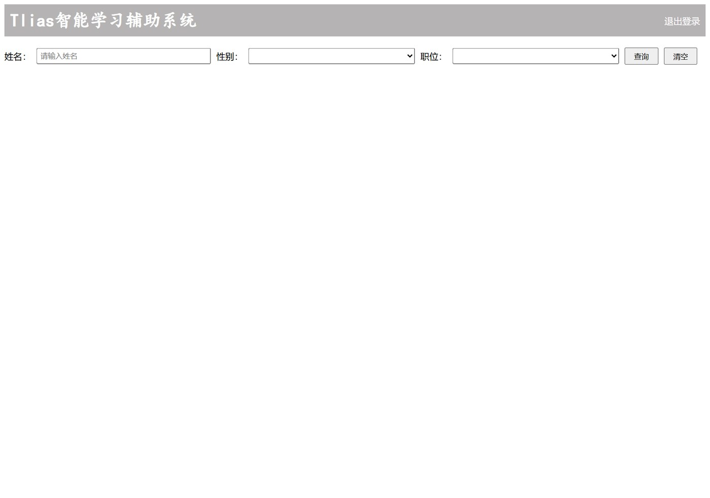
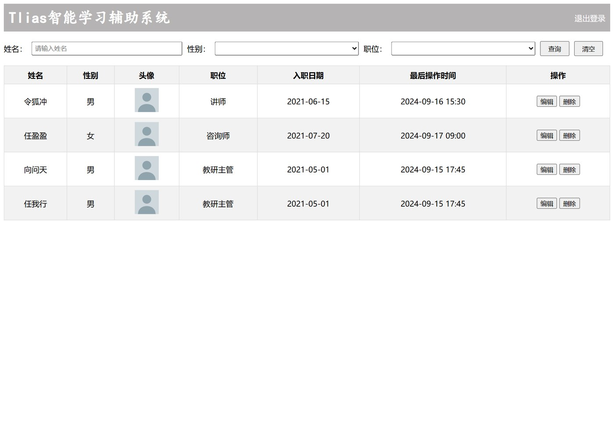
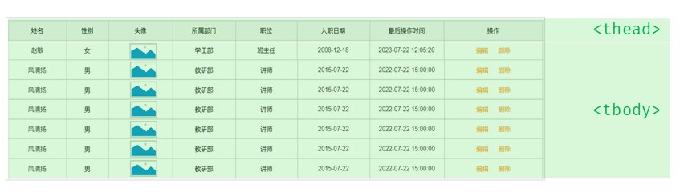
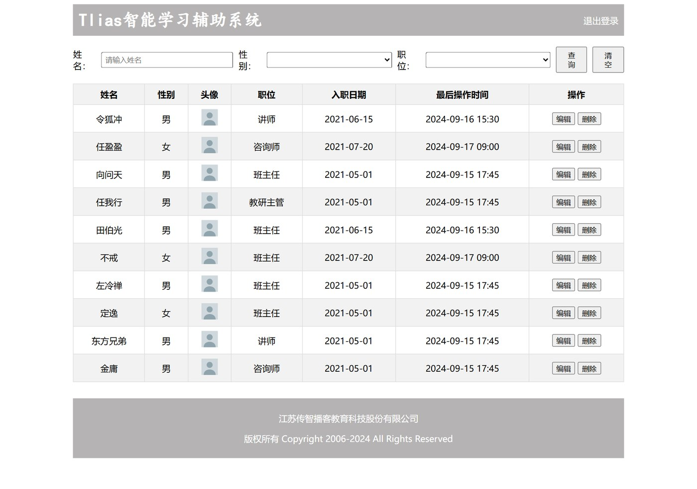

第一个案例（[央视新闻页面](/posts/编程学习/javaweb学习笔记/11-实战-央视新闻页面/)）是"一步一步手写出来"的；这第二个案例换个做法——**用 AI 提示词生成**，一次让 AI 做一个区域，最后拼成完整的"Tlias 员工管理页面"。这一篇把**四段提示词原文**、每个区域用到的技术、以及"生成之后要看得懂、会手改"的要点都留下来。

## 案例目标：参照页面原型，完成员工管理页面


*图：课程的页面原型（产品经理做的早期项目模型）——从上到下依次是灰色导航栏、一排查询条件、员工数据表格、灰色版权条*

> [!NOTE] 什么是页面原型
> **页面原型：指在应用程序开发初期，由产品经理制作的一个早期项目模型**，它用于展示页面的基本布局、功能和交互设计。通常用来帮助设计师、开发者等更好地理解和讨论最终产品的外观和行为。

原型把页面分成了**四个区域**，我们就按这个顺序一块一块实现：

| 区域 | 里面有什么 | 用到的标签 | 用到的 CSS |
| --- | --- | --- | --- |
| ① **顶部导航栏** | 标题"Tlias智能学习辅助系统" + "退出登录"链接 | `<div>`、`<h1>`、`<a>` | **flex 布局**（`display: flex` + `justify-content: space-between`）、背景色、内边距 |
| ② **搜索表单区域** | 姓名/性别/职位 + 查询/清空按钮 | `<form>`、`<label>`、`<input>`、`<select>`、`<option>`、`<button>` | flex（一行排列）、`gap` 间距、宽高与内边距 |
| ③ **表格数据展示区域** | 表头 + 员工数据行（含头像、操作按钮） | `<table>`、`<thead>`、`<tbody>`、`<tr>`、`<th>`、`<td>`、``、`<button>` | 边框合并、单元格内边距、表头底色、隔行变色 |
| ④ **底部版权区域** | 公司全称 + 版权信息 | `<footer>`、`<p>` | 灰色背景、白色文字、居中、外边距 |

> [!IMPORTANT]
> **为什么不把整页一次性丢给 AI？**
> 课程的做法是"**整页拆成 4 个部分，一条提示词只做一个部分**"：先要导航栏，再"接着"要搜索表单，再"接着"要表格，最后"接着"要页脚。这样做的好处：
> 1. 每次的需求说得清（内容 + 布局 + 样式三条就够）；
> 2. 生成的东西少，**能一眼看出哪里不对**，改起来也快；
> 3. 一块一块核对原型，不会出现"整页看着怪但不知道怪在哪"。

## 区域一：顶部导航栏

**提示词原文**（课程 `资料/prompt.txt` 第一段）：

> [!NOTE] AI 提示词
> 你是一名前端开发工程师，现需要制作一个HTML页面，这个页面分为4个部分，先实现第一个部分 - 顶部导航栏，具体需求如下：
> 1. 内容：要展示一个醒目（加大加粗展示）的标题， 标题： Tlias智能学习辅助系统 ； 还要展示一个 “退出登录” 的超链接。
> 2. 布局：标题和退出登录的超链接，展示一行里面。 标题居左展示， 退出登录的超链接居右展示。
> 3. 给整个顶部导航栏，添加一个灰色的背景色。
> 请帮我生成这个html页面 。

一句提示词里其实交代了**三件事**，缺一个 AI 就会自己发挥：

| 提示词里的要求 | 对应到代码 |
| --- | --- |
| 角色："你是一名前端开发工程师" | 给 AI 定身份，输出会更专业（**这也是提示词的惯用开头**） |
| 内容：标题 + "退出登录"超链接 | `<h1>Tlias智能学习辅助系统</h1>` + `<a href="#">退出登录</a>` |
| 布局："一行里面、标题居左、退出登录居右" | `.navbar { display: flex; justify-content: space-between; }` |
| 样式："醒目（加大加粗）"、"灰色背景" | `<h1>` 本身就是大字标题 + `font-weight: bold`；`.navbar { background-color: #b5b3b3; }` |
| 范围："先实现第一个部分" | 只生成导航栏，不越界 |

**生成的结果**：


*图：灰色一条横贯，左边是白色的"Tlias智能学习辅助系统"，右边是白色的"退出登录"——一行两端的经典布局*

**代码**（课程文件 `10. Tlias案例-顶部导航栏.html`）：

```html
<head>
  <style>
    /* 导航栏样式 */
    .navbar {
      background-color: #b5b3b3;        /* 灰色背景 */

      display: flex;                    /* flex弹性布局 */
      justify-content: space-between;   /* 左右对齐 */

      padding: 10px;                    /* 内边距 */
      align-items: center;              /* 垂直居中 */
    }
    .navbar h1 {
      margin: 0;                        /* 移除默认的上下外边距 */
      font-weight: bold;                /* 加粗 */
      color: white;
      /* 设置字体为楷体 */
      font-family: "楷体";
    }
    .navbar a {
      color: white;                     /* 链接颜色为白色 */
      text-decoration: none;            /* 移除下划线 */
    }
  </style>
</head>
<body>
  <!-- 顶部导航栏 -->
  <div class="navbar">
    <h1>Tlias智能学习辅助系统</h1>
    <a href="#">退出登录</a>
  </div>
</body>
```

**逐条看懂这段代码**（都是 09 篇 flex 的内容）：

1. **`display: flex` 写在 `.navbar` 上**——属性写在**父容器**身上、控制**子元素**的排列，这是 flex 最核心的使用姿势；
2. **`justify-content: space-between` 一条搞定"标题居左、退出登录居右"**——两个子元素各自贴到主轴两端，中间的空间自动留出来；
3. **`align-items: center`** 让两个子元素在**交叉轴**（这里是垂直方向）居中，不会一个贴上一个贴下；
4. **`padding: 10px`** 让文字别贴着导航栏边；
5. **`h1` 要写 `margin: 0`**——标题标签自带上下外边距，不删导航栏会被撑高；
6. **`.navbar h1` 这种写法叫后代选择器**（07 篇）：只改导航栏**里面**的 h1，页面别处的标题不受影响。链接的 `.navbar a` 同理。

> [!TIP]
> 提示词里只说了"加大加粗""灰色背景"，生成出来的却还有 `font-family: "楷体"`、`align-items: center` 这些细节——**AI 会补全你没说的部分**。所以生成之后要逐行读一遍：**它替你做的决定，你得认账**（不喜欢就手改，比如把楷体改回默认）。

## 区域二：搜索表单区域

**提示词原文**（第二段）：

> [!NOTE] AI 提示词
> 接下来，再帮我生成第二个部分-搜索表单区域，具体说明如下：
> 1. 组成：包括三个表单项和两个操作按钮。
>     1.1 表单项具体为：姓名（文本输入框）、性别（下拉选择，选项包括 男/女， 默认为空）、职位（下拉选择，选项包括班主任、讲师、学工主管、教研主管、咨询师， 默认为空）。
>     1.2 两个按钮：“查询” 与 “清空” 按钮，用于提交表单 或 重置表单项 。
> 2. 布局：所有表单项及按钮需水平排列于一行 ，确保美观大气 。

这段提示词的方法很值得学：**先说"有几个东西"，再逐个交代每个东西是什么类型，最后说布局**。注意它连"选项包括哪些"和"默认为空"都写清楚了——**下拉列表的选项必须一条条列出来**，不列 AI 只会给你两三个占位选项。

原型里的这一块（PPT 用粉色高亮标出的就是它）：


*图：原型里导航栏下面那一条粉色区域——"姓名"输入框、"性别/职位"下拉、蓝色"查询"和"清空"按钮，都在一行里*

**生成的结果**：


*图：三个查询条件 + 两个按钮水平排成一行——姓名是输入框，性别和职位是下拉列表，右边是"查询""清空"*

**代码**（课程文件 `14. Tlias案例-搜索表单区域.html`）：

```html
<style>
  /* 搜索表单样式 */
  .search-form {
    display: flex;            /* 一行排列 */
    flex-wrap: nowrap;        /* 不换行 */
    align-items: center;      /* 垂直居中对齐 */
    gap: 10px;                /* 控件之间的间距 */
    margin: 20px 0;           /* 上下留白 20px */
  }
  .search-form input[type="text"], .search-form select {
    padding: 5px;             /* 输入框内边距 */
    width: 300px;             /* 宽度 */
  }
  .search-form button {
    padding: 5px 15px;        /* 按钮内边距 */
  }
</style>

<!-- 搜索表单区域 -->
<form class="search-form" action="/search" method="post">
  <label for="name">姓名：</label>
  <input type="text" id="name" name="name" placeholder="请输入姓名">

  <label for="gender">性别：</label>
  <select id="gender" name="gender">
    <option value=""></option>
    <option value="1">男</option>
    <option value="2">女</option>
  </select>

  <label for="position">职位：</label>
  <select id="position" name="position">
    <option value=""></option>
    <option value="1">班主任</option>
    <option value="2">讲师</option>
    <option value="3">学工主管</option>
    <option value="4">教研主管</option>
    <option value="5">咨询师</option>
  </select>

  <button type="submit">查询</button>
  <button type="reset">清空</button>
</form>
```

**逐条看懂这段代码**（10 篇表单标签 + 09 篇 flex）：

1. **`<form action="/search" method="post">`**：`action` 是"提交到哪"（url），`method` 是"怎么提交"。课程这里的注释把差别写全了：
   - **get**：数据拼在 url 后面（`/search?name=Tom&gender=2&position=3`），**长度有限制**、**不安全**；
   - **post**：数据在**请求体**里提交（url 上看不到），**没有长度限制**、**安全**。所以查询表单用的是 `post`。
2. **表单项必须有 `name`**：`name` 是"提交出去时这个名字叫什么"——没有 `name` 的输入框，用户填了也采集不到。三个控件分别叫 `name`、`gender`、`position`。
3. **`<label for="name">姓名：</label>` + `<input id="name">`**：`for` 的值等于输入框的 `id`，点"姓名："这几个字也能聚焦到输入框（无障碍、体验都更好）。
4. **下拉列表用 `<select>` + `<option>`**：`<option>` 的 `value` 才是**提交的值**（性别选"男"提交 `gender=1`），第一个空的 `value=""` 是"请选择"的占位项。
5. **两个按钮的分工**：`type="submit"` 提交表单、`type="reset"` 把表单内容恢复初始值（注意到这就对应提示词里的"用于提交表单 或 重置表单项"）。
6. **`display: flex` 写在表单上**：把"标签 + 控件 + 按钮"这一堆排成一行；**`gap: 10px`** 统一给控件之间留 10px 间距（不用挨个写 `margin-right`）。
7. **`.search-form input[type="text"], .search-form select` 是"分组选择器 + 后代选择器 + 属性选择器"的组合**（07 篇）：选中的是"搜索表单里的文本框和下拉列表"，一起给它们设宽 300px、内边距 5px。**这里是最容易"看不懂"的一行**——只要拆开读：`分组选择器`（逗号分隔两组）+ 每组里的"后代 + 属性选择器"就明白了。
8. **`.search-form button`** 只给按钮设内边距（`padding: 5px 15px` = 上下 5px、左右 15px），按钮自己带默认样式，不用多写。

## 区域三：表格数据展示区域

**提示词原文**（第三段）：

> [!NOTE] AI 提示词
> 再继续帮我生成第三个部分-表格展示区：
> 1. 表格结构：展示列包括姓名、性别（显示 男/女）、头像（小图片展示）、职位（显示 班主任/讲师/学工主管/教研主管/咨询师）、入职日期、最后操作时间、操作（里包含两个按钮 编辑 与 删除）。
> 2. 测试数据：基于《笑傲江湖》小说人物在表格中生成3条测试数据，每条数据应包含上述所有列的信息，以体现实际应用场景 。
> 3. 样式：可适当调整表格样式，确保美观大气。

**列直接列清单**是这段提示词的关键：7 个列名一个不落（连"性别要显示男/女""头像要小图片""操作列里放编辑/删除按钮"都注明了）。**"操作"这类列一定要说清里面放什么**，否则 AI 只会给你一个空白单元格。

**生成的结果**：


*图：带边框的表格占满一行——表头灰底，数据行里有头像小图片和"编辑/删除"两个按钮，格式和原型对得上*

**代码**（课程文件 `15. Tlias案例-表格数据展示区域.html`，这里只留两行数据演示）：

```html
<style>
  /* 表格样式 */
  table {
    width: 100%;                  /* 表格占满容器宽度 */
    border-collapse: collapse;    /* 相邻单元格的边框合并成一条 */
  }
  th, td {
    border: 1px solid #ddd;       /* 单元格边框 */
    padding: 8px;                 /* 单元格内边距 */
    text-align: center;           /* 内容居中 */
  }
  th {
    background-color: #f2f2f2;    /* 表头灰底 */
    font-weight: bold;
  }
  tr:nth-child(even) {
    background-color: #f2f2f2;    /* 偶数行浅灰 → 隔行变色（斑马纹） */
  }
  .avatar {
    width: 50px;
    height: 50px;
  }
</style>

<!-- 表格展示区 -->
<table>
  <!-- 表头 -->
  <thead>
    <tr>
      <th>姓名</th>
      <th>性别</th>
      <th>头像</th>
      <th>职位</th>
      <th>入职日期</th>
      <th>最后操作时间</th>
      <th>操作</th>
    </tr>
  </thead>

  <!-- 表格主体内容 -->
  <tbody>
    <tr>
      <td>令狐冲</td>
      <td>男</td>
      <td></td>
      <td>讲师</td>
      <td>2021-06-15</td>
      <td>2024-09-16 15:30</td>
      <td class="action-buttons">
        <button type="button">编辑</button>
        <button type="button">删除</button>
      </td>
    </tr>
    <tr>
      <td>任盈盈</td>
      <td>女</td>
      <td></td>
      <td>咨询师</td>
      <td>2021-07-20</td>
      <td>2024-09-17 09:00</td>
      <td class="action-buttons">
        <button type="button">编辑</button>
        <button type="button">删除</button>
      </td>
    </tr>
    <!-- 后面每一行的结构都一样，只是数据不同 -->
  </tbody>
</table>
```

**表格结构**（10 篇讲过，这里对照 PPT 的标注再看一遍）：


*图：最上面那一行（七个列名）属于 `<thead>`，下面所有员工数据行属于 `<tbody>`；行里是单元格，表头单元格用 `<th>`、数据单元格用 `<td>`*

回忆一下结构口诀：**`<table>` 里放 `<thead>`（表头）和 `<tbody>`（主体）；它们里面放 `<tr>`（行）；行里放 `<td>`（数据单元格）或 `<th>`（表头单元格）**。

**逐条看懂这段代码**：

1. **一个表头行 + 每个员工一个数据行**：加一个员工 = 往 `<tbody>` 里再抄一个 `<tr>`（**提示词里要的是 3 条测试数据，课程最后给到了 4 条、10 条——加数据就是复制行**）；
2. **`border-collapse: collapse`** 把相邻单元格的边框合并成一条，表格才不会像网格线一样"双线"；
3. **`th, td` 分组选择器**：表头单元格和数据单元格一起设边框、内边距、居中（`text-align: center`）；
4. **`tr:nth-child(even)`** 是"偶数行"——隔行变色（斑马纹），长表格更容易看；
5. **`.avatar` 控制头像尺寸**：单元格里放的是 ``，用 `.avatar { width: 50px; height: 50px; }` 把它缩小成小头像；
6. **单元格里可以放任何东西**：图片（头像）、按钮（编辑/删除）都能放进 `<td>`；`<button type="button">` 表示"只是个可点击按钮"，点了不会提交表单。

> [!WARNING]
> 课程代码里头像用的是**网络图片地址**（`https://web-framework.oss-cn-hangzhou.aliyuncs.com/2023/1.jpg`）。这类地址会过期——**现在这个链接已经打不开了**（返回 403），页面上的头像会变成碎图标。练习时把它换成自己的图片：本地图片写相对路径（`img/avatar.png`），或者用别的图床地址。（本文的截图里换成了一张本地占位头像。）
>
> 另外，课程代码里 `th, td` 那行的注释写的是"左对齐"，实际值是 `text-align: center`（居中）——**以代码为准，注释只能当参考**。

## 区域四：底部版权区域

**提示词原文**（第四段）：

> [!NOTE] AI 提示词
> 再继续帮我生成第四个部分-页脚版权区域
> 1. 内容：第一行显示公司全称 “江苏传智播客教育科技股份有限公司”；第二行展示版权信息，“版权所有 Copyright 2006-2024 All Rights Reserved”。
> 2. 设计：该区域应具有灰色背景，字体颜色为白色，居中对齐，以营造专业且统一的视觉效果 。

**内容逐行给、样式三件事（背景色 / 文字颜色 / 对齐方式）说全**，这段提示词就是模板。

**生成的结果**：


*图：灰底、白字、居中两行——第一行公司全称，第二行版权信息*

**代码**（课程文件 `16. Tlias案例-底部版权区域.html` 里的页脚部分）：

```html
<style>
  /* 页脚样式 */
  .footer {
    background-color: #b5b3b3;   /* 灰色背景 */
    color: white;                /* 白色文字 */
    text-align: center;          /* 居中文本 */
    padding: 10px 0;             /* 上下内边距（左右 0） */
    margin-top: 30px;            /* 和上面的表格拉开距离 */
  }
</style>

<!-- 页脚版权区域 -->
<footer class="footer">
  <p>江苏传智播客教育科技股份有限公司</p>
  <p>版权所有 Copyright 2006-2024 All Rights Reserved</p>
</footer>
```

**看点**：

1. **`<footer>` 是语义标签**：告诉浏览器"这是页脚"，作用和 `<div>` 一样，但含义更明确（`<div>` 是没有语义的布局标签）；
2. **两行文字用两个 `<p>`**：`<p>` 是块级元素、自动独占一行，正好一行一个；
3. **`text-align: center`** 让区域内的**行内内容**（文字）水平居中——和"容器居中"（`margin: 0 auto`）不是一回事，一个是文字在盒子里居中、一个是盒子在页面里居中；
4. **`padding: 10px 0`** 用的是内边距的两值简写（上下 10px、左右 0），因为左右不需要留白；**`margin-top: 30px`** 把它和表格隔开。

## 收口：把四个区域装进一个容器

四个区域都做完，最后一个动作是"整页收口"——课程文件 `16` 在最外面加了一层容器：

```html
<style>
  #container {
    width: 80%;     /* 宽度为80% */
    margin: 0 auto; /* 水平居中 */
  }
</style>

<body>
  <div id="container">
    <div class="navbar">…</div>          <!-- ① 顶部导航栏 -->
    <form class="search-form">…</form>   <!-- ② 搜索表单区域 -->
    <table>…</table>                     <!-- ③ 表格数据展示区域 -->
    <footer class="footer">…</footer>    <!-- ④ 底部版权区域 -->
  </div>
</body>
```


*图：四个区域从上到下拼起来、整体占 80% 宽居中——这就是最终效果（截图里头像已换成占位图片）*

**为什么要收口**：四个区域单独看都挺好，但内容铺满整个屏幕在大显示器上很难看。包一层 `#container` 让它**占 80% 宽、左右居中**，和 11 篇央视新闻的 `width: 70%; margin: 0 auto` 是同一个手法（比例按需要调）。

**要注意的一个副作用**：容器是 80% 宽，所以**导航栏和页脚的灰色背景也只有 80% 宽**（左右各留一条白边）——原型的灰条是整个屏幕通的。想让灰条通屏，就得把这两个背景色放到容器**外面**的元素上（比如把导航栏挪出容器、给 `body` 或一个整屏的 `<div>` 加背景色）。**这是"AI 生成后要对照原型看"的典型例子。**

## 用 AI 生成后，要"看得懂 + 会手改"

> [!IMPORTANT]
> 课程反复强调的一点：**HTML 标签和 CSS 属性都是固定的**，所以前端页面可以直接基于 AI 辅助开发、也可以查官方文档。**但 AI 生成完不算完——你得看懂它写了什么，并且能动手改。**

### 1. 三步看懂一份 AI 生成的页面

1. **先找"区域边界"**：每个区域都有一个"根标签"——`<div class="navbar">`、`<form class="search-form">`、`<table>`、`<footer class="footer">`。先把页面拆成这几块，再看每块里面；
2. **再看每块里"一行/一格"的结构**：导航栏里是"标题 + 链接"两个子元素；表单里是"标签 + 控件"重复三组、末尾两个按钮；表格里是"一行表头 + 每行数据"；
3. **最后看 CSS 的选择器选中的是谁**：`.navbar h1` 改的是导航栏里的标题、`.search-form input[type="text"]` 改的是表单里的文本框、`tr:nth-child(even)` 改的是偶数行——**看不懂样式就先问"它选中了哪些元素"**。

### 2. 手改清单（改哪儿、怎么改）

| 想改什么 | 改哪里 | 注意 |
| --- | --- | --- |
| 标题文字、版权文案 | `<h1>`、`<footer>` 里的 `<p>` | 直接改文字 |
| 表格加/删一个员工 | `<tbody>` 里复制或删掉一整行 `<tr>` | 一行的 `<td>` 个数要和表头列数一致 |
| 表格加一列 | 表头加一个 `<th>`，**每一行**都加对应的 `<td>` | 少写一个就会错位（原型里其实还有"所属部门"列，提示词没写，所以生成的表格里没有——**这就是要对照原型补的地方**） |
| 下拉选项的增删改 | `<select>` 里的 `<option>` | 改的是 `value`（提交的值）和标签里的显示文字 |
| 颜色、宽度、间距 | 对应的 CSS 规则 | 导航栏/页脚灰底 `#b5b3b3`、表头灰底 `#f2f2f2`、容器 `width: 80%` |
| 头像图片 | `` 的 `src` | 课程的网络图片已失效，换成本地图片或自己的图床地址 |
| 查询/清空按钮的行为 | `<form>` 的 `action`、`method`，按钮的 `type` | 别把 `type="submit"` 写成 `type="button"`（那样就提交不了了） |
| 表单采集不到数据 | 检查每个表单项的 `name` | **表单项必须有 `name` 才能提交** |

### 3. 提示词的写法模板

把课程这四段提示词抽象出来，就是一套可复用的模板：

```text
你是一名前端开发工程师，现需要制作一个HTML页面，这个页面分为4个部分，
先实现第一个部分 - <区域名>，具体需求如下：
1. 内容：<这一块里有什么，逐个列清楚：文字 / 控件类型 / 选项 / 按钮及作用>
2. 布局：<怎么摆：一行还是两列、谁居左谁居右、间距>
3. 样式：<背景色、文字颜色、对齐方式、加粗等>
请帮我生成这个html页面。
```

- **一条提示词只做一块**，下一块用"接下来，再帮我生成第二个部分……"接着来；
- **有选项就把选项列全**（性别/职位的可选值）、**有列就把列名列全**、**有按钮就说清按钮干什么**；
- 生成之后别急着往下走：先在浏览器里打开看一眼，**对照原型**核对这一块（内容齐不齐、布局对不对）。

### 4. 课程里几处"同一个页面的小差异"（都是手改出来的）

| 文件 | 差异 | 说明 |
| --- | --- | --- |
| `14` 搜索表单 | 输入框/下拉宽 `300px` | 只有表单时的尺寸 |
| `15` 表格区域 | `.avatar` 头像 `50px`、4 行数据 | 加表格后微调 |
| `16` 完整页面 | 输入框宽 `260px`、头像 `30px`、10 行数据、多了页脚与容器 | 整页拼好后统一微调 |

**同一份页面在不同步骤里尺寸不一样很正常**——这些"微调"就是"看得懂 + 会手改"的日常：改一个数字，刷新看一眼，对照原型再改。

## 相关

- [上一篇：实战-央视新闻页面](/posts/编程学习/javaweb学习笔记/11-实战-央视新闻页面/)
- [HTML表单与表格标签](/posts/编程学习/javaweb学习笔记/10-html表单与表格标签/)
- [Flex弹性布局](/posts/编程学习/javaweb学习笔记/09-flex弹性布局/)
- [CSS盒子模型](/posts/编程学习/javaweb学习笔记/08-css盒子模型/)

## 练习题

### 一、知识回顾（读完直接做下面的实践题）

1. **页面原型**：在应用程序开发初期由**产品经理**制作的早期项目模型，用于展示页面的**基本布局、功能和交互设计**，帮助设计师、开发者理解和讨论最终产品的外观与行为
2. Tlias 员工管理页面分**四个区域**：**顶部导航栏 → 搜索表单区域 → 表格数据展示区域 → 底部版权区域**，按这个顺序一块一块做
3. 这个案例的做法是**用 AI 提示词分区域生成**：一条提示词只做一个部分，下一块用"接下来，再帮我生成第二个部分……"接着来；生成后要**对照原型核对**、看懂并会手改
4. **导航栏一行两端**：父容器 `.navbar` 加 `display: flex` + `justify-content: space-between`（标题居左、退出登录居右），`align-items: center` 垂直居中；`<h1>` 要 `margin: 0`
5. **搜索表单的构成**：`<form action="/search" method="post">` 里放 `<label>` + `<input type="text">`（姓名）、两个 `<select>`（性别/职位，里面是 `<option value="…">`）、两个 `<button>`（`type="submit"` 查询、`type="reset"` 清空）
6. **表单两条铁律**：`action` 指定提交到哪、`method` 指定怎么提交（**get** 拼在 url 后、有长度限制、不安全；**post** 在请求体里、无长度限制、安全）；**表单项必须有 `name` 才能被提交**
7. **表单一行排列**：`.search-form` 加 `display: flex` + `align-items: center` + `gap: 10px`（控件间距）；`input[type="text"]`/`select` 设 `width: 300px`、`padding: 5px`
8. **表格结构**：`<table>` 里放 `<thead>`（表头行，单元格用 `<th>`）和 `<tbody>`（数据行，单元格用 `<td>`），行是 `<tr>`；单元格里可以放 ``（头像）和 `<button>`（编辑/删除）
9. **表格样式要点**：`width: 100%`、`border-collapse: collapse`（边框合并）、`th, td { border: 1px solid #ddd; padding: 8px; text-align: center; }`、`th { background-color: #f2f2f2; }`、`tr:nth-child(even) { background-color: #f2f2f2; }`（隔行变色）
10. **页脚与收口**：`<footer class="footer">` 用灰底（`#b5b3b3`）+ 白字 + `text-align: center` + `padding`；最后用 `#container { width: 80%; margin: 0 auto; }` 把四个区域包起来居中（**灰条宽度会只有 80%，要通屏得把背景放到容器外**）

### 二、裸写题

- [ ] **2-1 Tlias 的顶部导航栏**
  做一个导航栏：
  1. 左边是一个**加粗、白色、楷体**的标题"Tlias智能学习辅助系统"
  2. 右边是一个白色的"退出登录"文字链接（不带下划线）
  3. 两者**在同一行**：标题贴左、退出登录贴右，并且垂直方向对齐
  4. 整条导航栏是灰色背景，文字不贴着边缘
  （练习文件 `test_12_顶部导航栏.html` 里有写作区，结构已备好。）

  > [!TIP]- 提示（先自己想，实在想不出再点开）
  > **一级 · 思路**："同一行 + 两端分开"是弹性布局的活儿，属性全部写在**父容器**上；标题自带上下外边距要先清掉
  > **二级 · 方法**：`.navbar { display: flex; justify-content: space-between; align-items: center; padding: 10px; background-color: #b5b3b3; }`；`.navbar h1 { margin: 0; color: white; font-weight: bold; font-family: "楷体"; }`；`.navbar a { color: white; text-decoration: none; }`
  > **三级 · 骨架**：`.navbar { display: ____; justify-content: ____; align-items: ____; }` / `.navbar h1 { margin: ____; }`

  > [!TIP]- 参考答案（做完再点开）
  > ```html
  > <style>
  >   .navbar {
  >     background-color: #b5b3b3;        /* 灰色背景 */
  >     display: flex;                    /* 一行排列 */
  >     justify-content: space-between;   /* 两端分开 */
  >     align-items: center;              /* 垂直居中 */
  >     padding: 10px;                    /* 内边距 */
  >   }
  >   .navbar h1 {
  >     margin: 0;                        /* 清掉标题自带的外边距 */
  >     font-weight: bold;
  >     color: white;
  >     font-family: "楷体";
  >   }
  >   .navbar a {
  >     color: white;
  >     text-decoration: none;            /* 去掉下划线 */
  >   }
  > </style>
  > <body>
  >   <div class="navbar">
  >     <h1>Tlias智能学习辅助系统</h1>
  >     <a href="#">退出登录</a>
  >   </div>
  > </body>
  > ```
  > 对照课程 `10. Tlias案例-顶部导航栏.html`。检查点：`display: flex` 一定写在 `.navbar`（父容器）上；`space-between` 是"先两边贴边、再平分剩余空间"；`h1` 的 `margin: 0` 不写导航栏会被撑高。

- [ ] **2-2 把搜索表单排成"美观大气的一行"**
  页面里已经有一个表单，里面是"姓名 + 性别下拉 + 职位下拉 + 查询/清空两个按钮"。要求：
  1. 这些控件**水平排成一行**，并且垂直方向对齐
  2. 控件之间留出**统一的 10px 间距**（不要一个个写外边距）
  3. 输入框和下拉列表宽 **300px**、内边距 5px；按钮内边距"上下 5px、左右 15px"
  4. 表单和上下内容之间留出 20px
  （练习文件 `test_12_搜索表单一行排列.html` 里有写作区。）

  > [!TIP]- 提示（先自己想，实在想不出再点开）
  > **一级 · 思路**：还是弹性布局——不过这次是"把一堆控件排成一行"；统一间距有专门的属性，不用挨个写 `margin-right`
  > **二级 · 方法**：`.search-form { display: flex; flex-wrap: nowrap; align-items: center; gap: 10px; margin: 20px 0; }`；分组选择器 `.search-form input[type="text"], .search-form select { padding: 5px; width: 300px; }`；`.search-form button { padding: 5px 15px; }`
  > **三级 · 骨架**：`.search-form { display: ____; align-items: ____; gap: ____; margin: ____ 0; }`

  > [!TIP]- 参考答案（做完再点开）
  > ```html
  > <style>
  >   .search-form {
  >     display: flex;            /* 一行排列 */
  >     flex-wrap: nowrap;        /* 不换行 */
  >     align-items: center;      /* 垂直居中对齐 */
  >     gap: 10px;                /* 控件之间的统一间距 */
  >     margin: 20px 0;           /* 上下留白 20px */
  >   }
  >   .search-form input[type="text"], .search-form select {
  >     padding: 5px;
  >     width: 300px;
  >   }
  >   .search-form button {
  >     padding: 5px 15px;
  >   }
  > </style>
  > ```
  > 对照课程 `14. Tlias案例-搜索表单区域.html`。检查点：`gap` 写在**父容器**上，一行就管住所有子元素的间距；`.search-form input[type="text"]` 这一串是"后代选择器 + 属性选择器"，注意中间的空格；`padding: 5px 15px` 是两值简写（上下 5px、左右 15px）。

- [ ] **2-3 员工表格的"骨架 + 边框"**
  做一个员工列表表格，要求：
  1. 表头一行四列：姓名、职位、入职日期、操作（用**表头单元格**）
  2. 表格主体放**两行**数据：令狐冲 / 讲师 / 2021-06-15 / 编辑+删除；任盈盈 / 咨询师 / 2021-07-20 / 编辑+删除（操作列里是两个**不提交表单**的按钮）
  3. 表格占满整行宽度，单元格边框合并成一条，单元格内容居中、内边距 8px
  4. 表头带浅灰底色，数据行的一行隔一行浅灰（斑马纹）
  （练习文件 `test_12_表格区域.html` 里有写作区。）

  > [!TIP]- 提示（先自己想，实在想不出再点开）
  > **一级 · 思路**：表格是"一层套一层"——表格整体里分表头和主体，它们里面是行，行里是格子；样式上先把"双线边框"合并掉，再用"偶数行"控制隔行颜色
  > **二级 · 方法**：`<table>` + `<thead>/<tbody>` + `<tr>` + `<th>/<td>`；`table { width: 100%; border-collapse: collapse; }`、`th, td { border: 1px solid #ddd; padding: 8px; text-align: center; }`、`th { background-color: #f2f2f2; }`、`tr:nth-child(even) { background-color: #f2f2f2; }`；按钮 `<button type="button">`
  > **三级 · 骨架**：`<table><thead><tr><th>____</th></tr></thead><tbody><tr><td>____</td></tr></tbody></table>`

  > [!TIP]- 参考答案（做完再点开）
  > ```html
  > <style>
  >   table {
  >     width: 100%;
  >     border-collapse: collapse;    /* 边框合并成一条 */
  >   }
  >   th, td {
  >     border: 1px solid #ddd;
  >     padding: 8px;
  >     text-align: center;           /* 内容居中 */
  >   }
  >   th {
  >     background-color: #f2f2f2;    /* 表头灰底 */
  >   }
  >   tr:nth-child(even) {
  >     background-color: #f2f2f2;    /* 偶数行浅灰 */
  >   }
  > </style>
  > <body>
  >   <table>
  >     <thead>
  >       <tr>
  >         <th>姓名</th>
  >         <th>职位</th>
  >         <th>入职日期</th>
  >         <th>操作</th>
  >       </tr>
  >     </thead>
  >     <tbody>
  >       <tr>
  >         <td>令狐冲</td>
  >         <td>讲师</td>
  >         <td>2021-06-15</td>
  >         <td><button type="button">编辑</button> <button type="button">删除</button></td>
  >       </tr>
  >       <tr>
  >         <td>任盈盈</td>
  >         <td>咨询师</td>
  >         <td>2021-07-20</td>
  >         <td><button type="button">编辑</button> <button type="button">删除</button></td>
  >       </tr>
  >     </tbody>
  >   </table>
  > </body>
  > ```
  > 对照课程 `15. Tlias案例-表格数据展示区域.html`。检查点：表头用 `<th>`、数据用 `<td>`；**每一行的格子数要一样**（加列时表头和所有数据行一起加）；`border-collapse: collapse` 不写就会是"双线"表格；按钮 `type="button"` 才不会提交表单。

### 三、综合题

- [ ] **3-1 用提示词生成"Tlias 员工管理页面"，再手改到位**
  这一题练的是"**AI 生成 + 人工收口**"的完整流程。练习文件 `test_12_综合_员工管理页面.html` 里只有一个空骨架和分步注释块，按步骤做：

  1. **顶部导航栏**：照第一条提示词让 AI 生成（或自己手写），要素是"标题居左、退出登录居右、灰底"——做完先在浏览器里看一眼
  2. **搜索表单区域**：接着让 AI 生成第二块，三个表单项 + 查询/清空按钮，要求**水平排列于一行**
  3. **表格数据展示区域**：接着生成第三块，7 列（姓名/性别/头像/职位/入职日期/最后操作时间/操作），先只要 **2~3 条测试数据**
  4. **底部版权区域**：接着生成第四块，灰底白字居中，两行文案
  5. **整体收口**：用一个容器把四个区域包起来，让整页**占 80% 宽、居中**
  6. **手改四件事**：① 表格里**再加一行**你自己的数据；② 表格里**加一列"所属部门"**（表头和各行的格子都要加）；③ 把头像换成**你自己的图片**（本地相对路径）；④ 把版权信息里的年份改成今年
  7. **自查**：对照原型逐块核对——导航栏两端分开了吗？表单控件在一行吗？表格的列和原型一致吗（原型还有"所属部门"）？表单里每个控件都有 `name` 吗？拉宽窗口整页是否居中？

  > [!TIP]- 提示（先自己想，实在想不出再点开）
  > **一级 · 思路**：第 1~4 步按"区域"推进，每块都能单独在浏览器里看效果；第 5 步是"包一层容器 + 定宽度 + 居中"；第 6 步的手改全在**结构里加东西**（多一行 `<tr>`、多一列 `<th>`/`<td>`、换个 `src`）
  > **二级 · 方法**：提示词模板"你是一名前端开发工程师……先实现第 <N> 个部分 - <区域名>，内容：… 布局：… 样式：…"；收口 `#container { width: 80%; margin: 0 auto; }`；加列 = 表头加 `<th>` + **每一行**加 `<td>`；换头像 = 改 `` 的 `src`
  > **三级 · 骨架**：`<div ____="container"> …四个区域… </div>` / `#container { width: ____; margin: ____ auto; }` / 表格里 `<____>所属部门</____>` 加在表头、每行加一个 `<td>`

  > [!TIP]- 参考答案（做完再点开）
  > 四个区域的代码就是课程这四份文件，直接对照看：
  >
  > - ① 导航栏：`10. Tlias案例-顶部导航栏.html`
  > - ② 搜索表单：`14. Tlias案例-搜索表单区域.html`
  > - ③ 表格区域：`15. Tlias案例-表格数据展示区域.html`
  > - ④ 页脚 + 收口：`16. Tlias案例-底部版权区域.html`
  >
  > **手改部分的参考**（以第 6 步为例）：
  > ```html
  > <!-- ① 加一行数据：在 tbody 里再抄一个 tr -->
  > <tr>
  >   <td>张三</td>
  >   <td>男</td>
  >   <td></td>
  >   <td>班主任</td>
  >   <td>2026-09-29</td>
  >   <td>2026-09-29 10:00</td>
  >   <td class="action-buttons">
  >     <button type="button">编辑</button>
  >     <button type="button">删除</button>
  >   </td>
  > </tr>
  > ```
  > ② 加"所属部门"列：在 `<thead>` 的"头像"后面插一个 `<th>所属部门</th>`，**然后在每一个 `<tr>` 的对应位置都插一个 `<td>学工部</td>`**——只想改表头不改数据行，表格就会错位。③ 头像 `src` 换成你自己的相对路径图片（课程里的网络图片地址已经失效）。④ 年份直接改文字。
  > 第 7 步的答案：原型的表格里**有"所属部门"列**，而课程提示词里没写这一列，所以 AI 生成的表格里没有——**"对照原型补齐"就是这一步练的东西**。
