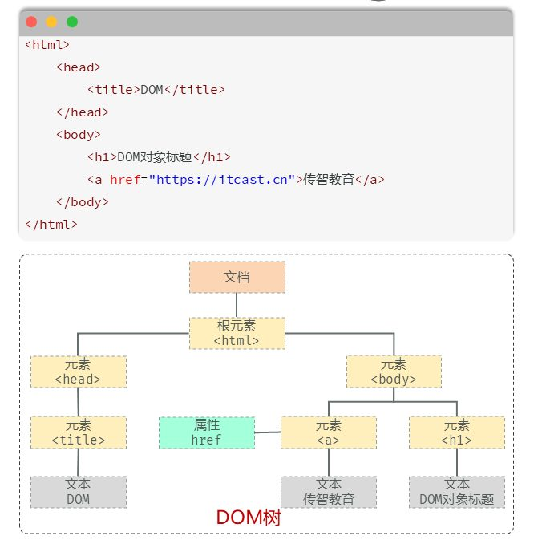
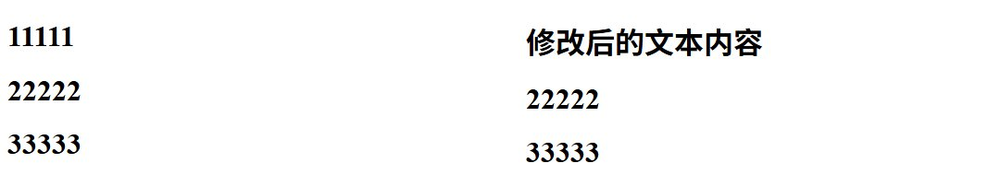
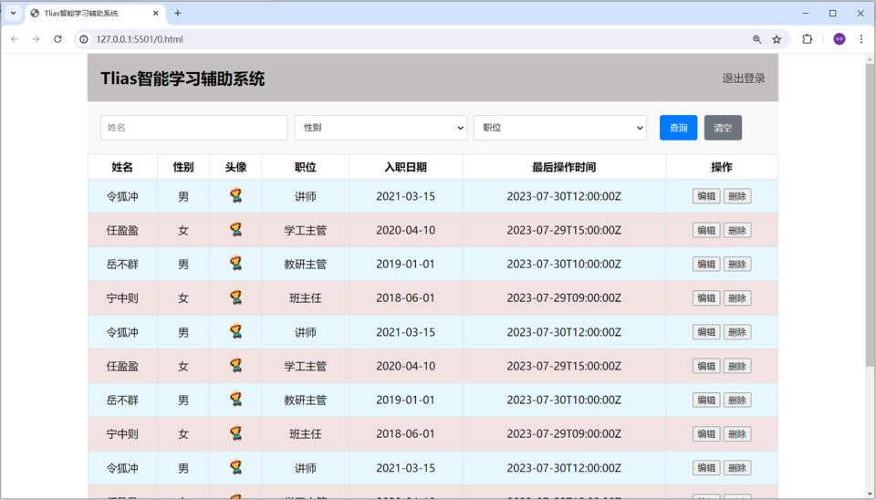

[15 篇](/posts/编程学习/javaweb学习笔记/15-js函数与自定义对象/)之前，JS 一直在控制台里"自己跟自己玩"：算数、打印、处理数据。这一篇起它能**伸手改页面**了——靠的就是 **DOM**。流程只有两步：**先拿元素，再改元素**；改的地方无非三处：**内容、属性、样式**。最后用课程案例"表格隔行换色"把这三步走一遍。

## DOM 是什么

> 概念：**Document Object Model，文档对象模型**。

大白话：**DOM 就是浏览器交给 JS 的一套"遥控器"**。JS 本身不认识 HTML 标签，浏览器在解析完页面后，把页面里的每样东西都**包装成对象**，再把这套对象交给 JS——JS 操作这些对象，页面就跟着变。

PPT 列出的是被包装成的五种对象：

| 对象 | 对应页面里的什么 |
| --- | --- |
| **Document** | 整个文档对象（页面的入口，`document.querySelector(...)` 就是从这里下手） |
| **Element** | 元素对象（一个 `<h1>`、一个 `<div>`、一个 `<tr>` 都是一个 Element） |
| **Attribute** | 属性对象（`href="..."` 这个 `href` 就是属性） |
| **Text** | 文本对象（标签里包着的文字） |
| **Comment** | 注释对象（`<!-- -->` 的内容） |

有了 DOM，**JavaScript 就能够对 HTML 进行操作**，PPT 列了四件事：

- 改变 HTML 元素的**内容**
- 改变 HTML 元素的**样式（CSS）**
- 对 HTML DOM **事件**作出反应（下一篇讲）
- **添加和删除** HTML 元素

### DOM 树：把 HTML 看成一家人的族谱

同一页 PPT 用一段很短的 HTML 展示了"对象"之间的关系：

```html
<!-- PPT 上的示例页面 -->
<html>
	<head>
		<title>DOM</title>
	</head>
	<body>
		<h1>DOM对象标题</h1>
		<a href="https://itcast.cn">传智教育</a>
	</body>
</html>
```


*图：上面是 HTML 代码，下面是它对应的 **DOM 树**——最上面是"文档"，往下是根元素 `<html>`，再往下分出 `<head>`、`<body>` 等元素；`<title>`、`<h1>`、`<a>` 下面挂着"文本"，`href` 则挂在 `<a>` 这个元素上*

这张图是整篇的"世界观"：

- 每个标签都是树上的一个**节点（对象）**，标签嵌套就是**父子关系**（`<body>` 是 `<h1>` 的父节点，`<h1>` 是 `<body>` 的子节点）
- 标签的属性（`href`）、标签里的文字（"传智教育"）也都各自是一个对象，**挂在所属元素下面**

> [!IMPORTANT]
> 记住这一句就够用了：**DOM 把网页里所有的元素都当做对象来处理——标签上写的所有属性，在这个对象上都能找到**。所以 `img` 标签的 `src` 在对象上叫 `img.src`，`a` 标签的 `href` 在对象上叫 `a.href`，字号、颜色这些 CSS 也能用 `元素.style.xxx` 改。

## DOM 操作的两步套路

PPT 把操作总结成固定的两步：

1. **获取要操作的 DOM 元素对象**（先"抓住"要改的那块）
2. **操作 DOM 对象的属性或方法**（改内容 / 改属性 / 改样式）

第二步 PPT 特意写了一句很实在的话：

> 操作 DOM 对象的属性或方法（**查文档或 AI**）

也就是说：**DOM 的 API 不需要背**。知道"这件事能做、能做的话大概叫什么"，写的时候查一下文档或者问 AI，比死记有用得多。这一节就把最常用的那批 API 一次列全，后面的案例都围着它们转。

## 第一步：获取元素

课程代码 `07. JS-DOM.html` 的页面上放了三个标题，**第一个带 id**——这是后面"抓元素"的抓手：

```html
<body>
	<h1 id="title1">11111</h1>
	<h1>22222</h1>
	<h1>33333</h1>
</body>
```

两种最常用的获取方式：

```javascript
// 根据CSS选择器来获取DOM元素，获取匹配到的第一个元素
let h1 = document.querySelector('#title1'); // 按 id 拿：拿到 id 为 title1 的那个 h1
let h1First = document.querySelector('h1'); // 按标签名拿：拿到页面上第一个 h1

// 根据CSS选择器来获取DOM元素，获取匹配到的所有元素
let hs = document.querySelectorAll('h1'); // 拿到全部 3 个 h1
```

| 方法 | 拿到什么 | 返回值的类型 |
| --- | --- | --- |
| `document.querySelector('选择器')` | **匹配到的第一个**元素 | 一个元素对象（Element） |
| `document.querySelectorAll('选择器')` | **匹配到的所有**元素 | **NodeList 节点集合**（伪数组） |

括号里写的就是 [07 篇](/posts/编程学习/javaweb学习笔记/07-css选择器/)学过的 **CSS 选择器**——PPT 在示例代码旁边标了三种写法：

| 选择器写法 | 含义 | 例子 |
| --- | --- | --- |
| `#sid` | 按 **id** 选 | `document.querySelector('#sid')` |
| `.txt` | 按 **class** 选 | `document.querySelectorAll('.txt')` |
| `span` | 按**标签名**选 | `document.querySelectorAll('span')` |

> [!WARNING]
> `querySelectorAll(..)` 得到的是一个 **NodeList 节点集合，是一个伪数组**——"伪"在：
> - **有**长度（`.length`）、**有**索引（`[0]`、`[1]`…），可以用 `for` 循环挨个处理；
> - **没有**真数组的方法（`push()`、`pop()`、`join()` 这些都不能用）。
>
> 另外它是**"当时那一刻"的快照**：拿到之后再往页面里加元素，这个集合不会自动变长（员工列表案例里"删除一行后要重新获取"就是这个原因）。只想改其中某一个时，别忘了写索引：`hs[0].innerHTML = ...`，直接写 `hs.innerHTML` 是无效的。

**其他获取方式（了解）**——PPT 的"小结"页把它们列在"其他方式（了解）"下面：

```javascript
document.getElementById('id');          // 按 id 拿一个元素（等于 querySelector('#id')）
document.getElementsByTagName('div');   // 按标签名拿一组（HTMLCollection，老写法）
document.getElementsByClassName('cls'); // 按类名拿一组（HTMLCollection，老写法）
```

> [!TIP]
> 新一代写法 `querySelector` / `querySelectorAll` **一套通吃**（id、类名、标签名、后代、并集选择器都能写），所以课程的代码统一用它；`getElementById` 那三个老方法在老项目、老教程里到处都是，看得懂就行，新代码不写。

## 第二步之一：操作内容（innerHTML / innerText）

课程代码 `07. JS-DOM.html` 的脚本主体只有两行，做完的效果是"第一个标题的文字被改掉"：

```javascript
//1. 修改第一个h1标签中的文本内容
//1.1 获取DOM对象
let hs = document.querySelectorAll('h1');

//1.2 调用DOM对象中属性或方法
hs[0].innerHTML = '修改后的文本内容'; // 把第 1 个 h1 的内容换掉
```


*图：左边是页面最初的样子（三个标题分别是 11111、22222、33333），右边是执行 `hs[0].innerHTML = '修改后的文本内容'` 之后——只有第一个 h1 被换掉了，另外两个原封不动*

改内容用的两个属性：

| 属性 | 读/写的内容 | 会不会解析 HTML 标签 |
| --- | --- | --- |
| **`innerHTML`** | 元素**内部的所有内容**（含标签） | **会**——写进去的 `<b>`、`<span>` 会被当成真标签渲染出来 |
| **`innerText`** | 元素内部的**纯文本** | **不会**——写进去的 `<b>` 就是四个字符，原样显示 |

```javascript
// 同一个位置，两种写法效果完全不同
document.querySelector('#box').innerHTML = '我是<b>加粗</b>的';  // 加粗生效，页面显示：我是加粗的
document.querySelector('#box2').innerText = '我是<b>加粗</b>的';  // 连标签一起显示：我是<b>加粗</b>的
```

它们也能**读**（不赋值就是取）：`console.log(h1.innerHTML)` 会把当前标签里的内容打印出来。

> [!TIP]
> 怎么选？**内容里带 HTML 标签（要拼表格、拼按钮）就用 `innerHTML`，只塞一句纯文字用 `innerText`**。后面的员工列表案例要靠 `innerHTML` 一次性拼出整个表格，`innerText` 做不到这件事。
>
> ⚠️ `innerHTML` 是"**整体替换**"，不是追加——`hs[0].innerHTML = 'xxx'` 会把原来的内容全部覆盖掉，想保留原内容就要自己拼字符串（`hs[0].innerHTML = hs[0].innerHTML + 'xxx'`）。

## 第二步之二：操作属性

PPT 说的"标签的所有属性在该对象上都可以找到"，落到代码上就是：**HTML 里叫什么，对象上基本还叫什么**。

```javascript
// 样式：把图片的地址换掉
let img = document.querySelector('#avatar');
img.src = 'img/1.png';    // 换成同级 img 目录下的一张图（课程这里用的是下面那个图床地址）
img.alt = '员工头像';     // 图片说明（加载失败时显示的文字）

// 超链接：换目标网址
let link = document.querySelector('#logout');
link.href = 'https://www.itcast.cn';

// 输入框：读/写里面的值（注意不是 innerHTML！）
let nameInput = document.querySelector('#name');
nameInput.value = '张三';                    // 写：输入框里出现"张三"
console.log(nameInput.value);                // 读：拿到用户输入的内容

// 按钮：禁用掉（布尔属性，值是 true / false）
document.querySelector('#submitBtn').disabled = true;
```

| HTML 里的写法 | JS 里的写法 | 说明 |
| --- | --- | --- |
| `` | `img.src = '1.jpg'` | 图片地址 |
| `<a href="https://...">` | `link.href = 'https://...'` | 链接地址 |
| `<input value="Tom">` | `input.value = 'Tom'` | **输入框里的内容用 `value`**，不能用 `innerHTML` |
| `` | `img.alt = '头像'` | 替代文字 |
| `<input disabled>` | `input.disabled = true` | 布尔属性：有就是 true、没有就是 false |
| `<div class="a b">` | `div.className = 'a b'` | 类名（**整串覆盖**） |

> [!NOTE]
> 顺便提一句：课程页面里的头像用的是图床地址 `https://web-framework.oss-cn-hangzhou.aliyuncs.com/2023/1.jpg`，这个链接**现在已经失效（访问返回 403）**，照着课程代码做时头像显示不出来是正常的——把 `src` 换成本地任意一张图片即可，**赋值方式完全一样**。

**class 的三种改法**（写页面交互最常用，这里补上）：

```javascript
let box = document.querySelector('#box');

box.className = 'active';            // 整体覆盖：原来的 class 全没了
box.classList.add('active');         // 推荐：加一个类名，原来的留着
box.classList.remove('active');      // 去掉一个类名
box.classList.toggle('active');      // 有就去掉、没有就加上（开关效果）
console.log(box.classList.contains('active')); // 判断有没有这个类名
```

**通用读写任意属性（了解）**——遇到"用点号点不出来"的属性（比如自定义属性 `data-id`）：

```javascript
let btn = document.querySelector('#del');
console.log(btn.getAttribute('data-id'));        // 读属性
btn.setAttribute('data-id', '1001');             // 写属性
btn.removeAttribute('data-id');                  // 删属性
```

> [!TIP]
> 什么时候用 `classList` 而不是 `style`？**成组的样式（颜色 + 边框 + 圆角）写进 CSS 类，JS 只负责"换类名"**；只有一个属性要改的时候直接用 `style` 更省事。项目里样式写在 CSS 里、行为写在 JS 里，改起来不至于两头找。

## 第二步之三：操作样式（style）

用 `元素.style.样式名 = '值'` 改的是这个元素的**行内样式**：

```javascript
let h1 = document.querySelector('h1');

h1.style.color = 'red';            // 文字颜色改成红色
h1.style.backgroundColor = '#f2e2e2'; // 背景色（右上角那个驼峰！）
h1.style.fontSize = '30px';        // 字号（记得带单位 px）
h1.style.width = '200px';          // 宽度
```

**CSS 属性名要改成"小驼峰"**——CSS 里连字符后面的字母大写、去掉连字符：

| CSS 里的写法 | JS 里的写法 | 备注 |
| --- | --- | --- |
| `background-color` | `style.backgroundColor` | 最常见的坑 |
| `font-size` | `style.fontSize` | |
| `text-align` | `style.textAlign` | |
| `border-radius` | `style.borderRadius` | |
| `margin-top` | `style.marginTop` | |
| `width` | `style.width` | 本来就没有连字符，直接写 |

> [!WARNING]
> 写 `style` 的两个高频错误：
> 1. **值必须是字符串、必须带单位**——`h1.style.fontSize = 30` 不生效（少了引号和 `px`），要写 `'30px'`；
> 2. **别直接写 CSS 的名字**——`style.background-color = '#fff'` 是**语法错误**，JS 里减号是运算符，属性名不许有连字符，要么写 `style.backgroundColor`，要么写 `style['background-color']`。

## 案例：实现表格隔行换色

PPT 第 25 页的案例，需求一句话说清：

> **需求**：实现表格数据行的隔行换色功能，**奇数行**背景色为 `#f2e2e2`，**偶数行**背景色为 `#e6f7ff`。

这一页课程还配了一条 **AI 提示词**（Prompt），可以照着改关键词去生成别的效果：

```text
通过js实现表格数据行的隔行换色效果，奇数行背景色为 #f2e2e2，偶数行背景色为 #e6f7ff。（JS新语法实现）
```


*图：案例做完的样子——员工表格的数据行一行浅粉（`#f2e2e2`）、一行浅蓝（`#e6f7ff`）交替出现，表头行不参与换色*

课程代码 `06. JS-案例-员工列表.html` 为了这个效果只加了一小段 JS（写在 `</body>` 前面的 `<script>` 里）：

```javascript
//通过JS实现上述表格中数据行的隔行换色效果, 奇数行背景色设置为 #f2e2e2, 偶数行背景色设置为 #e6f7ff (JS新语法实现)
let trList = document.querySelectorAll("tbody tr"); // 获取所有数据行 - DOM操作
for (let i = 0; i < trList.length; i++) {
	if (i % 2 == 0) {                                    // 索引是 0、2、4…的是"第 1、3、5…行"
		trList[i].style.backgroundColor = "#f2e2e2";     // 奇数行：浅粉
	} else {
		trList[i].style.backgroundColor = "#e6f7ff";     // 偶数行：浅蓝
	}
}
```

拆开看就三件事，正好是这一篇的三步套路：

| 代码 | 属于哪一步 | 说明 |
| --- | --- | --- |
| `document.querySelectorAll("tbody tr")` | ① 获取元素 | 拿到**所有数据行**（`tbody` 里才是数据行，表头那行在 `thead` 里，这样写就不会把表头也染上色） |
| `for (let i = 0; i < trList.length; i++)` | 中间的遍历 | 用 [14 篇](/posts/编程学习/javaweb学习笔记/14-js基础语法与数据类型/)的循环挨个处理；`trList.length` 是行数 |
| `trList[i].style.backgroundColor = "#f2e2e2"` | ② 操作样式 | `trList[i]` 取到第 i 行，再改它的背景色 |

**为什么 `i % 2 == 0` 是"奇数行"？** 因为**索引从 0 开始**：`i = 0` 对应页面上的第 1 行、`i = 2` 对应第 3 行……所以 `i % 2 == 0`（索引为偶数）恰好是页面上数下来的**奇数行**。这类"索引和肉眼数的行号差 1"的地方，是初学者最容易写反的，写完一定要数一遍页面。

> [!TIP]
> 隔行变色 [12 篇](/posts/编程学习/javaweb学习笔记/12-实战-tlias员工管理页面/)用一行 CSS 就能做（`tr:nth-child(even) { background-color: #f2f2f2; }`）。那为什么还要用 JS 做一遍？
> - **CSS 的颜色是写死的**：只能"按位置"交替，做不到"分数 90 以上的行标绿"这种**按数据算出来的颜色**；
> - 这个案例的真正目的是练**"获取元素 → 遍历 → 操作样式"**这条 DOM 主线（第 25 页的 AI 提示词也是让你练"看懂 AI 给的 DOM 代码并会改"）。
>
> 一句话：**纯装饰性的交替色交给 CSS，跟数据挂钩的样式变化交给 JS。**

## 小结

| 问题 | 答案 |
| --- | --- |
| DOM 是什么？ | **Document Object Model（文档对象模型）**，浏览器把网页的各个组成部分**封装成对象**交给 JS——Document（文档）、Element（元素）、Attribute（属性）、Text（文本）、Comment（注释） |
| 有 DOM 之后 JS 能做什么？ | 改变元素的**内容**、改变元素的**样式**、对 **DOM 事件**作出反应、**添加和删除**元素 |
| DOM 操作的固定两步？ | ① **获取**要操作的 DOM 元素对象 ② 操作它的**属性或方法**（记不住就查文档或 AI） |
| 怎么获取元素？ | `document.querySelector('选择器')` 拿**第一个**；`document.querySelectorAll('选择器')` 拿**所有**（NodeList 伪数组，有 length 有索引）；选择器就是 CSS 那一套 |
| 其他获取方式（了解）？ | `getElementById('id')`、`getElementsByTagName('div')`、`getElementsByClassName('cls')` |
| 怎么改内容？ | `元素.innerHTML = '...'`（**解析**标签）、`元素.innerText = '...'`（**不解析**，纯文本）；两者都能读 |
| 怎么改属性？ | 点号直接改——`img.src`、`link.href`、`input.value`、`input.disabled = true`、`div.className`；成组切换用 `classList.add/remove/toggle` |
| 怎么改样式？ | `元素.style.样式名 = '值'`，CSS 属性名要转**小驼峰**（`background-color` → `backgroundColor`），值必须是**带单位的字符串** |
| 隔行换色的思路？ | `querySelectorAll("tbody tr")` 拿所有数据行 → `for` 循环 → 按 `i % 2` 判断，`style.backgroundColor` 分别设成 `#f2e2e2` 和 `#e6f7ff` |

## 相关

- [上一篇：JS函数与自定义对象](/posts/编程学习/javaweb学习笔记/15-js函数与自定义对象/)
- [下一篇：JS事件监听](/posts/编程学习/javaweb学习笔记/17-js事件监听/)
- [CSS选择器（`querySelector` 里写的选择器就是它）](/posts/编程学习/javaweb学习笔记/07-css选择器/)
- [实战-Tlias员工管理页面（本篇案例用的就是它）](/posts/编程学习/javaweb学习笔记/12-实战-tlias员工管理页面/)

## 练习题

### 一、知识回顾（读完直接做下面的实践题）

1. **DOM** 全称 **Document Object Model（文档对象模型）**，浏览器把标记语言的各个组成部分**封装为对象**交给 JS：**Document**（整个文档对象）、**Element**（元素对象）、**Attribute**（属性对象）、**Text**（文本对象）、**Comment**（注释对象）
2. 有了 DOM，JS 就能对 HTML 做四件事：改变元素的**内容**、改变元素的**样式（CSS）**、对 **DOM 事件**作出反应、**添加和删除**元素
3. **DOM 操作核心思想**：将网页中所有的元素**当做对象来处理**——标签的所有属性在这个对象上都能找到（`<a href>` 的 `href` 就是 `a.href`）
4. DOM 操作固定两步：① **获取**要操作的 DOM 元素对象 ② 操作 DOM 对象的**属性或方法**（记不住 API 就**查文档或 AI**）
5. 获取元素两个主力方法：`document.querySelector('选择器')` 拿**匹配到的第一个**元素；`document.querySelectorAll('选择器')` 拿**匹配到的所有**元素，返回 **NodeList 节点集合（伪数组）**——有 `length`、有索引，但没有 `push()` 这类真数组方法
6. 括号里写的是 **CSS 选择器**：`#sid` 按 id、`.txt` 按 class、`span` 按标签名；其他获取方式（了解）是 `getElementById('id')`、`getElementsByTagName('div')`、`getElementsByClassName('cls')`
7. 改内容用 **`innerHTML`**（会**解析 HTML 标签**，写 `<b>` 就真的加粗）或 **`innerText`**（**纯文本**，`<b>` 原样显示）；它们既能写也能读，且是**整体替换**不是追加
8. 改属性直接用点号：`img.src`、`link.href`、`input.value`（**输入框用 `value`，不是 `innerHTML`**）、`img.alt`、`input.disabled = true`；类名用 `div.className`（整串覆盖）或 `classList.add / remove / toggle / contains`
9. 改样式用 `元素.style.样式名 = '值'`（写的是**行内样式**）：CSS 属性名要转**小驼峰**（`background-color` → `style.backgroundColor`、`font-size` → `style.fontSize`），**值必须是带单位的字符串**（`'30px'` 不能写 `30`）
10. **表格隔行换色**：`document.querySelectorAll("tbody tr")` 拿所有**数据行**（表头在 thead 里，不会被选到）→ `for` 循环 → 判断 `i % 2 == 0`（索引从 **0** 开始，所以索引偶数 = 页面上数下来的**奇数行**）→ `style.backgroundColor` 分别设 `#f2e2e2`、`#e6f7ff`

### 二、裸写题

- [ ] **2-1 把三个标题"抓"到手**
  页面上从上到下有三个标题，第一个标题带 id `title1`。要求：
  1. 用 **id** 把第一个标题抓出来，打印它的内容
  2. 用**标签名**把**所有**标题抓出来，打印一共有几个
  3. 再用**标签名**抓一次，只拿到**第一个**，打印它的内容
  （练习文件 `test_16_获取元素.html` 里已经准备好了三个标题，在写作区写 JS 即可。）

  > [!TIP]- 提示（先自己想，实在想不出再点开）
  > **一级 · 思路**：一个是"抓一个"的方法，一个是"抓一把"的方法；"抓一把"的结果要自己数个数、自己按下标取第一个
  > **二级 · 方法**：`document.querySelector('选择器')` 抓第一个、`document.querySelectorAll('选择器')` 抓全部；选择器写 `#id`、`.类名`、`标签名`；个数用 `length`；打印用 `console.log()`
  > **三级 · 骨架**：`let first = document.querySelector('____');` / `console.log(first.____);` / `let all = document.querySelectorAll('____');` / `console.log(all.____);` / `console.log(all[____].innerHTML);`

  > [!TIP]- 参考答案（做完再点开）
  > ```javascript
  > //1. 用 id 拿第一个标题
  > let h1 = document.querySelector('#title1');
  > console.log(h1.innerHTML);      // 11111
  >
  > //2. 用标签名拿所有标题，打印个数
  > let hs = document.querySelectorAll('h1');
  > console.log(hs.length);         // 3
  >
  > //3. 用标签名只拿第一个
  > let h1First = document.querySelector('h1');
  > console.log(h1First.innerHTML); // 11111
  > ```
  > 对照课程 `07. JS-DOM.html` 的第一段注释（课程里三种写法都写了，只是把后两种注释掉了）。注意：`querySelectorAll` 的结果是**伪数组**，要取里面某一个必须写索引 `hs[0]`。

- [ ] **2-2 把标题的文字换掉**
  页面上有一个标题（id 为 `title1`）和一个说明段落（id 为 `msg`）。要求：
  1. 把标题的内容改成"**修改后的文本内容**"
  2. 把段落的内容改成"**我是加粗的文字**"，并且让"加粗"两个字**真的加粗**显示
  3. 再把**另一个**段落（id 为 `msg2`）也设成同样的一句话，但这次要求"加粗"两个字**连同尖括号一起原样显示**出来
  做完看一眼两个段落的区别，说出为什么不一样。
  （练习文件 `test_16_修改内容.html` 里已经准备好了标签和写作区。）

  > [!TIP]- 提示（先自己想，实在想不出再点开）
  > **一级 · 思路**：改内容用的是元素对象上的一个属性；"标签生效还是原样显示"取决于用哪个属性
  > **二级 · 方法**：`innerHTML` 会解析标签、`innerText` 不解析；写的时候把标签当成字符串拼进去（如 `'我是<b>加粗</b>的文字'`）
  > **三级 · 骨架**：`document.querySelector('#title1').____ = '修改后的文本内容';` / `document.querySelector('#msg').____ = '我是____加粗____的文字';` / 第二段换成 `____Text`

  > [!TIP]- 参考答案（做完再点开）
  > ```javascript
  > //1. 改标题内容
  > document.querySelector('#title1').innerHTML = '修改后的文本内容';
  >
  > //2. 用 innerHTML：标签会被解析，<b> 真的变成加粗
  > document.querySelector('#msg').innerHTML = '我是<b>加粗</b>的文字';
  >
  > //3. 用 innerText：标签不解析，原样显示
  > document.querySelector('#msg2').innerText = '我是<b>加粗</b>的文字';
  > ```
  > 区别的原因：`innerHTML` 按 **HTML** 解析这段字符串，所以 `<b>` 变成了加粗标签；`innerText` 把它当**纯文本**，标签就原样露出来了。这也是"要拼标签用 innerHTML、只塞纯文字用 innerText"的由来。

- [ ] **2-3 换掉图片地址，再把一行字改成红字**
  页面上有一个头像图片（id 为 `avatar`，现在是一条坏图）和一行文字（id 为 `slogan`）。要求：
  1. 把图片的地址换成**同级 img 目录下的那张图**（`img/1.png`），并给它补上替代文字"员工头像"
  2. 把那一行文字改成**红色**、字号 **30px**、并且**加粗**（加粗用类名 `bold`，页面上已经有 `.bold { font-weight: bold; }` 这条样式）
  3. 顺便把页面上的链接（id 为 `home`）的地址换成 `https://www.itcast.cn`
  （练习文件 `test_16_改属性和样式.html` 里已经准备好了元素、样式和写作区，同目录下有 `img/1.png`。）

  > [!TIP]- 提示（先自己想，实在想不出再点开）
  > **一级 · 思路**：属性用点号直接改（HTML 里叫什么就点什么）；样式用 `style`，加粗这条走"加类名"的路子
  > **二级 · 方法**：`img.src`、`img.alt`、`a.href`；`style.color`、`style.fontSize`（值要带引号和单位）；加类名用 `classList.add('bold')`
  > **三级 · 骨架**：`document.querySelector('#avatar').____ = 'img/____.png';` / `...____ = '员工头像';` / `let s = document.querySelector('#slogan');` / `s.style.____ = 'red';` / `s.style.____ = '30px';` / `s.classList.____('bold');` / `document.querySelector('#home').____ = 'https://itcast.cn';`

  > [!TIP]- 参考答案（做完再点开）
  > ```javascript
  > //1. 改图片的属性
  > let img = document.querySelector('#avatar');
  > img.src = 'img/1.png';
  > img.alt = '员工头像';
  >
  > //2. 改文字样式：颜色、字号走 style，加粗走类名
  > let slogan = document.querySelector('#slogan');
  > slogan.style.color = 'red';
  > slogan.style.fontSize = '30px';   // 注意写成 fontSize，值要带 px
  > slogan.classList.add('bold');     // 类名里已经有 font-weight: bold
  >
  > //3. 改超链接地址
  > document.querySelector('#home').href = 'https://itcast.cn';
  > ```
  > 两个检查点：① 字号必须写 `'30px'`——写 `30` 不生效；② 加粗演示的是"**样式写进 CSS 类、JS 只换类名**"这个更耐维护的写法（用 `slogan.style.fontWeight = 'bold'` 效果一样，但样式就散在 JS 里了）。

- [ ] **2-4 实现表格隔行换色**
  页面上有一张成绩表（表头 3 列，数据行 5 行）。要求：**奇数行**背景色 `#f2e2e2`、**偶数行**背景色 `#e6f7ff`；表头**不能**被染色。
  （练习文件 `test_16_隔行换色.html` 里已经准备好了表格，在写作区写 JS 即可——这就是 PPT 第 25 页的案例。）

  > [!TIP]- 提示（先自己想，实在想不出再点开）
  > **一级 · 思路**：先把"要染色的行"一把抓出来（注意别把表头抓进来），再一行一行按顺序判断该染哪个色
  > **二级 · 方法**：`document.querySelectorAll('tbody tr')`；`for (let i = 0; i < 集合.length; i++)` 循环；`i % 2 == 0` 判断奇偶；`元素.style.backgroundColor` 改背景色
  > **三级 · 骨架**：`let trList = document.querySelectorAll('____ tr');` / `for (let i = 0; i < trList.____; i++) {` / `if (i ____ 2 == 0) { trList[i].style.____ = '#f2e2e2'; } else { …… '#e6f7ff'; } }`

  > [!TIP]- 参考答案（做完再点开）
  > ```javascript
  > // 获取所有数据行（tbody 里的 tr，表头在 thead 里不会被选到）
  > let trList = document.querySelectorAll('tbody tr');
  >
  > for (let i = 0; i < trList.length; i++) {
  >   if (i % 2 == 0) {                                // 索引 0、2、4… → 页面上第 1、3、5 行
  >     trList[i].style.backgroundColor = '#f2e2e2';   // 奇数行
  >   } else {
  >     trList[i].style.backgroundColor = '#e6f7ff';   // 偶数行
  >   }
  > }
  > ```
  > 对照课程 `06. JS-案例-员工列表.html` 结尾的 `<script>`。检查点：① **表头不变色**（说明你没写 `querySelectorAll('tr')`）；② 第 1 行是浅粉、第 2 行是浅蓝（说明 `i % 2` 的判断没写反）。
