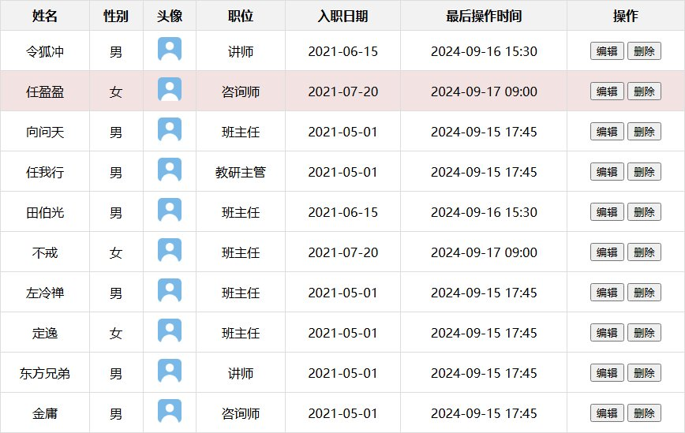
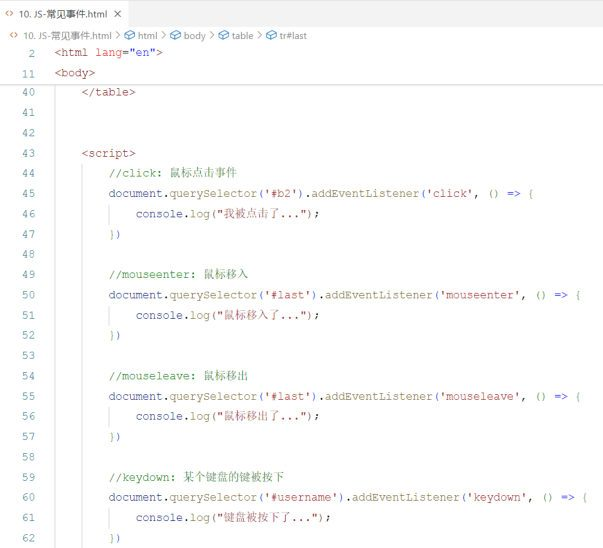
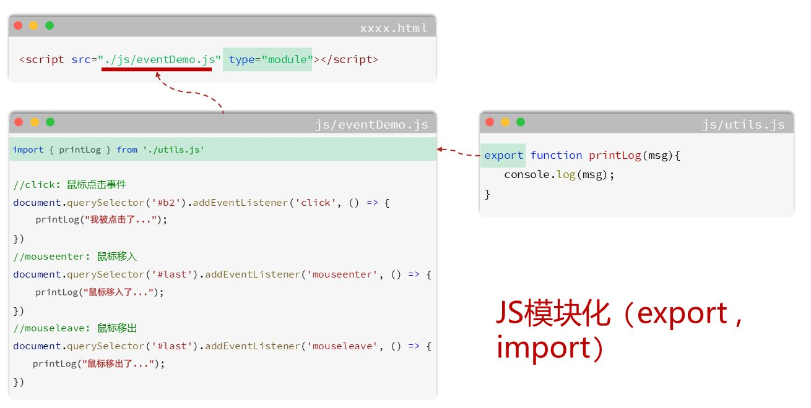

[16 篇](/posts/编程学习/javaweb学习笔记/16-js-dom操作/)的 JS 是"页面一打开就执行"：颜色染好、文字换掉，然后就没它什么事了。可网页要动起来，得等**用户做点什么**——点一下按钮、鼠标划过去、敲键盘。这一篇讲的就是"**用户做了事，JS 怎么知道、怎么做响应**"，也就是**事件监听**。

## 什么是事件、什么是事件监听

PPT 用两个问句把概念引出来：

> **事件**：HTML 事件是发生在 HTML 元素上的 "**事情**"。比如：
> - 按钮**被点击**
> - 鼠标**移动到**元素上
> - 按下**键盘按键**

> **事件监听**：JavaScript 可以在事件触发时，就**立即调用一个函数**做出响应，也称为 **事件绑定** 或 **注册事件**。

大白话拆一下：

| 说法 | 大白话 | 例子 |
| --- | --- | --- |
| 事件 | "**发生了什么**" | 用户点了"删除"按钮 |
| 事件监听 | "**提前安排好：这件事发生了就执行这段代码**" | 点了删除按钮 → 就把那一行数据删掉 |

注意"**提前安排**"这四个字：JS 不是一直盯着用户看，而是把"**套路**"写下来交给浏览器；等事件真的发生了，浏览器回来**调用**我们写的那个函数。

## 事件监听的三要素与语法

语法只有一行：

```javascript
事件源.addEventListener('事件类型', 事件触发执行的函数);
```

PPT 把这一行拆成**三要素**：

| 三要素 | 含义 | 落在代码的哪里 |
| --- | --- | --- |
| **事件源** | 哪个 DOM 元素触发了事件（**要先获取 DOM 元素**） | `addEventListener` 前面的那部分 |
| **事件类型** | 用什么方式触发，比如鼠标单击 `click` | 第一个参数（**字符串**） |
| **事件触发执行的函数** | 要做什么事 | 第二个参数（**回调函数**） |

课程代码 `08. JS-事件监听.html` 的一个按钮，完整写出来就是：

```html
<input id="btn" type="button" value="点我一下试试2">

<script>
	// 事件源：document.querySelector('#btn')
	// 事件类型：'click'
	// 要做的事：弹一句"试试就试试"
	document.querySelector('#btn').addEventListener('click', () => {
		alert('试试就试试');
	});
</script>
```

> [!WARNING]
> 第二个参数**只能写"函数"，不能写"函数的调用"**——多一对括号，行为就完全变了：
> ```javascript
> // ❌ 加了括号：sayHello() 是"立刻执行"，把执行结果(undefined)当成了回调
> //    结果：页面一加载就弹窗，点击按钮反而毫无反应
> document.querySelector('#btn').addEventListener('click', sayHello());
>
> // ✅ 只写函数名（或写完整的匿名函数）：交给浏览器，等点击了再调用
> document.querySelector('#btn').addEventListener('click', sayHello);
>
> // ✅ 匿名函数/箭头函数也都是这个道理
> document.querySelector('#btn').addEventListener('click', () => { sayHello(); });
> ```
> 同样别忘的事件类型是**字符串**：`'click'` 有引号，写成 `click` 会被当成一个没定义的变量，监听直接失效。

### 早期写法（了解）：`on事件` 会被覆盖

PPT 还给了一种老写法，并说明了它和 `addEventListener` 的区别：

> 早期版本写法（了解）：**事件源.on事件 = function() { ... }**
> 区别：**on 方式会被覆盖，addEventListener 方式可以绑定多次**，拥有更多特性，**推荐使用**。

课程代码把两种写法摆在一起做了对比实验：

```javascript
//事件监听 - addEventListener (可以多次绑定同一事件)
document.querySelector('#btn1').addEventListener('click', () => {
	console.log('试试就试试~~');
});
document.querySelector('#btn1').addEventListener('click', () => {
	console.log('试试就试试22~~');
});

//事件绑定-早期写法 - onclick (如果多次绑定同一事件, 覆盖) - 了解
document.querySelector('#btn2').onclick = () => {
	console.log('试试就试试~~');
};
document.querySelector('#btn2').onclick = () => {
	console.log('试试就试试22~~');
};
```

两个按钮长得一模一样，点起来的结果完全不同：

| 写法 | 点一次按钮，控制台输出 |
| --- | --- |
| `btn1`：`addEventListener` 绑了 **两次** | `试试就试试~~` **和** `试试就试试22~~`（**两次绑定都生效**） |
| `btn2`：`onclick` 绑了 **两次** | 只有 `试试就试试22~~`（**后一次把前一次覆盖了**） |

> [!TIP]
> 为什么 `onclick` 会被覆盖？因为 `事件源.onclick` 本质上是**给元素的一个属性赋值**——属性只能有一个值，赋第二次就把第一次冲掉了。`addEventListener` 是往元素的"监听器列表"里**追加**，所以能叠加、还能用 `removeEventListener` 精确移除。**新代码统一用 `addEventListener`**，`onclick` 看得懂就行。

## 常见事件

PPT 把常用事件分成四类（鼠标、键盘、焦点、表单），这张表要记个大概，写的时候按需查：

| 分类 | 事件 | 触发时机 | 常见用途 |
| --- | --- | --- | --- |
| **鼠标事件** | `click` | 鼠标**点击** | 点按钮、点删除 |
| | `mouseenter` | 鼠标**移入**元素 | 划过去高亮某一行 |
| | `mouseleave` | 鼠标**移出**元素 | 划走恢复原样 |
| **键盘事件** | `keydown` | 键盘**按下**触发 | 回车提交、输入快捷键 |
| | `keyup` | 键盘**抬起**触发 | 统计按键 |
| **焦点事件** | `focus` | 元素**获得焦点** | 输入框被选中时给提示 |
| | `blur` | 元素**失去焦点** | 离开输入框时做校验 |
| **表单事件** | `input` | 用户**输入时**触发（每敲一个字都触发） | 实时字数统计、搜索联想 |
| | `submit` | **表单提交**时触发 | 提交前做校验 |

课程代码 `10. JS-常见事件.html` 把九个事件全写了一遍（页面是一个小表单 + 一张成绩表），九段监听挨个对应上面这张表：

```html
<form action="" style="text-align: center;">
	<input type="text" name="username" id="username">
	<input type="text" name="age" id="age">
	<input id="b1" type="submit" value="提交">
	<input id="b2" type="button" value="单击事件">
</form>

<table width="800px" border="1" cellspacing="0" align="center">
	<tr>
		<th>学号</th><th>姓名</th><th>分数</th><th>评语</th>
	</tr>
	<tr align="center">
		<td>001</td><td>张三</td><td>90</td><td>很优秀</td>
	</tr>
	<tr align="center" id="last">
		<td>002</td><td>李四</td><td>92</td><td>优秀</td>
	</tr>
</table>

<script>
	//click: 鼠标点击事件
	document.querySelector('#b2').addEventListener('click', () => {
		console.log("我被点击了...");
	})

	//mouseenter: 鼠标移入
	document.querySelector('#last').addEventListener('mouseenter', () => {
		console.log("鼠标移入了...");
	})

	//mouseleave: 鼠标移出
	document.querySelector('#last').addEventListener('mouseleave', () => {
		console.log("鼠标移出了...");
	})

	//keydown: 某个键盘的键被按下
	document.querySelector('#username').addEventListener('keydown', () => {
		console.log("键盘被按下了...");
	})

	//keyup: 某个键盘的键被抬起
	document.querySelector('#username').addEventListener('keyup', () => {
		console.log("键盘被抬起了...");
	})

	//blur: 失去焦点事件
	document.querySelector('#age').addEventListener('blur', () => {
		console.log("失去焦点...");
	})

	//focus: 元素获得焦点
	document.querySelector('#age').addEventListener('focus', () => {
		console.log("获得焦点...");
	})

	//input: 用户输入时触发
	document.querySelector('#age').addEventListener('input', () => {
		console.log("用户输入时触发...");
	})

	//submit: 提交表单事件
	document.querySelector('form').addEventListener('submit', () => {
		alert("表单被提交了...");
	})
</script>
```

用控制台（F12 → Console）能一个个验证出来，其中有两条容易踩的细节：

> [!WARNING]
> - **`input` 触发得非常勤**：在年龄框里敲 `123`，控制台会响 3 次（每敲一个字符一次）；`keydown` / `keyup` 也是**每个键**都触发。写 `console.log` 没关系，真做"实时校验"时要考虑性能。
> - **`submit` 有"默认行为"**：表单提交后浏览器会带着参数**刷新页面**（课程的 `action=""` 就是提交到当前页）。所以点了"提交"你会看到 `alert` 之后页面一闪——后面学 Ajax 时，会用"阻止默认行为"把刷新掐掉，改成局部更新。

## 事件触发后做什么（回调函数里写什么）

回调函数里能做的事，就是 [16 篇](/posts/编程学习/javaweb学习笔记/16-js-dom操作/)学的那些 DOM 操作，加上事件自己的"上下文"：

```javascript
// 1. 打印/弹窗：先看事件到底有没有触发（调试最常用）
document.querySelector('#btn').addEventListener('click', () => {
	console.log('我被点击了...');
});

// 2. 改当前元素自己的内容或样式
document.querySelector('#btn').addEventListener('click', function () {
	this.innerText = '已点击';              // this 就是"被点的那个按钮"
	this.style.backgroundColor = '#e6f7ff'; // 顺手换个背景色
});

// 3. 读输入框里的值，再做判断
document.querySelector('#age').addEventListener('blur', function () {
	if (this.value < 18) {
		alert('未成年不能报名');
	}
});
```

两个要点：

- **`this` 就是"事件源"**：回调写成 `function(){}` 时，函数里的 `this` 指向**触发事件的那个元素**——不用再 `querySelector` 一遍。但**箭头函数没有自己的 `this`**（[15 篇](/posts/编程学习/javaweb学习笔记/15-js函数与自定义对象/)在对象方法里讲过同一个坑），要用 `this` 就拿不到元素。**想用 `this` 写 `function(){}`，只是打印日志用箭头函数无所谓。**
- **回调函数的第一个参数是"事件对象"（了解）**：`addEventListener('click', (event) => { console.log(event.target); })`——`event.target` 是**真正被点到的那个元素**（在"一整块区域里有很多小按钮"的场景里特别有用）。PPT 之外的这种参数后面做项目会经常见到，见一次认一次就行。

## 案例：鼠标移入移出改变数据行背景色

PPT 第 35 页的案例：

> **需求**：实现**鼠标移入数据行**时，背景色改为 `#f2e2e2`，**鼠标移出**时，再将背景色改为**白色**。

课程给的 AI 提示词（Prompt）：

```text
通过js实现鼠标移入移出隔行换色效果，鼠标移入时，背景色为#f2e2e2；鼠标移出，背景色统一显示白色...
```


*图：鼠标停在"任盈盈"那一行时，整行背景变成浅粉（`#f2e2e2`），其他行还是原来的颜色；鼠标一移开，这一行就恢复*

课程代码 `09. JS-案例-员工列表.html` 的脚本（在 [12 篇](/posts/编程学习/javaweb学习笔记/12-实战-tlias员工管理页面/)做好的表格基础上加）：

```javascript
//通过JS为上述的表格中数据行添加事件监听, 实现鼠标进入后, 背景色#f2e2e2; 鼠标离开后, 背景色需要设置为#fff; (JS新版本的语法)
// 1. 获取所有的tr标签
let trs = document.querySelectorAll('tr');

// 2. 为每一个tr标签添加事件监听
for (let i = 0; i < trs.length; i++) {
	trs[i].addEventListener('mouseenter', function () { // mouseenter 鼠标进入
		trs[i].style.backgroundColor = '#f2e2e2';
	});

	trs[i].addEventListener('mouseleave', function () { // mouseleave 鼠标离开
		trs[i].style.backgroundColor = '#fff';
	})
}
```

用三要素对照一下，套路和 16 篇的隔行换色一模一样，只是"每一步干什么"从改样式变成了**绑监听**：

| 三要素 | 这里是什么 |
| --- | --- |
| 事件源 | `trs[i]`——第 i 行（用循环给**每一行都绑一份**） |
| 事件类型 | `'mouseenter'` 移入、`'mouseleave'` 移出（**两个事件，绑两次**） |
| 要做的事 | 把 `this`/这一行的背景色改成 `#f2e2e2` 或 `#fff` |

> [!WARNING]
> 课程这段代码有两个"将就"的地方，抄的时候知道自己在将就：
> 1. **`querySelectorAll('tr')` 把表头行 `thead` 里的 `tr` 也选进来了**：鼠标划过表头时，表头那一行的 `tr` 背景**确实也被改成了浅粉**，只是表头的 `th` 自带背景色（`#f2f2f2`）把它盖住了，肉眼看不出来。要只作用于数据行，写成 `document.querySelectorAll('tbody tr')`。
> 2. **移出时统一设成白色 `#fff`**：如果这页同时用了 16 篇的"隔行换色"，鼠标划一圈回来那一行的**隔行色就没了**（被白色覆盖）。想两全，就得在移出时**按这一行原本的规律还原颜色**——循环变量 `i` 还在作用域里，正好用得上：
> ```javascript
> trs[i].addEventListener('mouseenter', function () {
>   this.style.backgroundColor = '#f2e2e2';                        // 移入：先变浅粉
> });
> trs[i].addEventListener('mouseleave', function () {
>   // 移出：按行号还原本来的隔行色（还是"奇数行/偶数行"那套判断）
>   this.style.backgroundColor = (i % 2 == 0) ? '#f2e2e2' : '#e6f7ff';
> });
> ```

> [!TIP]
> 顺便说清一件事：**"鼠标划过去变色"这种纯视觉效果，CSS 一行就能做**——`tbody tr:hover { background-color: #f2e2e2; }`（`:hover` 就是"鼠标悬停"）。课程用 JS 来做，是为了练事件监听的写法。
> 判断标准：**只是"看起来变了"→ CSS；需要"发生一件事"（点击后删除、输入后校验、提交后发请求）→ JS 事件。** 后者 CSS 永远做不到。

## 代码优化：抽成函数、搬进 js 文件

PPT 在这之前先抛出两个问号：**复用？？ 维护？？**


*图：`10. JS-常见事件.html` 里的脚本——九段监听，每一段开头都是 `document.querySelector('#xxx').addEventListener(...)`，名字一模一样的重复代码连成一长串，而且全挤在 HTML 里*

这正是要被优化的地方。课程走了两步：

### 第一步：脚本搬到 `js/` 目录下的独立文件

HTML 里只留一行引入，剩下的都在外部文件里：

```html
<!-- type="module" 模块化JS -->
<script src="./js/eventDemo.js" type="module"></script>
```

### 第二步：模块化（`export` / `import`）——重复的代码抽成"工具函数"


*图：`xxxx.html` 引入 `js/eventDemo.js`（`type="module"`），`eventDemo.js` 顶部又用 `import` 从 `js/utils.js` 拿工具函数；`utils.js` 里用 `export` 把 `printLog(msg)` 暴露出去——页面、业务代码、工具代码各占一个文件*

三个文件各管一段，代码长这样：

```javascript
// js/utils.js —— 工具函数：谁都能用的通用能力
export function printLog(msg){
	console.log(msg);
}
```

```javascript
// js/eventDemo.js —— 业务代码：这个页面的事件都在这儿
import { printLog } from "./utils.js"; // 从工具文件里拿函数

//click: 鼠标点击事件
document.querySelector('#b2').addEventListener('click', () => {
	printLog("我被点击了...");
})

//mouseenter: 鼠标移入
document.querySelector('#last').addEventListener('mouseenter', () => {
	printLog("鼠标移入了...");
})

//mouseleave: 鼠标移出
document.querySelector('#last').addEventListener('mouseleave', () => {
	printLog("鼠标移出了...");
})
```

```html
<!-- 11. JS-常见事件(优化).html —— 页面里只剩一行引入 -->
<script src="./js/eventDemo.js" type="module"></script>
```

优化前后对比：

| 对比项 | 优化前（脚本写在 HTML 里） | 优化后（外部文件 + 模块化） |
| --- | --- | --- |
| **复用** | 想重用只能复制粘贴 | `printLog` 在 `utils.js` 里**导出一次**，任何文件 `import` 就能用 |
| **维护** | 改一个公共逻辑要在九段代码里翻 | 改 `utils.js` 一处，所有调用它的地方一起变 |
| 页面文件 | HTML 里塞几百行 JS，结构和行为混在一起 | HTML 只管结构，`js/` 目录管行为 |

> [!WARNING]
> **模块化 JS 不能用 `file://` 双击打开！** 只要 `<script>` 上写了 `type="module"`、文件里用了 `import`，浏览器就会按"跨域"处理这个 JS 文件，双击打开的地址是 `file:///...`（源的 origin 是 `null`），会被直接拦下来，控制台报：
> ```text
> Access to script at 'file:///..../js/eventDemo.js' from origin 'null' has been blocked by CORS policy
> ```
> 页面看上去没报错，但事件一个都不响应。**要用本地服务器访问**——课程用的是 VS Code 插件 **Live Server**（地址栏是 `http://127.0.0.1:5501/...`，PPT 里那个案例截图就是它）。装好插件后右键 html 文件 → Open with Live Server 即可。
> 还没学服务器也不要紧：**这一篇的练习都不用模块化**，普通 `<script>` 内联或外链（不带 `type="module"`）双击就能跑。

> [!TIP]
> **"抽函数"和"模块化"其实是两件事**：
> - **抽函数**（把重复代码收进一个函数，再改调用的地方）——**不需要任何额外环境**，普通 `<script>` 里就能做，这是"代码优化"的**第一步**；
> - **模块化**（`export` / `import` 拆文件）——需要本地服务器环境，是把"复用"扩展到**多个文件之间**的工具；后面 Vue 项目的每个 `.vue` 文件、`api/` 目录里的 `export` 都是它。
>
> 顺序就是这个顺序：**先抽函数，再考虑拆文件。**

## 小结

| 问题 | 答案 |
| --- | --- |
| 什么是事件？ | HTML 事件是发生在 HTML 元素上的 "**事情**"——按钮被点击、鼠标移动到元素上、按下键盘按键 |
| 什么是事件监听？ | JS 在**事件触发时立即调用一个函数**做出响应，也叫**事件绑定**或**注册事件** |
| 事件监听的语法？ | `事件源.addEventListener('事件类型', 事件触发执行的函数);` |
| 三要素是什么？ | **事件源**（先获取 DOM 元素）、**事件类型**（如 `'click'`）、**事件触发执行的函数**（要做什么事） |
| 早期写法和区别？ | `事件源.on事件 = function(){}`（了解）——**on 方式会被覆盖**，`addEventListener` **可以绑定多次**，推荐使用 |
| 四类常见事件？ | **鼠标**：`click` / `mouseenter` / `mouseleave`；**键盘**：`keydown` / `keyup`；**焦点**：`focus` / `blur`；**表单**：`input`（每敲一个字符都触发）/ `submit`（提交，默认会刷新页面） |
| 回调函数里能做什么？ | 用 16 篇的 DOM 操作——打印/弹窗、`this.innerText`、`this.style.xxx`、读 `this.value`；`function(){}` 里的 `this` 就是事件源，箭头函数没有自己的 `this` |
| 代码怎么优化？ | ① **抽成函数**（重复逻辑收进一处，无需额外环境）② **搬到 `js/` 外部文件**，用 `<script src="./js/xxx.js">` 引入 ③ 跨文件复用用**模块化**：`utils.js` 里 `export`、业务文件里 `import { printLog } from "./utils.js"`，引入的 `<script>` 要加 `type="module"` |
| 模块化有什么坑？ | `file://` 双击打开会被 **CORS 策略拦截**（控制台报 blocked by CORS policy），必须用**本地服务器**（如 VS Code 的 Live Server）访问 |

## 相关

- [上一篇：JS-DOM操作](/posts/编程学习/javaweb学习笔记/16-js-dom操作/)
- [下一篇：实战-JS版员工列表](/posts/编程学习/javaweb学习笔记/18-实战-js版员工列表/)
- [JavaScript入门与引入方式（内部脚本 / 外部脚本）](/posts/编程学习/javaweb学习笔记/13-javascript入门与引入方式/)
- [JS函数与自定义对象（回调函数、箭头函数的 this）](/posts/编程学习/javaweb学习笔记/15-js函数与自定义对象/)

## 练习题

### 一、知识回顾（读完直接做下面的实践题）

1. **事件**：HTML 事件是发生在 HTML 元素上的 "**事情**"，比如按钮**被点击**、鼠标**移动到**元素上、按下**键盘按键**
2. **事件监听**：JavaScript 可以在事件触发时**立即调用一个函数**做出响应，也叫**事件绑定**或**注册事件**；写法是 `事件源.addEventListener('事件类型', 事件触发执行的函数);`
3. **三要素**：**事件源**（哪个 DOM 元素触发了事件，要先获取元素）、**事件类型**（用什么方式触发，如鼠标单击 `'click'`）、**事件触发执行的函数**（要做什么事）
4. 第二个参数是**函数本身**，**不能加括号**——`addEventListener('click', sayHello())` 会变成"页面一加载就执行"，点击反而没反应；事件类型是**字符串**，`'click'` 的引号不能少
5. 早期写法（了解）：`事件源.on事件 = function(){}`；区别是 **on 方式会被覆盖**（后一次赋值冲掉前一次），而 **`addEventListener` 可以绑定多次**，同一事件绑两遍两个都会执行——**推荐用 `addEventListener`**
6. **常见事件分四类**：鼠标 `click`（点击）/ `mouseenter`（移入）/ `mouseleave`（移出）；键盘 `keydown`（按下）/ `keyup`（抬起）；焦点 `focus`（获得焦点）/ `blur`（失去焦点）；表单 `input`（用户输入时，**每敲一个字符触发一次**）/ `submit`（表单提交）
7. **`submit` 有默认行为**——提交后浏览器会带着参数**刷新页面**；`input` 触发非常频繁，写实时逻辑时要注意
8. 回调里能做的事就是 DOM 操作：`console.log()` / `alert()` 看效果、`this.innerText` 改内容、`this.style.backgroundColor` 改样式、`this.value` 读输入值
9. **回调写成 `function(){}` 时 `this` 就是事件源**（被点的那个元素）；**箭头函数没有自己的 `this`**，要用 `this` 就别写箭头函数
10. **代码优化两步**：① 重复逻辑**抽成函数**（无需额外环境）② 脚本**搬到 `js/` 外部文件**用 `<script src="./js/xxx.js">` 引入；跨文件复用靠**模块化**——`utils.js` 里 `export function printLog(msg){...}`、业务文件里 `import { printLog } from "./utils.js"`，引入的 `<script>` 必须加 **`type="module"`**，而且**不能用 `file://` 双击打开**（会被 CORS 拦截），要用本地服务器（Live Server）

### 二、裸写题

- [ ] **2-1 给按钮绑定点击事件**
  页面上有一个按钮（id 为 `btn`）。要求：**点击这个按钮**时，弹出提示文字"**试试就试试**"（用浏览器弹窗，别只打印到控制台）。
  （练习文件 `test_17_点击事件.html` 里已经准备好了按钮和写作区。）

  > [!TIP]- 提示（先自己想，实在想不出再点开）
  > **一级 · 思路**：先"抓住"按钮，再告诉它"被点击时干什么"——三要素一个个对上
  > **二级 · 方法**：`document.querySelector('#btn').addEventListener('click', 函数)`；弹窗用 `alert('...')`
  > **三级 · 骨架**：`document.querySelector('#btn').____________('click', () => { ____('试试就试试'); });`

  > [!TIP]- 参考答案（做完再点开）
  > ```javascript
  > document.querySelector('#btn').addEventListener('click', () => {
  >   alert('试试就试试');
  > });
  > ```
  > 对照课程 `08. JS-事件监听.html` 和 PPT 第 33 页（那页的两种写法就是 `addEventListener` 和 `onclick`）。检查点：点一次按钮弹一次窗，页面上其他地方点击不该弹。

- [ ] **2-2 同一个按钮绑两次，再和 on 方式比一比**
  页面上有两个按钮：`btn1` 和 `btn2`。要求：
  1. 给 `btn1` **用监听方式绑定两次**点击事件：第一次打印"**试试就试试~~**"、第二次打印"**试试就试试22~~**"
  2. 给 `btn2` **用 on 方式也绑定两次**点击事件：内容同上
  3. 分别点两个按钮，从控制台看结果有什么不同，说出为什么
  （练习文件 `test_17_绑定方式对比.html` 里已经准备好了两个按钮和写作区。）

  > [!TIP]- 提示（先自己想，实在想不出再点开）
  > **一级 · 思路**：就是把课程 `08. JS-事件监听.html` 的对比实验自己写一遍
  > **二级 · 方法**：监听方式 `addEventListener('click', ...)` 可以写两遍；on 方式是 `元素.onclick = 函数`，赋值两次
  > **三级 · 骨架**：`document.querySelector('#btn1').addEventListener('click', () => { console.log('____'); });`（再来一次）/ `document.querySelector('#btn2').onclick = () => { console.log('____'); };`（再来一次）

  > [!TIP]- 参考答案（做完再点开）
  > ```javascript
  > //1. addEventListener 绑两次：两次都会执行
  > document.querySelector('#btn1').addEventListener('click', () => {
  >   console.log('试试就试试~~');
  > });
  > document.querySelector('#btn1').addEventListener('click', () => {
  >   console.log('试试就试试22~~');
  > });
  >
  > //2. on 方式绑两次：后一次覆盖前一次
  > document.querySelector('#btn2').onclick = () => {
  >   console.log('试试就试试~~');
  > };
  > document.querySelector('#btn2').onclick = () => {
  >   console.log('试试就试试22~~');
  > };
  > ```
  > 结果：点 `btn1` 控制台出现**两行**，点 `btn2` 只出现**一行**（`试试就试试22~~`）。原因：`onclick` 是给元素的**属性赋值**，属性只有一个值；`addEventListener` 是往**监听器列表**里追加，能叠加。

- [ ] **2-3 鼠标移入移出换背景色**
  页面上有一张成绩表（表头 + 3 行数据）。要求：鼠标**移入某一行**时，这一行背景色变成 `#f2e2e2`；鼠标**移出**时，这一行恢复成**白色**。
  （练习文件 `test_17_鼠标移入移出.html` 里已经准备好了表格和写作区。）

  > [!TIP]- 提示（先自己想，实在想不出再点开）
  > **一级 · 思路**：要给"每一行"都绑上监听（得用循环），而且是两个事件各绑一次
  > **二级 · 方法**：`document.querySelectorAll('tbody tr')` 拿到所有数据行；循环里 `trs[i].addEventListener('mouseenter', 函数)` 和 `'mouseleave'`；改背景色用 `style.backgroundColor`
  > **三级 · 骨架**：`let trs = document.querySelectorAll('____');` / `for (let i = 0; i < trs.____; i++) {` / `trs[i].addEventListener('____', function () { trs[i].style.________ = '#f2e2e2'; });` / 再绑一个 `'____'` 设成 `'#fff'`

  > [!TIP]- 参考答案（做完再点开）
  > ```javascript
  > // 1. 获取所有数据行（只拿 tbody 里的，表头不参与）
  > let trs = document.querySelectorAll('tbody tr');
  >
  > // 2. 给每一行都绑上"移入/移出"两个监听
  > for (let i = 0; i < trs.length; i++) {
  >   trs[i].addEventListener('mouseenter', function () {  // 鼠标移入
  >     trs[i].style.backgroundColor = '#f2e2e2';
  >   });
  >
  >   trs[i].addEventListener('mouseleave', function () {  // 鼠标移出
  >     trs[i].style.backgroundColor = '#fff';
  >   });
  > }
  > ```
  > 对照课程 `09. JS-案例-员工列表.html` 的脚本（课程里写的是 `querySelectorAll('tr')`，会把表头也算进去；这里只选 `tbody tr`）。检查点：鼠标划过哪一行，就只有那一行变色。

- [ ] **2-4 让输入框"有反应"**
  页面上有一个姓名输入框（id 为 `username`）和一个显示区（id 为 `tip`）。要求：
  1. 输入框**获得焦点**时，把显示区的文字改成"**正在输入姓名…**"
  2. 输入框**失去焦点**时，把显示区的文字改成"**输入完成：**"后面接上输入框里的内容
  3. 输入框里**每敲一个字**，就把当前的输入内容实时显示在显示区里
  （练习文件 `test_17_焦点与输入事件.html` 里已经准备好了输入框、显示区和写作区。）

  > [!TIP]- 提示（先自己想，实在想不出再点开）
  > **一级 · 思路**：同一个输入框要绑三个事件，每个事件里都是"改另一个元素的文字"
  > **二级 · 方法**：事件类型 `'focus'`、`'blur'`、`'input'`；读输入框内容用 `this.value` 或 `输入框.value`；改文字用 `innerText`（里面要拼变量就用模板字符串）
  > **三级 · 骨架**：`let input = document.querySelector('#username');` / `let tip = document.querySelector('#tip');` / `input.addEventListener('____', function () { tip.innerText = '正在输入姓名…'; });` / `input.addEventListener('blur', function () { tip.innerText = `输入完成：${this.____}`; });` / `input.addEventListener('____', function () { tip.innerText = this.value; });`

  > [!TIP]- 参考答案（做完再点开）
  > ```javascript
  > let input = document.querySelector('#username');
  > let tip = document.querySelector('#tip');
  >
  > //1. 获得焦点
  > input.addEventListener('focus', function () {
  >   tip.innerText = '正在输入姓名…';
  > });
  >
  > //2. 失去焦点：拼上当前输入的内容
  > input.addEventListener('blur', function () {
  >   tip.innerText = `输入完成：${this.value}`;
  > });
  >
  > //3. 输入时实时回显
  > input.addEventListener('input', function () {
  >   tip.innerText = this.value;
  > });
  > ```
  > 对照课程 `10. JS-常见事件.html` 里 focus / blur / input 三段。三个检查点：① 光标点进输入框 → 提示变"正在输入姓名…"；② 敲字时显示区跟着变；③ 点到别处 → 变成"输入完成：xxx"。注意 `this.value` 读的是**输入框里的内容**（不是 `innerHTML`）。

### 三、综合题

- [ ] **3-1 做一个"个人名片"小交互页**
  页面上有一张名片（`#card`）、一个"换个问候语"按钮（`#greetBtn`）、一个昵称输入框（`#nickname`）和一行状态提示（`#status`）。要求做出三个交互，并把重复的逻辑抽成函数：

  1. 点击"换个问候语"按钮：把名片上的问候语（`#greeting`）改成"**你好，欢迎来看我的主页**"（连点多次效果相同即可）
  2. 鼠标移入名片时名片背景变 `#e6f7ff`，移出恢复白色
  3. 在昵称输入框里输入时，实时把"**当前昵称：**"加输入内容显示在状态提示里；失去焦点时改成"**昵称已确定**"
  4. **代码优化**：把"改状态提示文字"这段重复逻辑抽成一个函数（比如 `setStatus(text)`），第 3 步的三个事件里都调用它，而不是各写一遍
  （练习文件 `test_17_综合_交互三连.html` 里已经准备好了页面元素和写作区。）
  （进阶·可选：把 `setStatus` 挪到 `js/utils.js` 用 `export`/`import` 引入——这一步需要用 Live Server 打开，双击是跑不起来的。）

  > [!TIP]- 提示（先自己想，实在想不出再点开）
  > **一级 · 思路**：三个交互分别对应三组事件；第 4 步是"代码优化"里的第一步——**抽函数**，函数不需要任何额外环境，普通 `<script>` 就行
  > **二级 · 方法**：点击 `'click'`、移入移出 `'mouseenter'`/`'mouseleave'`、输入 `'input'`、失焦 `'blur'`；改文字 `innerText`；函数定义 `function setStatus(text){ ... }`，调用 `setStatus('...')`
  > **三级 · 骨架**：`function setStatus(text) { document.querySelector('#status').____ = text; }` / `document.querySelector('#greetBtn').addEventListener('____', () => { document.querySelector('#greeting').innerHTML = '____'; });` / `card.addEventListener('mouseenter', () => { card.style.________ = '#e6f7ff'; });` / `input.addEventListener('input', () => { setStatus(`当前昵称：${input.____}`); });`

  > [!TIP]- 参考答案（做完再点开）
  > ```javascript
  > // 先定义"改状态提示"的工具函数：重复逻辑只写一次
  > function setStatus(text) {
  >   document.querySelector('#status').innerText = text;
  > }
  >
  > let card = document.querySelector('#card');
  > let nickname = document.querySelector('#nickname');
  >
  > //1. 点击按钮改问候语
  > document.querySelector('#greetBtn').addEventListener('click', () => {
  >   document.querySelector('#greeting').innerHTML = '你好，欢迎来看我的主页';
  > });
  >
  > //2. 鼠标移入移出换背景色
  > card.addEventListener('mouseenter', () => {
  >   card.style.backgroundColor = '#e6f7ff';
  > });
  > card.addEventListener('mouseleave', () => {
  >   card.style.backgroundColor = '#fff';
  > });
  >
  > //3. 输入实时回显 + 失焦确认（三处都调用工具函数）
  > nickname.addEventListener('input', () => {
  >   setStatus(`当前昵称：${nickname.value}`);
  > });
  > nickname.addEventListener('focus', () => {
  >   setStatus('正在输入昵称…');
  > });
  > nickname.addEventListener('blur', () => {
  >   setStatus('昵称已确定');
  > });
  > ```
  > 三个检查点：① 点按钮后名片上的问候语变了；② 鼠标划进名片变浅蓝、划出变白；③ 输入框每敲一个字状态行都跟着变，三处提示都走 `setStatus` 这一个函数（想改提示的样式，只改函数里那一行就够了——这就是"抽函数"带来的好处）。
  > 进阶版验证方式：把 `setStatus` 移到 `js/utils.js` 里写成 `export function setStatus(text) {...}`，主文件顶部 `import { setStatus } from "./utils.js";`，`<script>` 加 `type="module"`，然后用 **Live Server** 打开——直接双击（`file://`）会报 CORS，事件全都不响应。
