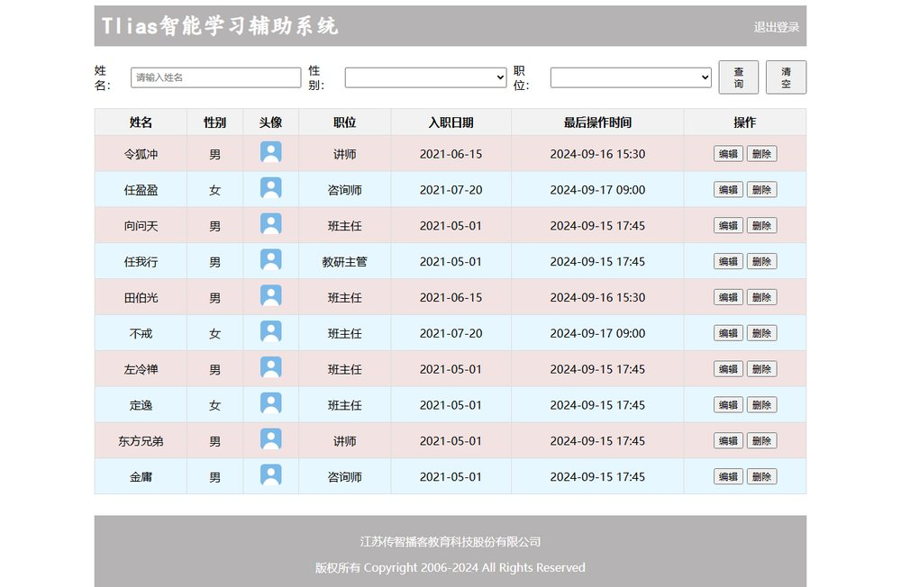
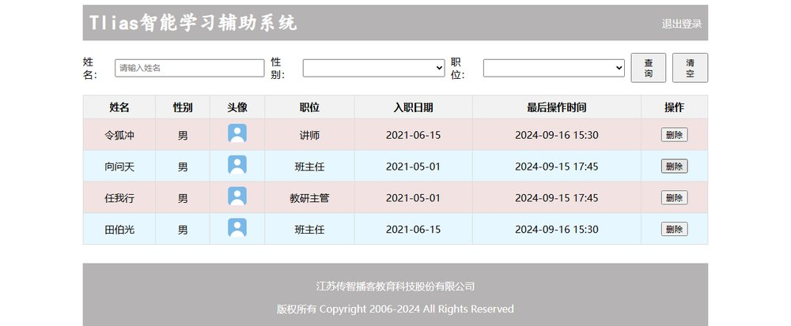

[12 篇](/posts/编程学习/javaweb学习笔记/12-实战-tlias员工管理页面/)做出了"Tlias 智能学习辅助系统"的员工管理页面——很完整，但它是**死的**：十行员工数据是**手写在 HTML 里的**，"编辑""删除"按钮**点了没反应**，鼠标划过也不会亮。

这一篇用 [16 篇](/posts/编程学习/javaweb学习笔记/16-js-dom操作/)的 DOM 操作 + [17 篇](/posts/编程学习/javaweb学习笔记/17-js事件监听/)的事件监听把它**盘活**。课程里有**两个案例**，都加在同一个页面上；最后再补一个把两者合起来的"数据驱动版"，让删除按钮真的能用。

## 先看清页面结构：JS 要动的是哪一块

页面（课程文件 `06. JS-案例-员工列表.html`）还是 12 篇那四个区域，但**只有表格区域会被 JS 碰**：

| 区域 | 标签 | 这一篇的 JS 要不要动它 |
| --- | --- | --- |
| 顶部导航栏 | `.navbar` | 不动 |
| 搜索表单区域 | `.search-form` | 不动（表单的行为后面学 Ajax 再管） |
| **表格数据展示区域** | `<table>` + `<thead>` + `<tbody>` | **主要战场**：数据行在 `<tbody>` 里 |
| 底部版权区域 | `.footer` | 不动 |

关键是表格的骨架——**表头在 `thead` 里，数据行在 `tbody` 里**：

```html
<table>
	<!-- 表头 -->
	<thead>
		<tr>
			<th>姓名</th>
			<th>性别</th>
			<th>头像</th>
			<th>职位</th>
			<th>入职日期</th>
			<th>最后操作时间</th>
			<th>操作</th>
		</tr>
	</thead>

	<!-- 表格主体内容 -->
	<tbody>
		<tr>
			<td>令狐冲</td>
			<td>男</td>
			<td></td>
			<td>讲师</td>
			<td>2021-06-15</td>
			<td>2024-09-16 15:30</td>
			<td class="action-buttons">
				<button type="button">编辑</button>
				<button type="button">删除</button>
			</td>
		</tr>
		<!-- ……一共 10 行数据，结构一模一样 -->
	</tbody>
</table>
```

> [!TIP]
> 两个位置上的讲究，**写错了整段 JS 直接不工作**：
> 1. **脚本写在 `</body>` 前面**（页面元素的下方）。因为 JS 是**从上往下执行**的，脚本放在 `<head>` 里时表格还不存在，`document.querySelector('tbody tr')` 拿到的是 `null`，接着改它的属性就会报 `Cannot read properties of null`——这也是 [13 篇](/posts/编程学习/javaweb学习笔记/13-javascript入门与引入方式/)说"内部脚本一般放 body 底部"的真正原因。
> 2. **选数据行要写 `tbody tr`**：只写 `tr` 会把表头那一行也选进来。

## 案例一（课程）：表格数据行隔行换色

**需求**：实现表格**数据行**的隔行换色——**奇数行**背景色 `#f2e2e2`，**偶数行**背景色 `#e6f7ff`。

**代码**（写在页面最下方新增的 `<script>` 里）：

```javascript
//通过JS实现上述表格中数据行的隔行换色效果, 奇数行背景色设置为 #f2e2e2, 偶数行背景色设置为 #e6f7ff (JS新语法实现)
let trList = document.querySelectorAll("tbody tr"); // 获取所有数据行 - DOM操作
for (let i = 0; i < trList.length; i++) {
	if (i % 2 == 0) {
		trList[i].style.backgroundColor = "#f2e2e2"; // 奇数行：浅粉
	} else {
		trList[i].style.backgroundColor = "#e6f7ff"; // 偶数行：浅蓝
	}
}
```

**效果**：


*图：案例一做完的页面——导航栏、搜索表单、页脚都还是 12 篇的样子，表格的 10 行数据一行浅粉、一行浅蓝交替排开，表头保持灰色（页面里的头像用了本地占位图，课程原图床链接已失效）*

**讲解**（三步，就是 16 篇的"获取元素 → 遍历 → 操作样式"）：

| 这行代码 | 作用 |
| --- | --- |
| `document.querySelectorAll("tbody tr")` | 拿到**所有 10 行数据**（表头那行不算） |
| `for (let i = 0; i < trList.length; i++)` | 挨个处理每一行 |
| `trList[i].style.backgroundColor = ...` | 给第 i 行上色；`i % 2 == 0` 的是页面上数下来的**奇数行**（**索引从 0 开始**，这是最容易写反的地方） |

> [!TIP]
> 为什么 CSS 的 `tr:nth-child(even)` 就能干的事，非要写 4 行 JS？**这个案例练的不是"换色"，是"用 JS 按规则改页面"这条主线**。等表格变成"数据渲染出来的"（本节的延伸部分）、或者颜色规则跟数据有关（分数 90 以上标绿）时，CSS 就做不了了——JS 才是那个能"算"的角色。

## 案例二（课程）：鼠标移入移出改变数据行背景色

**需求**：鼠标**移入**数据行时背景色改为 `#f2e2e2`，**移出**时改回**白色**。

**AI 提示词**（PPT 第 35 页给的）：

```text
通过js实现鼠标移入移出隔行换色效果，鼠标移入时，背景色为#f2e2e2；鼠标移出，背景色统一显示白色...
```

**代码**（加在同一个 `<script>` 里，或另起一个）：

```javascript
//通过JS为上述的表格中数据行添加事件监听, 实现鼠标进入后, 背景色#f2e2e2; 鼠标离开后, 背景色需要设置为#fff; (JS新版本的语法)
// 1. 获取所有的tr标签
let trs = document.querySelectorAll('tr');

// 2. 为每一个tr标签添加事件监听
for (let i = 0; i < trs.length; i++) {
	trs[i].addEventListener('mouseenter', function () { // mouseenter 鼠标进入
		trs[i].style.backgroundColor = '#f2e2e2';
	});

	trs[i].addEventListener('mouseleave', function () { // mouseleave 鼠标离开
		trs[i].style.backgroundColor = '#fff';
	})
}
```

**讲解**：事件监听三要素——**事件源**是循环里的 `trs[i]`（每一行都绑一份）、**事件类型**是 `'mouseenter'` 和 `'mouseleave'`（两个事件，绑两次）、**要做的事**是改这一行的背景色。

**两个案例合在一起用，会打架**——这是这个页面最值得注意的地方：

| 冲突 | 现象 | 原因 |
| --- | --- | --- |
| `tr` 选多了 | 表头那一行也**被绑上了事件**（划过表头时表头 `tr` 的背景确实被改了，只是被 `th` 自己的背景色盖住，肉眼看不出来） | `querySelectorAll('tr')` 把 `thead` 里的表头行也选上了 |
| 移出改白色 | 鼠标划过的行**隔行色没了**，变成一片白 | 案例二把移出的颜色**写死成 `#fff`**，把案例一染好的浅粉/浅蓝覆盖掉了 |

要两全，就把案例二的"移出"改成**按行号还原本来的隔行色**（[17 篇](/posts/编程学习/javaweb学习笔记/17-js事件监听/)的提示块里给了这段）：

```javascript
let trs = document.querySelectorAll('tbody tr'); // 只选数据行

for (let i = 0; i < trs.length; i++) {
	trs[i].addEventListener('mouseenter', function () {
		this.style.backgroundColor = '#f2e2e2';                        // 移入：高亮
	});

	trs[i].addEventListener('mouseleave', function () {
		// 移出：还原本来的隔行色（循环变量 i 还在，正好判断奇偶）
		this.style.backgroundColor = (i % 2 == 0) ? '#f2e2e2' : '#e6f7ff';
	});
}
```

## 延伸：把员工列表改成"数据驱动版"

课程的十行数据是**手写**在 HTML 里的，所以有两个绕不过去的问题——**数据只能手改**（多一个员工就要复制一整个 `<tr>`）、**"删除"按钮点了没反应**。这里用已经学过的知识把它补上：**数据放在数组里，页面由 JS 渲染出来，删数据后重新渲染。**

### 第 1 步：把行数据搬进数组

每一行需要展示 5 个字段（头像统一用一张图，省得来回换地址），用 [15 篇](/posts/编程学习/javaweb学习笔记/15-js函数与自定义对象/)的"数组里放对象"：

```javascript
// 员工数据：数据是"真身"，页面只是它的影子
let emps = [
	{ name: '令狐冲', gender: '男', position: '讲师',     entryDate: '2021-06-15', lastTime: '2024-09-16 15:30' },
	{ name: '任盈盈', gender: '女', position: '咨询师',   entryDate: '2021-07-20', lastTime: '2024-09-17 09:00' },
	{ name: '向问天', gender: '男', position: '班主任',   entryDate: '2021-05-01', lastTime: '2024-09-15 17:45' },
	{ name: '任我行', gender: '男', position: '教研主管', entryDate: '2021-05-01', lastTime: '2024-09-15 17:45' },
	{ name: '田伯光', gender: '男', position: '班主任',   entryDate: '2021-06-15', lastTime: '2024-09-16 15:30' }
];
```

### 第 2 步：写一个 `render()`，把数据"画"成表格行

`tbody` 里的行先全部清空，再用**循环 + 模板字符串**拼出所有行，最后一次性塞给 `innerHTML`：

```javascript
let tbody = document.querySelector('tbody');

// 按数据渲染表格：数据有几条，页面就有几行
function render() {
	let html = '';
	for (let i = 0; i < emps.length; i++) {
		html += `<tr>
			<td>${emps[i].name}</td>
			<td>${emps[i].gender}</td>
			<td></td>
			<td>${emps[i].position}</td>
			<td>${emps[i].entryDate}</td>
			<td>${emps[i].lastTime}</td>
			<td class="action-buttons">
				<button type="button" class="del">删除</button>
			</td>
		</tr>`;
	}
	tbody.innerHTML = html; // 整体替换：旧行连同旧事件一起被换掉
}
```

> [!TIP]
> 这里能看出 [16 篇](/posts/编程学习/javaweb学习笔记/16-js-dom操作/)里 `innerHTML` 的威力：**拼字符串比"创建元素 + 设置属性 + 追加子节点"省事得多**。字符串里的 `${emps[i].name}` 是模板字符串的占位符，`i` 每转一圈就换一条数据。
> 也顺手理解了 `innerHTML` 的"整体替换"性质：**旧的 `<tr>` 和绑在它们身上的事件监听一起被丢掉了**——这是下一步"重新绑事件"的原因。
> （代码里的头像地址是课程页面原来用的图床链接，**现在访问返回 403 已经失效**，自己练的时候换成一张本地图片即可，不影响逻辑。）

### 第 3 步：隔行换色抽成函数 `stripe()`

案例一的代码现在不能只跑一次了（每次重新渲染后都是新行，颜色要重刷），所以把它包成函数，**渲染完就调用**：

```javascript
// 隔行换色：把案例一的逻辑包成函数，随时可以再调用一次
function stripe() {
	let trList = document.querySelectorAll('tbody tr');
	for (let i = 0; i < trList.length; i++) {
		if (i % 2 == 0) {
			trList[i].style.backgroundColor = '#f2e2e2';
		} else {
			trList[i].style.backgroundColor = '#e6f7ff';
		}
	}
}
```

### 第 4 步：给"删除"按钮接上事件

点删除 → **先从数据里删掉这一条** → 再重新渲染、重新上色、重新绑事件：

```javascript
// 给每一行的删除按钮绑事件（每次渲染后都要重新绑，因为按钮是新的）
function bindDelete() {
	let delBtns = document.querySelectorAll('.del');
	for (let i = 0; i < delBtns.length; i++) {
		delBtns[i].addEventListener('click', function () {
			emps.splice(i, 1); // 1. 数据里删掉这一条（i 就是这一行对应的数据下标）
			render();          // 2. 按新数据重新渲染表格
			stripe();          // 3. 重新隔行换色
			bindDelete();      // 4. 新按钮要重新绑事件
		});
	}
}
```

**页面加载时依次调用三个函数**，就完成了一次"从数据到页面"的完整流程：

```javascript
render();      // 先有行
stripe();      // 再上色
bindDelete();  // 最后绑事件
```

### 效果


*图：点掉第 2 行"任盈盈"之后——这一行消失了，剩下的行**自动重排隔行颜色**（后面的行顶上来重新交替），表头、导航栏、页脚不受影响（页面里的头像用了本地占位图，课程原图床链接已失效）*

> [!WARNING]
> 第 4 步里最容易想不通的是"**为什么渲染完要重新 `bindDelete()`**"：
> - 事件监听是绑在**当时那些按钮对象**上的；`render()` 用 `innerHTML` 把整批旧行**换成了新对象**，旧按钮连同它们的监听一起被丢掉了；
> - 所以新渲染出来的按钮**默认是"裸的"**，不重新绑就点了没反应——**每次渲染完都要重新绑一次**，这是"用 JS 渲染页面"这套做法的固定步骤（另一条路叫"事件委托"，绑在父元素上只绑一次，后面项目里会遇到）。
>
> 另外注意 `emps.splice(i, 1)` 里的 `i`：**每次渲染后都重新查询、重新绑定**，所以索引永远和当前数据的顺序对得上——这也正是"先删数据、再整体重渲染"比"只偷偷删掉页面上一行"更可靠的原因：**页面永远跟数据一致**。

> [!IMPORTANT]
> 到这个版本，写法已经和 Vue 很像了——**数据（`emps` 数组）是唯一真身，页面是它的渲染结果；改数据 → 重新渲染**。下一章的 Vue 里，`v-for` 把"循环拼字符串"这一步替你做了，改数组页面自动跟着变，连 `render()` 都省了。**但"数据驱动页面"这个思想，你已经在这一篇里手动实现过一遍了。**

## 小结

| 问题 | 答案 |
| --- | --- |
| 这个案例在哪个页面上做？ | 12 篇做好的 Tlias 员工管理页面（四个区域：导航栏 / 搜索表单 / **表格** / 页脚），JS 主要动**表格** |
| JS 脚本放哪儿？ | 放在 **`</body>` 前面**——页面元素先出现，`querySelector` 才拿得到（否则拿到 `null` 报错） |
| 只给数据行上色要怎么写选择器？ | `document.querySelectorAll('tbody tr')`——只写 `tr` 会把 `thead` 的表头也算进去 |
| 案例一（隔行换色）的思路？ | 拿到所有数据行 → `for` 循环 → `i % 2 == 0` 的是**页面上第 1、3、5…行**（索引从 0 开始）→ `style.backgroundColor` 分别设 `#f2e2e2` / `#e6f7ff` |
| 案例二（鼠标移入移出）的思路？ | 循环给**每一行**绑 `'mouseenter'` 和 `'mouseleave'` 两个监听，回调里改 `style.backgroundColor` |
| 两个案例一起用会有什么问题？ | ① `querySelectorAll('tr')` 让表头也变色；② 移出时写死 `#fff` 会**擦掉隔行色**——改成"按行号还原成本来的隔行色"即可两全 |
| 数据驱动版的三件套？ | `render()`（按 `emps` 数组用 `innerHTML` 渲染所有行）、`stripe()`（隔行换色，渲染后重刷）、`bindDelete()`（给删除按钮绑事件）；页面加载时依次调用 |
| 点删除时做了什么？ | `emps.splice(i, 1)` 删数据 → `render()` 重渲染 → `stripe()` 重新上色 → `bindDelete()` 重新绑事件（**渲染后按钮是新的，事件要重绑**） |

## 相关

- [上一篇：JS事件监听](/posts/编程学习/javaweb学习笔记/17-js事件监听/)
- [JS-DOM操作](/posts/编程学习/javaweb学习笔记/16-js-dom操作/)
- [实战-Tlias员工管理页面（这一篇的页面就是它）](/posts/编程学习/javaweb学习笔记/12-实战-tlias员工管理页面/)
- [JS函数与自定义对象（数组 + 对象 + 模板字符串）](/posts/编程学习/javaweb学习笔记/15-js函数与自定义对象/)

## 练习题

### 一、知识回顾（读完直接做下面的实践题）

1. 这一篇的页面来自 **12 篇的 Tlias 员工管理页面**：四个区域是**顶部导航栏 / 搜索表单区域 / 表格数据展示区域 / 底部版权区域**，JS 主要操作**表格**；表头在 `<thead>`、数据行在 `<tbody>`
2. **脚本要写在 `</body>` 前面**：JS 从上往下执行，脚本放 `<head>` 里时表格还不存在，`document.querySelector` 拿到 **`null`**，再访问它的属性会报 `Cannot read properties of null`
3. 只选**数据行**的写法是 `document.querySelectorAll('tbody tr')`；写成 `querySelectorAll('tr')` 会把 **`thead` 里的表头行**也选进来
4. **案例一（表格隔行换色）**：拿到所有数据行 → `for (let i = 0; i < trList.length; i++)` → **`i % 2 == 0` 是页面上数下来的奇数行**（因为索引从 0 开始）→ `style.backgroundColor` 奇数行 `#f2e2e2`、偶数行 `#e6f7ff`
5. **案例二（鼠标移入移出）**：用循环给**每一行**都绑监听，`'mouseenter'` 时背景色 `#f2e2e2`、`'mouseleave'` 时设回 `#fff`；事件源是 `trs[i]` 或回调里的 `this`
6. **两个案例合用的两个冲突**：`querySelectorAll('tr')` 让**表头也变色**；`mouseleave` 写死 `#fff` 会**覆盖掉隔行色**——改法是只选 `tbody tr`，并在移出时按 `i % 2` **还原本来的隔行色**
7. **`render()` 数据渲染**：先 `let html = ''`，用 `for` 循环 + **模板字符串**（`${emps[i].name}`）一行行拼 `<tr>…</tr>`，最后 `tbody.innerHTML = html` 一次性替换——`innerHTML` 是**整体替换**，旧行和旧事件一起被丢掉
8. **`stripe()` 隔行换色**：把案例一包成函数，**每次重新渲染后都要调用一次**（行是新的，颜色要重新刷）
9. **`bindDelete()` 删除交互**：`querySelectorAll('.del')` 拿到删除按钮 → 循环绑 `'click'` → 回调里 `emps.splice(i, 1)` 删数据 → `render()` → `stripe()` → **`bindDelete()` 重新绑事件**（渲染出来的按钮是新的，不重绑就点了没反应）
10. **数据驱动的思想**：`emps` 数组是**唯一真身**，页面是它的渲染结果——**改数据 → 重新渲染**；下一章 Vue 的 `v-for` 就是把"循环拼字符串"这一步自动化了

### 二、裸写题

- [ ] **2-1 用数据渲染表格**
  页面上有一张员工表（表头 3 列：姓名、性别、职位），`tbody` 是**空的**。要求：
  1. 定义一个数组，里面放 **3 个员工对象**（字段：姓名、性别、职位，数据自己编）
  2. 用循环把每一条数据拼成一行 HTML（一行一个 `<tr>`），最后拼成一个整字符串
  3. 一次性**塞进 `tbody`** 渲染出来
  （练习文件 `test_18_数据渲染表格.html` 里已经准备好了表头和写作区。）

  > [!TIP]- 提示（先自己想，实在想不出再点开）
  > **一级 · 思路**：先把数据准备成"数组里放对象"，再"把每条数据翻译成一行 HTML"，最后整体交给表格
  > **二级 · 方法**：`let emps = [ { name: '...', gender: '...', position: '...' }, ... ]`；循环 `for (let i = 0; i < emps.length; i++)`；拼字符串用反引号模板 + `${emps[i].name}`；塞进去用 `tbody.innerHTML = html`
  > **三级 · 骨架**：`let emps = [ { name: '____', gender: '男', position: '____' }, … ];` / `let html = '';` / `html += \`<tr><td>${emps[i].____}</td>…</tr>\`;` / `document.querySelector('____').innerHTML = html;`

  > [!TIP]- 参考答案（做完再点开）
  > ```javascript
  > // 1. 数据：数组里放对象
  > let emps = [
  >   { name: '令狐冲', gender: '男', position: '讲师' },
  >   { name: '任盈盈', gender: '女', position: '咨询师' },
  >   { name: '向问天', gender: '男', position: '班主任' }
  > ];
  >
  > // 2. 拼字符串：一条数据一行 tr
  > let html = '';
  > for (let i = 0; i < emps.length; i++) {
  >   html += `<tr>
  >     <td>${emps[i].name}</td>
  >     <td>${emps[i].gender}</td>
  >     <td>${emps[i].position}</td>
  >   </tr>`;
  > }
  >
  > // 3. 一次性渲染到 tbody
  > document.querySelector('tbody').innerHTML = html;
  > ```
  > 三个检查点：① 页面出现 3 行数据，顺序和数组一致；② 把数组里加一条数据、刷新页面，**页面自动多一行**（不用手改 HTML——这就是数据驱动的意义）；③ 用的是 `tbody` 而不是 `table`，不要把表头覆盖掉。

- [ ] **2-2 给删除按钮接上事件**
  页面上有一张 4 行数据的员工表，每行最后一列都有一个"删除"按钮（class 为 `del`）。要求：点击某一行的删除按钮，**这一行从表格里消失**，其他行不受影响。
  （练习文件 `test_18_删除行.html` 里已经准备好了表格和写作区。）

  > [!TIP]- 提示（先自己想，实在想不出再点开）
  > **一级 · 思路**：按钮是"每一行都有"，所以要循环绑定；点击后要弄掉的是**按钮所在的那一整行**
  > **二级 · 方法**：`document.querySelectorAll('.del')` + `for` 循环绑 `'click'`；用 `this.parentElement.parentElement` 从按钮往上找到 `<tr>`（按钮 → `td` → `tr`）；删掉元素用 `元素.remove()`
  > 换个思路：在循环里用行下标 `i` 直接找行也行（`trList[i].remove()`），前提是**行和按钮的顺序一一对应**
  > **三级 · 骨架**：`let trList = document.querySelectorAll('tbody tr');` / `let btns = document.querySelectorAll('____');` / `btns[i].addEventListener('____', function () { let tr = this.________.________; tr.____(); });`

  > [!TIP]- 参考答案（做完再点开）
  > ```javascript
  > let btns = document.querySelectorAll('.del');
  >
  > for (let i = 0; i < btns.length; i++) {
  >   btns[i].addEventListener('click', function () {
  >     // 按钮的父节点是 td，td 的父节点就是这一整行 tr
  >     let tr = this.parentElement.parentElement;
  >     tr.remove();   // 把这一行从页面里删掉
  >   });
  > }
  > ```
  > 也可以写成循环 + 下标的方式（用行集合，不用往上找父节点）：
  > ```javascript
  > let trList = document.querySelectorAll('tbody tr');
  > let btns = document.querySelectorAll('.del');
  > for (let i = 0; i < btns.length; i++) {
  >   btns[i].addEventListener('click', function () {
  >     trList[i].remove();   // 第 i 个按钮对应第 i 行
  >   });
  > }
  > ```
  > 检查点：点哪一行的按钮，只有那一行消失；点完表头和其他行都还在。注意 `trList` 是**当时那一刻的快照**：删一行之后，这个集合和我们肉眼数的行号就对不上了——所以更复杂的增删（如综合题）要改成"**删数据 → 整体重新渲染**"的套路。

- [ ] **2-3 隔行换色 + 鼠标移入高亮（两者共存）**
  页面上有一张 5 行数据的员工表。要求同时做到两件事，而且**不能互相破坏**：
  1. **隔行换色**：奇数行 `#f2e2e2`、偶数行 `#e6f7ff`
  2. **鼠标移入**某一行时这一行变成 `#d0e8ff` 高亮，**移出**时**还原成它本来的隔行色**（不能一片白）
  （练习文件 `test_18_隔行换色与鼠标高亮.html` 里已经准备好了表格和写作区。）

  > [!TIP]- 提示（先自己想，实在想不出再点开）
  > **一级 · 思路**：第 1 件事是 16 篇的案例一；第 2 件事是 17 篇的案例二，但"移出"要把颜色**算回去**，而不是写死白色
  > **二级 · 方法**：`document.querySelectorAll('tbody tr')`；`i % 2 == 0` 判断奇数行；`'mouseenter'` / `'mouseleave'` 两个事件；移出时用 `(i % 2 == 0) ? '#f2e2e2' : '#e6f7ff'` 还原
  > **三级 · 骨架**：`let trs = document.querySelectorAll('____ tr');` / 第一个循环按 `i % 2` 上隔行色 / 第二个循环里绑两个事件：`mouseenter` → `'#d0e8ff'`、`mouseleave` → `(i ____ 2 == 0) ? '#f2e2e2' : '____'`

  > [!TIP]- 参考答案（做完再点开）
  > ```javascript
  > let trs = document.querySelectorAll('tbody tr');
  >
  > // 1. 隔行换色
  > for (let i = 0; i < trs.length; i++) {
  >   trs[i].style.backgroundColor = (i % 2 == 0) ? '#f2e2e2' : '#e6f7ff';
  > }
  >
  > // 2. 鼠标移入移出：移入高亮，移出还原本来的隔行色
  > for (let i = 0; i < trs.length; i++) {
  >   trs[i].addEventListener('mouseenter', function () {
  >     this.style.backgroundColor = '#d0e8ff';
  >   });
  >   trs[i].addEventListener('mouseleave', function () {
  >     this.style.backgroundColor = (i % 2 == 0) ? '#f2e2e2' : '#e6f7ff';
  >   });
  > }
  > ```
  > 检查点：① 页面是"粉、蓝、粉、蓝…"；② 鼠标压住某行时变浅蓝 `#d0e8ff`；③ **鼠标移开后这一行回到它原来的颜色**（第 1 行回粉、第 2 行回蓝），而不是变成白色或统一颜色。

### 三、综合题

- [ ] **3-1 做一个"JS 版员工列表"（渲染 + 高亮 + 删除）**
  页面上有一张员工表（表头 5 列：姓名、性别、职位、入职日期、操作）和一个"共 N 人"的统计行（`#count`）。要求做出一个**数据驱动**的小页面，按下面的步骤来：

  1. 定义一个员工数组 `emps`，放 **4 个员工对象**（字段：姓名、性别、职位、入职日期，数据自己编）
  2. 写 `render()`：按数组把每一条数据渲染成一行，整体放进 `tbody`，每行最后一列放一个"删除"按钮（class 为 `del`）
  3. 写 `stripe()`：给数据行做隔行换色（奇数行 `#f2e2e2`、偶数行 `#e6f7ff`），**渲染后调用**
  4. 写 `bindDelete()`：给每个删除按钮绑点击事件——**先从 `emps` 里 `splice` 掉这一条数据**，再 `render()` → `stripe()` → `bindDelete()`
  5. 写 `updateCount()`：把 `共 N 人` 更新成当前数组长度，**每次渲染后调用**
  6. 页面加载时依次调用 `render()` → `stripe()` → `bindDelete()` → `updateCount()`
  7. 鼠标移入某一行时高亮 `#d0e8ff`，移出还原成该行本来的隔行色（绑在 `render()` 里或单独写函数都行）
  （练习文件 `test_18_综合_员工列表.html` 里已经准备好了表格、统计行和写作区。）

  > [!TIP]- 提示（先自己想，实在想不出再点开）
  > **一级 · 思路**：整页只有一份"真身"（`emps` 数组），其余全是它的展示——所以**每次改数据后，把所有"展示动作"重跑一遍**：渲染、上色、绑事件、更新人数
  > **二级 · 方法**：`render()` 用循环拼字符串再 `tbody.innerHTML = html`；`stripe()` 用 `querySelectorAll('tbody tr')` + `i % 2`；`bindDelete()` 用 `querySelectorAll('.del')` + `addEventListener('click', …)` + `emps.splice(i, 1)`；人数用 `document.querySelector('#count').innerText = \`共 ${emps.length} 人\``
  > **三级 · 骨架**：`function render() { let html = ''; for (…) { html += \`<tr>…<button class="del">删除</button></tr>\`; } tbody.innerHTML = ____; }` / `function stripe() { … }` / `function bindDelete() { let btns = document.querySelectorAll('____'); for (…) { btns[i].addEventListener('click', function () { emps.____(i, 1); render(); ____(); bindDelete(); updateCount(); }); } }` / 最后 `render(); stripe(); bindDelete(); updateCount();`

  > [!TIP]- 参考答案（做完再点开）
  > ```javascript
  > // ===== 数据：唯一真身 =====
  > let emps = [
  >   { name: '令狐冲', gender: '男', position: '讲师',     entryDate: '2021-06-15' },
  >   { name: '任盈盈', gender: '女', position: '咨询师',   entryDate: '2021-07-20' },
  >   { name: '向问天', gender: '男', position: '班主任',   entryDate: '2021-05-01' },
  >   { name: '任我行', gender: '男', position: '教研主管', entryDate: '2021-05-01' }
  > ];
  >
  > let tbody = document.querySelector('tbody');
  >
  > // ===== 1. 渲染表格 =====
  > function render() {
  >   let html = '';
  >   for (let i = 0; i < emps.length; i++) {
  >     html += `<tr>
  >       <td>${emps[i].name}</td>
  >       <td>${emps[i].gender}</td>
  >       <td>${emps[i].position}</td>
  >       <td>${emps[i].entryDate}</td>
  >       <td><button type="button" class="del">删除</button></td>
  >     </tr>`;
  >   }
  >   tbody.innerHTML = html;
  > }
  >
  > // ===== 2. 隔行换色 =====
  > function stripe() {
  >   let trs = document.querySelectorAll('tbody tr');
  >   for (let i = 0; i < trs.length; i++) {
  >     trs[i].style.backgroundColor = (i % 2 == 0) ? '#f2e2e2' : '#e6f7ff';
  >   }
  > }
  >
  > // ===== 3. 鼠标移入高亮、移出还原 =====
  > function bindHover() {
  >   let trs = document.querySelectorAll('tbody tr');
  >   for (let i = 0; i < trs.length; i++) {
  >     trs[i].addEventListener('mouseenter', function () {
  >       this.style.backgroundColor = '#d0e8ff';
  >     });
  >     trs[i].addEventListener('mouseleave', function () {
  >       this.style.backgroundColor = (i % 2 == 0) ? '#f2e2e2' : '#e6f7ff';
  >     });
  >   }
  > }
  >
  > // ===== 4. 删除：先删数据，再整体重渲染 =====
  > function bindDelete() {
  >   let btns = document.querySelectorAll('.del');
  >   for (let i = 0; i < btns.length; i++) {
  >     btns[i].addEventListener('click', function () {
  >       emps.splice(i, 1);   // 删除数据里对应的一条
  >       refresh();           // 数据变了，整套展示重刷一遍
  >     });
  >   }
  > }
  >
  > // ===== 5. 统计人数 =====
  > function updateCount() {
  >   document.querySelector('#count').innerText = `共 ${emps.length} 人`;
  > }
  >
  > // ===== 6. 展示层统一入口：数据一变就调它 =====
  > function refresh() {
  >   render();
  >   stripe();
  >   bindHover();
  >   bindDelete();
  >   updateCount();
  > }
  >
  > // 页面加载时先跑一遍
  > refresh();
  > ```
  > 四个检查点：① 页面一开始就有 4 行、人数显示"共 4 人"；② 行颜色是"粉蓝粉蓝"交替；③ 鼠标压住某行变浅蓝、移开**回到本来的颜色**；④ 点删除后这一行消失、剩下的行**颜色重新交替**、人数变成"共 3 人"，**连续删几行都不会错位**（因为每次都是"删数据 + 整体重渲染"，索引永远对得上）。
  > 想想为什么把五个函数收进一个 `refresh()`：**"数据变了要刷新界面"这件事只有一处出口**，将来加一个"新增员工"只需要在改完数据后调一次 `refresh()`——这就是下一章 Vue 里"数据一变、页面自己变"的手动版。
