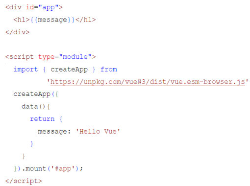
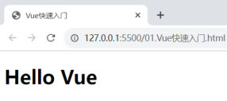

[18 篇](/posts/编程学习/javaweb学习笔记/18-实战-js版员工列表/)最后那个"数据驱动版"员工列表，`render()` 是**我们自己一个字符一个字符拼出来的**：改数据 → 手动调 `render()` → 手动重新上色 → 手动重新绑事件。这一章要学的 **Vue** 干的就是这同一件事，但它把"拼字符串"和"重新渲染"全包了——**我们只管改数据，页面自己跟着变**。

Vue 的内容分三块：**快速入门**（这一篇）、**常用指令**（[20 篇](/posts/编程学习/javaweb学习笔记/20-vue3常用指令/)）、**Ajax 异步请求**（[21 篇](/posts/编程学习/javaweb学习笔记/21-axios异步请求/)），最后用课程案例[《员工列表（异步交互）》](/posts/编程学习/javaweb学习笔记/22-实战-vueaxios员工列表/)把三块串起来。

## Vue 是什么

> 定义（PPT 原文）：**Vue 是一款用于构建用户界面的渐进式的 JavaScript 框架。**（官方：https://cn.vuejs.org/）

这句话每个词都有信息量，拆开看：

| 词 | 意思 |
| --- | --- |
| **构建用户界面** | 它管的是"**用户看到的那层页面**"——把数据渲染成界面、把用户的输入收集回来 |
| **渐进式** | 能"由小到大"地用：**只引一个 js 文件、改造页面上的一个局部**也行；**整套工程化方案做整站开发**也行，不用一上手就上全套工具链 |
| **JavaScript 框架** | 它本身是用 JS 写的、靠 JS 运行的；**框架 = 一套完整的项目解决方案，用于快速构建项目** |

PPT 还专门讲了用框架的**优点和缺点**，很实在：

- **优点**：大大提升前端项目的开发效率。
- **缺点**：需要理解记忆框架的使用规则（参照官网）。

> [!TIP]
> 这句话翻译过来就是：**框架帮你省掉大量重复劳动，代价是你要先学它那一套规矩**。规矩在官网（中文文档质量很高），记不住就去查——和 [16 篇](/posts/编程学习/javaweb学习笔记/16-js-dom操作/)说"DOM 的 API 不需要背、查文档或 AI"是同一个道理。

### Vue 是一个框架，也是一个生态

PPT 第 3 页用一张图说明：**Vue 核心包**只负责最基础的事，其它能力由配套的插件、工具补齐——

| 能力 | 由谁提供 | 说明 |
| --- | --- | --- |
| **声明式渲染** | Vue 核心包 | 在 HTML 里"声明"数据和界面的关系（本篇章学的就是它） |
| **组件系统** | Vue 核心包 | 把页面拆成一个个可复用的部件 |
| 客户端路由 | **VueRouter** | 单页应用里"点链接换页面" |
| 状态管理 | **Pinia** / Vuex | 多个组件共用一份数据 |
| 构建工具 | **Vite** / Webpack | 打包、编译、热更新 |

两种使用方式：

| 方式 | 用到的部分 | 场景 |
| --- | --- | --- |
| **Vue 核心包开发** | 只引入一个 js 文件 | **局部模块改造**（本篇章就属于这种：一个页面引一个 Vue 文件） |
| Vue 插件工程化开发 | 核心包 + 上面那一整套插件/工具 | 整站开发（后面的项目里会遇到） |

### 它到底解决什么问题：数据驱动视图

PPT 第 2 页用一个小例子把 Vue 的核心思想摆了出来——`userList` 是一份**数据**：

```javascript
// 一份数据（数组里放对象，就是 15 篇学过的写法）
userList: [
  {"id": 1, "name": "谢逊", "image": "1.jpg", "gender": 1, "job": 1},
  {"id": 2, "name": "韦一笑", "image": "2.jpg", "gender": 1, "job": 1}
]
```


*图：PPT 用来解释 Vue 的那张表——页面上"序号 / 姓名 / 头像 / 性别 / 职位"这一行行，全部是上面那份 `userList` 数据**渲染**出来的结果；数据和界面之间是"一套模板"的关系，不是一行行手写的 HTML*

这就是**数据驱动视图**（PPT 第 6 页标题下的那行字：**基于数据渲染出用户看到的页面**）：

- **原生 DOM 写法**（[16 篇](/posts/编程学习/javaweb学习笔记/16-js-dom操作/)）：先写死 HTML，数据变了再用 JS 一个个元素去找、去改。
- **Vue 写法**：先准备好数据，在 HTML 里"声明"哪个位置显示哪份数据；**数据一变，Vue 自动把页面重新渲染**。

举个最小的对比——"把标题文字从 Hello 改成 Hi"：

```javascript
// 原生 DOM：要自己找到元素、自己改（16 篇的套路）
document.querySelector('#title').innerHTML = 'Hi';

// Vue：只需要改数据（页面上写着 {{title}}，它会自己变）
this.title = 'Hi';
```

> [!IMPORTANT]
> 这一章所有内容都建立在这一句上：**数据是唯一的"真身"，页面只是它的展示**。后面 `v-for`（列表）、`v-if`（显示隐藏）、`v-model`（表单）全都不是"操作页面元素"，而是在**描述数据和界面的关系**。
> [18 篇](/posts/编程学习/javaweb学习笔记/18-实战-js版员工列表/)里我们手动实现了这套思想（`render()`），这一篇开始交给 Vue 自动做。

## Vue 的使用步骤

PPT 第 8 页是一张**问答页**，问的就是"Vue 的使用步骤"（这页的答案要背下来，写任何 Vue 页面都是这五步）：

**准备工作（三步）**

1. **引入 Vue 模块**——把官方的 Vue 文件弄进来
2. **创建 Vue 的应用实例**——`createApp(...)`
3. **定义元素（div），交给 Vue 控制**——给它一个"管辖区"（挂载点）

**数据驱动视图（两步）**

4. **准备数据**——写在 `data()` 里
5. **用插值表达式渲染**——`{{ }}`


*图：PPT 第 7～8 页的代码全貌——上半部分是页面上的元素（`<div id="app">` 里放 `{{message}}`），下半部分是 `<script type="module">` 里的三件事：`import` 引入 Vue、`createApp({ data() { return {...} } })` 准备数据、`.mount('#app')` 把实例挂到元素上*

## 引入 Vue 模块

Vue 是"官方提供的一个 js 文件"，引进来有两种方式：

```html
<!-- 方式一：在线引入（PPT 和课程代码用的方式）——直接写 CDN 地址 -->
<script type="module">
  // 从 unpkg（一个在线 CDN）加载 Vue 3 的"浏览器 ESM 版"
  import { createApp } from 'https://unpkg.com/vue@3/dist/vue.esm-browser.js';
</script>
```

```html
<!-- 方式二：本地引入——把课程 js 目录里的 vue.esm-browser.js 拷到项目里 -->
<script type="module">
  // 路径按实际位置写（这里是"和 html 同级的 js 目录"）
  import { createApp } from './js/vue.esm-browser.js';
</script>
```

两种方式的差别不只是"在不在线"：

| 方式 | 好处 | 代价 |
| --- | --- | --- |
| **在线（CDN 地址）** | 不用下载文件；**双击 html 就能直接跑**（浏览器把 CDN 地址当成一次跨域请求，unpkg 允许跨域） | **必须联网**；网速慢时首屏会等一下 |
| **本地（自己拷一份）** | 断网也能开发；不怕 CDN 挂 | **必须用 Live Server 打开**（见下面的警告框）；文件 460KB 左右，要跟着项目走 |

> [!WARNING]
> **用本地文件时，双击 html 打开会失败**——不是代码写错，是浏览器拦的。ESM 模块的 `import` 受 CORS 限制，而 `file://` 打开的页面来源是 `null`，Chrome 会直接拒绝加载本地模块文件，控制台里是这行红字：
>
> ```text
> Access to script at 'file:///.../js/vue.esm-browser.js' from origin 'null' has been blocked by CORS policy
> ```
>
> 这时的**页面症状**很好认：`{{message}}` 原样显示在页面上，Vue 完全没生效。
> **解决办法**：用 [04 篇](/posts/编程学习/javaweb学习笔记/04-前端开发工具-vscode/)装过的 **Live Server**——在 VS Code 里右键 html 文件 → `Open with Live Server`，地址栏会变成 `http://127.0.0.1:5500/xxx.html`（PPT 第 7 页截图的地址栏就是这个），这时 `import` 就正常了。
> **练习文件用的是在线 CDN 地址**，所以双击即可运行（联网就行）；想离线练就按上面这条路走。

> [!NOTE]
> 这两个文件的来历：`vue.esm-browser.js` 是 Vue 的 **ESM 浏览器构建版**——它把 Vue 的运行时和**模板编译器**都打包进去了，所以能在浏览器里直接编译 `{{ }}` 这种模板，最适合"引一个 js 文件就能用"的场景。（工程化项目里会用 Vite 打包，编译器在构建阶段就把模板处理好了，那是后面的事。）

## 创建 Vue 应用

课程代码 `12. Vue-快速入门.html` 的完整写法（页面元素 + 脚本一共就这么点）：

```html
<!-- 页面部分：准备一个元素，交给 Vue 控制（注意 id="app"） -->
<div id="app">
  <h1>{{message}}</h1>
  <h1>{{count}}</h1>
</div>

<script type="module">
  // 1. 引入 Vue 模块（官方提供的 ESM 浏览器版）
  import { createApp } from 'https://unpkg.com/vue@3/dist/vue.esm-browser.js';

  // 2. 创建 Vue 应用实例
  createApp({
    // data 是一个函数，返回的是"数据模型"（页面要用到的数据都放这里）
    data() {
      return {
        message: 'Hello Vue',
        count: 100
      }
    }
  }).mount('#app');  // 3. 挂载：把实例交给 id="app" 的元素，之后它管理的区域就归 Vue 了
</script>
```

逐句拆开：

| 代码 | 作用 |
| --- | --- |
| `import { createApp } from '...'` | 从 Vue 模块里**取出 `createApp` 这个函数**（模块化导入的写法，[17 篇](/posts/编程学习/javaweb学习笔记/17-js事件监听/)提过 ESM 的 `export` / `import`） |
| `createApp({ ... })` | **创建一个 Vue 应用实例**；括号里的对象叫"选项对象"，`data`、`methods` 等都写在这里面 |
| `data() { return { ... } }` | **准备数据**：必须写成**函数**，**返回一个对象**，对象里的属性就是页面上能用的变量 |
| `.mount('#app')` | **挂载**：括号里是 CSS 选择器，指向那个"交给 Vue 控制"的元素（写 `#app` 就是 `id="app"` 的元素） |

关于**挂载点**和**脚本位置**，有两个容易踩的点：

- **挂载点可以是任何元素，不一定是 `div#app`**。课程案例（员工列表）挂的就是 `#container`——`.mount('#container')`。写在 HTML 元素上的 `id` 是什么，`mount` 里就写什么。
- **脚本写在哪儿都行**。`<script type="module">` 属于**模块脚本，默认延迟执行**（等价于加了 `defer`）：浏览器先把 HTML 解析完，再执行它——所以即使写在 `<head>` 里，`mount('#app')` 也照样能找到元素。（课程代码放在 `</body>` 前面，是为了好读。）
  > 对比一下：普通 `<script>`（[13 篇](/posts/编程学习/javaweb学习笔记/13-javascript入门与引入方式/)的 `document.querySelector` 那种）**没有**这个待遇，放 `<head>` 里就会拿到 `null`——这也是 Vue 的脚本通常不用操心位置的原因。

## 插值表达式 {{ }}

**插值表达式**就是两个大括号：把 `data` 里的数据显示到页面上。

```html
<div id="app">
  <h1>{{message}}</h1>       <!-- 显示 data 里的 message：Hello Vue -->
  <h1>{{count}}</h1>         <!-- 显示 data 里的 count：100 -->
  <h1>{{count + 1}}</h1>     <!-- 也能写表达式：101 -->
</div>
```

打开页面看到的效果：


*图：PPT 第 7 页的效果——地址栏是 `127.0.0.1:5500/01.Vue快速入门.html`（Live Server 起的本地服务），页面上 `{{message}}` 已经被替换成了 **Hello Vue**，说明 Vue 成功接管了 `#app` 这块区域*

> [!WARNING]
> **插值表达式只能写在"标签内部的内容区"，不能写在标签的属性里**。这是最容易踩的一个坑，先记住结论：
>
> ```html
> <!-- 对的：放在两个标签之间 -->
> <td>{{e.name}}</td>
>
> <!-- 错的：写在属性值里，页面会原样显示这段花括号 -->
> 
> ```
>
> 想动态设置**属性**要用 [20 篇](/posts/编程学习/javaweb学习笔记/20-vue3常用指令/)的 `v-bind`（简写 `:src="e.image"`）。PPT 在员工列表代码旁边专门写了一句注释："插值表达式是不能出现在标签内部"，说的就是这个。

> [!TIP]
> **页面原样显示 `{{message}}`，怎么排查？** 这是 Vue 新手最常遇到的问题，按顺序查四件事：
> 1. **Vue 模块加载成功了吗**——F12 控制台有没有红色的加载错误（联网正常吗？用本地文件时是不是没用 Live Server 打开？）
> 2. **`mount` 的选择器和元素的 `id` 对得上吗**——`id="app"` 配 `.mount('#app')`；写成 `#container` 却挂在 `#app` 上，Vue 就管不到页面这块
> 3. **`{{ }}` 是不是写在挂载元素的外面**——`.mount('#app')` 只管 `#app` 里面那一块，区域外的插值表达式没人管
> 4. **属性里是不是写了 `{{ }}`**——属性要用 `v-bind`（上面那条警告）

## 小结

| 问题 | 答案 |
| --- | --- |
| Vue 是什么？ | 用于**构建用户界面**的**渐进式** JavaScript **框架**（官网 https://cn.vuejs.org/）；框架 = 一套完整的项目解决方案，优点是**提升开发效率**，缺点是要**记住它的使用规则** |
| "渐进式"体现在哪？ | 只引一个 js 文件就能**局部改造**（本篇章的用法），配合 VueRouter / Pinia / Vite 等插件工具可以**整站开发** |
| Vue 的核心思想？ | **数据驱动视图**——基于数据渲染出用户看到的页面；数据是"真身"，页面是它的展示结果 |
| Vue 的使用步骤？ | 准备工作三步：**引入 Vue 模块 → 创建应用实例 → 定义元素交给 Vue 控制**；数据驱动视图两步：**准备数据 → 插值表达式渲染** |
| 怎么引入 Vue？ | 在线：`import { createApp } from 'https://unpkg.com/vue@3/dist/vue.esm-browser.js'`；本地：把 `vue.esm-browser.js` 拷进项目后 `import ... from './js/vue.esm-browser.js'`（本地方式**必须用 Live Server**，双击打开会被 CORS 拦） |
| 怎么创建应用？ | `createApp({ data() { return { ... } } }).mount('#app')`——`data` 是**函数**、**返回对象**；`mount` 里写挂载元素的**选择器** |
| 插值表达式怎么写？ | `{{message}}`（也能写表达式 `{{count + 1}}`）；**只能写在标签内部，不能写在属性里**；页面上原样显示花括号 = Vue 没生效 |
| 脚本放哪儿？ | `<script type="module">` 是**模块脚本，默认延迟执行**，放 `<head>` 也能拿到元素（普通 `<script>` 不行，要放 `</body>` 前） |

## 相关

- [上一篇：实战-JS版员工列表](/posts/编程学习/javaweb学习笔记/18-实战-js版员工列表/)
- [下一篇：Vue3常用指令](/posts/编程学习/javaweb学习笔记/20-vue3常用指令/)
- [JS函数与自定义对象（`data` 其实就是"函数返回对象"和"数组里放对象"）](/posts/编程学习/javaweb学习笔记/15-js函数与自定义对象/)
- [JS-DOM操作（对照着看：同样的事用原生 DOM 要写多少行）](/posts/编程学习/javaweb学习笔记/16-js-dom操作/)
- [前端开发工具-VSCode（Live Server 的装法）](/posts/编程学习/javaweb学习笔记/04-前端开发工具-vscode/)

## 练习题

### 一、知识回顾（读完直接做下面的实践题）

1. **Vue** 是用于**构建用户界面**的**渐进式** JavaScript **框架**（官网 https://cn.vuejs.org/）：**框架 = 一套完整的项目解决方案**，优点是**大大提升前端开发效率**，缺点是**需要理解记忆框架的使用规则**（参照官网）
2. **渐进式**的含义：只引一个 js 文件就能**局部模块改造**；配合插件、工具（VueRouter 客户端路由、Pinia/Vuex 状态管理、Vite/Webpack 构建工具）可以**整站开发**；声明式渲染、组件系统由 **Vue 核心包**提供
3. 核心思想是**数据驱动视图**——**基于数据渲染出用户看到的页面**：数据是唯一"真身"，页面是它的展示结果；数据一变，Vue 自动重新渲染
4. **使用步骤五步**：准备工作三步——**引入 Vue 模块**、**创建 Vue 应用实例**、**定义元素（div）交给 Vue 控制**；数据驱动视图两步——**准备数据**、**用插值表达式渲染**
5. **引入方式**：在线 `import { createApp } from 'https://unpkg.com/vue@3/dist/vue.esm-browser.js'`；本地把 `vue.esm-browser.js` 拷进项目后 `import ... from './js/vue.esm-browser.js'`
6. 引入语句必须写在 **`<script type="module">`** 里；**本地文件方式不能双击打开**（`file://` 来源是 `null`，模块 `import` 被 **CORS** 拦截，控制台报 `blocked by CORS policy`），要用 **Live Server** 起 `http://127.0.0.1:5500` 打开；**在线 CDN 地址双击就能跑**
7. **创建应用**：`createApp({ data() { return {...} } }).mount('#app')`——`data` 必须是**函数**、**返回一个对象**；`mount()` 里写**挂载元素的选择器**（挂载点不一定是 `#app`，课程案例挂的是 `#container`）
8. **插值表达式**：`{{message}}`，也能写表达式 `{{count + 1}}`；**只能写在标签内部，不能写在标签属性里**（`` 不生效，要用 `v-bind`）
9. **Vue 没生效的排查**：控制台有没有加载报错（联网 / 是否用了 Live Server）→ `mount` 选择器和元素 `id` 是否一致 → `{{ }}` 是否写在挂载元素内部 → 属性里是不是误写了 `{{ }}`
10. `<script type="module">` 属于**模块脚本，默认延迟执行**（等价 `defer`），写在 `<head>` 里也能拿到元素；普通 `<script>` 没有这个待遇，要放在 `</body>` 前面

### 二、裸写题

- [ ] **2-1 做出第一个 Vue 页面**
  页面上有一个大标题，要求它显示的文字来自"数据"，而不是写死在标签里。要求：
  1. 准备一个元素交给 Vue 控制（`id="app"`）
  2. 在数据里准备一个变量，值设为 `Hello Vue`
  3. 在标题里用"两个大括号"把这份数据渲染出来
  4. 再在数据里加一个数字变量 `count`（值随意），标题里显示它的**加 1 结果**
  （练习文件 `test_19_第一个Vue页面.html` 里已经准备好了标题和写作区，Vue 模块已经引入。）

  > [!TIP]- 提示（先自己想，实在想不出再点开）
  > **一级 · 思路**：整个页面就三件事——把元素交给 Vue 管、把数据给 Vue、在页面上"占个位"显示数据
  > **二级 · 方法**：`createApp({ ... }).mount('#app')`；数据放在 `data()` 里 **return 出来**的对象中；页面用插值表达式 `{{ }}` 取值；表达式可以直接算（`{{count + 1}}`）
  > **三级 · 骨架**：`<h1>{{____}}</h1>` / `createApp({ data() { return { message: '____', count: ____ } } }).mount('____');`

  > [!TIP]- 参考答案（做完再点开）
  > ```html
  > <div id="app">
  >   <h1>{{message}}</h1>
  >   <h1>{{count + 1}}</h1>
  > </div>
  >
  > <script type="module">
  >   import { createApp } from 'https://unpkg.com/vue@3/dist/vue.esm-browser.js';
  >
  >   createApp({
  >     data() {
  >       return {
  >         message: 'Hello Vue',
  >         count: 100
  >       }
  >     }
  >   }).mount('#app');
  > </script>
  > ```
  > 对照课程 `12. Vue-快速入门.html`。检查点：① 页面上是 `Hello Vue` 和 `101`，**看不到花括号**；② 把 `message` 改成别的字符串、刷新，标题跟着变（数据驱动视图）。

- [ ] **2-2 用数据结构渲染出多个位置的内容**
  页面上有一张"个人资料"小卡片：姓名、职位、城市三行文字，外加一行"简介"。要求：
  1. 三行文字的内容**全部来自数据**（数据里放三个变量即可）
  2. "简介"这一行要求把**两个变量拼起来**显示（比如"来自" + 城市），而不是写死一句话
  3. 页面顶部还要显示一个"访问次数"，它等于数据里的一个数字变量**加 1**
  （练习文件 `test_19_插值表达式.html` 里已经准备好了结构和写作区。）

  > [!TIP]- 提示（先自己想，实在想不出再点开）
  > **一级 · 思路**：凡是"会变的内容"都放数据里；页面上只写一个"取值的位置"
  > **二级 · 方法**：数据都写在 `data()` 的 `return { }` 里；页面上用 `{{ }}`；`{{ }}` 里可以写**表达式**（含字符串拼接 `+`）
  > **三级 · 骨架**：`<p>{{____}}</p>` / `<p>来自{{____}}的开发者</p>` / `<span>{{visits ____ 1}}</span>` / `data() { return { name: '____', …… } }`

  > [!TIP]- 参考答案（做完再点开）
  > ```html
  > <div id="app">
  >   <p>访问次数：{{visits + 1}}</p>
  >   <h2>{{name}}</h2>
  >   <p>职位：{{position}}</p>
  >   <p>城市：{{city}}</p>
  >   <p>简介：来自{{city}}的{{position}}</p>
  > </div>
  >
  > <script type="module">
  >   import { createApp } from 'https://unpkg.com/vue@3/dist/vue.esm-browser.js';
  >
  >   createApp({
  >     data() {
  >       return {
  >         name: '令狐冲',
  >         position: '讲师',
  >         city: '杭州',
  >         visits: 99
  >       }
  >     }
  >   }).mount('#app');
  > </script>
  > ```
  > 检查点：① 三行文字、简介、"访问次数 100"都对；② 把 `visits` 改成 0 刷新，页面显示 1（说明 `{{ }}` 里真的在**算表达式**，不是显示一段文字）。

- [ ] **2-3 诊断：为什么页面原样显示了花括号？**
  练习文件里是一个"坏掉的"Vue 页面：打开后页面上有**两处**原样显示着 `{{title}}`，数据没渲染出来。要求：找出**全部 3 处**问题并改好——改完页面上只剩一个标题、内容是"传智教育"。
  （直接在 `test_19_排查错误.html` 上改，3 处问题都在这一页里。）

  ```html
  <body>
    <div id="app">
      <h1>{{title}}</h1>
    </div>
    <h1>{{title}}</h1>

    <script type="module">
      import { createApp } from 'https://unpkg.com/vue@3/dist/vue.esm-browser.js';

      createApp({
        data: {
          title: '传智教育'
        }
      }).mount('#container');
    </script>
  </body>
  ```

  > [!TIP]- 提示（先自己想，实在想不出再点开）
  > **一级 · 思路**：三处问题分别在"数据写法 / 挂载点 / 插值表达式的位置"上，都是这一篇讲过的规则；盯着 F12 控制台里的报错看，它会直说哪里不对
  > **二级 · 方法**：① `data` 必须是**函数**、**返回对象**（写成 `data() { return {...} }`）；② `mount` 里的选择器要和元素 `id` 一致（页面上是 `#app`，代码里写的是 `#container`）；③ 挂载元素**外面**的那个 `<h1>` 归 Vue 管不着，得删掉
  > **三级 · 骨架**：`data() { ____ { title: '传智教育' } }` / `.mount('____')` / 删掉 `</div>` 后面那一行 `<h1>……</h1>`

  > [!TIP]- 参考答案（做完再点开）
  > ```html
  > <body>
  >   <div id="app">
  >     <h1>{{title}}</h1>
  >   </div>
  >   <!-- 改法③：挂载区（#app）外面的插值表达式没人管，这一行要删掉 -->
  >
  >   <script type="module">
  >     // 引入语句本来就是好的（CDN 地址），不用动
  >     import { createApp } from 'https://unpkg.com/vue@3/dist/vue.esm-browser.js';
  >
  >     createApp({
  >       // 改法①：data 必须是函数，并且 return 一个对象
  >       data() {
  >         return {
  >           title: '传智教育'
  >         }
  >       }
  >       // 改法②：挂载点的选择器要写成元素真实存在的 id（原来是 #container，页面上是 #app）
  >     }).mount('#app');
  >   </script>
  > </body>
  > ```
  > 三处问题的症状：① `data` 写成对象时控制台出现 Vue 的警告，页面上的数据取不到；② 挂载点写错时报"挂载目标选择器找不到"，整块 `#app` 纹丝不动、花括号原样露出；③ 挂载区外那一行**永远**不会被渲染——`.mount('#app')` 只管 `#app` 里面。改完记得再开一次控制台确认没有红字。

### 三、综合题

- [ ] **3-1 做一个"个人名片"页面（数据全部来自 data）**
  页面上有一张名片：顶部是大号姓名，下面一行"职位 · 城市"，再往下是一段简介、一行"技能标签"（三个标签），最下面是一个"访问次数"。要求：
  1. **所有文字内容都放在 `data()` 里**，页面上只写取值的位置（不许写死文字）
  2. 姓名下面那行"职位 · 城市"用**两个变量拼**出来（中间的点号可以放在 HTML 里）
  3. 三个技能标签先用**三段独立的标签**显示（还没学循环，写三遍就行）
  4. 访问次数显示为数据里的数字**加 1**
  5. 页面里的样式区已经留好了，把卡片、标签那几条样式写出来（边框、圆角、内边距、居中、标签底色）
  （练习文件 `test_19_综合_个人名片.html` 里已经准备好了基本骨架和写作区。）

  > [!TIP]- 提示（先自己想，实在想不出再点开）
  > **一级 · 思路**：先把页面上"会变的内容"列一遍，全部搬进数据；页面上剩下的就是"哪里显示哪个变量"
  > **二级 · 方法**：数据写在 `data()` 的 `return {}` 里；显示用 `{{ }}`；`{{ }}` 里能写 `+` 拼接；样式照常写在 `<style>` 里（[06 篇](/posts/编程学习/javaweb学习笔记/06-css引入方式与颜色/)）
  > **三级 · 骨架**：`<h1>{{____}}</h1>` / `<p>{{position}} · {{____}}</p>` / `<p>{{intro}}</p>` / `<span class="tag">{{skill1}}</span> ...` / `<p>访问次数：{{visits + ____}}</p>` / `data() { return { name: '____', position: '____', city: '____', intro: '____', skill1: '____', skill2: '____', skill3: '____', visits: ____ } }`

  > [!TIP]- 参考答案（做完再点开）
  > ```html
  > <!DOCTYPE html>
  > <html lang="zh-CN">
  > <head>
  >   <meta charset="UTF-8">
  >   <title>个人名片</title>
  >   <style>
  >     #app {
  >       width: 360px;             /* 卡片宽度 */
  >       margin: 40px auto;        /* 水平居中 */
  >       padding: 20px;
  >       border: 1px solid #ddd;
  >       border-radius: 8px;       /* 圆角 */
  >       font-family: "微软雅黑";
  >     }
  >     h1 { margin: 0; }           /* 去掉默认的外边距 */
  >     .sub { color: #888; margin: 6px 0 16px; }  /* 职位 · 城市 这一行用灰色 */
  >     .tag {
  >       display: inline-block;
  >       padding: 2px 8px;
  >       margin-right: 6px;
  >       background-color: #eef6ff; /* 标签浅蓝底 */
  >       border-radius: 4px;
  >     }
  >     .visits { color: #888; font-size: 12px; }
  >   </style>
  > </head>
  > <body>
  >   <div id="app">
  >     <h1>{{name}}</h1>
  >     <p class="sub">{{position}} · {{city}}</p>
  >     <p>{{intro}}</p>
  >     <p>
  >       <span class="tag">{{skill1}}</span>
  >       <span class="tag">{{skill2}}</span>
  >       <span class="tag">{{skill3}}</span>
  >     </p>
  >     <p class="visits">访问次数：{{visits + 1}}</p>
  >   </div>
  >
  >   <script type="module">
  >     import { createApp } from 'https://unpkg.com/vue@3/dist/vue.esm-browser.js';
  >
  >     createApp({
  >       data() {
  >         return {
  >           name: '令狐冲',
  >           position: '讲师',
  >           city: '杭州',
  >           intro: '一个把前端当爱好的后端学习者。',
  >           skill1: 'HTML',
  >           skill2: 'CSS',
  >           skill3: 'JavaScript',
  >           visits: 99
  >         }
  >       }
  >     }).mount('#app');
  >   </script>
  > </body>
  > </html>
  > ```
  > 检查点：① 页面上看不到任何花括号；② **把数据里的姓名改成别的、刷新页面，名片上的姓名跟着变**（这就是数据驱动视图）；③ 访问次数显示 100；④ 卡片居中、标签有底色。
  > 想一想：如果这个名片要显示 10 个技能标签，写 10 个 `<span>` 是不是很笨？[20 篇](/posts/编程学习/javaweb学习笔记/20-vue3常用指令/)的 `v-for` 就是为这件事准备的。
