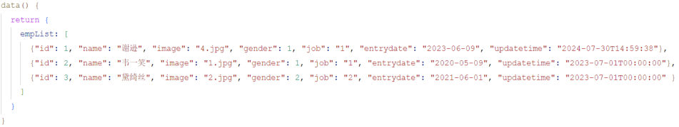
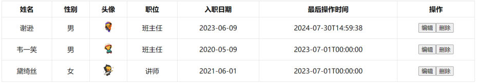
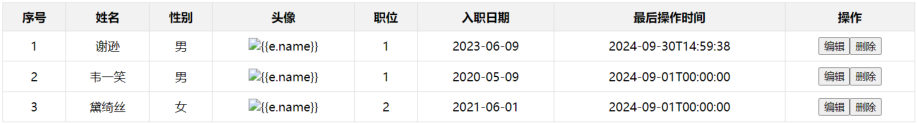
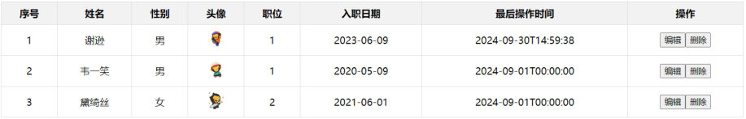
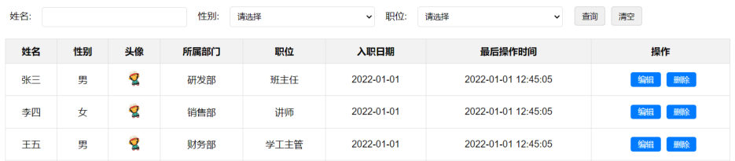

[19 篇](/posts/编程学习/javaweb学习笔记/19-vue3快速入门/)的 `{{ }}` 只能"显示一个值"。可页面上真正麻烦的是**一堆重复的东西**：员工列表有 10 行、职位要按数字翻译成文字、头像要动态换地址、输入框里的内容要采集回来……这些**"按数据决定怎么渲染"**的活，Vue 用**指令**来做。

这一篇把 **6 个常用指令**一次学完，最后用它们把课程案例**员工列表**重写一遍（就是 [18 篇](/posts/编程学习/javaweb学习笔记/18-实战-js版员工列表/)那个用原生 DOM 手写的页面——对比一下，代码会少很多）。

## 什么是指令

> 定义（PPT 原文）：**指令：HTML 标签上带有 `v-` 前缀的特殊属性，不同的指令具有不同的含义，可以实现不同的功能。**

写法长这样（PPT 给的形式）：

```html
<p v-xxx="..."> ... </p>
```

- 位置：**写在标签上**，和 `id`、`class` 那些属性并列（所以叫"特殊属性"）
- 前缀：一律以 **`v-`** 开头，看到 `v-` 就知道是 Vue 的东西
- 值：通常是一个**引号里的表达式**，表达式的变量来自 `data`

PPT 列的常用指令表（这张表要背下来）：

| 指令 | 作用 |
| --- | --- |
| **`v-for`** | **列表渲染**，遍历容器的元素或者对象的属性 |
| **`v-bind`** | 为 HTML 标签**绑定属性值**，如设置 `href`、`css` 样式等 |
| **`v-if` / `v-else-if` / `v-else`** | **条件性的渲染**某元素，判定为 true 时渲染，否则不渲染 |
| **`v-show`** | 根据条件**展示**某元素，区别在于切换的是 **display 属性的值** |
| **`v-model`** | 在**表单元素**上创建**双向数据绑定** |
| **`v-on`** | 为 HTML 标签**绑定事件** |

> [!TIP]
> 记住这张表的"分组"就不会乱：**管渲染的**（`v-for` 渲染多个、`v-if` / `v-show` 决定显不显示）、**管属性的**（`v-bind`）、**管交互的**（`v-model` 采集表单、`v-on` 绑事件）。后面的案例就是这五类指令凑起来的。

## 案例背景：员工列表（数据渲染展示）

课程案例文件是 `13. Vue-案例-员工列表(常用指令).html`——页面就是 [12 篇](/posts/编程学习/javaweb学习笔记/12-实战-tlias员工管理页面/)做的那个 Tlias 员工管理页面，但**表格里的行一行都不手写**，全部由数据渲染。

它要渲染的数据是 `data` 里的 `empList` 数组（**数据还是"数组里放对象"**，[15 篇](/posts/编程学习/javaweb学习笔记/15-js函数与自定义对象/)的东西）：

```javascript
data() {
  return {
    // 封装用户输入的查询条件（后面 v-model 要用）
    searchForm: {
      name: '',
      gender: '',
      job: ''
    },
    // 员工列表数据：三条数据 → 页面上三行
    empList: [
      {
        "id": 1,
        "name": "谢逊",
        "image": "https://web-framework.oss-cn-hangzhou.aliyuncs.com/2023/4.jpg",
        "gender": 1,
        "job": "1",
        "entrydate": "2023-06-09",
        "updatetime": "2024-09-30T14:59:38"
      },
      {
        "id": 2,
        "name": "韦一笑",
        "image": "https://web-framework.oss-cn-hangzhou.aliyuncs.com/2023/1.jpg",
        "gender": 1,
        "job": "1",
        "entrydate": "2020-05-09",
        "updatetime": "2024-09-01T00:00:00"
      },
      {
        "id": 3,
        "name": "黛绮丝",
        "image": "https://web-framework.oss-cn-hangzhou.aliyuncs.com/2023/2.jpg",
        "gender": 2,
        "job": "2",
        "entrydate": "2021-06-01",
        "updatetime": "2024-09-01T00:00:00"
      }
    ]
  }
}
```


*图：PPT 第 12 页给的 `empList` 数据——**要显示的东西全在这三条数据里**；`gender` 是数字（1 男 2 女）、`job` 是数字字符串（1 班主任…5 咨询师），所以页面上还得"翻译"一下，这就是后面 `v-if` 的用武之地*

同一页 PPT 还给出了**目标效果**：表头（序号/姓名/性别/头像/职位/入职日期/最后操作时间/操作）**手写一次**，下面三行数据**由 `empList` 循环渲染**——职位列显示的是"班主任/讲师"这种文字，头像显示的是数据里 `image` 指向的图片（下面每学一个指令，就补上这个页面的一块）。

对照 [18 篇](/posts/编程学习/javaweb学习笔记/18-实战-js版员工列表/)的手写版，能看出思路的变化：

| | 原生 DOM / JS 写法（18 篇） | Vue 指令写法（这一篇） |
| --- | --- | --- |
| 渲染多行 | `for` 循环 + 模板字符串 + `innerHTML` | `v-for` 加在 `<tr>` 上 |
| 图片地址 | 拼字符串 `src="${e.image}"` | `v-bind`（`:src="e.image"`） |
| 显示文字 | JS 里 `if/else` 算好再拼 | `v-if` / `v-else-if` 写在标签上 |
| 采集输入 | `document.querySelector('#name').value` | `v-model` |
| 点击按钮 | `addEventListener('click', …)` | `v-on`（`@click`） |

## v-for：列表渲染

> **作用**：列表渲染，遍历容器的元素或者对象的属性。

**语法**（PPT 原文）：

```html
<tr v-for="(item,index) in items" :key="item.id"> {{item}}</tr>
```

**参数说明**（PPT 逐条列的，一条都别漏）：

| 参数 | 说明 |
| --- | --- |
| **`items`** | 遍历的**数组**（要写在 `data` 里） |
| **`item`** | 遍历出来的**元素**（数组里的一条数据） |
| **`index`** | **索引 / 下标，从 0 开始**；**可以省略**，省略时写法是 `v-for="item in items"` |
| **`key`** | 给元素添加的**唯一标识**，便于 Vue 进行列表项的正确排序复用，**提升渲染性能**；**推荐使用 `id` 作为 key**（唯一），**不推荐用 `index` 作为 key**（会变化、不对应） |

两条**注意**：

- 遍历的数组**必须在 `data` 中定义**；
- **想让哪个标签循环展示多次，就在哪个标签上使用 `v-for` 指令**（PPT 第 15 页反复强调的就是这句）。


*图：`v-for` 加在 `<tr>` 上以后，`empList` 里有几条数据，表格里就有几行——序号列不是手写的，而是用 `{{index + 1}}` 算出来的（索引从 0 开始，所以要 +1）*

案例里的写法（**指令加在 `<tr>` 上**，`e` 是当前这条员工数据，`index` 是索引）：

```html
<tbody>
  <!-- 一条数据渲染一行；key 用数据的唯一标识 id -->
  <tr v-for="(e, index) in empList" :key="e.id">
    <td>{{index + 1}}</td>            <!-- 序号：索引从 0 开始，所以要 +1 -->
    <td>{{e.name}}</td>               <!-- 姓名 -->
    <td>{{e.gender == 1?'男' : '女'}}</td>  <!-- 性别：三元表达式判断（14 篇学过） -->
    <td>{{e.entrydate}}</td>          <!-- 入职日期 -->
    <td>{{e.updatetime}}</td>         <!-- 最后操作时间 -->
  </tr>
</tbody>
```

拆开看这段 `v-for`：

| 部分 | 含义 |
| --- | --- |
| `v-for="(e, index) in empList"` | 把 `empList` 数组**遍历**一遍，每一轮的**元素叫 `e`**、**索引叫 `index`** |
| `<tr>` 上的指令 | **循环的是整个 `<tr>`**——所以页面上出现多行；如果写在 `<td>` 上，就是"这一格里循环出好几个格子"，效果完全不同 |
| `:key="e.id"` | 给每一行一个**唯一标识**（这里用了数据里的 `id`）；`:key` 是 `v-bind:key` 的简写 |
| `{{index + 1}}` | 序号从 **1** 开始显示（`index` 是 0、1、2…） |
| `{{e.name}}` | 取当前这条数据的 `name` 字段 |

> [!WARNING]
> `v-for` 最容易出问题的三处：
> 1. **忘了 `:key`**——不报错，但 Vue 在列表增删时可能"复用错行"，控制台也会给提示。习惯上直接写数据的 `id`（`empList` 里每条数据都有 `id`，就是给这个用的）。
> 2. **用 `index` 当 key**——PPT 明确说"不推荐"：`index` 是**位置**不是身份，一旦中间删掉一行，后面所有行的 `index` 都变了，Vue 就分不清谁是谁了。
> 3. **数组没写在 `data` 里**（比如定义成函数里的局部 `let`）——页面渲染不出东西，`v-for` 只认 `data` 里的数据。

> [!TIP]
> 和 [18 篇](/posts/编程学习/javaweb学习笔记/18-实战-js版员工列表/)手动 `render()` 比一比：那边是"**拼字符串 → `innerHTML` → 手动调 `render()`**"三步，这边只写了 `v-for` 一句话——而且**数据一变（比如 `empList` 里多一条），页面自己就多一行**，不用再调任何函数。这就是"数据驱动"最直观的好处。

## v-bind：绑定属性

**为什么需要它？** 看上面模板里这一行：

```html
<td></td>
```

头像的地址在**属性**里（`src`），而 [19 篇](/posts/编程学习/javaweb学习笔记/19-vue3快速入门/)说过：**插值表达式不能写在标签属性里**。有人会试着写成 ``，结果就是这样：


*图：PPT 第 16 页的"翻车现场"——表头和文字列都正常渲染了（说明 `v-for` 和 `{{ }}` 没错），只有头像那一列全是**破图**，图片的 `alt` 还**原样显示成了 `{{e.name}}`**：`src="{{e.image}}"` / `alt="{{e.name}}"` 这种写法浏览器不认识，被当成了普通的字符串地址*

`v-bind` 就是干这件事的：

> **作用**：动态为 HTML 标签**绑定属性值**，如设置 `href`、`src`、`style` 样式等。

**语法与简化**（PPT 原文）：

| 写法 | 形式 |
| --- | --- |
| 完整写法 | `v-bind:属性名="属性值"` |
| **简化写法（推荐）** | **`:属性名="属性值"`**（把 `v-bind:` 省略成一个冒号） |

两条**注意**：

- **动态地为标签的属性绑定值，不能使用插值表达式，必须使用 `v-bind` 指令**；
- **绑定的数据，必须在 `data` 中定义**。

```html
<!-- PPT 就是这么对比的：这两行效果完全一样 -->


```

案例里 `v-bind` 一共用了两处（一个完整写法、一个简写，正好对照）：

```html
<!-- src 用完整写法、alt 用简写，效果一样；class、width 这种"死的"属性照常直接写 -->

```

修好之后：


*图：把 `src` / `alt` 换成 `v-bind`（`:src` / `:alt`）之后——头像正常显示出来了，"{{e.name}}" 那段文字也不再冒出来；注意**职位列还是 1、1、2 这样的数字**，因为 `v-if` 还没写（下一节就是它）*

> [!TIP]
> `v-bind` 除了绑 `src`、`alt`，同样能绑 `href`、`title`、`disabled`，也能绑 `style` / `class`（`<div :class="cls">`）。
> 判据一句话：**这个属性值要不要"看数据吃饭"**——要，就加 `:`；不要（比如 `class="avatar"`、`width="30px"`）就照普通 HTML 写。

## v-if / v-show：控制显示与隐藏

案例里职位那列显示的是 `1`、`1`、`2`（数据里就是这么存的），到页面上要变成"班主任""讲师"。PPT 给了对照表：

| 数字 | 职位 |
| --- | --- |
| 1 | 班主任 |
| 2 | 讲师 |
| 3 | 学工主管 |
| 4 | 教研主管 |
| 5 | 咨询师 |

翻译这件事用 `v-if` 做：**哪个条件成立，就渲染哪个 `<span>`**。

> **作用**：`v-if` 和 `v-show` **都是用来控制元素的显示与隐藏的**。

### v-if

- **语法**：`v-if="表达式"`，表达式值为 **true 就显示**，**false 就隐藏**
- **原理**：基于条件判断，来控制**创建或移除元素节点**（条件渲染）
- **场景**：要么显示、要么不显示，**不频繁切换**的场景
- **其它**：可以配合 **`v-else-if` / `v-else`** 进行链式调用条件判断

### v-show

- **语法**：`v-show="表达式"`，表达式值为 **true 就显示**，**false 就隐藏**
- **原理**：基于 **CSS 样式 `display`** 来控制显示与隐藏
- **场景**：**频繁切换**显示隐藏的场景

**注意**（PPT 原文）：**`v-else-if` 必须出现在 `v-if` 之后，可以出现多个；`v-else` 必须出现在 `v-if` / `v-else-if` 之后。**

PPT 给的形式：

```html
<span v-if="gender == 1">男生</span>
<span v-else-if="gender == 2">女生</span>
<span v-else>未知</span>
```

案例里的写法（**一串 `v-if` / `v-else-if` 把数字翻译成职位**，最后兜底"其他"）：

```html
<td>
  <!-- v-if: 控制元素的显示与隐藏（条件成立才渲染这个 span） -->
  <span v-if="e.job == 1">班主任</span>
  <span v-else-if="e.job == 2">讲师</span>
  <span v-else-if="e.job == 3">学工主管</span>
  <span v-else-if="e.job == 4">教研主管</span>
  <span v-else-if="e.job == 5">咨询师</span>
  <span v-else>其他</span>
</td>
```

课程代码里还留了一段 `v-show` 的**注释代码**（同一个位置用 `v-show` 写一遍，作为对照）：

```html
<!-- v-show: 控制元素的显示与隐藏（注意：条件不成立的 span 也还在 DOM 里，只是 display:none） -->
<td>
  <span v-show="e.job == 1">班主任</span>
  <span v-show="e.job == 2">讲师</span>
  <span v-show="e.job == 3">学工主管</span>
  <span v-show="e.job == 4">教研主管</span>
  <span v-show="e.job == 5">咨询师</span>
</td>
```

这两种写法**看着都是"只显示一个"**，但机制完全不同：

| | `v-if` | `v-show` |
| --- | --- | --- |
| 原理 | 条件不成立，**元素节点直接不创建 / 被移除**（条件渲染） | 元素**一直在**，靠 CSS 的 **`display`** 属性切换显示与隐藏 |
| 切换开销 | 大（要创建 / 销毁节点，还会重建内部的事件与状态） | 小（只改一个样式） |
| 适用场景 | 要么显示要么不显示、**不频繁切换** | **频繁切换**显示隐藏 |
| 配套指令 | 可以链式写 `v-if` / `v-else-if` / `v-else` | **只能单独用**，没有 `v-show-else` 这种东西 |
| 打开 F12 看 | 不成立的那个 `<span>` **根本找不到** | 能找到，带 `style="display: none;"` |

> [!TIP]
> 案例这一列数字→文字，用 `v-if` 或 `v-show` **都能出效果**（因为数据不会来回切）。但"**不频繁切换用 `v-if`、频繁切换用 `v-show`**"是 PPT 给的选择标准，照这个标准选就行。
> 另外，`v-if` 搭配 `v-else` 还有个好处：能让"**互斥的多种情况**"一眼看全——这里五个 `v-else-if` 加一个兜底 `v-else`，正好把职位表抄了一遍。

## v-model：表单双向绑定

案例页面上半部分是一个**搜索表单**（姓名输入框、性别下拉框、职位下拉框 + 查询、清空按钮）。PPT 第 23 页提出的需求是：

> 搜索栏中当用户**点击查询按钮**时，需要**获取到用户输入的表单数据**，并输出出来。
> 采集表单项数据：**`v-model`**；事件绑定：**`v-on`**。

> **作用**：在**表单元素**上使用，**双向数据绑定**。可以方便地**获取**或**设置**表单项数据。

**语法**：`v-model="变量名"`；**注意：`v-model` 中绑定的变量，必须在 `data` 中定义。**

```html
<input type="text" id="name" v-model="searchForm.name">
```

案例里的完整写法——**三个表单项绑到 `searchForm` 的三个字段上**：

```html
<form class="search-form">
  <label for="name">姓名：</label>
  <input type="text" id="name" name="name" v-model="searchForm.name" placeholder="请输入姓名">

  <label for="gender">性别：</label>
  <select id="gender" name="gender" v-model="searchForm.gender">
    <option value=""></option>
    <option value="1">男</option>
    <option value="2">女</option>
  </select>

  <label for="position">职位：</label>
  <select id="position" name="position" v-model="searchForm.job">
    <option value=""></option>
    <option value="1">班主任</option>
    <option value="2">讲师</option>
    <option value="3">学工主管</option>
    <option value="4">教研主管</option>
    <option value="5">咨询师</option>
  </select>

  <button type="button" v-on:click="search">查询</button>
  <button type="button" @click="clear">清空</button>
</form>
```


*图：PPT 第 23～25 页配套的页面——上半部分是搜索表单（姓名、性别、职位三个控件 + 查询、清空两个按钮），下半部分是员工表格；表单的三个控件都用 `v-model` 绑到了 `searchForm` 上，按钮用 `v-on` 绑到了 `methods` 里的方法*

配套的数据（`data` 里的 `searchForm`，PPT 第 24 页专门贴了这段）：

```javascript
createApp({
  data() {
    return {
      // 定义数据模型，采集员工搜索表单数据
      searchForm: {
        name: '',
        gender: '',
        job: ''
      }
    }
  }
}).mount('#container')
```

**"双向"是什么意思？** 这是 `v-model` 和 `{{ }}` 最大的区别：

| 方向 | 现象 |
| --- | --- |
| **数据 → 页面** | `data` 里的值变了，输入框里显示的内容跟着变（和 `{{ }}` 一样） |
| **页面 → 数据** | **用户在输入框里打字，`data` 里的值自动跟着变**——不用写 `document.querySelector('#name').value` 去取值 |

所以在 `methods` 里想拿到用户输入，**直接读 `this.searchForm` 就行**（`this` 就是下面 `v-on` 说的那个"Vue 实例"）：

```javascript
search() {
  // 直接读 this.searchForm，拿到的就是用户此刻输入的内容
  console.log(this.searchForm);
}
```

> [!WARNING]
> 三个常见错误：
> 1. **变量没在 `data` 里声明**——`v-model="searchForm.name"` 里的 `searchForm` 必须在 `data` 的 `return` 对象里，否则报错。PPT 特意加粗提醒了这一点。
> 2. **`v-model` 绑到了非表单元素上**——它是给**表单元素**（`input`、`select`、`textarea`）用的，绑在 `<div>` 上没意义。
> 3. **拿值还用老办法**——`v-model` 已经帮我们做了取值，不需要 `document.querySelector('#name').value`（那是 [16 篇](/posts/编程学习/javaweb学习笔记/16-js-dom操作/)的写法）。

## v-on：绑定事件

> **作用**：为 HTML 标签**绑定事件**（添加事件监听）。

| 写法 | 形式 |
| --- | --- |
| 完整写法 | `v-on:事件名="方法名"` |
| **简化写法（推荐）** | **`@事件名="…"`** |

案例里两个按钮正好把两种写法都演示了一遍（PPT 第 25 页）：

```html
<div id="app">
  <button type="button" v-on:click="handle">点我</button>
  <button type="button" @click="handle">再点我</button>
</div>
```

```javascript
const app = createApp({
  data() {
    // 数据……
  },
  // 方法：事件要执行的函数都写在 methods 里
  methods: {
    handle() {
      console.log('试试就试试');   // 点击按钮时执行
    }
  }
}).mount('#app');
```

**注意（PPT 原文）**：**`methods` 函数中的 `this` 指向 Vue 实例，可以通过 `this` 获取到 `data` 中定义的数据。**

```javascript
methods: {
  search() {
    // this 就是 Vue 实例 → this.searchForm 就是 data 里那份数据
    // 将搜索条件，输出到控制台
    console.log(this.searchForm);
  },
  clear() {
    // 清空表单项数据：把 searchForm 换成一个"三个字段都为空"的新对象
    // （数据变了 → 页面上的输入框因为 v-model 也跟着清空了）
    this.searchForm = {name: '', gender: '', job: ''}
  }
}
```

> [!IMPORTANT]
> `this` 这条注意点是**两种语法的分水岭**：以前写 `addEventListener` 的回调（[17 篇](/posts/编程学习/javaweb学习笔记/17-js事件监听/)）里 `this` 指的是**触发事件的那个元素**；在 Vue 的 `methods` 里，`this` 指的是**Vue 实例**——所以能用 `this.xxx` 读数据、改数据，而**改数据就等于改页面**。
> 案例里的"清空"就是这个道理：`this.searchForm = {...}` 一改，页面上三个输入框（因为绑了 `v-model`）**立马变空**——没有一行 DOM 操作。

> [!TIP]
> 事件名和原生的一致（[17 篇](/posts/编程学习/javaweb学习笔记/17-js事件监听/)学过的 `click`、`input`、`change`、`submit`、`mouseenter`…）；**方法名后面不用写括号**（写了 `@click="search()"` 也能用，但 Vue 传参的规矩不一样，先用"不加括号"的写法最稳）。

## 案例收尾：把指令合起来看

`13. Vue-案例-员工列表(常用指令).html` 的脚本部分（**六段代码，五个指令全在这**）：

```javascript
<script type="module">
  import { createApp } from 'https://unpkg.com/vue@3/dist/vue.esm-browser.js'

  createApp({
    // 数据：查询条件 + 员工列表（都是"真身"，页面是它们的展示）
    data() {
      return {
        searchForm: { //封装用户输入的查询条件
          name: '',
          gender: '',
          job: ''
        },
        empList: [ /* 三条员工数据，见上面 */ ]
      }
    },
    //方法
    methods: {
      search() {
        // 将搜索条件, 输出到控制台
        console.log(this.searchForm);
      },
      clear() {
        // 清空表单项数据
        this.searchForm = {name: '', gender: '', job: ''}
      }
    },
  }).mount('#container')   // 挂载点是外层容器（不是 #app，这个页面里没有 id="app"）
</script>
```

| 页面上的位置 | 用了哪个指令 | 干的事 |
| --- | --- | --- |
| 姓名框 / 性别框 / 职位框 | `v-model` | 把用户输入"接"进 `searchForm` 三个字段 |
| "查询"按钮 | `v-on:click` | 点击 → 调 `methods.search()` → 打印 `this.searchForm` |
| "清空"按钮 | `@click`（`v-on` 的简写） | 点击 → 调 `methods.clear()` → `searchForm` 归零，输入框跟着清空 |
| `<tr>` | `v-for` + `:key` | 按 `empList` 渲染出多行 |
| 序号 / 姓名 / 日期 | `{{ }}` | 显示数据（序号用 `{{index + 1}}`） |
| 性别列 | `{{ }}` + 三元表达式 | `{{e.gender == 1?'男' : '女'}}` |
| 头像列 | `v-bind`（`:src`） + 简写 `:alt` | 把数据里的图片地址绑到 `src` 属性上 |
| 职位列 | `v-if` / `v-else-if` / `v-else` | 把 `job` 的数字翻译成中文（`v-show` 版留在注释里对照） |

> [!TIP]
> 这个案例**还没有连后端**——`empList` 三条数据是**写在 `data` 里的死数据**。"点查询"只是把条件打印到控制台，并**没有真的去筛选列表**。这两件事正是 [21 篇](/posts/编程学习/javaweb学习笔记/21-axios异步请求/)（Axios 发请求）和 [22 篇](/posts/编程学习/javaweb学习笔记/22-实战-vueaxios员工列表/)（接口取数据 + 渲染）要补上的。

## 和原生 DOM 写法比一比：少写很多代码

同样的员工列表，[18 篇](/posts/编程学习/javaweb学习笔记/18-实战-js版员工列表/)的"数据驱动版"要写四个函数、还要记住"渲染完要重新上色、重新绑事件"；Vue 版**只有两份声明**：

| 要做的事 | 原生 DOM / JS（18 篇） | Vue 指令（这一篇） |
| --- | --- | --- |
| 生成 N 行 | `render()`：`for` + 模板字符串 + `tbody.innerHTML = html` | `<tr v-for="(e, index) in empList" :key="e.id">` |
| 图片地址 | 字符串拼接 `src="${e.image}"` | `:src="e.image"` |
| 数字→文字 | JS 里 `if/else` 判断后拼字符串 | `v-if` / `v-else-if` 链 |
| 清空输入框 | 遍历表单元素逐个 `value = ''` | `this.searchForm = {name:'',gender:'',job:''}` |
| 点击按钮 | `querySelectorAll('.btn')` + 循环 `addEventListener` | `@click="search"` |
| **数据变了以后** | **手动调 `render()`、`stripe()`、`bindDelete()`** | **什么都不用做，Vue 自己重新渲染** |

> [!IMPORTANT]
> 省下的不是"敲键盘的力气"，而是**最容易出错的那部分**：原生写法里"删一行后要重新绑事件""表头别被选进来""索引和行号差 1"这些坑，Vue 版**根本不存在**——因为页面不是我们拼出来的，是 Vue 按数据渲染的。
> PPT 把这件事总结成一句话：**数据驱动视图**。

## 小结

| 问题 | 答案 |
| --- | --- |
| 什么是指令？ | **HTML 标签上带 `v-` 前缀的特殊属性**，写法 `<p v-xxx="...">`；不同指令含义不同 |
| 常用指令有哪几个？ | **`v-for`**（列表渲染）、**`v-bind`**（绑定属性值）、**`v-if` / `v-else-if` / `v-else`**（条件渲染）、**`v-show`**（按 `display` 显示隐藏）、**`v-model`**（表单双向绑定）、**`v-on`**（绑定事件） |
| `v-for` 怎么写？ | `v-for="(item,index) in items" :key="item.id"`——`item` 是遍历出的元素、`index` 从 **0** 开始可省略；**`key` 推荐用 `id`、不推荐 `index`**；数组必须在 `data` 里；**想让哪个标签循环就加在哪个标签上** |
| `v-bind` 为什么要有？ | **插值表达式不能写在标签属性里**（`src="{{e.image}}"` 会变成破图）；语法 `v-bind:属性名="值"`，简写 **`:属性名="值"`**；绑的数据必须在 `data` 中定义 |
| `v-if` 和 `v-show` 的区别？ | `v-if` **条件不成立就不渲染该元素**（创建/移除节点），适合**不频繁切换**；`v-show` 元素一直在、切的是 **CSS `display`**，适合**频繁切换**；`v-else-if` 必须在 `v-if` 之后（可多个）、`v-else` 必须在它们之后；`v-show` 不能配套 `else` |
| `v-model` 是什么？ | 在**表单元素**上做**双向数据绑定**：数据 → 页面、**页面 → 数据**（用户输入自动写回 `data`）；语法 `v-model="变量名"`，变量必须在 `data` 里定义 |
| `v-on` 怎么写？ | `v-on:事件名="方法名"`，简写 **`@事件名="…"`**；方法写在 **`methods`** 里；**`methods` 里的 `this` 指向 Vue 实例**，所以 `this.searchForm` 能读到 `data` 的数据 |
| 案例里各指令的分工？ | 表单三个控件 `v-model`；查询/清空按钮 `v-on`；`<tr>` 用 `v-for`；序号/姓名等用 `{{ }}`；头像 `:src` / `:alt`；职位 `v-if` 链翻译数字 |

## 相关

- [上一篇：Vue3快速入门](/posts/编程学习/javaweb学习笔记/19-vue3快速入门/)
- [下一篇：Axios异步请求](/posts/编程学习/javaweb学习笔记/21-axios异步请求/)
- [实战-JS版员工列表（同一个页面的原生 DOM 写法，对比着看）](/posts/编程学习/javaweb学习笔记/18-实战-js版员工列表/)
- [JS事件监听（`@click` 背后就是它，`this` 的差别要看这里）](/posts/编程学习/javaweb学习笔记/17-js事件监听/)
- [实战-Tlias员工管理页面（案例页面的原型）](/posts/编程学习/javaweb学习笔记/12-实战-tlias员工管理页面/)

## 练习题

### 一、知识回顾（读完直接做下面的实践题）

1. **指令**是 **HTML 标签上带 `v-` 前缀的特殊属性**，写法 `<p v-xxx="...">`；常用指令：`v-for`（列表渲染）、`v-bind`（绑定属性值）、`v-if` / `v-else-if` / `v-else`（条件渲染）、`v-show`（按 display 显示隐藏）、`v-model`（表单双向绑定）、`v-on`（绑定事件）
2. **`v-for` 语法**：`v-for="(item,index) in items" :key="item.id"`——`items` 是要遍历的**数组**、`item` 是遍历出的**元素**、`index` 是**索引（从 0 开始，可省略）**；**想让哪个标签循环展示多次，指令就加在哪个标签上**
3. **`key`** 是给元素的**唯一标识**，便于 Vue **正确排序复用、提升渲染性能**；**推荐用数据的 `id`**，**不推荐用 `index`**（index 会随位置变化、不对应）；遍历的数组**必须在 `data` 中定义**
4. **`v-bind`**：**插值表达式不能出现在标签属性里**，动态绑属性必须用 `v-bind`；语法 `v-bind:属性名="属性值"`，**简写 `:属性名="属性值"`**；绑定的数据必须在 `data` 中定义
5. **`v-if`**：`v-if="表达式"`，**false 就不渲染该元素**（创建 / 移除节点，条件渲染）；适合**不频繁切换**的场景；可配合 `v-else-if`（**必须在 `v-if` 之后，可多个**）、`v-else`（**必须在最后**）链式判断
6. **`v-show`**：`v-show="表达式"`，**通过 CSS 的 `display` 属性**控制显示与隐藏，元素一直在页面上；适合**频繁切换**的场景；只能单独用，没有配套的 `v-show-else`
7. **`v-model`**：在**表单元素**上创建**双向数据绑定**（数据变 → 输入框变；用户输入 → 数据自动变），可以方便地**获取或设置**表单项数据；语法 `v-model="变量名"`，**变量必须在 `data` 中定义**
8. **`v-on`**：为标签**绑定事件**，语法 `v-on:事件名="方法名"`，**简写 `@事件名="…"`**；方法写在 **`methods`** 里；**`methods` 中的 `this` 指向 Vue 实例**，可以用 `this` 拿到 `data` 中定义的数据
9. **案例里的职位翻译**：`job` 的 1→班主任、2→讲师、3→学工主管、4→教研主管、5→咨询师、其它→其他，用一串 **`v-if` / `v-else-if` / `v-else`** 写在 `<span>` 上实现（用 `v-show` 也能显示，但机制不同）
10. **与原生 DOM 写法的差别**：原生要写 `render()` / `stripe()` / `bindDelete()` 并手动重刷，Vue 只要在标签上"声明"（`v-for`、`v-if`、`v-model`、`@click`）；**数据变了页面自动变**，不用再手动操作 DOM

### 二、裸写题

- [ ] **2-1 用循环渲染一个商品列表**
  页面上有一张"商品"表格（表头 3 列：序号、商品名、价格）。要求：
  1. 在数据里准备一个数组，放 **4 个商品对象**（字段：名称、价格，数据自己编）
  2. 表格的**数据行一行都不要手写**，让它按数组渲染出来——**数据有几条就渲染几行**（现在数组是空的，所以先一行都看不到）
  3. 序号列显示 **1、2、3…**（从 1 开始）
  4. 给每一行加一个唯一标识（用商品自己的某个字段）
  5. 往数组里再加一条数据，刷新页面应该自动多一行
  （练习文件 `test_20_列表渲染.html` 里已经准备好了表头、空数组和写作区。）

  > [!TIP]- 提示（先自己想，实在想不出再点开）
  > **一级 · 思路**：一句"循环"指令加在**要重复的那个标签**上；序号要自己把索引加 1
  > **二级 · 方法**：`v-for="(item, index) in 数组名"` + `:key`；想循环 `tr` 就写在 `tr` 上；索引从 **0** 开始
  > **三级 · 骨架**：`<tr v-____="(g, index) in ____" :key="g.____">` / `<td>{{index ____ 1}}</td>` / `<td>{{g.name}}</td>` / `data() { return { goods: [ { id: 1, name: '____', price: ____ }, … ] } }`

  > [!TIP]- 参考答案（做完再点开）
  > ```html
  > <tbody>
  >   <tr v-for="(g, index) in goods" :key="g.id">
  >     <td>{{index + 1}}</td>
  >     <td>{{g.name}}</td>
  >     <td>{{g.price}}</td>
  >   </tr>
  > </tbody>
  >
  > <script type="module">
  >   import { createApp } from 'https://unpkg.com/vue@3/dist/vue.esm-browser.js';
  >
  >   createApp({
  >     data() {
  >       return {
  >         goods: [
  >           { id: 1, name: '机械键盘', price: 399 },
  >           { id: 2, name: '人体工学椅', price: 1299 },
  >           { id: 3, name: '显示器支架', price: 199 },
  >           { id: 4, name: '降噪耳机', price: 899 }
  >         ]
  >       }
  >     }
  >   }).mount('#app');
  > </script>
  > ```
  > 检查点：① 页面出现 4 行，序号是 1~4（不是 0~3）；② 表头还在、没被循环掉（说明指令写在 `tbody` 里的 `tr` 上）；③ 数组里加一条刷新，页面多一行。

- [ ] **2-2 把头像和链接"绑"上数据**
  页面上有一张"用户卡片"：一个头像图片、一行姓名（可点击的链接）、一行说明文字。要求：
  1. 头像的图片地址、替代文字都**来自数据**
  2. 姓名的链接地址（`href`）也**来自数据**
  3. 说明文字前面加一个"小标签"，标签里的文字来自数据；**当数据里的等级是 `vip` 时**，标签显示"VIP 用户"，**否则**显示"普通用户"
  4. 先用 `v-bind` 的**完整写法**写一处，再用**简写**写一处，体会两者一样
  （练习文件 `test_20_绑定属性.html` 里已经准备好了结构和写作区。）

  > [!TIP]- 提示（先自己想，实在想不出再点开）
  > **一级 · 思路**：凡是**属性**里要放数据，都不能用花括号，要用专门的绑定指令；"满足条件显示 A、否则显示 B"用条件指令配 `v-else`
  > **二级 · 方法**：`v-bind:src="..."` / 简写 `:alt="..."` / `:href="..."`；条件用 `v-if="level == 'vip'"` + `v-else`
  > **三级 · 骨架**：`` / `<a :____="user.homepage">{{user.name}}</a>` / `<span v-____="user.level == 'vip'">VIP 用户</span><span v-____>普通用户</span>`

  > [!TIP]- 参考答案（做完再点开）
  > ```html
  > <div id="app">
  >   <!-- 完整写法：v-bind:src -->
  >   
  >   <!-- 简写：冒号开头，效果和 v-bind: 完全一样 -->
  >   <p><a :href="user.homepage">{{user.name}}</a></p>
  >   <p>
  >     <span v-if="user.level == 'vip'">VIP 用户</span>
  >     <span v-else>普通用户</span>
  >     —— {{user.intro}}
  >   </p>
  > </div>
  >
  > <script type="module">
  >   import { createApp } from 'https://unpkg.com/vue@3/dist/vue.esm-browser.js';
  >
  >   createApp({
  >     data() {
  >       return {
  >         user: {
  >           name: '令狐冲',
  >           image: 'https://web-framework.oss-cn-hangzhou.aliyuncs.com/2023/4.jpg',
  >           homepage: 'https://www.itcast.cn',
  >           level: 'vip',
  >           intro: '华山派大弟子'
  >         }
  >       }
  >     }
  >   }).mount('#app');
  > </script>
  > ```
  > 检查点：① 头像是**图片**而不是破图或 `{{user.image}}` 这串字；② 鼠标移到姓名上是链接、地址是数据里的 `homepage`；③ 把 `level` 改成 `'normal'` 刷新，标签变成"普通用户"。
  > ⚠️ 注意 `v-if` 的值里写字符串要**套引号**：`user.level == 'vip'`（外层引号是属性的，内层用单引号）——写成 `user.level == vip` 会被当成变量名，报错。

- [ ] **2-3 做一排"条件显示"的状态标记**
  页面上有一排四个小方块（`<span>`），分别要根据数据决定显示哪一个（同时只能看到一个）。要求：
  1. 数据里有一个 `status` 变量，值自己设一个（`0`、`1`、`2` 或其它）
  2. `status` 为 `0` 时显示"未开始"、为 `1` 时显示"进行中"、为 `2` 时显示"已完成"、**其它情况**显示"状态未知"
  3. 再做一个"开关"：数据里一个 `showDetail` 变量（`true` / `false`），为 `true` 时显示一行详细说明，为 `false` 时这行说明**要从页面上彻底消失**（F12 里都找不到）
  4. 把要求 3 再实现一遍，但这次要求"不显示时元素还在，只是被样式藏起来"（F12 里能找到、带 `display: none`）
  （练习文件 `test_20_条件渲染.html` 里已经准备好了结构和写作区。）

  > [!TIP]- 提示（先自己想，实在想不出再点开）
  > **一级 · 思路**：多选一用"一串条件"；要求 3 和 4 的差别是两条不同指令的**原理差别**（一个删节点、一个改样式）
  > **二级 · 方法**：`v-if` / `v-else-if` / `v-else`（顺序不能乱）；要求 3 用 `v-if`，要求 4 用 `v-show`
  > **三级 · 骨架**：`<span v-____="status == 0">未开始</span>` / `<span v-____-if="status == 1">进行中</span>` / `<span v-____-if="status == 2">已完成</span>` / `<span v-____>状态未知</span>` / 要求 3：`<p v-if="____">详细说明……</p>` / 要求 4：`<p v-show="____">详细说明……</p>`

  > [!TIP]- 参考答案（做完再点开）
  > ```html
  > <div id="app">
  >   <p>
  >     <span v-if="status == 0">未开始</span>
  >     <span v-else-if="status == 1">进行中</span>
  >     <span v-else-if="status == 2">已完成</span>
  >     <span v-else>状态未知</span>
  >   </p>
  >
  >   <!-- 要求3：v-if —— false 时节点被移除，F12 里找不到 -->
  >   <p v-if="showDetail">详细说明：这个任务由前端小组负责。</p>
  >
  >   <!-- 要求4：v-show —— false 时节点还在，只是 style="display: none;" -->
  >   <p v-show="showDetail">详细说明：这段文字用 v-show 控制。</p>
  > </div>
  >
  > <script type="module">
  >   import { createApp } from 'https://unpkg.com/vue@3/dist/vue.esm-browser.js';
  >
  >   createApp({
  >     data() {
  >       return {
  >         status: 1,
  >         showDetail: false
  >       }
  >     }
  >   }).mount('#app');
  > </script>
  > ```
  > 检查点：① `status` 改成 0/1/2/9 刷新，依次显示"未开始 / 进行中 / 已完成 / 状态未知"（**只能看到一个**）；② `showDetail` 保持 `false` 时，第一个 `<p>` 在 F12 的元素面板里**搜不到**，第二个 `<p>` 能搜到并且带 `display: none`；③ 把 `showDetail` 改成 `true`，两段说明都出来了。

- [ ] **2-4 搜索表单：采集输入 + 两个按钮**
  页面上有一个搜索表单（姓名输入框、类型下拉框、查询按钮、清空按钮）和一个"输出区"。要求：
  1. 输入框和下拉框里的值，都要能**自动**进到数据里（不用手写"取值"的代码）
  2. 点"查询"时，把当前的表单数据**打印到控制台**，同时把内容拼成一句话**显示在输出区**（比如"姓名: 张三, 类型: 2"）
  3. 点"清空"时，输入框、下拉框里的内容**全部清空**，输出区也清空
  （练习文件 `test_20_表单与事件.html` 里已经准备好了表单和写作区。）

  > [!TIP]- 提示（先自己想，实在想不出再点开）
  > **一级 · 思路**：表单控件要"和一份数据绑成一体"；按钮要"点一下执行一个函数"；清空 = 把那份数据改回初始值
  > **二级 · 方法**：`v-model="form.xxx"`（绑的变量必须在 `data` 里）；`@click="方法名"`（方法写在 `methods` 里）；方法里用 `this.form` 读写；显示一句话用 `{{ }}` 绑一个字符串变量
  > **三级 · 骨架**：`<input type="text" v-____="form.name">` / `<select v-____="form.type">` / `<button type="button" @____="search">查询</button>` / `<button type="button" @____="clear">清空</button>` / `methods: { search() { console.log(____.form); this.msg = \`姓名: ${this.form.name}, 类型: ${this.form.____}\`; }, clear() { this.form = { name: '____', type: '' }; this.msg = ''; } }`

  > [!TIP]- 参考答案（做完再点开）
  > ```html
  > <div id="app">
  >   <input type="text" v-model="form.name" placeholder="请输入姓名">
  >   <select v-model="form.type">
  >     <option value=""></option>
  >     <option value="1">前端</option>
  >     <option value="2">后端</option>
  >   </select>
  >   <button type="button" @click="search">查询</button>
  >   <button type="button" @click="clear">清空</button>
  >   <p>{{msg}}</p>
  > </div>
  >
  > <script type="module">
  >   import { createApp } from 'https://unpkg.com/vue@3/dist/vue.esm-browser.js';
  >
  >   createApp({
  >     data() {
  >       return {
  >         form: { name: '', type: '' },   // 采集表单数据
  >         msg: ''                         // 输出区显示的文字
  >       }
  >     },
  >     methods: {
  >       search() {
  >         console.log(this.form);         // 控制台里能看到用户此刻输入的内容
  >         this.msg = `姓名: ${this.form.name}, 类型: ${this.form.type}`;
  >       },
  >       clear() {
  >         this.form = { name: '', type: '' };  // 数据归零 → 输入框自动清空
  >         this.msg = '';
  >       }
  >     }
  >   }).mount('#app');
  > </script>
  > ```
  > 检查点：① 在输入框里打字，控制台（点查询后）打印的 `form` 里就能看到刚打的字——**没有一行"取 value"的代码**；② 点"清空"后输入框、下拉框、输出区**一起**变空；③ 下拉框选"后端"时 `type` 打印出来是 `2`（`v-model` 绑的是 `<option value="...">` 里的值）。

### 三、综合题

- [ ] **3-1 用指令重写"员工列表"页面（课程案例）**
  照着课程案例 `13. Vue-案例-员工列表(常用指令).html` 做一遍：页面上有**顶部导航栏**、**搜索表单**（姓名、性别、职位 + 查询、清空）、**员工表格**（表头 8 列）、**页脚**。要求（按步骤来）：
  1. **准备数据**：`searchForm`（name / gender / job 三个空串）+ `empList`（**3 条员工数据**，字段：id、name、image、gender(1/2)、job("1"~"5")、entrydate、updatetime）
  2. **渲染表格**：数据行用循环渲染，`key` 用 `id`；序号列从 **1** 开始；性别列把 `1/2` 显示成"男/女"
  3. **头像列**：图片地址和替代文字用属性绑定（图片地址失效时能看出区别：**破图**说明没绑，正常显示说明绑对了）
  4. **职位列**：用条件渲染把 `job` 翻译成中文（1 班主任、2 讲师、3 学工主管、4 教研主管、5 咨询师、其它"其他"）
  5. **搜索表单**：三个控件和 `searchForm` 双向绑定；"查询"按钮打印 `this.searchForm`；"清空"按钮把 `searchForm` 还原成三个空串
  6. **挂载点**：把整个页面容器（`id="container"`）交给 Vue 管
  （练习文件 `test_20_综合_员工列表指令版.html` 里已经准备好了导航栏、表单、表头、页脚和写作区，样式也一并给好了。）

  > [!TIP]- 提示（先自己想，实在想不出再点开）
  > **一级 · 思路**：先写"数据"（这一步决定后面所有渲染），再往表格和表单上贴指令；每条指令只负责一件事
  > **二级 · 方法**：`v-for="(e, index) in empList" :key="e.id"`；序号 `{{index + 1}}`；性别 `{{e.gender == 1?'男' : '女'}}`；头像 `:src="e.image" :alt="e.name"`；职位一串 `v-if="e.job == 1"` …；表单 `v-model="searchForm.name"`；按钮 `@click="search"` / `@click="clear"`；方法里 `console.log(this.searchForm)`、`this.searchForm = {name:'', gender:'', job:''}`
  > **三级 · 骨架**：`<tr v-for="(____, index) in empList" :key="e.____">` / `<td>{{e.gender == 1?____ : '女'}}</td>` / `` / `<span v-if="e.job == 1">班主任</span> … <span v-else>其他</span>` / `<input type="text" v-____="searchForm.name">` / `methods: { search() { console.log(this.____); }, clear() { this.____ = {name:'', gender:'', job:''} } }`

  > [!TIP]- 参考答案（做完再点开）
  > 模板部分（贴指令的地方）：
  >
  > ```html
  > <div id="container">
  >   <!-- 搜索表单区域 -->
  >   <form class="search-form">
  >     <label for="name">姓名：</label>
  >     <input type="text" id="name" name="name" v-model="searchForm.name" placeholder="请输入姓名">
  >
  >     <label for="gender">性别：</label>
  >     <select id="gender" name="gender" v-model="searchForm.gender">
  >       <option value=""></option>
  >       <option value="1">男</option>
  >       <option value="2">女</option>
  >     </select>
  >
  >     <label for="position">职位：</label>
  >     <select id="position" name="position" v-model="searchForm.job">
  >       <option value=""></option>
  >       <option value="1">班主任</option>
  >       <option value="2">讲师</option>
  >       <option value="3">学工主管</option>
  >       <option value="4">教研主管</option>
  >       <option value="5">咨询师</option>
  >     </select>
  >
  >     <button type="button" v-on:click="search">查询</button>
  >     <button type="button" @click="clear">清空</button>
  >   </form>
  >
  >   <!-- 表格展示区 -->
  >   <table>
  >     <thead>
  >       <!-- 表头手写一次：序号、姓名、性别、头像、职位、入职日期、最后操作时间、操作 -->
  >     </thead>
  >     <tbody>
  >       <tr v-for="(e, index) in empList" :key="e.id">
  >         <td>{{index + 1}}</td>
  >         <td>{{e.name}}</td>
  >         <td>{{e.gender == 1?'男' : '女'}}</td>
  >         <td></td>
  >         <td>
  >           <span v-if="e.job == 1">班主任</span>
  >           <span v-else-if="e.job == 2">讲师</span>
  >           <span v-else-if="e.job == 3">学工主管</span>
  >           <span v-else-if="e.job == 4">教研主管</span>
  >           <span v-else-if="e.job == 5">咨询师</span>
  >           <span v-else>其他</span>
  >         </td>
  >         <td>{{e.entrydate}}</td>
  >         <td>{{e.updatetime}}</td>
  >         <td class="action-buttons">
  >           <button type="button">编辑</button>
  >           <button type="button">删除</button>
  >         </td>
  >       </tr>
  >     </tbody>
  >   </table>
  >
  >   <!-- 页脚版权区域…… -->
  > </div>
  > ```
  >
  > 脚本部分：
  >
  > ```html
  > <script type="module">
  >   import { createApp } from 'https://unpkg.com/vue@3/dist/vue.esm-browser.js'
  >
  >   createApp({
  >     data() {
  >       return {
  >         searchForm: { name: '', gender: '', job: '' },   // 采集搜索条件
  >         empList: [                                       // 员工列表数据
  >           { id: 1, name: '谢逊', image: 'https://web-framework.oss-cn-hangzhou.aliyuncs.com/2023/4.jpg', gender: 1, job: '1', entrydate: '2023-06-09', updatetime: '2024-09-30T14:59:38' },
  >           { id: 2, name: '韦一笑', image: 'https://web-framework.oss-cn-hangzhou.aliyuncs.com/2023/1.jpg', gender: 1, job: '1', entrydate: '2020-05-09', updatetime: '2024-09-01T00:00:00' },
  >           { id: 3, name: '黛绮丝', image: 'https://web-framework.oss-cn-hangzhou.aliyuncs.com/2023/2.jpg', gender: 2, job: '2', entrydate: '2021-06-01', updatetime: '2024-09-01T00:00:00' }
  >         ]
  >       }
  >     },
  >     methods: {
  >       search() {
  >         console.log(this.searchForm);   // 把搜索条件打印出来
  >       },
  >       clear() {
  >         this.searchForm = { name: '', gender: '', job: '' };  // 清空表单
  >       }
  >     }
  >   }).mount('#container')
  > </script>
  > ```
  > 检查点：① 表格 3 行、序号是 1~3、性别显示"男/男/女"、职位显示"班主任/班主任/讲师"；② 头像正常显示（不是破图）；③ 在姓名框里打字后点"查询"，控制台打印的对象里能看到刚输入的内容；④ 点"清空"，三个控件一起变空；⑤ F12 里 `#container` 内的花括号一个都看不到。
  > 说明：课程页面的头像用的是阿里云图床链接（课程原链接**现在访问返回 403 已失效**，图会显示成破图，这**不代表你写错了**），想看得舒服就换成一张本地图片的地址。
