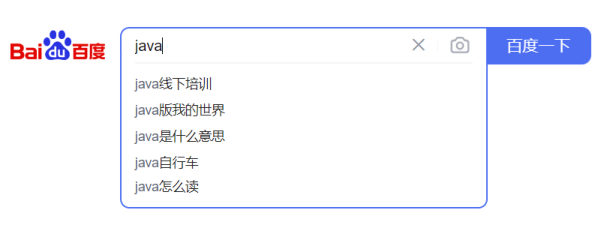
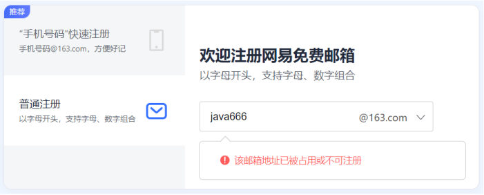

[20 篇](/posts/编程学习/javaweb学习笔记/20-vue3常用指令/)的 `empList` 是**写在 `data` 里的死数据**——改一条员工就得改一次代码。可真实项目里数据在**服务器**上、在数据库里，页面上那些数字还会随时变。这一篇解决的就是"**怎么向服务器要数据**"：

- 先说清 **Ajax** 是什么（以及"异步"到底是什么感觉）；
- 再用 **Axios** 发请求——它是这门课前端取数的**唯一工具**；
- 最后看 **`async` / `await`** 怎么写才顺眼，以及**和真实接口对接时那几个必踩的坑**。

[22 篇](/posts/编程学习/javaweb学习笔记/22-实战-vueaxios员工列表/)会把这些全用到员工列表案例上。

## 什么是 Ajax

> 介绍（PPT 原文）：**Asynchronous JavaScript And XML**——**异步**的 JavaScript 和 **XML**。

拆开两个词：

| 词 | 意思 |
| --- | --- |
| **Asynchronous（异步）** | 请求发出去以后**不用干等着**，页面该干嘛干嘛（下面一节专门讲"同步 vs 异步"） |
| **JavaScript And XML** | 用 JS 来发请求、用 **XML** 这种格式来装数据 |

**XML**（PPT 的注解）：**（英语：Extensible Markup Language）可扩展标记语言，本质是一种数据格式，可以用来存储复杂的数据结构。**

> [!NOTE]
> 这个名字是"历史遗留"：Ajax 诞生那会儿后端返回的数据确实是用 XML 装的。现在实际开发里**几乎都用 JSON**（[15 篇](/posts/编程学习/javaweb学习笔记/15-js函数与自定义对象/)里那种"数组里放对象"的格式就是 JSON 的样子）。**名字没变，装的格式换了**——看到 `XML` 两个字别慌，知道它是"一种数据格式"就够了。

Ajax 的**作用**（PPT 列了两条，都很关键）：

1. **数据交换**：通过 Ajax 可以**给服务器发送请求**，并**获取服务器响应的数据**。
2. **异步交互**：可以在**不重新加载整个页面的情况下**，与服务器交换数据并**更新部分网页**的技术。

"异步交互"听着抽象，PPT 配了两个大家天天在用的例子：


*图：PPT 举的第一个例子——在搜索框里敲 `java`，下拉框里立刻冒出"java线下培训""java版我的世界"等联想词；这些词**不在本地**，是每敲一个字就悄悄找服务器要一次，而**页面本身完全没有刷新**（地址栏没变、你打的字也没丢）*


*图：PPT 举的第二个例子——注册邮箱时刚输完，页面上立刻出现"该邮箱地址已被占用或不可注册"。这条提示也是问服务器要来的：能实时判断"用没用过"，是因为每次输入都发了一次请求，而页面**没有跳转、没有刷新**，表单里已经填好的内容也都还在*

**这两个例子的共同点**：**局部更新**。要是没有 Ajax，得"提交表单 → 整页刷新 → 页面把所有内容重新渲染一遍"，体验完全不同。

## 同步与异步

PPT 第 31 页用一张时间轴图（左同步、右异步）对比"请求服务器要 3 秒"时客户端在干什么：

| | 同步（Synchronous） | 异步（Asynchronous） |
| --- | --- | --- |
| 客户端时间线 | 1. 正在访问… → 2. 请求服务器… → 3. **服务器处理中(3s)** → 4. 响应客户端… → 5. 继续访问… | 1. 正在访问… → 2. 请求服务器… → **2/3. 客户端可以执行其他操作…** → 4. 响应客户端… → 5. 继续访问 |
| 等待这 3 秒时页面能干什么 | **什么都干不了**，卡在那里等（前面那些步骤得**按顺序**走完） | 页面**照常能用**：你可以继续打字、滚动、点别的按钮；服务器回话以后再去处理结果 |
| 一句话 | **一步一步等**，前一步不做完后一步不开始 | **先把请求发出去**，不耽误干别的事，结果回来了再处理 |

> [!TIP]
> 异步在代码里长什么样？看课程 `15. Axios-请求方式别名.html` 里这几行——注意打印顺序：
>
> ```javascript
> axios.get('...').then((result) => {
>   console.log(result.data);   // ② 服务器回话了才执行（可能是一秒以后）
> });
> console.log('==========================');   // ① 这行会先打印！
> ```
>
> 明明 `.then(...)` 写在前面，但 `==========` **先**出现在控制台——因为 `.then()` 里的函数是"**结果回来以后**才执行的**回调函数**"，而它下面的代码不用等。这就是异步：**发起请求不阻塞后面的代码**。
> 后面学的 `async` / `await` 就是给这种写法"改口味"的（让代码读起来像从上往下一步步执行）。

## Axios 是什么

> 介绍（PPT 原文）：**Axios 对原生的 Ajax 进行了封装，简化书写，快速开发。**（官网：https://www.axios-http.cn/）

用 [17 篇](/posts/编程学习/javaweb学习笔记/17-js事件监听/)的 `addEventListener` 类比一下：原生的 Ajax 是 `XMLHttpRequest`，写起来又长又啰嗦（要判断 `readyState`、手动 `JSON.parse`）；Axios 把它包了一层，**发请求这件事变成一行**。

**使用步骤**（PPT 原文就两步）：

1. **引入 Axios 的 js 文件**（参照官网）
2. **使用 Axios 发送请求，并获取响应结果**

引入方式（PPT 给的是在线地址；课程代码用的是本地文件）：

```html
<!-- 方式一：在线引入（和 Vue 一样，直接写 CDN 地址） -->
<script src="https://unpkg.com/axios/dist/axios.min.js"></script>

<!-- 方式二：本地引入（课程 js 目录里就有一份 axios.js） -->
<script src="js/axios.js"></script>
```

> [!TIP]
> 注意和前一篇的区别：**Axios 的引入不用 `type="module"`**——它是普通脚本（把 `axios` 挂成全局变量），所以：
> - **本地文件方式双击 html 也能跑**（不像 Vue 的模块导入会被 CORS 拦）；
> - 用的时候直接写 `axios.get(...)`，**不需要 `import`**。
>
> 练习文件里的 Axios 也是直接 `<script src="...">` 引入的，双击就能用（联网即可）。

## 基本用法：axios({...})

课程 `14. Axios-入门.html` 的写法（页面上两个按钮，点一下发一次请求）：

```html
<script src="js/axios.js"></script>
<script>
  //发送GET请求
  document.querySelector('#btnGet').addEventListener('click', () => {
    //axios发起异步请求
    axios({
      url: 'https://mock.apifox.cn/m1/3083103-0-default/emps/list',
      method: 'GET'
    }).then((result) => { //成功回调函数
      console.log(result.data);
    }).catch((err) => { //失败回调函数
      console.log(err);
    })
  })

  //发送POST请求
  document.querySelector('#btnPost').addEventListener('click', () => {
    //axios发起异步请求
    axios({
      url: 'https://mock.apifox.cn/m1/3083103-0-default/emps/update',
      method: 'POST',
      data: 'id=1' //POST请求方式 , 请求体
    }).then((result) => { //成功回调函数
      console.log(result.data);
    }).catch((err) => { //失败回调函数
      console.log(err);
    })
  })
</script>
```

`axios({ ... })` 里那个对象是**请求配置**，PPT 把常用的四个参数列了出来：

| 配置项 | 含义 |
| --- | --- |
| **`method`** | **请求方式**：GET / POST（后面还有 PUT、DELETE 等） |
| **`url`** | **请求路径**（接口地址） |
| **`data`** | **请求数据（POST）**——放在**请求体**里 |
| **`params`** | **发送请求时携带的 url 参数**，如 `...?key=val`（拼在地址后面的那种） |

后面的两个方法（PPT 标注为"成功回调函数 / 失败回调函数"）：

| 写法 | 什么时候执行 | 拿到什么 |
| --- | --- | --- |
| **`.then((result) => { ... })`** | 请求**成功**（服务器正常返回） | `result` 是响应对象，业务数据在 **`result.data`** 里 |
| **`.catch((err) => { ... })`** | 请求**失败**（断网、地址写错、服务器报错……） | `err` 是错误对象，`console.log` 出来能看原因 |

> [!NOTE]
> 上面两段课程代码里的地址（`https://mock.apifox.cn/m1/3083103-0-default/...`）是**第三方 mock（假接口）平台**给的演示地址——课程用它是因为"能立刻返回一段 JSON 数据、练手方便"。**mock 平台上的地址有失效的可能**，打不开时换成课程的教学接口即可：
> - 列表：`https://web-server.itheima.net/emps/list`（支持 `?name=xxx&gender=xxx&job=xxx` 三个查询条件）
> - 修改：`https://web-server.itheima.net/emps/update`（POST，请求体如 `id=1`）
>
> 这两个接口都是"教学演示"用的，返回结构和 mock 地址一致（都是 `{code, msg, data}`）。**笔记的练习文件统一用这两个地址**。

## 响应结果结构：多了一层 .data

这是最容易搞混的地方：**`result` 不是数据本身，`result.data` 才是服务器返回的内容**。

```javascript
axios.get('https://web-server.itheima.net/emps/list').then((result) => {
  console.log(result.data);   // 服务器返回的"全部内容"
});
```

`result` 这个响应对象里装着几样东西：

| 属性 | 是什么 |
| --- | --- |
| **`result.data`** | **服务器返回的响应体**（业务数据在这里） |
| `result.status` | HTTP 状态码（200 表示成功） |
| `result.statusText` | 状态码对应的文字（如 `OK`） |
| `result.headers` | 响应头 |
| `result.config` | 本次请求的配置（就是 `axios({...})` 里写的那份） |

而这门课后端返回的 `result.data` **自己又包了一层**（这是后端接口的"统一返回格式"），长这样：

```json
{
  "code": 1,
  "msg": "success",
  "data": [ { "id": 1, "name": "谢逊", ... }, ... ]
}
```

- **`code`**：业务状态码（1 表示成功）
- **`msg`**：提示信息
- **`data`**：**真正的业务数据**

所以**取员工列表要写两层**：`result.data.data`。

| 想要的东西 | 写法 |
| --- | --- |
| 服务器返回的全部内容（含 code/msg） | `result.data` |
| **员工数组**（真正要渲染的） | **`result.data.data`** |

> [!WARNING]
> 报错 `Cannot read properties of undefined (reading 'xxx')` 时先怀疑这里：
> - 写了 `result.data` 但接口返回的是"包了一层"的结构 → 应该写 `result.data.data`；
> - 接口返回的字段名和你写的不一样（比如人家叫 `empList`，你按 `data` 取）。
> **办法很土但最有效：先把 `console.log(result)` 和 `console.log(result.data)` 打出来看清楚结构，再决定写几层。**

## 请求方式别名：axios.get / axios.post

PPT 第 33 页：**为了方便起见，Axios 已经为所有支持的请求方法提供了别名。**

**格式**：`axios.请求方式(url [, data [, config]])`——**PPT 标注"推荐"**，因为比 `axios({...})` 短得多。

课程 `15. Axios-请求方式别名.html` 的写法：

```html
<script src="js/axios.js"></script>
<script>
  //发送GET请求
  document.querySelector('#btnGet').addEventListener('click', () => {
    axios.get('https://mock.apifox.cn/m1/3083103-0-default/emps/list').then((result) => {
      console.log(result.data);
    });
    console.log('==========================');
  })

  //发送POST请求
  document.querySelector('#btnPost').addEventListener('click', () => {
    axios.post('https://mock.apifox.cn/m1/3083103-0-default/emps/update', 'id=1').then((result) => {
      console.log(result.data);
    });
  })
</script>
```

两种写法**完全等价**，对比一下：

```javascript
// 原始写法：一个对象，四个参数都写在里面
axios({
  url: 'https://web-server.itheima.net/emps/list',
  method: 'GET',
  params: { name: '谢逊' }
}).then(...)

// 别名写法：GET 的参数用 params 配置项接
axios.get('https://web-server.itheima.net/emps/list', {
  params: { name: '谢逊' }
}).then(...)
```

   完整别名表（PPT 第 33 页说的"所有支持的请求方法"，按 axios 官网的清单）：

| 别名 | 参数形式 | 说明 |
| --- | --- | --- |
| `axios.get(url[, config])` | 地址 + 配置 | 用来**获取**数据，参数走 `config.params` |
| `axios.delete(url[, config])` | 地址 + 配置 | 删除，参数同样走 `config.params` |
| `axios.head(url[, config])` | 地址 + 配置 | 只取响应头 |
| `axios.options(url[, config])` | 地址 + 配置 | 预检请求 |
| `axios.post(url[, data[, config]])` | 地址 + **数据** + 配置 | 提交/新增，数据放在**请求体** |
| `axios.put(url[, data[, config]])` | 地址 + **数据** + 配置 | 整体修改，数据放请求体 |
| `axios.patch(url[, data[, config]])` | 地址 + **数据** + 配置 | 局部修改，数据放请求体 |

看规律：**GET 系列（get / delete / head / options）第二个参数是"配置"；POST 系列（post / put / patch）第二个参数是"数据"、第三个才是配置**。

> [!NOTE]
> 课程里 GET 用的是 `https://web-server.itheima.net/emps/list`、POST 用的是 `.../emps/update`（同一个服务器的不同接口）。**别把 `get` 和 `post` 和"取/存"这两个语义绑死在一张表上**——用什么方式，看**接口文档**写的什么，不是看你想干什么。

## async / await：把异步写得像同步

> PPT 原文：**可以通过 `async`、`await` 可以让异步变为同步操作。`async` 就是来声明一个异步方法，`await` 是用来等待异步任务执行。**

- **`async`**：加在**函数前面**的关键字，声明"这是一个异步方法"，函数里就可以用 `await` 了；
- **`await`**：**等着异步任务的结果**——它**取代了 `.then()`**，而且**只在 `async` 函数内有效**。

对比同一件事的两种写法：

```javascript
// 写法一：.then() 回调（结果在 then 的括号里才拿得到）
methods: {
  search() {
    axios.get('https://web-server.itheima.net/emps/list').then((result) => {
      this.empList = result.data.data;   // 注意：这里的 this 要靠箭头函数才指向 Vue 实例
    });
  }
}
```

```javascript
// 写法二：async / await（结果直接赋值给变量，一行一句）
methods: {
  async search() {                                 // ① 方法前加 async
    let result = await axios.get('https://web-server.itheima.net/emps/list');  // ② await 等结果
    this.empList = result.data.data;               // ③ 下一行直接用结果
  }
}
```

PPT 对第二种评价是：**可读性强、便于维护**——代码从"回调套回调"变成"从上到下一行接一行"。

这篇的课程案例代码（`16. Vue-案例-员工列表(异步交互).html` 里的 `search` 方法，PPT 第 37 页就是这段）：

```javascript
methods: {
  async search() {
    //根据用户输入的搜索条件，基于axios发送异步请求(https://web-server.itheima.net/emps/list)到服务端...
    let result = await axios.get('https://web-server.itheima.net/emps/list?name=xxx&gender=xxx&job=xxx');
    this.employees = result.data.data;
  }
}
```

**注意（PPT 原文）**：**`await` 关键字只在 `async` 函数内有效**，`await` 关键字**取代 `then` 函数**，等待获取到**请求成功的结果值**。

> [!WARNING]
> `await` 的三个常见坑：
> 1. **在非 `async` 函数里用 `await`**——语法错误，页面直接不工作。函数前面加上 `async` 就好。
> 2. **只加了 `async` 没加 `await`**——`let result = axios.get(...)` 拿到的是"尚未完成的请求对象"（Promise），`result.data` 是 `undefined`。**两者要成对出现**。
> 3. **没有 `.catch()` 了，出错怎么办？**——`async / await` 里 `then / catch` 那一套不用了，错误用 **`try...catch`** 接：
>    ```javascript
>    async search() {
>      try {
>        let result = await axios.get('https://web-server.itheima.net/emps/list');
>        this.empList = result.data.data;
>      } catch (err) {
>        console.log(err);        // 断网、接口没起来、地址写错，都会走到这里
>        alert('数据加载失败，请稍后重试');
>      }
>    }
>    ```
>    （课程代码为了简洁没写 `try/catch`，但真实项目里该写——不然接口一挂，页面上什么提示都没有。）

## 和后端接口对接，要注意什么

这一节是"能跑通"和"跑不通"之间的分界线。前端发请求失败，八成的锅在这几条上：

### 1. 跨域（CORS）

浏览器有**同源策略**：协议、域名、端口**三者只要有一个不同**，就属于"跨域"请求，浏览器会额外检查服务端有没有"允许你这个来源访问"的响应头。

- 我们的页面（用 Live Server 打开时是 `http://127.0.0.1:5500`）去请求 `https://web-server.itheima.net/...`——**域名和端口都不同，就是跨域**；
- 课程的接口服务器返回了 `Access-Control-Allow-Origin: *`（允许任何来源），所以能正常拿到数据；
- 换成自己写的后端时，如果**忘了配置跨域**，浏览器控制台会报 `has been blocked by CORS policy`，`.catch` 里拿到的是 `Network Error`。

> [!NOTE]
> 后面学 SpringBoot 时，这事有正经解法（后端加跨域配置 / 用 `@CrossOrigin`，前端工程化项目里还有"代理"这一招）。**现在只要会认这个错**：控制台出现 `CORS policy` → 找后端（或问 AI）配允许跨域，**不是前端代码写错了**。

### 2. 请求地址、方式、参数名要和接口文档一致

| 要核对 | 例子 | 错了会怎样 |
| --- | --- | --- |
| **地址（url）** | `https://web-server.itheima.net/emps/list` | 404 Not Found |
| **请求方式（method）** | 接口要 GET，你写了 POST | 405 Method Not Allowed |
| **参数名** | 接口要 `name` / `gender` / `job` | 参数被当成没用上，返回的是全量数据（或空数据） |
| **参数位置** | GET 拼在地址后面（`?name=xxx` 或 `config.params`）；POST 放在请求体（`data`） | 后端读不到参数 |

案例里 GET 的查询参数是用**模板字符串**拼到地址上的（`20 篇`学的反引号）：

```javascript
// 三个条件拼在 ? 后面，用 & 连接
let url = `https://web-server.itheima.net/emps/list?name=${this.searchForm.name}&gender=${this.searchForm.gender}&job=${this.searchForm.job}`;
let result = await axios.get(url);
```

> [!TIP]
> **参数里有中文、空格、`&` 这类字符时**，正规做法是 `encodeURIComponent(...)` 包一层（浏览器通常会自动处理，但自己包上更稳）：
> ```javascript
> let url = `https://web-server.itheima.net/emps/list?name=${encodeURIComponent(this.searchForm.name)}`;
> ```
> 另一个更省事的写法是把参数交给 axios 去拼：
> ```javascript
> let result = await axios.get('https://web-server.itheima.net/emps/list', {
>   params: { name: this.searchForm.name, gender: this.searchForm.gender, job: this.searchForm.job }
> });
> ```
> （课程案例用的是模板字符串那种，两种都对。）

### 3. 返回值的"层数"要和接口文档对上

`result.data` 还是 `result.data.data`，取决于后端包了几层——先 `console.log` 看清楚再写（前面那一节讲过）。

### 4. 接口没起来时，页面是什么表现

练这一章时最常见的场景：**后端没启动、地址写错、断网**。这时候的现象一定要会认——因为"看着像白屏"的锅常常不在你的代码：

| 情况 | 控制台/页面表现 | 该检查什么 |
| --- | --- | --- |
| **后端没启动**（本地接口） | `.catch` 里 `err.message` 是 `Network Error`；F12 的 Network 面板里这条请求是红色失败 | 后端项目启动了没？端口对不对（如 `8080`）？ |
| **地址写错 / 接口不存在** | `Request failed with status code 404` | url 拼得对不对（少个 `/`、少个 `list` 都会 404） |
| **请求方式不对** | `Request failed with status code 405` | method 和接口文档一致吗 |
| **跨域被拦** | 报 `blocked by CORS policy`，`.catch` 里是 `Network Error` | 后端配了跨域吗（见上面第 1 条） |
| **断网 / CDN 打不开** | `Failed to load resource: net::ERR_INTERNET_DISCONNECTED`；**如果 Vue 或 axios 本身是从 CDN 引的，连页面都动不了** | 联网状态；或用本地 js 文件 + Live Server |
| **都不报错但表格是空的** | 页面正常、控制台没红字，就是没数据 | ①返回的是不是"包一层"的结构（`result.data.data`）；②筛选条件是不是把数据都筛掉了（比如 `name` 传了空串以外的值但没匹配） |

> [!IMPORTANT]
> 写这一章的代码时，**养成"先看控制台、再看 Network 面板"的习惯**：报错信息里其实写清了原因（404/405/CORS/Network Error），比"页面没反应"这句描述有用一百倍。接口暂时用不了时，页面该有的表现是**表格空白 + 控制台一条错误**——[22 篇](/posts/编程学习/javaweb学习笔记/22-实战-vueaxios员工列表/)的提示块里还给了"怎么给用户一个友好的失败提示"。

## 小结

| 问题 | 答案 |
| --- | --- |
| Ajax 是什么？ | **Asynchronous JavaScript And XML**（异步的 JavaScript 和 XML）；**XML** 本质是一种**数据格式**（现在实际都用 JSON） |
| Ajax 的作用？ | ① **数据交换**：给服务器发请求、拿服务器响应的数据；② **异步交互**：不重新加载整个页面的情况下交换数据并**更新部分网页**（搜索联想、用户名是否可用校验） |
| 同步和异步的区别？ | 同步要**等着**服务端处理完才继续（页面卡住）；异步**发出去就不管了**，期间客户端可以执行其他操作，结果回来了再处理（`.then` 里的代码会后执行） |
| Axios 是什么？ | 对**原生 Ajax 的封装**，简化书写、快速开发（官网 https://www.axios-http.cn/）；两步：**引入 js 文件** → **发送请求并获取响应结果** |
| 怎么引入？ | `<script src="https://unpkg.com/axios/dist/axios.min.js"></script>` 或本地的 `<script src="js/axios.js"></script>`——**普通脚本，不用 `type="module"`，双击 html 也能用** |
| 基本写法？ | `axios({ method: 'GET', url: '...', data: '...', params: {...} }).then(result => {...}).catch(err => {...})`；**`method` 请求方式、`url` 路径、`data` 请求体（POST）、`params` url 参数** |
| 别名写法？ | `axios.请求方式(url [, data [, config]])`（**推荐**）：`axios.get(url[, config])` / `axios.delete` / `axios.head` / `axios.options` / `axios.post(url[, data[, config]])` / `axios.put` / `axios.patch` |
| 结果怎么取？ | 成功回调里**业务数据在 `result.data`**（响应对象还有 `status`/`headers`/`config`）；课程后端"包了一层"，所以员工数组是 **`result.data.data`** |
| async / await 怎么写？ | 方法前加 **`async`**，请求前加 **`await`**：`let result = await axios.get(url);`——**`await` 只在 `async` 函数内有效**、**取代 `.then()`**；错误用 **`try...catch`** 接 |
| 对接接口要注意什么？ | ① **跨域 CORS**（协议/域名/端口任一不同；接口要允许跨域，控制台报 `blocked by CORS policy`）；② **地址、请求方式、参数名、参数位置**要和接口文档一致；③ **返回值层数**（`result.data` 还是 `result.data.data`）；④ 接口没起来时是 `Network Error` / 404 / 405，页面空白+控制台报错 |

## 相关

- [上一篇：Vue3常用指令](/posts/编程学习/javaweb学习笔记/20-vue3常用指令/)
- [下一篇：实战-Vue+Axios员工列表](/posts/编程学习/javaweb学习笔记/22-实战-vueaxios员工列表/)
- [JS函数与自定义对象（JSON 那种"数组里放对象"的数据格式）](/posts/编程学习/javaweb学习笔记/15-js函数与自定义对象/)
- [JS事件监听（`addEventListener` 版的手动触发，对比 `@click`）](/posts/编程学习/javaweb学习笔记/17-js事件监听/)
- [JS-DOM操作（拿到数据以后，不靠 Vue 的话得怎么往页面上填）](/posts/编程学习/javaweb学习笔记/16-js-dom操作/)

## 练习题

### 一、知识回顾（读完直接做下面的实践题）

1. **Ajax** = **Asynchronous JavaScript And XML**（异步的 JavaScript 和 XML）；**XML** 是 **Extensible Markup Language（可扩展标记语言）**，**本质是一种数据格式**，可存储复杂数据结构（现在实际都用 **JSON**）
2. **Ajax 的两大作用**：**数据交换**（给服务器发送请求、获取服务器响应的数据）、**异步交互**（不重新加载整个页面的情况下交换数据并**更新部分网页**）；典型例子：**搜索联想**、**用户名/邮箱是否可用校验**
3. **同步 vs 异步**：同步要等服务器处理完才能继续（"……等待……"）；异步**发完请求就不阻塞**，等待期间客户端**可以执行其他操作**，结果回来后由**回调函数**处理
4. **Axios** 是对**原生 Ajax 的封装**，简化书写、快速开发（官网 https://www.axios-http.cn/）；两步走：**引入 Axios 的 js 文件** → **使用 Axios 发送请求并获取响应结果**
5. **引入方式**：`<script src="https://unpkg.com/axios/dist/axios.min.js"></script>`（在线）或 `<script src="js/axios.js"></script>`（本地）；**是普通脚本**（不用 `type="module"`、不用 import），全局 `axios` 直接用
6. **基本写法**：`axios({ method, url, data, params }).then(成功回调).catch(失败回调)`——`method` **请求方式**、`url` **请求路径**、`data` **请求数据（POST 请求体）**、`params` **url 参数（?...&...）**
7. **请求方式别名**：`axios.请求方式(url [, data [, config]])`，**推荐**；`axios.get(url[, config])`、`axios.delete`、`axios.head`、`axios.options` **第二个参数是配置**；`axios.post(url[, data[, config]])`、`axios.put`、`axios.patch` **第二个参数是数据**
8. **响应结构**：`result` 是响应对象（有 `data` / `status` / `statusText` / `headers` / `config`）；**业务数据在 `result.data`**；课程后端统一返回 `{code, msg, data}`，所以**员工数组是 `result.data.data`**
9. **async / await**：`async` 声明异步方法，`await` 等待异步任务**成功的结果值**并**取代 `.then()`**；**`await` 只在 `async` 函数内有效**；代码可读性强、便于维护；错误用 **`try...catch`** 捕获
10. **对接真实接口的四个核对点**：① **跨域**（协议/域名/端口任一不同，需要接口允许跨域，报 `blocked by CORS policy`）；② 地址/请求方式/参数名/参数位置和**接口文档**一致；③ 返回值的**层数**（先 `console.log` 看清楚）；④ 接口没起来时表现为 `Network Error`、404、405——**页面空白 + 控制台报错**

### 二、裸写题

- [ ] **2-1 点按钮从服务器拿数据**
  页面上有一个"获取员工数据"按钮和一个输出区。要求：
  1. 点击按钮，向服务器发一次**获取数据**的请求（地址：`https://web-server.itheima.net/emps/list`）
  2. 把服务器返回的**完整内容**打印到控制台
  3. 把员工**总共几个人**显示到输出区（形如"共 4 人"）
  4. 请求失败时，把"加载失败"显示到输出区（不要让页面静默无反应）
  （练习文件 `test_21_发送GET请求.html` 里已经准备好了按钮、输出区和 Axios 引入。）

  > [!TIP]- 提示（先自己想，实在想不出再点开）
  > **一级 · 思路**：一次请求 = 地址 + "要数据"这个动作；结果要"先看清楚结构再取值"，因为返回的内容外面包了一层
  > **二级 · 方法**：`axios.get(地址)`；成功用 `.then((result) => {...})`，先 `console.log(result.data)` 看结构；员工数组在 `result.data.data`；人数用 `.length`；失败用 `.catch((err) => {...})`
  > **三级 · 骨架**：`axios.____('https://web-server.itheima.net/emps/list').____((result) => { console.log(result.____); document.querySelector('#out').innerText = \`共 ${result.data.data.____} 人\`; }).____((err) => { ……'加载失败'…… })`

  > [!TIP]- 参考答案（做完再点开）
  > ```html
  > <button type="button" id="btn">获取员工数据</button>
  > <p id="out"></p>
  >
  > <script src="https://unpkg.com/axios/dist/axios.min.js"></script>
  > <script>
  >   document.querySelector('#btn').addEventListener('click', () => {
  >     axios.get('https://web-server.itheima.net/emps/list')
  >       .then((result) => {
  >         console.log(result.data);   // 控制台里看清楚：{code, msg, data:[...]}
  >         // 员工数组在 result.data.data 里
  >         document.querySelector('#out').innerText = `共 ${result.data.data.length} 人`;
  >       })
  >       .catch((err) => {
  >         console.log(err);
  >         document.querySelector('#out').innerText = '加载失败';
  >       });
  >   });
  > </script>
  > ```
  > 检查点：① 点按钮后输出区显示"共 4 人"（当前接口里有 4 条数据）；② 控制台里能看到 `{code: 1, msg: "success", data: Array(4)}`；③ **故意把地址改错一个字母**再点，页面显示"加载失败"、控制台里有 404 报错——这就是"接口没起来/地址写错"的表现。

- [ ] **2-2 用别名写法提交一次数据**
  页面上有一个"提交修改"按钮。要求：
  1. 点击按钮，用 Axios 的**请求方式别名**向 `https://web-server.itheima.net/emps/update` 提交一份数据（请求体内容就写 `id=1`）
  2. 打印服务器返回的结果到控制台
  3. 顺手再做一次：把"获取员工列表"这件事**改成别名写法**（地址 `https://web-server.itheima.net/emps/list`），并把返回的 **`msg`** 字段显示到页面上
  （练习文件 `test_21_请求方式别名.html` 里已经准备好了按钮、输出区和写作区。）

  > [!TIP]- 提示（先自己想，实在想不出再点开）
  > **一级 · 思路**：别名就是"用方法名表示请求方式"；第二个参数的位置决定传进去的是"要提交的数据"还是"配置"
  > **二级 · 方法**：`axios.post(地址, 数据)`——**提交的数据放在第二个参数**；`axios.get(地址)` 拿数据；显示用 `document.querySelector('#out').innerText = result.data.msg`
  > **三级 · 骨架**：`axios.____('https://web-server.itheima.net/emps/update', '____').then((result) => { console.log(result.____); });` / `axios.____('https://web-server.itheima.net/emps/list').then((result) => { document.querySelector('#out').innerText = result.data.____; });`

  > [!TIP]- 参考答案（做完再点开）
  > ```html
  > <button type="button" id="btnPost">提交修改</button>
  > <button type="button" id="btnGet">获取列表</button>
  > <p id="out"></p>
  >
  > <script src="https://unpkg.com/axios/dist/axios.min.js"></script>
  > <script>
  >   // 提交数据：别名 post，第二个参数就是请求体数据
  >   document.querySelector('#btnPost').addEventListener('click', () => {
  >     axios.post('https://web-server.itheima.net/emps/update', 'id=1').then((result) => {
  >       console.log(result.data);   // {code: 1, msg: "success", data: null}
  >     });
  >   });
  >
  >   // 获取数据：别名 get，把返回的 msg 显示到页面
  >   document.querySelector('#btnGet').addEventListener('click', () => {
  >     axios.get('https://web-server.itheima.net/emps/list').then((result) => {
  >       document.querySelector('#out').innerText = result.data.msg;
  >     });
  >   });
  > </script>
  > ```
  > 检查点：① 点"提交修改"控制台打印 `msg: "success"`；② 点"获取列表"页面显示 `success`；③ 能说出 `axios.post(url, data)` 里**第二个参数为什么是数据**——因为 POST 的"要提交的东西"是它的第一个业务参数（对比 `axios.get(url, config)` 的第二个参数是配置）。
  > 对照课程 `15. Axios-请求方式别名.html`。课程里在那句 `axios.get(...)` 后面还写了一行 `console.log('==========================')`——**它会先打印**，这正是"异步"的证据，自己加进去验证一遍。

- [ ] **2-3 用 async / await 改写，并做错误处理**
  页面上有一个"查询"按钮和一个输出区。要求：
  1. 点按钮后请求 `https://web-server.itheima.net/emps/list`，把**员工姓名**拼成一句话显示到输出区（如"谢逊, 韦一笑, 黛绮丝, 殷天正"）
  2. **必须**用 `async` / `await` 的写法（不许用 `.then()`）
  3. 加上错误处理：请求失败时输出区显示"数据加载失败，请检查网络或接口地址"，并把错误对象打印到控制台
  4. 在请求**前后**各打印一行日志，观察它们的执行顺序
  （练习文件 `test_21_async_await.html` 里已经准备好了按钮、输出区和写作区。）

  > [!TIP]- 提示（先自己想，实在想不出再点开）
  > **一级 · 思路**：把"要等的异步任务"用 `await` 接住，结果就变成一个普通变量；出错的路用 `try` / `catch` 分成两段
  > **二级 · 方法**：函数前加 `async`；`let result = await axios.get(地址)`；数组 `.map()` 或用 `for` 拼姓名；`try { … } catch (err) { … }`；`console.log` 用来看顺序
  > **三级 · 骨架**：`async function load() { try { console.log('开始'); let result = ____ axios.get('……/emps/list'); let names = result.data.data.map(e => e.____).join(', '); document.querySelector('#out').innerText = ____; console.log('结束'); } catch (____) { console.log(err); document.querySelector('#out').innerText = '数据加载失败，请检查网络或接口地址'; } }`

  > [!TIP]- 参考答案（做完再点开）
  > ```html
  > <button type="button" id="btn">查询</button>
  > <p id="out"></p>
  >
  > <script src="https://unpkg.com/axios/dist/axios.min.js"></script>
  > <script>
  >   // async：声明这是一个异步方法，里面才能用 await
  >   async function load() {
  >     try {
  >       console.log('① 开始请求');
  >       // await：等请求成功的结果，取代 .then()
  >       let result = await axios.get('https://web-server.itheima.net/emps/list');
  >       // 把姓名数组拼成一句话
  >       let names = result.data.data.map(e => e.name).join(', ');
  >       document.querySelector('#out').innerText = names;
  >       console.log('② 请求完成');
  >     } catch (err) {
  >       // 断网、地址写错、跨域被拦都会走到这里
  >       console.log(err);
  >       document.querySelector('#out').innerText = '数据加载失败，请检查网络或接口地址';
  >     }
  >   }
  >
  >   document.querySelector('#btn').addEventListener('click', load);
  > </script>
  > ```
  > 检查点：① 页面显示"谢逊, 韦一笑, 黛绮丝, 殷天正"（接口返回 4 条；条数可能变，以实际为准）；② 控制台顺序是"① 开始请求 → ② 请求完成"（多了 `await`，打印顺序和 `.then()` 那种写法**不一样**）；③ 把地址改错后点查询，页面显示失败提示、控制台有报错，**页面没有卡死**。

### 三、综合题

- [ ] **3-1 做一个"接口小工具"页面（GET 查询 + POST 提交 + 状态提示）**
  页面上有三个区域：一个**姓名输入框 + 查询按钮 + 清空按钮**、一块**结果区**、一个"提交一条数据"按钮。要求（按步骤来）：
  1. **查询**：用 `async / await` 向 `https://web-server.itheima.net/emps/list` 发 GET 请求，并把姓名输入框里的内容作为 `name` 参数拼到地址后面（`?name=xxx`）
  2. **渲染**：把返回的员工数组渲染成一段列表（每行一条，显示"姓名 - 入职日期"），**没有数据时**显示"没有匹配的员工"
  3. **状态提示**：请求开始前显示"加载中…"，成功后清空提示；失败时显示"加载失败："+ 错误信息
  4. **清空**：点清空把输入框内容擦掉、结果区恢复成初始提示"请输入姓名后点击查询"
  5. **提交**：点"提交一条数据"用 **POST** 向 `https://web-server.itheima.net/emps/update` 提交 `id=1`，把返回的 `msg` 显示在结果区最后一行
  6. 全程用 `try / catch` 处理错误，并在控制台打印每次请求的完整响应（先看清楚结构再取数据）
  （练习文件 `test_21_综合_接口小工具.html` 里已经准备好了页面结构和写作区。）

  > [!TIP]- 提示（先自己想，实在想不出再点开）
  > **一级 · 思路**：把"发请求"包成一个函数，界面上的每个按钮只负责"改一下状态 + 调这个函数"；界面上所有文字都靠"改 DOM 内容"或"改元素内容"来更新
  > **二级 · 方法**：`async function load() { try { … await axios.get(url) … } catch (err) { … } }`；拼参数用模板字符串 `` `...?name=${name}` ``；渲染列表用 `数组.map(item => \`<li>...</li>\`).join('')` 再赋给 `innerHTML`（[16 篇](/posts/编程学习/javaweb学习笔记/16-js-dom操作/)的套路）；POST 用 `axios.post(url, data)`；状态提示就是改某个元素的 `innerText`
  > **三级 · 骨架**：`async function load() { out.innerText = '____'; try { let result = await axios.____(\`https://web-server.itheima.net/emps/list?name=${____}\`); let list = result.data.data; if (list.length == 0) { out.innerText = '没有匹配的员工'; } else { out.innerHTML = list.____(e => \`<li>${e.name} - ${e.____}</li>\`).join(''); } } catch (err) { out.innerText = '加载失败：' + ____.message; } }`

  > [!TIP]- 参考答案（做完再点开）
  > ```html
  > <input type="text" id="name" placeholder="请输入姓名">
  > <button type="button" id="btnSearch">查询</button>
  > <button type="button" id="btnClear">清空</button>
  > <button type="button" id="btnUpdate">提交一条数据</button>
  >
  > <div id="status"></div>
  > <ul id="list"></ul>
  >
  > <script src="https://unpkg.com/axios/dist/axios.min.js"></script>
  > <script>
  >   let statusBox = document.querySelector('#status');
  >   let listBox = document.querySelector('#list');
  >
  >   // ① + ② + ③ 查询、渲染、状态提示
  >   async function load() {
  >     statusBox.innerText = '加载中…';   // 请求前：先给用户一个反馈
  >     try {
  >       let name = document.querySelector('#name').value;
  >       let result = await axios.get(`https://web-server.itheima.net/emps/list?name=${name}`);
  >       console.log(result.data);        // 先看清楚结构：{code, msg, data}
  >
  >       let emps = result.data.data;
  >       if (emps.length == 0) {
  >         statusBox.innerText = '没有匹配的员工';
  >         listBox.innerHTML = '';
  >       } else {
  >         statusBox.innerText = `共 ${emps.length} 人`;   // 请求成功：提示换了内容
  >         listBox.innerHTML = emps.map(e => `<li>${e.name} - ${e.entrydate}</li>`).join('');
  >       }
  >     } catch (err) {
  >       console.log(err);
  >       statusBox.innerText = '加载失败：' + err.message;
  >     }
  >   }
  >
  >   // ④ 清空：输入框擦掉、结果区回到初始提示
  >   function clear() {
  >     document.querySelector('#name').value = '';
  >     statusBox.innerText = '请输入姓名后点击查询';
  >     listBox.innerHTML = '';
  >   }
  >
  >   // ⑤ 提交：POST，数据放在第二个参数
  >   async function update() {
  >     try {
  >       let result = await axios.post('https://web-server.itheima.net/emps/update', 'id=1');
  >       console.log(result.data);
  >       statusBox.innerText = '提交结果：' + result.data.msg;
  >     } catch (err) {
  >       console.log(err);
  >       statusBox.innerText = '提交失败：' + err.message;
  >     }
  >   }
  >
  >   // 页面一打开就给个初始提示（还没学 Vue 的 mounted，这里直接手动调一次）
  >   clear();
  >
  >   document.querySelector('#btnSearch').addEventListener('click', load);
  >   document.querySelector('#btnClear').addEventListener('click', clear);
  >   document.querySelector('#btnUpdate').addEventListener('click', update);
  > </script>
  > ```
  > 检查点：① 打开页面结果区显示"请输入姓名后点击查询"；② 姓名填"谢"再查询，列表出现匹配的员工行（参数没生效就会返回全部 4 条——可以对比一下）；③ 姓名填一个乱码（如 `zzz`）查询，显示"没有匹配的员工"；④ 点"提交一条数据"，结果区显示 `提交结果：success`；⑤ **拔网线/改成错的地址**再点查询，显示"加载失败：..."而不是白屏。
  > 说明：这个练习故意**没用 Vue**——把 [16 篇](/posts/编程学习/javaweb学习笔记/16-js-dom操作/)的 DOM 操作和这一篇的 Axios 合起来练一遍。等下一章用 Vue 写同样的东西，你会发现"渲染列表"和"更新提示文字"都不用手动操作 DOM 了。
