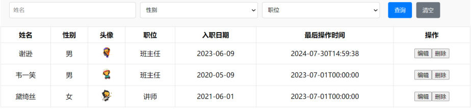
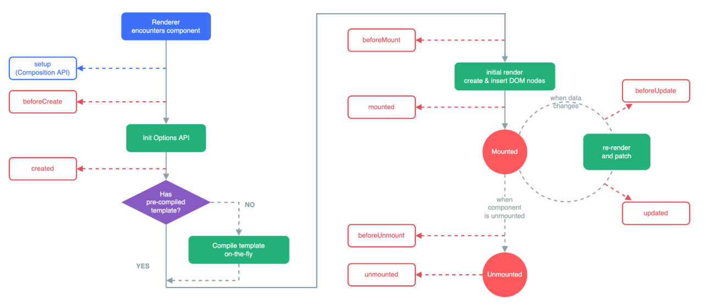
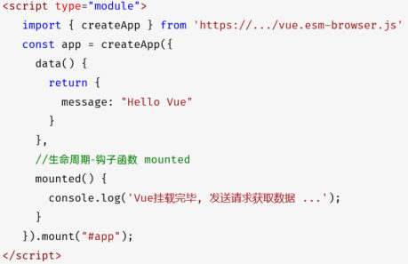

这是第 2 章的收尾案例，也是前几篇的**合体**：

- [20 篇](/posts/编程学习/javaweb学习笔记/20-vue3常用指令/)用指令把**死数据**渲染成了表格；
- [21 篇](/posts/编程学习/javaweb学习笔记/21-axios异步请求/)学会了**向服务器要数据**；
- 这一篇把两者接起来——**表格里的行来自接口**。课程案例文件是 `16. Vue-案例-员工列表(异步交互).html`（和 `13.` 那个"常用指令版"是同一个页面，只有取数方式变了）。

做完这个案例，你会第一次见到**前后端分离**的样子：**前端只负责展示，数据从接口来**。

## 案例要做什么

页面还是那个 Tlias 员工管理页面（导航栏 / 搜索表单 / 表格 / 页脚），但数据来源变了：

| | 指令版（[20 篇](/posts/编程学习/javaweb学习笔记/20-vue3常用指令/)，`13.` 那个文件） | **异步交互版（这一篇，`16.` 文件）** |
| --- | --- | --- |
| 员工数据从哪来 | 写在 `data` 里的 `empList` 三条死数据 | **`empList: []` 空数组**，数据从**服务器接口**取回来再填进去 |
| 谁提供数据 | 前端自己 | **后端**（接口地址 `https://web-server.itheima.net/emps/list`） |
| 点"查询" | 只把条件打印到控制台 | **真的带条件去请求服务器**（`?name=xxx&gender=xxx&job=xxx`），用返回结果渲染表格 |
| 页面刚打开时 | 数据已经在那儿了 | 表格是**空的**——要等请求回来才出现数据 |

服务端接口地址（PPT 第 36 页给的）：

```text
https://web-server.itheima.net/emps/list?name=xxx&gender=xxx&job=xxx
```


*图：这张 PPT 就是案例做完的样子（第 27、36、38 页反复用它）——搜索表单在上、员工表格在下，**表格里的三行数据全部来自接口**；表面上和 20 篇的死数据版长得一模一样，区别在"数据是从服务器要来的"*

整体流程四步（后面按这四步走）：

```text
①数据准备（searchForm + 空数组）→ ②发请求（Axios 取数据）→ ③渲染（Vue 指令）→ ④交互（按钮、清空、自动加载）
```

## 第 1 步：数据准备

和指令版比，`data` 只改了一个地方：

```javascript
data() {
  return {
    searchForm: { //封装用户输入的查询条件
      name: '',
      gender: '',
      job: ''
    },
    empList: []   // ① 关键变化：这里不再是"三条死数据"，而是空数组
  }
}
```

> [!IMPORTANT]
> **为什么要给一个空数组，而不是不给？**
> - `v-for="(e, index) in empList"` 要求 `empList` **必须存在**：写成 `[]` 时，`v-for` 遍历 0 次——**页面正常显示、只是没有数据行**；
> - 如果 `data` 里压根没有 `empList`（或者写了 `null`），`v-for` 找不到要遍历的东西，Vue 会**报错**。
>
> 一句话：**先摆一个空位置，等数据回来再填**。这是"异步取数"页面的固定套路（数据还没来，页面就得先能渲染出来）。

## 第 2 步：发请求

在 `methods` 里加一个 `async search()`（[21 篇](/posts/编程学习/javaweb学习笔记/21-axios异步请求/)刚学的 `async` / `await`）：

```javascript
//方法
methods: {
  async search() {
    // 发送ajax请求，获取数据
    let result = await axios.get(`https://web-server.itheima.net/emps/list?name=${this.searchForm.name}&gender=${this.searchForm.gender}&job=${this.searchForm.job}`);
    this.empList = result.data.data;   // 把接口返回的员工数组交给 empList
  }
}
```

这四行里全是前两篇的知识点：

| 代码片段 | 用到的知识点 |
| --- | --- |
| `async search()` | [21 篇](/posts/编程学习/javaweb学习笔记/21-axios异步请求/)的 `async`：声明异步方法，里面才能用 `await` |
| `await axios.get(...)` | 21 篇的 Axios 别名写法 + `await` **取代 `.then()`**，结果直接赋给 `result` |
| `` `...?name=${this.searchForm.name}&gender=${this.searchForm.gender}&job=${this.searchForm.job}` `` | [15 篇](/posts/编程学习/javaweb学习笔记/15-js函数与自定义对象/)的**模板字符串**拼地址；`this.searchForm` 是 [20 篇](/posts/编程学习/javaweb学习笔记/20-vue3常用指令/) `v-model` 采集到的用户输入 |
| `this.empList = result.data.data` | 21 篇的**响应结构**：`result.data` 是响应体，**再一层 `.data` 才是员工数组**（后端包了 `{code, msg, data}`） |

课程代码里还保留了一段**用 `.then()` 的旧写法**（注释掉的），正好对照：

```javascript
// 旧写法（注释保留在课程代码里）：结果只能在 then 的括号里拿到
// axios.get(`https://web-server.itheima.net/emps/list?name=${this.searchForm.name}&gender=${this.searchForm.gender}&job=${this.searchForm.job}`).then((result) => {
//     this.empList = result.data.data;
// })
// console.log('===========================');   // 这行会比上面的 then 先执行

// 新写法：await 等结果，代码从上到下一行接一行
let result = await axios.get(`https://web-server.itheima.net/emps/list?name=${this.searchForm.name}&gender=${this.searchForm.gender}&job=${this.searchForm.job}`);
this.empList = result.data.data;
```

> [!TIP]
> 这一行 `this.empList = ...` 就是整个案例的**枢纽**：
> - **改数据**（`this.empList`）→ **页面自己重新渲染**（`v-for` 按新数组重新出行）——不需要 `render()`、不需要重新绑事件；
> - 对比 [18 篇](/posts/编程学习/javaweb学习笔记/18-实战-js版员工列表/)：那边取到数据以后还要 `render(); stripe(); bindDelete();` 一串手动调用，这边**只有一句赋值**。

> [!WARNING]
> `await` 千万别忘：写成 `let result = axios.get(...)`（少了 `await`）时，`result` 是"还没完成的任务对象"，`result.data` 是 `undefined`，接着写 `result.data.data` 就会报 **`Cannot read properties of undefined (reading 'data')`**——报这个错先回去看 `await` 和 `.data` 的层数。

## 第 3 步：渲染

渲染部分和 [20 篇](/posts/编程学习/javaweb学习笔记/20-vue3常用指令/)的指令版**一模一样**——`v-for` 渲染行、`v-bind` 绑头像、`v-if` 翻译职位、`{{ }}` 显示文字：

```html
<tbody>
  <tr v-for="(e, index) in empList" :key="e.id">
    <td>{{index + 1}}</td>
    <td>{{e.name}}</td>
    <td>{{e.gender == 1?'男' : '女'}}</td>
    <td></td>
    <td>
      <span v-if="e.job == 1">班主任</span>
      <span v-else-if="e.job == 2">讲师</span>
      <span v-else-if="e.job == 3">学工主管</span>
      <span v-else-if="e.job == 4">教研主管</span>
      <span v-else-if="e.job == 5">咨询师</span>
      <span v-else>其他</span>
    </td>
    <td>{{e.entrydate}}</td>
    <td>{{e.updatetime}}</td>
    <td class="action-buttons">
      <button type="button">编辑</button>
      <button type="button">删除</button>
    </td>
  </tr>
</tbody>
```

> [!NOTE]
> **渲染代码一个字都不用改，是这一章最值得拍一下大腿的地方**：模板只认 `empList` 这个数组，至于它是"手写的"还是"从接口取回来的"，`v-for` 根本不关心。
> 回想 [18 篇](/posts/编程学习/javaweb学习笔记/18-实战-js版员工列表/)手写渲染那版：数据一变就要重跑渲染函数、重新上色、重新绑事件；到了 Vue 这里，"换数据源"只是**第 2 步那一行赋值**的事。

## 第 4 步：交互

搜索表单和前一篇一样：三个控件 `v-model` 绑定、两个按钮 `@click`：

```html
<form class="search-form">
  <input type="text" id="name" name="name" v-model="searchForm.name" placeholder="请输入姓名">
  <select id="gender" name="gender" v-model="searchForm.gender"> …… </select>
  <select id="position" name="position" v-model="searchForm.job"> …… </select>

  <button type="button" v-on:click="search">查询</button>
  <button type="button" @click="clear">清空</button>
</form>
```

**"查询"**就是调第 2 步那个 `async search()`：用户输入的条件（`v-model` 早就帮我们收进 `searchForm` 了）拼进地址，服务器按条件筛完把结果返回。

**"清空"**多了一步——**清完还要重新查一次**（不然页面上还是上一次的结果）：

```javascript
clear() {
  //清空表单项数据
  this.searchForm = {name:'', gender:'', job:''}
  this.search()   // 清空条件后再查一次，把全部数据取回来
}
```

## 第 5 步：页面加载完自动查一次（Vue 生命周期）

到这里功能已经齐了，但有个体验问题：**打开页面时表格是空的**，得手动点一次"查询"才出现数据。PPT 第 38 页把这个问题摆了出来：

> 如何做到在**页面加载完毕后自动发起请求**，请求服务端？

答案是 **Vue 的生命周期**。

### 什么是生命周期

> 定义（PPT 原文）：**生命周期：指一个对象从创建到销毁的整个过程。**

Vue 的实例（就是我们 `createApp({...})` 出来的那个应用）也一样有"出生 → 干活 → 结束"的过程：创建 → 挂载到页面上 → 数据更新时重渲染 → 卸载销毁。**每个阶段被触发时，Vue 会自动执行一个"生命周期方法"（也叫"钩子函数"）**——我们把这些方法写在选项对象里，就等于在"某个时间点"预约了一段代码。

### 八个阶段和八个钩子

PPT 列了完整的表（这张表要记住阶段名字，尤其是 **`mounted`**）：

| 状态 | 阶段周期 |
| --- | --- |
| `beforeCreate` | 创建前 |
| `created` | 创建后 |
| `beforeMount` | 载入前 |
| **`mounted`** | **挂载完成** |
| `beforeUpdate` | 数据更新前 |
| `updated` | 数据更新后 |
| `beforeUnmount` | 组件销毁前 |
| `unmounted` | 组件销毁后 |


*图：PPT 第 40 页的生命周期流程图——从左往右看：组件被渲染 → `beforeCreate`（创建前）→ `created`（创建后）→ 编译模板 → `beforeMount`（载入前）→ **initial render（创建并插入 DOM 节点）** → **`mounted`（挂载完成）**；此后数据变化会在 **Mounted ↔ re-render** 之间循环（每轮触发 `beforeUpdate` / `updated`）；组件被卸载时依次经过 `beforeUnmount` / `unmounted`。**页面上的元素什么时候"真的在"？答案就在 `mounted` 这个位置**——所以在它这里发请求最合适*

### 案例里怎么用

在选项对象里加一个 `mounted()`，里面调 `this.search()`：

```javascript
//钩子函数
mounted() {
  //页面加载完成之后，发送ajax请求，获取数据
  this.search()
}
```


*图：PPT 第 41～42 页给出的 `mounted` 写法——`createApp({ data() {...}, mounted() { console.log('Vue挂载完毕, 发送请求获取数据 ...'); } })`；钩子函数和数据、方法写在同一个对象里，`this` 同样指向 Vue 实例，所以能直接 `this.search()`*

为什么放在 `mounted`（挂载完成）而不是更早的钩子？因为**这时页面元素已经渲染到页面上了**——表格、表单都在，`search()` 拿回来的数据显示上去正好；再早（`beforeCreate` / `created`）时还没"上屏"。

**PPT 第 42 页的问答页**把这一节的重点收成两问两答：

| 问题 | 答案 |
| --- | --- |
| Vue 生命周期共分为几个阶段？ | **共分为八个阶段** |
| Vue 生命周期典型的应用场景？ | **在页面加载完毕时，发起异步请求，加载数据，渲染页面** |

> [!TIP]
> "八个阶段"不用全部背下来现在就用——**先牢牢记住 `mounted`："页面加载完毕"时自动执行的钩子**，前面这一堆"页面打开就自动查一次""打开详情页先加载数据"的场景，全是它。
> 其余几个等用到时候自然会遇到（比如组件销毁时清理定时器用 `unmounted`，那是后面项目里的事）。

## 完整代码

`16. Vue-案例-员工列表(异步交互).html` 的脚本部分（**这一段是这一章的总结**）：

```html
<!-- Axios 是普通脚本，直接引入（在 module 脚本之前） -->
<script src="js/axios.js"></script>
<script type="module">
  import { createApp } from 'https://unpkg.com/vue@3/dist/vue.esm-browser.js'

  createApp({
    data() {
      return {
        searchForm: { //封装用户输入的查询条件
          name: '',
          gender: '',
          job: ''
        },
        empList: []   // 员工列表：先给空数组，等接口数据回来再填
      }
    },
    //方法
    methods: {
      async search() {
        // 发送ajax请求，获取数据
        let result = await axios.get(`https://web-server.itheima.net/emps/list?name=${this.searchForm.name}&gender=${this.searchForm.gender}&job=${this.searchForm.job}`);
        this.empList = result.data.data;   // 改数据 → 页面自动重新渲染
      },
      clear() {
        //清空表单项数据
        this.searchForm = {name:'', gender:'', job:''}
        this.search()   // 清空后重新查询，恢复全部数据
      }
    },
    //钩子函数
    mounted() {
      //页面加载完成之后，发送ajax请求，获取数据
      this.search()
    }
  }).mount('#container')
</script>
```

> [!NOTE]
> **两个脚本的写法**：课程把 `<script src="js/axios.js">`（引入 Axios 的**普通脚本**）写在 `<script type="module">` **前面**——"依赖先引、代码后用"，照着写最稳。
> 顺便说清背后的机制：`type="module"` 的脚本**默认延迟执行**（等页面解析完才跑），而普通脚本在**页面解析到它时就执行**——所以就算把两个 `<script>` 的顺序调过来，模块脚本也总能等到 Axios 就绪，功能不受影响。（真正会出问题的是给类库脚本加 `async`：它什么时候执行完不做保证。）
> 另外注意这个页面的挂载点是 **`#container`**（整个页面容器），不是 `#app`。

### 接口没起来时，页面是什么表现

这个案例**强依赖后端接口**，所以练习时一定会遇到"接口用不了"的情况。表现和排查方法（[21 篇](/posts/编程学习/javaweb学习笔记/21-axios异步请求/)那节讲了原理，这里给案例的具体症状）：

| 症状 | 原因 | 怎么办 |
| --- | --- | --- |
| 表格**一行都没有**、搜索也不出数据，控制台一行红字 `Network Error` | 接口服务器连不上（断网 / 后端没启动 / 域名写错） | 检查网络与地址；`https://web-server.itheima.net/emps/list` 可用时能直接返回数据 |
| 控制台报 `Request failed with status code 404` | 地址拼错（少 `/`、少 `list`、多了空格） | 逐字符核对接口地址 |
| 控制台报 `blocked by CORS policy` | 跨域没被允许 | 学习阶段用课程接口；自己写后端时记得配跨域 |
| 页面能打开、**Vue 也没生效**（花括号原样显示） | Vue 模块没加载出来（本地文件用了双击打开 / 断网导致 CDN 失败） | 用 Live Server 打开，或换在线 CDN 地址 |
| 页面正常、表格空、**控制台没有任何红字** | 请求成功但结果是空数组——筛选条件把数据筛没了（比如 `name` 填了个不存在的名字） | 换个条件（或清空）再试；先 `console.log(result.data)` 看返回了什么 |

> [!TIP]
> 想让页面在接口失败时**不那么难看**，给 `search()` 套上 `try / catch`（[21 篇](/posts/编程学习/javaweb学习笔记/21-axios异步请求/)给过写法）：
>
> ```javascript
> async search() {
>   try {
>     let result = await axios.get(`...`);
>     this.empList = result.data.data;
>   } catch (err) {
>     console.log(err);
>     alert('数据加载失败，请稍后重试');   // 或者把提示语显示在页面上
>   }
> }
> ```
>
> 课程代码为了简洁没写 `try / catch`，但**真实项目一定要写**——不然接口一挂，用户看到的就是一个永远空着的表格，什么提示都没有。

## 前后端分离的雏形

这个案例最值得记住的不是代码，而是**分工**：

| | 前端（我们写的这个页面） | 后端（接口） |
| --- | --- | --- |
| 负责什么 | **展示**：页面结构、样式、渲染逻辑、交互 | **数据**：存数据、按条件查询、返回结果 |
| 关心什么 | 数据长什么样（字段名、结构） | 谁在用、要哪些数据 |
| 怎么交互 | 发请求（Axios + 接口地址与参数） | 返回 JSON |

**"接口"就是两边约定好的契约**：

```text
前端：GET https://web-server.itheima.net/emps/list?name=xxx&gender=xxx&job=xxx
后端：{ "code": 1, "msg": "success", "data": [ { "id": 1, "name": "谢逊", ... } ] }
```

只要契约不变：**后端换成 Java 写的、Python 写的、甚至数据换成从数据库里查，前端一行代码都不用改**；反过来，前端这次是 Vue、下次换个框架，后端也不用动。这就是"前后端分离"的意义——对比 [12 篇](/posts/编程学习/javaweb学习笔记/12-实战-tlias员工管理页面/)那种"数据写死在 HTML 里"的做法，那种叫"前后端不分离"（页面由后端渲染好整页发过来）。

> [!IMPORTANT]
> 回头看 [18 篇](/posts/编程学习/javaweb学习笔记/18-实战-js版员工列表/)结尾那句"数据是唯一真身，页面是它的渲染结果"——到了这一篇，**数据的来源从"写在代码里"变成了"从服务器来"**，但"改数据 → 页面变"这条主线没变。
> 后面学 SpringBoot 时，你会**自己写那个接口**（Java 后端返回 JSON），前端这个页面就能连自己写的后端了——那时候两边就通了。

## 小结

| 问题 | 答案 |
| --- | --- |
| 这个案例和"常用指令版"的差别？ | 数据来源不同：指令版是 `data` 里的**死数据**；这个版本 `empList: []` 是**空数组**，数据由 **Axios 从接口取回**后赋值 |
| 为什么 `empList` 要先给空数组？ | `v-for` 要求它存在——空数组时"渲染 0 行"（页面正常），不给或给 `null` 会报错 |
| 发请求的方法怎么写？ | `async search()` + `let result = await axios.get(\`...?name=${this.searchForm.name}&...\`)` + `this.empList = result.data.data` |
| 为什么取两层 `.data`？ | 第一层是 Axios 的响应体（`result.data`），第二层是后端统一返回格式 `{code, msg, data}` 里的业务数据 |
| 数据取回来还要手动重新渲染吗？ | **不用**——`this.empList = ...` 改完数据，`v-for` 自己按新数组重新渲染（这就是比 [18 篇](/posts/编程学习/javaweb学习笔记/18-实战-js版员工列表/)手写 `render()` 省事的地方） |
| "清空"按钮做了什么？ | `this.searchForm = {name:'', gender:'', job:''}` **再调一次 `this.search()`**（清完要重新查，否则页面还留着上次的结果） |
| 页面加载完怎么自动查一次？ | 用**生命周期钩子 `mounted()`**（挂载完成），里面调 `this.search()` |
| Vue 生命周期是什么？ | **一个对象从创建到销毁的整个过程**；每触发一个生命周期事件就自动执行一个**钩子函数**；共**八个阶段**：`beforeCreate`、`created`、`beforeMount`、**`mounted`**、`beforeUpdate`、`updated`、`beforeUnmount`、`unmounted` |
| 生命周期的典型应用场景？ | **在页面加载完毕时发起异步请求，加载数据，渲染页面** |
| 接口没起来时页面什么样？ | 表格空白 + 控制台报错（`Network Error` / 404 / CORS）；什么都不报但表格空 = 筛选条件筛没了数据；用 `try / catch` 给用户一个友好提示 |
| 什么是"前后端分离"？ | 前端只管**展示**（发请求、拿 JSON、渲染），后端只管**数据**（按接口约定返回 JSON）；**接口就是两边的契约**，一方换实现另一方不用改 |

## 相关

- [上一篇：Axios异步请求](/posts/编程学习/javaweb学习笔记/21-axios异步请求/)
- [Vue3常用指令（这个案例的渲染部分）](/posts/编程学习/javaweb学习笔记/20-vue3常用指令/)
- [Vue3快速入门（`createApp` / `data` / `{{ }}`）](/posts/编程学习/javaweb学习笔记/19-vue3快速入门/)
- [实战-JS版员工列表（不用框架做同一件事，对比着看）](/posts/编程学习/javaweb学习笔记/18-实战-js版员工列表/)
- [实战-Tlias员工管理页面（案例页面的原型）](/posts/编程学习/javaweb学习笔记/12-实战-tlias员工管理页面/)

## 练习题

### 一、知识回顾（读完直接做下面的实践题）

1. 案例流程四步：**数据准备**（`searchForm` + **`empList: []` 空数组**）→ **发请求**（`async search()` + `await axios.get`）→ **渲染**（`v-for` / `v-bind` / `v-if`，与指令版**完全一样**）→ **交互**（`@click` 查询/清空 + `mounted` 自动加载）
2. 数据准备的关键：`empList` **要先给一个空数组**——`v-for` 遍历 0 次，页面正常只是没有数据行；不给或给 `null` 会报错
3. 发请求方法：`async search()` 里 `let result = await axios.get(\`https://web-server.itheima.net/emps/list?name=${this.searchForm.name}&gender=${this.searchForm.gender}&job=${this.searchForm.job}\`)`，然后 **`this.empList = result.data.data`**
4. **`result.data.data`**：第一层 `data` 是 **Axios 的响应体**，第二层是后端统一返回格式 **`{code, msg, data}`** 里的业务数据（员工数组）；少写一层会报 `Cannot read properties of undefined`
5. **改数据即改页面**：`this.empList = ...` 一句赋值，`v-for` 就按新数组重新渲染，**不需要**手动 `render()`、不需要重新绑事件（对比 18 篇）
6. "清空"按钮：先 `this.searchForm = {name:'', gender:'', job:''}`，**再调一次 `this.search()`**，让页面恢复成全量数据
7. **生命周期**：指一个对象**从创建到销毁的整个过程**；每触发一个生命周期事件就自动执行一个**钩子函数**；共 **八个阶段**：`beforeCreate`（创建前）、`created`（创建后）、`beforeMount`（载入前）、**`mounted`（挂载完成）**、`beforeUpdate`（数据更新前）、`updated`（数据更新后）、`beforeUnmount`（组件销毁前）、`unmounted`（组件销毁后）
8. **`mounted` 是这一章的重点钩子**：**页面加载完毕时发起异步请求、加载数据、渲染页面**（PPT 说的生命周期典型应用场景）；写法就是给 `createApp({...})` 的选项对象加一个 `mounted() { this.search() }`
9. **两个脚本怎么写**：`<script src=".../axios.min.js">`（普通脚本）按课程习惯写在 `<script type="module">`（Vue 模块脚本）**前面**；因为模块脚本**默认延迟执行**，所以顺序颠倒也不影响（但别给类库脚本加 `async`）；这个案例的挂载点是 **`#container`**
10. **接口没起来时的表现**：表格空白 + 控制台报 `Network Error`（连不上）/ `404`（地址错）/ `405`（方式错）/ `blocked by CORS policy`（跨域）；**什么都不报但没数据** = 筛选条件筛没了；用 **`try / catch`** 给用户友好提示
11. **前后端分离**：前端只负责**展示**、数据从**接口**来；后端负责**数据**、返回 **JSON**；**接口是两边约定的契约**——一方换实现，另一方不用改代码

### 二、裸写题

- [ ] **2-1 页面一打开就自动把数据查回来**
  页面上有一张"图书"表格（表头 3 列：序号、书名、作者），数据要从接口 `https://web-server.itheima.net/emps/list` 取（就当它是图书接口用，返回结构是 `{code, msg, data:[...]}`，每条数据有 `name` 字段）。要求：
  1. 数据里准备一个**空数组** `books`，表格用循环按它渲染
  2. 写一个方法，请求接口并把返回的数组赋给 `books`（名字叫什么随意，用 `async / await` 写）
  3. **打开页面时不用点任何按钮，表格里就该有数据**——用生命周期钩子实现
  4. 顺手把"姓名"列显示成数据里的 `name`（字段名和"图书"不一样，按接口来）
  （练习文件 `test_22_自动加载列表.html` 里已经准备好了表头、空数组和写作区。）

  > [!TIP]- 提示（先自己想，实在想不出再点开）
  > **一级 · 思路**：三件事——数据先摆个空的、写一个"取数"的方法、在"页面加载完"的那一刻调它
  > **二级 · 方法**：`data` 里 `books: []`；方法前加 `async`、请求前加 `await`；返回的数组在 **`result.data.data`**；"页面加载完"用**生命周期钩子 `mounted()`**（写在 `methods` 同级，和 `data` 并列）
  > **三级 · 骨架**：`let result = ____ axios.get('https://web-server.itheima.net/emps/list'); this.____ = result.data.____;` / `mounted() { this.____(); }` / 表格里 `<tr v-____="(b, index) in books" :key="b.id">` + `<td>{{b.____}}</td>`

  > [!TIP]- 参考答案（做完再点开）
  > ```html
  > <div id="app">
  >   <table>
  >     <thead>
  >       <tr><th>序号</th><th>书名</th><th>作者</th></tr>
  >     </thead>
  >     <tbody>
  >       <tr v-for="(b, index) in books" :key="b.id">
  >         <td>{{index + 1}}</td>
  >         <td>{{b.name}}</td>
  >         <td>{{b.entrydate}}</td>
  >       </tr>
  >     </tbody>
  >   </table>
  > </div>
  >
  > <script src="https://unpkg.com/axios/dist/axios.min.js"></script>
  > <script type="module">
  >   import { createApp } from 'https://unpkg.com/vue@3/dist/vue.esm-browser.js';
  >
  >   createApp({
  >     data() {
  >       return {
  >         books: []   // 先给空数组，等接口数据回来再填
  >       }
  >     },
  >     methods: {
  >       async load() {
  >         let result = await axios.get('https://web-server.itheima.net/emps/list');
  >         this.books = result.data.data;   // 改数据 → v-for 自动重新渲染
  >       }
  >     },
  >     // 生命周期钩子：挂载完成（页面已经渲染出来），在这里自动发请求
  >     mounted() {
  >       this.load();
  >     }
  >   }).mount('#app');
  > </script>
  > ```
  > 检查点：① 打开页面**不点任何按钮**，表格里就有数据（说明 `mounted` 生效了）；② 把 `mounted()` 整个删掉刷新，表格变空——这就是"没写钩子"的对照；③ 控制台里 `console.log(result.data)` 能看到 `{code, msg, data}` 这层结构。

- [ ] **2-2 带条件的查询 + 清空后重新查**
  页面上有一个输入框（姓名）、一个"查询"按钮、一个"清空"按钮，和一张员工表格。要求：
  1. 输入框里的内容和数据**双向同步**（不用手写取值代码）
  2. 点"查询"：把输入框里的内容作为查询条件（参数名 `name`）拼到地址后面，请求 `https://web-server.itheima.net/emps/list`，用返回结果渲染表格
  3. 没有查到数据时，表格下方显示"没有匹配的员工"；查到了就显示"共 N 人"
  4. 点"清空"：输入框清空、**并自动再查一次**（把全部数据取回来）
  5. 请求过程中在页面上显示"加载中…"，失败时显示"加载失败"
  （练习文件 `test_22_带条件查询.html` 里已经准备好了表单、表格、提示区和写作区。）

  > [!TIP]- 提示（先自己想，实在想不出再点开）
  > **一级 · 思路**：查询方法一共三段——"改提示为加载中"→"发请求并渲染"→"出错就改提示"；清空 = 把条件还原 + 调一次查询方法
  > **二级 · 方法**：`v-model="form.name"`；`` `...?name=${this.form.name}` ``；`this.list = result.data.data`；条数用 `list.length`；错误用 `try / catch`；清空方法末尾调 `this.search()`
  > **三级 · 骨架**：`async search() { this.tip = '加载中…'; try { let result = await axios.____(\`https://web-server.itheima.net/emps/list?name=${this.____.name}\`); this.list = result.data.____; this.tip = this.list.____ == 0 ? '没有匹配的员工' : \`共 ${this.list.length} 人\`; } catch (err) { this.tip = '____'; } }` / `clear() { this.form.name = '____'; this.search(); }`

  > [!TIP]- 参考答案（做完再点开）
  > ```html
  > <div id="app">
  >   <input type="text" v-model="form.name" placeholder="请输入姓名">
  >   <button type="button" @click="search">查询</button>
  >   <button type="button" @click="clear">清空</button>
  >
  >   <p>{{tip}}</p>
  >   <table>
  >     <thead>
  >       <tr><th>姓名</th><th>职位</th><th>入职日期</th></tr>
  >     </thead>
  >     <tbody>
  >       <tr v-for="e in list" :key="e.id">
  >         <td>{{e.name}}</td>
  >         <td>{{e.job}}</td>
  >         <td>{{e.entrydate}}</td>
  >       </tr>
  >     </tbody>
  >   </table>
  > </div>
  >
  > <script src="https://unpkg.com/axios/dist/axios.min.js"></script>
  > <script type="module">
  >   import { createApp } from 'https://unpkg.com/vue@3/dist/vue.esm-browser.js';
  >
  >   createApp({
  >     data() {
  >       return {
  >         form: { name: '' },   // 采集输入（v-model 双向绑定）
  >         list: [],             // 员工列表（先空着）
  >         tip: ''               // 提示文字
  >       }
  >     },
  >     methods: {
  >       async search() {
  >         this.tip = '加载中…';
  >         try {
  >           let result = await axios.get(`https://web-server.itheima.net/emps/list?name=${this.form.name}`);
  >           this.list = result.data.data;
  >           this.tip = this.list.length == 0 ? '没有匹配的员工' : `共 ${this.list.length} 人`;
  >         } catch (err) {
  >           console.log(err);
  >           this.tip = '加载失败';
  >         }
  >       },
  >       clear() {
  >         this.form.name = '';   // 清空输入框里的条件（v-model 会同步到页面）
  >         this.search();         // 清空后重新查一次，恢复全部数据
  >       }
  >     },
  >     mounted() {
  >       this.search();   // 页面加载完先查一次
  >     }
  >   }).mount('#app');
  > </script>
  > ```
  > 检查点：① 打开页面自动加载，提示"共 4 人"（条数以实际为准）；② 输入"谢"再查询，提示"共 1 人"、表格只剩匹配那行；③ 输入 `zzz` 查询，提示"没有匹配的员工"、表格清空；④ 点"清空"，输入框变空**并且表格恢复成全量数据**；⑤ 把地址改错，提示"加载失败"。

- [ ] **2-3 用钩子做一次"页面打开就显示"的信息**
  页面上有一行"系统信息"，打开页面时既要显示时间、也要显示一条从接口取来的数据。要求：
  1. 用**两个钩子**分别做事：一个在**创建后**（还没渲染到页面时）把时间算好，另一个在**挂载完成**时去请求接口
  2. 时间用 `new Date().toLocaleString()` 取（写在数据里的变量上）
  3. 接口请求 `https://web-server.itheima.net/emps/list`，把返回数据的**条数**显示出来（形如"接口返回 4 条数据"）
  4. 在控制台把两个钩子的执行顺序打印出来（各一行日志），观察谁先谁后
  （练习文件 `test_22_生命周期钩子.html` 里已经准备好了页面和写作区。）

  > [!TIP]- 提示（先自己想，实在想不出再点开）
  > **一级 · 思路**：钩子就是"写在选项对象里的、到点自动执行的方法"——名字固定，位置和 `data` / `methods` 平级
  > **二级 · 方法**："创建后"是 `created()`，"挂载完成"是 `mounted()`；钩子里用 `this` 读写数据；请求用 `await axios.get(...)`，条数是 `result.data.data.length`
  > **三级 · 骨架**：`created() { console.log('____'); this.time = new Date().toLocaleString(); }` / `async mounted() { console.log('____'); let result = ____ axios.get('https://web-server.itheima.net/emps/list'); this.count = result.data.____.length; }`

  > [!TIP]- 参考答案（做完再点开）
  > ```html
  > <div id="app">
  >   <p>系统时间：{{time}}</p>
  >   <p>接口返回 {{count}} 条数据</p>
  > </div>
  >
  > <script src="https://unpkg.com/axios/dist/axios.min.js"></script>
  > <script type="module">
  >   import { createApp } from 'https://unpkg.com/vue@3/dist/vue.esm-browser.js';
  >
  >   createApp({
  >     data() {
  >       return {
  >         time: '',
  >         count: 0
  >       }
  >     },
  >     // 创建后：数据已经可用，页面还没渲染
  >     created() {
  >       console.log('① created：创建后');
  >       this.time = new Date().toLocaleString();
  >     },
  >     // 挂载完成：页面元素已经在页面上了，适合发请求
  >     async mounted() {
  >       console.log('② mounted：挂载完成');
  >       let result = await axios.get('https://web-server.itheima.net/emps/list');
  >       this.count = result.data.data.length;
  >     }
  >   }).mount('#app');
  > </script>
  > ```
  > 检查点：① 页面显示当前时间与"接口返回 4 条数据"；② 控制台顺序是 `① created` → `② mounted`（创建在前、挂载在后）；③ 把 `mounted` 里的请求换成 `created` 也能跑——但**习惯上"要操作页面/发请求取数据"都放 `mounted`**（PPT 说的典型应用场景），因为那时页面元素已经就绪。

### 三、综合题

- [ ] **3-1 照着课程案例做一个"员工列表（异步交互版）"**
  照着 `16. Vue-案例-员工列表(异步交互).html` 做一遍：页面有**顶部导航栏**、**搜索表单**（姓名输入框、性别下拉框、职位下拉框 + 查询/清空按钮）、**员工表格**（表头 8 列）、**页脚**，数据来自接口 `https://web-server.itheima.net/emps/list`。按步骤来：
  1. **数据准备**：`searchForm`（name / gender / job 三个空串）+ `empList: []`（**空数组**）
  2. **发请求**：写 `async search()`——把 `searchForm` 的三个条件拼到地址后面（`?name=xxx&gender=xxx&job=xxx`），用 `await axios.get(...)` 取回数据，赋值给 `empList`（注意取 `result.data.data`）
  3. **渲染**：数据行用 `v-for`（`key` 用 `id`）+ 序号 `{{index + 1}}`；性别 `1/2` 显示成"男/女"；头像用属性绑定；职位用条件渲染翻译成中文（1 班主任…5 咨询师、其它"其他"）
  4. **交互**："查询"按钮调 `search()`；"清空"按钮把 `searchForm` 还原成三个空串**并重新查询一次**；三个控件都用双向绑定
  5. **自动加载**：用**生命周期钩子**让页面加载完自动查一次（打开就能看到数据）
  6. **错误处理**（加分）：给 `search()` 套 `try / catch`，失败时用 `alert` 或页面提示告诉用户"数据加载失败"
  7. **验证筛选**：分别试一次"姓名填一个存在的字"和"姓名填乱码"，确认表格数据真的跟着条件变了
  （练习文件 `test_22_综合_Vue员工列表.html` 里已经准备好了整个页面结构（含样式）、Axios 引入和写作区。）

  > [!TIP]- 提示（先自己想，实在想不出再点开）
  > **一级 · 思路**：先把第 1、2 步写完（数据 + 取数方法），页面自然有数据了再补第 3 步的渲染；表单和按钮是最后一步——每一步都能单独验证
  > **二级 · 方法**：`async search() { try { let result = await axios.get(地址); this.empList = result.data.data; } catch (err) {...} }`；地址用模板字符串拼 `` `https://web-server.itheima.net/emps/list?name=${this.searchForm.name}&gender=${this.searchForm.gender}&job=${this.searchForm.job}` ``；渲染指令照 20 篇；`clear()` 末尾调 `this.search()`；钩子用 `mounted()`
  > **三级 · 骨架**：`data() { return { searchForm: { name: '____', gender: '', job: '' }, empList: ____ } }` / `async search() { let result = await axios.get(\`……?name=${this.searchForm.____}&gender=${this.searchForm.gender}&job=${this.searchForm.job}\`); this.empList = result.data.____; }` / `clear() { this.searchForm = { name: '', gender: '', job: '' }; this.____(); }` / `mounted() { this.____(); }`
  >
  > **排错顺序**（卡住时按这个查）：
  > 1. 控制台有没有红字？（`Network Error` = 接口连不上；404 = 地址错；CORS = 跨域）
  > 2. F12 的 Network 面板里那条 `emps/list` 请求回来了吗？返回的 JSON 长什么样？
  > 3. `this.empList = result.data.data` 有没有写成 `result.data`？
  > 4. 表格是不是有 `v-for` 但数组名写错（比如写成 `empList` 之外的名字）？
  > 5. 挂载点 `#container` 和页面上容器的 `id` 对得上吗？

  > [!TIP]- 参考答案（做完再点开）
  > 模板里的关键部分（其余结构和 20 篇的综合题一样）：
  >
  > ```html
  > <div id="container">
  >   <!-- 搜索表单区域 -->
  >   <form class="search-form">
  >     <label for="name">姓名：</label>
  >     <input type="text" id="name" name="name" v-model="searchForm.name" placeholder="请输入姓名">
  >
  >     <label for="gender">性别：</label>
  >     <select id="gender" name="gender" v-model="searchForm.gender">
  >       <option value=""></option>
  >       <option value="1">男</option>
  >       <option value="2">女</option>
  >     </select>
  >
  >     <label for="position">职位：</label>
  >     <select id="position" name="position" v-model="searchForm.job">
  >       <option value=""></option>
  >       <option value="1">班主任</option>
  >       <option value="2">讲师</option>
  >       <option value="3">学工主管</option>
  >       <option value="4">教研主管</option>
  >       <option value="5">咨询师</option>
  >     </select>
  >
  >     <button type="button" v-on:click="search">查询</button>
  >     <button type="button" @click="clear">清空</button>
  >   </form>
  >
  >   <!-- 表格展示区 -->
  >   <table>
  >     <thead>
  >       <tr>
  >         <th>序号</th><th>姓名</th><th>性别</th><th>头像</th>
  >         <th>职位</th><th>入职日期</th><th>最后操作时间</th><th>操作</th>
  >       </tr>
  >     </thead>
  >     <tbody>
  >       <tr v-for="(e, index) in empList" :key="e.id">
  >         <td>{{index + 1}}</td>
  >         <td>{{e.name}}</td>
  >         <td>{{e.gender == 1?'男' : '女'}}</td>
  >         <td></td>
  >         <td>
  >           <span v-if="e.job == 1">班主任</span>
  >           <span v-else-if="e.job == 2">讲师</span>
  >           <span v-else-if="e.job == 3">学工主管</span>
  >           <span v-else-if="e.job == 4">教研主管</span>
  >           <span v-else-if="e.job == 5">咨询师</span>
  >           <span v-else>其他</span>
  >         </td>
  >         <td>{{e.entrydate}}</td>
  >         <td>{{e.updatetime}}</td>
  >         <td class="action-buttons">
  >           <button type="button">编辑</button>
  >           <button type="button">删除</button>
  >         </td>
  >       </tr>
  >     </tbody>
  >   </table>
  > </div>
  > ```
  >
  > 脚本部分：
  >
  > ```html
  > <!-- Axios 是普通脚本（课程写法：放在模块脚本之前） -->
  > <script src="https://unpkg.com/axios/dist/axios.min.js"></script>
  > <script type="module">
  >   import { createApp } from 'https://unpkg.com/vue@3/dist/vue.esm-browser.js'
  >
  >   createApp({
  >     data() {
  >       return {
  >         searchForm: { name: '', gender: '', job: '' },   // 查询条件
  >         empList: []                                      // 员工列表：先空着，等接口数据
  >       }
  >     },
  >     methods: {
  >       async search() {
  >         try {
  >           // ① 把条件拼到地址后面 ② await 等结果 ③ 取两层 data
  >           let result = await axios.get(`https://web-server.itheima.net/emps/list?name=${this.searchForm.name}&gender=${this.searchForm.gender}&job=${this.searchForm.job}`);
  >           this.empList = result.data.data;   // 改数据 → 页面自动重新渲染
  >         } catch (err) {
  >           console.log(err);
  >           alert('数据加载失败，请稍后重试');
  >         }
  >       },
  >       clear() {
  >         this.searchForm = { name: '', gender: '', job: '' };  // 清空条件
  >         this.search();                                        // 清完重新查一次
  >       }
  >     },
  >     // 生命周期钩子：页面加载完毕 → 自动查一次
  >     mounted() {
  >       this.search();
  >     }
  >   }).mount('#container')
  > </script>
  > ```
  > 检查点：① **打开页面不用点按钮，表格里就是接口返回的数据**（`mounted` 生效）；② 序号从 1 开始、性别"男/女"、职位是中文、头像正常显示；③ 姓名填"谢"点查询，表格只剩匹配的数据；④ 点"清空"，输入框变空且表格恢复全部数据；⑤ 把接口地址改错再刷新，弹出失败提示（`try / catch` 生效）而不是静默白屏；⑥ 对照课程 `16. Vue-案例-员工列表(异步交互).html` 逐段核对（课程代码里没有 `try / catch`，其余一致）。
  > 说明：课程页面的头像是阿里云图床链接（**现已失效返回 403**），显示成破图不代表写错；想看得舒服就把 `data` 里 `image` 的值换成本地图片地址。
