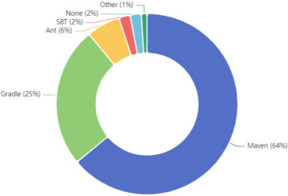
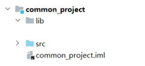
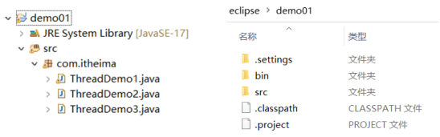
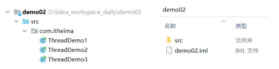
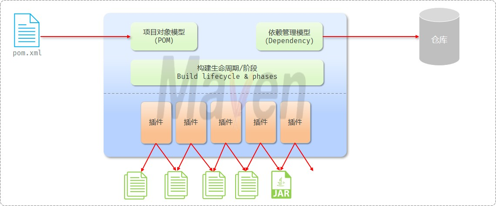
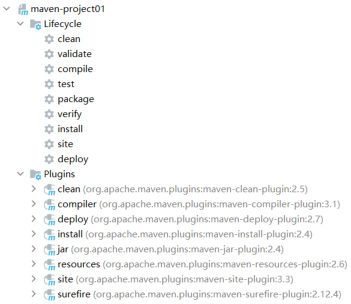
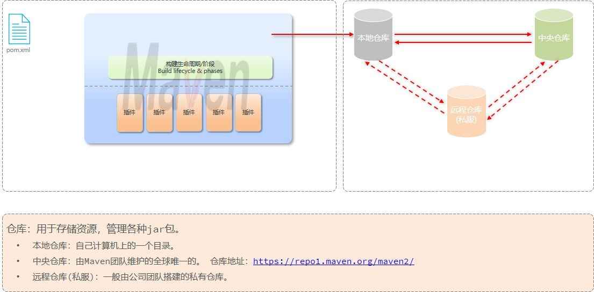

前面 22 篇做的都是**前端**（HTML/CSS/JS/Vue），页面写完就能在浏览器里看到。从这一篇起进入**后端 Web 基础**，第一件事不是写代码，而是先把"**管理和构建 Java 项目的工具**"装上——这就是 Maven。

这一章（PPT 第 15 页给的路线图）分四块：**Maven 概述**、**IDEA 集成 Maven**、**依赖管理**、**单元测试**，后面还有一块 Maven 进阶（分模块设计、继承、聚合、私服）。这一篇只讲第一块的**前半部分**：Maven 是什么、有哪三大作用、几张核心概念图怎么读、仓库是什么。

> [!NOTE]
> 这一章的目录页（PPT 第 14、15 页）把内容分成两层：**Maven 核心** = Maven 概述 / IDEA 集成 Maven / 依赖管理 / 单元测试；**Maven 进阶** = 分模块设计 / 继承 / 聚合 / 私服。"Maven 概述"里只有两节：**介绍**（这一篇）和**安装**（下一篇）。

## 什么是 Maven

PPT 上的定义分两句，第一句最好记：

> **Maven 是一款用于管理和构建 Java 项目的工具，是 Apache 旗下的一个开源项目。**
>
> **Apache Maven 是一个项目管理和构建工具，它基于项目对象模型（POM）的概念，通过一小段描述信息来管理项目的构建。**

拆开看这句话里的三个关键词：

| 关键词 | 说的是什么 |
| --- | --- |
| **管理和构建** | Maven 有两件事：管**依赖**（项目要用到的第三方 jar 包）、跑**构建**（编译、测试、打包、发布） |
| **基于项目对象模型（POM）** | Maven 眼里一个项目就是一个"对象"，用根目录下的 **`pom.xml`** 这个文件来描述它——Maven 读这个文件干活 |
| **一小段描述信息** | 要你写的其实很少：依赖的坐标、打包方式、插件配置，几行就够 |

关于背后的组织，PPT 专门介绍了两句：

- **Apache 软件基金会**：成立于 **1999 年 7 月**，是目前世界上**最大、最受欢迎的开源软件基金会**，也是一个专门为支持开源项目而生的**非盈利性组织**；它的开源项目列表在 <https://www.apache.org/index.html#projects-list>。
- Maven 自己的官网是 **<http://maven.apache.org/>**。

Maven 到底有多主流？PPT 用一张统计图说明问题——**Java 项目构建工具的使用率里 Maven 占了 64%**，是绝对主流：


*图：构建工具使用率统计（PPT 第 13 页）——Maven 64%、Gradle 25%、Ant 6%、SBT 2%、None 2%、Other 1%，所以这门课教的是 Maven*

## Maven 的三大作用

PPT 反复用同一页（第 5、7、10、12 页各有一次）把 Maven 的作用归纳成三条，每次展开讲一条：

| 作用 | PPT 的原话 | 解决什么问题 |
| --- | --- | --- |
| **依赖管理** | 方便快捷的管理项目依赖的资源（**jar 包**） | 不用再手动下载 jar 包、手动拷进项目、缺一个补一个 |
| **项目构建** | 标准化的跨平台（**Linux、Windows、MacOS**）的**自动化项目构建**方式 | 编译、测试、打包、发布不用手工点，也不依赖某个操作系统或某个 IDE |
| **统一项目结构** | 提供**标准、统一**的项目结构 | 不同 IDE 各搞一套目录，换一个工具就要重新认路 |

第 18 页换了个顺序再说一遍（"方便的依赖管理、标准的项目构建流程、统一的项目结构"），指的还是这三件事。

### 作用一：依赖管理

**依赖**就是当前项目运行所需要的 **jar 包**。没有 Maven 的时候，你得自己去网上找 jar、下载、往项目里放；Maven 把这件事变成"**在 `pom.xml` 里写一段坐标描述**"：

```xml
<dependencies>
    <!-- 引入 commons-io 这个依赖：只要写出它的坐标，Maven 自己去下载并管好 -->
    <dependency>
        <groupId>commons-io</groupId>
        <artifactId>commons-io</artifactId>
        <version>2.11.0</version>
    </dependency>
</dependencies>
```

写完之后点一下刷新，Maven 就会把 jar 包下载到**本地仓库**并挂到项目上（这一篇后面讲仓库，具体下载机制在"依赖管理"那一篇）。PPT 第 6 页配的图正是"**项目里那些第三方的 jar 包**"：


*图：PPT 第 6 页讲"依赖管理"时配的项目结构——项目里除了 src 之外还有专门放 jar 包的 lib 目录（老做法是手动往里拷 jar）；Maven 要接管的就是这些"别人写好的资源"*

### 作用二：项目构建

**构建**指的是把源码变成能跑起来的东西这一整套动作。PPT 第 8、9 页把它拆成四步，并在第 9 页补上了对应的英文名（就是后面敲的命令）：

| 构建动作 | 英文（命令里的阶段名） | 干了什么 |
| --- | --- | --- |
| 编译 | **compile** | 把 `.java` 源码编译成 `.class` 字节码文件 |
| 测试 | **test** | 运行单元测试，检查代码对不对 |
| 打包 | **package** | 把编译结果打成可以分发的包（**jar**、war 等） |
| 发布 | **deploy** | 把包发布出去，供别人或别的项目使用 |

PPT 特意加了两个修饰词，这才是 Maven 的价值所在：

- **标准化**：所有 Maven 项目都是同一套动作、同一套命令，不看 IDE 脸色；
- **跨平台（Linux、Windows、MacOS）**：同一套命令三种操作系统下都这么敲；配上"自动化"，就不用再手工点"编译→运行→打包"。

> [!TIP]
> 这四个动作在命令行里就是 `mvn compile`、`mvn test`、`mvn package`、`mvn deploy` 这样一条条命令。为什么敲 `mvn package` 会连编译和测试一起做？这属于**构建生命周期**的规则，后面专门讲生命周期的那一篇会说清。

### 作用三：统一项目结构

PPT 第 11 页把三种 IDE 摆在一起做对比：**Eclipse、MyEclipse、IntelliJ IDEA** 各有一套目录习惯，同样一个 Java 项目，换个工具打开目录长得完全不一样：


*图：Eclipse 里的项目（PPT 第 11 页）——左边是 IDE 视图（`src` 下挂着包和类），右边是磁盘上的真实目录，多出 `bin`、`.settings`、`.classpath`、`.project` 这些 Eclipse 自己的东西*


*图：IntelliJ IDEA 里的同一个项目（PPT 第 11 页）——磁盘上就只有 `src` 和一个 `demo02.iml`，和 Eclipse 那套完全对不上*

Maven 的做法是**定一套标准结构，谁都按这个来**（这也是课程代码工程 `maven-project01` 的样子）：

```text
项目名/
├── pom.xml                 ← Maven 的核心配置文件（项目对象模型）
├── src/                    ← 源码目录
│   ├── main/               ← 主程序（PPT 里说的"主程序"）
│   │   ├── java/           ← 主程序的 Java 代码
│   │   └── resources/      ← 主程序用到的配置文件
│   └── test/               ← 测试程序（PPT 里说的"测试程序"）
│       ├── java/           ← 测试代码
│       └── resources/      ← 测试用的配置文件
└── target/                 ← 构建产物（编译输出、打好的 jar 包都在这儿，由 Maven 生成）
```

> [!IMPORTANT]
> `src/main` 和 `src/test` 的分家是 Maven 项目结构的重点：**主程序放 `main`、测试程序放 `test`**。除了打包时测试代码不会被打进去，更重要的是"测试代码和业务代码分开"——这正是后面讲 JUnit 单元测试时反复强调的优点。

## 核心概念：一张图看懂 Maven

PPT 第 19 页把前面这些概念画成了一张图（**pom.xml → 项目对象模型 / 依赖管理模型 → 构建生命周期与阶段 → 插件 → 仓库**），这是这一章最该记住的一张：


*图：Maven 的核心概念图（PPT 第 19 页；原页是 PPT 里用图形拼的矢量图，这里按原样导成图片）——左边 `pom.xml` 是入口，蓝色框里装着 POM、依赖管理模型、构建生命周期/阶段和五个"插件"，右上是仓库，最下面一排是这些插件作用到的东西（源文件与 jar 包）*

按从左到右的顺序，五个概念各说一句话：

| 概念 | 英文 | 一句话理解 | 在哪儿看得见 |
| --- | --- | --- | --- |
| **项目对象模型** | POM（Project Object Model） | Maven 把项目抽象成一个对象，**`pom.xml` 就是这个模型**：项目的坐标、依赖、打包方式、插件全写在里面 | 项目根目录的 `pom.xml` |
| **依赖管理模型** | Dependency | 用**坐标**（groupId + artifactId + version）声明依赖，Maven 负责去仓库取、去管版本冲突 | `pom.xml` 里的 `<dependencies>` |
| **构建生命周期/阶段** | Build lifecycle & phases | 把"构建"抽象成一串**有顺序的阶段**（clean、compile、test、package、install、deploy…），**跑后面的阶段会自动把前面的跑一遍** | `mvn` 命令、IDEA 右侧 Maven 面板 |
| **插件** | Plugin | **每个阶段真正干活的执行者**：编译靠编译插件、跑测试靠 surefire 插件、打包靠 jar 插件…… | IDEA Maven 面板的 Plugins 列表 / `pom.xml` 的 `<build>` |
| **仓库** | Repository | 存放资源（各种 jar 包）的地方，依赖就是从这里来的 | 本地仓库目录、私服、中央仓库 |

"阶段"和"插件"的关系，在真实的 IDEA Maven 面板里一眼就能看出来——左边是**阶段**（Lifecycle），右边那串是**插件**（Plugins），点阶段其实就是在调插件：


*图：IDEA 右侧 Maven 面板（PPT 第 47 页）——Lifecycle 里列的是 `clean`、`validate`、`compile`、`test`、`package`、`verify`、`install`、`site`、`deploy` 这些阶段；Plugins 里列的是 `clean`、`compiler`、`deploy`、`install`、`jar`、`resources`、`site`、`surefire` 这些插件，括号里是插件的坐标和版本*

> [!NOTE]
> 这张图里的"阶段"下一层怎么排、每个阶段到底做什么，是后面生命周期那一篇的内容；这一篇只要记住**这几个概念是配合起来工作的**：`pom.xml` 描述项目 → 依赖模型从仓库取 jar → 命令触发生命周期阶段 → 阶段由插件执行。

## 仓库：jar 包放在哪里

PPT 第 20 页在概念图旁边专门画了仓库这一块：


*图：Maven 的仓库体系（PPT 第 20 页）——左边是 pom.xml 和它驱动的构建过程（生命周期/阶段 + 插件），右边是三类仓库：本地仓库、中央仓库、远程仓库（私服），它们之间由箭头连起来表示依赖从哪儿取*

**仓库：用于存储资源，管理各种 jar 包。** 一共三类：

| 仓库 | PPT 的定义 | 谁维护 |
| --- | --- | --- |
| **本地仓库** | 自己计算机上的一个目录 | 你自己（装 Maven 时可以指定路径，下一篇就配这个） |
| **中央仓库** | 由 Maven 团队维护的**全球唯一**的仓库 | Maven 官方团队，地址 <https://repo1.maven.org/maven2/> |
| **远程仓库（私服）** | 一般由**公司团队搭建**的私有仓库 | 公司（团队内部的 jar 不能放公网，就放这里） |

找依赖（jar）的顺序是 PPT 第 21 页那组"必答问答"的重点，**三步走**：

```text
① 本地仓库 ──没有──▶ ② 远程仓库（私服） ──没有──▶ ③ 中央仓库
     │                                                   │
     └──────── 下载到的 jar 会存进本地仓库，下次直接用 ◀────┘
```

1. **本地仓库（1）**：先看自己电脑上的仓库目录里有没有，有就直接用；
2. **远程仓库（2）**：本地没有就问**私服**（公司搭的），它通常还能代理中央仓库；
3. **中央仓库（3）**：私服也没有（或者没配私服），最后才去**中央仓库**找；
4. 找到之后下载的 jar 会**存回本地仓库**，下次就不用再远程取了——这也是"第一次建项目慢、之后快"的原因。

### 这一节的"必答问答"

PPT 第 21 页是一页问答页，三个问题正好把这一节收口，**这是要能直接答出来的**：

| PPT 的问题 | 答案 |
| --- | --- |
| Maven 中的仓库用来存储什么的? | **jar 包**（存储和管理各种 jar 包 / 资源） |
| Maven 中有哪几类仓库? | **本地仓库**、**远程仓库（私服）**、**中央仓库** |
| 查找依赖（jar）的顺序是什么样的? | 本地仓库（**1**）→ 远程仓库（**2**）→ 中央仓库（**3**） |

> [!TIP]
> 中央仓库地址单独记一下：**<https://repo1.maven.org/maven2/>**。下一篇配阿里云私服，配的就是"把中央仓库换成国内镜像"，因为直连中央仓库下载很慢。

## 小结

| 问题 | 答案 |
| --- | --- |
| Maven 是什么？ | **一款用于管理和构建 Java 项目的工具**，Apache 旗下的开源项目，**基于项目对象模型（POM）**，通过一小段描述信息管理项目的构建 |
| Maven 有哪三大作用？ | **依赖管理**（管理 jar 包）、**项目构建**（标准化的跨平台自动化构建）、**统一项目结构**（标准统一的项目结构） |
| 项目构建有哪四个动作？ | **编译 compile**、**测试 test**、**打包 package**、**发布 deploy** |
| Maven 项目的核心配置文件是什么？ | 根目录下的 **`pom.xml`**（项目对象模型 POM 的载体） |
| 概念图上有哪几个核心概念？ | **POM**、**依赖管理模型（Dependency）**、**构建生命周期/阶段**、**插件**、**仓库** |
| 仓库有哪三类？ | **本地仓库**（自己电脑上的目录）、**远程仓库/私服**（公司团队搭建）、**中央仓库**（Maven 团队维护，全球唯一，<https://repo1.maven.org/maven2/>） |
| 查找依赖的顺序？ | **本地仓库（1）→ 远程仓库（2）→ 中央仓库（3）**，下载后存回本地仓库 |
| Maven 的主程序、测试程序分别放哪？ | 主程序放 **`src/main/java`**、测试程序放 **`src/test/java`** |

## 相关

- [上一篇：实战-Vue+Axios员工列表](/posts/编程学习/javaweb学习笔记/22-实战-vueaxios员工列表/)
- [下一篇：Maven的安装与配置](/posts/编程学习/javaweb学习笔记/24-maven的安装与配置/)

## 练习题

### 一、知识回顾（读完直接做下面的实践题）

1. Maven 的定义：**一款用于管理和构建 Java 项目的工具**，是 **Apache 旗下的开源项目**；更完整的说法是"一个项目管理和构建工具，**基于项目对象模型（POM）**的概念，通过一小段描述信息来管理项目的构建"，官网 **<http://maven.apache.org/>**
2. **Apache 软件基金会**：成立于 **1999 年 7 月**，是目前世界上最大、最受欢迎的开源软件基金会，专门为支持开源项目而生的**非盈利性组织**
3. Maven 的**三大作用**：**依赖管理**（方便快捷的管理项目依赖的资源 jar 包）、**项目构建**（标准化的跨平台 Linux/Windows/MacOS 的**自动化**项目构建方式）、**统一项目结构**（提供标准、统一的项目结构）
4. 项目构建的四个动作及英文名：**编译（compile）→ 测试（test）→ 打包（package）→ 发布（deploy）**
5. **POM（项目对象模型）**：Maven 把项目抽象成一个对象模型，用根目录下的 **`pom.xml`** 描述项目的坐标、依赖、插件等信息，Maven 读它来构建
6. **依赖管理模型（Dependency）**：用**坐标**声明项目需要的 jar 包，Maven 自动从仓库获取并管理
7. **构建生命周期/阶段（Build lifecycle & phases）**：把构建过程抽象成**有顺序的阶段**，**同一套生命周期中运行后面的阶段时，前面的阶段都会运行**；而每个阶段真正干活的是**插件（Plugin）**——PPT 概念图上并排画了多个"插件"，在 IDEA 的 Maven 面板里**左边 Lifecycle 是阶段、右边 Plugins 是插件**
8. **仓库**的定义与三类：仓库是**用于存储资源、管理各种 jar 包**的地方；三类是**本地仓库**（自己计算机上的一个目录）、**远程仓库（私服）**（一般由公司团队搭建的私有仓库）、**中央仓库**（由 Maven 团队维护的**全球唯一**仓库，地址 **<https://repo1.maven.org/maven2/>**）
9. **查找依赖的顺序**：**本地仓库（1）→ 远程仓库（2）→ 中央仓库（3）**；找到后下载的 jar 会存进本地仓库，下次直接用
10. Maven 的标准项目结构与本章路线图：**主程序**放 **`src/main/java`**（配置文件放 `src/main/resources`），**测试程序**放 **`src/test/java`**（配置放 `src/test/resources`），构建产物在 **`target/`**，根目录下有 **`pom.xml`**；这一章的**Maven 核心** = Maven 概述 / IDEA 集成 Maven / 依赖管理 / 单元测试，**Maven 进阶** = 分模块设计 / 继承 / 聚合 / 私服

### 二、概念自测

- [ ] **2-1 用一句话说清"Maven 是什么"，并解释里面的"POM"指什么**
  要求：说出它管哪两件事（管理 / 构建），并指出 POM 在项目里对应哪个文件。

  > [!TIP]- 提示（先自己想，实在想不出再点开）
  > **一级 · 思路**：定义里有"管理和构建"两个动词，还有"基于……概念"和"一小段描述信息"
  > **二级 · 角度**：这个"描述信息"写在哪个文件里？这个文件在项目根目录叫什么名字？

  > [!TIP]- 参考答案（做完再点开）
  > **2-1** Maven 是一款**用于管理和构建 Java 项目的工具**（Apache 旗下的开源项目），它**基于项目对象模型（POM）**的概念、通过一小段描述信息来管理项目的构建。POM 在项目里对应的就是根目录下的 **`pom.xml`**——项目叫什么、依赖哪些 jar、用什么插件，全写在这一个文件里。

- [ ] **2-2 三大作用分别解决什么问题？各举一个"没有 Maven 时"的麻烦**
  要求：三条都说到，每条配一个具体场景（找 jar / 编译打包 / 目录结构）。

  > [!TIP]- 提示（先自己想，实在想不出再点开）
  > **一级 · 思路**：从"要用的第三方库""把源码变成能跑的东西""项目目录长什么样"三个角度各想一层
  > **二级 · 角度**：依赖管理对应"下载和拷 jar"，项目构建对应"编译/测试/打包/发布"，统一项目结构对应"Eclipse、MyEclipse、IDEA 各一套目录"

  > [!TIP]- 参考答案（做完再点开）
  > **2-2** ①**依赖管理**：没有 Maven 要自己去官网找 commons-io、Spring 这些 jar 下载、再拷进项目的 lib 目录，版本还得自己对齐；有了 Maven 只在 `pom.xml` 里写一段坐标就完事。②**项目构建**：没有 Maven 得在 IDE 里手工点编译、点运行、再想办法打包；有了 Maven，`mvn compile / test / package / deploy` 这几个标准动作在 Linux、Windows、MacOS 上都能自动化跑。③**统一项目结构**：没有 Maven 时 Eclipse 的项目里有 `bin`、`.classpath`、`.project`，IDEA 的项目里是 `.iml`，换工具就得重新认路；有了 Maven 一律是 `src/main/java`、`src/test/java` 那一套。

- [ ] **2-3 判断并改错：依赖查找顺序是"中央仓库 → 本地仓库 → 私服"，对吗？**
  要求：先判断，再写出正确顺序，并说明为什么顺序不能反。

  > [!TIP]- 提示（先自己想，实在想不出再点开）
  > **一级 · 思路**：想想"自己电脑上的目录"和"要联网的仓库"哪个更快、更该先看

  > [!TIP]- 参考答案（做完再点开）
  > **2-3** 错。正确顺序是**本地仓库（1）→ 远程仓库/私服（2）→ 中央仓库（3）**。顺序反了意味着每引一个依赖都要先上网找一遍——本地明明已经有了（比如上次下载过）还要联网，又慢又浪费；而且实际项目里公司内部 jar 只放在私服上，根本不走中央仓库，所以先从本地查、再问私服、最后才是中央仓库。

- [ ] **2-4 把"pom.xml、依赖管理模型、构建生命周期/阶段、插件、仓库"串成一段话说明它们怎么配合**
  要求：五个概念都用上，说清"谁读谁、谁干活、谁提供资源"。

  > [!TIP]- 提示（先自己想，实在想不出再点开）
  > **一级 · 思路**：按"描述项目 → 声明依赖 → 触发阶段 → 执行插件 → 取出 jar"这条线走一遍
  > **二级 · 方法**：pom.xml 描述项目（POM）；`<dependencies>` 里是依赖管理模型；`mvn package` 触发生命周期阶段；阶段由插件执行；jar 包来自仓库

  > [!TIP]- 参考答案（做完再点开）
  > **2-4** Maven 读项目根目录的 **`pom.xml`**（它就是**项目对象模型 POM** 的载体），从中知道这个项目是什么、需要什么；项目声明的依赖写在 **`<dependencies>`** 里，属于**依赖管理模型**——靠坐标去**仓库**取：先看**本地仓库**，没有再问**私服**，最后才去**中央仓库**。要构建时，一条 `mvn package` 触发**构建生命周期**里的某个**阶段**，阶段前面的阶段会一起跑；而每个阶段真正干活的是**插件**（编译插件、测试插件、打包插件），最后产出 jar 包。
