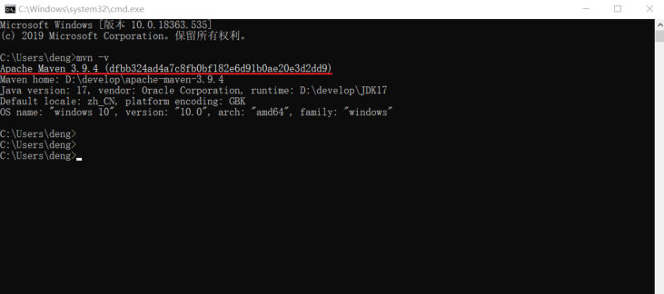
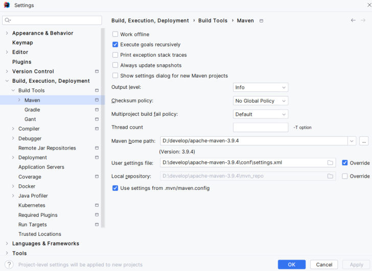

[上一篇](/posts/编程学习/javaweb学习笔记/23-maven是什么与核心概念/)说清了 Maven 是什么、仓库是什么；这一篇把 Maven **装到自己的电脑上**。

PPT 第 23 页给的就是**四步**（安装 + 三处配置），第 24 页再给一条命令验证。注意：**Maven 不用"安装程序"，它是解压即用**——难的不是装，而是**三处配置要配对**（PPT 第 25 页专门用一页强调过）。

```text
① 解压 zip → ② 配本地仓库 → ③ 配阿里云私服 → ④ 配环境变量 → 验证 mvn -v
```

## 安装包里有什么

课程素材在 `资料\01. 安装包\`，一共三个文件：

| 文件 | 是什么 |
| --- | --- |
| **`apache-maven-3.9.4-bin.zip`** | Maven **3.9.4** 的安装包（解压即用）；课程全程用的就是这个版本 |
| **`阿里云.txt`** | 阿里云私服的镜像配置原文，第 3 步直接照抄进 settings.xml |
| **`del.bat`** | 一行小工具：`del /s *.lastUpdated`，用来批量删除依赖下载失败留下的 `xxx.lastUpdated` 文件（对应这一章最后的"常见问题"那一节，现在知道它在哪儿就行） |

## 第 1 步：解压安装包

把 `apache-maven-3.9.4-bin.zip` 解压到一个固定目录，课程里解压到了 `D:\develop\apache-maven-3.9.4`。解压后目录里的东西不多，先认清这几个：

| 目录/文件 | 干什么用的 |
| --- | --- |
| `bin\` | Maven 的命令都在这里（`mvn.cmd` 是 Windows 用的），第 4 步加进 Path 的就是它 |
| `conf\settings.xml` | Maven 的**全局配置文件**——第 2、3 步要改的就是这个文件 |
| `lib\` | Maven 自己运行需要的 jar 包 |
| `boot\` | 启动用的引导类库（`plexus-classworlds`） |
| `README.txt` / `LICENSE` / `NOTICE` | 说明、许可证、版权声明 |

> [!WARNING]
> 解压路径**别带中文、别带空格**（推荐 `D:\develop\...` 这种）。路径里有中文或空格时，后面配环境变量、命令行敲 mvn 都可能出问题，而且报错信息往往看不出真正原因。

## 第 2 步：配置本地仓库

**本地仓库**就是自己电脑上存 jar 包的那个目录（[上一篇](/posts/编程学习/javaweb学习笔记/23-maven是什么与核心概念/)讲的"查找依赖第①步"）。Maven 默认用它自己家目录下的 `.m2\repository`（配置文件里写的默认值是 `${user.home}/.m2/repository`），课程的做法是**改成自己指定的目录**，方便找、也方便清：

```xml
<!-- conf/settings.xml：这一行是 <settings> 的直接子标签，放在原本被注释掉的 localRepository 下面 -->
<settings xmlns="http://maven.apache.org/SETTINGS/1.2.0"
          xmlns:xsi="http://www.w3.org/2001/XMLSchema-instance"
          xsi:schemaLocation="http://maven.apache.org/SETTINGS/1.2.0 https://maven.apache.org/xsd/settings-1.2.0.xsd">

    <!-- 本地仓库：Maven 下载的 jar 包都存到这个目录（PPT 第 23 页给的值） -->
    <localRepository>D:\develop\apache-maven-3.9.4\mvn_repo</localRepository>

    <!-- 下面还有 <mirrors>、<profiles> 等一大堆配置，先不用管 -->
</settings>
```

三个要点：

1. **位置**：`<localRepository>` 是 `<settings>` 的**直接子标签**，和 `<mirrors>`、`<profiles>` 平级——放进它们里面就不生效了；
2. **目录不用提前建**：Maven 第一次下载依赖时会自己创建 `mvn_repo`；
3. **原来的那行是注释**（`<!-- <localRepository>/path/to/local/repo</localRepository> -->`），不用去改它，在它下面加自己的一行即可。

## 第 3 步：配置阿里云私服

为什么非要配这一条？**中央仓库在国外**（<https://repo1.maven.org/maven2/>），直连下载很慢、动不动超时。**镜像（mirror）**的作用就是"**把某个仓库的请求换一个地址去访问**"——用阿里云的国内仓库替中央仓库应答，速度立刻上来。

改的还是 `conf/settings.xml`：在 **`<mirrors>` 标签里加一个 `<mirror>` 子标签**（PPT 第 23 页给的原文，`资料\01. 安装包\阿里云.txt` 里也是它）：

```xml
<!-- 在 <mirrors> 里加这一段：把中央仓库的请求镜像到阿里云 -->
<mirrors>
    <mirror>
        <id>alimaven</id>
        <name>aliyun maven</name>
        <url>http://maven.aliyun.com/nexus/content/groups/public/</url>
        <mirrorOf>central</mirrorOf>
    </mirror>
</mirrors>
```

四个子标签各管什么：

| 子标签 | 含义 | 写的是什么 |
| --- | --- | --- |
| `<id>` | 镜像的**唯一标识** | `alimaven` |
| `<name>` | 给人看的名字 | `aliyun maven` |
| `<url>` | **镜像仓库的地址** | `http://maven.aliyun.com/nexus/content/groups/public/` |
| `<mirrorOf>` | **给哪个仓库做镜像** | `central` 表示"中央仓库都走这个地址" |

> [!NOTE]
> 阿里云后来还提供了一个新地址 **`https://maven.aliyun.com/repository/public`**（协议是 https），`<mirrorOf>` 也常写成 `*`（代表所有仓库都走它）。两种写法都能用：**课程用的是上面 PPT 那一版**，照课程写最省事；用新地址的时候把 `<id>` 同时改一下（例如 `aliyunmaven`）也不会有什么影响。

## 第 4 步：配置环境变量

前两步只是"文件里写了配置"，这一步是"**让操作系统在任何目录下都认识 `mvn` 命令**"。PPT 第 23 页说的是两件事：

1. **`MAVEN_HOME`**：值为 **Maven 的解压目录**；
2. 把 **`bin` 目录加入 `Path`** 环境变量。

```text
MAVEN_HOME = D:\develop\apache-maven-3.9.4          ← 解压目录，不要指到 bin
Path       = ...;%MAVEN_HOME%\bin                   ← 追加（Path 里原有的内容一个都不能删）
```

- `%变量名%` 是 Windows 里"引用另一个环境变量"的写法，所以 Path 里写 `%MAVEN_HOME%\bin` 就不用把长路径再抄一遍；
- `MAVEN_HOME` 自己也有用：别人（比如 IDEA、其他工具）想找 Maven 装在哪儿时看的就是它。

> [!WARNING]
> 改环境变量的顺序：**先建 `MAVEN_HOME`，再从 Path 里引用它**；改完必须**重开命令行窗口**（已打开的窗口读的还是旧环境变量），IDEA 也一样要重启。

## 验证：`mvn -v`

PPT 第 24 页的验证方式就一条命令——在任意目录打开命令行，敲：

```bash
mvn -v
```

能打印出下面这样的信息，就说明装好了（这是 PPT 第 24 页的截图，在 `C:\Users\deng>` 下敲完命令后连着出现了好几行输出）：


*图：PPT 第 24 页的验证截图——敲 `mvn -v` 之后输出的五条信息，红框圈出的是 `Apache Maven 3.9.4 (...)` 这一行（版本号）*

输出内容逐行读（课程环境的输出）：

```text
Apache Maven 3.9.4 (dfbb324ad4a7c8fb0bf182e6d91b0ae20e3d2dd9)
Maven home: D:\develop\apache-maven-3.9.4
Java version: 17, vendor: Oracle Corporation, runtime: D:\develop\JDK17
Default locale: zh_CN, platform encoding: GBK
OS name: "windows 10", version: "10.0", arch: "amd64", family: "windows"
```

| 行 | 说明什么 |
| --- | --- |
| `Apache Maven 3.9.4 (...)` | Maven 的**版本号**（括号里是这一版的构建校验码），对上 PPT 里说的 3.9.4 就没装错 |
| `Maven home: D:\develop\apache-maven-3.9.4` | **Maven 在哪儿**——这里正是解压目录，说明 `MAVEN_HOME`/Path 指对了 |
| `Java version: 17 ... runtime: D:\develop\JDK17` | Maven 用的 **JDK**（Maven 自己是 Java 写的，必须有 JDK；课程环境是 JDK 17） |
| `Default locale` / `platform encoding` | 语言与默认编码（`zh_CN`、`GBK`），后面遇到中文乱码会用到这一行 |
| `OS name: "windows 10" ... family: "windows"` | 操作系统信息 |

> [!TIP]
> 只输出上面这一小段、**不下载任何东西**，这是 `mvn -v` 的特点——所以它是"装没装好"的标准检查动作。真实验证一次（本机 Maven 3.9.14）：
>
> ```text
> Apache Maven 3.9.14 (996c630dbc656c76214ce58821dcc58be960875b)
> Maven home: A:\develop\maven\apache-maven-3.9.14
> Java version: 17.0.3.1, vendor: Oracle Corporation, runtime: A:\develop\Java\jdk17
> Default locale: zh_CN, platform encoding: GBK
> OS name: "windows 11", version: "10.0", arch: "amd64", family: "windows"
> ```
>
> 版本号、安装路径、JDK 路径都是自己那台机器上的值——**换台机器、换个版本，这几行就会变**，判断标准是"能不能打印出来、路径对不对"，不是"必须和 PPT 一模一样"。

## 配置时的注意点（这段最容易错）

PPT 第 25 页只有一句话：

> **注意：配置 settings.xml 中的本地仓库、私服时，一定要仔细，注意配置信息的位置和标签。**

把这句话展开成一张"错在哪儿、会怎样"的表——配完不生效时对着查：

| 常见的错 | Maven 的反应 |
| --- | --- |
| **位置错**：把 `<localRepository>` 写进了 `<mirrors>` 或 `<profiles>` 里面 | 打一条**警告** `Unrecognised tag: 'localRepository'`（"不认识的标签"），这条配置被**直接忽略**——本地仓库还是默认的 `.m2\repository`，构建照样能跑，所以最容易被忽略 |
| **位置错**：`<mirror>` 写到了 `<mirrors>` 外面（比如塞进 `<localRepository>` 旁边） | 同样被当成"不认识的标签"忽略，镜像不生效，下载依旧走中央仓库——**症状是"配了阿里云还是很慢"** |
| **标签名错**：`<localrepository>`、`<mirro>` 这种大小写/拼写错误 | XML 标签**区分大小写**，Maven 会把它们当"不认识的标签"，同样是警告 + 不生效（`Unrecognised tag: 'localrepository'`） |
| **漏标签**：`<mirror>` 里少了 `<mirrorOf>` | 这次是**硬错误**，Maven 直接拒绝执行：`'mirrors.mirror.mirrorOf' for alimaven is missing` + `Error executing Maven.` |
| **改错文件**：改的是解压目录外的另一份 settings.xml（或 IDEA 自带的那份） | 改的那份没被用到，等于没改——所以要改的是 **`解压目录\conf\settings.xml`** |
| **没重启**：改完环境变量直接在原来开着的窗口里敲 `mvn -v` | 提示"`mvn` 不是内部或外部命令"，其实配置是对的，重开一个窗口就好 |

这就是"一定要仔细"的原因：**位置和标签写错时，Maven 大多只给一条警告就过去了**，不会停下来告诉你"你的本地仓库没配上"。下面是本机实测出来的两种报错原文（故意把配置写错跑出来的）：

```text
# ① <localRepository> 塞进 <mirrors> 里：警告 + 配置被忽略
[WARNING] Some problems were encountered while building the effective settings
[WARNING] Unrecognised tag: 'localRepository' (position: START_TAG seen ...<mirrors>
    <localRepository>... @6:22)  @ ...\settings.xml, line 6, column 22

# ② <mirror> 里少了 <mirrorOf>：直接报错、Maven 不跑
[ERROR] Error executing Maven.
[ERROR] 2 problems were encountered while building the effective settings
[ERROR] 'mirrors.mirror.mirrorOf' for alimaven is missing @ ...\settings.xml
```

> [!NOTE]
> 补充一句 settings.xml 的两个位置：**`解压目录\conf\settings.xml`** 是**全局**配置（这台机器上所有 Maven 使用），**`用户目录\.m2\settings.xml`** 是**当前用户**的配置（默认没有这个文件）。课程统一改前者——改一处、全局生效，也方便以后换版本时跟着目录走。

### 怎么确认配置真的生效了（课程外的补充）

配完 settings.xml 之后，如果想知道"Maven 最终到底用了哪个本地仓库、哪个镜像"，可以敲这两条命令（本机实跑输出，值会随自己机器变）：

```bash
mvn help:evaluate -Dexpression=settings.localRepository -DforceStdout
mvn help:effective-settings
```

第一条只打印**生效的本地仓库路径**，第二条打印**整份生效的 settings**（能找到自己写的那两段）：

```text
A:\develop\maven\apache-maven-3.9.14\mvn_repo        ← localRepository 生效的结果

  <localRepository>A:\develop\maven\apache-maven-3.9.14\mvn_repo</localRepository>
  <mirrors>
    <mirror>
      <mirrorOf>*</mirrorOf>
      <name>阿里云公共仓库</name>
      <url>https://maven.aliyun.com/repository/public</url>
      <id>aliyunmaven</id>
    </mirror>
  </mirrors>
```

这两条输出的意义是"**不用去猜配置有没有被读到**"：`localRepository` 显示的不是自己写的目录，就说明位置或标签写错了；`mirrors` 里看不到自己的镜像，说明 `<mirror>` 没放进 `<mirrors>`。

## 配完怎么核对

配置写完之后，**IDEA** 里能一眼看到三个值对不对（IDEA 的集成下一篇细讲，这里只当"核对工具"用）：`Settings → Build, Execution, Deployment → Build Tools → Maven`：


*图：PPT 第 28 页的 IDEA 全局配置界面——`Maven home path` 指到解压目录 `D:\develop\apache-maven-3.9.4`、`User settings file` 指向 `conf\settings.xml`、`Local repository` 显示 `D:\develop\apache-maven-3.9.4\mvn_repo`（三个路径正好对应这一篇的步骤 1/2/3）*

自检清单（都打勾就算装好了）：

- [ ] 解压目录里能看到 `bin`、`conf`、`lib`、`boot` 四个目录；
- [ ] `conf\settings.xml` 里 `<localRepository>` 写的是自己的目录，且**在 `<settings>` 下一级**；
- [ ] `<mirrors>` 里有 `<mirror>`（含 id / name / url / mirrorOf 四个子标签）；
- [ ] 环境变量里 `MAVEN_HOME` 指向解压目录，Path 里追加了 `%MAVEN_HOME%\bin`；
- [ ] **新开**一个命令行窗口，`mvn -v` 能打印版本且 `Maven home` 是自己的解压目录。

## 小结

| 问题 | 答案 |
| --- | --- |
| Maven 怎么装？ | 解压 `apache-maven-3.9.4-bin.zip` 到固定目录（路径别带中文空格），**不用安装程序** |
| 本地仓库怎么配？ | 改 **`conf\settings.xml`**，把 **`<settings>` 的直接子标签 `<localRepository>`** 设成自己的目录（如 `D:\develop\apache-maven-3.9.4\mvn_repo`），默认值是 `${user.home}/.m2/repository` |
| 阿里云私服怎么配？ | 在 **`<mirrors>`** 里加一个 **`<mirror>`**：`id=alimaven`、`name=aliyun maven`、`url=http://maven.aliyun.com/nexus/content/groups/public/`、`mirrorOf=central` |
| 为什么要配私服/镜像？ | 中央仓库在国外，直连下载慢；镜像把请求换到国内的阿里云仓库 |
| 环境变量配什么？ | **`MAVEN_HOME`** = 解压目录；**`Path`** 里追加 **`%MAVEN_HOME%\bin`** |
| 怎么验证？ | 新开命令行敲 **`mvn -v`**，看版本号与 `Maven home`（课程环境是 3.9.4 / JDK 17） |
| 最容易错在哪？ | **配置信息的位置和标签**（PPT 第 25 页）：`<localRepository>` 要是 `<settings>` 的直接子标签、`<mirror>` 要写在 `<mirrors>` 里、标签名大小写别写错 |

## 相关

- [上一篇：Maven是什么与核心概念](/posts/编程学习/javaweb学习笔记/23-maven是什么与核心概念/)
- [JavaWeb课程导学（后端基础这一部分的 Maven、HTTP、MySQL 等安排）](/posts/编程学习/javaweb学习笔记/01-javaweb课程导学/)

## 练习题

### 一、知识回顾（读完直接做下面的实践题）

1. Maven **不用安装程序**：解压 `apache-maven-3.9.4-bin.zip` 到固定目录即可；课程解压到 `D:\develop\apache-maven-3.9.4`，**路径别带中文和空格**
2. 解压目录里的四个关键目录：**`bin`**（`mvn` 命令）、**`conf`**（`settings.xml` 配置文件）、**`lib`**（Maven 自己的 jar）、**`boot`**（引导类库）
3. 安装四步：**解压** → **配本地仓库** → **配阿里云私服** → **配环境变量**，最后 `mvn -v` 验证
4. 本地仓库配置：改 **`conf\settings.xml`**，`<localRepository>D:\develop\apache-maven-3.9.4\mvn_repo</localRepository>`；**默认值是 `${user.home}/.m2/repository`**；目录不用提前建，Maven 自己创建
5. 阿里云私服配置：在 **`<mirrors>`** 标签里加 `<mirror>` 子标签，四个子标签是 **`<id>alimaven</id>`**、**`<name>aliyun maven</name>`**、**`<url>http://maven.aliyun.com/nexus/content/groups/public/</url>`**、**`<mirrorOf>central</mirrorOf>`**
6. **`<mirrorOf>` 的含义**：这个镜像**给哪个仓库用**——`central` 就是给中央仓库做镜像（把下载请求换到阿里云），`*` 表示所有仓库都走它
7. 环境变量：**`MAVEN_HOME`** = Maven 的解压目录（不是 `bin` 目录）；再把 **`%MAVEN_HOME%\bin`** 追加进 **`Path`**（Path 里原有内容不能删）
8. 验证命令 **`mvn -v`**，输出里的关键信息：**版本号**（课程是 3.9.4）、**`Maven home`**（应指向解压目录）、**`Java version` / `runtime`**（Maven 用的 JDK，课程是 17）；它**不下载任何东西**，是标准的检查动作
9. **配置注意点**（PPT 第 25 页）：注意配置信息的**位置和标签**——`<localRepository>` 必须是 `<settings>` 的**直接子标签**、`<mirror>` 必须写在 **`<mirrors>` 里**、XML 标签**区分大小写**写错就不生效；settings.xml 也有两个位置：**`解压目录\conf\settings.xml`**（全局，课程改这份）和 **`用户目录\.m2\settings.xml`**（当前用户）；改完配置或环境变量要**重启命令行窗口和 IDEA** 才生效
10. 安装包里另外两个文件：**`阿里云.txt`**（镜像配置原文）、**`del.bat`**（内容是一行 `del /s *.lastUpdated`，批量删依赖下载失败留下的 `.lastUpdated` 文件）

### 二、动手题

- [ ] **2-1 写出 settings.xml 里的两处配置**
  在练习文件给出的 settings 骨架里补两处配置：
  1. 把**本地仓库**指到 `D:\develop\apache-maven-3.9.4\mvn_repo`；
  2. 加一个**阿里云私服**（镜像中央仓库）：id 叫 `alimaven`、显示名 `aliyun maven`、地址 `http://maven.aliyun.com/nexus/content/groups/public/`。
  配置要放在**正确的位置和层级**上；写完后校验一下这个文件仍然是合法的 XML。
  （练习文件 `test_24_本地仓库与私服配置.xml` 里已经给了 settings 骨架和写作区。）

  > [!TIP]- 提示（先自己想，实在想不出再点开）
  > **一级 · 思路**：两处配置在两个不同的位置——一处和 `<mirrors>` 平级，一处写在 `<mirrors>` 里面
  > **二级 · 方法**：本地仓库用 `<localRepository>`（`<settings>` 的直接子标签）；镜像要用 `<mirrors>` 包住 `<mirror>`，`<mirror>` 里放 `<id>` / `<name>` / `<url>` / `<mirrorOf>` 四个子标签，`<mirrorOf>` 写 `central`
  > **三级 · 骨架**：`<localRepository>____</localRepository>` / `<mirrors><mirror><id>____</id><name>____</name><url>____</url><mirrorOf>____</mirrorOf></mirror></mirrors>`

  > [!TIP]- 参考答案（做完再点开）
  > ```xml
  > <settings xmlns="http://maven.apache.org/SETTINGS/1.2.0"
  >           xmlns:xsi="http://www.w3.org/2001/XMLSchema-instance"
  >           xsi:schemaLocation="http://maven.apache.org/SETTINGS/1.2.0 https://maven.apache.org/xsd/settings-1.2.0.xsd">
  >
  >     <!-- ① 本地仓库：<settings> 的直接子标签，和 <mirrors> 平级 -->
  >     <localRepository>D:\develop\apache-maven-3.9.4\mvn_repo</localRepository>
  >
  >     <!-- ② 阿里云私服：写在 <mirrors> 里面 -->
  >     <mirrors>
  >         <mirror>
  >             <id>alimaven</id>
  >             <name>aliyun maven</name>
  >             <url>http://maven.aliyun.com/nexus/content/groups/public/</url>
  >             <mirrorOf>central</mirrorOf>
  >         </mirror>
  >     </mirrors>
  >
  > </settings>
  > ```
  > 检查点：① 每个标签都正确闭合、能作为合法 XML 解析（练习文件可以直接用浏览器打开看有没有报错）；② `<localRepository>` **不在** `<mirrors>` 里面；③ `<mirror>` 的四个子标签一个不少、拼写大小写都对；④ 用 IDEA 的 `Settings → Build Tools → Maven` 核对，`Local repository` 应该显示 `...\mvn_repo`。

- [ ] **2-2 环境变量的配置与验证**
  写清楚三件事：
  1. 安装 Maven 需要配的**两个环境变量**分别叫什么、值是什么（第二个变量里怎么引用第一个）；
  2. 配完在命令行里敲什么命令验证，输出里**哪两处**信息能确认"装好了"；
  3. 如果敲验证命令提示 `'mvn' 不是内部或外部命令`，你的**排查顺序**（至少写两条）。
  （练习文件 `test_24_环境变量与验证.txt` 里给了写作区。）

  > [!TIP]- 提示（先自己想，实在想不出再点开）
  > **一级 · 思路**：一个是"告诉系统 Maven 装在哪"，一个是"让系统能找到 mvn 命令"；验证看的是"版本 + 安装路径"
  > **二级 · 方法**：变量名是 `MAVEN_HOME` 和 `Path`；值分别是解压目录、`%MAVEN_HOME%\bin`；验证命令 `mvn -v`；输出里看 `Apache Maven 3.9.4` 这一行和 `Maven home` 这一行；排查先想"窗口重启了吗 → 变量名/路径对不对 → bin 加了没"
  > **三级 · 骨架**：`____ = D:\develop\apache-maven-3.9.4` / `Path 追加 ____\bin` / 验证命令 `____ -v`

  > [!TIP]- 参考答案（做完再点开）
  > **2-2**
  > 1. **两个环境变量**：
  >    - 新建 **`MAVEN_HOME`** = `D:\develop\apache-maven-3.9.4`（Maven 的解压目录，**不要写到 bin**）；
  >    - 在 **`Path`** 里追加 **`%MAVEN_HOME%\bin`**（`%变量名%` 引用上面那个变量；Path 原有内容不能删）。
  > 2. **验证命令**：`mvn -v`。能确认"装好了"的两处信息是 **`Apache Maven 3.9.4 (...)`（版本号那行）** 和 **`Maven home: D:\develop\apache-maven-3.9.4`（安装路径那行）**；这两行对了说明命令能找到、而且指向的就是自己解压的那份。
  > 3. **排查顺序**（任答两条即可）：① 是不是在**旧窗口**里敲的——重开一个命令行再试（环境变量只对新窗口生效）；② `MAVEN_HOME` 是不是写成了 `...\bin` 或路径拼错、Path 里是不是漏了 `%MAVEN_HOME%\bin`；③ 用 `echo %MAVEN_HOME%`、`echo %Path%` 看变量到底有没有生效；④ 解压目录里有没有 `bin\mvn.cmd`（解压不完整就重新解压）；⑤ 实在不行重启电脑再试。
