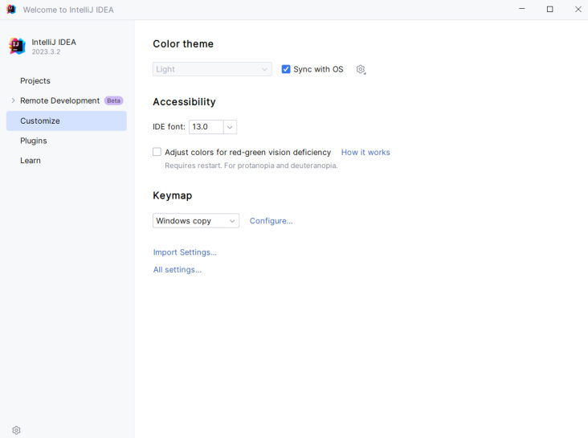
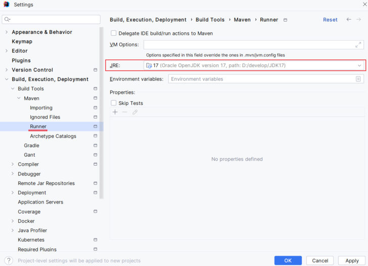
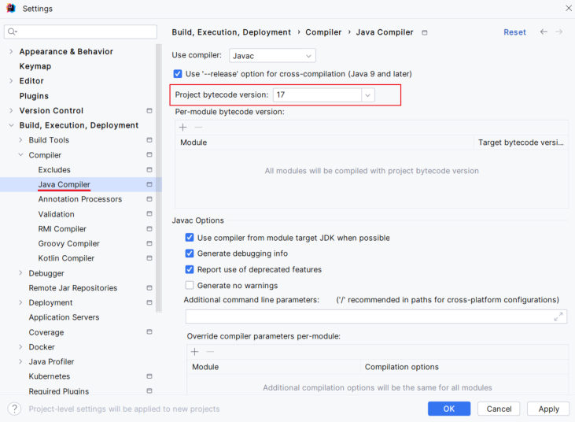
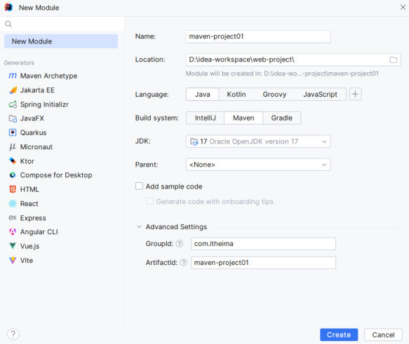
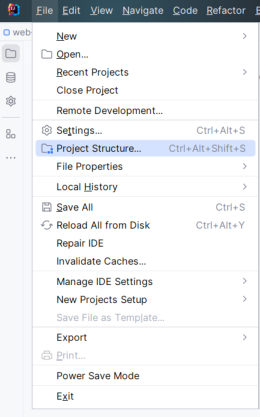
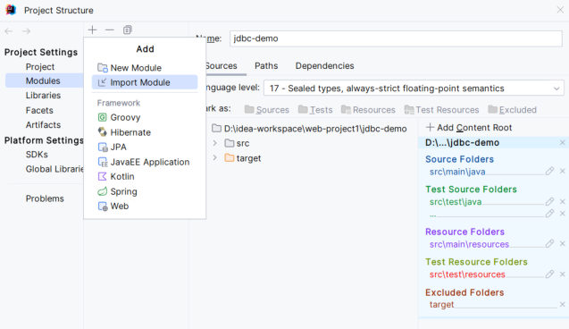
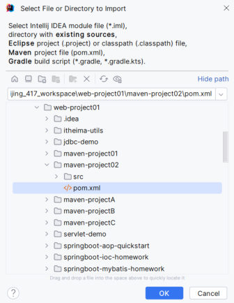
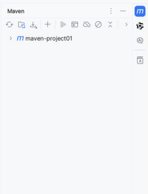
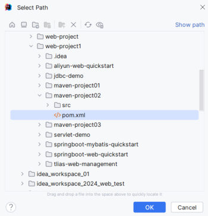

[上一篇](/posts/编程学习/javaweb学习笔记/24-maven的安装与配置/)把 Maven 装到了电脑上、settings.xml 也配好了；但**真正写代码是在 IDEA 里**——所以这一篇要解决"**让 IDEA 用上我装的这份 Maven**"，然后**亲手建一个 Maven 项目跑起来**，再搞清 IDEA 里到处都能看到的"**坐标**"是什么。

PPT 第 27 页的目录页把 IDEA 集成 Maven 拆成三节，这一篇按这个顺序讲（另外把第 28 页的全局配置放在最前面，因为它是后面所有操作的前提）：

| 这一节 | 内容 |
| --- | --- |
| **配置 Maven 环境（全局）** | 三个路径：Maven 安装目录、Maven 配置文件（settings.xml）、Maven 仓库目录 |
| **创建 Maven 项目** | New Module → 选 Maven → 填写模块信息 → 写 HelloWorld 并运行 |
| **Maven 坐标** | groupId / artifactId / version 的含义与写法、SNAPSHOT 与 RELEASE |
| **导入 Maven 项目** | 两种导入方式 + 两条建议 |

## 配置 Maven 环境（全局）

IDEA **自己带了一个 Maven**（安装包里内置的那份，设置页里叫 Bundled Maven，默认本地仓库是 `C:\Users\你的用户名\.m2\repository`）。要让它用**自己装的那份 3.9.4 + 自己配的 settings.xml + 自己指定的本地仓库**，就要在设置里**指三个路径**（PPT 第 28 页给的就是这三项）：

| 设置项 | 指向什么 | 课程环境的值 |
| --- | --- | --- |
| **Maven home path** | Maven 的**安装目录**（第 1 步解压出来的那个目录） | `D:\develop\apache-maven-3.9.4` |
| **User settings file** | **`conf\settings.xml`**（改过本地仓库和阿里云私服的那份） | `D:\develop\apache-maven-3.9.4\conf\settings.xml` |
| **Local repository** | **本地仓库目录** | `D:\develop\apache-maven-3.9.4\mvn_repo` |

> [!IMPORTANT]
> 后两项会**跟着 settings.xml 自动读出来**——但前提是把它指对。IDEA 的界面上每项右边都有一个 **`Override` 勾选框**：**不勾就跟随 Maven 自己的配置（推荐）**，勾上才是"不管 settings.xml 怎么写、IDEA 这里强行用我填的值"。三个路径要么全不勾（都听 settings.xml 的），要么勾了就把值填到和 settings.xml 一致，**不要一半一半**——不然 IDEA 构建用的仓库和命令行 `mvn` 用的仓库会变成两个地方，出现"命令行能跑、IDEA 说找不到依赖"这种怪事。

设置走的是"**全局**"这一档，打开方式在欢迎页的 **Customize → All settings...**（PPT 第 28 页第一张图点的就是这个）：


*图：PPT 第 28 页的入口操作——IDEA 欢迎页左侧 Customize，右侧最下面点 `All settings...` 进全局设置（项目里则是 `File → Settings`）*

进去之后按 **`Build, Execution, Deployment → Build Tools → Maven`** 展开，就是三个路径所在的页面：


*图：PPT 第 28 页的核心配置页——`Maven home path` = 解压目录、`User settings file` = `conf\settings.xml`（右侧 Override 已勾选）、`Local repository` = `mvn_repo`，三项要和 settings.xml 里的配置对得上*

> [!NOTE]
> 页面最下面那行小字写着 **"Project-level settings will be applied to new projects."**（项目级设置会应用到新项目）——意思是**在这里配一次，之后新建的 Maven 项目都按这套来**，不用每个项目重配。这就是 PPT 把这一步叫"全局"的原因。

同一次配置里 PPT 还顺手设了另外两项（第 28 页的后两张图）——**它们决定"用哪个 JDK 跑 Maven""编译出来的字节码是几版"**：


*图：PPT 第 28 页——`Maven → Runner` 页里的 `JRE` 选 **17（Oracle OpenJDK version 17）**，也就是"IDEA 调 Maven 时用 JDK 17"，和 `mvn -v` 里那行 `Java version: 17` 对得上*


*图：PPT 第 28 页——`Compiler → Java Compiler` 页里的 `Project bytecode version` 也选 **17**，即"编译出来的 .class 是 Java 17 的字节码"，与 pom.xml 里 `maven.compiler.source/target = 17` 一致*

> [!TIP]
> 本机实测（Maven 3.9.14 / JDK 17）：命令行敲 `mvn -v` 打印出来的就是这套值——
>
> ```text
> Apache Maven 3.9.14 (996c630dbc656c76214ce58821dcc58be960875b)
> Maven home: A:\develop\maven\apache-maven-3.9.14
> Java version: 17.0.3.1, vendor: Oracle Corporation, runtime: A:\develop\Java\jdk17
> Default locale: zh_CN, platform encoding: GBK
> OS name: "windows 11", version: "10.0", arch: "amd64", family: "windows"
> ```
>
> 对着抄就行：**`Maven home` 那行填进 `Maven home path`**、`Maven home` + `\conf\settings.xml` 填进 `User settings file`、settings.xml 里 `<localRepository>` 的值填进 `Local repository`；`Java version` 那行的 17 就是上面 Runner 里要选的 JDK 大版本。

## 创建 Maven 项目

配置好之后，PPT 第 29 页把创建过程压成了一句话，拆开就是两步：

> **创建模块，选择 New Module，填写模块信息，选择构建工具为 Maven，点击 create，创建完成；编写 HelloWorld，并运行。**

### 第 1 步：New Module 里填什么

在 IDEA 里（任意打开的工程中）**`File → New → Module...`**，左边列表选 **New Module**，右边填信息：


*图：PPT 第 29 页的 New Module 对话框——Name 是 `maven-project01`、Location 决定项目建在磁盘的哪个目录、Language 选 Java、**Build system 选 Maven**、JDK 选 17、Parent 保持 `<None>`，下面 `Advanced Settings` 里填 GroupId 和 ArtifactId*

| 对话框里的项 | 填什么 | 课程示例 |
| --- | --- | --- |
| **Name** | 模块（项目）名 | `maven-project01` |
| **Location** | 建到磁盘哪个目录（**下面那行小字会提示最终路径**：`Module will be created in: D:\idea-ws-wo...-project\maven-project01`） | `D:\idea-workspace\web-project1` |
| **Language** | 语言 | `Java` |
| **Build system** | **构建工具——必须选 Maven**（另外两个选项是 IntelliJ、Gradle） | `Maven` |
| **JDK** | 用哪个 JDK | `17 Oracle OpenJDK version 17` |
| **Parent** | 父项目（现在还没有，留 `<None>`；后面讲继承才会用到） | `<None>` |
| **GroupId** | 项目坐标的一部分：组织名（域名反写） | `com.itheima` |
| **ArtifactId** | 项目坐标的一部分：项目/模块名 | `maven-project01` |

> [!WARNING]
> **`Build system` 选错成 `IntelliJ`，建出来的就是普通 Java 项目**：没有 pom.xml、没有 `src/main/java` 这套标准目录——后面写依赖、跑生命周期全都用不了。已经建错的，只能删掉重新 New Module。

点 **Create** 之后，IDEA 按 Maven 的标准结构把项目建好（对照课程代码 `代码\maven-project01\`）：

```text
maven-project01/
├── pom.xml                      ← Maven 的核心配置文件，建项目时 GroupId / ArtifactId 就写在这里
└── src/
    ├── main/
    │   ├── java/                ← 主程序代码（会自动创建 com.itheima 这样的包目录）
    │   └── resources/           ← 主程序的配置文件
    └── test/
        ├── java/                ← 测试程序代码（后面写单元测试就放这儿）
        └── resources/           ← 测试用的配置文件
```

### 第 2 步：写 HelloWorld 并运行

在 `src/main/java` 下按包名 `com.itheima` 新建类 `HelloWorld`（课程代码原文）：

```java
package com.itheima;

public class HelloWorld {
    public static void main(String[] args) {
        System.out.println("Hello Maven ~");   // 控制台打印 Hello Maven ~
    }
}
```

运行方式：**点 `main` 方法左边那个绿色三角 → Run 'HelloWorld.main()'**，IDEA 下方的 Run 窗口就打印出：

```text
Hello Maven ~
```

> [!TIP]
> 本机实测（Maven 3.9.14 / JDK 17）：IDEA 里点的绿三角，本质上和命令行这两步是同一回事——先用 Maven 编译，再用 JDK 跑字节码。
>
> ```bash
> # ① 编译：源码 → target\classes 下的 .class
> mvn compile
> ```
>
> ```text
> [INFO] --- compiler:3.15.0:compile (default-compile) @ maven-project01 ---
> [INFO] Compiling 1 source file with javac [debug target 17] to target\classes
> [INFO] BUILD SUCCESS
> ```
>
> ```bash
> # ② 用 JDK 17 跑刚编译出来的 class（-cp 指定 classpath 到 classes 目录，后面跟全类名）
> "A:\develop\Java\jdk17\bin\java" -cp target\classes com.itheima.HelloWorld
> ```
>
> ```text
> Hello Maven ~
> ```
>
> 看到 `Hello Maven ~` 就说明"Maven 编译 + JDK 运行"这条链路是通的（IDEA 里绿三角做的就是这件事，只是它把命令藏起来了）。

> [!NOTE]
> 第 2 步"运行"还有一条更省事的路径：Maven 编译成功后，`target/classes` 里已经是编译好的 `.class`，IDEA 直接 Run 就相当于上面的第 ② 步。如果新模块建好后**右侧 Maven 面板里没看到这个项目**、或者 pom.xml 里的依赖一片红，点一下 Maven 面板左上角的**刷新按钮**（Reload All Maven Projects）让它重新加载——这也是下一节"依赖管理"里反复要用的动作。

## Maven 坐标

### 什么是坐标

PPT 第 31 页的定义就两句话：

> **Maven 中的坐标是资源（jar）的唯一标识，通过该坐标可以唯一定位资源位置。**
>
> **使用坐标来定义项目或引入项目中需要的依赖。**

也就是说坐标有两个用途，写法一样、位置不同：

```xml
<!-- 用途①：定义"这个项目自己"是谁 —— 写在 <project> 的直接子标签里（PPT 第 31 页 pom.xml 片段） -->
<groupId>com.itheima</groupId>
<artifactId>maven-project01</artifactId>
<version>1.0-SNAPSHOT</version>
```

```xml
<!-- 用途②：引入"别人家的资源" —— 写在 <dependency> 里（PPT 第 31 页给的 hutool 例子） -->
<dependency>
    <groupId>cn.hutool</groupId>
    <artifactId>hutool-all</artifactId>
    <version>5.8.27</version>
</dependency>
```

### 坐标的三个部分

| 部分 | PPT 的定义 | 写法与例子 |
| --- | --- | --- |
| **groupId** | 定义当前 Maven 项目**隶属组织名称** | **通常是域名反写**，例如 `com.itheima`；别人的库就是 `org.springframework`、`cn.hutool` |
| **artifactId** | 定义当前 Maven 项目**名称** | **通常是模块名称**，例如 `order-service`、`goods-service`、`maven-project01` |
| **version** | 定义当前项目**版本号** | 例如 `1.0-SNAPSHOT`、`6.1.4` |

三部分**缺一不可**——它们合起来才能唯一确定一个 jar：同样的组织下可能有多个模块，同一个模块又有很多版本。

### 版本号的两类：SNAPSHOT 与 RELEASE

| 版本 | PPT 的定义 | 什么时候用 |
| --- | --- | --- |
| **SNAPSHOT** | 功能**不稳定**、尚处于**开发中**的版本，即**快照版本** | 项目开发阶段（课程里新建项目默认就是 `1.0-SNAPSHOT`） |
| **RELEASE** | 功能**趋于稳定**、当前更新停止，**可以用于发行的版本** | 对外发布、给别人依赖时用 |

写法的区别在于**版本号后面带不带 `-SNAPSHOT`**：`1.0-SNAPSHOT` 是快照版，`1.0`（或 `1.0.0`）就是发行版。快照版意味着"同一个版本号的内容还会变"，所以 Maven 会**反复去仓库核对**它有没有更新；发行版则是"这版定死了"，仓库里的内容不会变。

### 三个课程项目的 pom 对比

课程代码里有三个 Maven 项目，把它们的 pom.xml 摆在一起，正好看出"坐标唯一标识一个项目"这件事：

| 项目 | groupId | artifactId | version | 依赖 |
| --- | --- | --- | --- | --- |
| `maven-project01` | `com.itheima` | **maven-project01** | `1.0-SNAPSHOT` | spring-context（含排除依赖）+ junit-jupiter（test 范围） |
| `maven-project02` | `com.itheima` | **maven-project02** | `1.0-SNAPSHOT` | 无 |
| `maven-project03` | `com.itheima` | **maven-project03** | `1.0-SNAPSHOT` | 无 |

**group 和 version 完全一样，靠 artifactId 区分开**——这就是"坐标能唯一定位资源"的实际含义：`com.itheima:maven-project01:1.0-SNAPSHOT` 和 `com.itheima:maven-project02:1.0-SNAPSHOT` 是两个不同的东西。三个项目的 pom 除了这几行以外长得一模一样（都有 `<modelVersion>4.0.0</modelVersion>` 和 `maven.compiler.source/target = 17` 的 `<properties>`），差别只有**坐标**和**有没有 `<dependencies>`**。

### 这一节的"必答问答"

PPT 第 32 页的两个问题，要能直接答出来：

| PPT 的问题 | 答案 |
| --- | --- |
| Maven 的坐标由哪几个部分组成？各部分的含义是什么？ | **groupId**：组织名称（通常为**域名反写**）；**artifactId**：**模块名称**；**version**：**版本号** |
| Maven 项目的版本分类？ | **SNAPSHOT**：功能不稳定、尚处于开发中的版本，即**快照版本**；**RELEASE**：功能趋于稳定、当前更新停止，**可以用于发行的版本** |

> [!WARNING]
> 坐标写错一个字母，Maven 就**找不到资源**。本机实测（Maven 3.9.14 / JDK 17）：把 `spring-context` 故意写成 `spring-contextx` 后跑 `mvn package`，报错原文是——
>
> ```text
> [ERROR] Failed to execute goal on project maven-project01: Could not resolve dependencies for project com.itheima:maven-project01:jar:1.0-SNAPSHOT
> [ERROR] dependency: org.springframework:spring-contextx:jar:6.1.4 (compile)
> [ERROR] 	Could not find artifact org.springframework:spring-contextx:jar:6.1.4 in aliyunmaven (https://maven.aliyun.com/repository/public)
> ```
>
> 把版本号改成不存在的 `9.9.9`（坐标别的不动）报的是同一类错，只是中间那行变成 `dependency: org.springframework:spring-context:jar:9.9.9 (compile)`，最后一行是 `Could not find artifact org.springframework:spring-context:jar:9.9.9 in aliyunmaven (...)`。
>
> 看懂这三行的意思：**Maven 拿这三段拼出唯一的资源路径去仓库里找**，找不到就 `Could not find artifact`。所以看到这个错先做两件事：① 拿坐标去 <https://mvnrepository.com/> 上搜一遍，核对**每个字母和版本号**（有没有多打、少打、大小写不对）；② 确认本地仓库里到底有没有它/要不要联网（见下一篇"依赖管理"）。

## 导入 Maven 项目

IDEA 里一份"打开的工程"（Project）可以装多个模块（Module）。别人的 Maven 项目（或者课程给的 `maven-project02`、`maven-project03`）不是自己建的，得**把它的 pom.xml 导进来**，IDEA 才会把它当成一个 Maven 模块认下来。PPT 第 34、35 页给了两种方式。

### 方式一：File → Project Structure → Modules → Import Module

三步走（PPT 第 34 页的顺序）：

1. **File** 菜单里点 **Project Structure**（也可以直接按快捷键 `Ctrl+Alt+Shift+S`）：

   
   *图：PPT 第 34 页第一步——`File` 菜单里的 `Project Structure...`（后面标着快捷键 Ctrl+Alt+Shift+S）*

2. 左边选 **Modules**，再点顶部工具条上的 **`+` → Import Module**：

   
   *图：PPT 第 34 页第二步——Project Structure 的 Modules 页，点 `+` 后选 `Import Module`（旁边 New Module 是上一节用的那种）*

3. 在弹出的文件选择框里**选中那个项目的 `pom.xml`**，点 OK：

   
   *图：PPT 第 34 页第三步——Select File or Directory to Import 对话框，路径框里选中的正是 `web-project01\maven-project02\pom.xml`（对话框第一行也写明支持 "Maven project file (pom.xml)"）*

### 方式二：Maven 面板 → `+`（Add Maven Projects）

右侧的 **Maven 面板**（没有的话 `View → Tool Windows → Maven`）顶部工具条上有个 **`+`**，点它就是 **Add Maven Projects**：


*图：PPT 第 35 页第一步——Maven 面板（此时里面只有 `maven-project01` 一个模块），顶部工具条第 4 个图标是 `+`*

点了 `+` 之后同样弹出选择框，**选 pom.xml**：


*图：PPT 第 35 页第二步——Select Path 对话框，选中 `web-project1\maven-project02\pom.xml`；导入成功后 Maven 面板里会多出这个模块*

### 两条建议

PPT 第 36 页用一页单独给了两条建议，最好照做：

> - **建议将要导入的 maven 项目复制到你的项目目录下**
> - **建议选择 maven 项目的 pom.xml 文件进行导入**

两条建议的道理：

| 建议 | 为什么 |
| --- | --- |
| **先把项目复制到自己的项目目录下再导入** | 导入只是"在 IDEA 里挂上这个模块"，**源文件始终留在磁盘原来的位置**（文件选择框里那条长路径就是它的真实位置）。不复制的话，你的工程里挂着 `D:\下载\...` 里的代码，一旦那个文件夹被移动/删除，模块就找不到了 |
| **导入时选 pom.xml，不要随便选文件夹** | Maven 项目的"身份"写在 **pom.xml** 里（坐标、依赖、打包方式）。选 pom.xml 导入，IDEA 才按 **Maven 项目**处理：认出 `src/main/java`、`src/test/java`、把依赖挂进 classpath、右侧 Maven 面板里出现生命周期和插件。选成普通文件夹，就只是加进来一个目录 |

> [!NOTE]
> 两种方式**结果等价**，导入进来的东西都是"IDEA 工程里的一个 Maven 模块"：方法更顺手的通常是**方式二**（在 Maven 面板里操作，顺带就把依赖加载了）；方式一的好处是顺路能看到模块的设置项。导入完成后可以顺手核对一眼：右侧 Maven 面板出现新模块名、`src/main/java` 显示为蓝色源码目录（test 目录是绿色），就说明认对了。

## 小结

| 问题 | 答案 |
| --- | --- |
| IDEA 里全局配置 Maven 在哪？ | **`Settings → Build, Execution, Deployment → Build Tools → Maven`**（欢迎页 `Customize → All settings...` 进的是全局设置） |
| 要指哪三个路径？ | **Maven home path**（安装目录）、**User settings file**（`conf\settings.xml`）、**Local repository**（本地仓库目录）；每项右边的 `Override` 勾了才强制生效 |
| 同一次配置还设了什么？ | `Maven → Runner` 的 **JRE = 17**、`Compiler → Java Compiler` 的 **Project bytecode version = 17** |
| 怎么创建 Maven 项目？ | **New Module → 填 Name/Location → Build system 选 Maven → 选 JDK → 填 GroupId、ArtifactId → Create**，然后写 HelloWorld 运行 |
| Maven 坐标是什么？ | 资源的**唯一标识**，用来**定义项目**或**引入依赖**；三部分是 **groupId（组织名称，域名反写）**、**artifactId（模块名称）**、**version（版本号）** |
| 版本分哪两类？ | **SNAPSHOT**（快照版，功能不稳定、开发中）、**RELEASE**（发行版，功能稳定、可用于发行） |
| 导入 Maven 项目的两种方式？ | ① **File → Project Structure → Modules → `+` → Import Module → 选 pom.xml**；② **Maven 面板 → `+`（Add Maven Projects）→ 选 pom.xml** |
| 导入时的两条建议？ | ① **把要导入的项目复制到自己的项目目录下**；② **选择 pom.xml 文件导入** |

## 相关

- [上一篇：Maven的安装与配置](/posts/编程学习/javaweb学习笔记/24-maven的安装与配置/)
- [下一篇：Maven依赖管理与生命周期](/posts/编程学习/javaweb学习笔记/26-maven依赖管理与生命周期/)

## 练习题

### 一、知识回顾（读完直接做下面的实践题）

1. IDEA 全局配置 Maven 的位置：**`Settings → Build, Execution, Deployment → Build Tools → Maven`**；欢迎页从 **`Customize → All settings...`** 进（项目里是 `File → Settings`）
2. 要指的**三个路径**：**Maven home path** = Maven 的**安装（解压）目录**；**User settings file** = **`安装目录\conf\settings.xml`**；**Local repository** = **本地仓库目录**（课程环境分别是 `D:\develop\apache-maven-3.9.4`、`D:\develop\apache-maven-3.9.4\conf\settings.xml`、`D:\develop\apache-maven-3.9.4\mvn_repo`）；每项右边的 **`Override`** 勾了才强制用 IDEA 里填的值
3. 同一页还配的两项：**`Maven → Runner` 的 `JRE` = 17**（用哪个 JDK 跑 Maven）、**`Compiler → Java Compiler` 的 `Project bytecode version` = 17**（编译出的字节码版本）
4. 创建 Maven 项目的步骤（PPT 第 29 页）：**创建模块 → New Module → 填写模块信息 → 选择构建工具为 Maven → 点击 create**，然后**编写 HelloWorld 并运行**
5. New Module 对话框里关键的几项：**Name**（模块名）、**Location**（建在磁盘哪个目录）、**Language**（Java）、**Build system 选 Maven**、**JDK 选 17**、**Parent 留 `<None>`**、**GroupId**、**ArtifactId**
6. 项目建好后的标准目录：**`pom.xml`** + **`src/main/java`**（主程序）、**`src/main/resources`**（主程序配置）、**`src/test/java`**（测试程序）、**`src/test/resources`**（测试配置）；课程项目里 HelloWorld 的全类名是 `com.itheima.HelloWorld`，输出 **`Hello Maven ~`**
7. **坐标的定义**：Maven 中的坐标是资源（jar）的**唯一标识**，通过坐标可以**唯一定位资源位置**；坐标用于**定义项目**或**引入项目中需要的依赖**
8. 坐标三个部分的含义：**groupId** = 当前 Maven 项目隶属**组织名称**（通常是**域名反写**，如 `com.itheima`）；**artifactId** = **项目/模块名称**（如 `order-service`、`goods-service`、`maven-project01`）；**version** = **版本号**
9. 版本分类：**SNAPSHOT** = 功能不稳定、尚处于开发中的版本（**快照版本**）；**RELEASE** = 功能趋于稳定、当前更新停止、**可以用于发行的版本**；新建项目默认的 `1.0-SNAPSHOT` 就是快照版
10. 导入 Maven 项目的两种方式：① **File → Project Structure → Modules → `+` → Import Module → 选 pom.xml**；② **Maven 面板 → `+`（Add Maven Projects）→ 选 pom.xml**；两条建议：**先把要导入的项目复制到自己的项目目录下**、**选 pom.xml 文件导入**

### 二、动手题

- [ ] **2-1 写一个 Maven 项目的坐标**
  在练习文件给出的 pom.xml 骨架里补上**这个项目自己的坐标**，要求：
  1. 组织是 `com.itheima`，模块名是 `maven-project03`，版本是**快照版 1.0**；
  2. 三行都写在 `<modelVersion>` 下面（和 `<properties>` 平级的位置），顺序别乱。
  3. 写完在文件末尾的注释里写出：这三部分各表示什么？（一句话一个）
  （练习文件 `test_25_项目坐标.xml` 里已经给了 pom 骨架和写作区。）

  > [!TIP]- 提示（先自己想，实在想不出再点开）
  > **一级 · 思路**：坐标的三部分对应"属于哪个组织、叫什么名字、第几版"；版本号写成快照版就是名字后面加一个后缀
  > **二级 · 方法**：三个标签 `<groupId>`、`<artifactId>`、`<version>`；快照版在版本号后加 `-SNAPSHOT`
  > **三级 · 骨架**：`<groupId>____</groupId>` / `<artifactId>____</artifactId>` / `<version>____</version>`

  > [!TIP]- 参考答案（做完再点开）
  > ```xml
  > <?xml version="1.0" encoding="UTF-8"?>
  > <project xmlns="http://maven.apache.org/POM/4.0.0"
  >          xmlns:xsi="http://www.w3.org/2001/XMLSchema-instance"
  >          xsi:schemaLocation="http://maven.apache.org/POM/4.0.0 http://maven.apache.org/xsd/maven-4.0.0.xsd">
  >     <modelVersion>4.0.0</modelVersion>
  >
  >     <!-- 这个项目自己的坐标：组织 + 模块 + 版本 -->
  >     <groupId>com.itheima</groupId>
  >     <artifactId>maven-project03</artifactId>
  >     <version>1.0-SNAPSHOT</version>
  >
  >     <properties>
  >         <maven.compiler.source>17</maven.compiler.source>
  >         <maven.compiler.target>17</maven.compiler.target>
  >         <project.build.sourceEncoding>UTF-8</project.build.sourceEncoding>
  >     </properties>
  >
  > </project>
  > ```
  > 三部分的含义：**groupId** 是这个项目隶属的**组织名称**（`com.itheima` 是域名反写）；**artifactId** 是**项目/模块名称**（`maven-project03`）；**version** 是**版本号**，带 `-SNAPSHOT` 表示功能还在开发中的**快照版本**。对照课程代码 `maven-project03/pom.xml`，除了这三行以外和 `maven-project02` 完全一样。

- [ ] **2-2 判断并改错：这一段坐标哪里不对**
  下面这段是从一个项目的 pom.xml 里抄出来的，**有三处错误**（一处位置错、两处写法错）——把它改对，并写出每处为什么错：

  ```xml
  <modelVersion>4.0.0</modelVersion>

  <properties>
      <groupid>com.itheima</groupid>
      <artifactId>maven-project01</artifactId>
      <version>1.0-snapshot</version>
  </properties>
  ```

  改完再说一句：坐标写错时，Maven 会出什么现象？
  （练习文件 `test_25_坐标与版本辨析.txt` 里给了写作区。）

  > [!TIP]- 提示（先自己想，实在想不出再点开）
  > **一级 · 思路**：XML 标签**区分大小写**；版本号里那两个单词的"大小写"其实是有约定的写法；另外想想"这一段到底该不该出现在这个位置"——它和 `<modelVersion>` 是平级的吗？
  > **二级 · 方法**：三个标签分别是 `<groupId>`、`<artifactId>`、`<version>`；快照版本的后缀固定写作 `SNAPSHOT`（全大写）；坐标三行要和 `<modelVersion>`、`<properties>` 平级，不能塞进别的标签里
  > **三级 · 骨架**：`<group____>com.itheima</group____>` / `<version>1.0-____</version>`

  > [!TIP]- 参考答案（做完再点开）
  > **2-2** 三处错误：
  > 1. **位置错**：坐标三行被写进了 **`<properties>`** 里面 —— 它们必须是 **`<project>` 的直接子标签**，和 `<modelVersion>`、`<properties>` 平级（`<properties>` 是放 `maven.compiler.source` 这类"属性"的，不是放坐标的）；
  > 2. `<groupid>` → **`<groupId>`**：XML 标签**区分大小写**，`id` 里的 `I` 必须大写；
  > 3. `<version>1.0-snapshot</version>` → **`<version>1.0-SNAPSHOT</version>`**：快照版本的后缀写作全大写的 `SNAPSHOT`。
  >
  > 出什么现象：这三行是**这个项目自己的坐标**，Maven 读不到（或者读成了别的标签）就相当于"项目没名字、没版本"——IDEA 里 pom.xml 报红、构建时报 pom 解析错误；如果同样的错法出现在 `<dependency>` 里，就是本篇正文里那个真实报错 **`Could not find artifact ...`**，因为坐标是资源的**唯一标识**，拼错一个字母就定位不到那个 jar。
  > ```xml
  > <!-- 正确写法：三行都放在 <project> 下一级，和 <modelVersion> 平级 -->
  > <groupId>com.itheima</groupId>
  > <artifactId>maven-project01</artifactId>
  > <version>1.0-SNAPSHOT</version>
  > ```

- [ ] **2-3 写出导入 Maven 项目的两种方式**
  把课程的 `maven-project02` 导入到你已经打开的工程里，**两种方式各写一遍操作路径**（从菜单/面板点起，写清每一步点哪里），并回答：
  1. 最后一步要选中的文件是哪一个？为什么不能只选文件夹？
  2. 导入之前为什么要先把项目复制到自己的项目目录下？
  （练习文件 `test_25_导入Maven项目.txt` 里给了写作区。）

  > [!TIP]- 提示（先自己想，实在想不出再点开）
  > **一级 · 思路**：一条路从菜单栏的 File 走，一条路从右侧的 Maven 工具窗口走；两条路最后都会弹出一个"选路径"的框
  > **二级 · 方法**：方式一的关键词是 `File` → `Project Structure` → `Modules` → `+` → `Import Module`；方式二是 Maven 面板上的 `+`（Add Maven Projects）；最后选的都是 Maven 项目的 `pom.xml`
  > **三级 · 骨架**：`File → ____ → Modules → + → ____ → 选 pom.xml` / `Maven 面板 → ____ → 选 pom.xml`

  > [!TIP]- 参考答案（做完再点开）
  > **2-3**
  > 1. **方式一**：菜单栏 **`File → Project Structure...`**（快捷键 `Ctrl+Alt+Shift+S`）→ 左侧选 **`Modules`** → 点顶部 **`+` → `Import Module`** → 在文件选择框里选中 `maven-project02\pom.xml` → OK。
  >    **方式二**：打开右侧 **Maven 面板**（`View → Tool Windows → Maven`）→ 点工具条上的 **`+`（Add Maven Projects）** → 在 Select Path 框里选中 `maven-project02\pom.xml` → OK。
  > 2. 最后一步要选中的是 **`pom.xml`**（不是文件夹）。因为 Maven 项目的**身份写在 pom.xml 里**：坐标、依赖、打包方式都在这个文件里；选 pom.xml 导入，IDEA 才会按 **Maven 项目**对待它——认出 `src/main/java`、`src/test/java` 这些标准目录，把依赖挂进 classpath，并在 Maven 面板里列出生命周期和插件。只选文件夹的话，导入的只是一个普通目录。
  > 3. 因为**导入只是把模块"挂"到 IDEA 工程里，源文件还在磁盘原来的位置**（文件选择框里那串长路径就是它真实的路径）。不先复制过来的话，别人给的/下载来的项目一直躺在原目录，那个目录被移动或删掉，模块就失效了；复制到自己的项目目录下，一个工程的代码都在一起，好找也好备份。

### 三、综合题

- [ ] **3-1 从零做一个能跑的 Maven 项目**
  按 PPT 第 28、29 页的流程，给自己建一个 Maven 项目并让它跑起来，边做边把关键信息记下来：
  1. 先核对（或配置）IDEA 的全局 Maven 设置，把**三个路径**的值记下来；
  2. **New Module** 建一个项目：模块名 `<你的名字>-maven-demo`、GroupId `com.itheima`、版本用快照版，`Build system` 要选对，JDK 选 17；
  3. 把建好后的**目录结构**画出来（到 `src` 下面两层就行），并说说哪个目录放主程序、哪个放测试程序；
  4. 写一个 `HelloWorld`，输出一句你自己的话，然后**运行**；把控制台输出抄下来；
  5. 去磁盘上找到项目目录，确认 `target` 目录是什么时候出现的、里面有什么；
  6. 最后核对：`pom.xml` 里你自己的坐标三行，和 New Module 时填的 GroupId/ArtifactId 对不对得上？
  （练习文件 `test_25_新建Maven项目与运行.txt` 里按这 6 步给了写作区。）

  > [!TIP]- 提示（先自己想，实在想不出再点开）
  > **一级 · 思路**：这是一条"配置 → 建项目 → 写代码 → 运行 → 观察产物"的完整链路，每一步的结果都要能看到（设置里能读、目录里有文件、控制台有输出）
  > **二级 · 方法**：设置页在 `Settings → Build, Execution, Deployment → Build Tools → Maven`；建项目走 `File → New → Module...`，`Build system` 选 Maven；类写在 `src/main/java/com/itheima/HelloWorld.java`，运行点 `main` 方法左边的绿三角；`target/classes` 里是编译出的 `.class`
  > **三级 · 骨架**：
  > 1. 三个路径：`Maven home path = ____`、`User settings file = ____`、`Local repository = ____`
  > 2. 坐标：`<groupId>____</groupId>` / `<artifactId>____</artifactId>` / `<version>____</version>`

  > [!TIP]- 参考答案（做完再点开）
  > **3-1** 一份可对照的完整过程（课程环境的值）：
  > 1. **全局设置**：`Settings → Build, Execution, Deployment → Build Tools → Maven`，三个路径是 `Maven home path = D:\develop\apache-maven-3.9.4`、`User settings file = D:\develop\apache-maven-3.9.4\conf\settings.xml`、`Local repository = D:\develop\apache-maven-3.9.4\mvn_repo`；顺手确认 `Maven → Runner` 的 JRE 和 `Compiler → Java Compiler` 的 bytecode version 都是 17。判断"对不对"的办法：这三个值和命令行 `mvn -v`、settings.xml 里的内容一致就是对的。
  > 2. **新建模块**：`File → New → Module...` → 左边 New Module → `Name = zhangsan-maven-demo`、`Location` 选自己的工程目录、`Language = Java`、**`Build system = Maven`**、`JDK = 17`、`Parent = <None>`、`GroupId = com.itheima`、`ArtifactId = zhangsan-maven-demo` → Create。
  > 3. **目录结构**（认准两个"主/测"分支）：
  >    ```text
  >    zhangsan-maven-demo/
  >    ├── pom.xml                    ← 项目坐标、依赖、打包方式都在这儿
  >    └── src/
  >        ├── main/
  >        │   ├── java/              ← 主程序（业务代码）放这里
  >        │   └── resources/         ← 主程序配置文件
  >        └── test/
  >            ├── java/              ← 测试程序放这里
  >            └── resources/         ← 测试配置
  >    ```
  > 4. **写并运行**：
  >    ```java
  >    package com.itheima;
  >
  >    public class HelloWorld {
  >        public static void main(String[] args) {
  >            System.out.println("Hello Maven ~ 我是 <你的名字>");
  >        }
  >    }
  >    ```
  >    控制台输出：`Hello Maven ~ 我是 <你的名字>`（本机命令行等价验证：`mvn compile` 出现 `Compiling 1 source file with javac [debug target 17] to target\classes` 和 `BUILD SUCCESS`；再用 `java -cp target\classes com.itheima.HelloWorld` 跑，输出 `Hello Maven ~`）。
  > 5. **target 目录**：**第一次构建（编译/打包）之后才出现**，是 Maven 生成的产物目录——里面有 `classes\`（编译好的 `.class`，比如 `classes\com\itheima\HelloWorld.class`）等。它是**可以随时删掉的产物**，`mvn clean` 干的就是删它（下一篇细讲）。
  > 6. **核对坐标**：pom.xml 里的三行应该正好是 `<groupId>com.itheima</groupId>`、`<artifactId>zhangsan-maven-demo</artifactId>`、`<version>1.0-SNAPSHOT</version>`——**GroupId/ArtifactId 就是 New Module 时填的那两个值**，版本号默认给的是快照版。这三行加上版本，就是这个项目在 Maven 世界的"唯一名字"。
