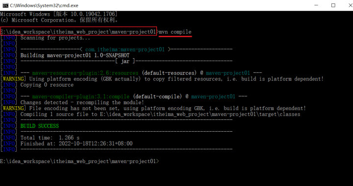

[上一篇](/posts/编程学习/javaweb学习笔记/25-IDEA集成Maven与项目坐标/)建好了项目、也弄清了坐标；这一篇回答两个每天都要用的问题：**项目要用别人写的 jar，怎么写上去？**（依赖管理）**写完之后"构建"到底怎么跑、跑哪些步骤？**（生命周期）。

PPT 第 38 页的目录页把"依赖管理"分成两节，这一篇按这个顺序讲：

| 这一节 | 内容 |
| --- | --- |
| **依赖配置** | `<dependencies>` + `<dependency>` 三行坐标 + 点刷新；不知道坐标就去 mvnrepository 搜 |
| **排除依赖** | `<exclusions>` + `<exclusion>`——主动断开某个"依赖的依赖" |
| **生命周期** | 三套生命周期（clean / default / site）、阶段有先后、五个常用阶段的含义、两种执行方式 |

## 依赖与依赖配置

### 依赖是什么

PPT 第 39 页的定义：

> **依赖：指当前项目运行所需要的 jar 包，一个项目中可以引入多个依赖。**

上一篇说过 Maven 的三大作用之一是"依赖管理"，具体到操作上就落在 pom.xml 的一个标签里。课程里的 `maven-project01` 要用 Spring 框架的 `spring-context`，不写依赖的话代码里 `import org.springframework...` 直接报红——**写依赖 = 告诉 Maven"我需要这个 jar，帮我去仓库拿"**。

### 配置依赖的四步

PPT 第 39 页把配置过程拆成四步，顺序别记反：

> 1. **在 `pom.xml` 中编写 `<dependencies>` 标签**
> 2. **在 `<dependencies>` 标签中使用 `<dependency>` 引入坐标**
> 3. **定义坐标的 groupId，artifactId，version**
> 4. **点击刷新按钮，引入最新加入的坐标**

写出来就是这一段（PPT 第 39 页给的 spring-context 例子，也是课程 `maven-project01/pom.xml` 里的内容）：

```xml
<!-- 配置依赖：一个 <dependencies> 里可以放多个 <dependency> -->
<dependencies>
    <dependency>
        <groupId>org.springframework</groupId>   <!-- 组织名（域名反写） -->
        <artifactId>spring-context</artifactId>  <!-- 模块名 -->
        <version>6.1.4</version>                 <!-- 版本号 -->
    </dependency>
</dependencies>
```

三个标签的含义和上一篇"坐标"完全一样（group 组织 + artifact 模块 + version 版本），**只是位置从 `<project>` 下一级换到了 `<dependency>` 里**——在 `<project>` 下写是"我是谁"，在 `<dependency>` 里写是"我要谁"。

### 不知道坐标怎么办

PPT 第 39 页给了一条现成的出路：

> **如果不知道依赖的坐标信息，可以到 <https://mvnrepository.com/> 中搜索。**

用法：在搜索框里敲**模块名或组织名**（如 `spring-context`、`hutool-all`），点进目标版本，页面上会直接给出**可复制的 Maven 坐标片段**（`<dependency>` 三行），粘进 pom.xml 即可。

### 刷新：写完不会自动生效

第 4 步"点击刷新按钮"很容易被跳过，但**跳过就会看到"依赖明明写了、代码还是报红"**。刷新按钮就是右侧 **Maven 面板左上角那个循环箭头**（鼠标悬停显示 Reload All Maven Projects）；pom.xml 改完以后 IDEA 往往也会在编辑区右上角弹一个小图标提示加载，点它一样。刷新的动作本质就是：**让 Maven 按新的 pom.xml 重新解析依赖、去仓库把缺的 jar 下下来、再挂到项目的 classpath 上**。

> [!TIP]
> 本机实测（Maven 3.9.14 / JDK 17）：命令行里没有"刷新按钮"，执行任意构建阶段时 Maven 每次都会重新读 pom、自动把缺的依赖下下来。实测加一个本地仓库里没有的依赖（PPT 坐标示例里那个 `cn.hutool:hutool-all:5.8.27`）后跑 `mvn package`，输出里会多出下载过程：
>
> ```text
> Downloading from aliyunmaven: https://maven.aliyun.com/repository/public/cn/hutool/hutool-all/5.8.27/hutool-all-5.8.27.jar
> Progress (1): 2.5 MB
> Downloaded from aliyunmaven: https://maven.aliyun.com/repository/public/cn/hutool/hutool-all/5.8.27/hutool-all-5.8.27.jar (2.5 MB at 9.8 MB/s)
> [INFO] --- jar:3.5.0:jar (default-jar) @ maven-project01 ---
> [INFO] Building jar: ...\maven-project01\target\maven-project01-1.0-SNAPSHOT.jar
> [INFO] BUILD SUCCESS
> ```
>
> `Downloading/Downloaded from aliyunmaven` 这行里的 **`aliyunmaven` 就是上一篇在 settings.xml 里配的那个阿里云镜像**——看到它说明镜像确实生效了（否则会显示 `central`）。IDEA 里点刷新按钮时，后台做的事和这里的下载完全一样。

### 一个依赖会带进来一串依赖

引入 `spring-context` 之后，项目其实不止多了这一个 jar——**它自己还要用别的东西**，Maven 会把这些"依赖的依赖"（**传递性依赖**）一起拿下来。本机实测用 `mvn dependency:tree` 看 `spring-context:6.1.4` 的实际依赖树：

```text
[INFO] com.itheima:maven-project01:jar:1.0-SNAPSHOT
[INFO] +- org.springframework:spring-context:jar:6.1.4:compile
[INFO] |  +- org.springframework:spring-aop:jar:6.1.4:compile
[INFO] |  +- org.springframework:spring-beans:jar:6.1.4:compile
[INFO] |  +- org.springframework:spring-core:jar:6.1.4:compile
[INFO] |  |  \- org.springframework:spring-jcl:jar:6.1.4:compile
[INFO] |  \- org.springframework:spring-expression:jar:6.1.4:compile
[INFO] |  \- io.micrometer:micrometer-observation:jar:1.12.3:compile
[INFO] |     \- io.micrometer:micrometer-commons:jar:1.12.3:compile
[INFO] \- cn.hutool:hutool-all:jar:5.8.27:compile
```

`+-` 是直接写在 pom 里的，`\-` 是跟着进来的。**`spring-context` 自己把 `spring-aop`、`spring-beans`、`spring-core`、`spring-expression`、`spring-jcl` 和 `micrometer-observation` 一起拉进来了**——理解这一点，才能理解下一节"排除依赖"在排除什么。

## 排除依赖

### 为什么需要排除

既然一个依赖会带进来一串传递性依赖，那就会出现"**它带进来的某个东西我不想要**"的情况。典型场景：版本冲突（它带的版本和我另外引入的版本不一样）、体积浪费（那个 jar 我根本不用）、功能干扰（比如它带了一个日志实现/监控组件，和项目里的另一个打架）。

PPT 第 40 页的定义：

> **排除依赖：指主动断开依赖的资源，被排除的资源无需指定版本。**

最后半句是关键——**被排除的只要写 groupId 和 artifactId，不用写版本号**（版本是那个"带它进来的人"决定的，排除时也不需要再指定）。

### 怎么排除

PPT 第 40 页给的正是 `maven-project01` 排除 `spring-context` 里 `micrometer-observation` 的例子（也是课程代码里原样的写法）：

```xml
<dependency>
    <groupId>org.springframework</groupId>
    <artifactId>spring-context</artifactId>
    <version>6.1.4</version>

    <!-- 排除依赖：把 spring-context 带进来的 micrometer-observation 断开 -->
    <exclusions>
        <exclusion>
            <groupId>io.micrometer</groupId>          <!-- 被排除资源的组织名 -->
            <artifactId>micrometer-observation</artifactId>
            <!-- 注意：这里不写 <version> —— 被排除的资源无需指定版本 -->
        </exclusion>
    </exclusions>
</dependency>
```

标签的层层关系是：**`<dependency>` → `<exclusions>` → `<exclusion>` → `<groupId>` + `<artifactId>`**。对应 PPT 第 41 页那组问答里的写法就很好记：

| 做什么 | 写法 |
| --- | --- |
| **依赖配置的方式** | `<dependencies>` → `<dependency>...</dependency>` → `</dependencies>` |
| **如何排除依赖** | 在 `<dependency>` 里加 `<exclusions>...</exclusions>`（里面放 `<exclusion>`） |

> [!TIP]
> 本机实测（Maven 3.9.14 / JDK 17）：加 `<exclusions>` 前后各跑一次 `mvn dependency:tree`，一眼就能看出排除生效了。
>
> **排除前**——树里能看到 `micrometer-observation`（还带着它自己的 `micrometer-commons`）：
>
> ```text
> [INFO] +- org.springframework:spring-context:jar:6.1.4:compile
> [INFO] |  +- org.springframework:spring-aop:jar:6.1.4:compile
> [INFO] |  +- org.springframework:spring-beans:jar:6.1.4:compile
> [INFO] |  +- org.springframework:spring-core:jar:6.1.4:compile
> [INFO] |  |  \- org.springframework:spring-jcl:jar:6.1.4:compile
> [INFO] |  +- org.springframework:spring-expression:jar:6.1.4:compile
> [INFO] |  \- io.micrometer:micrometer-observation:jar:1.12.3:compile
> [INFO] |     \- io.micrometer:micrometer-commons:jar:1.12.3:compile
> [INFO] \- cn.hutool:hutool-all:jar:5.8.27:compile
> ```
>
> **加了 `<exclusions>` 之后**——`micrometer-observation` 连同它带进来的 `micrometer-commons` 一起从树里消失了，别的没受影响：
>
> ```text
> [INFO] +- org.springframework:spring-context:jar:6.1.4:compile
> [INFO] |  +- org.springframework:spring-aop:jar:6.1.4:compile
> [INFO] |  +- org.springframework:spring-beans:jar:6.1.4:compile
> [INFO] |  +- org.springframework:spring-core:jar:6.1.4:compile
> [INFO] |  |  \- org.springframework:spring-jcl:jar:6.1.4:compile
> [INFO] |  \- org.springframework:spring-expression:jar:6.1.4:compile
> [INFO] \- cn.hutool:hutool-all:jar:5.8.27:compile
> ```
>
> 这就是"主动断开"的意思：pom 里多写一段，Maven 解析依赖时就把这条线剪掉。**排除了什么，最好在旁边写一行注释**（课程代码里也是这么做的），否则过几个月自己都忘了为什么排除它。

## 依赖配置的两条注意事项

PPT 第 41 页："依赖配置"这节末尾专门列了两条注意，都是实操里最容易卡住的地方：

> - **一旦依赖配置变更了，记得重新加载**
> - **引入的依赖本地仓库不存在，记得联网**

展开说：

| 注意事项 | 会出现什么现象 | 怎么办 |
| --- | --- | --- |
| **依赖配置变更后要重新加载** | pom.xml 里加了依赖、代码里 `import` 还是报红；或者删了一个依赖，代码却还能引用它（IDE 用的是旧的 classpath） | IDEA 里点 Maven 面板的**刷新按钮**（Reload All Maven Projects）；命令行里随便跑一个阶段（如 `mvn compile`）就相当于重新读了 pom |
| **本地仓库没有的依赖要联网** | 第一次引入某个依赖时，如果不通网/网络不稳，依赖下载不下来，构建停在 "Could not resolve dependencies" | 确认能上网（已配阿里云镜像），重新刷新/构建；下载失败留下的 `xxx.lastUpdated` 文件会挡住重试，需要删掉再重新加载（见[上一篇](/posts/编程学习/javaweb学习笔记/24-maven的安装与配置/)提到的 `del.bat`，这一章后面"常见问题"也会专门讲） |

> [!WARNING]
> 本机实测（Maven 3.9.14 / JDK 17）：把 Maven 切到**离线模式**（`mvn -o`，参数含义是"只用本地仓库，绝不联网"）并引入一个本地仓库里没有的依赖（课程用的 `junit-jupiter:5.9.1`），构建会直接失败，报错原文是——
>
> ```text
> [WARNING] The POM for org.junit.jupiter:junit-jupiter:jar:5.9.1 is missing, no dependency information available
> [ERROR] Failed to execute goal on project maven-project01: Could not resolve dependencies for project com.itheima:maven-project01:jar:1.0-SNAPSHOT
> [ERROR] dependency: org.junit.jupiter:junit-jupiter:jar:5.9.1 (compile)
> [ERROR] 	Cannot access aliyunmaven (https://maven.aliyun.com/repository/public) in offline mode and the artifact org.junit.jupiter:junit-jupiter:jar:5.9.1 has not been downloaded from it before.
> ```
>
> 最后一行把话说得很白：**离线模式下访问不了 aliyunmaven，而这个 artifact 以前没下过**。反过来说，只要在正常（联网）模式下构建一次，jar 就进本地仓库了，之后再离线也不影响——这正是"引入的依赖本地仓库不存在，记得联网"这条注意事项的意思。日常遇到 `Could not resolve dependencies` 时，先看这两处：**网通不通 / 坐标写没写对**。

## Maven 生命周期

### 生命周期是什么

PPT 第 43 页的定义：

> **Maven 的生命周期就是为了对所有的 maven 项目构建过程进行抽象和统一。**

"抽象和统一"的意思是：**不管谁写的 Maven 项目、用的什么 IDE、什么操作系统，构建都走同一套动作、同一套名字**——所以"编译""测试""打包"在 Maven 世界里永远叫 `compile`、`test`、`package`，敲的命令永远以 `mvn` 开头。

### 三套相互独立的生命周期

PPT 第 43 页列了三套，**它们相互独立**（各自跑各自的，不会因为你执行了 clean 就顺带跑 compile）：

| 生命周期 | PPT 的定义 | 里面装什么 |
| --- | --- | --- |
| **clean** | **清理工作** | pre-clean、**clean**、post-clean |
| **default** | **核心工作**，如：编译、测试、打包、安装、部署等 | validate … compile … test … package … **install**、deploy（下面细列） |
| **site** | **生成报告、发布站点**等 | pre-site、**site**、post-site、site-deploy |

### 每套生命周期里的阶段（phase）

PPT 第 44 页把三套生命周期的阶段全画了出来——这一页不用背，**知道"每套都是一串有顺序的阶段"就够了**：

| lifecycle | 阶段（按顺序） |
| --- | --- |
| **clean** | pre-clean → **clean** → post-clean |
| **default** | validate → initialize → generate-sources → process-sources → generate-resources → process-resources → **compile** → process-classes → generate-test-sources → process-test-sources → generate-test-resources → process-test-resources → **test-compile** → process-test-classes → **test** → prepare-package → **package** → verify → **install** → deploy |
| **site** | pre-site → **site** → post-site → site-deploy |

PPT 第 44、45 页反复强调那条规则，这是整节最该记住的一句：

> **每套生命周期包含一些阶段（phase），阶段是有顺序的，后面的阶段依赖于前面的阶段。**
>
> **注意：在同一套生命周期中，当运行后面的阶段时，前面的阶段都会运行。**

也就是说：`mvn package` **不只是打包**——它会从 `validate` 开始，把 `compile`、`test` 这些**前面的阶段都跑一遍**，最后才执行 `package`。这也是为什么"只敲一条 package，编译和测试都做了"。而**跨生命周期不会互相触发**：`mvn clean` 只清理，不会顺手编译。

### 五个常用阶段

PPT 第 45 页给了常用阶段的含义表，第 48 页又把它们列了一遍（"clean 清理、compile 编译、test 测试、package 打包、install 安装"）：

| 阶段 | PPT 的定义 | 干了什么 |
| --- | --- | --- |
| **clean** | **移除上一次构建生成的文件** | 删掉 `target` 目录（上次编译/打包的产物） |
| **compile** | **编译项目源代码** | 把 `src/main/java` 编译成 `.class` 到 `target/classes` |
| **test** | **使用合适的单元测试框架运行测试（junit）** | 跑 `src/test/java` 里的测试（下一篇就写 JUnit 测试） |
| **package** | **将编译后的文件打包**，如：jar、war等 | 生成 `target/xxx.jar`（这个项目 pom 里默认是 jar） |
| **install** | **安装项目到本地仓库** | 把打好的包**装进本地仓库**，别的项目就能用坐标引用它了 |

> [!TIP]
> 本机实测（Maven 3.9.14 / JDK 17）——把课程 `maven-project01`（spring-context + 排除依赖）照原样跑一遍，各阶段的真实输出：
>
> **`mvn clean`**：只清理，输出里能看到它删了哪个目录
>
> ```text
> [INFO] --- clean:3.2.0:clean (default-clean) @ maven-project01 ---
> [INFO] Deleting C:\...\maven-project01\target
> [INFO] BUILD SUCCESS
> ```
>
> **`mvn compile`**：编译源码（PPT 第 46 页的截图也是这个内容）
>
> ```text
> [INFO] --- resources:3.4.0:resources (default-resources) @ maven-project01 ---
> [INFO] --- compiler:3.15.0:compile (default-compile) @ maven-project01 ---
> [INFO] Compiling 1 source file with javac [debug target 17] to target\classes
> [INFO] BUILD SUCCESS
> ```
>
> **`mvn clean package`**：两条阶段连写（clean 生命周期的 clean + default 生命周期的 package），**跑 package 时把前面的阶段全带上了**——输出的每一行 `--- 插件:版本:目标 (阶段) @ 项目名 ---` 就是一个阶段在干活：
>
> ```text
> [INFO] --- clean:3.2.0:clean (default-clean) @ maven-project01 ---
> [INFO] --- resources:3.4.0:resources (default-resources) @ maven-project01 ---
> [INFO] --- compiler:3.15.0:compile (default-compile) @ maven-project01 ---
> [INFO] Compiling 1 source file with javac [debug target 17] to target\classes
> [INFO] --- resources:3.4.0:testResources (default-testResources) @ maven-project01 ---
> [INFO] --- compiler:3.15.0:testCompile (default-testCompile) @ maven-project01 ---
> [INFO] --- surefire:3.5.4:test (default-test) @ maven-project01 ---
> [INFO] --- jar:3.5.0:jar (default-jar) @ maven-project01 ---
> [INFO] Building jar: C:\...\maven-project01\target\maven-project01-1.0-SNAPSHOT.jar
> [INFO] BUILD SUCCESS
> ```
>
> 这一串正好把"阶段由插件执行"也演示了：编译是 **compiler 插件的 compile 目标**、跑测试是 **surefire 插件的 test 目标**、打包是 **jar 插件的 jar 目标**。
>
> **`mvn install`**：多出一行"装到哪里"
>
> ```text
> [INFO] --- install:3.1.4:install (default-install) @ maven-project01 ---
> [INFO] Installing C:\...\maven-project01\pom.xml to A:\develop\maven\apache-maven-3.9.14\mvn_repo\com\itheima\maven-project01\1.0-SNAPSHOT\maven-project01-1.0-SNAPSHOT.pom
> [INFO] Installing C:\...\maven-project01\target\maven-project01-1.0-SNAPSHOT.jar to A:\develop\maven\apache-maven-3.9.14\mvn_repo\com\itheima\maven-project01\1.0-SNAPSHOT\maven-project01-1.0-SNAPSHOT.jar
> [INFO] BUILD SUCCESS
> ```
>
> `Installing ... to A:\develop\maven\...\mvn_repo\com\itheima\maven-project01\1.0-SNAPSHOT\...` 这行的路径规律值得记一下：**本地仓库按"groupId 的每段 / artifactId / version / 文件名"分层放**——这就是上一篇说的"坐标能唯一定位资源"在磁盘上的样子。

打出来的 jar 里有什么？本机实测 `package` 的产物 `maven-project01-1.0-SNAPSHOT.jar` 内容如下（用解压工具能看）：

```text
META-INF/MANIFEST.MF                                  ← 清单文件（记录了是谁打的包）
com/itheima/HelloWorld.class                          ← 主程序编译出来的字节码
META-INF/maven/com.itheima/maven-project01/pom.xml     ← 打包时把 pom.xml 一起放进去了
META-INF/maven/com.itheima/maven-project01/pom.properties
```

其中 `pom.properties` 里就三行，正是项目的坐标：

```text
artifactId=maven-project01
groupId=com.itheima
version=1.0-SNAPSHOT
```

## 执行生命周期的两种方式

PPT 第 46 页："执行指定生命周期的两种方式"：

> 1. **在 IDEA 中，右侧的 maven 工具栏，选中对应的生命周期，双击执行。**
> 2. **在命令行中，通过命令执行。**

**方式一（IDEA 面板）**：右侧 Maven 面板里，每个模块下面有 **Lifecycle** 一栏，列着 `clean`、`validate`、`compile`、`test`、`package`、`verify`、`install`、`site`、`deploy` 这些阶段，**双击哪一个就跑哪一个**；再往下是 **Plugins** 一栏，列的是真正干活的插件（`clean`、`compiler`、`jar`、`surefire` 等，括号里是插件的坐标与版本）：


*图：IDEA 右侧 Maven 面板（PPT 第 47 页）——上面 Lifecycle 是**阶段**（双击即执行），下面 Plugins 是**插件**（compile 由 compiler 插件执行、test 由 surefire 插件执行、package 由 jar 插件执行）*

**方式二（命令行）**：在项目目录下敲 `mvn <阶段>`，PPT 第 46 页列的常见命令：

```bash
mvn clean       # 清理：删掉 target 目录
mvn compile     # 编译：源码 → target/classes 下的 .class
mvn package     # 打包：产成 jar（会先把前面的阶段跑一遍）
mvn install     # 安装：把 jar 装进本地仓库
```

PPT 第 46 页给的截图就是命令行执行 `mvn compile` 的真实结果——从红色框起来的命令行开始，往下依次是插件执行的日志，最后 **`BUILD SUCCESS`**：


*图：PPT 第 46 页——在项目目录下执行 `mvn compile`，蓝色日志是编译过程（`maven-compiler-plugin:3.1:compile`、`Compiling 1 source file to ...\target\classes`），最后一行 `BUILD SUCCESS` 表示成功（红色框是命令本身）*

两种方式**效果完全一样**（IDEA 面板双击，本质也是在后台调那一套阶段的命令），区别只是：

| | IDEA 面板双击 | 命令行 |
| --- | --- | --- |
| 适合 | 日常写代码时随手构建、看结果 | 排查问题、看完整日志、在没有 IDEA 的环境（服务器上）构建 |
| 能看到什么 | 精简的进度与结果 | 完整日志：每个阶段、下载了哪些 jar、报错原文 |
| 多个阶段 | 挨个双击 | 一条命令连着写：`mvn clean package` |

> [!NOTE]
> 判断构建有没有成功看最后一行就行：**`BUILD SUCCESS` = 成功**，**`BUILD FAILURE` = 失败**（失败时往上看第一条 `[ERROR]`，它通常就写着原因，比如坐标找不到、测试没通过）。另外，`package` 阶段只要项目里有测试代码就会去跑测试（surefire 插件），测试失败会**直接让构建失败**、拿不到 jar——这也是下一节 JUnit 单元测试要讲的内容。

## 小结

| 问题 | 答案 |
| --- | --- |
| 什么是依赖？ | 当前项目运行所需要的 **jar 包**，一个项目可以引入多个依赖 |
| 依赖配置怎么做？ | ① 在 pom.xml 里写 **`<dependencies>`**；② 里面用 **`<dependency>`**；③ 定义坐标 **groupId / artifactId / version**；④ **点刷新按钮** |
| 不知道坐标去哪查？ | **<https://mvnrepository.com/>** 搜模块名，直接复制依赖片段 |
| 怎么排除依赖？ | 在 `<dependency>` 里加 **`<exclusions>` → `<exclusion>`**（写被排除资源的 groupId + artifactId，**不用写版本**）；定义是"**主动断开依赖的资源**" |
| 依赖配置有哪两条注意事项？ | ① **依赖配置变更后记得重新加载**；② **引入的依赖本地仓库不存在、记得联网** |
| Maven 生命周期是什么？ | 对**所有 Maven 项目构建过程进行抽象和统一** |
| 有哪三套生命周期？ | **clean**（清理工作）、**default**（核心工作：编译、测试、打包、安装、部署等）、**site**（生成报告、发布站点等），**三套相互独立** |
| 阶段之间什么关系？ | 每套包含若干**有顺序的阶段**，后面的阶段**依赖**前面的阶段；**同一套生命周期中运行后面的阶段时，前面的阶段都会运行**（如 `mvn package` 会先跑 compile、test） |
| 五个常用阶段干什么？ | **clean** 移除上一次构建生成的文件；**compile** 编译项目源代码；**test** 用单元测试框架运行测试（junit）；**package** 将编译后的文件打包（jar、war等）；**install** 安装项目到本地仓库 |
| 怎么执行生命周期？ | ① IDEA 右侧 **Maven 工具栏选中阶段双击执行**；② **命令行** `mvn clean` / `mvn compile` / `mvn package` / `mvn install`（多个阶段可连写，如 `mvn clean package`） |

## 相关

- [上一篇：IDEA集成Maven与项目坐标](/posts/编程学习/javaweb学习笔记/25-idea集成maven与项目坐标/)
- [下一篇：JUnit单元测试入门](/posts/编程学习/javaweb学习笔记/27-junit单元测试入门/)
- [Maven是什么与核心概念（依赖管理模型、构建生命周期、插件、仓库这几张概念图）](/posts/编程学习/javaweb学习笔记/23-maven是什么与核心概念/)

## 练习题

### 一、知识回顾（读完直接做下面的实践题）

1. **依赖**的定义：指**当前项目运行所需要的 jar 包**，一个项目中可以引入**多个**依赖
2. 依赖配置的四个步骤：**① 在 pom.xml 中编写 `<dependencies>` 标签 → ② 在 `<dependencies>` 里用 `<dependency>` 引入坐标 → ③ 定义坐标的 groupId、artifactId、version → ④ 点击刷新按钮**引入最新加入的坐标
3. 不知道依赖坐标时：到 **<https://mvnrepository.com/>** 搜索模块名，复制页面给的依赖片段
4. **传递性依赖**：引入一个依赖时，**它自己要用的依赖会被 Maven 一起拿下来**（如 `spring-context:6.1.4` 会带 `spring-aop`、`spring-beans`、`spring-core`、`spring-expression`、`spring-jcl`、`micrometer-observation`）
5. **排除依赖**的定义与写法：指**主动断开依赖的资源**，**被排除的资源无需指定版本**；写法是 `<dependency>` → **`<exclusions>` → `<exclusion>`**（里面写 groupId + artifactId）
6. 依赖配置的两条注意事项（PPT 第 41 页）：**一旦依赖配置变更了，记得重新加载**；**引入的依赖本地仓库不存在，记得联网**
7. **Maven 生命周期**的定义：为了对**所有的 Maven 项目构建过程进行抽象和统一**；一共 **3 套相互独立的生命周期**——**clean**（清理工作）、**default**（核心工作：编译、测试、打包、安装、部署等）、**site**（生成报告、发布站点等）
8. 阶段的规则：每套生命周期包含一些**阶段（phase）**，**阶段是有顺序的，后面的阶段依赖于前面的阶段**；**在同一套生命周期中，当运行后面的阶段时，前面的阶段都会运行**（`mvn package` 会先跑 compile、test 等前面的阶段；`mvn clean` 属于另一套，不会触发编译）
9. 五个常用阶段的含义：**clean** = 移除上一次构建生成的文件（删 `target`）；**compile** = 编译项目源代码；**test** = 使用合适的单元测试框架运行测试（junit）；**package** = 将编译后的文件打包（jar、war 等）；**install** = 安装项目到**本地仓库**
10. 执行生命周期的两种方式：**① IDEA 右侧 Maven 工具栏选中对应的生命周期双击执行；② 命令行执行**（`mvn clean` / `mvn compile` / `mvn package` / `mvn install`，多阶段可连写如 `mvn clean package`）；成功看最后的 **`BUILD SUCCESS`**

### 二、动手题

- [ ] **2-1 给项目加上两个依赖**
  项目 `maven-project01` 现在要用两个第三方库，在练习文件给出的 pom.xml 骨架里把依赖配好：
  1. `commons-io`：组织 `commons-io`，版本 **2.11.0**；
  2. `hutool-all`：组织 `cn.hutool`，版本 **5.8.27**。
  两个依赖都要写在同一个标签里（想一想这个"装依赖的容器"叫什么）；每个 `<dependency>` 里按顺序写三行，并用中文注释标出哪行是组织名、哪行是模块名、哪行是版本号。
  （练习文件 `test_26_依赖配置.xml` 里已经给了 pom 骨架和写作区。）

  > [!TIP]- 提示（先自己想，实在想不出再点开）
  > **一级 · 思路**：所有依赖装在一个"容器标签"里，每个依赖是容器里的一个"条目"；每个条目的三行和项目坐标是同样的三个名字
  > **二级 · 方法**：容器标签是 `<dependencies>`，条目是 `<dependency>`；三行是 `<groupId>` / `<artifactId>` / `<version>`
  > **三级 · 骨架**：`<dependencies><dependency><groupId>____</groupId><artifactId>____</artifactId><version>____</version></dependency>…</dependencies>`

  > [!TIP]- 参考答案（做完再点开）
  > ```xml
  > <dependencies>
  >     <!-- 依赖①：commons-io -->
  >     <dependency>
  >         <groupId>commons-io</groupId>        <!-- 组织名 -->
  >         <artifactId>commons-io</artifactId>  <!-- 模块名 -->
  >         <version>2.11.0</version>            <!-- 版本号 -->
  >     </dependency>
  >
  >     <!-- 依赖②：hutool 工具库 -->
  >     <dependency>
  >         <groupId>cn.hutool</groupId>
  >         <artifactId>hutool-all</artifactId>
  >         <version>5.8.27</version>
  >     </dependency>
  > </dependencies>
  > ```
  > 检查点：① `<dependencies>` 是 `<project>` 的**直接子标签**（和 `<modelVersion>`、`<properties>` 平级）；② 两个 `<dependency>` 都写全了三行坐标——**少一行 Maven 就定位不到 jar**；③ 写完记得在 IDEA 里**点刷新按钮**（命令行则跑一次 `mvn compile`），否则 classpath 上不会有这两个 jar。本机实测加上 `hutool-all:5.8.27` 后跑 `mvn package`，日志里会出现 `Downloaded from aliyunmaven: .../cn/hutool/hutool-all/5.8.27/hutool-all-5.8.27.jar (2.5 MB …)`。

- [ ] **2-2 排除一个"依赖的依赖"**
  项目里引入了 `spring-context`（组织 `org.springframework`，版本 **6.1.4**），但它顺带带进来了 `io.micrometer:micrometer-observation`，现在不想要它。在练习文件的 pom 骨架里：
  1. 写上 `spring-context` 这个依赖的完整坐标；
  2. 在它内部**排除** `micrometer-observation`（组织名 `io.micrometer`）；
  3. 在文件末尾的注释里回答：为什么排除的时候**不用写版本号**？排除生效了怎么验证？
  （练习文件 `test_26_排除依赖.xml` 里已经给了写作区。）

  > [!TIP]- 提示（先自己想，实在想不出再点开）
  > **一级 · 思路**：排除是写在"引入它的那个依赖"里面的——即"我不想要你带进来的这一样东西"；被排掉的东西只需要能**认出它是谁**
  > **二级 · 方法**：外层用 `<exclusions>` 包住一个 `<exclusion>`；`<exclusion>` 里写 `<groupId>` 和 `<artifactId>`；**不写 `<version>`**（PPT 第 40 页明确"被排除的资源无需指定版本"）
  > **三级 · 骨架**：`<dependency><groupId>org.springframework</groupId><artifactId>spring-context</artifactId><version>6.1.4</version><exclusions><exclusion><groupId>____</groupId><artifactId>____</artifactId></exclusion></exclusions></dependency>`

  > [!TIP]- 参考答案（做完再点开）
  > ```xml
  > <dependencies>
  >     <dependency>
  >         <groupId>org.springframework</groupId>
  >         <artifactId>spring-context</artifactId>
  >         <version>6.1.4</version>
  >
  >         <!-- 排除依赖：断开 spring-context 带进来的 micrometer-observation -->
  >         <exclusions>
  >             <exclusion>
  >                 <groupId>io.micrometer</groupId>
  >                 <artifactId>micrometer-observation</artifactId>
  >                 <!-- 这里不写 <version>：被排除的资源无需指定版本 -->
  >             </exclusion>
  >         </exclusions>
  >     </dependency>
  > </dependencies>
  > ```
  > 两个问题的答案：
  > 1. **不用写版本号**是因为版本是"把它带进来的那个依赖"决定的（这里由 `spring-context` 决定），**排除的动作要表达的是"这个 jar 我不要"，只要能认出"哪个组织下的哪个模块"就够了**，写版本反而容易写错——PPT 第 40 页的原话是"被排除的资源无需指定版本"。
  > 2. **验证办法**：跑一次 `mvn dependency:tree` 看依赖树（或 IDEA 里刷新后看 External Libraries 列表）——排除前树里能看到 `io.micrometer:micrometer-observation:jar:1.12.3`（它下面还挂着 `micrometer-commons`），加了 `<exclusions>` 之后这两行都消失，其余依赖不受影响。本机实测的两次输出就在正文的 TIP 块里，可以对照。

- [ ] **2-3 说清生命周期：阶段、顺序与执行方式**
  不用写代码，用文字（可以在练习文件里直接用中文回答）说清这几件事：
  1. Maven 有哪**三套**生命周期，各自负责什么？"相互独立"是什么意思？
  2. 五个常用阶段 **clean / compile / test / package / install** 分别做什么？各自在磁盘上留下什么（或删掉什么）？
  3. 为什么敲 `mvn package` 会连着编译和测试一起做？换成 `mvn clean` 会不会顺带编译？
  4. 写出**两种**执行生命周期的方式（IDEA 里怎么点、命令行怎么敲），并写出"先清理再打包"的一条命令。
  （练习文件 `test_26_生命周期阶段与执行方式.txt` 里给了写作区。）

  > [!TIP]- 提示（先自己想，实在想不出再点开）
  > **一级 · 思路**：默认那套（default）里的阶段像排队的工序，站到队伍后面就会把前面的人都带上；clean 和 site 是另外两支队伍
  > **二级 · 方法**：三套是 `clean` / `default` / `site`；常用阶段含义见正文表格；执行方式是"IDEA 面板双击"和"命令行 `mvn 阶段名`"；多阶段可以连写，用空格隔开
  > **三级 · 骨架**：`mvn ____ ____`（先清理再打包）

  > [!TIP]- 参考答案（做完再点开）
  > **2-3**
  > 1. 三套**相互独立**的生命周期：**clean**（清理工作）、**default**（核心工作——编译、测试、打包、安装、部署等）、**site**（生成报告、发布站点等）。"相互独立"指**执行一套里的阶段不会触发另一套里的阶段**：`mvn clean` 只做清理，不会编译；`mvn package` 也不会顺手清理（想"先清理再打包"要写成 `mvn clean package`）。
  > 2. 五个常用阶段：
  >    - **clean**：移除上一次构建生成的文件——删掉 **`target` 目录**；
  >    - **compile**：编译项目源代码——生成 **`target/classes` 下的 `.class`**；
  >    - **test**：用单元测试框架（junit）运行测试——`src/test/java` 里的测试跑一遍；
  >    - **package**：把编译后的文件打包——生成 **`target/maven-project01-1.0-SNAPSHOT.jar`**；
  >    - **install**：安装项目到**本地仓库**——`mvn_repo\com\itheima\maven-project01\1.0-SNAPSHOT\` 下多出 `.jar` 和 `.pom`。
  > 3. 因为规则是"**在同一套生命周期中，当运行后面的阶段时，前面的阶段都会运行**"，而 compile、test、package 都在 **default** 这套里按顺序排着，所以 `mvn package` 会把 compile、test 一起做掉；`mvn clean` 的 clean 阶段属于 **clean** 那套生命周期，**不会**触发 default 里的编译。
  > 4. 两种执行方式：**① IDEA 右侧 Maven 工具栏（Maven 面板）里，展开项目的 Lifecycle，选中对应的阶段双击执行**；**② 命令行在项目目录下敲 `mvn 阶段名`**。"先清理再打包"的命令是：
  >    ```bash
  >    mvn clean package
  >    ```
  >    （本机实测这条命令的输出：先 `clean:3.2.0:clean`，再依次 `resources → compiler:compile → testResources → testCompile → surefire:test → jar:jar`，最后 `BUILD SUCCESS`。）

### 三、综合题

- [ ] **3-1 给项目加依赖、排除依赖，再跑一遍完整构建**
  把这一篇的知识串起来做一次（做成什么样、每一步什么结果都记下来）：
  1. 打开你的 `maven-project01`（上一篇建的那个，或者课程代码里的那个），先跑一次 **`mvn clean`**，看 `target` 目录的变化；
  2. 在 pom.xml 里加上 **`spring-context`（6.1.4）** 依赖，顺手**排除**它带进来的 `io.micrometer:micrometer-observation`；
  3. 按"先清理再打包"的方式跑构建（IDEA 面板双击或命令行 `mvn clean package`），把输出里能证明"**跑 package 时前面的阶段也跑了**"的那几行抄下来；
  4. 记下**产物 jar 的完整路径**，并说明它为什么在这个目录下（提示：看项目目录结构里的 `target`）；
  5. 想再确认排除有没有生效，用一条命令把 `spring-context` 的依赖树打出来，看看里面还有没有 `micrometer`；
  6. 如果 IDEA 里 pom.xml 的 `<dependency>` 还是红的、代码里 `import org.springframework...` 用不了，写出你的排查顺序（至少两条）。
  （练习文件 `test_26_综合题加依赖并构建.txt` 里按这 6 步给了写作区。）

  **涉及知识点**

  | 知识点 | 在这里的应用 |
  | --- | --- |
  | 依赖配置 | `<dependencies>` + `<dependency>` + 三行坐标 |
  | 排除依赖 | `<exclusions>` → `<exclusion>`（不写版本） |
  | 两个注意事项 | 配置变更后重新加载；本地仓库没有要联网 |
  | 生命周期与阶段 | `clean` 与 `package` 分属两套生命周期，可连写 |
  | 常用阶段 | compile 编译、test 跑测试、package 打包、install 装进本地仓库 |

  > [!TIP]- 提示（先自己想，实在想不出再点开）
  > **一级 · 思路**：这是"改 pom → 重新加载 → 跑构建 → 看产物 → 验证"的一条流水线，每一步都有可观察的结果（目录变化、日志行、文件路径）
  > **二级 · 方法**：排除写在 `<dependency>` 里，用 `<exclusions>` 包 `<exclusion>`（只写 groupId + artifactId）；构建用 IDEA 面板双击 `clean`、`package`，或命令行 `mvn clean package`；看树的命令是 `mvn dependency:tree`；产物在 **`target`** 目录下
  > **三级 · 骨架**：`mvn ____ ____`（两个阶段）→ 日志里找 `--- jar:3.5.0:jar` 和 `Building jar: ____` 这两行

  > [!TIP]- 参考答案（做完再点开）
  > **3-1** 一份对照过程（课程环境 + 本机实测的值）：
  > 1. **先清理**：`mvn clean` → 日志里 `clean:3.2.0:clean` + `Deleting ...\maven-project01\target`，跑完 `target` 目录**不见了**（`BUILD SUCCESS`）。
  > 2. **pom.xml 里的依赖段**：
  >    ```xml
  >    <dependencies>
  >        <dependency>
  >            <groupId>org.springframework</groupId>
  >            <artifactId>spring-context</artifactId>
  >            <version>6.1.4</version>
  >
  >            <!-- 排除依赖：被排除的资源无需指定版本 -->
  >            <exclusions>
  >                <exclusion>
  >                    <groupId>io.micrometer</groupId>
  >                    <artifactId>micrometer-observation</artifactId>
  >                </exclusion>
  >            </exclusions>
  >        </dependency>
  >    </dependencies>
  >    ```
  > 3. **先清理再打包**：`mvn clean package`（IDEA 里就是先双击 `clean` 再双击 `package`）。能证明"前面的阶段也跑了"的那几行**就是每个阶段一行的 `--- 插件:版本:目标 (阶段) @ 项目名 ---`**：
  >    ```text
  >    [INFO] --- clean:3.2.0:clean (default-clean) @ maven-project01 ---
  >    [INFO] --- resources:3.4.0:resources (default-resources) @ maven-project01 ---
  >    [INFO] --- compiler:3.15.0:compile (default-compile) @ maven-project01 ---
  >    [INFO] Compiling 1 source file with javac [debug target 17] to target\classes
  >    [INFO] --- resources:3.4.0:testResources (default-testResources) @ maven-project01 ---
  >    [INFO] --- compiler:3.15.0:testCompile (default-testCompile) @ maven-project01 ---
  >    [INFO] --- surefire:3.5.4:test (default-test) @ maven-project01 ---
  >    [INFO] --- jar:3.5.0:jar (default-jar) @ maven-project01 ---
  >    [INFO] Building jar: ...\maven-project01\target\maven-project01-1.0-SNAPSHOT.jar
  >    [INFO] BUILD SUCCESS
  >    ```
  >    只敲了 `package` 一个阶段，但 compile、test 都跑了——这就是"后面的阶段会触发前面的阶段"。
  > 4. **产物路径**：`...\maven-project01\target\maven-project01-1.0-SNAPSHOT.jar`。它在 `target` 下，因为 **`target` 就是 Maven 的构建产物目录**（编译输出 `classes`、打包结果都在这里），标准结构里它由 Maven 生成、可以被 `clean` 删掉。jar 的文件名由 **artifactId + version** 拼成，这也正好复习了上一篇的坐标。
  > 5. **验证排除**：`mvn dependency:tree`，排除生效时输出里**没有** `io.micrometer:micrometer-observation` 这一行（它原来挂在 `spring-context` 下面，自己还带一个 `micrometer-commons`）：
  >    ```text
  >    [INFO] +- org.springframework:spring-context:jar:6.1.4:compile
  >    [INFO] |  +- org.springframework:spring-aop:jar:6.1.4:compile
  >    [INFO] |  +- org.springframework:spring-beans:jar:6.1.4:compile
  >    [INFO] |  +- org.springframework:spring-core:jar:6.1.4:compile
  >    [INFO] |  |  \- org.springframework:spring-jcl:jar:6.1.4:compile
  >    [INFO] |  \- org.springframework:spring-expression:jar:6.1.4:compile
  >    ```
  > 6. **IDEA 里依赖报红的排查顺序**（任答两条即可）：① **点 Maven 面板的刷新按钮重新加载**（改了 pom 必须重新加载，这是 PPT 第 41 页的第一条注意事项）；② 看**网通不通**——本地仓库里没有这个依赖时是要联网下载的（第二条注意事项），网络不稳时先删掉仓库里对应的 `xxx.lastUpdated` 再重新加载；③ **核对坐标**：group、artifact、version 三行有没有拼错（写错就是 `Could not find artifact ...`）；④ 检查**全局 Maven 配置**（安装目录、settings.xml、本地仓库三个路径）有没有指错，指错的话下载进了"另一个仓库"，IDEA 自然找不到；⑤ 还不行就 `File → Invalidate Caches / Restart` 重启 IDEA 再加载一次。
