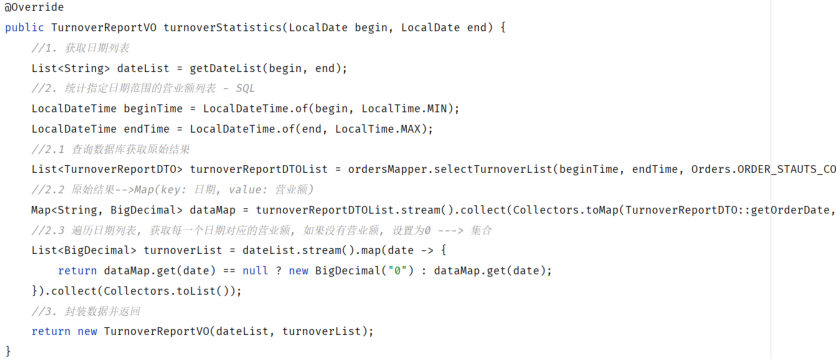
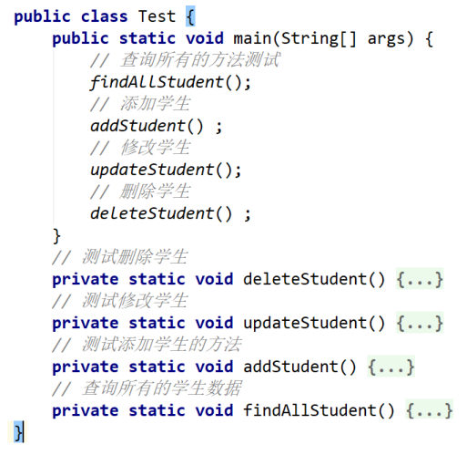
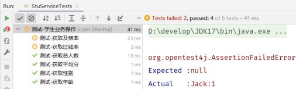

[上一篇](/posts/编程学习/javaweb学习笔记/26-maven依赖管理与生命周期/)把 Maven 的**依赖管理**和**生命周期**都讲完了，里面那个 `test` 阶段的定义是"**使用合适的单元测试框架运行测试（junit）**"——这一篇就来把这个"单元测试框架"补上，也是这一章（PPT 第 49 页的目录）最后一块：**单元测试**。

PPT 把这块内容分成四节，从这一篇开始逐篇讲：

| 这一节 | 讲什么 | 落在哪篇 |
| --- | --- | --- |
| **快速入门** | 测试是什么、单元测试是什么、JUnit 是什么、四步跑通第一个测试 | 这一篇 |
| **断言** | 不报错 ≠ 业务没问题，用断言判断结果对不对 | [下一篇](/posts/编程学习/javaweb学习笔记/28-junit断言与常见注解/) |
| **常见注解** | @Test、@ParameterizedTest、@DisplayName、@BeforeEach… 什么时候执行 | [下一篇](/posts/编程学习/javaweb学习笔记/28-junit断言与常见注解/) |
| **依赖范围** | `<scope>`：主程序 / 测试程序 / 打包，四种取值 | [29-Maven依赖范围与常见问题](/posts/编程学习/javaweb学习笔记/29-maven依赖范围与常见问题/) |

## 测试是什么

PPT 第 50 页先给出定义：

> **测试：是一种用来促进鉴定软件的正确性、完整性、安全性和质量的过程。**

后面这半句（正确性、完整性、安全性、质量）说明测试不只是"看看跑不跑得起来"，它是一整条质量保障流程。按**阶段**划分，软件测试分四个阶段：

| 阶段 | 介绍 | 目的 | 测试人员 |
| --- | --- | --- | --- |
| **单元测试** | 对软件的**基本组成单位**进行测试，**最小测试单位** | 检验软件基本组成单位的**正确性** | **开发人员** |
| **集成测试** | 将已分别通过测试的单元，**按设计要求组合**成系统或子系统，再进行的测试 | 检查**单元之间的协作**是否正确 | **开发人员** |
| **系统测试** | 对已经集成好的**软件系统**进行彻底的测试 | 验证软件系统的**正确性、性能**是否满足指定的要求 | **测试人员** |
| **验收测试** | **交付测试**，是针对**用户需求、业务流程**进行的正式的测试 | 验证软件系统是否满足**验收标准** | **客户 / 需求方** |

这四行里有两条信息值得单独记：

- **测试人员是变化的**：前两个阶段由**开发人员**自己测（写代码的人测自己写的单元），系统测试交给专职**测试人员**，验收测试是**客户/需求方**来测——所以"单元测试是开发人员的活"，不是测试工程师的活。
- **范围是递增的**：单元 → 集成 → 系统 → 验收，从"一个方法"一路放大到"整个系统满足不满足客户需求"。

### 三种测试方法

按"**看不看得见代码内部**"，PPT 第 51 页把测试方法分成三种：

| 方法 | PPT 的定义 | 用来验证什么 |
| --- | --- | --- |
| **白盒测试** | **清楚**软件内部结构、代码逻辑 | 用于验证**代码、逻辑正确性** |
| **黑盒测试** | **不清楚**软件内部结构、代码逻辑 | 用于验证软件的**功能、兼容性**等方面 |
| **灰盒测试** | **结合了白盒测试和黑盒测试的特点**，既关注软件的内部结构又考虑外部表现（功能） | 兼顾内部结构与外部功能 |

PPT 第 51、52 页还把"阶段"和"方法"对应了起来，这是这一节最容易考的一条对应关系：

| 测试阶段 | 通常用的测试方法 |
| --- | --- |
| **单元测试** | **白盒测试** |
| **集成测试** | **灰盒测试** |
| **系统测试** | **黑盒测试** |
| **验收测试** | **黑盒测试** |

道理很直白：写单元测试的人就是写这个方法的人，**代码在自己手里，白盒**；越往上（系统测试、验收测试）越像"用户拿过来用"，自然就是**黑盒**——不需要、也不应该去看内部代码。

那么"看代码"是为了什么？因为真实业务方法往往**又长又绕**，读一遍都费劲，出了问题更没法靠肉眼看出来：


*图：PPT 第 51 页（讲测试方法那页）上配的业务方法截图——这是课程实战项目里"统计指定时间区间营业额"的方法：先取日期列表、再按日期去数据库查原始数据、再把结果梳理成日期→营业额的映射并补 0，中间还夹着流式操作和 SQL 调用；这类方法属于**白盒测试**要盯的东西，靠肉眼检查结果对不对基本不可能*

## 单元测试是什么

PPT 第 54 页的定义只有一句话，但每个词都要咬住：

> **单元测试：就是针对最小的功能单元（方法），编写测试代码对其正确性进行测试。**

拆开看：

| 词 | 含义 |
| --- | --- |
| **最小的功能单元** | 在 Java 里就是**一个方法**（比如 `UserService.getAge()`），不是整个类、更不是整个系统 |
| **编写测试代码** | 测试是**写出来的代码**，不是点几下 IDE 手工验证一下 |
| **对其正确性进行测试** | 检验的是"这个方法给出的结果对不对" |

"最小功能单元 = 方法"这一点决定了单元测试的粒度：**一个业务方法，写一个（或几个）测试方法**。后面所有内容（断言、注解、依赖范围）都是围着这一句话转的。

## JUnit 是什么

PPT 第 54 页的下一页给出定义：

> **JUnit：最流行的 Java 测试框架之一，提供了一些功能，方便程序进行单元测试（第三方公司提供）。**

两个关键词：

- **最流行**：Java 圈里写单元测试基本就是 JUnit（这门课用的是 JUnit 5，坐标 `org.junit.jupiter:junit-jupiter`）；
- **第三方公司提供**：它不是 JDK 自带的（`java.lang`、`java.util` 那些才是），**所以要先在 pom.xml 里引入依赖**——这也是"快速入门"的第一步。

### main 方法测试 vs JUnit 单元测试

在学 JUnit 之前，很多人是这么"测试"的——写一个带 `main` 方法的类，把要测的方法挨个调一遍：


*图：PPT 第 54 页的"main 方法测试"——一个 `Test` 类，`main` 方法里按顺序调用 `findAllStudent()`、`addStudent()`、`updateStudent()`、`deleteStudent()`，每个测试方法都是 `private static void`，结果全靠 `System.out.println` 打印出来自己看*

PPT 第 54 页把这种方式和 JUnit 单元测试摆在一起做了对比（"VS"）：

| | **main 方法测试** | **JUnit 单元测试** |
| --- | --- | --- |
| 代码组织 | 测试代码与源代码**未分开**，难维护 | 测试代码与源代码**分开**（放在 `test/java`），便于维护 |
| 相互影响 | **一个方法测试失败，影响后面方法**（前面的抛异常，后面的就不执行了） | **一个测试方法执行失败，不会影响其它测试方法** |
| 自动化 | **无法**自动化测试，得到测试报告 | **可根据需要进行自动化测试**，可自动分析测试结果，**产出测试报告** |

"一个失败不影响其他"这一条在实操里差别特别大：main 方法里第 2 个测试抛了异常，第 3、4 个测试就再也不会执行，你还得把前面的注释掉重跑；JUnit 会把所有 `@Test` 方法都跑一遍，最后一次性告诉你哪些红了。运行结果也就是 PPT 第 55 页那句"**测试通过：绿色；测试失败：红色**"：


*图：PPT 第 54 页的 JUnit 运行结果面板——右上角统计 "Tests failed: 2, passed: 4 of 6 tests"，左边每个测试方法前面是**绿色对勾**（通过）或**红色叉**（失败），右下角是选中失败方法后给出的原因：`org.opentest4j.AssertionFailedError`，`Expected :null`、`Actual :Jack:1`（预期为 null，实际拿到了 Jack:1，说明断言没通过）*

## 快速入门：四步跑通第一个单元测试

PPT 第 55 页把入门拆成三步（最后一步是运行），顺序不能颠倒：

> 1. **在 `pom.xml` 中，引入 JUnit 的依赖。**
> 2. **在 `test/java` 目录下，创建测试类，并编写对应的测试方法，并在方法上声明 `@Test` 注解。**
> 3. **运行单元测试（测试通过：绿色；测试失败：红色）。**

### 第 1 步：pom.xml 引入 JUnit 依赖

PPT 第 55 页给的就是这一段：

```xml
<!-- junit 依赖：JUnit 5 的坐标 -->
<dependency>
    <groupId>org.junit.jupiter</groupId>     <!-- 组织名：JUnit 5 都是 org.junit.jupiter -->
    <artifactId>junit-jupiter</artifactId>  <!-- 模块名：junit-jupiter 是聚合包 -->
    <version>5.9.1</version>                <!-- 版本号 -->
</dependency>
```

> [!NOTE]
> 课程代码 `maven-project01/pom.xml` 里这个依赖比 PPT 多一行 `<scope>test</scope>`——那是**依赖范围**，表示这个 jar 只在测试程序里用。它属于这一章"单元测试"的第四节，[29-Maven依赖范围与常见问题](/posts/编程学习/javaweb学习笔记/29-maven依赖范围与常见问题/)会专门讲；这里先按 PPT 的样子理解成"引入 junit 依赖"即可。

### 第 2 步：在 test/java 下建测试类、写测试方法

前一篇讲过 Maven 的标准目录结构（**主程序放 `main`、测试程序放 `test`**），这里就派上用场了：

```text
maven-project01/
├── src/main/java/com/itheima/UserService.java        ← 主程序：被测试的业务代码
└── src/test/java/com/itheima/UserServiceTest.java     ← 测试程序：测试代码写在这里
```

被测试的业务代码本身很简单（课程提供的 `UserService`，两个方法）：

```java
package com.itheima;

import java.time.LocalDate;
import java.time.Period;
import java.time.format.DateTimeFormatter;

public class UserService {

    /**
     * 给定一个身份证号, 计算出该用户的年龄
     */
    public Integer getAge(String idCard){
        // 身份证号不合法就直接抛异常（长度必须是 18 位）
        if (idCard == null || idCard.length() != 18) {
            throw new IllegalArgumentException("无效的身份证号码");
        }
        // 身份证号第 7~14 位是出生日期（yyyyMMdd）
        String birthday = idCard.substring(6, 14);
        LocalDate parse = LocalDate.parse(birthday, DateTimeFormatter.ofPattern("yyyyMMdd"));
        // 出生日期到今天相差多少年 = 年龄
        return Period.between(parse, LocalDate.now()).getYears();
    }

    /**
     * 给定一个身份证号, 计算出该用户的性别
     */
    public String getGender(String idCard){
        if (idCard == null || idCard.length() != 18) {
            throw new IllegalArgumentException("无效的身份证号码");
        }
        // 身份证号第 17 位（索引 16）是奇数表示男、偶数表示女
        return Integer.parseInt(idCard.substring(16,17)) % 2 == 1 ? "男" : "女";
    }
}
```

测试类按 PPT 第 55 页的样子写——**类里放测试方法，方法上打 `@Test` 注解**：

```java
package com.itheima;

import org.junit.jupiter.api.Test;

public class UserServiceTest {

    @Test
    public void testGetAge(){
        // 1. 创建要测试的对象
        UserService userService = new UserService();
        // 2. 调用要测试的方法
        Integer age = userService.getAge("100000200010011011");
        // 3. 先看看结果是什么（后面学了断言就改成断言）
        System.out.println(age);
    }
}
```

PPT 第 55 页同时给了两条命名要求，**一条是"规范"、一条是"规定"**，措辞不一样：

> **注意：**
> - **JUnit 单元测试类名命名规范为：`XxxxxTest`【规范】。**
> - **JUnit 单元测试的方法，必须声明为 `public void`【规定】。**

| 项目 | 要求 | 为什么 |
| --- | --- | --- |
| **测试类名** | `XxxxTest`（如 `UserServiceTest`、`StuServiceTest`） | 【规范】是团队约定：看到 `XxxTest` 就知道"这是测试类"，工具和插件也按这个名字找测试 |
| **测试方法** | **`public void`**，方法名一般 `test` + 业务方法名（如 `testGetAge`） | 【规定】是**框架的硬性要求**：JUnit 靠反射调用，方法必须是 public、无返回值；写成 `static`、带返回值或 private 都跑不起来 |

### 第 3 步：运行单元测试

运行方式有两种：**IDEA 里点测试方法/测试类左边那个绿色三角**（或在类里按 `Ctrl+Shift+F10`），命令行则在项目目录下敲：

```bash
mvn test        # 跑 src/test/java 下所有测试
mvn test -Dtest=UserServiceTest    # 只跑指定的测试类（-Dtest=类名）
```

PPT 第 55 页最后一句话是判断标准：**（测试通过：绿色；测试失败：红色）**。

> [!TIP]
> 本机实测（Maven 3.9.14 / JDK 17）——用一个最小 Maven 项目（只有 `junit-jupiter:5.9.1` + 课程的 `UserService` 和 `UserServiceTest`）跑 `mvn test`，真实输出如下：
>
> ```text
> [INFO] -------------------------------------------------------
> [INFO]  T E S T S
> [INFO] -------------------------------------------------------
> [INFO] Running 用户信息测试类
> 男
> 25
> [INFO] Tests run: 7, Failures: 0, Errors: 0, Skipped: 0, Time elapsed: 0.083 s -- in 用户信息测试类
> [INFO]
> [INFO] Results:
> [INFO]
> [INFO] Tests run: 7, Failures: 0, Errors: 0, Skipped: 0
> [INFO]
> [INFO] ------------------------------------------------------------------------
> [INFO] BUILD SUCCESS
> [INFO] ------------------------------------------------------------------------
> ```
>
> 这份输出里有几个点值得对上号：
>
> 1. **`Running 用户信息测试类`**——课程代码里测试类上写了 `@DisplayName("用户信息测试类")`，所以这里显示的是中文名而不是类名（`@DisplayName` 是[下一篇](/posts/编程学习/javaweb学习笔记/28-junit断言与常见注解/)的内容）。
> 2. **`男` 和 `25`** 就是测试方法里 `System.out.println` 打印出来的：`getGender("100000200010011011")` 返回 **男**，`getAge("100000200010011011")` 返回 **25**（出生日期 2000-10-01，到 2026-09-29 是 25 周岁）。
> 3. **`Tests run: 7`** 而不是 5 个方法——因为课程测试类里有一个 `@ParameterizedTest` 参数化测试（一个方法传了 3 组参数），实际执行了 4 + 3 = **7 次**。
> 4. 最后一行的 **`BUILD SUCCESS`** 就是"全绿"。顺带一提，PPT 第 55 页示例里那个身份证号 `110002200505091218`，本机实测年龄是 **21**、性别是 **男**——同一份业务代码，换一个身份证号结果就变，这正是要写测试的原因。

> [!WARNING]
> 命令行跑测试时注意两件事：**① 测试失败会让 Maven 构建直接失败**（`BUILD FAILURE`，`mvn package` 也就打不出包了），这正是前一篇说的"`test` 阶段跑不过、`package` 阶段就被挡住"；**② 一定要用 JDK 17 跑**（课程代码 `pom.xml` 里 `<maven.compiler.source>17</maven.compiler.source>`，命令行里的 `java -version` 若是 1.8 会编译不过），最省事的方式是让 Maven 用它自己的 `JAVA_HOME`。

## 单元测试放在哪：test 目录，别写进 main

PPT 第 65 页专门问了一个初学者一定会踩的问题：

> **在 maven 项目中，test 目录存放单元测试的代码，是否可以在 main 目录中编写单元测试呢？**
>
> **可以，但是不规范。**

为什么"可以"：`main` 目录里的代码编译时也会用上测试框架的 jar（只要你把 junit 的依赖范围配成默认的 `compile`），所以语法上写得出来、也能跑。

为什么"不规范"：**主程序（main）和测试程序（test）必须分开**——这是 Maven 项目结构定下来的规矩，也是 JUnit 的第一条优点（"测试代码与源代码分开，便于维护"）。把测试代码混进 `main` 目录，等于让"上线要用的代码"里混进了"只有开发时才用得到的东西"，打包时还可能被打进 jar 里；配合[下一篇之后的依赖范围](/posts/编程学习/javaweb学习笔记/29-maven依赖范围与常见问题/)那节更明显：junit 一旦写成 `<scope>test</scope>`，`main` 目录里连 JUnit 的类都引用不到，编译阶段就会直接报错。

## 必答问答（PPT 第 56、57 页）

PPT 第 56、57 页是问答页，这几问要能直接答出来：

| PPT 的问题 | 答案 |
| --- | --- |
| JUnit 单元测试是做什么的? | 测试**类中方法**的正确性（针对最小功能单元——方法） |
| JUnit 单元测试的优点是什么? | ① **测试代码与应用程序代码分开**，便于维护；② **可以自动生成测试报告**（通过：绿色，失败：红色）；③ **一个测试方法执行失败，不会影响其它测试方法** |
| JUnit 单元测试的命名规范? | 类：**`XxxxTest`**（规范）；方法：**`public void xxxx(){...}`**（规定） |
| 单元测试运行不报错（绿色），就代表代码没问题、测试通过？ | **并不是** |

最后这一问（PPT 第 57 页）是这一篇和下一篇之间的"钩子"，答案之所以是"并不是"，是因为**你不写断言的话，测试方法跑完就结束，JUnit 根本不知道结果对不对**——它只知道"这个方法没抛异常"。本机实测做了一个直观的验证：

> [!WARNING]
> 本机实测（Maven 3.9.14 / JDK 17）：写一个方法名说"应该是男"、但实际上拿到"女"的测试方法，**只要不写断言，它照样绿**：
>
> ```java
> @Test
> @DisplayName("测试：这个身份证号的性别应该是『男』（方法名这么说的）")
> public void testGenderShouldBeMale(){
>     UserService userService = new UserService();
>     // 身份证第 17 位是 2（偶数）→ 方法实际返回"女"，和测试方法名里的"应该是男"矛盾
>     String gender = userService.getGender("100000200010011022");
>     System.out.println("测试方法名说性别应该是男，实际返回的是：" + gender);
>     // 这个测试方法里没有任何断言 —— 所以不管返回什么，它都会"通过"
> }
> ```
>
> 真实输出：
>
> ```text
> [INFO] Running 没有断言的测试演示
> 测试方法名说性别应该是男，实际返回的是：女
> [INFO] Tests run: 1, Failures: 0, Errors: 0, Skipped: 0, Time elapsed: 0.029 s -- in 没有断言的测试演示
> [INFO] Results:
> [INFO] Tests run: 1, Failures: 0, Errors: 0, Skipped: 0
> [INFO] BUILD SUCCESS
> ```
>
> 打印出来明明写着"实际返回的是：女"，但 `Failures: 0`、`BUILD SUCCESS`——**绿色只代表"没报错"，不代表"结果对"**。要让它真正检查结果，就得在测试方法里加**断言**（`Assertions.assertEquals(...)` 之类），那正是[下一篇](/posts/编程学习/javaweb学习笔记/28-junit断言与常见注解/)的内容。

## 小结

| 问题 | 答案 |
| --- | --- |
| 测试是什么？ | 一种用来促进鉴定软件的**正确性、完整性、安全性和质量**的过程 |
| 测试分哪四个阶段？ | **单元测试 → 集成测试 → 系统测试 → 验收测试**；测试人员依次是**开发人员 / 开发人员 / 测试人员 / 客户（需求方）** |
| 测试方法有哪三种？ | **白盒测试**（清楚内部结构与代码逻辑，验证代码、逻辑正确性）、**黑盒测试**（不清楚内部结构，验证功能、兼容性）、**灰盒测试**（两者结合） |
| 阶段和方法怎么对应？ | 单元测试→**白盒**；集成测试→**灰盒**；系统测试→**黑盒**；验收测试→**黑盒** |
| 单元测试是什么？ | 针对**最小的功能单元（方法）**，编写测试代码对其**正确性**进行测试 |
| JUnit 是什么？ | **最流行的 Java 测试框架之一**，提供方便程序进行单元测试的功能，由**第三方公司提供**（使用前要在 pom.xml 引依赖） |
| main 方法测试有什么问题？ | 测试代码与源代码**未分开、难维护**；一个方法失败**影响后面方法**；**无法**自动化测试、拿不到测试报告 |
| JUnit 单元测试的优点？ | 测试代码与源代码**分开**便于维护；可**按需自动化测试**并**自动分析结果、产出测试报告**（通过绿色、失败红色）；**一个方法失败不影响其它方法** |
| 快速入门四步？ | ① pom.xml **引入 junit-jupiter 依赖**（`org.junit.jupiter:junit-jupiter:5.9.1`）→ ② 在 **`src/test/java`** 下创建测试类、写测试方法 → ③ 方法上声明 **`@Test`** → ④ 运行（**绿色通过 / 红色失败**） |
| 命名规范是什么？ | 类名 **`XxxxTest`**（规范）、方法必须是 **`public void`**（规定）；测试代码要放 **`test`** 目录，写在 **`main`** 目录"可以，但是不规范" |
| 为什么说"绿色不代表没问题"？ | 不写**断言**时，测试方法跑完不算失败——JUnit 只知道没抛异常，不知道结果对不对；本机实测"方法名说要男、实际返回女"的测试照样 `Failures: 0` |

## 相关

- [上一篇：Maven依赖管理与生命周期](/posts/编程学习/javaweb学习笔记/26-maven依赖管理与生命周期/)
- [下一篇：JUnit断言与常见注解](/posts/编程学习/javaweb学习笔记/28-junit断言与常见注解/)
- [Maven是什么与核心概念（主程序与测试程序那套标准目录结构）](/posts/编程学习/javaweb学习笔记/23-maven是什么与核心概念/)

## 练习题

### 一、知识回顾（读完直接做下面的实践题）

1. **测试**的定义：一种用来促进鉴定软件的**正确性、完整性、安全性和质量**的过程；**阶段划分**是**单元测试、集成测试、系统测试、验收测试**；**测试方法**有**白盒测试、黑盒测试、灰盒测试**
2. 四个测试阶段的定义与测试人员：**单元测试**（对软件的基本组成单位测试，最小测试单位；检验基本组成单位的正确性；**开发人员**）→ **集成测试**（把已通过的单元按设计要求组合成系统/子系统；检查单元之间的协作是否正确；**开发人员**）→ **系统测试**（对集成好的软件系统彻底测试；验证正确性、性能是否满足要求；**测试人员**）→ **验收测试**（交付测试，针对用户需求、业务流程的正式测试；验证是否满足验收标准；**客户/需求方**）
3. 三种测试方法：**白盒测试**（清楚软件内部结构、代码逻辑，用于验证代码、逻辑正确性）、**黑盒测试**（不清楚内部结构，用于验证功能、兼容性等）、**灰盒测试**（结合两者特点，既关注内部结构又考虑外部表现）
4. 阶段与方法的对应关系：**单元测试→白盒测试**、**集成测试→灰盒测试**、**系统测试→黑盒测试**、**验收测试→黑盒测试**
5. **单元测试**的定义：针对**最小的功能单元（方法）**，编写测试代码对其**正确性**进行测试
6. **JUnit** 的定义：**最流行的 Java 测试框架之一**，提供了一些方便程序进行单元测试的功能，由**第三方公司提供**（所以要先在 pom.xml 里引依赖：`org.junit.jupiter:junit-jupiter`，PPT 用 5.9.1）
7. **main 方法测试 vs JUnit 单元测试**：main 方法的缺点是测试代码与源代码**未分开、难维护**、**一个方法失败影响后面方法**、**无法自动化测试/得不到报告**；JUnit 的优点是**代码分开便于维护**、**可按需自动化测试**、**自动分析结果产出报告**（通过绿色、失败红色）、**一个方法失败不影响其它方法**
8. **快速入门四步**：① 在 `pom.xml` 中引入 JUnit 依赖 → ② 在 **`test/java`** 目录下创建测试类并编写测试方法 → ③ 在方法上声明 **`@Test`** 注解 → ④ 运行单元测试（**通过：绿色；失败：红色**）；命令行是 `mvn test`
9. **命名规范与存放位置**：测试类名 **`XxxxTest`**（**规范**）；测试方法必须声明为 **`public void`**（**规定**）；单元测试代码放 **`test`** 目录，写在 **`main`** 目录"**可以，但是不规范**"
10. **"运行不报错（绿色）就代表没问题吗？"答案是"并不是"**：不写**断言**时，测试只知道方法没抛异常、不知道结果对不对；本机实测"方法名说要男、实际返回女"的测试依然是 `Failures: 0`、`BUILD SUCCESS`

### 二、动手题

- [ ] **2-1 给项目加上 JUnit 依赖**
  在练习文件给出的 pom.xml 骨架里，为项目引入 JUnit 5 的依赖：
  1. 组织名用 `org.junit.jupiter`（JUnit 5 统一是这个）；
  2. 模块名用 `junit-jupiter`，版本 **5.9.1**；
  3. 写在"装依赖的容器"标签里，并且用中文注释标出哪行是组织名、哪行是模块名、哪行是版本号。
  （练习文件 `test_27_junit依赖配置.xml` 里已经给了 pom 骨架和写作区。）

  > [!TIP]- 提示（先自己想，实在想不出再点开）
  > **一级 · 思路**：项目要用的第三方 jar 都写在 pom 里一个"容器标签"里；每个 jar 用一个"条目标签"描述，条目里放三行坐标
  > **二级 · 方法**：容器是 `<dependencies>`，条目是 `<dependency>`；三行是 `<groupId>` / `<artifactId>` / `<version>`
  > **三级 · 骨架**：`<dependencies><dependency><groupId>____</groupId><artifactId>____</artifactId><version>____</version></dependency></dependencies>`

  > [!TIP]- 参考答案（做完再点开）
  > ```xml
  > <dependencies>
  >     <!-- junit 依赖：JUnit 5 的坐标 -->
  >     <dependency>
  >         <groupId>org.junit.jupiter</groupId>     <!-- 组织名 -->
  >         <artifactId>junit-jupiter</artifactId>  <!-- 模块名 -->
  >         <version>5.9.1</version>                <!-- 版本号 -->
  >     </dependency>
  > </dependencies>
  > ```
  > 检查点：① `<dependencies>` 是 `<project>` 的**直接子标签**（和 `<modelVersion>`、`<properties>` 平级）；② 三行坐标一行都不能少，少一行 Maven 就定位不到 jar；③ 写完记得在 IDEA 里**点刷新按钮**加载依赖，命令行则相当于每次构建都重新读 pom（这是[上一篇](/posts/编程学习/javaweb学习笔记/26-maven依赖管理与生命周期/)讲过的两条注意事项）。本机实测加上这个依赖后 `mvn dependency:tree` 能看到 `org.junit.jupiter:junit-jupiter:jar:5.9.1` 这一行。

- [ ] **2-2 写第一个 JUnit 测试类**
  被测的业务类是 `UserService`，其中有一个方法 `public Integer getAge(String idCard)`（根据身份证号算年龄）。请：
  1. 在**测试程序目录**下新建一个测试类（类名按命名规范起）；
  2. 类里写一个测试方法，用于测试 `getAge`，入参用身份证号 `100000200010011011`；
  3. 把结果打印出来，方法上别忘了声明能"启动执行"的注解。
  （练习文件 `test_27_第一个测试类.java` 里已经给了写作区。）

  > [!TIP]- 提示（先自己想，实在想不出再点开）
  > **一级 · 思路**：测试类要放对目录（主程序是 main、测试程序是哪一个？）；类名后面加 `Test`；方法要是 public void；启动执行的注解是哪一个？
  > **二级 · 方法**：目录是 `src/test/java`；类名 `UserServiceTest`；方法 `public void testGetAge()`；注解 `@Test`（要 import `org.junit.jupiter.api.Test`）
  > **三级 · 骨架**：`@Test public void ____(){ Integer age = new UserService().____("____"); System.out.println(age); }`

  > [!TIP]- 参考答案（做完再点开）
  > ```java
  > package com.itheima;
  >
  > import org.junit.jupiter.api.Test;
  >
  > public class UserServiceTest {
  >
  >     @Test
  >     public void testGetAge(){
  >         // 1. 创建要测试的对象
  >         UserService userService = new UserService();
  >         // 2. 调用要测试的方法（传入身份证号）
  >         Integer age = userService.getAge("100000200010011011");
  >         // 3. 打印结果（还没学断言，先打印看结果）
  >         System.out.println(age);
  >     }
  > }
  > ```
  > 文件应该出现在 `src/test/java/com/itheima/UserServiceTest.java`（和主程序同包名，但目录是 `test` 不是 `main`）。本机实测（Maven 3.9.14 / JDK 17）：`mvn test` 输出里会有 `Tests run: 1, Failures: 0, Errors: 0`，以及打印出来的 **25**（出生日期 2000-10-01，到 2026-09-29 为 25 周岁）。

- [ ] **2-3 写一个"故意不写断言"的测试方法，并解释它为什么是绿的**
  再写一个测试方法（比如测 `getGender`），要求：
  1. 方法名写成 `testGenderShouldBeMale`（方法名里表明"应该是男"）；
  2. 传入的身份证号请**故意选一个实际返回"女"的**（第 17 位是偶数，比如 `100000200010011022`）；
  3. 方法里**只打印结果、不写任何断言**，然后运行它；
  4. 在文件末尾的注释里回答：这个"和方法名矛盾"的测试为什么还是绿色的？怎么改才让它真正检查结果？
  （练习文件 `test_27_不写断言的测试.java` 里已经给了写作区。）

  > [!TIP]- 提示（先自己想，实在想不出再点开）
  > **一级 · 思路**：JUnit 判断一个测试"失败"，靠的是"方法抛异常了"；不写断言就等于什么也没检查
  > **二级 · 方法**：断言是 JUnit 提供的辅助方法（`Assertions.assertEquals(预期, 实际, 提示信息)`）；不写它，测试只知道"没报错"
  > **三级 · 骨架**：打印用 `System.out.println(____)`；真正检查结果要用 `Assertions.____("男", gender)`

  > [!TIP]- 参考答案（做完再点开）
  > ```java
  > package com.itheima;
  >
  > import org.junit.jupiter.api.DisplayName;
  > import org.junit.jupiter.api.Test;
  >
  > public class UserServiceTest {
  >
  >     @Test
  >     @DisplayName("测试：这个身份证号的性别应该是『男』（方法名这么说的）")
  >     public void testGenderShouldBeMale(){
  >         UserService userService = new UserService();
  >         // 身份证第 17 位是 2（偶数）→ 实际返回"女"
  >         String gender = userService.getGender("100000200010011022");
  >         System.out.println("方法名说应该是男，实际返回的是：" + gender);
  >         // 不写断言 → 测试依然是绿的
  >     }
  > }
  > ```
  > 两个问题的答案：
  > 1. **为什么还是绿的**：JUnit 判断失败的唯一标准是"测试方法抛出了异常"。没有断言，方法就只是创建对象、调方法、打印，正常结束 → `Failures: 0`、`BUILD SUCCESS`。本机实测（Maven 3.9.14 / JDK 17）输出正是：`测试方法名说性别应该是男，实际返回的是：女` + `Tests run: 1, Failures: 0, Errors: 0`。
  > 2. **怎么改**：加断言，把它变成"结果和预期不一致就报错"。例如 `Assertions.assertEquals("男", gender, "性别获取有问题");`——这样它会立刻变成红色，并在报告里给出 `expected: <男> but was: <女>`（断言的完整用法见[下一篇](/posts/编程学习/javaweb学习笔记/28-junit断言与常见注解/)）。

### 三、综合题

- [ ] **3-1 给 UserService 写一个完整的测试类**
  把这一篇的东西串起来做一遍。被测的 `UserService` 有两个业务方法：`getAge(String idCard)` 和 `getGender(String idCard)`。要求：
  1. 在 `src/test/java/com/itheima/` 下新建测试类，**类名符合命名规范**（`XxxxTest`）；
  2. 给 `getAge` 和 `getGender` **各写一个测试方法**，方法名用 `test` + 业务方法名，声明成 `public void`，并且都打上启动执行的注解；
  3. 两个方法里都用身份证号 `100000200010011011` 调用业务方法，并把结果打印出来；
  4. 在 IDLE/命令行里**运行整个测试类**（不是只运行一个方法），把输出里 `Tests run: x, Failures: x` 和最后一行抄下来；
  5. 在文件末尾的注释里回答三个问题：① 这个测试类为什么必须放在 `test` 目录而不是 `main` 目录？② 如果类名写成 `TestUserService`（不是 `XxxxTest`）会有什么问题？③ 如果方法写成 `static void testGetAge()` 能不能跑起来，为什么？
  （练习文件 `test_27_综合_UserService测试类.java` 里按这 5 步给了写作区。）

  **涉及知识点**

  | 知识点 | 在这里的应用 |
  | --- | --- |
  | 单元测试的粒度 | 一个业务方法对应一个测试方法 |
  | 项目结构 | 主程序 `src/main/java`、测试程序 `src/test/java` |
  | JUnit 快速入门 | `@Test` 注解 + `mvn test`（或 IDEA 里的绿色三角）运行 |
  | 命名规范 | 类 `XxxxTest`（规范）、方法 `public void`（规定） |
  | 绿色 ≠ 没问题 | 只用 `System.out.println` 打印时，测试永远是绿的 |

  > [!TIP]- 提示（先自己想，实在想不出再点开）
  > **一级 · 思路**：把"四步快速入门"按顺序做一遍——依赖已经在 pom 里了，剩下三件事：建对目录、起对名字、加对注解；打印只是过渡手段，重点是让测试真的跑起来
  > **二级 · 方法**：测试类放 `src/test/java/com/itheima/`；类名 `UserServiceTest`；两个方法 `public void testGetAge()` / `public void testGetGender()`，各加 `@Test`；运行用 IDEA 的绿色三角或命令行 `mvn test`
  > **三级 · 骨架**：`public class UserService____Test { @Test public void ____(){ ... } }`

  > [!TIP]- 参考答案（做完再点开）
  > **3-1**
  > ```java
  > package com.itheima;
  >
  > import org.junit.jupiter.api.Test;
  >
  > /**
  >  * 测试类：类名规范是 XxxxTest
  >  */
  > public class UserServiceTest {
  >
  >     @Test
  >     public void testGetAge(){
  >         UserService userService = new UserService();
  >         Integer age = userService.getAge("100000200010011011");
  >         System.out.println("年龄：" + age);
  >     }
  >
  >     @Test
  >     public void testGetGender(){
  >         UserService userService = new UserService();
  >         String gender = userService.getGender("100000200010011011");
  >         System.out.println("性别：" + gender);
  >     }
  > }
  > ```
  > 4. **运行结果**（本机实测，Maven 3.9.14 / JDK 17，`mvn test`）：
  >    ```text
  >    [INFO] Running com.itheima.UserServiceTest
  >    性别：男
  >    年龄：25
  >    [INFO] Tests run: 2, Failures: 0, Errors: 0, Skipped: 0, Time elapsed: 0.045 s -- in com.itheima.UserServiceTest
  >    [INFO] Results:
  >    [INFO] Tests run: 2, Failures: 0, Errors: 0, Skipped: 0
  >    [INFO] BUILD SUCCESS
  >    ```
  >    关键看两行：**`Tests run: 2, Failures: 0, Errors: 0`** 和最后的 **`BUILD SUCCESS`**（打印顺序不一定和方法的书写顺序一致，JUnit 不保证方法执行顺序——本机这次先打印的是"性别"再是"年龄"）。
  > 5. 三个问题：
  >    ① **为什么放 test 目录**：Maven 的标准结构规定**主程序放 `main`、测试程序放 `test`**，两者分开才能"便于维护"（JUnit 的优点之一）；而且测试代码不应该参与打包上线，写在 `main` 里会混进主程序、还可能被打进 jar。PPT 第 65 页对"能不能写在 main 目录"的回答是"**可以，但是不规范**"。
  >    ② **类名不叫 `XxxxTest` 的问题**：违反命名**规范**，团队里别人一眼看不出这是测试类，某些构建工具/插件按 `*Test` 模式找测试时还可能**根本不会执行**它（测试写了等于没写）。
  >    ③ **方法写成 `static void` 能不能跑**：**不能**。JUnit 的规定是测试方法必须声明为 **`public void`** 的**实例方法**，`static` 方法不符合规范，会被当成普通方法跳过（同理，`private`、带返回值的方法也都不会被执行）。

---

> 这一篇先把"测试跑起来"这件事做完，下一篇补上**断言**（让测试真的能判断对错）和**常见注解**（参数化测试、@DisplayName、@BeforeEach/@AfterEach 的执行时机）。
