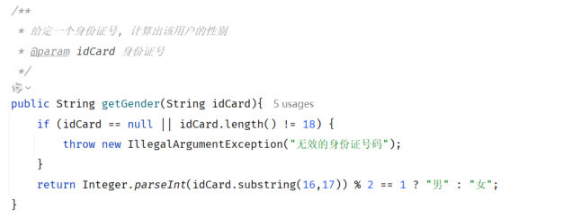

[上一篇](/posts/编程学习/javaweb学习笔记/27-junit单元测试入门/)跑通了第一个单元测试，但留了个坑：**测试跑绿了不代表结果是对的**——只打印不检查，JUnit 只知道"方法没抛异常"，不知道"结果对不对"。这一篇把坑填上，对应 PPT 第 53 页目录里的后两节：**断言**（判断结果对不对）和**常见注解**（参数化测试、显示名称、执行时机）。

## 断言是什么

PPT 第 59 页的定义：

> **断言：JUnit 提供了一些辅助方法，用来帮我们确定被测试的方法是否按照预期的效果正常工作，这种方式称为断言。**

拆开这句：

- **JUnit 提供的一些辅助方法**：断言不是 Java 语言的关键字，是 JUnit 提供的工具方法，都在 `org.junit.jupiter.api.Assertions` 这个类里，调用长这样：`Assertions.assertEquals(...)`；
- **确定被测试的方法是否按照预期正常工作**：你要把"预期结果"写出来（比如预期性别是"男"），断言负责比较"预期"和"实际"，**不一致就报错**——这个"报错"就是测试变红的原因。

### 断言方法表

PPT 第 59 页把常用的断言方法列成了一张表（注意每个方法的第一个参数都是"预期/条件"，最后一个参数都是错误提示信息）：

| 断言方法 | 描述 |
| --- | --- |
| `Assertions.assertEquals(Object exp, Object act, String msg)` | 检查两个值**是否相等**，**不相等就报错** |
| `Assertions.assertNotEquals(Object unexp, Object act, String msg)` | 检查两个值**是否不相等**，**相等就报错** |
| `Assertions.assertNull(Object act, String msg)` | 检查对象**是否为 null**，**不为 null 就报错** |
| `Assertions.assertNotNull(Object act, String msg)` | 检查对象**是否不为 null**，**为 null 就报错** |
| `Assertions.assertTrue(boolean condition, String msg)` | 检查条件**是否为 true**，**不为 true 就报错** |
| `Assertions.assertFalse(boolean condition, String msg)` | 检查条件**是否为 false**，**不为 false 就报错** |
| `Assertions.assertThrows(Class expType, Executable exec, String msg)` | 检查程序运行**抛出的异常是否符合预期** |

PPT 第 59 页的"提示"专门解释了最后一个参数：

> **提示：上述方法形参中的最后一个参数 `msg`，表示错误提示信息，可以不指定（有对应的重载方法）。**

也就是说 `Assertions.assertEquals("男", gender)` 和 `Assertions.assertEquals("男", gender, "性别获取错误有问题")` 都能用——**加了 `msg`，测试失败时这句提示会一起打印出来**，方便一眼看出是哪个检查点挂了。

> [!TIP]
> 本机实测（Maven 3.9.14 / JDK 17）：把上面七个断言方法各写一个测试方法跑一遍（`assertEquals`、`assertNotEquals`、`assertNull` + `assertNotNull`、`assertTrue` + `assertFalse`、`assertThrows`），结果全部通过：
>
> ```text
> [INFO] Running 断言方法逐个验证
> [INFO] Tests run: 5, Failures: 0, Errors: 0, Skipped: 0, Time elapsed: 0.069 s -- in 断言方法逐个验证
> [INFO] Results:
> [INFO] Tests run: 5, Failures: 0, Errors: 0, Skipped: 0
> [INFO] BUILD SUCCESS
> ```
>
> 其中 `assertThrows` 的写法值得单独看一眼——它是"**预期这个方法会抛异常**"，所以要把调用包成 lambda：
>
> ```java
> @Test
> public void testThrows(){
>     Assertions.assertThrows(IllegalArgumentException.class, () -> {
>         userService.getGender("123"); // 长度不是 18 位，业务方法会抛异常
>     });
> }
> ```
>
> 反过来，如果业务方法**没抛**异常，这个断言就会失败——所以它检查的不是"代码成功"，而是"**抛的异常和预期一致**"。

### 断言失败长什么样

光看"通过"不够，真正有用的是失败时给的线索。课程测试类里就有现成的例子：

```java
@Test
public void testGenderWithAssert(){
    UserService userService = new UserService();
    String gender = userService.getGender("100000200010011011");
    //断言
    //Assertions.assertEquals("男", gender);     // 不带提示信息（课程里被注释掉的那行）
    Assertions.assertEquals("男", gender, "性别获取错误有问题");   // 带提示信息
}
```

本机把"预期值故意写错"（预期 100，实际 25）跑了一遍，真实输出如下：

> [!WARNING]
> 本机实测（Maven 3.9.14 / JDK 17）——故意写错的断言，`assertEquals(100, age)`（真实年龄是 25）：
>
> ```java
> @Test
> @DisplayName("预期年龄是 100（故意写错）")
> public void testGetAgeWithWrongExpect(){
>     UserService userService = new UserService();
>     Integer age = userService.getAge("100000200010011011");
>     // 故意把预期值写成 100，实际是 25 —— 断言会失败
>     Assertions.assertEquals(100, age);
> }
> ```
>
> 真实输出（只摘了关键几行，中间那一长串是 JUnit 内核的调用栈）：
>
> ```text
> [INFO] Running 断言失败演示
> [ERROR] Tests run: 1, Failures: 1, Errors: 0, Skipped: 0, Time elapsed: 0.060 s <<< FAILURE! -- in 断言失败演示
> [ERROR] com.itheima.UserServiceAssertFailTest.testGetAgeWithWrongExpect -- Time elapsed: 0.034 s <<< FAILURE!
> org.opentest4j.AssertionFailedError: expected: <100> but was: <25>
> 	at org.junit.jupiter.api.AssertionFailureBuilder.build(AssertionFailureBuilder.java:151)
> 	...
> 	at org.junit.jupiter.api.Assertions.assertEquals(Assertions.java:535)
> 	at com.itheima.UserServiceAssertFailTest.testGetAgeWithWrongExpect(UserServiceAssertFailTest.java:19)
> 	...
> [ERROR] Failures:
> [ERROR]   UserServiceAssertFailTest.testGetAgeWithWrongExpect:19 expected: <100> but was: <25>
> [INFO] Tests run: 1, Failures: 1, Errors: 0, Skipped: 0
> [ERROR] Failed to execute goal org.apache.maven.plugins:maven-surefire-plugin:3.5.4:test (default-test) on project junit-demo: There are test failures.
> [INFO] ------------------------------------------------------------------------
> [INFO] BUILD FAILURE
> ```
>
> 这份输出里藏着三条实用信息：
>
> 1. **`expected: <100> but was: <25>`**：直接告诉你"预期是 100，实际拿到 25"——**先看这行**，通常一眼就能判断是断言写错了还是业务代码真的错了；
> 2. **栈里最后一行 `at com.itheima.UserServiceAssertFailTest.testGetAgeWithWrongExpect(UserServiceAssertFailTest.java:19)`**：这是你自己的代码里**抛错的那一行**（第 19 行 = 那行 `assertEquals`），顺着它能直接定位到出问题的断言；
> 3. **`Failures:` 那段**（`UserServiceAssertFailTest.testGetAgeWithWrongExpect:19 expected: <100> but was: <25>`）是 surefire 汇总的失败清单，格式是 **`类名.方法名:行号 失败原因`**；最后 `BUILD FAILURE` 说明**测试失败会让整个 Maven 构建失败**——顺带把"`mvn package` 为什么被测试挡住"讲通了。

如果希望"哪一行断言挂了"更直观，加上 `msg` 就够了。本机实测同一个方法的另一版本——**故意把预期写成"女"、实际返回"男"**，并且带上提示信息"性别获取错误有问题"：

```text
org.opentest4j.AssertionFailedError: 性别获取错误有问题 ==> expected: <女> but was: <男>
	at com.itheima.AssertMsgDemoTest.testGenderWithMsg(AssertMsgDemoTest.java:18)
```

**`msg` 会顶在错误信息最前面**（`性别获取错误有问题 ==> expected: <女> but was: <男>`），后面才是 expected/actual 对比——所以 `msg` 适合写"这个断言在检查什么"，比如"年龄不应该是 null""性别获取错误"。

## 为什么需要断言

PPT 第 60 页专门用一页问答把这件事说透：

> **在 JUnit 单元测试中，为什么要使用断言？**
>
> **单元测试方法运行不报错，不代表业务方法没问题。**
> **通过断言可以检测方法运行结果是否和预期一致，从而判断业务方法的正确性。**
>
> （页面上还留了一行方法签名提示：`Assertions.assertXxxx(...)`）

"运行不报错 ≠ 业务没问题"有两层意思，都能用本机实测复现：

| 情况 | 现象 | 是不是真的"没问题" |
| --- | --- | --- |
| **只打印、不写断言** | 测试跑完 → 绿色，`Failures: 0` | **不是**。结果再离谱也不会失败（[上一篇](/posts/编程学习/javaweb学习笔记/27-junit单元测试入门/)实测过：方法名叫 `testGenderShouldBeMale`、实际返回"女"，照样绿） |
| **写了断言** | 结果与预期不一致 → 红色，报 `AssertionFailedError: expected: <x> but was: <y>` | **这才是可信的绿色**：绿色 = 所有断言都成立 |

所以单元测试的"骨架"其实就两件事：**调用业务方法 → 用断言检查结果**。前面的 `System.out.println(age)` 只是学步阶段的临时手段，写正式测试时都要换成断言。

## JUnit 常见注解

PPT 第 62 页："在 JUnit 中还提供了一些注解，增强其功能，常见的注解有以下几个"：

| 注解 | 说明 | 备注 |
| --- | --- | --- |
| **`@Test`** | 测试类中的方法用**它**修饰才能成为测试方法，才能启动执行 | 单元测试 |
| **`@ParameterizedTest`** | **参数化测试**的注解（可以让**单个测试运行多次**，每次运行时**仅参数不同**） | **用了该注解，就不需要 `@Test` 注解了** |
| **`@ValueSource`** | 参数化测试的**参数来源**，赋予测试方法参数 | 与参数化测试注解**配合使用** |
| **`@DisplayName`** | 指定测试类、测试方法**显示的名称**（默认为类名、方法名） | — |
| **`@BeforeEach`** | 用来修饰一个**实例方法**，该方法会在**每一个**测试方法执行**之前**执行一次 | 初始化资源（准备工作） |
| **`@AfterEach`** | 用来修饰一个**实例方法**，该方法会在**每一个**测试方法执行**之后**执行一次 | 释放资源（清理工作） |
| **`@BeforeAll`** | 用来修饰一个**静态方法**，该方法会在**所有**测试方法之前**只执行一次** | 初始化资源（准备工作） |
| **`@AfterAll`** | 用来修饰一个**静态方法**，该方法会在**所有**测试方法之后**只执行一次** | 释放资源（清理工作） |

几个容易记混的点，单独拎出来：

- **`@ParameterizedTest` 和 `@Test` 二选一**：参数化测试的注解本身就"替代"了 `@Test`，两个都写没必要（PPT 的备注原话："用了该注解，就不需要 @Test 注解了"）。
- **`@BeforeEach`/`@AfterEach` 是"每个方法一次"，`@BeforeAll`/`@AfterAll` 是"整类一次"**：
  - 前者修饰**实例方法**（`public void`），因为每个测试方法都会新建一个测试类实例，实例方法跟着走；
  - 后者修饰**静态方法**（`public static void`）——它要在任何实例创建之前就执行，所以必须是 static。
- **它们不管测试是通过还是失败都会执行**，所以常用来"准备资源 / 释放资源"（比如建连接、建对象、清理临时数据）。

课程 `UserServiceTest.java` 里就有一段完整示例，只是被注释掉了（老师用来演示执行顺序的）：

```java
@BeforeAll //在所有的单元测试方法运行之前, 运行一次
public static void beforeAll(){
    System.out.println("before All");
}

@AfterAll //在所有的单元测试方法运行之后, 运行一次
public static void afterAll(){
    System.out.println("after All");
}

@BeforeEach //在每一个单元测试方法运行之前, 都会运行一次
public void beforeEach(){
    System.out.println("before Each");
}

@AfterEach //在每一个单元测试方法运行之后, 都会运行一次
public void afterEach(){
    System.out.println("after Each");
}
```

### 执行时机：靠打印顺序看一遍

PPT 上只有"执行一次 / 执行一次每一次"这样的文字说明，执行顺序到底是什么样？**跑一遍最直观**——本机用四个注解加上两个 `@Test` 方法、一个参数化测试实跑了一次，打印顺序如下（就是证据）：

> [!TIP]
> 本机实测（Maven 3.9.14 / JDK 17）——四个生命周期注解各打印一行，注意各个缩进只是为了让层次好读，实际输出没有缩进：
>
> ```text
> [INFO] Running 注解执行顺序演示类
> [BeforeAll]  所有测试方法之前，只执行一次（静态方法）
>   [BeforeEach] 某个测试方法执行之前（初始化资源）
>     >>> 正在执行：第一个测试方法 testOne
>   [AfterEach]  某个测试方法执行之后（释放资源）
>   [BeforeEach] 某个测试方法执行之前（初始化资源）
>     >>> 正在执行：第二个测试方法 testTwo
>   [AfterEach]  某个测试方法执行之后（释放资源）
>   [BeforeEach] 某个测试方法执行之前（初始化资源）
>     >>> 正在执行：参数化测试，本次参数 idCard=100000200010011011 → 性别=男
>   [AfterEach]  某个测试方法执行之后（释放资源）
>   [BeforeEach] 某个测试方法执行之前（初始化资源）
>     >>> 正在执行：参数化测试，本次参数 idCard=100000200010011031 → 性别=男
>   [AfterEach]  某个测试方法执行之后（释放资源）
>   [BeforeEach] 某个测试方法执行之前（初始化资源）
>     >>> 正在执行：参数化测试，本次参数 idCard=100000200010011022 → 性别=女
>   [AfterEach]  某个测试方法执行之后（释放资源）
> [AfterAll]   所有测试方法之后，只执行一次（静态方法）
> [INFO] Tests run: 5, Failures: 0, Errors: 0, Skipped: 0, Time elapsed: 0.086 s -- in 注解执行顺序演示类
> ```
>
> 从这份输出能读出四件事：
>
> 1. **`@BeforeAll` 在最上面、`@AfterAll` 在最下面**，各自**只出现一次**；
> 2. **`@BeforeEach` → 测试方法 → `@AfterEach`** 是一组，**每个测试方法前后各来一遍**（上面出现了 5 组）；
> 3. **参数化测试的 3 组参数算 3 次执行**，所以 `beforeEach/afterEach` 也跟着跑了 3 遍；
> 4. 统计数字是 **`Tests run: 5`**——2 个普通测试方法 + 1 个参数化方法（3 组参数）＝ 5 次执行。

### 参数化测试：一个方法跑多次

"同一个方法，换几组参数各跑一遍"就是参数化测试。课程 `UserServiceTest.java` 里的写法是：

```java
/**
 * 参数化测试
 */
@DisplayName("测试用户性别")
@ParameterizedTest                                                          // 替代 @Test
@ValueSource(strings = {"100000200010011011","100000200010011031","100000200010011051"})  // 参数来源
public void testGetGender2(String idCard){                                  // 方法可以有形参了
    UserService userService = new UserService();
    String gender = userService.getGender(idCard);
    //断言
    Assertions.assertEquals("男", gender);
}
```

三个注解各管一件事，配合起来才完整：

| 注解 | 作用 | 少了它会怎样 |
| --- | --- | --- |
| `@ParameterizedTest` | 声明"这是参数化测试"，让**一个方法运行多次** | 没它就不是参数化测试，`@ValueSource` 也不会生效 |
| `@ValueSource` | 提供每次运行用的**参数值**（这里是三个字符串） | 没有参数来源，参数化测试没得跑 |
| `@DisplayName` | 指定测试类/测试方法**显示的名称** | 显示名称退回默认的**类名/方法名** |

上一节那份实测输出里，"Running **注解执行顺序演示类**"用的就是类上的 `@DisplayName`——**没有写 `@DisplayName` 时，控制台显示的是全类名**（比如 `Running com.itheima.UserServiceTest`）。这也是为什么上一篇里跑课程代码显示的是中文的"用户信息测试类"。

> [!NOTE]
> `@ValueSource` 只是参数来源的一种，PPT 这张表里只列了它，用法是 `@ValueSource(strings = {...})`、`ints = {...}` 这样按类型给一组值；它的职责就是"**赋予测试方法参数**"，而参数化测试让方法**可以声明形参**——这正好是 PPT 第 63 页第一个问答的答案。

## 必答问答（PPT 第 63 页）

| PPT 的问题 | 答案 |
| --- | --- |
| JUnit 单元测试的方法，是否可以声明方法形参？ | **可以的，参数化测试**：`@ParameterizedTest` + `@ValueSource` |
| 如何实现在单元测试方法运行之前，做一些初始化操作？ | **`@BeforeEach`、`@BeforeAll`** |
| 如何实现在单元测试方法运行之后，释放对应的资源？ | **`@AfterEach`、`@AfterAll`** |

## AI 辅助写测试（PPT 第 64 页）

PPT 第 64 页给了一个"让 AI 帮你写测试"的例子：**基于 AI，测试 `UserService` 中的 `getGender` 方法**：


*图：PPT 第 64 页——要被 AI 测试的 `getGender` 方法（含中文注释：给定一个身份证号计算出该用户的性别；方法里先校验身份证号是否为 null 或长度不为 18，不合法就 `throw new IllegalArgumentException("无效的身份证号码")`，最后用第 17 位的奇偶判断"男/女"）*

课程代码里已经放好了 AI 生成的那个测试类 `UserServiceAiTest.java`，它和手写的 `UserServiceTest` 最大的区别是**覆盖得更全、注解用得更规范**：

```java
package com.itheima;

import org.junit.jupiter.api.*;
import org.junit.jupiter.params.ParameterizedTest;
import org.junit.jupiter.params.provider.ValueSource;

import static org.junit.jupiter.api.Assertions.*;   // 静态导入：可以直接写 assertEquals，不用写 Assertions.

public class UserServiceAiTest {

    private UserService userService;

    @BeforeEach // 在每个测试方法执行前执行：把要用的对象准备好
    public void setUp() {
        userService = new UserService();
    }

    @Test
    public void getGender_ValidMaleIdCard_ReturnsMale() {
        String gender = userService.getGender("100000200010011011");
        assertEquals("男", gender, "性别获取错误，应为男性");
    }

    @Test
    public void getGender_ValidFemaleIdCard_ReturnsFemale() {
        String gender = userService.getGender("100000200010011022");
        assertEquals("女", gender, "性别获取错误，应为女性");
    }

    @Test
    public void getGender_NullIdCard_ThrowsException() {
        assertThrows(IllegalArgumentException.class, () -> {
            userService.getGender(null);
        }, "无效的身份证号码");
    }

    @Test
    public void getGender_InvalidLengthIdCard_ThrowsException() {
        assertThrows(IllegalArgumentException.class, () -> {
            userService.getGender("10000020001001101");   // 只有 17 位
        }, "无效的身份证号码");
    }

    @ParameterizedTest
    @ValueSource(strings = {"100000200010011011", "100000200010011031", "100000200010011051"})
    public void getGender_MultipleMaleIdCards_ReturnsMale(String idCard) {
        String gender = userService.getGender(idCard);
        assertEquals("男", gender, "性别获取错误，应为男性");
    }

    @ParameterizedTest
    @ValueSource(strings = {"100000200010011022", "100000200010011042", "100000200010011062"})
    public void getGender_MultipleFemaleIdCards_ReturnsFemale(String idCard) {
        String gender = userService.getGender(idCard);
        assertEquals("女", gender, "性别获取错误，应为女性");
    }
}
```

这个 AI 写的测试类里有几处可以直接抄的"好习惯"：

| 做法 | 好处 |
| --- | --- |
| `@BeforeEach` 里创建 `userService`，方法里直接用 | 每个测试方法都有**全新的对象**，互不干扰；不用在每个方法里重复 `new` |
| 方法名写成 `getGender_ValidMaleIdCard_ReturnsMale` | 名字就把"**测什么方法、什么场景、预期什么结果**"说全了 |
| 正常值（男/女）+ 异常值（null、17 位）都测 | 覆盖了业务方法里的两个分支：**正常返回**和**参数校验抛异常** |
| 断言一律带 `msg` | 失败时能一眼看出是哪一类预期没满足 |
| 用 `@ParameterizedTest` 批量测多个身份证号 | 一个方法覆盖多组数据，不用复制粘贴 |

> [!TIP]
> **`import static org.junit.jupiter.api.Assertions.*;` 是"静态导入"**——有了它就能直接写 `assertEquals(...)`、`assertThrows(...)`，而不用每次写全 `Assertions.assertEquals(...)`。两种写法等价（课程手写版用 `Assertions.` 前缀、AI 版用静态导入），看团队习惯选一种，**别在同一个类里混着用**。本机实测（Maven 3.9.14 / JDK 17）：把这个测试类放进 `src/test/java` 跑 `mvn test`，6 个测试方法（其中 2 个参数化，各 3 组参数）一共 **`Tests run: 10, Failures: 0, Errors: 0`**，全部通过。

## 小结

| 问题 | 答案 |
| --- | --- |
| 断言是什么？ | **JUnit 提供的辅助方法**，用来确定被测试的方法**是否按照预期的效果正常工作** |
| 为什么要用断言？ | **单元测试方法运行不报错，不代表业务方法没问题**；通过断言检测**运行结果是否和预期一致**，从而判断业务方法的正确性 |
| 常用断言方法有哪些？ | `assertEquals`（相等）/ `assertNotEquals`（不相等）/ `assertNull`（为 null）/ `assertNotNull`（不为 null）/ `assertTrue`（为 true）/ `assertFalse`（为 false）/ `assertThrows`（抛出的异常符合预期）——**不满足条件就报错** |
| 断言最后一个参数 `msg` 是什么？ | **错误提示信息**，可以不指定（有对应的重载方法）；写上去以后会出现在失败输出的最前面 |
| 断言失败会看到什么？ | `org.opentest4j.AssertionFailedError: expected: <预期> but was: <实际>`，栈里会指到**你自己代码的那一行**；surefire 还会汇总成 `类名.方法名:行号 失败原因`，最后 `BUILD FAILURE` |
| `@Test` 干什么？ | 方法用**它**修饰才能成为测试方法、才能启动执行 |
| `@ParameterizedTest` 和 `@ValueSource`？ | 参数化测试注解（让**单个测试运行多次**，每次仅参数不同）+ 参数来源；**用了 `@ParameterizedTest` 就不需要 `@Test`** |
| `@DisplayName` 干什么？ | 指定测试类、测试方法**显示的名称**（**默认为类名、方法名**） |
| `@BeforeEach` / `@AfterEach` 什么时候执行？ | 修饰**实例方法**，分别在**每一个**测试方法执行**之前**/**之后**各执行一次（初始化资源 / 释放资源）；本机实测每个测试方法前后各来一遍，参数化的每一组参数也算一次 |
| `@BeforeAll` / `@AfterAll` 什么时候执行？ | 修饰**静态方法**，在所有测试方法**之前/之后只执行一次** |

## 相关

- [上一篇：JUnit单元测试入门](/posts/编程学习/javaweb学习笔记/27-junit单元测试入门/)
- [下一篇：Maven依赖范围与常见问题](/posts/编程学习/javaweb学习笔记/29-maven依赖范围与常见问题/)
- [Maven依赖管理与生命周期（`test` 阶段靠 surefire 插件跑 JUnit）](/posts/编程学习/javaweb学习笔记/26-maven依赖管理与生命周期/)

## 练习题

### 一、知识回顾（读完直接做下面的实践题）

1. **断言**的定义：**JUnit 提供的一些辅助方法**，用来帮我们确定**被测试的方法是否按照预期的效果正常工作**，这种方式称为断言；调用形式是 `Assertions.assertXxxx(...)`
2. **为什么要用断言**：**单元测试方法运行不报错，不代表业务方法没问题**；通过断言可以检测**方法运行结果是否和预期一致**，从而判断业务方法的正确性（PPT 第 60 页的必答问答）
3. 七个断言方法的含义：`assertEquals` 检查两个值**是否相等**（不相等就报错）；`assertNotEquals` 检查**是否不相等**（相等就报错）；`assertNull` 检查**是否为 null**（不为 null 报错）；`assertNotNull` 检查**是否不为 null**（为 null 报错）；`assertTrue` 检查条件**是否为 true**（不为 true 报错）；`assertFalse` 检查条件**是否为 false**（不为 false 报错）；`assertThrows` 检查**抛出的异常是否符合预期**
4. **`msg` 参数与断言失败输出**：最后一个参数 `msg` 表示**错误提示信息**、**可以不指定**（有对应的重载方法），带上它时失败输出是 `AssertionFailedError: <msg> ==> expected: <预期> but was: <实际>`（本机实测：`org.opentest4j.AssertionFailedError: expected: <100> but was: <25>`）；栈里会指到**自己代码的那一行**（如 `UserServiceAssertFailTest.java:19`），surefire 还会汇总成 `类名.方法名:行号 失败原因`，最后 `BUILD FAILURE`
5. **`@Test`**：测试类中的方法用**它**修饰才能成为测试方法、才能启动执行（备注：单元测试）
6. **参数化测试的两个注解**：`@ParameterizedTest`（可以让**单个测试运行多次，每次运行时仅参数不同**；**用了该注解就不需要 `@Test`**）+ `@ValueSource`（参数来源，赋予测试方法参数，**与参数化测试注解配合使用**）
7. **`@DisplayName`**：指定测试类、测试方法**显示的名称**（**默认为类名、方法名**）；本机实测类上写了 `@DisplayName("用户信息测试类")` 之后，`mvn test` 输出的是 `Running 用户信息测试类`
8. **四个生命周期注解**：`@BeforeEach` / `@AfterEach` 修饰**实例方法**，在**每一个**测试方法执行**之前/之后各一次**（初始化资源 / 释放资源）；`@BeforeAll` / `@AfterAll` 修饰**静态方法**，在**所有**测试方法之前/之后**只执行一次**；实测顺序是 `@BeforeAll` → （`@BeforeEach` → 测试方法 → `@AfterEach`）×N → `@AfterAll`，其中**参数化测试的每一组参数都算一次**
9. PPT 第 63 页三个必答问答：方法**可以声明形参**（参数化测试 `@ParameterizedTest` + `@ValueSource`）；**运行之前的初始化**用 `@BeforeEach`、`@BeforeAll`；**运行之后释放资源**用 `@AfterEach`、`@AfterAll`
10. **AI 写测试的好习惯**（课程 `UserServiceAiTest.java`）：用 `@BeforeEach` 统一创建被测对象；方法名写成"方法_场景_预期结果"；正常值与异常值都覆盖（`null`、长度不足）；断言带 `msg`；用参数化测试覆盖多组数据

### 二、动手题

- [ ] **2-1 把"只打印"的测试改成"断言版"**
  下面这个测试方法只打印结果、什么也不检查，请把它改成**真的能判断对错**的测试：
  1. 调用 `new UserService().getGender("100000200010011011")`（这个方法会返回"男"）；
  2. 用断言检查"返回的性别是男"，并带上错误提示信息"性别获取错误"；
  3. 再补一个断言，用**同一个身份证号**检查 `getGender` 的返回值和"女"**不相等**。
  （练习文件 `test_28_断言改造.java` 里已经给了写作区。）

  > [!TIP]- 提示（先自己想，实在想不出再点开）
  > **一级 · 思路**：断言就是"我把预期写出来，你来比对"；比"相等"和比"不相等"是两个不同的方法
  > **二级 · 方法**：断言的类名是 `Assertions`；判断相等用 `assertEquals(预期, 实际, 提示信息)`；判断不相等用 `assertNotEquals(不想要的, 实际, 提示信息)`
  > **三级 · 骨架**：`Assertions.____("男", gender, "性别获取错误");` / `Assertions.____("女", gender);`

  > [!TIP]- 参考答案（做完再点开）
  > ```java
  > package com.itheima;
  >
  > import org.junit.jupiter.api.Assertions;
  > import org.junit.jupiter.api.Test;
  >
  > public class UserServiceTest {
  >
  >     @Test
  >     public void testGetGenderWithAssert(){
  >         UserService userService = new UserService();
  >         String gender = userService.getGender("100000200010011011");
  >         // 断言①：预期结果是"男"
  >         Assertions.assertEquals("男", gender, "性别获取错误");
  >         // 断言②：结果不会是"女"
  >         Assertions.assertNotEquals("女", gender);
  >     }
  > }
  > ```
  > 检查点：① `Assertions` 要 import（`org.junit.jupiter.api.Assertions`）；② 参数顺序是"**预期在前、实际在后**"——写反了报错信息会变成 `expected: <男> but was: <女>` 反着读，容易误判；③ 本机实测（Maven 3.9.14 / JDK 17）这样写的结果是 `Tests run: 1, Failures: 0, Errors: 0` + `BUILD SUCCESS`；把预期故意改成"女"就会立刻 `Failures: 1`，报 `性别获取错误 ==> expected: <女> but was: <男>`。

- [ ] **2-2 用参数化测试一次测多个身份证号**
  被测方法还是 `getGender(String idCard)`。要求：
  1. 写一个测试方法，用一个注解让**它运行三次**，三次分别传入 `100000200010011011`、`100000200010011031`、`100000200010011051`；
  2. 测试方法要**声明一个形参**接收身份证号；
  3. 方法里断言"返回的性别是男"；
  4. 给这个测试方法起一个中文的**显示名称**（运行报告里显示的中文名）。
  （练习文件 `test_28_参数化测试.java` 里已经给了写作区。）

  > [!TIP]- 提示（先自己想，实在想不出再点开）
  > **一级 · 思路**：让一个方法跑多次，靠的是"参数化测试"；参数从哪儿来，靠的是"参数来源"；想让报告里显示中文名，靠的是"显示名称"
  > **二级 · 方法**：`@ParameterizedTest`（不再需要 `@Test`）+ `@ValueSource(strings = {...})` + `@DisplayName("...")`；方法签名形如 `public void testXxx(String idCard)`
  > **三级 · 骨架**：`@____ @____(strings = {"...","...","..."}) public void ____(String idCard){ Assertions.assertEquals("男", new UserService().getGender(idCard)); }`

  > [!TIP]- 参考答案（做完再点开）
  > ```java
  > package com.itheima;
  >
  > import org.junit.jupiter.api.Assertions;
  > import org.junit.jupiter.api.DisplayName;
  > import org.junit.jupiter.params.ParameterizedTest;
  > import org.junit.jupiter.params.provider.ValueSource;
  >
  > public class UserServiceTest {
  >
  >     @DisplayName("测试多个男性身份证号")
  >     @ParameterizedTest
  >     @ValueSource(strings = {"100000200010011011", "100000200010011031", "100000200010011051"})
  >     public void testGetGender2(String idCard){
  >         String gender = new UserService().getGender(idCard);
  >         Assertions.assertEquals("男", gender);
  >     }
  > }
  > ```
  > 检查点：① **不要**再写 `@Test`（课程 PPT 备注："用了该注解，就不需要 `@Test` 注解了"），两个都写不会报错但属于多余；② 参数化测试的 import 是 `org.junit.jupiter.params.*` 那一套（和 `org.junit.jupiter.api.*` 不是一个包，IDEA 里容易选错）；③ 本机实测（Maven 3.9.14 / JDK 17）：同一个方法传 3 组参数算 **3 次执行**——运行报告里 `Tests run` 会把这 3 次分开计数（配套的 `@BeforeEach`/`@AfterEach` 也跟着跑 3 遍）。

- [ ] **2-3 观察四个生命周期注解的执行顺序**
  写一个测试类，验证"谁在什么时候执行"：
  1. 准备四个方法，分别加 `@BeforeAll`、`@AfterAll`、`@BeforeEach`、`@AfterEach`，每个方法里打印一句能认出自己的话（比如 `System.out.println("[BeforeAll] ...")`）；
  2. 再写**两个**普通的 `@Test` 方法，各自也打印一句（比如"正在执行 testOne"）；
  3. 运行整个测试类，把打印顺序原样抄到文件末尾的注释里；
  4. 在注释里回答：`BeforeAll` 和 `BeforeEach` 各执行了几次？为什么其中一个必须是**静态方法**？如果把参数化测试加进来，`BeforeEach` 的次数会怎么变？
  （练习文件 `test_28_注解执行时机.java` 里已经给了写作区。）

  > [!TIP]- 提示（先自己想，实在想不出再点开）
  > **一级 · 思路**：分两档——"整个类一共一次"和"每个测试方法各一次"；分两个时间点——"之前"和"之后"
  > **二级 · 方法**：整个类一次的是 `@BeforeAll` / `@AfterAll`（修饰 `public static void`），每个方法一次的是 `@BeforeEach` / `@AfterEach`（修饰 `public void`）
  > **三级 · 骨架**：先打 `@BeforeAll` 那句 → 每个测试方法前后各夹一组 `@BeforeEach`/`@AfterEach` → 最后打 `@AfterAll` 那句

  > [!TIP]- 参考答案（做完再点开）
  > ```java
  > package com.itheima;
  >
  > import org.junit.jupiter.api.*;
  >
  > public class LifecycleDemoTest {
  >
  >     @BeforeAll                                  // 所有测试方法之前，只执行一次（必须是静态方法）
  >     public static void beforeAll(){
  >         System.out.println("[BeforeAll]  所有测试方法之前，只执行一次（静态方法）");
  >     }
  >
  >     @AfterAll                                   // 所有测试方法之后，只执行一次（必须是静态方法）
  >     public static void afterAll(){
  >         System.out.println("[AfterAll]   所有测试方法之后，只执行一次（静态方法）");
  >     }
  >
  >     @BeforeEach                                 // 每个测试方法之前各执行一次
  >     public void beforeEach(){
  >         System.out.println("  [BeforeEach] 某个测试方法执行之前（初始化资源）");
  >     }
  >
  >     @AfterEach                                  // 每个测试方法之后各执行一次
  >     public void afterEach(){
  >         System.out.println("  [AfterEach]  某个测试方法执行之后（释放资源）");
  >     }
  >
  >     @Test
  >     public void testOne(){ System.out.println("    >>> 正在执行：第一个测试方法 testOne"); }
  >
  >     @Test
  >     public void testTwo(){ System.out.println("    >>> 正在执行：第二个测试方法 testTwo"); }
  > }
  > ```
  > 3. 本机实测（Maven 3.9.14 / JDK 17）的打印顺序：
  >    ```text
  >    [BeforeAll]  所有测试方法之前，只执行一次（静态方法）
  >      [BeforeEach] 某个测试方法执行之前（初始化资源）
  >        >>> 正在执行：第一个测试方法 testOne
  >      [AfterEach]  某个测试方法执行之后（释放资源）
  >      [BeforeEach] 某个测试方法执行之前（初始化资源）
  >        >>> 正在执行：第二个测试方法 testTwo
  >      [AfterEach]  某个测试方法执行之后（释放资源）
  >    [AfterAll]   所有测试方法之后，只执行一次（静态方法）
  >    ```
  > 4. 三个问题的答案：① **`@BeforeAll`/`@AfterAll` 各 1 次**（整个类一次），**`@BeforeEach`/`@AfterEach` 各 2 次**（每个测试方法一次，本机输出里就是两组）；② `@BeforeAll` 必须是**静态方法**，因为它要在**任何测试类实例被创建之前**就执行，没有实例可用，只能靠类直接调用；③ 加上参数化测试后，**参数化的每一组参数都算一次测试方法执行**，所以 `@BeforeEach`/`@AfterEach` 的次数会跟着增加——本机另一份实测（2 个普通测试 + 1 个 3 组参数的参数化测试）里，`Tests run: 5`，`@BeforeEach`/`@AfterEach` 就各执行了 **5 次**。

### 三、综合题

- [ ] **3-1 给 UserService 写一个"带全套注解和断言"的测试类**
  被测类 `UserService` 有两个方法：`getAge(String idCard)`（返回年龄）和 `getGender(String idCard)`（返回"男"/"女"，**身份证不合法时抛 `IllegalArgumentException`**）。把这一篇学的东西全用上，写一个测试类：
  1. 用 `@DisplayName` 给测试类起一个中文名；
  2. 用 `@BeforeEach` 统一创建被测对象（而不是每个测试方法里各 `new` 一次）；
  3. 写两个测试方法，分别断言 `getAge("100000200010011011")` 返回 **25**、`getGender("100000200010011011")` 返回 **"男"**，断言都要带 `msg`；
  4. 再加一个测试方法，断言"传入不合法的身份证号（比如 `"123"` 或 `null`）会抛 `IllegalArgumentException`"；
  5. 再加一个参数化测试，用 `@ValueSource` 传 3 个男性身份证号，断言性别都是"男"；
  6. 运行整个测试类，把 `Tests run: x, Failures: x, Errors: x` 这一行抄下来；然后**故意把第 3 步里年龄的预期值改成 100**，再跑一次，把失败输出里 `expected: ... but was: ...` 那一行和指到你代码的**行号**记下来。
  （练习文件 `test_28_综合_完整测试类.java` 里按这 6 步给了写作区。）

  **涉及知识点**

  | 知识点 | 在这里的应用 |
  | --- | --- |
  | `@DisplayName` | 测试类、测试方法的中文显示名 |
  | `@BeforeEach` | 每个测试方法前创建 `UserService` 对象 |
  | 断言方法 | `assertEquals` 核对年龄与性别、`assertThrows` 核对异常 |
  | `msg` 参数 | 断言后加"年龄校验失败""性别校验失败"之类的提示 |
  | `@ParameterizedTest` + `@ValueSource` | 一个方法覆盖多个身份证号 |
  | 断言失败输出 | `expected: <x> but was: <y>` + 自己代码的行号 |

  > [!TIP]- 提示（先自己想，实在想不出再点开）
  > **一级 · 思路**：把"准备工作（@BeforeEach）→ 调业务方法 → 断言结果"这条线在每个测试方法里重复一遍；异常场景不用 try-catch，用专门的断言方法
  > **二级 · 方法**：相等用 `assertEquals(预期, 实际, msg)`；异常用 `assertThrows(异常类型.class, () -> { 调用业务方法 })`；参数化用 `@ParameterizedTest` + `@ValueSource(strings = {...})`（不再写 `@Test`）
  > **三级 · 骨架**：`private UserService ____;` → `@BeforeEach public void setUp(){ ____ = new UserService(); }` → `@Test public void testGetAge(){ Assertions.assertEquals(____, userService.getAge("100000200010011011"), "年龄校验失败"); }`

  > [!TIP]- 参考答案（做完再点开）
  > **3-1**
  > ```java
  > package com.itheima;
  >
  > import org.junit.jupiter.api.*;
  > import org.junit.jupiter.params.ParameterizedTest;
  > import org.junit.jupiter.params.provider.ValueSource;
  >
  > @DisplayName("用户业务测试类")
  > public class UserServiceFullTest {
  >
  >     private UserService userService;
  >
  >     @BeforeEach   // 每个测试方法执行之前都跑一次：准备好被测对象
  >     public void setUp(){
  >         userService = new UserService();
  >     }
  >
  >     @Test
  >     @DisplayName("测试年龄：2000-10-01 出生，2026-09-29 时是 25 岁")
  >     public void testGetAge(){
  >         Integer age = userService.getAge("100000200010011011");
  >         Assertions.assertEquals(25, age, "年龄校验失败");
  >     }
  >
  >     @Test
  >     @DisplayName("测试性别：第 17 位是奇数返回男")
  >     public void testGetGender(){
  >         String gender = userService.getGender("100000200010011011");
  >         Assertions.assertEquals("男", gender, "性别校验失败");
  >     }
  >
  >     @Test
  >     @DisplayName("测试异常：身份证号不合法要抛 IllegalArgumentException")
  >     public void testGetGenderInvalidIdCard(){
  >         Assertions.assertThrows(IllegalArgumentException.class, () -> {
  >             userService.getGender("123");   // 长度不是 18 位
  >         }, "无效的身份证号码");
  >     }
  >
  >     @DisplayName("参数化测试：多个男性身份证号")
  >     @ParameterizedTest
  >     @ValueSource(strings = {"100000200010011011", "100000200010011031", "100000200010011051"})
  >     public void testGetGenderParameterized(String idCard){
  >         String gender = userService.getGender(idCard);
  >         Assertions.assertEquals("男", gender, "性别校验失败");
  >     }
  > }
  > ```
  > 6. **运行结果**（本机实测，Maven 3.9.14 / JDK 17）：3 个普通 `@Test` 方法（年龄、性别、异常）+ 1 个参数化方法（3 组参数）＝ **6 次执行**，输出为 `Tests run: 6, Failures: 0, Errors: 0, Skipped: 0` + `BUILD SUCCESS`（运行报告里 `Running 用户业务测试类` 用的就是类上的 `@DisplayName`）。
  >    把年龄的预期值改成 100 后再次实测，失败信息是：
  >    ```text
  >    org.opentest4j.AssertionFailedError: expected: <100> but was: <25>
  >    	at com.itheima.UserServiceAssertFailTest.testGetAgeWithWrongExpect(UserServiceAssertFailTest.java:19)
  >    [ERROR]   UserServiceAssertFailTest.testGetAgeWithWrongExpect:19 expected: <100> but was: <25>
  >    [INFO] BUILD FAILURE
  >    ```
  >    **行号（`:19`）指向的就是那行 `assertEquals`**——所以排查测试失败的第一步永远是：看 `expected/but was`，再看它指到哪一行。

---

> 到这里"断言 + 注解"就齐了：测试方法用 `@Test`（或 `@ParameterizedTest`）启动、用断言判断结果、用 `@BeforeEach`/`@AfterEach` 管资源的准备和释放。下一篇解决最后一个问题：**pom 里那个 `<scope>test</scope>` 到底是干什么的**，以及 Maven 依赖下载出问题（`xxx.lastUpdated`）怎么处理。
