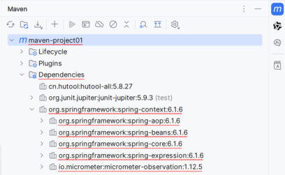

这是 Maven 这一章的最后一篇，收掉 [27](/posts/编程学习/javaweb学习笔记/27-junit单元测试入门/)、[28](/posts/编程学习/javaweb学习笔记/28-junit断言与常见注解/)两篇里一直留着的那个尾巴——**pom 里 junit 依赖后面那行 `<scope>test</scope>` 到底是干什么的**（PPT 第 66 页的"依赖范围"），再补上 PPT 第 69 页的 **Maven 常见问题**：依赖下载不完整留下的 `xxx.lastUpdated` 文件该怎么处理。

## 依赖范围：`<scope>` 是什么

PPT 第 67 页的定义：

> **依赖范围：依赖的 jar 包，默认情况下，可以在任何地方使用。可以通过 `<scope>…</scope>` 设置其作用范围。**

默认情况下一个依赖"到处都能用"，可以**通过 `<scope>` 把它限制在特定场合**。这里的"特定场合"就是 PPT 第 67 页列出的**三个作用范围**：

> **作用范围：**
> 1. **主程序范围有效。（`main` 文件夹范围内）**
> 2. **测试程序范围有效。（`test` 文件夹范围内）**
> 3. **是否参与打包运行。（`package` 指令范围内）**

翻成大白话：一个依赖的 jar，可能"写主程序的时候能用""写测试的时候能用""打完包运行时还能用"——这三件事**分开控制**，就是依赖范围。

### 四种取值

PPT 第 67 页给了完整的对照表（**Y = 有效，`-` = 无效**）：

| scope 值 | 主程序 | 测试程序 | 打包（运行） | 范例 |
| --- | --- | --- | --- | --- |
| **compile（默认）** | Y | Y | Y | **log4j** |
| **test** | - | Y | - | **junit** |
| **provided** | Y | Y | - | **servlet-api** |
| **runtime** | - | Y | Y | **jdbc 驱动** |

把这张表和上面的"三个作用范围"对齐，每条都能讲出道理：

| scope | 三个范围 | 为什么这样设计 |
| --- | --- | --- |
| **compile（默认）** | 主程序 ✅、测试程序 ✅、打包运行 ✅ | 最普通的依赖（如 **log4j** 日志）：主程序要写日志、测试也要、上线运行时还得有它，所以**哪儿都用得上**。**不写 `<scope>` 就是它** |
| **test** | 主程序 ❌、测试程序 ✅、打包运行 ❌ | 只给测试用的东西（如 **junit**）：主程序里根本不该出现 `@Test`，打包后更不该带着测试框架，**只在测试阶段有效** |
| **provided** | 主程序 ✅、测试程序 ✅、打包运行 ❌ | **由运行环境提供**的依赖（如 **servlet-api**）：写代码时要 `import` 它才能编译、写测试也要它，但真正跑起来时 **Tomcat 这类 Web 服务器自己就带了**——你打 war 包时再塞一份进去，反而容易和容器自带的版本打架，所以**不参与打包** |
| **runtime** | 主程序 ❌、测试程序 ✅、打包运行 ✅ | **编译时用不到、运行时才用得到**的依赖（如 **jdbc 驱动**）：代码里只用 JDBC 的接口（`java.sql.*`），驱动是在运行时靠反射加载的，所以主程序编译时不需要它，但**打包运行必须有** |

### 怎么写：PPT 里的 pom 例子

PPT 第 67 页给的就是 junit 加上范围的写法：

```xml
<dependency>
    <groupId>org.junit.jupiter</groupId>
    <artifactId>junit-jupiter</artifactId>
    <version>5.9.3</version>
    <scope>test</scope>   <!-- 依赖范围：只在测试程序里有效 -->
</dependency>
```

`<scope>` 写在 **`<dependency>` 里面**（和 groupId、artifactId、version 平级），**值就是 `compile`、`test`、`provided`、`runtime` 这四个词**。

> [!WARNING]
> PPT 第 67 页这个例子里 junit 的版本写的是 **5.9.3**，而 PPT 第 55 页（快速入门）和课程代码 `maven-project01/pom.xml` 里写的都是 **5.9.1**——同一份讲义里前后不一致，**按课程代码的版本（5.9.1）写就对**，可以理解为 PPT 这页只是拿 junit 举"依赖范围"的例子，顺手换了个版本号。

课程代码里那个 junit 依赖就正好是 PPT 快速入门 + 依赖范围两页的合体：

```xml
<!--junit依赖-->
<dependency>
    <groupId>org.junit.jupiter</groupId>
    <artifactId>junit-jupiter</artifactId>
    <version>5.9.1</version>
    <!--依赖范围-->
    <scope>test</scope>
</dependency>
```

### 必答问答（PPT 第 68 页）

| PPT 的问题 | 答案 |
| --- | --- |
| Maven 的依赖范围如何指定? | **`<scope>xxx</scope>`**（写在 `<dependency>` 里） |
| 常见的取值有哪些? | **`compile`（默认）**、**`test`**、**`provided`**、**`runtime`** |

### 实测一：依赖范围在依赖树里长什么样

依赖范围不是"写在 pom 里给人看的"，它真的会影响 Maven 的解析结果。本机用一个最小项目把四种取值各配一个依赖，跑 `mvn dependency:tree` 的真实输出：

> [!TIP]
> 本机实测（Maven 3.9.14 / JDK 17）——四个依赖分别是 `log4j:log4j:1.2.12`（不写 scope）、`org.junit.jupiter:junit-jupiter:5.9.1`（`test`）、`jakarta.servlet:jakarta.servlet-api:6.0.0`（`provided`）、`com.mysql:mysql-connector-j:8.3.0`（`runtime`）：
>
> ```text
> [INFO] com.itheima:scope-demo:jar:1.0-SNAPSHOT
> [INFO] +- log4j:log4j:jar:1.2.12:compile
> [INFO] +- org.junit.jupiter:junit-jupiter:jar:5.9.1:test
> [INFO] |  +- org.junit.jupiter:junit-jupiter-api:jar:5.9.1:test
> [INFO] |  |  +- org.opentest4j:opentest4j:jar:1.2.0:test
> [INFO] |  |  +- org.junit.platform:junit-platform-commons:jar:1.9.1:test
> [INFO] |  |  \- org.apiguardian:apiguardian-api:jar:1.1.2:test
> [INFO] |  +- org.junit.jupiter:junit-jupiter-params:jar:5.9.1:test
> [INFO] |  \- org.junit.jupiter:junit-jupiter-engine:jar:5.9.1:test
> [INFO] |     \- org.junit.platform:junit-platform-engine:jar:1.9.1:test
> [INFO] +- jakarta.servlet:jakarta.servlet-api:jar:6.0.0:provided
> [INFO] \- com.mysql:mysql-connector-j:jar:8.3.0:runtime
> [INFO]    \- com.google.protobuf:protobuf-java:jar:3.25.1:runtime
> ```
>
> 注意每行**坐标最后那一段**就是 scope：不写 scope 的 log4j 显示成 **`:compile`**（这就是"默认值"的由来）；junit 连同它带进来的一串传递性依赖**全是 `:test`**；servlet-api 是 **`:provided`**；jdbc 驱动（连它的传递依赖 protobuf）是 **`:runtime`**。**传递性依赖会继承 scope** 这一点很重要：写一个 `test` 范围的 junit，Maven 不会把它内部的 api/engine/params 变成主程序可用的东西。

### 实测二：`test` 范围的依赖，主程序真的用不了

"主程序 ❌"是什么意思？——**在 `src/main/java` 里的代码，根本引用不到这个 jar**。本机实测：在 `main` 目录里加一个类、`import org.junit.jupiter.api.Test`，然后编译：

> [!WARNING]
> 本机实测（Maven 3.9.14 / JDK 17）——`scope=test` 的 junit，在 `src/main/java` 里引用它：
>
> ```java
> package com.itheima;
>
> import org.junit.jupiter.api.Test;   // ← 这一行在 main 目录里就过不了编译
>
> public class JunitInMainDemo {
>     @Test
>     public void demo(){ }
> }
> ```
>
> 运行 `mvn compile` 的真实输出：
>
> ```text
> [INFO] Compiling 2 source files with javac [debug target 17] to target\classes
> [ERROR] COMPILATION ERROR :
> [ERROR] /C:/.../src/main/java/com/itheima/JunitInMainDemo.java:[3,29] 程序包org.junit.jupiter.api不存在
> [ERROR] /C:/.../src/main/java/com/itheima/JunitInMainDemo.java:[10,6] 找不到符号
> [ERROR]   符号:   类 Test
> [ERROR]   位置: 类 com.itheima.JunitInMainDemo
> [ERROR] BUILD FAILURE
> [ERROR] Failed to execute goal org.apache.maven.plugins:maven-compiler-plugin:3.15.0:compile (default-compile) on project junit-demo: Compilation failure
> ```
>
> 把那个类删掉再编译，立刻 `BUILD SUCCESS`。报错原文说得很直白：**`程序包org.junit.jupiter.api不存在`**——`test` 范围的 jar 不在主程序的编译 classpath 上。这条实测同时解释了 [27 篇](/posts/编程学习/javaweb学习笔记/27-junit单元测试入门/)里 PPT 第 65 页那个问答的深层原因：**"能不能在 main 目录里写单元测试？可以，但是不规范"**——只有把 junit 写成默认的 `compile` 范围才"可以"（连依赖范围都被迫放宽了，显然不划算），而按规范写成 `test` 之后，**main 目录里连 JUnit 的类都编译不过**。

### 实测三：三种 classpath 的对照（把"三个作用范围"落到底）

"主程序 / 测试程序 / 打包运行"这三个范围，在 Maven 里其实对应三条 **classpath（编译/运行时要加载哪些 jar 的清单）**。本机用 maven-dependency-plugin 把三条清单都打出来（`-DincludeScope=compile` 是主程序编译时、`runtime` 是打包运行后、`test` 是测试程序，默认值）：

> [!TIP]
> 本机实测（Maven 3.9.14 / JDK 17），用的是上面那个"四个依赖各一种 scope"的项目，只保留 jar 文件名：
>
> | 命令 | 打出来的 jar（主程序编译 / 打包运行 / 测试程序） |
> | --- | --- |
> | `mvn dependency:build-classpath -DincludeScope=compile` | `log4j-1.2.12.jar`、`jakarta.servlet-api-6.0.0.jar` |
> | `mvn dependency:build-classpath -DincludeScope=runtime` | `log4j-1.2.12.jar`、`mysql-connector-j-8.3.0.jar`、`protobuf-java-3.25.1.jar` |
> | `mvn dependency:build-classpath -DincludeScope=test` | 上面全部 12 个 jar（四类依赖都在） |
>
> 对着 PPT 的表格逐格核对，四种取值和三条 classpath 完全对得上：
>
> | scope | 主程序（compile 清单） | 测试程序（test 清单） | 打包运行（runtime 清单） | 对上了吗 |
> | --- | --- | --- | --- | --- |
> | **compile**（log4j） | ✅ 有 | ✅ 有 | ✅ 有 | Y / Y / Y |
> | **test**（junit） | ❌ 没有 | ✅ 有 | ❌ 没有 | - / Y / - |
> | **provided**（servlet-api） | ✅ 有 | ✅ 有 | ❌ 没有 | Y / Y / - |
> | **runtime**（jdbc 驱动） | ❌ 没有 | ✅ 有 | ✅ 有 | - / Y / Y |
>
> 三条清单的差别一眼可见：**servlet-api 只出现在前两条（编译、测试），jdbc 驱动只出现在后两条（测试、运行），junit 只在测试那条里**。这就是"依赖范围"三个字的实际效果，也是 PPT 表格里那些 Y 和 `-` 的由来。

## Maven 常见问题：依赖下载不完整

PPT 第 70 页就讲一个问题（页面标题"05 Maven 常见问题"），先把"现象 + 原因"说清楚：

> **产生原因：由于网络原因，依赖没有下载完整导致的，在 maven 仓库中生成了 `xxx.lastUpdated` 文件，该文件不删除，不会再重新下载。**

然后给了三条解决方案：

> **解决方案：**
> 1. **根据 maven 依赖的坐标，找到仓库中对应的 `xxx.lastUpdated` 文件，删除，删除之后重新加载项目即可。**
> 2. **通过命令（`del /s *.lastUpdated`）批量递归删除指定目录下的 `xxx.lastUpdated` 文件，删除之后重新加载项目即可。**
> 3. **重新加载依赖，依赖下载了之后，maven 面板可能还会报红，此时可以关闭 IDEA，重新打开 IDEA 加载此项目即可。**

PPT 第 70 页配的截图就是第 3 条说的"**maven 面板还会报红**"的样子：


*图：PPT 第 70 页——IDEA 右侧 Maven 面板的 Dependencies 列表里，好几个依赖被红波浪线标出来（`spring-context` 下面挂着的 `spring-aop`、`spring-beans`、`spring-core`、`spring-expression`、`micrometer-observation` 这些传递性依赖都红着）；列表里 `org.junit.jupiter:junit-jupiter:5.9.3 (test)` 后面的 **`(test)`** 就是这一篇讲的依赖范围标记——这也是"依赖下载出问题时，先看这个面板"的原因*

### 为什么"文件不删就不会再下载"

讲清楚这一条，后面所有操作才有根：

- Maven 去远程仓库**下载失败**（网络断了、下载到一半、仓库里根本没有这个坐标）之后，会在本地仓库对应目录里留下一个 **`xxx.lastUpdated`** 文件。它的作用是**记录"这个 artifact 我试过了、没拿到"**；
- 下次构建再需要这个 artifact 时，Maven 先看本地仓库：jar 没有，但 **`.lastUpdated` 有** → 它认为"**最近刚试过、还是别试了**"，于是直接报"缓存过的失败"，**不再联网重试**；
- 所以文件不删，就一直在原地打转——**这正是 PPT 说的"该文件不删除，不会再重新下载"**。

### 实测：把 `lastUpdated` 制造出来，再看它怎么"卡住"下载

本机用一个"坐标根本不存在"的依赖（`com.example.nonexist:nope-artifact:1.0.0`）+ 一个干净的临时本地仓库，把这个过程完整复现了一遍。

**第一次构建**（正常联网）：Maven 去阿里云镜像找这个坐标，找不到，构建失败：

```text
Downloading from aliyunmaven: https://maven.aliyun.com/repository/public/com/example/nonexist/nope-artifact/1.0.0/nope-artifact-1.0.0.pom
[WARNING] The POM for com.example.nonexist:nope-artifact:jar:1.0.0 is missing, no dependency information available
Downloading from aliyunmaven: https://maven.aliyun.com/repository/public/com/example/nonexist/nope-artifact/1.0.0/nope-artifact-1.0.0.jar
[INFO] BUILD FAILURE
[ERROR] Failed to execute goal on project lastupdated-demo: Could not resolve dependencies for project com.itheima:lastupdated-demo:jar:1.0-SNAPSHOT
[ERROR] dependency: com.example.nonexist:nope-artifact:jar:1.0.0 (compile)
[ERROR] 	Could not find artifact com.example.nonexist:nope-artifact:jar:1.0.0 in aliyunmaven (https://maven.aliyun.com/repository/public)
```

失败之后，去本地仓库里对应坐标的目录看，**多出来两个 `.lastUpdated` 文件**：

```text
C:\...\tmprepo\com\example\nonexist\nope-artifact\1.0.0\
├── nope-artifact-1.0.0.jar.lastUpdated     ← 试过 jar、没拿到
└── nope-artifact-1.0.0.pom.lastUpdated     ← 试过 pom、没拿到
```

**它们其实就是一个 properties 文件**，里面记着"什么时候、在哪个仓库试过、失败了"：

```properties
#NOTE: This is a Maven Resolver internal implementation file, its format can be changed without prior notice.
#Tue Sep 29 15:06:09 CST 2026
https\://maven.aliyun.com/repository/public/.lastUpdated=1790665569008
https\://maven.aliyun.com/repository/public/.error=
```

**第二次构建**（什么都不删）——报错直接变成"上次试过了，不再重试"：

```text
[INFO] BUILD FAILURE
[ERROR] Failed to execute goal on project lastupdated-demo: Could not resolve dependencies for project com.itheima:lastupdated-demo:jar:1.0-SNAPSHOT
[ERROR] dependency: com.example.nonexist:nope-artifact:jar:1.0.0 (compile)
[ERROR] 	com.example.nonexist:nope-artifact:jar:1.0.0 was not found in https://maven.aliyun.com/repository/public during a previous attempt. This failure was cached in the local repository and resolution is not reattempted until the update interval of aliyunmaven has elapsed or updates are forced
```

最后那行是整篇文章最该记住的英文句子：**"was not found ... during a previous attempt. This failure was cached in the local repository and resolution is not reattempted until ..."**——"上次没找到，这个失败被缓存在本地仓库里，在更新间隔过去或强制更新之前**不会重新尝试**"。日常遇到**明明网是通的、坐标也没写错，却怎么刷新都不下载**，八成就是它。

### 两种删法：手动找文件 / `del` 批量删

**方法一（PPT 第 1 条）：按坐标找文件删**。`.lastUpdated` 的位置由坐标决定，规律和[上一篇](/posts/编程学习/javaweb学习笔记/26-maven依赖管理与生命周期/)里 `install` 那行日志是同一套：**本地仓库 / groupId 的每段 / artifactId / version / 文件名**。比如本机真实环境里（之前误写过 `spring-contextx`、`spring-context:9.9.9` 这种不存在的坐标）就留下了这样的文件：

```text
A:\develop\maven\apache-maven-3.9.14\mvn_repo\org\springframework\spring-contextx\6.1.4\spring-contextx-6.1.4.jar.lastUpdated
A:\develop\maven\apache-maven-3.9.14\mvn_repo\org\springframework\spring-context\9.9.9\spring-context-9.9.9.pom.lastUpdated
```

顺着 `org/springframework/spring-contextx/6.1.4/` 这串目录就能找到（每个目录名对应坐标的一段），删掉再重新加载项目即可。

**方法二（PPT 第 2 条）：命令行批量删**。整个仓库找起来太慢时，用 PPT 给的这条命令：

```bat
del /s *.lastUpdated
```

`del` 是删除、`/s` 是**递归**（当前目录及下面所有子目录）、`*.lastUpdated` 是匹配所有这类文件。课程的安装包目录里就放了一个现成的 `del.bat`，内容只有这一行（双击即可执行）。

> [!TIP]
> 本机实测（Windows 11 / Git Bash）：在仓库目录执行 `cmd /c "del /s *.lastUpdated"`，它会把删掉的每一个文件都打印出来，真实输出如下：
>
> ```text
> 删除文件 - C:\...\tmprepo\com\example\nonexist\nope-artifact\1.0.0\nope-artifact-1.0.0.jar.lastUpdated
> 删除文件 - C:\...\tmprepo\com\example\nonexist\nope-artifact\1.0.0\nope-artifact-1.0.0.pom.lastUpdated
> ```
>
> 删完再数一遍，匹配到的 `.lastUpdated` 文件数从 2 变成 **0**。**删完必须"重新加载项目"**（IDEA 里点 Maven 面板的刷新按钮，命令行随便跑个阶段）：本机实测删除后重新构建，输出里又出现了 `Downloading from aliyunmaven: .../nope-artifact-1.0.0.pom` ——**说明它真的重新去试了**（这个坐标本身不存在，所以最终还是失败，但"卡死不重试"的状态已经解开；如果是网络抖动造成的失败，这一次就下载成功了）。

### 还报红？重启 IDEA

PPT 第 3 条说的就是这种情况：**依赖其实已经下载好了，Maven 面板却还挂着红波浪线**（上图那种）。原因是 IDEA 的界面状态没跟着更新——解决办法就是**关闭 IDEA、重新打开项目**（或者 `File → Invalidate Caches / Restart`），让它重新索引一遍依赖。所以完整的处理顺序是：

```text
① 看报错、确认是"下载失败/缓存失败"这一类
   ↓
② 删掉对应的 xxx.lastUpdated（按坐标找，或 del /s *.lastUpdated 批量删）
   ↓
③ 重新加载项目（IDEA 点 Maven 面板刷新按钮；命令行跑 mvn compile 等任一阶段）→ 让它重新联网下载
   ↓
④ 依赖已经下载了、面板还报红 → 关掉 IDEA 重新打开（或 Invalidate Caches / Restart）
```

## 小结

| 问题 | 答案 |
| --- | --- |
| 依赖范围是什么？ | 依赖的 jar 包**默认可以在任何地方使用**，通过 **`<scope>…</scope>`** 设置它的**作用范围** |
| 三个作用范围是？ | ① **主程序**范围有效（`main` 文件夹内）；② **测试程序**范围有效（`test` 文件夹内）；③ 是否**参与打包运行**（`package` 指令范围内） |
| 四种取值各是什么？ | **compile（默认）**：主 Y、测 Y、打包 Y，范例 **log4j**；**test**：主 -、测 Y、打包 -，范例 **junit**；**provided**：主 Y、测 Y、打包 -，范例 **servlet-api**；**runtime**：主 -、测 Y、打包 Y，范例 **jdbc 驱动** |
| 依赖范围怎么写？ | 在 `<dependency>` 里加 **`<scope>test</scope>`**（值与 groupId/artifactId/version 平级）；junit 这种测试框架必须写 **`<scope>test</scope>`** |
| 怎么验证范围生效了？ | **`mvn dependency:tree`**：每行坐标最后一段就是 scope（`:compile` / `:test` / `:provided` / `:runtime`），且**传递性依赖会继承 scope**；本机实测 `scope=test` 的 junit 在 `src/main/java` 里引用会编译失败（`程序包org.junit.jupiter.api不存在`） |
| `xxx.lastUpdated` 是怎么来的？ | **网络原因导致依赖没有下载完整**，Maven 在本地仓库里生成 `xxx.lastUpdated` 记录"这次失败"；**该文件不删除，就不会再重新下载**（第二次构建会报 "failure was cached in the local repository and resolution is not reattempted…"） |
| 怎么处理？ | ① 按坐标找到仓库里对应的 `xxx.lastUpdated` **删除**，然后**重新加载项目**；② 用 **`del /s *.lastUpdated`** 批量递归删除（课程安装包里就有写好的 `del.bat`），再重新加载；③ 依赖下载好了 Maven 面板**还报红**时，**关闭 IDEA 重新打开**（或 Invalidate Caches / Restart） |

## 相关

- [上一篇：JUnit断言与常见注解](/posts/编程学习/javaweb学习笔记/28-junit断言与常见注解/)
- [Maven依赖管理与生命周期（依赖要不要联网下载、`mvn dependency:tree` 怎么用）](/posts/编程学习/javaweb学习笔记/26-maven依赖管理与生命周期/)
- [Maven的安装与配置（本地仓库、阿里云私服与 `del.bat`）](/posts/编程学习/javaweb学习笔记/24-maven的安装与配置/)

## 练习题

### 一、知识回顾（读完直接做下面的实践题）

1. **依赖范围**的定义：依赖的 jar 包**默认情况下可以在任何地方使用**，可以通过 **`<scope>…</scope>`** 设置其**作用范围**
2. **三个作用范围**：① **主程序**范围有效（`main` 文件夹范围内）；② **测试程序**范围有效（`test` 文件夹范围内）；③ 是否**参与打包运行**（`package` 指令范围内）
3. 四种取值对照表（主程序 / 测试程序 / 打包运行）：**compile（默认）Y-Y-Y**（范例 log4j）、**test -Y-**（范例 junit）、**provided Y-Y-**（范例 servlet-api）、**runtime -Y-Y**（范例 jdbc 驱动）
4. **各取值的道理**：compile 到处都要用；test 只有测试用得到（主程序里不该出现测试框架）；provided 由**运行环境提供**（如 Tomcat 自带 servlet-api），打 war 时不用带；runtime **编译时用不到、运行时才加载**（如 jdbc 驱动）
5. `<scope>` 的**写法位置**：写在 `<dependency>` 标签**里面**，与 groupId、artifactId、version 平级，值就是 `compile` / `test` / `provided` / `runtime` 四个词；junit 必须写 **`<scope>test</scope>`**
6. **怎么验证范围生效**：`mvn dependency:tree` 的每行**坐标最后一段就是 scope**（`:compile`、`:test`、`:provided`、`:runtime`），**传递性依赖会继承 scope**；本机实测 `scope=test` 的 junit 在 `src/main/java` 里引用会**编译失败**（报 `程序包org.junit.jupiter.api不存在`）
7. PPT 第 68 页两个必答问答：依赖范围如何指定 → **`<scope>xxx</scope>`**；常见取值 → **compile（默认）、test、provided、runtime**
8. `xxx.lastUpdated` 的**产生原因**：由于**网络原因，依赖没有下载完整**，在 maven 仓库中生成了 `xxx.lastUpdated` 文件；**该文件不删除，不会再重新下载**（第二次构建报 "This failure was cached in the local repository and resolution is not reattempted…"）
9. **解决方案一（手动删）**：根据 maven 依赖的**坐标**，找到仓库中对应的 `xxx.lastUpdated` 文件，**删除**，删除之后**重新加载项目**即可（文件位置规律是"本地仓库 / groupId 的每段 / artifactId / version / 文件名"）；也可以改用命令 **`del /s *.lastUpdated`** 批量**递归**删除（`/s` = 递归子目录，课程安装包里有现成的 `del.bat`），删完同样要**重新加载项目**
10. **解决方案二（重启 IDE）**：重新加载依赖、依赖下载了之后，**maven 面板可能还会报红**，此时可以**关闭 IDEA、重新打开 IDEA** 加载此项目即可（也可用 Invalidate Caches / Restart）

### 二、动手题

- [ ] **2-1 给 junit 依赖加上依赖范围**
  项目里已经引入了 JUnit（`org.junit.jupiter:junit-jupiter:5.9.1`），但它现在"哪儿都能用"，包括 `src/main/java`。请在练习文件的 pom 骨架里：
  1. 给它加上依赖范围，让这个 jar **只在测试程序范围有效**（主程序和打包都不要它）；
  2. 写一行中文注释说明你写的这个值是"四种取值里的哪一个"；
  3. 在文件末尾的注释里回答：加上它以后，`src/main/java` 里还能不能 `import org.junit.jupiter.api.Test`？为什么？
  （练习文件 `test_29_junit依赖范围.xml` 里已经给了 pom 骨架和写作区。）

  > [!TIP]- 提示（先自己想，实在想不出再点开）
  > **一级 · 思路**：测试框架这种东西，"上线打包"肯定不要；"主程序"也不该用它——所以四个取值里，只有"只在测试程序有效"的那一个合适
  > **二级 · 方法**：在 `<dependency>` 里加 `<scope>` 标签，值是四个候选值之一
  > **三级 · 骨架**：`<dependency> ... <scope>____</scope> </dependency>`

  > [!TIP]- 参考答案（做完再点开）
  > ```xml
  > <dependencies>
  >     <!--junit依赖-->
  >     <dependency>
  >         <groupId>org.junit.jupiter</groupId>
  >         <artifactId>junit-jupiter</artifactId>
  >         <version>5.9.1</version>
  >         <!--依赖范围：test —— 只在测试程序范围有效（主程序不能引用、也不参与打包）-->
  >         <scope>test</scope>
  >     </dependency>
  > </dependencies>
  > ```
  > 3. 两个答案：**不能**。`test` 范围意味着这个 jar 不在主程序的编译 classpath 上，`src/main/java` 里的类一旦 `import` 它，编译就会失败。本机实测（Maven 3.9.14 / JDK 17）报错原文是 `程序包org.junit.jupiter.api不存在` 和 `找不到符号 类 Test`，最后 `BUILD FAILURE`；把那个引用删掉立刻 `BUILD SUCCESS`。

- [ ] **2-2 判断四个依赖该配什么范围**
  一个 Java Web 项目要用到下面四样东西，请分别判断它们该写哪个 `<scope>`，并把四个依赖都写进练习文件的 pom 骨架里（每个依赖后面用中文注释说明理由）：
  1. `log4j:log4j:1.2.12`（日志，主程序要写日志、上线运行时也要）；
  2. `org.junit.jupiter:junit-jupiter:5.9.1`（单元测试框架）；
  3. `jakarta.servlet:jakarta.servlet-api:6.0.0`（Servlet 规范，**Tomcat 服务器自己带了**）；
  4. `com.mysql:mysql-connector-j:8.3.0`（MySQL 的 jdbc 驱动，**代码里只用 JDBC 接口、运行时才加载驱动**）。
  （练习文件 `test_29_四个依赖的范围配置.xml` 里给了写作区。）

  > [!TIP]- 提示（先自己想，实在想不出再点开）
  > **一级 · 思路**：对每个依赖问三个问题——**主程序写代码时要不要它**？**写测试时要不要它**？**打包上线后运行时要不要它**？三个答案定了，取值就定了
  > **二级 · 方法**：要"到处都要"→ 它；要"只有测试要"→ 它；要"只有编译要、运行环境提供"→ 它；要"编译不要、运行要"→ 它
  > **三级 · 骨架**：`<scope>____</scope>`（四个候选值分别对应：主+测+打包 / 只测 / 主+测 / 测+打包）

  > [!TIP]- 参考答案（做完再点开）
  > ```xml
  > <dependencies>
  >     <!-- 日志：主程序、测试、打包运行都要用 → 默认的 compile（不写 scope 也行） -->
  >     <dependency>
  >         <groupId>log4j</groupId>
  >         <artifactId>log4j</artifactId>
  >         <version>1.2.12</version>
  >         <scope>compile</scope>
  >     </dependency>
  >
  >     <!-- 单元测试框架：只有测试程序用得到 → test -->
  >     <dependency>
  >         <groupId>org.junit.jupiter</groupId>
  >         <artifactId>junit-jupiter</artifactId>
  >         <version>5.9.1</version>
  >         <scope>test</scope>
  >     </dependency>
  >
  >     <!-- Servlet 规范：编译和测试要，运行时由 Tomcat 提供 → provided -->
  >     <dependency>
  >         <groupId>jakarta.servlet</groupId>
  >         <artifactId>jakarta.servlet-api</artifactId>
  >         <version>6.0.0</version>
  >         <scope>provided</scope>
  >     </dependency>
  >
  >     <!-- jdbc 驱动：编译时用不到（代码里只用 java.sql 的接口），运行时才加载 → runtime -->
  >     <dependency>
  >         <groupId>com.mysql</groupId>
  >         <artifactId>mysql-connector-j</artifactId>
  >         <version>8.3.0</version>
  >         <scope>runtime</scope>
  >     </dependency>
  > </dependencies>
  > ```
  > 核对办法：本机实测（Maven 3.9.14 / JDK 17）跑 `mvn dependency:tree`，四行分别是 `log4j:log4j:jar:1.2.12:compile`、`org.junit.jupiter:junit-jupiter:jar:5.9.1:test`、`jakarta.servlet:jakarta.servlet-api:jar:6.0.0:provided`、`com.mysql:mysql-connector-j:jar:8.3.0:runtime`——正好是 PPT 第 67 页表格里那四个范例。

- [ ] **2-3 写一个只依赖 `test` 范围 jar 的测试类**
  在练习文件里写一个测试类，验证"junit 只在测试程序里有效"这件事：
  1. 类名按命名规范起，类里写**两个**测试方法：一个测 `getAge("100000200010011011")` 返回 **25**，一个测 `getGender("100000200010011011")` 返回 **"男"**（都要用断言）；
  2. 在文件末尾的注释里回答两个问题：① 这个类的代码放在哪个目录（`src/main/java` 还是 `src/test/java`）？② 如果把 pom 里 junit 的 `<scope>test</scope>` 改成 `<scope>runtime</scope>`，这个测试类还能编译/运行吗？为什么？
  （练习文件 `test_29_测试类与依赖范围.java` 里已经给了写作区。）

  > [!TIP]- 提示（先自己想，实在想不出再点开）
  > **一级 · 思路**：junit 的坐标写在 pom 里、范围是 `test`；测试类的目录也得和范围对得上——先想"哪个目录算测试程序"
  > **二级 · 方法**：测试代码放 `src/test/java`；断言用 `Assertions.assertEquals(预期, 实际, msg)`；`runtime` 的含义是"主程序不可用、测试可用、打包运行可用"
  > **三级 · 骨架**：`@Test public void ____(){ Assertions.assertEquals(25, new UserService().getAge("____"), "年龄校验失败"); }`

  > [!TIP]- 参考答案（做完再点开）
  > **2-3** 测试类：
  > ```java
  > package com.itheima;
  >
  > import org.junit.jupiter.api.Assertions;
  > import org.junit.jupiter.api.Test;
  >
  > public class UserServiceTest {
  >
  >     @Test
  >     public void testGetAge(){
  >         Integer age = new UserService().getAge("100000200010011011");
  >         Assertions.assertEquals(25, age, "年龄校验失败");
  >     }
  >
  >     @Test
  >     public void testGetGender(){
  >         String gender = new UserService().getGender("100000200010011011");
  >         Assertions.assertEquals("男", gender, "性别校验失败");
  >     }
  > }
  > ```
  > 两个问题：
  > ① **放 `src/test/java`**（目录里带 test 的那个）。`test` 范围的依赖只在"测试程序范围"有效，代码放进 `main` 目录就属于主程序了，引用 junit 会直接编译失败——本机实测报 `程序包org.junit.jupiter.api不存在`；而本机另一份实测（Maven 3.9.14 / JDK 17）把同样的测试类放在 `src/test/java` 跑 `mvn test`，结果是 `Tests run: 2, Failures: 0, Errors: 0` + `BUILD SUCCESS`。
  > ② **能运行**（但没必要这么改）。`runtime` 的三项是"主程序 -、测试程序 Y、打包运行 Y"——测试程序那一项是 Y，所以测试类照样能编译、能跑；差别在于**它会把 junit 带进打包运行的范围**（这是设计给 jdbc 驱动那种"运行时才加载"的依赖用的），而 junit 只在测试时有用，写成 runtime 等于白白往运行的清单里塞了一个测试框架，所以**规范写法仍然是 `<scope>test</scope>`**。

### 三、综合题

- [ ] **3-1 给一个 Web 项目配全依赖范围，并亲手验证三种清单**
  把这一篇的两种知识（依赖范围 + 依赖下载问题的排查）串起来做一遍。场景：一个要打成 **war** 的 Web 项目，需要四类依赖。要求：
  1. 在练习文件的 pom 骨架里配好四个依赖（junit、servlet-api、jdbc 驱动、log4j 各一个，坐标用练习文件里给的），并给每个依赖写上**正确的 `<scope>`**，每个都用中文注释说明"主程序/测试程序/打包运行"三项分别是有效还是无效；
  2. 在你的项目里执行 **`mvn dependency:tree`**，把输出的四行（含每行末尾的 scope）抄到文件末尾的注释里；
  3. 再执行 `mvn dependency:build-classpath -DincludeScope=compile`，记下**哪一个依赖不见了**；换成 `-DincludeScope=runtime` 再记一次；最后用 `-DincludeScope=test` 跑一次，说明为什么这一次"全都在"；
  4. 假设某天项目里 **`mvn compile` 一直报某个依赖找不到，而且每次报错都很快、看不出在联网下载**，写出你的排查步骤（至少三条），并写出**批量删除"下载失败记录"**的那条命令；
  5. 依赖下载好了、IDEA 的 Maven 面板还是红波浪线，写出最后一招。
  （练习文件 `test_29_综合_依赖范围与排查.xml` 里按这 5 步给了写作区。）

  **涉及知识点**

  | 知识点 | 在这里的应用 |
  | --- | --- |
  | 依赖范围三个范围 | 主程序 `main`、测试程序 `test`、打包运行 `package` |
  | 四种取值 | compile / test / provided / runtime 与四个范例的对应 |
  | `<scope>` 写法 | 写在 `<dependency>` 里，和坐标三行平级 |
  | 依赖树与 classpath | `mvn dependency:tree`、`-DincludeScope=compile/runtime/test` |
  | `xxx.lastUpdated` | 失败的"缓存记录"为什么不删就不重试 |
  | 三条处理方案 | 按坐标删文件 / `del /s *.lastUpdated` / 重启 IDEA |

  > [!TIP]- 提示（先自己想，实在想不出再点开）
  > **一级 · 思路**：每个依赖对"主程序 / 测试 / 打包运行"三项打勾，勾的形状决定取值；第 4、5 步是"下载失败"这类问题的固定套路——**先删失败记录、再重新加载、最后重启 IDE**
  > **二级 · 方法**：日志要到处用 → `compile`；测试框架 → `test`；容器自带的规范包 → `provided`；运行时才加载的驱动 → `runtime`；删失败记录用 `del /s *.lastUpdated`（或按坐标找 `xxx.lastUpdated` 删），然后**重新加载项目**
  > **三级 · 骨架**：`<scope>____</scope>` ×4；排查顺序 = `删 xxx.lastUpdated` → `重新加载/构建` → `重启 IDEA`

  > [!TIP]- 参考答案（做完再点开）
  > **3-1**
  > 1. 四个依赖与范围：
  >    ```xml
  >    <dependencies>
  >        <!-- 日志：主程序 Y、测试程序 Y、打包运行 Y → compile（默认） -->
  >        <dependency>
  >            <groupId>log4j</groupId>
  >            <artifactId>log4j</artifactId>
  >            <version>1.2.12</version>
  >            <scope>compile</scope>
  >        </dependency>
  >
  >        <!-- 单元测试：主程序 -、测试程序 Y、打包运行 - → test -->
  >        <dependency>
  >            <groupId>org.junit.jupiter</groupId>
  >            <artifactId>junit-jupiter</artifactId>
  >            <version>5.9.1</version>
  >            <scope>test</scope>
  >        </dependency>
  >
  >        <!-- Servlet 规范：主程序 Y、测试程序 Y、打包运行 -（Tomcat 提供）→ provided -->
  >        <dependency>
  >            <groupId>jakarta.servlet</groupId>
  >            <artifactId>jakarta.servlet-api</artifactId>
  >            <version>6.0.0</version>
  >            <scope>provided</scope>
  >        </dependency>
  >
  >        <!-- jdbc 驱动：主程序 -、测试程序 Y、打包运行 Y → runtime -->
  >        <dependency>
  >            <groupId>com.mysql</groupId>
  >            <artifactId>mysql-connector-j</artifactId>
  >            <version>8.3.0</version>
  >            <scope>runtime</scope>
  >        </dependency>
  >    </dependencies>
  >    ```
  > 2. `mvn dependency:tree` 的四行（本机实测，Maven 3.9.14 / JDK 17）：
  >    ```text
  >    [INFO] +- log4j:log4j:jar:1.2.12:compile
  >    [INFO] +- org.junit.jupiter:junit-jupiter:jar:5.9.1:test
  >    [INFO] +- jakarta.servlet:jakarta.servlet-api:jar:6.0.0:provided
  >    [INFO] \- com.mysql:mysql-connector-j:jar:8.3.0:runtime
  >    ```
  > 3. 三种 classpath（本机实测，只列 jar 文件名）：
  >    - `-DincludeScope=compile`（主程序编译时）：`log4j-1.2.12.jar`、`jakarta.servlet-api-6.0.0.jar` → **junit 和 jdbc 驱动都不见了**（junit 是 test 范围、驱动是 runtime 范围，主程序都用不到）；
  >    - `-DincludeScope=runtime`（打包运行后）：`log4j-1.2.12.jar`、`mysql-connector-j-8.3.0.jar`、`protobuf-java-3.25.1.jar` → **servlet-api 不见了**（provided 不参与打包运行，运行时由 Tomcat 提供），jdbc 驱动回来了；
  >    - `-DincludeScope=test`（测试程序）：四类依赖**全都在**（12 个 jar）——因为 `test` 是**包含最广**的那条清单，它把 compile / provided / runtime 的依赖都算进来，这正是 PPT 表格里"测试程序"那一列**四种取值全是 Y** 的原因。
  > 4. 排查步骤（任答三条即可）：
  >    ① **看报错里有没有 "was not found ... during a previous attempt / failure was cached"**——有这句就是上次下载失败被缓存了；② **按坐标找到本地仓库里的 `xxx.lastUpdated` 文件删掉**（路径规律是"本地仓库 / groupId 每段 / artifactId / version / 文件名"）；③ 用命令 **`del /s *.lastUpdated`** 在本地仓库目录**批量递归删除**（课程安装包里有现成的 `del.bat`），然后**重新加载项目**（IDEA 点刷新按钮，命令行跑 `mvn compile` 等任一阶段）；④ 顺带确认**网络和坐标**：本地仓库没有的依赖要联网下载，坐标写错会报 `Could not find artifact ...`；⑤ 删完重试之后不再报 "cached"、而是重新出现 `Downloading from aliyunmaven: ...`，说明确实联网重试了（本机实测删除后重新构建就是这个现象）。
  > 5. 最后一招（PPT 第 3 条）：**关闭 IDEA、重新打开 IDEA 加载此项目**（依赖已下载好、面板仍报红属于界面状态没刷新；等价的快捷键做法是 `File → Invalidate Caches / Restart`）。

---

> Maven 这一章到这里就结束了：从"是什么"（[23](/posts/编程学习/javaweb学习笔记/23-maven是什么与核心概念/)）→ 安装配置（[24](/posts/编程学习/javaweb学习笔记/24-maven的安装与配置/)）→ 创建项目与坐标（[25](/posts/编程学习/javaweb学习笔记/25-idea集成maven与项目坐标/)）→ 依赖管理与生命周期（[26](/posts/编程学习/javaweb学习笔记/26-maven依赖管理与生命周期/)）→ 单元测试（[27](/posts/编程学习/javaweb学习笔记/27-junit单元测试入门/)、[28](/posts/编程学习/javaweb学习笔记/28-junit断言与常见注解/)）→ 依赖范围与常见问题（这一篇）。
