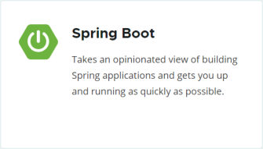
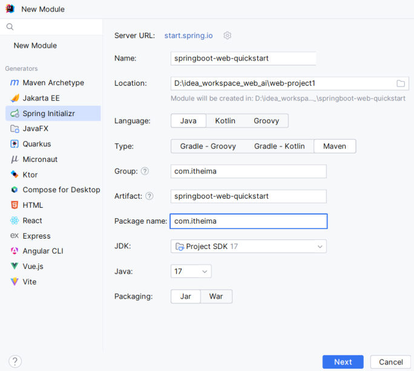
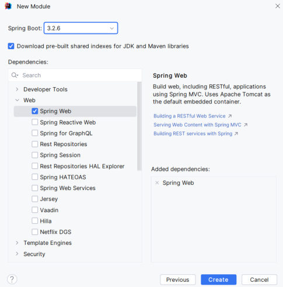
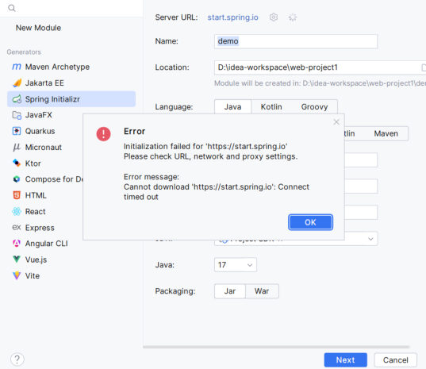
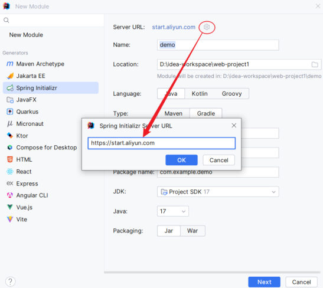

前三章的 Maven 把"怎么管依赖、怎么跑测试"打通了（[23](/posts/编程学习/javaweb学习笔记/23-maven是什么与核心概念/)、[29](/posts/编程学习/javaweb学习笔记/29-maven依赖范围与常见问题/)），从这一篇开始正式写**后端程序**。

这是第 4 章（后端 Web 基础）的第一篇，任务是把"地图"铺开：PPT 第 1-3 页先摆清 Web 后端开发里天天打交道的几个概念，第 6-9 页说清 Spring 与 SpringBoot 的关系，第 11-14 页才是动手——**两步做出第一个能跑起来的 Web 程序**。

PPT 第 4 页把这一章分成四块，后面几篇会依次走到（第 5、10 页那两个"01"只是章节导航页）：

| 章节模块（PPT 第 4 页） | 讲什么 | 对应笔记 |
| --- | --- | --- |
| **01 SpringBoot Web入门** | 入门程序（本篇）+ 入门程序剖析 | 30、[31](/posts/编程学习/javaweb学习笔记/31-springboot工程剖析/) |
| **02 HTTP协议** | 请求数据格式、获取请求数据、响应数据格式、设置响应数据 | 32-35 |
| **03 SpringBoot Web案例** | 用户列表渲染案例 | 36 |
| **04 分层解耦** | 三层架构、分层解耦、IOC 与 DI | 37-39 |

## Web 后端开发的全景：四样东西各站哪个位置

PPT 第 1-3 页是整章的概念地图：**浏览器**发起请求 → **HTTP 协议**负责传输 → **Web 服务器（Tomcat）**接收 → 交给**用 Spring 框架写出来的程序**处理，处理完再原路把结果返回给浏览器。

**静态资源 / 动态资源**（PPT 第 3 页原文）：

| 概念 | 定义 | 例子 |
| --- | --- | --- |
| **静态资源** | 服务器上存储的**不会改变**的数据，通常不会根据用户的请求而变化，**负责页面展示** | HTML、CSS、JS、图片、视频等 |
| **动态资源** | 服务器端**根据用户请求和其他数据动态生成**的，内容可能会在每次请求时都发生变化，**负责逻辑处理** | Servlet、JSP 等 |

前几章做的央视新闻页面、Tlias 员工管理页面，都是"写死在文件里"的**静态资源**——浏览器拿到就能显示。但像"员工列表"这种数据，每次请求都要从数据库里读出来、可能被改动，就必须由**后端程序现算/现查**再返回，这就是运行时才生成的**动态资源**。我们在 [21](/posts/编程学习/javaweb学习笔记/21-axios异步请求/)[、22](/posts/编程学习/javaweb学习笔记/22-实战-vueaxios员工列表/) 篇里用 Axios 发的那些请求，要访问的就是后端提供的动态资源。

**B/S 与 C/S 架构**（PPT 第 3 页原文）：

| 架构 | 全称 | 客户端形态 | 特点（PPT 原话） |
| --- | --- | --- | --- |
| **B/S** | Browser/Server（浏览器/服务器架构模式） | **客户端只需浏览器**，应用程序的逻辑和数据都存在服务器端 | **维护方便，体验一般** |
| **C/S** | Client/Server（客户端/服务器架构模式） | **需要单独开发维护客户端** | **体验不错，开发维护麻烦** |

这个博客、课程里的 Tlias 管理系统都是 B/S（打开浏览器就能用）；QQ、微信这种要装客户端的属于 C/S。

地图上剩下四块，分别对应本章后面的内容：

| 地图上的那一块 | 它负责什么 | 这门课里在哪讲 |
| --- | --- | --- |
| **HTTP 协议** | 规定**浏览器和服务器之间数据传输的规则**（请求报文、响应报文长什么样） | 第 [32](/posts/编程学习/javaweb学习笔记/32-http协议与请求数据格式/) 篇起（请求数据格式、GET/POST、响应与状态码） |
| **Web 服务器（Tomcat）** | 接收浏览器的请求、按 HTTP 协议解析、把处理结果按协议返回 | 第 [31](/posts/编程学习/javaweb学习笔记/31-springboot工程剖析/) 篇（SpringBoot 内嵌 Tomcat） |
| **Spring 框架** | 用来写"动态资源"那部分业务逻辑的框架 | 本篇（Spring 与 SpringBoot 的关系）+ 第 4 章后半部分（SpringMVC、IOC/DI 等） |
| **B/S 架构** | 我们开发的程序就以"浏览器当客户端"的形式交付 | 整章都在做这件事 |

> [!IMPORTANT]
> 这一节先记住一句话就够了：**后端开发 = 在 Web 服务器上写能接收请求、处理逻辑、返回数据的程序**。其中的"收请求、返回数据"由 Spring 框架帮我们省掉大量样板代码，这也是为什么后面几步就能写出一个 Web 程序。

## Spring：从"全家桶"到 SpringBoot

### Spring 是什么（PPT 第 6-7 页）

PPT 第 6、7 页给了一段相同的说明：

> 官网：**spring.io**
> Spring 发展到今天已经形成了一种**开发生态圈**，Spring 提供了**若干个子项目**，每个项目用于完成特定的功能。

这些子项目合起来就是常说的"**Spring 全家桶**"。PPT 第 6-7 页一字排开的就是其中几个（每张卡片下面都带一句官方定位）：

| 子项目 | 它干什么（PPT 卡片上的说明） |
| --- | --- |
| **Spring Framework** | 提供**依赖注入、事务管理、Web 应用、数据访问、消息**等核心支持（全家桶的地基） |
| **Spring Boot** | 用"约定优于配置"的思路**快速构建 Spring 应用**、尽快跑起来 |
| **Spring Data** | 统一的数据访问方式，**关系型、非关系型、map-reduce** 一视同仁 |
| **Spring Cloud** | 分布式系统常用模式的工具集，用于**构建和部署微服务** |
| **Spring Security** | 认证与授权，保护你的应用 |


*图：PPT 第 9 页——spring.io 上 Spring Boot 项目的官方卡片，一句话概括了它存在的理由（快速构建 Spring 应用并尽快跑起来）*

### 为什么还需要 SpringBoot（PPT 第 8-9 页）

PPT 第 8 页把 Spring 的两大痛点摆在左边，把 SpringBoot 带来的两个词摆在右边：

| Spring 的两大痛点（PPT 第 8 页） | SpringBoot 的两个关键词（PPT 第 8 页） |
| --- | --- |
| **入门难度大** | **简化配置** |
| **配置繁琐** | **快速开发** |

PPT 第 9 页的结论原话：

> **Spring Boot 可以帮助我们非常快速的构建应用程序、简化开发、提高效率。**

回想一下 [23-29 篇](/posts/编程学习/javaweb学习笔记/23-maven是什么与核心概念/)里做过的那些事：写 pom、copy 依赖坐标、配 junit 版本与范围、准备测试类……这些"必要但重复"的动作，SpringBoot 都用**约定**替我们做好了。下一篇（[31 篇](/posts/编程学习/javaweb学习笔记/31-springboot工程剖析/)）会看到：**工程里只写了两行依赖坐标，背后却带进来一整套 jar（连 Web 服务器都带了）**。

## 入门程序：需求（PPT 第 11 页）

PPT 第 11 页把目标写得很直白：

> **需求：基于 SpringBoot 开发一个 Web 应用，浏览器发起请求 `/hello` 之后，给浏览器返回一个字符串 "Hello Xxx"。**

```
http://localhost:8080/hello?name=Heima     →     "Hello Heima ~"
```

这里出现了本章后面反复要用的两个东西：**`localhost:8080`**（SpringBoot 默认端口是 8080）和 **`?name=Heima`**（URL 里带的请求参数）。参数怎么被后端拿到、协议上长什么样，是第 [32](/posts/编程学习/javaweb学习笔记/32-http协议与请求数据格式/)、[33](/posts/编程学习/javaweb学习笔记/33-springboot获取请求数据/) 篇的事；这一篇只要把它跑起来。

### 实测：真的能拿到 Hello Heima~

本机把上面的程序跑起来后，用命令行请求（JDK 17 / Spring Boot 3.2.8 / 内嵌 Tomcat 10.1.26）：

> [!TIP]
> 实测（curl 请求本机 8080）：
>
> ```text
> $ curl -s "http://localhost:8080/hello?name=Heima"
> Hello Heima~
> ```
>
> 把**响应头也打出来**看更清楚（`-i` = 连响应头一起显示）：
>
> ```text
> $ curl -si "http://localhost:8080/hello?name=Tom" | head -5
> HTTP/1.1 200
> Content-Type: text/plain;charset=UTF-8
> Content-Length: 10
> Date: Tue, 29 Sep 2026 07:39:29 GMT
>
> Hello Tom~
> ```
>
> 服务端控制台同时打印了方法里的那句话，证明**请求真的走到了我们的方法里**：
>
> ```text
> Hello Controller ... hello ： Heima
> ```
>
> 顺手再请求一个不存在的地址 `/nope`，状态码是 **404**（URL 打错/资源不存在时浏览器也是这个反应）：
>
> ```text
> $ curl -s -o /dev/null -w "%{http_code}" "http://localhost:8080/nope"
> 404
> ```
>
> 注意响应行里的 `200`、`Content-Type`、`Content-Length` **我们一行代码都没写**——全是服务器自动设置的（这一点在 [35 篇](/posts/编程学习/javaweb学习笔记/35-springboot设置响应数据/)会讲到）。

## 快速入门：两步 + 一跑（PPT 第 12 页）

PPT 第 12 页把做法压成了两步：

> ① **创建 SpringBoot 工程，并勾选 web 开发相关依赖。**
> ② **定义 HelloController 类，添加方法 hello，并添加注解。**

PPT 第 13 页的"步骤总结"多补了第 3 条：**运行启动类，测试**。

### 第 1 步：创建工程、勾选 web 依赖

IDEA 里 `New Module` → 左边选 **Spring Initializr**（PPT 第 12 页截图里的样子）：


*图：PPT 第 12 页——New Module 的 Spring Initializr 页面。Server URL 默认是 `start.spring.io`，Type 选 Maven、Language 选 Java、JDK 选 17、Packaging 选 Jar，填好 Name、Group（`com.itheima`）、Artifact 后点 Next*

到下一页的 Dependencies 里，把 **Web → Spring Web** 勾上（右侧 Added dependencies 里会出现 Spring Web）：


*图：PPT 第 12 页——勾选 Spring Web 依赖。右侧的说明写着"Build web, including RESTful, applications using Spring MVC. Uses Apache Tomcat as the default embedded container"，这一句话已经预告了下一篇的主角（Spring MVC + 内嵌 Tomcat）*

点 Create 之后，IDEA 会生成工程并开始联网下载依赖。生成的工程里自带的 `pom.xml`、启动类、配置文件长什么样，下一篇 [31 篇](/posts/编程学习/javaweb学习笔记/31-springboot工程剖析/)逐个拆。

### 第 2 步：定义请求处理类

在 `src/main/java/com/itheima/` 下新建 `HelloController.java`。**课程源码的写法**（`springboot-web-quickstart/src/main/java/com/itheima/HelloController.java`）：

```java
package com.itheima;

import org.springframework.web.bind.annotation.RequestMapping;
import org.springframework.web.bind.annotation.RestController;

@RestController //标识当前是一个请求处理类
public class HelloController {

    @RequestMapping("/hello") //标识请求路径
    public String hello(String name){
        System.out.println("Hello Controller ... hello ： " + name);
        return "Hello " + name + "~";
    }

}
```

三行代码、两个注解，各管一件事：

| 代码 | 作用 |
| --- | --- |
| `@RestController` | 加在**类**上，"**标识当前类是一个请求处理类**"——告诉 Spring：这个类的返回值直接写回浏览器 |
| `@RequestMapping("/hello")` | 加在**方法**上，"**标识请求路径**"——浏览器请求 `/hello` 时执行这个方法 |
| `String name` 参数 | URL 上的 `?name=Heima` **自动**传进来，不用自己解析 |

> [!TIP]
> `@RestController` 和 `@RequestMapping` 的具体差别（比如 `@RestController` = `@Controller` + `@ResponseBody`）属于"响应数据"那一块的知识，[36 篇](/posts/编程学习/javaweb学习笔记/36-springboot-web案例-用户列表渲染/)会展开。这里先按 PPT 第 12 页的注释记住它们的**用途**即可。

### 第 3 步：运行启动类

工程生成时就带好了一个**启动类**（也是整个工程的入口）：

```java
package com.itheima;

import org.springframework.boot.SpringApplication;
import org.springframework.boot.autoconfigure.SpringBootApplication;

/**
 * 启动类/引导类
 */
@SpringBootApplication
public class SpringbootWebQuickstartApplication {

    public static void main(String[] args) {
        SpringApplication.run(SpringbootWebQuickstartApplication.class, args);
    }

}
```

直接运行这个类的 `main` 方法（IDEA 里点左边的绿色三角），看到类似下面的日志就是启动成功：

```text
Tomcat initialized with port(s): 8080 (http)
Tomcat started on port 8080 (http) with context path ''
Started SpringbootWebQuickstartApplication in 1.803 seconds
```

然后打开浏览器访问 `http://localhost:8080/hello?name=Heima`，页面上就是 **`Hello Heima~`**。

**为什么一个 `main` 方法就能把 Web 应用跑起来？**（PPT 第 16 页的标题问题）——答案在下一篇：`SpringApplication.run(...)` 启动时会创建 Spring 容器，并把**内嵌的 Tomcat 一起拉起来**（这就是日志里 `Tomcat started on port 8080` 的来源）。

## 官方脚手架连不上怎么办（PPT 第 14 页）

PPT 第 14 页专门讲了创建工程时最常见的坑。现象是：Name、Group 都填好了，一点 Next 就弹错误框——


*图：PPT 第 14 页——创建工程时报 `Initialization failed for 'https://start.spring.io'`，错误详情是 `Cannot download 'https://start.spring.io': Connect timed out`*

原因很简单：**默认的脚手架服务器 `start.spring.io` 在国外**，本地网络连不上（不是 IDEA 坏了，也不是你填错了）。

PPT 第 14 页给的解决方案是**换一个国内能连通的脚手架**：在 New Module 页面点 Server URL 后面的编辑按钮，把地址改成阿里的 **`https://start.aliyun.com`**：


*图：PPT 第 14 页——弹出 Spring Initializr Server URL 对话框，把 Server URL 改成 `https://start.aliyun.com`，确定后继续 Next 即可正常创建*

> [!WARNING]
> 换脚手架只影响"**生成工程骨架**"这一步（就是下载一个工程模板）。工程生成之后，**依赖 jar 走的是 Maven 仓库**（[24 篇](/posts/编程学习/javaweb学习笔记/24-maven的安装与配置/)里配的阿里云私服），和脚手架服务器完全是两回事——所以"脚手架连不上"和"依赖下载不下来"要用两个不同的办法处理。

## 小结

| 问题 | 答案 |
| --- | --- |
| 静态资源和动态资源的区别 | **静态资源**：服务器上存储的**不会改变**的数据，不随请求变化（HTML/CSS/JS/图片/视频），负责**页面展示**；**动态资源**：服务端**根据请求和其他数据动态生成**（Servlet、JSP 等），负责**逻辑处理** |
| B/S 和 C/S 架构的区别 | **B/S（Browser/Server）**：客户端只需浏览器，逻辑和数据都在服务器端，**维护方便、体验一般**；**C/S（Client/Server）**：需单独开发维护客户端，**体验不错、开发维护麻烦** |
| Web 服务器、HTTP 协议、Spring 框架各是什么角色 | **HTTP 协议**规定浏览器和服务器之间数据传输的规则；**Web 服务器（Tomcat）**接收并解析请求、返回响应；**Spring 框架**用来写处理请求的业务代码 |
| Spring 与 SpringBoot 的关系 | Spring 已成**开发生态圈**（全家桶：Spring Framework、Spring Boot、Spring Data、Spring Cloud、Spring Security……）；Spring 的痛点是**入门难度大、配置繁琐**，SpringBoot 负责**简化配置、快速开发**（快速构建应用、提高效率） |
| 入门程序的需求 | 基于 SpringBoot 开发 Web 应用，浏览器请求 **`/hello`**，返回字符串 **`Hello Xxx`**（`http://localhost:8080/hello?name=Heima` → `Hello Heima ~`） |
| 快速入门三步 | ① 创建 SpringBoot 工程并**勾选 web 开发依赖**；② 定义**请求处理类**（`@RestController` + `@RequestMapping("/hello")` + 方法参数 `name`）；③ **运行启动类**（`main` 里的 `SpringApplication.run`），浏览器测试 |
| 端口是多少 | SpringBoot 默认 **8080**，本机实测访问 `http://localhost:8080/hello?name=Heima` 返回 `Hello Heima~`，不存在的路径返回 **404** |
| 脚手架连不上怎么办 | 报 `Connect timed out` 时把 Server URL 改成阿里云的 **`https://start.aliyun.com`**；它只影响生成工程骨架，依赖下载走 Maven 仓库 |

## 相关

- [上一篇：Maven依赖范围与常见问题](/posts/编程学习/javaweb学习笔记/29-maven依赖范围与常见问题/)
- [下一篇：SpringBoot工程剖析](/posts/编程学习/javaweb学习笔记/31-springboot工程剖析/)

## 练习题

### 一、知识回顾（读完直接做下面的实践题）

1. **静态资源**：服务器上存储的**不会改变**的数据，通常不会根据用户的请求而变化（HTML、CSS、JS、图片、视频等），**负责页面展示**；**动态资源**：服务器端**根据用户请求和其他数据动态生成**的数据，内容可能每次请求都在变（Servlet、JSP 等），**负责逻辑处理**
2. **B/S 架构**：Browser/Server 浏览器/服务器架构模式，**客户端只需浏览器**、逻辑和数据都在服务器端，**维护方便、体验一般**；**C/S 架构**：Client/Server 客户端/服务器架构模式，**需要单独开发维护客户端**，**体验不错、开发维护麻烦**
3. 三个角色的分工：**HTTP 协议**规定浏览器和服务器之间数据传输的规则；**Web 服务器（Tomcat）**接收请求、解析协议、返回结果；**Spring 框架**用来写处理请求的动态资源程序
4. **Spring 是什么**：官网 **spring.io**，已经形成一种**开发生态圈**，提供若干个子项目（**Spring 全家桶**），每个项目完成特定功能——Spring Framework（依赖注入等核心支持）、Spring Boot、Spring Data、Spring Cloud、Spring Security……
5. Spring 的**两个痛点**是**入门难度大、配置繁琐**；SpringBoot 的两个关键词是**简化配置、快速开发**（"帮助非常快速的构建应用程序、简化开发、提高效率"）
6. **入门程序需求**：基于 SpringBoot 开发 Web 应用，浏览器发起 `/hello` 请求后返回字符串 **`Hello Xxx`**；本地地址是 **`http://localhost:8080/hello?name=Heima`**（8080 是 SpringBoot 默认端口）
7. **快速入门三步**：① 创建 SpringBoot 工程并**勾选 web 开发相关依赖**；② 定义请求处理类 `HelloController`，方法 `hello` 上加**两个注解**（类上标识"请求处理类"、方法上标识"请求路径"）；③ **运行启动类**（`main` 方法里的 `SpringApplication.run(...)`）后用浏览器测试
8. 两个注解的作用：**`@RestController`** 标在类上，标识当前类是一个**请求处理类**；**`@RequestMapping("/hello")`** 标在方法上，标识**请求路径**；URL 上的 `?name=Heima` 会自动传进方法的 `String name` 参数
9. **本机实测**：`curl -s "http://localhost:8080/hello?name=Heima"` 返回 **`Hello Heima~`**；请求不存在的 `/nope` 返回状态码 **404**；服务端控制台打印出 `Hello Controller ... hello ： Heima`
10. **官方脚手架连不上**：报 `Initialization failed for 'https://start.spring.io'`、`Connect timed out` 时，把 New Module 页面的 **Server URL 改成 `https://start.aliyun.com`**（阿里云脚手架）即可正常创建；换脚手架只影响生成工程，**依赖下载还是走 Maven 仓库**

### 二、裸写题

- [ ] **2-1 写第一个请求处理类**
  写一个请求处理类：浏览器访问 `/hello?name=Heima` 时，页面返回 `Hello Heima~`；同时服务端控制台要把收到的名字打印出来。
  （练习文件 `test_30_HelloController.java` 里给了包名、类名骨架和写作区。）

  > [!TIP]- 提示（先自己想，实在想不出再点开）
  > **一级 · 思路**：这个类不是普通 Java 类，它是"接请求"的类——需要**两个注解**：一个告诉 Spring"这个类负责处理请求"，一个告诉 Spring"哪个路径归这个方法管"
  > **二级 · 方法**：类上用 `@RestController`；方法上用 `@RequestMapping("/hello")`；方法签名写成 `public String hello(String name)`（类名 `HelloController`、方法名 `hello`、包名 `com.itheima`，练习文件骨架里已给出），`name` 会自动接住 URL 上的 `?name=`
  > **三级 · 骨架**：`@RestController public class HelloController { @RequestMapping("/____") public String hello(String name){ System.out.println("____" + name); return "Hello " + name + "~"; } }`

  > [!TIP]- 参考答案（做完再点开）
  > ```java
  > package com.itheima;
  >
  > import org.springframework.web.bind.annotation.RequestMapping;
  > import org.springframework.web.bind.annotation.RestController;
  >
  > @RestController //标识当前是一个请求处理类
  > public class HelloController {
  >
  >     @RequestMapping("/hello") //标识请求路径
  >     public String hello(String name){
  >         System.out.println("Hello Controller ... hello ： " + name);
  >         return "Hello " + name + "~";
  >     }
  >
  > }
  > ```
  > 这就是课程源码 `HelloController.java` 的样子。本机实测（JDK 17 / Spring Boot 3.2.8 / 内嵌 Tomcat 10.1.26）：启动后 `curl -s "http://localhost:8080/hello?name=Heima"` 返回 `Hello Heima~`，服务端控制台出现 `Hello Controller ... hello ： Heima`——**方法里那句打印真的执行了，方法的返回值真的变成了响应体**。反过来，只要类上的注解漏了、或者请求路径写错（`@RequestMapping` 里的值和浏览器里敲的不一致），请求就会变成 **404**（服务器收到了请求，但没有方法接住它）。

- [ ] **2-2 一个类里放两个处理方法**
  在同一个请求处理类里再加一个处理方法：浏览器访问 `/hi?name=Tom` 时返回 `Hi Tom 你好~`，并在控制台打印 `hi : Tom`。
  做完再回答：为什么两个不同的请求能由同一个类里的两个方法来处理？

  > [!TIP]- 提示（先自己想，实在想不出再点开）
  > **一级 · 思路**：一个类里可以有多个"处理方法"，它们靠**路径**区分；给新方法再标一个路径注解就行，类上的"我是处理类"注解不用重复写
  > **二级 · 方法**：类还是 `HelloController`，新增的方法叫 `hi`；在新方法上写 `@RequestMapping("/hi")`，方法签名同样用 `String name` 接参数
  > **三级 · 骨架**：`@RequestMapping("/____") public String hi(String name){ ... return "Hi " + name + " 你好~"; }`

  > [!TIP]- 参考答案（做完再点开）
  > ```java
  > @RestController //标识当前是一个请求处理类
  > public class HelloController {
  >
  >     @RequestMapping("/hello") //标识请求路径
  >     public String hello(String name){
  >         System.out.println("Hello Controller ... hello ： " + name);
  >         return "Hello " + name + "~";
  >     }
  >
  >     @RequestMapping("/hi") //第二个请求路径，同样由这个类处理
  >     public String hi(String name){
  >         System.out.println("hi : " + name);
  >         return "Hi " + name + " 你好~";
  >     }
  >
  > }
  > ```
  > 原因：**`@RequestMapping` 标在方法上时，标识的是"这个方法负责哪个请求路径"**——一个类可以有任意多个带不同路径的方法，Spring 收到请求后按路径找到对应的方法执行。所以 `http://localhost:8080/hi?name=Tom` 走 `hi` 方法，`/hello` 走 `hello` 方法，互不干扰。

- [ ] **2-3 找错：这段代码为什么访问不了**
  下面这个类在能正常启动的 SpringBoot 工程里，但浏览器访问 `http://localhost:8080/hello?name=Heima` 返回 **404**。请指出缺了什么、为什么缺了就会 404，并把代码补完整：

  ```java
  public class HelloController {

      public String hello(String name){
          return "Hello " + name + "~";
      }

  }
  ```

  > [!TIP]- 提示（先自己想，实在想不出再点开）
  > **一级 · 思路**：Java 代码本身没报错，问题在"Spring 不知道这个类是干什么的"——回想一下 2-1 里这个类比普通类多写了什么
  > **二级 · 方法**：类上少了标识"请求处理类"的注解，方法上少了标识"请求路径"的注解；404 的含义是"服务器收到了请求，但找不到能处理它的映射/资源"
  > **三级 · 骨架**：`@____ public class HelloController { @____("/____") public String hello(...) }`

  > [!TIP]- 参考答案（做完再点开）
  > 缺两个注解：类上缺 **`@RestController`**（Spring 启动时不会把这个类注册成请求处理类），方法上缺 **`@RequestMapping("/hello")`**（没有路径映射，`/hello` 这个请求没人接）。补完整就是 2-1 的代码。
  > 404 的意思是"服务器收到了请求，但**找不到对应的资源或映射**"——本机实测访问一个不存在的地址（`/nope`）时也是这个结果：
  > ```text
  > $ curl -s -o /dev/null -w "%{http_code}" "http://localhost:8080/nope"
  > 404
  > ```
  > 所以写后端时看到 404，第一反应就是查两个地方：**请求路径写对了吗**（`@RequestMapping` 里的值、浏览器里敲的地址）、**这个类被 Spring 认出来了吗**（类上的注解加了吗、类放的位置对不对）。

- [ ] **2-4 排错：创建工程时脚手架连不上**
  你在 IDEA 里按 2-1 的步骤创建 SpringBoot 工程，Name、Group 都填好了，刚点 Next 就弹出错误窗口，里面写着：

  ```text
  Initialization failed for 'https://start.spring.io'
  Please check URL, network and proxy settings.
  Error message:
  Cannot download 'https://start.spring.io': Connect timed out
  ```

  请写出你的处理思路（至少三条），并说明"改脚手架"和"依赖下不下来"是不是同一件事。

  > [!TIP]- 提示（先自己想，实在想不出再点开）
  > **一级 · 思路**：先判断"是谁连不上谁"——你填的信息没错，是 IDEA 去访问的那个**模板服务器**连不通
  > **二级 · 方法**：New Module 页面上的 **Server URL** 可以换；国内可选阿里云的脚手架地址
  > **三级 · 骨架**：Server URL = `https://____.____`（把 `start.spring.io` 换成阿里的域名）

  > [!TIP]- 参考答案（做完再点开）
  > ① 这**不是填错了信息**，也不是 IDEA 坏了：错误详情 `Cannot download 'https://start.spring.io': Connect timed out` 说明是**访问官方脚手架服务器超时**（默认脚手架在国外）；
  > ② 处理办法：在 `New Module` 页面把 **Server URL** 从 `start.spring.io` 改成阿里的 **`https://start.aliyun.com`**（点输入框后面的编辑按钮，在弹出对话框里改），再点 Next 就能正常创建工程；
  > ③ 生成工程之后，照旧要联网下载依赖——这一步走的是 **Maven 仓库**（[24 篇](/posts/编程学习/javaweb学习笔记/24-maven的安装与配置/)配的阿里云私服），和脚手架是两回事；
  > ④ 所以"改脚手架"和"依赖下不下来"**不是同一件事**：前者解决"工程骨架生成不了"，后者要按 [29 篇](/posts/编程学习/javaweb学习笔记/29-maven依赖范围与常见问题/)的办法看 Maven 报错（`Could not find artifact`、`xxx.lastUpdated` 缓存失败等）。

### 三、综合题

- [ ] **3-1 从零跑通第一个 SpringBoot Web 程序**
  照课程的连贯实践完整做一遍：
  1. **建工程**：`New Module` → `Spring Initializr`，Server URL 用阿里云脚手架，Type 选 Maven、Language 选 Java、JDK 选 17、Packaging 选 Jar，Group 填 `com.itheima`，Name/Artifact 起 `springboot-web-quickstart`；
  2. **勾依赖**：在 Dependencies 里展开 `Web`，勾上 **Spring Web**，点 Create，等 IDEA 把依赖下完；
  3. **写处理类**：在 `src/main/java/com/itheima/` 下建 `HelloController`，加类注解与方法注解，方法返回 `Hello Xxx~`，并把收到的名字打印到控制台；
  4. **跑起来**：运行工程自带的启动类（`SpringbootWebQuickstartApplication`），等控制台出现 `Tomcat started on port 8080`；
  5. **测**：浏览器访问 `http://localhost:8080/hello?name=Heima`，把页面上看到的字符串抄到练习文件；
  6. **试错**：再访问 `http://localhost:8080/nope`，把它的结果（404）记下来，并写出"为什么这一次访问不到"；
  7. **答一问**：这个"跑起来的 Web 服务器（Tomcat）"是你自己安装、启动的吗？它是从哪来的？

  **涉及知识点**

  | 知识点 | 在这里的应用 |
  | --- | --- |
  | 静态资源/动态资源 | `/hello` 返回的字符串是**服务端现算**出来的动态资源 |
  | B/S 架构 | 客户端只用浏览器，程序跑在服务器端（本机的 8080 端口） |
  | Spring 与 SpringBoot | SpringBoot 帮我们简化配置、快速开发，所以三步就能出结果 |
  | 创建工程 | Spring Initializr + 勾选 Spring Web 依赖（脚手架连不上就换阿里云） |
  | 请求处理类 | `@RestController` 标识处理类、`@RequestMapping("/hello")` 标识路径 |
  | 启动与测试 | 运行启动类 → 8080 端口 → 浏览器/curl 请求 |

  > [!TIP]- 提示（先自己想，实在想不出再点开）
  > **一级 · 思路**：整条链路是"**生成骨架 → 勾 web 依赖 → 写处理类 → 运行启动类 → 用地址访问**"；第 6 步的 404 和第 7 步的问题都指向同一个东西——**工程里自带的 Web 服务器**
  > **二级 · 方法**：Server URL 换成 `https://start.aliyun.com`；处理类用 `@RestController` + `@RequestMapping("/hello")`；启动类是带 `@SpringBootApplication` 和 `main` 方法的那个类
  > **三级 · 骨架**：`@____ public class HelloController { @____("/hello") public String hello(String name){ return "Hello " + name + "~"; } }`

  > [!TIP]- 参考答案（做完再点开）
  > 1. 创建页面上的关键选择：**Type = Maven**、**Language = Java**、**JDK = 17**、**Packaging = Jar**，Server URL 用 `https://start.aliyun.com`（官方脚手架连不上时）；Group 用 `com.itheima`。
  > 2. 依赖只勾一项：**Spring Web**（Web 分类下），右侧 Added dependencies 里会出现 `Spring Web`。
  > 3. `HelloController`：
  >    ```java
  >    package com.itheima;
  >
  >    import org.springframework.web.bind.annotation.RequestMapping;
  >    import org.springframework.web.bind.annotation.RestController;
  >
  >    @RestController //标识当前是一个请求处理类
  >    public class HelloController {
  >
  >        @RequestMapping("/hello") //标识请求路径
  >        public String hello(String name){
  >            System.out.println("Hello Controller ... hello ： " + name);
  >            return "Hello " + name + "~";
  >        }
  >
  >    }
  >    ```
  > 4. 运行启动类后控制台的关键行（本机实测，Spring Boot 3.2.8）：
  >    ```text
  >    Tomcat initialized with port 8080 (http)
  >    Starting Servlet engine: [Apache Tomcat/10.1.26]
  >    Tomcat started on port 8080 (http) with context path ''
  >    Started SpringbootWebQuickstartApplication in 1.803 seconds
  >    ```
  >    完整启动日志的逐行解读在下一篇 [31 篇](/posts/编程学习/javaweb学习笔记/31-springboot工程剖析/)。
  > 5. 浏览器/命令行实测结果：
  >    ```text
  >    $ curl -s "http://localhost:8080/hello?name=Heima"
  >    Hello Heima~
  >    ```
  > 6. `/nope` 的结果是 **404**：请求确实到达了服务器，但**没有任何方法和这个路径对应**（`@RequestMapping` 里只标识了 `/hello`），所以服务器回 404。"打错地址""路径没写对""类没被注册成处理类"都会表现为 404。
  > 7. 不是自己装的：**Tomcat 是 SpringBoot 自带的内嵌服务器**，跟着工程依赖一起下回来的，`SpringApplication.run(...)` 启动时把它一起拉起来——下一篇文章把这件事讲透。
