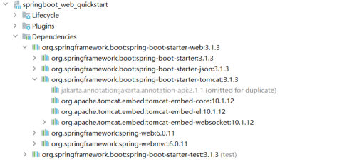
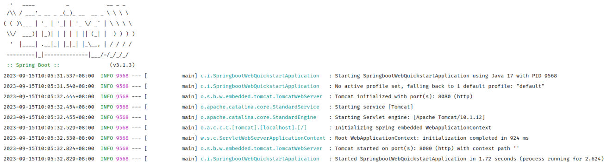
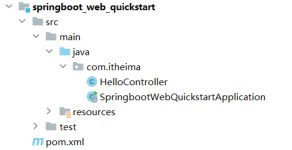

[上一篇](/posts/编程学习/javaweb学习笔记/30-springboot快速入门/)跑通了第一个程序：建个工程、写个 `HelloController`、运行启动类，浏览器就能访问 `http://localhost:8080/hello?name=Heima`。但有个问题一直悬着——**我们既没有安装 Tomcat，也没有部署什么 war 包，为什么点了 `main` 方法，Web 服务器就起来了？**

这一篇（PPT 第 15-17 页）就把工程拆开回答它。PPT 第 16 页的标题就是这个问题：

> **为什么一个 main 方法就将 web 应用启动了?**

答案由两块拼成：**起步依赖**（第 16 页）+ **内嵌 Tomcat**（第 17 页）。最后再看一眼工程目录结构，知道每个文件夹是干什么的。

## 第一块：起步依赖（PPT 第 16 页）

### pom 里其实只写了两行坐标

上一篇创建工程时只勾了一个 Spring Web，生成的 `pom.xml` 里的依赖部分也只有两项（课程源码 `springboot-web-quickstart/pom.xml`）：

```xml
<dependencies>
    <dependency>
        <groupId>org.springframework.boot</groupId>
        <artifactId>spring-boot-starter-web</artifactId>
    </dependency>

    <dependency>
        <groupId>org.springframework.boot</groupId>
        <artifactId>spring-boot-starter-test</artifactId>
        <scope>test</scope>
    </dependency>
</dependencies>
```

但工程里明明能用到 `@RestController`、`@RequestMapping`（Spring MVC）、能返回 JSON（Jackson）、能跑 `@SpringBootTest` 测试（JUnit）——**这些东西的 jar 都是从哪来的？** PPT 第 16 页给的答案就是"起步依赖"：

> **起步依赖：**
> - **`spring-boot-starter-web`：包含了 web 应用开发所需要的常见依赖。**
> - **`spring-boot-starter-test`：包含了单元测试所需要的常见依赖。**

PPT 第 16 页还给了**官方 starter 的完整清单**（想看还有哪些 starter、某个 starter 包含什么，就查这份文档）：

```text
https://docs.spring.io/spring-boot/docs/3.1.3/reference/htmlsingle/#using.build-systems.starters
```

一句话概括：**起步依赖（starter）是"打包好的依赖套餐"**——写一行坐标，Maven 顺着它的传递性依赖把整套 jar 都拉下来，这正是 [SpringBoot "简化配置、快速开发"](/posts/编程学习/javaweb学习笔记/30-springboot快速入门/)的落点之一。

### 实测：这两行坐标到底带回来了多少东西

在 IDEA 的 Maven 面板里展开 `Dependencies` 就能看到（PPT 第 16 页的截图）：


*图：PPT 第 16 页——IDEA 里 `spring-boot-starter-web` 下面挂着一串依赖：`spring-boot-starter`、`spring-boot-starter-json`、`spring-boot-starter-tomcat`（里面是 `tomcat-embed-core` 10.1.12 等）、`spring-web`、`spring-webmvc`，最下面是 `spring-boot-starter-test`，后面标着 `(test)`*

更完整的清单可以命令行打出来（`mvn dependency:tree`）。本机实测：

> [!TIP]
> 实测（Maven 3.9.14 / JDK 17 / Spring Boot 3.2.8），工程就是我们写 `HelloController` 的那个 `springboot-web-quickstart`：
>
> ```text
> com.itheima:springboot-web-quickstart:jar:0.0.1-SNAPSHOT
> +- org.springframework.boot:spring-boot-starter-web:jar:3.2.8:compile
> |  +- org.springframework.boot:spring-boot-starter:jar:3.2.8
> |  +- org.springframework.boot:spring-boot-starter-json:jar:3.2.8        → jackson 三件套
> |  +- org.springframework.boot:spring-boot-starter-tomcat:jar:3.2.8      → tomcat-embed-core 10.1.26
> |  +- org.springframework:spring-web:jar:6.1.11
> |  \- org.springframework:spring-webmvc:jar:6.1.11
> \- org.springframework.boot:spring-boot-starter-test:jar:3.2.8:test      → junit-jupiter 5.10.3 / mockito / assertj
> ```
>
> （命令：`mvn dependency:tree`；为节省篇幅只列到第二层，每一行末尾的 `:compile` / `:test` 就是 [29 篇](/posts/编程学习/javaweb学习笔记/29-maven依赖范围与常见问题/)讲的**依赖范围**。）
>
> 把每个 starter 拆开看，就明白"常见依赖"具体指什么：
>
> | 起步依赖 | 往下带回来的关键 jar |
> | --- | --- |
> | **`spring-boot-starter-web`** | `spring-boot-starter`（`spring-boot`、`spring-boot-autoconfigure`、`spring-boot-starter-logging` → logback、`snakeyaml`）、`spring-boot-starter-json`（`jackson-databind`/`-core`/`-annotations`、`jackson-datatype-jdk8`、`jackson-datatype-jsr310`、`jackson-module-parameter-names`）、**`spring-boot-starter-tomcat`**（`tomcat-embed-core` **10.1.26**、`tomcat-embed-el`、`tomcat-embed-websocket`）、`spring-web` 6.1.11、`spring-webmvc` 6.1.11（含 `spring-aop`、`spring-context`、`spring-expression`） |
> | **`spring-boot-starter-test`**（范围 `test`） | `spring-boot-test`、`spring-boot-test-autoconfigure`、`json-path`、`assertj-core`、**`junit-jupiter` 5.10.3**、`mockito-core`/`mockito-junit-jupiter`、`jsonassert`、`spring-test`、`xmlunit-core` |

> [!WARNING]
> PPT 第 16 页的截图和它的官方文档链接用的是 **Spring Boot 3.1.3**（所以那张图上内嵌 Tomcat 是 10.1.12），而课程代码与本机实测都是 **3.2.8**（内嵌 Tomcat 10.1.26）。版本号跟着课程代码走就行，**starter 的组成结构是一样的**。

> [!TIP]
> 记住 starter 的命名规律，以后看 pom 不用猜：官方 starter 都叫 **`spring-boot-starter-xxx`**（如 `-web`、`-test`、`-json`、`-tomcat`），第三方提供的则把名字放前面（`xxx-spring-boot-starter`）。

## 第二块：内嵌 Tomcat（PPT 第 17 页）

PPT 第 17 页只写了两个词：**内嵌 Tomcat** / **运行**。把上一节的依赖树连起来看，意思就清楚了：

- `spring-boot-starter-web` 里带了 **`spring-boot-starter-tomcat`**，里面有 **`tomcat-embed-core`**（`embed` = 内嵌）——**Tomcat 是以普通 jar 依赖的形式跟着工程一起下载下来的**；
- 运行启动类时，`SpringApplication.run(...)` 做的其中一件事就是**把这些内嵌的服务器创建出来并启动**；
- 所以：**不用自己安装 Tomcat、不用配置 server.xml、也不用把工程打成 war 丢进 webapps**，一个 `main` 方法就把 Web 服务器和应用一起拉起来了（打出来的是可执行 jar）。

### 实测：启动日志里看得见 Tomcat

上一节证明"Tomcat 在依赖里"，这一节证明"Tomcat 真的被启起来了"。本机启动工程的真实日志：


*图：PPT 第 17 页——运行启动类后控制台的输出：先打印 Spring Boot 的 banner（`:: Spring Boot :: (v3.1.3)`），然后是启动过程日志，中间几行是 `Tomcat initialized with port(s): 8080 (http)`、`Starting service [Tomcat]`、`Starting Servlet engine: [Apache Tomcat/10.1.12]`、`Tomcat started on port(s): 8080 (http) with context path ''`，最后一行是 `Started SpringbootWebQuickstartApplication in 1.72 seconds`*

> [!TIP]
> 实测（本机 `java -jar springboot-web-quickstart-0.0.1-SNAPSHOT.jar`，JDK 17 / Spring Boot 3.2.8；为了好读，省略了每行前面的时间戳、PID 和 `[main]` 标记）：
>
> ```text
>   .   ____          _            __ _ _
>  /\\ / ___'_ __ _ _(_)_ __  __ _ \ \ \ \
> ( ( )\___ | '_ | '_| | '_ \/ _` | \ \ \ \
>  \\/  ___)| |_)| | | | | || (_| |  ) ) ) )
>   '  |____| .__|_| |_|_| |_\__, | / / / /
>  =========|_|==============|___/=/_/_/_/
>  :: Spring Boot ::                (v3.2.8)
>
> Starting SpringbootWebQuickstartApplication v0.0.1-SNAPSHOT using Java 17.0.3.1 with PID 43400
> No active profile set, falling back to 1 default profile: "default"
> Tomcat initialized with port 8080 (http)
> Starting service [Tomcat]
> Starting Servlet engine: [Apache Tomcat/10.1.26]
> Initializing Spring embedded WebApplicationContext
> Root WebApplicationContext: initialization completed in 993 ms
> Tomcat started on port 8080 (http) with context path ''
> Started SpringbootWebQuickstartApplication in 1.803 seconds (process running for 2.243)
> ```
>
> 顺手再请求一次接口，日志里还会多出 `DispatcherServlet` 初始化的信息（第一次请求才初始化）：
>
> ```text
> Initializing Spring DispatcherServlet 'dispatcherServlet'
> Initializing Servlet 'dispatcherServlet'
> Completed initialization in 1 ms
> Hello Controller ... hello ： Heima
> ```

### 启动日志怎么读（逐行对照）

| 日志行 | 它在说什么 |
| --- | --- |
| `:: Spring Boot ::  (v3.2.8)` | banner 里的版本号：**用的是哪个 Spring Boot** |
| `Starting SpringbootWebQuickstartApplication v0.0.1-SNAPSHOT using Java 17.0.3.1` | 正在启动的是**哪个工程**、版本号、**用的哪个 Java** |
| `No active profile set, falling back to 1 default profile: "default"` | 没有指定"环境"（profile），用默认的 `default` |
| `Tomcat initialized with port 8080 (http)` | **内嵌 Tomcat 初始化完成，端口 8080、HTTP 协议** |
| `Starting service [Tomcat]` / `Starting Servlet engine: [Apache Tomcat/10.1.26]` | 启动 Tomcat 服务、启动 Servlet 引擎，**方括号里是 Tomcat 自己的版本号** |
| `Initializing Spring embedded WebApplicationContext` | 初始化 Spring 的"Web 容器"（IOC 容器在这个阶段准备好） |
| `Tomcat started on port 8080 (http) with context path ''` | Tomcat 真正开始监听；**`context path ''`** 表示没有项目前缀 |
| `Started SpringbootWebQuickstartApplication in 1.803 seconds` | **启动成功**、总耗时——看到这一行就可以访问接口了 |

> [!IMPORTANT]
> 两个容易踩的点：
> 1. **端口 8080 被占用时会启动失败**（报 `Port 8080 was already in use`），先把占着端口的程序关掉再启动；
> 2. **`context path ''`** 意味着访问地址里**没有项目名前缀**——所以是 `http://localhost:8080/hello`，而不是 `http://localhost:8080/springboot-web-quickstart/hello`（传统部署 war 包到独立 Tomcat 时，地址里通常要带项目名，这就是"内嵌 + 空 context path"省掉的麻烦）。

## 工程目录结构

上一篇建的工程在 IDEA 里展开是这样：


*图：PPT 第 16、17 页——`springboot_web_quickstart` 工程的结构：`src/main/java/com/itheima` 下是 `HelloController` 和 `SpringbootWebQuickstartApplication`（启动类），`src/main/resources` 与 `src/test` 两个目录，最外层是 `pom.xml`*

| 位置 | 放什么 | 说明 |
| --- | --- | --- |
| **`pom.xml`** | 工程的 Maven 配置 | 起步依赖、Spring Boot 父工程（`spring-boot-starter-parent`）、打包插件都写在这里 |
| **`src/main/java`** | 我们写的 Java 代码 | 启动类 `SpringbootWebQuickstartApplication`（带 `@SpringBootApplication` 和 `main` 方法）+ 请求处理类 `HelloController`，本课都放在 `com.itheima` 包下 |
| **`src/main/resources`** | 配置文件与资源文件 | 工程生成时就有 `application.properties`（配置文件，默认只有一行 `spring.application.name=...`）；后面课程里的用户数据文件、前端静态页面也放在这里 |
| **`src/test/java`** | 测试代码 | 生成时自带 `SpringbootWebQuickstartApplicationTests`（一个带 `@SpringBootTest` 的空测试类，方法上标 `@Test`），跑它等于"验证工程能不能启动" |

> [!TIP]
> 目录里放的东西和 [Maven 约定](/posts/编程学习/javaweb学习笔记/25-idea集成maven与项目坐标/)完全一致：`main` 是主程序、`test` 是测试程序——这正是 [29 篇](/posts/编程学习/javaweb学习笔记/29-maven依赖范围与常见问题/)里"依赖范围"能生效的前提（`spring-boot-starter-test` 的 `<scope>test</scope>` 就是靠这个目录划分起作用的）。

## 小结

| 问题 | 答案 |
| --- | --- |
| 为什么一个 `main` 方法就能启动 web 应用？ | 两个原因：**起步依赖**把 Web 开发需要的一整套 jar（含内嵌 Tomcat）一次带齐；**内嵌 Tomcat** 由 `SpringApplication.run(...)` 在启动时创建并拉起，所以不用单独安装/部署服务器 |
| 什么是起步依赖（starter）？ | 打包好的**依赖套餐**。`spring-boot-starter-web` 包含 **web 应用开发所需要的常见依赖**（spring-webmvc、jackson、内嵌 Tomcat、日志等）；`spring-boot-starter-test` 包含**单元测试所需要的常见依赖**（JUnit、Mockito、AssertJ、spring-test 等） |
| 怎么看到 starter 到底带了什么？ | IDEA 的 Maven 面板展开 `Dependencies`，或命令行 **`mvn dependency:tree`**（本机实测：`starter-web` → `starter` + `starter-json` + `starter-tomcat`(tomcat-embed-core 10.1.26) + spring-web + spring-webmvc；`starter-test` → junit-jupiter 5.10.3、mockito 等，范围 `test`） |
| 官方 starter 清单在哪查？ | PPT 第 16 页给的官方文档：`docs.spring.io/spring-boot/docs/3.1.3/reference/htmlsingle/#using.build-systems.starters`；官方命名规律是 `spring-boot-starter-xxx` |
| 内嵌 Tomcat 体现在哪 | 依赖里有 `spring-boot-starter-tomcat` → `tomcat-embed-core`；启动日志里有 `Tomcat initialized with port 8080 (http)`、`Starting Servlet engine: [Apache Tomcat/10.1.26]`、`Tomcat started on port 8080 (http) with context path ''` |
| 怎么判断启动成功了？ | 看到最后一行 **`Started XxxApplication in N seconds`**；在此之前几行是 Tomcat 初始化与启动。访问地址是 `http://localhost:8080/xxx`（**context path 为空**，地址里不带工程名） |
| 工程里四个位置各放什么？ | `pom.xml`（Maven 配置）、`src/main/java`（启动类 + 请求处理类）、`src/main/resources`（`application.properties` 等配置与资源）、`src/test/java`（测试类） |

## 相关

- [上一篇：SpringBoot快速入门](/posts/编程学习/javaweb学习笔记/30-springboot快速入门/)
- [下一篇：HTTP协议与请求数据格式](/posts/编程学习/javaweb学习笔记/32-http协议与请求数据格式/)

## 练习题

这一篇偏原理（起步依赖、内嵌 Tomcat、日志），所以用**概念自测**代替裸写代码题：先合上文章自己说一遍，再点开对答案。

### 一、知识回顾（读完直接做下面的实践题）

1. **起步依赖**：`spring-boot-starter-web` 包含了 **web 应用开发所需要的常见依赖**；`spring-boot-starter-test` 包含了**单元测试所需要的常见依赖**——写一行坐标，等于引入一整套 jar（传递性依赖）
2. **starter-web 里有什么**（本机实测）：`spring-boot-starter`（`spring-boot`、`spring-boot-autoconfigure`、日志 logback、snakeyaml）、`spring-boot-starter-json`（jackson 系列）、**`spring-boot-starter-tomcat`**（`tomcat-embed-core` 10.1.26）、`spring-web` 6.1.11、`spring-webmvc` 6.1.11
3. **starter-test 里有什么**：`spring-boot-test`、`junit-jupiter` 5.10.3、`mockito`、`assertj`、`json-path`、`spring-test`、`xmlunit` 等，范围是 **`test`**（所以主程序用不到、也不参与打包）
4. **查看依赖的方式**：IDEA 的 Maven 面板展开 `Dependencies`，或命令行 **`mvn dependency:tree`**；官方 starter 清单查 PPT 第 16 页给的文档（`docs.spring.io` 的 Spring Boot reference 里 `using.build-systems.starters` 一节）
5. **starter 命名规律**：官方是 **`spring-boot-starter-xxx`**，第三方是 `xxx-spring-boot-starter`
6. **内嵌 Tomcat 的含义**：Tomcat 以 **jar 依赖**的形式跟着工程下载（`tomcat-embed-core`），启动时由 **`SpringApplication.run(...)`** 创建并启动——**不需要单独安装 Tomcat、不需要部署 war**，一个 `main` 方法就能跑起来
7. **启动日志关键行**：`Tomcat initialized with port 8080 (http)`（端口）→ `Starting Servlet engine: [Apache Tomcat/10.1.26]`（Tomcat 版本）→ `Tomcat started on port 8080 (http) with context path ''`（开始监听、**没有项目前缀**）→ **`Started XxxApplication in N seconds`**（启动成功）
8. **context path 为空**的意思：访问地址是 `http://localhost:8080/hello`，**地址里不带工程名**（传统 war 部署到独立 Tomcat 时，地址里通常要带 `/项目名`）
9. **常见的启动失败**：端口被占用会报 `Port 8080 was already in use`，先释放 8080 再启动
10. **工程目录**：`pom.xml`（Maven 配置与起步依赖）、`src/main/java`（启动类 `XxxApplication` + 请求处理类）、`src/main/resources`（`application.properties` 等配置与资源）、`src/test/java`（测试类 `XxxApplicationTests`）

### 二、概念自测

- [ ] **2-1 为什么一个 `main` 方法就能把 Web 应用跑起来？**
  请从"依赖"和"服务器"两个方面回答，并说出这件事替我们省掉了哪些传统步骤。


  > [!TIP]- 提示（先自己想，实在想不出再点开）
  > **一级 · 思路**：这件事要拆成"东西从哪来"（依赖）和"谁来跑"（服务器）两条线
  > **二级 · 方法**：翻回前面"起步依赖"和"内嵌 Tomcat"两节，各找一句话
  > **三级 · 骨架**：① 依赖：pom 里只写 ＿＿ 一行坐标，它带回一整套 jar；② 服务器：Tomcat 以 ＿＿ 的形式存在，由 ＿＿ 创建并启动

  > [!TIP]- 参考答案（做完再点开）
  > 两个方面：
  > ① **依赖方面——起步依赖**：`pom.xml` 里只写了 `spring-boot-starter-web` 一行坐标，它往下带回了 Web 开发所需要的常见依赖（spring-webmvc、jackson、日志，**以及 `spring-boot-starter-tomcat`**），不需要我们一个个去找 jar 坐标；
  > ② **服务器方面——内嵌 Tomcat**：Tomcat 作为 jar（`tomcat-embed-core`）跟着依赖一起下载，运行启动类时 `SpringApplication.run(...)` 把它创建并启动，日志里能看到 `Tomcat started on port 8080 (http) with context path ''`。
  > 省掉的步骤：**不用下载安装独立 Tomcat、不用配置 Tomcat、不用把工程打成 war 包丢进 webapps 部署**——直接运行 `main` 即可，打出来的是可执行 jar（`java -jar` 就能起）。

- [ ] **2-2 pom 里只有两行依赖坐标，工程里为什么能用 Spring MVC、能返回 JSON、能写 `@SpringBootTest` 测试？**
  解释"起步依赖"与"传递性依赖"在其中的作用，并说出这两行坐标分别对应哪套能力。


  > [!TIP]- 提示（先自己想，实在想不出再点开）
  > **一级 · 思路**：一行坐标能用一堆东西，说明这行坐标是"套餐"而不是单个 jar
  > **二级 · 方法**：看依赖树里 starter-web / starter-test 下面分别挂了什么
  > **三级 · 骨架**：starter-web → ＿＿（请求处理）+ ＿＿（JSON）+ ＿＿（内嵌服务器）；starter-test → ＿＿ 等测试件

  > [!TIP]- 参考答案（做完再点开）
  > 因为 **starter 是"依赖套餐"**：`spring-boot-starter-web` 往下带了 `spring-web` + `spring-webmvc`（`@RestController`、`@RequestMapping` 来自这里）、`spring-boot-starter-json`（Jackson，把对象/集合转成 JSON）、`spring-boot-starter-tomcat`（内嵌服务器）等；`spring-boot-starter-test` 往下带了 `junit-jupiter`、`mockito`、`assertj`、`spring-test`（`@SpringBootTest` 来自这里）。
  > Maven 会把"依赖的依赖"一起解析进来，这就是**传递性依赖**（[26 篇](/posts/编程学习/javaweb学习笔记/26-maven依赖管理与生命周期/)）。所以写一行 starter 坐标 = 引入一整套配套 jar，这正是 SpringBoot"简化配置、快速开发"的体现。

- [ ] **2-3 依赖树里 `spring-boot-starter-test` 后面为什么跟着 `:test`？这对主程序有什么影响？**
  结合本机实测的那行 `\- org.springframework.boot:spring-boot-starter-test:jar:3.2.8:test` 回答。


  > [!TIP]- 提示（先自己想，实在想不出再点开）
  > **一级 · 思路**：冒号分隔的最后一段就是"范围"
  > **二级 · 方法**：对照 29 篇的依赖范围表，看 test 范围的三条效果（编译/打包/运行时）
  > **三级 · 骨架**：`:test` = ＿＿ 范围 → 主程序引用会 ＿＿，打包时 ＿＿

  > [!TIP]- 参考答案（做完再点开）
  > 那一段就是**依赖范围（scope）**：starter-test 在 pom 里写了 `<scope>test</scope>`，所以依赖树里显示 `:test`。
  > 影响：它是**测试程序范围**才有效的依赖——`src/main/java` 里的主程序引用不到它（引用会编译失败），打包运行时也不会带上它（junit、mockito 这些只在写测试时有用，没有必要上生产）。这正好和 [29 篇](/posts/编程学习/javaweb学习笔记/29-maven依赖范围与常见问题/)里 junit 那条规则一致：**测试框架的依赖要限制在测试范围**。

- [ ] **2-4 启动日志里 `context path ''` 是什么意思？它决定了什么？**
  再顺带说出：日志里**端口信息**是哪一行、哪一行代表"可以访问了"。


  > [!TIP]- 提示（先自己想，实在想不出再点开）
  > **一级 · 思路**：context path 就是 URL 里"工程名前缀"那一段
  > **二级 · 方法**：对比传统 war 部署到独立 Tomcat 时的访问地址
  > **三级 · 骨架**：`''` 表示部署在 ＿＿，所以地址是 http://localhost:8080/＿＿（不带 ＿＿）；端口在 ＿＿ 行，成功标志是 ＿＿ 行

  > [!TIP]- 参考答案（做完再点开）
  > `context path ''` 表示应用部署在**根路径**上（没有项目名前缀），所以访问接口的地址是 `http://localhost:8080/hello`，**地址里不带工程名**；如果 context path 不是空的，就要写成 `http://localhost:8080/项目名/hello`。
  > 相关日志行：端口信息在 **`Tomcat initialized with port 8080 (http)`**（以及后面的 `Tomcat started on port 8080 (http)`）；"可以访问了"的标志是 **`Started XxxApplication in N seconds`**，也可以直接看 `Tomcat started on port 8080` 那一行。

- [ ] **2-5 工程里的 `src/main/java`、`src/main/resources`、`src/test/java` 各放什么？**
  启动类和请求处理类分别放在哪里、为什么？


  > [!TIP]- 提示（先自己想，实在想不出再点开）
  > **一级 · 思路**：三条路径按"代码还是资源""主程序还是测试"来分
  > **二级 · 方法**：看真实工程的目录树（本机实测的工程结构）
  > **三级 · 骨架**：java → ＿＿ 与 ＿＿；resources → ＿＿ 与 ＿＿；test/java → ＿＿

  > [!TIP]- 参考答案（做完再点开）
  > `src/main/java` 放**主程序代码**：启动类 `SpringbootWebQuickstartApplication`（带 `@SpringBootApplication`，类里有 `main` 方法）和请求处理类 `HelloController`（本课都放在 `com.itheima` 包下）；
  > `src/main/resources` 放**配置文件与资源文件**：工程生成时自带 `application.properties`，后面的用户数据文件、前端静态页面也会放在这里；
  > `src/test/java` 放**测试代码**：生成时自带 `SpringbootWebQuickstartApplicationTests`（`@SpringBootTest` + `@Test`），跑它相当于验证工程能否正常启动。
  > 启动类之所以要放在工程里、且带着 `main`，是因为它就是我们"运行"的入口——所有启动动作都由那一行 `SpringApplication.run(...)` 触发。

### 三、综合题

- [ ] **3-1 读一份陌生的启动日志与依赖树，判断工程状态**
  拿到一台机器上的工程（看不到代码），只有下面两份材料。请依次回答 6 个问题：
  1. 这个工程用的是**哪个版本的 Spring Boot**？从哪一行看出来的？
  2. 内嵌的 **Tomcat 是什么版本**？端口是多少？分别是哪一行？
  3. 它启动成功了吗？访问接口的地址前缀应该是 `http://localhost:8080/xxx` 还是 `http://localhost:8080/工程名/xxx`？依据是哪一行？
  4. pom 里**至少**写了哪些起步依赖？（结合依赖树回答）
  5. 工程里能写 `@RestController` 吗？能返回 JSON 吗？分别是谁带进来的依赖？
  6. 如果把 `spring-boot-starter-test` 从 pom 里删掉，工程**主程序**还能不能正常启动？（说明理由）

  **材料一：依赖树（节选）**

  ```text
  com.itheima:springboot-web-quickstart:jar:0.0.1-SNAPSHOT
  +- org.springframework.boot:spring-boot-starter-web:jar:3.2.8:compile
  |  +- org.springframework.boot:spring-boot-starter:jar:3.2.8
  |  +- org.springframework.boot:spring-boot-starter-json:jar:3.2.8
  |  +- org.springframework.boot:spring-boot-starter-tomcat:jar:3.2.8
  |  +- org.springframework:spring-web:jar:6.1.11
  |  \- org.springframework:spring-webmvc:jar:6.1.11
  \- org.springframework.boot:spring-boot-starter-test:jar:3.2.8:test
  ```

  **材料二：启动日志（节选）**

  ```text
   :: Spring Boot ::                (v3.2.8)
  Starting SpringbootWebQuickstartApplication v0.0.1-SNAPSHOT using Java 17.0.3.1 with PID 43400
  Tomcat initialized with port 8080 (http)
  Starting Servlet engine: [Apache Tomcat/10.1.26]
  Tomcat started on port 8080 (http) with context path ''
  Started SpringbootWebQuickstartApplication in 1.803 seconds (process running for 2.243)
  ```

  **涉及知识点**

  | 知识点 | 在这里的应用 |
  | --- | --- |
  | 起步依赖 | 从依赖树反推 pom 里写了什么 |
  | starter 的组成 | `-json` → Jackson；`-tomcat` → 内嵌服务器；`spring-webmvc` → 请求处理注解 |
  | 内嵌 Tomcat | 日志里的 `Tomcat initialized` / `Started` 是内嵌服务器的证据 |
  | 依赖范围 | `:test` 的含义（只测试程序有效） |
  | 启动日志 | 版本、端口、context path、启动成功的判断 |

  > [!TIP]- 提示（先自己想，实在想不出再点开）
  > **一级 · 思路**：日志给"服务器状态"，依赖树给"装了哪些零件"，两条线互相印证——**版本看括号里的数字，服务器看 Tomcat 那几行，能不能跑看最后一行**
  > **二级 · 方法**：`:: Spring Boot :: (v3.2.8)` 看 Spring Boot 版本；`Starting Servlet engine: [Apache Tomcat/10.1.26]` 看 Tomcat 版本；`context path ''` 说明地址不带工程名；`:test` 说明该依赖只在测试范围有效
  > **三级 · 骨架**：① 版本 = banner 里的 `v____`；② 端口 = `Tomcat initialized with port ____`；③ 成功标志 = `Started ____ in ____ seconds`

  > [!TIP]- 参考答案（做完再点开）
  > 1. **Spring Boot 3.2.8**——banner 那行 `:: Spring Boot :: (v3.2.8)`；依赖树里各 starter 的 `:3.2.8` 也一致。
  > 2. **Tomcat 10.1.26**（`Starting Servlet engine: [Apache Tomcat/10.1.26]`），端口 **8080**（`Tomcat initialized with port 8080 (http)`，后面 `Tomcat started on port 8080 (http)` 再次确认）。
  > 3. **启动成功了**（`Started SpringbootWebQuickstartApplication in 1.803 seconds`）。地址前缀是 **`http://localhost:8080/xxx`**——依据是 `context path ''`，表示没有项目名前缀。
  > 4. pom 里至少写了两个 starter：**`spring-boot-starter-web`** 和 **`spring-boot-starter-test`**（依赖树的一级子节点就这两条；父工程 `spring-boot-starter-parent` 也在 pom 里，但它不出现在依赖树里）。
  > 5. **都能**。`@RestController` / `@RequestMapping` 来自 `spring-webmvc`（随 `spring-boot-starter-web` 带进来）；返回 JSON 靠 `spring-boot-starter-json` 里的 **Jackson**（`jackson-databind` 等）。
  > 6. **主程序照样能正常启动**，因为 `spring-boot-starter-test` 的范围是 **`test`**（依赖树末尾的 `:test`），它只在**测试程序**范围内有效——主程序不需要它、打包运行时也不会带上它。受影响的只有 `src/test/java` 里的测试类（`@SpringBootTest`、`@Test` 会找不到类而编译报错）。这也顺手解释了 PPT 第 16 页为什么把它单独列出来：**Web 开发和单元测试用的依赖是两套，各有个 starter**。
