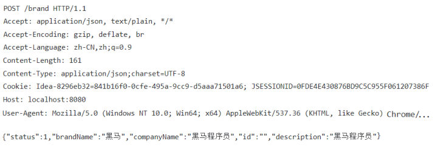

[上一篇](/posts/编程学习/javaweb学习笔记/31-springboot工程剖析/)知道了一件事：SpringBoot 工程里那个**内嵌 Tomcat** 在 8080 端口上等着接请求（日志里的 `Tomcat started on port 8080 (http)`）。这一篇（PPT 第 18-27 页）要回答的是：**浏览器到底"说"了什么，Tomcat 又在"听"什么？**

从这一篇起进入第 4 章的第二块内容——**HTTP 协议**。按 PPT 第 22 页的目录，请求协议这块分"**请求数据格式**"和"请求数据获取"两节，本篇只做前半节（**浏览器发过来的请求长什么样**）；"后端怎么把请求里的数据拿到手"是下一篇 [33 篇](/posts/编程学习/javaweb学习笔记/33-springboot获取请求数据/)；"服务器返回的响应长什么样"是 [34 篇](/posts/编程学习/javaweb学习笔记/34-http响应数据格式与状态码/)。

## HTTP 协议是什么（PPT 第 20 页）

PPT 第 20 页给的定义：

> **概念：Hyper Text Transfer Protocol，超文本传输协议，规定了浏览器和服务器之间数据传输的规则。**

拆开看三个词：

| 词 | 含义 |
| --- | --- |
| **Hyper Text**（超文本） | 传的不只是文字，还包括图片、视频、超链接这些"超文本"内容 |
| **Transfer**（传输） | 它是一套"传输规则"——**只管怎么把数据打包和送达**，不管业务逻辑 |
| **Protocol**（协议） | 浏览器和服务器**双方都遵守的约定**：一方按格式写，另一方按格式读 |

所以 HTTP 协议天生分两半：**请求协议**（浏览器 → 服务器，浏览器发出去的叫**请求数据**）和**响应协议**（服务器 → 浏览器，返回的叫**响应数据**）：

```text
浏览器  ── HTTP 请求（请求数据）──▶  服务器（Tomcat）
浏览器  ◀── HTTP 响应（响应数据）──  服务器（Tomcat）
```

### 三大特点（PPT 第 20 页）

> **特点：**
> 1. **基于 TCP 协议：面向连接，安全**
> 2. **基于请求-响应模型的：一次请求对应一次响应**
> 3. **HTTP 协议是无状态的协议：对于事务处理没有记忆能力。每次请求-响应都是独立的。**
>    - **缺点：多次请求间不能共享数据。**
>    - **优点：速度快。**

三条各有各的现实后果：

| 特点 | 什么意思 | 现实里的表现 |
| --- | --- | --- |
| **基于 TCP** | HTTP 建立在 TCP 连接之上（先建立连接、再传数据），**面向连接、可靠** | 你请求的页面/图片不会"传一半缺一块"而没人管（丢包会重传）；所以 HTTP 是"安全可靠"的传输规则 |
| **请求-响应模型** | **一次请求对应一次响应**，服务器不会主动推数据给浏览器 | 你在浏览器里按一次刷新 = 一次请求 = 一次响应；次数是"一对一"的 |
| **无状态** | 服务器**对事务处理没有记忆能力**，每次请求-响应都是**独立**的 | 同一个浏览器刚才请求过什么，服务器下次**不记得**——所以**缺点**是"多次请求间不能共享数据"，**优点**是"速度快"（不用为每个客户端维护状态、省内存） |

> [!IMPORTANT]
> **"无状态"是本篇最值得多想一层的特点**：假设你登录了某个系统，下一次请求用户列表时，服务器按理说"不记得"你是谁——那登录状态是怎么保持的？答案是浏览器会在后续请求里**把身份凭证（Cookie）自动带上**，服务器从请求头里认人。本篇后面那张 POST 报文图里就有一个实实在在的 `Cookie:` 请求头——HTTP 自己不带记忆，但可以"每次请求都把凭证捎上"，这也是后面会话技术的由来。

## 请求数据的三个部分（PPT 第 24、26、27 页）

PPT 第 24 页把请求数据拆成了两块，第 26 页补上第三块，第 27 页的问答页给了完整答案：

> **请求数据**
> - **请求行：请求数据第一行（请求方式、资源路径、协议）**
> - **请求头：第二行开始，格式 key：value**
> - **请求体：POST 请求，存放请求参数**
> - （第 27 页补充）**请求体与请求头之间隔了一个空行**

结构一眼看去是这样（**空行是第三部分的分界标记**）：

```text
请求行    │  GET /brand/findAll?name=OPPO&status=1 HTTP/1.1
请求头    │  Host: localhost:8080
          │  User-Agent: Mozilla/5.0 ...
          │  Accept: text/html,...
          │            ← 这里必须是一个空行
请求体    │  {"status":1,"brandName":"黑马",...}
```

### PPT 里两条真实的报文

PPT 第 24-26 页贴的就是浏览器实际发出去的报文（F12 的 Network 面板里能看到）。先看 **GET** 那条（第一行就是请求行，后面全是请求头）：

```text
GET /brand/findAll?name=OPPO&status=1 HTTP/1.1
Accept: text/html,application/xhtml+xml,application/xml;q=0.9,image/avif,image/webp,image/apng,*/*;q=0.8
Accept-Encoding: gzip, deflate, br
Accept-Language: zh-CN,zh;q=0.9
Host: localhost:8080
User-Agent: Mozilla/5.0 (Windows NT 10.0; Win64; x64) AppleWebKit/537.36 (KHTML, like Gecko) Chrome/...
```

**到请求头就结束了**——GET 的参数已经跟在请求行的路径里（`?name=OPPO&status=1`），所以**没有请求体**。

再看 **POST** 的：


*图：PPT 第 24-26 页——一条真实的 POST 报文：请求行是 `POST /brand HTTP/1.1`（路径里没有参数）；请求头有 `Content-Length: 161`、`Content-Type: application/json;charset=UTF-8`、`Cookie: ...`、`Host: localhost:8080` 等；**空行之后**是请求体 `{"status":1,"brandName":"黑马","companyName":"黑马程序员","id":"","description":"黑马程序员"}`（参数全在这里，长度正好对上 `Content-Length` 的 161 字节）*

对照 PPT 第 24、26 页的定义，逐段拆解这两条报文：

| 部分 | 在 GET 报文里 | 在 POST 报文里 |
| --- | --- | --- |
| **请求行** | `GET /brand/findAll?name=OPPO&status=1 HTTP/1.1`——**请求方式 `GET`、资源路径 `/brand/findAll?name=OPPO&status=1`、协议 `HTTP/1.1`** | `POST /brand HTTP/1.1`——请求方式变成 `POST`，路径里**不带参数** |
| **请求头** | 第二行开始，`key: value`，如 `Host: localhost:8080` | 同样从第二行开始，多出 `Content-Type`（说明请求体是 JSON）和 `Content-Length`（说明请求体有多大） |
| **空行** | GET 没有请求体，所以到请求头就结束了 | `User-Agent` 那行之后**空一行**，紧接着才是请求体 |
| **请求体** | **无**（参数在请求行的路径里） | `{"status":1,...}`——**请求参数放在这里** |

> [!TIP]
> 请求行的三个要素要能一眼分开：**请求方式**（GET/POST/…）、**资源路径**（`/brand/findAll?name=OPPO&status=1`）、**协议版本**（`HTTP/1.1`）。中间用空格隔开——路径里的 `?name=OPPO&status=1` 就是"跟在路径后面的参数"，所以 GET 的请求行会很长，而 POST 的请求行只有干净的一小段路径。

## 七个常见请求头字段（PPT 第 25 页）

请求头是"浏览器告诉服务器的各种附加说明"。PPT 第 25 页列了七个最常见的：

| 请求头 | 含义（PPT 第 25 页原文） |
| --- | --- |
| **Host** | 请求的主机名 |
| **User-Agent** | 浏览器版本，例如 Chrome 浏览器的标识类似 `Mozilla/5.0 ... Chrome/79`，IE 浏览器的标识类似 `Mozilla/5.0 (Windows NT ...) like Gecko` |
| **Accept** | 表示浏览器能接收的资源类型，如 `text/*`，`image/*` 或者 `*/*` 表示所有 |
| **Accept-Language** | 表示浏览器偏好的语言，服务器可以据此返回不同语言的网页 |
| **Accept-Encoding** | 表示浏览器可以支持的压缩类型，例如 `gzip, deflate` 等 |
| **Content-Type** | 请求主体的数据类型 |
| **Content-Length** | 请求主体的大小（单位：字节） |

几个记忆抓手：

- **`Host`** 是"我找的是哪台主机/哪个站点"——同一台服务器上可能挂着多个网站，服务器要靠它区分；
- **`User-Agent`** 是"我是谁（什么浏览器/系统）"——服务器可以据此做适配（比如给不同浏览器返回不同页面），也是"浏览器版本"这条信息最常用的来源；
- **`Accept` / `Accept-Language` / `Accept-Encoding`** 是三个"我能接受什么"：资源类型、语言、压缩格式（注意它们都只管**能力声明**，返回什么由服务器决定）；
- **`Content-Type` / `Content-Length`** 是**专为请求体服务**的一对：一个说明**类型**（如 `application/json`），一个说明**大小**（字节数）——所以它们**只在有请求体时才有意义**（GET 报文里你看不到它们，POST 报文里两个都在）。

> [!TIP]
> 在浏览器里按 `F12` → `Network` → 随便点开一个请求 → `Headers`，看到的"请求头"就是这一节讲的东西——**HTTP 协议不是抽象概念，而是你每次打开网页都在发生的真实文本交换**。

## GET 与 POST 的区别（PPT 第 26 页）

PPT 第 26 页把两种最重要的请求方式放在一起对比：

> - **请求方式-GET：请求参数在请求行中，没有请求体**，如：`/brand/findAll?name=OPPO&status=1`。**GET 请求大小在浏览器中是有限制的。**
> - **请求方式-POST：请求参数在请求体中，POST 请求大小是没有限制的。**

| 对比项 | **GET** | **POST** |
| --- | --- | --- |
| 参数位置 | **请求行**（跟在路径后面的 `?key=value&key2=value2`） | **请求体** |
| 请求体 | **没有** | **有** |
| 大小限制 | 浏览器中**有限制** | **没有限制** |
| 报文长度 | 请求行会很长（参数都在第一行） | 请求行短，请求体才是"大头" |
| 会不会带 `Content-Type`/`Content-Length` | 不涉及（没有请求体） | 通常都有（说明请求体的类型和长度） |
| 典型场景（课程里的例子） | 查询类请求，如"查询所有品牌" `/brand/findAll?name=OPPO&status=1` | 提交数据，如新增品牌 `POST /brand`（参数放请求体，课程里是 JSON） |

选哪个？记住一句话就行：**要"带一大包数据过去"的（新增、修改、登录、上传）用 POST；"查一下"的（查询、跳转、带几个筛选条件）用 GET**。密码这类敏感数据尤其不该出现在 GET 的 URL 里——URL 会留在浏览器历史、代理日志里，而请求体相对隐蔽。

## 必答问答（PPT 第 27 页）

| PPT 的问题 | 答案 |
| --- | --- |
| **Http 协议中请求数据分为哪几个部分?** | **请求行**（请求数据的第一行）、**请求头**（`key：value`）、**请求体**（**与请求头之间隔了一个空行**） |

## 小结

| 问题 | 答案 |
| --- | --- |
| HTTP 是什么？ | **Hyper Text Transfer Protocol（超文本传输协议）**，规定了**浏览器和服务器之间数据传输的规则**；分**请求协议**（浏览器→服务器）与**响应协议**（服务器→浏览器） |
| HTTP 的三大特点？ | ① **基于 TCP 协议**：面向连接、安全；② **基于请求-响应模型**：一次请求对应一次响应；③ **无状态**：对事务处理没有记忆能力，每次请求-响应都是独立的 |
| 无状态的优缺点？ | **缺点**：多次请求间**不能共享数据**；**优点**：**速度快**（服务器不用为每个客户端维护状态） |
| 请求数据分几部分？ | **请求行**、**请求头**、**请求体**（请求体与请求头之间**隔一个空行**） |
| 请求行里有什么？ | **请求方式**（GET/POST/…）、**资源路径**（`/brand/findAll?name=OPPO&status=1`）、**协议**（HTTP/1.1） |
| 请求头怎么写的？ | 从第二行开始，格式 **`key：value`**；常见七个字段：`Host`、`User-Agent`、`Accept`、`Accept-Language`、`Accept-Encoding`、`Content-Type`、`Content-Length` |
| 请求体什么时候有？ | **POST 请求**才有，**存放请求参数**（GET 的参数在请求行里、没有请求体）；`Content-Type` 说明它的类型、`Content-Length` 说明它的字节数 |
| GET 与 POST 的区别？ | GET：参数在**请求行**、**没有请求体**、**大小在浏览器中有限制**；POST：参数在**请求体**、**大小没有限制** |

## 相关

- [上一篇：SpringBoot工程剖析](/posts/编程学习/javaweb学习笔记/31-springboot工程剖析/)
- [下一篇：SpringBoot获取请求数据](/posts/编程学习/javaweb学习笔记/33-springboot获取请求数据/)

## 练习题

### 一、知识回顾（读完直接做下面的实践题）

1. **HTTP 的定义**：**Hyper Text Transfer Protocol**，**超文本传输协议**，规定了**浏览器和服务器之间数据传输的规则**；它分**请求协议**（浏览器→服务器，请求数据）和**响应协议**（服务器→浏览器，响应数据）
2. **三大特点**：① **基于 TCP 协议**——面向连接、安全；② **基于请求-响应模型的**——一次请求对应一次响应；③ **无状态**——对于事务处理没有记忆能力，每次请求-响应都是独立的
3. **无状态的缺点和优点**：**缺点**是多次请求间**不能共享数据**；**优点**是**速度快**
4. **请求数据的三部分**：**请求行**（请求数据的第一行）、**请求头**（`key：value`）、**请求体**（与请求头之间**隔了一个空行**）
5. **请求行的内容**：**请求方式**、**资源路径**、**协议**——例如 `GET /brand/findAll?name=OPPO&status=1 HTTP/1.1`
6. **请求头的写法**：从**第二行开始**，格式 **`key：value`**；它是浏览器给服务器的附加说明（主机名、浏览器版本、能接收的类型/语言/压缩格式、请求体类型与长度等）
7. **七个常见请求头**：`Host`（请求的主机名）、`User-Agent`（浏览器版本）、`Accept`（能接收的资源类型，`*/*` 表示所有）、`Accept-Language`（偏好的语言）、`Accept-Encoding`（支持的压缩类型，如 `gzip, deflate`）、`Content-Type`（请求主体的数据类型）、`Content-Length`（请求主体的大小，单位字节）
8. **请求体**：**POST 请求**才有，**存放请求参数**；`Content-Type` 与 `Content-Length` 这一对请求头是专门说明它的类型和大小的
9. **GET 与 POST 的区别**：**GET**：请求参数在**请求行**中、**没有请求体**（如 `/brand/findAll?name=OPPO&status=1`）、**GET 请求大小在浏览器中是有限制的**；**POST**：请求参数在**请求体中**、**POST 请求大小是没有限制的**
10. **PPT 第 27 页问答**：请求数据分为 **请求行 / 请求头 / 请求体** 三部分，其中**请求体与请求头之间隔了一个空行**

### 二、裸写题

- [ ] **2-1 手写一条 GET 请求报文**
  需求：在浏览器里查询品牌列表，参数是两个筛选条件（`name=OPPO`、`status=1`），请求路径是 `/brand/findAll`，用 HTTP/1.1，主机是 `localhost:8080`。
  请把这条请求报文写出来，要求：**第一行写全三个要素**，下面至少写出两个请求头（一个说明主机、一个说明浏览器），并说明这条报文有没有请求体。
  （练习文件 `test_32_GET请求报文.txt` 里给了写作区。）

  > [!TIP]- 提示（先自己想，实在想不出再点开）
  > **一级 · 思路**：先写"第一行"——请求方式、资源路径、协议，三个要素用**空格**隔开；**参数要跟在路径后面**（用 `?` 开头、多个参数用 `&` 连接）；然后从第二行开始写 `key: value` 形式的请求头
  > **二级 · 方法**：请求方式用 `GET`；协议写 `HTTP/1.1`；主机用 `Host` 头、浏览器用 `User-Agent` 头；GET 的参数在请求行里，所以**没有请求体**
  > **三级 · 骨架**：`GET /brand/findAll?____=____&____=____ HTTP/1.1` 换行 `Host: ____` 换行 `User-Agent: ____`

  > [!TIP]- 参考答案（做完再点开）
  > ```text
  > GET /brand/findAll?name=OPPO&status=1 HTTP/1.1
  > Host: localhost:8080
  > User-Agent: Mozilla/5.0 (Windows NT 10.0; Win64; x64) AppleWebKit/537.36 (KHTML, like Gecko) Chrome/79.0.3945.88 Safari/537.36
  > Accept: text/html,application/xhtml+xml,application/xml;q=0.9,image/avif,image/webp,image/apng,*/*;q=0.8
  > Accept-Encoding: gzip, deflate, br
  > Accept-Language: zh-CN,zh;q=0.9
  > ```
  > 说明：**没有请求体**。第一行的三个要素是"请求方式 `GET`、资源路径 `/brand/findAll?name=OPPO&status=1`、协议 `HTTP/1.1`"；两个参数都在**请求行**里（这也是 PPT 第 26 页说的"GET 请求参数在请求行中，没有请求体"）。PPT 第 24 页那张真实截图里的报文和这条几乎一模一样（它的 `Host` 是 `localhost:8080`，`User-Agent` 是一长串 `Mozilla/5.0 (Windows NT 10.0; Win64; x64) AppleWebKit/537.36 (KHTML, like Gecko) Chrome/...`）。

- [ ] **2-2 手写一条 POST 请求报文**
  需求：向 `/brand` 提交一条品牌数据，用 HTTP/1.1、主机 `localhost:8080`，参数是 JSON（内容自定，比如 `{"brandName":"黑马","companyName":"黑马程序员"}`），要求服务器知道这是 JSON 数据、并知道它有多少字节。
  请把整条报文写出来，**注意三个部分的分界**。
  （练习文件 `test_32_POST请求报文.txt` 里给了写作区。）

  > [!TIP]- 提示（先自己想，实在想不出再点开）
  > **一级 · 思路**：POST 的参数不放路径里，而是放在**最后一段**；请求行只写干净的路径；要告诉服务器"我发的是 JSON、一共多少字节"，靠两个专管请求体的请求头；写完请求头**必须空一行**才写请求体
  > **二级 · 方法**：请求方式用 `POST`，路径只写 `/brand`；用 `Content-Type: application/json;charset=UTF-8` 说明类型、`Content-Length` 说明字节数（按你写的 JSON 实际字符数填，中文字符按 UTF-8 占 3 字节估算即可）；空行之后再写 JSON
  > **三级 · 骨架**：`POST /____ HTTP/1.1` → `Host: ____` → `Content-Type: ____` → `Content-Length: ____` → **（空行）** → `{"____":"____"}`

  > [!TIP]- 参考答案（做完再点开）
  > ```text
  > POST /brand HTTP/1.1
  > Host: localhost:8080
  > User-Agent: Mozilla/5.0 (Windows NT 10.0; Win64; x64) AppleWebKit/537.36 (KHTML, like Gecko) Chrome/79.0.3945.88 Safari/537.36
  > Content-Type: application/json;charset=UTF-8
  > Content-Length: 62
  > 
  > {"brandName":"黑马","companyName":"黑马程序员"}
  > ```
  > 三处要点：
  > ① **请求行里没有参数**（只有 `POST /brand HTTP/1.1`），参数全在**请求体**；
  > ② `Content-Type: application/json;charset=UTF-8` 说明请求体是 JSON 格式，**`Content-Length` 说明请求体的大小（单位字节）**——中文按 UTF-8 算 3 字节，"黑马"6 字节、"黑马程序员"15 字节，加上 ASCII 部分，按实际内容数即可（上面数字只作示例）；
  > ③ **请求头与请求体之间必须有一个空行**（PPT 第 27 页专门强调），少了这个空行服务器就分不清"请求头到哪结束、请求体从哪开始"。
  > 对照 PPT 第 24-26 页那张真实 POST 截图：它写的是 `Content-Length: 161`、`Content-Type: application/json;charset=UTF-8`，请求体是 `{"status":1,"brandName":"黑马","companyName":"黑马程序员","id":"","description":"黑马程序员"}`——**报文结构完全一致，只是内容多少不同**。

- [ ] **2-3 拆解一条报文，并判断该用哪种请求方式**
  先看这条报文（来自 PPT 第 24-26 页的真实截图）：

  ```text
  POST /brand HTTP/1.1
  Accept: application/json, text/plain, */*
  Accept-Encoding: gzip, deflate, br
  Accept-Language: zh-CN,zh;q=0.9
  Content-Length: 161
  Content-Type: application/json;charset=UTF-8
  Cookie: Idea-8296eb32=841b16f0-0cfe-495a-9cc9-d5aaa71501a6; JSESSIONID=0FDE4E430876BD9C5C955F061207386F
  Host: localhost:8080
  User-Agent: Mozilla/5.0 (Windows NT 10.0; Win64; x64) AppleWebKit/537.36 (KHTML, like Gecko) Chrome/...

  {"status":1,"brandName":"黑马","companyName":"黑马程序员","id":"","description":"黑马程序员"}
  ```

  要求：
  1. 指出**请求行、请求头、请求体**分别从哪一行到哪一行；
  2. 写出**请求方式、资源路径、协议版本**；
  3. 说出 `Content-Type` 和 `Content-Length` 在这里的作用；
  4. 再回答两个选型问题：①"查询所有品牌"应该用哪种请求方式、参数放哪里？②"新增一个品牌"为什么用 POST 更好？

  （练习文件 `test_32_报文拆解与请求方式.txt` 里给了写作区。）

  > [!TIP]- 提示（先自己想，实在想不出再点开）
  > **一级 · 思路**：盯着"**空行**"分界——空行之前是请求行 + 请求头，空行之后是请求体；选型就记"查一下用哪个、带一大包用哪个"
  > **二级 · 方法**：第一行按空格切成三块就是请求方式/资源路径/协议；`Content-Type` 描述请求体的数据类型、`Content-Length` 描述请求体的字节数；查询类用 `GET`（参数在请求行，`?key=value&...`），提交数据用 `POST`（参数在请求体、大小没有限制）
  > **三级 · 骨架**：请求行 = `POST /____ HTTP/1.1`；请求头 = 第二行到空行前；请求体 = 空行后的那段 JSON

  > [!TIP]- 参考答案（做完再点开）
  > 1. **请求行**：第 1 行 `POST /brand HTTP/1.1`；**请求头**：第 2 行到 `User-Agent: ...` 那行（共 8 行，第二行开始、格式 `key：value`）；**请求体**：**空行之后**的那段 JSON（`{"status":1,...}`）。
  > 2. **请求方式** = `POST`；**资源路径** = `/brand`；**协议版本** = `HTTP/1.1`。
  > 3. `Content-Type: application/json;charset=UTF-8` 说明**请求主体的数据类型**是 JSON、UTF-8 编码；`Content-Length: 161` 说明**请求主体的大小**是 161 字节——这两个头都是**为请求体服务的**，服务器靠它们正确读取请求体。
  > 4. 选型：
  >    ① "查询所有品牌"用 **GET**，参数放在**请求行**的路径后面（如 `/brand/findAll?name=OPPO&status=1`）——查询是"查一下"，参数少、还可以直接分享 URL；GET **没有请求体**、**大小在浏览器中有限制**；
  >    ② "新增一个品牌"用 **POST** 更好：新增的数据是一整包（可能很大、字段多），POST 把参数放在**请求体**里、**大小没有限制**，还能用 `Content-Type` 明确告诉服务器数据格式（课程里用的是 JSON）。顺带一提，报文里的 `Cookie` 请求头就是"HTTP 无状态"下的补丁——浏览器把身份凭证带回来，服务器才认得出这是谁。

### 三、综合题

- [ ] **3-1 抓一次真实请求，写一份"报文说明"**
  把这一篇的知识落到你自己每天在用的网页上：
  1. 打开浏览器（Chrome/Edge），按 `F12` → 切到 **Network（网络）** 面板，然后访问本站（或课程里的 Tiana/品牌管理页面，任意真实页面都行）；
  2. 在请求列表里点第一条**文档类型**的请求，切到 `Headers`，把**请求行**（Request URL + Request Method + 协议）和至少 **3 个请求头**抄到练习文件里；
  3. 分别解释你抄下的这几个请求头是什么意思（对照 PPT 第 25 页的字段表）；
  4. 在这条请求里找一找：**有没有请求体**？如果有，它是请求列表里哪种类型的请求（GET 还是 POST）？为什么？
  5. 自己**另写一条 POST 请求报文**（提交一条数据，参数放请求体，要求写全请求行、请求头、空行、请求体）；
  6. 最后回答一句话：**HTTP 是"无状态"的，那服务器怎么知道"上一秒是我在登录"**？说说你的理解和浏览器在请求头里带的那个字段。

  **涉及知识点**

  | 知识点 | 在这里的应用 |
  | --- | --- |
  | HTTP 的定义与请求/响应 | 你抓到的每一条请求都是"请求协议"的实例 |
  | 三大特点 | 尤其"无状态"——第 6 问的出发点 |
  | 请求数据三部分 | 拆请求行、请求头、请求体，认出那个"空行" |
  | 请求头字段 | 用第 25 页的表解释真实字段 |
  | GET 与 POST | 判断"有没有请求体"，并自己写一条 POST 报文 |

  > [!TIP]- 提示（先自己想，实在想不出再点开）
  > **一级 · 思路**：F12 的 Network 面板把"看不见的协议"变成了列表——**点开任意一条就是一份真实报文**；抄的时候照 PPT 的顺序（第一行 → 请求头 → 空行 → 请求体）看，不容易乱
  > **二级 · 方法**：请求行看 `Headers` 面板最上面的 `Request Method`、`Request URL`（协议一般是 HTTP/1.1）；解释字段时对照 `Host`/`User-Agent`/`Accept`/`Accept-Language`/`Accept-Encoding`/`Content-Type`/`Content-Length` 七条；"有没有请求体"在 `Payload`（或 `Request Payload`）里能看到
  > **三级 · 骨架**：说明写法 = "第一行（请求方式+路径+协议）→ 请求头若干 → 空行 → 请求体（若有）"

  > [!TIP]- 参考答案（做完再点开）
  > 以本机用浏览器访问 `http://localhost:8080/hello?name=Heima` 这一类请求为例，抓到的内容会长这样（和 PPT 第 24 页的截图同类）：
  > ```text
  > GET /hello?name=Heima HTTP/1.1
  > Host: localhost:8080
  > User-Agent: Mozilla/5.0 (Windows NT 10.0; Win64; x64) AppleWebKit/537.36 (KHTML, like Gecko) Chrome/... Safari/537.36
  > Accept: text/html,application/xhtml+xml,application/xml;q=0.9,image/avif,image/webp,*/*;q=0.8
  > Accept-Encoding: gzip, deflate, br
  > Accept-Language: zh-CN,zh;q=0.9
  > ```
  > 3. 字段解释：`Host` = 请求的主机名（`localhost:8080`）；`User-Agent` = 浏览器版本（一长串 `Mozilla/5.0 ...`，不同浏览器标识不同）；`Accept` = 能接收的资源类型（`*/*` 表示所有）；`Accept-Encoding` = 支持的压缩类型（`gzip, deflate, br`）；`Accept-Language` = 偏好的语言（`zh-CN` 表示简体中文）。（这些字段的具体含义在 PPT 第 25 页。）
  > 4. **这条是 GET，没有请求体**——参数 `name=Heima` 在**请求行的路径**里（`?name=Heima`）。如果你抓的是提交表单/新增数据那种请求（POST），就会看到 `Content-Type`、`Content-Length` 两个请求头，`Payload` 里是请求体。
  > 5. 一条自己写的 POST 报文（结构和 PPT 第 24-26 页的真实截图一致）：
  >    ```text
  >    POST /brand HTTP/1.1
  >    Host: localhost:8080
  >    Content-Type: application/json;charset=UTF-8
  >    Content-Length: 62
  >    
  >    {"brandName":"黑马","companyName":"黑马程序员"}
  >    ```
  > 6. HTTP 协议本身"**对于事务处理没有记忆能力**，每次请求-响应都是独立的"，所以服务器**不会自己记得**你上一次请求是谁。实际做法是在**请求头里带上身份凭证**——本篇那张 POST 截图里就有一个 `Cookie: Idea-...; JSESSIONID=...` 请求头：浏览器每次请求都**自动**把 Cookie 捎给服务器，服务器从里面认出"这个请求还是刚才那个人"，于是多个请求之间就能共享数据了。这也说明"无状态"的缺点（多次请求间不能共享数据）是用**会话机制**补上的，而不是 HTTP 自己改的（后面课程会专门讲会话技术）。
