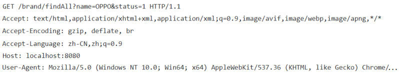

这是 HTTP 协议这一块的第 2 篇。[32 篇](/posts/编程学习/javaweb学习笔记/32-http协议与请求数据格式/)里看的是**报文长什么样**（请求行、请求头、请求体怎么写），这一篇（PPT 第 28～31 页）接着解决后面那半句——**在 SpringBoot 的代码里，怎么把这些数据拿出来用**。结论先说：不需要自己解析，Web 服务器已经把它整理成了一个对象，我们要做的只是把这个对象"要"过来。

## 请求数据谁来解析（PPT 第 28～29 页）

PPT 第 28 页是本节的目录页：HTTP 协议这块下面分了两组——「**请求数据格式 → 请求数据获取**」和「**响应数据格式 → 响应数据设置**」。上一篇讲的是第一组的"格式"，这一篇讲第一组的"获取"。

PPT 第 29 页把"获取"的原理说得非常直白：

> **Web服务器(Tomcat)对HTTP协议的请求数据进行解析，并进行了封装(HttpServletRequest)，在调用Controller方法的时候传递给了该方法。这样，就使得程序员不必直接对协议进行操作，让Web开发更加便捷。**

拆成三步看：

1. 浏览器把 [32 篇](/posts/编程学习/javaweb学习笔记/32-http协议与请求数据格式/)里那串原始报文发过来（请求行 + 请求头 + 空行 + 请求体）；
2. **Tomcat 负责解析它**，把请求行、请求头、请求体里的内容整理成一个 Java 对象——`HttpServletRequest`（**请求对象**）；
3. 调用 Controller 方法的时候，服务器把这个对象**直接作为方法参数传进来**。所以方法里只要写上这个参数，就能随便取数据，**一行协议解析代码都不用写**。


*图：PPT 第 29 页配的原始请求报文——第一行是请求行（`GET /brand/findAll?name=OPPO&status=1 HTTP/1.1`），第二行起是请求头（`Accept`、`Accept-Encoding`、`Accept-Language`、`Host: localhost:8080`、`User-Agent: Mozilla/5.0 … Chrome/…`）。这一整段就是 Tomcat 要解析的对象，本篇六个方法不过是各取其中一段：`getRequestURI()` 取 `/brand/findAll`、`getQueryString()` 取 `name=OPPO&status=1`、`getHeader("Host")` 取 `localhost:8080`、`getHeader("User-Agent")` 取最后那一长串。注意这段报文里没有 `Content-Type`、`Content-Length`、`Cookie`——因为它是 GET 请求，压根没有请求体*

> [!TIP]
> "程序员不必直接对协议进行操作"这句话的实际含义是：**你永远不需要自己写字符串去切分那段报文**。像 `getParameter("name")` 这种调用，背后就是 Tomcat 在解析请求行/请求体时顺手存进对象里的结果。

## 请求对象怎么用：PPT 第 30 页的代码

PPT 第 30 页在 `HelloController` 里加了一个 `/request` 方法，把六个方法一次演示完（下面是 PPT 的代码，补上了类上的注解与 import）：

```java
import jakarta.servlet.http.HttpServletRequest;

@RestController
public class HelloController {

    @RequestMapping("/request")
    public String request(HttpServletRequest request) {
        //  1.获取请求参数name，age
        String name = request.getParameter("name"); // Tom
        //  2.获取请求路径uri 和 url
        String uri = request.getRequestURI();                     // /request
        String url = request.getRequestURL().toString();           // http://localhost:8080/request
        //  3.获取请求头 User-Agent
        String userAgent = request.getHeader("User-Agent");        // Mozilla/5.0 (Windows NT 10.0; Win64; x64)
        //  4.获取请求方式
        String method = request.getMethod();                       // GET
        //  5.获取请求的查询字符串
        String queryString = request.getQueryString();             // name=Tomcat&age=10
        return "request success";
    }
}
```

要留意的地方：

- **请求对象不是我们 new 出来的**，而是写在方法参数里由服务器传进来——方法可以只声明一个 `HttpServletRequest` 参数，也可以在前面再放别的参数；
- 这个类来自 `jakarta.servlet.http` 包（Tomcat 10 之后 Servlet 规范从 `javax.*` 换成了 `jakarta.*`，见[31 篇](/posts/编程学习/javaweb学习笔记/31-springboot工程剖析/)里起步依赖带进来的 Tomcat 版本）；
- `getRequestURL()` 返回的不是 `String` 而是 `StringBuffer`，所以 PPT 里多写了一步 `.toString()`。

### 六个方法各自取报文里的哪一段

PPT 第 30 页的注释里给了每个方法的预期结果，把它和报文对齐就是这样：

| 方法 | 取的是报文里的哪一块 | PPT 注释里的示例值 |
| --- | --- | --- |
| **`getParameter("name")`** | 请求行里问号后面的**请求参数**（`?name=Tomcat&age=10`） | `Tom` |
| **`getParameter("age")`** | 同上，按参数名取 | `10` |
| **`getRequestURI()`** | 请求行的**资源路径**（不含协议、主机、端口） | `/request` |
| **`getRequestURL()`** | 请求行的资源路径 **+ 协议 + 主机 + 端口**（完整地址） | `http://localhost:8080/request` |
| **`getHeader("User-Agent")`** | **请求头**里名为 `User-Agent` 的那一行 | `Mozilla/5.0 (Windows NT 10.0; Win64; x64)` |
| **`getMethod()`** | 请求行的**请求方式** | `GET` |
| **`getQueryString()`** | 问号后面那串**原样的**参数字符串 | `name=Tomcat&age=10` |

一句话总结每个方法的口径：**要值用 `getParameter`，要路径用 `getRequestURI`/`getRequestURL`，要请求头用 `getHeader`，要方式用 `getMethod`，要原始查询串用 `getQueryString`。**

> [!TIP]
> 取请求参数其实还有更省事的写法：课程[30 篇](/posts/编程学习/javaweb学习笔记/30-springboot快速入门/)里的 `public String hello(String name)` 就是把参数名直接写成方法参数，SpringMVC 会自动按名字去请求参数里找同名值塞进来。差别在于：**直接写参数只能拿到你要的那一两个值，而拿到 `HttpServletRequest` 对象等于拿到了整个请求**（路径、请求头、请求方式都能顺手取）。

## 实测：六个方法在本机跑出来的真实返回值

光看注释还不够，六个方法到底返回什么，本机在 Spring Boot 3.2.8（内嵌 Tomcat 10.1.26 / JDK 17）里跑了一遍。请求用的是带两个参数的地址：

> [!TIP]
> **本机实测**——请求 `curl -s "http://localhost:8080/request?name=Tomcat&age=10"`，服务端把这六个方法的结果各打印/返回一行：
>
> ```text
> getParameter(name)    = Tomcat
> getParameter(age)     = 10
> getRequestURI()       = /request
> getRequestURL()       = http://localhost:8080/request
> getHeader(User-Agent) = curl/8.15.0
> getMethod()           = GET
> getQueryString()      = name=Tomcat&age=10
> ```

七行输出（六类方法，`getParameter` 取了两个参数所以是两行）里有两处特别值得记：

1. **`getRequestURI()` 只有路径，`getRequestURL()` 是完整地址**——见下一节；
2. **`getHeader("User-Agent")` 拿到的是 `curl/8.15.0`**，而 PPT 注释里写的是 `Mozilla/5.0 (Windows NT 10.0; Win64; x64)`。两者都没错：**这个值就是"谁在访问"的自述**，用命令行工具 curl 访问就是 `curl/8.15.0`，用浏览器访问才是一长串 `Mozilla/5.0 … Chrome/…`（正是上图报文里那一行的样子）。

## 只差一个字母的一对：getRequestURI 与 getRequestURL

这两个方法名只差一个字母，实测结果却差了一大截，是这一节最容易错的地方：

| | `getRequestURI()` | `getRequestURL()` |
| --- | --- | --- |
| 全称 | URI（Uniform Resource **Identifier**，统一资源**标识符**） | URL（Uniform Resource **Locator**，统一资源**定位符**） |
| 实测返回 | `/request` | `http://localhost:8080/request` |
| 含哪些部分 | 只有**资源路径** | 协议 `http://` + 主机 `localhost` + 端口 `8080` + 资源路径 |
| 返回类型 | `String` | `StringBuffer`（要 `.toString()`） |
| 什么时候用 | 只关心"请求的是哪个接口/页面" | 需要拼一个完整地址的时候（比如做重定向、回显） |

记法：**URL 多了"定位"（Locator）这三部分——协议、主机、端口**，所以它才是能在浏览器里直接打开的完整地址。二者都来自请求行的 `GET /request HTTP/1.1` 这一段，只是 URL 把 `Host` 请求头里的主机信息也一起拼上了。

## 必答问答（PPT 第 31 页）

| PPT 的问题 | 答案 |
| --- | --- |
| HTTP请求数据需要程序员自己解析吗? | **不需要**，web 服务器负责对 HTTP 请求数据进行解析，并封装为了**请求对象**（Tomcat 解析的是请求行、请求头、请求体，程序员只面对解析好的对象） |
| 如何获取请求数据? | **`HttpServletRequest` 对象里面封装了所有的请求信息**——把它写在 Controller 方法的参数里，服务器就会传进来，六个方法各取一部分 |

## 小结

| 问题 | 答案 |
| --- | --- |
| 请求数据是谁解析的？ | **Web 服务器（Tomcat）**解析 HTTP 请求数据，并**封装成请求对象**，调用 Controller 方法时**作为方法参数**传进来，程序员不用直接操作协议 |
| 请求对象叫什么、怎么拿到？ | `HttpServletRequest`（`jakarta.servlet.http` 包）；**写在 Controller 方法的参数里**即可，不是自己 new 的 |
| 取请求参数用什么？ | **`request.getParameter("参数名")`**，返回 `String`；请求参数就是问号后面 `key=value&key2=value2` 里的值 |
| 取请求路径用什么？ | **`getRequestURI()`** 只有路径（实测 `/request`）；**`getRequestURL()`** 是完整地址（实测 `http://localhost:8080/request`），返回 `StringBuffer` 要 `.toString()` |
| 取请求头用什么？ | **`getHeader("头名")`**，如 `getHeader("User-Agent")`（实测 curl 访问是 `curl/8.15.0`，浏览器访问是 `Mozilla/5.0 …`） |
| 取请求方式和原始查询串用什么？ | **`getMethod()`**（实测 `GET`）；**`getQueryString()`**（实测 `name=Tomcat&age=10`，原样不动） |

## 相关

- [上一篇：HTTP协议与请求数据格式](/posts/编程学习/javaweb学习笔记/32-http协议与请求数据格式/)
- [下一篇：HTTP响应数据格式与状态码](/posts/编程学习/javaweb学习笔记/34-http响应数据格式与状态码/)

## 练习题

### 一、知识回顾（读完直接做下面的实践题）

1. **请求数据由谁解析**：**Web 服务器（Tomcat）**对 HTTP 协议的请求数据进行解析，并把它**封装成请求对象**，在调用 Controller 方法的时候**作为方法参数传进来**；这样程序员不必直接对协议进行操作，Web 开发更便捷
2. **请求对象是谁、怎么拿到**：`HttpServletRequest`（`jakarta.servlet.http` 包）；**写在 Controller 方法的参数里**就行，它由服务器创建并注入，不是自己 `new` 出来的
3. **六个方法速查**：`getParameter("名")` 取请求参数、`getRequestURI()` 取资源路径、`getRequestURL()` 取完整地址、`getHeader("名")` 取请求头、`getMethod()` 取请求方式、`getQueryString()` 取问号后面的原始查询串
4. **`getRequestURI()` 与 `getRequestURL()` 的区别**：URI 只有路径（本机实测 `/request`），URL 是含**协议 + 主机 + 端口 + 路径**的完整地址（实测 `http://localhost:8080/request`）；另外 `getRequestURL()` 返回的是 `StringBuffer`，要 `.toString()`
5. **本机实测的七行输出**（请求 `http://localhost:8080/request?name=Tomcat&age=10`）：`getParameter(name) = Tomcat`、`getParameter(age) = 10`、`getRequestURI() = /request`、`getRequestURL() = http://localhost:8080/request`、`getHeader(User-Agent) = curl/8.15.0`、`getMethod() = GET`、`getQueryString() = name=Tomcat&age=10`
6. **`User-Agent` 为什么两次不一样**：它就是"谁在访问"的自述——**curl 访问是 `curl/8.15.0`，浏览器访问是一长串 `Mozilla/5.0 … Chrome/…`**，两者都对，取决于客户端
7. **`getParameter` 与 `getQueryString` 的分工**：前者**按参数名取值**（拿到的只是值，如 `Tomcat`），后者**把问号后面那一整段原样返回**（如 `name=Tomcat&age=10`）；参数存在请求体里时（POST），`getParameter` 照样能取到，但 `getQueryString` 就只反映地址栏上那段
8. **取参数的另一种写法**：把参数名直接写成方法参数（如 `public String hello(String name)`），SpringMVC 会自动按名绑定——省事，但**只能拿到声明的那几个值**，比不上直接拿到整个请求对象
9. **PPT 第 31 页两个必答问答**：请求数据需要程序员自己解析吗 → **不需要**，web 服务器解析并封装为请求对象；如何获取请求数据 → **`HttpServletRequest` 对象里封装了所有的请求信息**
10. **为什么要学它**：上一篇看到的是"协议原文"，这一篇看到的是"报文进了 Java 程序之后的样子"——后面所有接口要从地址上拿参数（搜索条件、分页、id），用的都是这一节的 `getParameter`

### 二、裸写题

- [ ] **2-1 写一个能收到问候对象的接口**
  需求：浏览器访问 `/hello2?name=Tomcat` 时，服务器在**控制台**打印出这次来访者的名字，并给浏览器返回一句简单的问候语（比如"Hello Tomcat"）。要求名字是从请求里取出来的、不能写死。
  （练习文件 `test_33_获取请求数据.java` 里给了写作区。）

  > [!TIP]- 提示（先自己想，实在想不出再点开）
  > **一级 · 思路**：地址上 `?name=Tomcat` 就是一个请求参数，取参数得先有"请求对象"；这个对象不用自己造，**声明成方法的参数**服务器就会送进来
  > **二级 · 方法**：`HttpServletRequest`（`jakarta.servlet.http` 包）+ 它的 `getParameter("name")`；方法返回值由 `@RestController` + `@RequestMapping` 直接写进响应体
  > **三级 · 骨架**：`@RequestMapping("____") public String hello2(____ request){ String name = request.____("____"); System.out.println(____); return ____; }`

  > [!TIP]- 参考答案（做完再点开）
  > ```java
  > package com.itheima;
  >
  > import jakarta.servlet.http.HttpServletRequest;
  > import org.springframework.web.bind.annotation.RequestMapping;
  > import org.springframework.web.bind.annotation.RestController;
  >
  > @RestController
  > public class HelloController {
  >
  >     @RequestMapping("/hello2")
  >     public String hello2(HttpServletRequest request) {
  >         // 从请求参数里按名字取出 name（地址 ?name=Tomcat）
  >         String name = request.getParameter("name");
  >         // 控制台打印来访者名字
  >         System.out.println("HelloController ... hello2 ： " + name);
  >         // 把问候写回浏览器
  >         return "Hello " + name;
  >     }
  > }
  > ```
  > 访问 `http://localhost:8080/hello2?name=Tomcat`，浏览器显示 `Hello Tomcat`，IDEA 控制台打印 `HelloController ... hello2 ： Tomcat`。
  > 想省掉请求对象也行——把 `String name` 直接写成方法参数（课程[30 篇](/posts/编程学习/javaweb学习笔记/30-springboot快速入门/)的写法），SpringMVC 会自动把同名的请求参数绑定进来。

- [ ] **2-2 做一个"请求信息回显"接口**
  需求：访问 `/requestInfo` 时，把这次请求的**三个信息**拼成三行文字返回给浏览器——① 请求的是哪个资源路径；② 这个请求的完整地址；③ 用的是哪种请求方式。要求三行各占一行，且值都从请求里取。
  （练习文件 `test_33_请求信息回显.java` 里给了写作区。）

  > [!TIP]- 提示（先自己想，实在想不出再点开）
  > **一级 · 思路**：三个信息都在请求行里，分别对应"只要路径""要完整地址""要方法名"三个取值方法；拼字符串时每写完一段补一个换行
  > **二级 · 方法**：`getRequestURI()` / `getRequestURL().toString()` / `getMethod()`，用 `StringBuilder` 拼接，换行用 `"\n"`
  > **三级 · 骨架**：`StringBuilder sb = new StringBuilder(); sb.append("请求路径 = ").append(request.____()); sb.append("\n"); …… return sb.toString();`

  > [!TIP]- 参考答案（做完再点开）
  > ```java
  > package com.itheima;
  >
  > import jakarta.servlet.http.HttpServletRequest;
  > import org.springframework.web.bind.annotation.RequestMapping;
  > import org.springframework.web.bind.annotation.RestController;
  >
  > @RestController
  > public class RequestInfoController {
  >
  >     @RequestMapping("/requestInfo")
  >     public String requestInfo(HttpServletRequest request) {
  >         StringBuilder sb = new StringBuilder();
  >         sb.append("请求路径 = ").append(request.getRequestURI()).append("\n");
  >         // getRequestURL() 返回的是 StringBuffer，要 toString()
  >         sb.append("完整地址 = ").append(request.getRequestURL().toString()).append("\n");
  >         sb.append("请求方式 = ").append(request.getMethod());
  >         return sb.toString();
  >     }
  > }
  > ```
  > 访问 `http://localhost:8080/requestInfo`，浏览器（返回的是 `text/plain`，浏览器按原文显示、保留换行）里是三行，本机实测同样的取法结果是 `请求路径 = /request`、`完整地址 = http://localhost:8080/request`、`请求方式 = GET`。

- [ ] **2-3 把来访者的身份记到控制台**
  需求：随意写一个能访问到的接口，在里面把**来访客户端的身份信息**和**它访问的主机名**取出来打印到控制台，并观察同一个地址分别用浏览器和用 curl 访问时，这两行输出有什么不同。
  做完在文件末尾的注释里回答：这两行分别取的是报文里的哪一部分？为什么同一个接口两次访问拿到的值不一样？
  （练习文件 `test_33_读取请求头.java` 里给了写作区。）

  > [!TIP]- 提示（先自己想，实在想不出再点开）
  > **一级 · 思路**：客户端身份和主机名都不是地址上的参数，而是**报文第二行开始的那些"键：值"**——要用"按头名取请求头"的方法
  > **二级 · 方法**：`request.getHeader("User-Agent")`（客户端身份）、`request.getHeader("Host")`（主机名，浏览器访问时是 `localhost:8080`）
  > **三级 · 骨架**：`String ua = request.getHeader("____"); String host = request.getHeader("____"); System.out.println("User-Agent = " + ua); System.out.println("Host = " + host);`

  > [!TIP]- 参考答案（做完再点开）
  > ```java
  > package com.itheima;
  >
  > import jakarta.servlet.http.HttpServletRequest;
  > import org.springframework.web.bind.annotation.RequestMapping;
  > import org.springframework.web.bind.annotation.RestController;
  >
  > @RestController
  > public class HeaderController {
  >
  >     @RequestMapping("/header")
  >     public String header(HttpServletRequest request) {
  >         String userAgent = request.getHeader("User-Agent");
  >         String host = request.getHeader("Host");
  >         System.out.println("User-Agent = " + userAgent);
  >         System.out.println("Host = " + host);
  >         return "ok";
  >     }
  > }
  > ```
  > 两个问题：
  > ① 两行取的都是**请求头（request header）**，不是请求行里的参数——所以要用 `getHeader("头名")`，而不是 `getParameter`；
  > ② 因为**请求头是客户端自己填的**：请求头里的 `User-Agent` 就是"我是谁"的自述，本机实测用 curl 访问拿到的是 `curl/8.15.0`，用浏览器访问拿到的是 `Mozilla/5.0 (Windows NT 10.0; Win64; x64) … Chrome/…`；两台不同的客户端访问同一个地址，值自然不一样（`Host` 也会因为访问用的地址不同而变，如 `localhost:8080` 与 `127.0.0.1:8080`）。

### 三、综合题

- [ ] **3-1 照课程做一个"请求信息体检"接口（把六类数据一次取全）**
  把这一篇的六个方法串成一个接口做一遍，做完它你就把"从请求里取数据"这件事打通了。
  1. 在入门工程里新建一个请求处理类（类名自取，控制台/浏览器都能看到结果），并在类上加上"标识请求处理类"的注解；
  2. 定义处理方法，映射到 `/request`，方法参数里声明**请求对象**（这就是本篇的核心：让服务器把封装好的请求对象送进来）；
  3. 在方法里取出**两个请求参数** `name`、`age`；
  4. 取出这个请求的**资源路径**和**完整地址**（各用一个变量存）；
  5. 取出**请求头 `User-Agent`** 和**请求方式**；
  6. 取出**查询字符串**（问号后面那一整段原样字符串）；
  7. 把上面七行结果拼成一段多行文字返回给浏览器；
  8. 用命令行或浏览器访问 `http://localhost:8080/request?name=Tomcat&age=10`，把返回的七行结果抄到练习文件末尾的注释里；
  9. 在注释里回答两个问题：① 第 4 步那两个变量的值分别是什么、差别在哪？② 这份请求数据是谁解析、谁封装、谁传给方法的？
  （练习文件 `test_33_综合_请求信息体检.java` 里按这 9 步给了写作区。）

  **涉及知识点**

  | 知识点 | 在这里的应用 |
  | --- | --- |
  | Tomcat 解析 + 封装 | 方法参数里的 `HttpServletRequest` 不是自己 new 的 |
  | `@RestController` / `@RequestMapping` | 标类、标方法，把返回值直接写进响应体 |
  | 六个取值方法 | getParameter ×2、getRequestURI、getRequestURL、getHeader、getMethod、getQueryString |
  | URI 与 URL 的区别 | 一个只有路径、一个是完整地址（含协议/主机/端口） |
  | 请求头 | `User-Agent` 随客户端变化（curl 与浏览器不同） |

  > [!TIP]- 提示（先自己想，实在想不出再点开）
  > **一级 · 思路**：先"拿到请求对象"，再"从它身上一个个取"——取参数、取路径、取头、取方式，最后把七行拼成一段字符串返回；第 9 步的两个问题回去看本篇开头 PPT 第 29 页那句原话
  > **二级 · 方法**：`@RestController` + `@RequestMapping("/request")`；参数写 `HttpServletRequest request`；拼串用 `StringBuilder`（`append` 一串 `.append("\n")`），注意 `getRequestURL()` 要 `.toString()`
  > **三级 · 骨架**：`String name = request.____("name"); String uri = request.____(); String url = request.____().toString(); String ua = request.____("User-Agent"); String method = request.____(); String qs = request.____();`

  > [!TIP]- 参考答案（做完再点开）
  > **3-1**
  > 1~7. 代码（本机实验室里用的就是这个结构，`HttpLabController`）：
  >    ```java
  >    package com.itheima;
  >
  >    import jakarta.servlet.http.HttpServletRequest;
  >    import org.springframework.web.bind.annotation.RequestMapping;
  >    import org.springframework.web.bind.annotation.RestController;
  >
  >    @RestController
  >    public class RequestLabController {
  >
  >        @RequestMapping("/request")
  >        public String request(HttpServletRequest request) {
  >            // 1.请求参数
  >            String name = request.getParameter("name");
  >            String age = request.getParameter("age");
  >            // 2.路径 uri 与完整地址 url
  >            String uri = request.getRequestURI();
  >            String url = request.getRequestURL().toString();
  >            // 3.请求头
  >            String userAgent = request.getHeader("User-Agent");
  >            // 4.请求方式
  >            String method = request.getMethod();
  >            // 5.查询字符串
  >            String queryString = request.getQueryString();
  >
  >            StringBuilder sb = new StringBuilder();
  >            sb.append("getParameter(name)    = ").append(name).append("\n");
  >            sb.append("getParameter(age)     = ").append(age).append("\n");
  >            sb.append("getRequestURI()       = ").append(uri).append("\n");
  >            sb.append("getRequestURL()       = ").append(url).append("\n");
  >            sb.append("getHeader(User-Agent) = ").append(userAgent).append("\n");
  >            sb.append("getMethod()           = ").append(method).append("\n");
  >            sb.append("getQueryString()      = ").append(queryString);
  >            return sb.toString();
  >        }
  >    }
  >    ```
  > 8. 访问 `http://localhost:8080/request?name=Tomcat&age=10` 的**本机实测**输出：
  >    ```text
  >    getParameter(name)    = Tomcat
  >    getParameter(age)     = 10
  >    getRequestURI()       = /request
  >    getRequestURL()       = http://localhost:8080/request
  >    getHeader(User-Agent) = curl/8.15.0
  >    getMethod()           = GET
  >    getQueryString()      = name=Tomcat&age=10
  >    ```
  >    （`User-Agent` 那一行取决于用什么访问：curl 是 `curl/8.15.0`，浏览器是一长串 `Mozilla/5.0 … Chrome/…`。）
  > 9. 两个问题：
  >    ① `uri` = `/request`（只有资源路径，来自请求行的 `GET /request HTTP/1.1` 那一段）；`url` = `http://localhost:8080/request`（完整地址，多了协议、主机、端口）。名字只差一个字母，**URL 才是能在浏览器里直接打开的地址**；另外 `getRequestURL()` 返回 `StringBuffer`，所以代码里多写了 `.toString()`；
  >    ② 请求数据由 **Web 服务器（Tomcat）**解析并**封装成 `HttpServletRequest` 请求对象**，在调用 Controller 方法时**作为方法参数**传给该方法——所以方法里一行解析代码都不用写（PPT 第 29 页原话，也是 PPT 第 31 页问答的答案）。
