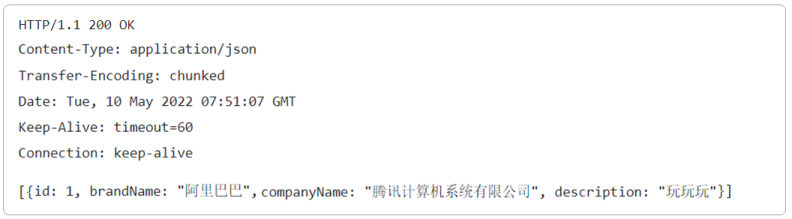

[33 篇](/posts/编程学习/javaweb学习笔记/33-springboot获取请求数据/)讲的是请求方向——**服务器怎么拿到浏览器发来的数据**。这一篇（PPT 第 32～38 页）翻到另一半：**服务器回给浏览器的响应数据长什么样**，以及响应行里那个"状态码"到底怎么读。代码层面"怎么把响应写出来"是下一篇（35 篇）的事，这一篇先把**格式**看清楚。

## 一次 HTTP 交互的两半（PPT 第 32～34 页）

PPT 第 32、33 页是这两节的小目录，把 HTTP 协议排成了四格：**请求数据格式 → 请求数据获取 → 响应数据格式 → 响应数据设置**。前两格是 [32 篇](/posts/编程学习/javaweb学习笔记/32-http协议与请求数据格式/)和 [33 篇](/posts/编程学习/javaweb学习笔记/33-springboot获取请求数据/)，这一篇是第三格。

PPT 第 34 页又把 HTTP 协议的定义复习了一遍：

> **概念：Hyper Text Transfer Protocol，超文本传输协议，规定了浏览器和服务器之间数据传输的规则。**

一次交互就是**一问一答**：

```text
浏览器 ──── 请求数据（请求行 / 请求头 / 请求体）────► 服务器
浏览器 ◄─── 响应数据（响应行 / 响应头 / 响应体）──── 服务器
```

请求数据的三部分在 [32 篇](/posts/编程学习/javaweb学习笔记/32-http协议与请求数据格式/)里讲过了，这一篇要记住的是：**响应数据的三部分名字一一对应**——请求那边第一行叫请求行，响应这边第一行就叫**响应行**；请求头对**响应头**；请求体对**响应体**。

## 响应数据的三部分（PPT 第 35 页）

PPT 第 35 页给的定义：

> **响应行：响应数据第一行（协议、状态码、描述）**
> **响应头：第二行开始，格式 `key：value`**
> **响应体：最后一部分，存放响应数据**

拿 PPT 里那段真实响应报文对照着看：


*图：PPT 第 35 页配的响应报文——第一行 `HTTP/1.1 200 OK` 是**响应行**（协议 `HTTP/1.1`、状态码 `200`、描述 `OK`）；往下 `Content-Type`、`Transfer-Encoding`、`Date`、`Keep-Alive`、`Connection` 这几行键值对是**响应头**；再空一行之后，最后那段 `[{"id": 1, "brandName": "阿里巴巴", …}]` 是**响应体**（一份 JSON 数据）。注意响应头和响应体之间那个**空行**——它和请求报文里分隔请求头/请求体的空行是同一个作用*

三点补充：

- **空行是分隔符**，不是可有可无的装饰：响应头到空行就结束了，空行后面才轮到响应体；响应体可以为空（比如 204 这种"成功但没内容"的响应）；
- **响应行里的"描述"**只是给人看的文字说明（`OK`、`Not Found`、`Unauthorized`），程序判断成功失败看的是**数字状态码**；
- **列表里响应头的顺序不重要**，`key：value` 是一行一条，名字不区分大小写。

## 响应状态码：五大类（PPT 第 36 页）

PPT 第 36 页把状态码按第一位数字分成五类：

| 分类 | 含义（PPT 原文） | 责任在谁 | 典型状态码 |
| --- | --- | --- | --- |
| **1xx** | **响应中**——临时状态码，表示请求已经接收，告诉客户端应该继续请求或者如果它已经完成则忽略它 | 不算错误，是过程提示 | 100 Continue |
| **2xx** | **成功**——表示请求已经被成功接收，处理已完成 | 一切正常 | **200** |
| **3xx** | **重定向**——重定向到其他地方；让客户端再发起一次请求以完成整个处理 | 客户端需要**再发一次请求** | 301（永久）、302（临时） |
| **4xx** | **客户端错误**——处理发生错误，责任**在客户端**。如：请求了不存在的资源、客户端未被授权、禁止访问等 | 客户端（请求写错了） | **404**、401、403 |
| **5xx** | **服务器错误**——处理发生错误，责任**在服务端**。如：程序抛出异常等 | 服务端（程序出问题了） | **500** |

记这一张表的诀窍：**看首位数字就够**——`4` 开头怪请求方，`5` 开头怪服务端，`3` 开头是"你要换个地址再问一次"，`1` 开头是"还没完，继续"，只有 `2` 开头是"成了"。

### 三个最常见状态码（PPT 第 37 页）

PPT 第 37 页把最常打交道的三个单独列了一张表：

| 状态码 | 描述（PPT 原文） | 平时遇到它的场景 |
| --- | --- | --- |
| **200** | **客户端请求成功** | 一切正常——接口返回数据、页面正常打开，浏览器 F12 里满眼都是 200 |
| **404** | **请求资源不存在，URL 输入有误，或者网站资源被删除了** | 地址敲错、接口路径改了名字、静态资源被删；属于 **4xx 客户端错误** |
| **500** | **服务器发生不可预期的错误** | 后端代码抛异常（空指针、除零、SQL 写错…）；属于 **5xx 服务端错误** |

> [!TIP]
> 排查问题时这两个码的用法完全不同：**看到 404 先怀疑地址**（前端请求的路径和后端 `@RequestMapping` 里的值对不上、静态资源放错目录），**看到 500 去翻服务器日志**（堆栈会告诉你哪一行抛的异常）。这也解释了 PPT 第 36 页对 4xx/5xx 的"责任划分"——它决定了你该去改前端还是改后端。

## 五个常见响应头字段（PPT 第 36 页）

PPT 第 36 页列了五个最常见的响应头字段：

| 响应头 | 作用（PPT 原文） | 说明与例子 |
| --- | --- | --- |
| **`Content-Type`** | 表示该响应内容的**类型** | 例如 `text/html`（网页）、`application/json`（接口数据）、`text/plain`（纯文本）；本机实测返回字符串时服务器写的是 `text/plain;charset=UTF-8`，返回对象/集合时是 `application/json` |
| **`Content-Length`** | 表示该响应内容的**长度（字节数）** | 本机实测返回 `Hello Tom~` 时是 `Content-Length: 10`（10 个 ASCII 字符 = 10 字节）；用了分块传输（`Transfer-Encoding: chunked`）时就没有它 |
| **`Content-Encoding`** | 表示该响应**压缩算法** | 例如 `gzip`；浏览器请求头里带 `Accept-Encoding: gzip, deflate, br`（见[32 篇](/posts/编程学习/javaweb学习笔记/32-http协议与请求数据格式/)）就是为了告诉服务器"我能解压这些" |
| **`Cache-Control`** | 指示客户端应如何**缓存** | 例如 `max-age=300` 表示可以最多缓存 300 秒 |
| **`Set-Cookie`** | 告诉浏览器为当前页面所在的域**设置 cookie** | 响应方向的"种 cookie"，与请求头里的 `Cookie`（浏览器把 cookie 带回去）配成一对 |

`Content-Type` 和 `Content-Length` 这两个是日常调试里出现频率最高的：一个说"这是什么"，一个说"它有多大"。

## 3xx 是怎么回事：重定向（PPT 第 36 页）

PPT 第 36 页右下角画了一张重定向示意图：

```text
客户端 ──①请求 A──► 服务器
客户端 ◄──② 3xx (Location：B)── 服务器        ← 服务器说"你要的东西在 B"
客户端 ──③再请求 B──► 服务器
客户端 ◄──④ 最终响应── 服务器
```

要点就是 PPT 那句"**让客户端再发起一次请求以完成整个处理**"：

- 服务器**不会**替客户端去访问 B，它只是回一个 3xx，并在响应头里用 **`Location`** 告诉客户端新地址；
- 客户端（浏览器）收到 3xx 后**自动**再发一次请求，这次才拿到真正的数据——所以浏览器地址栏会"跳"到新地址；
- 302 与 301 的差别在"临时还是永久"（301 永久重定向，浏览器和搜索引擎会记住新地址；302 临时），这也是它属于 3xx 而不是 4xx 的原因：**这不是错误，只是流程没走完**。

## 实测：亲眼看看真实响应的三部分

拿[30 篇](/posts/编程学习/javaweb学习笔记/30-springboot快速入门/)那个 `/hello` 接口抓一次响应报文，三部分一眼可辨：

> [!TIP]
> **本机实测**（Spring Boot 3.2.8 / 内嵌 Tomcat 10.1.26 / JDK 17）——请求 `curl -si "http://localhost:8080/hello?name=Tom" | head -5`：
>
> ```text
> HTTP/1.1 200 
> Content-Type: text/plain;charset=UTF-8
> Content-Length: 10
> Date: Tue, 29 Sep 2026 07:39:29 GMT
>
> Hello Tom~
> ```
>
> 逐行对照 PPT 第 35 页的三部分：第一行 `HTTP/1.1 200 ` 是**响应行**（协议 + 状态码 200 + 描述，Tomcat 这里没填描述文字）；中间三行 `Content-Type` / `Content-Length` / `Date` 是**响应头**；空行之后那行 `Hello Tom~` 是**响应体**，长度 10 字节与 `Content-Length: 10` 对得上。
>
> 同一个工程里请求一个**不存在的地址**（`curl -s -o /dev/null -w "%{http_code}" "http://localhost:8080/nope"`），拿到的状态码是：
>
> ```text
> 404
> ```
>
> 这正是 PPT 第 37 页说的"请求资源不存在，URL 输入有误"——`/nope` 这个路径没有任何 `@RequestMapping` 与之匹配，属于 **4xx 客户端错误**。
>
> 换个返回内容的接口，`Content-Type` 会跟着变（同一台机器上请求返回 JSON 的 `/list` 接口，`curl -si "http://localhost:8080/list" | head -4`）：
>
> ```text
> HTTP/1.1 200
> Content-Type: application/json
> Transfer-Encoding: chunked
> ```
>
> 返回的是集合，所以类型是 `application/json`；这次因为长度要边算边发（分块传输），响应头里是 `Transfer-Encoding: chunked` 而**没有** `Content-Length`——和上一条对照着看，`Content-Length` 与 `Transfer-Encoding` 是二选一的两种"告诉客户端有多长"的方式。

## 必答问答（PPT 第 38 页）

| PPT 的问题 | 答案 |
| --- | --- |
| HTTP响应数据分为几个部分？ | **三部分——响应行、响应头、响应体**（响应行是协议、状态码、描述；响应头是 `key：value`；响应体放响应数据） |
| 响应状态码的分类？ | **1xx 响应中**（临时状态码）；**2xx 成功**；**3xx 重定向**；**4xx 客户端错误**；**5xx 服务端错误** |

## 小结

| 问题 | 答案 |
| --- | --- |
| 响应数据分几部分？ | **响应行**（协议、状态码、描述）、**响应头**（第二行开始，`key：value`）、**响应体**（最后一部分，与响应头之间**隔一个空行**） |
| 状态码五大类怎么分？ | **1xx 响应中**（临时）；**2xx 成功**；**3xx 重定向**（让客户端再发一次请求）；**4xx 客户端错误**（如 404）；**5xx 服务端错误**（如 500） |
| 200 / 404 / 500 分别是什么？ | **200 客户端请求成功**；**404 请求资源不存在，URL 输入有误，或者网站资源被删除了**；**500 服务器发生不可预期的错误**（程序抛异常） |
| 常见响应头有哪些？ | **Content-Type**（响应内容类型，如 `text/html`、`application/json`）、**Content-Length**（内容长度，字节数）、**Content-Encoding**（压缩算法，如 gzip）、**Cache-Control**（缓存指示，如 `max-age=300`）、**Set-Cookie**（给当前域设置 cookie） |
| 3xx 重定向的过程？ | 客户端请求 A → 服务器回 **3xx + `Location: B`** → 客户端**再发起一次请求**到 B → 拿到最终响应；服务器不替客户端去取 B |
| 实测里响应头长什么样？ | `/hello` 返回 `200` + `Content-Type: text/plain;charset=UTF-8` + `Content-Length: 10` + `Date`；返回 JSON 的接口是 `Content-Type: application/json` + `Transfer-Encoding: chunked`（这次没有 Content-Length）；请求不存在的路径得到 **404** |

## 相关

- [上一篇：SpringBoot获取请求数据](/posts/编程学习/javaweb学习笔记/33-springboot获取请求数据/)
- [下一篇：SpringBoot设置响应数据](/posts/编程学习/javaweb学习笔记/35-springboot设置响应数据/)

## 练习题

### 一、知识回顾（读完直接做下面的实践题）

1. **响应数据三部分**：**响应行**（第一行，含协议、状态码、描述）、**响应头**（第二行开始，`key：value`）、**响应体**（最后一部分，存放响应数据）；**响应头和响应体之间隔了一个空行**
2. **状态码五大类**：**1xx 响应中**（临时状态码，告诉客户端继续请求或忽略）、**2xx 成功**（请求已被成功接收、处理已完成）、**3xx 重定向**（让客户端再发起一次请求以完成整个处理）、**4xx 客户端错误**（责任在客户端，如请求了不存在的资源、未被授权、禁止访问）、**5xx 服务端错误**（责任在服务端，如程序抛出异常）
3. **三个常见状态码**：**200 客户端请求成功**；**404 请求资源不存在，URL 输入有误，或者网站资源被删除了**；**500 服务器发生不可预期的错误**
4. **责任划分的用法**：看到 **404 先怀疑地址**（前端请求路径与后端映射对不上、静态资源放错位置），看到 **500 去翻服务器日志**（堆栈会指出哪一行抛的异常）
5. **五个常见响应头**：**Content-Type**（响应内容类型，如 `text/html`、`application/json`、`text/plain`）、**Content-Length**（响应内容长度，单位字节）、**Content-Encoding**（压缩算法，如 `gzip`）、**Cache-Control**（缓存指示，如 `max-age=300` 表示最多缓存 300 秒）、**Set-Cookie**（告诉浏览器为当前页面所在的域设置 cookie）
6. **响应行的构成**：协议（如 `HTTP/1.1`）+ **状态码**（数字，程序看它）+ 描述（给人看的文字，如 `OK`）；本机实测 `/hello` 的响应行是 `HTTP/1.1 200`（Tomcat 没填描述文字）
7. **本机实测的响应头**：返回字符串时 `Content-Type: text/plain;charset=UTF-8`、`Content-Length: 10`（`Hello Tom~` 正好 10 字节）、`Date: …`；返回集合（JSON）时 `Content-Type: application/json` 且是 `Transfer-Encoding: chunked`（**没有 Content-Length**）；请求不存在的路径（`/nope`）返回 **404**
8. **Content-Length 与 Transfer-Encoding 的关系**：两者都是"告诉客户端响应体有多长/怎么读"的方式，长度事先算得出就用 `Content-Length`，一边生成一边发就用 `Transfer-Encoding: chunked`（分块传输），一般**不同时出现**
9. **3xx 重定向的过程**：客户端请求 A → 服务器返回 **3xx + `Location: B`** → 客户端**再发起一次请求**到 B → 得到最终响应（301 永久 / 302 临时）；服务器不会替客户端去访问 B
10. **PPT 第 38 页两个必答问答**：响应数据分为 → **响应行、响应头、响应体**；状态码分类 → **1xx 响应中、2xx 成功、3xx 重定向、4xx 客户端错误、5xx 服务端错误**

### 二、裸写题

- [ ] **2-1 给一段响应报文"分段"**
  下面这段报文是一次请求的响应原文：

  ```text
  HTTP/1.1 404 
  Content-Type: text/html;charset=UTF-8
  Content-Length: 48
  Date: Tue, 29 Sep 2026 07:39:29 GMT

  <html><body><h1>404 Not Found</h1></body></html>
  ```

  请照着本篇的三段划分，把每一行属于哪一部分标出来，并回答：
  1. 响应头是从第几行开始、到第几行结束？响应头和响应体之间靠什么分隔？
  2. 这段响应的状态码是多少、属于哪一类、责任在客户端还是服务端？描述里说的场景是什么？
  3. `Content-Type` 的值是什么、说明响应体是什么类型的内容？`Content-Length` 的值和响应体字节数对得上吗？
  （练习文件 `test_34_响应报文三部分.txt` 里给了写作区。）

  > [!TIP]- 提示（先自己想，实在想不出再点开）
  > **一级 · 思路**：先按"第一行 / 中间一堆键值对 / 空行 / 最后的正文"切三刀，再回到本篇的状态码表和响应头表里查含义；字节数可以用"ASCII 字符 1 个算 1 字节"去数
  > **二级 · 方法**：第一行是**响应行**（协议、状态码、描述）；`key：value` 那些行是**响应头**；空行之后是**响应体**；4 开头的状态码查"客户端错误"那一行，`Content-Type`/`Content-Length` 查响应头表
  > **三级 · 骨架**：`第 1 行 = ____行；第 2～4 行 = ____；第 5 行 = ____；第 6 行 = ____；状态码 ____ 属于 ____，责任在____`

  > [!TIP]- 参考答案（做完再点开）
  > **2-1**
  > 1. 分段结果：
  >    ```text
  >    HTTP/1.1 404                                             ← 响应行
  >    Content-Type: text/html;charset=UTF-8                    ← 响应头
  >    Content-Length: 48                                       ← 响应头
  >    Date: Tue, 29 Sep 2026 07:39:29 GMT                      ← 响应头
  >                                                             ← 空行（分隔响应头与响应体）
  >    <html><body><h1>404 Not Found</h1></body></html>         ← 响应体
  >    ```
  > 2. 响应头从**第 2 行**开始、到**第 4 行**结束（共 3 条），响应头和响应体之间靠**一个空行**分隔。状态码是 **404**，属于 **4xx 客户端错误**，责任在**客户端**；PPT 第 37 页的描述是"**请求资源不存在，URL 输入有误，或者网站资源被删除了**"——正好对应这段响应体里写的 `404 Not Found`。
  > 3. `Content-Type` 的值是 `text/html;charset=UTF-8`，说明响应体是 **HTML 网页内容**、字符集是 UTF-8；`Content-Length` 是 **48**，而响应体 `<html><body><h1>404 Not Found</h1></body></html>` 是 48 个 ASCII 字符 = 48 字节，**完全对得上**（换成中文就不行了：UTF-8 下一个汉字算 3 字节）。

- [ ] **2-2 给一组状态码"归类定责"**
  下面这些状态码出现在各种请求结果里，请逐个判断：① 属于哪一类（1xx～5xx）？② 大概是什么意思？③ 出问题时该去改客户端还是改服务端？
  `200`、`204`、`301`、`302`、`403`、`404`、`500`、`503`
  做完在文件末尾用一句话总结：**只凭状态码的第一位数字，能判断出什么？**
  （练习文件 `test_34_状态码分类.txt` 里给了写作区。）

  > [!TIP]- 提示（先自己想，实在想不出再点开）
  > **一级 · 思路**：不用背全部，先按首位数字分堆（1/2/3/4/5），再回到本篇那五行含义里找对应；责任归属就写在 4xx 和 5xx 那两行里
  > **二级 · 方法**：2 开头 = 成功；3 开头 = 重定向（别忘 301 永久 / 302 临时）；4 开头 = 客户端错误（404 找不到资源、403 禁止访问）；5 开头 = 服务端错误（500 程序抛异常、503 服务不可用）
  > **三级 · 骨架**：`200 → ____类，____，责任在____`（其余同理，一条一行）

  > [!TIP]- 参考答案（做完再点开）
  > **2-2**
  >
  > | 状态码 | 分类 | 含义 | 该改哪边 |
  > | --- | --- | --- | --- |
  > | 200 | **2xx 成功** | 客户端请求成功，处理已完成 | 都不用改（正常） |
  > | 204 | **2xx 成功** | 请求成功但没有响应体（成功类里唯一"没内容"的） | 都不用改 |
  > | 301 | **3xx 重定向** | 资源**永久**换地址了，客户端按 `Location` 再请求一次并记住新地址 | 客户端（浏览器自动跳）/ 服务端配的跳转 |
  > | 302 | **3xx 重定向** | **临时**重定向，客户端按 `Location` 再请求一次 | 同上 |
  > | 403 | **4xx 客户端错误** | 禁止访问（PPT 第 36 页 4xx 描述里的"禁止访问"） | 客户端（请求方没有权限/路径不对） |
  > | 404 | **4xx 客户端错误** | 请求资源不存在，URL 输入有误，或者网站资源被删除了 | 客户端（先查地址/路径） |
  > | 500 | **5xx 服务端错误** | 服务器发生不可预期的错误（程序抛异常） | 服务端（翻日志看堆栈） |
  > | 503 | **5xx 服务端错误** | 服务器暂时不可用/过载（同样是服务端的事） | 服务端 |
  >
  > 一句话总结：**只看第一位数字就能定"大方向"和"责任方"**——1 过程提示、2 成功、3 要再请求一次、4 客户端有错、5 服务端有错。

- [ ] **2-3 手写一段能返回 JSON 的响应报文**
  后端要返回一份用户数据，响应体是 `{"id":1,"username":"daqiao"}`。请把这整段 HTTP 响应报文**完整写出来**（按本篇的三部分格式），要求：
  1. 状态行说明协议、这次是成功、描述写 `OK`；
  2. 响应头里给出 `Content-Type`（这份数据是 JSON 格式）和 `Content-Length`（**字节数要算对**）；
  3. 再补一个 `Date` 响应头（值随意）；
  4. 空一行，然后才是响应体；
  5. 在文件末尾回答两个问题：① 这份报文里哪些部分**不需要程序员手写**（对照[30 篇](/posts/编程学习/javaweb学习笔记/30-springboot快速入门/)里 `/hello` 的实测响应，那里状态码和响应头是谁写的）？② 如果响应体换成汉字内容，`Content-Length` 还能用字符个数去数吗？
  （练习文件 `test_34_手写响应报文.txt` 里给了写作区。）

  > [!TIP]- 提示（先自己想，实在想不出再点开）
  > **一级 · 思路**：照抄本篇实测那段响应的"形状"，只把里面的值和内容换掉；长度要**数字节**——这段响应体全是 ASCII 字符，一个字符一个字节
  > **二级 · 方法**：第一行形如 `协议 状态码 描述`（成功是 200，描述 OK）；头部 JSON 的类型是 `application/json`；`Content-Length` 用"字符个数"数出来；空行之后再写 JSON
  > **三级 · 骨架**：`HTTP/1.1 ____ OK` / `Content-Type: ____` / `Content-Length: ____` / `Date: ____` / 空行 / `{"id":1,"username":"daqiao"}`

  > [!TIP]- 参考答案（做完再点开）
  > **2-3** 完整报文：
  > ```text
  > HTTP/1.1 200 OK
  > Content-Type: application/json
  > Content-Length: 28
  > Date: Tue, 29 Sep 2026 07:39:29 GMT
  >
  > {"id":1,"username":"daqiao"}
  > ```
  > 格式核对：第 1 行是响应行（协议 `HTTP/1.1`、状态码 `200`、描述 `OK`）；第 2～4 行是响应头（`key: value`）；第 5 行是**空行**；第 6 行是响应体。
  > 两个问题：
  > ① 状态行里的**状态码、描述**和那几条**响应头全都不是手写的**——本机实测（Spring Boot 3.2.8 / 内嵌 Tomcat）里 `/hello` 接口的响应是 `HTTP/1.1 200 ` + `Content-Type: text/plain;charset=UTF-8` + `Content-Length: 10` + `Date: …`，代码里只是 `return "Hello " + name + "~";`，这些头都是**服务器自动设置**的（下一篇 35 篇会讲为什么"通常不用手动设置"）。这里手写只是为了看清报文的格式。
  > ② **不能**。`Content-Length` 的单位是**字节数**，而 UTF-8 下一个汉字占 **3 个字节**（如 `"阿里巴巴"` 4 个字 = 12 字节），必须按编码后的字节数算，不能按字符个数数。

### 三、综合题

- [ ] **3-1 亲手抓一次响应，逐部分分析并验证 200 / 404 / 500**
  把自己工程里的响应报文抓下来分析一遍，顺便把三种状态码都见一次。
  1. 启动自己的 SpringBoot 工程，找一个**能正常访问**的接口（比如 `/hello?name=Tom`）；
  2. 用 `curl -i`（或浏览器 F12 → Network → 点某条请求 → Headers）抓下完整响应，把响应行、响应头、响应体三部分几行抄到练习文件里，并在每行后面标出它属于哪一部分；
  3. 数一数这次响应有几个响应头，指出其中哪个是 `Content-Type`、值是什么，并从值判断响应体是什么类型的内容；
  4. 把地址换成一个**不存在的路径**（如 `/nope`）再访问一次，记下状态码，判断它属于哪一类、责任在客户端还是服务端、该去哪边排查；
  5. 在自己某个接口的代码里**故意制造一个异常**（例如让一个整数除以 0），重新访问它，记下状态码，判断分类与责任方，并从控制台日志里找出是哪一行代码抛的异常；
  6. 最后在文件末尾回答 PPT 第 38 页的两个问题（响应数据分为哪几个部分、状态码怎么分类）。
  （练习文件 `test_34_综合_抓取并分析响应报文.txt` 里按这 6 步给了写作区。）

  **涉及知识点**

  | 知识点 | 在这里的应用 |
  | --- | --- |
  | 响应数据三部分 | 抓包后逐行标注响应行 / 响应头 / 响应体 |
  | 状态码五大类 | 第 4 步的 404 属于 4xx；第 5 步的 500 属于 5xx |
  | 责任划分 | 404 查地址、500 翻日志（决定改前端还是改后端） |
  | 常见响应头 | `Content-Type` 判断内容类型，`Content-Length` 核对字节数 |
  | 服务器自动设置 | 代码里没写状态码和响应头，它们照样出现在报文里 |

  > [!TIP]- 提示（先自己想，实在想不出再点开）
  > **一级 · 思路**：先用一个正常接口建立"标准形状"，再拿两个异常场景（地址错 / 程序错）作对照，三份报文放一起就是这一篇的完整证据链；第 5 步的异常只要让代码在运行时抛出来就行
  > **二级 · 方法**：抓报文用 `curl -i` 加上接口地址（`-i` = 连响应头一起打印，等价做法是浏览器 F12 的 Network 面板）；不认识的路径 → 没有 `@RequestMapping` 匹配 → 404；代码抛异常 → 服务器返回 500，堆栈在 IDEA 控制台里
  > **三级 · 骨架**：`curl -i "http://localhost:8080/____"` → 抄三部分；再 `curl -i "http://localhost:8080/____"`（不存在的路径）→ 记状态码；最后在方法里加一行 `int x = 1 / 0;` 再访问 → 记状态码 + 抄堆栈第一行

  > [!TIP]- 参考答案（做完再点开）
  > **3-1**
  > 2. 正常接口的响应（**本机实测**，Spring Boot 3.2.8 / 内嵌 Tomcat 10.1.26 / JDK 17，`curl -si "http://localhost:8080/hello?name=Tom" | head -5`）：
  >    ```text
  >    HTTP/1.1 200                                   ← 响应行（协议、状态码、描述）
  >    Content-Type: text/plain;charset=UTF-8         ← 响应头
  >    Content-Length: 10                             ← 响应头
  >    Date: Tue, 29 Sep 2026 07:39:29 GMT            ← 响应头
  >                                                   ← 空行（分隔响应头与响应体）
  >    Hello Tom~                                     ← 响应体
  >    ```
  > 3. 这次响应共 **3 个响应头**（`Content-Type`、`Content-Length`、`Date`），其中 `Content-Type` 的值是 **`text/plain;charset=UTF-8`**——说明响应体是**纯文本、UTF-8 编码**；本机另外实测了返回集合的 `/list` 接口，它的 `Content-Type` 是 `application/json`（且因为分块传输是 `Transfer-Encoding: chunked`，没有 `Content-Length`），可见这个头是**跟着响应内容变的**。
  > 4. 访问不存在的路径（**本机实测**）：
  >    ```text
  >    $ curl -s -o /dev/null -w "%{http_code}" "http://localhost:8080/nope"
  >    404
  >    ```
  >    **404** 属于 **4xx 客户端错误**，责任在**客户端**：PPT 第 37 页的描述是"请求资源不存在，URL 输入有误，或者网站资源被删除了"。排查思路是先怀疑**地址**——检查请求的路径和 Controller 上 `@RequestMapping` 的值是否一致（[33 篇](/posts/编程学习/javaweb学习笔记/33-springboot获取请求数据/)里 `getRequestURI()` 取到的正是这个路径）。
  > 5. 故意在方法里制造异常（例如加一行 `int result = 1 / 0;`）后再访问，响应状态码是 **500**（"服务器发生不可预期的错误"，属于 **5xx 服务端错误**，责任在服务端）；IDEA 控制台会打印异常堆栈，第一行通常是 `java.lang.ArithmeticException: / by zero`，顺着堆栈就能定位到抛异常的那一行。**这就是 404 与 500 的分工：一个先去改地址，一个先去翻日志。**
  > 6. PPT 第 38 页两个问题：
  >    ① 响应数据分为 **三部分——响应行、响应头、响应体**；
  >    ② 状态码分类：**1xx 响应中（临时状态码）、2xx 成功、3xx 重定向、4xx 客户端错误、5xx 服务端错误**。
