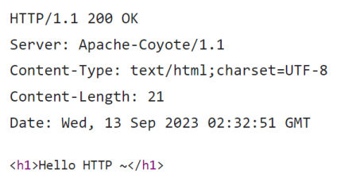

[34 篇](/posts/编程学习/javaweb学习笔记/34-http响应数据格式与状态码/)把响应报文的样子看清楚了（响应行、响应头、响应体，以及状态码怎么读）。这一篇（PPT 第 39～42 页）回答最后一个问题：**在代码里怎么把这三部分写出来**。答案有两种方式，而且——大多数时候你**什么都不用写**。

## 响应数据也是被封装好递过来的（PPT 第 39～40 页）

PPT 第 39 页是本节目录的最后一格：HTTP 协议下面四格里，「响应数据格式」是[上一篇](/posts/编程学习/javaweb学习笔记/34-http响应数据格式与状态码/)，「**响应数据设置**」就是这一篇。

PPT 第 40 页把[33 篇](/posts/编程学习/javaweb学习笔记/33-springboot获取请求数据/)里请求方向的套路，在响应方向上又讲了一遍：

> **Web服务器对HTTP协议的响应数据进行了封装(HttpServletResponse)，并在调用Controller方法的时候传递给了该方法。这样，就使得程序员不必直接对协议进行操作，让Web开发更加便捷。**

两句话对照着记：

| | 请求方向 | 响应方向 |
| --- | --- | --- |
| 服务器解析/封装出来的对象 | `HttpServletRequest`（请求对象） | `HttpServletResponse`（**响应对象**） |
| 怎么到我们手里 | 写在 Controller **方法参数**里 | 一样，**写在方法参数里** |
| 里面装着什么 | 浏览器发来的全部请求信息 | 这次要发回去的**响应状态码、响应头、响应体** |
| 谁负责把它变成协议原文 | 服务器（Tomcat） | 服务器（Tomcat）——我们只管往对象里塞内容 |

换句话说：**响应对象就是"这次回给浏览器的报文"在 Java 里的样子**，我们往里塞什么，浏览器就收到什么。


*图：PPT 第 40 页配的响应报文——第一行 `HTTP/1.1 200 OK` 是**响应行**；往下 `Server: Apache-Coyote/1.1`（内嵌 Tomcat 给自己署的名）、`Content-Type: text/html;charset=UTF-8`、`Content-Length: 21`、`Date: …` 是**响应头**；空行之后 `<h1>Hello HTTP ~~</h1>` 是**响应体**。这张图正好演示了下一篇案例里会看到的现象：**响应头这些行全是服务器写的**，代码里只负责给出内容*

> [!TIP]
> 这张图是旧版讲义留下的截图，它的响应体（`<h1>Hello HTTP ~~</h1>`）和第 41 页代码里写的 `<h1>Hello Response</h1>` **并不是同一次请求**；看这张图只要抓住"三部分怎么分"就够了，本篇的**真实数据以下面方式一、方式二的实测为准**。

## 方式一：基于 HttpServletResponse 封装（PPT 第 41 页）

PPT 第 41 页给了第一种写法——**把响应对象当参数写在方法里，然后一个一个设置**：

```java
import jakarta.servlet.http.HttpServletResponse;
import java.io.IOException;

@RequestMapping("/response")
public void response(HttpServletResponse response) throws IOException {
    // 1.设置响应状态码
    response.setStatus(401);
    // 2.设置响应头
    response.setHeader("itheima","itheima");
    // 3.设置响应体
    response.getWriter().write("<h1>Hello Response</h1>");
}
```

逐个对照[上一篇](/posts/编程学习/javaweb学习笔记/34-http响应数据格式与状态码/)的响应三部分：

| 代码 | 设置的是响应的哪一部分 |
| --- | --- |
| `response.setStatus(401)` | **响应行**里的状态码（401 = 未授权，属于 4xx 客户端错误） |
| `response.setHeader("itheima","itheima")` | **响应头**（`key: value`，这里自定义了一条名为 `itheima` 的头） |
| `response.getWriter().write("…")` | **响应体**（`getWriter()` 拿到的就是写响应正文的字符流） |

写的时候要注意三点：

1. **方法返回类型是 `void`**——响应体的内容已经通过 `response` 对象写完了，不需要 `return`；
2. 方法上要 `throws IOException`（写输出流属于 IO 操作，可能抛受检异常）；
3. 响应对象的包是 `jakarta.servlet.http.HttpServletResponse`（和请求对象同一个包）。

### 实测：方式一浏览器收到的东西

把这段代码跑起来，用命令抓一下真实响应：

> [!TIP]
> **本机实测**（Spring Boot 3.2.8 / 内嵌 Tomcat 10.1.26 / JDK 17）——请求 `curl -si "http://localhost:8080/response" | head -6`：
>
> ```text
> HTTP/1.1 401 
> itheima: itheima
> Content-Length: 23
> Date: Tue, 29 Sep 2026 07:41:12 GMT
>
> <h1>Hello Response</h1>
> ```
>
> 三项设置都生效了：响应行是 **401**（`setStatus(401)` 生效，Tomcat 只写数字、没补描述文字），响应头里出现了自定义的 **`itheima: itheima`**（`setHeader` 生效），响应体正是写进去的那段 HTML，`Content-Length: 23` 也由服务器按内容长度算好了。
>
> **但有一个细节要特别注意：这条响应里没有 `Content-Type`**（对比下面方式二的实测，那里有）。因为 `getWriter().write(...)` 是绕过 Spring 的返回值处理、直接往响应流里塞内容的，框架不知道你写的是 HTML 还是文本，就没有替你写这个头——**浏览器只能自己猜**（大概率按 HTML 猜，所以能看到标题效果，但这属于"碰巧"）。

## 方式二：基于 ResponseEntity 封装（PPT 第 41 页）

第二种写法**不碰响应对象**，而是把"状态码 + 响应头 + 响应体"打包成一个返回值交给 Spring：

```java
import org.springframework.http.ResponseEntity;

@RequestMapping("/response2")
public ResponseEntity<String> response2() {
    return ResponseEntity.status(401)          // 1.设置响应状态码
            .header("group", "itcast")         // 2.设置响应头
            .body("<h1>Hello Response</h1>");  // 3.设置响应体
}
```

对应关系一模一样：

| 代码 | 设置的是响应的哪一部分 |
| --- | --- |
| `ResponseEntity.status(401)` | **响应行**里的状态码 |
| `.header("group", "itcast")` | **响应头**（这里换成自定义头 `group: itcast`） |
| `.body("<h1>Hello Response</h1>")` | **响应体**（泛型 `ResponseEntity<String>` 里的 `String` 就是响应体的类型） |

三个方法**链式调用**一路 `.` 下去，最后 `return` 出去：

- 方法返回类型写成 `ResponseEntity<String>`（尖括号里换成对象/集合也行，Spring 会自动转成 JSON）；
- **不用 `throws IOException`**，因为在方法里根本没往流里写东西；
- 顺序上是 **`status()` 起头**（它是静态方法，只能写在最前面）、中间可以链多个 `.header(...)`、**最后以 `.body(...)` 收尾**。

### 实测：方式二浏览器收到的东西

> [!TIP]
> **本机实测**（Spring Boot 3.2.8 / 内嵌 Tomcat 10.1.26 / JDK 17）——请求 `curl -si "http://localhost:8080/response2" | head -6`：
>
> ```text
> HTTP/1.1 401 
> group: itcast
> Content-Type: text/plain;charset=UTF-8
> Content-Length: 23
> Date: Tue, 29 Sep 2026 07:41:12 GMT
>
> <h1>Hello Response</h1>
> ```
>
> 状态码 **401**、自定义响应头 **`group: itcast`**、响应体同样是那 23 字节的 HTML，全部正确；和方式一最大的差别是——**框架自动补上了 `Content-Type: text/plain;charset=UTF-8`**。因为走返回值这条路，Spring 会替我们把"这是什么内容"也一并写好（返回字符串就是 `text/plain`）。

### 两种方式对照

| | 方式一：`HttpServletResponse` | 方式二：`ResponseEntity` |
| --- | --- | --- |
| 怎么拿到/返回 | **方法参数**里声明响应对象，方法返回 `void` | **方法返回值**就是 `ResponseEntity<...>` |
| 设置状态码 | `response.setStatus(401)` | `ResponseEntity.status(401)` |
| 设置响应头 | `response.setHeader("itheima","itheima")` | `.header("group","itcast")` |
| 设置响应体 | `response.getWriter().write("<h1>…</h1>")` | `.body("<h1>…</h1>")` |
| 异常声明 | 要 `throws IOException` | 不用 |
| 实测中的 `Content-Type` | **没有**（框架不替你判断内容类型） | **`text/plain;charset=UTF-8`**（自动补上） |
| 适合什么时候用 | 需要直接操作响应对象（例如往输出流里写二进制文件、做重定向） | 需要**自定义**状态码或响应头、又想保持"返回数据"的写法时 |

> [!TIP]
> 两种方式殊途同归——最后都是把三部分交给服务器，由服务器组装成[上一篇](/posts/编程学习/javaweb学习笔记/34-http响应数据格式与状态码/)那种报文发出去。**日常开发里最常用的是方式二**：它不破坏"方法返回数据"的风格，还能省掉 `throws IOException`；方式一的价值在于"我需要亲手往响应里写东西"的场景。

## 注意：通常根本不用手动设置（PPT 第 41 页）

PPT 第 41 页在两种方式下面加了一句很重要的话：

> **注意：响应状态码 和 响应头如果没有特殊要求的话，通常不手动设定。服务器会根据请求处理的逻辑，自动设置响应状态码和响应头。**

这不是空话，本机实测里到处都是在自动设置的证据：

> [!TIP]
> **本机实测**（Spring Boot 3.2.8 / 内嵌 Tomcat 10.1.26 / JDK 17）——[30 篇](/posts/编程学习/javaweb学习笔记/30-springboot快速入门/)那个 `/hello` 接口的代码只有一句 `return "Hello " + name + "~";`，什么都没设置，`curl -si "http://localhost:8080/hello?name=Tom" | head -5` 收到的响应却是：
>
> ```text
> HTTP/1.1 200 
> Content-Type: text/plain;charset=UTF-8
> Content-Length: 10
> Date: Tue, 29 Sep 2026 07:39:29 GMT
>
> Hello Tom~
> ```
>
> **状态码 200、内容类型 `text/plain;charset=UTF-8`、长度 10（正好是 `Hello Tom~` 的字节数）、日期——全是服务器自己写的。** 请求一个不存在的地址时那个 **404**、返回集合时自动变成的 `Content-Type: application/json`（都见[上一篇](/posts/编程学习/javaweb学习笔记/34-http响应数据格式与状态码/)的实测），同样没有任何一行代码去设置它们。

所以日常写接口的正确姿势是：**先什么都不设**，让服务器按请求处理的逻辑自己决定；只有确实有**特殊要求**时才动手，比如：

- 需要特定的状态码（例如未登录返回 401、创建成功返回 201）→ 方式二的 `status(...)`；
- 需要给浏览器额外信息（例如自定义的追踪头、跨域相关的头）→ `header(...)`；
- 需要指定内容类型（例如返回纯文本但想让它按 HTML 渲染）→ 用 `header("Content-Type", …)` 或直接换用别的返回方式。

## 必答问答（PPT 第 42 页）

| PPT 的问题 | 答案 |
| --- | --- |
| HTTP响应数据需要程序员自己手动设置吗？ | **不需要**——**Web服务器对HTTP响应数据进行了封装（`HttpServletResponse`）**，我们按[上一篇](/posts/编程学习/javaweb学习笔记/34-http响应数据格式与状态码/)的三部分往里填（或用 `ResponseEntity` 把三部分一次返回）即可 |
| 响应状态码、响应头需要我们手动指定吗？ | **通常情况下无需手动指定，服务器会根据请求逻辑自动设置**（返回字符串自动是 200 + `text/plain`，路径对不上自动 404，程序抛异常自动 500）；只有**特殊要求**时才手动设置 |

## 小结

| 问题 | 答案 |
| --- | --- |
| 响应对象叫什么、怎么来？ | **`HttpServletResponse`**（`jakarta.servlet.http` 包）；**服务器把响应数据封装好，写在 Controller 方法的参数里递进来** |
| 方式一怎么写？ | 方法参数声明响应对象、方法返回 `void`：`setStatus(401)` 设状态码、`setHeader("k","v")` 设响应头、**`getWriter().write("…")` 设响应体**；要 `throws IOException` |
| 方式二怎么写？ | 方法返回 **`ResponseEntity<响应体类型>`**：`ResponseEntity.status(401).header("group","itcast").body("<h1>…</h1>")`，链式调用三部分，不用 `throws IOException` |
| 两种方式的实测差别？ | 都能正确设置 **401 + 自定义响应头**；**方式一的响应里没有 `Content-Type`**（框架不替你判断内容类型），**方式二自动补上了 `Content-Type: text/plain;charset=UTF-8`** |
| 要不要手动设置？ | **通常不用**——PPT 第 41 页原话是"响应状态码和响应头如果没有特殊要求的话，通常不手动设定，服务器会根据请求处理的逻辑自动设置"；实测里 `return` 一句字符串就得到了 `200` + `Content-Type` + `Content-Length` + `Date`，路径不存在自动 404，代码抛异常自动 500 |
| 什么时候才需要手动设？ | 有**特殊要求**时：要自定义状态码（401/201 等）、要加额外的响应头、要指定内容类型；否则一律"不写" |

## 相关

- [上一篇：HTTP响应数据格式与状态码](/posts/编程学习/javaweb学习笔记/34-http响应数据格式与状态码/)
- [下一篇：SpringBoot-Web案例-用户列表渲染](/posts/编程学习/javaweb学习笔记/36-springboot-web案例-用户列表渲染/)

## 练习题

### 一、知识回顾（读完直接做下面的实践题）

1. **响应对象是谁、怎么拿到**：`HttpServletResponse`（`jakarta.servlet.http` 包）；Web 服务器对 HTTP 协议的**响应数据**进行解析封装，在调用 Controller 方法时**作为方法参数**传进来——和请求方向的 `HttpServletRequest` 是同一套套路
2. **方式一的三句代码**：`response.setStatus(401)` 设**响应行**里的状态码、`response.setHeader("itheima","itheima")` 设**响应头**、`response.getWriter().write("<h1>Hello Response</h1>")` 设**响应体**；方法返回类型是 **`void`**、需要 **`throws IOException`**
3. **方式二的三句代码**：`ResponseEntity.status(401).header("group","itcast").body("<h1>Hello Response</h1>")`；方法返回类型是 **`ResponseEntity<String>`**，泛型里写响应体的类型，**不用 `throws IOException`**
4. **两种方式的实测对比**：状态码 401 和自定义响应头两种方式都设置成功；差别是**方式一没有 `Content-Type`**（`getWriter().write` 绕过了框架的内容判断），**方式二自动补上了 `Content-Type: text/plain;charset=UTF-8`**
5. **方式一的实测响应**：`HTTP/1.1 401` / `itheima: itheima` / `Content-Length: 23` / `Date: …`，响应体 `<h1>Hello Response</h1>`（23 字节，`Content-Length` 由服务器按内容算好）
6. **方式二的实测响应**：`HTTP/1.1 401` / `group: itcast` / `Content-Type: text/plain;charset=UTF-8` / `Content-Length: 23` / `Date: …`，响应体同上
7. **"通常不用手动设置"**：PPT 第 41 页原话——**响应状态码和响应头如果没有特殊要求，通常不手动设定，服务器会根据请求处理的逻辑自动设置**；本机实测 `return "Hello " + name + "~";` 一句代码就得到 `200` + `Content-Type: text/plain;charset=UTF-8` + `Content-Length: 10` + `Date`
8. **服务器自动设置的另外两个证据**：请求不存在的路径自动返回 **404**；返回集合（对象）时 `Content-Type` 自动变成 **`application/json`**（分块传输时还会自动用 `Transfer-Encoding: chunked` 代替 `Content-Length`）
9. **什么时候才需要手动设置**：确实有**特殊要求**时——要特定状态码（401 未授权、201 创建成功等）、要额外/自定义响应头、要指定内容类型；其余一律交给服务器
10. **PPT 第 42 页两个必答问答**：响应数据需要程序员手动设置吗 → **不需要**（Web 服务器把响应数据封装成了 `HttpServletResponse`）；状态码和响应头需要手动指定吗 → **通常情况下无需手动指定，服务器会根据请求逻辑自动设置**

### 二、裸写题

- [ ] **2-1 用"直接操作响应对象"的方式做一个未授权响应**
  需求：写一个接口 `/response`，访问它时浏览器应该收到：**状态码 401**（表示未授权，属于 4xx）、一条**自定义响应头**（名字叫 `itheima`、值也是 `itheima`，用来标记这是我们的服务）、响应体是一段**一级标题文字** `Hello Response`。
  要求：三个设置各占一行并写中文注释；做完在文件末尾回答：这个方法的返回类型为什么可以不要返回值？方法上为什么必须声明一个受检异常？
  （练习文件 `test_35_方式一设置响应.java` 里给了写作区。）

  > [!TIP]- 提示（先自己想，实在想不出再点开）
  > **一级 · 思路**：三条要求正好对应响应报文的三个部分——响应行、响应头、响应体，一个一个设；设完就不需要再返回内容了
  > **二级 · 方法**：参数里声明 `HttpServletResponse`（`jakarta.servlet.http` 包）；三个方法是 `setStatus(int)`、`setHeader(String,String)`、`getWriter().write(String)`；写输出流要处理 `IOException`
  > **三级 · 骨架**：`@RequestMapping("____") public ____ response(HttpServletResponse response) throws ____ { response.____(401); response.____("____", "____"); response.____().____("<h1>____</h1>"); }`

  > [!TIP]- 参考答案（做完再点开）
  > ```java
  > package com.itheima;
  >
  > import jakarta.servlet.http.HttpServletResponse;
  > import org.springframework.web.bind.annotation.RequestMapping;
  > import org.springframework.web.bind.annotation.RestController;
  >
  > import java.io.IOException;
  >
  > @RestController
  > public class ResponseController {
  >
  >     @RequestMapping("/response")
  >     public void response(HttpServletResponse response) throws IOException {
  >         // 1.设置响应状态码（401 = 未授权，属于 4xx 客户端错误）
  >         response.setStatus(401);
  >         // 2.设置响应头（自定义一条 itheima: itheima）
  >         response.setHeader("itheima", "itheima");
  >         // 3.设置响应体（往响应的字符输出流里写 HTML）
  >         response.getWriter().write("<h1>Hello Response</h1>");
  >     }
  > }
  > ```
  > 两个问题：
  > ① **因为响应体的内容已经在方法体里通过响应对象写完了**（`getWriter().write(...)` 直接把内容写进了响应），方法不需要再用返回值告诉框架"要回什么"，所以返回类型是 `void`；本机实测这样写出来的响应是 `HTTP/1.1 401` + `itheima: itheima` + `Content-Length: 23` + 响应体 `<h1>Hello Response</h1>`（**注意这条响应里没有 `Content-Type`**，框架没替你判断内容类型）。
  > ② 因为 `getWriter()` 返回的是输出流，**往输出流里写数据属于 IO 操作，可能抛 `IOException`**（受检异常），必须声明或处理；所以方法签名上要写 `throws IOException`（也可以 `try/catch`，但课程里直接声明更简洁）。

- [ ] **2-2 把同一个需求改用"返回值"的方式重写**
  需求：和 2-1 **完全一样**的一个新接口 `/response2`（401 + 自定义响应头 `group: itcast` + 响应体 `<h1>Hello Response</h1>`），但这次要求**方法里不接收响应对象**，而是把"状态码、响应头、响应体"三样一次打包**返回**出去。
  做完在文件末尾回答：这次的方法返回类型怎么写？为什么不写 `throws IOException` 也不会报错？实测这条响应的响应头里比 2-1 多了一条什么？
  （练习文件 `test_35_方式二设置响应.java` 里给了写作区。）

  > [!TIP]- 提示（先自己想，实在想不出再点开）
  > **一级 · 思路**：三样东西打包成一个返回值——框架里现成的类就是干这个的，它的三个方法分别对应状态码、响应头、响应体，而且支持链式调用一路点下去
  > **二级 · 方法**：`org.springframework.http.ResponseEntity`，用 `ResponseEntity.status(401).header("group","itcast").body("<h1>Hello Response</h1>")`；返回类型写成 `ResponseEntity<String>`（尖括号里是响应体类型）
  > **三级 · 骨架**：`public ____<____> response2() { return ____.____(401).____("group", "itcast").____("<h1>____</h1>"); }`

  > [!TIP]- 参考答案（做完再点开）
  > ```java
  > package com.itheima;
  >
  > import org.springframework.http.ResponseEntity;
  > import org.springframework.web.bind.annotation.RequestMapping;
  > import org.springframework.web.bind.annotation.RestController;
  >
  > @RestController
  > public class ResponseController {
  >
  >     @RequestMapping("/response2")
  >     public ResponseEntity<String> response2() {
  >         return ResponseEntity.status(401)          // 1.设置响应状态码
  >                 .header("group", "itcast")         // 2.设置响应头
  >                 .body("<h1>Hello Response</h1>");  // 3.设置响应体
  >     }
  > }
  > ```
  > 三个问题：
  > ① 返回类型写 **`ResponseEntity<String>`**——`ResponseEntity` 就是"HTTP 响应"的载体，尖括号里的 `String` 是响应体的类型（换成对象或集合也可以，Spring 会自动转成 JSON）。
  > ② 因为**方法里完全没有往输出流里写东西**——内容只是作为返回值交出去，由 Spring 去写响应；没有 IO 操作自然不会有受检的 `IOException`，所以不用声明。
  > ③ 多了一条 **`Content-Type: text/plain;charset=UTF-8`**。本机实测这条 `/response2` 的响应是 `HTTP/1.1 401` + `group: itcast` + `Content-Type: text/plain;charset=UTF-8` + `Content-Length: 23` + 响应体，而方式一（`getWriter().write`）那条**没有 `Content-Type`**——因为走返回值这条路，Spring 会替我们判断内容类型。

- [ ] **2-3 写一个"什么都不设置"的接口，然后解释是谁在替你干活**
  需求：写一个接口 `/hello`，访问时带一个 `name` 参数，直接返回一句 `Hello 参数值 ~` 的问候语。**方法里不许出现任何设置状态码、设置响应头、写输出流的代码**。
  做完把这段代码跑起来访问一次，把收到的完整响应（响应行 + 响应头 + 响应体）抄到文件末尾的注释里，并回答：
  1. 这次响应的状态码和那几条响应头是谁写的？代码里一共写了几行？
  2. `Content-Type` 的值是什么？为什么是它？
  3. 如果把这个接口的地址换成另一个**不存在**的路径去访问，状态码会变成多少、为什么？
  （练习文件 `test_35_默认响应与自动设置.java` 里给了写作区。）

  > [!TIP]- 提示（先自己想，实在想不出再点开）
  > **一级 · 思路**：这一题的重点不是"写代码"，而是观察到"不写"的结果——代码只负责给内容，三部分的其余部分交给服务器；第 3 问想想[上一篇](/posts/编程学习/javaweb学习笔记/34-http响应数据格式与状态码/)里"404 是谁的责任"
  > **二级 · 方法**：方法用 `@RequestMapping` 映射，参数 `String name` 会自动从请求参数绑定，`return` 一个字符串；抓响应用 `curl -si` 或浏览器 F12
  > **三级 · 骨架**：`@RequestMapping("/____") public String hello(String name){ return "Hello " + ____ + " ~"; }`

  > [!TIP]- 参考答案（做完再点开）
  > ```java
  > package com.itheima;
  >
  > import org.springframework.web.bind.annotation.RequestMapping;
  > import org.springframework.web.bind.annotation.RestController;
  >
  > @RestController
  > public class HelloController {
  >
  >     @RequestMapping("/hello")
  >     public String hello(String name) {
  >         return "Hello " + name + " ~";
  >     }
  > }
  > ```
  > 三问三答：
  > 1. **全是服务器写的，代码里一行设置都没有**（整个方法只有一句 `return`）。本机实测（Spring Boot 3.2.8 / 内嵌 Tomcat 10.1.26 / JDK 17）访问 `http://localhost:8080/hello?name=Tom` 收到的完整响应：
  >    ```text
  >    HTTP/1.1 200 
  >    Content-Type: text/plain;charset=UTF-8
  >    Content-Length: 10
  >    Date: Tue, 29 Sep 2026 07:39:29 GMT
  >
  >    Hello Tom~
  >    ```
  > 2. `Content-Type` 的值是 **`text/plain;charset=UTF-8`**——因为方法返回的是 `String`，Spring 按"纯文本 + UTF-8"处理；如果返回的是对象或集合，它会自动变成 `application/json`。这正是 PPT 第 41 页那句"**响应状态码和响应头如果没有特殊要求的话，通常不手动设定，服务器会根据请求处理的逻辑，自动设置**"。
  > 3. 会变成 **404**。本机实测 `curl -s -o /dev/null -w "%{http_code}" "http://localhost:8080/nope"` 的结果就是 `404`：这个路径没有任何请求处理方法与之匹配，服务器据此判定"资源不存在"，自动给出 4xx 客户端错误——**同样一行状态码设置代码都不用写**。

### 三、综合题

- [ ] **3-1 同一个"自定义响应"接口用两种方式各写一遍，抓包对比**
  把方式一和方式二放在一起做一遍，这套流程也正好是以后遇到"响应不对劲"时的排查动作。
  1. 新建一个请求处理类，写第一个方法映射到 `/response`：**接收响应对象**，设置**状态码 401**、一条**自定义响应头**、响应体是一段 HTML 标题；
  2. 启动工程，用 `curl -i`（或浏览器 F12 → Network）抓下响应，把**响应行 + 全部响应头 + 响应体**抄到练习文件里，逐行标出各属于哪一部分；
  3. 再写第二个方法映射到 `/response2`：**不接收响应对象**，改用"返回值"的方式把同样的三部分返回；第三个方法映射到 `/hello`，只 `return` 一句问候语，**什么都不设置**；
  4. 依次访问这三个接口，把三次响应的**响应头**抄下来对比，回答：哪一次**没有 `Content-Type`**、为什么？哪一次的状态码不是你设置的、它从哪来？
  5. 再用**不存在**的路径访问一次，记下状态码并判断分类与责任方；
  6. 最后回答 PPT 第 42 页的两个问题（响应数据需要手动设置吗、状态码和响应头需要手动指定吗），并写出你从实测中得到的那条结论。
  （练习文件 `test_35_综合_两种方式对比.java` 里按这 6 步给了写作区。）

  **涉及知识点**

  | 知识点 | 在这里的应用 |
  | --- | --- |
  | 响应封装 | `HttpServletResponse` 作为方法参数被服务器递进来 |
  | 方式一 | `setStatus` / `setHeader` / `getWriter().write`，返回 `void` + `throws IOException` |
  | 方式二 | `ResponseEntity.status(...).header(...).body(...)`，返回 `ResponseEntity<String>` |
  | 自动设置 | 第 3、5 步：什么都不写也有 `200`+响应头，路径不存在自动 `404` |
  | 三部分对照 | 抓包后把响应行/响应头/响应体逐行对上代码 |

  > [!TIP]- 提示（先自己想，实在想不出再点开）
  > **一级 · 思路**：三个接口就是三种"设多少"的对照——全手动、只给内容交给框架打包、彻底不管；抓包时重点看**响应头那几行的差别**和**状态码是谁给的**
  > **二级 · 方法**：方式一用参数里的 `HttpServletResponse`（`setStatus`/`setHeader`/`getWriter().write`）；方式二 `return ResponseEntity.status(401).header("group","itcast").body("<h1>…</h1>");`；第三个接口直接 `return` 字符串；抓包用 `curl -i`
  > **三级 · 骨架**：`public void response(____ response) throws IOException { … }` / `public ____<String> response2(){ return ____.status(401).____("group","itcast").____("<h1>____</h1>"); }` / `public String hello(){ return "____"; }`

  > [!TIP]- 参考答案（做完再点开）
  > **3-1**
  > 1~3. 三个方法：
  >    ```java
  >    package com.itheima;
  >
  >    import jakarta.servlet.http.HttpServletResponse;
  >    import org.springframework.http.ResponseEntity;
  >    import org.springframework.web.bind.annotation.RequestMapping;
  >    import org.springframework.web.bind.annotation.RestController;
  >
  >    import java.io.IOException;
  >
  >    @RestController
  >    public class ResponseLabController {
  >
  >        // 方式一：直接操作响应对象
  >        @RequestMapping("/response")
  >        public void response(HttpServletResponse response) throws IOException {
  >            response.setStatus(401);                                  // 响应行：状态码
  >            response.setHeader("itheima", "itheima");                 // 响应头
  >            response.getWriter().write("<h1>Hello Response</h1>");    // 响应体
  >        }
  >
  >        // 方式二：三部分打包成返回值
  >        @RequestMapping("/response2")
  >        public ResponseEntity<String> response2() {
  >            return ResponseEntity.status(401)
  >                    .header("group", "itcast")
  >                    .body("<h1>Hello Response</h1>");
  >        }
  >
  >        // 什么都不设置
  >        @RequestMapping("/hello")
  >        public String hello() {
  >            return "Hello HTTP ~~";
  >        }
  >    }
  >    ```
  > 4. 三次响应的响应头对比（**本机实测**，Spring Boot 3.2.8 / 内嵌 Tomcat 10.1.26 / JDK 17）：
  >    - `/response`（方式一）：`HTTP/1.1 401` + `itheima: itheima` + `Content-Length: 23` + `Date` —— **没有 `Content-Type`**。原因是 `getWriter().write(...)` 直接往响应流里写，**绕过了 Spring 对返回值的内容类型判断**，框架不知道你写的是 HTML 还是纯文本，就没有替你写这个头；
  >    - `/response2`（方式二）：`HTTP/1.1 401` + `group: itcast` + `Content-Type: text/plain;charset=UTF-8` + `Content-Length: 23` + `Date` —— 状态码和自定义头是我们设的，**`Content-Type` 是框架自动补的**；
  >    - `/hello`（什么都没设）：`HTTP/1.1 200` + `Content-Type: text/plain;charset=UTF-8` + `Content-Length: 10` + `Date` —— **状态码 200 和这几条响应头全都是服务器自动写的**，代码里一行都没写。三次对比下来，`Content-Type` 那一条的差别就是"谁给的内容"决定的：走返回值 → 框架知道类型 → 补上；直接写流 → 框架不知道 → 不补。
  > 5. 访问不存在的路径（**本机实测**）：`curl -s -o /dev/null -w "%{http_code}" "http://localhost:8080/nope"` 得到 **404**，属于 **4xx 客户端错误**、责任在**客户端**（先检查请求路径与 `@RequestMapping` 的值是否一致）。这也是"服务器自动设置状态码"的又一个例子。
  > 6. PPT 第 42 页两个问答：① 响应数据**不需要**程序员手动设置——Web 服务器对 HTTP 响应数据进行了封装（`HttpServletResponse`）；② 响应状态码、响应头**通常情况下无需手动指定，服务器会根据请求逻辑自动设置**。从实测得到的结论可以合成一句：**能自动就自动——只有当需求里明确要求"这个接口必须返回 401 / 必须带上某个响应头"时才手动设置**，那时用方式二的 `ResponseEntity` 最省事。
