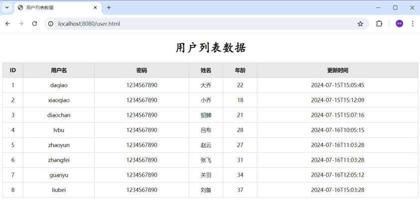

前面几篇都在拆零件：入门程序（[30 篇](/posts/编程学习/javaweb学习笔记/30-springboot快速入门/)）让 `/hello` 能回一句话，[32 篇](/posts/编程学习/javaweb学习笔记/32-http协议与请求数据格式/)认识了 HTTP 请求和响应的格式，[34](/posts/编程学习/javaweb学习笔记/34-http响应数据格式与状态码/)、[35 篇](/posts/编程学习/javaweb学习笔记/35-springboot设置响应数据/)学会了怎么设置响应数据。

PPT 第 43 页把第 4 章的四块内容又列了一遍（**SpringBoot Web入门 → HTTP协议 → SpringBoot Web案例 → 分层解耦**），前两块已经学完；这一篇进入第三块——第 44 页的章节标题"**SpringBootWeb案例 03**"。

这一篇开始做第 4 章的**贯通案例**：**用户列表渲染**（PPT 第 43-47 页）——一个真正的"前端页面 + 后端接口"的小闭环：浏览器打开一个页面，页面去调后端接口，后端把用户数据以 JSON 返回，页面把数据渲染成表格。

## 案例要做什么（PPT 第 45 页）

> **开发 web 程序，完成用户列表的渲染展示。**

接口约定得非常简单：

| 项 | 内容 |
| --- | --- |
| 请求地址 | `http://localhost:8080/list` |
| 请求方式 | GET（浏览器地址栏直接访问即可） |
| 响应数据 | 用户数组的 JSON，如 `[{"id":1,"username":"daqiao",...}]` |

做完的效果（PPT 第 45 页给的"最终目标"截图）：


*图：PPT 第 45 页——浏览器访问 `localhost:8080/user.html` 看到的用户列表，表格 6 列（ID、用户名、密码、姓名、年龄、更新时间）、8 行数据；这些行**没有一行是写死在页面里的**，全部来自后端 `/list` 接口返回的 JSON*

所以这个案例有两条线要接上：

```text
浏览器（user.html：Vue + axios）  ──请求 /list──▶  SpringBoot 后端（读 user.txt，转成 JSON 返回）
        ▲                                                          │
        └──────────────── 把 JSON 渲染成表格 ◀────────────────────┘
```

## 第 1 步：创建一个 SpringBoot 工程（PPT 第 45 页）

准备工作里写的第一条：

> **创建一个 SpringBoot 工程，并勾选 web 依赖、lombok。**

创建过程就是 [30 篇](/posts/编程学习/javaweb学习笔记/30-springboot快速入门/)里那套：Spring Initializr 填好坐标 → 勾 **Spring Web**（Web 开发）+ **Lombok**（省掉 getter/setter）→ 创建工程。

勾完之后 pom 里是这样的（课程代码 `springboot-web-demo`）：

```xml
<dependencies>
    <!-- web 起步依赖：内嵌 Tomcat + SpringMVC + JSON 转换都在里面 -->
    <dependency>
        <groupId>org.springframework.boot</groupId>
        <artifactId>spring-boot-starter-web</artifactId>
    </dependency>

    <!-- lombok：用注解生成 getter/setter/构造方法 -->
    <dependency>
        <groupId>org.projectlombok</groupId>
        <artifactId>lombok</artifactId>
        <optional>true</optional>
    </dependency>

    <dependency>
        <groupId>org.springframework.boot</groupId>
        <artifactId>spring-boot-starter-test</artifactId>
        <scope>test</scope>
    </dependency>

    <!-- 案例代码读文件用了 hutool 的 IoUtil，所以要补一个 hutool 依赖 -->
    <dependency>
        <groupId>cn.hutool</groupId>
        <artifactId>hutool-all</artifactId>
        <version>5.8.28</version>
    </dependency>
</dependencies>
```

> [!WARNING]
> PPT 第 45 页的准备工作只说了"勾 web 依赖、lombok"两样，但 PPT 第 47 页的代码里用了 **hutool 的 `IoUtil`**——所以 pom 里还得补上第三个依赖 `cn.hutool:hutool-all`（课程代码里是 **5.8.28**，最终代码工程里是 5.8.27，版本差别不大）。少了它，`IoUtil.readLines(...)` 这行直接编译不过。

## 第 2 步：把静态页面和 user.txt 放到位（PPT 第 45-46 页）

准备工作的第二条是"引入资料中准备好的用户数据文件（`user.txt`），及前端静态页面"。"放到位"是这一步的关键——两个文件去的地方**不一样**：

| 文件 | 放在哪 | 为什么 |
| --- | --- | --- |
| 前端静态页面 `user.html`、`js/axios.min.js`、`js/vue.esm-browser.js` | **`src/main/resources/static/`** | 这是给**浏览器**访问的静态资源，SpringBoot 默认把 `static` 目录映射到网站的根路径 |
| 用户数据 `user.txt` | **`src/main/resources/`**（根下） | 这是给**Java 代码**读的数据文件，走 classpath 读取，不是给浏览器直接下载的 |

PPT 第 46 页把第一件事讲得很直白：

> **静态资源文件存放位置：`resources/static`**

所以把页面放进去以后，浏览器直接输 `http://localhost:8080/user.html` 就能打开——PPT 第 45 页那张效果图的地址栏里就是它。

前端页面里跟后端打交道的部分只有一小段（`user.html` 的脚本区，Vue 3 + axios，写法就是 [22 篇](/posts/编程学习/javaweb学习笔记/22-实战-vueaxios员工列表/)里的那一套）：

```html
<div id="app">
    <h1>用户列表数据</h1>
    <table>
        <thead>
            <tr><th>ID</th><th>用户名</th><th>密码</th><th>姓名</th><th>年龄</th><th>更新时间</th></tr>
        </thead>
        <tbody>
            <!-- 一行数据对应数组里的一个用户对象 -->
            <tr v-for="user in userList">
                <td>{{user.id}}</td>
                <td>{{user.username}}</td>
                <td>{{user.password}}</td>
                <td>{{user.name}}</td>
                <td>{{user.age}}</td>
                <td>{{user.updateTime}}</td>
            </tr>
        </tbody>
    </table>
</div>

<script src="js/axios.min.js"></script>
<script type="module">
    import { createApp } from './js/vue.esm-browser.js'
    createApp({
        data() {
            return { userList: [] }        // 先给空数组，等接口数据回来再填
        },
        methods: {
            async search() {
                const result = await axios.get('/list');   // 请求地址就写 /list（同源，不用写全）
                this.userList = result.data;               // 接口返回的直接就是数组（没有 {code,msg,data} 那层）
            }
        },
        mounted() {
            this.search();                                  // 页面加载完自动查一次
        }
    }).mount('#app')
</script>
```

`user.txt` 的内容是 8 行逗号分隔的用户数据（课程资料里给的原始数据）：

```text
1,daqiao,1234567890,大乔,22,2024-07-15 15:05:45
2,xiaoqiao,1234567890,小乔,18,2024-07-15 15:12:09
3,diaochan,1234567890,貂蝉,21,2024-07-15 15:07:16
4,lvbu,1234567890,吕布,28,2024-07-16 10:05:15
5,zhaoyun,1234567890,赵云,27,2024-07-16 11:03:28
6,zhangfei,1234567890,张飞,31,2024-07-16 11:03:28
7,guanyu,1234567890,关羽,34,2024-07-16 12:05:12
8,liubei,1234567890,刘备,37,2024-07-16 15:03:28
```

每一行的 6 段（逗号切开）刚好对应实体类的 6 个属性：

| 段 | 内容示例 | 对应属性 | 类型 |
| --- | --- | --- | --- |
| 1 | `1` | `id` | `Integer`（要 `Integer.parseInt`） |
| 2 | `daqiao` | `username` | `String` |
| 3 | `1234567890` | `password` | `String` |
| 4 | `大乔` | `name` | `String` |
| 5 | `22` | `age` | `Integer`（要 `Integer.parseInt`） |
| 6 | `2024-07-15 15:05:45` | `updateTime` | `LocalDateTime`（要格式化解析） |

## 第 3 步：定义实体类（PPT 第 45 页）

准备工作的第三条："**定义一个实体类，用来封装用户信息**"。实体类就是"一行数据长什么样"的 Java 版本，放在 `pojo` 包里：

```java
package com.itheima.pojo;

import lombok.AllArgsConstructor;
import lombok.Data;
import lombok.NoArgsConstructor;
import java.time.LocalDateTime;

/**
 * 用户信息
 */
@Data                 // getter / setter / toString / equals / hashCode
@NoArgsConstructor    // 无参构造方法
@AllArgsConstructor   // 全参构造方法（下面 new User(...) 就是在用这个）
public class User {

    private Integer id;
    private String username;
    private String password;
    private String name;
    private Integer age;
    private LocalDateTime updateTime;   // 时间用 LocalDateTime，不是 String

}
```

> [!TIP]
> 属性名要和 JSON 里的字段名对得上：接口返回的 JSON 是 `{"id":1,"username":"daqiao",...}`，这里的属性名就是 `id`、`username`——SpringBoot 把对象转 JSON 时**直接拿属性名当字段名**，所以前端 `{{user.updateTime}}` 才能取到值。

## 第 4 步：开发服务端程序（PPT 第 47 页）

准备工作的第四条："**开发服务端程序，接收请求，读取文本数据并响应**"。这就是全篇的核心：一个方法把 `user.txt` 里的一行行文本变成 `List<User>` 并返回。

PPT 第 47 页的代码（课程代码里叫 `UserController`）：

```java
@RestController   // 标识当前类是一个请求处理类
public class UserController {

    @RequestMapping("/list")
    public List<User> list() throws Exception {
        // 1. 加载并读取文件
        InputStream in = this.getClass().getClassLoader().getResourceAsStream("user.txt");
        ArrayList<String> lines = IoUtil.readLines(in, StandardCharsets.UTF_8, new ArrayList<>());

        // 2. 解析数据，封装成对象 --> 集合
        List<User> userList = lines.stream().map(line -> {
            String[] parts = line.split(",");
            Integer id = Integer.parseInt(parts[0]);
            String username = parts[1];
            String password = parts[2];
            String name = parts[3];
            Integer age = Integer.parseInt(parts[4]);
            LocalDateTime updateTime = LocalDateTime.parse(parts[5],
                    DateTimeFormatter.ofPattern("yyyy-MM-dd HH:mm:ss"));
            return new User(id, username, password, name, age, updateTime);
        }).collect(Collectors.toList());

        // 3. 响应数据
        return userList;
    }
}
```

### 为什么从 classpath 读文件

```java
InputStream in = this.getClass().getClassLoader().getResourceAsStream("user.txt");
```

- `getClassLoader()` 拿到的是**类加载器**，`getResourceAsStream("user.txt")` 的意思是"**从 classpath 的根开始找 user.txt**"。项目编译后 `src/main/resources` 下的文件会被原样复制到 classpath 根下，所以文件名直接写 `user.txt`（**不带** `resources/` 前缀）；
- 为什么不用 `new FileInputStream("user.txt")`：那是按"当前工作目录"找文件的相对路径，在 IDEA 里跑也许能撞上，一旦打包成 jar 跑就必然找不到。**资源文件一律走 classpath**——课程代码的 import 区里还留着一个没用上的 `java.io.FileInputStream`（早期写法的残留），实际用的是 `getResourceAsStream`。

### 读文件：hutool 的 `IoUtil.readLines`

```java
ArrayList<String> lines = IoUtil.readLines(in, StandardCharsets.UTF_8, new ArrayList<>());
```

一句顶掉"BufferedReader 循环读 + 手动存 List"的一堆代码：把流里的内容**按行**读出来，装进最后一个参数给的集合里（这里顺手给个 `new ArrayList<>()`）。`StandardCharsets.UTF_8` 指定编码——`user.txt` 里有中文（大乔、吕布…），编码不对会变乱码。

### 解析封装：一行文本 → 一个 User 对象

三件事连在一起做：

```text
lines（8 行文本）
   │  lines.stream()          —— 把 List<String> 变成一条"流水线"
   │  .map(line -> { ... })    —— 每个元素（一行文本）加工成一个 User 对象
   │  .collect(Collectors.toList())  —— 加工结果收集回 List<User>
   ▼
List<User>（8 个 User 对象）→ return 出去 → 自动转成 JSON
```

`map` 里面的每一句都在解决"文本 → 属性"的类型转换：

| 代码 | 干什么 |
| --- | --- |
| `line.split(",")` | 按逗号把一行切成 6 段，`parts[0]` 就是第一段 |
| `Integer.parseInt(parts[0])` | 字符串 `"1"` → 数字 `1`（id、age 要这个） |
| `parts[1]`、`parts[2]`、`parts[3]` | 本来就是字符串，直接给（username、password、name） |
| `LocalDateTime.parse(parts[5], DateTimeFormatter.ofPattern("yyyy-MM-dd HH:mm:ss"))` | 把 `"2024-07-15 15:05:45"` 按这个格式解析成时间对象 |
| `new User(id, username, password, name, age, updateTime)` | 调 Lombok 生成的**全参构造方法**，组装成一个 User |

> [!WARNING]
> PPT 第 47 页这页代码有个**笔误**：它写的是 `LocalDateTime uTime = LocalDateTime.parse(parts[5], ...)`，可下一行 `return new User(id, username, password, name, age, updateTime)` 用的却是 `updateTime`——变量名前后不一致（少了 `t` 和多写了 `update`）。**以课程代码为准**，变量名统一叫 `updateTime`（和实体类属性同名）就对了。

> [!NOTE]
> `List<User> userList = lines.stream()...         .collect(Collectors.toList());`（PPT 里的写法）和课程最终代码里的 `... .toList()` 是**等价**的两种收尾方式：`Collectors.toList()` 收出来的是可变的 `ArrayList`，Java 16 之后的 `Stream.toList()` 收出来的是**不可变**的 List。这个案例只是读完返回，不改集合内容，所以两种写法都对。

### `@RestController` 和 `@ResponseBody`（PPT 第 46 页）

PPT 第 46 页专门把这点单拎出来讲：

> **`@ResponseBody` 注解的作用：将 controller 方法的返回值直接写入 HTTP 响应体；如果是对象或集合，会先转为 json，再响应。**
>
> **`@RestController = @Controller + @ResponseBody`**

三个注解各管什么：

| 注解 | 作用 |
| --- | --- |
| `@RestController` | 标识当前类是一个**请求处理类**，并且类里所有方法的返回值都直接写进响应体（= `@Controller` + `@ResponseBody`） |
| `@Controller` | 只标识"这是一个请求处理类"，**返回值默认被当成"视图名"**去解析，由模板引擎渲染出页面 |
| `@ResponseBody` | 把方法返回值**直接写进响应体**；返回值是对象/集合时，先转成 JSON |

这两者的区别有实测对照（本机在入门工程里另加了两个方法分别试的，下面就是跑出来的结果）：

> [!TIP]
> 本机实测（Spring Boot 3.2.8 / Tomcat 10.1.26）
>
> ```java
> // 实验一：只用 @Controller，方法返回字符串 "abc"
> @Controller
> public class DemoController {
>     @RequestMapping("/demo")
>     public String demo() { return "abc"; }
> }
> // 实验二：@Controller + @ResponseBody，返回同一个字符串
> ```
>
> | 实验 | 请求 | 结果 |
> | --- | --- | --- |
> | 实验一（`@Controller`） | `curl -si http://localhost:8080/demo` | **404**——返回值 `"abc"` 被当成**视图名**去找页面了；工程里没有模板引擎、也没有叫 abc 的页面，自然找不到 |
> | 实验二（`@Controller` + `@ResponseBody`） | 同上 | **正常返回字符串**（和 `@RestController` 的效果完全一样） |
>
> 结论就是 PPT 第 46 页那句话：**`@RestController = @Controller + @ResponseBody`**；本案例的接口要"返回数据"不要"返回页面"，所以类上用 `@RestController`。

## 实测：这个接口到底回了什么（本机真机）

工程跑起来以后，用 `curl` 直接看 `/list` 的响应头和响应体：

> [!TIP]
> 本机实测（Spring Boot 3.2.8 / 内嵌 Tomcat / JDK 17）
>
> ```text
> $ curl -si "http://localhost:8080/list" | head -4
> HTTP/1.1 200
> Content-Type: application/json
> Transfer-Encoding: chunked
>
> $ curl -s "http://localhost:8080/list"
> [{"id":201,"username":"daqiao","password":"1234567890","name":"大乔","age":22,"updateTime":"2024-07-15T15:05:45"}, ...]
> ```
>
> 静态资源也顺手验了一个：
>
> ```text
> $ curl -s -o /dev/null -w "%{http_code} %{content_type}" http://localhost:8080/user.html
> 200 text/html
> ```
>
> 两个要点：
> 1. **`Content-Type: application/json`**：不是我们写的——方法返回 `List<User>`，SpringBoot 发现响应体是对象/集合，用内置的 Jackson 把它转成 JSON，顺带把类型设成了 `application/json`（[34 篇](/posts/编程学习/javaweb学习笔记/34-http响应数据格式与状态码/)里说的"响应头通常不用手动设置"，这里就是活例子；[35 篇](/posts/编程学习/javaweb学习笔记/35-springboot设置响应数据/)实测里"返回字符串时是 `text/plain`"也和它对得上）；
> 2. **时间是 ISO 格式**：`"updateTime":"2024-07-15T15:05:45"`——中间的**空格变成了 `T`**，这是 Jackson 对 `LocalDateTime` 的默认序列化格式。前端把这串字符串原样显示，所以效果图上看到的就是 `2024-07-15T15:05:45` 这个样子。

> [!TIP]
> 上面这段实测响应里的 id 是 **201** 开头，而 PPT 效果图（以及你跟着课程敲的这一版）应该是 1-8——因为本机的实验工程用的是**最终代码**，它的业务实现类被换成了 2 号（`UserServiceImpl2`，把 id 都加了 200），那是 [39 篇](/posts/编程学习/javaweb学习笔记/39-ioc与di详解/)里"同类型多个 bean 怎么办"的实验对象。**本篇这一版代码里没有这个 200**，返回的 id 就是 `user.txt` 里的 1-8。

## 案例跑通了，但代码有问题（PPT 第 47 页）

PPT 第 47 页在代码右边留了两个红字评价：

> **复用性差、难以维护**

对着代码数一数，这一个方法其实干了**三件事**：

```text
@RequestMapping("/list")
public List<User> list() {
    // ① 数据访问：读 user.txt 文件
    InputStream in = this.getClass().getClassLoader().getResourceAsStream("user.txt");
    ArrayList<String> lines = IoUtil.readLines(in, StandardCharsets.UTF_8, new ArrayList<>());

    // ② 业务处理：把文本解析封装成对象
    List<User> userList = lines.stream().map(line -> { ... }).collect(Collectors.toList());

    // ③ 接收请求 / 响应数据
    return userList;
}
```

具体会疼在哪：

- **复用性差**：如果"品牌管理"里也要一份用户数据，只能把这段代码**复制粘贴**一份，改一处漏一处；
- **难以维护**：数据来源迟早要换（这个案例后面就会换成数据库），换了之后要动的却是**Controller**——一个"负责接收请求"的类，被迫去关心"文件怎么读、时间怎么格式化"；
- 一句话：**一个类养了太多职责**。下一篇（[三层架构](/posts/编程学习/javaweb学习笔记/37-三层架构/)）就按 **单一职责原则** 把它拆开。

## 小结

| 问题 | 答案 |
| --- | --- |
| 案例要做什么？ | 开发 web 程序，**完成用户列表的渲染展示**：`GET /list` 返回用户 JSON 数组，`user.html` 取回来渲染成表格 |
| 准备工作四步？ | ① 创建 SpringBoot 工程勾 **web 依赖 + lombok**；② 引入资料里的 **user.txt 与前端静态页面**；③ 定义**实体类**封装用户信息；④ 开发服务端程序（接收请求、读取文本数据并响应） |
| 静态页面放哪？ | **`src/main/resources/static/`**（PPT 第 46 页：静态资源文件存放位置 `resources/static`）；放进去后浏览器可直接访问 `http://localhost:8080/user.html` |
| `user.txt` 放哪、怎么读？ | 放 **`src/main/resources/`** 根下；代码里用 `getClass().getClassLoader().getResourceAsStream("user.txt")` 从 **classpath** 读（不是 `new FileInputStream`） |
| 怎么把文本变成对象？ | hutool 的 `IoUtil.readLines(in, StandardCharsets.UTF_8, new ArrayList<>())` 按行读；再 `lines.stream().map(line -> {...}).collect(Collectors.toList())` 逐行 `split(",")` + 类型转换 + `new User(...)` |
| `@ResponseBody` 干什么？ | 把 controller 方法的**返回值直接写入 HTTP 响应体**；返回值是对象或集合时**先转 JSON** 再响应 |
| `@RestController` 是什么？ | **`@Controller + @ResponseBody`**；实测 `@Controller` + 返回字符串会 **404**（被当视图名），加上 `@ResponseBody` 就正常返回字符串 |
| 实测 `/list` 的响应头？ | `HTTP/1.1 200` + **`Content-Type: application/json`** + `Transfer-Encoding: chunked`——状态码和响应头都是服务器自动设置的 |
| 这段代码的问题是什么？ | Controller 一个方法里同时做了"接收请求/响应数据""读文件""解析封装"三件事——**复用性差、难以维护** |

## 相关

- [上一篇：SpringBoot设置响应数据](/posts/编程学习/javaweb学习笔记/35-springboot设置响应数据/)
- [下一篇：三层架构](/posts/编程学习/javaweb学习笔记/37-三层架构/)

## 练习题

### 一、知识回顾（读完直接做下面的实践题）

1. **案例需求**：开发 web 程序，完成**用户列表的渲染展示**——浏览器访问 `http://localhost:8080/list` 拿到用户 JSON 数组（`[{"id":1,"username":"daqiao",...}]`），`user.html` 再用 axios 取回来渲染成表格
2. **准备工作四步**：① 创建 SpringBoot 工程，勾选 **web 依赖、lombok**；② 引入资料里的 **user.txt** 和**前端静态页面**；③ 定义一个**实体类**封装用户信息；④ 开发**服务端程序**（接收请求、读取文本数据并响应）
3. **静态资源放哪**：`resources/static`（完整路径 `src/main/resources/static/`）——`user.html`、`js/axios.min.js`、`js/vue.esm-browser.js` 都放这里，浏览器直接 `http://localhost:8080/user.html` 就能访问（实测返回 `200 text/html`）；**user.txt 不放这里**，它放 `src/main/resources/` 根下，是给 Java 代码读的
4. **实体类与字段对应**：`User` 六个属性 `id`、`username`、`password`、`name`、`age`、`updateTime`，用 Lombok 的 `@Data` + `@NoArgsConstructor` + `@AllArgsConstructor` 生成 getter/setter 与两个构造方法（`new User(...)` 用的就是全参构造）；`user.txt` **每行 6 段**，按逗号切开后依次对应这六个属性（id、age 要 `Integer.parseInt`，最后一段用 `LocalDateTime.parse(...)` 配 `DateTimeFormatter.ofPattern("yyyy-MM-dd HH:mm:ss")`）
5. **读文件的方式**：`this.getClass().getClassLoader().getResourceAsStream("user.txt")`——从 **classpath** 读（`src/main/resources` 下的文件编译后就在 classpath 根），所以文件名**不带** `resources/` 前缀；用 `new FileInputStream("user.txt")` 这种相对路径打包成 jar 后会找不到
6. **按行读 + 解析封装**：`IoUtil.readLines(in, StandardCharsets.UTF_8, new ArrayList<>())` 一次读出所有行；再 `lines.stream().map(line -> {...}).collect(Collectors.toList())` 把每行加工成 `User` 对象、收集成 `List<User>`（`.toList()` 是等价的新写法）
7. **`@ResponseBody` 的作用**：将 controller 方法的**返回值直接写入 HTTP 响应体**；**如果是对象或集合，会先转为 json 再响应**
8. **`@RestController = @Controller + @ResponseBody`**；实测对照：只用 `@Controller` 且方法返回 `"abc"` 时访问 **404**（返回值被当作**视图名**去解析），加上 `@ResponseBody`（或直接用 `@RestController`）就正常返回字符串
9. **实测 `/list`**：响应头是 `HTTP/1.1 200`、`Content-Type: application/json`、`Transfer-Encoding: chunked`，响应体是 JSON 数组；其中 `Content-Type` 是 SpringBoot 自动设置的，时间字段默认序列化成 `2024-07-15T15:05:45`（空格变 `T`）
10. **这段代码的问题**：Controller 里一个方法同时承担了"接收请求/响应数据""读文件""解析封装"三件事 → **复用性差、难以维护**，解决方向是下一篇的**三层架构**（单一职责原则）

### 二、裸写题

- [ ] **2-1 写一个返回用户列表的接口**
  工程里有 `src/main/resources/user.txt`（8 行，逗号分隔，6 段），还有一个实体类 `com.itheima.pojo.User`（六个属性 `id/username/password/name/age/updateTime`）。请写一个**请求处理类**，让浏览器访问 `http://localhost:8080/list` 时：
  1. 从工程里读到这个文件（不许写死 `D:\...` 这种绝对路径）；
  2. 每行解析成一个 `User` 对象，最后返回这 8 个对象的集合；
  3. 返回值到浏览器上要**是 JSON 数组**，而不是一个页面名字。
  （练习文件 `test_36_用户列表接口.java` 里已经给了包名、实体类路径和写作区。）

  > [!TIP]- 提示（先自己想，实在想不出再点开）
  > **一级 · 思路**：四件事——类上标明"这是个处理请求的类"、"访问哪个地址进这个方法"、方法体里读文件+解析、返回集合。返回集合还要保证"不被当成页面名"
  > **二级 · 方法**：类上用 `@RestController`（它自带 `@ResponseBody`），方法上用 `@RequestMapping("/list")`；读文件用 `this.getClass().getClassLoader().getResourceAsStream("user.txt")`；按行读用 hutool 的 `IoUtil.readLines(in, StandardCharsets.UTF_8, new ArrayList<>())`；解析用 `lines.stream().map(...).collect(Collectors.toList())`，每行 `split(",")` 后 `Integer.parseInt`、`LocalDateTime.parse(..., DateTimeFormatter.ofPattern("yyyy-MM-dd HH:mm:ss"))`；最后 `return userList;`
  > **三级 · 骨架**：`@____ public class UserController { @____("/list") public List<User> list(){ InputStream in = this.getClass().getClassLoader().getResourceAsStream("____"); ArrayList<String> lines = IoUtil.____(in, StandardCharsets.UTF_8, new ArrayList<>()); List<User> userList = lines.____().map(line -> { String[] parts = line.split("____"); return new User(Integer.parseInt(parts[0]), parts[1], parts[2], parts[3], Integer.parseInt(parts[4]), LocalDateTime.____(parts[5], DateTimeFormatter.ofPattern("____"))); }).collect(Collectors.toList()); return ____; } }`

  > [!TIP]- 参考答案（做完再点开）
  > ```java
  > package com.itheima.controller;
  >
  > import cn.hutool.core.io.IoUtil;
  > import com.itheima.pojo.User;
  > import org.springframework.web.bind.annotation.RequestMapping;
  > import org.springframework.web.bind.annotation.RestController;
  >
  > import java.io.InputStream;
  > import java.nio.charset.StandardCharsets;
  > import java.time.LocalDateTime;
  > import java.time.format.DateTimeFormatter;
  > import java.util.ArrayList;
  > import java.util.List;
  > import java.util.stream.Collectors;
  >
  > @RestController   // = @Controller + @ResponseBody：返回值直接写进响应体，集合会先转 JSON
  > public class UserController {
  >
  >     @RequestMapping("/list")
  >     public List<User> list() throws Exception {
  >         // 1. 从 classpath 读取 user.txt（编译后 resources 下的文件就在 classpath 根）
  >         InputStream in = this.getClass().getClassLoader().getResourceAsStream("user.txt");
  >         ArrayList<String> lines = IoUtil.readLines(in, StandardCharsets.UTF_8, new ArrayList<>());
  >
  >         // 2. 一行文本 -> 一个 User 对象
  >         List<User> userList = lines.stream().map(line -> {
  >             String[] parts = line.split(",");
  >             Integer id = Integer.parseInt(parts[0]);
  >             String username = parts[1];
  >             String password = parts[2];
  >             String name = parts[3];
  >             Integer age = Integer.parseInt(parts[4]);
  >             LocalDateTime updateTime = LocalDateTime.parse(parts[5],
  >                     DateTimeFormatter.ofPattern("yyyy-MM-dd HH:mm:ss"));
  >             return new User(id, username, password, name, age, updateTime);
  >         }).collect(Collectors.toList());
  >
  >         // 3. 响应数据
  >         return userList;
  >     }
  > }
  > ```
  > 三点检查：① 访问 `http://localhost:8080/list` 得到 JSON 数组（实测响应头是 `HTTP/1.1 200` + `Content-Type: application/json`）；② 把类上的注解换成 `@Controller` 再访问会变成 **404**——返回值被当成视图名了，这就是"第 3 个要求"的由来；③ 把 `getResourceAsStream("user.txt")` 改成 `new FileInputStream("user.txt")`，IDEA 里可能还能跑，打包成 jar 后就找不到了。

- [ ] **2-2 把 user.txt 的一行解析成对象**
  给定 `user.txt` 的第一行文本：

  ```text
  1,daqiao,1234567890,大乔,22,2024-07-15 15:05:45
  ```

  请写代码把它变成 `com.itheima.pojo.User` 对象（六个属性依次填进去）：数字段要变成数字、时间字符串要变成时间对象、剩下的原样是字符串。写完打印这个对象看一眼。
  （练习文件 `test_36_解析一行用户数据.java` 里给了写作区。）

  > [!TIP]- 提示（先自己想，实在想不出再点开）
  > **一级 · 思路**：先把一行"切开"成 6 段，再按实体类每个属性的类型逐个转换，最后交给全参构造方法组装
  > **二级 · 方法**：`split(",")` 得到 `String[]`；`Integer.parseInt(...)` 转数字；`LocalDateTime.parse(字符串, DateTimeFormatter.ofPattern("yyyy-MM-dd HH:mm:ss"))` 转时间；`new User(...)` 组装
  > **三级 · 骨架**：`String[] parts = line.split("____"); User user = new User(Integer.____(parts[0]), parts[1], parts[2], parts[3], Integer.parseInt(parts[____]), LocalDateTime.____(parts[5], DateTimeFormatter.ofPattern("____")));`

  > [!TIP]- 参考答案（做完再点开）
  > ```java
  > package com.itheima;
  >
  > import com.itheima.pojo.User;
  >
  > import java.time.LocalDateTime;
  > import java.time.format.DateTimeFormatter;
  >
  > public class ParseLineTest {
  >     public static void main(String[] args) {
  >         String line = "1,daqiao,1234567890,大乔,22,2024-07-15 15:05:45";
  >
  >         // 1. 按逗号切成 6 段
  >         String[] parts = line.split(",");
  >
  >         // 2. 按类型转换：数字段 parseInt，时间段 parse（格式要和文本一模一样）
  >         Integer id = Integer.parseInt(parts[0]);            // "1" -> 1
  >         String username = parts[1];                          // daqiao
  >         String password = parts[2];                          // 1234567890
  >         String name = parts[3];                              // 大乔
  >         Integer age = Integer.parseInt(parts[4]);            // "22" -> 22
  >         LocalDateTime updateTime = LocalDateTime.parse(parts[5],
  >                 DateTimeFormatter.ofPattern("yyyy-MM-dd HH:mm:ss"));
  >
  >         // 3. 组装（Lombok 的 @AllArgsConstructor 生成的构造方法）
  >         User user = new User(id, username, password, name, age, updateTime);
  >         System.out.println(user);
  >         // 输出：User(id=1, username=daqiao, password=1234567890, name=大乔, age=22, updateTime=2024-07-15T15:05)
  >     }
  > }
  > ```
  > 检查点：① `split` 的参数就是**分隔符**（`","`），不是正则里的 `".",`；② `LocalDateTime.parse` 的格式串必须和文本一致（`yyyy-MM-dd HH:mm:ss`，中间那个空格也是格式的一部分），差一个字符就抛 `DateTimeParseException`；③ 如果打印出来中文是乱码，是编码没指定对——读文件时要给 `StandardCharsets.UTF_8`。

- [ ] **2-3 接口为什么返回了 404**
  小王写完接口，类上用的是 `@Controller`，方法返回字符串 `"abc"`。启动工程后浏览器访问 `/demo`，得到 **404**。请回答：
  1. 为什么会 404？（说清楚返回值被当成了什么）
  2. 给出**两种**改法，让这个接口能正常返回字符串 `"abc"`；
  3. 本案例的 `/list` 接口要返回 JSON 数组，两种改法里哪一种更省事？
  （练习文件 `test_36_接口为什么返回404.java` 里给了写作区。）

  > [!TIP]- 提示（先自己想，实在想不出再点开）
  > **一级 · 思路**：先想"`@Controller` 默认拿返回值去干什么"，再想"有没有一个注解能改成'把返回值写进响应体'"，最后想"有没有一个注解把这两件事合起来"
  > **二级 · 方法**：类上换 `@RestController`，或者保留 `@Controller`、在方法（或类）上加 `@ResponseBody`
  > **三级 · 骨架**：改法一 `@____RestMethod` → 换成 `@____Controller`；改法二 在方法上加 `@____Body`

  > [!TIP]- 参考答案（做完再点开）
  > 1. **因为 `@Controller` 默认把方法返回值当成"视图名"**：SpringMVC 拿 `"abc"` 去找叫 abc 的页面（视图），工程里既没有模板引擎也没有这个页面，所以 404。实测（Spring Boot 3.2.8）就是这个结果。
  > 2. 两种改法：
  >    ```java
  >    // 改法一：类上的 @Controller 换成 @RestController（= @Controller + @ResponseBody）
  >    @RestController
  >    public class DemoController {
  >        @RequestMapping("/demo")
  >        public String demo() { return "abc"; }
  >    }
  >    ```
  >    ```java
  >    // 改法二：保留 @Controller，给方法（或类）加上 @ResponseBody
  >    @Controller
  >    public class DemoController {
  >        @RequestMapping("/demo")
  >        @ResponseBody
  >        public String demo() { return "abc"; }
  >    }
  >    ```
  > 3. 本案例返回的是 `List<User>`，**用 `@RestController` 更省事**——一次注解管住整个类的所有方法（本机实测：`@Controller` + `@ResponseBody` 返回字符串的效果和 `@RestController` 完全一样，但每个方法都得记得加 `@ResponseBody`）。

### 三、综合题

- [ ] **3-1 照课程做一遍"用户列表渲染"案例**
  从空工程开始，把这个案例完整做一遍，每一步都跑一遍再进下一步：
  1. 创建 SpringBoot 工程，勾 **Spring Web + Lombok**，pom 里补上 **hutool** 依赖（代码里 `IoUtil` 要用）；
  2. 把 `user.txt` 放进 `src/main/resources/` 根下，把 `user.html` + `js/` 两个库文件放进 `src/main/resources/static/`；**先用浏览器把 `http://localhost:8080/user.html` 打开**，确认页面能显示（这时表格是空的，因为接口还没有）；
  3. 写实体类 `com.itheima.pojo.User`（6 个属性 + 3 个 Lombok 注解）；
  4. 写请求处理类 `com.itheima.controller.UserController`：读文件 → 按行解析成 `List<User>` → 返回；
  5. 启动工程，用两种方式验证接口：浏览器/curl 直接访问 `http://localhost:8080/list`（应看到 JSON 数组），再看响应头里的 `Content-Type`；
  6. 回到 `user.html` 刷新页面，表格应该出现 8 行数据；顺手做一次"故障演练"：把 `@RestController` 换成 `@Controller` 再访问 `/list`，把看到的状态码记在练习文件末尾。
  （练习文件 `test_36_综合_用户列表案例.java` 里按这 6 步给了写作区。）

  **涉及知识点**

  | 知识点 | 在这里的应用 |
  | --- | --- |
  | 起步依赖 | `spring-boot-starter-web`（内嵌 Tomcat + SpringMVC + Jackson）、`lombok`、`hutool-all` |
  | 静态资源位置 | `resources/static` 放页面（`/user.html` 能直接访问），`resources` 根放数据文件（classpath 读） |
  | 实体类 | `User` + `@Data/@NoArgsConstructor/@AllArgsConstructor`，属性名 = JSON 字段名 |
  | 读文件 | `getClassLoader().getResourceAsStream("user.txt")` + `IoUtil.readLines(..., UTF_8, ...)` |
  | 解析封装 | `stream().map()` + `split(",")` + `Integer.parseInt` + `LocalDateTime.parse` |
  | 响应数据 | `@RestController` = `@Controller` + `@ResponseBody`；集合自动转 JSON，`Content-Type: application/json` |
  | 遗留问题 | 一个方法三件事 → 复用性差、难以维护（下一篇拆三层） |

  > [!TIP]- 提示（先自己想，实在想不出再点开）
  > **一级 · 思路**：整个案例就是"**文件 → 对象集合 → JSON**"这一条链，外加"页面从哪来"（静态资源）和"返回值怎么变成 JSON"（`@RestController`）两个配角
  > **二级 · 方法**：建工程勾 web+lombok、pom 补 hutool；页面进 `resources/static`、数据文件进 `resources` 根；实体类用 Lombok 三件套；接口用 `@RestController` + `@RequestMapping("/list")`；读文件 `getResourceAsStream`、按行读 `IoUtil.readLines`、解析 `stream().map(...)`；验证用 curl 看状态码和 `Content-Type`
  > **三级 · 骨架**：`@____ public class UserController { @____("/list") public List<User> list(){ ... } }`；验证三连 = `curl -si http://localhost:8080/list`（看头）、`curl -s http://localhost:8080/list`（看体）、浏览器打开 `http://localhost:8080/user.html`（看效果）

  > [!TIP]- 参考答案（做完再点开）
  > **3-1** 六步的落地写法：
  > 1. 工程与依赖：坐标随意（课程是 `com.itheima:springboot-web-demo`），pom 关键三行：
  >    ```xml
  >    <dependency>
  >        <groupId>org.springframework.boot</groupId>
  >        <artifactId>spring-boot-starter-web</artifactId>
  >    </dependency>
  >    <dependency>
  >        <groupId>org.projectlombok</groupId>
  >        <artifactId>lombok</artifactId>
  >        <optional>true</optional>
  >    </dependency>
  >    <dependency>
  >        <groupId>cn.hutool</groupId>
  >        <artifactId>hutool-all</artifactId>
  >        <version>5.8.28</version>
  >    </dependency>
  >    ```
  > 2. 文件位置：
  >    ```text
  >    src/main/resources/
  >    ├── user.txt              ← 给 Java 代码读（classpath 根，文件名就是 user.txt）
  >    ├── application.properties
  >    └── static/               ← 给浏览器访问（映射到网站根路径）
  >        ├── user.html
  >        └── js/
  >            ├── axios.min.js
  >            └── vue.esm-browser.js
  >    ```
  >    此时浏览器访问 `http://localhost:8080/user.html` 应能看到标题和表头（本机实测静态资源返回 `200 text/html`），表格里没有数据行。
  > 3. 实体类：
  >    ```java
  >    package com.itheima.pojo;
  >
  >    import lombok.AllArgsConstructor;
  >    import lombok.Data;
  >    import lombok.NoArgsConstructor;
  >    import java.time.LocalDateTime;
  >
  >    @Data
  >    @NoArgsConstructor
  >    @AllArgsConstructor
  >    public class User {
  >        private Integer id;
  >        private String username;
  >        private String password;
  >        private String name;
  >        private Integer age;
  >        private LocalDateTime updateTime;
  >    }
  >    ```
  > 4. 请求处理类：就是本篇"第 4 步"那段完整代码（`@RestController` + `@RequestMapping("/list")` + 读文件 + `stream().map(...)` + `return userList;`）。
  > 5. 验证：
  >    ```text
  >    $ curl -si "http://localhost:8080/list" | head -4
  >    HTTP/1.1 200
  >    Content-Type: application/json
  >    Transfer-Encoding: chunked
  >    ```
  >    能拿到这个头，说明"返回值 → JSON → 响应体"这条链全通了；响应头里的 `Content-Type` 是 SpringBoot 自动加的。
  > 6. 页面效果与故障演练：
  >    - 刷新 `user.html`，8 行数据出现（对课程资料里的 8 个用户：大乔、小乔、貂蝉、吕布、赵云、张飞、关羽、刘备）；
  >    - 把 `@RestController` 换成 `@Controller` 后重启，`curl -s -o /dev/null -w "%{http_code}" http://localhost:8080/list` 得到 **404**——返回值 `List<User>` 被当成视图名了（本机实测结论），这就反向印证了"`@RestController = @Controller + @ResponseBody`"。
