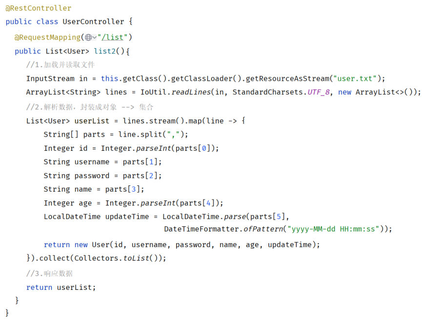
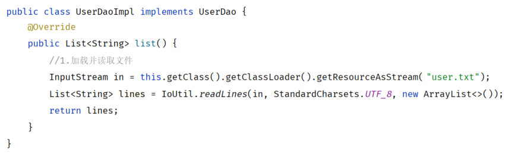
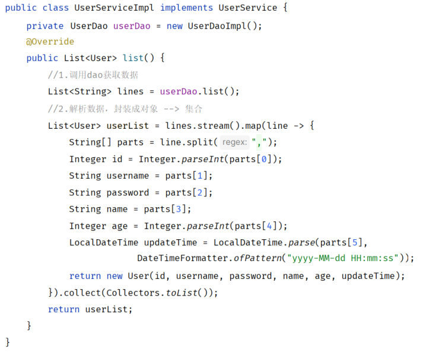
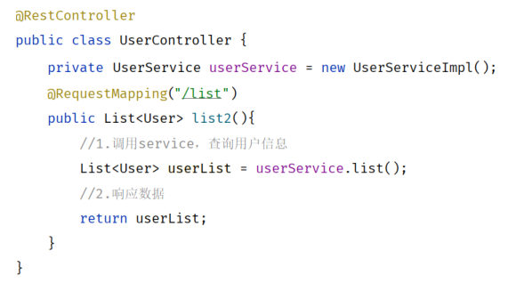

上一篇（[SpringBoot Web案例-用户列表渲染](/posts/编程学习/javaweb学习笔记/36-springboot-web案例-用户列表渲染/)）把用户列表接口做出来了：访问 `/list` 能拿到用户 JSON，页面也能渲染成表格。但 PPT 第 47 页在那段代码旁边留了两个词——**复用性差、难以维护**。

这一篇就动手解决它：把代码拆成 **三层架构**（PPT 第 48-54 页）。第 48 页是这一节的开场导航（还是那四块内容），第 49 页则把"分层解耦"这一节的五个话题列全了（**三层架构 → 分层解耦 → IOC & DI 入门 → IOC 详解 → DI 详解**）——本篇讲第一个，也是后面三篇的地基。

## 先看清楚问题在哪（PPT 第 50 页）

PPT 第 50 页把上一篇的 `UserController` 原样放出来，然后在方法体里标出**三种颜色的职责**：

| 方法里的一段 | 它实际在干的事 | PPT 的标注 |
| --- | --- | --- |
| `getResourceAsStream("user.txt")` + `IoUtil.readLines(...)` | 把文件读进来 | **数据访问** |
| `lines.stream().map(line -> {...})` | 把文本解析成对象、组装成集合 | **逻辑处理** |
| `@RequestMapping("/list")` + `return userList;` | 接收请求、响应数据 | **接收请求、响应数据** |


*图：PPT 第 53 页左边那半张"拆分前"的代码——`@RestController` 的 `UserController` 里，读文件、解析封装、返回数据全挤在一个 `list2()` 方法里；右边配的评语是"复用性差、难以维护"，正是这段代码要被拆掉的原因*

PPT 第 50 页把这种做法判为违反 **单一职责原则**：

> **单一职责原则**——一个类（一个方法）只负责一件事。

一个"负责接收请求"的类，却知道"文件在哪、编码是 UTF-8、时间格式是 `yyyy-MM-dd HH:mm:ss`"，这就是职责串味了。后果上一篇算过账：

- **复用性差**：别的接口也想要用户数据时，只能复制粘贴这段代码；
- **难以维护**：数据来源要从文件换成数据库时，改动落在 **Controller** 里——改了一个不该它管的地方；时间格式要调一下，也得翻 Controller。

## 三层架构：三个层各管什么（PPT 第 51 页）

PPT 第 51 页给了三层架构的标准定义，一句话一层：

| 层 | 名字 | 职责（PPT 原文） |
| --- | --- | --- |
| **controller** | 控制层 | **接收前端发送的请求，对请求进行处理，并响应数据** |
| **service** | 业务逻辑层 | **处理具体的业务逻辑** |
| **dao** | 数据访问层（Data Access Object），也叫持久层 | **负责数据访问操作，包括数据的增、删、改、查** |

调用方向是**单向**的一条线：

```text
浏览器 ──请求──▶ Controller（接收请求、响应数据）
                    │
                    ▼
                 Service（业务逻辑处理）
                    │
                    ▼
                   Dao（数据访问：读/写数据）
```

对着上一篇那段代码"对号入座"：

| 原来挤在一起的三块 | 拆完以后归谁 |
| --- | --- |
| 读 `user.txt` | **dao**（"数据访问操作"） |
| 把每行文本解析成 `User` 对象、装成 `List` | **service**（"业务逻辑处理"） |
| `@RequestMapping("/list")`、把集合返回给浏览器 | **controller**（"接收请求、响应数据"） |

> [!TIP]
> 三层是**逻辑上的划分**，不一定等于"三个工程"。这个案例里三层都在同一个 SpringBoot 工程里，只靠**包**分开。

## 三层在工程目录里长什么样

拆完之后的包结构（课程代码 `springboot-web-demo`）：

```text
src/main/java/com/itheima/
├── controller/                  ← 控制层
│   └── UserController.java       （处理请求、响应数据）
├── service/                     ← 业务逻辑层
│   ├── UserService.java          （接口：定义"能做什么业务"）
│   └── impl/
│       └── UserServiceImpl.java  （实现类：业务逻辑怎么写）
├── dao/                         ← 数据访问层
│   ├── UserDao.java              （接口：定义"要哪些数据操作"）
│   └── impl/
│       └── UserDaoImpl.java      （实现类：真正去读/写数据）
├── pojo/                        ← 实体类
│   └── User.java
└── SpringbootWebDemoApplication.java
```

两个约定：

1. **每一层都先定义接口，再写实现类**（`UserService` / `UserServiceImpl`，`UserDao` / `UserDaoImpl`）——上一层的代码只依赖**接口**，不依赖具体实现（这一条在下一篇 [分层解耦](/posts/编程学习/javaweb学习笔记/38-分层解耦与ioc-di入门/)里会变成主角）；
2. **类的名字直接体现层**：`XxxController`（控制层）、`XxxService` + `XxxServiceImpl`（业务层）、`XxxDao` + `XxxDaoImpl`（数据访问层）。看到类名就知道该去哪一层找它。

## 第 1 步：dao 层——只负责"把数据拿出来"

dao 层的活最单纯：**读数据、写数据**，不掺业务。这个案例的数据在 `user.txt` 里，所以 dao 就负责把文件读成"一行一行"的文本。

接口（定义要做的事）：

```java
package com.itheima.dao;

import java.util.List;

public interface UserDao {

    /**
     * 加载用户数据
     */
    public List<String> findAll();

}
```

实现类（真正做事的地方）：

```java
package com.itheima.dao.impl;

import cn.hutool.core.io.IoUtil;
import com.itheima.dao.UserDao;

import java.io.InputStream;
import java.util.ArrayList;
import java.util.List;

/**
 * 数据访问 - 数据的增删改查
 */
public class UserDaoImpl implements UserDao {

    @Override
    public List<String> findAll() {
        // 读取 user.txt 中的数据
        InputStream in = this.getClass().getClassLoader().getResourceAsStream("user.txt");
        ArrayList<String> lines = IoUtil.readUtf8Lines(in, new ArrayList<>());
        return lines;
    }
}
```


*图：PPT 第 52 页"数据访问"那一块——`UserDaoImpl` 里只剩"读文件"这一件事；以后数据来源换成数据库，改的就是这个类（换掉读文件那两行），而 Controller、Service 一行都不用动*

> [!NOTE]
> `IoUtil.readUtf8Lines(in, new ArrayList<>())` 是 `IoUtil.readLines(in, StandardCharsets.UTF_8, new ArrayList<>())` 的简写版（默认就是 UTF-8），[上一篇](/posts/编程学习/javaweb学习笔记/36-springboot-web案例-用户列表渲染/)用的是完整写法，两种等价。课程代码在"三层架构拆分"这一版用的是简写，最终代码用的是完整写法。

## 第 2 步：service 层——负责"业务逻辑"

service 层的活是**处理业务**。这个案例里，"把一行行文本解析成一个个 `User` 对象"就是业务逻辑——因为"用户长什么样、年龄是数字、时间是 `LocalDateTime`"属于业务规则。

接口：

```java
package com.itheima.service;

import com.itheima.pojo.User;

import java.util.List;

public interface UserService {

    /**
     * 查询所有用户
     */
    public List<User> list();

}
```

实现类（调 dao 拿数据 + 解析封装）：

```java
package com.itheima.service.impl;

import com.itheima.dao.UserDao;
import com.itheima.dao.impl.UserDaoImpl;
import com.itheima.pojo.User;
import com.itheima.service.UserService;

import java.time.LocalDateTime;
import java.time.format.DateTimeFormatter;
import java.util.List;

public class UserServiceImpl implements UserService {

    private UserDao userDao = new UserDaoImpl();   // 它需要 dao 帮它拿数据

    @Override
    public List<User> list() {
        // 1. 调用 dao 层，获取数据
        List<String> lines = userDao.list();

        // 2. 业务逻辑处理：解析数据，封装 User 对象 → List<User>
        List<User> userList = lines.stream().map(line -> {
            String[] split = line.split(",");
            return new User(
                    Integer.parseInt(split[0]),
                    split[1],
                    split[2],
                    split[3],
                    Integer.parseInt(split[4]),
                    LocalDateTime.parse(split[5], DateTimeFormatter.ofPattern("yyyy-MM-dd HH:mm:ss")));
        }).toList();
        return userList;
    }
}
```


*图：PPT 第 52 页"逻辑处理"那一块——`UserServiceImpl` 先调 dao 拿到文本（`userDao.list()`），再把文本解析封装成 `List<User>`；读文件的活已经不在它这儿了，它只关心"数据长什么样、怎么加工"*

service 层一共就三个动作，读代码时按这个顺序看：

```text
① List<String> lines = userDao.list();     ← 要数据（找 dao）
② lines.stream().map(...)                  ← 加工（业务逻辑）
③ return userList;                         ← 交差（交给 controller）
```

> [!TIP]
> 上一层的 `private UserDao userDao = new UserDaoImpl();` 就是**耦合**的样子（自己 `new` 出下一层的实现类）——先记住它，[下一篇](/posts/编程学习/javaweb学习笔记/38-分层解耦与ioc-di入门/)第一个要收拾的就是它。

## 第 3 步：controller 层——只要请求和响应

到了控制层，代码就"薄"下来了：**接收请求 → 调 service → 返回结果**，一行多余的事都不做。

```java
package com.itheima.controller;

import com.itheima.pojo.User;
import com.itheima.service.UserService;
import com.itheima.service.impl.UserServiceImpl;
import org.springframework.web.bind.annotation.RequestMapping;
import org.springframework.web.bind.annotation.RestController;

import java.util.List;

/**
 * 用户信息Controller
 */
@RestController
public class UserController {

    private UserService userService = new UserServiceImpl();   // 它需要 service 帮它处理业务

    @RequestMapping("/list")
    public List<User> list() {
        // 1. 调用 service
        List<User> userList = userService.list();

        // 2. 响应数据
        return userList;
    }
}
```


*图：PPT 第 52 页"接收请求、响应数据"那一块——拆分后的 `UserController` 只剩三样东西：`@RestController`（这是个请求处理类）、`@RequestMapping("/list")`（访问路径）、一句 `userService.list()`；读文件与解析的代码全都不见了*

对比一下拆分前后的同一个方法——**从 13 行变成 3 行**：

```java
// 拆分前：读文件 + 解析 + 返回，全在 Controller（第 53 页左边）
List<User> userList = lines.stream().map(line -> {
    String[] parts = line.split(",");
    Integer id = Integer.parseInt(parts[0]);
    /* …… 还有 8 行 …… */
}).collect(Collectors.toList());
return userList;

// 拆分后：只留"调用 + 返回"（第 53 页右边）
List<User> userList = userService.list();
return userList;
```

## 拆分前后对比（PPT 第 53 页）

PPT 第 53 页用一张 `VS` 图给结论：

| | 拆分前（一个 `UserController` 全包） | 拆分后（controller / service / dao 三层） |
| --- | --- | --- |
| 复用性 | **差**：别的接口要用户数据只能复制粘贴 | **强**：`UserService` 谁的能调、`UserDao` 谁的能调，一处写好处处能用 |
| 维护性 | **差**：换数据来源、改时间格式都要动 Controller | **方便**：换数据来源只动 **dao**；改业务规则只动 **service**；改接口地址/请求方式只动 **controller** |
| 职责 | 一个类三件事，违反单一职责原则 | 一层一件事，各管各的 |

把"改哪里"这件事具体化（这也是面试里最常问的"分层的好处"）：

| 需求变化 | 拆分前要改 | 拆分后要改 |
| --- | --- | --- |
| 用户数据从 `user.txt` 换成数据库 | Controller | **`UserDaoImpl`**（数据访问层） |
| 解析规则变了（比如匿名化密码） | Controller | **`UserServiceImpl`**（业务层） |
| 接口路径从 `/list` 改成 `/users` | Controller | **`UserController`**（控制层） |
| 新增一个"按 id 查用户"的接口 | 再抄一份读文件+解析 | **`UserController` 加个方法**，service/dao 里的活能复用就复用 |

## 实测：拆分之后，接口一分没变

三层架构是"**内部整理**"，对外表现必须原封不动。本机把课程最终代码（在三层架构基础上还做了 IOC/DI 改造，见下一篇）跑起来，`/list` 的响应是：

> [!TIP]
> 本机实测（Spring Boot 3.2.8 / 内嵌 Tomcat / JDK 17）
>
> ```text
> $ curl -si "http://localhost:8080/list" | head -4
> HTTP/1.1 200
> Content-Type: application/json
> Transfer-Encoding: chunked
> ```
>
> 状态码、响应头、JSON 结构都和拆分前完全一样（[36 篇](/posts/编程学习/javaweb学习笔记/36-springboot-web案例-用户列表渲染/)里那条"实测"就是这个接口）。**分层是重构，不是改需求**——只要对外的接口合同不变，前端页面一行都不用动。

## 必答问答（PPT 第 54 页）

| PPT 的问题 | 答案 |
| --- | --- |
| 为什么要对代码进行拆分？ | **遵循单一职责原则，便于复用、后期维护** |
| 拆分为了哪三层？每一层的职责是什么？ | **controller**：接受请求，响应数据；**service**：逻辑处理；**dao**：数据访问 |

## 小结

| 问题 | 答案 |
| --- | --- |
| 为什么要拆？ | 原来一个 Controller 方法干了三件事（数据访问 / 逻辑处理 / 接收请求响应数据），**复用性差、难以维护**；拆层是为了**单一职责原则**，便于复用与维护 |
| 三层各管什么？ | **controller（控制层）**接收前端请求、处理并响应数据；**service（业务逻辑层）**处理具体业务逻辑；**dao（数据访问层 / 持久层）**负责数据访问操作（增删改查） |
| 调用方向？ | 浏览器 → **Controller → Service → Dao**（单向，dao 不会反过来调 service） |
| 工程里怎么落地？ | 靠**包**分开：`controller` / `service` + `service.impl` / `dao` + `dao.impl` / `pojo`；每层先定义**接口**再写**实现类**（`UserService` / `UserServiceImpl`） |
| dao 层写什么？ | 只做数据访问：这个案例就是 `getResourceAsStream("user.txt")` + `IoUtil` 按行读，返回 `List<String>` |
| service 层写什么？ | 调 dao 拿数据 → 业务处理（`stream().map(...)` 解析封装成 `List<User>`）→ 返回 |
| controller 层写什么？ | `@RestController` + `@RequestMapping("/list")`，方法里只留 `userService.list()` 和 `return` |
| 拆完效果如何？ | 换数据来源只动 dao、改业务规则只动 service、改接口只动 controller；**对外接口与响应完全不变**（实测 `/list` 仍是 `200` + `application/json`） |

## 相关

- [上一篇：SpringBoot Web案例-用户列表渲染](/posts/编程学习/javaweb学习笔记/36-springboot-web案例-用户列表渲染/)
- [下一篇：分层解耦与IOC-DI入门](/posts/编程学习/javaweb学习笔记/38-分层解耦与ioc-di入门/)

## 练习题

### 一、知识回顾（读完直接做下面的实践题）

1. **拆三层的原因**：原来的 Controller 一个方法里同时做了"读文件（数据访问）""解析封装（逻辑处理）""接收请求、响应数据"三件事，**复用性差、难以维护**；拆分是为了**遵循单一职责原则**（一个类只负责一件事）
2. **三层与职责**：**controller（控制层）**接收前端发送的请求、对请求进行处理并响应数据；**service（业务逻辑层）**处理具体的业务逻辑；**dao（数据访问层 / 持久层，Data Access Object）**负责数据访问操作，包括数据的**增、删、改、查**
3. **调用方向**：浏览器 → **Controller → Service → Dao**，单向；dao 只跟数据打交道，不反过来调 service
4. **包结构**：`com.itheima` 下 `controller`（控制层）、`service` + `service.impl`（业务层接口与实现）、`dao` + `dao.impl`（数据访问层接口与实现）、`pojo`（实体类）；类名体现层：`XxxController`、`XxxService`/`XxxServiceImpl`、`XxxDao`/`XxxDaoImpl`
5. **每层先接口后实现**：上层代码只依赖**接口**（这样以后换实现类时影响最小）——这一条是下一篇"分层解耦"的伏笔
6. **dao 层这段干什么**：`getResourceAsStream("user.txt")` + `IoUtil.readUtf8Lines(in, new ArrayList<>())`——把数据**读出来**，返回 `List<String>`（一行一个元素），不做任何业务加工
7. **service 层这段干什么**：`List<String> lines = userDao.list();` 拿数据 → `lines.stream().map(line -> {...}).toList()` 解析封装成 `List<User>` → `return userList;`（业务逻辑就在 map 里）
8. **controller 层这段干什么**：`@RestController` 标识请求处理类、`@RequestMapping("/list")` 定路径，方法体只留两行——`List<User> userList = userService.list();` 和 `return userList;`
9. **复用性与维护性的具体好处**：数据来源换成数据库只改 **dao**；业务规则变了只改 **service**；接口地址/方式变了只改 **controller**；别的模块要用用户数据可以直接调 service，不用复制粘贴
10. **拆分是重构不是改需求**：对外的接口合同（路径、返回数据）不变；实测本机最终代码访问 `/list` 仍是 `HTTP/1.1 200` + `Content-Type: application/json`

### 二、裸写题

- [ ] **2-1 把"全塞在 Controller 里"的代码拆成三层**
  下面这个类是上一个练习写出来的（能跑，但所有事都挤在一起）：

  ```java
  @RestController
  public class UserController {

      @RequestMapping("/list")
      public List<User> list() throws Exception {
          // 1. 读文件
          InputStream in = this.getClass().getClassLoader().getResourceAsStream("user.txt");
          ArrayList<String> lines = IoUtil.readLines(in, StandardCharsets.UTF_8, new ArrayList<>());

          // 2. 解析封装
          List<User> userList = lines.stream().map(line -> {
              String[] parts = line.split(",");
              Integer id = Integer.parseInt(parts[0]);
              String username = parts[1];
              String password = parts[2];
              String name = parts[3];
              Integer age = Integer.parseInt(parts[4]);
              LocalDateTime updateTime = LocalDateTime.parse(parts[5],
                      DateTimeFormatter.ofPattern("yyyy-MM-dd HH:mm:ss"));
              return new User(id, username, password, name, age, updateTime);
          }).collect(Collectors.toList());

          // 3. 响应数据
          return userList;
      }
  }
  ```

  请把它按**三层架构**拆开，写出拆分后每一层的代码（含包名）：
  1. 把"读文件"的部分挪到数据访问层的一个类里（这一层要有一个接口 + 一个实现类）；
  2. 把"把文本解析成用户对象"的部分挪到业务层（同样接口 + 实现类）；
  3. 控制层里只留下"接收请求、响应数据"；
  4. 在每层的 `package` 上一行用中文注释写清"这是哪一层、职责是什么"。
  （练习文件 `test_37_三层架构拆分.java` 里按 dao / service / controller 三块给了写作区。）

  > [!TIP]- 提示（先自己想，实在想不出再点开）
  > **一级 · 思路**：先按"读文件 → 加工 → 返回"把原方法切成三段，再从下往上写：最底下放"读文件"，中间放"加工"，最上面只留"调用 + 返回"
  > **二级 · 方法**：包用 `com.itheima.dao(.impl)` / `com.itheima.service(.impl)` / `com.itheima.controller`；dao 接口 `UserDao` 的方法返回 `List<String>`（一行一条），实现类 `UserDaoImpl` 里读文件；service 接口 `UserService` 的方法返回 `List<User>`，实现类 `UserServiceImpl` 里 `new UserDaoImpl()` + 解析；controller 里 `new UserServiceImpl()` + 调 `list()`；注解仍然是 `@RestController` + `@RequestMapping("/list")`
  > **三级 · 骨架**：dao：`public interface UserDao { List<String> findAll(); }` + `class UserDaoImpl implements UserDao { ...读文件... }`；service：`public interface UserService { List<User> findAll(); }` + `class UserServiceImpl implements UserService { private UserDao userDao = new ____(); ... }`；controller：`class UserController { private UserService userService = new ____(); @RequestMapping("/list") public List<User> list(){ List<User> userList = ____.findAll(); return ____; } }`

  > [!TIP]- 参考答案（做完再点开）
  > 拆完是四个文件（包名按课程习惯）：
  > ```java
  > // ============ 数据访问层 dao ============
  > package com.itheima.dao;
  >
  > import java.util.List;
  >
  > public interface UserDao {
  >     /** 加载用户数据（一行一条文本） */
  >     public List<String> findAll();
  > }
  > ```
  > ```java
  > // ============ 数据访问层 dao 的 实现 ============
  > package com.itheima.dao.impl;
  >
  > import cn.hutool.core.io.IoUtil;
  > import com.itheima.dao.UserDao;
  >
  > import java.io.InputStream;
  > import java.util.ArrayList;
  > import java.util.List;
  >
  > public class UserDaoImpl implements UserDao {
  >     @Override
  >     public List<String> findAll() {
  >         InputStream in = this.getClass().getClassLoader().getResourceAsStream("user.txt");
  >         return IoUtil.readUtf8Lines(in, new ArrayList<>());
  >     }
  > }
  > ```
  > ```java
  > // ============ 业务逻辑层 service 的 实现 ============
  > package com.itheima.service.impl;
  >
  > import com.itheima.dao.UserDao;
  > import com.itheima.dao.impl.UserDaoImpl;
  > import com.itheima.pojo.User;
  > import com.itheima.service.UserService;
  >
  > import java.time.LocalDateTime;
  > import java.time.format.DateTimeFormatter;
  > import java.util.List;
  >
  > public class UserServiceImpl implements UserService {
  >
  >     private UserDao userDao = new UserDaoImpl();   // 业务层需要 dao 帮它取数据
  >
  >     @Override
  >     public List<User> findAll() {
  >         List<String> lines = userDao.findAll();      // ① 要数据
  >         List<User> userList = lines.stream().map(line -> {   // ② 业务加工
  >             String[] parts = line.split(",");
  >             return new User(
  >                     Integer.parseInt(parts[0]), parts[1], parts[2], parts[3],
  >                     Integer.parseInt(parts[4]),
  >                     LocalDateTime.parse(parts[5], DateTimeFormatter.ofPattern("yyyy-MM-dd HH:mm:ss")));
  >         }).toList();
  >         return userList;                            // ③ 交差
  >     }
  > }
  > ```
  > ```java
  > // ============ 控制层 controller ============
  > package com.itheima.controller;
  >
  > import com.itheima.pojo.User;
  > import com.itheima.service.UserService;
  > import com.itheima.service.impl.UserServiceImpl;
  > import org.springframework.web.bind.annotation.RequestMapping;
  > import org.springframework.web.bind.annotation.RestController;
  >
  > import java.util.List;
  >
  > @RestController
  > public class UserController {
  >
  >     private UserService userService = new UserServiceImpl();   // 控制层需要业务层帮它办事
  >
  >     @RequestMapping("/list")
  >     public List<User> list() {
  >         List<User> userList = userService.findAll();   // ① 调 service
  >         return userList;                               // ② 响应数据
  >     }
  > }
  > ```
  > （`UserService` 接口就是 `public interface UserService { List<User> findAll(); }`，包在 `com.itheima.service`。）
  > 检查点：① 控制层的方法体只剩"调 service + return"，读文件的代码一行都不剩；② `user.txt` 只被 dao 层提起（成立的话说明"数据访问"职责已经归位）；③ 启动工程访问 `/list`，返回的 JSON 和拆分前一模一样。

- [ ] **2-2 这段话该写在哪个文件里**
  一个"员工管理"的三层架构工程，现在要加下面这几个功能。请为每条写出：**改哪一个包（层）里的哪个文件**（接口还是实现类也要写清），并说明理由：
  1. 员工数据从内存里的 `List` 改成从 `emp.txt` 读；
  2. 员工姓名入库时要统一去掉前后空格；
  3. 新增一个接口 `GET /emps`，把员工列表返回给浏览器；
  4. 以后员工的薪资要用"元"为单位展示（原来存的是"分"）；
  5. 员工数据要按入职时间倒序返回。
  （练习文件 `test_37_每段代码属于哪一层.java` 里给了表格与写作区。）

  > [!TIP]- 提示（先自己想，实在想不出再点开）
  > **一级 · 思路**：对每一条问一句"这件事是**跟数据存取**有关，还是**跟业务规则**有关，还是**跟请求响应**有关"
  > **二级 · 方法**：碰数据来源/读写方式 → `dao` 包（`XxxDao` / `XxxDaoImpl`）；碰"数据怎么算、怎么加工" → `service` 包（`XxxService` / `XxxServiceImpl`）；碰"暴露什么地址、收什么参数、返回什么" → `controller` 包（`XxxController`）
  > **三级 · 骨架**：`com.itheima.____.Xxx____Impl`；如果是"新增一个接口"，除了实现类，接口里也要加方法签名

  > [!TIP]- 参考答案（做完再点开）
  > | 需求 | 改哪一层 | 具体文件 | 理由 |
  > | --- | --- | --- | --- |
  > | ① 数据来源从内存 List 改成读 `emp.txt` | **dao（数据访问层）** | `com.itheima.dao.impl.EmpDaoImpl`（实现类里换读法，接口 `EmpDao` 的方法签名通常不用改） | "数据从哪来、怎么读写"是数据访问的职责 |
  > | ② 姓名统一去空格 | **service（业务逻辑层）** | `com.itheima.service.impl.EmpServiceImpl` | 这是"业务规则"（数据要怎么处理），不是存取问题 |
  > | ③ 新增接口 `GET /emps` | **controller（控制层）** | `com.itheima.controller.EmpController` 加一个方法 | "暴露什么地址、把结果响应出去"是控制层的职责（如果 service 还没有对应方法，`EmpService`/`EmpServiceImpl` 里也要补） |
  > | ④ 薪资的分转成元 | **service（业务逻辑层）** | `com.itheima.service.impl.EmpServiceImpl` | 单位换算是业务规则 |
  > | ⑤ 按入职时间倒序返回 | **service（业务逻辑层）** | `com.itheima.service.impl.EmpServiceImpl` | "结果怎么排"属于业务逻辑（如果排序要下推到数据库，也可以让 dao 直接按条件查） |
  > 一句话检验：**dao 只管"把数据搬进搬出"，service 管"数据怎么算"，controller 管"对外的接口长什么样"**。

- [ ] **2-3 为什么要先写接口再写实现类**
  课程代码里每一层都是"一个接口 + 一个实现类"（`UserService` / `UserServiceImpl`，`UserDao` / `UserDaoImpl`）。请回答：
  1. 上层（比如 controller）是**依赖接口**还是**依赖实现类**？在代码里体现为哪一行是"接口类型"、哪一行是"实现类名称"？
  2. 如果哪天要换实现（比如业务规则变了，要写一个新的 `UserServiceImpl2`），依赖接口的写法能帮你省掉什么麻烦？
  3. 这种写法和下一篇要讲的"分层解耦"有什么关系？（一句话即可）
  （练习文件 `test_37_接口与实现类.java` 里给了写作区。）

  > [!TIP]- 提示（先自己想，实在想不出再点开）
  > **一级 · 思路**：盯住那一行成员变量：等号左边的类型和等号右边 `new` 出来的东西，分别是什么？
  > **二级 · 方法**：左边是**接口**类型（`UserService`），右边是**实现类**（`new UserServiceImpl()`）——左边写的是"我需要一个能干这些活的东西"，右边写的是"具体用谁"
  > **三级 · 骨架**：`private ____ userService = new ____();`（左接口、右实现）

  > [!TIP]- 参考答案（做完再点开）
  > 1. **依赖接口**。那一行是：
  >    ```java
  >    private UserService userService = new UserServiceImpl();
  >    //      ↑ 接口类型（能干什么）        ↑ 具体实现（谁来干）
  >    ```
  >    成员变量的**类型**是接口 `UserService`；`new` 出来的才是实现类 `UserServiceImpl`。
  > 2. 换实现时，**上层的类型声明不用改**（还是 `UserService`），只需要改"new 的那一下"——上游的方法调用（`userService.list()`）全部照旧，编译不会因为"类型不对"而全线报错。
  > 3. 关系：这一行正是**耦合点**——虽然类型是接口，但"用哪个实现"还是写死在代码里（`new UserServiceImpl()`）。下一篇要做的**分层解耦**就是把这个 `new` 从上层代码里拿掉，交给 **IOC 容器**去创建、用**依赖注入**送进来：那时这行只剩左边的接口类型 + 一个注解。

### 三、综合题

- [ ] **3-1 照着课程把用户列表案例拆成三层**
  拿上一篇（[36 篇](/posts/编程学习/javaweb学习笔记/36-springboot-web案例-用户列表渲染/)）做出来的"单文件版"工程，动手拆成三层，每拆一步都跑一次工程确认接口没坏：
  1. 建包：`controller`、`service` + `service.impl`、`dao` + `dao.impl`、`pojo`（实体类 `User` 如果还没建就先建）；
  2. 写 dao：接口 `UserDao` 里定义"取数据"的方法（返回 `List<String>`），实现类 `UserDaoImpl` 里把读 `user.txt` 的代码搬过来；
  3. 写 service：接口 `UserService` 里定义"查询所有用户"的方法（返回 `List<User>`），实现类 `UserServiceImpl` 里调 dao 拿文本、用 `stream().map(...)` 解析封装；
  4. 改 controller：把原来方法里的读文件与解析代码**删掉**，只留"调 service + 返回"，成员变量从 `new UserServiceImpl()` 里拿 service；
  5. 启动工程，重新验证：`curl -si http://localhost:8080/list`（看响应头和状态码）、浏览器打开 `http://localhost:8080/user.html`（看表格还是 8 行）；
  6. 记录一次"需求变更演练"：把 dao 里读的文件名改成 `user2.txt`（复制一份数据、改几个名字），只改这一个文件，重启后看页面变化——体会"改数据来源只动 dao"。
  （练习文件 `test_37_综合_把案例拆成三层.java` 里按这 6 步给了写作区。）

  **涉及知识点**

  | 知识点 | 在这里的应用 |
  | --- | --- |
  | 单一职责原则 | 一个类只负责一件事：取数据 / 算业务 / 对接口 |
  | 三层职责 | controller 接收请求响应数据、service 业务逻辑、dao 数据访问 |
  | 包与命名 | `controller` / `service(.impl)` / `dao(.impl)` / `pojo`；`XxxController` / `XxxService(+Impl)` / `XxxDao(+Impl)` |
  | 接口与实现 | 上层依赖接口类型，`new` 出来的才是实现类 |
  | 调用链 | Controller → Service → Dao 单向 |
  | 重构验证 | 接口路径与响应数据必须不变（`200` + `application/json`） |

  > [!TIP]- 提示（先自己想，实在想不出再点开）
  > **一级 · 思路**：从下往上搬——先把"读文件"搬到最底层，再把"解析"搬到中间，最后让最上层只剩"调用 + 返回"；每搬一次就编译一次，别一口气全改完
  > **二级 · 方法**：`UserDao.findAll()` 返回 `List<String>`；`UserService.findAll()` 返回 `List<User>`；Controller 里 `private UserService userService = new UserServiceImpl();`；`@RequestMapping("/list")` 的方法体只剩 `List<User> userList = userService.findAll(); return userList;`
  > **三级 · 骨架**：dao `interface UserDao { List<String> ____(); }` / service `interface UserService { List<User> ____(); }` / controller `@____ public class UserController { private UserService userService = new ____(); @____("/list") public List<User> list(){ return ____.findAll(); } }`

  > [!TIP]- 参考答案（做完再点开）
  > **3-1** 六步的落地结果：
  > 1. 包结构（三个包 + 实体类）：
  >    ```text
  >    com/itheima/
  >    ├── controller/UserController.java
  >    ├── service/UserService.java + service/impl/UserServiceImpl.java
  >    ├── dao/UserDao.java + dao/impl/UserDaoImpl.java
  >    └── pojo/User.java
  >    ```
  > 2. dao 层（接口 + 实现）：
  >    ```java
  >    public interface UserDao { List<String> findAll(); }
  >    ```
  >    ```java
  >    public class UserDaoImpl implements UserDao {
  >        @Override
  >        public List<String> findAll() {
  >            InputStream in = this.getClass().getClassLoader().getResourceAsStream("user.txt");
  >            return IoUtil.readUtf8Lines(in, new ArrayList<>());
  >        }
  >    }
  >    ```
  > 3. service 层（接口 + 实现）：接口 `List<User> findAll();`；实现类 `private UserDao userDao = new UserDaoImpl();` + `userDao.findAll()` 拿到文本 + `stream().map(...)` 解析成 `List<User>` 返回。
  > 4. controller：`private UserService userService = new UserServiceImpl();`，方法体只剩：
  >    ```java
  >    @RequestMapping("/list")
  >    public List<User> list() {
  >        List<User> userList = userService.findAll();
  >        return userList;
  >    }
  >    ```
  > 5. 验证（本机实测就是这套代码跑到最终版本后测的）：
  >    ```text
  >    $ curl -si "http://localhost:8080/list" | head -4
  >    HTTP/1.1 200
  >    Content-Type: application/json
  >    Transfer-Encoding: chunked
  >    ```
  >    浏览器里 `user.html` 仍是 8 行数据——**分层改的是内部结构，接口和页面一行没变**。
  > 6. 变更演练：把 `UserDaoImpl` 里的文件名改成 `user2.txt`（先复制一份 `user.txt` 改个名，再改几条数据），重启后页面立刻跟着变——**只动了 dao 层一个文件**，这就是"换数据来源只改数据访问层"的体感。练习文件里记下你改的文件名和页面变化即可。
