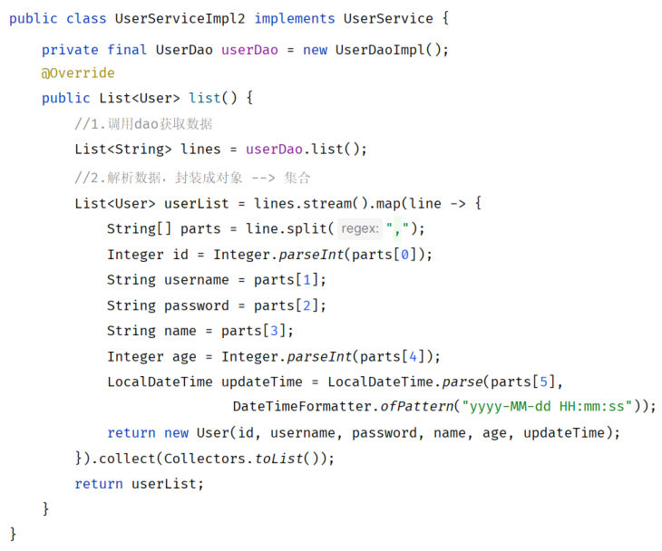

上一篇（[三层架构](/posts/编程学习/javaweb学习笔记/37-三层架构/)）把代码按职责拆成了三层，接口没变、代码也清爽了。但拆完的三层之间还留着三处"焊死的接头"：

```java
private UserService userService = new UserServiceImpl();   // controller 里
private UserDao userDao = new UserDaoImpl();               // service 里
```

这一篇就处理它们：**分层解耦** + **IOC & DI 入门**（PPT 第 55-63 页）。PPT 第 55 页那张小目录（三层架构 → **分层解耦** → **IOC & DI 入门** → IOC 详解 → DI 详解）里，本篇覆盖中间两个，前面讲"为什么要解耦"，后面讲"代码怎么改"；[下一篇](/posts/编程学习/javaweb学习笔记/39-ioc与di详解/)再钻注解与注入方式的细节。

## 先认识两个词：耦合与内聚（PPT 第 56 页）

PPT 第 56 页给了定义，都很短，但要能翻译成自己的话：

> **耦合：衡量软件中各个层/各个模块的依赖关联程度。**
>
> **内聚：软件中各个功能模块内部的功能联系。**
>
> **软件设计原则：高内聚低耦合。**

| 词 | 在说什么 | 高一点好还是低一点好 |
| --- | --- | --- |
| **耦合** | 模块**之间**牵手的紧密程度——A 有多依赖 B 的具体实现 | **越低越好**（换掉 B 时尽量不用动 A） |
| **内聚** | 一个模块**内部**的各部分是不是在干同一件事 | **越高越好**（一件事的代码都在一处） |

对照这个案例：

- **内聚**：上一篇拆三层就是在提内聚——读文件的事全在 dao、解析的事全在 service、接口的事全在 controller，**一个类内部的代码都在服务同一个职责**；
- **耦合**：三层之间的"依赖关联程度"还很高——controller **知道** `UserServiceImpl` 这个具体类名，service **知道** `UserDaoImpl` 这个具体类名。


*图：PPT 第 56 页讲"耦合"时摆出来的业务层代码——`UserServiceImpl2` 里写着 `private final UserDao userDao = new UserDaoImpl();`：业务层**自己创建**数据访问层的具体实现类（它的兄弟 `UserServiceImpl` 里是同样的写法），这就是"层与层耦合"的现场*

## 现在的耦合，具体疼在哪（PPT 第 57 页）

PPT 第 57 页画了一张示意图：一堆 `1`、`2` 的圈圈（代表各个对象）被画进一个**容器**里，旁边写着**控制反转**、**依赖注入**两个词，还有两个问号——意思是"这些对象的创建和依赖关系，到底该由谁来管？"

先把"现在是谁在管"看清楚。三层里每一处 `new`，都是一条写死的依赖：

```text
UserController  ──new──▶  UserServiceImpl  ──new──▶  UserDaoImpl
     （控制层）                  （业务层）                （数据访问层）
```

自己 `new` 意味着：**用哪个实现类，是在写下这一行的时候就定死的**。于是就有了这些麻烦：

| 场景 | 现在会发生什么 |
| --- | --- |
| 业务规则变了，新写了 `UserServiceImpl2`，想用它 | 得**改 `UserController` 的源码**、重新编译（把 `new UserServiceImpl()` 换成 `new UserServiceImpl2()`） |
| 数据来源要从文件换成数据库，写了 `UserDaoImplForMySQL` | 得**改 `UserServiceImpl` 的源码** |
| 想给某个实现类加一层包装/换个实现做测试 | 同样得改上层源码 |

一句话：**上层不但"用"下层，还管起了下层"怎么出生"**——这不合理。合理的分工是：上层只管"我需要一个能干这些活的对象"，至于"谁来做、怎么创建"，交给一个专门的**容器**。

## 三个概念：IOC、DI、Bean（PPT 第 58 页）

PPT 第 58 页把答案一次给全：

> **控制反转：Inversion Of Control，简称 IOC。对象的创建控制权由程序自身转移到外部（容器），这种思想称为控制反转。**
>
> **依赖注入：Dependency Injection，简称 DI。容器为应用程序提供运行时，所依赖的资源，称之为依赖注入。**
>
> **Bean 对象：IOC 容器中创建、管理的对象，称之为 Bean。**

拆开看这三句话：

| 概念 | 关键动作 | 谁变了 |
| --- | --- | --- |
| **IOC（控制反转）** | 对象的**创建控制权**从"程序自己"转移给"外部容器" | 以前是 `new UserServiceImpl()`，现在由**容器**负责创建对象 |
| **DI（依赖注入）** | 容器在**运行时**把对象所需要的资源**提供**给它 | 以前 `private UserDao userDao = new UserDaoImpl();`，现在容器把 `userDao` **塞**进来 |
| **Bean** | IOC 容器里**创建、管理**的那些对象 | `UserServiceImpl`、`UserDaoImpl` 这些对象从此叫 Bean |

> [!TIP]
> 两个词其实是同一件事的两面：**"创建权交出去"是 IOC，"送进来"是 DI**。站在对象的角度想最直观——`UserServiceImpl` 不再自己去找 `UserDao`，而是"张嘴等着"容器把 `UserDao` 送进来。

## 必答问答（PPT 第 59 页）

| PPT 的问题 | 答案 |
| --- | --- |
| 实现分层解耦的思路是什么？ | ① **将项目中的类交给 IOC 容器管理（IOC，控制反转）**；② **应用程序运行时需要什么对象，直接依赖容器为其提供（DI，依赖注入）** |

## 动手改造：IOC & DI 入门（PPT 第 60-62 页）

PPT 第 61、62 两页把改造归纳成**两件事**：

> **① 将 Dao 及 Service 层的实现类，交给 IOC 容器管理。**
> **② 为 Controller 及 Service 注入运行时所依赖的对象。**

落到代码上，就是"**加一个注解交出创建权**"和"**加一个注解等依赖送上门**"。

### 改造一：dao 层实现类交给容器（@Component）

```java
package com.itheima.dao.impl;

import cn.hutool.core.io.IoUtil;
import com.itheima.dao.UserDao;
import org.springframework.stereotype.Component;

import java.io.InputStream;
import java.util.ArrayList;
import java.util.List;

@Component   // 将当前类交给 Spring 管理，声明为 Spring 容器中的 bean 对象
public class UserDaoImpl implements UserDao {

    @Override
    public List<String> list() {
        // 读取 user.txt 中的数据
        InputStream in = this.getClass().getClassLoader().getResourceAsStream("user.txt");
        return IoUtil.readUtf8Lines(in, new ArrayList<>());
    }
}
```

### 改造二：service 层实现类交给容器，并注入 dao（@Component + @Autowired）

```java
package com.itheima.service.impl;

import com.itheima.dao.UserDao;
import com.itheima.pojo.User;
import com.itheima.service.UserService;
import org.springframework.beans.factory.annotation.Autowired;
import org.springframework.stereotype.Component;

import java.time.LocalDateTime;
import java.time.format.DateTimeFormatter;
import java.util.List;

@Component   // 交给 IOC 容器管理
public class UserServiceImpl implements UserService {

    @Autowired   // 自动装配：应用程序在运行时，会自动的从容器中找到该类型的对象，并赋值给该变量
    private UserDao userDao;

    @Override
    public List<User> list() {
        // 1. 调用 dao 层，获取数据
        List<String> lines = userDao.list();

        // 2. 业务逻辑处理：解析数据，封装 User 对象 → List<User>
        List<User> userList = lines.stream().map(line -> {
            String[] split = line.split(",");
            return new User(
                    Integer.parseInt(split[0]), split[1], split[2], split[3],
                    Integer.parseInt(split[4]),
                    LocalDateTime.parse(split[5], DateTimeFormatter.ofPattern("yyyy-MM-dd HH:mm:ss")));
        }).toList();
        return userList;
    }
}
```

### 改造三：controller 注入 service（@Autowired）

```java
package com.itheima.controller;

import com.itheima.pojo.User;
import com.itheima.service.UserService;
import org.springframework.beans.factory.annotation.Autowired;
import org.springframework.web.bind.annotation.RequestMapping;
import org.springframework.web.bind.annotation.RestController;

import java.util.List;

@RestController
public class UserController {

    @Autowired   // 运行时由容器把 UserService 的对象送进来
    private UserService userService;

    @RequestMapping("/list")
    public List<User> list() {
        // 1. 调用 service，查询用户信息
        List<User> userList = userService.list();

        // 2. 响应数据
        return userList;
    }
}
```

### 改造前后对照

改的只是三行代码，但性质完全变了：

| | 改造前 | 改造后 |
| --- | --- | --- |
| controller 里的 service | `private UserService userService = new UserServiceImpl();` | `@Autowired` + `private UserService userService;` |
| service 里的 dao | `private UserDao userDao = new UserDaoImpl();` | `@Autowired` + `private UserDao userDao;` |
| dao 实现类 | 无注解 | 类上加 **`@Component`** |
| service 实现类 | 无注解 | 类上加 **`@Component`** |
| 谁创建对象 | **程序自己 new** | **IOC 容器**（创建权交出去了 → 控制反转） |
| 依赖怎么来 | 自己 new 出来 | **容器运行时注入**（→ 依赖注入） |
| 换一个实现类 | 改上层源码 | 应用层代码不用动，交给容器决定（[下一篇](/posts/编程学习/javaweb学习笔记/39-ioc与di详解/)细讲怎么指定） |

> [!IMPORTANT]
> 两个注解的**位置**别放错：
> - `@Component` **加在实现类上**（`UserDaoImpl`、`UserServiceImpl`），**不是接口上**——容器创建的是对象，接口是不能被实例化的；
> - `@Autowired` 加在**需要依赖的那个成员变量上**（controller 里的 `userService`、service 里的 `userDao`）——它说的是"我这里要一个对象，容器帮我找找"。

## 必答问答（PPT 第 63 页）

| PPT 的问题 | 答案 |
| --- | --- |
| 如何将一个类交给 IOC 容器管理？ | **`@Component`**（注意：是加在**实现类**上，而非接口上） |
| 如何从 IOC 容器中找到该类型的 bean，然后完成依赖注入？ | **`@Autowired`** |

## 实测：改造之后，接口还是那个接口

改造是"换内部实现"，对外表现必须一样。本机把课程最终代码（三层 + IOC/DI 改造后）跑起来：

> [!TIP]
> 本机实测（Spring Boot 3.2.8 / 内嵌 Tomcat / JDK 17）
>
> ```text
> $ curl -si "http://localhost:8080/list" | head -4
> HTTP/1.1 200
> Content-Type: application/json
> Transfer-Encoding: chunked
> ```
>
> 页面 `user.html` 照旧渲染出用户表格——**没有 `new` 之后，功能一点没少**：容器把 `UserDaoImpl` 创建好、注入 `UserServiceImpl`，再把 `UserServiceImpl` 创建好、注入 `UserController`，这一串都在应用启动时自动完成。

顺手记一个实测细节，它是下一篇的引子：**交给容器的 bean，名字默认是"类名首字母小写"**——`UserServiceImpl` 在容器里叫 `userServiceImpl`、`UserDaoImpl` 叫 `userDaoImpl`（本机实测里 `@Qualifier("userServiceImpl")`、`@Resource(name = "userServiceImpl2")` 能生效，靠的就是这条默认命名规则）。

> [!WARNING]
> 改造后如果启动报"找不到 bean"（类似 `No qualifying bean of type 'com.itheima.dao.UserDao' available`），先回头检查两件事：① 实现类上的 `@Component` 是不是漏了（或者错加到了接口上）；② 那个类是不是放在启动类所在包**之外**——这两条下一篇都会亲手做实验。

## 小结

| 问题 | 答案 |
| --- | --- |
| 耦合是什么？ | 衡量软件中各个层/各个模块的**依赖关联程度**（越低越好） |
| 内聚是什么？ | 软件中各个功能模块**内部的功能联系**（越高越好） |
| 软件设计原则？ | **高内聚低耦合** |
| 现在代码的耦合点在哪？ | 三处 `new`：controller 里 `new UserServiceImpl()`、service 里 `new UserDaoImpl()`；换实现类就得改上层源码 |
| IOC 是什么？ | **控制反转（Inversion Of Control）**——**对象的创建控制权由程序自身转移到外部（容器）** |
| DI 是什么？ | **依赖注入（Dependency Injection）**——**容器为应用程序提供运行时所需要的依赖资源** |
| Bean 是什么？ | **IOC 容器中创建、管理的对象** |
| 分层解耦的思路？ | ① 把项目中的类**交给 IOC 容器管理**（IOC）；② 运行时需要什么对象，**直接依赖容器提供**（DI） |
| 改造的两件事？ | ① 将 **Dao 及 Service 层的实现类**交给 IOC 容器管理（实现类上加 `@Component`）；② 为 **Controller 及 Service** 注入运行时所依赖的对象（成员变量上加 `@Autowired`） |
| 改造后有什么变化？ | 三处 `new` 全没了；对象由容器创建、依赖由容器注入；对外接口不变（实测 `/list` 仍是 `200` + `application/json`） |

## 相关

- [上一篇：三层架构](/posts/编程学习/javaweb学习笔记/37-三层架构/)
- [下一篇：IOC与DI详解](/posts/编程学习/javaweb学习笔记/39-ioc与di详解/)

## 练习题

### 一、知识回顾（读完直接做下面的实践题）

1. **耦合**：衡量软件中各个层/各个模块的**依赖关联程度**；**内聚**：软件中各个功能模块**内部的功能联系**；软件设计原则是 **高内聚低耦合**
2. **这个案例的耦合点、以及为什么算耦合**：三处 `new`——controller 里 `new UserServiceImpl()`、service 里 `new UserDaoImpl()`；上层不但"用"下层的功能，还决定了下层"怎么出生"（具体用哪个实现类、什么时候创建），**用哪个实现类是写死的**，换实现就得改上层源码、重新编译
3. **IOC（控制反转，Inversion Of Control）**：**对象的创建控制权由程序自身转移到外部（容器）**
4. **DI（依赖注入，Dependency Injection）**：**容器为应用程序提供运行时，所依赖的资源**
5. **Bean**：**IOC 容器中创建、管理的对象**（比如 `UserServiceImpl`、`UserDaoImpl`）
6. **分层解耦的思路**：① 将项目中的类**交给 IOC 容器管理**（IOC，控制反转）；② 应用程序运行时需要什么对象，**直接依赖容器为其提供**（DI，依赖注入）
7. **改造两件事**：① **将 Dao 及 Service 层的实现类交给 IOC 容器管理**；② **为 Controller 及 Service 注入运行时所依赖的对象**
8. **两个注解怎么用**：**`@Component` 加在实现类上**（不是接口上）——声明这个类交给容器管理；**`@Autowired`** 加在需要依赖的成员变量上——运行时由容器按类型找到对应的 bean 注入进来
9. **改造后的样子**：三处 `new` 全部消失，变成"接口类型 + `@Autowired`"；对象由容器创建、依赖由容器注入；**对外接口与响应完全不变**（实测 `/list` 仍是 `HTTP/1.1 200` + `Content-Type: application/json`）
10. **bean 名字默认规则**（实测）：由容器管理的 bean，**名字默认为类名首字母小写**——`UserServiceImpl` → `userServiceImpl`，`UserDaoImpl` → `userDaoImpl`（下一篇的 `@Qualifier("userServiceImpl")`、`@Resource(name = ...)` 用的就是它）

### 二、裸写题

- [ ] **2-1 找出这几行代码里的耦合点**
  下面是一个三层架构工程的三个片段（都是改造前的写法）：

  ```java
  // 片段一
  @RestController
  public class UserController {
      private UserService userService = new UserServiceImpl();
      // ……
  }

  // 片段二
  public class UserServiceImpl implements UserService {
      private UserDao userDao = new UserDaoImpl();
      // ……
  }
  ```

  请回答：
  1. 两个片段里，**哪两行**是"层与层耦合"的现场（原样抄出来）？
  2. 用"耦合/内聚"的话说，这两行为什么算耦合（说清"上层知道了什么不该它知道的事"）？
  3. 假设现在业务规则变了，新写了一个 `UserServiceImpl2`，想换掉原来的实现。改造**前**你要改哪些文件？改造**后**（把依赖交给容器）又要改哪些？把这个对比写出来。
  （练习文件 `test_38_找出耦合点.java` 里给了写作区。）

  > [!TIP]- 提示（先自己想，实在想不出再点开）
  > **一级 · 思路**：盯住每个成员变量的**等号右边**——那是"具体用谁"的决定权；再想"这个决定权出现在哪一层"是不是合适
  > **二级 · 方法**：耦合点就是两处 `new XxxImpl()`；改造后这两行只剩"接口类型 + `@Autowired`"，具体实现由容器决定
  > **三级 · 骨架**：改造后应当长成 `@____ private UserService userService;` / `@____ private UserDao userDao;`

  > [!TIP]- 参考答案（做完再点开）
  > 1. 两行耦合点（原样）：
  >    ```java
  >    private UserService userService = new UserServiceImpl();
  >    private UserDao userDao = new UserDaoImpl();
  >    ```
  > 2. 为什么是耦合：**成员变量的类型已经是接口了（`UserService` / `UserDao`），可等号右边把"具体用哪个实现类"也写死了**——上层替下层做了"用谁、怎么创建"的决定。上层原本只需要知道"有这么一个能干活的接口"，现在却知道了下层的**类名**和**构造方式**；下层一换（或想换），上层的源码就得跟着改。这就是"依赖关联程度高"（耦合高）。
  > 3. 对比：
  >    | | 要改的地方 |
  >    | --- | --- |
  >    | 改造前 | 要**改 `UserController` 的源码**（把 `new UserServiceImpl()` 换成 `new UserServiceImpl2()`），然后重新编译运行 |
  >    | 改造后（依赖交给容器） | 上层代码**不用动**（只有接口类型 + `@Autowired`）；换成哪个实现由容器决定——在实现类上标 `@Primary`、或注入处用 `@Qualifier` / `@Resource` 指定（[下一篇](/posts/编程学习/javaweb学习笔记/39-ioc与di详解/)实测三招） |
  > 一句话：改造前是"**上层指哪打哪**"，改造后是"**上层提需求、容器给货**"。

- [ ] **2-2 给三层加上 IOC/DI 改造**
  下面是一个能跑的三层工程（拆过层，但依赖全是自己 `new` 的）：

  ```java
  // dao 层实现类
  public class UserDaoImpl implements UserDao {
      @Override
      public List<String> list() {
          InputStream in = this.getClass().getClassLoader().getResourceAsStream("user.txt");
          return IoUtil.readUtf8Lines(in, new ArrayList<>());
      }
  }
  ```

  ```java
  // service 层实现类
  public class UserServiceImpl implements UserService {
      private UserDao userDao = new UserDaoImpl();
      @Override
      public List<User> list() {
          List<String> lines = userDao.list();
          return lines.stream().map(line -> { /* 解析封装…… */ }).toList();
      }
  }
  ```

  ```java
  // controller
  @RestController
  public class UserController {
      private UserService userService = new UserServiceImpl();
      @RequestMapping("/list")
      public List<User> list() {
          return userService.list();
      }
  }
  ```

  要求（题面只说需求，两个注解的名字自己想）：
  1. 让**数据访问层和业务逻辑层的实现类**都交给容器管理（说明注解加在**类**的哪个位置）；
  2. 让**控制层需要业务对象、业务层需要数据访问对象**时，都不再自己创建，改由容器送进来；
  3. 在每处改动旁边写中文注释，说明"这一行原来是干什么的、现在谁来干"；
  4. 改造完在文件末尾回答：容器是在什么时候把依赖送进来的（启动时还是每次请求时）？改造后 `UserController` 里还剩几个 `new`？
  （练习文件 `test_38_分层解耦改造.java` 里按 dao / service / controller 三块给了写作区。）

  > [!TIP]- 提示（先自己想，实在想不出再点开）
  > **一级 · 思路**：两件事分开做——"谁可以被容器创建"（在实现类上标一个注解）、"谁需要别人送我对象"（在成员变量上标一个注解）
  > **二级 · 方法**：把类交给容器用 `@Component`（加在实现类的 `public class` 上一行）；要依赖用 `@Autowired`（加在成员变量上一行）；成员变量只留"接口类型 + 名字"，**等号右边整个删掉**
  > **三级 · 骨架**：`@____ public class UserDaoImpl implements UserDao { ... }` / `@____ private UserDao userDao;` / `@____ private UserService userService;`

  > [!TIP]- 参考答案（做完再点开）
  > ```java
  > // ============ dao 层实现类：交给容器 ============
  > @Component   // 原来没人管，现在交给 IOC 容器创建、管理（成为 bean）
  > public class UserDaoImpl implements UserDao {
  >     @Override
  >     public List<String> list() {
  >         InputStream in = this.getClass().getClassLoader().getResourceAsStream("user.txt");
  >         return IoUtil.readUtf8Lines(in, new ArrayList<>());
  >     }
  > }
  > ```
  > ```java
  > // ============ service 层实现类：交给容器 + 注入 dao ============
  > @Component   // 交给 IOC 容器管理
  > public class UserServiceImpl implements UserService {
  >
  >     @Autowired   // 原来是自己 new UserDaoImpl()，现在由容器按类型找到 UserDaoImpl 的 bean 送进来
  >     private UserDao userDao;
  >
  >     @Override
  >     public List<User> list() {
  >         List<String> lines = userDao.list();
  >         return lines.stream().map(line -> { /* 解析封装…… */ }).toList();
  >     }
  > }
  > ```
  > ```java
  > // ============ controller：注入 service ============
  > @RestController
  > public class UserController {
  >
  >     @Autowired   // 原来是自己 new UserServiceImpl()，现在由容器注入
  >     private UserService userService;
  >
  >     @RequestMapping("/list")
  >     public List<User> list() {
  >         return userService.list();
  >     }
  > }
  > ```
  > 4. 两个回答：① 依赖是**应用启动时**由容器一次性准备好的（容器先把 `UserDaoImpl`、`UserServiceImpl` 创建成 bean，再把它们分别注入需要的地方；之后每次请求只是正常调用方法，不会再重新创建对象）；② 改造后 `UserController` 里 **`new` 的数量是 0**——这正是"控制反转"的直观标志。

- [ ] **2-3 改错题：三处改造没改对**
  小李照着步骤做分层解耦改造，写了下面三处代码，结果工程要么启动报错、要么运行起来空指针。请逐条指出**错在哪、会出什么现象、怎么改**：

  ```java
  // 第 ① 处
  @Component
  public interface UserDao {
      public List<String> list();
  }

  // 第 ② 处
  public class UserDaoImpl implements UserDao {
      @Override
      public List<String> list() { /* ……照常读文件…… */ }
  }

  // 第 ③ 处
  public List<User> list() {
      @Autowired
      UserService userService;      // 写在方法里的局部变量上
      return userService.list();
  }
  ```

  （练习文件 `test_38_改错题.java` 里给了三处代码和写作区。）

  > [!TIP]- 提示（先自己想，实在想不出再点开）
  > **一级 · 思路**：第 ① 处把注解加在了"不能创建对象的东西"上；第 ② 处少了让容器认领这个类的标记；第 ③ 处注解的位置超出了它管得着的范围
  > **二级 · 方法**：`@Component` 要加在**实现类**上（接口上加等于没加，容器造不出 bean）；`@Autowired` 要加在**成员变量**（或构造方法、setter 方法）上，不能标在方法体内的局部变量上
  > **三级 · 骨架**：`@Component public class UserDao____ implements UserDao {...}` / `@Autowired private ____ userService;`（放在**类里**，方法外面）

  > [!TIP]- 参考答案（做完再点开）
  > ① **`@Component` 加在了接口上**：接口不能被实例化，容器不会为它创建 bean。现象：上层注入 `UserDao` 类型时找不到可用的 bean，启动直接失败（报 `No qualifying bean of type 'com.itheima.dao.UserDao' available` 这一类错误）。改法：把注解挪到**实现类**上——
  > ```java
  > public interface UserDao { List<String> list(); }   // 接口不需要注解
  >
  > @Component
  > public class UserDaoImpl implements UserDao { ... } // 注解加在实现类上
  > ```
  > ② **`UserDaoImpl` 漏了 `@Component`**：这个类根本没交给容器，容器里没有它的 bean。现象和 ① 一样——注入时报"找不到类型为 `UserDao` 的 bean"（如果 service 里也还是 `new UserDaoImpl()`，那就是"改造没生效"，注入不生效的问题被掩盖了）。改法：在 `UserDaoImpl` 类上加 `@Component`。
  > ③ **`@Autowired` 写在了方法体内的局部变量上**：容器只认识"类里的成员"（成员变量、构造方法、setter 方法），管不到方法执行到那一行时的局部变量。现象：注解**完全无效**，`userService` 是 `null`，调用 `userService.list()` 时抛 `NullPointerException`。改法：把依赖声明成**成员变量**，注解也标在成员变量上——
  > ```java
  > @RestController
  > public class UserController {
  >
  >     @Autowired                 // 成员变量上（类里、方法外）
  >     private UserService userService;
  >
  >     @RequestMapping("/list")
  >     public List<User> list() {
  >         return userService.list();
  >     }
  > }
  > ```

### 三、综合题

- [ ] **3-1 给三层架构案例加上 IOC/DI 改造**
  在上一篇（[37 篇](/posts/编程学习/javaweb学习笔记/37-三层架构/)）拆好三层的工程上继续做，每一步都保留"能跑"的状态：
  1. 先跑一次 `curl -si http://localhost:8080/list`，把**改造前**的状态码与 `Content-Type` 抄下来（作为基准）；
  2. 给 dao 层实现类加 `@Component`，交出创建权；
  3. 把 service 层的 `private UserDao userDao = new UserDaoImpl();` 改成"接口类型 + `@Autowired`"，并在实现类上补 `@Component`；
  4. 把 controller 里的 `private UserService userService = new UserServiceImpl();` 改成"接口类型 + `@Autowired`"；
  5. 重启后做三件事：`curl -si .../list` 看状态码与 `Content-Type`、浏览器打开 `user.html` 看表格、在启动日志/断点里确认对象是容器给的（不是 null）；
  6. 记录对照：改造前后各改了几个文件、`new` 从几处变成几处、对外响应有没有变；
  7. 再练一次"换实现"：新建 `UserServiceImpl2`（实现同一个接口，把返回的 id 都加 200），类上也标 `@Component`，重启后观察接口返回的 id——如果启动直接失败，把报错抄到练习文件末尾（这个报错正是[下一篇](/posts/编程学习/javaweb学习笔记/39-ioc与di详解/)要处理的问题）。
  （练习文件 `test_38_综合_IOC-DI改造.java` 里按这 7 步给了写作区。）

  **涉及知识点**

  | 知识点 | 在这里的应用 |
  | --- | --- |
  | 耦合/内聚 | 三处 `new` 是耦合点；把创建权交出去降低耦合 |
  | IOC | 实现类上加 `@Component`，对象由容器创建 |
  | DI | 成员变量上加 `@Autowired`，容器运行时注入 |
  | Bean | 被容器创建/管理的 `UserDaoImpl`、`UserServiceImpl` 都成了 bean |
  | 接口与实现 | 成员变量类型仍是接口，实现由容器决定 |
  | 重构验证 | 对外接口与响应与改造前一致 |

  > [!TIP]- 提示（先自己想，实在想不出再点开）
  > **一级 · 思路**：改造永远从**最底层往上**做（先 dao、再 service、最后 controller），每改一层就把依赖它的那一层跟着改掉 `new`
  > **二级 · 方法**：实现类加 `@Component`；需要依赖的成员变量改成 `@Autowired` + 接口类型（删掉等号右边）；验证照旧用 `curl -si`（看头）和浏览器（看页面）
  > **三级 · 骨架**：`@____ public class UserServiceImpl implements UserService { @____ private UserDao userDao; ... }` / 换实现后的报错关键词 = `required a single bean, but 2 were found`

  > [!TIP]- 参考答案（做完再点开）
  > **3-1** 分步结果：
  > 1. 改造前基准（本机实测值，最终代码工程也是这个数）：
  >    ```text
  >    HTTP/1.1 200
  >    Content-Type: application/json
  >    Transfer-Encoding: chunked
  >    ```
  > 2. `@Component public class UserDaoImpl implements UserDao { ... }`
  > 3. ```java
  >    @Component
  >    public class UserServiceImpl implements UserService {
  >        @Autowired
  >        private UserDao userDao;
  >        // ……
  >    }
  >    ```
  > 4. ```java
  >    @RestController
  >    public class UserController {
  >        @Autowired
  >        private UserService userService;
  >        // ……
  >    }
  >    ```
  > 5. 三项验证：`/list` 仍是 `200` + `application/json`；`user.html` 表格仍是 8 行；`userService`、`userDao` 都不是 null（能被容器注入，说明它们确实是 bean）。
  > 6. 对照表：
  >    | | 改造前 | 改造后 |
  >    | --- | --- | --- |
  >    | 改动文件 | — | 3 个（`UserDaoImpl`、`UserServiceImpl`、`UserController`） |
  >    | `new` 的处数 | 2 | **0** |
  >    | 对外响应 | `200` + `application/json` | 完全一样 |
  > 7. 换实现的结果：新增第二个实现类后**启动会失败**，报错大意是——
  >    ```text
  >    Field userService in com.itheima.controller.UserController required a single bean, but 2 were found:
  >        - userServiceImpl: defined in URL [...]
  >        - userServiceImpl2: defined in URL [...]
  >    ```
  >    这是 `@Autowired` 默认**按类型**注入遇到"同类型两个 bean"时的正常反应——本机实测的完整日志见[下一篇](/posts/编程学习/javaweb学习笔记/39-ioc与di详解/)，那里会给三个解决方案（`@Primary` / `@Qualifier` / `@Resource`）。
