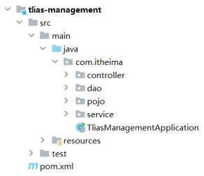
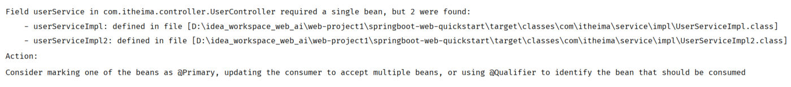

上一篇（[分层解耦与IOC-DI入门](/posts/编程学习/javaweb学习笔记/38-分层解耦与ioc-di入门/)）用 `@Component` + `@Autowired` 把三处 `new` 换掉了，页面照旧能跑。但还有三个问题没回答：

- 声明 bean 的注解**只有 `@Component` 一个吗**？——业务层、数据访问层有没有更贴切的写法？
- 加了注解的类，容器是怎么**找到**它的？
- `@Autowired` 这种注入方式**有几种写法**？如果同一个类型有**两个** bean，容器该给我哪一个？

这一篇就是第 49/55 页那张目录的最后两节（PPT 第 64 页与第 68 页又各翻了一次同一张导航页，分别停在"**IOC 详解**"和"**DI 详解**"上）：**IOC 详解**（PPT 第 65-68 页）与 **DI 详解**（PPT 第 69-71 页）。

## IOC 详解（一）：声明 bean 的四大注解（PPT 第 65 页）

PPT 第 65 页给了完整的表格——**要把某个对象交给 IOC 容器管理，就在对应的类上加上下面这些注解之一**：

| 注解 | 说明 | 位置 |
| --- | --- | --- |
| **`@Component`** | 声明 bean 的**基础注解** | 不属于以下三类时，用此注解 |
| **`@Controller`** | `@Component` 的**衍生注解** | 标注在**控制层**类上 |
| **`@Service`** | `@Component` 的**衍生注解** | 标注在**业务层**类上 |
| **`@Repository`** | `@Component` 的**衍生注解** | 标注在**数据访问层**类上（**由于与 mybatis 整合，用的少**） |

先要理解"衍生注解"这四个字：`@Controller`、`@Service`、`@Repository` 的源码上都标着 `@Component`——**功能完全一样**（都是把类交给容器），区别只是**语义**：让人（和后来的读代码的人）一眼看出这个类属于哪一层。所以：

> [!IMPORTANT]
> 混用不会报错（比如业务层写 `@Component` 照样能注入），但**规范写法是按层选注解**——三个衍生注解是"带标签的 `@Component`"。
>
> 注意一个例外（PPT 第 67 页专门强调）：**在 SpringBoot 集成 web 开发中，声明控制器 bean 只能用 `@Controller`**（或用它的组合注解 `@RestController`）——因为 SpringMVC 需要认出哪些类是请求处理类。

对着这个案例把注解归位：

```java
// 控制层：UserController
@RestController   // = @Controller + @ResponseBody，控制器就用它
public class UserController { /* …… */ }
```

```java
// 业务层实现类：UserServiceImpl
@Service   // ← 原先是 @Component，现在换成更贴切的 @Service
public class UserServiceImpl implements UserService { /* …… */ }
```

```java
// 数据访问层实现类：UserDaoImpl
@Repository   // ← 数据访问层用 @Repository（课程代码里这个注解后面还留了一条注释写法，可选地指定名字）
public class UserDaoImpl implements UserDao { /* …… */ }
```

> [!NOTE]
> 课程最终代码的 `UserDaoImpl` 写的是 `@Repository//("userDao")`——注释掉的 `("userDao")` 就是下面"自己指定 bean 名字"的写法示例；`UserServiceImpl2` 上也留着一行被注释的 `//@Primary`，那是 PPT 第 70 页的方案一（本篇后面会用到）。

### 加一句：bean 的名字怎么定

PPT 第 65 页最后还有一条"注意"：

> **声明 bean 的时候，可以通过注解的 value 属性指定 bean 的名字，如果没有指定，默认为类名首字母小写。**

两种写法对比：

```java
@Repository               // 名字默认 = 类名首字母小写：userDaoImpl
public class UserDaoImpl implements UserDao { /* …… */ }
```

```java
@Repository("userDao")    // 手动指定名字：userDao（value 属性，括号里直接写字符串）
@Component("userServiceA")
public class UserServiceImpl implements UserService { /* …… */ }
```

名字有什么用？——**同类型有多个 bean 时，靠名字区分**（本篇"DI 详解（二）"的 `@Qualifier` / `@Resource` 里写的那个字符串，就是 bean 的名字）。所以这条默认规则必须记牢：

| 类名 | 默认 bean 名字 |
| --- | --- |
| `UserServiceImpl` | `userServiceImpl` |
| `UserServiceImpl2` | `userServiceImpl2` |
| `UserDaoImpl` | `userDaoImpl` |

（本机实测里 `@Qualifier("userServiceImpl")`、`@Resource(name = "userServiceImpl2")` 能生效，靠的就是它——名字拼错的话，容器会告诉你"没有叫这个名字的 bean"。）

## IOC 详解（二）：注解要生效，得先被"扫描"到（PPT 第 66 页）

PPT 第 66 页：

> **前面声明 bean 的四大注解，要想生效，还需要被组件扫描注解 `@ComponentScan` 扫描。**
>
> **该注解虽然没有显式配置，但是实际上已经包含在了启动类声明注解 `@SpringBootApplication` 中，默认扫描的范围是启动类所在包及其子包。**

这段话有三层意思：

1. 四大注解**本身不干活**——它们只是贴在类上的标记；真正"把标了记号的类创建成 bean"的是**组件扫描**（`@ComponentScan`）；
2. 启动类上那个 `@SpringBootApplication` 是个"组合注解"，它的内部**已经包含了 `@ComponentScan`**，所以我们从来没写过它、却发现 `@Component` 好使；
3. 扫描范围是**启动类所在包及其子包**——所以三层所在的 `com.itheima.controller`、`com.itheima.service`、`com.itheima.dao` 必须待在启动类包（`com.itheima`）**里面**。


*图：PPT 第 66 页用来说明扫描范围的工程结构——启动类 `TliasManagementApplication` 就在 `src/main/java/com/itheima/` 下，`controller`、`dao`、`pojo`、`service` 四个包都是它的**子包**；"启动类所在包及其子包"里所有的 `@Component/@Controller/@Service/@Repository` 类才会被扫到、创建成 bean*

启动类本身（课程代码，注释直接写在注解后面）：

```java
package com.itheima;

import org.springframework.boot.SpringApplication;
import org.springframework.boot.autoconfigure.SpringBootApplication;

@SpringBootApplication   // 默认扫描当前包及其子包
public class SpringbootWebDemoApplication {

    public static void main(String[] args) {
        SpringApplication.run(SpringbootWebDemoApplication.class, args);
    }

}
```

## 必答问答（PPT 第 67 页）

| PPT 的问题 | 答案 |
| --- | --- |
| 声明 bean 的注解有哪几个？ | **`@Controller`、`@Service`、`@Repository`、`@Component`**（前三个是 `@Component` 的衍生注解） |
| 注意事项？（PPT 同页给的补充） | ① 在 **SpringBoot 集成 web 开发**中，声明控制器 bean **只能用 `@Controller`**（或含它的组合注解）；② 声明 bean 的注解**要想生效，需要被扫描到**——启动类**默认扫描当前包及其子包** |

## 实测：控制器放到包外，映射根本没注册

"默认只扫启动类所在包及其子包"这句结论，本机做了个实验来验：

> [!WARNING]
> 本机实测（Spring Boot 3.2.8 / 内嵌 Tomcat / JDK 17）
>
> 把 `@RestController` 的控制器挪到启动类所在包**之外**：启动类是 `com.itheima.SpringbootWebDemoApplication`，控制器改成 `com.outside.OutsideController`（加了 `@RestController`、`@RequestMapping("/outside")`）。
>
> ```text
> $ curl -s -o /dev/null -w "%{http_code}" http://localhost:8080/outside
> 404
> ```
>
> 现象很"安静"：**应用照样启动成功、日志里没有报错**，只是这个接口**根本不存在**（404）——因为 `com.outside` 不是 `com.itheima` 的子包，控制器类压根没被扫描到，`@RequestMapping` 映射自然也没注册。
>
> 所以遇到"类上注解都写对了，接口却 404 / 注入却说找不到 bean"，第一条就要检查**包的位置**：控制器、业务层、数据访问层的类，必须在**启动类所在包及其子包**里。（真要让包外的类生效，就得显式配置 `@ComponentScan` 把范围扩大——但课程规范做法是把代码放在启动类包下面。）

## DI 详解（一）：依赖注入的三种方式（PPT 第 69 页）

> **基于 `@Autowired` 进行依赖注入的常见方式有如下三种。**

三种写法的完整代码（以 `UserController` 注入 `UserService` 为例）：

```java
// ① 属性注入：直接标在成员变量上
@RestController
public class UserController {
    @Autowired
    private UserService userService;
    // ……
}
```

```java
// ② 构造器注入：写成构造方法的参数，标在构造方法上
@RestController
public class UserController {
    private final UserService userService;

    @Autowired
    public UserController(UserService userService) {
        this.userService = userService;
    }
    // ……
}
```

```java
// ③ setter 注入：写成 setter 方法的参数，标在 setter 方法上
@RestController
public class UserController {
    private UserService userService;

    @Autowired
    public void setUserService(UserService userService) {
        this.userService = userService;
    }
    // ……
}
```

PPT 第 69 页给每种方式都配了优缺点：

| 方式 | 优点（PPT 原文） | 缺点（PPT 原文） |
| --- | --- | --- |
| **① 属性注入** | **代码简洁、方便快速开发** | **隐藏了类之间的依赖关系、可能会破坏类的封装性** |
| **② 构造器注入** | **能清晰地看到类的依赖关系、提高了代码的安全性** | **代码繁琐、如果构造参数过多，可能会导致构造函数臃肿** |
| **③ setter 注入** | **保持了类的封装性，依赖关系更清晰** | **需要额外编写 setter 方法，增加了代码量** |

还有一条**注意**（PPT 第 69 页最后一行，本机实测也印证了）：

> **注意：如果只有一个构造函数，`@Autowired` 注解可以省略。**

```java
@RestController
public class UserController {

    private final UserService userService;

    // 类里只有这一个构造方法 → @Autowired 可以不写，Spring 也会用它来完成注入
    public UserController(UserService userService) {
        this.userService = userService;
    }
}
```

> [!TIP]
> 课程最终代码的 `UserController` 把三种写法**都留着（注释形式）**，只把当前要用的那一种打开——这种"一个文件里放三种对比写法"的做法很值得学，改回来时不用翻讲义：
>
> ```java
> //方式一: 属性注入
> //@Autowired
> //private UserService userService;
>
> //方式二: 构造器注入
> //private final UserService userService;
> ////@Autowired ---> 如果当前类中只存在一个构造函数, @Autowired可以省略
> //public UserController(UserService userService) {
> //    this.userService = userService;
> //}
>
> //方式三: setter注入
> //private UserService userService;
> //@Autowired
> //public void setUserService(UserService userService) {
> //    this.userService = userService;
> //}
> ```

## DI 详解（二）：同类型的 bean 有多个怎么办（PPT 第 70 页）

PPT 第 70 页先给结论，再摆现场：

> **`@Autowired` 注解，默认是按照类型进行注入的。如果存在多个相同类型的 bean，将会报出如下错误：**


*图：PPT 第 70 页贴出来的真实报错——`Field userService in com.itheima.controller.UserController required a single bean, but 2 were found`，下面列出两个候选 bean（`userServiceImpl`、`userServiceImpl2`）以及它们各自的 class 文件路径，最后给出 Action 建议：把其中一个标成 `@Primary`、改成接受多个 bean、或用 `@Qualifier` 指明要哪一个*

### 实测：本机把两个同类型 bean 摆在一起，启动直接失败

> [!WARNING]
> 本机实测（Spring Boot 3.2.8 / JDK 17）——写两个实现类 `UserServiceImpl`、`UserServiceImpl2` 都 `implements UserService`、都交给容器，而 `UserController` 里只写 `@Autowired private UserService userService;`：
>
> ```text
> ***************************
> APPLICATION FAILED TO START
> ***************************
>
> Description:
>
> Field userService in com.itheima.controller.UserController required a single bean, but 2 were found:
> 	- userServiceImpl: defined in URL [...]
> 	- userServiceImpl2: defined in URL [...]
>
> Action:
>
> Consider marking one of the beans as @Primary, updating the consumer to accept multiple beans, or using @Qualifier to identify the bean that should be consumed
> ```
>
> 异常链里的关键句（说明了根因）：
>
> ```text
> UnsatisfiedDependencyException: Error creating bean with name 'userController':
> Unsatisfied dependency expressed through field 'userService':
> No qualifying bean of type 'com.itheima.service.UserService' available:
> expected single matching bean but found 2: userServiceImpl,userServiceImpl2
> ```
>
> 关键句就一句话：**"期望一个匹配的 bean，却找到了两个"**——`@Autowired` 按**类型**找，`UserService` 类型下有两个候选，它不知道挑谁，于是在启动阶段就"罢工"了。这也和 PPT 第 70 页贴的报错一字不差。

### 三种解决方案（PPT 第 70 页 + 实测结果）

PPT 给了三个方案，本机把三个都跑了一遍：

| 方案 | 写法 | 本机实测结果 |
| --- | --- | --- |
| **方案一：`@Primary`** | 在 `UserServiceImpl` 类上加 **`@Primary`**（意思是"同类型多个时，优先用它"） | **启动成功**，注入的是 `userServiceImpl`（`/list` 返回的 id 是 1、2、3…） |
| **方案二：`@Qualifier`** | `@Qualifier("userServiceImpl")` 和 `@Autowired` 一起标在成员变量上（按**名字**指定） | **启动成功**，注入的是 `userServiceImpl` |
| **方案三：`@Resource`** | `@Resource(name = "userServiceImpl2")` 标在成员变量上（JavaEE 规范的注解，也按**名字**） | **启动成功**，注入的是 `userServiceImpl2`（`/list` 返回的 id 是 **201、202…**，因为 2 号实现类把 id 都加了 200） |

三种写法的代码对照（都改在 `UserController` / `UserServiceImpl` 上）：

```java
// 方案一：@Primary —— 给"首选的那个"实现类贴个标签
@Service
@Primary     // UserServiceImpl2 也存在，但优先注入我
public class UserServiceImpl implements UserService { /* …… */ }
```

```java
// 方案二：@Qualifier —— 在注入处按名字点名
@RestController
public class UserController {

    @Autowired
    @Qualifier("userServiceImpl")     // 名字 = 类名首字母小写
    private UserService userService;
}
```

```java
// 方案三：@Resource —— 换一个注解，直接按名字注入
@RestController
public class UserController {

    @Resource(name = "userServiceImpl2")   // 注意包是 jakarta.annotation.Resource
    private UserService userService;
}
```

> [!TIP]
> **怎么知道到底注入了哪一个？**本机用的办法很朴素：让 2 号实现类把 id 都加 200（`id + 200`）。
>
> ```text
> 注入 userServiceImpl  → curl /list → [{"id":1,...},{"id":2,...}, …]      （原始数据）
> 注入 userServiceImpl2 → curl /list → [{"id":201,...},{"id":202,...}, …]  （加了 200 的那份）
> ```
>
> 返回的 id 会"说话"，一眼就能看出容器挑了谁——这比只看日志靠谱。本机实测三种方案的行为都符合预期：方案一、二都进了 1 号实现，方案三进了 2 号实现。

另外，**构造器注入与 setter 注入也一样能解决冲突**（本机的对照实验）：

| 对照实验 | 写法 | 实测结果 |
| --- | --- | --- |
| 构造器注入 + `@Primary` | `private final UserService userService;` + 构造方法，**不写 `@Autowired`** | **启动成功**（印证"只有一个构造函数时 `@Autowired` 可以省略"） |
| setter 注入 + `@Resource` | `@Resource(name = "userServiceImpl2")` 标在 **setter 方法**上 | **启动成功**，注入 `userServiceImpl2` |

## DI 详解（三）：`@Resource` 与 `@Autowired` 的区别（PPT 第 71 页）

PPT 第 71 页先把依赖注入的注解总结成一张小表，再对比两个注解：

> **依赖注入的注解**
> - **`@Autowired`：默认按照类型自动装配**
> - 如果同类型的 bean 存在多个：**`@Primary` / `@Autowired` + `@Qualifier` / `@Resource`**
>
> **`@Resource` 与 `@Autowired` 区别？**
> - **`@Autowired` 是 Spring 框架提供的注解，而 `@Resource` 是 JavaEE 规范提供的**
> - **`@Autowired` 默认是按照类型注入，而 `@Resource` 默认是按照名称注入**

整理成对照表：

| | `@Autowired` | `@Resource` |
| --- | --- | --- |
| 谁提供的 | **Spring 框架** | **JavaEE 规范**（Spring Boot 3 里包名是 `jakarta.annotation.Resource`） |
| 默认注入方式 | **按类型**（byType） | **按名称**（byName） |
| 同类型多个 bean 时 | 需要配合 `@Primary` 或 `@Qualifier` 指定 | 直接写 `@Resource(name = "bean名字")` 指定即可 |
| 能不能用在构造器上 | 能（构造器注入的标配） | 不能（它标在字段/setter 上） |
| 本案例怎么选 | 只有一个实现时最省事 | 想明确"就要名字叫这个的 bean"时更直接 |

## 小结

| 问题 | 答案 |
| --- | --- |
| 声明 bean 的四个注解？ | **`@Component`**（基础注解）、**`@Controller`**（控制层）、**`@Service`**（业务层）、**`@Repository`**（数据访问层，与 mybatis 整合后用的少）；后三个都是 `@Component` 的**衍生注解** |
| bean 名字怎么定？ | 注解的 **value 属性**可以指定名字（如 `@Repository("userDao")`）；不指定时**默认为类名首字母小写**（`UserServiceImpl` → `userServiceImpl`） |
| 注解为什么能生效？ | 四大注解要被**组件扫描 `@ComponentScan`** 扫到才行；`@ComponentScan` 虽然没显式配置，但**已包含在启动类注解 `@SpringBootApplication` 里** |
| 默认扫描范围？ | **启动类所在包及其子包**；实测把控制器放到包外（`com.outside`）→ 启动正常但接口 **404**（映射根本没注册） |
| 三种注入方式？ | **属性注入**（简洁、快，但隐藏依赖关系、可能破坏封装）、**构造器注入**（依赖关系清晰、安全，但代码繁琐、参数多会臃肿）、**setter 注入**（保持封装、依赖清晰，但要多写 setter 方法） |
| 构造器注入的小福利？ | **如果只有一个构造函数，`@Autowired` 可以省略** |
| 同类型多个 bean 会怎样？ | `@Autowired` **默认按类型注入**，遇到两个候选就**启动失败**：`required a single bean, but 2 were found`（本机实测报错原文） |
| 怎么解决？ | ① 类上加 **`@Primary`**（首选）；② 注入处用 **`@Autowired` + `@Qualifier("bean名字")`**；③ 注入处用 **`@Resource(name = "bean名字")`**（三者实测都能启动成功） |
| `@Resource` 与 `@Autowired` 的区别？ | 来源不同（**Spring 框架** vs **JavaEE 规范**）；默认注入方式不同（**按类型** vs **按名称**） |

## 相关

- [上一篇：分层解耦与IOC-DI入门](/posts/编程学习/javaweb学习笔记/38-分层解耦与ioc-di入门/)
- [回看案例起点：SpringBoot Web案例-用户列表渲染](/posts/编程学习/javaweb学习笔记/36-springboot-web案例-用户列表渲染/)
- [下一篇：数据库概述与MySQL入门](/posts/编程学习/javaweb学习笔记/40-数据库概述与mysql入门/)

## 练习题

### 一、知识回顾（读完直接做下面的实践题）

1. **四个 bean 注解**：`@Component`（**声明 bean 的基础注解**，不属于下面三类时用）、`@Controller`（控制层）、`@Service`（业务层）、`@Repository`（数据访问层，**由于与 mybatis 整合，用的少**）；后三个都是 `@Component` 的**衍生注解**
2. **两条注意**：SpringBoot 集成 web 开发中声明**控制器 bean 只能用 `@Controller`**（或 `@RestController`）；声明 bean 的注解**要被扫描到才生效**
3. **bean 名字规则**：声明 bean 时可通过注解的 **value 属性**指定名字（`@Repository("userDao")`）；**没有指定时默认为类名首字母小写**（`UserServiceImpl` → `userServiceImpl`）
4. **组件扫描与它的实测边界**：四大注解要被 **`@ComponentScan`** 扫到才生效；它**虽然没有显式配置，但实际上已经包含在启动类注解 `@SpringBootApplication` 中**，**默认扫描的范围是启动类所在包及其子包**——实测把控制器放到包外（`com.outside.OutsideController`，启动类在 `com.itheima`）：**应用启动正常、日志无报错，但访问那个接口是 404**（映射根本没注册）
5. **三种注入方式**：**属性注入**（`@Autowired` 标在成员变量上）、**构造器注入**（标在构造方法上，字段常用 `private final`）、**setter 注入**（标在 setter 方法上）
6. **三种方式的优缺点**：属性注入——代码简洁、方便快速开发，但**隐藏了类之间的依赖关系、可能破坏封装性**；构造器注入——**能清晰看到依赖关系、提高安全性**，但代码繁琐、**构造参数过多会让构造函数臃肿**；setter 注入——**保持封装性、依赖关系更清晰**，但要**额外编写 setter 方法、增加代码量**
7. **构造器注入的例外**：**如果只有一个构造函数，`@Autowired` 注解可以省略**（本机实测：构造器不写 `@Autowired` 配 `@Primary` → 启动成功）
8. **同类型多个 bean 的报错**：`@Autowired` **默认按类型注入**；两个实现类都交给容器时报 `Field userService ... required a single bean, but 2 were found`（异常链：`No qualifying bean of type ... available: expected single matching bean but found 2: userServiceImpl,userServiceImpl2`）
9. **三种解决方案**：① 实现类上加 **`@Primary`**（实测注入 `userServiceImpl`）；② **`@Autowired` + `@Qualifier("userServiceImpl")`**（实测注入 `userServiceImpl`）；③ **`@Resource(name = "userServiceImpl2")`**（实测注入 `userServiceImpl2`）
10. **`@Resource` 与 `@Autowired` 的区别**：`@Autowired` 是 **Spring 框架**提供的注解、默认**按照类型**注入；`@Resource` 是 **JavaEE 规范**提供的、默认**按照名称**注入

### 二、裸写题

- [ ] **2-1 给三层的类挑"最贴切"的 bean 注解**
  一个三层架构的工程里，有三个类要交给 IOC 容器管理：
  1. `com.itheima.controller.EmpController`（控制层，处理请求、响应数据）；
  2. `com.itheima.service.impl.EmpServiceImpl`（业务层）；
  3. `com.itheima.dao.impl.EmpDaoImpl`（数据访问层）。

  要求：
  1. 给每个类选**最贴切**的注解（不是全用同一个）并写在类上；
  2. 说明为什么控制层的类**必须**用它选的那个注解（提示在 PPT 的"注意事项"里）；
  3. 写出这三个类**默认的 bean 名字**分别是什么；再写出把数据访问层的 bean 名字显式指定为 `empDao` 的写法。
  （练习文件 `test_39_声明Bean的注解.java` 里给了三个类的骨架和写作区。）

  > [!TIP]- 提示（先自己想，实在想不出再点开）
  > **一级 · 思路**：四个注解里，一个"通用"，另外三个分别对应三层——按类所在的层选；默认名字记"类名首字母变小写"
  > **二级 · 方法**：控制层 `@Controller`（本案例其实用 `@RestController`）、业务层 `@Service`、数据访问层 `@Repository`；指定名字写在注解括号里（value 属性）
  > **三级 · 骨架**：`@____` / `@____` / `@____("____")`；默认名字 = `empController`? 注意——bean 名字由**类名**决定

  > [!TIP]- 参考答案（做完再点开）
  > ```java
  > // ① 控制层：SpringBoot 集成 web 开发中，声明控制器 bean 只能用 @Controller
  > //   （更常用的是它的组合注解 @RestController = @Controller + @ResponseBody）
  > @RestController
  > public class EmpController { /* …… */ }
  > ```
  > ```java
  > // ② 业务层
  > @Service
  > public class EmpServiceImpl implements EmpService { /* …… */ }
  > ```
  > ```java
  > // ③ 数据访问层（顺手把 bean 名字显式指定为 empDao）
  > @Repository("empDao")
  > public class EmpDaoImpl implements EmpDao { /* …… */ }
  > ```
  > 2. 控制器必须用 `@Controller`（或 `@RestController`）：**在 SpringBoot 集成 web 开发中，声明控制器的 bean 只能用 `@Controller`**——SpringMVC 靠它（以及 `@RequestMapping` 等）识别请求处理类；换成 `@Component` / `@Service` 之类的名字虽然也能被扫描成 bean，但不是"控制器"的规范写法。
  > 3. 默认 bean 名字（类名首字母小写）：
  >    | 类名 | 默认 bean 名字 |
  >    | --- | --- |
  >    | `EmpController` | `empController` |
  >    | `EmpServiceImpl` | `empServiceImpl` |
  >    | `EmpDaoImpl` | `empDaoImpl`（上面显式指定后是 `empDao`） |

- [ ] **2-2 三种依赖注入方式各写一遍**
  一个控制器 `DeptController` 需要使用业务对象 `DeptService`（接口）。请**用三种不同的写法**完成注入：
  1. 第一种：最简洁的写法（直接标在成员变量上）；
  2. 第二种：把依赖做成构造方法的参数（体现"类必须拿到依赖才能创建"）；
  3. 第三种：通过一个 setter 方法注入；
  4. 每种写法旁边用中文注释写出它的**优点**和**缺点**（各一条，按 PPT 的说法）；
  5. 回答一个问题：三种写法里，哪一种可以**不写注入注解**？前提是什么？
  （练习文件 `test_39_三种依赖注入方式.java` 里按三种写法给了写作区。）

  > [!TIP]- 提示（先自己想，实在想不出再点开）
  > **一级 · 思路**：三种写法的区别只在"依赖从哪个入口进来"——成员变量、构造方法、setter 方法
  > **二级 · 方法**：注解都是 `@Autowired`，只是**标的位置**不同；构造器写法里字段用 `private final`；"可以不写注解"的那一种，前提和"类里有几个构造方法"有关
  > **三级 · 骨架**：`@____ private DeptService deptService;` / `private final DeptService deptService;` + `public DeptController(DeptService deptService) { this.deptService = ____; }` / `public void setDeptService(DeptService deptService) { this.deptService = ____; }`

  > [!TIP]- 参考答案（做完再点开）
  > ```java
  > // ① 属性注入
  > @RestController
  > public class DeptController {
  >     @Autowired
  >     private DeptService deptService;
  >     // 优点：代码简洁、方便快速开发
  >     // 缺点：隐藏了类之间的依赖关系、可能会破坏类的封装性
  > }
  > ```
  > ```java
  > // ② 构造器注入
  > @RestController
  > public class DeptController {
  >
  >     private final DeptService deptService;
  >
  >     @Autowired
  >     public DeptController(DeptService deptService) {
  >         this.deptService = deptService;
  >     }
  >     // 优点：能清晰地看到类的依赖关系、提高了代码的安全性
  >     // 缺点：代码繁琐、如果构造参数过多，可能会导致构造函数臃肿
  > }
  > ```
  > ```java
  > // ③ setter 注入
  > @RestController
  > public class DeptController {
  >
  >     private DeptService deptService;
  >
  >     @Autowired
  >     public void setDeptService(DeptService deptService) {
  >         this.deptService = deptService;
  >     }
  >     // 优点：保持了类的封装性，依赖关系更清晰
  >     // 缺点：需要额外编写 setter 方法，增加了代码量
  > }
  > ```
  > 5. **构造器注入**可以不写注入注解，**前提是类里只有一个构造函数**（PPT 原话：如果只有一个构造函数，`@Autowired` 注解可以省略；本机实测构造器不写 `@Autowired` 也能启动成功）。

- [ ] **2-3 两个同类型的 bean 打起来了，给三个解决方案**
  工程里有一个业务接口 `UserService`，现在有**两个实现类**都被交给了容器：

  ```java
  @Service
  public class UserServiceImpl implements UserService { /* …… */ }

  @Service
  public class UserServiceImpl2 implements UserService { /* …… */ }
  ```

  控制层里是这么写的：

  ```java
  @RestController
  public class UserController {
      @Autowired
      private UserService userService;
      // ……
  }
  ```

  启动工程时**直接失败**。要求：
  1. 从报错里抄出最关键的那一句，并解释它为什么会发生（说清"注入规则 + 有几个候选"）；
  2. 给出**三种**能让工程正常启动的改法，每种写出改哪里、改什么（三种都要说明"最后注入的是哪一个"）；
  3. 回答：如果不改代码，有没有办法让这两行"和平共处"？（想想"接收多个 bean"这种可能，任答一种即可）
  （练习文件 `test_39_同类型多个Bean的冲突.java` 里给了报错原文和三种方案的写作区。）

  > [!TIP]- 提示（先自己想，实在想不出再点开）
  > **一级 · 思路**：报错的实质是"要一个、给了俩"；三种改法分别是"指定首选""按名字点名""换一个按名字注入的注解"
  > **二级 · 方法**：① 实现类上加 `@Primary`；② 注入处 `@Qualifier("userServiceImpl")` 配 `@Autowired`；③ 注入处 `@Resource(name = "userServiceImpl2")`
  > **三级 · 骨架**：`@____ public class UserServiceImpl implements UserService {...}` / `@____ @____("userServiceImpl") private UserService userService;` / `@____(name = "____") private UserService userService;`

  > [!TIP]- 参考答案（做完再点开）
  > 1. 最关键的一句（本机实测报错原文）：
  >    ```text
  >    Field userService in com.itheima.controller.UserController required a single bean, but 2 were found:
  >    	- userServiceImpl: defined in URL [...]
  >    	- userServiceImpl2: defined in URL [...]
  >    ```
  >    原因：**`@Autowired` 默认按照类型注入**——它拿着 `UserService` 这个类型去容器里找，找到了**两个**候选 bean（`userServiceImpl` 和 `userServiceImpl2`），规则是"一个萝卜一个坑"、又不能替开发者做选择，于是启动阶段直接失败。
  > 2. 三种改法（都实测能启动成功）：
  >    | 改法 | 改哪里 | 改什么 | 最终注入 |
  >    | --- | --- | --- | --- |
  >    | ① `@Primary` | **实现类**上 | 给 `UserServiceImpl` 加 `@Primary`（首选） | `userServiceImpl`（`/list` 返回 id 1、2、3…） |
  >    | ② `@Autowired` + `@Qualifier` | **注入处**（成员变量上） | `@Qualifier("userServiceImpl")` 指明 bean 名字 | `userServiceImpl` |
  >    | ③ `@Resource` | **注入处** | `@Resource(name = "userServiceImpl2")`（按名称注入） | `userServiceImpl2`（`/list` 返回 id 201、202…，因为 2 号实现类把 id 加了 200） |
  > 3. 不改代码也有办法：让"消费者接受多个 bean"——注入时把类型写成 `List<UserService>`（或在构造器里接收 `List<UserService>` / `Map<String, UserService>`），容器会把**所有**同类型的 bean 都给你，自己按需挑选。另外也可以用 `ApplicationContext` 按名字主动 `getBean("userServiceImpl")` 取（本机报错的 Action 里就提到了 "updating the consumer to accept multiple beans" 这种思路）。
  >    ```java
  >    @Autowired
  >    private List<UserService> userServiceList;          // 拿到两个实现
  >    // 或者
  >    @Autowired
  >    private Map<String, UserService> userServiceMap;    // key 就是 bean 名字
  >    ```

- [ ] **2-4 接口为什么又 404 了（扫描范围排查）**
  小张把一个正常运行的工程改了目录结构：启动类还在 `com.itheima`（`SpringbootWebDemoApplication`），但他把控制器挪到了 `com.itheima.other` **之外**的新包 `com.outside` 里（类名 `OutsideController`，注解 `@RestController` + `@RequestMapping("/outside")` 都写了）。重启后：
  1. 应用启动**成功**，日志里没有报错；
  2. 访问 `http://localhost:8080/outside` 是 **404**。

  请回答：
  1. 为什么启动不报错、接口却 404？（说清容器"发现 bean / 注册映射"的规则）
  2. 给出**两种**解决办法（一种改代码位置、一种改扫描配置）；
  3. 同类问题的表现还有哪些？（至少写一条别的：比如"注入时报找不到 bean"，并说明原因是一样的）
  （练习文件 `test_39_组件扫描范围排查.java` 里给了写作区。）

  > [!TIP]- 提示（先自己想，实在想不出再点开）
  > **一级 · 思路**：注解只负责"打标记"，**谁来读这些标记**才是关键——找到"负责扫描的那个注解"和它的默认范围
  > **二级 · 方法**：`@SpringBootApplication` 里已包含 `@ComponentScan`，默认只扫**启动类所在包及其子包**；要么把类挪回 `com.itheima` 下面，要么显式加 `@ComponentScan({"com.itheima", "com.outside"})`
  > **三级 · 骨架**：`@SpringBootApplication` + `@____({"com.itheima","com.outside"})`（加在启动类上）

  > [!TIP]- 参考答案（做完再点开）
  > 1. 因为**组件扫描扫不到它**：`@SpringBootApplication` 内部已包含 `@ComponentScan`，**默认扫描的范围是启动类所在包及其子包**。`com.outside` 不是 `com.itheima` 的子包 → 这个 `@RestController` 类**没有被创建成 bean**、`@RequestMapping` 也**没有被注册**成映射 → 应用当然能启动（没有 bean 也不算错），访问这个地址就是 404。本机实测（Spring Boot 3.2.8）就是这个结果：
  >    ```text
  >    $ curl -s -o /dev/null -w "%{http_code}" http://localhost:8080/outside
  >    404
  >    ```
  > 2. 两种办法：
  >    ```java
  >    // 办法一：把类挪回启动类所在包及其子包（课程规范做法）
  >    // com.outside.OutsideController  →  com.itheima.controller.OutsideController
  >    ```
  >    ```java
  >    // 办法二：显式配置扫描范围（把包外那个包也加进来）
  >    @SpringBootApplication
  >    @ComponentScan({"com.itheima", "com.outside"})   // 覆盖默认范围
  >    public class SpringbootWebDemoApplication {
  >        public static void main(String[] args) {
  >            SpringApplication.run(SpringbootWebDemoApplication.class, args);
  >        }
  >    }
  >    ```
  > 3. 同类表现（根因都一样——类没被扫到，所以没有 bean）：把 `UserDaoImpl` 放到包外时，`UserServiceImpl` 里 `@Autowired private UserDao userDao;` 会在**启动阶段**报"找不到类型为 `UserDao` 的 bean"（`No qualifying bean of type 'com.itheima.dao.UserDao' available` 这一类），而不是等到运行时报错——注入发生在启动阶段，所以扫不到 bean 时**启动就失败**；控制器是"注册映射"，扫不到只是 404，不影响启动。两者的检查顺序都是：**先看包的位置，再看注解有没有写、有没有写错位置**。

### 三、综合题

- [ ] **3-1 把"注解 + 注入 + 冲突"三件事在一个工程里全过一遍**
  在[上一篇](/posts/编程学习/javaweb学习笔记/38-分层解耦与ioc-di入门/)改造好的"三层 + IOC/DI"工程上继续做，每一步都验证一次 `/list`：
  1. 把四个 bean 注解**归位**：控制层用 `@RestController`、业务层用 `@Service`、数据访问层用 `@Repository`，并在注释里写出它们的默认 bean 名字；顺手把数据访问层的 bean 名字显式改成 `userDaoImpl`（value 属性）；
  2. 把业务层实现类的注释改成 `@Service("userServiceA")`（显式命名），观察工程能否正常启动、`/list` 是否照旧；
  3. 把控制层的注入方式**依次换成三种**（属性注入 → 构造器注入 → setter 注入），每换一种都重启验证一次；构造器注入那次把 `@Autowired` 去掉，确认仍能启动；
  4. **制造冲突**：新建第二个实现类（实现同一个接口，把 id 都加 200，也交给容器），重启 → 把启动失败的报错关键句抄下来；
  5. 用三种方案分别解决冲突（`@Primary` / `@Qualifier` / `@Resource`），每次都用 `curl -s http://localhost:8080/list` 的 **id 是 1 开头还是 201 开头**判断究竟注入了哪一个，把三次结果记到练习文件里；
  6. **扫描范围实验**：把控制器临时挪到一个启动类包之外的包，重启 → 记录状态码；再挪回来（或者给启动类加 `@ComponentScan` 显式指定范围），确认恢复 200；
  7. 收尾：把工程恢复到"能跑、注解最规范"的那一版，并写下三条"以后遇到 bean 相关报错先查什么"的清单。
  （练习文件 `test_39_综合_注解注入与冲突处理.java` 里按这 7 步给了写作区。）

  **涉及知识点**

  | 知识点 | 在这里的应用 |
  | --- | --- |
  | 四大注解 | `@RestController`（控制层）、`@Service`（业务层）、`@Repository`（数据访问层）、`@Component`（通用） |
  | bean 名字 | 默认类名首字母小写；用注解的 value 属性显式指定（`@Service("userServiceA")`） |
  | 组件扫描 | `@SpringBootApplication` 内含 `@ComponentScan`，默认只扫启动类包及其子包 |
  | 三种注入方式 | 属性注入 / 构造器注入（单构造方法可省注解）/ setter 注入 |
  | 按类型 vs 按名称 | `@Autowired` 按类型；`@Resource` 按名称；`@Qualifier` 给按类型加一个"按名字"的限定 |
  | 冲突排查 | `required a single bean, but 2 were found` → 用数据（id 是否 +200）判断实际注入了谁 |

  > [!TIP]- 提示（先自己想，实在想不出再点开）
  > **一级 · 思路**：注解决定"哪些对象进容器、叫什么名字"，注入注解决定"从容器里拿哪一个"；冲突的本质是"类型相同、名字不同，容器不敢替你选"
  > **二级 · 方法**：按层换注解（`@RestController` / `@Service` / `@Repository`）；注入方式就是 `@Autowired` 换三个位置（成员变量 / 构造方法 / setter）；冲突三招 `@Primary` / `@Qualifier("名字")` / `@Resource(name = "名字")`；扫描范围检查"包在不在启动类下面"
  > **三级 · 骨架**：`@____("userServiceA")` / `@____(name = "____")` / 报错关键词 = `required a single bean, but 2 were found`

  > [!TIP]- 参考答案（做完再点开）
  > **3-1** 七步结果：
  > 1. 注解归位 + 默认名字：
  >    ```java
  >    @RestController  public class UserController { }     // 默认 bean 名 userController
  >    @Service         public class UserServiceImpl implements UserService { }   // userServiceImpl
  >    @Repository("userDaoImpl") public class UserDaoImpl implements UserDao { } // 显式写成了 userDaoImpl（默认本来是 userDaoImpl，这里等于写全）
  >    ```
  > 2. 改成 `@Service("userServiceA")` 后：启动正常、`/list` 照旧——因为**注入处还是按类型找**（`@Autowired private UserService userService;`），容器里只有一个 `UserService` 类型的 bean，名字叫什么不影响。
  > 3. 三种注入方式（每次重启验证 `/list` 都是 `200` + `application/json`）：
  >    ```java
  >    // 属性注入
  >    @Autowired private UserService userService;
  >    // 构造器注入（只有一个构造方法 → @Autowired 可以省略）
  >    private final UserService userService;
  >    public UserController(UserService userService) { this.userService = userService; }
  >    // setter 注入
  >    @Autowired public void setUserService(UserService userService) { this.userService = userService; }
  >    ```
  > 4. 冲突报错关键句（本机实测原文）：
  >    ```text
  >    Field userService in com.itheima.controller.UserController required a single bean, but 2 were found:
  >    	- userServiceImpl: defined in URL [...]
  >    	- userServiceImpl2: defined in URL [...]
  >    ```
  >    异常链补充：`No qualifying bean of type 'com.itheima.service.UserService' available: expected single matching bean but found 2: userServiceImpl,userServiceImpl2`
  > 5. 三种方案的实测结果：
  >    | 方案 | 写法 | `/list` 返回的 id | 说明 |
  >    | --- | --- | --- | --- |
  >    | `@Primary` | `UserServiceImpl` 类上加 `@Primary` | 1、2、3… | 注入了 1 号实现 |
  >    | `@Qualifier` | `@Qualifier("userServiceImpl")` + `@Autowired` | 1、2、3… | 按名字点名 1 号实现 |
  >    | `@Resource` | `@Resource(name = "userServiceImpl2")` | **201、202…** | 按名字点名 2 号实现（它把 id 加了 200） |
  > 6. 扫描范围实验：控制器挪到包外 → `curl -s -o /dev/null -w "%{http_code}" http://localhost:8080/outside` 得到 **404**（应用能启动）；挪回来或给启动类加 `@ComponentScan({"com.itheima","com.outside"})` 后恢复 200。
  > 7. "遇到 bean 相关报错先查什么"清单（三条）：
  >    ① **先看包的位置**——类是不是在**启动类所在包及其子包**里（扫不到 → 404 或"找不到 bean"）；
  >    ② **再看注解**——实现类上有没有 `@Component/@Service/@Repository`（别加在接口上），注入处有没有 `@Autowired`（别写在方法体里的局部变量上）；
  >    ③ **最后看有没有冲突**——同类型是不是有多个 bean（`required a single bean, but 2 were found`），是的话用 `@Primary` / `@Qualifier` / `@Resource` 指定，并用"数据特征"（比如 id 有没有 +200）确认实际注入了哪一个。
