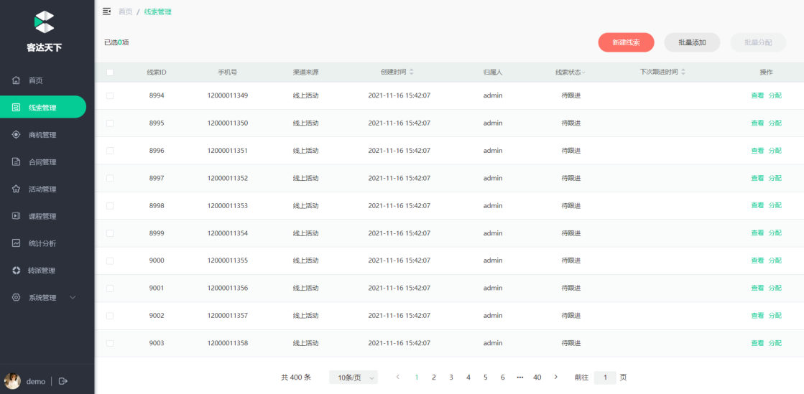
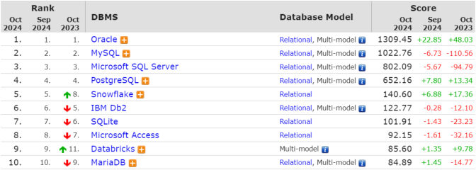
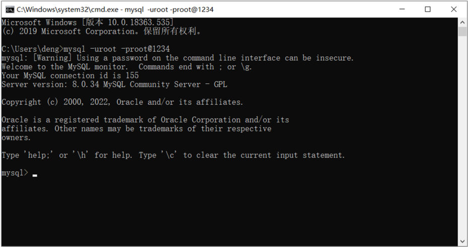
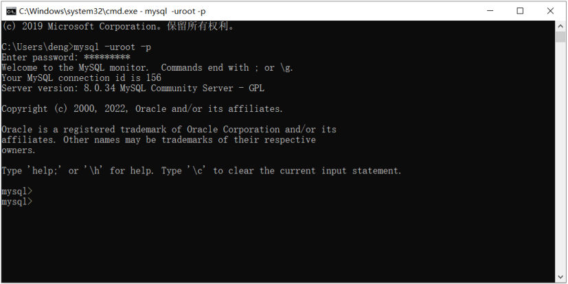
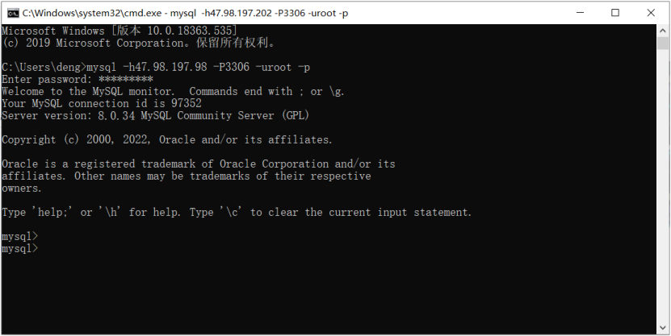

上一章的结尾（[39-IOC与DI详解](/posts/编程学习/javaweb学习笔记/39-ioc与di详解/)）把 Tlias 案例的 Controller、Service、Dao 三层都写通了，IOC 容器也配好了。但有个问题一直绕过去没回答：**Dao 层返回的那些数据，是从哪儿来的？**课程里的用户数据是写在 `UserDaoImpl` 代码里 `new` 出来的假数据——真实的项目里，数据要落到**数据库**。

这是第 5 章（后端 Web 基础·数据库）的第一篇。PPT 第 8 页把本章分成五块，本科目这一批笔记覆盖前两块：

| 章节模块（PPT 第 8 页原文） | 讲什么 | 本批笔记 |
| --- | --- | --- |
| **MySQL 概述** | 数据库是什么、MySQL 的安装与连接、数据模型 | **本篇（40）** |
| **SQL 语句** | DDL、DML、DQL 等语句怎么写 | [41](/posts/编程学习/javaweb学习笔记/41-sql分类与数据库操作/)-48 |
| **多表设计** | 多张表之间怎么设计 | 本章后面还会走到 |
| **多表查询** | 多张表连起来查 | 本章后面还会走到 |
| **事务** | 一组操作要么都成功、要么都失败 | 本章后面还会走到 |

PPT 第 9 页是这张目录的**收窄版**——把五块砍到"**MySQL概述 / SQL语句**"两块，本批笔记的 40-48 篇就落在这个范围里。

## Dao 层的数据该放在哪儿（PPT 第 1-3 页）

PPT 第 1-3 页是这一章的开场。先看第 2 页那三条分层职责——这就是[第 37 篇](/posts/编程学习/javaweb学习笔记/37-三层架构/)讲过的三层架构：

| 层 | 职责（PPT 第 2 页原话） |
| --- | --- |
| **Controller** | 接收请求、响应数据 |
| **Service** | 逻辑处理 |
| **Dao** | **数据访问** |

PPT 在 Dao 这一层旁边画了一个分叉，把"数据"的两种存法摆在一起：

| 数据的存法 | 结果（PPT 第 2 页原话） |
| --- | --- |
| 存进**文件** | **不便维护、管理** |
| 存进**数据库** | 这才是后端开发的标准做法 |

想象一下把员工数据写进一个 txt：想按"薪资大于 8000"筛人，得自己读文件、切字符串、比大小；两个人同时改同一个文件，谁覆盖谁说不清；文件坏了就是全丢。数据库要解决的就是这三件事——**统一的查询方式、并发下的数据一致、集中的管理与备份**。

PPT 第 3 页把这章的主题收拢成一句话：接下来讲的，就是"Web 后端开发"里的**数据库**。

## 什么是数据库（PPT 第 4-6 页）

PPT 第 4-6 页连翻三页讲同一个问题："**什么是数据库？**"，答案是三个概念。

### DB：数据库

> **数据库：DataBase（DB），是存储和管理数据的仓库。**

"仓库"这两个字很准：数据不是随便扔进去，而是**按固定的结构、分类存放**，要的时候能按条件取出来。PPT 第 4-5 页配的几张图就是"仓库里装的数据"在页面上的样子——你在网页上看到的商品、列表、记录，其实都是数据库里的数据被查出来、渲染上去的。


*图：PPT 第 4 页——京东的商品列表：每件商品的图片、名称、价格、评价数、店铺名，都是数据库里查出来的数据渲染到页面上的*


*图：PPT 第 5 页——客达天下后台的线索列表：一行就是一条记录（线索 ID、手机号、渠道来源、创建时间、归属人、状态……），这一张表格的背后就是一个数据库表*

### DBMS：数据库管理系统

> **数据库管理系统：DataBase Management System(DBMS)，操纵和管理数据库的大型软件。**

数据存在磁盘上、还要能被并发访问，总得有个"管家"：**DBMS 就是那个软件**。我们所有的操作（建库、建表、插数据、查数据）都是由它执行的——MySQL、Oracle 这些名字，指的就是具体某一款 DBMS 产品。

### SQL：操作关系型数据库的编程语言

> **SQL：Structured Query Language，操作关系型数据库的编程语言，定义了一套操作关系型数据库统一标准。**

三个概念串起来就是一条链：

| 概念 | 一句话 | 例子 |
| --- | --- | --- |
| **DB**（数据库） | 存储和管理数据的**仓库** | 名为 `db01` 的库 |
| **DBMS**（数据库管理系统） | **操纵和管理**数据库的大型软件 | MySQL、Oracle、SQL Server…… |
| **SQL**（结构化查询语言） | 操作关系型数据库的**编程语言**，定义了一套统一标准 | `show databases;`、`select * from emp;` |

> [!IMPORTANT]
> 这三者的关系是：**我们写 SQL → 交给 DBMS 去执行 → 数据落在 DB 里**。所以换个 DBMS（MySQL 换成 Oracle），大部分 SQL 写法照样通用——因为 SQL 是"**统一标准**"（PPT 第 7 页也是这么强调的），各家产品只在细节上有方言差异。

## 数据库产品一览（PPT 第 7 页）

PPT 第 7 页把市面上常见的数据库产品一字排开，每个后面都跟着一句定位：

| 产品 | 定位（PPT 第 7 页原文） |
| --- | --- |
| **Oracle** | **收费**的**大型**数据库，Oracle 公司的产品 |
| **SQL Server** | MicroSoft 公司**收费的中型**数据库，**C#、.net 等语言常使用** |
| **PostgreSQL** | **开源免费**的中小型数据库 |
| **DB2** | **IBM** 公司的**大型收费**数据库产品 |
| **SQLite** | **嵌入式**的**微型**数据库，如作为 **Android 内置数据库** |
| **MariaDB** | **开源免费**的中小型数据库 |
| **MySQL** | **开源免费**的中小型数据库（Sun 公司收购了 MySQL，Oracle 收购 Sun 公司） |


*图：PPT 第 7 页——DB-Engines 的数据库流行度排名前 10。PPT 上列的产品都能在这张榜里找到位置：Oracle、MySQL、SQL Server、PostgreSQL 占据前四，紧跟其后的是 Snowflake、Db2、SQLite、Microsoft Access、Databricks、MariaDB；榜单里 MySQL 的得分（1022.76）仅次于 Oracle*

**这门课为什么选 MySQL**：免费开源、安装包小、在中小型互联网项目里用得最多，而且语法标准、换到别的产品上也能迁移。企业里的对接方式也最省事——MySQL 服务端装在服务器上，本机随便装个客户端就能连（这一节讲连接）。

## MySQL 的安装（PPT 第 10-11、14 页）

PPT 第 10 页是章节导航（"MySQL 概述 01：安装 / 数据模型"），第 11 页才是版本说明。

### 两个版本，课程用社区版

| 版本 | 收费 | 技术支持（PPT 第 11 页原文） |
| --- | --- | --- |
| **商业版**（MySQL Enterprise Edition） | **收费，可以试用 30 天** | **官方提供技术支持** |
| **社区版**（MySQL Community Server） | **免费** | **MySQL 官方不提供技术支持** |

> 本课程采用的是 MySQL 的最新社区版（**MySQL Community Server 8.0.34**）
> 下载地址：<https://dev.mysql.com/downloads/mysql/>

本课程用的 MySQL 8.0.34 在资料包里有现成的解压版（`02. MySQL安装/mysql-8.0.34-winx64.zip`），**按资料里的文档操作**即可（PPT 第 14 页的步骤总结里也写了这一条）。


*图：PPT 第 12 页——安装完成后第一件事是连上去：`mysql -uroot -proot@1234` 回车即进入 MySQL 交互界面，能看到 `Server version: 8.0.34 MySQL Community Server - GPL` 这一行（顺便注意上面那行 Warning：把密码直接写在命令里有安全隐患）*

## MySQL 连接：命令行怎么连（PPT 第 12 页）

PPT 第 12 页给了连接语法：

```text
mysql –u用户名 –p密码 [-h数据库服务器IP地址 -P端口号]
```

| 参数 | 含义 | 不写时 |
| --- | --- | --- |
| `-u` | 数据库**用户名** | 必须给（课程用 `root`） |
| `-p` | **密码**（紧跟在 `-p` 后面；`-p` 后面不写东西则回车后单独提示输入） | 必须给 |
| `-h` | **数据库服务器 IP 地址** | 默认本机（`localhost`） |
| `-P` | **端口号**（注意是大写 P） | 默认 **3306** |

两种写法 PPT 里都演示了：`-p密码` 一行里带上密码（省事但会留 Warning），或者只写 `-p` 让程序再问一次。


*图：PPT 第 12 页——只写 `mysql -uroot -p` 时，回车后出现 `Enter password:`，**输入的内容不回显**（连星号都不显示）；密码正确就出现 `mysql>` 提示符，可以开始敲 SQL 了*

### 实测：中文数据导入时报 1366

> [!WARNING]
> 命令行客户端有一个很容易踩的坑（本机实测，MySQL 9.0.1）：**Windows 下命令行客户端的默认字符集不是 utf8mb4**，直接导入课程里带中文的 SQL 脚本会报错——
>
> ```text
> ERROR 1366 (HY000): Incorrect string value: '\x80\x90\xE5\xBA\xB8' for column 'name' at row 1
> ```
>
> 那些 `\x..` 就是中文被错误编码后的字节。**处理办法**：连接时显式指定字符集——
>
> ```bash
> # 本机实测用的连接方式（-h/-P 指向实验实例，平时连本机可以省略这两个参数）
> $ mysql --default-character-set=utf8mb4 -uroot -p -h127.0.0.1 -P3307 db01
> ```
>
> 加上 `--default-character-set=utf8mb4` 之后，同一份脚本导入正常，中文数据也能正常显示。**这条经验要记住**：以后凡是"通过命令行导入/导出含中文的数据"，先把字符集参数带上，否则会得到一堆乱码或 1366。

## 企业开发里怎么连（PPT 第 13 页）

PPT 第 13 页回答的是"企业开发使用方式"。真实场景和我们本机练手的差别在于：**MySQL 服务端不在自己电脑上**，而是在机房/云上的**数据库服务器**里，本机只装一个**客户端**，通过网络连过去。


*图：PPT 第 13 页——连远程数据库就是给 `-h` 和 `-P` 填上值：`mysql -h47.98.197.98 -P3306 -uroot -p`，这句话的意思是"连 47.98.197.98 这台机器 3306 端口上的 MySQL"*

命令行的用法在哪儿都一样，但企业里日常开发**不需要**每次敲命令——一般用**图形化客户端工具**（比如下一篇章要介绍的 DataGrip）来连数据库、写 SQL、看数据。PPT 第 14 页把这一段的总结压成两条：

| 步骤 | 做什么 |
| --- | --- |
| **MySQL 安装** | 根据文档操作 |
| **MySQL 连接** | `mysql -hxxx -Pxxx -uxxx -pxxx` |

## 数据模型（PPT 第 15-17 页）

PPT 第 15 页又翻了一次"安装 / 数据模型"这页导航，接下来讲本篇章最需要建立的一个印象：**数据在数据库里长什么样**。

### 关系型数据库：多张二维表

> **关系型数据库：建立在关系模型基础上，由多张相互连接的二维表组成的数据库。**

两个特点（PPT 第 16 页原文）：

1. **使用表存储数据，格式统一，便于维护。**
2. **使用 SQL 语言操作，标准统一，使用方便，可用于复杂查询。**

所谓"二维表"，就是行列规整的一张表格——**列是字段、行是一条记录**：


*图：PPT 第 16 页——一张"员工表"：表头是 编号 / 姓名 / 工作 / 部门 四个字段，下面每一行是一条员工记录；PPT 还配了一张"部门表"，两张表通过"部门"这一列关联起来，这就是"**多张相互连接的二维表**"*

PPT 第 16 页还画了一张关系图：**员工表**与**部门表**之间有一条连线——员工表里的"部门"字段指向部门表里的部门，两张表就"连接"起来了。这种关联（外键）是多表设计与多表查询的基础，本章后面会专门讲。

### 数据库 → 表 → 记录：数据是怎么存的

PPT 第 17 页给出整体结构，PPT 第 18 页的问答页把它压成了两句话：

| 层 | 是什么 | 对应到关系型数据库 |
| --- | --- | --- |
| **数据库（Database）** | 一个仓库 | 一台 MySQL 服务器上可以建**多个库**（如 `db01`、`db02`） |
| **表（Table）** | 库里的二维表 | 一个库里可以建**多张表**（员工表、部门表……） |
| **记录（Record）** | 表里的一行 | 一张表里可以存**多行数据** |

PPT 第 17 页那张结构图（PPT 里是用形状画的，这里按它的结构画成文字版）：

```text
客户端 ──( 写 SQL )──► 数据库服务器
                         ├── DBMS（MySQL 就是 DBMS）
                         ├── 数据库1
                         │     ├── 表1
                         │     └── 表2
                         └── 数据库2
                               ├── 表1
                               └── 表2
```

这张图有两个要点：

- **左半边是客户端**（命令行窗口、DataGrip、或者以后我们写的 Java 程序），它只会"发 SQL"；
- **右半边是数据库服务器**，DBMS 收到 SQL 后在某个**库**的某张**表**上执行；**表是在库里的，记录是在表里的**——所以后面写 SQL 之前总要先把"用哪个库"定下来（`use 库名`）。

### 问答回顾（PPT 第 18 页）

| 问题 | 答案 |
| --- | --- |
| **什么是关系型数据库？** | 由多张二维表组成的数据库（RDBMS） |
| **数据是如何在数据库中存储的？** | **数据库 → 表 → 数据（记录）** |

## 小结

| 问题 | 答案 |
| --- | --- |
| 数据为什么要存数据库而不是文件 | 文件存数据**不便维护、管理**（查询、并发、备份都是问题）；数据库是存储和管理数据的仓库，DBMS 提供统一的存取方式 |
| DB / DBMS / SQL 分别是什么 | **DB** 是存储和管理数据的**仓库**；**DBMS** 是**操纵和管理**数据库的大型软件（MySQL/Oracle 都是 DBMS）；**SQL** 是操作关系型数据库的**编程语言**，定义了一套统一标准 |
| 常见数据库产品 | Oracle（收费大型）、SQL Server（微软收费中型，C#/.net 常用）、PostgreSQL（开源免费中小型）、DB2（IBM 大型收费）、SQLite（嵌入式微型，Android 内置）、MariaDB（开源免费）、**MySQL（开源免费中小型，本课程选用）** |
| MySQL 两个版本的区别 | **商业版**收费、可试用 30 天、官方提供技术支持；**社区版**免费、官方不提供技术支持——课程用社区版 **8.0.34** |
| 命令行连接语法 | `mysql –u用户名 –p密码 [-h数据库服务器IP地址 -P端口号]`；`-h`/`-P` 不写就是本机 **3306** 端口；`-P` 是大写 |
| 中文导入报 1366 怎么办 | **本机实测（MySQL 9.0.1）**：命令行客户端默认字符集不是 utf8mb4，导入中文数据报 `ERROR 1366 (HY000): Incorrect string value: ...`，加上 **`--default-character-set=utf8mb4`** 即可 |
| 企业开发的连接方式 | MySQL 装在**数据库服务器**上，本机用客户端（命令行或图形化工具）远程连：`mysql -h47.98.197.98 -P3306 -uroot -p` |
| 关系型数据库是什么 | 建立在关系模型基础上、由**多张相互连接的二维表**组成的数据库；特点是**用表存数据、格式统一便于维护**，**用 SQL 操作、标准统一可用于复杂查询** |
| 数据是怎么存的 | **数据库 → 表 → 记录**；表在库里、记录在表里；客户端写 SQL → DBMS 在数据库服务器上执行 |

## 相关

- [下一篇：SQL分类与数据库操作](/posts/编程学习/javaweb学习笔记/41-sql分类与数据库操作/)

## 练习题

这一篇偏概念（DB/DBMS/SQL 是什么、MySQL 怎么连、数据模型长什么样），所以用**概念自测**代替裸写代码题：先合上文章自己讲一遍，再点开对答案。

### 一、知识回顾（读完直接做下面的实践题）

1. **数据的落脚点**：Dao 层（数据访问层）拿到的数据来自**数据库**；存进**文件**会**不便维护、管理**
2. **数据库（DB）**：DataBase，是**存储和管理数据的仓库**；**数据库管理系统（DBMS）**：DataBase Management System，**操纵和管理数据库的大型软件**（MySQL 就是一款 DBMS）
3. **SQL**：Structured Query Language，**操作关系型数据库的编程语言**，定义了一套操作关系型数据库的**统一标准**
4. **常见数据库产品**：Oracle（收费大型）、SQL Server（微软收费中型，C#/.net 常用）、PostgreSQL（开源免费中小型）、DB2（IBM 大型收费）、SQLite（嵌入式微型，Android 内置）、MariaDB（开源免费中小型）、**MySQL（开源免费中小型，本课程选用）**
5. **MySQL 两个版本**：**商业版**（MySQL Enterprise Edition）收费、**可试用 30 天**、官方提供技术支持；**社区版**（MySQL Community Server）**免费**、官方**不提供**技术支持；课程用社区版 **8.0.34**，下载地址 `https://dev.mysql.com/downloads/mysql/`
6. **连接语法**：`mysql –u用户名 –p密码 [-h数据库服务器IP地址 -P端口号]`；`-h`、`-P` 不写时默认本机 **3306** 端口；`-P` 是**大写**；只写 `-p` 则回车后单独提示 `Enter password:`，输入不回显
7. **本机实测的字符集坑（MySQL 9.0.1）**：命令行客户端默认字符集不是 utf8mb4，导入带中文的脚本报 **`ERROR 1366 (HY000): Incorrect string value`**；连接时加上 **`--default-character-set=utf8mb4`** 即可
8. **企业开发的连法**：MySQL 装在**数据库服务器**（机房/云）上，本机用客户端远程连，例：`mysql -h47.98.197.98 -P3306 -uroot -p`；日常开发更多用**图形化客户端工具**
9. **关系型数据库**：建立在关系模型基础上、由**多张相互连接的二维表**组成的数据库；两个特点——**用表存储数据，格式统一便于维护**；**用 SQL 语言操作，标准统一、使用方便、可用于复杂查询**
10. **数据怎么存**：**数据库 → 表 → 记录**；表头是**字段**，一行是一条**记录**；客户端写 SQL → **DBMS** 在数据库服务器上执行

### 二、概念自测

- [ ] **2-1 用一句话分别说清 DB、DBMS、SQL，并讲出三者的关系**
  说完再补一句：为什么 PPT 要把"整个软件"叫 DBMS，而不能直接说"MySQL 就是数据库"？

  > [!TIP]- 提示（先自己想，实在想不出再点开）
  > **一级 · 思路**：三个概念分别对应"仓库""管家""跟管家说话的语言"，最后要串成一条因果链
  > **二级 · 方法**：翻回"什么是数据库"那节的三段原文，注意每段的主语
  > **三级 · 骨架**：DB 是＿＿；DBMS 是＿＿软件；SQL 是＿＿语言；关系：我们写 ＿＿ → 交给 ＿＿ 执行 → 数据落在 ＿＿ 里

  > [!TIP]- 参考答案（做完再点开）
  > ① **DB（DataBase）**：存储和管理数据的**仓库**（数据真正存放的地方）；② **DBMS（DataBase Management System）**：**操纵和管理数据库的大型软件**，负责把 SQL 落到磁盘上；③ **SQL（Structured Query Language）**：操作关系型数据库的**编程语言**，定义了一套操作关系型数据库的**统一标准**。
  > 关系：**我们写 SQL → 交给 DBMS 执行 → 数据存在 DB 里**。
  > 不能直接说"MySQL 就是数据库"，是因为 MySQL 严格来说是**DBMS（管理数据库的软件）**：一台 MySQL 上可以建很多个**数据库**（`db01`、`db02`……）。把软件和它管理的对象混为一谈，后面讲"一个服务器上有多个库"时会绕不过弯来。

- [ ] **2-2 为什么要用数据库，而不是把数据写进文件？**
  结合三层架构里 Dao 层的职责回答，至少说出三点"文件存数据"的麻烦。

  > [!TIP]- 提示（先自己想，实在想不出再点开）
  > **一级 · 思路**：从"怎么查""好几个人一起改""数据别丢了"三个角度想
  > **二级 · 方法**：对应 PPT 第 2 页 Dao 旁边那句"文件：不便维护、管理"，再看数据库解决的三个问题
  > **三级 · 骨架**：① 查询：文件要＿＿，数据库只需＿＿；② 并发：文件会＿＿，数据库有＿＿；③ 管理：文件＿＿，数据库可以＿＿

  > [!TIP]- 参考答案（做完再点开）
  > Dao 层负责"**数据访问**"——数据放哪儿，决定了这一层好不好写。文件的问题：① **查询麻烦**：想筛"薪资 8000 以上、按入职时间排序"，得自己读文件、解析字符串、写排序，而数据库一条 SQL（`select ... where ... order by ...`）就完了；② **并发危险**：多人同时改同一个文件，后写的会覆盖先写的，数据库有并发控制和事务保证；③ **不好管理**：文件散落各处、没有统一结构，改动字段要全量改代码，数据库有明确的表结构（字段、类型、约束），还能集中备份、权限控制。
  > 一句话：文件"**不便维护、管理**"，而数据库是专门为"存和管理数据"造的仓库。

- [ ] **2-3 `mysql -uroot -p123456` 和 `mysql -uroot -p` 有什么区别？`-h`、`-P` 不写时连的是哪儿？**
  再顺带回答：为什么 `-P` 必须大写？

  > [!TIP]- 提示（先自己想，实在想不出再点开）
  > **一级 · 思路**：`-p` 后面"跟了东西"和"没跟东西"，程序的行为不一样；再看默认值
  > **二级 · 方法**：翻回连接语法那节的两张 PPT 截图，注意第二张里多了一行提示
  > **三级 · 骨架**：`-p123456` = 密码＿＿，会留一个 ＿＿ 警告；`-p` = 回车后出现 ＿＿，输入 ＿＿；默认连 ＿＿:＿＿；大写 `-P` 是因为小写 ＿＿ 已被占用

  > [!TIP]- 参考答案（做完再点开）
  > `mysql -uroot -p123456` 是**把密码直接写在命令行里**，一次回车就进去了，但 MySQL 会警告 `Using a password on the command line interface can be insecure`（密码会留在命令历史里，不安全）；`mysql -uroot -p` 是**只声明"我要输密码"**，回车后出现 `Enter password:`，此时输入的密码**不回显**，更安全。
  > `-h` 不写时默认连**本机（localhost）**，`-P` 不写时默认连 **3306** 端口。
  > `-P` 必须大写，是因为**小写 `-p` 已经被"密码"占用了**——MySQL 的参数区分大小写。

- [ ] **2-4 为什么导入课程脚本时中文会报 1366，怎么解决？**
  请把处理办法写成一条"以后每次都照做"的操作习惯。

  > [!TIP]- 提示（先自己想，实在想不出再点开）
  > **一级 · 思路**：报错里那串 `\x80\x90\xE5\xBA\xB8` 是"中文被按错误的编码处理"留下的痕迹，说明**两边的字符集没对齐**
  > **二级 · 方法**：报错原文是 `Incorrect string value ... for column 'name'`；连接命令里有一个可以指定客户端字符集的参数
  > **三级 · 骨架**：`mysql ＿＿ -uroot -p 库名`（把客户端字符集设成 utf8mb4）

  > [!TIP]- 参考答案（做完再点开）
  > 原因：**本机实测（MySQL 9.0.1）**，Windows 命令行客户端的默认字符集不是 utf8mb4，中文数据在"客户端 → 服务器"这条路上被按错误编码解释，于是服务器报
  > ```text
  > ERROR 1366 (HY000): Incorrect string value: '\x80\x90\xE5\xBA\xB8' for column 'name' at row 1
  > ```
  > 解决：连接时显式指定客户端字符集——
  > ```bash
  > $ mysql --default-character-set=utf8mb4 -uroot -p 库名
  > ```
  > 操作习惯：**凡是命令行下导入/导出带中文的数据，先把 `--default-character-set=utf8mb4` 带上**；如果表里已经存进了乱码数据，光改连接参数救不回来，得清掉重导。

- [ ] **2-5 用"数据库 → 表 → 记录"描述一下你脑子里的一台 MySQL 服务器**
  要求说清：服务器上可以有几个库、一个库里可以有几张表、库里没被 `use` 选中时 SQL 会执行在哪。

  > [!TIP]- 提示（先自己想，实在想不出再点开）
  > **一级 · 思路**：把 PPT 第 17 页那张结构图用文字复述一遍，从客户端出发
  > **二级 · 方法**：结构图的右半边是 DBMS + 多个库 + 每库多张表；`-h -P -u -p` 连上的是"服务器"，不是"某个库"
  > **三级 · 骨架**：一台服务器 = 一个 ＿＿ + 多个 ＿＿；一个库 = 多张 ＿＿；一张表 = 多行 ＿＿；不指定库时……（想想连接命令最后那个库名参数是干什么的）

  > [!TIP]- 参考答案（做完再点开）
  > 一台 MySQL **服务器**上跑着一个 **DBMS**，里面可以建**多个数据库**（`db01`、`db02`……以及 `mysql`、`sys` 这些系统库）；每个库里可以建**多张表**（员工表、部门表……）；每张表里存着**多行记录**，表头是字段。
  > 注意：`mysql -uroot -p` 连上的是**服务器**（此时还没有"当前库"）；要操作某张表，得先 `use 库名` 把"当前数据库"切成那个库（连接命令末尾也可以直接跟一个库名，等于连上就 `use` 它）。这就是下一篇要讲的 DDL-数据库那几条语句。

### 三、综合题

- [ ] **3-1 给一台陌生的机器做"数据库环境体检"**
  拿到一台装了 MySQL 的机器（没有文档），请按下面的步骤把环境摸清楚，并把每一步的结果记下来：
  1. **确认有客户端**：找到命令行的 MySQL 客户端程序，把它连上服务器（用户名 `root`，密码自己输，不要写在命令里）；
  2. **偷看服务器版本**：连接成功时界面会打出一行 `Server version: ...`，把版本号抄下来，并回答这是商业版还是社区版；
  3. **模拟踩坑**：你在这台机器上导入一份带中文的 SQL 脚本，报错信息是
     ```text
     ERROR 1366 (HY000): Incorrect string value: '\x80\x90\xE5\xBA\xB8' for column 'name' at row 1
     ```
     请写出原因和处理办法，并给出改好后的完整连接命令；
  4. **看仓库**：连上之后，先列出这台服务器上有哪些数据库；
  5. **分清系统库和业务库**：`information_schema`、`mysql`、`performance_schema`、`sys` 是随 MySQL 一起出现的**系统库**，其余是业务库；把两条清单分别抄下来；
  6. **说清层次**：用"数据库 → 表 → 记录"三层，说明这台服务器上每一层各有多少东西（库有几层含义、表要在库里才能建、记录要在表里才能存）；
  7. **画结构**：照着 PPT 第 17 页，把"客户端 - 数据库服务器（DBMS + 多个库 + 每库多张表）"的结构用文字画一遍，并标出"刚才那条连接命令"和"刚才那条列库语句"分别发生在哪一层。

  **涉及知识点**

  | 知识点 | 在这里的应用 |
  | --- | --- |
  | DB / DBMS / SQL | 列出的是**库**（DB），执行命令的是 **DBMS**（MySQL），你敲的是 **SQL** |
  | MySQL 版本 | 连接时打印的 `Server version` 就是版本号（社区版会带 `Community Server - GPL`） |
  | 字符集坑 | 1366 报错靠 `--default-character-set=utf8mb4` 解决 |
  | 连接语法 | `mysql -u用户名 -p [-h IP -P 端口]`，`-p` 后面不写密码更安全 |
  | 数据模型 | 数据库 → 表 → 记录；客户端 - DBMS - 数据库服务器 |

  > [!TIP]- 提示（先自己想，实在想不出再点开）
  > **一级 · 思路**：整条链路是"**连上去（顺带看清版本）→ 解决字符集问题 → 列出库 → 分辨系统库/业务库 → 说清层次**"；第 6、7 步是把结构图用自己的话复述
  > **二级 · 方法**：连接用 `mysql` 命令；列库用 `show databases`；看当前库用 `select database()`；字符集参数是 `--default-character-set=utf8mb4`
  > **三级 · 骨架**：`mysql ＿＿ -uroot -p` → `＿＿ databases;` → `use ＿＿; select ＿＿();`

  > [!TIP]- 参考答案（做完再点开）
  > 1. 连接命令（不把密码写在命令里）：
  >    ```bash
  >    $ mysql --default-character-set=utf8mb4 -uroot -p
  >    Enter password: ********
  >    ```
  > 2. 成功界面上能看到版本相关信息（PPT 第 12 页截图的样子）：
  >    ```text
  >    Your MySQL connection id is 156
  >    Server version: 8.0.34 MySQL Community Server - GPL
  >    ```
  >    `Community Server - GPL` 说明这是**社区版**（商业版会显示 `Enterprise`）。
  > 3. 1366 的原因是**客户端字符集不是 utf8mb4**（Windows 命令行客户端的默认设置），中文在路上被按错误编码解释；处理办法是连接时显式指定：
  >    ```bash
  >    $ mysql --default-character-set=utf8mb4 -uroot -p
  >    ```
  >    完整命令就是把 `--default-character-set=utf8mb4` 加在 `mysql` 后面（本机实测：不加就报 1366，加了就正常）。
  > 4. 列出所有数据库：
  >    ```text
  >    mysql> show databases;
  >    +--------------------+
  >    | Database           |
  >    +--------------------+
  >    | db01               |
  >    | information_schema |
  >    | mysql              |
  >    | performance_schema |
  >    | sys                |
  >    +--------------------+
  >    ```
  >    （本机实测（MySQL 9.0.1）的输出；业务库 `db01` 是练习用的库，其余四个是系统库）
  > 5. 系统库 4 个：`information_schema`（元数据）、`mysql`（用户与权限）、`performance_schema`（性能数据）、`sys`（性能视图）；业务库是剩下的那些（本例只有 `db01`）。系统库是 MySQL 自带的、平时不要动。
  > 6. 三层对应关系：**库**是"仓库"，一台服务器上可以有多个；**表**必须建在某个库里面（`use 库名` 之后建的表就属于它）；**记录**必须存在表里面（一行对应一条数据，表头是字段）。所以"库 → 表 → 记录"是一层套一层的包含关系。
  > 7. 文字版结构：
  >    ```text
  >    客户端（命令行 / 图形化工具 / Java 程序）
  >       │  写 SQL（第 4 步的 show databases; 就从这里发出）
  >       ▼
  >    数据库服务器（连接命令 -h/-P 指向的那台机器）
  >       ├── DBMS（MySQL）  ← 收到 SQL 后在这里执行
  >       ├── 数据库1（如 db01）
  >       │     ├── 表1
  >       │     └── 表2
  >       └── 数据库2
  >    ```
  >    连接命令发生在**客户端 → 数据库服务器**这一段（它只负责"把门打开"）；`show databases` 是**客户端发出、DBMS 执行**的一条 SQL，结果是从 DBMS 的元数据里读出来的。
