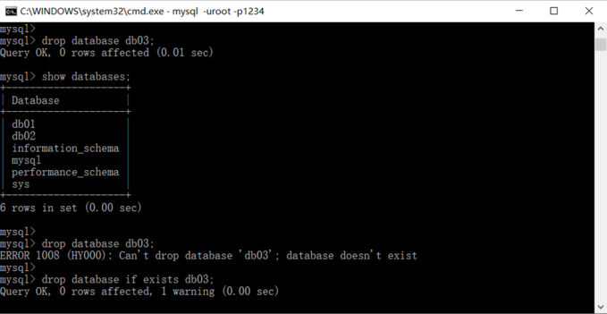
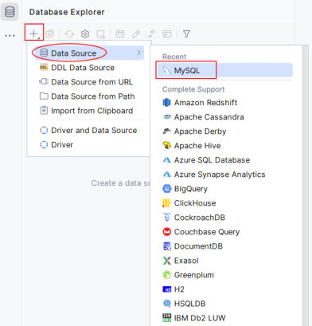
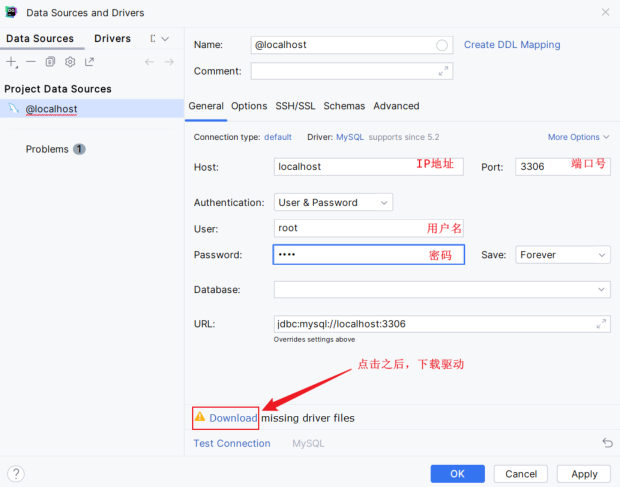

[上一篇](/posts/编程学习/javaweb学习笔记/40-数据库概述与mysql入门/)把 MySQL 装好、也连上了，但连上去之后呢？界面上只有一个 `mysql>` 提示符，**得会"说话"才行**——这门和数据库打交道的语言就是 SQL。

这一篇解决两件事：**SQL 都有哪些种类**（PPT 第 19-23 页的分类与导航），以及**第一类 DDL 里"数据库"这一层怎么操作**（PPT 第 24-25 页）。最后 PPT 第 26-28 页会解释为什么企业里更爱用图形化工具，并介绍 DataGrip。

## SQL 是什么、分成哪四类（PPT 第 19-21 页）

PPT 第 19-20 页是章节导航（"SQL 语句 02"），第 21 页给出定义：

> **SQL：一门操作关系型数据库的编程语言，定义操作所有关系型数据库的统一标准。**

注意两点："**所有**关系型数据库"和"**统一标准**"——这也是 [上一篇](/posts/编程学习/javaweb学习笔记/40-数据库概述与mysql入门/)里说的那句话的延伸：MySQL 里学的 SQL，换到 Oracle、PostgreSQL 上大体通用。SQL 按用途分成四类：

| 分类 | 全称 | 说明（PPT 第 21 页原文） |
| --- | --- | --- |
| **DDL** | Data **Definition** Language | **数据定义语言**，用来定义数据库对象（**数据库，表，字段**） |
| **DML** | Data **Manipulation** Language | **数据操作语言**，用来对数据库**表中的数据进行增删改** |
| **DQL** | Data **Query** Language | **数据查询语言**，用来**查询**数据库中表的**记录** |
| **DCL** | Data **Control** Language | **数据控制语言**，用来**创建数据库用户、控制数据库的访问权限** |

这张表要按"**操作对象**"来记，最不容易混：

| 分类 | 操作对象 | 典型关键字 | 本课程在哪讲 |
| --- | --- | --- | --- |
| **DDL** | 数据库、表、字段（**结构**） | `create` / `drop` / `alter` / `show` | 本篇（数据库）+ [42](/posts/编程学习/javaweb学习笔记/42-ddl表结构-创建与约束/)-44（表结构） |
| **DML** | 表里的**数据**（增删改） | `insert` / `update` / `delete` | 45 篇 |
| **DQL** | 表里的**记录**（查） | `select` | 46-48 篇 |
| **DCL** | 用户与权限 | `grant` / `revoke` 等 | 本课程不展开 |

PPT 第 21 页还配了一张架构图，把这些分类"贴"到了[上一篇](/posts/编程学习/javaweb学习笔记/40-数据库概述与mysql入门/)那张数据模型图上：

```text
客户端 ──► 数据库服务器
             ├── DBMS          ← DML / DQL 在这里作用于"表里的数据"
             ├── 数据库1        ← DDL 作用在"库"这一层
             │     ├── 表1      ← DDL 作用在"表"这一层
             │     └── 表2
             └── 数据库2
```

> [!IMPORTANT]
> 一句话区分 DDL 与 DML/DQL：**DDL 动的是"结构"（有什么库、有什么表、表里有哪些字段），DML/DQL 动的是"内容"（表里存了什么数据）**。所以后面建表、改字段用 DDL；插数据、改数据用 DML；查数据用 DQL。

## DDL-数据库：五条语法（PPT 第 24 页）

PPT 第 22-23 页是两张导航页，展示 DDL 被拆成三块：**数据库**（本篇）、**表结构-创建**（[42 篇](/posts/编程学习/javaweb学习笔记/42-ddl表结构-创建与约束/)）、**表结构-查询、修改、删除**（44 篇）。先看第一块——**数据库这一层的五条语法**（PPT 第 24 页原文，课程的 `SQL脚本.sql` 与它一致）：

```sql
-- 查询所有数据库
show databases;
-- 查询当前数据库
select database();
-- 使用/切换数据库
use 数据库名;
-- 创建数据库
create database [if not exists] 数据库名 [default charset utf8mb4];
-- 删除数据库
drop database [if exists] 数据库名;
```

PPT 把这一页的顺序总结成"**查询 – 使用 – 创建 – 删除**"，正好是日常操作的顺序（先看看有什么，再切过去用，要新建就建，不要了就删）。五条逐条拆开：

| 语句 | 作用 | 要点 |
| --- | --- | --- |
| `show databases;` | 列出**当前服务器上所有**数据库 | 系统库（`information_schema`、`mysql`、`performance_schema`、`sys`）也会一起列出来 |
| `select database();` | 显示**当前正在使用**的数据库 | 注意是带括号的函数写法；还没 `use` 过时结果是 `NULL` |
| `use 数据库名;` | **切换**当前数据库 | 命令行客户端只回一行 `Database changed`——它不会告诉你现在到底是哪个库，所以切换后用 `select database()` 确认 |
| `create database [if not exists] 数据库名 [default charset utf8mb4];` | **创建**数据库 | `if not exists` 让"库已存在"时不报错；`default charset` 指定字符集 |
| `drop database [if exists] 数据库名;` | **删除**数据库 | ⚠️ 库里的**所有表和数据都会一起删掉**；`if exists` 让"库不存在"时不报错 |

> [!WARNING]
> 删除数据库是**不可逆**操作：库删了，里面的表、表里的数据全没了。练习时删的是自己建的练习库没问题，**生产环境删库之前一定要确认备份**。

### 实测：报错长什么样（1007 / 1008）

课程源码 `SQL脚本.sql` 里最朴素的写法是 `create database db03;` 和 `drop database db03;`。**本机实测（MySQL 9.0.1）**把重复创建与删除不存在库这两种情况都跑了一遍：

| 操作 | 结果 |
| --- | --- |
| `create database db01;`（已存在） | `ERROR 1007 (HY000): Can't create database 'db01'; database exists` |
| `drop database db_not_exist;`（不存在） | `ERROR 1008 (HY000): Can't drop database 'db_not_exist'; database doesn't exist` |
| `create database if not exists db01;` | `Query OK, 0 rows affected, 1 warning (0.00 sec)`（不报错，只给一条 warning） |
| `drop database if exists db_not_exist;` | `Query OK, 0 rows affected, 1 warning (0.00 sec)` |


*图：PPT 第 26 页——命令行客户端里的实操：`show databases` 列出了 6 个库（`db01`、`db02` 加四个系统库），`drop database db03` 第一次 `Query OK`、再执行一次就报 `ERROR 1008 (HY000): Can't drop database 'db03'; database doesn't exist`，而加上 `if exists` 之后变成 `Query OK, 0 rows affected, 1 warning`——这就是 if exists / if not exists 存在的意义*

## 两个注意点（PPT 第 24-25 页）

PPT 第 24 页在语法下面写了"注意"，第 25 页用问答的形式又把它们问了一遍。

### 注意一：`database` 可以换成 `schema`

> 上述语法中的 **database，也可以替换成 schema**。如：`create schema db01;`

也就是说 `create database db01;` 和 `create schema db01;` 是一回事（schema 是"模式"的叫法，很多数据库产品用这个词）。课程里统一用 `database`，`SQL脚本.sql` 里也是 `database`，看别人代码时见到 `schema` 别不认识。

### 注意二：MySQL 8 默认字符集是 utf8mb4

> **MySQL8 版本中，默认字符集为 utf8mb4。**

所以严格来说 `default charset utf8mb4` 是"**显式写清楚**"的写法——不写也一样是 utf8mb4。但**建议写**：一是意图明确（别人一眼看出这个库用什么字符集），二是万一环境不同、默认值不一样，也不会踩到 [上一篇](/posts/编程学习/javaweb学习笔记/40-数据库概述与mysql入门/)那个 1366 的坑。

下面是 PPT 第 25 页的两问：

| 问题（PPT 第 25 页） | 答案 |
| --- | --- |
| **同一个数据库服务器中，数据库的名字是否可以相同？** | **不可以**（重名会报 `ERROR 1007 ... database exists`，也就是上面实测的那条） |
| **MySQL 8 版本默认的字符集是什么？** | **utf8mb4**（对应写法 `default charset utf8mb4`） |

## 命令行客户端的三个痛点（PPT 第 26 页）

PPT 第 26 页把命令行客户端的问题列成三条：

| 痛点（PPT 第 26 页原文） | 具体表现 |
| --- | --- |
| **无提示** | 关键字、表名、字段名全靠记，敲错了只能自己看报错 |
| **操作繁琐** | 想看表结构、改数据都得手敲语句，多表操作更麻烦 |
| **无历史记录** | 关掉窗口，之前敲过的 SQL 就找不回来了 |

这三条决定了企业里日常开发的做法：**用图形化客户端工具连数据库**（PPT 第 26 页标题就是"MySQL 客户端工具"）。命令行仍然要会——服务器上排障、写脚本、临时查个数都靠它，只是不必拿它当日常主力。

## DataGrip：图形化客户端（PPT 第 27-28 页）

PPT 第 27 页的原文：

> **介绍**：DataGrip 是 **JetBrains** 旗下的一款数据库管理工具，是管理和开发 **MySQL、Oracle、PostgreSQL** 的理想解决方案。
> **官网**：<https://www.jetbrains.com/zh-cn/datagrip/>
> **安装**：参考资料中提供的《DataGrip 安装手册》

三个痛点它分别对应解决：**有智能提示**（关键字、表名、字段名、函数名边打边提示）、**图形化操作**（新建表、改数据点点鼠标，也能直接写 SQL 并瞬间出结果）、**有历史记录**（每条执行过的语句都留档，控制台日志可查）。课程用的版本是资料包里的 `datagrip-2024.1.1.exe`。

PPT 第 28 页演示的是"**用 DataGrip 连上 MySQL**"这两步。

第一步：打开 DataGrip 的 **Database Explorer**，点 `+` → `Data Source` → 选 **MySQL**：


*图：PPT 第 28 页——在 DataGrip 里新建数据源：Database Explorer 面板点 `+`，选 Data Source → MySQL（Recent 里直接就有）*

第二步：在连接配置页填四样东西，然后下载驱动：


*图：PPT 第 28 页——DataGrip 的连接配置页：Host 填 IP 地址、Port 填端口号（本机是 localhost:3306）、User 填用户名、Password 填密码，下面的 URL 会自动拼成 `jdbc:mysql://localhost:3306`；右下方标红的位置要点一下 Download，把驱动下下来才能连通*

对照 [上一篇](/posts/编程学习/javaweb学习笔记/40-数据库概述与mysql入门/)的命令行连接，这两个界面填的其实是同一组信息：

| 命令行参数 | DataGrip 里对应的框 |
| --- | --- |
| `-h` 后的 IP | **Host** |
| `-P` 后的端口 | **Port** |
| `-u` 后的用户名 | **User** |
| `-p` 后的密码 | **Password** |

连上之后，左边的 Database Explorer 会把"库 → 表"的树展开给你看，写 SQL 就用它自带的查询控制台（会带上"在哪个库执行"的上下文）——**本篇后面练习题的 SQL 既可以在命令行里跑，也可以在 DataGrip 的查询控制台里跑**。

## 小结

| 问题 | 答案 |
| --- | --- |
| SQL 是什么 | 一门操作关系型数据库的编程语言，定义了操作**所有**关系型数据库的**统一标准** |
| SQL 四大分类 | **DDL**（数据定义语言，定义数据库对象：数据库、表、字段）、**DML**（数据操作语言，对表中数据增删改）、**DQL**（数据查询语言，查询表中记录）、**DCL**（数据控制语言，创建用户、控制访问权限） |
| DDL 操作数据库的五条语法 | `show databases;`（查所有库）、`select database();`（查当前库）、`use 数据库名;`（切换）、`create database [if not exists] 库名 [default charset utf8mb4];`（创建）、`drop database [if exists] 库名;`（删除） |
| 怎么让建库/删库"不报错" | 创建时加 **`if not exists`**，删除时加 **`if exists`**；已存在/不存在时只给一条 warning |
| **本机实测（MySQL 9.0.1）** | 重复建库 → `ERROR 1007 (HY000): Can't create database 'db01'; database exists`；删不存在的库 → `ERROR 1008 (HY000): Can't drop database 'db_not_exist'; database doesn't exist` |
| database 与 schema | 语法里的 `database` 可以换成 **`schema`**（如 `create schema db01;`），效果一样 |
| MySQL 8 默认字符集 | **utf8mb4**，所以 `default charset utf8mb4` 可以显式写上，也可以省略 |
| 同一台服务器上库名能重复吗 | **不能**（重名报 1007） |
| 命令行客户端的三个痛点 | **无提示**、**操作繁琐**、**无历史记录** → 企业里用图形化工具 |
| DataGrip 是什么 | **JetBrains** 旗下的数据库管理工具，官网 `https://www.jetbrains.com/zh-cn/datagrip/`；连库要填 Host（IP）、Port（端口）、User（用户名）、Password（密码），并**下载驱动** |

## 相关

- [上一篇：数据库概述与MySQL入门](/posts/编程学习/javaweb学习笔记/40-数据库概述与mysql入门/)
- [下一篇：DDL表结构-创建与约束](/posts/编程学习/javaweb学习笔记/42-ddl表结构-创建与约束/)

## 练习题

### 一、知识回顾（读完直接做下面的实践题）

1. **SQL**：一门操作关系型数据库的编程语言，定义操作**所有**关系型数据库的**统一标准**
2. **四分类**：**DDL**（Data Definition Language，数据定义语言——定义数据库对象：**数据库、表、字段**）、**DML**（Data Manipulation Language，数据操作语言——对表中数据**增删改**）、**DQL**（Data Query Language，数据查询语言——**查询**表中记录）、**DCL**（Data Control Language，数据控制语言——**创建数据库用户、控制访问权限**）
3. **操作对象区分法**：DDL 动**结构**（库/表/字段），DML 与 DQL 动**内容**（表里的数据/记录）
4. **DDL-数据库五条**：`show databases;`、`select database();`、`use 数据库名;`、`create database [if not exists] 数据库名 [default charset utf8mb4];`、`drop database [if exists] 数据库名;`
5. **顺序**：PPT 总结成"**查询 – 使用 – 创建 – 删除**"
6. **两个"不报错"参数**：建库加 **`if not exists`**（已存在时不报错）、删库加 **`if exists`**（不存在时不报错），都只给一条 warning
7. **本机实测（MySQL 9.0.1）**：重复建库报 **`ERROR 1007 (HY000): Can't create database 'db01'; database exists`**；删不存在的库报 **`ERROR 1008 (HY000): Can't drop database 'db_not_exist'; database doesn't exist`**
8. **两个注意点**：① 语法里的 `database` 可以换成 **`schema`**（`create schema db01;` 效果相同）；② **MySQL 8 默认字符集是 utf8mb4**
9. **同一服务器上库名不能重复**（所以建库前先 `show databases` 看一眼，或者直接带 `if not exists`）
10. **命令行客户端的三个痛点**：**无提示**、**操作繁琐**、**无历史记录**；企业里用**图形化工具**——课程用 **DataGrip**（JetBrains 出品，官网 `https://www.jetbrains.com/zh-cn/datagrip/`），连库填 **Host / Port / User / Password** 并下载驱动

### 二、裸写题

- [ ] **2-1 把服务器上的库"看清楚、切过去"**
  连上 MySQL 之后，依次完成三件事：① 列出这台服务器上现有的**所有数据库**；② 显示**当前正在使用**的是哪个数据库；③ 切换到 `db01` 库，并再确认一次当前库。
  （练习文件 `test_41_数据库操作.sql` 的题目 2-1 处，做完把实际结果抄在注释里。）

  > [!TIP]- 提示（先自己想，实在想不出再点开）
  > **一级 · 思路**：这三件事都是"**库层面**"的操作（还没碰到表），各有一条固定命令；第 ③ 步切完要**再查一次**才能证明切成功了
  > **二级 · 方法**：列所有库用 `show databases`；查当前库用 `select database()`（注意带括号）；切换用 `use 库名`
  > **三级 · 骨架**：`＿＿ databases;` → `select ＿＿();` → `＿＿ db01;` → `select ＿＿();`

  > [!TIP]- 参考答案（做完再点开）
  > ```sql
  > -- ① 列出所有数据库
  > show databases;
  > -- ② 显示当前数据库
  > select database();
  > -- ③ 切换到 db01 并确认
  > use db01;
  > select database();
  > ```
  > 本机实测（MySQL 9.0.1）的对应输出：
  > ```text
  > mysql> show databases;
  > +--------------------+
  > | Database           |
  > +--------------------+
  > | db01               |
  > | information_schema |
  > | mysql              |
  > | performance_schema |
  > | sys                |
  > +--------------------+
  > mysql> select database();
  > +------------+
  > | database() |
  > +------------+
  > | NULL       |
  > +------------+
  > mysql> use db01;
  > Database changed
  > mysql> select database();
  > +------------+
  > | database() |
  > +------------+
  > | db01       |
  > +------------+
  > ```
  > 两个细节：① `select database()` 在前两行返回 **NULL**，说明"连上服务器"不等于"选中了某个库"（连接命令末尾跟一个库名，就等于连上后自动 `use` 它）；② 后四个 `information_schema`、`mysql`、`performance_schema`、`sys` 是**系统库**，MySQL 自带，别去动。

- [ ] **2-2 建一个库，再把它删掉（要求都不报错）**
  写一组语句：① 创建一个名为 `db_test` 的数据库，**字符集显式指定为 utf8mb4**，并且**它已经存在时不要报错**；② 列出所有数据库确认它在里面；③ 切过去确认当前库；④ 删除 `db_test`，**它不存在时不要报错**；⑤ 再列一次确认它没了。
  （对应练习文件题目 2-2。）

  > [!TIP]- 提示（先自己想，实在想不出再点开）
  > **一级 · 思路**：①④ 的关键在"**容错参数**"——让语句在对象已存在（或不存在）时安静地跳过而不是报错；②③⑤ 就是 2-1 用过的那几条
  > **二级 · 方法**：建库 `create database [if not exists] 库名 [default charset 字符集];`；删库 `drop database [if exists] 库名;`
  > **三级 · 骨架**：`create database ＿＿ db_test ＿＿ utf8mb4;` … `＿＿ database ＿＿ db_test;`

  > [!TIP]- 参考答案（做完再点开）
  > ```sql
  > -- ① 创建库（存在则跳过，显式指定字符集）
  > create database if not exists db_test default charset utf8mb4;
  > -- ② 确认它在列表里
  > show databases;
  > -- ③ 切过去并确认
  > use db_test;
  > select database();
  > -- ④ 删除库（不存在则跳过）
  > drop database if exists db_test;
  > -- ⑤ 确认它没了
  > show databases;
  > ```
  > 要点：`create database` 完整语法是 `create database [if not exists] 数据库名 [default charset utf8mb4];`——后面的括号里都是**可选部分**，`[]` 不出现在真正执行的语句里。`if not exists` / `if exists` 让"重复建""删不存在的"都只给 `1 warning`（见本篇实测表），非常适合写在脚本里反复执行。

- [ ] **2-3 读懂这两条报错，并改到不报错**
  同一台服务器上操作时，出现了两条报错：
  ```text
  ① ERROR 1007 (HY000): Can't create database 'db_test'; database exists
  ② ERROR 1008 (HY000): Can't drop database 'db_xxx'; database doesn't exist
  ```
  请分别写出：原因是什么、加上哪个关键字后就不报了、改好后的完整语句是什么。
  （对应练习文件题目 2-3。）

  > [!TIP]- 提示（先自己想，实在想不出再点开）
  > **一级 · 思路**：两条报错都在说"你这个对象的状态和你要求的动作冲突了"——一条是"已经有了还让我建"，一条是"根本没有还让我删"
  > **二级 · 方法**：建库语句可以带 `if not exists`；删库语句可以带 `if exists`
  > **三级 · 骨架**：`create database ＿＿ 库名 [default charset utf8mb4];` / `drop database ＿＿ 库名;`

  > [!TIP]- 参考答案（做完再点开）
  > ① **原因**：这个库里已经存在一个叫 `db_test` 的数据库，`create database` 不做覆盖（这也印证了"同一个服务器上库名不能重复"）；**不报错的写法**：加上 `if not exists`——
  > ```sql
  > create database if not exists db_test default charset utf8mb4;
  > ```
  > ② **原因**：服务器上根本没有叫 `db_xxx` 的库，`drop database` 找不到对象（注意它**不会**当成"已经删掉了"而放过）；**不报错的写法**：加上 `if exists`——
  > ```sql
  > drop database if exists db_xxx;
  > ```
  > 加上之后，重复建库、删不存在的库都只返回 `Query OK, 0 rows affected, 1 warning (0.00 sec)`。**本机实测（MySQL 9.0.1）**的原始报错就是题面这两条，`SQL脚本.sql` 里最朴素的 `create database db03;` / `drop database db03;` 就是会报错的那种写法。

### 三、综合题

- [ ] **3-1 从命令行到 DataGrip：把一个练习库从零准备出来**
  照着课程的做法走一遍完整流程（命令行和图形化工具**都要练**）：
  1. **命令行连上**：用 `mysql` 客户端连上服务器（用户名 `root`，密码自己输，别写在命令里）；
  2. **先看有什么**：列出所有数据库，在注释里写下业务库和系统库各是哪些；
  3. **建练习库**：创建一个名为 `db_practice` 的数据库（字符集显式 utf8mb4，已存在时不报错），再列一次库确认它出现了；
  4. **切过去**：切换到 `db_practice`，确认当前库；
  5. **在 DataGrip 里也连一份**：打开 DataGrip → Database Explorer 点 `+` → Data Source → MySQL，Host / Port / User / Password 分别该填什么？对照第 1 步的命令行参数写出来；记得点一次驱动下载；
  6. **在 DataGrip 里验证**：用它的查询控制台执行一次"列出所有数据库"，确认能看到第 3 步建的 `db_practice`；
  7. **收尾**：删掉 `db_practice`（不存在时不报错），再列一次库确认没了；
  8. **答两问**：① 命令行连库填的 `-h -P -u -p` 和 DataGrip 里填的四个框是怎么对应的？② 为什么建库、删库都建议带上 `if not exists` / `if exists`？

  **涉及知识点**

  | 知识点 | 在这里的应用 |
  | --- | --- |
  | SQL 分类 | `create` / `drop` / `show` / `use` 都属于 **DDL**（作用在"库"这一层） |
  | 五条语法 | `show databases`、`select database()`、`use`、`create database`、`drop database` |
  | 容错参数 | `if not exists` / `if exists` 让脚本可重复执行 |
  | database 与 schema | 两种写法效果相同 |
  | 客户端工具的痛点 | 命令行无提示、繁琐、无历史 → DataGrip 补齐 |
  | DataGrip 连接 | Host / Port / User / Password + 下载驱动 |

  > [!TIP]- 提示（先自己想，实在想不出再点开）
  > **一级 · 思路**：整体是"**连上 → 看现状 → 建库 → 用库 → 换图形化工具再连一遍 → 删库收尾**"；第 5、8 步考的是"命令行参数与图形界面四件套的对应关系"
  > **二级 · 方法**：列库 `show databases`；建库 `create database if not exists 库名 default charset utf8mb4`；切库 `use 库名`；查当前库 `select database()`；删库 `drop database if exists 库名`；DataGrip 里点是 `+` → `Data Source` → `MySQL`
  > **三级 · 骨架**：`create database ＿＿ db_practice ＿＿ utf8mb4;` → `use ＿＿; select ＿＿();` → DataGrip：Host=IP、Port=＿＿、User=＿＿、Password=＿＿

  > [!TIP]- 参考答案（做完再点开）
  > 1. 命令行连接（带字符集参数，避免中文报 1366）：
  >    ```bash
  >    $ mysql --default-character-set=utf8mb4 -uroot -p
  >    ```
  > 2. 列库（本机实测（MySQL 9.0.1）输出）：
  >    ```text
  >    mysql> show databases;
  >    +--------------------+
  >    | Database           |
  >    +--------------------+
  >    | db01               |
  >    | information_schema |
  >    | mysql              |
  >    | performance_schema |
  >    | sys                |
  >    +--------------------+
  >    ```
  >    业务库：`db01`；系统库：`information_schema`、`mysql`、`performance_schema`、`sys`。
  > 3. 建库 + 确认：
  >    ```sql
  >    create database if not exists db_practice default charset utf8mb4;
  >    show databases;
  >    ```
  > 4. 切库 + 确认：
  >    ```sql
  >    use db_practice;
  >    select database();   -- 返回 db_practice
  >    ```
  > 5. DataGrip 的四个框：**Host** 填数据库服务器 IP（本机就是 `localhost`）↔ 命令行的 `-h`；**Port** 填 `3306` ↔ 命令行的 `-P`；**User** 填 `root` ↔ 命令行的 `-u`；**Password** 填密码 ↔ 命令行的 `-p`。URL 会自动拼成 `jdbc:mysql://localhost:3306`；**要点一下 Download 把驱动下下来**，否则连不上。
  > 6. DataGrip 查询控制台里执行 `show databases;`，结果里能看到 `db_practice`（DataGrip 是把同一条 SQL 发给同一个 DBMS，界面不同而已）。
  > 7. 删库 + 确认：
  >    ```sql
  >    drop database if exists db_practice;
  >    show databases;
  >    ```
  > 8. 两问：
  >    ① 一一对应关系：`-h`→Host、`-P`→Port、`-u`→User、`-p`→Password（命令行还有 `--default-character-set=utf8mb4`，DataGrip 一般在驱动配置里带字符集，Windows 下不容易出 1366）；
  >    ② 因为 `if not exists` / `if exists` 让语句变成**幂等**的——重复执行同一份脚本不会中断（只给一条 warning）。在做练习、写初始化脚本、反复部署时非常实用；不加的话第二次执行就会报 1007 / 1008 把脚本打断。
