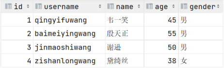

[上一篇](/posts/编程学习/javaweb学习笔记/41-sql分类与数据库操作/)把"数据库"这一层练完了：建库、切库、删库。但库本身不存数据——**数据最终落在表里**，所以紧接着要会的一步是：**把表建出来**。

PPT 第 29 页的导航页把 DDL 拆成三块，本篇正好居中：

| DDL 的三块（PPT 第 29 页导航） | 讲什么 | 哪一篇 |
| --- | --- | --- |
| **数据库** | 库的增删改查五条语法 | [41 篇](/posts/编程学习/javaweb学习笔记/41-sql分类与数据库操作/) |
| **表结构-创建** | `create table` 与约束 | **本篇（42）** |
| **表结构-查询、修改、删除** | `desc`、`show create table`、`alter`、`drop table` | 44 篇 |

## 建表的完整语法（PPT 第 30 页）

PPT 第 30 页给的语法（把 PPT 的排版理一下）：

```sql
create table 表名(
    字段1 字段类型 [约束] [comment 字段1注释],
    ......
    字段2 字段类型 [约束] [comment 字段2注释]
)[comment 表注释];
```

拆成五块看，每块各管一件事：

| 语法部分 | 作用 | 说明 |
| --- | --- | --- |
| `create table 表名` | 建表并起名 | 表必须建在**当前数据库**里（先 `use 库名`） |
| `字段名` | 表头（列名） | 多个字段之间用**逗号**分隔，**最后一个字段后面不加逗号** |
| `字段类型` | 这一列存什么形态的数据 | 完整清单在 43 篇（数值、字符串、日期时间三类） |
| `[约束]` | 限制这一列能存什么值 | 可选、可叠加——本篇重点 |
| `[comment 注释]` | 给**字段**写说明 | 可选，但企业里**强烈建议写**（表结构自解释） |
| `)[comment 表注释]` | 给**整张表**写说明 | 可选，写在**括号外面**，别跟字段注释写混 |

课程 `SQL脚本.sql` 里最朴素的一张表（**没有任何约束**），注释把每一列的用途写清了：

```sql
-- 创建表(无约束)
create table user(
    id int comment 'ID, 唯一标识',
    username varchar(50) comment '用户名',
    name varchar(10) comment '姓名',
    age int comment '年龄',
    gender char(1) comment '性别'
) comment '用户信息表';
```

这张表**能建起来，但管不住数据**：id 可以重复、用户名可以重名、姓名可以为空、性别可以乱填。问题出在"没有约束"，也正是 PPT 第 31 页要补的东西。

> [!TIP]
> 语法里的 `[ ]` 表示"可选"，**真正写 SQL 时不要敲方括号**。比如 `[comment 字段注释]` 的可选部分，写的时候就是 `comment '用户名'`。

## 约束：让数据库自己把关（PPT 第 31 页）

PPT 第 31 页先把定义和目的说清楚：

> **约束：约束是作用于表中字段上的规则，用于限制存储在表中的数据。**
> **目的：保证数据库中数据的正确性、有效性和完整性。**

换成开发视角：**校验不能只靠后端代码**。页面上的表单校验会被绕过（改请求、写脚本直接调接口），所以"用户名不能重复""性别不能是空"这类规则，还要在**数据库这一层**再拦一次——这就是约束。PPT 第 31 页给出五类约束：

| 约束 | 描述（PPT 第 31 页原文） | 关键字 |
| --- | --- | --- |
| **非空约束** | 限制该字段值**不能为 null** | `not null` |
| **唯一约束** | 保证字段的所有数据都是**唯一、不重复**的 | `unique` |
| **主键约束** | 主键是一行数据的**唯一标识**，要求**非空且唯一** | `primary key` |
| **默认约束** | 保存数据时，如果**未指定该字段值，则采用默认值** | `default` |
| **外键约束** | 让**两张表的数据建立连接**，保证数据的**一致性和完整性** | `foreign key` |

PPT 这一页还画了张示意图：一个个字段旁边标着它要加的约束（"**唯一标识**""**唯一**""**非空**""**默认:男**"），下面就是在这些规则下存出来的一张标准用户表：


*图：PPT 第 30-31 页——按建表语句存出来的 `user` 表：`username` 不允许重复（`qingyifuwang`、`baimeiyingwang`、`jinmaoshiwang`、`zishanlongwang` 一个不重）、`name` 不允许为空、`gender` 没填的时候自动就是"男"——表里的数据就是这些约束在长期把关的结果*

### 五类约束逐条看

**① 非空约束 `not null`**：这一列**必须给值**。适合"业务上不可能为空"的字段——姓名、用户名、手机号。没给值会直接报错：

```text
ERROR 1048 (23000): Column 'name' cannot be null
```

**② 唯一约束 `unique`**：这一列的值**不允许重复**（但**允许为 NULL**，且多个 NULL 不冲突）。适合用户名、手机号这类"天然不重复"的业务字段。重复了会报：

```text
ERROR 1062 (23000): Duplicate entry 'zhangsan' for key 'user.username'
```

**③ 主键约束 `primary key`**：一行数据的**唯一标识**，等于"`not null` + `unique`"。一张表**只能有一个主键**，通常就是第一列 `id`。主键重复会报：

```text
ERROR 1062 (23000): Duplicate entry '1' for key 'user.PRIMARY'
```

**④ 默认约束 `default`**：插入时**不写这一列**，就自动填默认值。适合"绝大多数情况都一样"的字段——密码默认 `123456`、性别默认 `'男'`、状态默认 `1`。**本机实测（MySQL 9.0.1）**：不写 `gender` 插入一行，查出来 `gender` 就是 `'男'`。

**⑤ 外键约束 `foreign key`**：让**两张表的数据建立连接**（比如员工表里的"部门"必须是部门表里真实存在的部门），保证数据的一致性。它牵扯到两张表的设计，本章后面对**多表设计**时会专门展开，这一篇先记住它的作用和关键字。

### 给 user 表补上约束

把约束加进建表语句（课程 `SQL脚本.sql` 的"创建表(约束)"一版），就成了这样：

```sql
-- 创建表(约束)
create table user(
    id int primary key auto_increment comment 'ID, 唯一标识', -- 主键约束 auto_increment
    username varchar(50) not null unique comment '用户名', -- 非空 唯一
    name varchar(10) not null comment '姓名', -- 非空
    age int comment '年龄',
    gender char(1) default '男' comment '性别' -- 默认
) comment '用户信息表';
```

对照着读：`id` 是主键且自增；`username` 既不能空又不能重；`name` 不能空；`gender` 不填给"男"；`age` 什么约束都没加（可以为空，这是允许的）。

> [!IMPORTANT]
> **一个字段可以加多个约束**，约束之间**用空格分隔**（`username varchar(50) not null unique` 就是两个约束叠在一列上）。写的时候顺序不影响效果，习惯上把 `not null` 写在 `unique`、`primary key` 前面。

### 自增 `auto_increment`

主键 `id` 每次都自己写会很烦，`auto_increment` 就是让数据库**自动发号**：

- 加在**主键**上（MySQL 里 `auto_increment` 必须是键的一部分）；
- 插入时**这一列传 NULL（或干脆不写这一列）**，数据库就自动分配下一个号：1、2、3……
- **删掉的行不会把号还回来**——**本机实测（MySQL 9.0.1）**：插入两条得 id=1、2，删掉 id=1 再插一条，新数据拿到的是 **id=3**（自增接着之前的最大值往下发）。

### 约束到底落到哪：两种查看方式

建完表最该做的一件事是"回头验一眼"。**本机实测（MySQL 9.0.1）**用 `show create table` 和 `desc` 两种方式看同一张 `user` 表。

`show create table user;` 看到的是**完整的建表语句**——约束都在：

```sql
CREATE TABLE `user` (
  `id` int NOT NULL AUTO_INCREMENT COMMENT 'ID, 唯一标识',
  `username` varchar(50) NOT NULL COMMENT '用户名',
  `name` varchar(10) NOT NULL COMMENT '姓名',
  `age` int DEFAULT NULL COMMENT '年龄',
  `gender` char(1) DEFAULT '男' COMMENT '性别',
  PRIMARY KEY (`id`),
  UNIQUE KEY `username` (`username`)
) ENGINE=InnoDB DEFAULT CHARSET=utf8mb4 COLLATE=utf8mb4_0900_ai_ci COMMENT='用户信息表'
```

读法：字段那句里出现了 `NOT NULL`、`AUTO_INCREMENT`、`DEFAULT`；**主键和唯一约束则被提到语句末尾单独声明**——`PRIMARY KEY (`id`)` 和 `UNIQUE KEY `username` (`username`)`。表尾的 `ENGINE=InnoDB`、`DEFAULT CHARSET=utf8mb4` 是 MySQL 自动补上的建表选项（字符集就是[上一篇](/posts/编程学习/javaweb学习笔记/41-sql分类与数据库操作/)讲的 utf8mb4）。

`desc user;` 看到的是**结构表格**，更紧凑——约束体现在 `Null`、`Key`、`Default`、`Extra` 四列上：

```text
+----------+-------------+------+-----+---------+----------------+
| Field    | Type        | Null | Key | Default | Extra          |
+----------+-------------+------+-----+---------+----------------+
| id       | int         | NO   | PRI | NULL    | auto_increment |
| username | varchar(50) | NO   | UNI | NULL    |                |
| name     | varchar(10) | NO   |     | NULL    |                |
| age      | int         | YES  |     | NULL    |                |
| gender   | char(1)     | YES  |     | 男      |                |
+----------+-------------+------+-----+---------+----------------+
```

逐列对照一下就明白约束"落"在哪了：

| 列 | 值 | 含义 |
| --- | --- | --- |
| `Null` | **NO** / YES | **NO** 说明有 `not null` 约束（id、username、name 都是 NO）；YES 说明可以为空 |
| `Key` | **PRI** / **UNI** / 空 | **PRI** = 主键，**UNI** = 唯一约束；`name` 那里空的，说明它只有非空、没有唯一 |
| `Default` | `男` / `NULL` | 有**默认约束**的列会显示默认值（gender 显示"男"） |
| `Extra` | `auto_increment` | 有**自增**的列表在这里 |

### 约束生效的实测记录

把违规数据往表里插，就能看见数据库在"把关"（都是**本机实测（MySQL 9.0.1）**的原文）：

| 操作 | 结果 | 说明 |
| --- | --- | --- |
| 插入时不写 `gender` | `gender` 自动得到 **'男'** | 默认约束生效 |
| `insert ... (username, name) values ('lisi', null)` | `ERROR 1048 (23000): Column 'name' cannot be null` | 非空约束拦住 |
| 插入重复的 `username` | `ERROR 1062 (23000): Duplicate entry 'zhangsan' for key 'user.username'` | 唯一约束拦住 |
| 显式插入已存在的主键 `id = 1` | `ERROR 1062 (23000): Duplicate entry '1' for key 'user.PRIMARY'` | 主键约束拦住 |
| 删掉 id=1 再插一条 | 新行拿到 **id=3** | 自增不会把删掉的号补回来 |

> [!WARNING]
> 还有一条建表时的常见报错（**本机实测（MySQL 9.0.1）**）：对已经存在的表再执行一次 `create table user(id int);`，会报
> ```text
> ERROR 1050 (42S01): Table 'user' already exists
> ```
> `create table` **没有**"已存在就跳过"的写法（不像建库有 `if not exists`），要重建得先 `drop table`。**注意：删表会把表里的数据一起删掉**（这条在 44 篇讲表结构维护时会再强调）。

## 问答回顾（PPT 第 32 页）

| 问题（PPT 第 32 页） | 答案 |
| --- | --- |
| **MySQL 数据库中分为哪几类约束，对应的关键字是什么？** | 五类：**主键** `primary key`、**非空** `not null`、**唯一** `unique`、**默认** `default`、**外键** `foreign key` |
| **如何实现主键自增的效果呢？** | 定义主键的时候指定关键字 **`auto_increment`** |
| **一个字段上是否可以添加多个约束？** | **可以**，多个约束之间**使用空格分开** |

## 小结

| 问题 | 答案 |
| --- | --- |
| 建表语法 | `create table 表名(字段1 字段类型 [约束] [comment 字段注释], ..., 字段N 字段类型 [约束] [comment 字段注释])[comment 表注释];` |
| 字段注释与表注释写在哪 | 字段注释写在**字段定义后面**；表注释写在**建表语句末尾、括号外面** |
| 约束是什么、为什么要有 | 作用于表中字段上的**规则**，用来**限制存储在表中的数据**；目的是保证数据的**正确性、有效性和完整性**（防止绕过前端/后端校验的脏数据） |
| 五类约束 | **非空** `not null`（不能为 null）、**唯一** `unique`（值不重复）、**主键** `primary key`（一行数据的唯一标识，非空且唯一）、**默认** `default`（不写就用默认值）、**外键** `foreign key`（让两张表的数据建立连接） |
| 一个字段能加多个约束吗 | **能**，约束之间用**空格**分隔 |
| 自增怎么写、有什么规律 | 主键上加 **`auto_increment`**；插入时该列传 NULL 或不写，数据库自动发号；**删掉的号不会补回来**（**本机实测（MySQL 9.0.1）**：删 id=1 后再插，新行是 id=**3**） |
| 约束怎么验证 | `show create table 表名`（看完整建表语句，主键/唯一约束在语句末尾单独声明）或 `desc 表名`（看 **Null / Key / Default / Extra** 四列） |
| 约束报错原文 | 非空：`ERROR 1048 (23000): Column 'name' cannot be null`；唯一：`ERROR 1062 (23000): Duplicate entry 'zhangsan' for key 'user.username'`；主键：`ERROR 1062 (23000): Duplicate entry '1' for key 'user.PRIMARY'`；重复建表：`ERROR 1050 (42S01): Table 'user' already exists` |

## 相关

- [上一篇：SQL分类与数据库操作](/posts/编程学习/javaweb学习笔记/41-sql分类与数据库操作/)
- [下一篇：MySQL数据类型](/posts/编程学习/javaweb学习笔记/43-mysql数据类型/)

## 练习题

### 一、知识回顾（读完直接做下面的实践题）

1. **建表语法**：`create table 表名(字段 字段类型 [约束] [comment 字段注释], ...)[comment 表注释];`；字段之间用**逗号**分隔，**最后一个字段后面不加逗号**，表注释写在**括号外**
2. **`[ ]` 的含义**：语法说明里的方括号代表"**可选**"，真正写 SQL 时不要敲方括号
3. **约束是什么**：作用于表中字段上的**规则**，用于**限制存储在表中的数据**；目的是保证数据库中数据的**正确性、有效性和完整性**
4. **五类约束与关键字**：非空 **`not null`**、唯一 **`unique`**、主键 **`primary key`**、默认 **`default`**、外键 **`foreign key`**
5. **主键**：一行数据的**唯一标识**，要求**非空且唯一**；一张表**只能有一个主键**；主键 = `not null` + `unique`
6. **唯一的例外**：`unique` 只保证"不重复"，**允许 NULL**（多个 NULL 不冲突）
7. **自增**：主键上加 **`auto_increment`**；插入时该列传 NULL 或不写就自动发号；**删掉的行不会把号补回来**（**本机实测（MySQL 9.0.1）**：删 id=1 后新插入的行拿到 id=**3**）
8. **一个字段能加多个约束**：**能**，多个约束之间用**空格**分开（如 `username varchar(50) not null unique`）
9. **两种查看方式**：`show create table 表名`（完整建表语句，**主键/唯一约束在语句末尾单独声明**）、`desc 表名`（结构表格，看 **Null / Key / Default / Extra** 四列：NO=非空、PRI/UNI=主键/唯一、Default 显示默认值、Extra 显示 auto_increment）
10. **四类报错原文（本机实测（MySQL 9.0.1））**：非空 `ERROR 1048 (23000): Column 'name' cannot be null`；唯一 `ERROR 1062 (23000): Duplicate entry 'zhangsan' for key 'user.username'`；主键 `ERROR 1062 (23000): Duplicate entry '1' for key 'user.PRIMARY'`；重复建表 `ERROR 1050 (42S01): Table 'user' already exists`

### 二、裸写题

- [ ] **2-1 按需求建一张"用户表"**
  需求（来自需求文档，字段顺序照下面来）：

  | 字段 | 要求 |
  | --- | --- |
  | `id` | 唯一标识，整数，不能为空，插入时**自动递增**；注释写 "ID, 唯一标识" |
  | `username` | 用户名，字符串（最多 50 个字符），**不能为空且不能重复**；注释写 "用户名" |
  | `name` | 姓名，字符串（最多 10 个字符），**不能为空**；注释写 "姓名" |
  | `age` | 年龄，整数；注释写 "年龄" |
  | `gender` | 性别，**1 个字符**，不填时默认 "男"；注释写 "性别" |
  | 表注释 | 用户信息表 |

  （练习文件 `test_42_表结构创建与约束.sql` 的题目 2-1 处写作区，做完把 `desc` 的结果对照着检查一遍。）

  > [!TIP]- 提示（先自己想，实在想不出再点开）
  > **一级 · 思路**：把表格里的中文要求逐条翻译成"**字段名 + 类型 + 约束 + 注释**"，再按建表语法拼起来；"唯一标识 + 不能为空 + 自动递增"这三条其实指向同一个约束组合
  > **二级 · 方法**：整数用 `int`，不定长字符串用 `varchar(长度)`，定长 1 个字符用 `char(1)`；主键用 `primary key`（它自带非空），自增用 `auto_increment`，不能为空用 `not null`，不能重复用 `unique`，默认值用 `default`
  > **三级 · 骨架**：`create table user( id int ＿＿ ＿＿ comment '...', username varchar(50) ＿＿ ＿＿ comment '...', name varchar(10) ＿＿ comment '...', age int comment '...', gender char(1) ＿＿ '男' comment '...' ) comment '＿＿';`

  > [!TIP]- 参考答案（做完再点开）
  > ```sql
  > create table user(
  >     id int primary key auto_increment comment 'ID, 唯一标识',
  >     username varchar(50) not null unique comment '用户名',
  >     name varchar(10) not null comment '姓名',
  >     age int comment '年龄',
  >     gender char(1) default '男' comment '性别'
  > ) comment '用户信息表';
  > ```
  > 这就是课程 `SQL脚本.sql` 里"创建表(约束)"那一版的写法。**本机实测（MySQL 9.0.1）**用 `show create table user;` 回头看，约束落在这些地方：
  > ```sql
  > CREATE TABLE `user` (
  >   `id` int NOT NULL AUTO_INCREMENT COMMENT 'ID, 唯一标识',
  >   `username` varchar(50) NOT NULL COMMENT '用户名',
  >   `name` varchar(10) NOT NULL COMMENT '姓名',
  >   `age` int DEFAULT NULL COMMENT '年龄',
  >   `gender` char(1) DEFAULT '男' COMMENT '性别',
  >   PRIMARY KEY (`id`),
  >   UNIQUE KEY `username` (`username`)
  > ) ENGINE=InnoDB DEFAULT CHARSET=utf8mb4 COLLATE=utf8mb4_0900_ai_ci COMMENT='用户信息表'
  > ```
  > 会抓到的小毛病：① `name` 忘了 `not null`（`desc` 里它的 `Null` 列会显示 YES）；② 把 `unique` 写成了 `only`、`notnull`；③ 表注释写进了括号里（那会被当成字段定义，语法直接报错）；④ 最后一个字段后面多写了逗号。

- [ ] **2-2 一个字段上叠多个约束**
  再建一张简化版员工表 `emp_simple`：

  | 字段 | 要求 |
  | --- | --- |
  | `id` | 工号，整数，唯一标识、不能为空、自动递增 |
  | `username` | 用户名，字符串（最多 20 个字符），必填且**不可重复** |
  | `password` | 密码，字符串（最多 32 个字符），**不填时默认 123456** |
  | `name` | 姓名，字符串（最多 10 个字符），**必填** |
  | `gender` | 性别，**无符号**小整数，必填（1 男、2 女） |
  | `phone` | 手机号，**长度固定 11 个字符**的字符串，必填且**不可重复** |
  | 表注释 | 员工表（简化版） |

  做完回答一句：**同一个字段上能不能加多个约束？多个约束之间怎么写？**

  > [!TIP]- 提示（先自己想，实在想不出再点开）
  > **一级 · 思路**：同一列既要"必填"又要"不重复"，就是两个约束叠着写；"无符号"和"定长"要选对类型关键字
  > **二级 · 方法**：小整数用 `tinyint`，无符号加 `unsigned`（写在类型后面）；定长字符串用 `char(11)`；自增 `auto_increment`、非空 `not null`、唯一 `unique`、默认 `default` 都是约束，能叠
  > **三级 · 骨架**：`username varchar(20) ＿＿ ＿＿ comment '...'`、`gender tinyint ＿＿ ＿＿ comment '...'`、`phone ＿＿(11) ＿＿ ＿＿ comment '...'`

  > [!TIP]- 参考答案（做完再点开）
  > ```sql
  > create table emp_simple(
  >     id int unsigned primary key auto_increment comment '工号, 主键',
  >     username varchar(20) not null unique comment '用户名',
  >     password varchar(32) default '123456' comment '密码',
  >     name varchar(10) not null comment '姓名',
  >     gender tinyint unsigned not null comment '性别, 1 男; 2 女',
  >     phone char(11) not null unique comment '手机号'
  > ) comment '员工表(简化版)';
  > ```
  > 回答：**可以**——`username` 上就叠了 `not null` + `unique`，`phone` 也一样，多个约束之间**用空格分开**（PPT 第 32 页问答页的结论）。两个细节：① `id` 用 `int unsigned`，无符号整数（类型的关键字在 43 篇会系统讲）；② `phone` 用 **`char(11)`** 而不是 `varchar(11)`——手机号长度固定，定长的 `char` 更合适。

- [ ] **2-3 从报错反推：是哪一类约束拦住了？**
  在 2-1 建好的 `user` 表上操作，出现了下面几种现象，请分别写出它对应**哪一类约束**，并说明"如果没有这个约束会发生什么"：
  1. 插入一条数据时不写 `gender`，查出来 `gender` 是 **"男"**；
  2. 插入时把 `name` 写成 `null`，报
     ```text
     ERROR 1048 (23000): Column 'name' cannot be null
     ```
  3. 插入一条 `username` 与已有数据重复的记录，报
     ```text
     ERROR 1062 (23000): Duplicate entry 'zhangsan' for key 'user.username'
     ```
  4. 显式插入一条 `id = 1`（已存在）的记录，报
     ```text
     ERROR 1062 (23000): Duplicate entry '1' for key 'user.PRIMARY'
     ```

  > [!TIP]- 提示（先自己想，实在想不出再点开）
  > **一级 · 思路**：对着 PPT 第 31 页那张五类约束的表，把每条现象的"关键词"对上去——"自动填值"对应哪类、`cannot be null` 对应哪类、`Duplicate entry ... for key 'user.username'` 与 `for key 'user.PRIMARY'` 分别说明什么
  > **二级 · 方法**：自动填值 → `default`；不能为 null → `not null`；值重复 → `unique`；主键重复 → `primary key`（报错里 key 的名字能看出是普通唯一键还是主键）
  > **三级 · 骨架**：① ＿＿ 约束；② ＿＿ 约束；③ ＿＿ 约束；④ ＿＿ 约束（注意 ③④ 报错里 `key` 后面跟的名字不同）

  > [!TIP]- 参考答案（做完再点开）
  > ① **默认约束 `default '男'`**——不写该列就取默认值。没有它的话 `gender` 会是 `NULL`，以后统计"男/女各多少人"时就会凭空多出一批"性别未知"的数据；
  > ② **非空约束 `not null`**——`name` 不能为空。没有它的话会出现"没有姓名的员工"，页面上那一行只能显示空白，排查时也不知道该找谁；
  > ③ **唯一约束 `unique`**——`username` 不允许重复（报错里 `key 'user.username'` 就是那个唯一键的名字）。没有它的话两个人可能注册到同一个用户名，登录时到底登进谁的账号就说不清了；
  > ④ **主键约束 `primary key`**——`id` 是一行数据的唯一标识。注意报错里的 key 名换成了 **`user.PRIMARY`**（主键的固定名字），和 ③ 的 `user.username` 合起来看，正好能分辨"这条报错是主键拦的、还是普通唯一键拦的"。没有主键的话，表里就可能出现两行完全一样的数据，改/删的时候没法精确定位到某一行。
  > 补充：这四条现象都是**本机实测（MySQL 9.0.1）**的原文；另外实测还发现，把 id=1 删掉后再插一条，新数据拿到的是 **id=3**——自增**不会回填**已删除的号。

### 三、综合题

- [ ] **3-1 从需求到建表再到验证：建一张"学生表"**
  照着课程的思路（**读需求 → 定字段类型与约束 → 写建表语句 → 验证**）走一遍完整流程：
  1. **读需求**：学生表 `student` 需要这些信息——学号（唯一标识、自动发号）、学号字符串 `stu_no`（唯一定长，别让两个人共用一个学号）、姓名（必填）、性别（不填默认"保密"）、年龄（整数）、手机号（长度固定、必填且不重复）；
  2. **定类型与约束**：把上一步的中文描述翻译成"字段名 + 类型 + 约束"（整数用 `int`/`tinyint`，定长字符串用 `char`，不定长用 `varchar`，无符号用 `unsigned`）；
  3. **写语句**：写出完整的 `create table student(...)`，字段与表都带 `comment`；
  4. **看结构**：用两条方式查看刚才建的表结构，并把 `desc` 的结果抄到练习文件；逐列解释 `Null`、`Key`、`Default`、`Extra` 四列在说明什么；
  5. **故意违规**：插入一条**重复学号**的数据，把报错原文抄下来，并说明是哪类约束拦的；
  6. **观察自增**：不指定主键连续插入两条数据，把两条拿到的主键值记下来；删掉第一条后再插一条，看看新数据的主键是几；再回答"为什么删掉的那个号不会补回来"；
  7. **答一问**：给你一个页面原型（比如"新增学生"的表单），你会怎么判断每个字段该加什么约束？

  **涉及知识点**

  | 知识点 | 在这里的应用 |
  | --- | --- |
  | 建表语法 | 字段名 + 类型 + 约束 + 注释，末尾表注释 |
  | 五类约束 | 唯一标识 → `primary key`；必填 → `not null`；不重复 → `unique`；默认值 → `default` |
  | 自增 | 主键上的 `auto_increment`，删号不回填 |
  | 查看表结构 | `show create table` 与 `desc`（重点看 Null / Key / Default / Extra） |
  | 约束的作用 | 违规数据插不进去，报 1048 / 1062 |

  > [!TIP]- 提示（先自己想，实在想不出再点开）
  > **一级 · 思路**：整条链路是"**需求一句话 → 一行字段定义 → 一条建表语句 → 回头验结构 → 故意插脏数据看报错**"；第 4、6 步是把"约束有没有生效"看明白
  > **二级 · 方法**：建表用 `create table ... ( ... ) comment '...'`；查结构用 `show create table student;` 和 `desc student;`；违规插入用 `insert into student(...) values (...)`；自增那列插入时传 **NULL** 或者干脆不写
  > **三级 · 骨架**：`create table student( id int ＿＿ ＿＿ comment '...', stu_no char(10) ＿＿ ＿＿ comment '...', ..., gender char(2) ＿＿ '保密' comment '...' ) comment '学生表';`

  > [!TIP]- 参考答案（做完再点开）
  > 1. 需求拆解：学号（自动发号的隐藏主键）→ 主键自增 `id`；学号字符串 → 定长且唯一；姓名 → 非空；性别 → 默认"保密"；年龄 → 可为空整数；手机号 → 定长、非空、唯一。
  > 2. 字段定稿：
  >    | 字段 | 类型 | 约束 |
  >    | --- | --- | --- |
  >    | `id` | `int unsigned` | `primary key auto_increment` |
  >    | `stu_no` | `char(10)` | `not null unique` |
  >    | `name` | `varchar(10)` | `not null` |
  >    | `gender` | `char(2)` | `default '保密'` |
  >    | `age` | `tinyint unsigned` | （无） |
  >    | `phone` | `char(11)` | `not null unique` |
  > 3. 建表语句：
  >    ```sql
  >    create table student(
  >        id int unsigned primary key auto_increment comment 'ID, 主键',
  >        stu_no char(10) not null unique comment '学号',
  >        name varchar(10) not null comment '姓名',
  >        gender char(2) default '保密' comment '性别',
  >        age tinyint unsigned comment '年龄',
  >        phone char(11) not null unique comment '手机号'
  >    ) comment '学生表';
  >    ```
  > 4. 两条查看命令与读法（**本机实测（MySQL 9.0.1）**执行上面这条建表语句后的真实输出）：
  >    ```text
  >    mysql> desc student;
  >    +--------+-------------+------+-----+---------+----------------+
  >    | Field  | Type        | Null | Key | Default | Extra          |
  >    +--------+-------------+------+-----+---------+----------------+
  >    | id     | int         | NO   | PRI | NULL    | auto_increment |
  >    | stu_no | char(10)    | NO   | UNI | NULL    |                |
  >    | name   | varchar(10) | NO   |     | NULL    |                |
  >    | gender | char(2)     | YES  |     | 保密    |                |
  >    | age    | tinyint     | YES  |     | NULL    |                |
  >    | phone  | char(11)    | NO   | UNI | NULL    |                |
  >    +--------+-------------+------+-----+---------+----------------+
  >    ```
  >    `Null`：NO = 有非空约束（id、stu_no、name、phone），YES = 可以为空（gender、age）；`Key`：PRI = 主键（id），UNI = 唯一约束（stu_no、phone）；`Default`：有默认约束的列显示默认值（gender 显示"保密"）；`Extra`：`auto_increment` 出现在自增列（id）上。`show create table student;` 则会把 **`PRIMARY KEY (`id`)`**、**`UNIQUE KEY `stu_no` (`stu_no`)`**、`UNIQUE KEY `phone` (`phone`)` 单独排在字段列表下面。
  > 5. 重复学号会报（下面就是**本机实测（MySQL 9.0.1）**的原文）：
  >    ```text
  >    ERROR 1062 (23000): Duplicate entry '2025001' for key 'student.stu_no'
  >    ```
  >    是 **唯一约束 `unique`** 拦下的——`key` 后面跟的是字段名 `stu_no`；如果报的是 `key 'student.PRIMARY'`，那就是主键拦的。
  > 6. 自增规律（**本机实测（MySQL 9.0.1）**）：插入时 `id` 传 `null` 或不写这一列，两条数据分别拿到 **1、2**；删掉 id=1 那条后再插一条，新数据拿到的是 **3**，不是 1。原因：自增计数器**只记住"发到哪儿了"**，删除行不会把它回退——这样也能保证"历史数据的 id 不会被后插入的数据复用"（否则删掉的数据和新增的数据会撞号，关联关系就乱套了）。
  > 7. 判断依据：页面原型上写着"**必填**"的字段 → `not null`；写着"**是否唯一：是**"或业务上天然不重复（用户名、手机号、学号、身份证号）→ `unique`；写着"**输入限制**"是固定长度（手机号 11 位、身份证 18 位）→ 用 `char(长度)`，长度可变（姓名、用户名）→ 用 `varchar(长度)`；有下拉/单选框且大多数情况取同一个值（性别、状态）→ 给 `default`；**每个表都要有个主键**（通常就是自增的 `id`）来唯一标识每一行。
