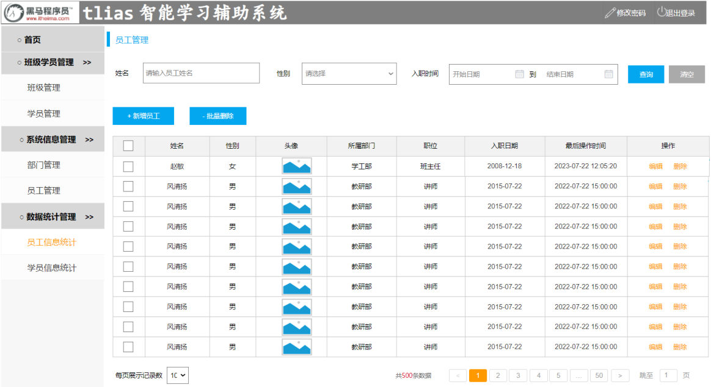
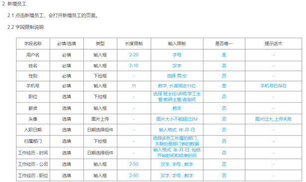

[42 篇](/posts/编程学习/javaweb学习笔记/42-ddl表结构-创建与约束/)给了建表语法和五类约束，[43 篇](/posts/编程学习/javaweb学习笔记/43-mysql数据类型/)把字段类型讲完了——但这两样东西**单独看都会用，合起来落在一张真实的表上就未必**。这一篇就是干这件事的：

- **PPT 第 35-36 页**：本章第一个完整案例——照着 Tlias 的"员工管理"页面原型，把员工表 `emp` 设计出来；
- **PPT 第 37-38 页**：表建好之后怎么**查、改、删**（表结构的维护）。

## 案例：照着页面原型设计员工表（PPT 第 35-36 页）

PPT 第 36 页把做法压成了四步：

| 步骤 | 做什么（PPT 第 36 页原文） |
| --- | --- |
| ① | **阅读并分析页面原型及需求** |
| ② | **分析表中包含哪些字段，以及字段的类型、约束** |
| ③ | **创建表结构** |
| ④ | **添加基础字段 `id`、`create_time`、`update_time`** |

### 第 1 步：阅读并分析页面原型及需求

"页面原型"就是产品/UI 画出来的**界面草图**——它决定了页面上要显示哪些数据，也就决定了表里要有哪些字段。先看 Tlias 的"员工管理"页面：


*图：PPT 第 35 页——Tlias"员工管理"页面原型。上方是查询表单（姓名、性别、入职时间范围），下面是员工列表：每一行显示"姓名、性别、头像、所属部门、职位、入职日期、最后操作时间"和一个操作列，列表上方还有"新增员工"和"批量删除"按钮*

从这张原型里逐块读信息：

| 原型上的元素 | 能推出什么 |
| --- | --- |
| 列表里显示的"姓名、性别、头像、职位、入职日期、最后操作时间" | 表里要有对应的字段：`name`、`gender`、`image`、`job`、`entry_date`、`update_time` |
| 有"新增员工""编辑""删除"按钮 | 数据要能被**新增和维护** → 表里要有能唯一标识一行的**主键**，要有**创建时间/修改时间** |
| 查询表单里有"姓名、性别、入职时间" | 这些字段要**支持条件查询**（表设计时类型要选得合适，比如入职时间用日期类型） |
| "所属部门"（学工部、教研部……） | 部门是另一张表的数据（多表设计的内容），这个案例先不落 |
| "批量删除"要按行勾选 | 每行必须有**唯一标识**（主键） |

再打开"新增员工"页面，原型下面还附了一张**字段限制说明表**，这张表才是定类型和约束的关键：


*图：PPT 第 35 页——"新增员工"页面的字段限制说明：每一行给出字段名称、必填/选填、控件类型、长度限制、输入限制、是否唯一和提示话术。比如"用户名"必填、输入框、2-20 个字符、唯一；"姓名"必填、2-10 个汉字；"性别"必填、下拉框、只能选男/女；"手机号"必填、长度固定 11 位数字、唯一；"薪资"选填、数字；"头像"选填、图片上传、不能超过 2M*

### 第 2 步：把原型上的限制翻译成"字段 + 类型 + 约束"

这一步就是把上面那张限制说明**逐行翻译**成建表语言。三条翻译规则：

| 原型上写的是 | 翻译成 |
| --- | --- |
| **必填 / 选填** | 必填 → `not null`；选填 → 不加（允许 `NULL`，也可以给个 `default` 默认值） |
| **是否唯一 = 是** | → `unique`（比如用户名、手机号，重复了要提示"xxx 已存在"） |
| **类型 + 长度限制** | 结合 [43 篇](/posts/编程学习/javaweb学习笔记/43-mysql数据类型/)的类型选型：数字用数值类型、长度固定的字符串用 `char`、不固定用 `varchar`、日期用日期时间类型 |

逐个字段推一遍（这张表就是本章案例的设计过程）：

| 字段 | 类型 | 约束 | 这张原型上对应的说明 |
| --- | --- | --- | --- |
| id | `int unsigned` | `primary key auto_increment` | 原型上没有，但每张表都该有——"唯一标识"+ 自动发号 |
| username | `varchar(20)` | `not null unique` | 用户名：必填、2-20 个字符、唯一 |
| password | `varchar(32)` | `default '123456'` | 密码：长度不固定用 `varchar`；给一个默认初始密码 |
| name | `varchar(10)` | `not null` | 姓名：必填、2-10 个汉字（长度不固定 → `varchar`） |
| gender | `tinyint unsigned` | `not null` | 性别：必填、下拉框只能选男/女 → 用 `1` 男 `2` 女 表示（取值只有两种 → `tinyint`） |
| phone | `char(11)` | `not null unique` | 手机号：必填、**长度固定 11 位**、唯一 → `char(11)` |
| job | `tinyint unsigned` | 可空 | 职位：选填、下拉框（1 班主任 2 讲师 3 学工主管 4 教研主管 5 咨询师）→ `tinyint` |
| salary | `int unsigned` | 可空 | 薪资：选填、数字 → 业务上都是整数、不为负 → `int unsigned` |
| entry_date | `date` | 可空 | 入职日期：选填、日期选择组件、格式"年-月-日" → `date` |
| image | `varchar(255)` | 可空 | 头像：选填、图片上传、不能超过 2M → 数据库里**存的是图片的路径**（不是图片本身），长度不固定 → `varchar(255)` |
| create_time / update_time | `datetime` | 可空 | 见第 4 步 |

> [!TIP]
> 两个"先不做"的地方，留个印象即可：原型上的**"所属部门"**要先有"部门表"才能关联（属于后面"多表设计"的内容）；原型上的**"工作经历"**（时间、公司、职位）是**一个员工对应多条**的数据，不适合塞进同一张表，也要等到多表设计时再拆出去。所以这个案例里的 `emp` 表里没有这两个东西。

### 第 3 步：创建表结构

把上一步的清单落下来，就是课程 `资料/05. 后端Web基础(数据库)/代码/SQL脚本.sql` 里的这段（字段顺序、注释都按课程的写）：

```sql
-- 案例: 设计员工表 emp
-- 基础字段: id 主键, create_time 创建时间, update_time 更新时间
create table emp (
    id int unsigned primary key auto_increment comment 'ID, 主键',
    username varchar(20) not null unique comment '用户名',
    password varchar(32) default '123456' comment '密码',
    name varchar(10) not null comment '姓名',
    gender tinyint unsigned not null comment '性别, 1 男; 2 女',
    phone char(11) not null unique comment '手机号',
    job tinyint unsigned comment '职位, 1 班主任; 2 讲师; 3 学工主管; 4 教研主管; 5 咨询师',
    salary int unsigned comment '薪资',
    entry_date date comment '入职日期',
    image varchar(255) comment '图像',
    create_time datetime comment '创建时间',
    update_time datetime comment '修改时间'
) comment '员工表';
```

这段语句里每一处都不是随手写的，拆开看：

| 写法 | 为什么这么写 |
| --- | --- |
| `id int unsigned primary key auto_increment` | 主键 = 一行数据的**唯一标识**（非空且唯一）；`auto_increment` 让它**自动发号**（插入时不写 id 也能生成）；`unsigned` 表示编号不为负 |
| `username varchar(20) not null unique` | 用户名必填（`not null`）且不能重复（`unique`）；长度不固定 → `varchar` |
| `password varchar(32) default '123456'` | 不写密码时自动填入 `'123456'`（默认约束）；`32` 位是给将来存加密后密码留的余量 |
| `gender tinyint unsigned not null` | 只有 1/2 两种取值 → 最小整数类型 `tinyint`；必填 |
| `phone char(11) not null unique` | 手机号**长度固定 11 位** → `char(11)`；必填且唯一（原型里的提示话术就是"手机号已存在"） |
| `job` / `salary` 可空 | 原型上这两项是"选填"，所以不加 `not null`（允许 `NULL`） |
| `salary int unsigned` | 薪资是整数（元）且不为负 → `int unsigned`（不是金额到分的小数，所以**没必要用 `decimal`**） |
| `entry_date date` | 只要"哪一天" → `date` |
| `image varchar(255)` | 存的是**图片路径**，长度不固定 → `varchar(255)` |
| 每个字段后面的 `comment '...'`、末尾的 `comment '员工表'` | 给字段和表加注释，方便自己和别人看懂（`desc` 时注释也会显示出来） |

### 第 4 步：补上三个基础字段

PPT 第 36 页专门点了这三个字段：**`id`、`create_time`、`update_time`**。它们的共同点是——**业务上不直接关心，但少了就不行**：

| 基础字段 | 干什么用 |
| --- | --- |
| `id` | 每行数据的**唯一标识**，新增/修改/删除都要靠它定位到"哪一行"（下一篇 DML 的 `where id = ?` 就是它） |
| `create_time` | 记录**这条数据是什么时候创建的**（排查问题、按时间统计都要用） |
| `update_time` | 记录**这条数据最后一次修改的时间**（原型上"最后操作时间"这一列显示的就是它） |

### 实测：表真的建出来了

> [!TIP]
> 实测（本机 MySQL 9.0.1）：建表成功后，用 `desc emp;` 看结构——
>
> ```text
> +-------------+------------------+------+-----+---------+----------------+
> | Field       | Type             | Null | Key | Default | Extra          |
> +-------------+------------------+------+-----+---------+----------------+
> | id          | int unsigned     | NO   | PRI | NULL    | auto_increment |
> | username    | varchar(20)      | NO   | UNI | NULL    |                |
> | password    | varchar(32)      | NO   |     | NULL    |                |
> | name        | varchar(10)      | NO   |     | NULL    |                |
> | gender      | tinyint unsigned | NO   |     | NULL    |                |
> | phone       | char(11)         | NO   | UNI | NULL    |                |
> | job         | tinyint unsigned | YES  |     | NULL    |                |
> | salary      | int unsigned     | YES  |     | NULL    |                |
> | image       | varchar(255)     | YES  |     | NULL    |                |
> | entry_date  | date             | YES  |     | NULL    |                |
> | create_time | datetime         | YES  |     | NULL    |                |
> | update_time | datetime         | YES  |     | NULL    |                |
> +-------------+------------------+------+-----+---------+----------------+
> ```
>
> 这份 `desc` 的 Null/Key/Extra 三列怎么读，见下面"表结构的查询"一节。（本机这份 `emp` 是用课程"06. DQL语句数据准备"里的脚本建的，和上面的案例语句只有 `password` 一处差别：脚本里是 `not null`，案例里是 `default '123456'`。）

**表名重复会怎样？** 一个库里表名不能重名，重复创建直接报错：

> [!TIP]
> 实测（本机 MySQL 9.0.1）：
>
> ```text
> ERROR 1050 (42S01): Table 'user' already exists
> ```
>
> 想让"表已经存在"时不报错，可以在建表语句里加上 `if not exists`（写成 `create table if not exists 表名(...)`，实测连写两次都不报错）；PPT 上的建表语法里没带这个修饰，因为正常开发不会重复建同一张表——真遇到就先 `drop table` 再建，或者换个表名。

## 表结构的查询、修改、删除（PPT 第 38 页）

PPT 第 37 页先给了一条路线：**DDL 分为"数据库"和"表结构"两块，表结构又分为"创建"与"查询、修改、删除"**。上面案例讲的是创建，这一节讲后者。PPT 第 38 页把九条语法一次性列了出来（顺序是"查询 → 修改 → 删除"）：

```sql
show tables;                                          -- 查询当前数据库的所有表
desc 表名;                                             -- 查询表结构
show create table 表名;                                -- 查询建表语句

alter table 表名 add 字段名 类型(长度) [comment 注释] [约束];       -- 添加字段
alter table 表名 modify 字段名 新数据类型(长度);                    -- 修改字段类型
alter table 表名 change 旧字段名 新字段名 类型(长度) [comment 注释] [约束];  -- 修改字段名与字段类型
alter table 表名 drop column 字段名;                              -- 删除字段
alter table 表名 rename to 新表名;                                -- 修改表名

drop table [if exists] 表名;                            -- 删除表
```

> [!WARNING]
> PPT 第 38 页的注意原文：**在删除表时，表中的全部数据也会被删除。** 表和数据是"容器和内容"的关系——`drop table` 把容器一起端走了。

### 三条查询语句

| 语句 | 查什么 | 什么时候用 |
| --- | --- | --- |
| `show tables;` | 当前数据库里**有哪些表** | 忘了表名、确认表建没建成功 |
| `desc 表名;` | 表的**结构**（有哪些字段、什么类型、能不能为空、有没有主键/唯一、默认值） | 最常用——写 SQL 前先看看字段名和类型 |
| `show create table 表名;` | 当初的**建表语句**（含约束、注释、字符集、存储引擎） | 想知道这张表"到底是怎么建的"，比如约束落在哪个字段上 |

`desc emp;` 的输出上面已经看过，这里说说那六列**每一列在说什么**（这是"会看表结构"的分水岭）：

| 列 | 含义 | 怎么看 |
| --- | --- | --- |
| Field | 字段名 | — |
| Type | 字段类型（含长度/精度） | 如 `varchar(20)`、`tinyint unsigned`、`char(11)` |
| **Null** | 这个字段允不允许为 `NULL` | 显示 **`YES`** = 可以为空；显示 **`NO`** = 有 `not null` 约束 |
| **Key** | 这个字段上有没有键 | 显示 **`PRI`** = 主键；显示 **`UNI`** = 唯一约束；空 = 没有 |
| Default | 默认值 | 有 `default` 约束时显示默认值，否则显示 `NULL` |
| **Extra** | 额外的信息 | 显示 **`auto_increment`** = 这一列是自增的 |

对着上面的 `emp` 输出验证一下：`id` 那行 `Null = NO`（主键要求非空）、`Key = PRI`、`Extra = auto_increment`；`username` 和 `phone` 那两行 `Key = UNI`（都加了 `unique`）；`job`、`salary` 等选填字段 `Null = YES`。

`show create table` 是把约束"还原"成 SQL 看，实测（本机 MySQL 9.0.1）：

```sql
CREATE TABLE `emp` (
  `id` int unsigned NOT NULL AUTO_INCREMENT COMMENT 'ID,主键',
  `username` varchar(20) NOT NULL COMMENT '用户名',
  `password` varchar(32) NOT NULL COMMENT '密码',
  `name` varchar(10) NOT NULL COMMENT '姓名',
  `gender` tinyint unsigned NOT NULL COMMENT '性别, 1:男, 2:女',
  `phone` char(11) NOT NULL COMMENT '手机号',
  `job` tinyint unsigned DEFAULT NULL COMMENT '职位, 1:班主任,2:讲师,3:学工主管,4:教研主管,5:咨询师',
  `salary` int unsigned DEFAULT NULL COMMENT '薪资',
  `image` varchar(255) DEFAULT NULL COMMENT '头像',
  `entry_date` date DEFAULT NULL COMMENT '入职日期',
  `create_time` datetime DEFAULT NULL COMMENT '创建时间',
  `update_time` datetime DEFAULT NULL COMMENT '修改时间',
  PRIMARY KEY (`id`),
  UNIQUE KEY `username` (`username`),
  UNIQUE KEY `phone` (`phone`)
) ENGINE=InnoDB AUTO_INCREMENT=31 DEFAULT CHARSET=utf8mb4 COLLATE=utf8mb4_0900_ai_ci COMMENT='员工表'
```

三件事值得留意：① 建表时写在字段后面的约束（`not null`、`default`），在 `show create table` 里被原样标回字段上；② `primary key` 和 `unique` 被单独抽出来，放在最后以 `PRIMARY KEY (...)`、`UNIQUE KEY (...) ` 的形式列出（带约束版的 `user` 表也是这样）；③ 末尾多了一段建表时没写的 `ENGINE=InnoDB ... CHARSET=utf8mb4 ...`——那是 MySQL **自动补上的默认值**（默认字符集 utf8mb4）。

### 四条修改语句（alter）

表建好之后字段要变，用 `alter table`。课程案例里给 `emp` 表**加一个"QQ 号码"字段**，然后一路演完四种修改，下面在本机的一张演示表上把同样的动作跑一遍：

> [!TIP]
> 实测（本机 MySQL 9.0.1）：先建一张只有两个字段的小表（`id` 主键自增、`username` 非空），然后——
>
> ```sql
> -- ① 添加字段：加一个 qq
> alter table zcode_alter_demo add qq varchar(13) comment 'QQ号码';
> -- ② 修改字段类型：13 位改成 15 位
> alter table zcode_alter_demo modify qq varchar(15) comment 'QQ号码';
> -- ③ 修改字段名与字段类型：qq 改名叫 qq_num
> alter table zcode_alter_demo change qq qq_num varchar(15) comment 'QQ号码';
> ```
>
> 改完再 `desc` 一次：
>
> ```text
> +----------+--------------+------+-----+---------+----------------+
> | Field    | Type         | Null | Key | Default | Extra          |
> +----------+--------------+------+-----+---------+----------------+
> | id       | int unsigned | NO   | PRI | NULL    | auto_increment |
> | username | varchar(20)  | NO   |     | NULL    |                |
> | qq_num   | varchar(15)  | YES  |     | NULL    |                |
> +----------+--------------+------+-----+---------+----------------+
> ```
>
> 新字段 `qq_num` 出现了（选填、没有约束，所以 `Null = YES`）。

四条语句的差别就在"改哪一部分"：

| 语句 | 改的是 | 关键字 | 记忆点 |
| --- | --- | --- | --- |
| 添加字段 | 表里**多一列** | `alter table 表名 add 字段名 类型 ...` | 新增的列默认允许为 `NULL` |
| 修改字段类型 | 同一个字段**换类型/长度** | `alter table 表名 modify 字段名 新类型(长度)` | `modify` 后面**只写一个字段名** |
| 修改字段名 | 同一个字段**换名字**（类型可一起改） | `alter table 表名 change 旧名 新名 类型(长度) ...` | `change` 后面是**旧名 + 新名**两个字段名 |
| 删除字段 | 表里**少一列** | `alter table 表名 drop column 字段名` | 连这一列的数据一起没了 |

> [!WARNING]
> **`modify` 与 `change` 只差一个词，但含义完全不同**：`modify` 是"我只要改类型"，字段名不动；`change` 是"旧名 → 新名"（顺便能改类型）。写 `change` 的时候**旧名和新名都要写**，这也是它比 `modify` 多一个参数的原因。

### 改名与删表

```sql
alter table emp rename to employee;   -- 修改表名
drop table [if exists]  employee;     -- 删除表
```

> [!TIP]
> 实测（本机 MySQL 9.0.1）：`alter table zcode_alter_demo rename to zcode_alter_demo2;` 之后 `show tables` 里只剩新名字 `zcode_alter_demo2`；再 `drop table` 之后表就彻底没了。
>
> 删表会把数据一起带走，用一个小表演示：
>
> ```sql
> create table zcode_drop_demo( id int unsigned primary key auto_increment, name varchar(10) );
> insert into zcode_drop_demo(name) values ('宋江'),('吴用'),('林冲');
> select count(*) from zcode_drop_demo;   -- 删表前的数据行数 = 3
> drop table zcode_drop_demo;             -- 表没了，这 3 行数据也一起没了
> ```
>
> 注意这里是**表结构和数据一起消失**——和 [45 篇](/posts/编程学习/javaweb学习笔记/45-dml数据的新增修改删除/)要讲的 `delete from 表名` 完全不同：`delete` 只删数据，表结构还在。

`drop table if exists 表名` 里的 `if exists` 是"**表存在才删，不存在也不报错**"，写脚本（比如每次重建测试数据的 SQL 脚本）时常用，可以省掉"表不存在"的报错。

## 小结

| 问题 | 答案 |
| --- | --- |
| 设计一张表分几步 | 四步：① **阅读并分析页面原型及需求**；② **分析表中包含哪些字段，以及字段的类型、约束**；③ **创建表结构**；④ **添加基础字段 `id`、`create_time`、`update_time`** |
| 原型上的"必填/选填/是否唯一"怎么落到表上 | 必填 → `not null`；选填 → 不加（或给 `default` 默认值）；是否唯一 = 是 → `unique` |
| `emp` 表里几个关键字段为什么这么定 | `id int unsigned primary key auto_increment`（唯一标识 + 自动发号）、`username varchar(20) not null unique`、`phone char(11) not null unique`（**长度固定 11 位**）、`gender/job tinyint unsigned`（取值只有几个）、`salary int unsigned`（整数且不为负）、`entry_date date`（只要日期）、`image varchar(255)`（存**图片路径**）、`create_time`/`update_time datetime`（基础字段） |
| 三个基础字段有什么用 | `id` 唯一标识一行（增删改都靠它定位）；`create_time` 记录创建时间；`update_time` 记录最后一次修改时间（原型上的"最后操作时间"） |
| 重复建表会怎样 | 报 **`ERROR 1050 (42S01): Table 'xxx' already exists`**（同一个库里表名不能重复） |
| 九条表结构语法 | **`show tables` / `desc 表名` / `show create table 表名`**；**`alter table ... add` / `modify` / `change` / `drop column`**；**`alter table ... rename to 新表名`** / **`drop table [if exists] 表名`** |
| `desc` 的六列怎么读 | Field 字段名；Type 类型；**Null：`YES` 可为空 / `NO` 有 `not null`**；**Key：`PRI` 主键 / `UNI` 唯一**；Default 默认值；**Extra：`auto_increment` 自增** |
| `modify` 与 `change` 的区别 | **`modify` 改字段类型**（只写一个字段名）；**`change` 改字段名（可连带改类型）**（写"旧名 新名 类型"） |
| 删表要注意什么 | **在删除表时，表中的全部数据也会被删除**（结构 + 数据一起没）；`drop table if exists` 可以避免"表不存在"的报错 |

## 相关

- [上一篇：MySQL数据类型](/posts/编程学习/javaweb学习笔记/43-mysql数据类型/)
- [下一篇：DML数据的新增修改删除](/posts/编程学习/javaweb学习笔记/45-dml数据的新增修改删除/)

## 练习题

### 一、知识回顾（读完直接做下面的实践题）

1. 照着页面原型设计表的**四步法**：① **阅读并分析页面原型及需求**；② **分析表中包含哪些字段，以及字段的类型、约束**；③ **创建表结构**；④ **添加基础字段 `id`、`create_time`、`update_time`**
2. 原型上的"限制说明"怎么翻译：**必填 → `not null`**；**选填 → 不加约束**（也可以 `default` 给默认值）；**"是否唯一 = 是" → `unique`**；**长度固定 → `char(n)`、不固定 → `varchar(n)`**
3. `emp` 表的三个基础字段：**`id int unsigned primary key auto_increment`（唯一标识 + 自动发号）、`create_time datetime`（创建时间）、`update_time datetime`（修改时间，原型上的"最后操作时间"）**
4. `emp` 里几个"有讲究"的字段：**用户名 `varchar(20) not null unique`**（不固定长度、必填、唯一）；**手机号 `char(11) not null unique`**（长度固定 11 位）；**性别 `tinyint unsigned not null`**（取值 1 男 2 女）；**职位 `tinyint unsigned`**；**薪资 `int unsigned`**（整数、不为负）
5. **`image varchar(255)` 存的是图片的路径**，不是图片本身（原型上"头像不能超过 2M"限的是上传的图片）
6. **重复建表**会报 **`ERROR 1050 (42S01): Table 'xxx' already exists`**；同一个数据库里表名不能重复
7. 表结构查询三条：**`show tables;`（当前库有哪些表）、`desc 表名;`（表结构）、`show create table 表名;`（当初的建表语句）**
8. `desc` 结果六列：**Field 字段名、Type 类型、Null（`YES` 可为空 / `NO` 有非空约束）、Key（`PRI` 主键 / `UNI` 唯一）、Default 默认值、Extra（`auto_increment` 自增）**
9. 表结构修改四种：**`alter table 表名 add 字段名 类型(长度) [comment 注释] [约束]`（添加字段）；`alter table 表名 modify 字段名 新类型(长度)`（改类型）；`alter table 表名 change 旧字段名 新字段名 类型(长度) ...`（改字段名，可连带改类型）；`alter table 表名 drop column 字段名`（删字段）**
10. **`modify` 只改字段类型**（写一个字段名），**`change` 改字段名**（写"旧名 新名 类型"），这是两者最容易混的地方
11. 改表名用 **`alter table 表名 rename to 新表名;`**；删表用 **`drop table [if exists] 表名;`**
12. **删除表时表中的全部数据也会被删除**（`drop table` 是结构+数据一起没）；而 `delete from 表名` 只删数据、表结构还在（下一篇的内容）

### 二、裸写题

- [ ] **2-1 建一张"用户表"**
  需求：要存系统的用户信息，包含下面几列（表名 `user`，表注释"用户信息表"）：

  | 列 | 要求 |
  | --- | --- |
  | 用户编号 | 唯一标识，从 1 开始自动往后发，不为负 |
  | 用户名 | 必填、不能重复，最长 50 个字符 |
  | 姓名 | 必填，最长 10 个字符 |
  | 年龄 | 选填 |
  | 性别 | 选填，不填时默认为"男"，只有 1 个字符 |

  要求：写出完整的建表语句，**每个字段都加 `comment`**，并把"哪个要求对应哪个约束"记在练习文件里。

  > [!TIP]- 提示（先自己想，实在想不出再点开）
  > **一级 · 思路**：先给每一列挑**类型**（长度固定还是不定、数值范围大不大），再看每一列需要什么**约束**（必填 / 不允许重复 / 唯一标识 / 有默认值）——约束一共有五类，这题用得上四类
  > **二级 · 方法**：整数且不为负用 `int unsigned`；长度不固定的字符串用 `varchar(n)`、只有 1 个字符用 `char(1)`；约束关键字是 `primary key`（主键）、`auto_increment`（自增）、`not null`（非空）、`unique`（唯一）、`default`（默认）；字段注释写 `comment '...'`
  > **三级 · 骨架**：`create table user( id int unsigned ____ primary key ____ comment 'ID, 唯一标识', username ____(50) ____ ____ comment '用户名', name ____(10) ____ comment '姓名', age ____ comment '年龄', gender ____(1) ____ '男' comment '性别' ) ____ '用户信息表';`

  > [!TIP]- 参考答案（做完再点开）
  > ```sql
  > create table user(
  >     id int unsigned primary key auto_increment comment 'ID, 唯一标识',
  >     username varchar(50) not null unique comment '用户名',
  >     name varchar(10) not null comment '姓名',
  >     age int comment '年龄',
  >     gender char(1) default '男' comment '性别'
  > ) comment '用户信息表';
  > ```
  > 对应关系：**唯一标识 + 自动发号** → `primary key auto_increment`；**用户名必填** → `not null`、**不能重复** → `unique`；**姓名必填** → `not null`；**性别只有 1 个字符、不填默认"男"** → `char(1) default '男'`；两个字符串字段长度不固定 → `varchar`。
  >
  > 建完可以用 `desc user;` 自查，实测（本机 MySQL 9.0.1）这份表结构长这样：
  > ```text
  > | Field    | Type        | Null | Key | Default | Extra          |
  > | id       | int         | NO   | PRI | NULL    | auto_increment |
  > | username | varchar(50) | NO   | UNI | NULL    |                |
  > | name     | varchar(10) | NO   |     | NULL    |                |
  > | age      | int         | YES  |     | NULL    |                |
  > | gender   | char(1)     | YES  |     | 男      |                |
  > ```
  > 对照着看：`Null` 列 `NO` 的三个就是加了 `not null` 的；`Key` 列 `PRI`/`UNI` 分别是主键和唯一约束；`Extra` 列的 `auto_increment` 说明 id 会自动发号。

- [ ] **2-2 给表加一个字段、再改它**
  在上一题的 `user` 表上依次做三件事（做完每一步都用 `desc user;` 看一眼效果）：

  1. 加一个"QQ 号码"字段，最长 13 个字符，注释写"QQ号码"；
  2. 把 QQ 号码的长度上限改成 15；
  3. 把字段名从"QQ 号码"改成"QQ 号"（字段名用 `qq_num`），长度保持 15。

  做完回答：第 2 步和第 3 步用的关键字分别是什么？它们的区别是什么？

  > [!TIP]- 提示（先自己想，实在想不出再点开）
  > **一级 · 思路**：三步分别是"加一列、改这一列的类型、改这一列的名字"，对应 `alter table` 的三个不同动作；注意"改类型"和"改名字"是两个关键字，别用混
  > **二级 · 方法**：加字段 `alter table 表名 add 字段名 类型(长度) comment '...'`；改类型 `alter table 表名 modify 字段名 新类型(长度)`；改名字 `alter table 表名 change 旧名 新名 类型(长度) comment '...'`
  > **三级 · 骨架**：`alter table user ____ qq varchar(13) comment 'QQ号码';` / `alter table user ____ qq ____(15);` / `alter table user ____ qq ____ varchar(15) comment 'QQ号码';`

  > [!TIP]- 参考答案（做完再点开）
  > ```sql
  > -- ① 添加字段
  > alter table user add qq varchar(13) comment 'QQ号码';
  >
  > -- ② 修改字段类型
  > alter table user modify qq varchar(15) comment 'QQ号码';
  >
  > -- ③ 修改字段名与字段类型
  > alter table user change qq qq_num varchar(15) comment 'QQ号码';
  > ```
  > 第 2 步用的是 **`modify`（只改字段类型**，后面只写一个字段名）；第 3 步用的是 **`change`（改字段名，可以连带改类型**，后面要写"旧字段名 + 新字段名 + 类型"）。本机实测（MySQL 9.0.1）跑完第 3 步后 `desc` 里出现的是新名字 `qq_num varchar(15)`，且这一列是选填（`Null = YES`）——因为 `add` 新加的列默认就允许为空。

- [ ] **2-3 读一份 `desc` 的结果**
  下面的表结构输出是 `desc emp;` 的结果（节选），请回答四个问题：

  ```text
  +-------------+------------------+------+-----+---------+----------------+
  | Field       | Type             | Null | Key | Default | Extra          |
  +-------------+------------------+------+-----+---------+----------------+
  | id          | int unsigned     | NO   | PRI | NULL    | auto_increment |
  | username    | varchar(20)      | NO   | UNI | NULL    |                |
  | password    | varchar(32)      | NO   |     | NULL    |                |
  | name        | varchar(10)      | NO   |     | NULL    |                |
  | job         | tinyint unsigned | YES  |     | NULL    |                |
  | entry_date  | date             | YES  |     | NULL    |                |
  +-------------+------------------+------+-----+---------+----------------+
  ```

  1. 哪些字段加了非空约束（`not null`）？你是从哪一列看出来的？
  2. `id` 上的 `PRI` 和 `auto_increment` 分别代表什么？
  3. `username` 这一行的 `UNI` 说明当初建表时写了什么？
  4. 为什么 `job` 这一行是 `YES`？

  > [!TIP]- 提示（先自己想，实在想不出再点开）
  > **一级 · 思路**：这份输出的每一列都在"翻译"建表语句里的某一个约束——**Null 列对应非空约束，Key 列对应主键/唯一，Extra 对应自增**
  > **二级 · 方法**：`Null = NO` ↔ `not null`；`Key = PRI` ↔ `primary key`、`Key = UNI` ↔ `unique`；`Extra = auto_increment` ↔ `auto_increment`；`Null = YES` 表示这一列允许 `NULL`（建表时没写 `not null`）
  > **三级 · 骨架**：看某一列有没有约束，就盯那一行的 `____` 列和 `____` 列

  > [!TIP]- 参考答案（做完再点开）
  > 1. `id`、`username`、`password`、`name` **四个字段**加了非空约束——看 **`Null` 列显示 `NO`**（`job`、`entry_date` 显示 `YES`，表示允许为空）。
  > 2. `PRI` 说明 `id` 是**主键**（`primary key`，非空且唯一，是一行数据的唯一标识）；`auto_increment` 说明它**可以自动发号**（插入时不写 id，MySQL 会自己给一个没被用过的值）。
  > 3. `UNI` 说明建表时在 `username` 上写了 **`unique` 唯一约束**（用户名不能重复）。
  > 4. 因为建表时 `job` **没有写 `not null`**（职位是选填的），所以这一列允许为 `NULL`，`Null` 列就显示 `YES`。

- [ ] **2-4 改表名与删表**
  需求：把上面练手用的 `user` 表改名为 `sys_user`，确认改完之后，再把它删掉。做完回答：

  1. 改表名和删表的语句分别怎么写？
  2. 删表之前先看一眼表里有多少条数据（用 `select count(*) from 表名;`），删完之后这张表还在吗？数据还在吗？
  3. 如果删一个**根本不存在**的表，会报错；想要"不存在也不报错"该怎么写？

  > [!TIP]- 提示（先自己想，实在想不出再点开）
  > **一级 · 思路**：改表名属于"改表结构"里的动作，用 `alter table`；删表是一个独立的语句。第 3 问要在删表语句里加一个"存在性判断"的修饰词
  > **二级 · 方法**：改表名 `alter table 表名 rename to 新表名;`；删表 `drop table 表名;`；加了"存在才删"的写法是 `drop table if exists 表名;`；数数据量用 `select count(*) from 表名;`
  > **三级 · 骨架**：`alter table user ____ ____ sys_user;` / `drop table ____ ____ sys_user;`（或 `drop table sys_user;`）

  > [!TIP]- 参考答案（做完再点开）
  > 1. 改表名 `alter table user rename to sys_user;`；删表 `drop table sys_user;`。
  > 2. 删完之后**表和学生数据都没了**——PPT 第 38 页的注意原文就是"**在删除表时，表中的全部数据也会被删除**"。本机实测（MySQL 9.0.1）用一个装了 3 行数据的小表演示过：删前 `select count(*)` 是 **3**，`drop table` 之后这张表在 `show tables` 里直接消失（结构 + 数据一起没）。
  > 3. 写成 **`drop table if exists sys_user;`**——表存在就删掉，不存在也不报错（写"重建测试数据"的脚本时常用）。

### 三、综合题

- [ ] **3-1 照着课程案例设计员工表，再把表结构维护一遍**
  这就是 PPT 第 35-38 页的案例本身，请完整走一遍（练习文件 `test_44_设计员工表.sql`）：

  > [!WARNING]
  > 练习时表名用 **`emp_design`**（别用 `emp`）：你库里的 `emp` 是课程那份 30 条测试数据所在的表，第 6 步要"改名 + 删表"，用 `emp` 会把这些数据一起删掉——后面的 DQL 练习还要用它。SQL 本身和课程案例完全一样，只是换个表名。

  1. **读原型**：打开 `assets/44-DDL表结构与建表案例/35-员工管理页面原型.jpg`，把页面上显示的每一列信息列出来（姓名、性别、头像、所属部门、职位、入职日期、最后操作时间……），并写出"哪几条是员工表里的字段、哪几条属于其他表"；
  2. **析字段**：对着 `35-新增员工字段限制说明.jpg` 逐行翻译——每个字段的**类型**是什么、要不要**必填**、要不要**唯一**，写出一张"字段 → 类型 → 约束 → 依据"的清单（和笔记第 2 步的表格对照）；
  3. **建表**：把清单落成一条 `create table emp_design (...)` 语句，**补上三个基础字段** `id`（主键自增）、`create_time`、`update_time`，每个字段都加 `comment`；
  4. **验证**：执行建表语句，然后用 `show tables;`、`desc emp_design;`、`show create table emp_design;` 三条语句各看一遍，把 `desc` 的结果抄进练习文件，并指出 `Null`、`Key`、`Extra` 三列分别印证了哪条约束；
  5. **维护字段**：给 `emp_design` 表加一个"QQ 号码"字段（最长 13 个字符）→ 把它的长度改成 15 → 把字段名改成 `qq_num` → 最后把这个字段删掉，每一步都用 `desc emp_design;` 看一眼变化；
  6. **收尾**：把表名改成 `employee`，确认改名成功后再把它删掉；回答"删掉之后里面的数据还在吗"；
  7. **答一问**：为什么设计表的时候要先看"页面原型"和"字段限制说明"，而不是拿到需求就凭感觉写 `create table`？

  **涉及知识点**

  | 知识点 | 在这里的应用 |
  | --- | --- |
  | 四步法 | 读原型 → 析字段类型约束 → 建表 → 补基础字段 |
  | 类型选型（[43 篇](/posts/编程学习/javaweb学习笔记/43-mysql数据类型/)） | 手机号 `char(11)`、姓名 `varchar(10)`、职位 `tinyint unsigned`、入职日期 `date` |
  | 五类约束（[42 篇](/posts/编程学习/javaweb学习笔记/42-ddl表结构-创建与约束/)） | 主键 + 自增、`not null`、`unique`、`default` |
  | 表结构查询 | `show tables` / `desc` / `show create table` 三种自查手段 |
  | 表结构修改 | `alter table` 的 `add`、`modify`、`change`、`drop column` |
  | 表名修改与删表 | `rename to`、`drop table`（连数据一起删） |

  > [!TIP]- 提示（先自己想，实在想不出再点开）
  > **一级 · 思路**：整条链路是"**看原型定字段 → 看限制说明定类型和约束 → 建表 → 自查 → 用 `alter table` 维护**"。第 5 步的四个动作严格对应四个关键字：加字段、改类型、改名字（还能顺带改类型）、删字段
  > **二级 · 方法**：建表 `create table 表名( 字段名 类型 [约束] [comment '注释'] ... ) comment '表注释';`；自查 `show tables;` / `desc 表名;` / `show create table 表名;`；维护 `alter table 表名 add|modify|change|drop column ...`；收尾 `alter table 表名 rename to 新表名;` / `drop table [if exists] 表名;`
  > **三级 · 骨架**：`create table emp_design( id int unsigned ____ ____ auto_increment comment 'ID, 主键', username ____(20) not null ____ comment '用户名', phone ____(11) not null ____ comment '手机号', ... ) comment '员工表';`

  > [!TIP]- 参考答案（做完再点开）
  > 1. 原型上能看到的信息里——**属于员工表的**：姓名、性别、头像、职位、入职日期、最后操作时间（对应 `name`、`gender`、`image`、`job`、`entry_date`、`update_time`），另外"新增员工"页面的限制说明里还有用户名、密码、手机号、薪资；**属于其他表的**：所属部门（要先有部门表，属于多表设计）；"工作经历"是一个员工对应多条的数据，同样等后面再拆成单独的表。
  > 2. 字段清单见正文第 2 步的表格，关键几条：**用户名必填 + 唯一 + 长度不固定 → `varchar(20) not null unique`**；**手机号必填 + 唯一 + 长度固定 11 位 → `char(11) not null unique`**；**性别必填 + 只能选男/女 → `tinyint unsigned not null`**（1 男 2 女）；**薪资选填 + 数字 → `int unsigned`**；**入职日期选填 + 只要日期 → `date`**；**头像选填 + 存路径 → `varchar(255)`**。
  > 3. 建表语句（课程案例里表名是 `emp`，练习时按前面 WARNING 换成 `emp_design`，SQL 完全一样）：
  >    ```sql
  >    create table emp_design (
  >        id int unsigned primary key auto_increment comment 'ID, 主键',
  >        username varchar(20) not null unique comment '用户名',
  >        password varchar(32) default '123456' comment '密码',
  >        name varchar(10) not null comment '姓名',
  >        gender tinyint unsigned not null comment '性别, 1 男; 2 女',
  >        phone char(11) not null unique comment '手机号',
  >        job tinyint unsigned comment '职位, 1 班主任; 2 讲师; 3 学工主管; 4 教研主管; 5 咨询师',
  >        salary int unsigned comment '薪资',
  >        entry_date date comment '入职日期',
  >        image varchar(255) comment '图像',
  >        create_time datetime comment '创建时间',
  >        update_time datetime comment '修改时间'
  >    ) comment '员工表';
  >    ```
  > 4. `desc emp_design;` 的实测结果里（本机实测用的是课程那份 `emp`，结构一模一样）——**`Null` 列**：`id`/`username`/`password`/`name`/`gender`/`phone` 是 `NO`（都加了 `not null`），`job`/`salary`/`image`/`entry_date`/`create_time`/`update_time` 是 `YES`（选填）；**`Key` 列**：`id` 是 `PRI`（主键）、`username` 和 `phone` 是 `UNI`（唯一约束）；**`Extra` 列**：`id` 是 `auto_increment`（自增）。用 `show create table 表名;` 还能看到约束被单独列在最后：`PRIMARY KEY (\`id\`)`、`UNIQUE KEY \`username\` (\`username\`)`、`UNIQUE KEY \`phone\` (\`phone\`)`。
  > 5. 维护四步：
  >    ```sql
  >    alter table emp_design add qq varchar(13) comment 'QQ号码';
  >    alter table emp_design modify qq varchar(15) comment 'QQ号码';
  >    alter table emp_design change qq qq_num varchar(15) comment 'QQ号码';
  >    alter table emp_design drop column qq_num;
  >    ```
  >    `add` 之后 `desc` 里多出一列 `qq varchar(13)`（`Null = YES`）；`modify` 之后变成 `varchar(15)`；`change` 之后列名变成 `qq_num`；`drop column` 之后这一列消失。本机实测（MySQL 9.0.1）在一张演示表上跑通了同样的四步，核心输出：
  >    ```text
  >    | Field    | Type         | Null | Key | Default | Extra          |
  >    | id       | int unsigned | NO   | PRI | NULL    | auto_increment |
  >    | username | varchar(20)  | NO   |     | NULL    |                |
  >    | qq_num   | varchar(15)  | YES  |     | NULL    |                |
  >    ```
  > 6. 收尾：`alter table emp_design rename to employee;` 之后用 `show tables;` 能看到表名已经变成 `employee`；再 `drop table employee;` 这张表就没了——**表里的数据也一起没了**（表结构和数据一起被删）。本机实测的对照：一张装了 3 行数据的小表，`drop table` 之前 `select count(*)` 是 3，删除之后连表带数据一起消失。
  > 7. 因为**表的字段是由页面（需求）决定的**：原型决定了"要存哪些信息、要显示什么"，限制说明决定了"每个字段允许多长、必填还是选填、能不能重复"——这些正是类型和约束的依据。反过来先写 `create table` 再改，就会出现"手机号写成了 `varchar(50)`""忘了给用户名加唯一约束"这类返工，甚至等数据进库了才发现改不动。
