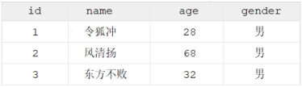

[44 篇](/posts/编程学习/javaweb学习笔记/44-ddl表结构与建表案例/)把员工表 `emp` 的结构（字段、类型、约束）搭好了，但那时候表还是**空的**——就像一个刚做好的书架，上面一本书都没有。这一篇开始往里**放书、换书、撤书**。

## DML 是什么（PPT 第 39-41 页）

PPT 第 40 页给的定义：

> **DML 英文全称是 Data Manipulation Language（数据操作语言），用来对数据库中表的数据记录进行增、删、改操作。**
> 添加数据（INSERT）
> 修改数据（UPDATE）
> 删除数据（DELETE）

和 DDL 放一起对比，区别就非常清楚：

| | DDL | DML |
| --- | --- | --- |
| 全称 | Data **Definition** Language（数据定义语言） | Data **Manipulation** Language（数据操作语言） |
| 操作对象 | **数据库、表、字段**（结构） | **表中的数据记录**（一行行的数据） |
| 语句 | `create` / `drop` / `alter` / `show` / `desc` | `insert` / `update` / `delete` |
| 打个比方 | 盖房子、改户型 | 往房子里搬家具、换家具、搬走 |


*图：PPT 第 40 页——一张典型的二维表（`id`、`name`、`age`、`gender` 四列，下面是三行数据）。DML 增删改操作的就是这些"一行行的记录"*

PPT 第 41 页把 DML 又拆成三块，也是这一篇的三节：**`insert`（新增）→ `update`（修改）→ `delete`（删除）**。

## 新增数据 insert（PPT 第 42 页）

PPT 第 42 页给了**四种写法**，差别只在"写不写字段名"和"插一行还是多行"：

```sql
-- 指定字段添加数据
insert into 表名(字段名1, 字段名2) values (值1, 值2);

-- 全部字段添加数据
insert into 表名 values (值1, 值2, ...);

-- 批量添加数据（指定字段）
insert into 表名 (字段名1, 字段名2)  values (值1, 值2), (值1, 值2);

-- 批量添加数据（全部字段）
insert into 表名 values (值1, 值2, ...), (值1, 值2, ...);
```

对着课程 `SQL脚本.sql` 里在 `emp` 表上的演示，四种写法分别是：

```sql
-- 1. 为 emp 表的 username, password, name, gender, phone 字段插入值（指定字段）
insert into emp(username, password, name, gender, phone) values ('songjiang','12345678','宋江',1,'13300001111');

-- 2. 为 emp 表的所有字段插入值（全部字段）
-- 方式1: 把字段名全列出来
insert into emp(id, username, password, name, gender, phone, job, salary, entry_date, image, create_time, update_time)
          values(null, 'linchong','12345678','林冲',1,'13300001112',1,6000,'2020-01-01','1.jpg',now(),now());
-- 方式2: 连字段名都不写，按建表时的字段顺序给值
insert into emp values(null, 'likui','12345678','李逵',1,'13300001113',1,6000,'2020-01-01','1.jpg',now(),now());

-- 3. 批量插入（指定字段）：一行 values 后面跟多组值
insert into emp(username, password, name, gender, phone) values
            ('ruanxiaoer','12345678','阮小二',1,'13300001114'),('ruanxiaowu','12345678','阮小五',1,'13300001115');
```

两个细节先说清楚：

- 第一行的 `id` 位置写的是 **`null`**：因为 `id` 是 `primary key auto_increment`（[42 篇](/posts/编程学习/javaweb学习笔记/42-ddl表结构-创建与约束/)的主键自增），插入时把 id 位置留空（写 `null`），MySQL 就会**自动发一个没被用过的号**。如果想手动指定 id，就把 `null` 换成具体的数字。
- `create_time` / `update_time` 位置用的是 **`now()`**——这是 MySQL 的函数，取"当前时间"，插入时直接写成 SQL 里的函数调用即可，不用自己拼字符串。

### 实测：四种写法真的能插进去

> [!TIP]
> 实测（本机 MySQL 9.0.1）：用上面四种写法在一张与 `emp` 结构基本一致的演示表上依次执行，四条全部成功，查出来的结果是——
>
> ```text
> +----+------------+----------+-----------+--------+-------------+------+--------+------------+
> | id | username   | password | name      | gender | phone       | job  | salary | entry_date |
> +----+------------+----------+-----------+--------+-------------+------+--------+------------+
> |  1 | songjiang  | 12345678 | 宋江      |      1 | 13300001111 | NULL |   NULL | NULL       |
> |  2 | linchong   | 12345678 | 林冲      |      1 | 13300001112 |    1 |   6000 | 2020-01-01 |
> |  3 | likui      | 12345678 | 李逵      |      1 | 13300001113 |    1 |   6000 | 2020-01-01 |
> |  4 | ruanxiaoer | 12345678 | 阮小二    |      1 | 13300001114 | NULL |   NULL | NULL       |
> |  5 | ruanxiaowu | 12345678 | 阮小五    |      1 | 13300001115 | NULL |   NULL | NULL       |
> +----+------------+----------+-----------+--------+-------------+------+--------+------------+
> ```
>
> 注意第 1 行：第一条 `insert` **只指定了 5 个字段**（username/password/name/gender/phone），所以 id 交给自增发号（得到 1），其余没写的字段（job/salary/entry_date）就都是 `NULL`——**"没写的字段"和"写了但写 null"是一回事**；而第 2、3 行插入了全部字段，数据和语句里的值一一对应。

### 三条注意（PPT 第 42 页）

PPT 第 42 页在语法下面列了三条：

| 注意（PPT 原文） | 意思是 |
| --- | --- |
| **插入数据时，指定的字段顺序需要与值的顺序是一一对应的** | `insert into emp(username, name) values ('张三', 'zhangsan')` 就是错的——值会**按顺序**塞进对应的字段里，顺序错了数据就错位了 |
| **字符串和日期型数据应该包含在引号中（单引号、双引号都可以）** | 字符串、日期这类值用 `'...'` 括起来，数字不用 |
| **插入的数据大小/长度，应该在字段的规定范围内** | 值的范围和长度要符合字段类型与约束（[43 篇](/posts/编程学习/javaweb学习笔记/43-mysql数据类型/)的 `1264 越界`、`1406 数据太长`） |

**第一条**理解成"值是按位置对号入座的"就够了：字段名的顺序、值的顺序必须**成对**出现，谁也不多、谁也不少。

**第二条**容易被当成"硬性语法"，实测一下就知道它的分寸：

> [!TIP]
> 实测（本机 MySQL 9.0.1）：把**不加引号**的值插进字符串和日期字段——
>
> ```sql
> insert into zcode_dml_demo(username, name, gender, phone, entry_date)
>                values (111, '测试', 1, '13300001116', 20200101);
> ```
>
> 插入**成功**，查出来是：
>
> ```text
> +----+----------+------------+
> | id | username | entry_date |
> +----+----------+------------+
> |  6 | 111      | 2020-01-01 |
> +----+----------+------------+
> ```
>
> 数字 `111` 被当成字符串 `'111'` 存进了 `username`（`varchar`），数字 `20200101` 被解析成了日期 `2020-01-01`。也就是说 **MySQL 会替你做隐式转换，不加引号也能插**——但 PPT 那句"应该包含在引号中"是**规范**：靠 MySQL 猜格式早晚会出事（比如 `'2020-1-1'` 和 `20200101` 都能识别，但写成别的样子就不一定了），**写代码时老老实实加引号**。

**第三条**是"约束和类型替你把关"，插入了不合规的值会直接报错，比如：

> [!TIP]
> 实测（本机 MySQL 9.0.1）：往 `phone`（`char(11) not null unique`）里插一个已经存在的手机号——
>
> ```text
> ERROR 1062 (23000): Duplicate entry '13300001111' for key 'zcode_dml_demo.phone'
> ```
>
> 报错原文里的 **`Duplicate entry`（重复的条目）** + **`for key 'xxx.phone'`**（点名是哪个字段的唯一约束被违反）已经把原因说尽了。除了它，越界报 `1264`、超长报 `1406`，都是"值不在规定范围内"的不同表现形式。

## 修改数据 update（PPT 第 43-44 页）

PPT 第 43 页又是一张导航页（照例把 `insert` / `update` / `delete` 三块列一遍），这一节讲其中的 **`update`**。语法（PPT 第 44 页原文）：

```sql
-- 修改数据
update 表名 set 字段名1 = 值1 , 字段名2 = 值2 , .... [ where  条件 ] ;
```

课程 `SQL脚本.sql` 里的两条演示：

```sql
-- 1. 将 emp 表的 ID 为 1 的员工，用户名更新为 'zhangsan'，姓名 name 字段更新为 '张三'
update emp set username = 'zhangsan' , name = '张三' where id = 1;

-- 2. 将 emp 表的所有员工的入职日期更新为 '2010-01-01'
update emp set entry_date = '2010-01-01';
```

一条 `update` 拆开看三部分：**改哪张表**（`update 表名`）、**改成什么**（`set 字段 = 值`，多个字段用逗号隔开）、**改哪些行**（`where 条件`）。

### 注意：不带条件会改全表

PPT 第 44 页的注意原文：

> **修改语句的条件可以有，也可以没有，如果没有条件，则会修改整张表的所有数据。**

第 2 条演示就是一次**故意**的全表修改——它在课上是为了讲"条件可以省略"，在真实开发里却是个事故。本机把同样的动作跑一遍：

> [!TIP]
> 实测（本机 MySQL 9.0.1）：先往演示表里插了 6 行数据（含上面那条不加引号的），然后执行不带条件的 `update zcode_dml_demo set entry_date = '2010-01-01';`，查一下"入职日期是 2010-01-01 的人"——
>
> ```text
> +------------------------------------+
> | 入职日期被改成2010的人数           |
> +------------------------------------+
> |                                  6 |
> +------------------------------------+
> ```
>
> **6 行全被改了**（表里一共就 6 行）。再看一眼明细：
>
> ```text
> +----+-----------+------------+
> | id | name      | entry_date |
> +----+-----------+------------+
> |  1 | 张三      | 2010-01-01 |
> |  2 | 林冲      | 2010-01-01 |
> |  3 | 李逵      | 2010-01-01 |
> |  4 | 阮小二    | 2010-01-01 |
> |  5 | 阮小五    | 2010-01-01 |
> |  6 | 测试      | 2010-01-01 |
> +----+-----------+------------+
> ```

> [!WARNING]
> `update` **忘写 where = 改全表**，这是新手最容易造成的"数据事故"之一（本机实测上表里 6 行数据无一幸免）。养成两个习惯：① 改之前先写一条同条件的 `select` 看看**命中了哪些行**；② 写完 `update` 立刻看一眼影响的行数/再 `select` 核对结果。

## 删除数据 delete（PPT 第 45-46 页）

PPT 第 45 页同样是导航页（`insert` / `update` / `delete` 三块），这一节讲最后一块 **`delete`**。语法（PPT 第 46 页原文）：

```sql
-- 删除数据
delete from 表名 [where 条件];
```

课程演示的两条：

```sql
-- 1. 删除 emp 表中 ID 为 1 的员工
delete from emp where id = 1;

-- 2. 删除 emp 表中的所有员工
delete from emp ;
```

### 注意一：不带条件会删全表

PPT 第 46 页的注意原文：

> **DELETE 语句的条件可以有，也可以没有，如果没有条件，则会删除整张表的所有数据。**

> [!TIP]
> 实测（本机 MySQL 9.0.1）：
>
> ```sql
> delete from zcode_dml_demo where id = 1;   -- 带条件：只删掉 1 行，表里还剩 5 行
> delete from zcode_dml_demo;                -- 不带条件：整表清空
> ```
>
> 清空之后查一下，结果是——
>
> ```text
> +--------------------+
> | 清空后的行数       |
> +--------------------+
> |                  0 |
> +--------------------+
> ```
>
> 但**表结构还在**（`desc zcode_dml_demo;` 依然能列出所有字段）：
>
> ```text
> +-------------+------------------+------+-----+---------+----------------+
> | Field       | Type             | Null | Key | Default | Extra          |
> +-------------+------------------+------+-----+---------+----------------+
> | id          | int unsigned     | NO   | PRI | NULL    | auto_increment |
> | username    | varchar(20)      | NO   | UNI | NULL    |                |
> | password    | varchar(32)      | YES  |     | 123456  |                |
> | name        | varchar(10)      | NO   |     | NULL    |                |
> | gender      | tinyint unsigned | NO   |     | NULL    |                |
> | phone       | char(11)         | NO   | UNI | NULL    |                |
> | ...         |                  |      |     |         |                |
> +-------------+------------------+------+-----+---------+----------------+
> ```
>
> 这就是 `delete` 和 `drop table` 的本质区别：**`delete` 只删数据（书架还在，书没了）；`drop table` 连表一起删（书架都搬走了）**——后者在 [44 篇](/posts/编程学习/javaweb学习笔记/44-ddl表结构与建表案例/)里演示过。

### 注意二：delete 不能只删某个字段的值

PPT 第 46 页的注意原文：

> **DELETE 语句不能删除某一个字段的值（如果要操作，可以使用 UPDATE，将该字段的值置为 NULL）。**

`delete` 删的是**一整行**，语法里根本没有"删哪个字段"的位置。硬要写会怎样？实测：

> [!TIP]
> 实测（本机 MySQL 9.0.1）：
>
> ```sql
> delete name from zcode_dml_demo;
> ```
>
> ```text
> ERROR 1109 (42S02): Unknown table 'name' in MULTI DELETE
> ```
>
> MySQL 把 `name` 当成了**另一张表的名字**（多表删除的语法），于是报"未知的表 'name'"。这正好印证了 PPT 那句话：`delete` **没有**"删字段值"这种用法。
>
> 想把某个字段的值"清掉"（变成没有值），要按 PPT 说的用 `update` 置为 `NULL`：
>
> ```sql
> update zcode_dml_demo set salary = 8000 where id = 2;   -- 先给个值：林冲 8000
> update zcode_dml_demo set salary = null where id = 2;   -- 再置空
> ```
>
> ```text
> +----+--------+--------+
> | id | name   | salary |
> +----+--------+--------+
> |  2 | 林冲   |   8000 |
> +----+--------+--------+
> +----+--------+--------+
> | id | name   | salary |
> +----+--------+--------+
> |  2 | 林冲   |   NULL |
> +----+--------+--------+
> ```
>
> 注意 `set salary = null` 是把值**置空**（这一行还在），不是删掉字段、也不是删掉行。

## 小结

| 问题 | 答案 |
| --- | --- |
| DML 是什么 | **Data Manipulation Language（数据操作语言）**，用来对表中**数据记录**进行增、删、改：`insert`（新增）、`update`（修改）、`delete`（删除）。和 DDL（操作库/表/字段的结构）相对 |
| `insert` 四种写法 | ① 指定字段 `insert into 表名(字段1, 字段2) values (值1, 值2);` ② 全部字段 `insert into 表名 values (值1, 值2, ...);` ③ 批量（指定字段）`insert into 表名(字段1, 字段2) values (值1,值2), (值1,值2);` ④ 批量（全部字段）`insert into 表名 values (...), (...);` |
| `insert` 三条注意 | ① 指定字段顺序要与值的顺序**一一对应**；② 字符串和日期应该**加引号**（实测不加也能插，MySQL 会隐式转换，但这是规范要求）；③ 值必须在**类型/约束规定的范围内**（越界 1264、超长 1406、重复 1062） |
| id 位置为什么写 `null` | 因为 `id` 是 `primary key auto_increment`（主键自增），写 `null` 就交给 MySQL **自动发号**；创建/修改时间可以写 `now()` 取当前时间 |
| `update` 语法 | `update 表名 set 字段名1 = 值1, 字段名2 = 值2, ... [where 条件];` |
| `update` 的注意 | **条件可以有也可以没有，没有条件就会修改整张表的所有数据**——本机实测不带 `where` 时表里 6 行全被改 |
| `delete` 语法 | `delete from 表名 [where 条件];` |
| `delete` 的两条注意 | ① **条件可以有也可以没有，没有条件会删除整张表的所有数据**；② **`delete` 不能单独删某个字段的值**——要"清空某个字段"就用 `update ... set 字段 = null`（实测 `delete name from 表名` 报 `1109 Unknown table 'name' in MULTI DELETE`） |
| `delete` 之后表还在吗 | **在**。`delete from 表名` 只是清空数据（实测清空后 `count(*) = 0`，`desc` 依然能看到全部字段）；`drop table` 才是连表结构一起删 |

## 相关

- [上一篇：DDL表结构与建表案例](/posts/编程学习/javaweb学习笔记/44-ddl表结构与建表案例/)
- [下一篇：DQL基本查询与条件查询](/posts/编程学习/javaweb学习笔记/46-dql基本查询与条件查询/)

## 练习题

### 一、知识回顾（读完直接做下面的实践题）

1. **DML** = **Data Manipulation Language（数据操作语言）**，对表中**数据记录**做增删改；三种操作用 **`insert`（添加）、`update`（修改）、`delete`（删除）**；和 DDL（操作数据库、表、字段这些**结构**）相对
2. **`insert` 四种写法**：① **指定字段** `insert into 表名(字段1, 字段2) values (值1, 值2);` ② **全部字段** `insert into 表名 values (值1, 值2, ...);` ③ **批量（指定字段）** `... values (值1,值2), (值1,值2);` ④ **批量（全部字段）** `insert into 表名 values (值1,...), (值1,...);`
3. `insert` 的**三条注意**：① **指定的字段顺序要与值的顺序一一对应**；② **字符串和日期型数据应该包含在引号中**（单引号双引号都行）；③ **插入的数据大小/长度要在字段的规定范围内**
4. 实测：**不加引号也能插进去**——数字 `111` 存进 `varchar` 字段变成字符串 `'111'`，数字 `20200101` 被解析成日期 `2020-01-01`。所以"加引号"是**规范要求**，不是语法强制，写代码时必须加
5. `id` 是 **主键自增**（`primary key auto_increment`）时，插入写 **`null`** 就会自动发号；`create_time`/`update_time` 可以用 **`now()`** 取当前时间
6. 插入时值不合规的三种报错：**越界 `ERROR 1264`**、**超长 `ERROR 1406 Data too long`**、**违反唯一约束 `ERROR 1062 Duplicate entry 'xxx' for key '表名.字段名'`**
7. **`update` 语法**：`update 表名 set 字段名1 = 值1, 字段名2 = 值2, ... [where 条件];`——**改多列用逗号隔开**；**条件可以有也可以没有，没有条件就会修改整张表的所有数据**（本机实测不带 where 时 6 行全被改）
8. **`delete` 语法**：`delete from 表名 [where 条件];`——**条件可以有也可以没有，没有条件就会删除整张表的所有数据**
9. **`delete` 不能删除某一个字段的值**（删的是一整行）；要把某个字段置空，用 **`update 表名 set 字段名 = null [where 条件];`**。实测 `delete name from 表名;` 报 **`ERROR 1109 (42S02): Unknown table 'name' in MULTI DELETE`**——MySQL 把 `name` 当成了另一张表
10. **`delete` 清空后表结构还在**（实测 `count(*) = 0`，`desc` 仍能列出所有字段）；**`drop table` 才是连表结构带数据一起删**
11. 数据安全习惯：**执行 `update` / `delete` 之前，先用同条件的 `select` 看一眼会命中哪些行**；执行后用 `select` 核对结果

### 二、裸写题

- [ ] **2-1 给 emp 表插一个新员工（指定字段）**
  往员工表 `emp` 里插入一个新员工，本次只提供这些信息：

  | 信息 | 值 |
  | --- | --- |
  | 用户名 | `yanqing` |
  | 密码 | `12345678` |
  | 姓名 | 燕青 |
  | 性别 | 男（用 1 表示） |
  | 手机号 | `13311110001` |

  要求：只插入这 5 个字段，**其余字段不动**；插完用一条查询把这个员工查出来核对（看看 id 是多少、其他字段是什么值）。

  > [!TIP]- 提示（先自己想，实在想不出再点开）
  > **一级 · 思路**：题面只给了 5 个字段的值，所以用"指定字段"的写法——字段名写几个、值就给几个，**顺序要一一对应**；没写的字段（职位、薪资、入职日期等）会保持"没有值"的状态，id 交给自增发号
  > **二级 · 方法**：`insert into 表名(字段1, 字段2, ...) values (值1, 值2, ...);`；字符串类（用户名、密码、姓名、手机号）要加**单引号**，数字（性别 1）不用加；查出来核对用 `select ... from emp where ...`
  > **三级 · 骨架**：`insert into emp(____, password, name, ____, phone) values ('yanqing', '12345678', '燕青', ____, '13311110001');`

  > [!TIP]- 参考答案（做完再点开）
  > ```sql
  > insert into emp(username, password, name, gender, phone) values ('yanqing','12345678','燕青',1,'13311110001');
  > ```
  > 核对：
  > ```sql
  > select id, username, name, gender, phone, job, salary, entry_date from emp where username = 'yanqing';
  > ```
  > 会看到 `id` 是**自增发出来的号**（插到 30 条数据后面就是 31，具体是多少取决于你表里已有的数据），而没写的 `job`、`salary`、`entry_date` 都是 **`NULL`**。这条语句和课程里"为 emp 表的 username, password, name, gender, phone 字段插入值"的演示是同一个写法。
  >
  > 提示：练习做完记得把这条数据删掉（`delete from emp where username = 'yanqing';`），让表回到原来的样子。

- [ ] **2-2 全部字段插入 + 批量插入**
  接着上一题，用**两种不同的写法**各插一条数据（还是插到 `emp` 表，全部字段都要给值）：

  1. 第一条：用户名 `shixiu`、密码 `12345678`、姓名 石秀、性别 1（男）、手机号 `13311110002`、职位 2（讲师）、薪资 9000、入职日期 2014-06-01、头像路径 `shixiu.jpg`、创建时间与修改时间都用"当前时间"；
  2. 第二条：用**不写字段名**的写法，插入 花荣（`huarong` / `12345678` / 男 / `13311110003` / 职位 5 / 薪资 8800 / 入职日期 2016-03-15 / 头像 `huarong.jpg` / 两个时间同样是当前时间）。

  写完回答：第 2 条"不写字段名"的写法，值必须按什么顺序给？

  > [!TIP]- 提示（先自己想，实在想不出再点开）
  > **一级 · 思路**：① 第一条是"全部字段 + 写字段名"（12 个字段的值一个不少，顺序随意但要和值对上）；② 第二条是"全部字段 + 不写字段名"，此时值的顺序**必须和建表时的字段顺序完全一致**，一个都不能漏、也不能多；③ id 位置写 `null` 让它自增，两个时间用取当前时间的函数
  > **二级 · 方法**：`insert into emp(字段1, ..., 字段12) values (值1, ..., 值12);` 与 `insert into emp values (值1, ..., 值12);`；日期写 `'2014-06-01'`（加引号）；当前时间用 `now()`
  > **三级 · 骨架**：`insert into emp values (null, 'huarong', '12345678', '花荣', ____, '13311110003', ____, 8800, '2016-03-15', 'huarong.jpg', ____, ____);`——这 12 个位置对应的字段顺序，去 `desc emp;` 里从上往下数。

  > [!TIP]- 参考答案（做完再点开）
  > ```sql
  > -- 第一条：全部字段（写字段名的写法）
  > insert into emp(id, username, password, name, gender, phone, job, salary, entry_date, image, create_time, update_time)
  >           values(null, 'shixiu','12345678','石秀',1,'13311110002',2,9000,'2014-06-01','shixiu.jpg',now(),now());
  >
  > -- 第二条：全部字段（不写字段名的写法）
  > insert into emp values (null, 'huarong','12345678','花荣',1,'13311110003',5,8800,'2016-03-15','huarong.jpg',now(),now());
  > ```
  > 回答：不写字段名时，**值的顺序必须严格按建表时字段的顺序**（`id, username, password, name, gender, phone, job, salary, entry_date, image, create_time, update_time`），个数也要一个不差——用 `desc emp;` 从上往下数一遍就是顺序。第一条写字段名的写法不挑顺序，但字段名和值仍要**一一对应**。
  >
  > 这两条就是课程里的"方式 1"和"方式 2"。本机实测（MySQL 9.0.1）两种写法都能插入成功，插完 `id` 由自增发号、`create_time`/`update_time` 是真实当前时间。
  >
  > 练习做完同样记得清场（`delete from emp where username in ('shixiu','huarong');`）。

- [ ] **2-3 修改数据**
  在 `emp` 表上完成两次修改：

  1. 把用户名 `yanqing` 的那个员工，用户名改成 `yanqing2`、姓名改成 `燕小乙`；
  2. 把用户名 `shixiu` 的那个员工，薪资改成 12000、职位改成 4（教研主管）。

  做完回答两个问题：① 这两条语句里的"条件"是什么、如果不写条件会怎样？② 执行修改之前，建议先做什么来避免误伤？

  > [!TIP]- 提示（先自己想，实在想不出再点开）
  > **一级 · 思路**：改数据用 `update`，句式是"改哪张表 → 改成什么 → 改哪些行"三段；两次修改都是"只改符合条件的那几行"，条件就是**用户名**
  > **二级 · 方法**：`update 表名 set 字段名1 = 值1, 字段名2 = 值2 where 条件;`（多个字段用**逗号**隔开）；文本值加单引号
  > **三级 · 骨架**：`update emp set ____ = 'yanqing2', name = '燕小乙' where ____ = 'yanqing';`

  > [!TIP]- 参考答案（做完再点开）
  > ```sql
  > update emp set username = 'yanqing2', name = '燕小乙' where username = 'yanqing';
  > update emp set salary = 12000, job = 4 where username = 'shixiu';
  > ```
  > 回答：
  > ① 条件是 `where username = 'yanqing'`（或 `where username = 'shixiu'`），用来**限定改哪些行**。如果不写条件，就是 PPT 第 44 页注意里说的"**会修改整张表的所有数据**"——本机实测（MySQL 9.0.1）一条不带 `where` 的 `update` 把演示表里 **6 行全部**改掉了（用 `select count(*) ... where entry_date = '2010-01-01'` 一查，6 行无一例外）。
  > ② 建议**先用同条件的 `select` 查一遍**，确认命中的正是要改的那几行（例如先 `select id, username, name from emp where username = 'yanqing';`），再把它复制到 `update` 的 `where` 里执行。

- [ ] **2-4 删除数据**
  需求：把上一题里用户名是 `yanqing2` 的员工**删除**；删完查一下 `emp` 表里还有多少条数据（做这一题之前先记下原始条数，方便对比）。

  写完回答三个问题：
  1. `delete` 语句能只删掉某个字段的值吗？如果不能，想把某个字段的值清空该怎么做？
  2. `delete from 表名;`（不带条件）执行之后，这个表还在吗？字段还在吗？
  3. `delete from 表名;` 和 `drop table 表名;` 的区别是什么？

  > [!TIP]- 提示（先自己想，实在想不出再点开）
  > **一级 · 思路**：删除用 `delete from 表名 [where 条件]`，删"哪一行"靠条件；后三问分别考察"删的是行不是字段""删数据不删结构""删数据和删表的区别"
  > **二级 · 方法**：`delete from emp where username = 'yanqing2';`；清空字段值用 `update 表名 set 字段 = null where ...`；统计行数用 `select count(*) from emp;`
  > **三级 · 骨架**：`delete from emp ____ username = 'yanqing2';`

  > [!TIP]- 参考答案（做完再点开）
  > ```sql
  > -- 删之前先看看要删的是谁、表里现在有几条
  > select id, username, name from emp where username = 'yanqing2';
  > select count(*) from emp;
  >
  > delete from emp where username = 'yanqing2';
  >
  > select count(*) from emp;   -- 比原来少 1 条
  > ```
  > 回答：
  > 1. **不能**。`delete` 删除的是**一整行**，语法里没有"指定字段"的位置——PPT 第 46 页的注意原文就是"**DELETE 语句不能删除某一个字段的值（如果要操作，可以使用 UPDATE，将该字段的值置为 NULL）**"。本机实测硬写 `delete name from 表名;` 会报 **`ERROR 1109 (42S02): Unknown table 'name' in MULTI DELETE`**（MySQL 把 `name` 当成了另一张表的名字）。要把某个字段清空，用 `update 表名 set 字段名 = null where 条件;`——实测值从 8000 变成 `NULL`，这一行本身还在。
  > 2. **表还在，字段也都还在**。`delete from 表名;` 只是把数据全部清掉（实测清空后 `count(*) = 0`，再用 `desc 表名;` 依然能列出所有字段）。
  > 3. `delete from 表名;` 是 **DML**，只删**数据**，表结构（字段、类型、约束）保留；`drop table 表名;` 是 **DDL**，把**表结构和数据一起删掉**（[44 篇](/posts/编程学习/javaweb学习笔记/44-ddl表结构与建表案例/)实测过：装了 3 行数据的表 `drop` 之后连表带数据一起消失）。

- [ ] **2-5 排错：三条语句三条错**
  下面三条 SQL 都在 `emp` 表上执行，**三条都有问题**——有的会报错，有的不报错但结果不对。请分别说明**为什么错**、**怎么改**：

  ```sql
  -- ①
  insert into emp(username, password, name, gender, phone)
             values ('林冲', '12345678', 'linchong2', 1, '13311110007');

  -- ②
  insert into emp(username, password, name, gender, phone)
             values ('yanqing','12345678','燕青',1,'13309090001');

  -- ③
  update emp set salary = 20000;
  ```

  （提示：三条错的原因各不相同，一条和"顺序"有关、一条和"约束"有关、一条和"条件"有关，都不是语法拼写错误。）

  > [!TIP]- 提示（先自己想，实在想不出再点开）
  > **一级 · 思路**：① 值是按位置对号入座的——把值塞进指定的字段名里对一遍，看结果合不合理；② 手机号在 `emp` 表上有什么约束？`13309090001` 是谁的手机号？③ 这条 `update` 少了什么？影响范围会变成多大？
  > **二级 · 方法**：① 字段顺序与值顺序必须一一对应；② `phone` 上有 `not null unique`（唯一约束），重复会报 `1062 Duplicate entry`；③ `update` 不带 `where` 会改**全表**
  > **三级 · 骨架**：① `insert into emp(username, password, name, gender, phone) values ('____','12345678','____',1,'13311110007');`（想想哪个位置是用户名、哪个位置是姓名）；③ `update emp set salary = 20000 ____ ...;`

  > [!TIP]- 参考答案（做完再点开）
  > ① **字段顺序和值的顺序对不上**：字段写的是 `(username, password, name, gender, phone)`，值却是 `('林冲', '12345678', 'linchong2', ...)`——按位置塞进去，`username` 会变成 `'林冲'`、`name` 会变成 `'linchong2'`。**这条语句不会报错**（值都能装下），但插进去的数据语义全错，这正是 PPT 第 42 页强调"指定的字段顺序需要与值的顺序一一对应"的原因。本机实测（MySQL 9.0.1，插完立刻回滚）：
  >    ```text
  >    +----+----------+-----------+
  >    | id | username | name      |
  >    +----+----------+-----------+
  >    | 31 | 林冲     | linchong2 |
  >    +----+----------+-----------+
  >    ```
  >    改法：把值和字段一一对上，`insert into emp(username, password, name, gender, phone) values ('linchong2', '12345678', '林冲', 1, '13311110007');`
  >    （顺带记一个相关的报错：如果插入时**漏掉了有非空约束、又没有默认值的字段**，MySQL 会报 `ERROR 1364 (HY000): Field 'xxx' doesn't have a default value`——也是"值不合规"的一种。）
  > ② **违反了唯一约束**：`phone` 是 `not null unique`，而 `13309090001` **是表里已经存在的手机号**（课程测试数据里属于施耐庵），插入会报 **`ERROR 1062 (23000): Duplicate entry '13309090001' for key 'emp.phone'`**（本机实测的原话就是这个）。改法：换一个没被用过的手机号。
  > ③ **少了 `where` 条件**：`update emp set salary = 20000;` 会把**整张表所有人的薪资都改成 20000**（PPT 第 44 页："如果没有条件，则会修改整张表的所有数据"；本机实测一条不带条件的 `update` 把 6 行全改了）。改法：补上限定范围的条件，例如 `update emp set salary = 20000 where id = 1;`

### 三、综合题

- [ ] **3-1 员工表的"入职 — 调岗 — 离职"全流程**
  这节课的三条 DML 语句串起来做一遍：在 `emp` 表上模拟一个新员工从入职到离职的完整过程（练习文件 `test_45_综合_人员维护.sql`）。

  1. **备份认知**：先查一下 `emp` 表现在有多少条数据（`select count(*)`），记下这个数字；
  2. **入职**：用指定字段的写法插入一名新员工——用户名 `zhusan`、密码 `12345678`、姓名 朱三、性别 1（男）、手机号 `13311110009`、职位 1（班主任）、薪资 6000、入职日期 `2026-09-01`；
  3. **核对**：用 `select` 把这条新数据查出来（字段名、类型、值都对一遍），确认 id 是自增发出来的号；
  4. **批量入职**：再用**批量插入**的写法一次插入两名员工——`zhuliu`/朱六/男/`13311110010`/职位 2/薪资 9000/入职日期 `2026-09-10`，以及 `zhuqi`/朱七/女（性别 2）/`13311110011`/职位 5/薪资 7500/入职日期 `2026-09-15`；
  5. **调岗**：把 `zhusan` 的职位改成 3（学工主管）、薪资改成 8000，修改时间更新为当前时间（`now()`）；
  6. **离职**：把 `zhuqi` 这条数据删掉；
  7. **收尾核对**：再查一次 `count(*)`，算一算"原来条数 + 3 - 1"对不对；最后把练习插进去的 `zhusan`、`zhuliu` 也删掉，让 `emp` 表回到你第 1 步记下的那个条数；
  8. **答一问**：第 6 步的删除**为什么要带条件**？如果写成 `delete from emp;` 会发生什么、能恢复吗？

  **涉及知识点**

  | 知识点 | 在这里的应用 |
  | --- | --- |
  | `insert` 指定字段 | 第 2 步只给 8 个字段的值（其余保持 `NULL`，id 交给自增） |
  | `insert` 批量 | 第 4 步一条语句插两行 |
  | `insert` 三条注意 | 字段与值顺序一一对应、字符串/日期加引号、手机号不重复（`unique`） |
  | `now()` | 第 5 步把 `update_time` 更新为当前时间 |
  | `update` + `where` | 第 5 步只改 `zhusan` 一行（不带条件就改全表） |
  | `delete` + `where` | 第 6、7 步按用户名精确删除 |
  | 数据安全习惯 | 每步执行后用 `select` 核对，练习完清场 |

  > [!TIP]- 提示（先自己想，实在想不出再点开）
  > **一级 · 思路**：整条链路是"**先看 → 再插 → 核对 → 批量插 → 改 → 删 → 再核对**"，每一步都用 `select` 自己验证；第 8 问的关键词是"条件"和"全表"
  > **二级 · 方法**：插指定字段 `insert into emp(字段...) values (...);`；批量就写多组括号值；改 `update emp set 字段 = 值, 字段 = 值 where 条件;`；删 `delete from emp where 条件;`；当前时间用 `now()`；统计 `select count(*) from emp;`
  > **三级 · 骨架**：`insert into emp(username, password, name, gender, phone, job, salary, entry_date) values ('zhusan','12345678','朱三',1,'13311110009',1,6000,'2026-09-01');` / `update emp set job = 3, salary = 8000, update_time = ____ where username = 'zhusan';` / `delete from emp where username = 'zhuqi';`

  > [!TIP]- 参考答案（做完再点开）
  > 1. 原始条数（本机课程测试数据是 **30** 条）：
  >    ```sql
  >    select count(*) from emp;
  >    ```
  > 2. 入职：
  >    ```sql
  >    insert into emp(username, password, name, gender, phone, job, salary, entry_date)
  >              values ('zhusan','12345678','朱三',1,'13311110009',1,6000,'2026-09-01');
  >    ```
  > 3. 核对（会看到 id 是自增号，没写的 `image`、`create_time`、`update_time` 都是 `NULL`）：
  >    ```sql
  >    select id, username, name, gender, phone, job, salary, entry_date from emp where username = 'zhusan';
  >    ```
  > 4. 批量入职：
  >    ```sql
  >    insert into emp(username, password, name, gender, phone, job, salary, entry_date) values
  >              ('zhuliu','12345678','朱六',1,'13311110010',2,9000,'2026-09-10'),
  >              ('zhuqi','12345678','朱七',2,'13311110011',5,7500,'2026-09-15');
  >    ```
  > 5. 调岗（改完再 `select` 一次核对）：
  >    ```sql
  >    update emp set job = 3, salary = 8000, update_time = now() where username = 'zhusan';
  >    ```
  > 6. 离职：
  >    ```sql
  >    delete from emp where username = 'zhuqi';
  >    ```
  > 7. 收尾核对：`select count(*) from emp;` 应该等于**原始条数 + 3 - 1**（按 30 条算是 **32**）；确认无误后再清场：
  >    ```sql
  >    delete from emp where username in ('zhusan','zhuliu');
  >    select count(*) from emp;   -- 回到 30
  >    ```
  > 8. 第 6 步一定要带条件，因为**不带条件的 `delete` 会删掉整张表的所有数据**（PPT 第 46 页："如果没有条件，则会删除整张表的所有数据"）。如果写成 `delete from emp;`，表里的 30 多条数据会被**一次性清空**——虽然表结构还在（`desc` 还能看到字段）、理论上可以重新执行那套测试数据脚本导回来，但**自己新增/修改过的数据就再也回不来了**。本机实测：一条不带条件的 `delete from zcode_dml_demo;` 之后 `count(*)` 直接变成 **0**，所以 `update` / `delete` 之前先 `select` 看命中范围，是必须养成的习惯。
