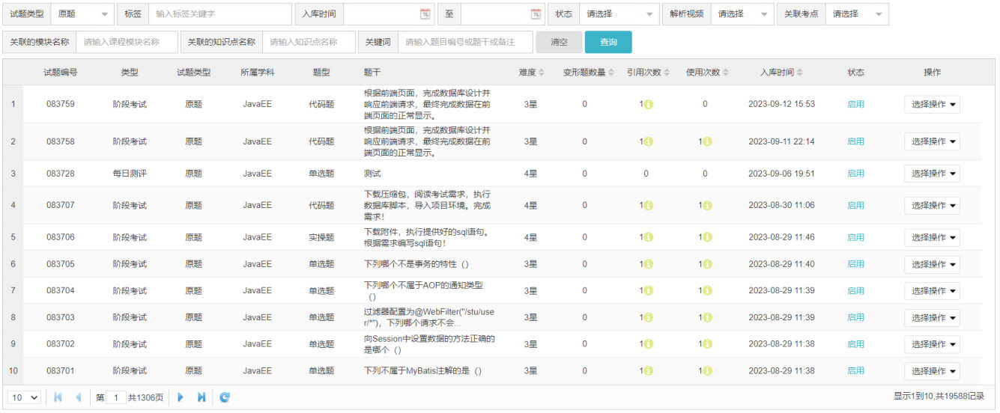

上一篇 [45 篇](/posts/编程学习/javaweb学习笔记/45-dml数据的新增修改删除/)做的是 DML——往表里**加、改、删**数据；从这一篇开始进入 **DQL**，也就是"把数据**查**出来"。企业开发里 Dao 层的大部分方法干的都是这件事，所以 DQL 是 SQL 里用得最多、也最需要写到滚瓜烂熟的一部分。

这一篇对应 PPT 第 47-55 页，覆盖 DQL 的**前两段**：查哪些字段（基本查询）、按什么条件筛（条件查询）。后面的分组与排序分页分别在第 [47](/posts/编程学习/javaweb学习笔记/47-dql聚合函数与分组查询/)、[48](/posts/编程学习/javaweb学习笔记/48-dql排序与分页查询/) 篇。

本机实测环境：MySQL 9.0.1（课程用的是 8.0.34），测试库 `db01`、表 `emp`（课程资料里那份 30 条员工数据，采用水浒人物，其中"李云"这条的 `job`、`salary` 都是 `NULL`）。笔记里标"实测"的输出都是真的跑出来的。

## DQL 是什么（PPT 第 47-48 页）

PPT 第 48 页的原文定义：

> **DQL 英文全称是 Data Query Language（数据查询语言），用来查询数据库表中的记录。关键字：SELECT。**

对照一下 [41 篇](/posts/编程学习/javaweb学习笔记/41-sql分类与数据库操作/)里那张 SQL 四大分类表：DDL 管结构、DML 管数据、**DQL 管查询**、DCL 管权限。四类里 DQL 只有一句 `select` 开头，但它能做的事最多——PPT 第 48 页在图旁边摆了三个词：

**查询条件、排序、分页展示**。

这三个词说的就是"后台页面里的那张表是怎么来的"：用户在页面上勾条件、点表头排序、翻页——后端每一次都要翻译成一条 `select`。PPT 第 48 页的那张图就是一个典型的管理后台：


*图：PPT 第 48 页——题库管理页面。上方一排是"查询条件"（题型、标签、入库时间、状态、解析视频、关联考点、关键词），中间是结果表格，右下角是分页（"第 1 共 1306 页"），表格的表头还能点击排序——页面上这三件事，落到数据库端就是 `where`、`order by`、`limit`*

所以第 46-48 篇是按这三件事排的，先分好工再动手：

| 本篇 / 后续 | 讲 DQL 的哪一部分 | 对应 PPT 页 |
| --- | --- | --- |
| **46（本篇）** | 查哪些字段（**基本查询**）+ 按什么条件筛（**条件查询**） | 47-55 |
| [47](/posts/编程学习/javaweb学习笔记/47-dql聚合函数与分组查询/) | 统计与分组（**聚合函数、group by、having**） | 56-61 |
| [48](/posts/编程学习/javaweb学习笔记/48-dql排序与分页查询/) | 排序与翻页（**order by、limit**） | 62-67 |

## 完整的 DQL 语法结构（PPT 第 49 页）

PPT 第 49 页给的是一份**完整的**语法骨架——注意，它一次列出了七段，本篇只讲其中前三段：

```sql
select
    字段列表
from
    表名列表
where
    条件列表
group by
    分组字段列表
having
    分组后条件列表
order by
    排序字段列表
limit
    分页参数
```

同一页把 DQL 分成五类查询，正好和上面的七段对上：

| 分类（PPT 第 49 页） | 写法 | 本篇位置 |
| --- | --- | --- |
| **基本查询** | `select ... from ...` | 本篇（第 51-52 页） |
| **条件查询** | `where ...` | 本篇（第 54-55 页） |
| **分组查询** | `group by ...`、`having ...` | [47 篇](/posts/编程学习/javaweb学习笔记/47-dql聚合函数与分组查询/) |
| **排序查询** | `order by ...` | [48 篇](/posts/编程学习/javaweb学习笔记/48-dql排序与分页查询/) |
| **分页查询** | `limit ...` | [48 篇](/posts/编程学习/javaweb学习笔记/48-dql排序与分页查询/) |

把七段逐个拆开，各自的分工是这样的（表格里加粗的是本篇要写熟练的两段）：

| 段 | 写什么 | 一句话作用 | 属于 |
| --- | --- | --- | --- |
| `select` | 字段列表 | **要查哪几列**（也决定结果里显示什么） | 基本查询 |
| `from` | 表名列表 | **从哪张表查**（多表查询是后面的章节） | 基本查询 |
| `where` | 条件列表 | **筛掉哪些行**（分组前的过滤） | 条件查询 |
| `group by` | 分组字段列表 | 按某个字段把行**分组** | 分组查询 |
| `having` | 分组后条件列表 | 对**分组后的结果**再过滤 | 分组查询 |
| `order by` | 排序字段列表 | 结果**按什么排**（升/降序） | 排序查询 |
| `limit` | 分页参数 | 只取结果里的**第几条到第几条** | 分页查询 |

> [!IMPORTANT]
> 这七段里，**只有 `select` 和 `from` 是一定要写的**，其余五段都是"按需添加"。比如只查全表就是 `select * from emp;`；要筛条件就往后接 `where`；要分组再接 `group by`……但**写的顺序必须按上表这个固定顺序**，不能把 `where` 写到 `from` 前面。
>
> 还有一件事现在先埋个伏笔：[48 篇](/posts/编程学习/javaweb学习笔记/48-dql排序与分页查询/)会用实测证明"**书写顺序 ≠ 执行顺序**"（数据库实际是从 `from` 开始，一路走到 `limit`），这也是为什么 `where` 里用不了 `select` 里起的别名。

## 基本查询：查哪些字段（PPT 第 51-52 页）

基本查询就是"从某张表里，把某几列的数据取出来"。PPT 第 51 页给了四种写法，覆盖日常需要的全部形态：

```sql
-- 查询多个字段
select 字段1,字段2,字段3 from 表名;
-- 查询所有字段(通配符)
select * from 表名;
-- 为查询字段设置别名，as关键字可以省略
select 字段1 [as 别名1], 字段2 [as 别名2] from 表名;
-- 去除重复记录
select distinct 字段列表 from 表名;
```

同一页右下角还有一条注意（PPT 原文）：

> `*` 号代表查询所有字段，在实际开发中尽量少用（**不直观、影响效率**）。

### 1. 查询多个字段

需要哪几列就写哪几列，用逗号隔开。本机实测（只取前 3 行，方便看表头）：

> [!TIP]
> 实测（MySQL 9.0.1，库 `db01`）：
>
> ```sql
> select name, entry_date from emp limit 3;
> ```
>
> ```text
> +-----------+------------+
> | name      | entry_date |
> +-----------+------------+
> | 施耐庵    | 2000-01-01 |
> | 宋江      | 2015-01-01 |
> | 卢俊义    | 2008-05-01 |
> +-----------+------------+
> ```
>
> 结果的列顺序就是你 `select` 里写的顺序（不是建表时的顺序）。

### 2. 查询所有字段：`*` 通配符

`select * from emp;` 表示"这张表的所有列都拿出来"。它写起来最省事，但课程反复强调**开发中少用**，原因是两条：

| 原因（PPT 原文） | 说人话 |
| --- | --- |
| **不直观** | 结果里有哪些列、列都叫什么，得回头去翻表结构；`select name, salary from emp` 一眼就知道要什么 |
| **影响效率** | 把用不上的列（比如头像路径、两列时间戳、甚至大文本）也一起读出来、通过网络传给程序，白白浪费 |

课程源码里也留了对照注释——同一个需求（查所有字段）写了两种方式，第一种是**把列名一个个列出来**：

```sql
-- 方式1: 推荐
select id, username, password, name, gender, phone, job, salary, entry_date, image, create_time, update_time from emp;
-- 方式2: 不推荐
select * from emp;
```

> [!TIP]
> 自己练手、临时看数据时用 `*` 很方便（本篇后面的实测为了少贴几列，也会用它）；但**写进程序里的 SQL 要按列名写全**——列名写出来还有个额外好处：以后表里加了新字段，你的查询结果不会莫名其妙多出一列。

### 3. 为字段起别名

字段名是英文、还常常是缩写，直接显示给使用者不友好；起个别名就能让**结果集里的表头**变成中文。语法里 `as` **可以省略**：

```sql
select name as 姓名, entry_date as 入职日期 from emp;

select name 姓名, entry_date 入职日期 from emp;
```

本机实测（两条等价，表头都是中文）：

> [!TIP]
> 实测（MySQL 9.0.1，库 `db01`）：
>
> ```sql
> select name 姓名, entry_date 入职日期 from emp limit 3;
> ```
>
> ```text
> +-----------+--------------+
> | 姓名      | 入职日期     |
> +-----------+--------------+
> | 施耐庵    | 2000-01-01   |
> | 宋江      | 2015-01-01   |
> | 卢俊义    | 2008-05-01   |
> +-----------+--------------+
> ```
>
> 注意别名**只影响结果集的表头**，不影响原表结构——表里的列名还是 `name`、`entry_date`。

### 4. 去除重复记录：`distinct`

`distinct` 加在字段列表前面，把**完全相同的行**合并成一行。典型场景是"看看这张表里出现了哪几个值"：

```sql
select distinct job from emp;
```

本机实测（结果 6 行）：

> [!TIP]
> 实测（MySQL 9.0.1，库 `db01`）：
>
> ```sql
> select distinct job from emp;
> ```
>
> ```text
> +------+
> | job  |
> +------+
> |    4 |
> |    2 |
> |    3 |
> |    1 |
> |    5 |
> | NULL |
> +------+
> ```
>
> `emp` 表里 30 条数据只涉及 6 种职位：教研主管 4、讲师 2、学工主管 3、班主任 1、咨询师 5，以及**一行 `NULL`**——李云这条数据没填职位，`NULL` 在去重时**自己算一种值**（这一点的"另一半"在 [47 篇](/posts/编程学习/javaweb学习笔记/47-dql聚合函数与分组查询/)：`NULL` 不参与聚合函数运算，`count(job)` 会少 1）。

> [!WARNING]
> `distinct` 作用在**整张字段列表**上，不是只作用于它紧跟的那一列。`select distinct job, salary from emp;` 的意思是"`job` 和 `salary` **组合起来**不重复"，而不是"职位去重、薪资并列显示"（后者要用分组查询，见 [47 篇](/posts/编程学习/javaweb学习笔记/47-dql聚合函数与分组查询/)）。

### 必答问答（PPT 第 52 页）

PPT 第 52 页的三问三答，答案都在上面的写法里：

| 问题 | 答案 |
| --- | --- |
| 基本查询语法是什么？ | `select 字段列表 from 表名` |
| 如何为查询返回的字段设置别名？ | 字段名后面跟 `[as] 别名`（`as` 可以省略） |
| 如何去除查询返回的重复记录？ | 在字段列表前加 `distinct` |

## 条件查询：按什么条件筛（PPT 第 54-55 页）

基本查询是"全都要"，条件查询是"只要满足条件的那些行"。语法就是在基本查询后面接一个 `where`：

```sql
select 字段列表 from 表名 where 条件列表;
```

`where` 后面的"条件列表"是由**运算符 + 字段 + 值**拼出来的。PPT 第 54 页把可用运算符分成两张表，一张比较、一张逻辑。

### 比较运算符（PPT 第 54 页）

| 比较运算符 | 功能 |
| --- | --- |
| `>` | 大于 |
| `>=` | 大于等于 |
| `<` | 小于 |
| `<=` | 小于等于 |
| `=` | 等于 |
| `<>` 或 `!=` | 不等于 |
| `between ... and ...` | 在某个范围之内（**含最小、最大值**） |
| `in(...)` | 在 in 之后的列表中的值，**多选一** |
| `like 占位符` | 模糊匹配（`_` 匹配单个字符，`%` 匹配任意个字符） |
| `is null` | 是 null |

### 逻辑运算符（PPT 第 54 页）

| 逻辑运算符 | 功能 |
| --- | --- |
| `and` 或 `&&` | 并且（多个条件同时成立） |
| `or` 或 `\|\|` | 或者（多个条件任意一个成立） |
| `not` 或 `!` | 非，不是 |

> [!TIP]
> 符号写法（`&&`、`\|\|`、`!`）和单词写法（`and`、`or`、`not`）等价，但**建议写单词**——可读性好，也不容易因为转义或手滑出错。下面统一用单词写法。

### 逐条演示（全部本机实测）

以下所有 SQL 都在 `db01.emp`（30 条数据）上跑过，写在笔记里的结果都是实际输出。

**① 等值比较 `=`**——查姓名为"柴进"的员工：

> [!TIP]
> 实测（MySQL 9.0.1，库 `db01`）：
>
> ```sql
> select * from emp where name = '柴进';
> ```
>
> 结果 **1 行**（`id` 为 7 的那条）。对比一下，如果写的是 `where name = '柴'`（少一个字），结果是 **0 行**——字符串的 `=` 是**完全相等**，不是模糊匹配。
>
> ```text
> +----+----------+----------+--------+--------+-------------+------+--------+-------+------------+---------------------+---------------------+
> | id | username | password | name   | gender | phone       | job  | salary | image | entry_date | create_time         | update_time         |
> +----+----------+----------+--------+--------+-------------+------+--------+-------+------------+---------------------+---------------------+
> |  7 | chaijin  | 123456   | 柴进   |      1 | 13309090007 |    1 |   4700 | 7.jpg | 2005-08-01 | 2024-04-11 16:35:33 | 2024-04-11 16:35:47 |
> +----+----------+----------+--------+--------+-------------+------+--------+-------+------------+---------------------+---------------------+
> ```

**② 大小比较 `<=`**——查薪资小于等于 5000 的员工（只看姓名和薪资）：

> [!TIP]
> 实测（MySQL 9.0.1，库 `db01`）：
>
> ```sql
> select name, salary from emp where salary <= 5000;
> ```
>
> ```text
> +--------+--------+
> | name   | salary |
> +--------+--------+
> | 柴进   |   4700 |
> | 李逵   |   4800 |
> | 武松   |   4900 |
> | 林冲   |   5000 |
> | 童威   |   5000 |
> | 童猛   |   4800 |
> | 李忠   |   5000 |
> +--------+--------+
> ```
>
> 共 **7 行**。三个 5000 都在结果里——说明 `<=` 是**包含边界**的。

**③ 不等于 `<>` 与 `!=`**——查密码不是 `123456` 的员工：

```sql
select * from emp where password != '123456';
select * from emp where password <> '123456';
```

实测两条结果一样，都是 **1 行**（李应，密码 `12345678`）。

**④ 范围 `between ... and ...`**——查入职日期在 `2000-01-01` 到 `2010-01-01` 之间的员工：

> [!TIP]
> 实测（MySQL 9.0.1，库 `db01`）：
>
> ```sql
> select count(*) from emp where entry_date between '2000-01-01' and '2010-01-01';
> ```
>
> ```text
> +----------+
> | count(*) |
> +----------+
> |       13 |
> +----------+
> ```
>
> 共 **13 行**。两头都验证过是**含在结果里**的：最早那条是"施耐庵"（`entry_date` 正好是 `2000-01-01`），最晚那条里有"鲁智深"（正好是 `2010-01-01`）。
>
> 另外 `between` 的**两个值不能写反**：如果写成 `between '2010-01-01' and '2000-01-01'`（小的在后），MySQL 不会报错，但结果一定是 0 行。

**⑤ 多选一 `in(...)`**——查职位是 2、3、4 的员工：

```sql
-- 用 or 串起来（长）
select * from emp where job = 2 or job = 3 or job = 4;
-- 用 in 一步到位（PPT 推荐的写法）
select * from emp where job in (2, 3, 4);
```

本机实测：`where job in (1, 2, 3)` 得到 **19 行**（职位为 1 的 6 人、为 2 的 12 人、为 3 的 1 人）。`in` 的效果等价于一串 `or`，但写起来短得多，字段名也不用重复敲。

**⑥ 模糊匹配 `like`**——`%` 匹配任意个字符（包括 0 个），`_` 匹配**恰好一个**字符：

> [!TIP]
> 实测（MySQL 9.0.1，库 `db01`）：
>
> ```sql
> select name from emp where name like '阮%';
> select name from emp where name like '_俊';
> ```
>
> ```text
> -- like '阮%'  → 4 行：阮小二、阮小五、阮小七、阮籍
> +-----------+
> | name      |
> +-----------+
> | 阮小二    |
> | 阮小五    |
> | 阮小七    |
> | 阮籍      |
> +-----------+
>
> -- like '_俊'  → 1 行：李俊
> +--------+
> | name   |
> +--------+
> | 李俊   |
> +--------+
> ```
>
> `'阮%'` 是"以阮开头、后面随便几个字"；`'_俊'` 是"**恰好两个字、第二个字是俊**"。如果把 `_` 换成 `%` 写 `'%俊%'`，凡是名字里带"俊"的都算（在当前数据里结果仍是李俊，但含义已经变成"包含"）。

**⑦ 判空 `is null` / `is not null`**——查没有分配职位的员工：

> [!TIP]
> 实测（MySQL 9.0.1，库 `db01`）：
>
> ```sql
> select id, name, job from emp where job is null;
> ```
>
> ```text
> +----+--------+------+
> | id | name   | job  |
> +----+--------+------+
> | 30 | 李云   | NULL |
> +----+--------+------+
> ```
>
> 结果 **1 行**（李云）。注意这里**不能写成 `where job = null`**——`NULL` 表示"值未知"，它和任何值（包括另一个 `NULL`）做 `=` 比较的结果都不是"真"，`= null` 查出来是 0 行，且不报错（这一点是 SQL 里最容易踩的坑之一）。想查"有职位"的用 `job is not null`。

**⑧ 逻辑运算符组合条件**——`and` 让多个条件同时成立、`or` 只要有一个成立、`not` 取反：

```sql
-- 入职日期在 2000-01-01 到 2010-01-01 之间，且性别为女（2 表示女）
select * from emp where entry_date between '2000-01-01' and '2010-01-01' and gender = 2;
```

实测结果 **1 行**：顾大嫂（`2008-01-01`，性别 2）。课程源码里还给这段条件加了括号的等价写法：

```sql
select * from emp where (entry_date between '2000-01-01' and '2010-01-01') and gender = 2;
```

> [!WARNING]
> `and` 和 `or` 混用时**建议用括号把条件分组**。SQL 里 `and` 的优先级高于 `or`，`a or b and c` 会被解释成 `a or (b and c)`——多数时候这不是你以为的意思。括号不但能保证语义，也让读的人一眼看清条件怎么组合。

### 必答问答（PPT 第 55 页）

| 问题 | 答案 |
| --- | --- |
| 如何进行 null 值的判断？ | `is null`、`is not null`（**不能用 `= null`**） |
| 模糊匹配中的通配符？ | `%` 匹配任意个字符、`_` 匹配一个字符 |
| 如何组装多个查询条件？ | 用 `and` / `or`（配合括号分组） |

## 小结

| 问题 | 答案 |
| --- | --- |
| DQL 是什么 | **Data Query Language（数据查询语言）**，用来查询数据库表中的记录，关键字是 **SELECT** |
| 完整的 DQL 有哪七段 | `select` 字段列表 / `from` 表名 / `where` 条件 / `group by` 分组字段 / `having` 分组后条件 / `order by` 排序字段 / `limit` 分页参数（**只有 `select`、`from` 必写**，书写顺序固定） |
| 五类查询分别是谁 | 基本查询（select...from）、条件查询（where）、分组查询（group by/having）、排序查询（order by）、分页查询（limit） |
| 基本查询四种写法 | 查多个字段 `select 字段1,字段2 from 表`；查全部 `select * from 表`；别名 `select 字段 [as] 别名 from 表`；去重 `select distinct 字段 from 表` |
| 为什么少用 `*` | **不直观**（要什么列看不出来）、**影响效率**（读了用不上的列，结果列还会随表结构变化） |
| `distinct` 的作用范围 | 作用在**整个字段列表**上，是"组合去重"；`NULL` 也算一种值会被保留（实测 `select distinct job from emp` 得到 6 行，最后一行是 `NULL`） |
| 条件查询的运算符 | 比较运算符 `> >= < <= = <>`（`!=`）`between...and`、`in(...)`、`like`、`is null`；逻辑运算符 `and`、`or`、`not` |
| 三个容易踩的坑 | ① `between a and b` **含两端**且不能写反（实测 13 行，含 2000-01-01 与 2010-01-01 两条边界）；② 判空只能用 `is null`，`= null` 查不到；③ `and` 优先级高于 `or`，混用要加括号 |
| 实测的几条数 | `where salary <= 5000` → **7 行**；`where job is null` → **1 行**（李云）；`where password != '123456'` → **1 行**（李应）；`where job in (1,2,3)` → **19 行**；`where name like '阮%'` → **4 行**；`where name like '_俊'` → **1 行**（李俊） |
| 本机环境 | MySQL **9.0.1**（课程用 8.0.34），库 `db01`、表 `emp`（30 条数据，其中 1 条的 `job`、`salary` 为 `NULL`） |

## 相关

- [上一篇：DML数据的新增修改删除](/posts/编程学习/javaweb学习笔记/45-dml数据的新增修改删除/)
- [下一篇：DQL聚合函数与分组查询](/posts/编程学习/javaweb学习笔记/47-dql聚合函数与分组查询/)

## 练习题

### 一、知识回顾（读完直接做下面的实践题）

1. **DQL** 是 **Data Query Language（数据查询语言）**，用来**查询数据库表中的记录**，关键字是 **`select`**；PPT 用三个词概括它的典型用途：**查询条件、排序、分页展示**
2. **完整的 DQL 七段**：`select` 字段列表 → `from` 表名 → `where` 条件 → `group by` 分组字段 → `having` 分组后条件 → `order by` 排序字段 → `limit` 分页参数；**只有 `select`、`from` 必须写**，其余按需追加，**顺序不能改**
3. **五类查询**：基本查询（`select...from`）、条件查询（`where`）、分组查询（`group by`/`having`）、排序查询（`order by`）、分页查询（`limit`）——本篇讲前两类
4. **基本查询四种写法**：查多列 `select 字段1, 字段2 from 表名;`；查全部 `select * from 表名;`；取别名 `select 字段 [as] 别名 from 表名;`（`as` 可省）；去重 `select distinct 字段列表 from 表名;`
5. **`*` 要少用**：PPT 原话是"**不直观、影响效率**"——不直观是看不出查了哪些列，影响效率是把用不上的列也读了、传了
6. **别名只改表头**：实测 `select name 姓名, entry_date 入职日期 from emp limit 3;` 的表头就是"姓名、入职日期"，原表结构不变
7. **`distinct` 是组合去重**：作用在整个字段列表上；实测 `select distinct job from emp;` 得到 **6 行**（4/2/3/1/5 和一行 **NULL**）——`NULL` 也算一种取值
8. **条件查询语法**：`select 字段列表 from 表名 where 条件列表;`；比较运算符有 `>`、`>=`、`<`、`<=`、`=`、`<>`（或 `!=`）、**`between ... and ...`（含两端）**、`in(...)`（多选一）、`like`（`_` 一个字符、`%` 任意个字符）、`is null`；逻辑运算符有 `and`（`&&`）、`or`（`||`）、`not`（`!`）
9. **三个坑**：`between a and b` 两端都包含且 `a` 不能大于 `b`；判空只能 `is null`（`= null` 永远查不到）；`and` 优先级高于 `or`，混用时加括号
10. **本篇实测关键结果**：`salary <= 5000` → **7 行**；`job is null` → **1 行**（李云）；`password != '123456'` → **1 行**（李应）；`entry_date between '2000-01-01' and '2010-01-01'` → **13 行**（含施耐庵、鲁智深两条边界）；`job in (1,2,3)` → **19 行**；`name like '阮%'` → **4 行**；`name like '_俊'` → **1 行**（李俊）

### 二、裸写题

- [ ] **2-1 只看需要的两列，并改成中文表头**
  查出所有员工的**姓名**和**入职日期**两列，要求结果里的表头显示成"姓名"和"入职日期"。
  （练习文件 `test_46_基本查询.sql` 里给了题目注释和写作区。）

  > [!TIP]- 提示（先自己想，实在想不出再点开）
  > **一级 · 思路**：先决定"查哪几列"（这一部分靠 `select`），再决定"表头长什么样"（靠别名）
  > **二级 · 方法**：`select 字段1, 字段2 from 表名;`；别名写在字段名后面，`as` 可省略：`字段名 [as] 别名`
  > **三级 · 骨架**：`select name ____, entry_date ____ from emp;`

  > [!TIP]- 参考答案（做完再点开）
  > ```sql
  > select name 姓名, entry_date 入职日期 from emp;
  > -- 等价写法（不省 as）
  > select name as 姓名, entry_date as 入职日期 from emp;
  > ```
  > 本机实测表头确实变成中文（取前 3 行）：
  > ```text
  > +-----------+--------------+
  > | 姓名      | 入职日期     |
  > +-----------+--------------+
  > | 施耐庵    | 2000-01-01   |
  > | 宋江      | 2015-01-01   |
  > | 卢俊义    | 2008-05-01   |
  > +-----------+--------------+
  > ```
  > 别名是给**结果集**看的，表里的列名没变；另外表头的顺序就是你 `select` 里写的顺序。

- [ ] **2-2 看看公司一共有哪几种职位**
  查出 `emp` 表里出现过的所有职位（同一种只显示一次）。

  > [!TIP]- 提示（先自己想，实在想不出再点开）
  > **一级 · 思路**：这是"一列里有哪些不同的值"的问题——重复的要去掉
  > **二级 · 方法**：在字段列表前加关键字 `distinct`
  > **三级 · 骨架**：`select distinct ____ from emp;`

  > [!TIP]- 参考答案（做完再点开）
  > ```sql
  > select distinct job from emp;
  > ```
  > 本机实测得到 **6 行**：
  > ```text
  > +------+
  > | job  |
  > +------+
  > |    4 |
  > |    2 |
  > |    3 |
  > |    1 |
  > |    5 |
  > | NULL |
  > +------+
  > ```
  > 除了 1-5 五种职位，最后还有一行 **`NULL`**——李云这条数据没填职位，`distinct` 把 `NULL` 也当成一种值保留下来。想更直观可以把职位名也映射出来（那是"表关联"的内容，本章后面才讲），现在先记住这个"5 种 + 1 个空"的结果。

- [ ] **2-3 薪资筛选：先挑低薪，再挑一个区间**
  （1）查出薪资**小于等于 5000** 的员工姓名和薪资；
  （2）查出薪资在 **8000 到 11000 之间（含两端）** 的员工姓名和薪资。

  > [!TIP]- 提示（先自己想，实在想不出再点开）
  > **一级 · 思路**：两小题都是"按数值范围筛行"，用条件查询；第 2 小题的"区间"有一个专门的运算符，比写两个大小条件更省事（第 1 小题的边界是"包含"的）
  > **二级 · 方法**：`where 字段 比较运算符 值`；区间用 `between 最小值 and 最大值`（**含两端**）；小于等于是 `<=`
  > **三级 · 骨架**：`select name, salary from emp where salary ____ 5000;` / `... where salary ____ 8000 ____ 11000;`

  > [!TIP]- 参考答案（做完再点开）
  > ```sql
  > -- (1)
  > select name, salary from emp where salary <= 5000;
  > -- (2)
  > select name, salary from emp where salary between 8000 and 11000;
  > ```
  > (1) 本机实测 **7 行**：柴进 4700、李逵 4800、武松 4900、林冲 5000、童威 5000、童猛 4800、李忠 5000——三个 5000 都在结果里，说明 `<=` 包含边界。
  > ```text
  > +--------+--------+
  > | name   | salary |
  > +--------+--------+
  > | 柴进   |   4700 |
  > | 李逵   |   4800 |
  > | 武松   |   4900 |
  > | 林冲   |   5000 |
  > | 童威   |   5000 |
  > | 童猛   |   4800 |
  > | 李忠   |   5000 |
  > +--------+--------+
  > ```
  > (2) 用 `between ... and ...` 等价于 `salary >= 8000 and salary <= 11000`，写成两个条件的写法结果完全一样；注意**小的值写前面**（写反了不报错但一定是 0 行）。注意"李云"的薪资是 `NULL`，它**不会**出现在任何大小比较的结果里——`NULL` 和数字比大小既不大于、也不小于、也不等于。

- [ ] **2-4 模糊找人：姓李的、两个字的、没有职位的**
  分别查出：
  （1）所有**姓"李"**的员工（姓名以李开头）；
  （2）所有**姓名恰好两个字**的员工；
  （3）所有**没有分配职位**（职位为空）的员工。

  > [!TIP]- 提示（先自己想，实在想不出再点开）
  > **一级 · 思路**：前两小题是"按名字的形状找"，属于模糊匹配，靠两个通配符区分"任意长度"和"固定一个字符"；第 3 小题是"这一列没有值"，判空有专门的写法（**不能**用等号跟 `null` 比）
  > **二级 · 方法**：模糊匹配 `like`，其中 `%` 代表任意个字符、`_` 代表一个字符；判空用 `is null`
  > **三级 · 骨架**：`where name like '李____';` / `where name like '____';` / `where job ____ ____;`

  > [!TIP]- 参考答案（做完再点开）
  > ```sql
  > -- (1)
  > select name from emp where name like '李%';
  > -- (2)
  > select name from emp where name like '__';
  > -- (3)
  > select id, name, job from emp where job is null;
  > ```
  > (1) 本机实测 **5 行**：李逵、小李广、李应、李俊、李忠——**"小李广"也算**，因为 `%` 匹配的是"任意个字符"，`'李%'` 只要求以"李"开头。
  > (2) 本机实测 **18 行**（`like '__'` 用两个下划线，表示"恰好两个字符"；写 `'__%'` 就是"两个字以上"了）。
  > (3) 本机实测 **1 行**：
  > ```text
  > +----+--------+------+
  > | id | name   | job  |
  > +----+--------+------+
  > | 30 | 李云   | NULL |
  > +----+--------+------+
  > ```
  > 这里如果写成 `where job = null` 会**查到 0 行且不报错**——`NULL` 表示值未知，必须用 `is null` 判断；反过来"有职位"的就是 `job is not null`。

### 三、综合题

- [ ] **3-1 用一份数据把"基本查询 + 条件查询"跑一遍**
  在 `db01` 库的 `emp` 表（30 条数据）上，按下面的顺序做一次完整的"员工信息速查"，每做完一步把**结果行数**记下来：
  1. **先看清手里有什么**：把 `emp` 表的所有字段、所有记录查出来看一眼，数一下一共几列、几行；
  2. **只看需要的列**：查出所有员工的姓名和薪资，要求表头是中文（"姓名""薪资"）；
  3. **盘点职位种类**：查出这张表里一共出现了哪几种职位（同一种只出现一次）；
  4. **找异常数据**：查出**没有分配职位**的员工（显示 id、姓名、职位）；
  5. **多条件组合**：查出**薪资高于 5000 的班主任**（职位 1 就是班主任，注意是"高于"不是"高于等于"）；
  6. **区间 + 性别**：查出**入职日期在 2000-01-01 到 2010-01-01 之间（含两端）且性别为女**的员工（性别 2 表示女）；
  7. **模糊匹配**：查出**姓名里带"二"字**的所有员工；
  8. **对比一问**：把第 5 步的"高于 5000"改成"高于等于 5000"，两次结果差几行？差的是谁？
  9. 把每条 SQL 和它返回的行数一起抄到练习文件里，对照本笔记的实测结论核对。

  **涉及知识点**

  | 知识点 | 在这里的应用 |
  | --- | --- |
  | 基本查询 | 第 1、2 步——`select 字段列表 from 表`，第 1 步用通配符看全貌，第 2 步只取要的列并起别名 |
  | 去重 | 第 3 步——`distinct` 看"职位有几种"（记得会多出一行 `NULL`） |
  | 判空 | 第 4 步——`is null`（不能用 `= null`） |
  | 比较 + 逻辑运算符 | 第 5 步——`>` 与 `and` 组合 |
  | 范围查询 | 第 6 步——`between ... and ...`（含两端）再 `and` 性别条件 |
  | 模糊匹配 | 第 7 步——`like '%二%'` |

  > [!TIP]- 提示（先自己想，实在想不出再点开）
  > **一级 · 思路**：这一题就是把本篇的写法按"先看全表 → 再取列 → 再筛行"的顺序排了一遍；每一步只加一个知识点，卡住时先想"这一步是在决定列，还是在筛行"
  > **二级 · 方法**：看全貌用 `select *`；取列 + 别名用 `字段名 别名`；去重用 `distinct`；筛行用 `where`，其中判空 `is null`、区间 `between ... and ...`、包含 `like '%关键字%'`；多个条件用 `and` 连接
  > **三级 · 骨架**：`select id, name, job from emp where job ____ ____;`（第 4 步）/ `... where job = 1 and salary ____ 5000;`（第 5 步）/ `... where entry_date ____ '2000-01-01' ____ '2010-01-01' and gender = 2;`（第 6 步）

  > [!TIP]- 参考答案（做完再点开）
  > ```sql
  > -- 1. 看全貌（本机实测：12 列 30 行）
  > select * from emp;
  >
  > -- 2. 只取两列并起别名
  > select name 姓名, salary 薪资 from emp;
  >
  > -- 3. 职位有几种（本机实测：6 行，含一行 NULL）
  > select distinct job from emp;
  >
  > -- 4. 没有职位的员工（本机实测：1 行，李云）
  > select id, name, job from emp where job is null;
  >
  > -- 5. 薪资高于 5000 的班主任（本机实测：2 行，杨志 5300、李应 5800）
  > select name, job, salary from emp where job = 1 and salary > 5000;
  >
  > -- 6. 区间内且为女（本机实测：1 行，顾大嫂 2008-01-01）
  > select name, gender, entry_date from emp where entry_date between '2000-01-01' and '2010-01-01' and gender = 2;
  >
  > -- 7. 姓名里带"二"（本机实测：2 行，阮小二、孙二娘）
  > select name from emp where name like '%二%';
  > ```
  > 几条要留意的实测结论：
  > 1. 第 1 步是 **12 列 30 行**——`emp` 的字段依次是 id、username、password、name、gender、phone、job、salary、image、entry_date、create_time、update_time；
  > 2. 第 4 步只有 **1 行**（李云），他同时也是 `salary` 为 `NULL` 的那条；
  > 3. 第 5 步只有 **2 行**：杨志 5300、李应 5800。林冲的薪资正好是 5000，用 `>` 时**不算**（第 8 步的答案就在这——换成 `>=` 会变成 3 行，多出来的那 1 行就是林冲）——"高于/高于等于"在 SQL 里是两个不同的写法，需求描述里的字眼要看清；
  > 4. 第 6 步**只有 1 行**：三个人（扈三娘、孙二娘、顾大嫂）里只有顾大嫂的入职日期落在区间内；
  > 5. 第 7 步是 **2 行**：`'%二%'` 两头的 `%` 都得写，只写一边就变成"以二开头/以二结尾"了。
